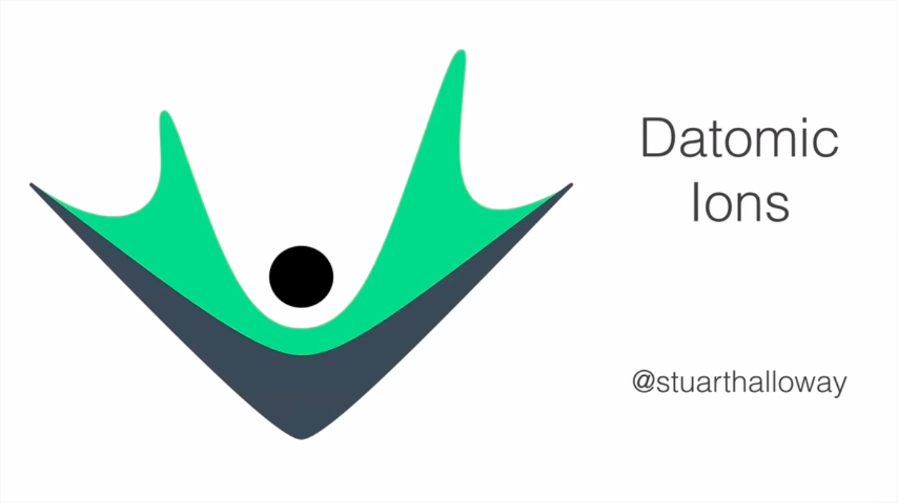
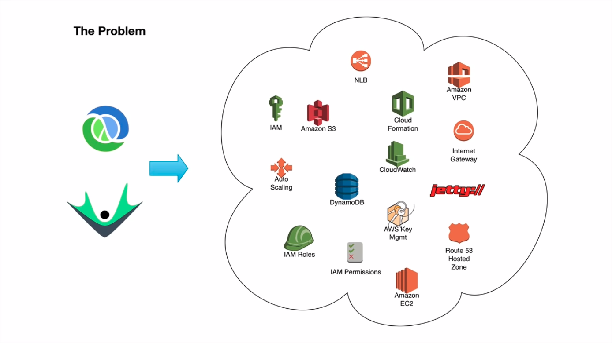
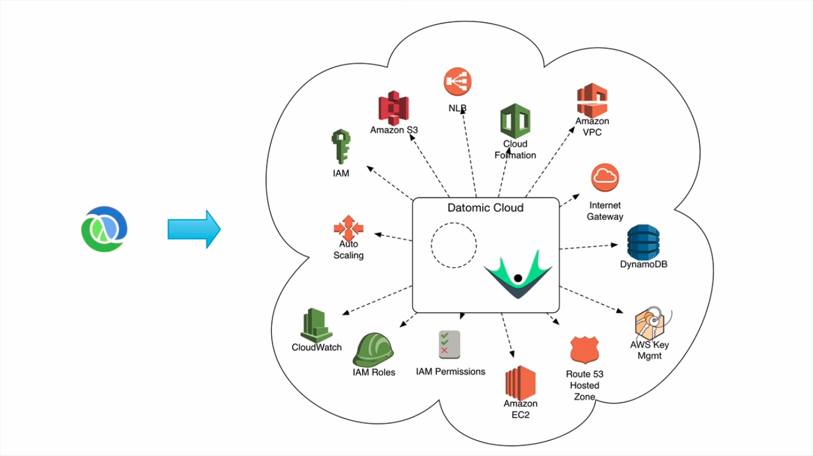
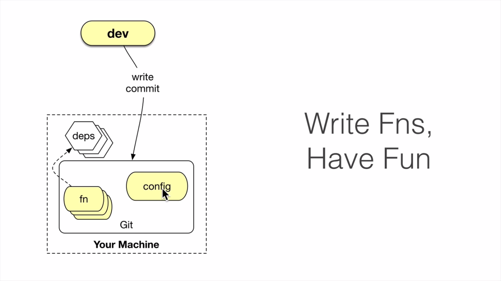
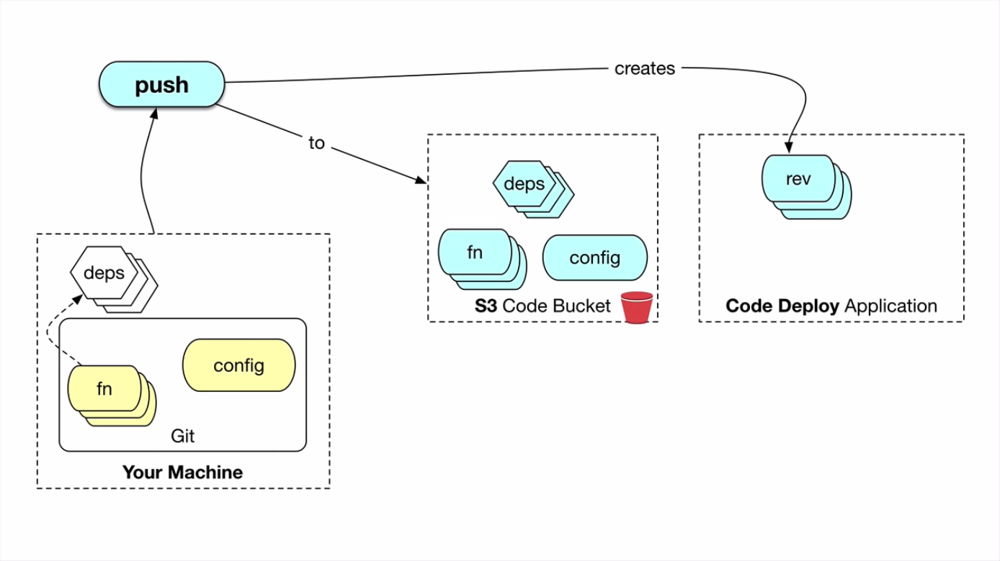
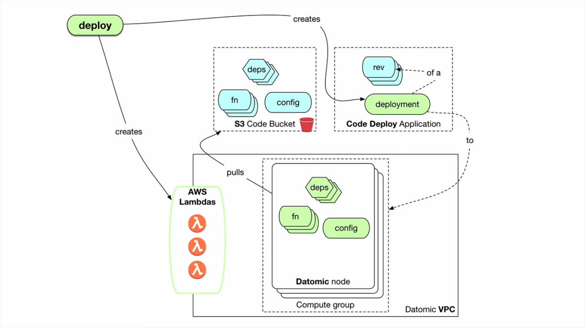
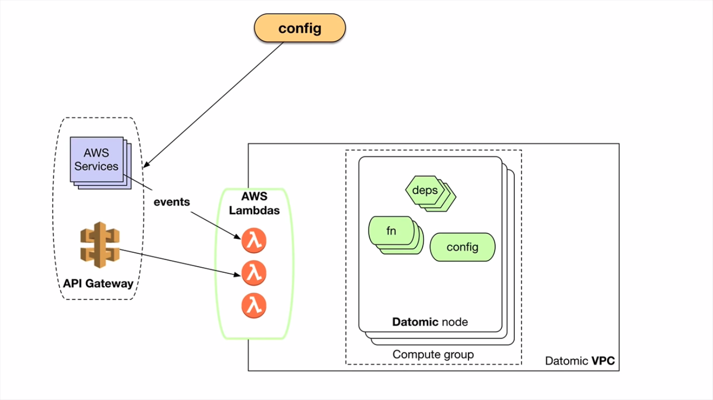
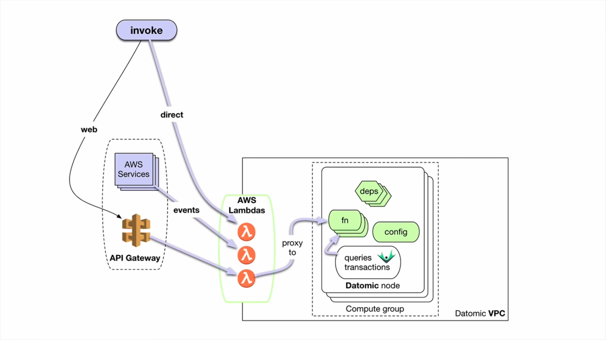
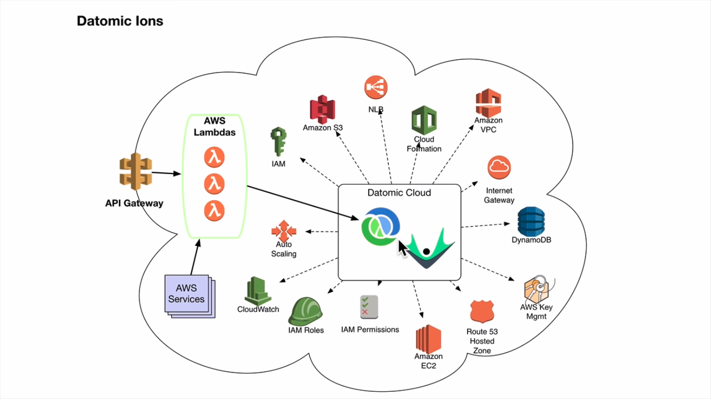
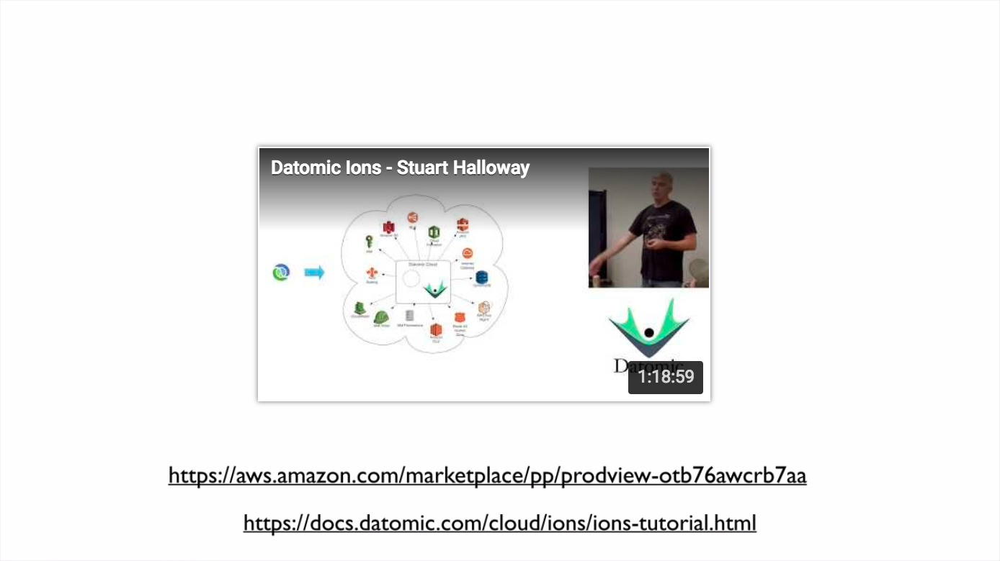

# Datomic Ions in Seven Minutes

* **Speaker: Stuart Halloway**
* **Date: July 2018**
* **Video: [https://www.youtube.com/watch?v=TbthtdBw93w](https://www.youtube.com/embed/TbthtdBw93w?autoplay=1&feature=oembed&wmode=opaque)**

00:01 Hi, this is Stuart Halloway. Welcome to Datomic Ions in Seven Minutes.

You want to run a database-backed Clojure application on Amazon Web Services. Great. AWS has a rich suite of capabilities to help you. There are tools for security, connectivity, availability, scalability, and durability. But there are many tools and many APIs. In short, AWS gives you great power and with great power comes a ton of work that doesn't feel like programming. Assembling all the AWS tools into a well-architected application can require a lot of expertise, and many of your accustomed tools were made to run in data centers; they are a misfit for the cloud due to their presumptions about storage, lack of integration with auto scaling, and so on.

00:47 Datomic Cloud is made to run on AWS, and is fully integrated with many AWS services. Datomic runs securely in an AWS Virtual Private Cloud, and uses AWS IAM to manage access, and encrypts data at rest with the AWS Key Management Service. Datomic manages all AWS networking routes and security groups for you, providing a simple connection end-point. Datomic integrates with a network load-balancer and AWS autoscaling to ensure availability and scale. And Datomic manages a multi-level, durability-in-cache strategy using DynamoDB, S3, AWS Elastic File System, and instance SSDs. And deploying all this is easy. Sign up for Datomic on the AWS Marketplace, launch a cloud formation template and be ready to go in minutes.

01:36 So Datomic Cloud has all these great characteristics, and solves the database on AWS problem. But what about your Clojure app? Providing these same things: Deployment, security, connectivity, availability, and elastic scaling, for your application can be daunting. With Datomic Ions, you can run your Clojure app entirely inside the nodes running Datomic Cloud.

How do you develop Ions? Exactly as you would develop ordinary Clojure functions. Each Ion is a function that does one job, like transaction or query helpers, AWS event handlers, or a web service. Your application is a set of Ions and their supporting libraries. Running a REPL on your local machine, you interactively develop and test these functions. Need some supporting libs along the way? Use Clojure's tools.deps library to declare your dependencies using Maven and/or Git. And then you do one little additional thing, you create a config file that says which of your functions to expose as Ions.

02:32 Now you are ready to create a revision. The Ion Push operation captures a moment in time in the development of your application and gives that moment a name. For development, this can be a throwaway name like, "Stu's Hair-brained Experiment." And for production, this will be a strong name, that is a Git commit SHA. Push understands Clojure's tools.deps and it copies your code and dependencies to S3. It also understands AWS CodeDeploy, which is Amazon's tool for rapid, no-downtime deployments. So each Push targets a CodeDeploy application and creates a distinct identity in CodeDeploy called an application revision or rev. Starting Datomic Cloud automatically creates CodeDeploy applications for you, and in your Ion config file, you just name the CodeDeploy application that is associated with the compute group or groups where you want your app to run.

03:21 How do I run my application? To run your code, you deploy an application revision to a Datomic Cloud compute group. When you deploy, two major things happen: A CodeDeploy deployment and optionally, an AWS Lambda deployment. Deploy creates a CodeDeploy deployment that associates a "what" with the "where." The what is the revision of your application that you created with Push, and the where is a Datomic Cloud compute group. CodeDeploy notifies a CodeDeploy agent on each EC2 instance that it needs the new revision. The instance pulls the new code, enhances the Java classpath and restarts the Datomic process.

03:58 CodeDeploy has a couple of great characteristics. CodeDeploy is rolling. CodeDeploy deploys one machine at a time behind the load balancer. And CodeDeploy is fast because it cycles processes on an instance instead of cycling instances themselves. The second optional part of deploy deals with AWS Lambda. When you configure an Ion app, you can name some Clojure functions to be exposed via AWS Lambdas. If you choose this, the deploy step will create a Lambda per exposed function. More on these in a minute. The Push and Deploy operations are fast enough for interactive development. You can do an entire Push/Deploy cycle in under a minute.

04:36 How do I architect my application? Specifically, what choices do I have for connecting to the rest of the broader AWS ecosystem? The two primary techniques are handling events through AWS Lambda and servicing the web through the API gateway. Lambdas are the connective tissue of AWS. AWS supports a large and always growing set of services that are Lambda event sources. You can configure Lambdas to fire when something is stored in an S3 bucket or when an instance is started by an auto scaling group when data is processed by Kinesis and so on. To service these events, you can go to each AWS service and select the Ion-generated Lambda as an event target.

05:14 To expose a web service, you can configure the AWS API gateway to forward web traffic from the Internet to an Ion-generated Lambda, letting the gateway deal with the complexities of traffic management, access control, and monitoring. The Ion support library includes a function, Ionize, that will turn a ring-like handler into an API gateway compatible handler, allowing you to implement web services as idiomatic Clojure. And notice that AWS Lambda is being used for integration, not computation. The Lambdas are just thin proxies to Clojure code running on Datomic Cloud as we'll see next.

05:48 What happens at runtime? There are four ways your Ions can be invoked at runtime. First, Ions provide extension points inside Datomic allowing you to provide custom functions which can be invoked directly inside queries and transactions. Second, if you have configured AWS event sources, AWS will call your Ion-generated Lambdas as events occur. Third, if you've configured API gateway, web service requests will flow through the API gateway and the Ion generated Lambda to your web handler Ion. Fourth, you can expose data-driven services directly via AWS Lambda. For example, to other applications running in the VPC. Note that when an Ion-generated Lambda is invoked, it just forwards the request to your Ion function running in the Datomic cloud cluster. No computation is being done in the Lambda runtime context. Thus, Ions access Datomic data in process at memory speeds without client-server RPC.

06:42 With Datomic Ions, you can focus on your application, you can leverage your Datomic Cloud cluster resources and data locality. You can extend Datomic transactions and queries with your own logic. You can connect to the broader AWS cloud file Lambda events and service web consumers with the API gateway. You can scale Datomic and your app together, and you can deliver on AWS with high agility.

07:08 Thanks for watching. For a longer introduction to Ions, click the video. To get started, follow the two links at the bottom to sign up for the Datomic Cloud on the AWS Marketplace and work through the Ions tutorial.

* <https://aws.amazon.com/marketplace/pp/prodview-otb76awcrb7aa>
* <https://docs.datomic.com/cloud/ions/ions-tutorial.html>
