# Debugging with the Scientific Method

* **Speaker: Stuart Halloway**
* **Conference: [Clojure/conj](http://2015.clojure-conj.org/) - November 2015**
* **Video: [https://www.youtube.com/watch?v=FihU5JxmnBg](https://www.youtube.com/watch?v=FihU5JxmnBg)**
* **Notes: [https://github.com/stuarthalloway/presentations/wiki/Debugging-with-the-Scientific-Method](https://github.com/stuarthalloway/presentations/wiki/Debugging-with-the-Scientific-Method)**

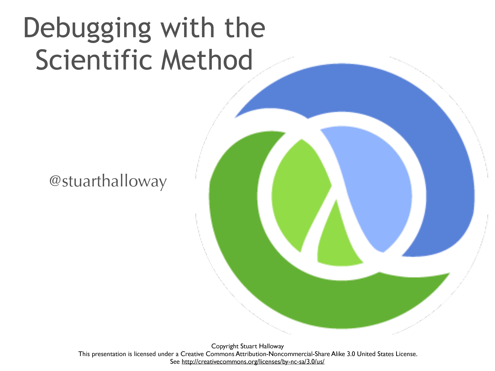

_(Applause)_

Alright, so testing two different mics here, are we all good? Alright.
So, I guess I should make a couple of clarifications on the introdution, before we begin
I'm pretty sure that Alex drew a chain of causality whereby I can say that I'm responsible for Strangeloop.
So I'm pretty excited to have discovered that, and can't wait to see my checks in the mail.

_(Laughter)_

The second thing that he implied a little bit, was that there's a lot of opportunity to watch 
debugging happening on the Product team if you work at Cognitect, and actually, you know, Datomic is 
no bugs at all, so I don't know what he's talking about there either.

_(Laughter)_

But seriously though, you know, in a Clojure audience, I really want to begin this talk with a rationale.
This is something that Rich has instilled as a value in this community, so I put a lot of effort in having 
a good rationale, or trying to, and I'm going to have actually a multi-part rationale for this talk. 

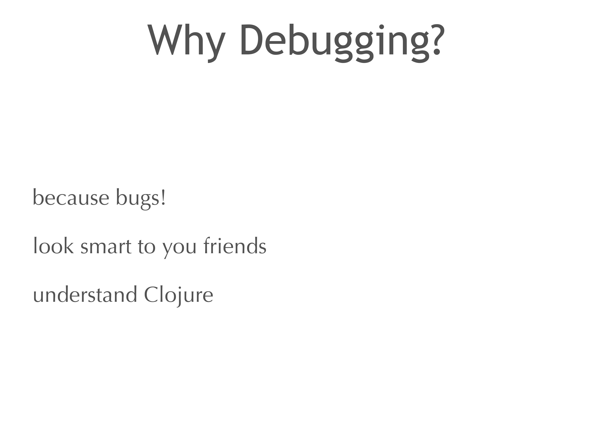

The first one is: debugging; why should we care about debugging? And I think there's an obvious reason:
because bugs. Right? We have bugs, there are some estimates that 50% or more of the cost of software development is actually tracking down the bugs later. Some of use, you know, work in environments where we 
get to run away an somebody else has to do that, so depending on what you do you might not feel that; but if 
you own something for a while, you've come to realize that.

That's pretty obvious; the second thing is that debugging is quite a straightforward activity, and so, you know, Alex used some sort of positive adjectives to described my amazing awesomeness at this - or whatever it was that he said - and the fact is, this is not something hard to do, but people think it's hard to do, and so 
you can look disproportionally smart by doing it. And I am continually intimidated by the intellect and the achievements of the people in this room: everytime I talk to somebody, they have some new area of knowledge that I didn't even know existed, about which they're expert; and so, to be able to have something, where without the expenditure of neurons you can _appear_ to be very bright, is a valuable thing to have.

And the final thing - and this is quite subtle, and I won't call this out as much in the talk, I mean, I probably have 8 hours worth of material corked up right now - but there's a follow-on strand, which might lead to an interesting conversation, which is that understanding the way that I - and by proxy Rich - 
think about debugging might help you understand some of the aesthetic to goes into the design of Clojure 
and the process in the evolution of Clojure. It's come to my attention that sometimes people out in the world 
have more than one opinion about how to do things in Clojure community; more than one opinion about to how to do the 'getting started' experience; more than one opinion about how to do documentation; 
more than one opinion about how to handle Exceptions. We have lots of different ways of doing these things, 
and I'm not going to lay out a "Here's one way to do it", right, it's fantastic that there are multiple 
different ways, but I think that the scientific approach to debugging, when you adopt it, it influences what 
kind of tools and approaches you reach for in other areas. And so, that's very worthwhile of follow-on conversation tonight, those who continue on to office hours (office hours will be help at, you know, whatever local bar stays open the latest).

The second thing, as a rationale about why to have me talk about this. There's a couple of reasons:
I'm a Clojure screener - I mean, Clojure has a process which is not identical to every Github project out there as you may have noticed - and so, I in fact push all of the commits, and have for many releases now, 
I've read every line of code that went into Clojure since the 1.0 release. So I've seen a lot of things; 
I've seen many more things that didn't go into Clojure, for various reasons; and I've seen things that were bugs, and I've seen things that were thought to be bugs and were not bugs. I also typically am the place of 
last resort in Datomic support - that doesn't mean that you're on fire if you call and I answer the phone, right, which is rotated around - but I'm often the back stop on the hard problems, and so that has given me 
the opportunity to own a system for a long period of time, and to observe bug that we've had, and bugs that 
other people have found that we had, and bugs other people had in their own systems, that we've ended up 
helping them out with because of the support relationship. 

Also, I'm going to make a little bit of appeal to authority here: I earned this grey hair. I've been doing 
this for a long time, and my hair was not grey at all when I first started debugging _(laughter)_. So I'm pretty sure that most of this is directly related somehow. The alternate theory is that is has something to do with children.

And finally, I am really lazy. I'm not the most terribly lazy person in the world, because you'd have to be 
competitive to be _that_ lazy _(laughter)_. I really don't want to work hard, and so I want to have an approach to problems that allows me on most days to close up my laptop at 5 o'clock and spend time with my 
children and have a tasty dinner, and watch whatever HBO most violent show that is currently on TV, and go to bed. So, I'm lazy, and so you can benefit from - you know, programmers we're all about lazyness; we're all 
about finding tricks that allow us to do things in easier ways, and so I think these all contribute. 

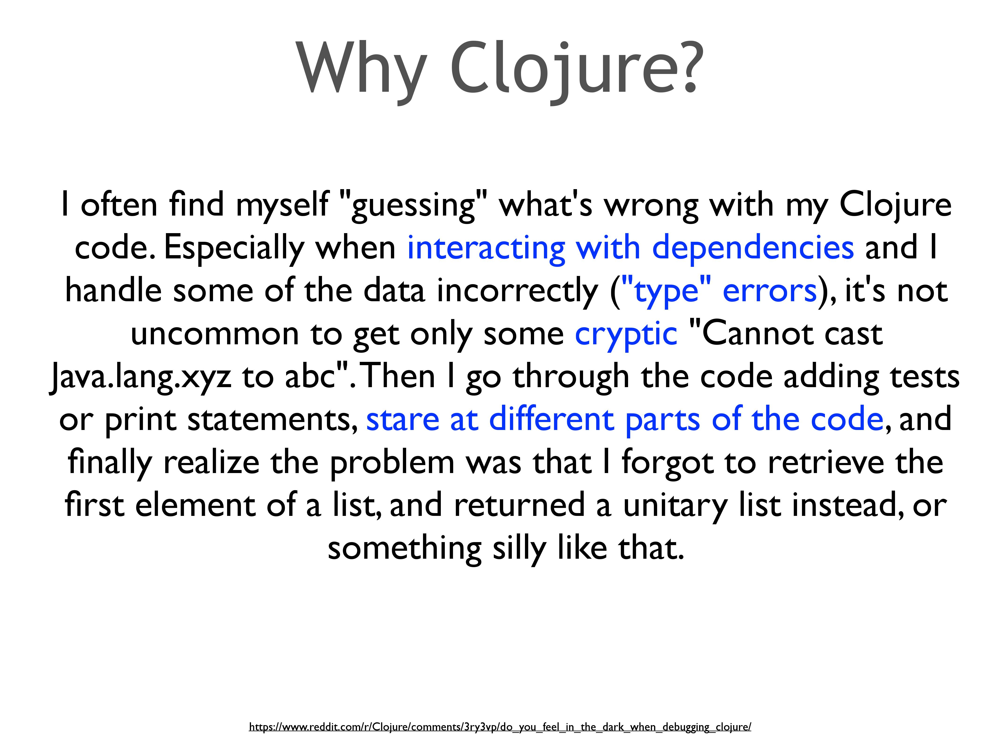

Then the question is, you know, we've talked about why debugging and why I should talk about it: 
why should we talk about debugging in a Clojure context? Well, Carin Meier, one of my coworkers, pointed 
me out to this thread on Reddit, I believe, and the text of this doesn't really matter, but you can sort of 
read it in as, you know, "bladdy bladdy bladdy blah, error messages, bladdy bladdy bladdy blah". 
And it's basically the sort of beginner experience of Clojure; people, when they are new to Clojure, 
particularly struggle with debugging problems, and figuring out what's wrong when something doesn't work, and 
so there's this long thread on Reddit where people talk about this, but this is actually the post that launches it, and it sort of captures some of the tone. And a lot of the time, people say something like 
"well, I had a problem, and I got a cryptic error message", or "I was interacting with a dependency, or a 
Leiningen plugin of something, and I didn't understand where to even start looking for my problem", or "I had 
a 'type error' in my system that would have been trivially found if I was working in Java, and I now feel 
flummoxed". And so, there are lot of people whose experience of debugging Clojure is fraught or unpleasant; and my experience has not been like that. And I'm not saying that they're wrong and I'm right, but I'm saying that, you know, I may have some ideas that can make it pleasant for others, and that's kind of an objective here.

Um, before I go further, how many people here - show of hands - have helped to develop tooling in the Clojure 
ecosystem? Right, worked on any kind of tool? So, a lot of interesting tools in the Clojure ecosystem; 
there are a lot of interesting tools about editing, about debugging, about visualization of data, about 
visualization of flow, people have built a lot of different things.

And this talk is not about that. And I want to make it clear upfront that this talk is not anti-that. 
I'm a huge proponent of using tools. That being said, if you do a Google search for debugging, I did this, 
the vast majority of the hits are about tools. Overwhelming, well more than half of the Google hits; all the resources out there are about tools. And so, I don't think you'd be getting your sort of into the day keynote 
value add if I told you about tools, because there's a lot of good advice out there. 

And the thing is, about tools: we're not directing by tools. Right, there is no TDD out there that stands 
for "Tool Directed Development". We wield the tools, they don't wield us; and so, when I think about debugging, I want to have a set of ideas in my head that give me direction, 

... or as that great philosopher of Computer Science, Yogi Berra, said: "I you don't know where you're going, 
you might wind up someplace else." This is one of the biggest problems, when people start debugging a system.
From my experience in a support perspective, what you discover, the first thing that happens when you try to 
help somebody with a bug, the first thing you find yourself wanting to do, is "I really want to go back in time, to when you first thought there was something wrong, before you started doing anything". 
I want to go back to that point when you started acting, before you had a plan, before you knew where you 
wanted to go. You know, it's so often the case that - and I'm an advocate of being a self-starter, so by all means, try things - but have a plan. 

And then finally, why would we talk about the Scientific Method? I have considered of a while that the 
approach that I use for debugging is a scientific method, but I had not, you know, read the literature about 
the Scientific Method, past having a science degree in College, and I had not read what people specifically 
had to say about the Scientific Method, and so of course I turned to Google to find out what I should care about in the Scientific Method,

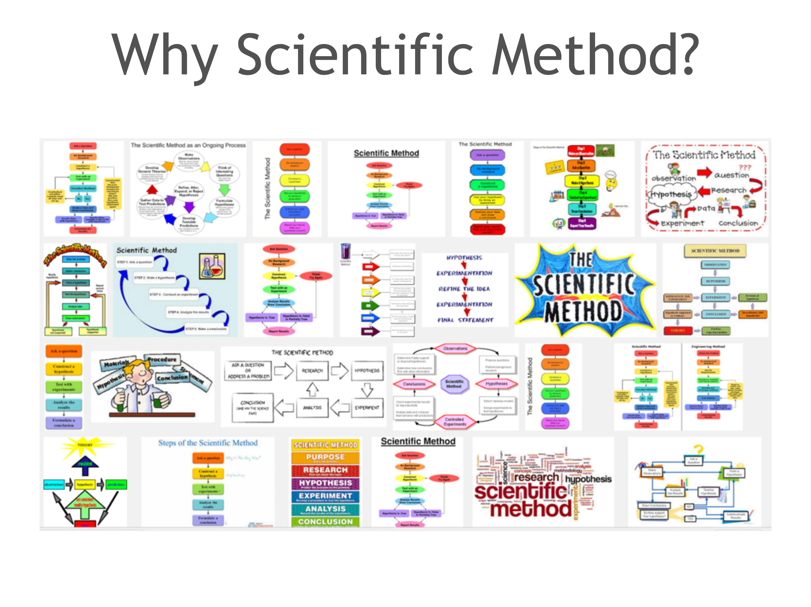

... and what I discovered is that the Scientific Method is, apparently, because rainbows _(laughter)_.
Which, I have no idea why, I'm pretty sure that all the Edward Tufte people out there are just 
pull their hair out, like "what do these colors even mean?" And so, rather than to use one of the 
premade graphics with meaningless colors, I've made my own "Scientific Method for Debugging" graphic. 
It's not that different from any of these, except it's got all of the colors removed: 

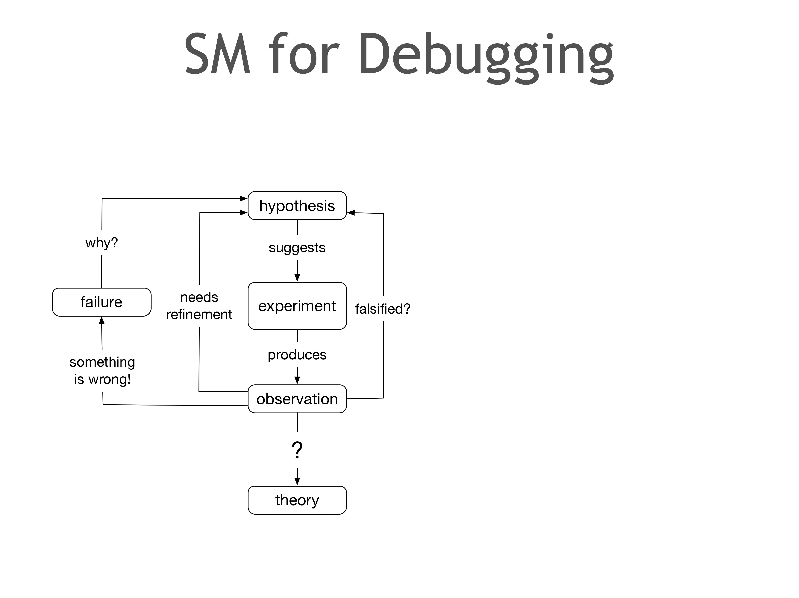

... so, because, it's sort of the limit of my ability to manipulate Omnigraffle.

So what is debugging all about? Well debugging typically starts with a failure:

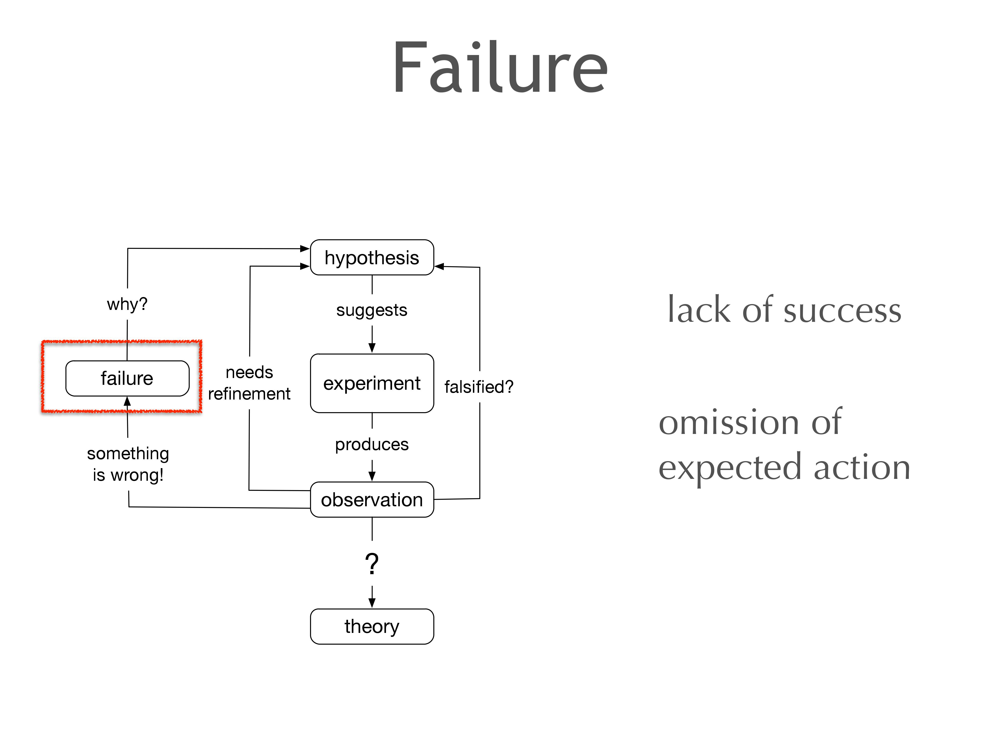

So a failure - and by the way, in the Conj tradition, all the terms I'm introducing I'm going to give you 
something form the etymology dictionary on them. Advice to future, you know, proposal submitters: 
if you use 2 or 3 words that are slightly unfamiliar, and make reference to etymology in your abstract, 
clearly, that's something that is value in this space. 

So what is a failure? A failure is a lack of success, or better it's an omission of expected action. 
Right, I expected something, and I got something else.

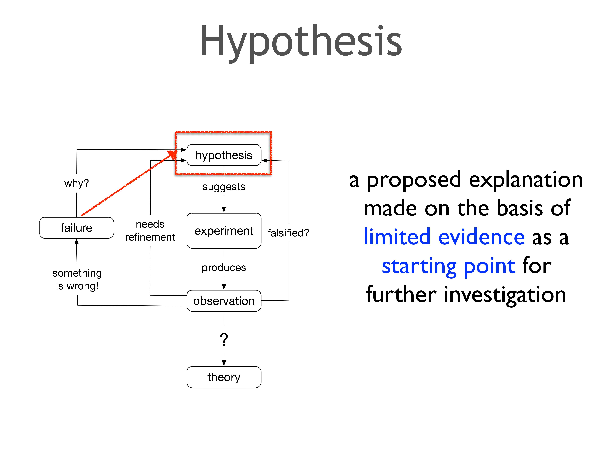

Now, as a result of this failure, you form a hypothesis; and a hypothesis is an explanation that's made 
without complete evidence, without necessarily enough evidence to answer the question, actually maybe you 
don't even know whether you have enough evidence to answer the question; maybe you do, but you haven't worked 
through the process enough, and that acts a starting point for further investigation.  

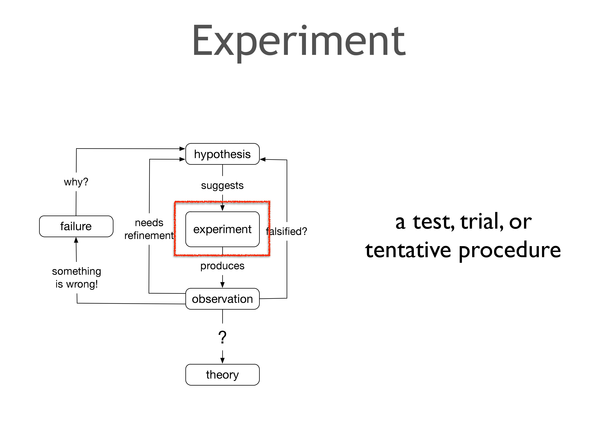

Then given that hypothesis, you perform an experiment, which is a test or a trial, and after that 
experiment you make some observations: 

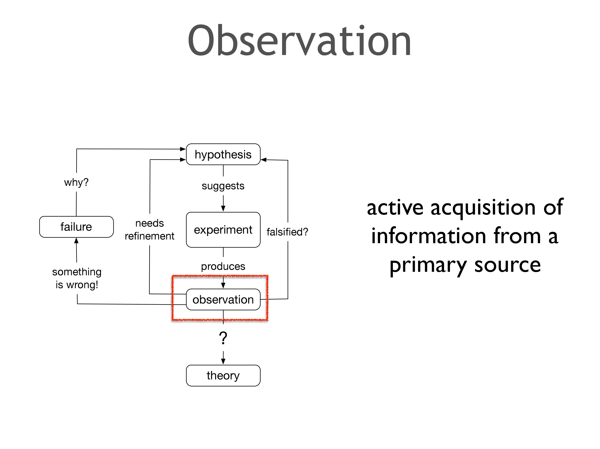

... where an observation is active acquisition of information from 
a primary source. Now, in a good experiment, one of two sort of equally good things can happen: you can 
discover that the observation falsifies the hypothesis:

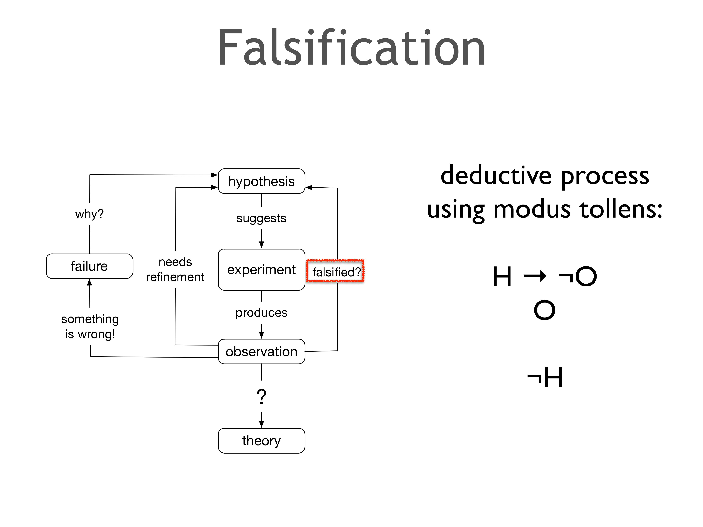

So falsification is a deductive process: using _modus tollens,_ you say "I have a hypothesis, it implies 
there's something at should not see; there's some observation O I should not see." I run the experiment and  
I see O; well, if my thinking has been rigorous and my hypothesis says "if this is true, then 'not O' should happen" and I see O, my hypothesis is now dead. And that's great! I know it's kind of disappointing if you try to get grant money in the kind of regular everyday science, but in debugging this is good news, because we've now killed a possibility, that's good.

The other possibility is that the hypothesis is supported by the experiment, but maybe you still don't have 
an answer that let's you say "I've isolated it", at which point you need to do refinement: 

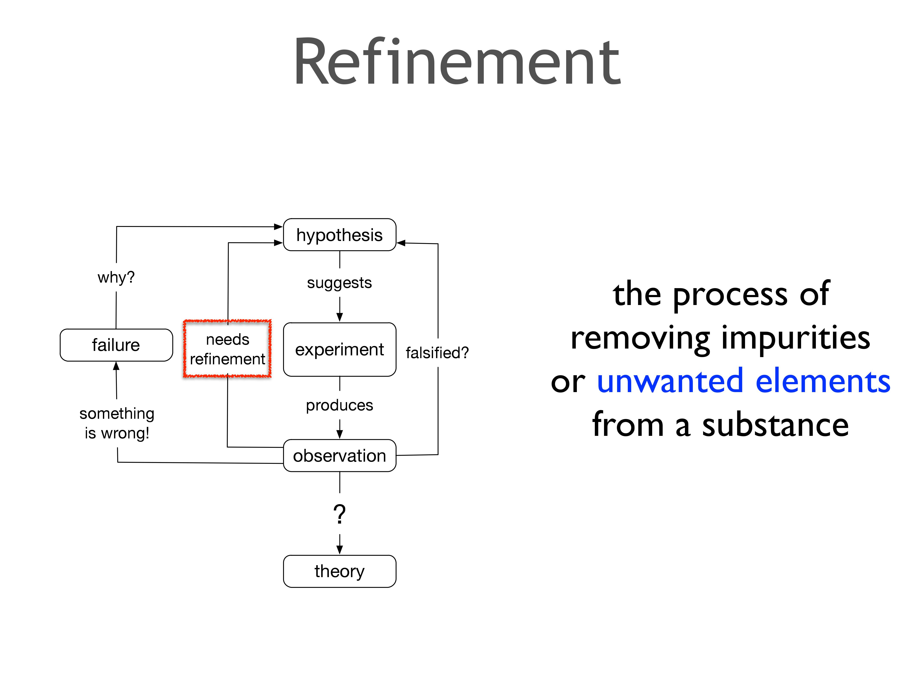

... and refinement is: removing impurity or unwanted elements. Right, it's substractive. 
So, I have some sort of story here - now my story may have to get bigger to remove elements, so I'm not 
actually saying the number of words in your hypothesis is going to go up or down - but the conceptual size 
of it is going to be focusing in on what the actual problem is. And then, you know, eventually - and I'm not 
going to promise this happens after 2 or 5 iterations - but eventually, you have a hypothesis, sorry a theory:

And a theory is a hypothesis that has been validated by predictions. This does not mean a theory is guaranteed to be true. It does mean, though, that it is true given all the information we have so far.
And so this is another place where I see people go wrong, and I see this all the time: "I have 99 pieces 
of evidence in favor of 'this is where the bug is', and I have 1 piece of evidence that flat out contradicts it, and I don't understand that piece of evidence. And so, well, 99 is pretty good, I'm just gonna keep going." If you have that one little piece of evidence that says "you're dead", you're dead! Right, and we get 
attached to our theories, that's the other thing, we get emotional about it, we're like "you know what, I like that theory, and look: it had 99 pieces of evidence in favor of it" - you can't do that. Now, it turns out - and I get dragged into the history of this, researching what other people said for this talk - it turns out that there are all sorts of objections to the notion that the Scientific Method is how science actually gets done. And some of the objections are superficial:

... or idiotic perhaps, but there are more serious concerns as well. So one of the things that I studied in graduate school is Thomas Kuhn's book _The structure of Scientific Revolutions:_ 

And there's all kinds of pithy ways that I could unfairly summarize this book, but it essentially says that science is a little bit better than politics and religion, in that you wait for people whose ideas are going to die out to die, instead of actively going and killing them. Right? But it basically paints a pretty unpleasant picture that science is an extremely social process - how could it not be, right? It's performed by people.

And then, once you have this notion that science is a social process, it's opened up to "what are the social priorities behind science?" and you get all these moral challenges to science:

So thse hot button things, you know, they change from decade to decade, on of the hot ones when I was in academia was _The Bell Curve,_  this notion that we were going to use 'science' in to sort of split the human race up into different groups and say "these groups are more intelligent and these groups are less intelligent". That's not the case, certainly not justified by the evidence; but these challenges are real, and here's the funny thing, here's the good news: there's all kind of stuff that I just said that we can have very heated about, and get angry about, and in the context of debugging we don't have to worry about any of that stuff at all. It turns out that debugging - if the Scientific Method is the measure of how science is done, debugging is actually more like science than science: 

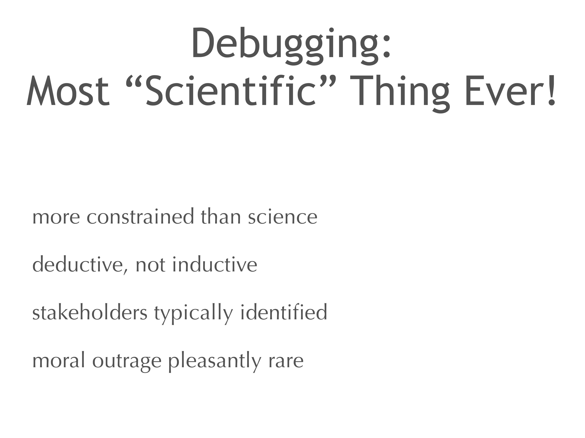

Right? Science is hard, it's difficult to imagine how you can take that little process on the side and turn a crank on it and have the theory of gravity, or the theory of evolution, of any of the other most important theories that people have ever thought. But that's not what we're doing: we're doing something that is far more constrained, and debugging is deductive, inductive. We're not trying to come up with a grand theory of everything. We have a grand theory of everything, it's called the software system we're running, we're trying to use that to prove some very concrete thing, right, "this thing happened".

Also, there's not a big political problem, right? There's not usually - I mean, in my experience, debugging in and of itself has not been politically fraught. There are people who are experiencing bugs, and they want to see them fixed, and as the developers we want to see them fixed, so we're not having these kinds of arguments, and there's not usually a lot of moral outrage, right, and there's not any kind of like 'Academic left' saying "there is no real reality so we can't actually-" you know _(laughter)_, "you can't actually prove that there was a bug here". There's none of that, so - I mean seriously, this is really good news!

So unfortunately, the Scientific Method may not be all that great for _science_, but it absolutely rocks for debugging. Now, having said that, we can drill in for debugging, and we can start to use some more specific terms that are more about troubleshooting and debugging:

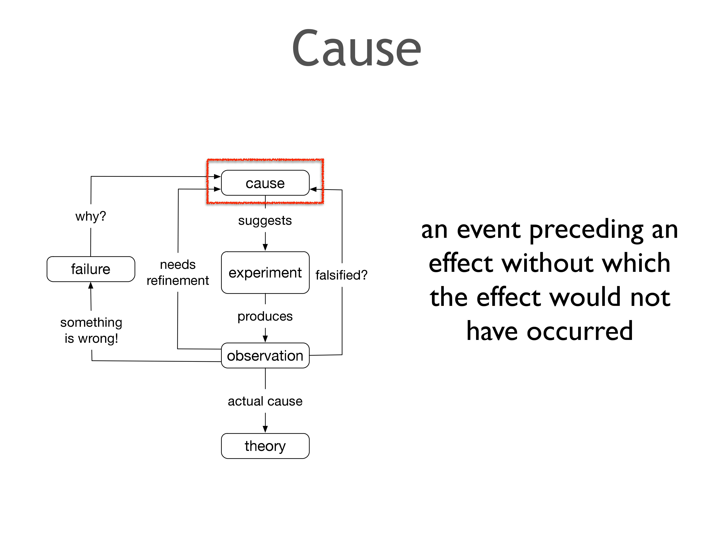

So I will replace the word 'hypothesis' with 'cause', right - we're looking for a _cause_, and a _cause_ is "an event preceding an effect without which that effect would not have occurred". That sounds awesome: if I knew the cause of a problem, then I could eliminate the effect from happening. So _I_ caused Strangeloop, right, as we said earlier _(laughter)_, so the problem with causes is that they're not sufficient. Right? "Cause: the Universe exists" - if the Universe didn't exist this wouldn't happen: that's a cause, but it's not a very interesting cause, and it's not one that when we're debugging software we're much of a position to do anything about.

So you want to get from a _cause_ to an _actual cause:_

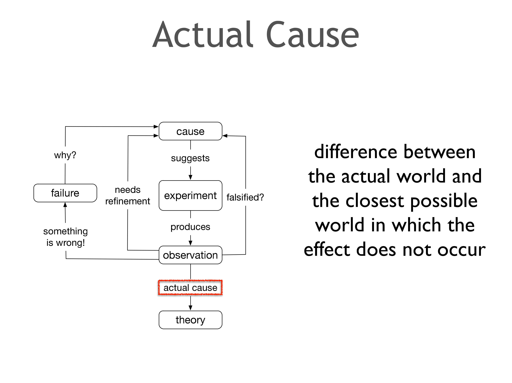

... and the _actual cause_ is the difference between the _actual world_ and the closest possible world in which the effect does not occur. And - I mean, we could get down the rabbit hole of getting more rigorous about 'closeness', I'm not going to do that in this talk - but we can just be intuitive about closeness. Right? If you have, you know, this agglomeration of 5 things that all contribute, and with 4 of them it does not happen, and with 1 of them it does, then now one is closer to be the actual cause, and that's what the 'pairing down' process does: we want to start with an idea about a cause, and then we want to narrow down to an actual cause.

And then you have this great word: 'fix'. In this context, a _fix_ is just the last experiment. Right, the first experiment is _reproducing the bug_, and then there are a bunch of experiments that are just about hypotheses, and the _fix_ is the last experiment. This captures a really important idea, which is: if you haven't fixed it, and run an experiment that shows it's fixed, then you haven't really identified the bug yet. You may be strongly suspicious that you've identified the bug; but you haven't really identified the bug until you've fixed it. 

So, I'm going to take this Scientific Method, and I'm going to apply it in a really slapdash way to a problem. And I'm going to start with a problem that I grabbed up from StackOverflow, this is a very tiny debugging problem, you can probably do it in your heads, so I'll show it to you:

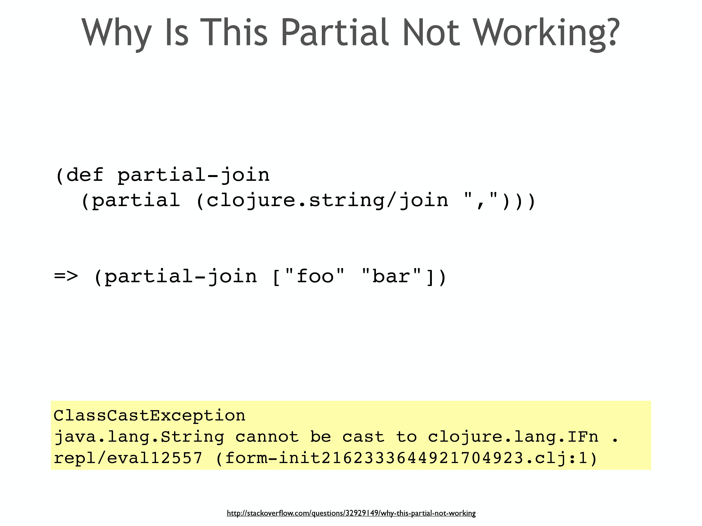

This is a question on StackOverflow: "Why is this partial not working?". 

So I definied `partial-join` as the partial of `clojure.string/join` with `","`, then I call `partial-join` on 
`["foo" "bar"]`, and I get back _the scary error message:_ "ClassCastException, you cannot cast java.lang.String to clojure.lang.IFn", and there's a scary number in it, so there's no way we could possibly figure out what the problem is with this terrible error message. _(laughter)_ 

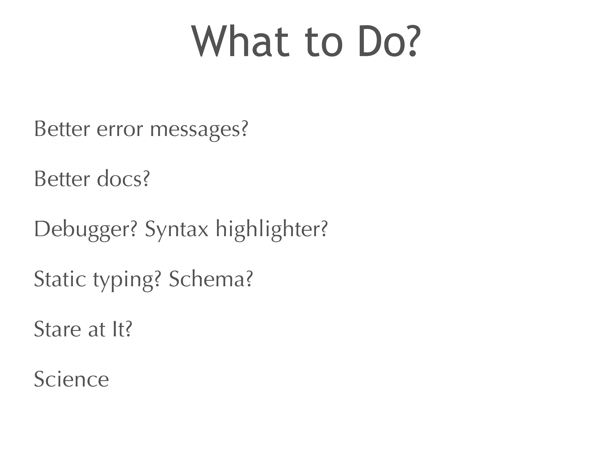

So what should we do? Right, we have a lot of choices. We could make error messages better, we could have an error message that says: "Oh, I see, you were trying to make a partial with `str/join`, " - and you know it has _this exact scenario_, we could anticipate every possible scenario everybody could ever get into. And, not to be unfair to error messages, we could go a long way towards having better error messages without being ridiculously over the top about it. Error message could be made better: sounds like a good plan to be. We could have better docs: maybe there's an answer to this problem in the documentation. We could use a debugger; in fact, in this case, it might be even that syntax highlighting and paren highlighting could have tipped you off as to where the problem was and I didn't give you that. Maybe static typing would have helped, right, in fact static typing _would_ have helped, you could imagine a scenario where static typing would have solved this problem. Using some sort of schema and schema validation would have helped. And in fact, this one is so easy that you might have stared at it and just know what the problem was.

So all of those things are useful, and all of those things should be part of your toolkit except for maybe 'staring at it' - right, that one's actually really quite weak, and we'll come back to that. 

But the important thing to realize here, is that science is more general-purpose and requires less on-hand to do than any of these other things. Let me say that again because it's so important: science is more general - the Scientific Method, not science; what is it that the academic say, 'hypothetico-deductivism', right, let's just stick with Scientific Method - the Scientific Method is better sauce than these other things, because it's more general, and because it doesn't require anything to exist in the world except your brain, before we go in. 

So let's try that, we're going to go down this road, and I'm going to do this as I said in a very slapdash way.

My hypothesis is "well, look, there's only 3 things here: 'why is this partial not working'". Well, `join` doesn't do what I expected, so it's a very fuzzy hypothesis, _or_ `partial` doesn't do what I expected, _or_ `def` doesn't do what I expected. Right, it has to be one of those 3 things; those are the only things there, it's a very small problem to check. 

And so, the experimental approach to this - I will propose a heuristic for problems like this, which is: you should do a bottom-up check from the REPL. Right: pick the form that's at the bottom, or on the inside, and check that:

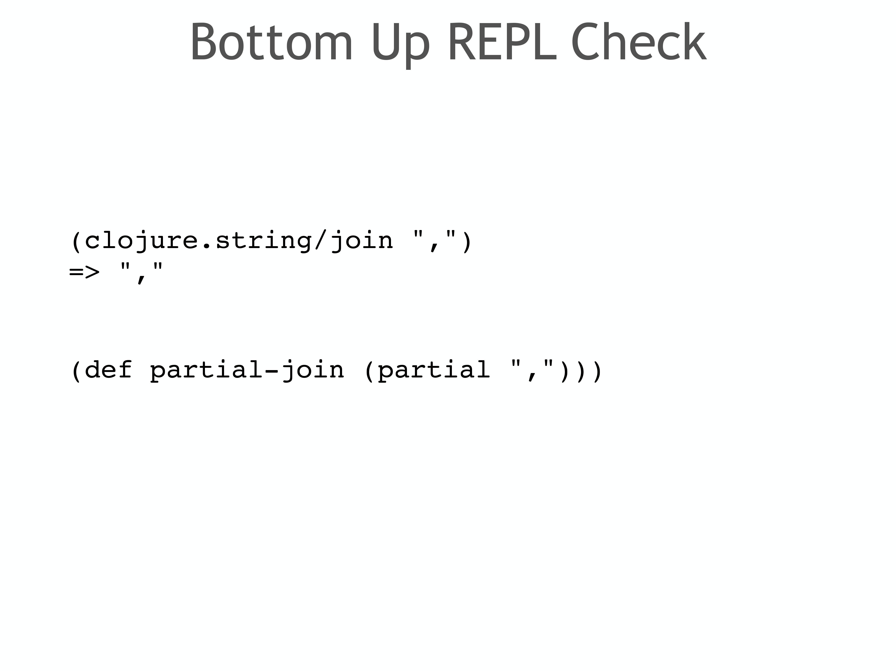

... and in this case we're done. Right, I checked the very bottom form here; the bottom form was `(clojure.string/join ",")`, which returns `","`. That seems like almost-certainly wrong, because if it was just to return `","`, I could have just passed in `","` to begin with. 

And then when I look at the next one, `partial-join` - if we substitute in the result of that in the original form, we're now partial-ing over `","`, which is using `","` as a function. So I got lucky at this one, I might have had to do 3 little things at the REPL to figure this out - I got lucky, and I only had to do one.

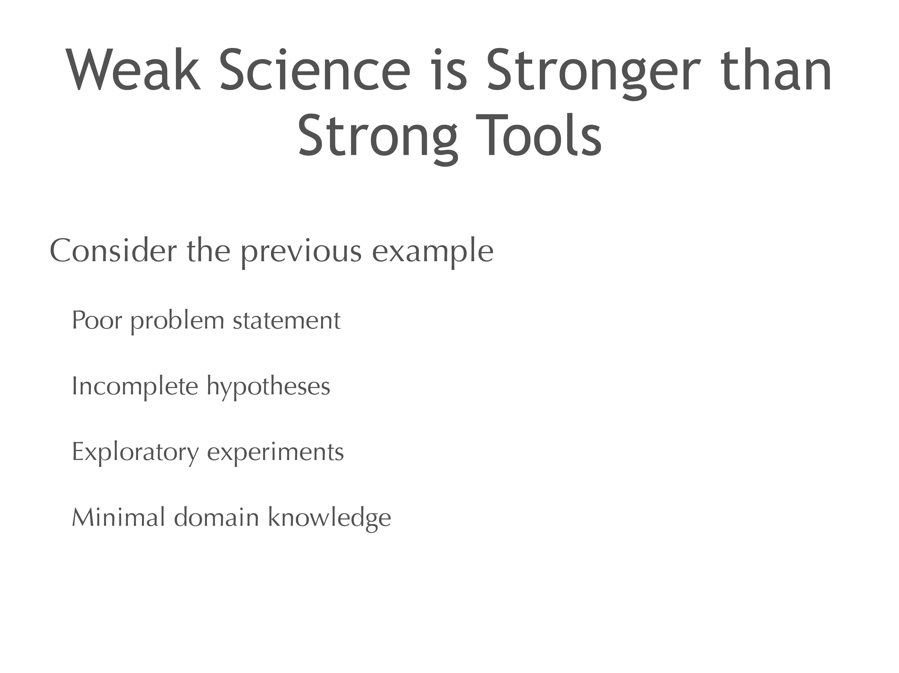

So, **weak science is stronger than strong tools.** In this case, I had a poor problem statement, I really never got clarity on my problem statement. I had really poor hypotheses: each one of my hypotheses was "that was ouch", "that was ouch", or "that was ouch". Right, those are not very specific. My experiment didn't even really have stated goals, right, I just took this heuristic approach. And I didn't have much domain knowledge. Right, we could hypothesize that a beginning Clojure programmer doing this didn't have to have very much domain knowledge to figure it out.

So of course, at this point I have stacked the deck in favor of the Scientific Method by picking a trivial problem. A trivial problem - doesn't matter what you do, any one of the approaches will work so it hardly matters.

So now we need to talk about hard problems, and what it would be like to do the Scientific Method well.  

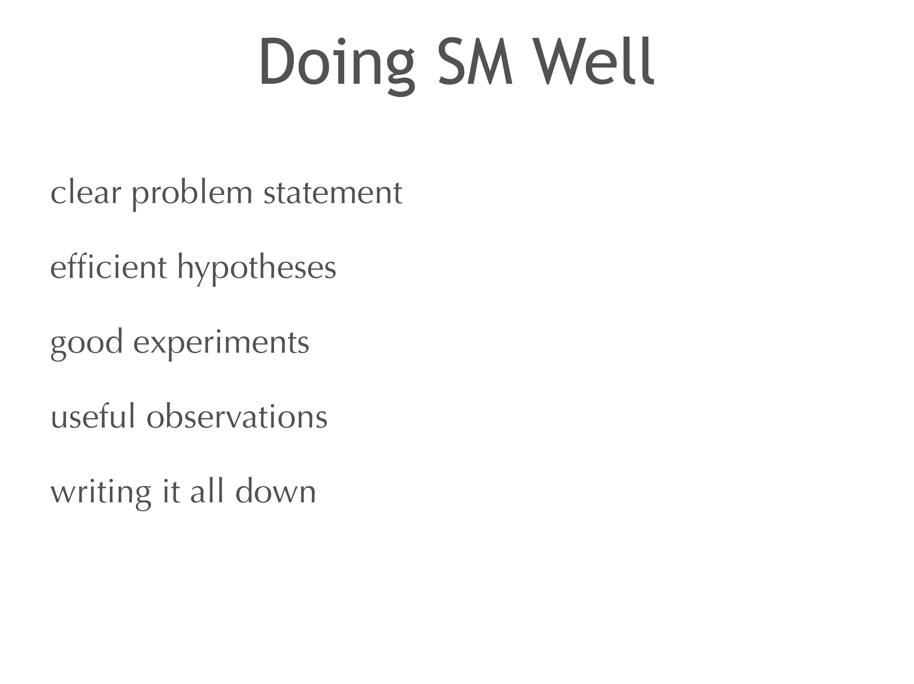

So what do we need? We need to do each of those steps way better than we did. We need clear problem statements, we need efficient hypotheses, we need good experiments, useful observations, and we need to write things down.

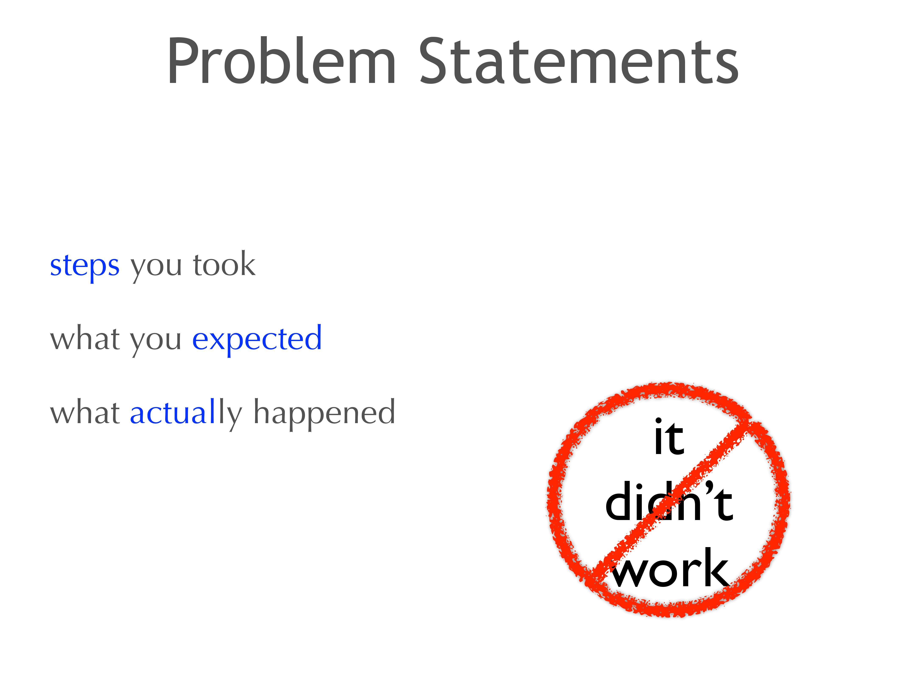

I'll start with problem statements. Right, the antithesis of a good problem statement is "it didn't work". Right, "it didn't work" is hiding everything behind pronouns, that's no good. What you want is: 

* the steps you took,
* what you expected,
* and what actually happened. 

This slide right there: it's worth a hundred bucks. Send me your checks. Right, this is not a hard thing to do, this is not harder - and in fact, sometimes, saying actually causes you to realize what the problem was. Going from the exercise of verbalizing "it didn't work" to the exercize of verbalizing "I stepped away the car and it started to- ooooh, right, I didn't put it the **???** - whatever". 

So, there's a lot I could say about problem statements, this is all you're going to get right now, but this is an order of magnitude better than "it didn't work". So start with this.

The next thing you want to do, is to - _(leans on laptop)_ give me one second, why? I don't it's not working. _(audience laughs)_ Let me debug this! We're going to have a live performance now. Hmm. So: "my hypothesis is..." - actually it's Keynote, right, which is just, uh, terribly, terribly, painful. So I want... of, fine. I'm not going to tell you.

How many people remember this guy? Yep, I mean it's Casey Affleck, but it's the Malloy Twins from Ocean's eleven, and there's this great scene where they're playing 20 questions, and his like:

- "Am I alive?"
- "Yes"
- "Am I a person"
- "Yes"
- "Evel Knivel."
- "Damn it!"

_(laughter)_

And it's a joke on an idea that we all know, it's like the opposite of what you want to do. It's what my 5-years-old does when we're playing 20 questions, and he looks at me and goes: "am I a tall aak tree?" It's like "no, you don't want to" - we all know what we need to do here when we're forming a hypothesis that ideally carves the world in half.

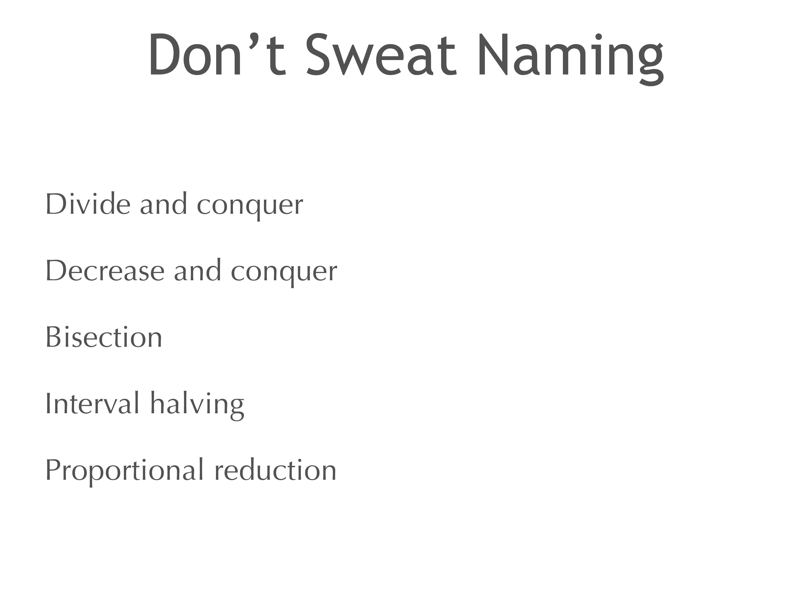

It turns out that the naming around this 
is contested, right, most of the time you 
hear people say this is "divide and 
conquer", but if you ask an algorithms 
person they would say that's actually 
not it, because in divide and conquer you 
go down both branches. And so they want 
to call it 'decrease and conquer', which I 
think kind of sucks, because because 'decrease and 
conquer' could be a linear time thing, 
right, you could decrease by one every 
time - and the important characteristic 
here is proportional reduction.  I 
want to take the space of where the 
problem is, and I want to reduce it by 
ideally half, but as you know if you've 
done any algorithm analysis, if I 
can get rid of ten percent of the 
possibilities on every step, I'm going to  
have the answer really quickly: 
that's only going to differ from 'getting 
rid of half the possibilities' by a 
constant factor in the number of steps that 
I have to do.

So the question is then: how 
do you take the space of 'I don't know 
what went wrong' and turn it into, you 
know, something that cuts the world in 
half. Well this is going to require 
domain knowledge, right, there's no two 
ways about it. Having said that it does 
imply that you should be super cautious 
on your initial step if you don't have 
much domain knowledge. Right, if you don't 
have much domain knowledge, it's possible 
that your initial step leaves out of the 
entire universe of possibilities what 
the actual problem was. And so having 
said that, everybody knows where to look 
for their bugs. 

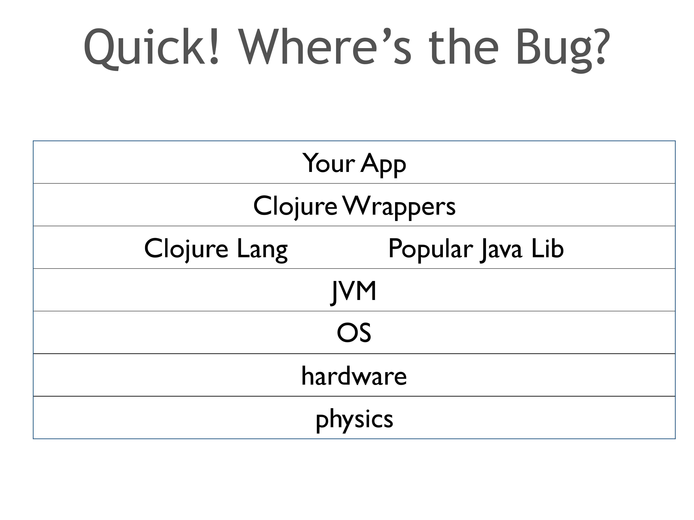

Right, if I showed you  your application stack and something just stopped working, how many of you are gonna guess - _(audience laughs)_ right, how often is it physics? It's pretty rare, right?  Physics is not usually - I mean sometimes it is, and that's exciting. And I have to say that on every open source project I've ever worked on, you know, you get bug reports and some of them are bugs and you fix them, and some of them are not bugs and some of them are bugs inside something underneath you. We've never had a Clojure bug report that we had to forward onto physics. Right, yeah, There hasn't been any of those. I mean, in fact very few even have to do with, you know, JVM, much less OS operation. And you could make other stacks like this, there's there's a whole  conversation we could have about, sort of, developing a notion of what the possible space is, and you know where you can go in it - but my point is you don't have to be that good at it anyway. As long as you can get rid of some proportion of the possible causes with your experiment you're gonna quickly find the answer.

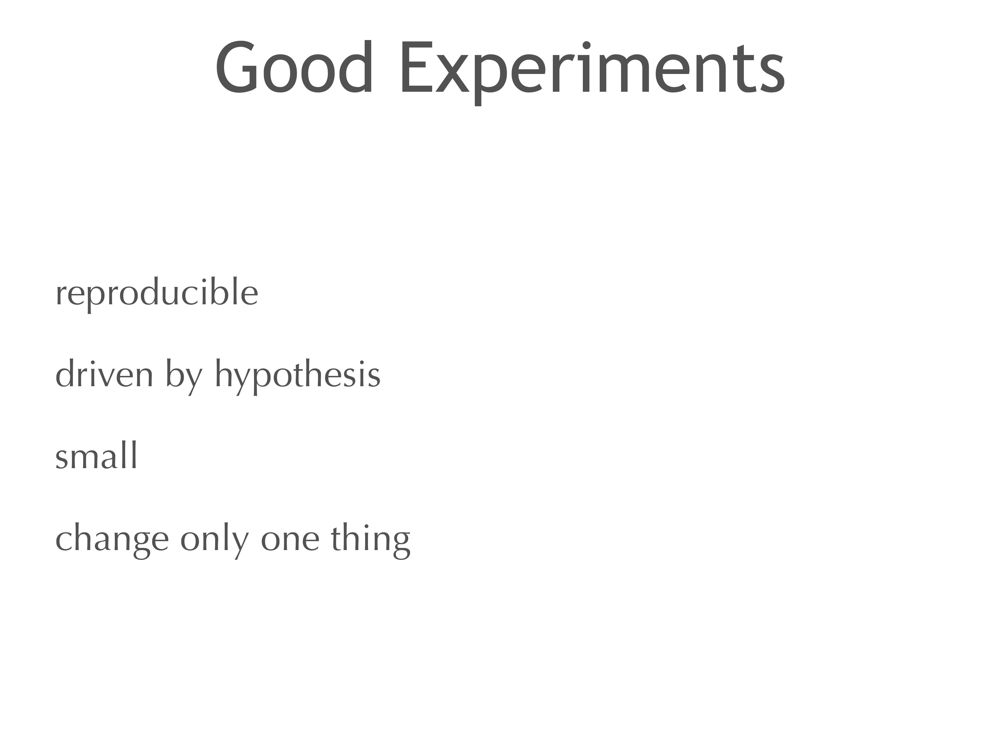 

Now, what is a good experiment? A good experiment is reproducible. You start by reproducing the bug. It's driven by a hypothesis. Right, people say they're experimenting when they're just trying  shit. Right that's not hypothesis-driven: you have an idea this is the case and then you have an experiment that provides more information to help you refine that idea. Also experiments are  small, and when you're when you're making changes to a system, you change one thing at a time right, because if you change two things now you just have to go back to figure out what the impact of that was when when something changes. Right, you haven't actually gained information.

So I'm gonna give you a quiz on this: if you have a bug, let's say you  want to report a bug in your own app, and you know you're handing it off to another member of your team to help you look at it which of the following things should _not_ be in your repro case? 

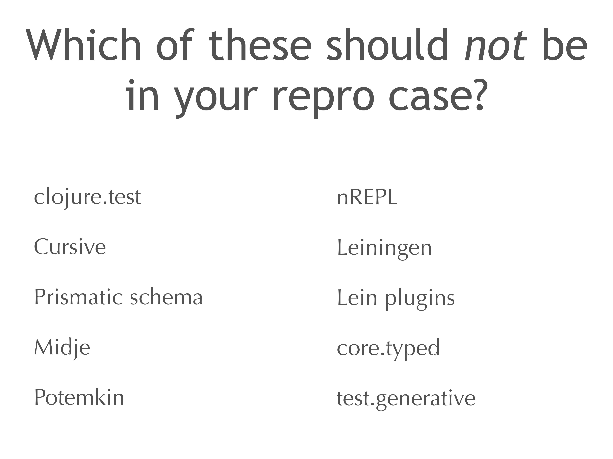

clojure.test / Cursive / prismatic schema /  Midje / Potemkin / nREPL / Leiningen / Leiningen plugins / core.type / test.generative ? Unless you think the bug is in one of these things, which one of these really stands out as "boy you really wouldn't want to have that in a repro case"? And the answer is: it's a trick question. You don't want any of these in your repro case, unless your theory is that, you know, "the shopping cart on my system doesn't work when i'm developing inside Cursive and using clojure.test", then your repro case shouldn't have anything to say about Cursive and clojure.test, and Colin and other people will thank you for that because he doesn't want to get bug reports about Cursive that about that kind of thing either. 

So it's incredibly important to remove things that do not contribute to your hypothesis statement, and it's a freebie. Right I was saying earlier that you have to have this like mental model of the universe, to allow you to narrow down the things that aren't it, right, this is a freebie! In your bug these things are not it, so start by taking them out: make a really tiny thing that shows the  problem.

Now when you're making observations, what's that all about? Well  one thing you need to do is you need to understand all the outputs. If your system has outputs, right, if your system has 4 or 5 outputs that you understand, and then it has one that's unrelated to your current problem and you don't understand it: brakes screech. If you don't understand it, how do you know if it's  related to your problem or not? So you need to understand the outputs from your system, and you need to be suspicious of  correlations. Where's the bug? It's in the last five lines of code you wrote. Quite often - and so if anything correlates with  the problem with a failure appearing then you want to suspect that, and in order to  make observations you need good tools. You need debuggers, you need logging, you need metrics, all the kinds of things that let you - then basically all those things give you more outputs. They turn things that are blackbox into things that are  whitebox and it's amazing that we have this inversion that when you do a Google search for debugging, more than 50% of it is about just this one sub-bullet  of one sub-point. 

It's important right  you need to have tools, and in fact there  are more things that tools can do than just it, so we'll talk about those later.  

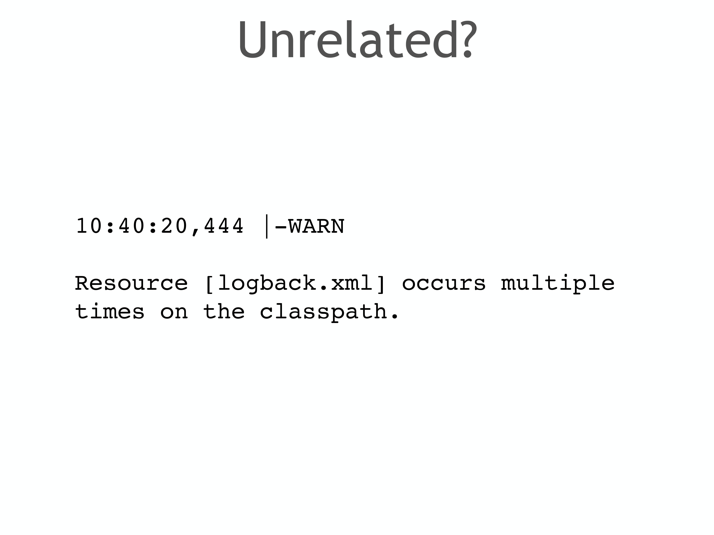

So I'll give you another example, and while I was writing this talk I had several things that happened to me in the course of the week. So this is one that happened to me last week: I was working on a Clojure app, and I got this error message in the log that was  completely unrelated to my problem. My problem had nothing - so logback.xml is the configuration file for logback, which is one of the Java logging things which we're also happy that Java did such a good job with, and so I get this message and I'm having this cryptic  problem in a subsystem that I'm working on. And I know this can't be it, because it just has to do with logging. Except that actually this _was_ it: it turns out that after two minutes looking at the problem I said "you know what, before I think about this problem, I'm gonna go run down what this logback thing is about, because I want this to be clean." Well logback occurs multiple times on the classpath, because some library, because of a build problem had been copied into a lib directory twice, at two different version points, so I had foo.bar version 2.1 and foo.bar version 2.2. Now what the JVM helpfully does in that scenario without further configuration, is if those things have overlapping but not  entirely union set of named things in them, you can get some of them from one and some from the other and they're not  compatible with each other, and it can lead to all manner of errors that are absolutely cryptic, which is exactly what happened. But by tracking this down I was able to say, "you know what, I saved myself all that time", and it would have been - even using the  Scientific Method and trying to sort of bisect towards the problem, it would have taken a while from the symptom to come up with a better cause to investigate than the one that was standing in front of my face.

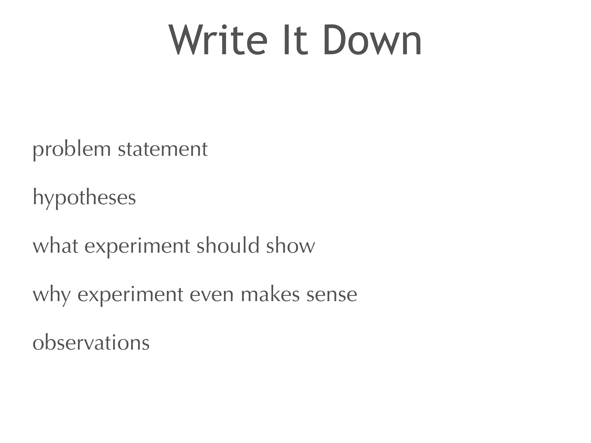

**Write things down.** This is the single most important piece of advice I'm going to give in this talk. Write things down. Write the problem statement down - don't say it, write it down. Write every hypothesis down, write what the experiment would show, write why the experiment makes sense, write a justification for the experiment before you run it, and write down your observations.

And this is something that we all know sort of intuitively. Consider the game _Mastermind_: so in the game Mastermind, the colored pegs down at the bottom represent a code that the player  is trying to guess, and the colored pegs across the top represent past guesses, and then the red little red and white pegs represent information, feedback that you've gotten on your past guesses. So if you view this as a Scientific Method, you have a series of hypotheses about what the colors are, and you're getting feedback from an experiment, which is: the human player is scoring your guesses. We don't have to talk about the exact scoring - if you can't remember how Mastermind works, that doesn't matter - the thing that's dominant here is that doing your experiments with without writing things down is like  paint playing mastermind like this:

Right, you're saying that you're gonna keep in your head the entire state space of all the previous things you've tried, and even the one try you're currently on you're gonna hold in your head - so I'm sure you can barely see one of those through my color there. And the thing is that not writing it down, you might think that of the seven deadly sins that sloth, but it's actually not, it's hubris.  It's amazingly arrogant not to write things down, because basically what you're saying is: "I'm such a badass at solving problems that I'm gonna solve the meta problem of keeping track of everything in my head just to show off", when that's actually probably a harder  problem than the debugging that you're doing. And people do this all the time, it's staggering. 

Okay, everything I've said so  far probably could more or less apply to the use of the Scientific Method in a lot of different domains, and because we are here at a software Clojure conference,  I'm gonna give you some software-specific advice. 

The first piece of software-specific advice is something I was reminded of as I was reading through the literature on debugging, and what programmers said about debugging in the past, and I  usually don't say mean things like this, and it's gonna come off a meme, and I can't help it: _don't use C._

I mean the history of debugging is just riddled with "Oh my God  this thing has so many pitfalls and traps in it", and it's not that C is bad - I mean we could have a separate conversation about it - it's that this is not the level of abstraction you need to be  working at. And sometimes it is, right, and if you have a domain that's like "it would be impossible to do this in Java, or Clojure  or Python or whatever" then you can use C, but boy you shouldn't reach for that as the default tool then in 2015 in most domains. 

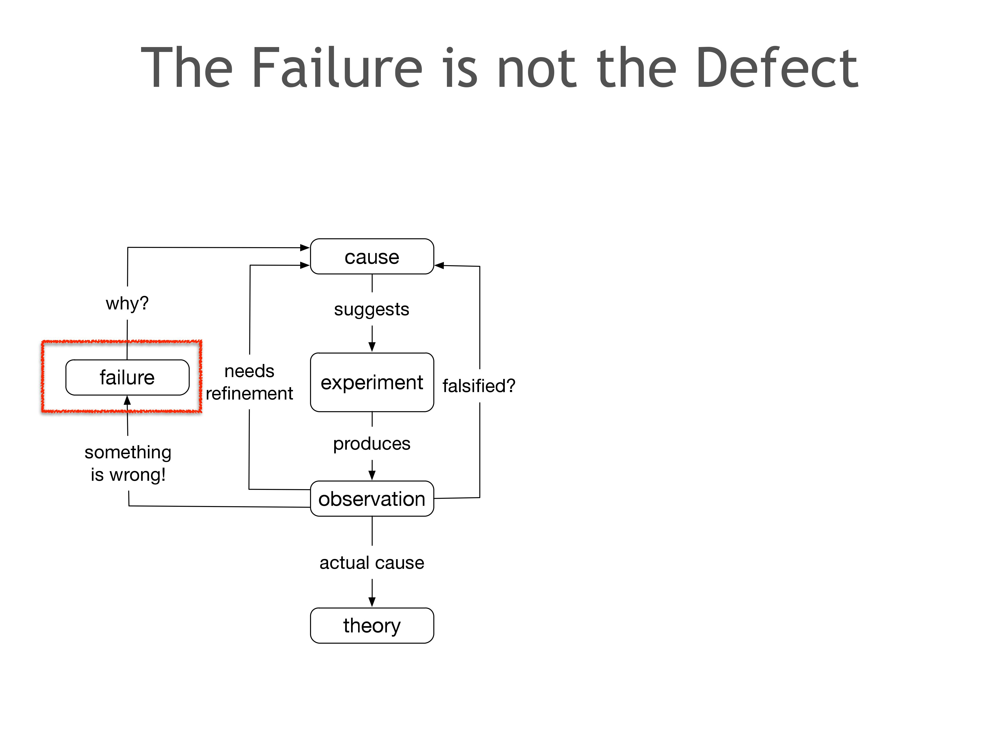

A second piece of software-specific advice: **the failure is not the  defect.** The failure is not the defect, and the way this comes up the most often in software is assuming that the exception has anything to do with the actual problem. I mean, it does have  something to do with it, that's how you know, right, but that it's in some way directly translatable into the problem. 

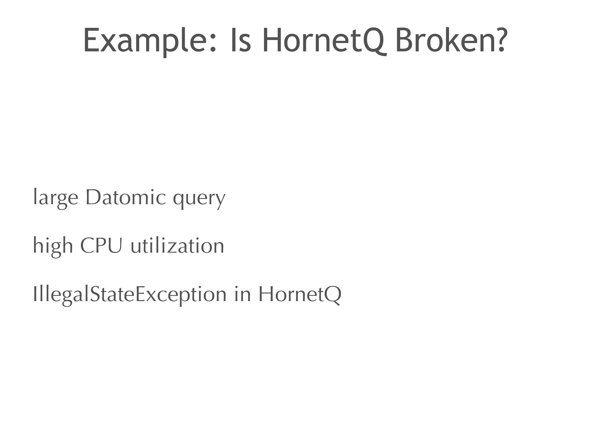

So I'll give you an example: we had a Datomic system that had a large query, high CPU utilization, and an IllegalStateException in HornetQ. So your first guess is you know, "Wow IllegalStateException, HornetQ must be broken". Well, let me just tell you: HornetQ is not broken. HornetQ is a pretty awesome piece of software. I've had fantastic  interactions - Datomic has had HornetQ in it from the 0.0 days - I've had fantastic interactions with the HornetQ team, and the only time that working with those people, that we ever got to the point where we tracked a bug down to the point where it was underneath Datomic and in HornetQ, it actually was underneath HornetQ and in Netty. Right, which is pretty unusual by the way: you don't find those - I mean, this is a show-stopping "Netty plus SSL doesn't work in this scenario bug". So pretty darn unusual. So, this was not, this bug - and I'll just tell you, I'm sort of giving you a little bit of unfair advanced information - the answer was not  "it's HornetQ". 

And there's another important philosopher of debugging who can really help us out here in a couple of steps, and that is House. _(laughter)_ So  House says it's never Lupus, well in Clojure programming on the JVM, we have a kind of 'anti-Lupus'. We have the thing that it _always_ is, but it doesn't look like it at first,  and the thing that it always is is Garbage Collection.

The actual bug is always Garbage Collection - just as in House "it's never Lupus", in Clojure and in Java it's always Garbage Collection. And there's several reasons for that: one is most  applications are not designed to deliberately induce OutOfMemory errors; because they're not designed to deliberately induce those, those code paths are not checked very much. So you're in kind of uncharted territory. 

The second one is OutOfMemory can happen anywhere, so there's no line of code where you can "look oh look there's the critical section where memory doesn't possibly run out" - you can't do that. Also OutOfMemory can appear as almost any other exception, because once something fails to allocate over here you can get a cascading series of reactions where the actual exception that's reported back is radically different. 

Finally - well not even finally, sub-finally - when you get close to OutOfMemory, you get a radical change in thread scheduling as the GC thread is running all the time, and all of a sudden things are happening in orders that they  never happen in everyday life, and so all those race conditions that would normally take your system 2,000 years to expose by accident, all of a sudden it takes them 2,000 seconds to expose by  accident. So lucky you thanks: Garbage Collection for helping us find those race conditions. 

And finally OutOfMemory-related problems tend to cascade. So always be suspicious of memory when you're having problems in a Garbage  Collected environment.

Now another piece of software-specific advice is to read the entire fracking manual:

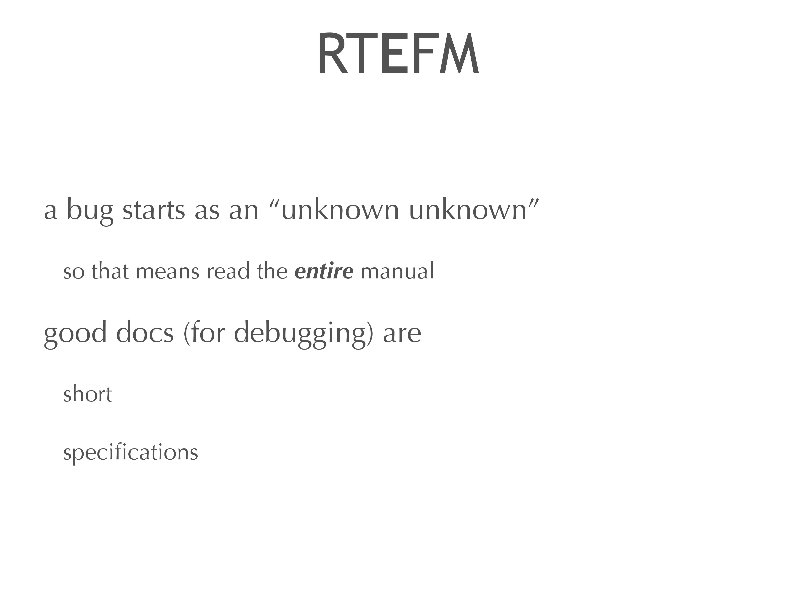

TODO 40:10

And so the thing is that a bug, almost by definition, starts out as an unknown unknown. Right? If you knew more about it you'd already be well on the way to fixing it. You don't know what's wrong, so you don't know which part of the manual you need to read. And this means that if you want a set of docs that are good for debuggers, that set of docs ideally is short and specification-like. Now this goes against other objectives, right: short docs may be very difficult to consume, they may not be very narrative, they may not be very tutorial; but they are a good place to say, you know, 'if I have to read the whole thing, I would like for it to be 50 pages long and not repeat itself". If I want to learn in a more, you know, tutorial kind of environment, I'd like for it to be a thousand pages long, and repeat itself in various ways, and anticipate problems that people have every day. So good docs for debuggers are specs. And we'll go back to the partial problem again: 

So, if instead of doing experiments we had chosen to read the docs here, we could have pulled up the docstring for `join`, and we would have seen that `join` has two arities. And the first arity takes a collection, and then it returns a string of all the elements in that collection. Oops. So: one step + experiment would have identified this problem; one step + reading the docs would have identified this problem. Right, it would have been the first thing you found when you went to look for it. So let's take some of these ideas back to this more tricky debugging problem that we encountered, and that is this large Datomic query / high CPU utilization / the IllegalStateException: 

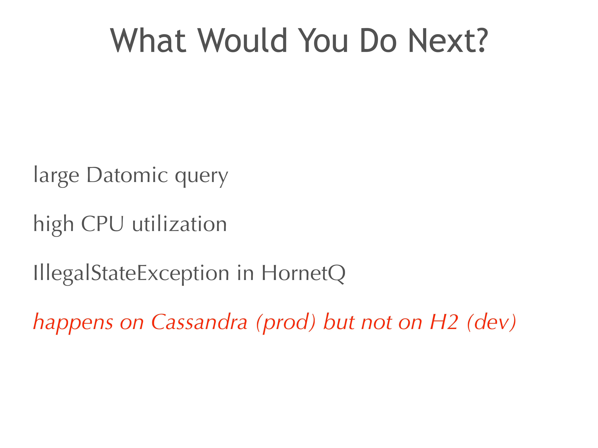

And now I want to give you one more really piece of interesting information: it happens on Cassandra in production but not on H2 in development. 

So what should we do right now? Hmm. If we're going to apply the method, what we need to do right now is look very suspiciously at that last sentence. Is that last sentence an observation? An hypothesis? What is it? It's actually not really anything, right - it doesn't have a subject, alright, it's a sentence without a subject in it. So there's some sort of amorphous 'it' that happens on Cassandra and not on H2. So let's try to define that 'it' a little bit. That certainly sounds suspicious, so let's make the smallest possible thing that could show us that: 

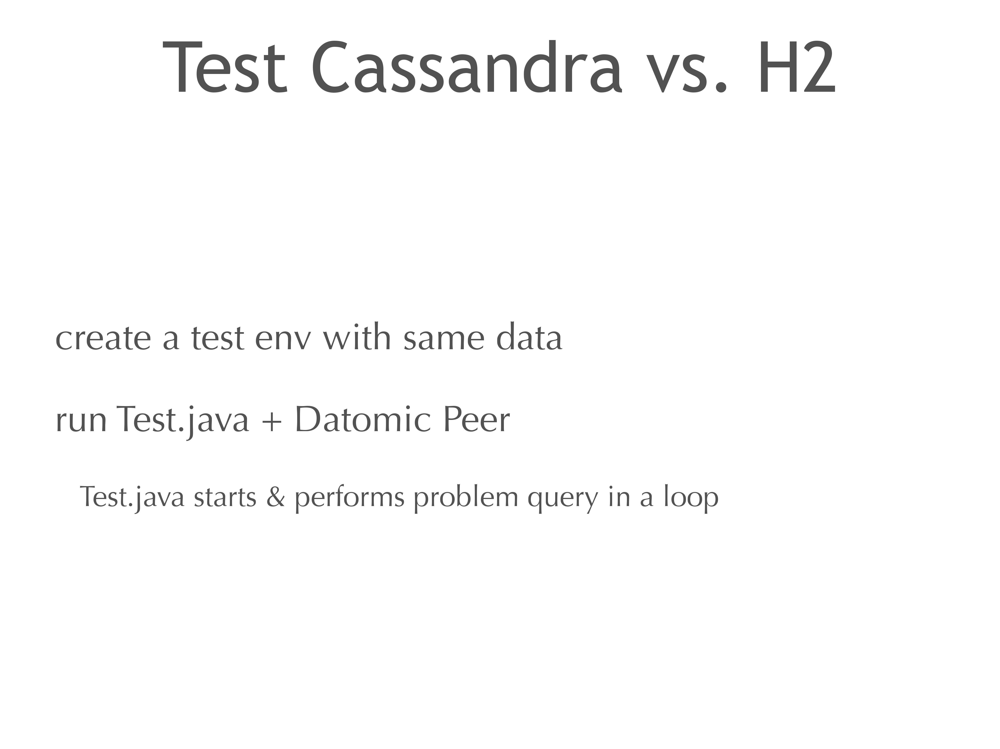

So we'll create a test environment with the same data that production had, and then we will run a little file that we're gonna write which is gonna be 10 or 15 lines long: `Test.java` with a Datomic peer, and that's just gonna come up and it's going to perform the problem query in a loop. And if Cassandra or Datomic or Cassandra + Datomic is trivially broken in some way, we're gonna see that there, and then we can run the same test again against dev and not see that there, and now we have eliminated an entire universe of complexity. Right? All of the application code that was in play, all of the tools, all the third-party dependencies, all that other stuff, has been mechanically eliminated. 

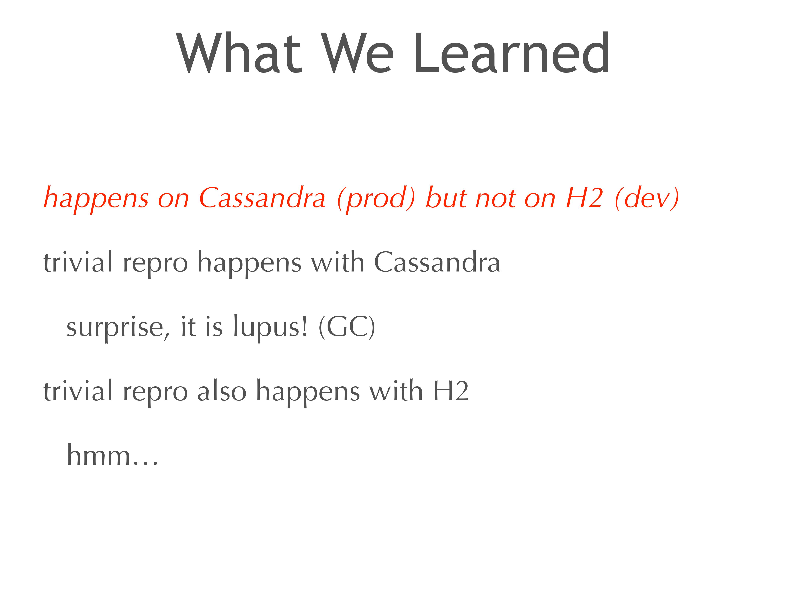

Well, so we did this and what did we learn? The problem happens on Cassandra - this is our statement: "happens on Cassandra but not on H2", so we create the trivial repro and it happens with Cassandra and guess what, it's lupus. 

So it turns out that this query was just using more memory than the JVM had and had no chance of winning. And so then it's like, well, that's pretty suspicious, because it's not at all obvious why Cassandra would be such a memory hog and use a ton more memory than H2. That seems really-you know, Cassandra has a good reputation, why would their driver, you know, be messed up like that? Well you know, stop hypothesizing ahead of the evidence: let's go test H2, the dev mode storage, and guess what, the trivial repro happens there as well. 

And that leads me to the other important observation that we get from House, which is it everybody lies:

Right? It turns out that it was not the case that the Cassandra and the H2 behavior was different. It turns out that there was a miscommunication about what had been tried. And so - and by the way: never attribute to malice what you can contribute to accidental miscommunication. This is not lying in the sense of covering up your drug use - which is always what it is on House , right? _(laughter)_ -, this is lying as in: saying a statement which turns out not to be true. I'm having a lot of trouble teaching my kids not to always call that lying, right, any statement which turns out not to be true later or turns out to be slightly mistaken, they're like: "Daddy you lied!". Like, actually, we tend to use that word to imply malice. So this is the non-malice kind of lying; this is the, you know, "go back and double-check statements". And again: going through the exercise of reproducing it - I mean, imagine how much fun we would have had if instead of doing  that we had sat across a conference table and the Datomic team had pointed at the Cassandra devs, and the Cassandra devs had pointed at that Datomic devs, and said, you know, "you guys have messed up somewhere because this works in other contexts!". Right? We didn't even have a problem statement you know until we did that. 

Now the final piece of advice I'll give you as software developers is that debugging is fundamentally a search operation. We should ponder that a little bit, because this is something we actually know how to do. Right, we actually know how to write algorithms that do it. So instead of limiting our thinking about debugging to the ability to see things or stop things, why don't we write programs that do this job that I just described? Right, implement the scientific method in code: make something that automatically generates a hypothesis, and then automatically runs an experiment, and some of you may have done that in a small way using git bisect:

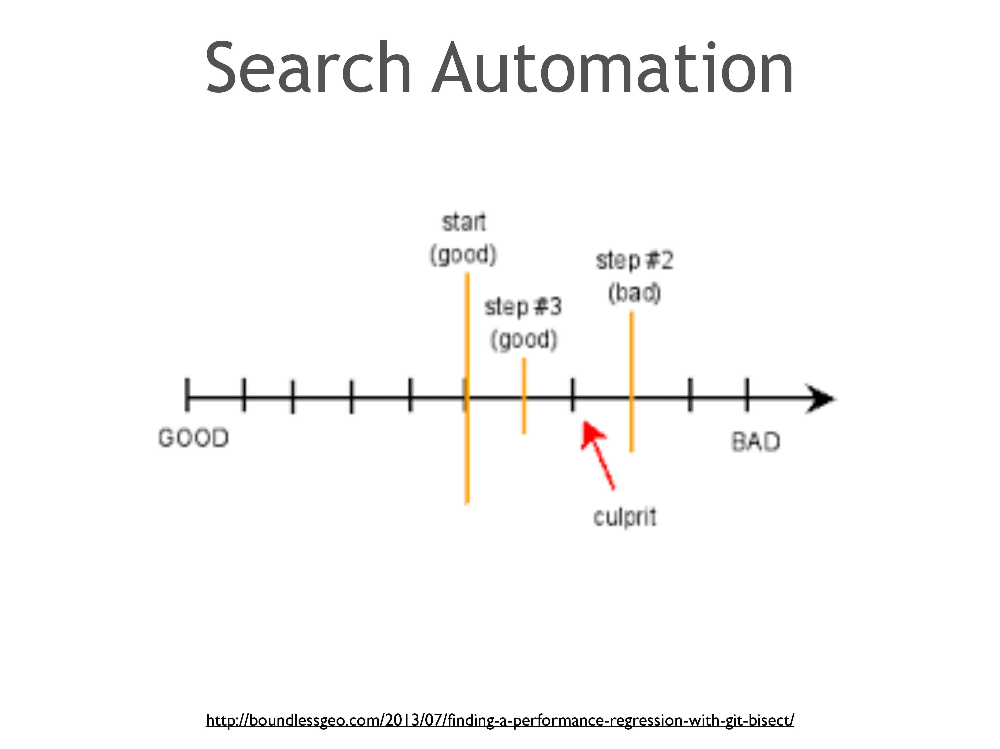

Right? Git bisect is actually partial automation of the scientific method. Right, you write a little program that's going to test for something, and then Git will bounce back and forth, cutting the world in half every time, until it finds the boundary at which your test changes. Right, that's automating the experiment part, and we have the set of possible world states already given to us from Git. Well this idea is well suited to being taken further, and so I'm going to give you your first maybe 'Clojure Conj call-to-action' this year, which is go and read this book:

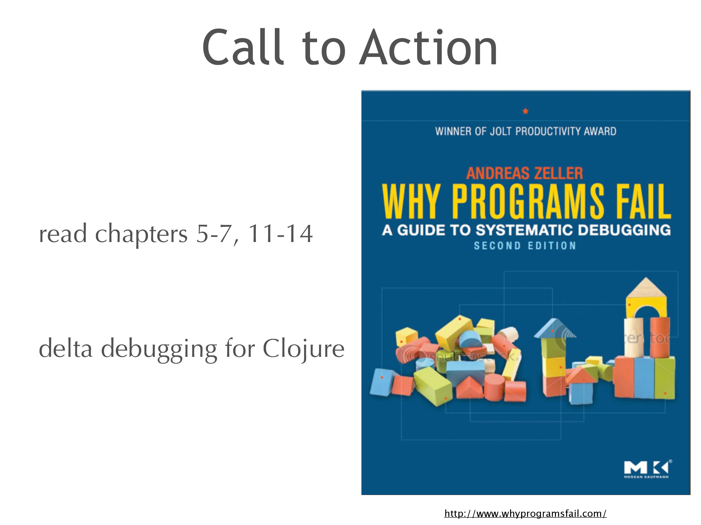

_Why programs fail_ by Andreas Zeller, and in particular there's a lot of ideas in this book that have now become standard practice, so there are chapters you can skip, but in particular read chapters 5 through 7 and chapters 11 through 14 which actually lay out algorithms for doing automatic debugging of programs. And so what they're doing is modeling the entire state space of a broken program, and the entire state space of similar programs that don't exhibit the failure, and then shrinking the difference in those state spaces - do we know how to do shrinking in the Clojure world? We're pretty good at that, right? We have `test.check` and `test.generative` - there are algorithms for this so I would love to see, maybe at Clojure/west, or maybe a Clojure/conj next year, somebody giving a talk about taking the ideas in this book and realizing them in Clojure. Most of the ideas in the book are demonstrated with Python code, and Python's a great language but we should not let them have all the fun. Right, this is a problem which is well suited for Clojure, because as you might imagine one of the places where this gets complicated is I can just glibly say "the entire state space of a succeeding application" and "the entire state space of a failing application", but how are you actually going to capture that? Well that's a hard problem, but it's easier in a language that doesn't have very much state. Right, so to the extent that it's possible at all, right, in a ball of mud Python program, it ought to be a lot easier to do in a Clojure program - and oh by the way, having a language that, you know, models code as data and passes everything around as data, we are uniquely in a good position to implement these kinds of algorithms.

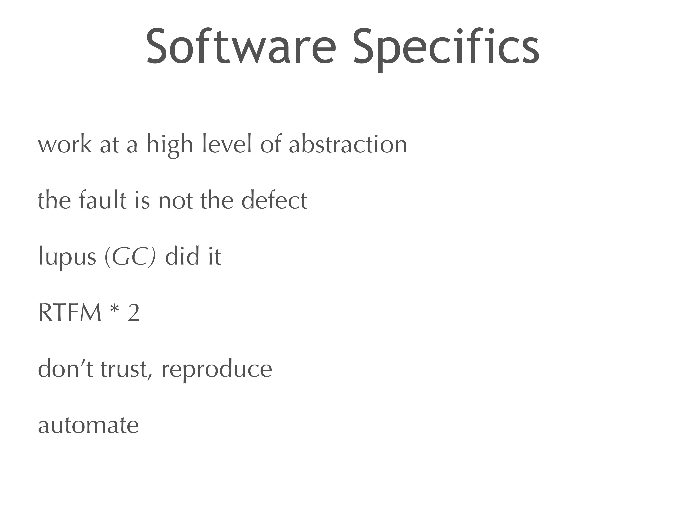

So that's the software specifics: 

* **work at a high level of abstraction,** 
* remember **the fault is not the defect,** 
* remember that **GC did it,** 
* **read the manual twice,** 
* **don't trust,** because people lie, **reproduce** 
* and let's go out and **automate some things.** 

And you know I've been told that six bullets is too many to remember at the end of a long day so I'll make that even simpler:

...and say let's back up and talk about science a little bit. It's really easy: know where you're going, right - remember Yogi Berra:  if you're heading into a particular direction, you have a much better chance of getting there; and then make well-founded choices. This is where developers, both beginner and expert, make the most frequent mistakes: they're under pressure, and something's not working, and you say - and we've all done it - and you say "you know what, I'm gonna try this". Stop and ask yourself: "why should I try that?" Stop and ask Plushy Cthulhu - you don't even have to talk to another person _(picks up a stuffed toy and pretends to talk to it)_, you could say: "Plushy Cthulhu, I had this idea about what's going wrong, and why my Keynote presentation didn't do what it was supposed to do during the middle of the talk, maybe you and I can sit down afterwards, I'm gonna talk you through, I'm gonna give you a hypothesis...".

The effort of doing that, and writing it down - that's the final thing once you've decided you're gonna take any kind of action, justify that in writing first write. These those two steps - making good choices and writing your steps down - are gonna turn a haphazard random walk around the problem into a directed, focused cruise to an easy solution, and an early night relaxing at the bar with your friends. 

Thank you very much! _(Applause)_

