# Are We There Yet?

* **Speaker: Rich Hickey**
* **Conference: [JVM Language Summit 2009](http://openjdk.java.net/projects/mlvm/jvmlangsummit/) - Sept 2009**
* **Video: [http://www.infoq.com/presentations/Are-We-There-Yet-Rich-Hickey](http://www.infoq.com/presentations/Are-We-There-Yet-Rich-Hickey)**

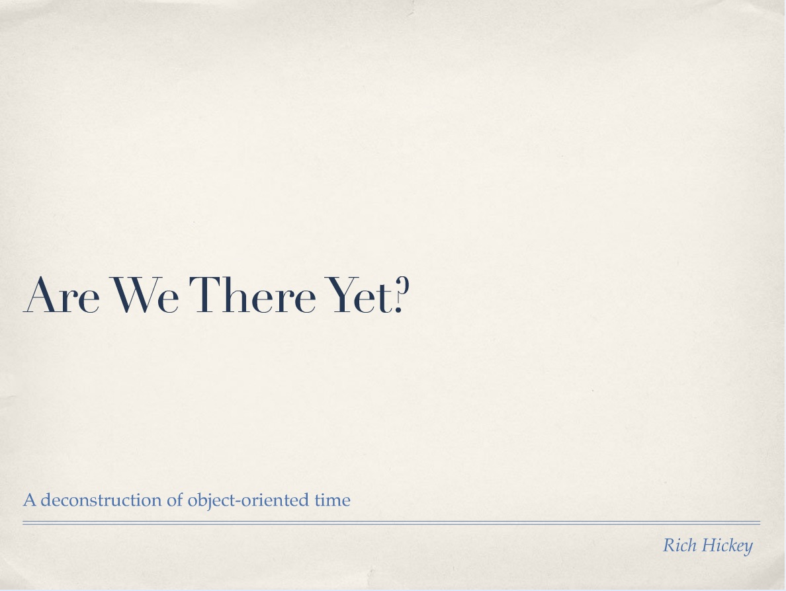

So I’m going to talk about time today. In particular, how we treat time in object-oriented languages generally and maybe how we fail to. So I’m trying to provoke you today to just reconsider some fundamental things that I just think we get so entrenched with what we do every day, we fail to step back and look at what exactly are we doing.

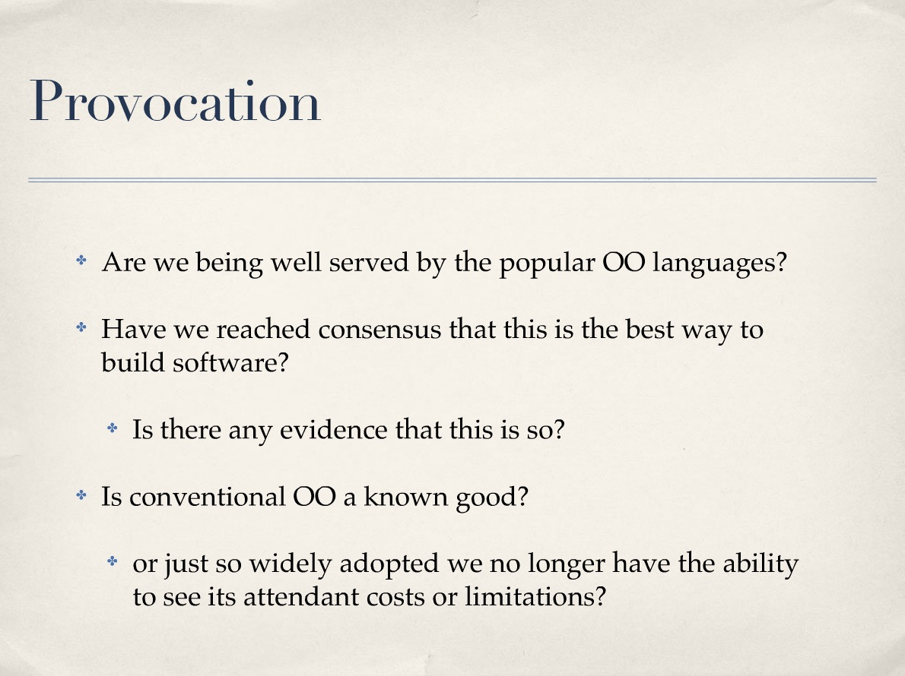

So are we being well-served by Object Orientation as commonly embodied, right? The concept is pretty broad and there are multiple possible embodiments, but it ends up the ones that we have have a lot of consistent attributes. Do we all agree this is the best way to write software? Do we think this will continue to be the best way?

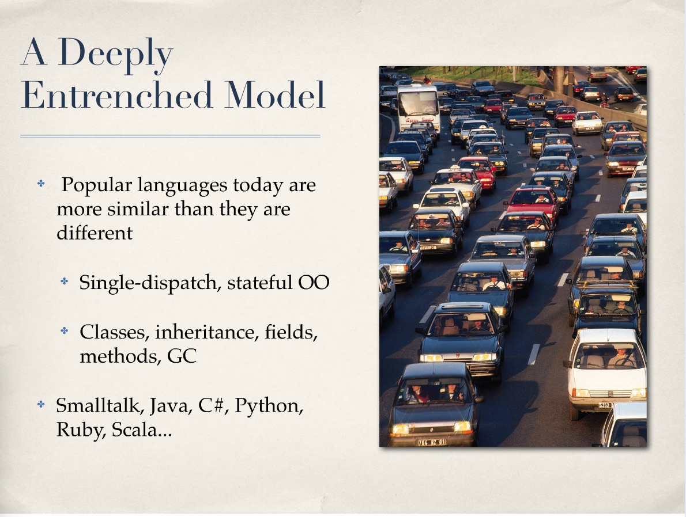

Certainly today, this is a really entrenched model. It doesn’t matter which language you’re using. Everybody has different languages that are groovy and whatnot. Scala and Java and people use C# and they love the differences between these languages and I want you to focus on the similarities between these languages, which is they’re all single-dispatch, stateful object-oriented languages and they have a lot of the same kinds of things in classes, some notion of classes, inheritance. Fields are interesting in concept. Methods are more interesting and we’ll talk about them later. They’re all garbage-collected and they have a heritage that goes back to languages like Smalltalk.

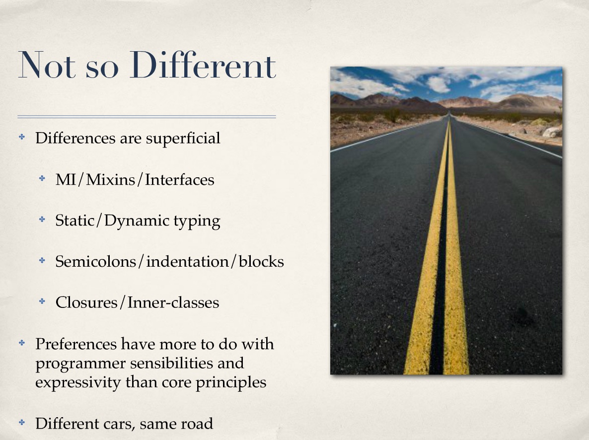

They’re not significantly different in some dimensions, right? They’re superficially different. They might have mix-ins and they have interfaces. Even static and dynamic typing, I think, is not nearly as important as some of the underpinnings that they share. Everybody is so excited because now there are languages without semicolons and other great choices that we have. But they have more to do with the sensibilities of the program where then they have to do with significant differences in the programming model. Okay? So they’re all different cars, but they’re all on the same road.

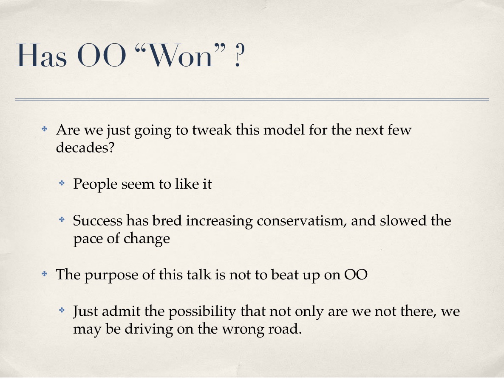

Is this the end? Are we done? Are we going to keep making languages that are just very, very slight incremental differences to the things that we know? Certainly, one thing is undeniable, people like Object Orientation. On the other hand, I think we’ve gotten increasingly conservative. And which makes sense. Of course, you get adopted by large companies, they have big investments, people know how to do it. It’s not something you’re going to move away from any too readily. And certainly, I want to emphasize, the purpose of this talk is not to beat up on OO, but to have everybody just take a step back; just imagine you don’t love it, if you do, and think about whether or not it’s perfect.

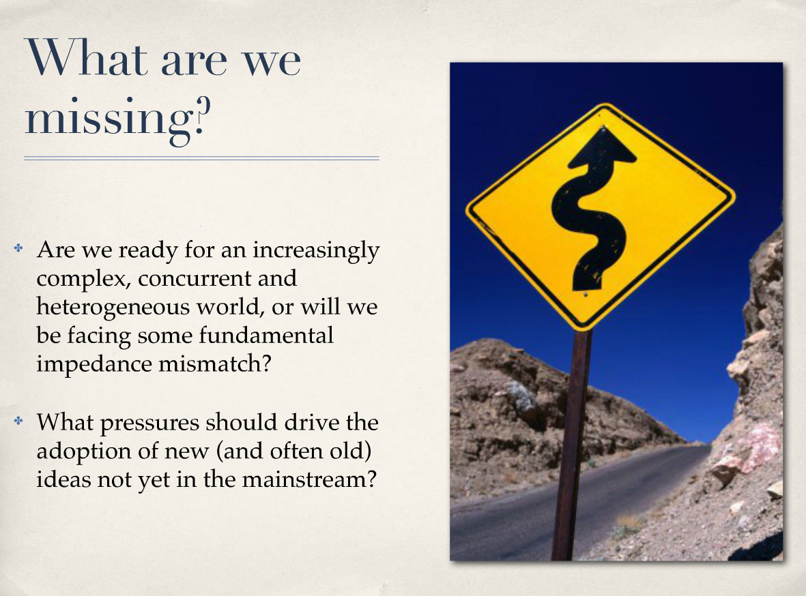

When we look at languages and try to think of if I could write another language or if I could fix this language or if I could make something – add a feature to the next version of the language – what would we do? Why do we add things? What drives us to make changes or what drives us to change cars to say, “I’m going to stop using this language and adopt this other language”? And what things should drive us to that? I don’t think a lot of people say, “Oh, I’m tired of semicolons. I can’t do it anymore; curly braces or something. I’m going to switch to something easier.” I think static and dynamic may cause people to switch, but I think there are examples already in our history that show us what causes us to switch.

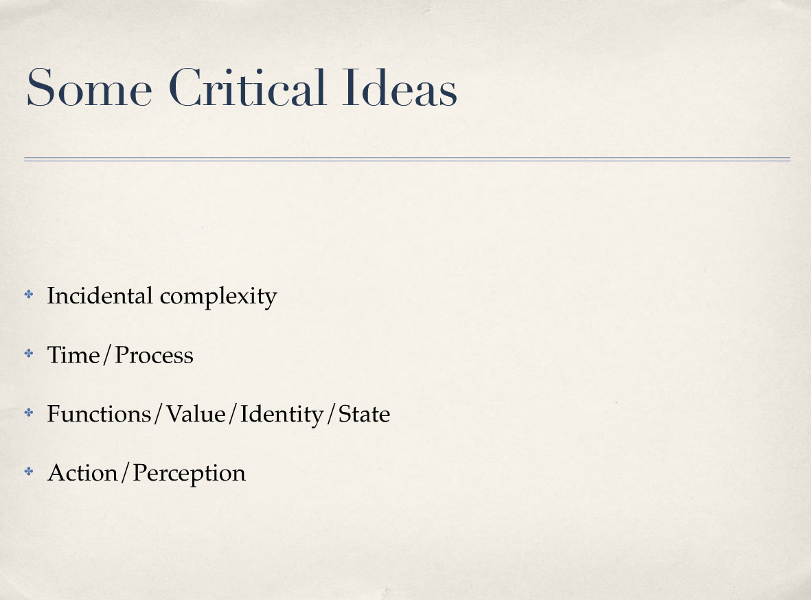

So the things I’m going to talk about today are a small subset of the kinds of things that I think you should think about when you look back at the language you’re using and try to decide whether or not you want to do something differently. I want to talk about complexity today. I want to talk about time. Mostly about time. And then, about models we can use to better implement time and some of the principles that underlie Object Orientation. It’s a modeling concept, right? It’s based around we can sort of do things in our programs that are similar to what we see in the world, and that helps us understand our programs.

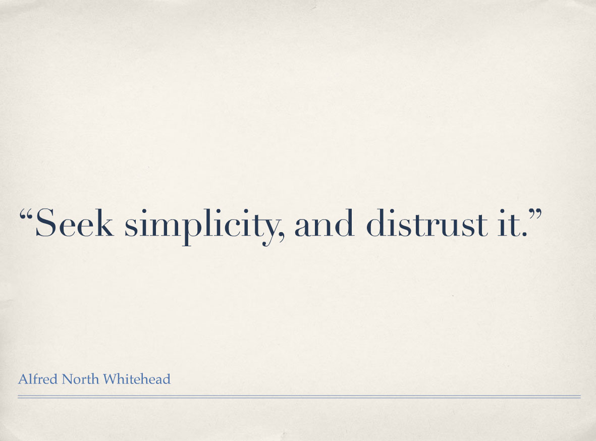

So the hero of the talk today is Alfred North Whitehead. Right? He’s the famous guy who with Russell wrote Principia Mathematica. Subsequent to that, he also became a philosopher and he wrote some great things and I’m just going to put them up here because they’re great. So the first thing is distrust simplicity. I don’t want to talk actually about the complexity of the problems we’re trying to solve. We all know we’re given increasingly more complex problems to solve, bigger problems, more data, more flexibility. Expectations of people for software will only ever increase. 

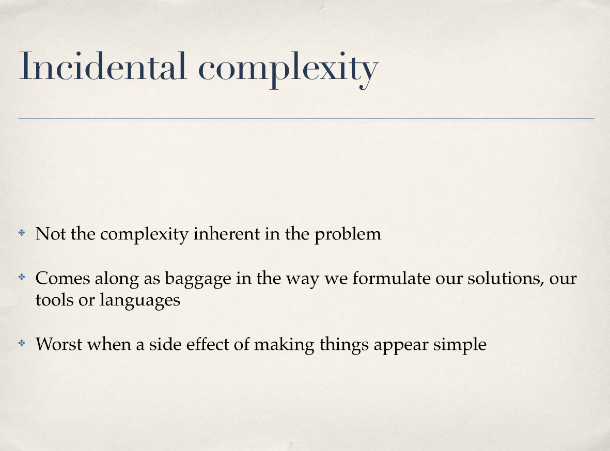

The complexity I want to talk about today is the incidental complexity. The complexity that arises from the way our tools work, from the ideas that embody our tools, from the ways our tools don’t work, from the ways our approaches don’t work. These things all become problems that we have to solve and we have a certain number of hours in the day we have to solve problems. Are the problems you’re solving the problems of the application domain or the problems you’ve set in front of yourself by choosing a particular language or tool or development strategy? So that’s incidental complexity. It’s coming along for the ride. It’s not part of the problem you’re trying to solve.

And it’s worse, I think. I mean, everybody knows when something is complex and you look at it, it says, “Arrr!!! Complex!” And everybody says, “Okay. Well I see that. That is scary. I know that’s a danger zone. I know I’m going to be careful with that.” The worst kind of incidental complexity is the kind that’s disguised as simplicity. “Look how easy this is! There’s no semicolons.” I don’t want to beat up on those semicolons. It’s just an easy way to say, “Look, at some superficial aspect of language I’m using, this seems easy, this seems familiar,” but is there incidental complexity hiding underneath it? 

So, this is an example. Again, not to beat up on C++, but I spent more than a decade doing this. So, it’s not that hard. I mean, if you get into template metaprogramming, it can get hard. But the basics are pretty simple, right? You can write a function that returns a pointer. What’s wrong with that? It’s pretty simple. There’s new and delete and there’s pointers and you can pass them around and you can dereference them. There’s only like five things you need to know. You can learn them in an afternoon.
So it is really simple. For instance, the same syntax is used to refer to things on a heap and things that are not on a heap; these pointers. But it gets worse, right? And the real problem with that function signature is what do you do with the thing that you get when you call it? Is it yours? Is it now your responsibility? Do you have to delete it later? Is it even something that can be deleted? Can you hand it to somebody else? Is that allowed? Could you save it?

So the problem there was there’s no standard automatic memory management. Right? There’s no garbage collection. And this was, and still is, for people using this language, a big source of incidental complexity. Right? Because managing memory is on you. You don’t see that. There’s not a sign on the top of your source code, “Don’t forget; managing memory is on your head.” Right? This is incidental complexity. You have to just know that. It’s not in the source code.

And it’s a big problem. I think the lack of garbage collection really impeded C++ in one of its design objectives, which is it’s supposed to be a library language. All the original design stuff and any time you heard Stroustrup talk about it, it’s like C++ is going to be a library language. But it only ever ended up being a parochial library language. Every shop had a library, but there weren't a library, and still not a lot of libraries that go between places because of this problem. And we know that Java, having garbage collection, has this huge library infrastructure. So I think people that moved from C++ to Java did so in no small part due to the fact that they were no longer willing to bear this implicit complexity. I don’t want to do manual memory management. It’s not part of the problem I’m trying to solve at all. It’s just another problem on my plate every day when I go to work and I don’t want to do it.

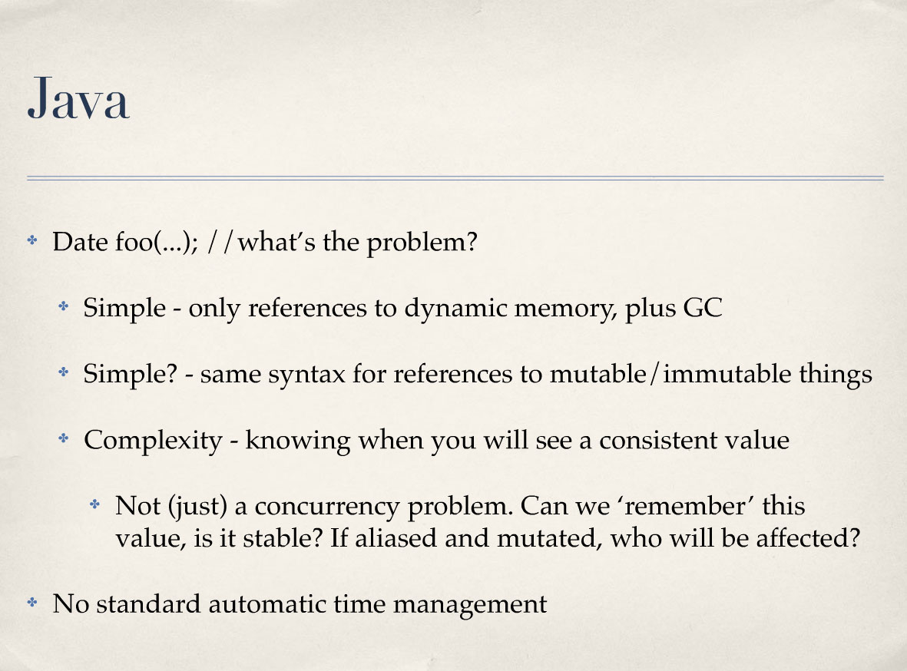

So, let’s look at Java. It’s easier; there’s no asterisk. This is like even better. So what’s the problem with this? It’s simpler, it’s definitely simpler. Right? Now, we only have references to managed memory and we have automatic memory management. We have garbage collection. This is much, much better. It’s much easier. Except, again, we have this hidden complexity. Right? Is this a mutable thing or not? When will I see a consistent value? If I look at this right now and I walk through its fields, will some of the things I’ve seen represent a consistent value? All right. This isn’t just a concurrency problem. Right? There is a concurrency problem and it’s a big one.

But even before we had threads and all that part, this is a big source of incidental complexity in programs because we don’t know when we have a stable value. Right? Can I store this date off and look at it later and know I’m going to see what I saw when I was handed it? You don’t know. In addition, if you hand a date or some mutable thing – I mean, I know the mutable things have been all deprecated. They’re fixing date or whatever. I’m not trying to beat up on date. But if you hand a mutable thing to somebody and they may hand it to other people, and then you need to change it, who is going to be affected by that? You have no idea.

So this looks really easy. Now, this is true. This is not just Java. This is every single language I listed that allows for mutable objects has this problem and there’s no way to fix it. So what’s the problem here? I’m going to say the problem here is we don’t have any standard time management. Okay? That may be a really confusing thing. Hopefully, it won’t be as we go along.

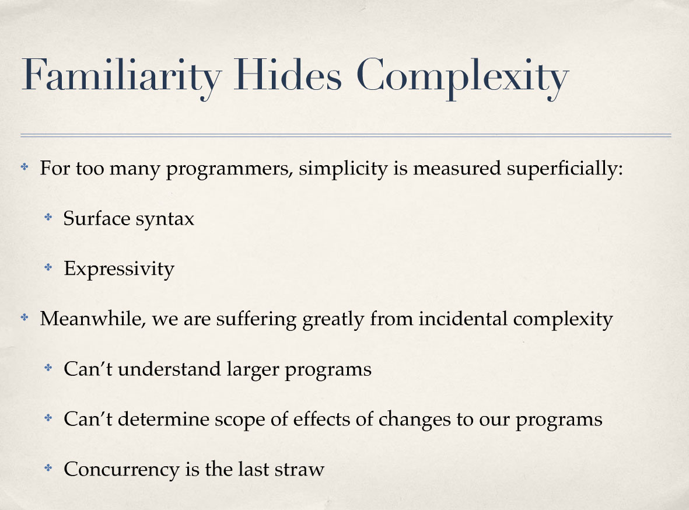

So, this is kind of a little bit of a reiteration of the points I was making before. I think that because we’re so familiar with this, we’re absolutely, completely blind to it. Right? And when we choose languages or when people choose different languages, a lot of times, they make the decision on very superficial differences like the syntax or perhaps sort of this makes me feel good, expressivity differences, which I admit completely are real and valid, but they’re somewhat emotional. In the meantime, our systems are getting very, very hard to build, maintain and make correct. And in no small part, that’s due to this incidental complexity. We can’t understand big programs. Right? We have these giant test suites, right? And we’ve run them every time we changed any little thing. Because we don’t know if we change something over here, that it’s not going to break something over there. And we can’t know. And I think for me, and I think for many people, we’re going to find concurrency just is the straw that breaks the camel’s back in this area.

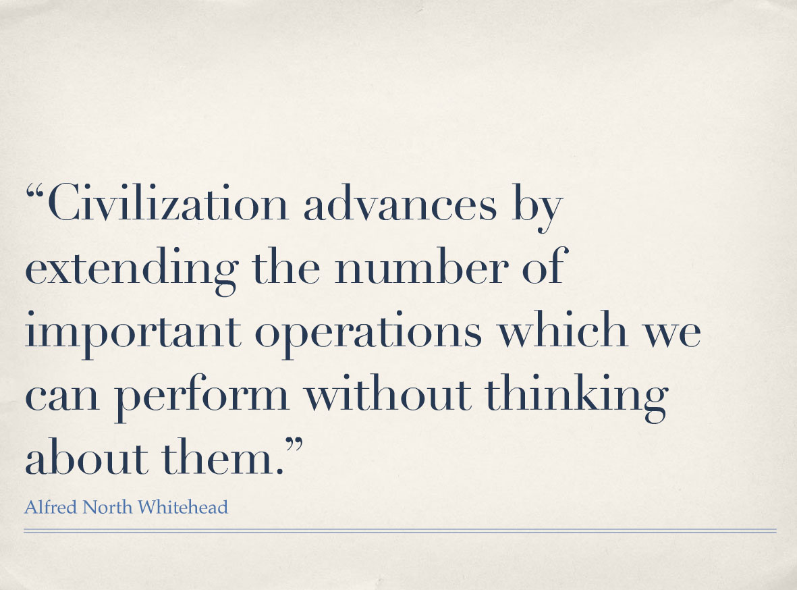

So we’re programmers. We don’t use assembly language anymore. We have languages. Right? Each time we build a new language or we use a new language, we’re expecting some benefits in this area. Right? We want to hide chunks of stuff, name them, encapsulate them, get them out of our way so we do not have to think about them and we can build something on top of that. I mean, somebody who’s building houses out of bricks does not need to worry about the inside of bricks. Right? They have certain properties, they have certain expectations. And I think it’s one of the selling points of Object Orientation, that this is a way to make these kinds of units that we can combine to make programs that are easy to understand. Because we understand the pieces, when we put the pieces together, we get something we can understand.

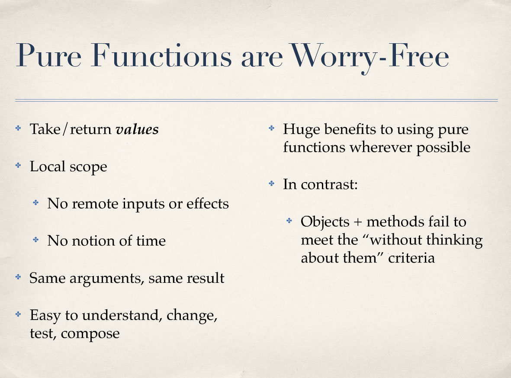

It ends up that they’re really not the best unit for that. The best unit for that are functions. And in particular, pure functions. Right? If you want something you do not have to worry about, you should love the pure function. The pure function takes immutable values. It does something with them. That stuff it does has no effect on the world and no connection on the rest of the outside world. Then it returns another immutable thing.

So the entire scope of its activity is local. It has no notion of time. That’s going to become important later. But it’s definitely easy to understand. It’s easy to change. Right? There’s some signature. That’s the only thing about it anybody else knows. When we change the insides, nobody cares. Pure functions are and should be the bricks that we use because they are the things we can use without worrying about them most readily. There are definitely huge benefits from doing this. I think you could easily do it in object-oriented languages, but people don’t.

In contrast, objects and methods do not have this property. They do not have the “I don’t need to think about them” property. They definitely don’t. And we’re going to see why in a minute.

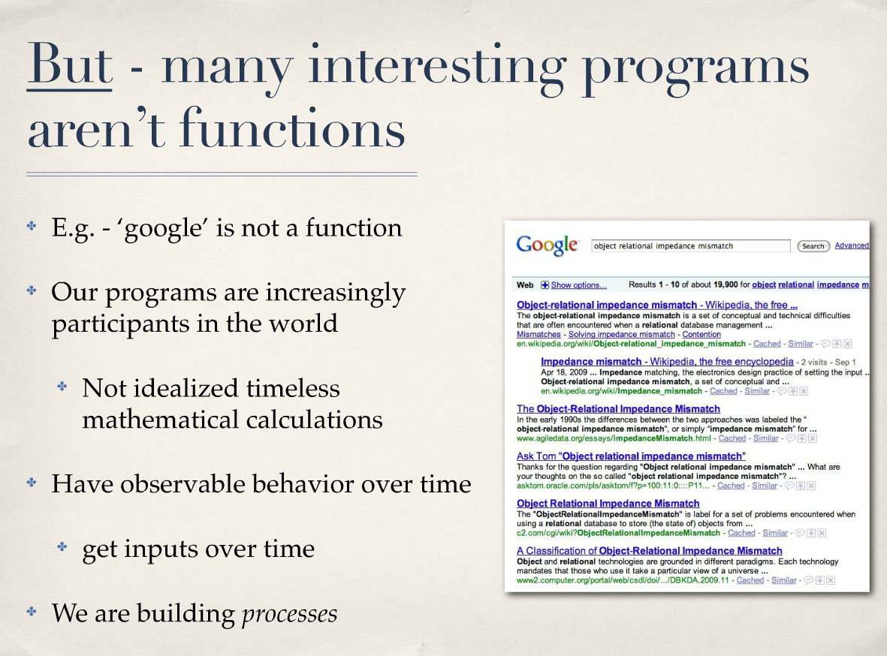

On the other hand, as great as functions are as building blocks, our programs in general are not functions. Okay? There are programs that are functions, right? There are compilers and theorem provers. Take this stuff and convert it or whatever. But a lot of programs run indefinitely long and people have an expectation of being able to see their behavior, to have inputs as the program runs. Right? And get something different every time.

I don’t want Google to return the same result every time I type the same word into it. Google wouldn’t work for me then. If Google was a function, it would be no good. Okay? Google is a process that’s connected to the rest of the world. It’s scouring pages and integrating them and forming algorithms, which hopefully also should change. As a whole, it feels much more like a participant in the world than a function anymore. It’s not an idealized calculation. So we can say that the entire program has this behavior we can observe over time, although you’ll see I don’t like the word “behavior.” So most programs, most programs that most people work on in industry are processes.

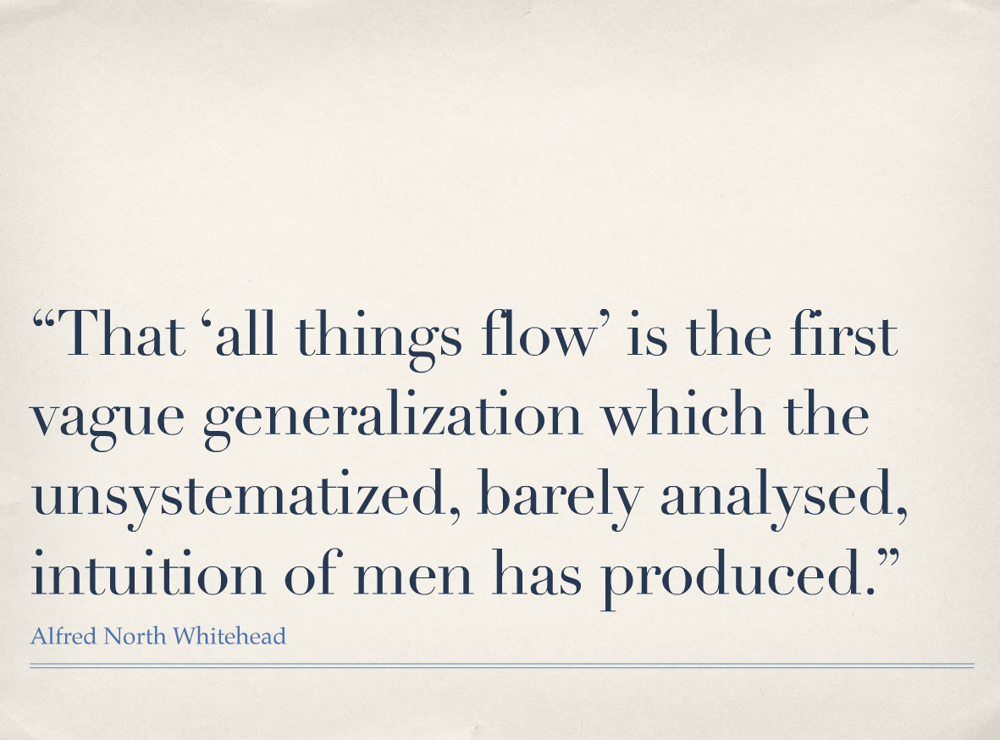

So maybe we haven’t seen the value of functions. I certainly don’t think we have. But we also have seen the limitations. Object Orientation was a way to say, “Well, you know, functions are great and they’re great for calculations and all those stuff. But then I see the real world and there are objects and there are windowing systems and there are things.” And Object Orientation was a way to say, “All right. Well how do we take our mental model for the processes we see in the world and embody them in some kind of programming model?” Right? And so, the essence of the Object-Oriented program is not encapsulation, blah, blah, blah. It’s really that behavior, that flow-like thing. We have these entities we see doing things in the world. We should have entities that do things in our programs.

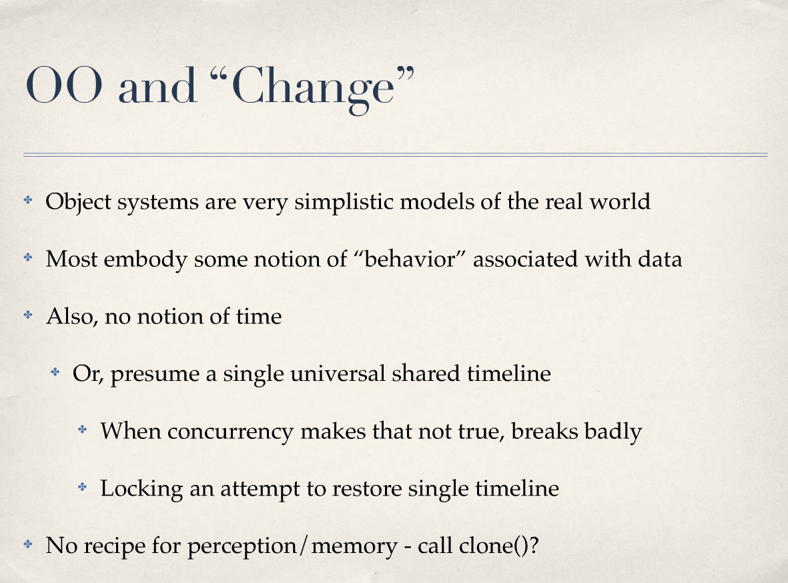

So, the first thing we should realize, that any program model is going to be – that tries to model the real world - is essentially going to be a simplistic thing. Okay? But again, there’s that "beware of simplicity." Is this thing too simple to do the job correctly? Right? One of the problems with object-oriented time is that we talk about behavior and state and things like that really, really loosely. These terms are almost completely meaningless.

And in addition, even though objects putatively are about process, there’s no notion, no concrete notion of time in objects. No more so than there are in functions. But at least functions aren’t pretending to play with time. Functions say there’s no time. Right? There’s my inputs and my outputs. I’m not pretending to deal with time. Objects are pretending to deal with time. And yet, our object systems don’t have any reified notion of time. There’s nothing you can talk about explicitly because most of them were born in the day when your program ruled the computer. You had a single monotonic execution flow and it just did what it wanted; do this, do that. There was a single universal process controlling everything.

Now that that’s no longer true, we try to use locks to restore that vision of the world. But that vision of the world was never correct. And you can tell in one key way because we still, even with all the locks and everything else, we still don’t really have a concrete representation we can use for perception. Can I look at something and see it be stable? Or memory. Can I remember that? Right? These objects are all live. They’re time bombs. Right? We have gotten this wrong. The object-oriented model has gotten time wrong.

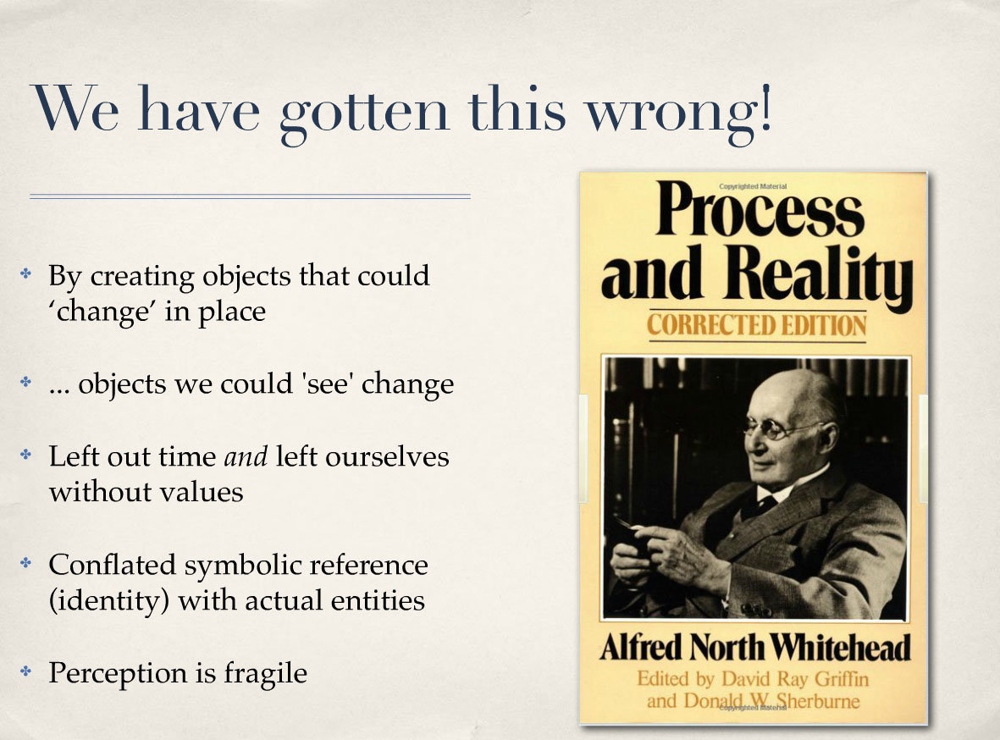

And we’ve done so in a couple of ways. The first is we’ve made objects that can change in place and we’ve made objects that we could see change in place. Right? As I’ve said, we left out any concrete notion of time and there’s no proper notion of values. Okay? You can fabricate values. Right? You can make a class that has all immutable components, and that would constitute a value. But there’s no proper notion of value in a lot of these languages.

The biggest problem we have is we’ve conflated two things. We’ve said the idea that I attach to this thing that lasts over time is the thing that lasts over time. And that’s not actually true. In addition, as I said before, it really is perceived as fragile.

So I have the hero of the day, Whitehead up here. Who, subsequent to doing all the Principia Mathematica stuff, as I said, became a philosopher, and he tried to concern himself with how does the world actually work informed by the current knowledge, which this was back in the ‘20s, of Quantum Mechanics and Relativity. And one of the things that he came up with was the fact that time must be atomic and move in chunks. And in fact, time isn’t actually a real thing you can touch, but it’s something that you derive from seeing these epochal transitions.

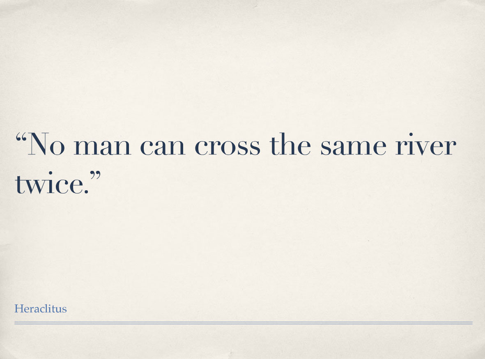

So I’m going to explain that more, but this is a great quote. Right? “No man can ever cross the same river twice.” Because what’s a river? I mean, we love this idea of objects; like there’s this thing that changes. Right? There’s no river. Right? There’s water there at one point-in-time. And another point-in-time, there’s other water there. Right? River; it’s all in here [the mind]. Okay?

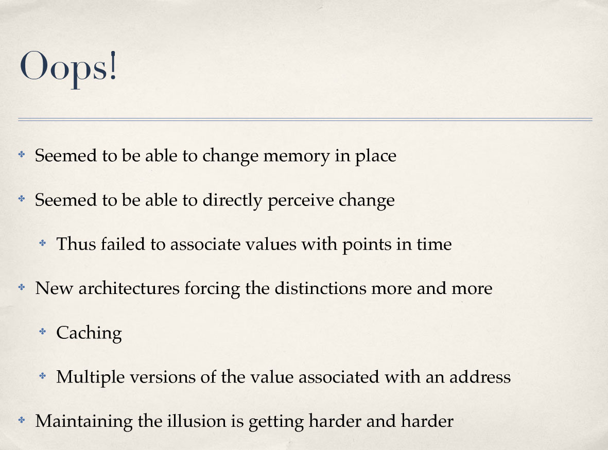

So how did we make this mistake? What’s the real nature of this mistake? Right? It looked like we could change memory in place. Right? We were doing it. There’s PEEK and POKE and it looked like we could see that. We could read. But there was nothing about what we were putting in memory that had any correlation to time. Right? It was live again. And now we’re finding, “Well, look at these new computer architectures. Where is the variable?” Well, there’s one version over here from one point-in-time. Right? And another one over here. And that’s on its way to a place that this over there might see at some point. It’s live. Now we see the problem. Right? There are no changing values. There’s values at points in time and all you’re ever going to get is the value for a point-in-time. Right? And values don’t change. Right?

So the biggest key insight of Whitehead was there’s no such thing as a mutable object. We’ve invented them. We need to uninvent them. Okay? And Whitehead’s model, which I am grossly oversimplifying. Okay? I don’t even understand it. The book is completely daunting, but it’s full of really cool insights. And what’s he’s built is a model that says there’s this immutable thing. Then there’s a process in the universe that’s going to create the next immutable thing.

And entities that we see as continuous are a superimposition we place on a bunch of values that are causally-related. We see things happen over time and we say, “Oh, that’s Fred!” or “Oh, that’s the river outside the back of my house” or “That’s a cloud.” Right? We know you can look at a cloud for enough time, and all of a sudden it’s like, well, that was three clouds or the cloud disappeared. Right? There is no cloud changing. Right? You superimpose the notion of cloud on a series of related cloud values.

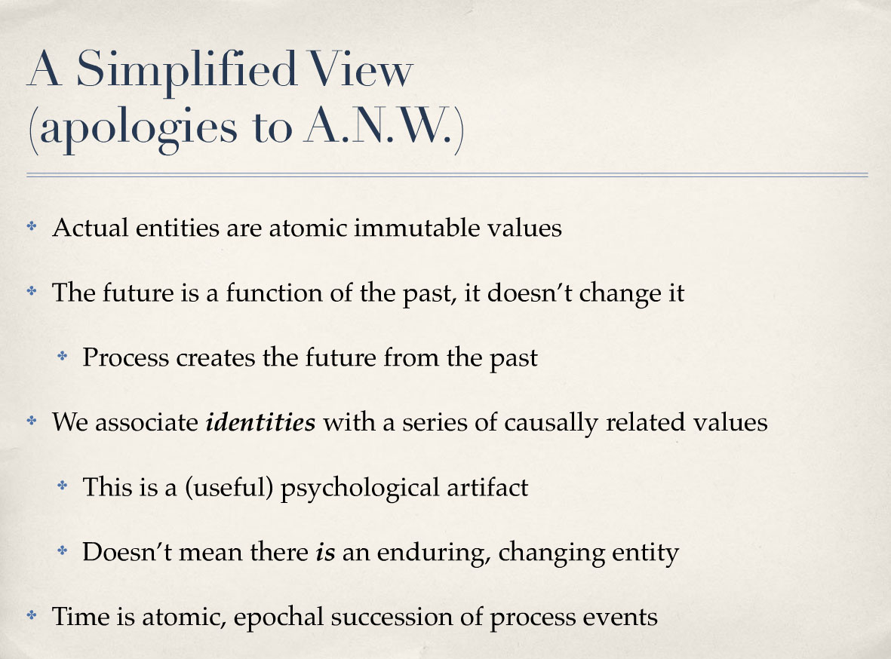

So, here are the rules. Again, I am not restating Whitehead. I’m making this up now. Okay? Actual entities are immutable. Right? When you have a new thing, it’s a function in that pure functional sense that I just talked about of the past. So the future is a function of the past and processes and the notion of process is what creates the future from the past. Identities are mental constructs. Okay? We call it a cloud, we call it a river, we call him Fred. It’s an extremely useful psychological artifact. That’s why we have object-oriented languages. This is useful to us. It helps us understand things. But we have to make sure we understand that objects are not things that change over time. Right?

We superimpose object on a set of values we saw over time. That’s an object. So just because we like to think of it this way, because it’s important to us to understand the causality. You know, lion, lion, lion, lion, lion… I better go. Right? That doesn’t mean there is a lion that’s changing. There isn’t. And then, time then is strictly, again, a derivative of this series of events. Okay?

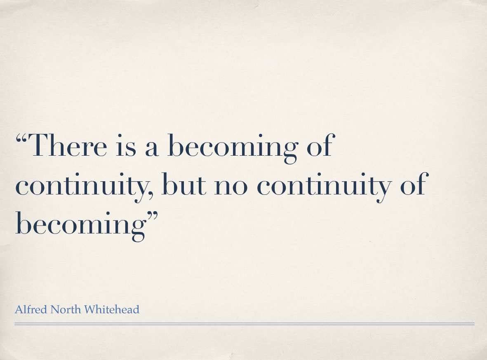

So Whitehead’s great quote, which is extremely confusing, but I think it’s something that you could try to get right now and remember as I keep going, is that there’s a becoming of continuity. Right? There’s this process in the universe that’s creating successive values. Right? And that allows us to say, “Oh, continuity? Great.” It’s not the other way around. 

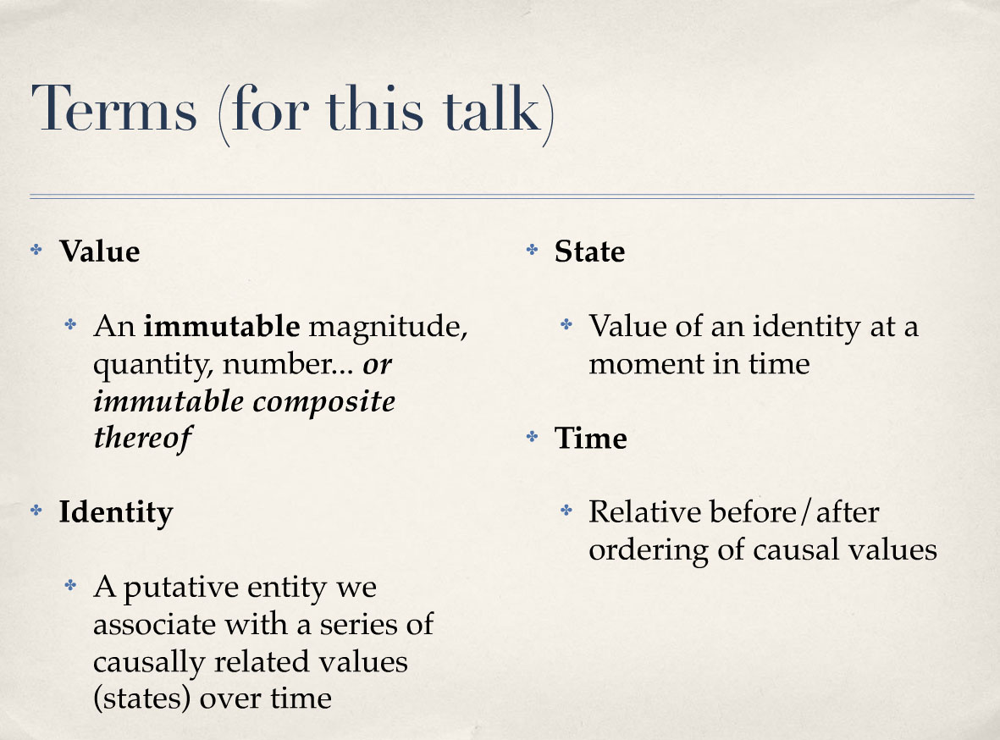

So now we’re completely out of Whitehead terms. He has a whole bunch of his own terms. But these are the terms I want to use to talk about the rest of this problem. The first is the notion of a “value.” We need a very proper notion of a value. Right? We tend to have a decent notion of a value when we say “42.” We have a much weaker notion of a value when we talk about dates. So the key characteristic of a value is that it’s immutable. Okay? It could be a magnitude, it could be something like that, or any composite of those things that’s also immutable is a value. These are extremely important to us. Right?

Then we have “identity.” Identity, again, is the psychological construct. We’re going to see a succession of values whose causation is related. Right? One was caused from the previous that was caused from the previous. And we’re going to say Fred. Fred, again, is a label. Right? The important thing is this identity, which is just a construct we use to collect the time series.

A “state” is not something you can change. The state is a snapshot. This entity has this value at this point-in-time. That’s state. So, the concept of mutable state, it makes no sense. Mutable objects, they make no sense.

And finally, we have “time.” Time is a completely relative thing. All time can ever tell you is this thing happened before or after that other thing or at the same point. Okay? It’s not a measurable thing. It doesn’t have dimension.

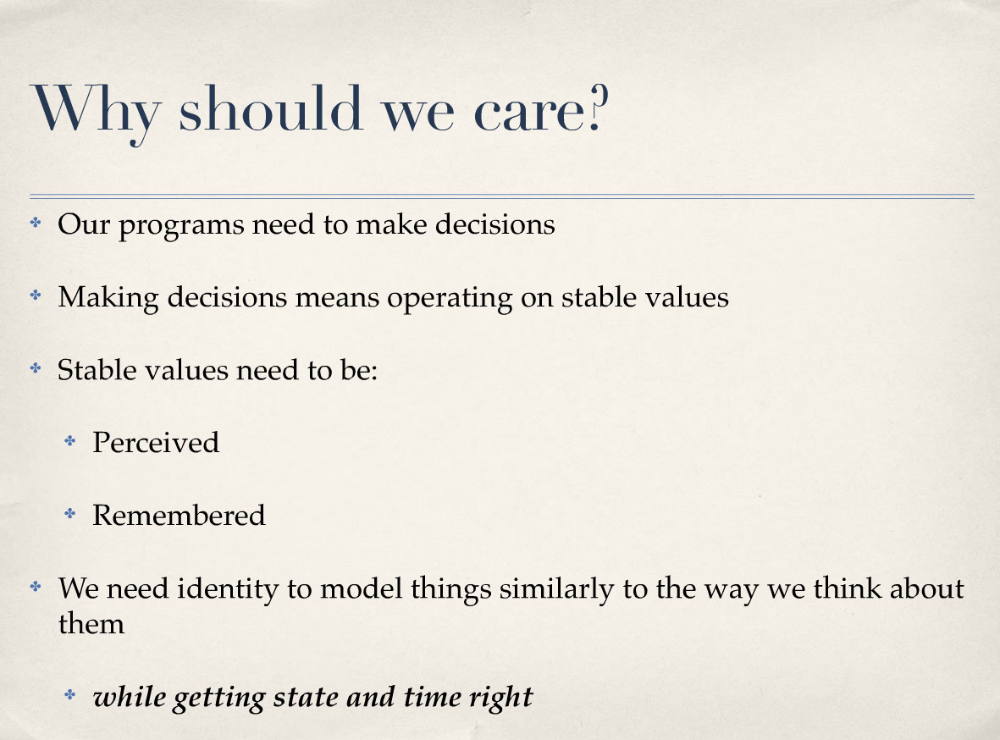

This all sounds kind of highfalutin. Why do we care about this? We care about it because we’re trying to make programs that make decisions. Right? We have logic in our programs. You can’t have logic on top of rivers that can change. Okay? You can only have logic on top of values. Right? So we need stable values. And we need to collect them from other parts of our program. We need to see stable values. We need to be able to remember them. So I’m using the word “perceived.” I understand completely perception is an incredibly intricate and unresolved mental phenomenon. But I like it better than just “observe” because I can observe the entire room, but perception really is kind of that division into entities. It’s a little bit finer.

On the other hand, I do think we need identity. I mean, I think that the appeal of Object Orientation is valid. Right? We care about this because it’s the way we’re thinking about the world all the time. If I have to change completely the way I’m thinking about the world in order to write a program, my life is going to be hard. If I can somehow carry over from the way I think about the world something to the way I write my program, it will be easier. Okay?

But, we can’t screw up time and state the way we have and have it still be easier because it’s now wrong. So it looks, “Oh, I understand those objects. I understand,” but it’s not right.

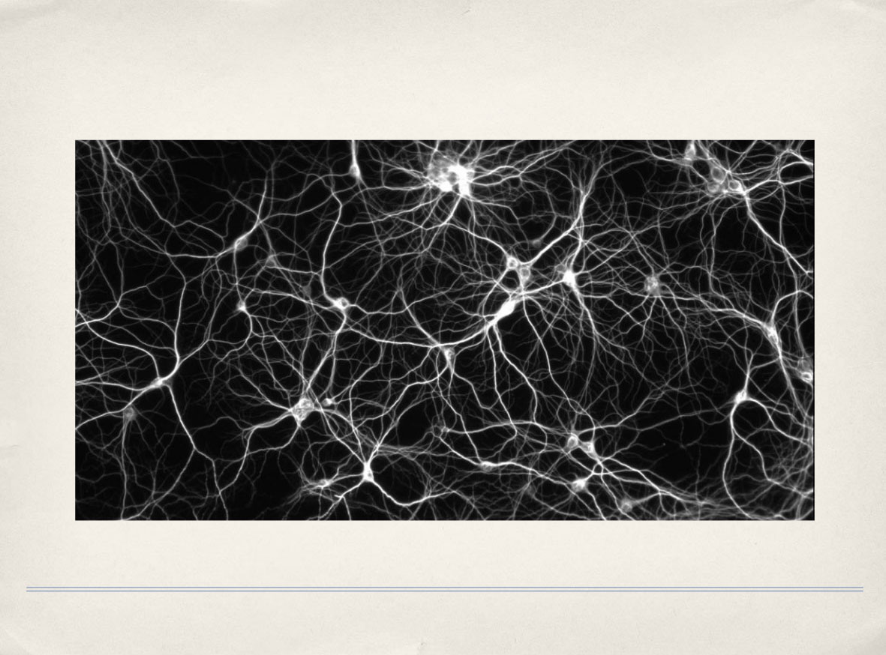

So I saw this great talk at JavaOne where the people wrote Head First Java, which is a fantastic book, talked about... Well the guy talked about – I forget his name, I’m sorry – you should put a slide of a lion in your talk because it will get everybody like scared, and then they’ll be more receptive. So, this is my lion.

[laughter]

Okay. So, let’s just try to like pull that theoretical mumbo jumbo down to something we can use to write programs. 

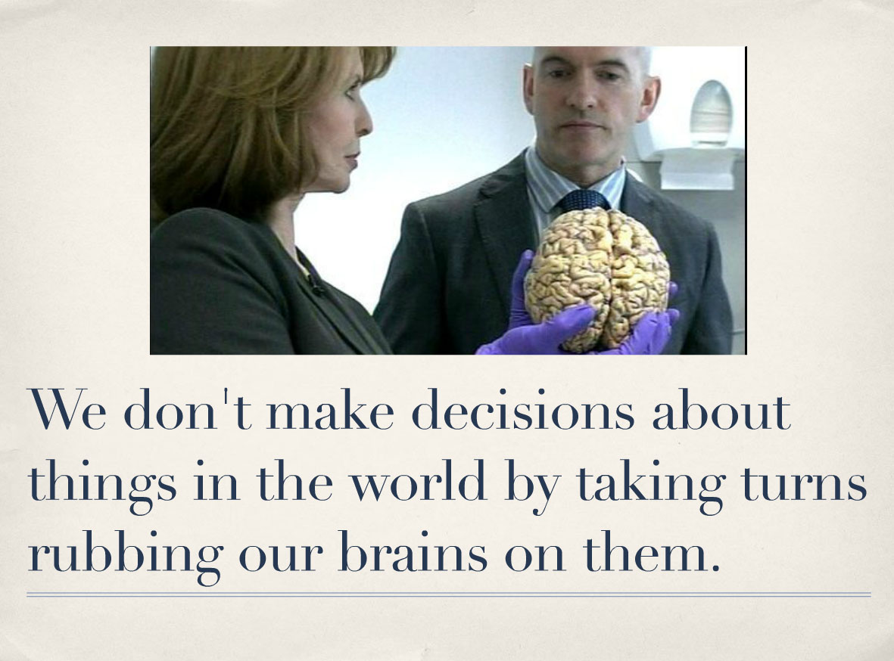

The first thing we need to understand is we don’t make decisions about the world by direct cognition. We don’t take our brains and rub it on the table. We don’t rub it on Fred. There’s a disconnect between our logical system and the actual world. Okay? It’s not live. Right? This whole liveness we have from “I can see memory,” that’s not how it works. 

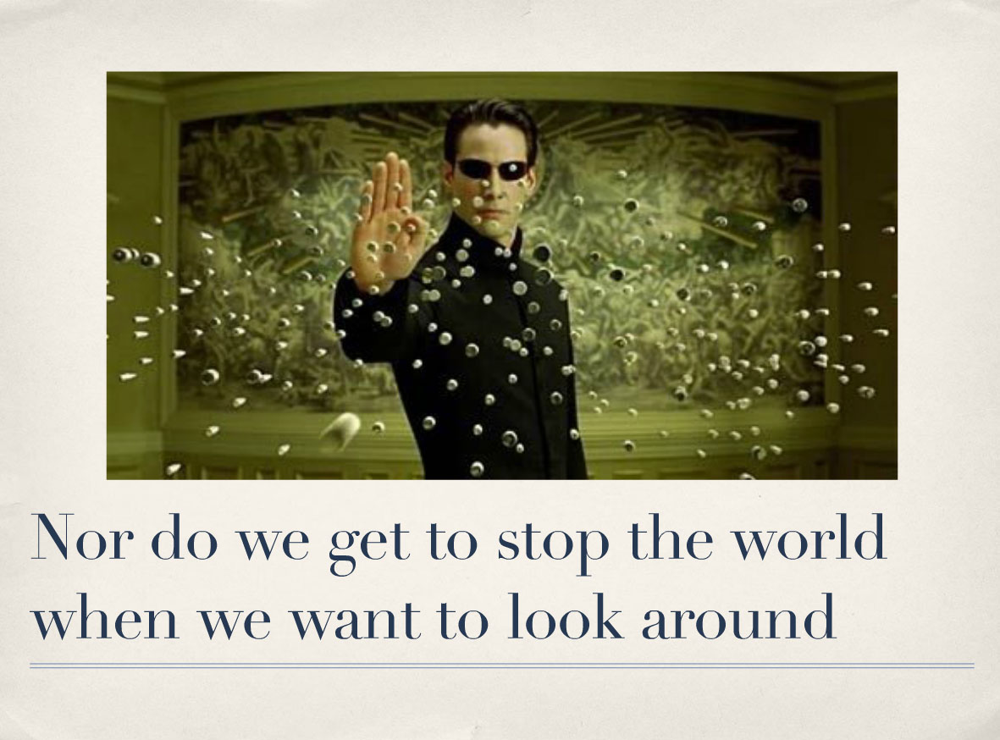

The other thing we don’t get to do in the real world, right? If we’re going to model the real world, we don’t get to do this – Wait! Okay. Okay. We don’t get to stop the world, especially not to observe it. Okay? But what do we do in our programs all the time? Stop! Wait! Stop! Wait! Hold on! Everybody’s trying to stop the world so they can control it completely. As we get more concurrent, we’re going to need to learn to live in a world that’s going to proceed in spite of our intention or desire or best wishes that it would not because it would be a lot easier for us if it wouldn’t. It’s going to. We’re not going to achieve the degrees of parallelism and the concurrency we want until we can accept this and embrace it.

So we need to look more carefully. Well how does perception actually work? We don’t rub our brains on it. We don’t stop the world.

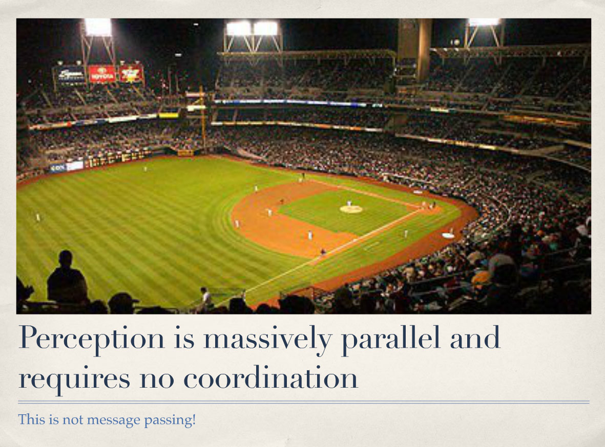

It is incredibly parallel. Right? There's umpteen thousand people in the stadium, they can all watch the game. They don’t say, “Whoa, whoa, whoa! Let me look at you.” They’ll say, “Hang on! Let me take a picture.” They don’t need to. Right? They can take a picture and the game can keep going. Right?

So the first thing is perception is uncoordinated. Okay? It’s massively parallel. It is not message passing. Okay? There’s no communication between the people who want to see the game and the game. 

So, we can again look again. We’re trying to model reality so we can look at reality a little bit. How do we do it? How does the wetware do it? 

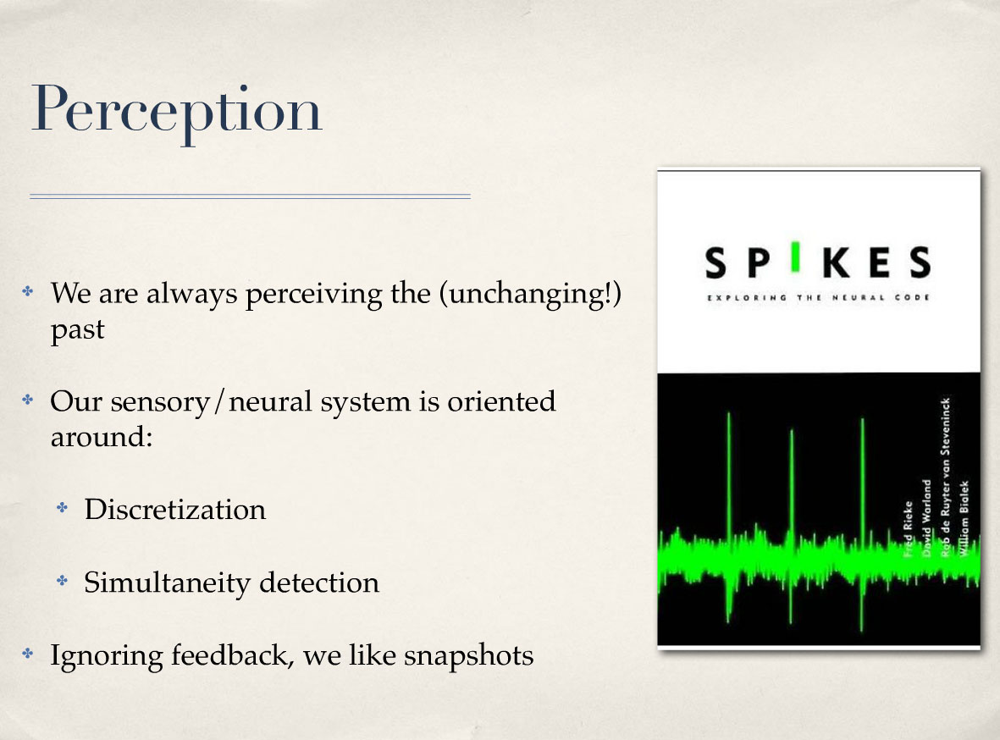

Well it ends up that the first thing you have to realize is we’re always considering the past. We’re never perceiving the present. Right? There’s the propagation of light. It hits my sensory system. It’s an incredibly slow system that carries that to my brain. By the time I’m making the decision about anything, I am using the past. I am always calculating with the past because we are not able to impede time, right? We can’t stop the world. And so, the world is absolutely continued.

It seems instantaneous. I see the person in the front row here, but they could leave. Right? Depending on how much time and how much distance because light is pretty fast. Again, it’s like tricky. Like electrons. It makes us think that we’re looking at memory right now. But it’s really not. It’s always the past. We’re always perceiving the past.

The other thing to pick up from looking at our sensory system is the fact that they’re incredibly oriented around discrete events. Okay? We have neurons that carry chemical signals, which could be continuous. And we could have built brains that were continuous. Right? That somehow took the world and consider it like this moving thing. And the moving thing comes into our brain and it’s all moving around. Okay?

Guess what? We didn’t do that. Evolution did not do that. Why? Because that’s a mess! Right? You cannot do logic if everything you’re trying to consider is moving around. So, what do our neurons do? They build stuff up, and then they go, “Boing!” They discretize the input.

What’s the next thing that we do? We say, “Whoa! 10 things happened at the same time.” Right? So we discretize things. And then, we love simultaneity. We have simultaneity detectors. That’s where our brains are at a lower level. Okay?

So of course, we like snapshots. Okay? Snapshots are good. They help us think. They’re like values.

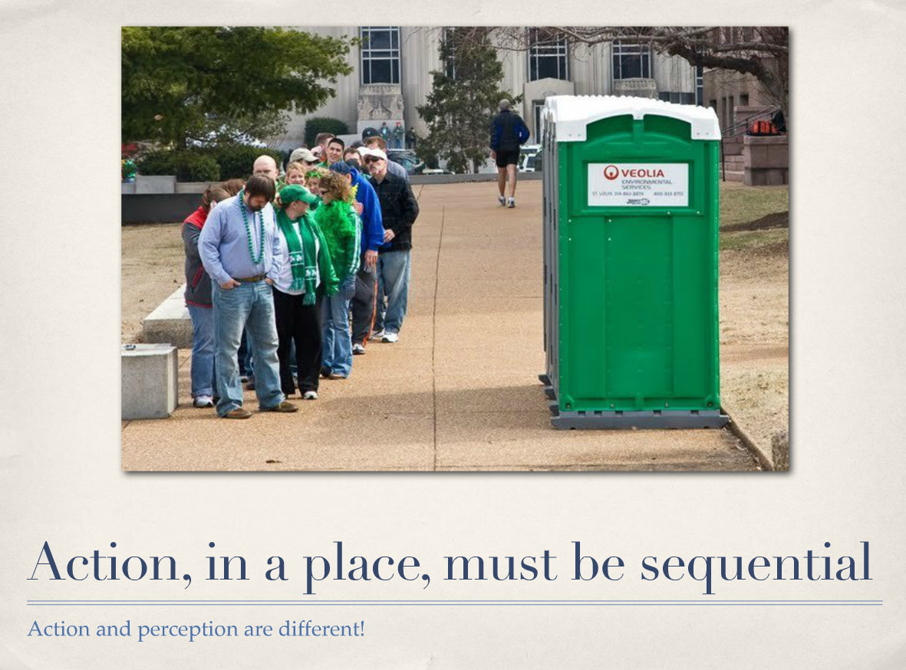

Another thing we’ve done in Object Orientation is Methods, and Methods are a way to read things and perceive things and a way to make things happen. Well, making things happen and perceiving things are completely different! They’re completely different. They shouldn’t be in the same construct. They’re two different things. Right? Because action has this other property, right? No two things can affect the same thing at the same time. We have to sort of take turns. That succession of values that we’re going to use to understand the world is atomic. It’s an atomic succession. And while we’ve grouped them into threads that helps make it easy to understand, that’s not actually that way. We certainly understand the fact that there can be only a certain amount of stuff in one place at one time. And when you’re trying to act on that stuff, you’re going to have to be there. So action has to be sequential and action and perception are two different things!

So now, I’m going to put this up. I’ll put it up again later. This is a model. This is not a picture of some software. This is a model for how to think about time. The first thing we need is we need a value. What’s a point-in-time? We said a point-in-time is a value. Right? It can’t be changed. So we’ll use values to represent points in time.

We will still probably organize our programs by identities. As long as you remember the slide from before; that the identity is a derived notion. It isn’t a thing that’s doing stuff. Right? It’s a derived concept we get from this process. We can still use identities to organize things because that’s going to be useful to us. Object Orientation has shown us that’s useful for us to understand processes.

But, how do we get through these epochal, atomic, successive events? We use functions. Right? We take a function of the past, we produce the future. So the Fs on the top are pure functions. Right? They take the state of the universe or let's just say the state of an identity at one point-in-time and produce the next one. What’s inside them is indivisible, imperceptible. It’s atomic. The functions are atomic.

And that’s the process of the world. Right? We say behavior in object-oriented systems. There really is a behavior that says, “Oh, I’m driving.” Right? I’m doing this, right? But when you get hit by lightning, who’s behaving? There’s no behavior. But there are processes in the world and they affect things. So those are those functions. Right?

We’re going to call any one of those, relative to an entity or an identity, its “state.” Right? Again, it’s just a label of a value, of an identity at a point-in-time, we’ll call it state. And the identity itself again is a derived thing. The succession of states is Fred or the river.

The important thing also here is that people can be looking at this. Right? There can be observers. Light can bounce off the river. It can bounce off of Fred. Fred doesn’t need to do that. Fred doesn’t need to drive that. We can look at that. So we can observe things. And it’s very important that observers are not in the timeline.

And then, the blue stuff in there, it’s not actually reified anywhere. But that’s time. Again, it’s another derived thing. So the box around all the states, that identity is derived. The notion of time, it’s only because at one point, we looked at this, another point we looked at that, that we know that there is time. Things don’t come with labels. This was September 22nd.

All right. So how do we do this? If we wanted to take things apart like this and then put them back together, how are we going to do it? Well we’re going to need two things. We looked on the diagram before and we saw functions; pure functions. I think we know how to do that. Like we’re all agreed we have the technology to write pure functions.

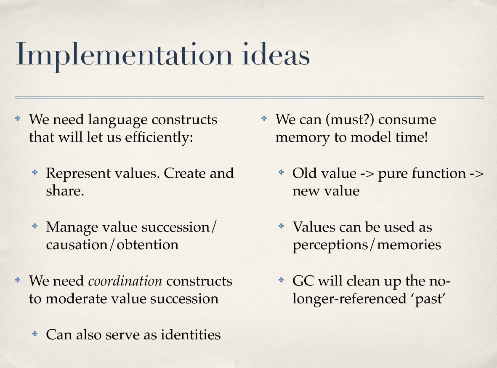

So that leaves us with two other things on the diagram. One was values. The other was somehow, we manage that succession. Right? Some sort of time constructs. So, we need a way to efficiently create values. Right? Save them. Maybe we’ll use them as percepts later. And we need something that’s going to coordinate the succession of values. Right? So we’ll call them time coordination constructs. So we need those.

It ends up that we can. And maybe some theoretician will prove we have to consume memory in order to model time. We certainly can. I don’t know that we need to, but I haven’t figured out a way to do without.

So what do we do? We say we pass the old value to a pure function, we produce a new value, nondestructively. Right? That’s going to consume some memory, and we know that. But that’s going to let us make this correct.

Those values have other value because they can serve as our perceptions. Right? What this whole system – the whole visual system is about making these snapshots. Right? When a program – I mean, admittedly, the snapshot in my mind is not the audience here. They’re two different things. But in a program, they’re not really two different things. Right? If you had a value in the program and another part of the program wanted to perceive it, they’d love a copy of it. That will be great. That’s a good enough record for them.

So we could use these values as our percepts. Right? We can also use them as our memories. Right? If we have a portion of our program that needs to remember something, this value would also serve that purpose. So if we have a good system for doing values, we can do that. And then, the beautiful thing is if we’re consuming memory to model time, GC will erase the past and the memories that nobody cares about anymore.

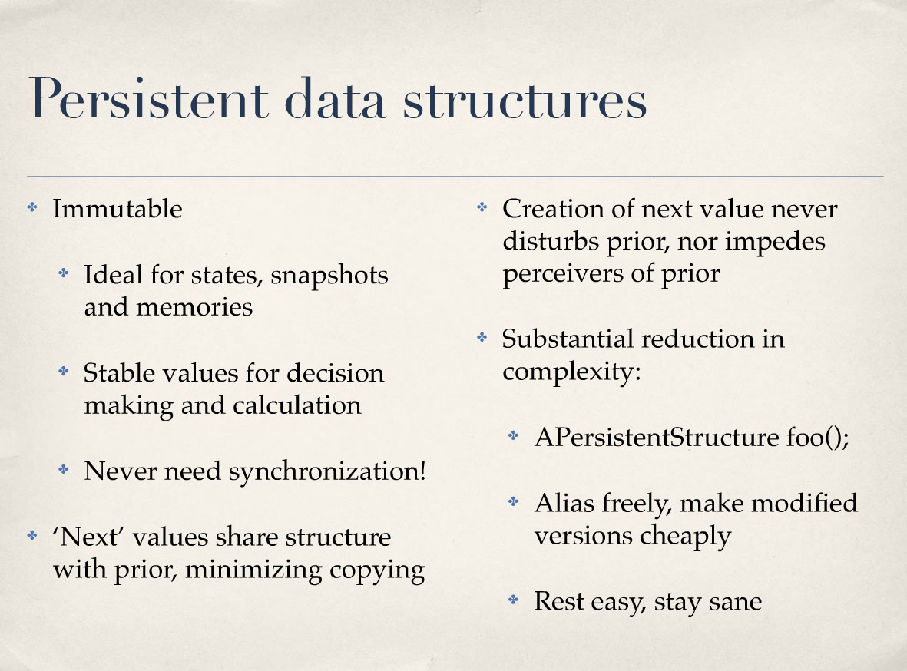

So, the construct I think we need to do values is our persistent data structures. I’ve talked about them before. And if anybody doesn’t know, really quickly, we’re not talking about being able to put stuff on disk here or persistent data structure is immutable. Right? When you make a new version of it, when you try to change it, you get a new thing. Both the old and the new thing are available after you’ve made it and both have the same performance characteristics and they make the characteristics of the data structure and the production of the new version also has the same performance characteristics.

So that’s quickie persistent data structures. So what good are they? In particular, they’re immutable. Okay? So they’re great for the purposes that we need – memories and perceptions. Snapshots, essentially. They’re stable. Another beautiful, just practical aspect of them is they never need synchronization. Okay? Which is back – that’s just like the baseball game. Right? That’s good! There’s 19,000 memories there or 19,000 perceivers. No synchronization.

The other nice thing about persistent data structures is in their implementation. Generally, the next version of the value shares a lot of structure with the prior version. So that makes them more efficient.

The other thing that’s important is when we make the new value, we don’t disrupt anybody who’s looking at the old value. We don’t need to say, “Wait! Stop! Hang on!” Even if we’re not going to destroy it, we don’t need to do anything. And that goes back to the synchronization.

And if you have not ever used a functional language or ever used persistent data structures in a nonfunctional language, just take my word for it, this is so much better. If you write a program that uses data structures like this, you will just be able to sleep at night, you’re going to be happier. Your life is going to be better because there’s a huge quantity of things you will no longer have to worry about.

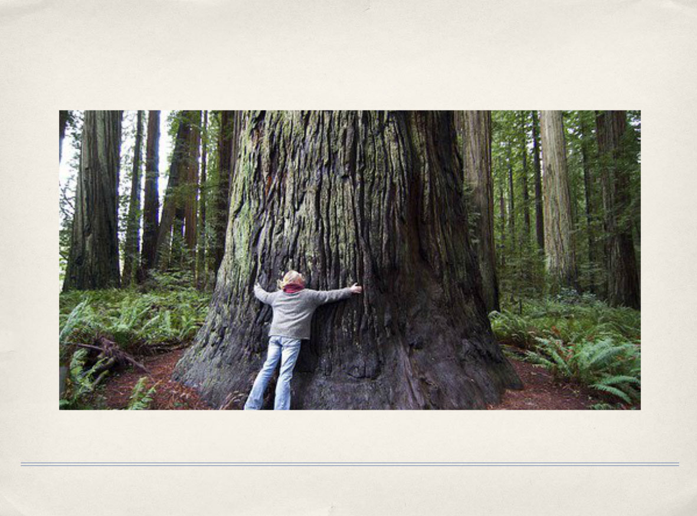

All right. So this persistent data structure [imperceptible 41:03] involved. This is old, this is really old. This stuff is so old, it’s almost embarrassing to put it up here. Right?

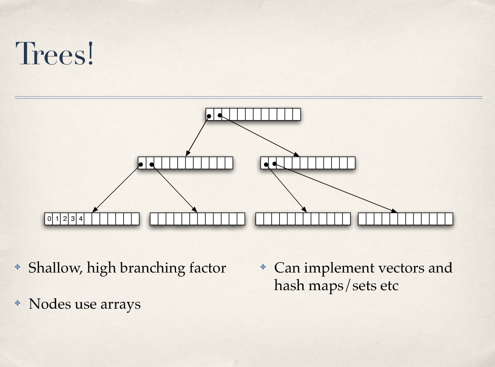

Trees. And all the persistent data structures essentially under the hood are trees because trees have these properties that allow you to share structure and do updates. But in particular, I think from a practical sense, you can implement the kinds of things you’re used to having like vectors and hash, hash maps and things like that using trees with a couple of properties. At least this has been my experience. One is that they have very high branching factors. And so therefore, they’re very shallow. And that gives you good performance. You can implement vectors, you can implement hash maps and I think the world of things you can do here is still open. But the bottom line is they’re all trees and they’re trees for this reason – trees support structural sharing. 

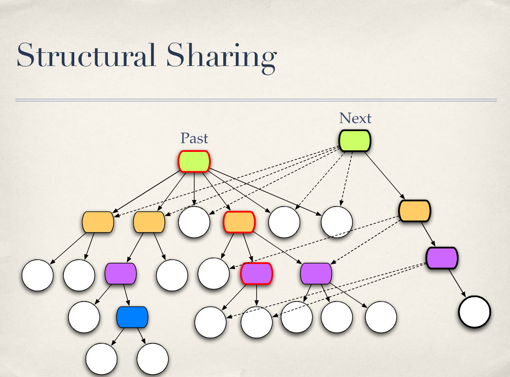

So the tree rooted in the past there is immutable. Right? It’s never going to be changed. When we need to make a new version – say add a new node – we’re going to use something called “path copying.” Right? We’re going to copy the path from the root to the node we need to change. Right? So make copies of those over here on the right. Well, this new copy will have the new node we want; the leaf node we want. And we got a new root. But that new tree rooted at next shares everything with the old tree except those three red nodes. So that’s good.

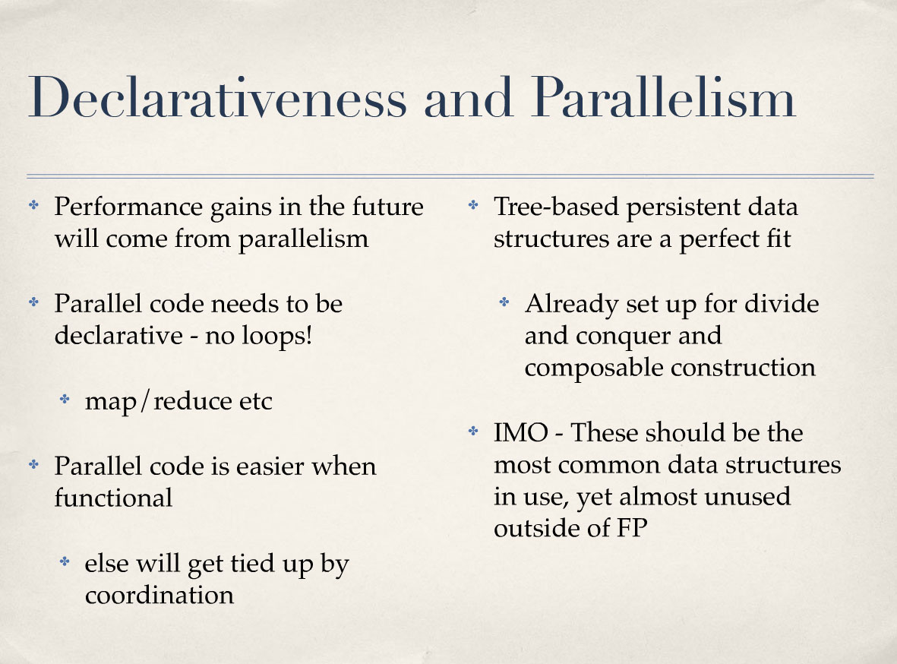

Moving forward, as we try to make programs that we can parallelize, we have to stop writing loops. Right? I think everybody understands it’s a whole separate talk that we’re going to get our future performance gains from parallelization. Right? Which means we’re going to have to write more declarative programs. Right? And those declarative programs are going to need to be able to take data structures and do parallel transformations on them and produce new data structures.

And if we want to stick with this model, we want them to be persistent. Right? So how do these persistent data structures serve that purpose? Very well, it ends up. Because they’re already divide and conquer. I mean, half the work is already done. They’re sitting there divided. Okay? They’re pre-partitioned. In addition, if you do it right, you also have the ability to construct them in a compositional way without any collisions. So you can avoid synchronization in a building of the new versions.

So they’re pretty well set up for doing parallel algorithms. I think persistent data structures should be the default data structure. I wish there was a language where persistent data structures were the default data structure.

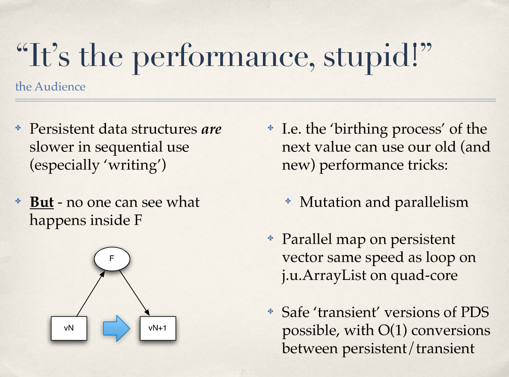

Okay. I mean, I’m not going to lie to you. Right? [Imperceptible 43:53] performance models and everything else. They’re slower! They are slower, especially for serial use. And especially for writing. For reading, you will be very much surprised at how good the performance can be. Some of the good performance I see, I completely do not understand, but it’s there. Reading is actually pretty solid. Writing though is a problem. You have that path copy and everything else.

But, I am not a fundamentalist. I’m a pragmatist. So if there’s this F, right? And if no one can ever see what happens there, right? In other words, if it’s going to take something immutable and it’s going to produce something immutable and those are two discrete instances of time and everything else about this is atomic, then nobody cares what happens inside F. Okay?

You probably do care if it’s a big involved thing. You probably still want to do it with pure functions for sanity preservation reasons. But for this time modeling reason, you can do whatever you want. Okay? Which means that when you’re birthing the next version of a persistent data structure, you can do the same old good stuff you know how to do. Right? You can allocate an array and you can bash on it because no one has yet seen that array.

You can use Fork/Join. Right? It works great. And these things will eventually bridge the gap. Already, on my quad-core, a parallel version of map on a persistent vector is as fast as the loop that bangs on an ArrayList. The same speed. So more cores, we start winning. Because, we have all these other great benefits. No synchronization required for this persistent data structure. Share it all you want. Rest easy. It comes with all those benefits that ArrayList doesn’t.

The other thing that’s possible is you can make what I call transient versions of these persistent data structures, and that’s something I’ve been working on recently, which have nearly the same speed of the good old data structures we’re using. And, in particular, support constant time creation from a persistent data structure and constant time restoration as a persistent data structure and can be made safe. They’re like 90% as fast as a mutable thing.

So, obviously, this is something you should care about. On the other hand, I wouldn’t deny the power of this model because you’re afraid of this.

Okay. So that’s about values. Now, let’s look at the time model again to remember what we’re talking about when we talk about time. Okay?

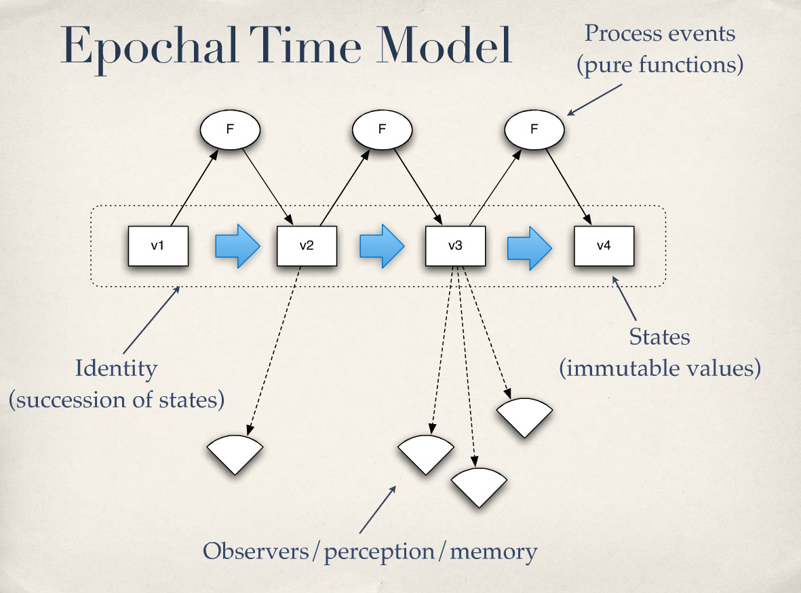

So we just said we now know what the Vs are. They’re going to be these persistent data structures. Right? So how do we make sure that there’s only one blue arrow train for any particular identity? How do we coordinate time? Again, remember, identity is a side effect. Right? We see that later. The same thing with time; we see that later. But it’s convenient to us when we’re trying to model in our program to pretend we’re driving it forward.

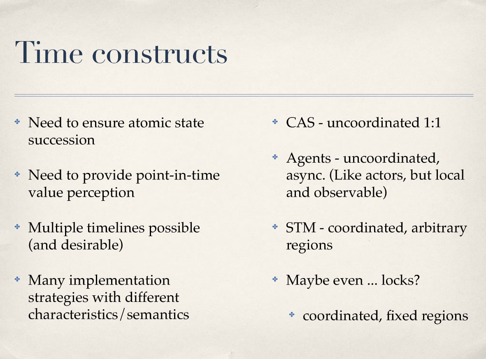

So what does a time construct do? Its main job is to make sure that you have atomic succession of values. Okay? That’s its main purpose; that we go from one value to another, incorruptibly. And that there’s no in-between. Right? That’s what epochal means. Right?

The other thing that time construct has got to do is it’s got to provide some way for us to see the identity; to see the thing that it’s managing. It has to provide visibility. And again, it has to do that atomically. Right? Because what really happens is the baseball game, right? And there’s photons. And then, there’s a point-in-time and the photons are the same place the baseball game is. Then they go their own separate ways again. Right? So there was a moment there where those things could connect to each other, but what was represented was that snapshot. Again, a value at a point-in-time. So they need to provide that.

We want to have multiple timelines. Again, this whole “I am the program. I control the universe. I am stopping everything or I’m the only thing,” that isn’t working anymore. We need to have lots of threads of control, which means we want multiple timelines.

The nice thing about this whole thing is that there’s no inherent semantics to this. Other than complying with these couple of points, there’s a variety of different semantics you can apply. You can use CAS, which is essentially saying there’s one timeline per identity. Right? And it’s uncoordinated. It’s impossible to coordinate two things that are using CAS timelines, but CAS timelines are still useful. They have semantics you can understand.

There are agents or actor systems which are also one-to-one. There’s one timeline per entity so they can’t be coordinated. But they’re asynchronous so that they’re not connected to the timeline of the person enacting the event.

There are things like STM which allow you to coordinate timelines. And maybe even there can be new constructs based around locks. Right? Because you can look at locks as saying, “Well, that’s the way to enforce timelines.” It definitely is the way to enforce timelines. If you have a way to automate that and package it up into one of these time constructs, that’s great, and you should. The difference between them and STM would likely be that they have fixed regions as supposed to STM which has arbitrary regions. But if you said, “Well, all these timelines are really timeline X,” X could be represented by a lock. And if you have some sort of time construct that ensures lock acquisition order, you can play this game.

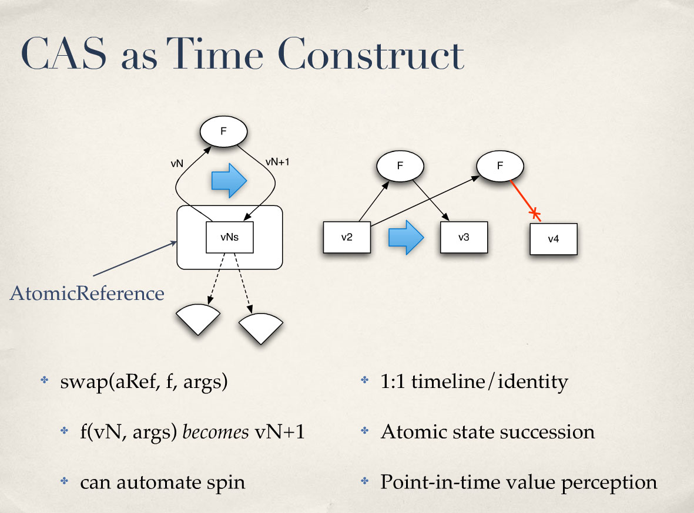

So, let’s look at CAS as a time construct. It’s the easiest possible thing. So you have some CAS-like thingy like AtomicReference, right? That’s going to store your timeline. Right? There’s no history in it, which means essentially that each successive value will replace the other. But what we care about is that there is a timeline. In this case, there is. It represents one identity. The thing that’s in it, that’s always going to be an immutable value. Right?

CAS ensures atomic state succession, right? If two things, if two processes decide, “I’m going to move v2 forward. I am the process that’s going to do that,” only one of them can succeed. Right? So this red line, that will be prevented by CAS. Right? And you can wrap up the logic associated with doing that correctly with CAS, right? Which is that spinning thing. And just package it in the construct. 
So it could look something like this. Right? Swap some CAS-based reference using this function, which will be the function of the past. Maybe plus some extra information; the args. And what happens in any time construct is this latter point here. You’re going to call the function on the current state. Also pass the args, if you want. And that will become, right? That’s what the construct does. It allows that to become the next value. Time is derived from that. Identity is derived from that. But that’s what’s really happening. So, it looks like that. And again, under the hood, we can automate the spin.

The other thing AtomicReference allows is the ability to atomically look at what’s inside of it. And as long as what’s inside of it is a value, we have good point-in-time perception.

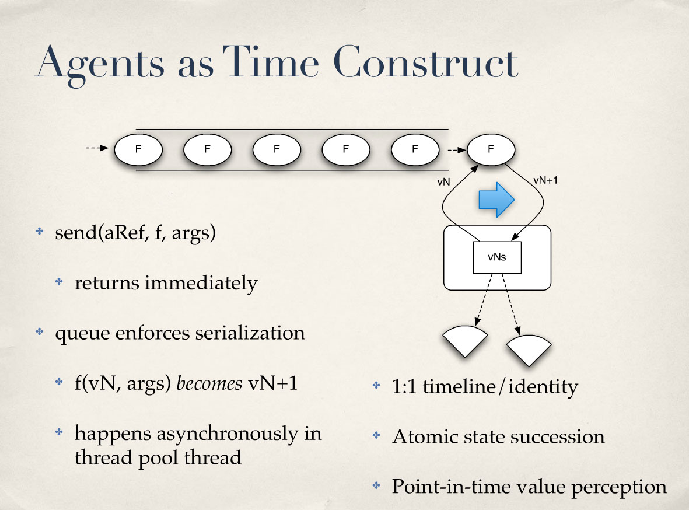

I don’t want to spend too much time on agents. They’re a lot like CAS, except that there’s no longer a coordination. In CAS, when somebody’s calling this function, when someone’s saying, “Swap!” there are actually two timelines. Right? There’s the timeline of the identity they’re trying to manipulate and there’s the caller. They have their own timeline. Right? Those two timelines meet at swap.

With an actor or an agent system, they don’t meet. Right? You initiate some energy force and it flows out towards that thing and you walk away. And eventually, that energy force hits that thing and whatever the results is the result and the thing changes. Right? So, there’s now an asynchrony between the caller’s timeline and the timeline of the identity. But otherwise, it’s still doing all the same work. It’s 1:1 relationship between the timeline and the identity. Right? Atomic state succession falls out of two things. The succession falls out of the fact that everything’s being put in a queue. And the atomic falls out of the fact that there’s only one reader.

And they can also provide point-in-time value perception. The reason why I call these things agents and not actors is actors typically do not. In fact, they definitely do not. But in an in-process model, I think perception should always be supported.

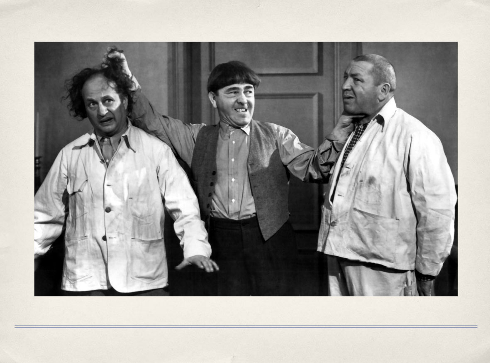

All right. So what happens when you coordinate two things? Or more than two things? These things, these CASs and other things are not going to work. Right? Because you can’t coordinate them. 

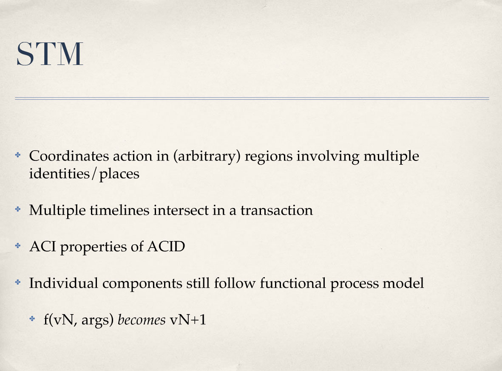

So you need something else. One possible other thing – it’s probably not the only one – is Software Transactional Memory or any kind of transactional thing which allows you to coordinate the activities of multiple arbitrary regions. So multiple timelines. We’re going to say, “Okay. This action I’m invoking is going to affect three things.” Which means somehow their timelines have to meet. They have transactional capabilities, which are not really interesting for this.

But the most important thing is we’re not walking away from the epochal time model. This is still the epochal time model. For any value that’s going to participate in an STM transaction, it’s still the same thing. You’re going to have some function on the past produce the future. A pure function and values in and out.

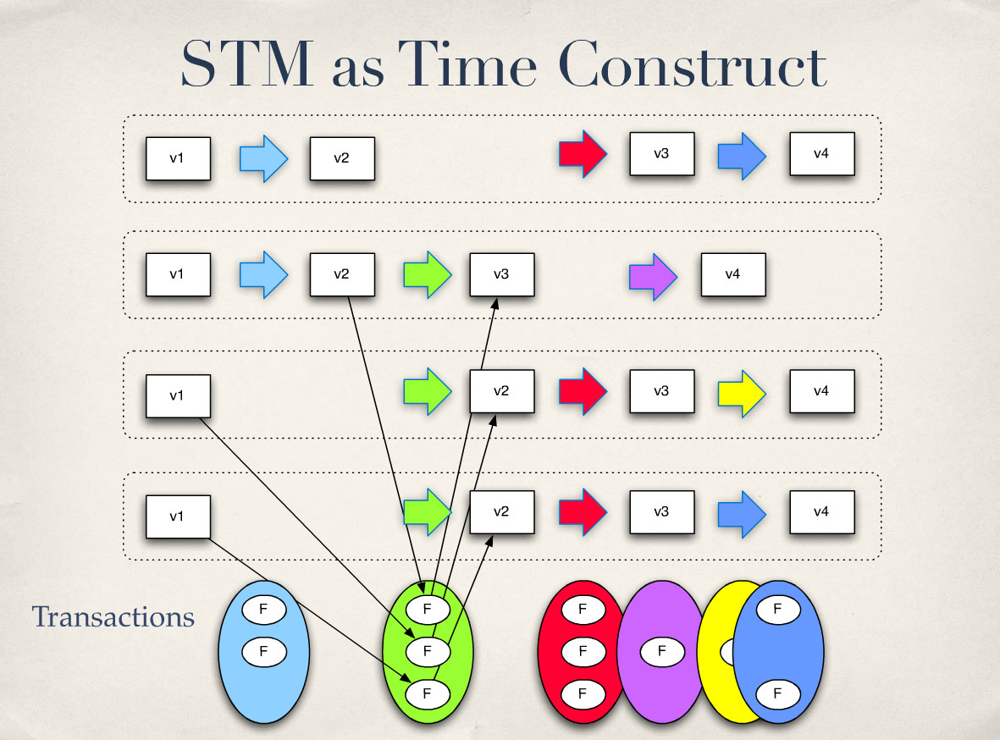

So what does this look like now? There’s multiple identities, right? Potentially. Or places or whatever. Whatever construct is meaningful to your program, you still have that. And any particular transaction is going to take an arbitrary set of these and atomically do that function transformation. So it’s a way of connecting a bunch of little micro processes and making them one process.

Internally, each one works exactly the same way as before. I just put all those arrows because it would be unworkable. And the set of transactions themselves feels like a timeline. In particular, if blue and yellow don’t overlap, they technically happen at the same time. Really, they happen at times that – there’s no time, right? Because there’s no succession between those two things, there is no time. You’d have to superimpose it. Because we said, time only is a derived concept from one thing happening after another. So if they’re unrelated, it really gets messy about time, as physicists will tell you.

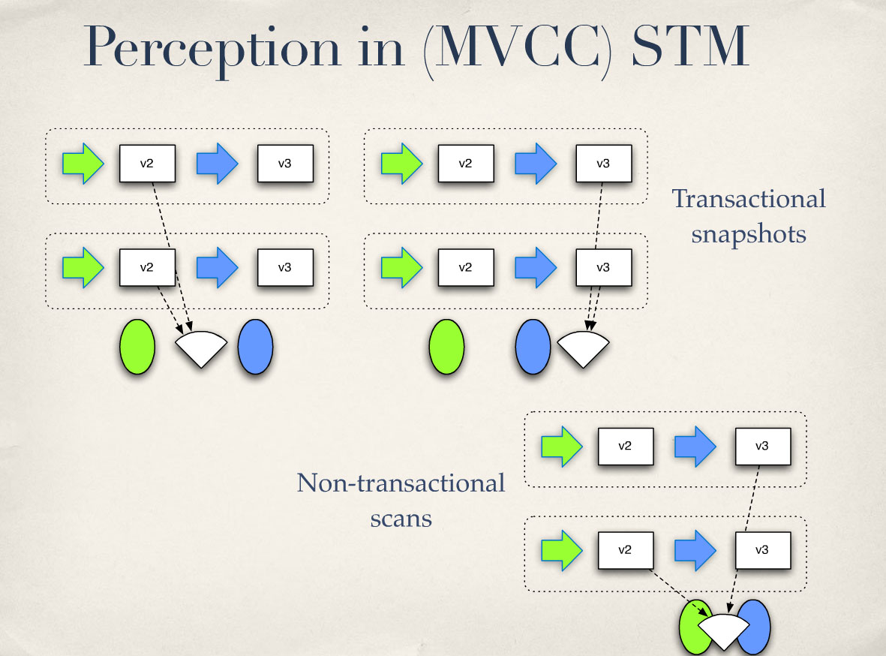

So, I left perception out of this because this is too messy. So what’s the perception story for STM? Can we look at the whole stadium at one time or can we glance and see multiple entities? And it ends up that you can build systems that do that. In particular, an STM that uses multi-version concurrency control can do it. And I’ll explain that more later, but I just want to show it to your first. Right? Essentially, what happens is there can be perceivers. What’s really important about this diagram is they’re still not in the timeline. There’s never been so many perceiving who got up into this box. Right? Perception does not interfere with process. You cannot munge those two things together.

So, relative to these atomic events that are in fact more than one thing, any perception is either going to occur completely after one or completely before it if it’s transactional itself. Right? That’s what STMs provide.

You can still do a non-transaction scan. You can pan. You can look at this part of the stadium and then go over here and look at that. Okay? Or you can look at a car on the road and you can look up at the clouds. Can you see the red car here and look up at the clouds? You look over here and you see the red car. Right? But you know when you’re doing that, what? That may be the same red car. You’ve realized when you’re panning like that, you’re not seeing a point-in-time. But you have the choice.

Yes?

[Audience member] Do you think that all the procedures should agree on the order that transactions [imperceptible 56:50]?

We’ll have to save that [Laughs].

[Audience member] How far do you want to take [imperceptible 56:53], kind of? Because you would say for just normal memory operations you’d probably say, “No, they don’t need to agree.” So yeah.

No, they don’t need to agree. They don’t. But you could have multiple STMs. Right? Because STM sort of constitutes a little universe. 

Okay. So we have transactional viewing, which is like glimpsing. We have non-transactional viewing, which is like scanning.

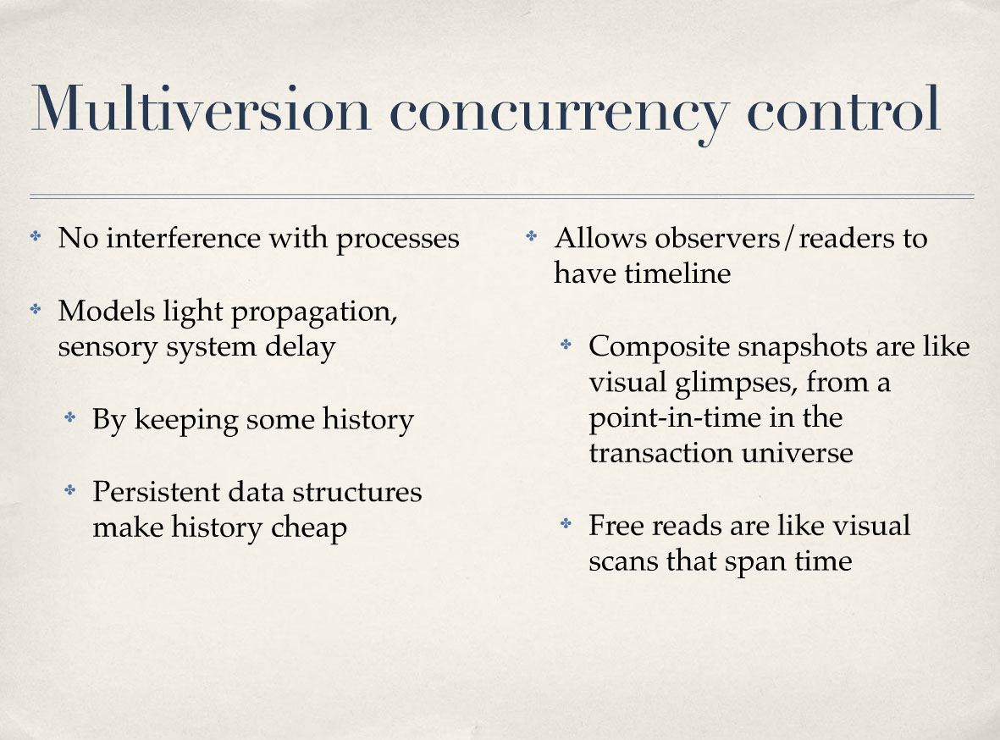

So one way to do this is using multiversion concurrency control. Right? This is the same old – all these stuff is old. Right? This is the same old stuff from databases. So multiversion concurrency control means that you are keeping some history in order to satisfy readers. That’s the database thing. But there’s a way to think about it in this model as well, right? That very critically, one attribute, the key attribute of multiversion concurrency control is that readers don’t impede writers. The perception doesn’t impede process. That’s huge. I think you cannot do without that. Everything about everything I’ve shown you before, if you stick perceivers in the middle of those timelines, your life is going to get way more complicated. Stop the baseball game! So we don’t want to do that.

And so, in this modeling, let’s pretend we’re doing the real world in our programs. You could say that multiversion concurrency control models light propagation or sensory delay, right? That whole chain that if somehow the light bouncing off the baseball game is capturing its value good enough for us. That transmission delay means that that value has got to be somewhere while it’s being transmitted while the process keeps going, the game keeps going.

So we do this by keeping some history. Quite interestingly, and fortuitously, persistent data structures make keeping that history cheap. There’s something profound about that that I don’t understand.

The other cool thing about multiversion concurrency control is it allows readers to have their own notion of a timeline. “I saw this then. And then later, I saw that.” That’s really important to some decision-making. In fact, when our brain reconstructs behavior, that’s exactly what it does. We just looked at the century system. It’s discretizing and “snapshotizing” everything. Okay. But we definitely have percepts for the lion is running towards me. Right? Well running, we have to re-derive that; that running. And we do that by a mental process that somehow allows us to compare a snapshot from before to a snapshot we know is later and see the deltas of that and say, “Running lion.”

In addition, again, we know the difference between the visual scan, and we know when we’ve looked at something and we’ve carelessly looked at something else over here, we are not allowed to correlate those things and say they happen at the same time.

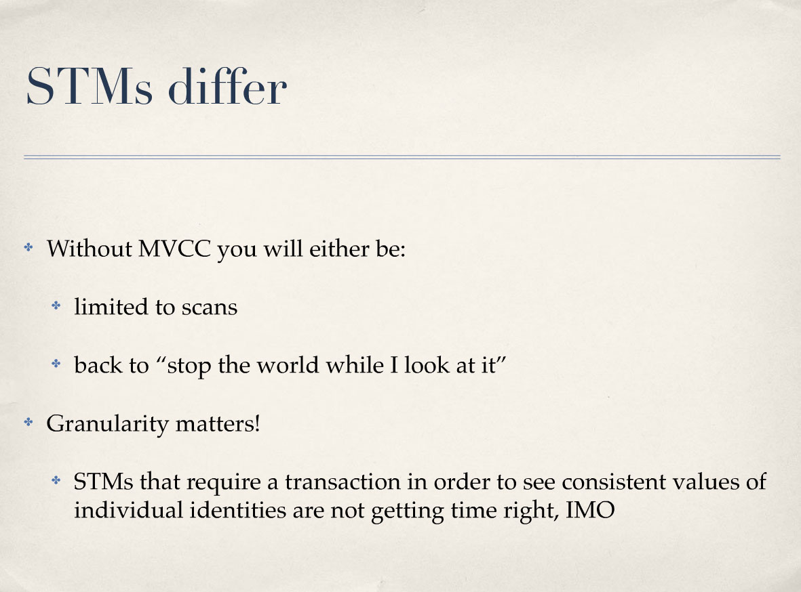

So, this is really not a talk about STM, but I do think that one takeaway I’d really like you to have is that STMs are different from each other. There’s no one STM. If you want to beat up on STM, pick one, pick its attributes and find out what’s wrong with it because there are some that I think really get time wrong, still get time wrong. Right? So if you don’t have multiversion concurrency control, you either are going to be limited to scans, non-temporally related. I looked at this thing, I looked at that thing. I have no idea. I have no ability to look at two things at once. Or, you’re going to have some gook. Right? You’re going to be back to “Wait!” “Wait! Stop the process so I can get my perception in the middle of it.” Right? Without multiversion concurrency control, that’s where you are.

The other thing about STMs I think is super, super critical is that granularity matters. Okay? If you’re using an STM that forces you or you’re incorrectly using an STM and you find yourself requiring a transaction in order to see a consistent value, you have got time wrong again. Okay? So STMs that require a transaction to read four fields of an object consistently are not doing time right. They’re not really solving this problem. Okay?

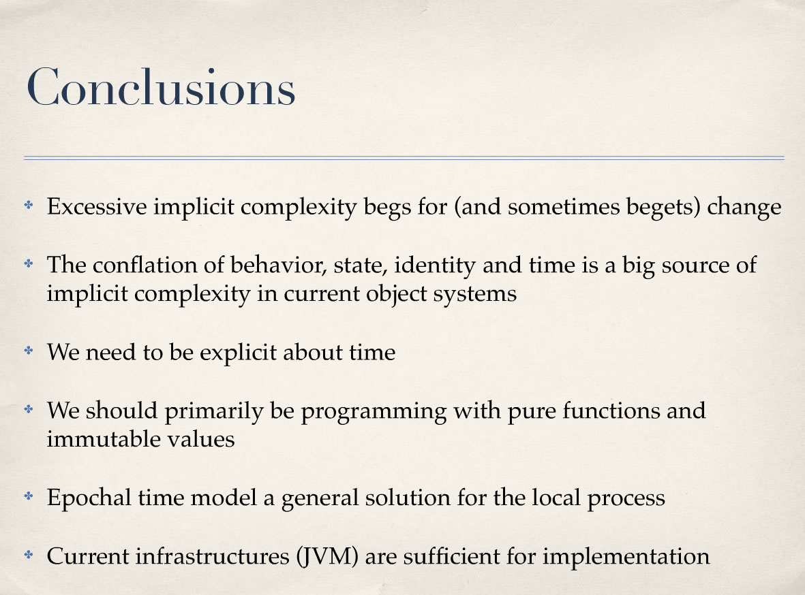

So, in conclusion, sometimes – I mean, all the time – I think if you’re suffering from excessive complexity, you got to think about changing something. And sometimes, people actually do change. Right? We move from languages that weren’t garbage-collected substantially to ones that are because that reduces our implicit complexity. There’s no other reason. Okay?

But, in the current state of object-oriented languages, this conflation of behavior and time and identity and state is just making our lives much, much harder, and it’s going to get worse. Okay? We need to become explicit about time in our programs. We really need to pay attention to the functional programming people who are saying, “Look at all these great properties of pure functions. They are there.” They definitely satisfy Whitehead’s “We move forward by taking away the need to understand the insides of things.” Okay?

I believe that this epochal time model is worth trying. I think it’s the general model. It supports multiple implementation ideas and it will work in the local process. I’m not here talking about distributed computing at all.

The other thing I can tell you is that the current infrastructures that we have are sufficient for experimenting with this for doing the implementation.

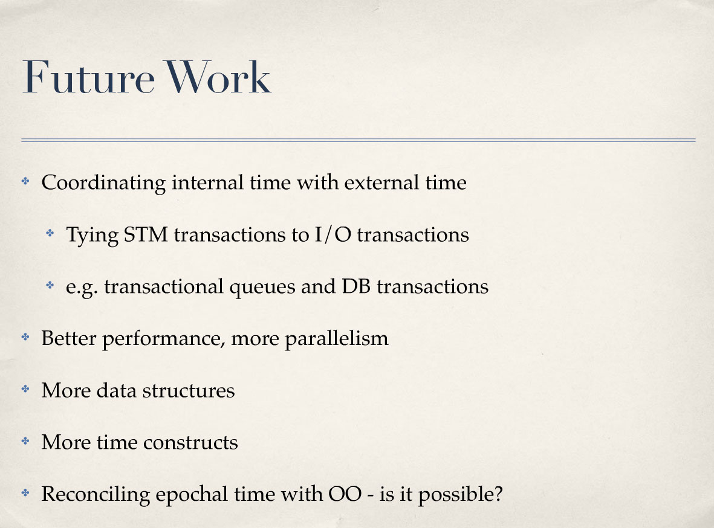

So what is still unresolved here? Well, coordinating this internal time with the external world is going to become an important thing and it’s a hard problem. Tying STM transactions to transactional I/O would be a very interesting, and I think, a possible thing.

Again, overall though, you want to move away from transactionality. Transactionality is control, control, control. You want to become as happy as you can with lack of control. That will give you more concurrency.

There always could be more parallelism. The more performance and there definitely could be more work done on parallelism inside these data structures. There are more data structures to be done, I’m sure, and better versions. There are definitely going to be other time constructs. I think moving locking under this model is extremely interesting because locking has some particular efficiencies that we’d want to leverage and there’s a way to understand it in terms of this.

I’ll leave this an open question for everybody else – is there a way to reconcile this with Object Orientation? Could we separate perception of an object from its identity enough so that we’d still get the benefits of objects but we don’t get a mess later?

That’s it. Thanks.

[Applause]

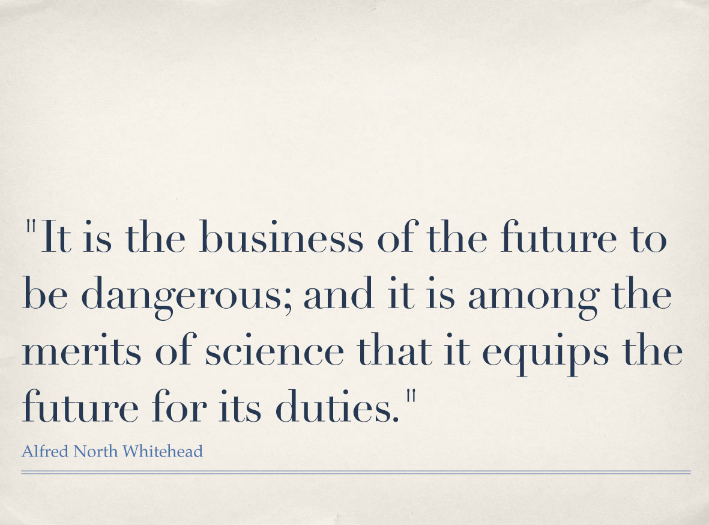

Do we have time for questions? I know we’re running late. Okay. Any questions? Yes?

[Audience member 1] So a variation on this talk has been given at every functional program language conference for the last 20 years and they’ve been wrong for 20 years. So why do you think that this thought will be wrong or not wrong?

[Rich Hickey] Well, I don’t know what those talks were, but from what I’ve seen, functional programming, in many respects, just tries to get time out of the way.

[Audience member 1] Right.

[Rich Hickey] Get time out of it. Well that’s not what this is. This is about time is an important part of programs that you have to contend with.

[Audience member 1] Okay.

[Rich Hickey] I’m not advocating purely functional programming here at all. I’m saying there are programs. There are programs that are one of those boxes. Right? One transition from value to another. Right? That kind of program is a calculator. Right? Most programs have to deal with that; that progression of time. And that’s a hard problem. So I’m not trying to walk away from it. I’m trying to walk towards it.

[Audience member 2] I think what you’re doing here is you’re recapitulating the early history of philosophy because it was Heraclitus that said everything flows so that's your object oriented thing. And then, it was Plato that followed and said no. And Parmenides also had said, “No, everything’s stable.” And that’s the function of community, saying there’s no such thing as change. And then, it was Aristotle that synthesized the two and figured out how to get the hybrid model, the multi-paradigm model, and integrated change with invariability with the concept of a substance. And that’s what I see you dealing with more in this.

[Rich Hickey] Yeah. Well, I mean, read Whitehead. I mean, he really did that. He really did exactly what you’re saying. I’m just trying to program without going crazy.

[Laughter]

[Rich Hickey] But I am inspired definitely by that, by those notions. That I think they’re really important for fixing the model we have. Yes?

[Audience member 3] So, have you read a paper called “[Time, Clocks, and the Ordering of Events in a Distributed System](http://research.microsoft.com/en-us/um/people/lamport/pubs/time-clocks.pdf)” by Lamport in ’78?

[Rich Hickey] Yes, I have. Yes.

[Audience member 3] So, I think that that’s exactly the same set of ideas.

[Rich Hickey] Yes, it is. I mean, I think there’s lots of cool things. I think that’s interesting. I think the whole wave, what’s happening in wave right now, those operational transforms, are a really interesting way to think about this. I mean, there’s a lot more to this. For instance, the composability of transformations and things like that that are very interesting. But yes, Lamport is...

[Audience member 3] There’s one fascinating difference between Lamport’s treatment of it and yours, is Lamport’s is very much communication-oriented. He says time advances when one entity communicates something to another. Whereas in your framework, time advances when the outputs of one function are used as the inputs to the next function. But, it’s really the same thing.

[Rich Hickey] It is. I mean, the communications part gets tricky, I think. I like the fact that this is sort of communication-free. But maybe time constructs are different from communication. And I don’t know if they are different.

[Audience member 3] Different words for the same thing.

[Rich Hickey] Yes. They may be. They may be.

[Audience member 4] Yeah, yeah. Communications in your F box and not in the flow of time.

[Rich Hickey] Yeah. Well, this is sort of in the flow of time too. That is definitely – in the coordination aspect, that’s communicating to people. You next. Now you, now you. Yes?

[Audience member 5] So, have you found that the JVM provides all the right primitives to make things like STM fast or do you wish that there was additional support that you could take advantage of?

[Rich Hickey] I’m having a good time right now.

[Audience member 5] Okay.

[Rich Hickey] I don’t…

[Audience member 5] What would you ask for out of JVM?

[Rich Hickey] The garbage collection pressure of this is going to be significant. So just keep making everything you have faster.

[Laughter]

[Audience member 5] I can do that.

[Audience member 6] You were a little bit harsh I thought on the [FP 01:08:29] people. What about Functional Reactive Programming is [Unclear 01:08:33]?

[Rich Hickey] That’s pretend time.

[Audience member 6] What’s the difference?

[Rich Hickey] I don’t want to characterize Functional Reactive Programming. I will say this – I worked in broadcast automation systems for a long time. I read that book. I saw absolutely no correlation between that and what I actually had to do in the real world at all. Right? But fabricating time and turning it into an argument to functions, now you’re punting again. You’re pretending. Right? That’s not time. That’s again punting. And as soon as you connect it to the outside world, you’ll see that’s the case.

[Audience member 7] Have you looked to any modern event processing languages that have streams of events and everything in it can operate on the immutable stream of events? You can store an event into tables or aggregation things, but all your data is immutable as the next flow.

[Rich Hickey] As long as all your data is immutable, I think you’re on the right track. I think the key takeaway here is there’s no such thing as a mutable object. If you can really believe that, you can build better systems. Which, again, is not to disagree. I mean, obviously, I like functional programming, right? But I don’t see them talking about other problems that I think real people have.

Anything else? Thanks!

[Applause]
