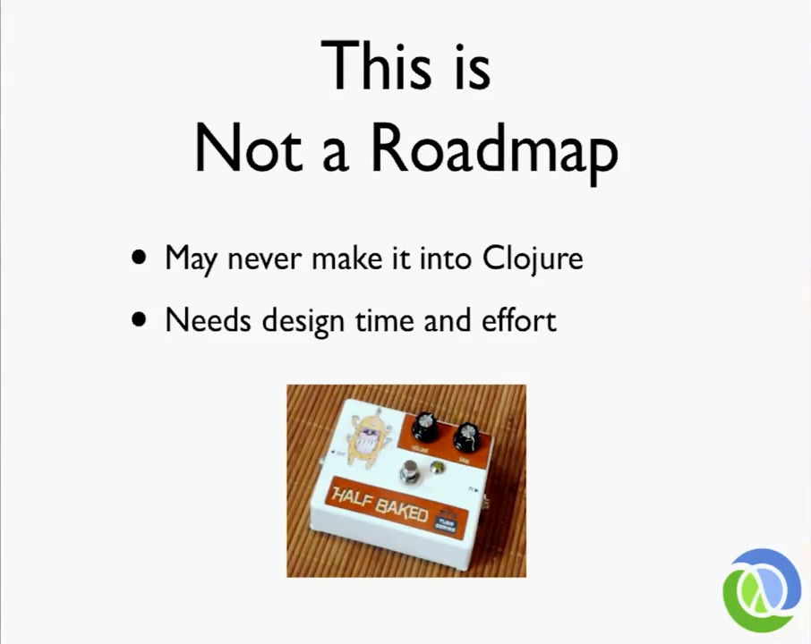
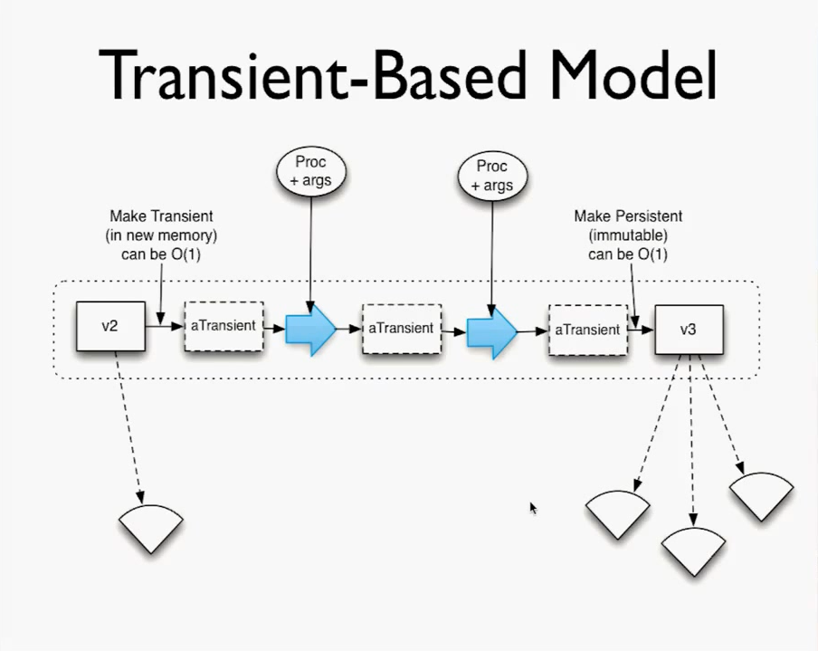
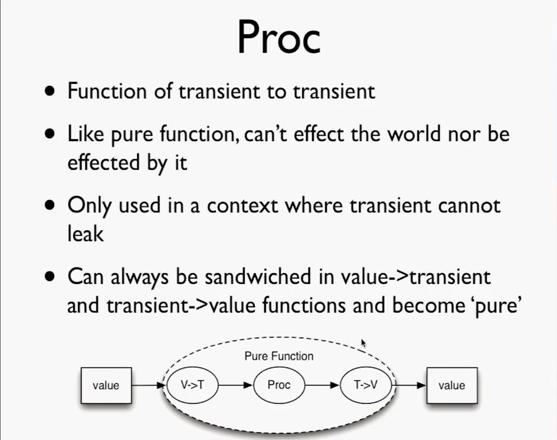
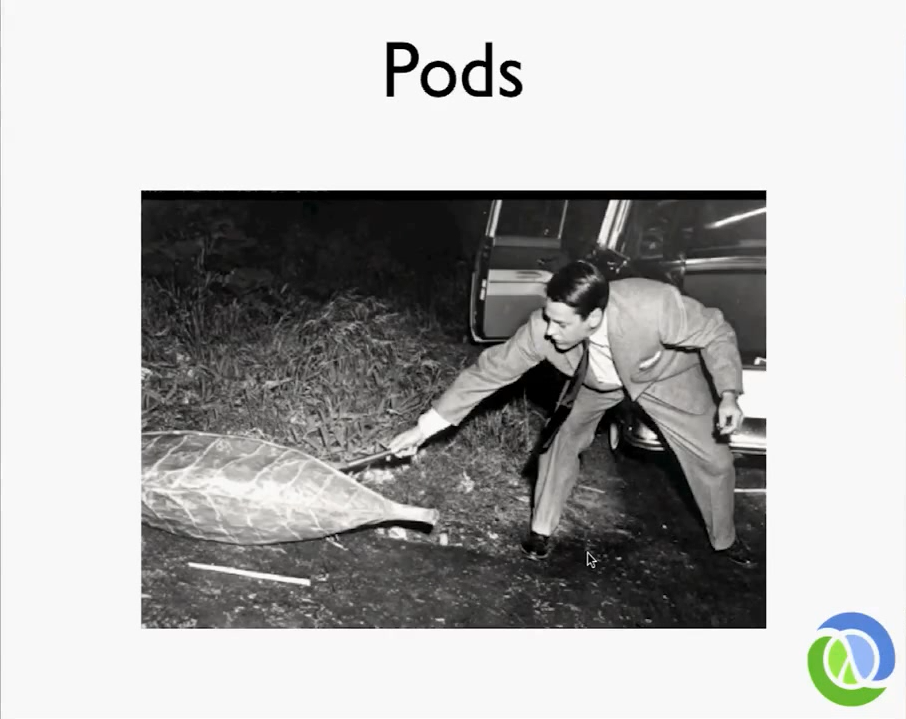
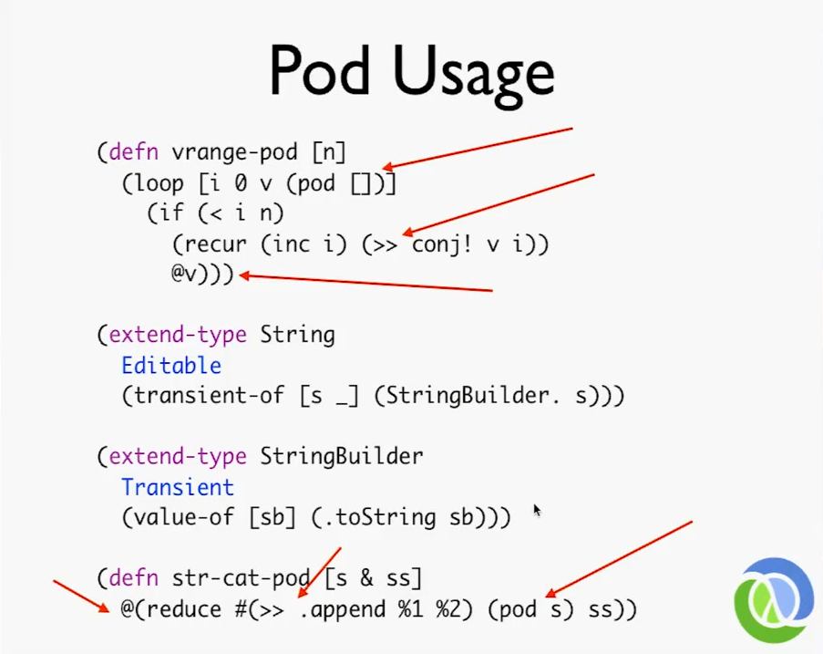

# Areas of Interest for Clojure's core - Keynote

* **Speaker: Rich Hickey**
* **Conference: [Clojure Conj 2011](https://web.archive.org/web/20111223091202/http://clojure-conj.org/) - November 2011**
* **Video: [Keynote - Rich Hickey](https://youtu.be/I5iNUtrYQSM)**
* **Slides: ??**

[Time 0:00:00]

[Introduction - [Stuart Halloway](https://www.cognitect.com/authors/StuartHalloway.html)]

So I'll tell a couple of stories about Rich. I first met Rich at the JVM language summit, it was the first one maybe. And I was already working on [the book](https://web.archive.org/web/20090927081540/http://www.pragprog.com/titles/shcloj/programming-clojure), but we hadn't met. And I had corresponded with him, and had corresponded with many of you in the room who were on the Clojure mailing list back in those days. And I met him at the summit, and he came up and introduced himself and said, it's really exciting that you're working on the book, and he gave me a Clojure pin. So he pinned me! 

[laughter from audience]

I called my wife that night, and I was like, wow, I finally met Rich, he's this really nice guy, and he gave me this pin. And she was like, "what?". I mean, given things you've already heard me say, she has reasons to worry about my behavior when when traveling at conferences, and so forth. 

So since then, I have had about the most pleasure you can possibly have writing software in the industry, increasingly getting to work with Rich on a day to day basis, violating all kinds of sacred principles. We have these agile stand ups in the morning that are supposed to last for 15 minutes, and sometimes we'll look up and he and I have been talking about something for two and a half hours. And I'm thinking, don't you guys all wish that you could be doing this? It is it is absolutely a pleasure and an honor. And I just want to get this started right. I'd like to ask everybody to stand up and applaud, before we start this, for Rich and the work he's done to create Clojure.

[applause from audience]  

[Camera switches to [Rich Hickey](https://en.wikipedia.org/wiki/Rich_Hickey)]

[Time 0:01:55]

Thank you very much. Is this working? Everyboyd hear me okay? No? How about now? How about now? Okay!

Before I get started, I think some of you may have been aware, we had a little interaction on the mailing list last week about dates, and whatever. And I replied harshly to Chas Emerick. And while I'm very sensitive about the fact that interactions on the dev list be constructive, the way I replied to him was was definitely not. So I just wanted to apologize, Chas, I'm sorry. 

[Audience applauds]

That's certainly not the example I want to set, and so, had a bad day. 

All right. So is everybody having their mind blown? 

[Rich fiddles with his laptop]

Oh, that's print isn't it? So somebody is talking about not being able to use computers? That's my specialty. 

[Laughter from audience]

Yeah, I'm having my mind blown too. And, and I kind of expected that. The thing I didn't expect, which is kind of sad, it's already been tweeted about, is that [Ambrose](https://ambrosebs.com) has better hair.

[Laughter from audience]

[Time 0:03:23]

```
slide title: Areas of Interest for Clojure's core

                  Rich Hickey
```

Okay, so we have had some really intense topics today. And I'm going to talk about something substantially less sophisticated than a lot of the things you've seen, and that's Clojure itself. And in particular, just kind of survey areas, I think would be interesting for Clojurists, many of them that have been talked about before. And what I want to do is sort of survey them, and get some of the ideas on the table, but leave a lot of time for interaction and talking, especially with anyone who possibly might want to do some of this stuff. 

[Time 0:04:03]

```
slide title: This is Not a Roadmap

o May never make it into Clojure
o Needs design time and effort
```
<details>
  <summary>Slide Image</summary>


</details>

However, I do want to say this is not a roadmap, I have more ideas than I have time. And I would definitely need help. Also, a lot of these things are half baked. I don't know if everybody can read that, it's a half baked guitar pedal, which is pretty cool. But most of these things need more design time and effort, before they even get any kind of implementation time. 

[Time: 0:04:28]
```
slide title: Leaner

o Why?
  o Delivering libraries written in Clojure to
    non-Clojure
  o Smaller targets, e.g. Android
o move ASM out
o Dev-less builds
  o No metadata, shaking etc
  o debug builds
```
So what would we be interested in for core? One thing definitely is leaner. We've heard we've heard this several times already. There's a bunch of targets for Clojure that would like to see faster startup times, less memory usage, and things like that. 

And I think fundamentally, we face a tension with a language like Clojure, and any Lisp, between the interactive development experience which we prize, and the production usage, where only some of the same tools that are required during development, are also required. 

And I think that some some of the areas are kind of clean cut, people understand Android, somebody mentioned startup times on App Engine. 

Other things I've personally found to be challenging, is delivering Clojure based code as libraries to non Clojure application. So I wasn't expecting to get any Clojure overhead, and now I have either some impact on my startup time, or in memory usage, or something else. That puts a lot of pressure on Clojure to deliver something in a jar that's very minimal. And while I say that's a tension with Lisps, and everybody should be aware that Lisps traditionally have had very good tools for tree shaking, dumping out the evaluator, dumping out the compiler, and things like that. It's not like sacrilege, or anything. Most production Lisps have had these facilities for decades. So I think it would be worth targeting them.

Concretely, I think there's there's a couple of things, one of which is just the notion of moving [ASM](https://en.wikipedia.org/wiki/ObjectWeb_ASM) out. Currently, it's bundled in. And interestingly, other than in the REPL environment, we don't, right now, do any dynamic compilation, because none of Clojure's constructs require compiling code at runtime - unless your program calls eval. No Clojure constructs require that. Now it was interesting in [David's talk](https://youtu.be/iCl9rB1tyxo), how he mentioned the fact that might actually be interesting, for instance, if we wanted to have logic programs be extensible at runtime, you would need some compilation then as well. 

But I think that's also sort of similar to the REPL, the idea of adding rules to a running system is something that might be rare, or at least something you might want to have a knob on. So the thing about having knobs, or stripping out metadata, or a lot of these other concepts, goes down to something that's sort of fundamental, which is we need multiple build targets. Right now we have one, we build Clojure, we get this one thing, and we've decided what's going to be in it and it includes metadata and all kinds of support for development. 

And I think we do need the notion of a development-less build, for production deployment, even even if, as [Daniel said](https://youtu.be/1NptqU3bqZE), it's interesting and useful to have an interactive element on something like Android. It's also interesting that when you're done with that interaction, you yank it out before you give it to your users. 

So the shaking of metadata there, but I think the flipside of saying we need to start investigating multiple deployment targets, is that we can go the other way as well. We can say, you know what? There's a bunch of things we sort of said, "Ugh, I don't know if we really want to incur the runtime overhead of that". So no, where we could say, yes, we could say, let's build debug builds or developer builds, with even more stuff, attach the source code to every function, you know, have it explain to you why your macro call wasn't the best thing ever, or various stuff like that. So I think overall, pursuing leaner can have benefits that actually want things to be less lean. But it's definitely an important area for Clojure. 

[Time: 0:08:21]
```
slide title: Unification with ClojureScript

o ClojureScript is Clojure on a different host
o shared source libraries
o conditional compilation
  o also needed by Clojure CLR
o Unifying on cljs analysis rep for tooling
```

Another area that's interesting is unifying things with ClojureScript. We had a couple of objectives in building ClojureScript, one of which was don't change Clojure. And we did that. The other was not to try to take on and solve all the problems of making code work on both. The main thing I wanted to do was make the language be present, and be the same language. And that we did. ClojureScript is Clojure on a new host. 

There are all kinds of still open questions about, how can I write a set of library code that's not very host dependent, once, and use the same source and use it for Clojure apps and use it for ClojureScript apps. 

Even more interesting, are some of the concepts of being able to say "I'd actually like a knob that says, how much of my code do I want to run on the server and how much do I want to run on the on the browser", I think is very interesting. So that's an open area, we can explore, that now, I think, looking at what kind of support is required to write libraries where we can share the source code. 

Everyone should remember, it's always been a non-objective of Clojure, [as Stu said, I think, in his talk](https://youtu.be/KZ8u_sWT9Ls), to support taking an entire application and moving it from any of the hosts any of the other hosts. That always involves an amazing layering of re-abstracting of host stuff, loss everywhere you turn, and it doesn't give you anything. If you run the exact same app on dotnet or on the JVM, it doesn't really feel any different. If you were to try to extend that to ClojureScript, you'd really fall over in the inability to talk to the disk, or over the wire, and stuff like that. So we're just talking about libraries, like [core.logic](https://github.com/clojure/core.logic) and things like that, that are more algorithmic or data driven, that would port, we'd like to write them once. 

A conditional compilation is certainly the leading candidate for giving us some of the knobs we need to say, where we do in the very few instances, if it's ClojureScript, do this, if it's Clojure on the JVM do that. And I think the [CLR port](https://github.com/clojure/clojure-clr) has always wanted this ability to switch things around. That's the current candidate, I'm still interested in other ideas. If you say, "Wow, I knew that from Common Lisp days, and that sucked, I have a better idea", now's the time to start talking about it. 

The other thing, I think we can get flowing back from the ClojureScript effort, is getting some of the analysis results back from the ClojureScript compiler. It was certainly part of the design of the ClojureScript compiler that I fixed the errors of my ways in the Clojure compiler. Which I don't think were many, but certainly in one area they were, which was that it produces this tree of Java stuff. And it uses dynamic variables, the Java equivalent, quite extensively, yielding an AST that's kind of fragile. 

And the ClojureScript AST, which you saw, I guess, [Chouser may have showed it to you](https://youtu.be/5edtbpVOOBI), right? While while it seems verbose, actually it's not, those are all persistent data structures, you're mostly seeing multiple generations of the same structure that occurred during the nesting. So it looks like a lot for human, but it's nothing for a machine. And those are all stable, persistent data structures built in a nice way.

Tools have been desperate for that output. Now, of course, the amount of analysis that the ClojureScript compiler has to do is pretty low. It doesn't have to deal with types and a lot of the other stuff that the Java side does, but it's an open question, right, we can, we can take the current analyzer, which again, Chouser has done work to expose as data structures, and try to expose that output as data structures more similar to the ClojureScript output. So we can start saying, okay, this is a format we can start using for tools in both places. Or we can try to enhance the ClojureScript analysis phase, to do some more of the work that the Clojure one does so it can do more of that job of tracking types, and things like that. 

[Time: 0:12:32]
```
slide title: Prepping for CinC

o Move protocols down to "bottom"
  o directly emitted by compiler
  o value seen in ClojureScript
o Organizing cljs compiler for multiple 
  targets?
```

So, Clojure in Clojure is like the pot of gold, or the carrot or something. It's always somewhere in the future. But I do think we've taken on a bunch of things that really substantially move us towards being able to do this. 

And the one that we saw in ClojureScript, quite delightfully, was the fact that protocols, records, and deftype ported swimmingly to JavaScript. Those concepts, the effort put into making sure they weren't tainted by Java-isms and Java semantics, that I either didn't like or didn't want, paid off because we did not have to recreate those semantics on JavaScript. 

The flipside was, and the difference in the ClojureScript compiler, for people that haven't dug down, is in the Clojure compiler, currently, the protocols is a set of macros. And so the protocols actually require a substantial portion of Clojure to be alive before protocols work. In other words, they're not at the bottom. They're not a compiler feature. They're not a primitive feature, the way deftype is in both places.

In ClojureScript, I made the compiler be able to deal with protocols at the bottom. So at the bottom of ClojureScript, we have deftype, and protocols working. I delivered to the guys who started to work in the library, a blank core.clj where deftype, and defprotocol, and extend-type already worked, because they were compilation features. 

What we found from having had that, is that the promise of being able to build up the data types and abstractions and the function and the library on top of the abstractions, from scratch, on types and protocols, is definitely there. All the abstractions, as Chouser showed you, are protocols. It was a complete pleasure to develop them. I mean, somebody showed the set of interfaces, it was like 40 to 50 interfaces, that's 40 to 50 Java files! It's about this much ClojureScript. 

[Rich, indicates how little ClojureScript via a gesture with his hands]

All the abstractions: just defrotocol, defprotocol, defprotocol, defprotocol, right in a row, in a single file, and maybe a 100 lines. You're done with Clojure's abstraction set, and then you can implement it per type with deftype. That's completely great. And the lesson from that, as we want to move forward with Clojure in Clojure, is that we need to move protocols down. We need to make protocols a compiler thing. And the open question there is, do we want to modify the Java compiler one more time, one last time, to move protocols down? Or do we want to try, when we take on Clojure in Clojure, to start with the ClojureScript compiler and build it up with the knowledge of the Clojure compiler. 

And that would require a little bit of refactoring of, I hate that word, changing or something, something other than refactoring, of the ClojureScript compiler, to make it more amenable to having different output targets. Somebody was talking to me in the hall about Objective C, and the ClojureScript compiler is tiny. It's like 500 lines or something. It's really easy to play with, and the emitting part of it is only half of it. So making new emitters should be relatively easy. And in fact, making an emitter that emitted Java would be a good first playground.

[Time: 0:16:12]
```
slide title: invokedynamic

o What it is:
  o Code-gen and class-free call sites
  o Access to safe point 'magic'
o For Clojure:
  o protocol/keyword call sites
  o fast + dynamic vars
  o reflection-free interop
```

Another open area, there was some conversation about this recently, is invokedynamic. That was released in Java 7. And I think there's a bunch of confusion about what it is and what it can do for us. And I just wanted to try to clarify that. 

What it is, is a way to get call sites, which is sort of a fundamental construct for polymorphism, without runtime code generation, or generation of classes at all. In other words, the fundamental construct on the JVM for code prior to invokedynamic, was the class. The class is a pretty big thing with a lot of stuff, you saw the header and the constant pool and all of this, and I guess, I don't feel the work is done, that they're done optimizing classes, you can make classes a lot more efficient than you have, but there are definitely backwards compatibility issues.

But all of the languages that sit on top of the JVM really work in userspace. And all we have is class generation to sort of implement our constructs. And what invokedynamic does is, it adds a lower level tool, in method handles, for talking about code. And in addition, it sort of introduces this whole very functional set of tools for building the constructs you need to do dispatch, without writing/emitting any bytecode at all. So you have no bytecode you need to emit, no classes that you need to emit.

And that facility is coupled with another sort of critical facility, which seems largely invisible to anyone who uses Java. But if you think through what Java has to do, you realize there must be some magic somewhere, right? Because you have this really fast inline-able virtual dispatch system. And you have the ability to load code dynamically. So if you've inlined some dispatch, based around knowledge of the class hierarchy, then you load a new class, how do you get that to work? It would seem as if you'd have to stop the world and update things that were not declared volatile and not mess up anybody's view from any thread. That would be really cool to have. And in fact, the authors of Java have it, it's called the safe point. And it's used internally as an implementation detail of the way class loading works. 

And so the other thing invokedynamic delivers is a kind of access to that. The access is not the way I would have preferred, which is sort of explicit direct access just to that feature. The access is sort of tied into the the call site system, but it's still there. 

And so the combination of these things gives us a set of tools we can use to, mostly, optimize Clojure, because we had to build all of our languages without this. So, from a semantic standpoint, we pretty much already decided on semantics based upon what we could do with classes. So, it's not as if an existing language could do something radically different semantically without breakage by adopting this. 

A new language could though, a new language could say, well, I'm gonna make method handles first class parts of my language. And you can pass around these pointers to methods, which we can't do without adding new semantics to the language. 

But from an optimization standpoint, there's a bunch of places where this could be used. One is in protocols and keywords, are perfect examples of where we do polymorphic call site dispatch. You have an entry point for a protocol. It says, call this, and it frequently will see, or always, will see the same type coming through. That's exactly the use case for which this stuff was built. 

Similarly, we have keyword call sites in Clojure, which most people don't really realize. But in order to make keyword access fast, we have little call sites that say if I'm using a keyword on a record type, and I see that type all the time, I'll presume that's the type, and have a more efficient dispatch, and then only do something different if I see something new come through.

Right now, we have a tension with vars, between the dynamism of vars and inlining. Because the var is both an indirection and a volatile, I think I've seen great difficulty on the part of hotspots to inline through them. And so we've played with static, and not, and dynamic as an explicit thing. All those things are sort of fighting the fact that we don't have the same kind of, when you change your code, because the only time we need it, right, when you change your code in the REPL, we'd like something that we didn't declare volatile to magically be swapped in and not mess anybody up. And that's effectively what happens with classloading. But we can't do that in vars in userspace. 

With invokedynamic, we could make those things into call sites, presumably. It's still an open question to me as to how much overhead that would be, because right now, we're just doing a dereference. So, at least there'll be these shims for invokedynamic around those. But I'm told that can all be made to disappear. 

And finally, you can use it, and this might actually reflect more up into the surface, you can use invokedynamic, to basically say, you never need to tell me type hints, you just say whatever you want to say. And we'll figure out what the types are at runtime and use invokedynamic to build little typed call sites, that corresponds to the methods that we found during a one-time-only reflection over what came in.

And so it's not like... it's reflection once, you say, oh, what did I get? And what do I need? And let me build a little call site. And then as long as I keep getting the same type through here, I don't need to do any of that work. Because I didn't have that, and because we have metadata, we already built a system for declaring types. And we have local inference. So, you can get a lot of this benefit for almost no effort by just declaring one type here or there. And then after that, we can track method calls and everything else. So it's not like we're in deep need of this. But it would be nice to have this be the backup for when you didn't say that. So that you didn't have the reflection warning or worry "Why is this 20 times slower, for some reason? I made a mistake here".

The trade offs, however, with invokedynamic are performance; until the performance of this is as good as the existing methods, we get nothing from doing this. The other trade off here is it's a Java 7 and up only kind of feature. So we can't move to this, we'd have to do this in addition to what we're already doing, but that's not insurmountable. I think, as we start to see the newer builds of Java 7 bring the performance of invokedynamic to parity with virtual method dispatch, that it will be an interesting thing to start looking at. And we're interested in having people do that.

Certainly one of the things is getting ASM out, because once we get ASM out, we desperately need to upgrade. We're using an ancient version of ASM. And the newest versions have support for this. So these things tie together. 

[Time: 0:23:40]
```
slide title: Leveraging Logic

o code -> analysis -> core.logic
  o don't settle for 'type checking'
  o queryable programs
o predicate dispatch
  o don't settle for 'pattern matching'
  o is core.logic fast enough for this?
    o precompile dispatch trees
```

Leveraging logic. So we saw some just terrific presentations. I'm going to talk about a very minor application of logic here. But anyone that saw Dan's talk should be thinking about rewriting Clojure as a logic program, and running it backwards and finding startup ideas. 

[laughter from audience]

The stuff we saw yesterday was completely amazing. But more modestly, one of the things we saw this morning is moving from pattern matching to predicate dispatch. The other thing we often talk about in the context of using core.logic with Clojure itself as part of a language thing, is doing type checking with it, or some variants of it. 

I think we have an amazing facility in metadata for communicating about our programs in a way that the compiler doesn't even need to understand. But to the extent we can capture metadata, capture it in the analysis phase, propagate it to an external tool, take the results of analysis, and pass it to something like core.logic. I would expect people to do things like what type checking does, but also much more interesting things. Really to think about programs as being queryable entities, and to be able to apply any thing you want in a metadata, and then ask questions that sort of cross the boundaries of what is typically possible with type systems. So I'm very excited about that.

And then David already laid out how predicate dispatch might work out. And I think he identified, sort of, "I don't like pattern matching", is a simple sentence to say. But the thing I don't like about pattern matching, are to two things, are that it's closed, instead of open, and that it's order complected. And so those those characteristics of predicate dispatch being open in order independent, I think are really, really strong.

In addition, just the kinds of things you'll be able to talk about for dispatch, are categorically different with logic than they are with pattern matching. Pattern matching is this little structural thing. It's really branching in the realm of the programmer's decision. Right? If you had predicate dispatch and a logic system, you could be doing branching in the realm of the business person's decision process, and you'd be able to show them the logic part of the program and say, "Is this what you meant?" And they'll be able to say, "Sure". If you show them a pattern match and say, "Is this what you meant?" What are they gonna say? "Did you just tell me to ..?" Right? That's what they're gonna say.

So, I think this stuff is completely awesome. I'd love to see people help out David and Ambrose, in taking what they've made, and applying it, giving the feedback from using it, so they can work on the underpinnings. And because there's so many areas where you can apply logic. And it really does lift your program up a whole level towards being more declarative. So this is a fantastic addition to Clojure.

[Time: 0:26:57]
```
slide title: Parallelism

o Good concurrency support in place
o is fork/join famework the right thing for
  mixed (compute + I/O) models?
o is it the right thing for balanced compute
  models?
o Parallel algorithms, not collections
  o but, collections must have good 'shape'
  o seqs do not
```

Okay, parallelism. Certainly Clojure was designed with a bunch of primitives based around making concurrency sing. And by concurrency, I mean, you have multiple things to do, and those things might have interactions. Parallelism is you have one thing to do, and you'd like to break it up into multiple threads and do it more quickly by having broken it up. 

We had support for the fork/join framework in the early versions, that's been horribly broken by the changes to the fork/join framework and trying to deliver it in Java 7. We need to drag that stuff back out and revisit it. In particular, some of the things like parallel array are gone. And the way fork/join works has pretty much been completely revamped. But the core concepts are still there.

However, I think that we need to be careful to assess how well fork/join works for certain kinds of problems. In particular, I had asked during one of the talks, because fork/join is oriented and optimized for, and really only completely safe for, I/O free computational loads.

If you were to try to have a language feature like futures, if you want to say I want to make futures fork/join based. So people could casually use something like futures, and have them all participate in a fork/join task tree, I think that we would be wonderful. But then you have to really consider whether or not the fork/join framework, as delivered, is a good way to do that. For instance, the answer to my question when I asked about combining I/O loads was, "oh, no we carefully architected our system so that the I/O happens here, and it feed something, and then independently, there's a set of stuff that does the compute load using fork/join".

Now, any one system can be very cognizant about that separation of concerns, and partition those two things. But a construct that you want to reuse all the time, can't do that very well. In addition, fork/join for I/O is is pretty good, as long as your I/O counts are not that high. Having threads waiting for blocking I/O is not a catastrophe. I mean, people presume, everybody's like, I need to make a web server that like a million people can connect at the same time, as if that's the only possible use of threads, and therefore threads are useless. But that's not the case.

There are systems that do a ton of work with dozens, or hundreds, of pending I/Os where parking threads on them would be zero problem. And using fork/join style logic, not actually the fork/join implementation that we got, but fork/join style logic, is a great way to do that. Because it gets to my next point, which is, the ideal application of fork/join is when the branching points lead to varying amounts of work.

Okay, if you had this big block of stuff to do, and you need to do the exact same thing on everything in this block, fork/join is an anti-pattern. You don't want a fork/join, you want to divide it up into four pieces, give the four pieces to four threads, if that's the number of CPUs, and crank through that. You do not want to build an entire tree and a stack of pending things, because you're not going to get any benefit, you just added work stealing overheads is something that was relatively straightforward. 

So when you have a balanced compute model, again, this question mark comes with fork/join. On the flipside, we've got fork/join, and it's awesome. So, I just think we need to think about how we can build general constructs that can leverage it, without creating things that people are going to trip over.

And then the other side of it is making more parallel algorithms. We had parallel map and parallel reduce. We've had them for a long time. We want to move them to the to the newest model. But we have to understand that, and of course, being a functional language, we do want to keep parallel algorithms out of the collections. And we saw some Scala stuff where they combined it. And there's some cases where that's kind of easy. But we don't attach our functions to our data, we apply our functions to our data. However, we do need data that has a shape that's amenable to parallelism, and lists and sequences are not. So the stuff that we saw presented, that kind of collection is completely awesome for parallel work, whether you use fork/join or not. The vectors have a good shape for that, we do need something that could replace sequences for that purpose, that has a better shape. So much more work can be done there. Data structures that are amenable to parallel usage, and more parallel algorithms, I think would be really, really great.

[Time: 0:31:48]
```
slide title: Transients and Beyond

o Transients do too much
  o Persistent symbiosis and editing
  o and policy
o And too little
  o Users muse use linearly
o Btter to have a construct for this
```

All right, I'm gonna talk more in depth about a couple of things. The first is transients. And a little bit about pods, everyone wanted me to talk about pods last year, I didn't have time. So I'm gonna talk about that now, especially because I got to a certain point in this thinking, and I got busy. And so maybe by explaining it up to this point, somebody else can keep thinking.

So again, somebody talked about data structures that you can access from multiple threads, and then create snapshots of, which should have reminded everybody of our transients. We have transients, and have for a while, where we can take something that's a value, turn it into a transient, sort of update in an efficient way, and then produce a value later.

And we've had them for a while, they're alpha still. And my conclusion about them after using them for a while is that they do too much. They combine this symbiosis with persistence, right, being able to go from persistent to transient, and edit-in-place, which is great, and then going back, which is really a data structure kind of job - with the policy job of ensuring that you only do that from one thread. And we want to take those two things apart, we want to separate the policy from the data job.

But the other thing about transients, is they do too little in that the promise of transients, while enforced, it only comes true when you use them in a serial fashion, they're not mash-in-place. You actually do have to take the return value of a transient operation and use that for the next operation. It's very clean to do that if you just follow the recipe which is write it functionally, then change it to transient, and the same shaped function will work. But you have to do that, when people take transits right off the shelf, they often try to bash them in place, and then bad things happen when the type changes between two operations, which we should be free to do. And also, they're going to be surprised.

So the first idea is to lift, to provide some construct, to make sure that the user doesn't have to be burdened with thinking about what they're doing.

[Time: 0:34:15]
```
slide title: Transient-Base Model

Description of diagram:
Encapsulated by dotted box:
1. v2 Made transient (in new memory) can be O(1)
2. resulting in aTransient transformed by Proc + args
3. resulting in aTransient transformed by Proc + args
4. resulting in aTransient Made Persistent (immutable) can be O(1)
5. resulting in v3
```
<details>
  <summary>Slide Image</summary>


</details>

So I think people have seen the diagrams of the epochal time model. And there's a way to look at the use of transients similarly. Which is you start with a value, there's this process of making a transient from the value. And we know our transients can do that in constant time. So you can have value without disturbing it or any of its observers. You can make a transient version and it's essentially free. 

And then the operations on transients, I'll call procs, for now. A proc is a function of a transient to a transient. And you can apply these procs iteratively to produce new versions of the transient. And whenever you're done, you can take the transient and convert back to a value.

And we want to make sure that there's only visibility to the values. Right now, we do that by having the transits not implement the value of accessing methods. But again, the transits are sort of doing these two jobs. If you look at this, there's this nice little box around this, and that box is policy. The box says, I want a value at one end, I want to give you a value at the other end, and I want to be in control of the application of these procs.

[Time: 0:35:34]
```
slide title: What about those Procs?

o Might modify their arguments
o Isn't this just icky mutable side-effecting 
  coding again?
  o hard to test
  o difficult to reason about
  o No!
```

So what about those procs? I mean, if you try to think more about the use of transients as a calculation model, but you might want to say, wow, you know, is this is this just the bad side effects stuff again? And the answer is, is no. Right? 

[Time: 0:35:56]
```
slide title: Proc

o Function of transient to transient
o Like pure function, can't effect the world nor b 
  effected by it
o Only used in a context where transient cannot
  leak
o Can always be sandwhiched in value->transient
  and transient->value functin and become 'pure'

Description of diagram:

A value passed to a Pure Function which
1. transforms value via V->T
2. whose result is passed to Proc
3. whose result is passed to T->V
4. returning a resulting value
```
<details>
  <summary>Slide Image</summary>


</details>

They they might modify their arguments, but they are really functions of transient to transient. They can affect the world and they can't be affected by the world. As long as there's some policy enforcing thing in place, it will ensure that they can only be used where the transient itself can't leak.

So if you think about that, if you think of a proc as a function of transient to transient, the fact that it may modify the incoming transient doesn't matter because the transients can't leak. And it's really a function in producing a new transient. And you have to use that new transient for your next operation. 

If you're doing something like this, 

[Rich refers back to Transient Based Model slide]

that's ensured, just like the functional transformations in any of the reference types is ensured to be an atomic serialization of activity.

[Rich navigates back to current slide]

So if you had atomic serialization of activity that involve procs, it would be safe. And in fact, that recipe, or that property, means that you could always turn that kind of use of procs and transients into a function, right? Because if you put a function from value to transient at the front end, and you put a function of transient value at the opposite end, and you do all the proc stuff in between, what does that entire thing look like to the outside world? 

It looks like a pure function by all definitions, because it is one. And everybody knows that. But it's very difficult for a lot of functional languages to accommodate that. Right? A function only guarantees that what you send in isn't impacted by what happens inside. And what you get out is always the same if what you put in is always the same. You can meet all those guarantees and use transients or mutation inside. The trick is, can we provide a construct that makes that work safe and easy to get correct? 

[Time: 00:37:59]
```
slide title: Pods

Description of photo: A frame from the film "Invasion of the Body Snatchers" where a man tentatively pokes at a pod with a stick.
```
<details>
  <summary>Slide Image</summary>


</details>

So the idea for doing this is something I call pods, mostly because this picture is just so awesome. As is the movie. 

[Time: 00:38:12]
```
slide title: Pods

o Split out policy from data structure
o New policy:
  o Value in, value out
o Process goes through pod
o Coherent process creates next value
o Multiple options
  o Single thread
  o Mutex
```
So pods do this job, they split the policy out from the data structure, and in fact, we have a new policy now. The policy is just value in value out. And the pod is in control of the process. So before, with transients, the data structure, because it's always wrong, right, if your data structure does the job it's wrong. And this is the easy way to do design, if your data structure makes decisions, it's wrong.

So now we have the policy separated. It's value in value out. The process goes through the pod, so now the pod is the process thing. And as long as it makes sure it's a coherent process to apply a proc to the transient and get a new transient, then that whole thing will work. And the beatiful thing is now that you've got the policy separated out, you can make independent decisions like you don't have to bake in the single-threaded acess policy. You could have a different policy that said multi-threaded acess is fine and it would internally use a mutex to make that work, which is definitely a useful thing.

[Time: 00:39:12]
```
slide title: Pods

o Work with transients
  o Just take policy out
  o Persistent map in, transient map inside,
    persistent map out
o Dont' require persistent<->transient
  o Can work with immutable<->mutable
  o String in, StringBuilder inside, String out
  o Provide a recipe for using ordinary Java
    stuff in managed model
```

So pods obviously can work with transients, right? All they're doing is taking the policy out and putting it into the pod, right? You can take a persistent map and put it in, it will be turned into a transient. You can apply procs inside and eventually get a persistent map out. But the cool thing about pocs is, while that's a really efficient way to implement the proc, and that's really great, the system and their guarantees of procs will apply even if you weren't using transients. Not using transients has a performance cost, but it doesn't cost otherwise, it's not a semantic difference. Right? We already said the overall use of a proc is functional at either end. 

So imagine, if you just had a recipe that says, you must give me something immutable and a way to turn that into something mutable, that the procs can apply to, and you must give me another recipe to take that mutable thing and create a value out the other side. You can make a pod around that, that will make it safe to use. For instance, you can make it safe to take strings, turn them into StringBuilders, append a bunch of stuff to them, and get a string result, without any potential for clashes, or even safely across multiple threads without the goofiness of trying to get a synchronized data structure, as if there was such a thing.

So that's really cool, because that means that we have the first construct that could apply to ordinary Java stuff. It could let Java stuff play our game.

[Time: 00:40:41]
```Clojure
slide title: Pod Usage

(defn vrange-pod [n]
  (loop [i 0 v (pod [])]
    (if (i < n>)
      (recur (inc i) (>> conj! v i))
      @v)))

(extend-type String
  Editable
  (transient-of [s _] (StringBuilder. s)))

(extend-type StringBuilder
  Transient
  (value-of [sb] (.toString sb)))

(defn str-cat-pod [s & ss]
  @(reduce #(>> .append %1 %2) (pod s) ss))
```
<details>
  <summary>Slide Image</summary>


</details>

So this is what pods would look look like. You basically wrap a pod around at, well, this is what this version did, you wrap a pod around a persistent data structure, and then it uses protocols to decide how to turn that persistent data structure into something that can be used inside the pod. Then you send procs into the pod. So here we're sending the transient operation conj!, into the into the pod to modify the transient that's inside it. And then when you're done, you deref it, and you get a value out. And the value creation coming in, I mean, this pod could have been created with a giant data structure. And coming out, those are both constant time operations. Then this is an extensible system in that you can say, well, nobody knew about pods when they wrote string. But I can make strings play the pod game by saying the way you get a transient out of a string is to return a StringBuilder. And a way to get a value out of its StringBuilder is to call toString on it. And then you can make things like string cat using pods, where you reduce with append with the pod around the thing. This doesn't seem that interesting, but it actually is still better than the loop and a lot safer. 

[Time: 00:41:53]
```
slide title: Pod Power

o Pods allow process to extend across
  multiple functin and pods
o Multi-threaded pods allow process to 
  extend across cores
  o Pods can ensure lock acquisition order
  o Can't fix lock composition problem
    o but can detect
o Pod-base clone: @(pod x)
o Pod peeking: (<< count coll-pod)
```

And you can start building things that allow multiple processes and functions to operate upon pods. Remember, the policy is separate now. So if we want to have a mutex based policy, we could, which means we can allow multiple threads to participate in the modification of an ordinary Java structure has no friggin idea this is going on - or to transients. It's because we separated the policy. 

So multi-threaded access, we can do a tremendous amount with pods, right? Admittedly, a multi-threaded pod would probably use a mutex, right. Which is like, oh, there's locks. But the thing is, it can do a lot of work. For instance, it can ensure lock acquisition order, the number one bugbear of doing locks yourself. What it can't do, is it can't fix the lock composition problem. The lock composition problem says, "I wrote some code that uses locks over here and other code here, and I want to put this inside that". 

Now it ends up that when you think about the way transients in pods would work, you wouldn't really put nested work inside that would be in conflict. But the beautiful thing is, should you have done that, you can make a version of pods, and the prototype version does this, it can detect that you've done that. Right. So it can't solve the problem. It can't make things magically composable but can say "you did something that's not composable, and therefore, I'm not going to let it happen".

The other thing about pods is they give you this interesting algebra of values to copies. So for instance, clone is just this terrible thing in Java, it's just, it's almost useless. You don't know when you can use it, you don't know when it's safe. You don't know that while you're calling clone, somebody isn't totally messing with the thing you're trying to clone. It's just not a sound idea. And there's a whole bunch of things that you can't clone. But if you can imagine, if you had rules for saying, I can take your thing, and I can make a value out of it. And I can take a thing and make something that can go into a pod. And I can take what's in the pod and make a value of coming out the other side, you can actually write clone, just like this last second last line here, just deref podding something, and you've cloned it, no matter what it is, as long as it satisfies those two protocols on the previous slide. That's kind of cool. Like I'd like to be able to clone iterators. Of course, the things you're manipulating have to be inside pods. 

And then you can peek at pods. I don't think this is a good idea. 

[laughter from audience]

I mean, I tried it, but I think well, we'll see soon. 

[Time: 00:44:26]
```
slide title: Pod questions
o Should internal pod representation be a
  function of vlaue type?
  o or allow user-specified pod contents
o Can pods be revisited after producing a value
  o Possible, but maybe not desirable
o Pod groups, sentry sharing
o Multithreaded pod API:
  o (in-pods [a b c] ..)
```

So there are a bunch of questions around pods. This is definitely unfinished work. One of the questions is, is that pair of protocols the right thing? I mean, should we bake into protocols, the recipes for getting from, you know, values to transients, so should we make that sort of pluggable characteristic? Should we let somebody say "I don't actually have a value to start with, but I'd like you to see to pod with this transient, or transient like thing, or mutable thing". You know, just to start with, can I fire it up, can I initialize it that way? 

Would you be able to revisit pods? So earlier slide I showed, you know, you come in, you get a value, you do some transient stuff, you get another value, you take that out. There's another model that says, well, at any point in time you look at it, it's like Schrödingerer's pod.

[laughter from audience]

Anytime you look at it, you get a value, but it can keep going. In other words, it might produce the value on deref, and then make a new transient, and then allow more operations and do that. That's very tricky. I did make something that does that. But again, I'm not sure it's a good idea.

The other question is lifting pods up so you can do more composite operations. So the big bugbears with using locks are composability problem, lock acquisition order, and then trying to provide multiple, uh, work that encompasses multiple units of data correctly, right. So you always have these problems when you have systems with locks, it's like, I need to manipulate X, Y and Z. What locks do I need to require in order to do that? It's very challenging, it usually ends up written on napkins or something like that, or Joe knows how that works. 

So there's a notion of pod groups, where you can actually say, inside this set of pods, do this work. And that would do the lock acquisition order part, which would mean that you can safely manipulate more than one thing. This goes way beyond synchronizing. What's the problem with synchronize? It makes each individual method synchronized, you can't actually build anything out of that. Now you can make caches out of things where every operation is atomic, you can't make anything more sophisticated than caches out of that. Because you can't combine two operations, you can't say, if it's not there, make a decision and do something else unless you've turned "if it's not in there" into a special atomic operation. And you can't say "if both these things are there", or "add these three things all at once", or the classic problem, "move this from here to there", and don't make it vanish somewhere in the middle of that. That's the thing traditionally you have to use locks for. But pod groups solve that problem much more cleanly. Again, I think they take care of two thirds of the problems with locks, and they call out and identify and catch the third.

However, if you keep thinking about this, you realize that, that seems like a really fancy thing, the pod, but it might also do too much. Most, most, the vast majority, of the applications you see of things like this, and the things you would think about that would work like this, are in the sort of what I would call the building or birthing category, right? I'm going to start with something empty, I'm going to pile a bunch of stuff into it. And then I'm done. I need to give that to the world. I don't want to do that, in a loop with a functional object can create, you know, a million temporary things nobody ever cared about, and have the overhead of functional programming, when no one could see it. And that visibility thing is really a critical thing. We don't actually care about functional programming for things we can't see. Except for the complexity it gives us in trying to understand how they work. Which is why you still want models like this. 

[Time: 00:48:12]
```
slide title: Accumulators

o Pods... do too much?
o Most use in building/birthing
o Maybe all we need is conj!/append
  o making details internal
o Same front end for accumulators and
  queues and...
  o Hmm
```

So if you were just thinking about building or birthing, you could have a much simpler contract, where all you say is add or conj, or append, or something like that. Just put the stuff in. And it's a one way street. It's like you can put stuff in, it's a sink. You can put stuff in, you can't actually do anything else. While you're doing that you can't look at it or anything, it's just pile stuff in. I think [Google's Sawzall language](https://en.wikipedia.org/wiki/Sawzall_(programming_language)) has these accumulators. It's very functional, but all these things need outputs. And so you just pour them into something that they can't actually talk to again. And the beautiful thing about something like this, which let's just call an accumulator for the moment, is that that same front end, you could put on some pod-like transient builder thingy, but you could put it also on queues, and a bunch of other things. You could have a more generic construct, which is just about putting stuff someplace. And I think that's potentially interesting. And maybe even if you decide to do pods, you want to make this notion first class, make it the front end of a pod, or the entry points of pod change. 

[Time: 00:49:24]
```
slide title: Extensible reader

o Why 
  o Clojure data is great serialization format
  o More types
o But
  o Less consensus on representations
  o Avoid wheel rebuilding
```

Okay, last topic for we go and start talking. So, we did talk about extensible reader, starting with dates, last week, and I thought it would be great opportunity to sort of talk, which is a little bit more efficient, about what the idea here is. And we already had somebody say, "Clojure data is much better than JSON". And that's an easy thing to say. But it's an important thing to think about. Why do we think that is? And is it the greatest thing ever? Yet.

I agree it's better. But when we saw the enumeration, what was what was on the enumeration slide? First of all, whose slide? Was that? The JSON slide? Yeah. So what was on the slide? More data types, right? So what what would be the advantages of Clojure data over JSON, more data types? What else? Metadata. Those things are pretty awesome.

But when you think about it, what are some other examples of serialization formats? So maybe we beat JSON already there. What else have we got? XML. Let's not even compare XML to Clojure data. What does XML have over JSON? X. XML has X. Actually, XML has X, and we don't have X. That's not good. 

[laughter from audience]

So what happens when we want something we don't have? Right now, in Clojure data?

When we want to talk about a date, what do we do? All kinds of stuff. That's not a date, right. And while you can build two ends of the system that do that, you lose something really critical. So I'll ask another question. What's the difference between JSON, XML and Clojure data, and protocol buffers? The first set is self-describing, what's the other set? If you send me some protocol buffer data, what can I do with it? /dev/null, I don't know. I mean, there's, there's not a lot useful I could do with it, I could save it for you until later and give it back to intact, maybe. 

So that's a big thing, right? Having a self describing data structure. What does that mean, for someone, when you have a self describing data structure? It means you can send me stuff I don't really understand, I can actually do a significant amount with it. Because if you send me strings that have dates in it, and some other strings, have URIs in them, and some other strings have some other random stuff in them. And some numbers mean numbers. And some numbers mean dates, what have I now got? I have something I need to understand the schema of in order to correctly process, render, allow the user to edit. If you sent me something, some hybrid data structure, and it had dates in it, and I didn't really know what the bigger picture was, can I give the user an editor for that? 

[audience member] You could wrap it in lambdas.

Oh my god! No actually, no, I could not really.

[laughter from audience]

The answer is no, you couldn't, so you have to be very careful, right? When you say I could just use a string, ou could just use a string, but when you do, you're moving away from self description. And self description is really valuable. 

So I do think it's great that we have more types, and I think some people want even more still. And so we're using more types than we can represent. How many people are using Clojure data to represent things, it doesn't represent at the bottom? Like dates or URIs or something else. So it happens. And and we'd like to do more of that.

So I think we want to get the X in there. And the trick is, we need to think broadly about how to do that. In particular, I think I should start looking at either more data types that are kind of well known like date, or real true extensibility like user stuff. You end up having this bifurcation between the serialization transport format, and the semantics that are conveyed there, and the representational space. Like already, we had this fantastic, very highly predictable disagreement about what kind of date do we want to get? Because there's no right answer, right? Different programs have different needs, different requirements, it's completely correct to say, they need to use different kinds of dates. 

On the other hand, being extensible can't mean Clojure is going to start making first class libraries for every type of thing everybody might want to possibly use. That's going to create a tremendous amount of wheel rebuilding, especially in areas where there are good libraries. So that's sort of the why.

[Time: 00:54:51]
```
slide title: Extensible reader

o Premise
  o Meet at semantics and print/read
    representation
  o Plug in desired programmatic type
o How
  o Tags
  o On other readables
```

The idea that I'm floating right now is that we separate the print/read representation and semantics from the programmatic representation. Right? Stuart showed us #= the other day, he's getting kicked out of #= club, by the way as a result.

[laughter from audience]

What's wrong with using #= for this? Why can't I say #=(Date. "blah thing")? That'll work right? It'll give me exactly what I want, right? Is it actually now self describing? Only to what? A Clojure app, maybe. What if I sent that to ClosureScript, a Java constructor call? No, so we can't do this. 

We need to split these things up. This is what design is. Design is: take your good idea, find how many pieces you can cut it up into, because it'll be better when you're done. So we have to split these things up. The print/read representation and the semantics of that from the programmatic representation. So one way to do that, and it's sort of like, if you can do this well once you're completely out of jail, because you've built an extensible system that is composable. Is to just say, we'll have some way to say I'm giving you something extensible. And I'm using that to tag something you already know how to read. That's it.

How many people are familiar with Erlang's transport format, what's it called? ERT, right? And then somebody made BERT. BERT is the text version of that, right? Yeah, that the Reddit guys made? GitHub! Somebody cooler than me made it.

But the idea behind the Erlang implementation is really sound, it basically says, we only have however many types are on Erlang, six or something. But we want to convey information about different semantics. All we're going let you do is, say, use a map in this way, and that tag will label this other data structure we already know how to represent as being that thing.

And this is the same kind of idea, we have a tag on something that's readable. And we use that to do these first two jobs, right? What are the semantics? The tag that takes what that is, you know, we say instant means a point in time, and all agree on that, and how we're going to print it. And then the type you get can be independent. As long as the representation you use is something we can already read. You can't say, I'm going to put these weird characters in here. So this is not what people expect from extensive readers, they expect, "I want to make, I don't know, what charcters do we have left, dollar sign, do this thing". I want dollar sign to be some magical - we're not talking about that at all now. We're saying we're not actually gonna give you more than one last thing. The last thing is a portal to extensibility. And then you'll be able to leverage anything we already read, including any extensions that have already been made. 

[Time: 00:58:01]
```Clojure
slide title: Extensible reader

#instant "1985-04012T23:20:50.52Z"

#ints [0 1 2 5 7]

#my.ns/foo {:bar 123 :baz [5 6 7]}
```

So this is what that looks like. You could for instance, say, instead of saying, #@, as cool as that is, #instant, and don't get all fixated on the actual syntax here, this is just the idea: tag readable thing. By saying tag readable thing, and when the readable thing is the string with a date, you're saying this thing, once you read, it should be passed to something that expects to get a string, we all agreed we're going to use a string with this parse format for this purpose, and then the value they're going to get the actual type of thing they get back would be something they could plug in, they could register and say, when I read instants in this program, I want to get Joda instant type. And it's led me to construct, you know provided a plug, from this string format to Joda instant type, that's what they would get and the reader would allow that. But could I send this to JavaScript and have something meaningful happen? Sure. Can I send it to anybody? Sure. If we had this, would we have our X? Yeah, this is the end game. 

So the next one might be creating an array of ints. 

And the last variant here would be the user extension point. I don't know what kind of composite thing you might want to have. Because we have namespaces, we can just use namespaced tags. So we'll say non-namespaced tags are reserved for the language, or will include things we all agree everybody needs. But if you need something else, you can now say this, and the beautiful thing about this is, you're not actually saying I'm calling some specific constructor or anything like that. You now have a way to talk about, semantically, I want send my foos around, and I can build one end which produces foos in Clojure and another end which consumes foos in ClojureScript and another end than that sends them through some event processing system, which is completely, hopefully, language independent. And this is a good recipe for that. I would love for, you know, we have [Neal talked about all the ways to grassroot up](https://youtu.be/2WLgzCkhN2g), I'd love for Clojure data, as a serialization format, to be one of the roots. Because it really does kick butt. And with something like this, I think it's now plainly superior to the other options. So that's the general idea there.

[Time: 01:00:35]
```
slide title: And... ?

o Q & A
```
And now it's time for questions.

[questioner1] Can I just make the point, that if someone want to go with the extensible reader thing, it's the tag format, is exactly what YAML uses for extensibility. 

[rich] Okay

[questioner1] So if you want to see how that's implemented, and how people do it, you basically reinvented exactly that. 

[rich] Yeah, I'm not claiming any novelty here, I'm ripping it off from Erlang. But I'm sure that they might have too.

[questioner2] So print-dup currently, like it, you know, it spits out the classes [inaudible] and the tag, it replaces that, does kind of - 

[rich] Well, so there's a different reason for, I mean, print-dup is used for a bunch of different reasons. If for some reason you super cared - so semantically, there's no difference between array map and hash map, this is a hash map, this is an array map. So it would only be that you somehow cared that you would using print-dup for that. The other real reason to having print-dup is like for things like, well, no actually, you don't need it for strings either. Yeah, that's basically the thing, that where there's some polymorphic nature to what you're supplying. And you don't want to have it erased by the round tripping. I think print-dup is inherently a non-portable concept. But certainly any use of print-dup, or [inaubible] so - also people use print-dup because they want something like more concise for the human interactions, and something really verbose, constructive, otherwise. Yeah, this is definitely better than that. And it's way better than #=. #= is strictly a known stopgap thing, and there's a reason why it's a secret. A really great secret at this point. 

[laughter from audience]

[questioner3, refering to last Extensible reader slide] What is the agreement about what goes in and what goes out?

[rich] What is the agreement about what goes in what comes out? Well, there's not an agreement about what goes in and what comes out. There's an agreement about what instant means, and what data structure will be used to represent instants. Like, there's nothing about, there's nothing else about this. So, you're asking when will the plugging happen? This is no agreement about that. We haven't decided yet what those mechanisms will be. We do want something that you can definitely insert at the bottom of everything, so that you can start a program and have your preferred date be used everywhere, including dates and instants you've embedded inside programs. So even code that's beeing reloaded, will use the same mechanism to rehydrate using the data structure of your choice. But it's really, really critical to not dictate the data structures. As soon as you start, even if it's two Clojure apps, in the same company, you still may have disagreements about how you want to represent things. And you should be able to make an independent decision about that. I don't think we're going to support making independent decisions inside the same program, except through the potentially dynamic binding, but I think we got off on the wrong track. Because as people saw that, and presumed that would be the only way we can do things, which is definitely not the plan.

[questioner4] In the computer algebra area, they have the problem of two systems that need to communicate what would look like a normal equation like a polynomial. They have completely different representations and potentially different semantics for what sign means. There is an effort called OpenMath, it's been going on for about 8 to 10 years, to separate syntax and semantics. I think you might find that useful for the kind of communication protocol you're talking about. 

[rich] Yeah, definitely. I mean, that's the that's the idea here.

[questioner5] So is the idea for the extensible reader that my ns foo just gets a stream of characters and produces something from it or there's some data structure that you give it and -

[rich] No, no, no you get that data structure as the input to your pluggable function.

[questioner6] On another topic, can you elaborate on this idea of querying programs and what that means? What would be an example?

[rich] What does it mean? Well, there's some really simple things like how often do we use this function is a simple question. Do we ever call this function inside that function? How deeply nested are our calls to this function? Have we ever called this function while holding a lock? With an open file in hand? Where is this data structure used? How is it propagated?

[questioner6] Like program analysis.

[rich] Yeah program analysis, that's right. People pay big bucks for datalog systems that analyze Java programs, and they work exactly the same way, except it's all sort of bespoke stuff. They take the output of an analysis phase, and they dump it into a database, and they give you a query engine that can access that database. It's that kind of idea. Anything you might do with Aspect Oriented Programming would fall into this kind of category, or any kind of cross cutting concern, even simple type things, by talking about the relationship between multiple arguments, or arguments to this function, the results of which were subsequently passed to that function. We tried talking about constraints that work like that. It's incredibly difficult, but real systems have those kinds of constraints all the time, type systems are way far away from solving that type of stuff.

[questioner7] Talking about the conditional compiliation as a way to target different platforms, what do you think about the Newspeak case, which is to have communicate with the platform via interfaces or protocols and have the environment supply implementations for those.

[rich] I don't like that at all. That basically is reified environments. And I don't see how they can be made performant. Maybe it's my own shortcoming in thinking. You have to really have done that from the bottom, which Newspeak has, but I don't think it's something you could add to a language like Clojure now. We don't have process environments at all.

[questioner8] Speaking of conditional compilation, I was thinking maybe that this extendable reader might actually play into that, because you could add metadata via this and the compiler, because I don't know what that tag means, could ignore it. And if you wanted to attach a reader macro that says, hey I know what this extendable stuff is, and it means insert this debug information here.

[rich] Well, I mean, that you could do with ordinary metadata. I don't think this really comes into play here.

[questioner8] Right, you could probably pull it out easier, well as far as minimize, well, I guess -

[rich] Nah, I think ordinary metadata would cover that case. But I don't think ordinary metada covers all the cases of conditional compilation.

[questioner9] So pods seem to address, you know, throwing a bunch of stuff into a collection, or into a value transient. But one of the issues I've run into is actually needing to be able to iterate over a collection in a more performant - so a sequence, in a more performant way, and I'm wondering if there's some way we can apply, something to do with pods there, to make seqs more performant? 

[rich] Yeah, it depends on what you're doing. I mean, if you have access to the original data structure, there are definitely faster ways, like reduce is definitely much faster. And there's an optimized pass path for reducing to call internal reduce. The next thing I'd like to do in that area would be to have reducers that are able to terminate the reduction, because that's where we want to do a partial iteration, that's difficult to do with reduce. Reduce basically says, the whole thing. But as soon as you have a partial reduce, then what you do is basically hand off the job of doing the work to something that knows the internals of the data structure, which does it efficiently without creating seqs and gives you an answer back. That's ultimately the answer. The higher level things like Haskell does this amazing stuff with stream fusion, I actually think is a good example of something for which type systems really help you, and we would struggle trying to emulate.

[questioner10] In the previous talk, Stu talked about striving for platform power. You talked about things like access to safe points, dev-less builds, etc. That all seem to be ways of getting closer to there. What would you indentify as the major, or maybe the largest, couple of things that are standing between us and getting closer platform power.

[rich] Wow, I mean, I think we have a great platform power. Most of this has to do with the nesting our utilization of the platform to be more efficient. Not actual access. And so - so when you think about power, not to add to Stu's talk, but, right, it's work over time. What's the worst value for time? Never, infinite, no, the worst answer is no. So, like, you can't do that. And there are very few things for which that's true anymore. So I don't think, I don't consider most of the structure platform power as much as more efficient. Those things, you know, like making a leaner build doesn't really change how you're using the platform. Of course, leveraging invokedynamic, now that it's shipped, is an example of platform power we're not leveraging yet. So we did that. That would be one. Fork/join just came out. Same thing. So those two, there you go, they're already there.

[questioner11] I think it was last year, you talked about maybe introducing some kind of new scopes for variables, and there was an example where you might have done a computation with a resource and built up some kind of lazy seq structure, that escapes, and your resource is gone. Has anything happened in there, or?

[rich] Yes. I've realized that it's harder than I thought and I'm not close to solving it. The fundamental problem is, you have this nested composition problem, right? How can anyone know they can delimit the scope of something? Effectively what happens is you've done some lazy stuff, potentially dependent on resources. And maybe you consumed part of it, or maybe you didn't. But the problem is, you can't recognize what about what you have, has these issues. How could you decide this is a scope that's going to cause them to go away, if you return anything. Because the thing you return might be using some parts of that. You don't know exactly how all the tree is interconnect. And so that's sort of one of the fundamental problems. It ends up that in the field, what ends up happening for people is, they will casually use something like map, on something like a connection to an IMAP server, and want to return results. And actually, what they really want is to return fully realized results. They actually do not want that connection left open. Whereas most of the problems come from people who do not want the lazy the evaluation in the end. And so our near term solution is actually give you mapv, which maps into a vector, and it just does all the work. And it's not lazy. And so if you're going to like read nested parts of a tree, and you really do want to fully give a fully realized tree, you'll just do that instead of something lazy. For the bigger problem, I think there's no library style answer, because the answer is gonna be different in different places. But I'm happy for somebody to think of something, but I haven't.

[questioner12] When you say that platform protocols are slow, [inaudible]

[rich] When I say which is slow?

[questioner12] When you say platform integration protocols, instead of conditional compilation is too slow, wouldn't [inaudible] save us from the slow problem?

[rich] We don't have reified environments, we would have to add them. And then so how do you get them around?

[questioner12] Ya but [???] build tools [???] leiningen

[rich] Yah but they are is still a reified part of the execution environment

[questioner12] Ya kind of. Yes this concept of the language, but it's not really like you can take an environment and pass it around in the language

[rich] No but it's happening in the runtime on your behalf. We're not, I mean, Clojure has decided way way, way back there was not gonna have an extra argument to every function which is going to be extra stuff, for me, to use for stuff like that. So we don't have that, and we call through things we don't control. It's very difficult to do that, without a bottom up kind of support for it. Maybe there's some hybrid in between what you're saying, I mean, maybe I don't understand what you speak of, but that was my understanding of it.

[questioner12] Probably could start custom pilots when deciding platform to target for a specific build, and just [inaudible]

[rich] I don't know, if you could prototype it - I'm not gonna.

[questioner13] Does the hashtag ints vector type thing found a new way of writing the to-array of ints pass for all those interop forms? 

[rich] Wow, I hope so. That's really [inaudible] right now, right?

[questioner14] the [inaudible]

[rich] That depends, right? Depends on whether or not it's something that compiler has decided to also understand. It's an orthogonal question whether or not the compiler will understand how it is. If the compiler does, it may actually allow you to say something else in code.

[questioner15] Along those lines, if when you open up, when you apply this, you're going to apply a hook to say, I want some kind of other persistent map implementation on the on the built in types?

[rich] No, because we're not going to add this tag to it.

[questioner15] No, but I'm saying is, if the reader now becomes extensible says, if I recall, you said, you're gonna register, this says, the tag instant gets this kind of construct, you know, here's -

[rich] You'd have to fabricate magic special tags for the things that it already knows about.

[questioner15] But, as well, just, I dunno, I was thinking if the reader was allowing you to register structures for various types, would it be worthwhile or not worthwhile to add, you already got a hook there say, we have a constructor now for our standard map or standard, you know.

[rich] Have you gotten better maps that you'd like to share? 

[questioner15] I don't know. Where I'm going with talking about this -

[rich] The answer to your question is yes, I'm just - 

[questioner15] You know, obviously, we're talking about serialization. Like, just start with, for example, you may want to pull it in, Java pulls it in, and may want it to be, heaven forbid, mutable, right. But you can just use it that way and say, just suck in that data structure and give me mutable HashMaps whenever you see a map.

[rich] In the binding context, I can see something like that, potentially, yeah. But we don't want to change the maps before [inaudible]

[questioner15] No, no, that's not what I was saying just -

[rich] Well then so that means you'd have to have a magic function for the things that it already knows about, which don't have tags.

[questioner15] Correct. Right. But it's just built in with [???] 

[rich] It would definitely be possible. 

[questioner16] [inaudible] an interface?

[rich] I think that's what I'm talking about with queryable programs. I think that's exactly what that is. But I wouldn't want to limit your imagination to what type systems do. That's all. I think that's exactly what I'm talking about when I'm talking about that. Because that's what that is right? You take a program, it doesn't necessarily indicate much. I would like to be able to say, "you didn't bother to annotate your types, but I could for you over the logic side". Why not? You let the lazy guys do what they want to do. And then scrupulous guys can do what they want to do. I wouldn't fault them that.

[laughter from audience]

[questioner17] For Clojure data, did you consider binary encoding like ASN.1 where it automaticaly inserts metadata and automatic skips unwanted data in constant time?

[rich] So, no about that. That's very, you know, I understand completely what you're asking for there. It may be the case that certain tags would have that characteristic, right? In other words, they'd have a way like you would say, if it's a really huge thing, part of the agreed upon format would be that there's a count at the front of it that makes it skippable. But making a full skippable thing that supports nesting, so the trick is usually nesting and things like that. Have you ever looked at like chunk file formats and stuff like that? That gets much more involved, right? Because you want to be able to say, you know, depending on which level I'm at, I want to skip the entire set of different things to get over to the next thing. As soon as you expand your scope beyond one datum, right, or one structure, to a composite thing that requires a set of these things, or a nested set of these things, then the skipping job becomes much more difficult, right? If I, you know, you can always be done to say, I'm just gonna skip one thing, and you'll only have the ability to skip one thing. Usually that's insufficient in the end, but it will be a starting point. You certainly could say there are really large things I'm going to require they be late prefixed.

[questioner18] Seq is the basic list abstraction that we use in the language, right. Now, [Phil Bagwell showed us](https://youtu.be/K2NYwP90bNs) that we may be able to use those extensible array structures and systems structures as implementations for lists. Does that mean that you will then have kind of a vector instead of the basic primitive that you could use for your [inaudible] abstraction?

[rich] You could definitely consider that. And the beautiful thing is there are all those abstractions between us and, and the representations. So yeah. 

[questioner19] One of the challenges that other serializations systems have run into is versioning. Right? You have two different versions of your software, and one of them we put in the date one way, and one you did very slightly differently. Have you thought about how you might include versioning in this?

[rich] Yes, you can never change your mind.

[laughter from audience]

[rich] For your own types, you can do whatever you like. For the for the agreed upon types, no, I think it's gonna be one of these, we'll have to think carefully about it, because we'll have to live with it. Of course, we have metadata. So to the extent the representation part you used, was a type that accepted metadata, the string stuff, like this instant here, that would be a possible path for that kind of adaptation. Otherwise,no. Are you talking about like a global level on the file level?

[questioner18] I'm talking about,let's say that you had my ns foo. And you had a bunch of code out there that stored a bunch of that data somewhere moving across systems. Now you've put out a version, a new version of my ns foo that changes the meaning of bar, but you still want to be able to leave the old version when it comes in, and sort of upgrade it to the to the current version, and keep going. [inaudible] does something like this and so does [inaudible] systems. And it's built in, it's baked in, simply say, oh no my version of foo is foo.1, and you could stick it into the name, but I think something deeper would be nice.

[rich] Well, I mean, is there is a reason why metadata doesn't work for this?

[questioner18] Not necessarily. 

[rich] Okay. I would try that first. 

[laughter from audience]

[rich] I mean that's the cool thing about metadata. It ends up being so useful to have because things like this would have been hard, oh when we forgot to put a slot in for versions. Okay, slap some metadata on there and now you have a slot. You can have as many slots as you want, you can call them whatever you want. 

[rich] Alrigth, I want to thank everyone again, both for using Closure and for coming, and I hope you're having a good time, and continue to do so.

[audience applauds]


