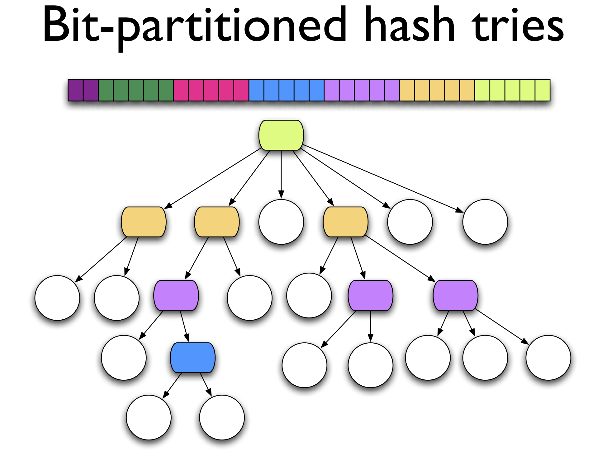
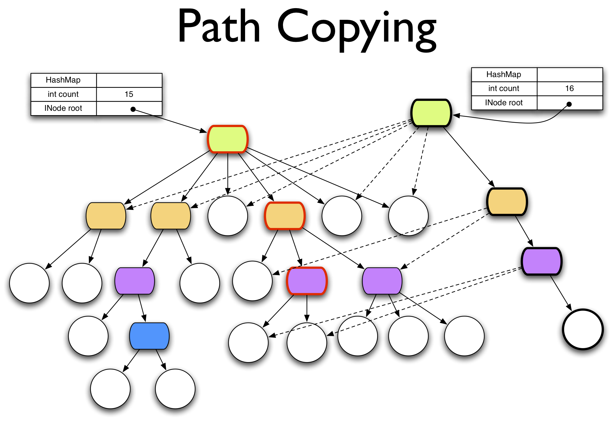

# Clojure Concurrency

* **Speaker: Rich Hickey**
* **Meeting: [Western Massachusetts Developer's Group](https://lists.owasp.org/pipermail/owasp-hartford/2008-February/000015) - March 2008**
* **Video 1: [https://www.youtube.com/watch?v=dGVqrGmwOAw](https://www.youtube.com/watch?v=dGVqrGmwOAw)**
* **Video 2, side by side video and slides, thus smaller original video: [https://www.youtube.com/watch?v=nDAfZK8m5_8&t=77s](https://www.youtube.com/watch?v=nDAfZK8m5_8&t=77s)**
* **Slides: [ClojureConcurrency/ClojureConcurrencyTalk.pdf](ClojureConcurrency/ClojureConcurrencyTalk.pdf)**
* **Source code: [https://github.com/jafingerhut/clojure-ants-simulation/blob/master/src/ants.clj](https://github.com/jafingerhut/clojure-ants-simulation/blob/master/src/ants.clj)**

[Video 1 is somewhat better if you want to try to follow it for the
discussion of the program, since it is larger and somewhat better
resolution of the original video.

Video 2 is worse for that, but nicer for the parts of the talk where
Rich is using the slides.]

[Historical note written in 2019: This talk was given in March 2008,
before Clojure 1.0 was released in 2009.  Amazingly, even the few
deprecated things that are in the example program still work in the
latest versions of Clojure in 2019, due to Rich Hickey's commitment to
backwards compatibility.  There will be editor notes within square
brackets in a few places that mention information that is current as
of 2019.]


[Time 0:00:00]

```
slide title: Clojure

A Dynamic Programming Language for the JVM

           Concurrency Support

               Rich Hickey
```

Hi.  Welcome.  Thank you all for waiting.  My name is Rich Hickey, and
I am here to talk about Clojure, a programming language I developed to
solve a number of problems, one of which was: how to write concurrent
programs easily.

So tonight's talk is going to be sort of a general overview of
Clojure, and a specific look at some of the concurrency support that
is built into the language.

[Time 0:00:35]
```
slide title: Agenda

+ Introduction
+ Feature Tour
+ Shared state, multithreading and locks
+ Refs, Transactions, and Agents
+ Walkthrough - Multithreaded ant colony simulation
+ Q&A
```

So I am going to start with a little introduction.

As I said, I will give you a quick tour of the features, but one of
the things I really would like to do tonight is look at a piece of
software written in Clojure, and so I would like hopefully to move at
a good pace, get through my slides, and the ideas behind what I am
going to be showing you.  And then look at some code.  And hopefully
we will have more opportunity to look into the syntax of Clojure, and
some of its features.  When we are looking at this program, we will
see some of the things in action.  So a quick feature tour.

Then I am going to set up sort of the problem space.  In particular,
talk about shared state, how we do it today, how you do it in C#,
Java, or C++, what happens when we get into a multi-threaded context,
and specifically what are some of the current solutions for that in
those spaces.  Locking, in particular.  That is something I have done
a lot of, over a long period of time, and I am tired of trying to get
right, because it is simply far too difficult.

So I will set up some straw men there, and then we will turn and look
at what Clojure does.  It tries to solve these problems in a number of
different ways, so refs, transactions, and agents are features of
Clojure.

[Time 0:02:06]

And then we will do the walkthrough.  We will look at an actual
program.  It is kind of a cool little ant colony simulation that is
multi-threaded, it has some graphic components, and something would
generally be hard to do correctly in most common languages.

And then hopefully we will have some time for questions.  Questions
throughout are OK.  As I said, I am going to try to go quickly in the
early going, but at any point you have a question, don't stay stuck.


[Time 0:02:35]
```
slide title: Introduction

+ Who are you?
  + Know / use Lisp?
  + Java / C# / Scala?
  + ML / Haskell?
  + Python, Ruby, Groovy?
  + Clojure?
+ Any multithreaded programming?
```

So I am a software developer.  I have done a bunch of things:
scheduling systems, automation systems, audio analysis,
fingerprinting, election projection systems, and machine listening
software.  I am an architect, and specialize in blank paper new
designs, hard problems, things like that.

I have worked in C++, Java, C#, Mathematica, Common Lisp, Python, a
bunch of other things.

And so I would like to try to get an idea, quickly, of where you are
at, so I know what not to bother with, or what you need to hear.  How
many people here use Lisp at any point, Common Lisp or Scheme?  OK,
that is good.  About half.

And then how about the Java, C#, Scala thing?  So almost everybody
does that.

Anybody with any ML or Haskell?  Just a couple.  OK.

Python, Ruby, Groovy?  OK.

How about Clojure?  Anyone using or trying Clojure?  A couple of
people in the room, OK.  That is neat.

And then how about multi-threaded programming?  So about half.  So
those are the people who will groan in acknowledgment as we get to
all of these points.

[Time 0:04:07]

Great!  So it is a great audience.  It seems like the ML, Haskell side
is least well represented, and the few people here who have that will
be the ones nodding in acknowledgement at some of this, I think.

When you come to Clojure, you will see it has three main flavors to
it.  One is interoperability with Java.  It lives on the JVM.  But I
get people coming to Clojure from Scheme who have never used Java who
are like: What is this dot?  And where do I put it?  In between what?
What is Javadoc, and where do I find it?

And then there are people coming from Java, who are like: What is
Lisp?  What are all of the parentheses?  And everything else.

And I do not get as many people coming from ML or Haskell, mostly
because I guess by the time you have figured out Haskell, you are
tired and you are just going to stay there.

[Audience laughter]

But a lot of Clojure is inspired in particular by Haskell and ML,
also, is a definite thing.  And for tonight's example, ML will be
poignant.

[Time 0:05:22]
```
slide title: Clojure Fundamentals

+ Functional
  + Immutable, persistent data structures
  + No mutable local variables
+ Lisp
  + _Not_ CL or Scheme
+ Hosted on, and embracing, the JVM
+ Supporting Concurrency
+ Open Source
```

But Clojure kind of plays in the same space as Python, Ruby, and
Groovy in being a dynamic language, that is as accessible, I think, as
those, but as performant as Java, and I would like to believe is
useful in any context in which you would use Java, not just for
scripting or lightweight problems.

So some fundamentals of Clojure.  It is a functional language.  You
may hear people say: Oh, you can do functional programming in Lisps or
Scheme.  And you can, mostly by convention, or good habits.

But Clojure is functional, sort of like the way ML is functional.  In
other words, you cannot change things, pretty much.  Most of the data
structures are immutable.

[Time 0:06:02]

And that has a lot of value to a program, but it is going to have
particular value when we talk about concurrency, and what it takes to
make a program safe in the presence of multiple threads.

So it is functional.  It has immutable persistent data structures.  I
will explain what data structure persistence is a little bit later.

There are no mutable local variables.  You do not do traditional
looping by iteration and mutation of a counter, or anything like that.
So it is much more functional than most Lisps -- probably the most
functional Lisp.

But it is, in fact, a Lisp.  Most people here have touched some Lisp,
and I would say a characteristic of a Lisp that sort of crosses
through all of the families, is the fact that code is data, that there
is a reader that the language is defined in terms of the
interpretation of a data structure, and not in terms of a stream of
characters and the syntax for a grammar with characters.  And Clojure
is a Lisp in that sense.

It is in many other ways.  It does have parentheses and S expressions,
and things like that.  But it is a Lisp at the core philosophical
level.

But it is _not_ Common Lisp or Scheme.  I am not going to have enough
time in tonight's talk to draw a lot of contrasts.  And the one thing
I would say is when I get people coming to Clojure that have
experience with Common Lisp or Scheme, they have to be reminded almost
continuously to not suppose things.  I reuse some of the same names,
some syntax, for different meanings, almost opposite meanings.  It is
not a superficial thing, and it is not just to be different.  There
are reasons why I use the names I do.  One of the reasons is: there
are only so many good names, and if they have to mean what Common Lisp
said they mean forever and ever and ever, that is not fair.

[Time 0:07:57]

So they mean different things.  So you may have a presumption when you
look at some code, because it looks similar, I have seen two parens
around this and that word, just to take a step back.  Maybe what you
are supposing might not be correct.  If it really seems to be a clash
with what you think it means, I will clarify for you.  But just
remember, it is not Common Lisp or Scheme.  It has no backwards
compatibility with those things.  It makes no presumption of bringing
code from those languages into Clojure.  It is a new Lisp.

Another fundamental of Clojure is: it is hosted on, and embraces, the
JVM.  I am leaving out the rationale part of this talk so I can get to
the concurrency things, but I believe it is important for new
languages to embrace a platform like .NET or the JVM because there is
too much wheel reinventing on the part of new languages.  Every new
language reinvents a whole new library for doing the same old things:
talking to a database, talking to XML, sockets.  I think there is no
reason to do that.  There are languages, and there are libraries, and
when you go to a framework like Java, the JVM, the libraries are
substantial.  Like Clojure has the most libraries of any language.
That is fair to say, because it has its own plus Java's, and Java has
_huge_ libraries.

But there are other aspects to that, though, that matter.  For
instance, when Java is your implementation language, you have a major
advantage over Lisps that are hosted, for instance, on C, in that your
hosting language shares a memory model and a garbage collector with
your hosted language, which means that things that used to be foreign
function interfaces and kind of ugly, potentially, now are really
nice.  And you will see that Clojure embraces the JVM bidirectionally
quite extensively, and to its benefit.

Another fundamental of Clojure -- if you are going to say Clojure has
four legs, it is functional programming, Lisp, being hosted on Java,
and the fourth is concurrency.  Direct support for concurrency,
primitives for concurrency.  And it is designed to support concurrency
that pervades the entire language, including the data structure
design.

[Time 0:10:01]

The last point of Clojure is that it is open source, and accessible,
and downloadable, and in Subversion.  You can participate pretty
directly.  So it is not a proprietary thing.


[Time 0:10:16]
```
slide title: Clojure Features

+ Dynamic development
  + REPL, reader, on-the-fly compilation to JVM bytecode
+ Primitives - numbers, including arbitrary-precision integers &
  ratios, characters, strings, symbols, keywords, regexes
+ Aggregates - lists, maps, sets, vectors
  + read-able, persistent, immutable, extensible
+ Abstract sequences + library
```

So I am going to quickly do -- mostly enumerate -- the features of
Clojure, briefly, before we dig in.

It supports dynamic development like Lisp.  So you have all
experienced that in Lisp.  A REPL.  It has a reader.  In particular,
Clojure is not interpreted.  It is always compiled.  Everything you
enter that is evaluated by Clojure is compiled on the fly into JVM
byte code and loaded.  So everything is byte code.  There is no
interpreter in Clojure.

It has all of the basic primitives: numbers, arbitrary precision
integers that you are used to from Lisps, ratios, characters.  Strings
are Java strings, so therefore they are also immutable strings.
Symbols, keywords, it has regex literals and some other things like
that.

In addition, Clojure has a set of aggregates.  It has the classic
Lisp-like lists, with the difference being that they are guaranteed
immutable and persistent.  There is no `set-car!` [from Scheme] or
`rplaca` [from Common Lisp], or anything like that.

In addition, it has maps and sets and vectors, and these are as first
class in Clojure as lists are in Lisp.  Don't say that too fast.
Which means that maps are readable.  There is reader syntax for them.
There is printing for them.  Ditto sets.  Ditto vectors.  All of these
are persistent, immutable.  Again, persistence I will talk about in a
little bit.

And they are extensible.  All of the data types in Clojure are
represented by abstractions.  There are interfaces in the Java side,
which means that they are not hardwired.

[Time 0:12:00]

In Lisps traditionally, the whole library is built around cons cells,
but it is hardwired to those cons cells.  And many people are
frustrated by Common Lisp's inability to extend the sequence library
to their own data structures.  That is not the case in Clojure.  All
of the data structures are defined by interfaces, and all of the
useful library is defined in terms of abstractions, not in terms of
concrete things.

The big one is the sequence library.  There is a big sequence library.
Everything that used to be built on top of conses is built on top of
this logical thing called the sequence, and sequences are supported on
all of the data types: on strings, on all of the Java collections,
anything that is `Iterable` [a Java interface].  Which means your
library and any work you do on logical sequences works on everything,
not just lists.


[Time 0:12:47]
```
slide title: Clojure Features

+ Metadata
+ First-class functions (fn), closures
+ Recursive functional looping
+ Destructuring binding in let / fn / loop
+ List comprehensions (for)
+ Macros
+ Multimethods
+ Concurrency support
```

Clojure supports metadata as a first class entity.  That means the
ability to associate related data with a data structure, without
impacting its equality semantics.  So you can have two vectors that
contain 1, 2, 3, and 4.  They are equal.  But this vector can have a
piece of data that says: I got this from this Internet site.  And this
one can have a piece of metadata that says: I found this on the road
outside.  And they are equal.  Their values are equal, but their
metadata is different.

Metadata is sort of an open system.  I do not dictate its use, but you
can use it in your own programs to check sources, like I just
described, whether or not things have been validated, where they came
from, have you ever looked at them, how old are they?  Things that are
not really part of their value proper, but are about the data.  That
is what metadata means.  There is direct metadata support for all of
the interesting data structures in Clojure.  There is reader support
for it.  It is a first class concept.  And I think Clojure is kind of
unique in having that.

It has the typical Lisp things.  Functions are first class data types,
closures.

[Time 0:13:54]

It has a functional looping construct.  It does not have proper tail
call optimization, and that is because the JVM does not.  And Clojure
uses the JVM calling architecture, both for performance and
interoperability.  So Clojure is very fast, and Clojure calls are Java
calls.  They use the Java stack.  But the B side of that is that I
cannot do tail call optimization as in Scheme, which means I cannot
offer recursive calls as the method of doing loops, as you can in
Scheme, although you cannot in Common Lisp.

So what Clojure has is a first class functional looping construct that
is recursive, and is functional, and feels exactly like you would do
with function calls in Scheme.  It is less general than full tail call
optimization, but it is what I can do on the JVM, and it is quite
pretty, I think.  So it has that.

It has an extensive destructuring binding system, not just for lists.
Does everyone know what destructuring binding is?  OK, it is where in
a context where you would bind variables with names, that you can not
just put in variables, but you can put in things that look like data
structures that mirror the data structure you are getting passed, and
can pick out and name pieces of the data structure you are being
passed.  And that is called destructuring.

In Common Lisp it is available in the macro system, and as a
standalone function called `destructuring-bind` [Common Lisp HyperSpec
says it is a macro -- http://clhs.lisp.se/Body/m_destru.htm].  But in
Clojure, it is built in to `let`, `fn` -- which is the `lambda` of
Clojure, and `loop`, which means that all of those constructs can
destructure their arguments.  And they can destructure very
interesting things, including sequences generally, and maps.  So it is
a very powerful way to write elegant things.  If you have pattern
matching envy, this is half of that, except the part of that that I do
not like, which is the conditional part.

It has list comprehensions in a construct called `for`.

[Time 0:16:01]

It has macros, and they are Common Lisp style macros.  Although
Clojure is a Lisp-1, and typically there was an argument that you
really could not have a Lisp-1 with hygienic macros -- _without_
having hygienic macros, without that being a disaster.  And that is
why Common Lisp is a Lisp-2, which means it has a separate namespace
for functions.

[See this link for more background on Lisp-1 vs. Lisp-2:
https://en.wikipedia.org/wiki/Common_Lisp#The_function_namespace ]

But it ends up that this is a solvable problem, and it is solvable
with a combination of two things.  One is that you have namespaces,
which Clojure does.  So you can segment your names into namespaces.
The other thing that you need to solve this problem, by having sort of
Common Lisp style macros -- procedural macros -- in a Lisp-1, is to
distinguish between symbols and variables.  And in Common Lisp they
are sort of unified, so when the reader reads, it creates data cells,
because symbols are places.

In Clojure that is not the case.  The reader reads symbols, and
symbols are just symbols.  There is no storage associated with them.
And there is something called Vars in Clojure, which compilation will
find, given a symbol, the Var to which it corresponds.  That is a
storage location.

So it has macros.  They are Common Lisp style macros.  And therefore
they are a lot of fun, and very powerful, and arbitrarily powerful
because you can write little programs that can transform one piece of
code into another.  So Clojure has that.

It has multimethods, which is a way of doing polymorphism without any
inheritance.  Clojure multimethods are completely general.
Essentially you have a function, and it takes arguments.  You can say:
I would like to dispatch this differently depending on what the
arguments are.  And it does not have to depend on the types.  It can
depend on the values of the arguments.  It is sort of an arbitrary way
to do dispatch.

So if you are familiar with virtual functions.  They always dispatch
on type.  If you are familiar with Common Lisp generic functions, they
always dispatch on type or value of the arguments.

[Time 0:18:06]

Multimethods take that one step further and they say: dispatching is a
function of the arguments.  You can say what that function is going to
be.  It can pick out the types.  It can look at the values.  It can go
ask in a database.  Then the dispatch function returns a value, and
dispatching happens on that.  It is probably impossible to understand
from that brief a description, but it is a way to support polymorphism
that is independent of inheritance.  So it is pretty powerful, and
very flexible.

In particular, because it is independent of inheritance, it allows you
to divide up your data space into multiple hierarchies, which is
typically hard -- to have multiple taxonomies in a single program.
That is easy in Clojure.

And Clojure has concurrency support, which we are going to hear a lot
about.


[Time 0:18:52]
```
slide title: Clojure Features

+ Java interop
  + Call methods, access fields, arrays
  + Proxy interfaces / classes
  + Sequence functions extended to Java strings, arrays, Collections
  + Clojure data structures implement Collection / Callable / Iterable /
    Comparable etc where appropriate
+ Namespaces, zippers, XML and more!
```

More and more.  Java.  Of course it is hosted on the JVM.  Hopefully
it has decent Java interoperability, and it does.  You can certainly
call methods of any Java classes, instantiate classes, access fields,
access arrays, create arrays, fill them up.  Anything you want to talk
to Java.

In addition, you can create proxies for interfaces and classes, which
essentially allows you to "implement" those classes.  And we will see a
little bit of that in the demo program.

The whole sequence library, because it is written in terms of these
abstractions, is extended to Java types.  So you can write algorithms
in Clojure that manipulate Clojure's logical sequence.  Those
algorithms will work on Java strings, Java arrays, anything that is a
Java collection, anything that is Java `Iterable`, which is pretty
much anything interesting in Java.

In addition, going the other way, where it is appropriate, Clojure
data structures implement Java interfaces.  All of the Clojure
collections implement the read only portion of `Collection` [a
prominent Java interface].  Obviously they are not writable, so they
opt out of the optional part, which happens to be the writable part of
the `Collection` interface.

[Time 0:20:02]

Clojure functions are `Callable` [a Java interface], so you can just
pass them right to the `Executors` framework to execute them in
threads in Java.

All Clojure data structures are `Iterable`.  Things that can be are
`Comparable`, etc. etc.  So there is a great ability to create some
data structure in Clojure and hand it off to Java, and have Java be
able to consume it without any conversion or transformation, because
of these interfaces being implemented.

And much, much more.  It has namespaces, as I mentioned.  It has
functional trees, zippers, XML support, inspectors, and all kinds of
neat things, which you will have to look at the web site and find out
more about.  We will see lots of this used in the program, but not all
of it.

Any questions?  Is this too fast?  OK.


[Time 0:21:06]
```
slide title: State - You're doing it wrong

+ Mutable objects are the new spaghetti code
  + Hard to understand, test, reason about
  + Concurrency disaster
  + Terrible default architecture (Java / C# / Python / Ruby /
    Groovy / CLOS ...)
+ Doing the right thing is very difficult
  + Languages matter!
```

OK!  Now we get to the meat of it.

State.  You are doing it wrong.  Which is OK, because I was doing it
wrong, too.  We were all doing it wrong.

I think one of the things that drove me to Clojure, and you have to be
driven to do something like writing a new language, because it is
definitely an act of insanity to do.  But one of the things that drove
me to it is that I am completely convinced that mutable objects, and
the whole approach that is sort of implied by the design of Java, C#,
Python, all of the languages that have followed along this path -- is
very much the wrong way to do most things.  It is an OK way to do some
things, but it is the wrong way to do most things.

[Time 0:22:02]

Mutable objects are the new spaghetti code.  And by that, I mean that
you, eventually, with mutable objects, create an intractable mess.
And encapsulation does not get rid of that.  Encapsulation just means:
well, I am in charge of this mess.  But the real mess comes from this
network that you create of objects that can change, and your inability
to look at the state of a system and understand how it got there, how
to get it there to test it next time.  So it is hard to understand a
program where things can change out from underneath you.

It is very hard to test it.  I think it is very interesting and
telling, all of the emphasis on test driven design.  And I think
people are driven to this because they know these systems are
completely intractable without constant testing.

But rather than question whether or not they were using a decent
language in the first place, or maybe this was not a good idea, they
are just going to test it to death to try to keep it running.  And I
think it is better to question the fundamental principle about whether
or not you really should have this much mutability in your program,
because the vast majority of most programs do not need it, and should
not have it, and would be easier to understand if they did not have
it.

Anybody that knows Haskell is going: Yes!  Yes, of course!  Yes!

And Haskell is great.  I think it is not the only way to achieve that.
I think Clojure is in a unique position in providing maybe the
friendliest face ever presented to functional programming, I think,
that is out there.  Because you end up doing this programming with
these immutable data structures, and it is not too painful.  And then
you realize: Wow.  I am worrying a lot less than I usually do when I
write programs.  I have less stress.  I can just bravely go and hand
this data to some part of the program I do not understand, because I
know nothing bad can happen.  And that is a good feeling that you want
to achieve.

[Time 0:24:02]

So that is the first: hard to understand, test, and reason about.  But
if you put concurrency in the mix, there is no doubt about it.
Mutable objects are a disaster.  They are a complete catastrophe, and
I am going to show you exactly why.  But I want you to understand that
you do not have to believe me.  I even carried a book this whole way.
I just drove, so I did not actually carry it.  But has anybody read
this book?  "Java Concurrency in Practice".  How many people have read
this book?  Oh, boy, and all of these people are programming in Java.
You have to read this book, because it is a fantastic book.  And it is
a book that will scare you to death, because what it basically says
is: this is impossibly hard.  It is just so difficult to get right.

But the other thing you are going to see if you were to read this book
is the mention of immutability over and over and over and over and
over again.  Just, if things were immutable, there would be no
problem.

The problem is: it is hard to do things immutably in Java, because you
are fighting the stream.  You are running upstream, trying to do the
right thing.  But it ends up being the case that if you can use
immutable data structures pervasively in your programs, concurrency
becomes very much easier.  It is not everything, and you will see the
infrastructure that is in Clojure, you need something beyond
immutability.  You need some coordination mechanisms to fully solve
the problem.  But there is no doubt about it that mutable objects are
really bad for concurrent programs.

So as a default architecture, I think mutable objects are terrible.
They really are, and we need to start questioning whether or not that
is the right way to start.  I do not care how much you test.  Do the
right thing, and you will not need this kind of testing, and you will
still have a more reliable system.

[Time 0:25:56]

But one of the things I came to was: I decided I knew what the right
thing was, and I started coding all of my Java and C# in a completely
bizarre manner, with no data inside the objects.  Everything was a
static method that took data, and returned data.  So I did functional
programming in C# and Java.

And it is very hard, because it is not idiomatic.  And people would
look at my code and be like: Oh, my god!  What happened?  There is
this class with 27 static methods, and no data.  I love that, and I
tried to teach young programmers to do that, if they are stuck in Java
and C#, their programs will be better if they are functional.  But
functional programming in languages that default to object oriented
programming, especially mutable objects, is very difficult.

So you can do all of the testing you want, but I think languages
matter.  I think that a language that does the right thing, by
default, makes everything easier.  And unfortunately there was not one
in the space I wanted, which was to target Java and have it be a Lisp.
Therefore, the act of insanity that is Clojure.


[Time 0:27:08]
```
slide title: Concurrency

+ Interleaved / simultaneous execution
+ Must avoid seeing / yielding inconsistent data
+ The more components there are to the data, the more difficult
  to keep consistent
+ The more steps in a logical change, the more difficult
  to keep consistent
+ Opportunities for automatic parallelism
  + Emphasis here on coordination
```

So let us talk a little bit about the problem of concurrency.  What do
we mean by concurrency?  We mean things happening at the same time.
That is what it really means.  Whether or not things are happening at
the same time depends a little bit on whether or not you have more
than one CPU, and what your operating system is, and what platform you
are running on.  But certainly Java and the JVM is capable of
simultaneous execution.  That is, multiple threads are running on
separate CPUs at the same time.

But even if you do not have actual concurrency, if you use threads at
all, you have simulated concurrency.  Which means you have interleaved
execution.  A little bit of this process happens, a little bit of
that, and back and forth.  So even on a single CPU, as soon as you
have a multithreaded program, you have the problems of concurrency,
which is that you would like to avoid seeing inconsistent data, or
producing inconsistent data.

[Time 0:28:07]

And that ends up being a difficult thing to do.  The more components
there are, in particular, the more difficult it is.  The more steps
involved in an operation that you want to perform in your program --
in order to do this, I need to take some money out of this account and
put it over there, but check with the account manager.  These seven
things happen, and that is a unit of work.  If you want to make that
unit of work happen, or not happen, in a program -- of course in a
database there is transaction support that makes this easier -- but in
your program, you have similar kinds of things you need to achieve.
That is all on you.  And the more steps there are, the more difficult
this becomes.

There are also aspects of concurrency related to parallelism.  And
there are parallel programming languages, and languages that support
automatic detection of the ability to employ parallelism.  You just
say: do this to everything in this sequence, and the language figures
out: well because everything is immutable, I could put this on --
split this into two jobs and put one job on each CPU.

Clojure does not do anything like that.  It is not really a parallel
programming language.  And so the emphasis here is going to be on the
coordination aspects of programs that are concurrent, where the
concurrency comes from your deciding to execute things simultaneously,
not the system deciding to do that.

Everybody get what concurrency is about?  What we are talking about
today?  OK.


[Time 0:29:33]
```
slide title: Explicit Locks

+ lock / synchronized (col) { ... }
+ Only one thread can have the lock, others block
+ Requires coordination
  + All code that performs non-atomic access to coll must put that in
    a lock block
  + Synchronized handles single-method jobs only
```

So this is the straw man part of the thing.  I am not talking about
Clojure here.  I am talking about what you have to do today if you are
programming in, let us just say, Java and C#, because we have almost
unanimous recognition of those two languages.

So what do you do now?  What we are going to talk about is: what do
you do now if you want to manipulate a collection in your program,
from multiple threads.  Well, you could lock it.  You could lock it,
or synchronize.  And inside that block you have exclusive access to
the collection.

[Time 0:30:06]

So we use locks.  Only one thread can have the lock at a time.
Everybody else blocks waiting for that.

It requires coordination.  In particular, you have to choose to do
this.  Right?  Any code that is going to manipulate this collection
has to know: Oh!  I think other people might be using this, so I
better lock it when I look at it or change it.  So it is manual, and
you have to decide to do it.  It is a convention.

Of course you could say: well you could have synchronized primitive on
the Java side, at least, which they have fallen out of use of, because
it is really not that useful.  It only can handle one method
interactions.  So if you need to check if something was in a
collection, and if it was not, put something in, that is two steps.
Synchronize does not help you with a two step job.  So you have to
lock it, and then you can do those two step jobs.

So there is locking.  Everybody has used locks, yes?  At some point,
hopefully?


[Time 0:31:03]
```
slide title: Single Lock Problems

+ Can't enforce coordination via language / code
  + This is not a small problem
+ Even when correct, can cause throughput bottleneck on multi-CPU
  machines
  + Your app _is_ running on a multi-CPU machine
  + Readers block readers
```

So what is wrong with this?  What are the problems in doing this?

Well, you cannot enforce it.  Everybody has to choose to do this.  If
you forget to lock, and you are part of the program, you have just
made a mistake.  And the language is not going to help you detect this
mistake.  There is nothing in Java or C# that helps you with this.  So
there is no enforcement.

That is a _big_ problem, because keeping track of what things you have
to lock -- you do not lock everything you touch, right?  In your Java
and C# programs?  No.  You have to decide.  Well, I think this is
something worth sharing, so I should lock this thing.

That is a big problem, because what happens is you decide later that
you are sharing this thing.  Well, all kinds of access to this thing
is throughout your program now.  Those people did not make that
decision.  You have to go and figure out where to retrofit the locks.

Even when you put the locks in everywhere you should, you have a
bottleneck that comes from this on multi-CPU machines, because these
locks are sort of super-powerful global, no one is getting in here,
and everybody else that wanted to touch this thing is waiting.  So it
can cause a bottleneck on a multi-CPU machine.

[Time 0:32:15]

And guess what?  You are running on a multi-CPU machine.  This is no
longer a maybe some day.  This is definitely happening.  On the most
mundane hardware, we have got multiple CPUs.  And it is only going to
get worse, because they cannot make the CPUs faster, so they are
making more of them.  Yay!  Lucky us.

Another problem with the single lock is that it really is too much.
For instance, readers block other readers, which is kind of a shame,
because they are not really going to interfere with each other.  But
because you are locking as a reader to prevent a writer from messing
you up, you are also locking out other readers.  So that is
inefficient.


[Time 0:32:55]
```
slide title: Enhancing Read Parallelism
```

So how can we fix that?  Because there are solutions to the read
parallelism problem.


[Time 0:33:00]
```
slide title: Enhancing Read Parallelism

+ Multi-readers / single-writer locks
  + Readers don't block each other
  + One writer at a time
  + Writers wait for reader(s)
```

And the solution is a special kind of lock.  Not the one you get for
free by using lock or synchronized in C# and Java, but one you
manually ask for, which would be something like a multi-reader
single-writer lock.

And these have special properties.  In particular, readers do not
block each other.  So multiple readers can be in there reading, and
they do not block each other.  So that is an enhancement to the
parallelism support.

You only get one writer at a time with one of these things.  Writers
still wait for readers in this strategy.  But it is better for read
parallelism.

So that is one solution.


[Time 0:33:39]
```
slide title: CopyOnWrite Collections

+ Reads get a snapshot
+ Lock-free reading
+ Atomic writes
+ Internally, copy the representation and swap it
  + Writes can be expensive (copying)
+ Multi-step writes still require locks
```

What else do we have?  Copy on write collections.  Not in C#, but in
Java we do.  Anybody use copy on write collections ever, yet?  They
are kind of an unusual thing, but they have very neat multi-threaded
properties.  In particular what happens in a copy on write collection
is: when the collection is changed, inside the implementation of the
collection, a copy is made of the data, and then it is atomically
swapped in for the data that was there.

[Time 0:34:10]

Which means that whenever anybody reads, they get a copy of the data
that was there that is never going to change.  Because what is going
to happen is a new set of data is going to get swapped in.  So reads
are lock free.  Anybody who wants to read a copy on write collection
can read it freely and there is no locking associated with that.

Writes are atomic, because you sort of prepare all of the data over
here, and then, with an atomic compare-and-swap operation, swap in the
data.  It appears to change instantaneously.  So those are actually
lock-free as well.  Because compare-and-swap is a lock-free operation.
It leverages a processor primitive that can change a memory value
atomically, without anybody seeing it in an in between state.

The problem with copy on write collections -- I mean, those are really
nice properties.  Now we are completely lock free.  No blocking in
readers.  No blocking of writers by readers.  A lot of nice things.
The problem in general with copy on write is that it is very expensive
to write, because it is usually a full copy.  So if you read the docs
for copy on write ArrayList, I think it is called in Java [Java class
name is `CopyOnWriteArrayList`], they will say: this is for mostly
read situations, occasional write situations.  If you are writing a
lot, this falls down.

And there are still limitations.  A multi-step interaction with a copy
on write collection still requires a lock.  Which makes sense, because
if I am going to change this and that, and maybe I need to read it in
between, well somebody else could get in the middle of that.  And
nothing about it atomically swapping is going to help that.  So if you
have a multi-step operation, you still have to lock.

So this is not a cure-all.  But that is basically all you get.  There
is nothing better in Java or C# today than these solutions.  And we
are still only talking about _a_ [i.e. one] collection here.


[Time 0:36:08]
```
slide title: Persistent Data Structures

+ Immutable, + old version of the collection is still available after
  'changes'
+ Collection maintains its performance guarantees for most operations
  + Therefore new versions are not full copies
+ All Clojure data structures persistent
  + Hash map and vector both based upon array mapped hash tries
    (Bagwell)
  + Sorted map is red-black tree
```

There is, in fact, another way to do a data structure that has much
better properties for concurrency, and it is called a persistent data
structure.  And unfortunately persistent is one of those words that
has been used over and over again in programming.  Most people when
they hear persistent, they think of putting it in a database, storing
it somehow, being able to serialize it.  That is not what this notion
of persistence is.

When we talk about a persistent data structure in functional
programming, what we mean is that the data structure is immutable.
And so what is going to happen is: when you want to produce a
"changed" version of the data structure, you are going to have to
produce another data structure.  And what we want to have happen is
when we produce the new data structure, we want the old one to remain
accessible.

There are recipes for producing new data structures from old, where
the old ones should not be used any more.  And that is not true
persistence.  In true persistence, the old version is still there.  So
I can have something.  You can get a changed version.  My thing is
still fine.  Your thing is fine.  Both cannot be changed.

But the trick with a persistent data structure is: for whatever kind
of data structure it is, so for a list you have constant time access
to the head, linear time access to the middle.  For a vector you have
constant or near-constant time access to anywhere, random access.  And
if it is an `ArrayList`, maybe constant time insertion at the end.
For a hash table, you expect constant time random lookups by key.

[Time 0:37:50]

Whatever your performance guarantees are, in the big O notion, for
your data structure, must be maintained for a persistent collection,
to really be considered a persistent collection.  Otherwise it would
be like copy on write.  I mean I can take your hash table and make a
new hash table, and just shovel everything into it one by one, but
what is the cost of that operation?  It is linear in the size of the
collection.  Well that is not the behavior of hash tables.  You expect
an insertion to be constant time, not linear.

[ https://en.wikipedia.org/wiki/Big_O_notation ]

So a persistent data structure maintains the performance guarantees of
its operations across changes.  So there is a big difference with copy
on write.  I will show you how it does that in one slide.  But the
implication of that is that the new versions cannot be full copies.
If I have a hash table here, and I am going to have a new hash table
with one new entry in it, and I am not going to have that be linear
time to copy everything, then somehow it cannot be a full copy,
because the full copy would have to touch everything.  So they have to
share structure, and I will show you one of the ways that happens.

But already, this is sort of a magical thing now.  I have an immutable
collection, and I have a really inexpensive way to make a new version
of that with a small change to it.  And they share structure, which
means they have good memory characteristics, and all of the
performance guarantees are still met.  This is like magic.  It is
really, really good.  And it is really, really good stuff.

If you have been programming in Lisp, you have been programming with a
persistent collection, as long as you have not called `set-car!` or
`rplaca`, all along, which is the cons cell.  If you use a cons cell
in a functional manner, it is a persistent data structure.  If you
cons onto a list, do you affect the original list?  No.  You get this
new list that shares a tail with the other list.  Its tail is the
other list.  That is an example of a persistent data structure.  It is
a very very simple persistent data structure.  But it does show you
what is involved.  There is a shared structure, and there is sort of a
recursiveness to the definition of the data structure.  This new list
is the old list with one more thing at the front.  Sort of a recursive
definition of a list.

[Time 0:40:04]

And certainly Scheme's whole heritage of recursion and lists is about
that.  It ends up that, in my experience, there is no way I could have
written the programs I have written over the course of my career
without vectors and hash tables.  There is simply no way.  I do not
think production code can survive without data structures with those
kinds of performance characteristics.  So lists are not good enough.

Even trees with traditional log N kind of performance are not good
enough for the programs that I have written.  Certainly a lot of
people writing in functional programming languages are OK with log N
trees.  Typically the way to implement a persistent data structure is
to use some sort of a tree.  For a list, it is linear.  When you start
talking about a map, you say tree.  And vectors, you do not even do.
It is still a research topic how to do a purely functional vector.

But I knew in Clojure that I needed persistent data structures, and I
needed vectors and hash tables.  And I spent a lot of time researching
and designing a persistent hash map, and a persistent vector, which
sort of are -- they are the magic secret sauce of Clojure.  It makes
Clojure a high performance language with all of the functional
goodness.

In addition, Clojure does have a sorted map, and that is sort of a
classic functional red-black tree implementation.

So how do you do a hash map tree thing?


[Time 0:41:33]

```
slide title: Bit-partitioned hash tries
```


with any kind of decent performance.  It is still a tree.  It ends up
that the way you do a really fast "hash table" is to use a tree, and
to use a tree with a very high branching factor.  In fact, the factor
is 32.  And you still use hashing.  So what you end up with is
something that was originally started by this guy Bagwell.  He wrote
the paper, and if you search for array mapped hash tries, or "try-s",
however you want to pronounce it, and Bagwell, you will find the
paper, the two papers that I read.

[Time 0:42:15]

But his were not functional.  So what I did was produce persistent
functional versions of these data structures.  But the basic idea
behind a bit-partitioned hash trie is that you take the hash of the
value, and you mask out ranges.  In this case, 5-bit ranges, so there
is 32-way branching.  And you use as much of the hash, in 5-bit
chunks, as you need to distinguish one object from another in the
table.

So if you put one in, the first guy in, he only uses a 5-bit hash,
because he is the only guy there.  If the next guy is different in
those first 5 bits, he is also in the first level.  If eventually you
have a collision and you get a new guy who is the same in the first 5
bits, the first 5 bits being these light green ones over here, only
then will you use the next 5 bits and go one more level in the trie.
So you have a very high branching factor, and you are only using as
much of the hash, and as much depth, as you need to represent the
objects.

This ends up yielding a hash table with very, very good performance.
Is it constant time?  No.  I mean, in technical algorithmic complexity
terms, it is log [base] 32 N, instead of log N.  But log 32, that is a
really small number.  For instance, this is the map for all 32 bits.
I mean, you would have to have a huge data structure to use all 32
bits, and how many levels are we talking?  Seven at the most, and it
ends up that the first level is partitioned off to the side, so it is
six.

So in a gigantic data structure, way bigger than you are going to
have, it would be a max of six steps.  And in most common cases it is
three steps or fewer.  At the point something is three steps or fewer,
I do not care if it is log N or whatever.  It does not matter.  That
is constant time to me.  It is a small enough number that I can ignore
it.

[Time 0:44:11]

And there are implementations that are technically constant time, and
have amazingly high constant factors that are much slower than this,
and I investigated some of the technically constant time vector
solutions, which have these amazingly complicated implementations.  So
this is a really good implementation.  The insert times are decent,
but the lookup times are stunningly good, definitely as good or better
than the hash table that comes with Java.  Which is really amazing,
because this has all of that goodness I just talked about.  It is
immutable and it is persistent.

So let us talk a little bit about how you do the persistence side.
The trick is ...


[Time 0:44:52]

```
slide title: Path Copying
```


... to share structure.  So what would happen if we took this hash
table [referring to previous slide], and added something to it.  In
other words, we made a new version of it with one additional thing,
because we do not really change anything.

Well the version we started with is just sitting there.  It never gets
touched.  The new version needs to put one new entry, and in order to
do that it needs to copy the path to the new entry, and _only_ the
path to the new entry.  Everything else, all of these dashed lines,
are pointers to things that are in the old data structure, and
therefore are shared structure.

So the old tree is this bit over here, and the new one is mostly that,
but this right edge is new.  Just the path to the new node.  So in
this case, this was as deep as four, and you have four new nodes to
produce a new entry.

[Audience member: It seems that you could produce the nodes that are
outlined in gray, you are going to make copies of those.]

You are going to make copies of those, correct, and that is what all
of the dashes are.  Those are copies of those nodes.

[Time 0:45:57]

But again, it is very shallow.  There are some tricks that are used to
make manipulating the edge of this cheap.  But this data structure is
used both for the hash tables, which use the bits of the hash as the
trie, and the vector also works similarly, except there it is the
index of the vector that partitions the table, and it fills
completely.


[Time 0:46:29]
```
slide title: Structural Sharing

+ Key to efficient 'copies' and therefore persistence
+ Everything is final so no chance of interference
+ Thread safe
+ Iteration safe
```

So these two data structures really let Clojure do what it does, and
you will see the value of that later.

So generally this technique is called structural sharing.  It means
you produce a new value, and you share as much structure with the
original one as you could.

In cons, onto the head of a list, that sharing was complete.  The
entire original list is the tail of the new list.  But that is a
pretty simple operation, and that is a pretty simple data structure.
These are rich data structures with arbitrary insertion.  The vector
has `ArrayList` kind of capabilities to insert and grow at the end, so
it is not a statically sized vector.  And the hash map is a full map.
Lookups, make new associations, and all of that.

So structural sharing is the key to this efficient persistence.  It
allows you to keep the performance characteristics there.  In the
implementations you will see everything is final.  You will never see
more bizarre classes than you will in the implementation of Clojure,
in Java.  A bunch of classes where everything is final, and you sit
there and say: what utility could this possibly have?  And yet, there
it is.  It is a vector.  It is a map.  It is a queue.  They are all in
there.  Sets.  And they are all final.  So it is possible to do this.

It is not very idiomatic Java code, but it certainly is cool.

[Time 0:47:59]

And also falling out of this is thread safety.  Because this data
structure can never change, nothing bad can ever happen by having two
threads look at it.  It is also safe for iteration, and all of those
nightmares of collections that can change of: it throws
`ConcurrentModificationException`.  Everybody has seen that.
Everybody has had that happen to them.  That never happens with
Clojure data structures.

So we looked at, there are a couple of different locking strategies.
Then this copy on write collections.  That is available all on the
Java side.  Then there is this new notion of persistent data
structures.  Unfortunately, Java does not come with it.  But it is
possible in Java.  The Clojure ones are written in Java.  Yet you do
not normally see it.


[Time 0:48:42]
```
slide title: Multi-component change

+ Preceding was the easy part
+ Many logical activities involve multiple data structures / multiple
  steps
+ Two locking options
  + Coarse granularity locks
  + Fine granularity locks
```

Let us go back a little bit to the locking problem now.  Everything I
talked about before, that was the easiest thing you could possibly do
multi-threaded.  We are talking about only one data structure, trying
to control access to one thing.  The trickiest thing we had was a
multi-step operation on that one thing, which we could lock the one
thing and do our multiple steps.

That is baby steps in concurrent programming, because what happens is,
in real life you have multiple activities and multiple data
structures.  When this thread connects, I need to put them in this
thing, only if they are not in this other one.  I want to move
somebody from this pool to that pool, but I want to make sure they are
never in two pools, and never in no pools.

All of those kinds of things are very hard, because now all of a
sudden you have upped your game.  You need to control more than one
data asset in the same logical operation.  And if we go back to
locking.  So again, we are not talking about Clojure now.  We are
talking about what you have to do today if you are using Java or C#,
you have two options really.

One is what I would call coarse granularity locks.  The other is fine
granularity.  So we will look at them.


[Time 0:49:57]
```
slide title: Coarse Granularity Locking

+ Create external Lock representing a set of data structures
+ Clients must obtain a lock to manipulate _any_ of the structures
+ Each multi-part logical operation requires only one lock
```

In coarse granularity locking, you are going to create some lock over
here, and you are going to say: this lock is the lock you use to
control this set of things.  OK.  Whenever you want to manipulate
anything in this set of things, you grab this lock.  And it is nice.
You grab this lock, and you can manipulate any of the data structures.
What is nice about it is that each multi-part operation only requires
the acquisition of one lock.

And it is fairly easy to describe this and document this in your
program.  To say: OK, here is the deal.  There is A, B, and C over
here, and there is a lock for those, and if you ever want to touch A,
B, or C, you grab lock ABC-lock.


[Time 0:50:38]
```
slide title: Coarse Granularity Locking

+ Safest
+ Can be confusing as to what constitutes the set(s), what needs to be
  locked
  + X needs a / b / c, Y needs b / c / d
+ Least throughput
  + Possible needless blocking
+ Should reads lock?
```

It is very safe.  It is the safest, if you are going to use locks.

It can be confusing.  If you have a lot of different sets of things in
your program, like one part of your program needs to use A, B, and C,
and another part need to use B, C, and D, well is there and ABC-lock?
Is there a BCD-lock?  If there is, you already have a bug in your
program.  Or is there and ABCD-lock?  People have to know what lock do
they need to use for what data structures.

This is not good from a throughput standpoint.  Remember we talked
about about with one data structure already, it was not good to be
locking wholesale for reads and things like that.  Now you are talking
about multiple data structures, which means there are going to be more
people interested in these data structures, everybody grabbing a
single lock, or queuing up for that single lock.  Lots of needless
blocking in this scenario.

And you have this question mark of: well, if I am just reading, should
I grab this lock?  I do not know.  Do you want to do a flying read on
some data that might be changing?

Sometimes, you do.  Or sometimes you have to, because you cannot incur
the cost of holding the world down while you read something.  I want
you to remember that, because later we are going to hold the world
down while we read something, but we will not really.


[Time 0:51:49]
```
slide title: Fine Granularity Locking

+ Use locks on data structures themselves
+ Clients must obtain a lock on _each_ of the structures
+ A multi-part logical operation may require several locks
```

What is the other option?  We go fine.  We knew every object in these
programming languages, every object has a lock associated with it.  So
one of the things we can do is we can lock the data structures
themselves, all of the ones that participate in our operation.

[Time 0:52:03]

So now you say if I need to use A, B, and C, I need to lock A, B, and
C, and then I can use them.  Move something from A to B, and look it
up in C, and move it from C to A.  Do whatever I need to do.  And any
logical operation may require multiple locks.

So that is fine granularity.


[Time 0:52:21]
```
slide title: Fine Granularity Locking

+ Dangerous
+ Locking order is critical
  + X locks a / b, Y locks b / a - deadlock possible
  + Very difficult to enforce locking order
+ Best throughput
  + Minimal blocking
+ Should reads lock?
```

This is a very dangerous thing.  This is where most programs end up,
because most programs start with somebody not thinking about locking.
And then somebody says: well, we are going to put a socket on the
program, so we can add this new stuff, or have other users come in.
And we want to monitor, oh, and logging, and then I need a background
thread to generate reports.

And you are like: oh, my god.  Now all of this stuff that was written,
when nobody thought would be seen from more than one thread, is going
to be seen from more than one thread.  And you have this ad hoc
locking that goes on.

But even with the best laid plans, it is still extremely difficult to
do right, because you lay your plans, and you do that, and then what
happens in all programs?  Things change.  New requirements are added.
And remembering what your strategy was when you go back and have to
add these new requirements, and making sure you account for
everything, is extremely hard.  And in fact, I would almost go to say
it is almost impossible.  And I sit and help people who are working on
multi-threaded programs, and you just have stare at it and work it
through your mind the possible interactions, all day long.  It is
_extremely_ difficult.

But we know what the basic problem is with this, even before we get
into these strategies, which is: in formulating a strategy, you need
to consider lock order.

If X wants to lock A and B, and Y wants to lock B and A, you have a
problem, because that is a recipe for a deadlock.  X will get A, Y
will get B, X is waiting for Y, Y is waiting for X.  You are toast.
Your program is over.  It is very possible to do this.

[Time 0:54:02]

It is very difficult to enforce locking orders.  You have to have
conventions.  Let us lock things alphabetically.  We will number them
in order to lock them correctly.  That is not a bad strategy, in fact,
because at least it is deterministic and mechanical.  But it is hard
to do.

On the other hand, if you can do this correctly, it will give you
better throughput than the global kind of locks, because there is a
minimum amount of blocking.  It is just as much blocking as is
required for the very few things you are touching.

We have this same question, though: should I lock if I am reading?
You could get very random results if you do not.


[Time 0:54:41]
```
slide title: Concurrency Methods

+ Conventional way:
  + Direct references to mutable objects
  + Lock and pray (manual / convention)
+ Clojure way:
  + Indirect references to immutable persistent data structures
  + Concurrency semantics for references
    + Automatic / enforced
    + _No locks!_
```

So let us compare these two concurrency methods.  The first is what I
would call the conventional way.  It is the way you have to do it
today if you are not using something very special, and I do not know
of anything special for Java or C#.  I mean a special language or
something that does this for you.

And I really want to talk about two things.  One is: what is the
structure of your program?  I mentioned mutable objects or whatever,
but there is a structural aspect to a program written with mutable
objects, and that is: that program is composed of direct references to
things that can change.  That is your typical C# or Java program.  It
is full of direct references to things that can change.

As soon as you have done that architecturally, you are stuck with this
locking stuff.  There is nothing else you could do.  And what do you
do?  You lock and you hope for the best.

The aspects of this that are bad are: it is manual, as we saw.  We
have to choose to lock.  And everything is convention.  Every
application has to decide we are locking A before B.  We are locking
in alphabetical order.  There is a lock over here for these three
things.  Do not forgot to lock that when you do this.

Where does all of that stuff go?  It is not in the programming
language.  It is on napkins, or in some docs somewhere, or whatever,
in some guy's head.  But it is not in your program, unfortunately.
And that is bad.

[Time 0:55:58]

We will contrast that with the Clojure way.  And what Clojure does is
two things.  We have these immutable persistent data structures, which
we talked about, and then we have the acknowledgement that there will
be programs in which you need to feel like those things are changing.

So rather than have them actually change, because we do not want data
structures to change, what we are going to do is we are going to have
a reference to something.  And we are going to keep that reference
around.  That will be a stable reference.  But what it refers to, that
can change.

So therefore that reference is indirect.  It is sort of a pointer.  It
is a cell that holds a pointer to a thing.  The cell we will always be
able to keep track of.  The pointer to the thing, that may change.  So
this cell can mutate.  It is an atomic thing that can mutate.  What it
is called in Clojure is references.

So the different architecture in Clojure is you have indirect
references to things that could never change, but those references can
be made to refer to other things over the course of an application.
That gives you the same effect, right?  When we had references to
things that could change, I could remember Fred, and I could look at
Fred at one point in the program, and it would be something.  And I
could look at Fred at another point in the program and it would be
something else.

This can achieve the same effect.  I have a reference.  I am going to
call the reference Fred.  At one point in the program it refers to
this.  And at another point in the program it refers to that.  Same
feel.  I will look at Fred.  I will get different information.  The
difference is: this is indirect.  I do not really have a pointer to
this data structure or that data structure.  I have a reference that I
hold onto.

And that those references can change.  So now here is a part of
Clojure that is mutable.  This is the first thing so far I have talked
about in Clojure that is mutable.  Nothing else you saw, none of the
strings, characters, all of those data structures, lists, vectors,
maps, sets.  None of that can change.

The only thing that can change are these reference types.  And what is
important about them is: they have concurrency semantics.  Because
they are indirect, your program is not twiddling them.  Your program
has to use functions to make them point to different things.  And
those functions have concurrency semantics, which I will talk about in
a minute.

[Time 0:58:09]

Which means that they are automatic.  The programming language is
going to help you change these things to point to other things, and
not mess that up.  And it is enforced.  For instance, some of these
references cam only be changed inside of a transaction.  And guess
what?  If you try to change it outside of a transaction, it throws an
exception.  You cannot do that.

So there is a _big_ difference now between these two things.  One, it
is all convention.  It is all manual.  Things could change out from
underneath you.

In the other, things never change.  If you actually dereference one of
these references, you would get an immutable object.  If somebody
makes that reference point to something else, do you care, while you
are looking at this and calculating?  No.  This will never change
while you are looking at it.  That is really beautiful.

And in the application program, there are no locks.  So there is no
locking required to do any of the things concurrency-wise that Clojure
supports.


[Time 0:59:01]
```
slide title: Clojure References

+ The only things that mutate are references themselves, in a controlled way
+ 3 types of mutable references
  + Vars - Isolate changes within threads
  + Refs - Share synchronous coordinated changes between threads
  + Agents - Share asynchronous independent changes between threads
```

So I said these things are generically called references.  That is
kind of a little reuse of the word, because you will see one of the
reference types is called "ref".  So do not get confused by that.

So the references are the only things in Clojure that are Clojure's --
I mean, you can use Java in Clojure and all kinds of stuff can happen.
That can change, because it is still Java.  I do not protect you from
the mutation that is associated with Java or side effects.  You go
there.  You do that.

But in Clojure, only these references can change.  They are the only
thing that can really mutate.  This is inspired by ML.  In ML there is
a thing called a reference.  And it is a really neat idea.  It is the
thing in ML that can change.  It is Standard ML I am talking about
here.  It also has arrays, which I will not talk about, but the
reference was kind of a neat idea.

The problem for me in just copying that into Clojure was it has no
concurrency semantics.  In ML it is just a free for all cell.  But it
was a neat thing because it was indirect, and you did not need to make
mutable composite data structures.

[Time 1:00:00]

If you have an easy way to turn one data structure into a changed
version of itself, you do not really need data structures where you
can twiddle the bits, because you can make those incremental changes
cheaply.  So all you ever need is a reference that you can change, and
you just refer to changed versions.

So there are three types of these references in Clojure.  There are
things called Vars, and a Var is used actually to hold global
variables and functions.  So there is a global notion to a Var.  In
addition, Vars have the ability to be bound to values inside a thread.
And once they are bound inside a thread, that binding is independent
of other threads.  So I can bind a Var called X to a value in this
thread.  I can bind it to a different value in that thread.  And these
threads can manipulate X completely independently, without interfering
with each other.

And when they are done with that binding, it unrolls like a stack.  I
will explain that a little bit more, but the premise of Vars is that
Vars are for isolating changes within threads.  This thread is the
only one that will see what it does to X.  This thread is the only one
that will see what it does with X.  Because that is one thing you need
to do in programs.

Another thing you need to do in programs is the most complex case.  It
is the: I need to move this from this account to that account, and I
want to make sure it is in one account, or the other, never in both,
and never in none.  That is really hard.  I need to change two things.
I need to make that whole change atomic.

And for that you need a transactional system, and the refs in Clojure
are for that.  So what are you doing there?  You are sharing values.
You are sharing them synchronously.  And you are sharing coordinated
changes.  Refs allow you to change more than one thing in a
coordinated operation.  And those changes can be seen from multiple
threads.  So as distinct from Vars, which are sort of hiding their
changes in threads, refs make changes that can be seen from multiple
threads.  And it does that by using transactions.

[Time 1:02:09]

Again, I am going to break each of these down.  So second recipe.  So
now I want to change multiple things, and do that atomically.

The third thing you might want to do is: you might want to have things
change asynchronously and independently, but still be accessible from
multiple threads.  And agents are the third kind of reference in
Clojure.  Support that.

So with an agent you have something that can change.  You can make
requests for it to change, and it will eventually do that.  But it
will do that on its own time, independently.  But other threads can
see what is happening in different agents.  It is a whole different
flavor of things, and you use these for different purposes.  You will
see in the program I have written, I am going to use agents and refs.
Agents are sort of the workers.  They kind of make things happen.  And
the refs are the world view.  It has to change atomically in a
composite manner.


[Time 1:03:04]
```
slide title: Vars

+ Like Common Lisp's special vars
  + dynamic scope
  + stack discipline
+ Shared root binding established by `def`
  + root can be unbound
+ Can be changed (via `set!`) but only if first thread-locally bound
  using `binding`
+ Functions stored in vars, so they too can be dynamically rebound
  + context / aspect-like idioms
```

So let us break these down.  I am not going to talk at all about Vars,
other than to say: if you know Common Lisp, it is sort of like special
variables in Common Lisp, except they have thread semantics.  Common
Lisp does not have any thread semantics.  Some particular Common Lisps
do, but Clojure does.  So it says what happens when you bind this in a
thread.  It is independent from other threads.

Vars have a stack discipline, so if you bind it to something, and then
bind it again, and bind it again, as the stack unwinds, those bindings
unwind, and it eventually gets restored to its root state.  That has a
lot of utility.  You can use it for logging, and for context kinds of
programming.

You can `set!` Vars, very explicitly, sort of like assignment, set
this X to be 5.  But only if it is thread locally bound, which means
that that is going to be a thread local assignment.  It will only be
seen in that thread.  They are very cool.  I could talk for two hours
about them.


[Time 1:04:04]
```
slide title: Refs and Transactions

+ Software transactional memory system (STM)
+ Refs can only be changed within a transaction
+ All changes are Atomic and Isolated
  + Every change to Refs made within a transaction occurs or none do
  + No transaction sees the effects of any other transaction while it
    is running
+ Transactions are speculative
  + Will be retried automatically if conflict
  + Must avoid side-effects!
```

Refs and transactions are the ones I want to talk the most about.  So
how does this work?  I said, magically, you can change more than one
ref, and the change to the set of refs will happen atomically.  That
smells a lot like a database transaction, and in fact it is a
transaction system meant for use inside your programs.  A transaction
system meant for use inside your program is often called a software
transactional memory system.  And I have used the term for this.

There are people who make software transactional memories that are
much more atomic.  Clojure's is a very application level notion of
STM.  If you read STM papers, sometimes there are all these cells, and
they are building trees out of these cells.  Clojure STMs are about
references to aggregates, and the system for allowing changes to those
aggregates.

So what happens?  A ref can only be changed inside a transaction, and
that is enforced.  When you make a change in a transaction, that
change is atomic and isolated.  So you know the ACID of databases?
Well, it cannot be consistent, because there are no constraints.  It
cannot be durable, because it is in memory.  But it has the other two
pieces.

It is atomic and isolated, which means that every change you make to a
set of refs inside a transaction either happens, or none of the
changes you made happen.  So that is the atomic.  Everybody
understands that, I think, that has used a database.

The other thing is that they are isolated.  So while you are mucking
about in your transaction, you do not see the effects of other
transactions, and they do not see yours, until one or the other
commits.

A big difference with transactions in a software transactional memory
system, at least most of them are implemented this way, is that
transactions are speculative and they are automatically retried.  So
if I want to move something from A to B, and you want to move
something from A to B, and we both get in, and you win, like you get
there first, I do not get a failure.  My transaction will
automatically retry.  Just, I will be second.

[Time 1:06:13]

So that is a unique part, that the transactions are retried.  You sort
of get that effect with a database, but mostly by locking.  They just
block you.  Now sometimes you get in there, you start doing your work,
only to find out, ooh, I cannot get at this piece I needed to change,
or somebody else changed it.

But so they will be automatically retried.  A key thing about that is:
therefore your transaction cannot have any side effects in it.  If you
make a Java call that says "print", well guess what?  You may be
automatically retried.  You may be automatically retried dozens of
times.  You are going to get a lot of print statements.  So no side
effects are allowed in transactions.  You have to only manipulate refs
in transactions.

[Audience member: Is there an option that if you have tbd if I am not
first there, then do not retry.  Is there a way to disable that?]

What tends to happen is that you are going to be looking at data in
your transaction, and when you retry, that situation that said "you
are go" is not true any more.  Therefore you will abort, because your
conditional says: I cannot do my job now.  If you can, then you will.
So that is how it works.

There are some transaction systems in Haskell they have like an
if-else notion, but I really feel that that is merging a transaction
system with a coordination system, and I do not think it is a good
idea.


[Time 1:07:33]
```
slide title: The Clojure STM

+ Surround code with `(dosync ...)`
+ Uses Multiversion Concurrency Control (MVCC)
+ All reads of Refs will see a consistent snapshot of the 'Ref world'
  as of the starting point of the transaction, + any changes it has
  made.
+ All changes made to Refs during a transaction will appear to occur
  at a single point in the timeline.
+ Readers never block writers / readers, writers never block readers,
  supports commute
```

So a little bit of details about the STM in Clojure.  It is very neat
in its implementation.  Certainly from a user standpoint, it is the
easiest thing you could think of.  You wrap your code with this sync
thing, `dosync`, and anything that you do inside that is in a
transaction.  That includes any calls you make, any calls those make,
etc. etc.  It is a dynamic scope of the transaction.  If another
transaction is started underneath it, it is absorbed by the parent
transaction, so they will all happen, or nothing will happen.

[Time 1:08:05]

And that is it!  You say `dosync` and you manipulate references inside
that.  And magically that work is atomic.  And it is magic.

Under the hood it is really, really complicated.  And Clojure's STM is
kind of unique, in that it uses multi-version concurrency control.
Does anybody know what that is?  Anybody use Oracle or PostgresQL?
Those are database systems that use multi-version concurrency control.
The idea behind multi-version concurrency control is that you want to
keep readers from blocking writers.  And the way you do that is: you
keep old versions of the data around to support lingering reads.  And
writers can continue to produce new data.  And readers will see sort
of a snapshot of the world at the time they were started.  That is how
Clojure works.  It is a snapshot system.

Which means that if I start a transaction, all of the reads that I do
inside that transaction appear to have happened at the same point in
time, even though things may have happened since then.  It is as if I
got a snapshot of the reference world at the point in time my
transaction occurred.  And I will only see values of references from
that point in time, or things that I myself have changed in my
transaction.  No other values.

In addition, if I make changes in a transaction, when I commit, those
changes will appear to happen, from everybody else's perspective, as
if they happened instantly at the same point in time.  So nothing is
spread out over time.  You are reading a point in time, you are
writing a new point in time.  And the effect of that from a consumer
standpoint is: you always see a consistent view of the entire world.
Every reference you see inside of a transaction, whether you are a
reader or a writer.

[Time 1:09:56]

But the magic of multi-version concurrency control is that readers
never block writers, or other readers.  They never block them.  So
there is a great amount of throughput as writers can continue to
proceed.

And writers never block readers.  Because when you are reading, you
are reading the snapshot at a point in time.  If you are reading time
10, and they produced time 11, 12, and 13, you do not care.  As long
as this system can continue to deliver you 10, you will see the world
as of 10.

It is a very powerful system, and it is extremely easy to use.  It
does the right thing.

Wait, there is one other thing.  Oh, yeah.  And the other thing the
Clojure STM does is it supports `commute`, which is an interesting
thing.  Typically, sometimes, some of the changes you need to make are
commutative.  Like you just need to increment a counter, or add a
value to a sum, as a result of your transaction.  Well, there is a way
to do that old school.  Read, add, write back.  As soon as you have
done that, you have done a writing transaction to something, which
means that nobody else could have written it.

But if I am getting something from a feed, and you are getting
something from a feed, and both of our jobs are just to like add them
to this bucket, well that is commutative.  I have something, I can add
it.  You have something, you can add it.  If I had to read, modify,
set it, and you had to read, modify, set it, we could not cooperate.
But since our operations are commutative, I could say: look, when this
transaction completes, just add 1 to this.  And you say: when this
transaction completes, just add 1 to that.  The order of those two
things does not matter.  And so Clojure STM supports commute as a
proper operation.


[Time 1:11:40]
```
slide title: Agents

+ Manage independent state
+ State changes through actions, which are ordinary functions (state
  => new-state)
+ Actions are dispatched using `send` or `send-off`, which return
  immediately
+ Actions occur asynchronously on thread-pool threads
+ Only one action per agent happens at a time
```

All right, agents.  Wow, time is flying.

Agents manage independent state.  The idea here is that there is a
piece of state.  An agent is responsible for it.  You can get that
state to change by sending the agent an action.  An action is an
ordinary function.  It says: take whatever your state is, apply this
function to it, and that is your new state.

[Time 1:12:03]

The trick is: you send actions to agents, using a function called
`send` or `send-off`.  That send, it returns right away.  And what
ends up happening is that request for change gets queued up in that
agent.  And eventually, asynchronously, in a thread pool, that action
will happen.

This is for a much looser kind of concurrency: updating caches,
updating incrementers, independent workers.  It has a very high degree
of independence.  The nice thing about it is: somebody else requests
change, and they immediately continue their work.  The change happens
eventually in a separate thread pool.

The agent system under the hood makes sure that no more than one
action is happening per agent at a time, so all of the activities on
an agent are serialized by the system.  That would be the hard part if
you were going to try to do it yourself.  So there is this beautiful
nonblocking way to say: do this work, and you know it will happen.

If you say, from a single source: do this, do that, do the other,
this, that, and the other will happen in order.


[Time 1:13:09]
```
slide title: Agents

+ Agent state always accessible, via `deref` / `@`, but may not
  reflect all actions
+ Can coordinate with actions using `await`
+ Any dispatches made during an action are held until *after* the
  state of the agent has changed
+ Agents coordinate with transactions - any dispatches made during a
  transaction are held until it commits
+ Agents are not Actors (Erlang / Scala)
```

The cool thing about agents in Clojure versus actor systems like
Erlang, is that the state is always available.  If I want to go and
see what the state of this guy is, I can just access it.  It may not
be -- it may not reflect all of the actions that have been sent to it
yet, but if you are using agents, it is because that does not matter
to you.  But it is extremely convenient, versus systems where you have
to make a request for a change, and then make a request that somebody
sends you a message back that something happened, which is how you
have to do it in Erlang.

There are lots of other cool features in agents.  In particular,
sometimes you would like to make sure that the work you asked for gets
done.  There is a way to do that using `await`.  So if you put an
await message in a queue, you will block.  And when the agent gets to
that point in the queue, you will unblock.  So I can say do this,
that, and the other thing, await.  Now I will wait for you to do those
things, and come back.  So there is some coordination available.

[Time 1:14:11]

If you have an agent's actions send other actions to agents, which is
kind of a neat thing to be able to do, those dispatches get sent
_after_ the agent state has changed.  So you can know: I have
successfully done this, and now I am ready to have you do the next
step.  Go do the next step.  That happens in order.  If you tried to
write it in your program, you would see that you cannot actually write
it in that order, but the agent system will make it happen in that
order, which is useful.

Agents cooperate with transactions.  They are a way to achieve
once-only side effects in transactions, because what happens is: if
you dispatch an action inside a transaction, that will only get sent
if and when the transaction commits.  So even though the transaction
may get retried, and you think you are sending this message over and
over, you really are not.  It will only ever get sent once.  So if you
want to tie some side effect to that, you could.

[Audience member: Can you use await inside a transaction?]

No, you cannot do that.  I mean, generally blocking in transactions is
a problem, because you are in a transaction and you are trying to get
your work done and get out.  Yeah, any blocking operation.

It is important to note also that all of these features, like for
instance transactions, you do not need Clojure threads to do that.
You can do Clojure transactions on any thread.  You can dispatch
operations with the `Executors` framework in Java and run Clojure
transactions on those threads.  You can run Clojure transactions on
the UI thread of Swing.  I [meaning the Clojure implementation] do not
need to own the thread for this to work.

But I would prefer that you not call agents actors, because actors are
different.  They are designed to serve the same purpose, but they are
very different, from, for instance, what is in Erlang or Scala.


[Time 1:16:05]
```
slide title: Walkthrough

+ Ant colony simulation
+ World populated with food and ants
+ Ants find food, bring home, drop pheromones
+ Sense pheromones, food, home
+ Ants act independently, on multiple real threads
+ Model pheromone evaporation
+ Animated GUI
+ < 250 lines of Clojure
```

All right.  [Looks at his watch]  Woo hoo!

So what are we going to do here?  We are going to write a program.  I
am not going to write it in front of you.  I wrote a program that is a
simulation of an ant colony.  I should tell you right away, I do not
know anything about ants, so this is not a very good simulation of an
ant colony.  But I guess you could use it, if you did know something
about ants, to experiment with what would be a good simulation of an
ant colony.

And the idea is pretty simple.  We are going to have a world populated
with food and ants.  And ants are going to wander around, try to find
food, and bring it back home.  There is a designated place in the
world, which is home.  Along the way, they are going to drop
pheromones.  When they are doing their behavior, they are going to
sense pheromones, they are going to sense food, and sense home, and
try to make good decisions, mostly random, about how to leverage that
information.

In particular, we want the ants to act independently on real threads.
So a lot of systems say: oh we have threads.  They are fake in-system
threads.  And fake in-system threads are over, because people are
going to have these multi CPU boxes, and you need to get on these
other CPUs.  So we need real threads.

I am not saying that this would be necessary.  If you had this task to
do, most people would just write a big loop, right?  Tell each ant:
behave, behave, behave, behave, behave.  Then draw.  Then go back and
say: go, go, go, go, go, then draw.  I mean I have done it a dozen
times.

But as an example of a system that would require a lot of
coordination, doing it with multiple threads is a good example of what
is hard about concurrent programming.  So we are going to have the
ants act independently.  That becomes terrifyingly complex.

[Time 1:18:01]

We are going to throw in: we want to model pheromone evaporation, just
because it is hard, and it probably is realistic.  Also the screen
gets really ugly when it just builds up, because it is green.  It just
turns all green, so I need it to evaporate.  But the idea is that by
evaporating, only the valuable paths would be retained.

We should have an animated GUI.  Why not?  What the heck.  This is a
couple of hour project in Clojure.  And it ends up being really tiny,
and as you will see, pretty simple.


[Time 1:18:37]

[One place you can find the source code for the program described here
is:
https://github.com/jafingerhut/clojure-ants-simulation/blob/master/src/ants.clj

Names of things in `this font` (inside backquotes in the MarkDown
source) are symbols that you can search for in the program, or in a
few cases Clojure function or Java class names that are mentioned in
the talk, but not used in the program.]

So, why should I update iTunes?  I do not think so.

All right.  So, what we have here is some Clojure source code for this
ants program.  This is running in AquaMacs Emacs.  You will note my
complete ineptitude at Emacs, because I never learned it before I had
Clojure.  When I program in Common Lisp, I use LispWorks.  It has its
own IDE and I was happy there, but I am really lucky that somebody has
written a nice Clojure mode for Emacs, so I have syntax highlighting
and a bunch of other neat features, only a fraction of which I know
how to use.

So I will be fumbling along a little bit, but the idea is that up top
here we have an editor, and in the bottom we have a REPL for Clojure.

[Audience member: Do you know how to increase the font size?]

Oh, man.  I am already running at a pretty low res here.  I am not
sure.  I think you might want to move up if it is a problem, because I
want to try to get enough on the screen at one time.  It is already
tough, because I am leaving room for my simulation over here.  There
is another seat here if you want.

[Time 1:19:59]

So the REPL.  So here is a little Clojure.  It is a Lisp.  That means
that operations are in parentheses, and the operator is first.  And it
seems like there is enough Lisp experience in the room that I do not
have to explain that it is not function and then open paren, but it is
the same number of parens.

But Clojure has got, as I said, literals.  That is a vector.  That is
a map.  OK.  Key, value, key, value, key, value.  You see it prints
with commas?  Commas are white space.  I could have typed them in if I
wanted to.  But they do not do anything.

Just a couple of other little quick things.  Maps are functions of
their keys, which means I have a map now in the operator position, and
I can look up `a`.  You see that.

And we can just do a couple of quick thingies here, just to show the
immutability.  So I will define `m1` as this map of a, b, and c.  You
will notice it is a hash map, so the printing order is not
predictable, because it is hashed.

And the function `assoc`, which is short for associate, will create a
version of a map with the changes that you request.  So I can -- oops.

Awwwwww!  Oh, that has got to be this recorder thing that timed out.
Oh, man!  Sorry about that.  I do not think that I have recorded
something longer than this before.

All right.  Any questions?

[Audience laughter]

Yeah, if you want to get cozy here.

What was I showing you.  Oh, I was showing you -- so let us just make
this map again.  OK, that does not crash my machine, so that is good.

And then if I were to -- well let me just save this one, too.  Key a, 42.

So `assoc` is what "changes" a map.  You say associate this map at
this key, with this new value.  It gives you a new map.  So there is
`m2`.  `m1` is fine.  This scales to maps with hundreds of thousands
of keys.

And what is neat about Clojure is: you use maps essentially as little
structures, where you would use objects, typically, and also as things
where you would use hash tables to store lots of stuff.  Same stuff.
No reason to have two different things.  They are both good for both
purposes.

So that is maps.  Vectors we saw are square brackets.  I will give you
some heads up as to what we are seeing as we go through.

It would be great if you could get a sense as -- although I guess
everybody here has used Lisp, so you know what it is like to work in a
REPL.  But to work in a REPL when you are working with Java, it was
totally cool to do this program, because essentially I built up my
data, built up my representation, and defined some stuff.  And then I
needed to see it.  And I started the GUI, and I could keep my GUI up
while I changed it and resized it.  Things that are just impossible in
Java.  Every one of them would have been change the program, recompile
it, reload it.  So it is fun to bring that interactive development
experience into the Java world.

So let us look at what we have here.

```clojure
(def dim 80)
```
We are going to have a square world.  It will be 80 units wide.

```clojure
(def nants-sqrt 7)
```
We are going to keep track of the number of ants as the square root of
the number of ants, which just makes some things later easier.  So
there are going to be 49 ants.

[Time 1:24:06]

```clojure
(def food-places 35)
(def food-range 100)
(def pher-scale 20.0)
(def food-scale 30.0)
(def evap-rate 0.99)
```
We have values for the number of places of food.  The range of amount
of food that goes in a place.  Some scaling values for the drawing the
rendering of pheromones and food, and evaporation rate.  That is
pretty low, right?

```clojure
(def animation-sleep-ms 100)
(def ant-sleep-ms 40)
(def evap-sleep-ms 1000)
```
And some other factors here.  Times for how long we are going to sleep
in the animation loop, and in this ant behavior, and evaporation
agents.

So `def` basically defines a global thing of that name with the value
that is supplied.  Again, if you know Common Lisp, it is a lot like
`defvar`.

```clojure
(defstruct cell :food :pher) ;may also have :ant and :home
```
Here we have `defstruct` cell.  And all `defstruct` does is define
something that is called a struct map.

[`defstruct` still exists in Clojure.  In 2019, the clojure.org
reference documentation says "Most uses of StructMaps would now be
better served by records."
https://clojure.org/reference/data_structures -- the code still works
as described, so this note is mainly to new Clojure developers who
wonder why almost no code they see uses `defstruct`.]

And let me see.  We should just do this as we go.  So if I do this
keystroke, I am sending these guys to the bottom to be evaluated,
without having to copy them and type them.  We will make `running`
true.  So now I have a definition of a cell.

Once you have a struct, you can create one by saying `struct` cell,
and then pass the arguments that were supplied to the `defstruct`
itself.  So this will yield -- well, what does that look like?  Map.
Structs are maps.  Structs are maps with a little optimization, which
is that: I am going to have a lot of these cells.  In fact, I am going
to have 80 by 80, 6400 of these cells, all of whom will have a food
key and a pher key.  So duplicating those keys over and over is a
waste.  By making a struct out of it, those instances of this map will
share those keys.  That is really all it does, but in every way
structs are maps.

[Time 1:26:03]

In particular, you can add stuff to them, just like you could any
other map.

So I have defined a struct for the cells.  So each cell will have a
count of food and a count of pheromones.  I have in comments here,
they may also have an ant in the cell.  They may also be designated as
a home cell.

This variability in data is really cool, versus objects where you say:
oh, every cell has this, and these will always be false, or some
ridiculous value you do not need because they do not -- it does not
really have an ant.  It either has one or it does not.

So the world is a two D [i.e. two dimensional, like a matrix from
mathematics] vector of refs to cells.  There are not actually two D
vectors in Clojure.  There are only vectors of vectors, just like
there are arrays of arrays in Java.

```clojure
;world is a 2d vector of refs to cells
(def world 
     (apply vector 
            (map (fn [_] 
                   (apply vector (map (fn [_] (ref (struct cell 0 0))) 
                                      (range dim)))) 
                 (range dim))))
```
So this is just a little function inside.  We can look at it.  We are
going to map.  A `fn` is a literal.  It is like `lambda` [from Common
Lisp or Scheme].  It is a literal function whose argument we do not
care about.  We are going to create a struct cell object with no food
and no pheromones, zero zero.  And we are going to call `ref` on that,
which means we are going to create a reference around that data
structure.  And that reference is those refs I talked about earlier.
That is something now that can only be changed inside a transaction.

So we are going to end up with 6400 references to these cell maps.

[Audience member: Just a dumb clarifying question.  map is mapping
tbd]

They are both in Clojure.  That is correct.  This is `map` the verb.
Right.  There are maps, and there is `map` the verb.  And welcome to
not enough good words in English.

So let us make this.  Boom!  And now we have a world.

[Time 1:28:00]

So the world is there.  Of course, because this is a vector of
vectors, it is kind of cumbersome to always dereference that way, so I
am going to make a helper function called `place`, and that will let
me find a spot in the world, a particular cell in this two dimensional
thing, by passing --

```clojure
(defn place [[x y]]
  (-> world (nth x) (nth y)))
```
Woah!  That is a weird looking argument list.  Because it is not just
symbols, right?  What is it?  This is an argument list, and then
inside that is a vector.  This is an example of destructuring that I
showed you before.  This is a function that expects to get passed a
vector, and by writing the binding as a vector, it can name the pieces
inside the vector directly.  As opposed to saying: I take a vector
called V, and then inside saying: and the first thing in V I want to
call X, and the second thing in V I want to call Y.  By using
destructuring, I can just directly say: I take a vector, and I am
going to name the first thing X and the second thing Y.  And that will
be a place.

So we define that function, and we can try it.  What is the place at
22 22?  That is in our world, right?  And we get back some ref.  I do
not usually care about the refs.  I might want to see what is inside
them.  And we can do that by calling `deref`, or there is a reader
macro `@`, which wraps whatever you pass as `deref`.  So I can look
inside that place and I see one of those cells.  That is good.
Everything is good so far.

```clojure
(defstruct ant :dir) ;may also have :food
```
Now I have the same thing, ants.  An ant has a direction, always.  The
direction is, 0 is north, and then it is clockwise through 8, so it is
a square world with square cells.  So an ant has a direction, but we
also have a comment: it may also have food.  If it has found some
food, it will have a food attribute in its map, and that will be set,
but that is optional.

[Time 1:30:00]

```clojure
(defn create-ant 
  "create an ant at the location, returning an ant agent on the location"
  [loc dir]
    (sync nil
      (let [p (place loc)
            a (struct ant dir)]
        (alter p assoc :ant a)
        (agent loc))))
```
Now we can create an ant.  Now so here is the first instance where
creating an ant is a destructive operation, because what is going to
happen is ants are going to live in the world, and that is really
where their data is going to be.  So creating an ant means placing an
ant in one of these cells.

So when you create an ant, you are going to get two things.  One is:
where does it go in the world?  And the other is: which direction is
it facing initially?  And now we see the first use of `sync`.  When I
talked about you can only change references in transactions?  Well
`sync` is the primitive that starts a transaction.  So anything that
is inside the parens of this `sync` is going to be inside this
transaction.  The `nil` is a place holder argument, and eventually I
think I got rid of these by making a macro down here.  I got tired of
writing `sync` nil, so I wrote a `dosync`.  And eventually that will
be part of Clojure.

So to create an ant, we start a transaction.  Then we say we find the
place at that location.  I just called `place` before.  That gives us
a reference to the place that we are going to call `p`.  And we are
going to create an ant by calling `struct` ant -- like we said
`struct` whatever before.  With the direction.  That will give us a
new ant object.

And then we are going to call `alter`.  `alter` is one of the ways you
can change a reference.  There is `set!`, `alter`, and `commute`.
`alter` is kind of the nicest way to do it, because `alter` says alter
this reference by calling this function with these arguments.  That is
what `alter` means.

So this says alter the thing at `p`, which we know is a little map,
associating `:ant` with this ant we just created.  That is going to
change that.

[Time 1:31:56]

Now that does not change the data structure that was there.  We saw
what does `assoc` do?  It creates a new map.  It does not change the
map that is there.  So this is going to say, at that reference in the
world, place a new map where there is an ant in it.  Do not change the
map that was there.  That is going to get swapped out.  So no maps
ever change.  No data structures in Clojure ever change.  We are just
saying: this reference is going to point to a new map, which is the
map that was there, with the association with this ant.

So just like we saw `assoc` before.  So this is going to create a new
map, taking what was in `p`, associating `:ant` with `a`, then
replacing `p` with that.  That is what `alter` does.  It calls a
function of the state of the thing, yields a new state, puts that back
in the reference.

And then we are going to return an agent -- which is the other kind of
reference in Clojure; we had refs and agents -- an agent that tracks
the location.  So the idea here is: the world is a set of references
to cells, and the cells have food, pheromones, maybe ants, maybe they
are marked as home.  That is going to be a transactional world.  We
can only change it in a transaction.

Then we are going to have agents, an agent per ant.  And agents are
these asynchronous guys that are going to do work.  Their state is
going to be the location where their ant is.  So there is a
presumption here that no two ants in the same place.  Not allowed.  No
two ants can occupy the same space.

Now that would be potentially a hard thing to maintain if you were to
write this manually with locks and everything like that.  You would
have to make sure no two ants can be in the same place.  That is going
to happen in this system.  And these agents are going to be in charge
of making sure that that is the case.

So we are going to take the location we are passed and we are going to
wrap it in an agent, and that is what we are going to return when we
create an ant.  We should try creating an ant.

So we are going to define `a` to be: create an ant at 0 0 in direction
0.

[Time 1:34:00]

Oh, wait.  I did not evaluate `create-ant`.  Now we have defined
`create-ant`.  Now I can call `create-ant`.  So I am evaluating this
line here.  `create-ant`.  `a`.  And then we can see `a` is -- it is
just an agent.  Agents can be deref'ed like references can, and we see
it is `[0 0]`.

But now if we want to look at that place `[0 0]`, what should we see?
An ant.  Cool!  And really it was this much fun when I first did it, I
promise.

[Audience laughter]

```clojure
(def home-off (/ dim 4))
(def home-range (range home-off (+ nants-sqrt home-off)))
```
I am going to move a little bit more quickly here, so there is an
offset for where home is.  And a range.  That is where I have the ants
square root now, because what I need is a little square in part of the
world where the ants start, and they all have to be in unique spaces,
therefore look how convenient this is to have counted the ants by
their square root.  So we get a nice square big enough to hold the
ants.

```clojure
(defn setup 
  "places initial food and ants, returns seq of ant agents"
  []
  (sync nil
    (dotimes [i food-places]
      (let [p (place [(rand-int dim) (rand-int dim)])]
        (alter p assoc :food (rand-int food-range))))
    (doall
     (for [x home-range y home-range]
       (do
         (alter (place [x y]) 
                assoc :home true)
         (create-ant [x y] (rand-int 8)))))))
```
OK.  So we have a setup function that is going to place the initial
food and ants, and it is going to return a sequence of ant agents.  So
if we are placing food and ants, we are definitely modifying the
world.  We better be in a transaction.  So there is our `sync`.

Then we are going to go through for the number of food places -- that
was one of those variables earlier.  For each food place, we are going
to find the place, pick a random place for the food to go.  A random
location.  And we will alter that location, putting in a random amount
of food, in the range of food we said before.  So alter p, same thing
we saw before.  We are finding a place.

But this transaction -- well first of all, it is manipulating a lot of
places.  The number of foods.  And it is also going through the home
range.  This is the list comprehension of Clojure, called `for`.

[Time 1:36:01]

It says for each `x` in this sequence, whatever it is, and each `y` in
that sequence.  They are truly nested, so `y`'s sequence could refer
to `x`.  `y`'s sequence expression could refer to `x`.  For each of
those, we are going to do some work.

The real job of `for` returns a lazy sequence, but I do not have time
to talk about sequences.  `doall` means: make sure we touch everything
in that sequence, because there is actually a side effect associated
with this, which is to modify this place.  That is all `doall` means.

So we are going to alter the place.  We are going to say this is a
home spot.  And we are going to put an ant there.  So all the ants
start at home.  So it is going to create a little square, and put all
of the ants in the square.  OK?  In a transaction.  So a whole bunch
of things changed in that transaction.

```clojure
(defn bound 
  "returns n wrapped into range 0-b"
  [b n]
    (let [n (rem n b)]
      (if (neg? n) 
        (+ n b) 
        n)))
```
`bound`, this is just a helper function for me, often in this world.
Well first of all the world is a torus, so I am going to connect the
sides around to each other, and I am going to connect the top to the
bottom.  Everybody who has written cheesy games knows how to do this.
And then you end up with a donut.  So we have a donut world.  The top
wraps around to the bottom.  The sides wrap around to each other.

So between the donut world having to go from one end to the other, and
the direction world having to wrap around, this `bound` function makes
it easy to say: take a number and make sure it fits in between these
two numbers, by wrapping.

```clojure
(defn wrand 
  "given a vector of slice sizes, returns the index of a slice given a
  random spin of a roulette wheel with compartments proportional to
  slices."
  [slices]
  (let [total (reduce + slices)
        r (rand total)]
    (loop [i 0 sum 0]
      (if (< r (+ (slices i) sum))
        i
        (recur (inc i) (+ (slices i) sum))))))
```
`wrand`, did I do `bound`?  `wrand` is a weighted random thing.  So
this is a way often times when you are doing systems and simulations
where you need a random number, you need to make a random selection,
and the things you are picking from have different probabilities.  You
pretend you have a roulette wheel, where each slice on the wheel is a
different size.  Then you spin the wheel, and of course bigger slices
have bigger chances of getting picked, and smaller slices have smaller
slices.  `wrand` does that.

[Time 1:38:02]

Given a vector of slice sizes, it returns the index of a slice given a
random spin, with a probability proportioned to the size of the
compartments.  That is a mouthful.  We should try this one, because I
have no idea.  But it takes a vector.  So if we said `[1 2 3 4]`, and
this is going to return the index.  I can keep trying this, and I
should get higher numbers more often, because they have bigger
probabilities.  Now if I change this to a really high number, I am
almost always going to get 3.  So that is working.

```clojure
(def dir-delta {0 [0 -1]
                1 [1 -1]
                2 [1 0]
                3 [1 1]
                4 [0 1]
                5 [-1 1]
                6 [-1 0]
                7 [-1 -1]})
```
Direction delta [`dir-delta`].  This is another helper function.  It
just says: if I needed to walk in this direction, what would the X and
Y offsets be?  What is cool about this function is what?  How did we
define all of the other functions?  `defn`.  `defn`.  What is wrong
with this function?  It is not a function.  What did we say about
maps?  Maps are functions of their keys.  Direction delta, it does not
need to be anything more than a map.  You are going to pass it a
number.  You are going to get back one of these things.  And it is
going to work just like a function.  Let us try it.  Yay!  That looks
a lot like a function call.  But that is a really cool thing to be
able to do.  You can write programs much more simply that way.

```clojure
(defn delta-loc 
  "returns the location one step in the given dir. Note the world is a torus"
  [[x y] dir]
    (let [[dx dy] (dir-delta (bound 8 dir))]
      [(bound dim (+ x dx)) (bound dim (+ y dy))]))
```
Delta location [`delta-loc`] basically takes a location and applies
the delta and gives you the new X and Y positions of the location.
You can just trust me that that one works.

```clojure
(defmacro dosync [& body]
  `(sync nil ~@body))
```
Then I got tired of writing `sync` nil, so I wrote a little macro that
does sync nil, and I call it `dosync`.  From now on I will only use
`dosync`.

OK.  Ant agent functions.  We have a bunch of small behaviors.

How are we doing for time.  Do I need to wrap this?  Is everybody OK?
Are we going to get kicked out of the room?  Is this pace OK?  Do you
want to see what happens at the end?  OK.

```clojure
(defn turn 
  "turns the ant at the location by the given amount"
  [loc amt]
    (dosync
     (let [p (place loc)
           ant (:ant @p)]
       (alter p assoc :ant (assoc ant :dir (bound 8 (+ (:dir ant) amt))))))
    loc)
```
So `turn`.  `turn` turns an ant at the location.  At this point, all
of these ant functions are going to affect the world, so they are all
going to be transactional.

[Time 1:40:03]

So `turn` is going to take a location and an amount.  It is going to
start a transaction.  It is going to find the place where the ant is,
and in particular these functions `turn`, `move`, whatever, these are
functions of the ant agent.  What did we say the state of an ant agent
is?  Remember?

It is just a location.  Right.  So you will see these are all
functions of at least a location.  They may have some other data, but
all of these functions about the ants are functions of locations.
Because these functions are going to become actions of the ant agents.
So remember, an action of an agent is a function of its state,
possibly and some other values.  But at least a function of its state.

So all of these things we are going to see about ant actions, are
actually ant agent functions.  So it just takes a location and amount
to turn.  We are going to find the place, get the ant that is there,
which is just a piece of data now.  Then we are going to alter the
place, associating the ant with the result of altering the ant by
changing its direction that amount.

So we create a new ant.  We do not change anything really.  Create a
new ant, create a new cell with that new ant, and put that new cell in
that old place, because the only thing we can really change is the
place, the reference.  So this is programming with immutable data.

We will see that this is all really worthwhile, hopefully, later, but
it is not actually that hard, even if it was not worthwhile, I do not
think, when you get the hang of it.  Does everybody see how `turn`
works?  And note also: it returns location.  This thing does not
change the location.  But remember, an action is a function of the
state of the thing, so it better take a location, and return a
location.  Because the return value of this will be the new state of
the agent.

[Time 1:41:57]

```clojure
(defn move 
  "moves the ant in the direction it is heading. Must be called in a
  transaction that has verified the way is clear"
  [loc]
     (let [oldp (place loc)
           ant (:ant @oldp)
           newloc (delta-loc loc (:dir ant))
           p (place newloc)]
         ;move the ant
       (alter p assoc :ant ant)
       (alter oldp dissoc :ant)
         ;leave pheromone trail
       (when-not (:home @oldp)
         (alter oldp assoc :pher (inc (:pher @oldp))))
       newloc))
```
Now `move`.  We move an ant in the direction it is heading.  There is
a caveat here that says: you must call this in a transaction that has
already figured out there is no ant in the way.  And you will see this
function itself does not have `sync` in it.  And if you were to call
it, it would fail if you call it on its own, because you would not be
in a transaction.  So this is saying: you have got to be in a
transaction.  It ends up being inefficient to constantly recheck for
the presence of the ant inside `move`, so the decision making process
of the behavior is going to find that we have a free path here, and
then call `move`.  Absolutely, we can move, because I already checked
that there is no ant in the way, thus enforcing the no two ants in the
same space.

So how does this work?  We get what I will call the `oldp`, where we
were.  We are going to move from this place.  That is where we are
now.  We are going to get the ant that is there.  We are going to get
a new location by calling that delta function that figures out the new
location.

I did not evaluate this.  Make sure you catch me if I do not evaluate
something.  I do not think I did this one, either.

[In several parts of the code walkthrough, Rich types expressions into
his REPL session that are not in the code, to demonstrate various
behaviors of the code interactively.  I have not attempted to
reproduce this REPL interaction in this transcript.]

So we get a new location.  We call that delta location function, which
says the new location is `[22 23]` from where you are, pointing in the
direction of the ant.  And we find the place there, and that is going
to be our target spot.  We are going to alter the new place and put
the ant there.  We are going to alter the old place and `dissoc` --
that says remove this key from the map.  So there is no more ant in
the other one.

And then if it is not home -- we do not want to spread pheromones all
around home, because it just causes everybody to just stay home.  So
we do not drop pheromones at home, but otherwise when we move, we
leave pheromones behind.  So this just says: if the place where we
were is not home, alter it, incrementing its pheromone.

So a lot of work in there.  A couple of places altered.  This is a
hard job with locks.  Locks, what are you going to do?

[Time 1:44:00]

What order do you lock places in a world like this?  Very hard.  Very
hard problem.

Very easy [the Clojure version].  Well here I did not even show you
how easy it was, because this function does not even do the
transaction.  Everybody good with that one?

Remind me of this, because my program will not work if I do not
evaluate all of these.

```clojure
(defn take-food [loc]
  "Takes one food from current location. Must be called in a
  transaction that has verified there is food available"
  (let [p (place loc)
        ant (:ant @p)]    
    (alter p assoc 
           :food (dec (:food @p))
           :ant (assoc ant :food true))
    loc))
```
`take-food`.  So here it says, again, you have to call this in a
transaction that figured out there is food there.  There is more than
0 food in this place when this is called.  And the same thing: find
out where we are, get the ant there, alter the place, decrementing its
food, and give the food to the ant.  And put that ant back in there.

Notice this `alter`, this `assoc`, took two key/value pairs.  `assoc`
takes as many as you need.  So this is changing two attributes of the
map, and yielding a new map, and putting that back in `p`.  Returns
the same location.

Oh, yeah.  Note `move` returned a new location.  That is the new state
of the agent.  It is the new place.  So that is one of the few that
returns a different value here.

So `take-food` does not move you.  Like that.

```clojure
(defn drop-food [loc]
  "Drops food at current location. Must be called in a
  transaction that has verified the ant has food"
  (let [p (place loc)
        ant (:ant @p)]    
    (alter p assoc 
           :food (inc (:food @p))
           :ant (dissoc ant :food))
    loc))
```
`drop-food`, same story.  You have to figure it out in a transaction
that you have food, and you are going to put it where you are.  Same
kind of thing.  You are going to increment the food at the place where
you are, and disassociate `:food` from you.  The ant has no food now.

```clojure
(defn rank-by 
  "returns a map of xs to their 1-based rank when sorted by keyfn"
  [keyfn xs]
  (let [sorted (sort-by (comp float keyfn) xs)]
    (reduce (fn [ret i] (assoc ret (nth sorted i) (inc i)))
            {} (range (count sorted)))))
```
Now we get to the behavior.  This is a little bit more involved, but
it is as complicated as this program gets.  I need a helper function
to rank things by some sorting function.  So I do not want them
sorted.  I want their ranks.

So what does it say?  It returns a map of Xs, a map of them to their
1-based rank when you sort them by their key function.  So I am going
to have a bunch of things.  I am going to sort them by some function.
And then I am going to return a map of the thing to its rank by that
sort order.  Just trust me that that works, because it is not that
interesting.  It calls `reduce` and some other things, but it is
really not that interesting.

[Time 1:46:04]

```clojure
(defn behave 
  "the main function for the ant agent"
  [loc]

[This is a fairly long function, so I will not copy and paste it all
here, but instead paste parts of it below just before those parts are
discussed.]
```
So `behave`.  So this is the main loop for ant behavior.  And the ant
agent is going to be executing `behave`, over and over and over again.
Each ant agent is going to be executing `behave`.

```clojure
  (let [p (place loc)
        ant (:ant @p)
        ahead (place (delta-loc loc (:dir ant)))
        ahead-left (place (delta-loc loc (dec (:dir ant))))
        ahead-right (place (delta-loc loc (inc (:dir ant))))
        places [ahead ahead-left ahead-right]]
```
So what happens?  We are going to find all of our places.  Where are
we?  What is the ant at the place we are at?  What is ahead of us?
What is to the left?  What is to the right?  And we are going to make
a list of places that are in front of us, kind of, which is ahead,
ahead slightly to the left, ahead slightly to the right.  We are going
to use them later, so I did not want to keep evaluating them.

So we are going to `let` all of these values.  So that is all `let`
does.  Name, value, name, value.  We are going to start a transaction.
We are going to ignore these next two lines, the next three lines, for
the moment.  And we are going to look at the logic.

```clojure
     (if (:food ant)
```
Basically, an ant is doing one of two things.  It has either got food
and it is trying to get home, or it is foraging.  So we are going to
say if the ant has food -- and Clojure has Common Lisp style truth
logic, which is `nil` or `false`, because `false` has got to be there
for Java, means false, and anything else means true.  So I do not care
about the value of food in the ant, I just care that it is there.  And
that will tell me that.

```clojure
       ;going home
       (cond 
        (:home @p)                              
          (-> loc drop-food (turn 4))
        (and (:home @ahead) (not (:ant @ahead))) 
          (move loc)
        :else
          (let [ranks (merge-with + 
                        (rank-by (comp #(if (:home %) 1 0) deref) places)
                        (rank-by (comp :pher deref) places))]
          (([move #(turn % -1) #(turn % 1)]
            (wrand [(if (:ant @ahead) 0 (ranks ahead)) 
                    (ranks ahead-left) (ranks ahead-right)]))
           loc)))
```
So if I have food, I am going home.  So what are the cases, the
conditions, here?  One is: I am home.  If this place is marked as
home, I am there.  So the ant is going to drop the food.  Oh, I have
got to explain this.  It is going to drop the food and turn around.

```clojure
          (-> loc drop-food (turn 4))
```
The arrow is a really neat macro.  It basically is like a threading
thing.  It says take location, and pour it into the first function.
Now this is not even wrapped in a function, so it is going to make a
function out of it.  `drop-food` is going to say drop food on the
location, and then take the result of that, and thread it in to
`turn`.  And that will be the value of the first argument to `turn`.

[Time 1:48:00]

Essentially, the effect of this is to say: drop food of location, and
then turn of that, 4.  But this is a more straightforward way to write
it.  It is kind of a chaining thing.  That is right.

So it is a function of location.  `drop-food` at the location, then
turn that thing by 4, which is the location.

So that is what happens.  We find home.  We drop the food.  We turn
around 180 degrees.

```clojure
        (and (:home @ahead) (not (:ant @ahead))) 
          (move loc)
```
If we see that there is home in front of us, and there is no ant
there, we call `move`.  Remember that it is a requirement of `move`
that we be in a transaction, which we are, and we know that there is
no ant in front of us.  So those are true, and we can call `move`.
These functions cooperate sort of very symbiotically.

```clojure
        :else
          (let [ranks (merge-with + 
                        (rank-by (comp #(if (:home %) 1 0) deref) places)
                        (rank-by (comp :pher deref) places))]
          (([move #(turn % -1) #(turn % 1)]
            (wrand [(if (:ant @ahead) 0 (ranks ahead)) 
                    (ranks ahead-left) (ranks ahead-right)]))
           loc)))
```
Otherwise it is not one of those two things.  So now we have to do
some sort of selection.  And this is probably too complicated to
explain well, but I will explain it quickly, which is that I need to
rank the possibilities, three possibilities: moving forward, turning
slightly left, or turning slightly right.  Those are the three things
I can do now, or that I am letting the ants do.  So I am going to rank
the choices two ways.

One is: I am going to rank it by if there is home in front of us, that
is worth 1.  And this is a bunch of little neat Clojure stuff.

```clojure
#(if (:home %) 1 0)
```
One is sharp [meaning `#`] open paren is a function literal.  So
instead of having to say `fn` something, and then write this, and then
that something there, I can say sharp, the body, and just use percent,
`%1`, `%2`, `%3`, as the positional arguments of this anonymous
function.  It is just the most succinct way to write an anonymous
function in Clojure.

But this is the same as `fn` of `x`, if home `x`, 1, otherwise 0.  It
is just two fewer parens.  It ends up being seven characters shorter
to do it this way.  So when it is a short function, this is neat.
Bigger functions, do not bother with this.  Write `fn`.  It is not
that hard.

[Time 1:50:00]

```clojure
          (let [ranks (merge-with + 
                        (rank-by (comp #(if (:home %) 1 0) deref) places)
                        (rank-by (comp :pher deref) places))]
```
So we are composing that little function with `deref`, because we need
to get something out of the places.  But essentially we are sorting
the places by their home content.  And then we are also making another
map, which is the places sorted by their pheromone content.  Then we
are merging these two maps with plus [meaning `+`], which means we are
going to combine at each key with plus.  So we are going to add
together the scores from these two weightings, and we are going to use
that to be the ranks.

```clojure
          (([move #(turn % -1) #(turn % 1)]
            (wrand [(if (:ant @ahead) 0 (ranks ahead)) 
                    (ranks ahead-left) (ranks ahead-right)]))
           loc)))
```
So we have ranked now the three choices.  Then we are going to call a
vector, and like maps are functions of their keys, vectors are
functions of their indices.  So we have a vector of the three actions.
We might want to move.  We might want to turn left.  We might want to
turn right.  So we put three functions in a vector.  Then we make a
random roulette choice of those ranks, picking one of those actions.
That becomes the first argument of a function call on the location.
This is probably just too clever, and I should have done it in more
steps.  But that is what is happening.

So I am taking an array, a vector, of functions, choosing them with
that roulette wheel thing, based upon the ranks I calculated before.
That yields a function, that expression, and the function I am calling
on the location.  So I am either going to move, turn left, or turn
right.  That is the whole case for going home.

```clojure
        (and (pos? (:food @p)) (not (:home @p))) 
          (-> loc take-food (turn 4))
```
If I am foraging, it is very similar.  If I have found food where I
am, and I am not at home, because you do not want to take food back
out of your home.  So if I have found food and I am not home, then I
am going to take the food and turn around.  Hopefully turning around
points me sort of towards home.

```clojure
        (and (pos? (:food @ahead)) (not (:home @ahead)) (not (:ant @ahead)))
          (move loc)
```
Otherwise, if there is food ahead of me, and that is also not home,
and there is no ant there -- remember that was a caveat, then I can
move.  I will go there, and then of course on the next cycle I will
take that food.

```clojure
        :else
          (let [ranks (merge-with + 
                                  (rank-by (comp :food deref) places)
                                  (rank-by (comp :pher deref) places))]
          (([move #(turn % -1) #(turn % 1)]
            (wrand [(if (:ant @ahead) 0 (ranks ahead)) 
                    (ranks ahead-left) (ranks ahead-right)]))
           loc)))))))
```
Otherwise, exactly the same kind of logic, except -- and the only
reason why I duplicated it is that because I thought I might tweak it,
but I ended up not.

[Time 1:51:58]

Same kind of logic, except for I am going to rank the choices in front
of me by their food content and their pheromone content.  So I am
looking for food, instead of looking for home.  And the pheromones
also, I try to stay on the path, because theoretically the paths
should lead to good things.  That is why all of the ants are on them.

So that is `behave`.  That is the biggest function in there, and that
is the main loop of the agents, the ant agents.

```clojure
(defn evaporate 
  "causes all the pheromones to evaporate a bit"
  []
  (dorun 
   (for [x (range dim) y (range dim)]
     (dosync 
      (let [p (place [x y])]
        (alter p assoc :pher (* evap-rate (:pher @p))))))))
```
And finally we have an `evaporate` function.  What happens is: the
pheromones accumulate everywhere, but fresh pheromones are more
valuable than really old ones, so letting them accumulate indefinitely
is not that useful.  And theoretically, in my very limited ant
knowledge, I think pheromones evaporate.  So we are going to make
pheromones evaporate.

Now evaporating, that is a big job.  To make pheromones evaporate, I
have to go through every cell, because it gets all over the place.
And I have to make there be less of it.  So this is a function that is
going to walk through the entire 6400 cell world, and in a little
transaction, one per cell, I am going to multiply the amount of
pheromone that is in a place by this evaporation rate, which is 0.99,
diminishing it slightly, and putting that back in there.  So I am just
tweaking the pheromones.

So this evaporate function is going to be running.  We will get to the
simultaneity in a second.  We are going to be running and walking
through, and making all of the pheromones evaporate, while everything
else is going on.

[Audience member: Is there a small threshold where it just zeroes
out?]

Well eventually you are multiplying by zeroes, so ... but I do not
force it to zero.  So you just keep getting smaller and smaller, and
eventually you run out of float I guess.  OK, so that is evaporate.

Another use of the `for`.  Again `dorun` because `for` is lazy, so I
need to force this to happen.  That is what `dorun` does.  And there
is a mini-transaction.  Note that this is not a transaction around the
whole loop.  That would really pin down the world, because this is a
writing transaction.

[Time 1:54:00]

But I do not really care.  I am just supposed to evaporate everything,
so I can do that in little jobs.  There are a lot of little jobs to
evaporate across the whole world.

That is all of the logic of the program.  That is the entire
simulation logic, up there.

```clojure
(import 
 '(java.awt Color Graphics Dimension)
 '(java.awt.image BufferedImage)
 '(javax.swing JPanel JFrame))
```
So, let us have fun.  UI!  I need to use some Java stuff to do some
UI.  I need `Color`, `Graphics`, and `Dimension` from there,
`BufferedImage` from there.  And you will notice already that this is
smaller than Java.  Yes?  To do the same job?  A bunch of lines in
Java.

```clojure
;pixels per world cell
(def scale 5)
```
I do not want 80 by 80.  That would be too tiny for us to see.  I need
to scale the world, so in pixels, it is going to be each cell is five
pixels.  That is what `scale` is.

And then I am going to do this backwards from `render`, because
Clojure requires you to define things before they are used, so you are
seeing definitions that are used later, but let us look at the overall
picture in `render`, which is that we are going to be given a graphics
context.  Anybody ever done Swing?  The idea is: there is a painting
thread, and it calls you.  And it says: here is a graphics context to
paint into, and then you have to use it.

```clojure
(defn render [g]
  (let [v (dosync (apply vector (for [x (range dim) y (range dim)] 
                                   @(place [x y]))))
        img (new BufferedImage (* scale dim) (* scale dim) 
                 (. BufferedImage TYPE_INT_ARGB))
        bg (. img (getGraphics))]
    (doto bg
      (.setColor (. Color white))
      (.fillRect 0 0 (. img (getWidth)) (. img (getHeight))))
    (dorun 
     (for [x (range dim) y (range dim)]
       (render-place bg (v (+ (* x dim) y)) x y)))
    (doto bg
      (.setColor (. Color blue))
      (.drawRect (* scale home-off) (* scale home-off) 
                 (* scale nants-sqrt) (* scale nants-sqrt)))
    (. g (drawImage img 0 0 nil))
    (. bg (dispose))))
```
So the cool thing about `render` is: what is the Java render going to
have to do?  `render` is going to paint the whole world.  So painting
the whole world means finding out where all of the food is, where all
of the ants are, where all of the pheromones are, and drawing that.
It basically has to touch the whole world.  But it only has to read
the whole world.  But I would really like for this to be a high
quality report.  And this is a classic problem.  This looks like an
ant simulation, but it is a really hard problem.

And has anybody ever written an app with a whole bunch of stuff going
on, and somebody says: I would like a report, and I want to make sure
that nobody appears in two places at once, nobody is missing, all of
the values add up.  And now you are saying: Aw!  I would have to lock
everything in order to have a valid report where everything is
synchronized!

[Time 1:56:00]

```clojure
  (let [v (dosync (apply vector (for [x (range dim) y (range dim)] 
                                   @(place [x y]))))
```
Guess what?  STM does this kind of stuff, and that is a very, very
hard thing to do.  So what do we do?  We make a little transaction,
and we rip through every place and put it in a vector.  Boom, like
that.

Now what did we say about transactions?  When you read in a
transaction, everything you read is as if a point in time.  So even
though you will see the ants are going to be moving around, and the
evaporator is going to be evaporating things, this renderer is going
to get a consistent view of the world when it does this `dosync` and
runs through the places.  Always.  You will never see two ants in one
cell.  You will never see a little crisscross of ants.  If you counted
the ants, they would all be there.

And you will have to trust me on that, but that is the deal.  So we
are not going to hold the transaction open while we are painting,
because that is time consuming.  So we are going to create a
transaction, and we are going to run through every place.  Right, that
is the whole range.  And apply `vector` to that.  So we will copy them
into a vector.

Now we do not need to make copies of the maps, right?  Because they
are never going to change, so only the references end up in this
vector.

[Audience member: So you could also have the ants moving multiple
cells between paint operations]

Oh, no.  This is all going to happen at the same time.  Yeah.
Everything is happening at the same time.  While this is happening,
everything is changing.

[Audience member: But then if the paint takes a long time, before the
next one happens, the ants may have moved multiple cells.]

That is right.  As in most animations of simulations, it is not a
one-to-one relationship between -- I mean, it would be easy to do that
the old way.  In the loop way, I would tick every ant, then paint,
then tick every ant, then paint.  And I would know that every paint
cycle would show everything that happened in one cycle of the world.
But I really want a more simultaneous world.

[Audience member: tbd cycles falling down tbd]

[Time 1:58:00]

Well the other thing is: some of these ants -- I mean, this behavior
is pretty consistent, but some of these behavior branches take longer
than others.  So in a real simulation, some ants may take more time to
do their action than other ants.  So there is really is not a notion
of frame, frame, frame, in the activity world.  So we really have that
independence.  There is the activity world.  Then there is the
animation, which are snapshots.

But that is a very real world thing.  If you have a real world system
that has to do reporting, you have this problem.  And if that real
world system is multi-threaded, you have a very difficult problem.  I
have yet to see an elegant solution to: lock the world and give me a
valid report.  And what ends up happening is: most systems have this
copious logging, and then time points, and then they recreate things
backwards.

```clojure
        img (new BufferedImage (* scale dim) (* scale dim) 
                 (. BufferedImage TYPE_INT_ARGB))
        bg (. img (getGraphics))]
```
So, we copy the world very quickly, and then a lot of this is just
basic Swing stuff.  We are going to create a `BufferedImage`, which is
not where we are drawing.  We are going to create the image there.

```clojure
    (doto bg
      (.setColor (. Color white))
      (.fillRect 0 0 (. img (getWidth)) (. img (getHeight))))
```
`doto` is a way to do multiple operations to a Java thing.  It is as
if I called `. bg setColor`, blah, `. bg fillRect`.  But I can say
`doto bg`, and I do not have to say `. bg` over and over and over
again, which is already better than Java.

So I set the background color to white, and I fill the rectangle.  I
am going to blank out the whole thing.

```clojure
    (dorun 
     (for [x (range dim) y (range dim)]
       (render-place bg (v (+ (* x dim) y)) x y)))
```
Then for every cell, I am going to render the place, and render the
place is a helper function, we will see.

```clojure
    (doto bg
      (.setColor (. Color blue))
      (.drawRect (* scale home-off) (* scale home-off) 
                 (* scale nants-sqrt) (* scale nants-sqrt)))
```
And then we are going to go and create a box around home, in blue.  So
`fillRect` draws a solid rect.  That is a white background.  We are
going to look at `render-place` in a second.  Then we draw a rectangle
around home.

```clojure
    (. g (drawImage img 0 0 nil))
    (. bg (dispose))))
```
Then we take that `BufferedImage` and we put it into the `Panel`,
which is the thing we actually see on the screen.  So we draw off in
the background, and then we paint onto the foreground.  And that makes
it animation, as opposed to drawing while you are showing, and then
you get all flickery and nastiness.  So that is `render`.

[Time 2:00:03]

```clojure
(defn render-place [g p x y]
  (when (pos? (:pher p))
    (fill-cell g x y (new Color 0 255 0 
                          (int (min 255 (* 255 (/ (:pher p) pher-scale)))))))
  (when (pos? (:food p))
    (fill-cell g x y (new Color 255 0 0 
                          (int (min 255 (* 255 (/ (:food p) food-scale)))))))
  (when (:ant p)
    (render-ant (:ant p) g x y)))
```
So `render` called `render-place`.  `render-place` says -- it is
called once for each place, and this takes the graphics context, the
place, and the X and Y locations, and says:

```clojure
  (when (pos? (:pher p))
    (fill-cell g x y (new Color 0 255 0 
                          (int (min 255 (* 255 (/ (:pher p) pher-scale)))))))
```
If there is pheromone there, draw some green scaled by the amount of
pheromone and that scale factor I said before.

```clojure
  (when (pos? (:food p))
    (fill-cell g x y (new Color 255 0 0 
                          (int (min 255 (* 255 (/ (:food p) food-scale)))))))
```
If there is food there, draw some food.  Same thing, there is a food
scaling factor.  It is going to draw that.

```clojure
  (when (:ant p)
    (render-ant (:ant p) g x y)))
```
And if there is an ant there, we are going to call `render-ant` and
draw the ant.

Then we have `render-ant`.  This is more complicated.  In fact, I do
not even use half of this, but the bottom line is: an ant is a little
line.  It is either red, if the ant has food, or it is black if the
ant does not.  It is pointing in the direction.  Believe me, it is not
very exciting looking.  It is like a dash.  But we draw a dash for the
ant.

```clojure
(defn fill-cell [#^Graphics g x y c]
  (doto g
    (.setColor c)
    (.fillRect (* x scale) (* y scale) scale scale)))
```
And finally we have a helper function we saw we filled cells in green
and red and whatever, and so `fill-cell` is a helper function that
just takes a graphics context and does this.

```clojure
(defn fill-cell [#^Graphics g x y c]
```
This is an interesting thing right here, we have not seen before,
which is sharp caret [sharp caret meaning `#^`.  That is an older
syntax that still works fine in 2019, but is more often written `^`
without the `#`].  This is a metadata literal.

[Audience member: Can you scroll up tbd]

Is that OK?

So this is a metadata literal.  This is metadata actually being
supplied to the compiler.  This is associating the metadata flag
`:tag` to `Graphics` for the symbol `g`.  When the compiler sees that,
it says: this `g` is going to be representing a `Graphics`.  It is a
type hint.  And we have not seen any types so far.  I mean, Clojure is
dynamically typed.  But Clojure also supports type hints.  And given
just the hint that this is a `Graphics`, all of the code in here will
not use reflection.  It will generate calls to Java that do not use
reflection.

And you will see there are only one, two .... two!  Two type hints in
this whole program.  And that is all it takes to have this run fast
enough to work.  Given that this is a `Graphics`, it knows the
signatures of these functions, and they are called directly.  No
reflection.

[Time 2:02:06]

So what did we say?  We did `scale`, so `fill-cell`, render an ant
[`render-ant`], render a place [`render-place`], render the whole
world [`render`].

```clojure
(def panel (doto (proxy [JPanel] []
                        (paint [g] (render g)))
             (.setPreferredSize (new Dimension 
                                     (* scale dim) 
                                     (* scale dim)))))
```
I need a `Panel`.  That is a graphics thingy, right?  `JPanel`,
`paint`.

```clojure
(proxy [JPanel] []
  (paint [g] (render g)))
```
I have just defined an instance of a derived class of `JPanel` and
defined the `paint` function.  That is it.  That is all it takes.  So
you say `proxy`, you put one class, and zero or more interfaces, and
you will get a proxy class defined that is a derivee of that class,
and implements those interfaces.  And then you can supply closures in
here that define the function.  So we only care about `paint`.
`paint` is a Java function now.  This is going to be called from Java.
It gets passed a graphics context, and it is going to call that
`render` function.

So this little, between here and there, is all it takes to define a
derived Java class in Clojure, and implement its function.

```clojure
(def panel (doto (proxy [JPanel] []
                        (paint [g] (render g)))
             (.setPreferredSize (new Dimension 
                                     (* scale dim) 
                                     (* scale dim)))))
```
And then this `doto` is that same thing.  I am going to create a new
one of these, and then I am going to immediately set its preferred
size.  So `doto` this new proxy, `setPreferredSize` this dimension.
OK?  So I will make one of those.

So I have to be here.  I have two panels now.

```clojure
(def frame (doto (new JFrame) (.add panel) .pack .show))
```
`frame` is make a new `JFrame`.  So also use `doto`.  Look how fast
and easy this is.  Not multiple lines.  `doto` a new `JFrame`, add a
panel, pack it, and show it.

[Time 2:03:58]

Cool!  I wonder what would happen if I called that?  Wait.  I just
did.  Oh!  Woah, cool!  We have a world.  Oh, we have the ant we put
on it before.  Right?

So, I have programmed in Java and C#, I never did anything
incrementally like this there, and this is so much fun.

Oh, what is happening?  I am not seeing that.  So is this going to be
a good place for it?  OK.  Cool!  So we are drawing.  I like that.

And now we need to just do the agents part.  Like nothing is really
happening.  This is a pretty boring world.  We have not populated it.
We did not call `setup`.  And we did not start any activities up.

So we saw the `behave` function, which is the main action of the ant
agent.  We are also going to have an animation agent, whose job it is
to call `repaint`, essentially.  So we will make an agent for that.

```clojure
(def animator (agent nil))
```
And he does not really have any useful state.  So `animator` is an
agent with `nil` as its state.  His job is really just to perform side
effects.  And this is going to be his main action.

```clojure
(defn animation [x]
  (when running
    (send-off *agent* #'animation))
  (. panel (repaint))
  (. Thread (sleep animation-sleep-ms))
  nil)
```
We are ignoring the `running` part now.  His main action is to call
`repaint`, and then sleep.  That is what the `animation` action does.

```clojure
(def evaporator (agent nil))
```
And then there is another agent.  Again, he does not have very useful
state, because he is mostly being run for side effects.  The
`evaporator`.  And his main action is `evaporation`.

```clojure
(defn evaporation [x]
  (when running
    (send-off *agent* #'evaporation))
  (evaporate)
  (. Thread (sleep evap-sleep-ms))
  nil)
```
And he is just going to call `evaporate` and then sleep.

So we have an `animator` agent, with an activity for him, an
`evaporator` agent and an activity for him.  We already defined the
behavior for the ant agents.  A bunch of those.

[Time 2:06:04]

So now we have seen this run.  We just want to go check up here.
`running` is true.  I do not know if I ever did this, but let us make
sure we did.  Chances are good I forgot to evaluate something, so I
may want to load this file.  But we will see what happens.

So we can look now at those lines I told you to ignore.  Sorry I am
scrolling so much.  Which is: now we are inside the `behave`.  Oh
wait.  There we go.

```clojure
    (dosync
     (when running
       (send-off *agent* #'behave))
```
We are inside `behave`.  And we said `dosync`, and we said when we are
`running`, `send-off`, which is one of these send an action,
`send-off` to `*agent*`.

`*agent*` is this agent that is currently running.  Because on any
particular thread, there can only be one agent at a time.  We know
that this `behave` function is an action, which means that it is going
to be called on an agent, which means that this value of `*agent*`
will be bound, in this action, to the agent this action is being
called on.

So this is basically saying: send me, send myself, this same function
again.  Do it again.  So each agent is going to be told to do
something, and when he does it, he is going to tell himself to do it
again one more time.  Those all get queued, because we know when you
dispatch an action inside an action, when does it go off?  After your
state changes.  So that is when this is going to happen.  Even though
it comes at this point in the code, it is only going to happen after a
state changes.  So he is going to `behave` once, and he will have sent
himself a message or reminder, `behave` again, as long as `running` is
true.

```clojure
  (when running
    (send-off *agent* #'animation))
```
Similarly, if we now look at the parts of these other functions we
were not supposed to look at, the `animation` thing does the same
thing.  Send the agent that is currently executing `animation`,
`animation` again.

```clojure
  (when running
    (send-off *agent* #'evaporation))
```
And the `evaporator` does the same thing.  So these guys are going to
be in infinite loops, broken by `running`.

[Time 2:08:02]

OK so far?

[Audience member: Is that `*agent*` a magic variable?]

`*agent*` is an example of a Var, which I did not talk about, but Vars
get bound thread-locally, and the agent system will bind the Var
`*agent*` to the currently executing agent.  That is part of the agent
system.

So because, remember agent functions are functions of their state,
they do not really have access to their reference, except this way.
It is a nice way to do it, because most functions of agents are really
just functions of their state, and they do not need to access this.
And you can test them independently by making them functions of data,
as opposed to functions of references.

[Audience member: This may be a dumb one, but to me the `def
evaporator` and the `def evaporation`, they look like separate
expression.  So what is tying them together?]

Nothing.  I am going to send the `evaporator` the `evaporation` action
in a minute.  They are not connected.

So normally I would not have done all of this independent evaluation.
I just would have loaded this file.  I am going to see if I actually
got everything.

```clojure
(def ants (setup))
```
So we remember -- I do not know if you remember, but up at the top
when we called `setup`, `setup` distributed food, and set up home, and
put ants in home, and it returned a sequence of the ant agents.  So if
I called `setup`, I would like to keep track of that in `ants`.  I am
going to do that here.

So I am going to call `setup`, and capture the list of agents into
`ants`.  Woohoo!  So what is in `ants`?  Wow.  A lot of agents.  Cool.
So we have 49 ant agents now.

```clojure
(send-off animator animation)
```
Now we have the first use of agent actions.  We are going to send the
`animator` the action `animation`.

[Time 2:10:00]

Remember, actions are functions.  The `animator` is an agent.  We
created him before.  So we are going to send him `animate`.  And he
will do that over and over.

Woah!  Cool.  He is animating now.  I should have done thread counts
before.  Let us see.  I do not even know where we are yet [looking for
the JVM process in the Mac's Activity Monitor, he does not find it in
the list of the first few with the most threads].  We will have the
most threads soon.  Let us just put it that way.

[Audience laughter]

But there was a thread created, and that thread is running this
animation loop.  But nothing is changing yet, because we have not set
the ants off.

```clojure
(dorun (map #(send-off % behave) ants))
```
So now what I am going to do is, again, this `dorun` is because `map`
is lazy.  So if I said `map` this function across the `ants`, it would
do the first one, but if I never consumed the result, none of the
other side effects would happen.  So `dorun` just forces the side
effects of what would otherwise be a lazy functional thing.

So we are mapping `send-off` to this ant, `behave`.  This is just a
quickie function literal for sending `behave` to each ant.  We are
mapping this function across the ants, and then forcing it to happen
with `dorun`.

Woah!  Cool.  There they go.

```clojure
(send-off evaporator evaporation)
```
And then we are going to start the evaporator.  So now the evaporator
is going.  And if we look here, woo!  Now we are top.  68 threads.  We
are using more than 100% of the CPU, which means we are using 2 CPUs,
and we are cranking away there.

And there we go.  Ants turn red, remember, when they have food.  So
there are red ants, and the green is the pheromone build up.  And we
have an animation.  And that is multi-threaded programming in Clojure.

[Time 2:12:00]

No locks.  Some of what is happening in here would be extremely
difficult to do with locks, or impossible.  The graphics rendering has
got a consistent view of the world.  It is not necessarily the latest,
but when you really think about worlds, there is no such thing as the
latest, without stopping it.  But it has a consistent view of the
world.

`evaporation` is this big time consuming job.  It is running in the
background.  Each ant is looking at a set of things, a set of places,
and making decisions about what to do.  Those sets of places can
overlap, and those decisions can conflict.  But by running them in
transactions, the constraints of the system's logic are enforced.  So
no two ants in the same place, no taking food from home, and etc. etc.

And the drawing is not impeded by the ant motion.  It is not impeded
by the evaporation.  There are 51 threads associated with this: 49
ants, an evaporator, and an animator.

We will let that go.

[Time 2:13:22]
```
slide title: Thanks for listening!

[ Clojure logo ]

http://www.clojure.org
```

Does anybody have any questions?

[Audience member: I remember reading that there was a thread pool for
agents?]

Oh, yeah, there are thread pools behind this.

[Audience member: But it is not one.]

Oh yeah, so there is a thread pool.  There are actually two thread
pools in the agent system.  One is used by the function `send`.  The
function `send` uses a fixed thread pool.  That is a multiple of the
processors.  Well, it is related to the number of processors.

[Time 2:14:06]

There is also `send-off`, and `send-off` will allocate a thread per
request.  And the idea is that if you had requests that might block,
if you have actions that might block, you could consume your thread
pool with `send`.  So any time you might block you should use
`send-off`.

Because these ant threads are sleeping, that is technically blocking,
and the right thing to do is use `send-off`, and so what I have done
here is use `send-off`.

I could rearchitect this to use `send`, and make the waits much
smaller than they are, because now each ant will be waiting in a
shared set of threads, and get exactly the same behavior.

But that is a choice you have to make.  If you only had a fixed thread
pool, you could not have blocking operations.  If you only have a
thread per operation, you cannot get maximum efficiency, because a
fixed thread pool is the most efficient way to crunch calculations.
So the agent system gives you both.

Also remember for transactions only you could also put Clojure
functions into the `Executors` framework of Java.  I am not against that.
It is a good framework, and it has futures and some other features, so
you have to pick the right tool for the job.

But these are pretty high powered tools with very low overhead ease of
use.  All we did was put `sync` around stuff, pretty much.

Any other questions?  Any other questions about Clojure generally?

[Audience member: Not a question, but since the recording got screwed
up, you might want to plug your blip.tv screencast.]

Yes, blip.tv is good.  Oh, I should just put up my ...

[Time 2:16:00]

Yeah, you can find out what really is just -- go to clojure.org.  On
there are links to the Google group, which is the main way we
communicate.  There is an IRC.  There is also blip.tv, which is a
place where I put screencasts, like maybe I will put the first half of
this talk, if it ended up on my hard drive intact, which is probably
not the case.  But I am doing a series of things.  It is likely I will
give this talk again, because I prepped all of the slides.  And I will
make the slides available.

[As of 2019, the Clojure and ClojureScript Google group are still used
a little bit, but not as much as in the past.  Other more common
places for discussion and questions are the Clojurians Slack channel
at https://clojurians.slack.com and Q&A forum at
https://ask.clojure.org]

And basically everything Clojure you can get through the site.  If you
look in the upper right, you will see nav to the wiki, blip.tv, which
has a bunch of talks I have given on sequences, and some of the other
core data structures of Clojure.  If you want to start from scratch
with Clojure, some of those can be useful, if somewhat informal.  They
are like lunch time talks I gave.

[As of 2019, I do not think blip.tv exists any longer.  The
clojure.org home page has a link to "Clojure TV", which is a YouTube
channel containing many videos about Clojure:
https://www.youtube.com/user/ClojureTV/videos ]

Yes?

[Audience member: That is awesome.  Thank you.  You mentioned Erlang a
couple of times.  I am just curious, one of the things that the Erlang
community differentiates, or is distinctive to the Erlang community is
the distributed part tbd.]

Yes.  Clojure does not yet have a distributed concurrency story.
Erlang made a very conscious decision to unify their concurrency
primitive with distribution.  And there are a bunch of tradeoffs
associated with that.  It makes it transparent to distribute things.
At least, it makes it code transparent to distribute things.  That is,
you do not have to change your code.  You can move your process to
another machine, and it will work.

In practice, there are behavioral differences to moving to a different
machine, which is that: if you were sending a lot of data, and it was
local, it worked.  And now that it is across the thin wire, it does
not work so well.

There are some good papers from Sun, I think, that are critical of
transparent distribution.

[Time 2:18:01]

I happen to be sympathetic with those papers.  But I think for the
problem domain they [i.e. Erlang language designers] were in, they
valued the transparent distribution more than the others.

The other thing about having transparent distribution is that all of
your failure modes are failure modes of distributed systems, which are
the worst failure modes.  In other words, they have to build systems
where every interaction is as if it could have the failures you have
with a distributed system.

The other major difference I would say between the actors of Erlang,
because Erlang is really an actor system.  It is actually kind of a
very pure rendition of the original actor model.  The difference
between actors and agents is: there is no access to actor state except
via a message send.  And that is because that is the only thing you
can distribute.  Clojure agent state is directly accessible.  That
cannot be distributed.

So there is a tradeoff there.  I find that the ease of use of
programming with direct accessibility to that state is worth
distinguishing the two systems: a distributed messaging system, and an
asynchronous messaging system for in process.  So that is what I did
in Clojure.  I anticipate looking at a distributed system for Clojure,
but it will not be a unification of agents, and it will be distinct.

[Audience member: So it will be like a fourth kind of ...]

Correct.  It will be like a fourth thing.  I do not know if it will
even feel like references, because at a certain point it may be even
easier to wrap JMS, or something like that.

[I am not certain, but suspect that JMS refers to Java Message
Service: https://en.wikipedia.org/wiki/Java_Message_Service ]

But those are the tradeoffs.  That is why I said agents are not
actors, because they are different.  And they are strictly not better
or worse.  There are tradeoffs.  They have different characteristics.

[Audience member: Just talking about Erlang, too.  One of the nice
features of it is hot swapping out code, because you are passing all
of the state pretty much every tbd around.]

Uh huh.

[Time 2:20:04]

[Audience member: Can you do something like that in Clojure?]

Oh, yeah.  I can change this program right now.

[Audience member: So as it is running, older agents can be running.]

Well, it is not the same.  Essentially what they do is they down
processes to start them anew with new functions.  So they are like the
system keeps running, but the system keeps running because the system
is designed to tolerate processes dying and they are restarting.  That
is how they keep running in Erlang.

Here this will literally keep running.  There are other big
differences with actors and agents, and one of the things I like about
agents is: an actor is waiting in a message loop for things it
anticipated having been sent.  You are in a loop.  You have got a
pattern match against messages you were predefined to receive.

I can, right now, send a different, a new action to any of these
agents that are running, that it never knew about.  In other words, I
can define a function that is a function of the behavior of an ant --
like I could call `drop-food` on all ants, and they would drop their
food wherever they are.  They are not waiting to be told `drop-food`.
Like no one is waiting to be told "fall down" or "get hit over the
head".  So in simulations I think building something that knows it
could do X, Y, and Z means limiting a system to doing X, Y, and Z.
Or, downing the system, downing the processes, and starting it with a
new function.  So they have code loading.  It is tied into process
regeneration.

Whereas in Clojure, I could change the function that draws the ants
right now, to draw them in a different color.  Let us just do it.

[Audience member: Those are just a bunch of lines.  I cannot even see
ants.]

[Audience laughter]

Well, I am not going to change them to be graphics or anything like
that.  So what is a color.  What is this?  Red?  This is my red one.
Yeah.  Red, green, blue.  So I can make them purple, right?

[Time 2:22:00]

Everybody see red?  Some red?  Woah!  Purple!

No problem.  No problem changing the functions of this thing at all.
I can change any of these functions while they are running.  They will
be instantly used.  And they will not start, stop, and they will not
drop their state.

So it is different.  I do not want to beat up on Erlang.  I think
Erlang is very cool.  I looked a lot at Erlang.  But in all of these
things, there are multiple decision points, and design is about
choosing between tradeoffs, not right and wrong.  So Erlang has a much
better distribution story than Clojure, because it has a distribution
story.

On the other hand, I would find it extremely tedious to have to wait
for messages in order to read state of agents.  And I think that is a
recipe in Erlang, and they will admit it, for manual deadlocks,
because you have to set up: I sent you this, and I am waiting for you
to reply back to me.  And you go into this nested: I am waiting for a
response from Fred.  And it is possible to write deadlocks that way.

You can write deadlocks with `await` in Clojure, but `await` you are
really using strictly for synchronization.  In order to read
somebody's state, you do not need that.  So it is a little bit
different.  In every way there are distinctions between the two.

But yeah, hot code loading.  Sure.  Change the behaviors as they are
running, no problem.

[Audience member: When you do a hot code load like that, `render-ant`
is a Var, right?]

Yes.

[Audience member: And you are changing the binding of the Var when the
compiler recompiles the byte code?]

Correct.  That is one of the reasons why Vars are mutable at the root,
globally, so that you can redefine functions.

[Time 2:24:08]

[Audience member: What if two people were trying to do that in the
same thing?]

Don't do that.

[Audience laughter]

That is `def`.  What I did to do that is I called `def`.  `def` means
"establish this as the meaning of this thing".  It is not `set!`.  In
fact, you can call `set!` on Vars, but if you call `set!` on the root
value, you will get an exception that it is not allowed.

So in programs in nested contexts, when you want to call `set!`, you
better have a thread local binding or it will fail.  So you have to
distinguish between `def` and `set!`.

[Audience member: Would you disallow that, when you do that
programmatically?]

You cannot do the wrong thing with `set!`, but `def` is an absolute "I
know what I am doing".  I am in charge of the world, and I am defining
what this means for everybody.  And the only reason why there is that
"hole" is because you have to have it in order to have programs where
you can fix them without restarting them.  There has to be something
that is settable like that.  And so the root values of Vars are that
way.

Other questions?  Yes.

[Audience member: In some of Simon Peyton Jones talks about Haskell,
he draws this chart where you have safe languages.  I forget what the
axes are, but he is talking about features coming over in to C# and
Java from those other languages, sort of functional stuff coming over.
Do you see some of this stuff, especially because of your interop
being amenable to being tbd into Java?  I do not care, because I do
not use Java, but I am curious.]

I would hope not.  I would really love for Java to not change at all
any more, because right now Java is my infrastructure language.  If
they make it more complex, they make my interop job more complex.

But I do think that there are fundamental problems with languages like
Java, in that when you say class blah, you start with a mutable thing.
You have to expend effort to do the right thing.  And even then --
like the Java book talks about concurrency.

[Time 2:26:02]

But if you do that, and you do not have the persistent data structures
of Clojure, you really cannot effectively use large immutable
collections, because to change them means to copy them.  So it is a
bigger story.

You can use the Clojure class library from Java.  I mean, it is a very
nice class library, and I am really proud of it.  And it is somewhat
awkward and non-idiomatic to use it from Java.  But you can.  You can
use all of this from Java.  You can write Java programs that use all
of the Clojure stuff.

[Audience member: I have done a couple of little toy languages.  Just
curious from, like, idea to getting the REPL working, how long of a
span was it?  How long have you been working on it?]

I have been working on Clojure for a couple of years.  Two years.  I
mean, I have been playing around with the idea of trying to make Lisp
and Java interoperate for four or five.  But Clojure as a language, it
has been through a large genesis.  It supported C# for a while.  It
was a compiler written in Common Lisp that generated C# and Java
source code.

And it was only over the summer that I decided to stop supporting
.NET, and to try to focus on compilation to byte code.  Because that
is where they differ.  When I was generating source code, they were
pretty similar.  I mean, annoyingly different, but not appreciably
different.  But then I decided to generate byte code, and it greatly
accelerated the completion of Clojure, and it has ended up much more
dynamic.  And the intimacy with Java is a big payoff.  And now that
Java is open source and the libraries are so available, I am
completely happy with where it has ended up.

But it is a huge amount of work.  The thing with Clojure is: it is
less the compiler.  I mean one of the things -- I am presuming some
knowledge of Lisp, but almost all of the things you are seeing in
Clojure, `for` and the destructuring binding, those things are all
written in Clojure.

[Time 2:28:00]

I added `for`.  You could have added `for`.  That is just a macro.
Destructuring is also just a macro.  I did not change the compiler one
bit.  There is nothing there.  The compiler is a super primitive Lisp.
It has `if`, `set!`, `def`, lambda -- `fn`, and seven other things,
plus five for Java.  There are about a dozen primitive things, and the
rest of Clojure the language is written in Clojure.  There is a
boot.clj.  It is like a tour of a language self constructing.  `when`
is defined, and `cond`.  Nothing exists before that thing starts,
pretty much.

[Since about 2010 or so, the file boot.clj mentioned above is called
core.clj, here:
https://github.com/clojure/clojure/blob/master/src/clj/clojure/core.clj
There is no need to read it in order to understand and use Clojure,
but some people may like to read and learn from it.]

But a big part of Clojure, this class library, was a huge job.  The
persistent data structures are a big deal.  And they are a core
underpinning in how Clojure works.  It is a big class library.  So
that was a big job.  A much bigger job than the Lisp compiler, I
think.

Anything else?

It has a lot of attributes you are not necessarily seeing here.  Like
it is very fast.  You should find it faster than Python or Ruby, or
any of those, by a significant amount.  And with hints, in every area
other than arithmetic, because all numbers are boxed in Clojure,
calling speed should be equivalent to Java.  On my desktop machine, I
can make ten million function calls a second in Clojure.  So it is
suitable for real applications.

[Somewhere somewhere in or near 2010, there has been support for Java
primitive long and double values for loops, function arguments, and
return values, so numbers are not all boxed, i.e. inside of a `Long`
or `Double` Java object, now.]

The persistent data structures are in striking distance of all of the
Java data structures.  That is, within a factor of 2 to 3 or 4, but
the benefits from using them are immense.  Just try thinking about
doing this program the way you would have with cells that you would
change in place and locks.

[Time 2:30:04]

Because the immutability, it is kind of subtle.  For instance, this
`render`, it snapshotted the world.  Well, it could not have if those
cells, if those maps inside the cells were really changing.  But they
are not.  They are getting swapped out.  So when it scans the world,
it captures maps that will never change.  That scales up globally to
the way you think about writing programs.  When you know your data can
never change out from underneath you, everything is different.

[Audience member: And there is still garbage collection for all of
that.]

Absolutely.

Correct.  If you do not track your trail, it goes away.  And one of
the other key things there, if you are thinking about targeting Java
with a language, the ephemeral garbage collection in Java is
stunningly good.  It is really, really good.  And it is a premise of
Clojure that it be considered free.

For instance, there is the sequence operation in Clojure, which is
like cons, but it is an abstraction.  When you use that abstraction on
a vector, for instance, you have to allocate memory every step.  That
is so cheap, it is just a pointer bump.  And because it all ends up in
gen 0, it is nothing to GC [gen 0 refers to where objects are first
'put' when allocated by a generational garbage collector].  And the
things I see HotSpot doing with Clojure are really great.  It loves
all final classes.  It just loves Clojure code.  So it is really good.

Anything else?

Well, look.  They work!  They have put all of this food around home.
You know, I cannot actually say they would not have done it if they
were behaving randomly.  I mean, just from encountering home, I do not
really know that I have a decent behavior.  I just know that they do
not get stuck banging into each other like they did the first few
times I tried.

[Audience laughter]

[Time 2:32:00]

Well thank you.  I really appreciate you hanging out here.

[Audience applause]

[Audience member: How did you come up with the name?]

I did a Google search, and I had zero hits.  I grabbed the domains.  I
was so happy.  My brother did the logo.

[Audience member: Much better than the Haskell logo.  I think that is
a big selling point.]

You have got to have a good logo.

It has it all.  Good.  You saw it all.  Peace and the Yin Yang.  That
is right.

[Time 2:32:35]
