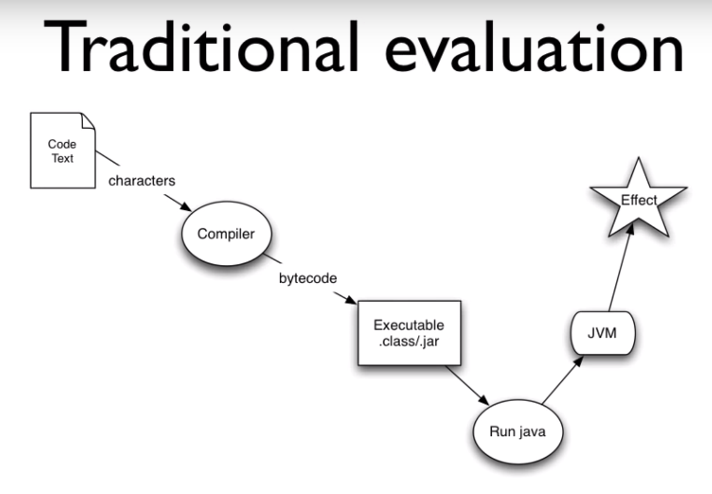
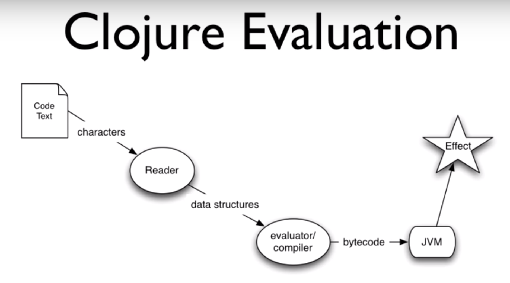
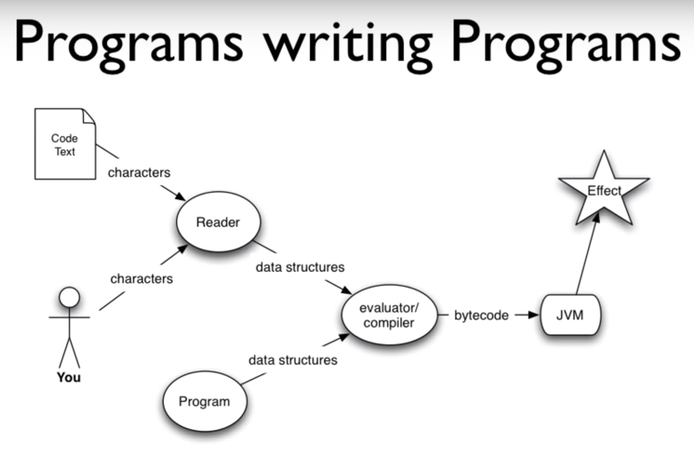
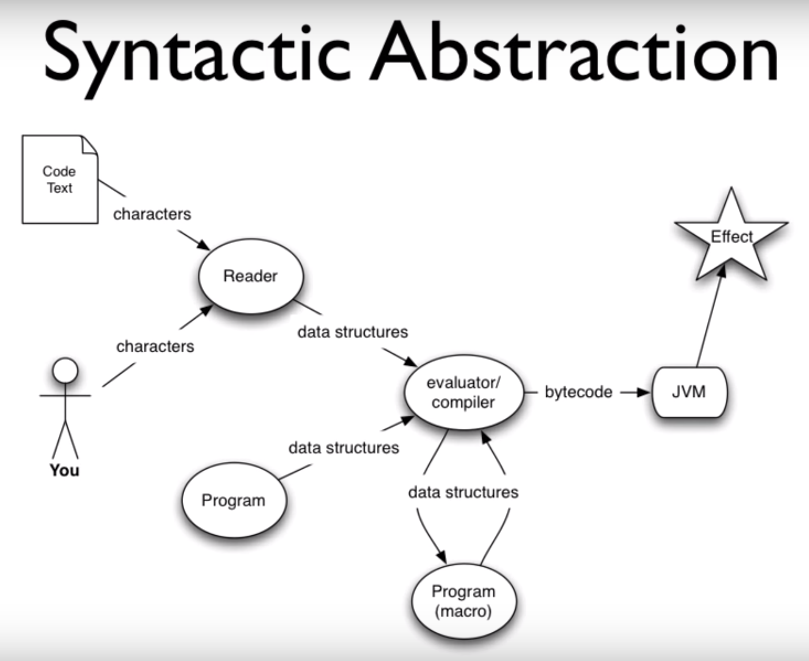
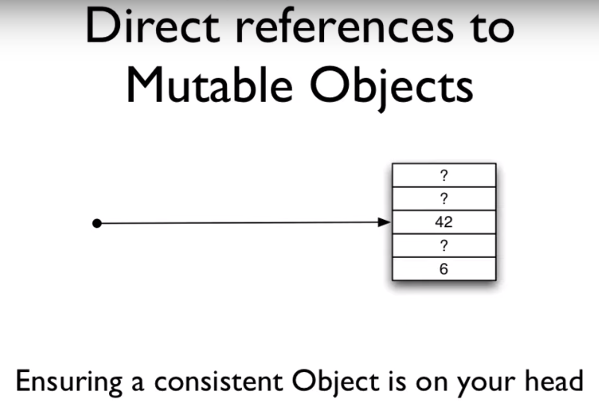
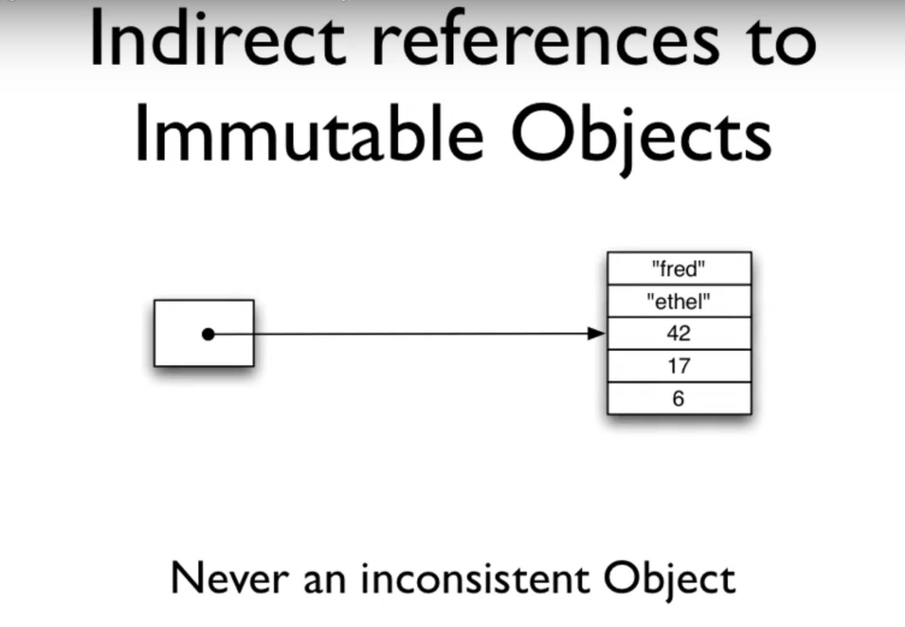
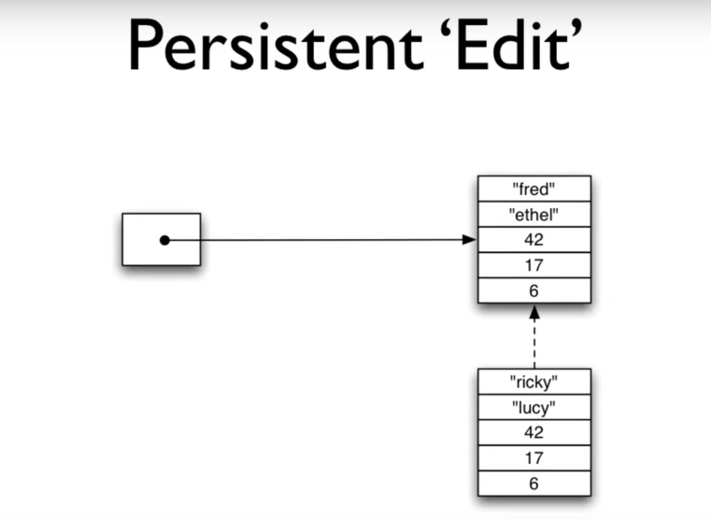
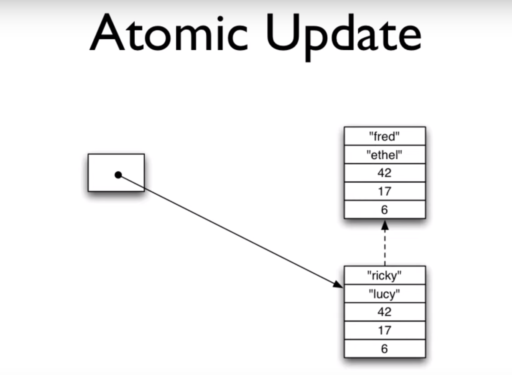

# Clojure for Java Programmers

* **Speaker: Rich Hickey**
* **Event: New York City Java Special Interest Group meeting - June 2008**
* **Video: Part 1: [https://www.youtube.com/watch?v=P76Vbsk_3J0](https://www.youtube.com/watch?v=P76Vbsk_3J0) Part 2: [https://www.youtube.com/watch?v=hb3rurFxrZ8](https://www.youtube.com/watch?v=hb3rurFxrZ8)**

[Editor's note: I have included the original code examples from the
talk.  In a very few places, there are editor marks in square brackets
that also give the modern versions, if the ones in the talk did not
work with Clojure 1.10.1, the latest as of 2019.  There are _very_ few
examples of this, and it appears that the syntax changes were made
before Clojure 1.0 was released in 2009, after this talk was given.

This page says the presentation was given in June 2008:
https://github.com/tallesl/Rich-Hickey-fanclub

That date fits with a mention in this talk of another talk Rich Hickey
planned to give later in Europe at the ECOOP workshop, whereas in
September 2008 when he gave his "Clojure for Lisp Programmers" talk,
he mentioned giving the ECOOP talk earlier.  ECOOP 2008 was held July
2-11, 2008.]

[Time 0:00:00]
```
slide title: Clojure

A Dynamic Programming Language for the JVM

   An Introduction for Java Programmers

               Rich Hickey
```

Hi.  I am Rich Hickey.  I am here to talk about Clojure, which is a
programming language I wrote for the JVM.

This particular talk is oriented towards people who program in Java or
C# or C++.  In particular, I am not going to presume any knowledge of
Lisp.  So you might find some of it tedious, although I am preparing
for a talk I am going to give at ECOOP to the European Lisp Workshop,
where I am going to talk about the ways Clojure is a different Lisp.
So maybe some of this will be interesting to you in that respect.

[Time 0:00:45]
```
slide title: Introduction

+ Who are you?
  + Know / use Lisp?
  + Java / C# / Scala?
  + ML / Haskell?
  + Python, Ruby, Groovy?
  + Clojure?
+ Any multithreaded programming?
```

But that is the nature of this talk.  It is going to be an
introduction to the language, a fly-by tour of some of the features.
I will drill down into some of the others.

I started to ask this question before, but I will just ask it again to
sort of see.  Is there anyone here who knows or uses any flavor of
Lisp?  Common Lisp, Scheme, or Clojure?  OK, so mostly no.

I presume a lot of Java, or anything in that family: C++, C#, Scala
anyone?  You must be playing with it, right?

How about functional programming languages like ML or Haskell, the
strict guys?  Anyone?  A little.  You do not really want to raise
their hands about that one.  OK.  That is good.  In particular, I
think coming from that background, you will understand a lot of this
straight away.

How about dynamic programming languages: Python, Ruby, or Groovy?
Yes, about half.

And I asked before: Clojure?  And we have a few people with their toes
in the water.

The other key aspect of Clojure that would matter to you if you are a
Java programmer is whether or not you do any real multi-threaded
programming in Java, or in any language.  Yes?  So some.

[Time 0:02:01]

So you use locks, and all of that nightmare stuff.

I am a practitioner.  I have programmed in C and C++ and Java and C#
and Common Lisp and Python and JavaScript and a bunch of languages
over the years.

Way back, this same group, I think it is the same lineage, was the
CSIG.  And when I first started to come, I started to teach C++ to the
CSIG.  And it became the C++ and CSIG, and eventually the C++ and Java
SIG, and now the Java SIG.  So back in the 90s, early 90s and mid 90s,
I taught C++, and advanced C++ to this group, and ran study groups.
And I have come back tonight to apologize for having done that to you,
and to try to set you off on a better track.

[SIG is probably an abbreviation for Special Interest Group]


[Time 0:02:59]
```
slide title: Agenda

+ Fundamentals
+ Syntax and evaluation model
+ Sequences
+ Java Integration
+ Concurrency
+ Q & A
```

So we are going to look at the fundamentals of Clojure, and it will be
also of Lisp in many ways, but I am going to say Clojure.  Do not take
offense.  All of these things, or many of the things, I say are true
of Clojure are true of many Lisps.  I did not invent them.  They are
not unique to Clojure.  But some things are.

Then we will look at the syntax and evaluation model.  This is the
stuff that will seem most unusual to you if you have come from a
compile, link, run language, and one of the curly brace, C derivees,
like Java.

Then we will look at some aspects of Clojure, sequences in particular,
and the Java integration, which I imagine will be interesting.  And I
will finally end up talking about concurrency.  Why Clojure has some
of the features it does, and how they address the problems of writing
concurrent programs that run on the new, and indefinitely -- for the
indefinite future, multicore machines.

[Time 0:04:05]

And I will take some questions.  At some point in the middle, we will
probably take a break.  I do not know exactly where that is going to
go.


[Time 0:04:10]
```
slide title: Clojure Fundamentals

+ Dynamic
  + a new Lisp, not Common Lisp or Scheme
+ Functional
  + emphasis on immutability
+ Hosted on the JVM
+ Supporting Concurrency
+ Open Source
```

So what are the fundamentals of Clojure?  Clojure is a dynamic
programming language.  And dynamic has a lot of different meanings.
In particular, it is dynamically typed.  That would be an expectation
you would have of Python or Ruby or Groovy.  It achieves that dynamic
nature by being a Lisp, and I will talk more about that.

I do not see a lot of people who know Lisp here, but that does not
mean there is not a bias against Lisps.  I mean, how many people have
seen Lisps and said: Oh, my god!  Ugh!  I cannot believe the
parentheses.

And I would say: I would hope you put that bias aside for the purposes
of this talk.  It ends up that for people who have not used Lisp,
those biases have no basis, and for most people who have given it a
solid try, they vanish.  And in fact, many of the things that you
consider to be problems with Lisp are features, down the line.

But having said that, Clojure is a very different Lisp.  It is
syntactically much leaner than a lot of Lisps.  It has fewer
parentheses.  It uses more data structures in its syntax, and as a
result, I think is more succinct and more readable.  So it may be the
time to try Lisp again.

Another aspect of Clojure is as a functional programming language.
And again, I am going to talk in detail about these things.  For now
you can just say that means a focus on immutability in your programs,
to write programs primarily with immutable data structures.  And if
you are coming from another Lisp, this will be an area where Clojure
is definitely different.  I made different decisions about the data
structures in Clojure.

[Time 0:06:05]

The third leg of Clojure -- it sort of stands on four points.  It is
dynamic.  It is functional.  It is hosted on the JVM, and it embraces
the JVM, its host platform.  There are ports of other languages that
sort of just sit on the JVM.  There are ports of, for instance, Common
Lisp that sit on the JVM, but they do not really connect very well.
For a number of reasons.  One is: they are implementing a standard.
The standard was written before Java was written, and there is just no
merging the type systems.

On the other hand, Clojure was written for the JVM, and so it is very
heavily integrated with it.  So not only does it reside there, which
is a benefit because you can run it if that is your environment, but
it embraces it, which means the integration is good, and it is pretty
transparent to go back and forth.

The fourth aspect of Clojure is the concurrency aspect.  I work in C#
with guys writing broadcast automation systems.  They are
multithreaded.  They have all kinds of nasty stuff going on, multiple
connections to sockets, lots of databases, data feeds from all kinds
of places.

And it is not fun writing programs like that, that need to share data
structures amongst threads, to have them get maintained over time, and
have everybody remember what the locking model is.  It is extremely
challenging.  Anyone who has done any extensive multithreaded
programming with the locking model knows how hard it is to get that
right.

So Clojure is an effort on my part to solve those problems, in an
automatic way, with language support.

And the last thing is, it is an open source language.  It is very
transparent, the implementation, and everything else is up there for
you to see.


[Time 0:07:55]
```
slide title: Why use a dynamic language?

+ Flexibility
+ Interactivity
+ Concision
+ Exploration
+ Focus on your problem
```

We started to talk about this before.  Why use a dynamic language?
Some people are very happy.  Of the people who are programming in
Java, how many are happy about that?  They like Java.  They have no
complaints.  OK.  Not too many.

It ends up that, I think, many Java programmers look at people who are
using Python, or Ruby, and being very productive, and I think,
justifiably, envy their productivity, the succinctness, the
flexibility they have.  And in particular, how quickly they can get
things done.

And it ends up that that is a fact of the static languages, especially
the ones like Java, that they are inherently slower because of the
amount of, well some people call it ceremony, that you have to go
through to communicate with the language.  It slows you down.

So flexibility is a key thing you would look for in a dynamic
language.  Interactivity is another key point.  Again, this goes back
to Lisp.  Lisp has pretty much always been an interactive language.
And that means a lot of things.  In particular, it means that when you
have got a Lisp up and running, you feel like you are engaged with an
environment, as opposed to shoveling your text through a compiler
phase to produce something else out the other end.

So that interactivity is kind of a deep thing.  The REPL is part of
it.  That means Read, Eval, Print, Loop, and I will talk about that in
detail in a little bit.

Dynamic languages tend to be a little more concise.  That does not
mean that static languages cannot be.  Haskell, in particular, is very
concise.  But the curly brace languages are not concise.  Java is
probably a great example of a language that is not concise.

And that is not just a matter of tedium.  It is a matter of where is
your logic?  How far apart is your logic?  How spread out is it?  Can
you see what you are thinking about, or is it in pieces?  Is it spread
out by a bunch of things that are not about your problem?

[Time 0:10:00]

Dynamic languages are definitely more suitable for exploration.  There
is a certain aspect in which static languages are like concrete.  That
is a good aspect when you are trying to finish.  In some systems,
concrete is going to be more resilient.  It is more resilient to
change.  It is more structured, and it is rigid.

On the other hand, that is not necessarily the kind of materials you
want to be working with when you are trying to figure out what your
structure should look like in the first place.  So dynamic languages
are better for exploration.

And in particular what I like about dynamic languages, and Lisp,
fundamentally, and I think in a way that other languages do not
achieve, is it lets you focus on your problem.  You can, with Lisp,
and its ability to do syntactic abstraction, suck everything out of
the way, except the problem.  And for me, when I discovered Lisp, I
was a pretty expert C++ programmer, I said to myself: What have I been
doing with my life?  It was that big a deal.


[Time 0:11:14]
```
slide title: Which dynamic language?

+ Many options on the JVM
  + allow you to leverage your existing knowledge and code
+ Ports to JVM
  + JRuby
  + Jython
+ Native to JVM
  + Groovy
  + Clojure
```

So there are many dynamic languages.  I am going to talk about
Clojure.  And I will not do bashing of other languages, but I will try
to highlight why you might choose Clojure over some of the other
options, because in particular now I think it is a great thing that
there are many dynamic languages available for the JVM, and dynamic
languages are supported as a concept in the Java community.

You know, at Java One there were plenty of presentations on Jython and
JRuby and Groovy, and these other languages.  And Sun has hired some
of the developers of these languages, and given it kind of official
support as something that is viable to do on the JVM.  So you are
going to see mixed language programming being accepted in Java shops.

[JavaOne https://en.wikipedia.org/wiki/JavaOne]

[Time 0:12:01]

So how do you pick?  I think you can categorize languages in one
dimension pretty straightforward.  Are they a port of a language that
exists somewhere else, or were they written for the JVM?

Ports have a bunch of challenges.  One is: there is a canonic version
out there, because most of these languages are not defined by a
specification.  They are defined by a canonic implementation.  So
there is CRuby.  There is CPython.  Those are, really, the languages.
And the other things are ports, which have to struggle to follow along
with the C version.

The other problem ports have is: a lot of the infrastructure for the
languages, especially the ones that do not perform very well, are
written in C.  In other words, to get the library performance they
need, the support libraries for Python are written in C.  So an effort
to port Python to Java means having to replicate those C libraries.
So there is that.

I would say the main appeal to a ported language is: if you already
have an investment in Ruby, or Python, or you happen to really love
the language designs, that is a good way to go here.

I would say if not, if you are just starting from scratch, you may
find that a language that is native to the JVM is going to give you
better integration.  You know the version you are using _is_ the
canonic version.  The canonic version of Groovy is the JVM language.
The canonic version of Clojure is the JVM language.

And I would say of the two, Groovy is going to let you do what you do
in Java, except a little bit more easily.  Fewer semicolons, more
dynamic, there are some builders, there are some idioms, there are
closures.  Sort of the fun of dynamic programming, and a lot of the
similar syntax, to Java.  So I think if you are just interested in
dynamic, and want to continue to write programs that are like your
Java programs, Groovy cannot be touched.

[Time 0:14:00]

Clojure is _not_ about writing programs like your Java programs.
Clojure is about realizing what is wrong with your Java programs, and
doing something different.  So you will find some of that through the
talk.


[Time 0:14:15]
```
slide title: Why Clojure?

+ Expressive, elegant
+ Good performance
  + Useful for the same tasks Java is
  + Wrapper-free Java access
+ Powerful extensibility
+ Functional programming and concurrency
```

So Clojure itself, it inherits from Lisp an expressivity and elegance
I think is unmatched.  Depending on your mind set, you may or may not
agree, but there is a certain mathematical purity to lambda calculus,
and the way it is realized in Lisp, the uniformity of the syntax, is
elegant.

Clojure also has very good performance.  Again, I am not going to get
involved in any language bashing, but I am pretty confident no other
dynamic language on the JVM approaches the performance of Clojure in
any area, and is unlikely to.  But everybody is working on
performance.

[Audience member: Can I interrupt you just for a second?]

Certainly.

[Audience member: The thing that you hear tbd]

We have converted them.  They are Java programmers now.

[Audience member: tbd]

So the performance is good.  I made a point before starting the talk
that an objective of Clojure is to be useful in every area in which
Java is useful.  That you can tackle the same kind of problems.  I do
not write web apps, and put stuff in and take it out of the database
kind of applications.  I write scheduling systems, broadcast
automation systems, election projection systems, machine listening
systems, audio analysis systems, and I write them in languages like C#
and Java and C++.  And Clojure can be used for those kinds of
problems.

[Time 0:15:55]

It does not mean that it cannot also be used for web apps, and people
did that right away with Clojure, and database and UI stuff.  But it
has that same kind of reach.  And one of the nice things about Java is
it has a wide range.

Clojure has direct wrapper-free access to Java.  Some of the ported
languages have to use wrappers, because those languages have their own
object systems that imply a bunch of dynamic features that they have
to glom on top of Java objects when you interoperate with them.
Clojure was designed to provide direct access to Java.  It looks like
Clojure, but it is direct.

Clojure, being a Lisp, is extensible in a deep way, and we will talk a
little bit more about how you get syntactic extensibility through
macros.

And then Clojure, I think, is completely unique amongst the languages
on the JVM in promoting immutability and concurrency, much more so
than even Scala, which is often talked about as a functional language,
but is not deeply immutable.  It sort of is an option.  Clojure is
really oriented towards writing concurrent programs, and immutability
for its other benefits outside of concurrency.


[Time 0:17:19]
```
slide title: Clojure is a Lisp

+ Dynamic
+ Code as data
+ Reader
+ Small core
+ Sequences
+ Syntactic abstraction
```

So how does Clojure get to be these things?  It is a Lisp.  Again, put
what you think about Lisp aside.  I will explain what that means in
depth as I go into each of these points.  But Lisp in general is
dynamic in that way, interacting with an environment, having a REPL,
having introspection capabilities on the environment, being able to
modify things in a running program, are all characteristics that make
it dynamic.

A fundamental feature of all Lisps, if they want to be a Lisp, is that
code is represented as data.  And again, I will explain that in
detail.

[Time 0:18:00]

There is a reader, which is part of the implementation of "code is
data".  It is sort of something in between your text and the
evaluator.

Being a Lisp means having an extremely small core.  You will find,
when you contrast Clojure to other languages, even languages that are
theoretically light weight like Python or Ruby, Clojure has way less
syntax than those languages.  Far less complexity, in spite of the
fact that they appear easy.

Lisps generally have tended to emphasize lists.  Clojure is not
exactly the same way.  It is an area where Clojure differs from Lisps
in that it frees the abstraction of `first` and `rest` from a data
structure, the cons cells.  And in doing so, offers the power of Lisp
to many more data structures than most Lisps do.  So there is that
sequence thing, and I will talk more about that in detail.

[More on cons cells, and the function named `cons` that exists in
Lisps, including Clojure: https://en.wikipedia.org/wiki/Cons]

And syntactic abstraction.  Again, we have abstraction capabilities
with functions or methods in most languages.  Lisps take that to the
next level by allowing you to suck even more repetition out of your
programs, when that repetition cannot be sucked out by making a
function.


[Time 0:19:22]
```
slide title: Dynamic development

+ REPL - Read-eval-print-loop
+ Define functions on the fly
+ Load and compile code at runtime
+ Introspection
+ Interactive environment
```

OK.  So we will dig down a little bit more.  What does it mean to do
dynamic development?  It means that there is going to be something
called a REPL, a Read Eval Print Loop, in which you can type things
and press enter, and see what happens.  I guess we should probably do
that.

[Screen switches from slide to a Mac desktop with some windows open,
one with a file test.clj containing Clojure code, another containing a
REPL prompt `user=>`.]

So this is a little editor.  It is kind of squashed in this screen
resolution, but down below is the REPL.  This is Clojure in an
interactive mode, and we can go and we can say `(+ 1 2 3)` and we get
6.

[Time 0:20:00]

We can do other things Java-like.  I will show you some more of that
later.  But the general idea is that you are going to be able to type
expressions, or in your editor say "please evaluate this".  I mean I
can go up here to `(. Math PI)` and hit the key stroke that says
"evaluate this", and you see below we get that [3.14159265...].

And that is kind of what it feels like to develop.  I am going to show
you even more after I explain what you are looking at, because I do
not want this talk to be yet another where people are shown Lisp, not
having had explained to them what they are looking at.  So we are
going to do that first.

But you have this interactive environment.  You can define functions
on the fly.  You can fix functions on the fly.  You could have a
running program, and fix a bug in a running program.  And that is not
like being in a mode in a debugger where you have this special
capability to reload something.  It is always present.  If you build
an application with some access to the ability to load code, either a
remote REPL connection, or some way to do that, your running
production systems will have this capability to have fixes loaded into
running programs.

In general, there is not the same distinction between compile time and
run time.  Compiling happens all of the time.  Every time you load
code, every time you evaluate an expression, compilation occurs.  So
that notion of phases of compilation is something you have to relax
when you are looking at a language like Clojure, and I will show you
the evaluation model in a second.

I talked a little bit about the introspection, but that is present.
You are sitting at a REPL.  Clojure is there.  Clojure has namespaces.
You can get a list of them.  Clojure has symbols.  You can get a list
of those.  You can look inside the infrastructure that underlies the
run time, and manipulate it.

And that is what I mean by an interactive environment.  I just do not
mean typing things in.  I mean there is a program behind your program.
That is the run time of Clojure, and that is accessible.


[Time 0:22:03]
```
slide title: Atomic Data Types

+ Arbitrary precision integers - 12345678987654
+ Doubles 1.234 , BigDecimals 1.234M
+ Ratios - 22/7
+ Strings - "fred" , Characters - \a \b \c
+ Symbols - fred ethel , Keywords - :fred :ethel
+ Booleans - true false , Null - nil
+ Regex patterns #"a*b"
```

If I say something that you do not understand, you can ask for
clarification.

I am endeavoring to try to come up with the ideal way to explain Lisp
to people who have never seen it, and this is what I have come up
with, which is to talk about data.  Lots of languages have syntax.
You can talk about Java, you can talk about "here is main", and here
is what `public` means, and `static`, and then you can dig in to
arguments to a function and things like that.

But we are going to start here with data.  In particular, data
literals, and I think everybody understands data literals from the
languages they are familiar with.  You type in "1234", and you know
that is going to mean one thousand two hundred and thirty four to your
program.

So Clojure has integers.  They have arbitrary precision.  They can get
as large as your memory can support.  And the promotion of small
integers to larger integers while arithmetic is going on is automatic.

[TBD: This is somewhat nuanced in modern Clojure as of 2019.  Good to
have very brief explanation, or better a link to one, here.]

It supports doubles as the floating point format.  Those are Doubles.
Those are big D `Double` Java doubles, when you type them in.

[Audience member: tbd]

Right.  They are Java doubles.  But they are the big D doubles.  So
one of the things you are going to see about Clojure is: everything is
an object.  All numbers are boxed, at least until you get inside a
loop, where I can unbox them.  But it is a language in which numbers
are boxed, unlike Common Lisp, where you have access under the hood to
use tagged integers and tagged numbers, which is more efficient in
allocating them on the heap, no capability of doing that in the JVM.

There has been talk about it, them adding it [developers of the JVM
itself], which is stunning to me.  Apparently the guy, there is this
guy John Rose at Sun who really does understand Lisp very well,

[Time 0:24:00]

and has talked about all kinds of really neat features, which if they
make it into the JVM would make it stunning.  Like tail call
elimination and tagged numbers.

But in the absence of that, numbers are boxed, so that everything can
be an object, and can be treated uniformly.

You have `BigDecimal` literals.  You have ratios.  22 over 7 is
something, it is not divide 22 by 7.  It is a number.  It is a number
that is not going to lose any information, versus dividing 22 by 7 and
either truncating or converting it to a floating point format where
you will lose information.  So ratios are first class.

String literals are in double quotes.  They are Java strings.  Same
thing, immutable.  No conversions.  No mapping.  Again, being a native
JVM language means I can just adopt the semantics of Java literals.  I
do not have to take strings from a language spec that said, for
instance, that they could be mutable.  They have to force that on the
JVM by having my own type and conversions to and from.  So because I
am an immutability oriented language, I am very happy with Java's
definition of a string being an immutable thing.  So Clojure strings
are Java strings.

[Audience member: Question.]

Yes.

[Audience member: Is there any way to reference underlying units.  In
other words, to say that tbd centimeters or meters, or something like
that.  You do not know.]

No.  Try Frink.  Have you ever seen it?

[Audience member: No.]

Oh.  You will love it.  You can add all kinds of units and figure out
how many balloons of hydrogen it would take to move a camel across
this much distance.  It is amazing.  Units for absolutely everything.
Old ancient Egyptian units.  It is fantastic.  The guy is just a
fanatic about precision, making sure you do not lose anything.  But
you can arbitrarily multiply all kinds of units.  Everything is
preserved.  Everything works correctly.  Fantastic framework.

[Time 0:26:07]

[Audience member: What was the name?]

Frink.  F R I N K.

[Frink https://frinklang.org/ ]

[Audience member: And is that Java, or is that Lisp?]

Frink is a language for the JVM.  It is its own language.  But it is a
lot of fun.  I have seen the guy talk, and he has some great examples.
Some involve how many belches it would take to move a hot air balloon
to the moon, and things like that.

OK.  So we have string literals in double quotes.  We have characters
are preceded by a slash, a backslash.  So that is a character literal.
And that is a big C `Character`, Java character.

Now we are going to get to two things that are possibly a little bit
different, because they are not first class things in Java.  One would
be symbols, which are identifiers.  They cannot contain any spaces.
They have no adornments.  Symbols are used as identifiers, primarily
in code, but they can be used for other things as well.  They are
first class objects like strings.  If you have one of these things,
you can look at it, and it will be a symbol, `clojure.lang.Symbol`.

[Audience member: Are `fred` and `ethel` two symbols?]

`fred` and `ethel` are two symbols.  That is correct.

The other thing Clojure has are keywords, which are very similar to
symbols, except they always designate themselves.  So they are not
subject to evaluation, or mapping to values by the compiler like
symbols are.  So a symbol might be something you would use for a
variable.  You could make `fred` be equivalent to 5.  You could never
make `:fred` be equal to 5.  `:fred` will always mean itself.

So when it gets evaluated, the value of the keyword `:fred` is the
keyword `:fred`.  It is sort of an identity thing.  And they are
extremely useful.

[Time 0:27:59]

They are very useful, in particular, as keys in maps, because they are
very fast for comparison, and they print as themselves, and read as
themselves.  That will make a little bit more sense in a minute.

There are Booleans.  This is different from Lisp, although there is
still `nil` as false.  But in addition, there are proper true and
false, mostly for the purposes of interoperability.  It ends up that
you cannot solve the `nil` becoming false problem.  At least, I could
not.  So there are true and false, and they are for use in
interoperability with Java.  You can use them in your Clojure programs
as well, but conditional evaluation in Clojure looks for two things:
it looks for false or `nil`, which is the next thing I am going to
talk about.

`nil` means "nothing".  It also is the same thing in Clojure as Java
`null`.  It did not have to be, but it is.  So you can rely on that.
So `nil` means nothing, and it is the same value as Java `null`.  So
when you get back nulls from Java, they are going to say `nil`.  `nil`
is a traditional Lisp word.

But I like it, because also traditionally in Lisp, you can say `if
nil`, and it will evaluate to the else branch, because `nil` is false.
`nil` is not true.  So that is another literal thing, that `nil`.

There are some other things.  There are regex literals.  So if the
reader reads that, it is just a string regex, with exactly the same
syntax as Java's, preceded by a hash, will turn into a compiled
pattern.  So at read time, you can get compiled patterns, which you
can then incorporate in macros, and things like that, which is very
powerful.  And shows how that delineation between compilation and run
time is a little bit fungible.

[Time 0:30:04]

[Audience member: So `nil` is different from the empty list.]

Correct.  And there is a good reason for that.  And the reason is:
empty list is no longer as special as it was, once you have empty
vector and empty map.  However the sequencing primitives, the
functions that manipulate sequences, return `nil` when they are done,
not the empty list.  So that aspect of being able to test for the end
of iteration with `if` is still there.

So Clojure sits in a unique point.  He is asking about aspects of
Clojure that differ a little bit from Common Lisp and Scheme.  There
is a long standing fight between what should the difference between
false, nil, and the empty list be?  Should they be unified?  They are
in Common Lisp.  Should there be some differences?  There are some
differences in Scheme.  Clojure actually does some of both.  There is
false.  However, `nil` is still testable in a conditional.  It does
not unify `nil` and the empty list, which is a difference from Common
Lisp.

However, all of the sequencing or list operations, when they are done,
return `nil`, not the empty list, which is an important thing for
Common Lisp like idioms, where you want to keep going until it says
false, as opposed to having to test for empty explicitly, which we
would have to do in Scheme.  Does anybody know Scheme here?  Yeah, you
know Scheme, but you know both, so you know what I am talking about.

For everyone else, I would not worry too much about that, because you
would not have presumed `nil` would have been the empty list.  Right?
Probably not.


[Time 0:31:44]
```
slide title: Data Structures

+ Lists - singly linked, grow at front
  + (1 2 3 4 5), (fred ethel lucy), (list 1 2 3)
+ Vectors - indexed access, grow at end
  + [1 2 3 4 5], [fred ethel lucy]
+ Maps - key/value associations
  + {:a 1, :b 2, :c 3}, {1 "ethel" 2 "fred"}
+ Sets #{fred ethel lucy}
+ Everything Nests
```

OK.  So those are the atomic things.  They cannot be divided.  That is
what atomic means.  A number is not a composite thing.  But there are
composite or aggregate data structures in Clojure, and they are kind
of the core abstractions of computer science.

[Time 0:32:06]

One is the list.  And in this case, I mean very specifically the
singly-linked list.  And even more specifically the singly-linked list
in which things get added at the front.  So when you add to a list,
you are adding at the front.  The list is a chain of things, which
means that finding the N-th element is a linear time cost.  It is
going to take N steps to do that.

On the other hand, taking stuff on and off the front is constant time,
because that is the nature of a singly-linked list.  So it has all of
the performance promises of a singly-linked list with stuff at the
front.

And its literal representation is stuff inside parentheses, separated
by spaces.  There is no need for commas.  You will see some commas.
Commas are white space in Clojure.  They are completely ignored.  You
can put them in if it makes you feel better, or makes things somewhat
more readable, but they are not actually syntax.  They are not
considered by the evaluator.

So any questions about lists?  Stuff in parens.

[Audience member: tbd]

Right.  Well these commas, the ones between `(1 2 3 4 5)` and `(fred
ethel lucy)`, are actually English commas.  But there are some commas,
for instance when we get down to maps here, you see commas inside the
data structure?  Those are ignored.  Those are white space.

[Audience member: I understand white space in lists.  What about the
difference between comma and decimal in a number?]

[Time 0:34:00]

I do not support any commas inside numbers.  The printed
representations of numbers in Clojure are those of Java.

[Audience member: tbd]

In Lisp?

[Audience member: tbd]

No.  In Lisp they grow at the front.  Cons `a` onto something makes
`a` the first thing in that list.  And that is true of Clojure, too.

[Audience member: Is it based upon `java.util.List`?]

Absolutely not.  All of these data structures are unique to Clojure.
I am only giving you some very high level descriptions of their
representation and their performance characteristics, but what we are
going to find out later is: all of these things, and in particular I
am talking about adding to the lists, all of these data structures are
immutable.  And they are persistent, which is another characteristic I
will explain a little bit later.

So these are very different beasts, and they have excellent
performance.  Yet they are immutable, and it is sort of the secret
sauce of Clojure.  Without these, you cannot do what I do in the
language.

[Audience member: In the second list, fred ethel lucy tbd]

That is correct.

[Audience member: What fred references, though, can it change?]

Again.  How this gets interpreted, we are going to talk about it in a
little bit.  Right now what you are looking at is a list of three
symbols.  You may end up with, in your program, a data structure that
is a list of three symbols.  You may pass this to the evaluator and
say: evaluate this, in which case it is going to try to evaluate each
of those symbols and find out its value, and treat the first one as if
it was a function.  But we are not there yet.

[Time 0:35:57]

So that is a list of three symbols.  The list at the end is a list of
one symbol and three numbers.  So heterogeneous collection are
supported in all cases.  I did not necessarily show them everywhere,
but they are.  It is not a list of something.  It is a list.  It can
contain anything, and any mix of things.

OK with lists?

The next thing is a vector.  It uses square brackets.  That should
imply, I would hope, for Java programmers and people from that domain,
array.  Square brackets mean arrays.  Well, they do now.

So a vector is like an array.  In particular, it supports efficient
indexed access.  It is an expectation you would have of a vector you
would not have of a linked list, that getting at the 50th guy is fast.
It is not going to be 50 steps to do that.  And the Clojure vectors
meet that performance expectation.  Fast indexing.

In addition, it is a little bit like `java.util.Vector`, or
`ArrayList`, in that it supports growing, and in this case, at the
end.  And that also is efficient, as efficient as your expectation
would be of `ArrayList`.  That is a constant time operation to put
things at the end.

Similarly, it can hold anything.  The first is a vector of five
numbers, the second is a vector of three symbols.

[Audience member: Must it be homogeneous?]

No.  All of the collections can be heterogeneous.

OK so far?  So that is going to behave like an array, in terms of
being able to find the N-th element quickly.

And finally, as a core data structure we have maps.  And a map is like
a Java map, or any kind of associative data structure, in providing a
relationship between a key and a value, each key occurring only once,
and having a mapping to a value.

[Time 0:38:08]

So the way they are represented is in curly braces.  And they are
represented simply as key, value, key, value, key, value.  Again, the
commas do not matter.  So they are white space.  They get eliminated.
For instance, in the second map you see there, that is a map of the
number 1 to the string "ethel", and the number 2 to the string "fred".
You do not need the commas.

And the expectation with a map is that it provide fast access to the
value at a particular key.  There are usually two kinds of maps you
would encounter in ordinary programming languages.  One would be
sorted.  Some sort of sorted map, in which case the access is going to
be typically log N to find a particular guy, depending on how many
things are in the map, because they use trees, or red black trees, and
things like that.  And Clojure does have sorted maps.

The one you get from the literal representation like this is a hash
map, and the expectation of a hash map is constant, or near constant,
time lookup of values at keys.  And that maps to hash tables.

So what you have in the Clojure literal maps is the equivalent of a
hash table.  It is fast.

Everybody OK so far?

[Audience member: What would happen if I introduce another key in
this?]

Another `:a`?  It will be replaced.

[Audience member: So the last number replaces the first one.]

Correct.  There is only one instance of a key in a map.  Is that your
question?

[Audience member: Yeah.]

Yes.  So if you were to say ...

[Audience member: No, I am saying if I type it out like this, and
after the `:c 3` put `:a` again, is that an error, or is it just a
replacement?]

[Time 0:40:02]

It is probably a replacement.  I see, in the same thing, yes.  I do
not think it is an error.  That is a good question.  I might type it
in later for you.

[Audience member: tbd]

Yeah.

[Audience member: tbd set]

It is the same thing.  Well, there is no associated value, so `fred`
will be there.

So let us talk about sets.  The fourth thing I am showing you here is
sets.  Sets are a set of unique values.  Each value occurs only once
in the set.  And really the only thing a set can do for you is tell
you whether or not something is in it.  There is no associated value.
It is just: does the set contain this key?

Do you have a question?

[Audience member: Yes.  tbd does it keep it in a sorted order?]

There are sorted sets and hash sets, same thing as with the maps.  The
sets here are hash sets.  So no, the order is not retained.  You can
request a sorted set, and the order will be the sort order.

Does that answer your question?  OK.

[Audience member: What is the test for equality?]

What is the test for equality?

[Audience member: Yes, for sets.]

Equal.  The equal sign `=` is the test for equality, and equality
means the same thing for everything in Clojure.  It means equal value.

You will see that Clojure definitely deemphasizes identity, completely
in fact.  There is an identity function, and I have yet to use it.
Clojure is about values.  Identical contents are identical by equals.

That is made faster than you might imagine by caching hash values.
But equality is equality of value in Clojure.

[Time 0:42:00]

[TBD: Is it?  I don't think Clojure = uses hash values at all?]

[Audience member: And there is no mutability tbd]

Immutability helps, certainly.  Well if you have ever read Henry
Baker's paper on Egal, Clojure implements Egal, finally.  If you have
not, then do not worry about it.

[This article gets into great detail about what equality means in
Clojure, including some brief descriptions of small differences
between Clojure `=` and Henry Baker's Egal:
https://clojure.org/guides/equality

TBD: Rich says above that equality comparisons on collections are made
faster by caching hash values.  I know that it is made faster in most
cases by quickly returning true if the two collections (or
sub-collections) being compared are identical objects by a very fast
pointer equality check, i.e. Java `==` on object references, but I do
not think anything in the implementation of equality uses cached hash
values.  Lookups of collections inside of hash maps and hash sets is
sped up by caching hash values.]

So yes, equality is equality of value.  All right?  Yes.

[Audience member: tbd]

No.  You can make arrays, and you can interact with Java arrays that
are arrays of either objects or native arrays.  You can say
`float-array` and a size, and you will get an array of floats.  So you
have the ability to do Java stuff.

I am going to emphasize the Clojure data structures, because they let
you do what Clojure lets you do.  You can access Java, but as you
start accessing mutable things, some of the things that Clojure can do
for you, we cannot do.  It does not mean that you are not allowed to
do them.

But there is no point in me showing you how to interact with a Java
array, except to show you the syntax, which I might later.

So the last part about this is that everything nests.  A key in a map
can be another map.  It can be a vector.  Anything can be a key or a
value.  Because of this equality semantics, there is no problem having
a vector or a map whose keys are vectors.  That is perfectly fine.  So
if you needed to use tuples as keys, you know pairs of things as keys,
that is just completely doable.

[Audience member: Question in terms of tbd]

Well you can get the hash of a vector.

[Audience member: I mean as a programmer test, to invoke it, but
rather the implementation of it.  At an implementation level you can
have a very complex structure as the key, that sounds expensive to
me.]

[Time 0:44:03]

Well it depends on what you are doing.  I would imagine that really
complex structures are not frequently used as keys, but they could be.
Can that be helped?  Yes, the fact that these are hashed by default
means that once, and once only, the hash value of some aggregate
structure will be calculated.  And that will be cached, so there is a
quick hash test, otherwise we do the deep value check.

But, again, I do not think you are going to encounter complex data
structures as hash values that often.  But using kind of small things
like tuples or other small maps as keys is tremendously useful.  It is
really really handy to not even have to think about that.

I think we have got one other Clojure programmer arrived, who can
possibly attest independent of me how Clojure's performance is.  How
is Clojure's performance?

[Audience member: Fine for me.]

[Editor note: I recognize the voice as that of Stuart Sierra, who has
written many articles and widely used libraries for Clojure.]

Yeah.

[Audience member: tbd]

Right.  Well now there is some extra numeric goodness in there.  But
these data structures are pretty good.

What is the reality?  The reality of these data structures is: I have
tried to keep them all within one to four times of Java data structure
-- the equivalent Java data structure.  In other words, hash map,
vector, well singly linked lists are pretty straightforward.  So they
are within striking distance.

The B side is: in a concurrent program, there is no locking necessary
for use with these data structures.  If you want to make an
incremental change to a data structure in a certain context, there is
no copying required to do that.  So some of these other costs that
would be very high with a mutable data structure vanish.  So you have
to be very careful in looking at that.

[Time 0:45:55]

The other thing that is astounding to me, at least, is that the lookup
time -- again the add times are higher than `HashMap`, but the lookup
times can be much better, because this has better cache locality than
a big array for a hash table.

OK.  We are all good on this?  I probably have to move a little bit
quicker.  Yes.  More quickly.

[Audience member: tbd]

There is destructuring, yes.  I actually will not get to talk about
that today, but there is destructuring.  There is not pattern
matching.  But there is destructuring to arbitrary depth of all of
these.

Destructuring means a way to easily say: I want to make this set of
symbols that I express in a similar data structure map to
corresponding parts of a complex data structure I am passed.  So
Clojure has that.  It has some really neat destructuring capabilities.


[Time 0:46:54]
```
slide title: Syntax

+ You've just seen it
+ Data structures _are_ the code
  + Homoiconicity
+ No more text-based syntax
+ Actually, syntax is in the interpretation of data structures
```

All right.  So what is the syntax of Clojure?  We just did it.  I am
not going to talk about semicolons, curly braces, when you have to say
this, when you have to have a new line, or anything else.  Because the
structure of a Clojure program is a data structure, or a series of
data structures.  There is no other stuff.  There are no rules about
where things go.  There are no precedence rules.  There is nothing
else.  You write a Clojure program by writing the data structures I
just showed you.  That is it.

[Audience member: Which means, how does one write an `if` or loop?]

I will show you.

So you write a program by writing data structures.  The data
structures are the code.  That has huge implications.  It is the
nature of Lisp.  There is a fancy name for it called "homoiconicity",
and it means that the representation of a program is done in the core
data structures of the program.

[Time 0:48:04]

Which means that programs are amenable to processing by other
programs, because they are data structures.  So I am not going to talk
any more about text based syntax, because there is no more.

Now many people claim of Lisps: well Lisp has no syntax.  And that is
not really true.  It does not have all of this little fiddly character
syntax, necessarily.  There is syntax to the interpretation of the
data structures.  We are going to see a lot of lists.  They have
different things at the front.  The thing at the front will tell you
the meaning of the rest.


[Time 0:48:46]
```
slide title: Traditional evaluation
```


So let us talk a little bit about evaluation.  So how does this all
work?  This we should all know from Java or many other languages like
Java.  We type our program into a text file, and we save it.  And then
we send those characters, that text, to the compiler, who has a very
involved abstract syntax tree, and parser, and lexer, that interpret
the rules of the language.  This is what constitutes a character.
This is what constitutes a number.  And then furthermore, if you have
said `if` and you have put parens, then you said some stuff and you
put a semicolon, and you happened to have put `else` and you are still
in this construct called `if`.

Things like that.  It knows all about that, and it deals with the
text.  And it will tell you if you have met the requirements in terms
of it being a valid program.  And it will turn it into something that
can run.  In the case of Java, that something will be byte code.  And
it will go into a class file or a JAR file.  We know this.

And then, there is a separate step, which is called running.  And we
take that stored executable representation and we ask it to happen,
usually, in this case, we will say `java` dash something class file,
and it will run.

[Time 0:50:01]

And it will run, and then it will end, and it will be over.  And we
can try again if we did not like it.  That is the traditional edit,
compile, run, be disappointed, start over.

[Audience member: tbd]

Oh, correct.  But I am talking about the development process.  Yeah,
so the run time is just that part.

[Audience member: Hopefully in your code tbd]

Until you realize it is not working, and you have to ask everybody to
please wait for our downage while we fix it.


[Time 0:50:41]
```
slide title: Clojure Evaluation
```


Right.  That is the difference.  If you read about Erlang, which is
getting a lot of press, they will tell you about phone switches, and
how that is really not allowed.  And Lisp was doing this for a very
long time, this kind of live hot swapping of code in running systems.

I think it goes more, in this case it is less about the production
thing, than it is about what is the nature of developing your program?
Because as a developer, seeing it run and saying: Oooh!  That was bad.
I wonder what happened?  I wish I had run it in debug mode.  I wish I
had put a breakpoint somewhere interesting, and I am really sad that I
spent an hour calculating that data, and dropped it on the floor,
because I have to do it again with a breakpoint in.

That is a lot different experience than keeping your program around,
and having that data stay loaded, and fixing your function and running
it again, without starting over.

So that is what happens in Clojure.  You take the code.  Text, could
be.  There is character representation, and what I showed you there
can be represented in characters, in ASCII.

It does not go first to the evaluator.  It goes to something called
the reader.  And this is a core part of what makes something a Lisp,
which is that the reader has a very simple job.

[Time 0:52:00]

Its job is to take the description I just told you: a keyword starts
with a colon, and a list is in parentheses, and a map is in curly
braces and it is pairs of stuff.  Its job is to take those characters
and turn it into data structures, the data structures I described.

You start with a paren, you say stuff, you close the paren, that is
going to become a list when the reader is done with it.  If it starts
with square brackets, that is going to become a vector when the reader
is done with it.

So what comes out of the reader are data structures.  And what is
unique about a Lisp and Clojure is that the compiler compiles data
structures.  It does not compile text.  It never sees text.  What the
compiler gets handed is, maybe, a list with three symbols in it.  Or a
vector with 5 numbers in it.  That is actually what the compiler has.
It has the data structure in hand, with actual data in it.  Not text.

And it compiles it.  And in the case of Clojure, it is a compiler.
There are many -- well there are not actually many Lisps that are
interpreters.  Many people believe that Lisp is interpreted, and it is
certainly easy to make an interpreter for Lisp that would take those
data structures and, on the fly, produce the values they imply.  But
Clojure is a compiler, and in particular Clojure compiles those data
structures to Java byte code, right away.  There is no interpretation
in Clojure.  So it is a compiler.  It produces byte code just like
`javac` does.

And because it is an interactive environment, it presents that byte
code right away to the JVM to execute.  And it executes right away,
and you can see the effect.

[Audience member: Are they living in the same VM as the application is
running?]

When you are in the REPL, you have a VM.  Right.  You have one thing.
So yes, your environment is your program.  Your compiler is in your
program.

[Time 0:54:02]

[Audience member: tbd]

Yeah.  I mean some commercial Lisps give you tools to take out the
compiler in production, mostly because they do not want you giving
away their compiler.  Normally there is no reason to prevent that,
because it is a useful thing to have, particularly when you want to
load code later to fix problems.  You are going to need that compiler
there.  So in Clojure there is no strip out the compiler option.

[Audience member: tbd]

We will see that there is a core of Clojure.  The data structures are
written in Java.  The special operators are written in Java.  And then
most of the rest of Clojure is written in Clojure.

[Audience member: Right.  But OK, so no native code.]

There is no native code.  Clojure is completely a pure Java project.
There is no native code.  There are no C libraries.  Nothing.  It is
all Java, either generated by Java itself, or generated by Clojure.
It does not turn off the verifier, or anything like that, in order to
get performance.  There have been some Schemes that have tried to do
that.  Clojure is completely legit that way.

So when we have this separation of concerns between the reader and the
evaluator, we get a couple of things.


[Time 0:55:22]
```
slide title: Interactivity
```


One of the things we get is: we do not have to get the text from a
file, right?  We can get it right from you.  You just saw me type
right into the REPL, an expression.  It never went through a file.  It
never got stored.  So the first thing you get is this kind of
interactivity.  You can just type in stuff and say: go.

That is a big deal.  If you have been programming in Java or C++ long
enough to remember when the debuggers did not give you the ability to
evaluate expressions at a breakpoint, you remember how hard that was.
You always have that capability here, to have expressions directly
evaluated.

What else do we get from this?


[Time 0:56:01]
```
slide title: Programs writing Programs
```


Well we get the ability to skip the characters completely.  For
instance, it is quite possible to write a program that generates the
data structures that the compiler wants to see, and have it send them
to the compiler to be evaluated.

So program-generating programs are a common thing in this kind of an
environment.  Whereas this kind of stuff, when you are doing it with
text, is really messy.

[Audience member: By the way, one observation just struck me tbd give
me a good way to be able to say it.  There are firms I know, that
because of the compliance requirements that they have, they might be
very comfortable with code tbd into a reader for tbd.  But is there an
option of saying it is always live, this person in a production
environment to influence the code that is being executed.  That is a
scary thought.]

Well that is a security policy thing, whether or not you expose this
in a production system.  So I am talking about: you could if you
needed to, you could have that over a secure socket channel, and have
it be just an administrator who knows what they are doing have that
capability.  Because the alternative is downing your system, if you do
not have that.

And of course opening this in a production system, that is completely
a policy thing.  It has nothing to do with the language.  Except if
your language does not let you do it, you cannot do it.

[Audience member: That is fair.]

So it does.  The other thing is that these data structures, you might
write this program and have this happen directly.  Then you might say:
I like this program.  Let me take those data structures, and there is
a thing called a printer, which will turn them back into that, which
you could store, and somebody could sign off on, and say: this is the
canonic program, which are program-generated, that we are going to
use.  And we will lock that down, and do whatever.

Yes.

[Audience member: So in the data structures physical files, or ...]

No.  They are in-memory data structures.

[Time 0:58:00]

The ones your program would see.  So an instance of
`clojure.lang.PersistentVector` might get handed to the compiler.  The
compiler has got to deal with it, figure it out.

So there is one more thing that this allows, and this is the secret
sauce of all Lisps, ...


[Time 0:58:23]
```
slide title: Syntactic Abstraction
```


... including Clojure, which is: what would happen ...  I mean, it is
fine to sit standalone and write a program that generates a program.

But what would happen if we said: you know what?  We are handing these
data structures to the compiler.  It would be great if the compiler
would let us participate in this.  If it could send us the data
structures, and we could write our own program, a very small program,
and give it back different data structures, then we could participate,
very easily, in the extension of our language.

Because this compiler, it is going to know how to do what it knows how
to do.  It is going to know what to do with a vector.  It is going to
know what `if` means, and a couple of other things.  But there will be
new things that we will think of, that we would love to be able to
say.

When you have something that you would love to be able to say in Java,
what do you have to do?

[Audience member: tbd]

You have to beg Sun, and wait for years, and hope other people beg for
the same things, and you get it.  That is it.  You have no say.  You
have no ability to shape the language.

In Lisp, that is completely not what it is about.  It is about getting
you in the loop.  And in fact, the language itself has a well defined
way for you to say: this is a little program I would like you to run.
When you encounter this name, I do not want you to evaluate it right
away.  I would like you to send me that data structure.  I know what
to do with it.  I am going to give you back a different data
structure, and you evaluate that.

[Time 1:00:00]

That is called a macro.  And it is what gives Lisps and Clojure
syntactic abstraction and syntactic extensibility.

[Audience member: Can that happen in the context of a namespace?]

Yes, it can.  There are namespaces in Clojure, and they allow me to
have my cool function, and you to have your cool function.

[Audience member: By the same name.]

Cool function, yes.

[Audience laughter]

So that is what makes Lisp amazing.  It is something that I will not
have time to dig deeply into tonight.  If you can come away with at
least the understanding that that is how it works, that is how it is
possible, and the fact that these are data structures here and here
makes it _easy_.

You can theoretically say: oh, I could write something if the compiler
could hand me the abstract syntax tree, I could navigate it with some
custom API and do whatever, it is not nearly the same, though, when
what the compiler is handing you are those three data structures I
just showed you that every program knows how to manipulate, and has a
wildly huge library that directly can manipulate.

So that is how Lisp works.


[Time 1:01:09]
```
slide title: Expressions

+ Everything is an expression
+ All data literals represent themselves
  + _Except:_
    + Symbols
      + looks for binding to value, locally, then globally
    + Lists
      + An operation form
```

I am going to try to speed up a little bit.

In Clojure, unlike Java, everything is an expression.  So you know in
Java there is a difference between declarations and statements and
expressions.  There is no distinction in Clojure.  Everything is an
expression.  Everything has a value.  Everything gets evaluated and
produces a value.  Sometimes that value is `nil`, or not particularly
meaningful, but everything is an expression.

So the job of the compiler is to look at the data structures and
evaluate them.  There is a really simple rule for that.  This is
slightly oversimplified, but in general you can understand it this
way.

All of those data literals I showed you: symbols, numbers, character
literals, vectors, maps, sets, are all evaluated by the compiler to
represent themselves,

[Time 1:02:04]

_except_ lists and symbols.  Lists and symbols by default are treated
specially by the evaluator.

So when it reads a list of symbols, in particular, it is going to do
some work.  It is not just going to return the list of symbols to your
program.  It is going to try to understand them as an operation, which
I will show you in a second.

So symbols, the compiler is going to try to map to values, like
variables.  Like you know in a variable, you can say `int i = 5`.
Later in your program in Java you say `i`.  Java is going to try to
figure out, oh, that is 5.  That is the `i` you said up there.

Same thing in Clojure.  When you use a symbol in your data structure,
Clojure is going to try to find a value that has been associated with
that symbol.  It can be associated with it through a construct called
`let`, sort of the way you create a local name, or through `def`,
which is the way you create a global name.

Or it is a list, and it is going to say: this is an operation of some
sort.  I have to figure out what to do with a list.


[Time 1:03:14]
```
slide title: Operation forms

+ (op ...)
+ op can be either:
  + one of very few special ops
  + macro
  + expression which yields a function
```

So how does that work?  Well, again, we said what is the data
structure?  It has parens.  It starts with something.  It may have
more stuff, or not.  But from the evaluator's standpoint, all that
matters is the first thing.  The first thing is the operator, or op.
That is going to determine what to do.  And it can be one of three
things.

It can be a special op.  This is magic.  This is sort of -- this is
the stuff that is built into the compiler, upon which everything else
is bootstrapped.  So some things are special.  I am going to enumerate
them in a second.

It can be a macro.  Like we saw before, there is a way to register
with the compiler to say: when you see the op `my-cool-thing`,

[Time 1:04:00]

go over here and run this function, which is going to give you
something to use in place of the `my-cool-thing` call.

And the third thing it could be is an ordinary expression.  It is
going to use the normal means of evaluating an expression.  And it is
going to say: whatever value that yields, I am going to treat as a
function and attempt to call with the calling mechanism of Clojure,
which is not limited to functions, but its main purpose is for
functions.

So for people who know Lisps, Clojure is a Lisp-1.  It is a Lisp-1
that supports `defmacro` well, and the use of namespaces and the way
backquote works makes that possible, and everyone else can ignore
that.

[See this link for more background on Lisp-1 vs. Lisp-2:
https://en.wikipedia.org/wiki/Common_Lisp#The_function_namespace ]

[Audience member: Before you step away, that last bullet point, an
expression which yields a function, as opposed to: it is the
function.]

Well, what it is going to encounter is, it is going to encounter a
list, and the first thing is going to be the symbol `fred`.  `fred` is
not a special operator.  No `fred` in Clojure.  Let us say no one has
registered a macro called `fred`.  Then it is going to use the rules
we said before.  What about symbols?  To find the value of `fred`,
where hopefully someone before has said: `fred` is this function.

[Audience member: Or something that yields a function.]

It will keep evaluating.  It is going to evaluate that expression, but
there are other function-like things, or callable things in Clojure,
in addition to functions.  I will show you that in a second.


[Time 1:05:35]
```
slide title: Special ops

+ Can have non-normal evaluation of arguments
  + (def name value-expr)
    + establishes a global variable
  + (if test-expr then-expr else-expr)
    + conditional, evaluates only one of then / else
+ fn let loop recur do new . throw try set! quote var
```

So let us dig down into each of these three pieces.

Yes.

[Audience member: What if it does not encounter any one of those
three?]

You have an error at run time.  It will say: that is not a function.
It is actually what will happen.  It will say: this is not a function.
If you said `fred` is `(def fred 1)`, so `fred` is the number 1, and
you tried to call `fred`, or use `fred` as an operator, it is going to
say: 1 is not a function.

[Time 1:06:00]

Probably with a not very illuminating stack trace.

So special operators.  There are very few.  I think one of the things
that is really cool about Lisps, and is also cool about Clojure, is
you can define most of them in terms of themselves.  One of the great
brilliant things that John McCarthy did when he invented Lisp was
figure out that with only, I think, 7 primitives, you could define the
evaluator for those 7 primitives, and everything you could build on
them.  The core of computation.

It still gives me goose bumps when I say that.  It is a beautiful
thing.  It really is.  And if you have never looked at the lambda
calculus or a Lisp from that perspective, it is quite stunning.  His
early papers are just great.  They are just brilliant in a transparent
way.

So let us look at a couple.  I mean, I will show you two, and then I
am going to list the rest.

`def` would be one.  How do we establish a value for a name?  There is
this special operator called `def`.  It takes a name.  Now that name
is going to be a symbol.  Obviously, that cannot be evaluated, right?
Because the whole purpose of this special operator is to give it a
value.  If the compiler were to use normal evaluation for the name
position, you would have a problem, because you are trying to define
what it means.  How could you do that?

So one of the things about special operators that you have to
remember, and it is true of macros as well, is: they can have
non-normal evaluation of their arguments.  Like, the arguments might
not be evaluated.  In fact, `def` does not evaluate the name.  It uses
is as a symbol.  And it associates that symbol with the value.  It
does not evaluate the symbol.

[Time 1:07:56]

So there is a simple way to say: if I say `def` name some expression,
the expression will be evaluated, the name will be mapped to that
value, or bound to that value.  When you later go and say `name`, you
will get the value that was used to initialize it.

[Audience member: You can only do that once.]

You actually can do that more than once.  You should not do that more
than once, unless you are trying to fix something.  In other words,
`def` should not be used as `set!`.  But you can use `def` to define a
function, and later you can use it again to fix it.

So the things that are defined by `def` are immutable at the root, and
it is the only escape hatch for that dynamic change in Clojure, that
is not governed by transactions or some other mechanism.

OK, so it establishes a global variable.  Again, there are namespaces,
but I do not have enough time to talk about them.  It is all subject
to a namespace.  If you are in a namespace, and you define the name,
then it is in your namespace, as distinct from that same name in
another namespace.  Namespaces are not the same as packages in Common
Lisp.

They are very much different.  In particular, symbols are not
inherently in a namespace.  Symbols have no value cell.  They are not
places.  They are just labels.  And there are Vars, which are the
places, more like Common Lisp symbols.

`if` is another thing that is built in.  And if you think about `if`
in your language, which you may not have ever done -- if you thought
about `if` as: why couldn't `if` be a function?  Why can't I say `if`,
some test expression, some then expression, some else expression.  Why
can't `if` be a function?  I mean, it looks like a function.  Well, it
does not actually look like a function in Java, but why can't it be a
function?

[Audience member: tbd]

It should only evaluate one of these two.  That is why, right?  And a
function evaluates what?  All of its arguments.

[Time 1:10:00]

So if you try to write `if` as a function, you would have a problem
because functions evaluate all of their arguments.  So `if` has to be
special, and `if` is special in Clojure, too.  It evaluates the test
expression, and then, depending on the truth or falsity of this, in
kind of a generic sense -- for Clojure, if this is `nil` or false, it
will evaluate that [the else expression].  If it is anything else, it
will evaluate this [the then expression].  But it will only evaluate
one of those two things.

[Audience member: It must have an else clause?]

No, it does not have to.  The else can be missing, in which case it
defaults to `nil`.

So `if` is another example of something that has to be special.  It
cannot evaluate all of its arguments.

And then we have these others.  And in fact, this is it.  There is
something [`fn`] that defines a function.

Something [`let`] that establishes names in a local scope.

A pair of things [`loop` and `recur`] that allow you to do functional
looping, to create a loop in your program.

Something [`do`] that lets you create a block of statements, the last
of which will be the value.

Something [`new`] that allocates a new Java thing.

Access to members of Java things [`.`].

`throw` and `try` do what you expect from Java.  `set!` will rebind a
value.  And `quote` and `var` are kind of special purpose for Lisp
manipulation things, so I am not going to get into them tonight.

Question.

[Audience member: Is that the entire list of things?]

Yes.

[Audience member: So then what is the equivalent of tbd.]

Of `defmacro`?  `defmacro` is bootstrapped on this.

[Audience member: tbd]

No, there is `defmacro`.  It is defined a couple of pages into the
boot script for Clojure, which I might show you, if we have some time.

Yes.

[Time 1:11:59]

[Audience member: tbd the reason for the exclamation point on the
`set!`, is it trying to say something to the programmer?]

Yeah, this is bad!  What are you doing this for?

[Audience member: I thought that a macro would have to be a special
operator tbd]

No.  It ends up that in Clojure, macros are functions.  And so there
is just a way to, on a Var, say this function is a macro, and it will
be treated as a macro, instead of as a function.

So that is a tiny set of things.  In fact, when you take out the stuff
related to Java, it is an extremely tiny set.  I do not think I made
it down to 7.  One, two, three, four, five, six, seven, eight.  I have
more than McCarthy's set, but I do not have dozens.

So how could this possibly work?  This is not enough to program with
this.


[Time 1:12:56]
```
slide title: Macros

+ Supplied with Clojure, and defined by user
+ Argument forms are passed as data to the macro function, which
  returns a new data structure as a replacement for the macro call
+ (or x y)
+ becomes:    (let [or__158 x]
                (if or__158 or__158 y))
+ Many things that are 'built-in' to other languages are just macros
  in Clojure
```

[Audience member: tbd]

No.  So we need macros.  There are plenty supplied with Clojure.  And
what is beautiful about Clojure and Lisps is: you have the same power
that I have to write macros.  When you see the kinds of things that
are implemented in Clojure as macros, you realize the kind of power
you have as a developer, because you can write those same macros.

You could have written them.  You do not have to wait for me.  I am
not Sun.  This is not Java.  You have something you want to express a
certain way.  You want to extend the language that way.  If you can do
it with a macro, you can do it without contacting me, or asking me for
the favor of adding a feature for you, which means the language is
much more extensible by programmers.

So let us talk a little bit about how they work.  If we remember, we
are getting data structures passed into the compiler.  So it looked at
the first thing.

[Time 1:13:58]

And somehow there is a way, and I cannot show you that tonight, to
say: this name designates a macro.  And associated with that name,
then, is a function.  The function expects to be passed the rest of
the stuff that is in the parentheses.

So we had this cool function `my-cool-macro`.  Maybe it expects to be
passed two things.  The things it gets passed are not evaluated.  It
gets passed the data structures that the compiler got passed, because
the compiler is going to say: you told me you knew how to do this.
Here are the data structures.  Give me back the data structure I
should be processing.

So it is a transformation process where the macro is handed the data
that is inside the parens as arguments to the function that the macro
is.  It will run any arbitrary program you want to convert that data
structure into a different data structure.  You can write macros that
look stuff up in databases, that go and ask a rule based system for
advice.

Most are not that complicated.  But the thing is: it is an arbitrary
program transformation.  It is not a pattern language.  It is not a
set of rules about this can be turned into that.  It is an arbitrary
program, a macro.  And in this way it is like a Common Lisp macro
that, given the data structure, gives back its own replacement.
Replace me, the expression that began with me, with this.

And then keep going, which may yield another macro, and another round
of that, or it may yield something it already knows how to process.

[Audience member: So would it be correct to say that in Clojure,
macros happen in run time context?]

No.  This is happening at compile time.  This is part of compilation.
The compiler got handed this data structure.  It said: ooh, it begins
with a macro name, hands it to the macro.  It comes back.  That
transformation occurs.  It keeps compiling.  Then you get byte code.

[Time 1:15:59]

After you get byte code, there is no more talking to the macro.  So
macros replace themselves with another data structure, and then
compilation continues.

So we can look at a macro.  You will notice on the list of primitives,
there is no `or`.  `or` is not primitive in Clojure.  And in fact, if
you think about `or`, `or` is not primitive.  `or` is not a primitive
logical operation.  You can build `or` on top of `if`.

The `or` I am talking about is like the double-bar or in Java in that,
what happens?  If the first part tests true, what happens to the
second part?  Not evaluated, right?  It has still got that magic
thing.  But `if` already knows how to do that.  `if` already knows how
to do a conditional evaluation of only one of two choices, which means
we can define `or` in terms of `if`.

And so this is what happens.  So `or` is a macro.  When it is expanded
by the compiler, it returns something like this.

```clojure
(let [or__158 x]
  (if or__158 or__158 y))
```
I am going to say `(or x y)`.  And this is what comes back.  Another
data structure.  It begins with `let`, which we have not seen so far,
but `let` says -- it takes a set of pairs, make this name [`or__158`
in the example] mean this [`x` in the example], inside the scope of
the `let`.  It is like a local variable, except it is not variable.
You cannot vary it.  But it has that same kind of scope.

So it says let us do that, and [tbd] these are why there are
parentheses, because this is going to be some expression.  It looks
like `x` here, but it could be a call to calculate some incredibly
difficult thing that is going to take an hour, in which case I
probably would not want to repeat that more than once in my expansion,
because it would calculate that thing twice.

So we are going to take whatever that expression is, put it here,
assign this value to this variable name [`or__158`], which is made up.
Obviously you would not pick this name.  It is a good machine-picked
name.

So it makes a variable and then it says `if` that thing is true -- we
took an hour to calculate this, right , we have the value -- if that
is true, return it.

[Time 1:18:03]

`if` [tbd] do not do this, if this is true.  Otherwise it is going to
do `y`.  And that is the implementation of `or`.

If the first thing is true, it returns it.  Well in fact in Java you
do not get a good value, but in Clojure you get the value that was
true.

[Audience member: Then the invocation of any function can both return
a value in a true form, or you interpret certain kinds of values ...]

All values can be placed in a conditional, not just Booleans, and it
is subject to the rules I said before: if it is `nil` or if it is
false, you will get the else expression evaluated.  If it is anything
else, 7, the string `"fred"`, anything else is true.  So Clojure, like
most Lisps, allows any expression to be evaluated as the conditional
test here.

[Audience member: There is also then the part that if there are no
side effects of evaluating this.  In other words ...]

No, I talked about that.  Let us say this `x` took an hour.  A well
written macro will make sure that it only gets evaluated once.  I
could have put `(if x x y)`, yes?  This is the answer to your
question.  I could have said `(if x x y)`.

[Audience member: Correct.]

Then if `x` had side effects, it would happen twice.  That would make
me think [tbd] it is not a well written macro.  This is a well written
macro, where it needs to use that expression twice, which means it is
going to bind a temporary variable to the value, which means `x`
appears only once here.  So if it had a side effect it would happen
only once.  If it took a long time, it would take a long time only
once.

[Audience member: Simple as it is, I still have a syntax question.
`let` appears to take three arguments. tbd]

[Time 1:20:04]

`let` actually takes -- at the top most level it takes N arguments,
the first of which has to be a vector of pairs of things.  You can
have multiple expressions: name, value, name, value, name, value, in a
`let`.

[Audience member: tbd is one symbol.]

This is one symbol [`or__158`], yeah.  And then `let` is a block, so
it actually can have multiple expressions in it.  In this case, it has
only one.

[Audience member: And then it just does whatever is next.]

It returns the value of ... well this is a macro.  And all it is going
to do is give the compiler back this, and the compiler has to keep
going, with this in hand now.

[Audience member: Yes.  I am just trying to figure out tbd]

`let` establishes this name with this value.  Then, when `let` runs,
the series of expressions inside `let` run, and the last of them is
the value of the `let` expression.  In this case, there is only one
expression inside the `let`, so the value of the `if` expression is
the value of the `let`, which is what we want, because we want this to
mean `or`.

[Audience member: And that is the scope.]

This is the end of the scope.  This paren matches that one.

[Audience member: That is what I was noticing.]

Yes.  Well it is one of the beautiful things about the system, which
we will see clarified in a moment, is that all expressions are bound.
So we do not have a lot of complexity with precedence and terminators,
and things like that.  It started with a paren, it ends with the
matching paren later.

[Audience member: What about big B `Boolean`?]

Big `Boolean`?

[Audience member: Yeah, Java big `Boolean`?]

In fact, it has to be big `Boolean` false.  If it is coming from Java,
I test to make sure, because an improperly constructed big `Boolean`
might not be `Boolean.FALSE`.

[Time 1:22:07]

[Audience member: Yeah, new Boolean.]

New Boolean is wrong, and in fact, not only is new Boolean wrong, but
the reflection API in Java uses it exactly that way.  So it returns
multiple different values of big Boolean false.

[Audience member: tbd]

I have a patch that looks for that, because I got bit by that already.
So it will make conversions of big Boolean false's that are not
`Boolean.FALSE`, into `Boolean.FALSE`.

I am sorry.  I did not write Java.  I only wrote Clojure.

But the point here is that this seems like a primitive thing.  Like if
the language does not have it, you are in trouble.  It is not.  If I
had somehow left out `or`, _you_ could have added it.  You could have
written the macro that does this job, and added `or` to Clojure.

I am sure I forgot some things in Clojure.  You could add them.  Many
things -- in fact, we saw how tiny the special operators list is --
`and`, `or`, `cond`, all kinds of things, are built on top of these
things as macros.  `and` `or` functions.  And after the point of the
special ops, you cannot add a special operator, but you can add a
macro.

[Audience member: tbd.  So I get this.  This is great.  So somebody
builds a bunch of macros.  tbd And somebody else has got this smoking
domain specific language.  tbd And it is three or four developers.  So
there is a run time error, and I get a stack trace, and what do I
get?]

You are going to get a reference to the expansion, to inside of the
expansion.

[Audience member: So the byte code has got everything expanded.  It is
flat.]

Correct.

[Time 1:23:59]

[Audience member: So how do I figure out where in my source
corresponds to what went wrong?]

That can be challenging.

[Audience laughter]

[Audience member: That was the answer I was expecting.  It was not the
answer I would welcome tbd]

It is still an area ...

[Audience member: tbd will be busy for a long time, which is
great. tbd]

I think that one of the things that is good about a Lisp is, because
you have the ability to work in the small, and to say: I just wrote
this little component of this thing.  I am going to run this right
now.  I do not have to wait until the big program that contains this
runs.  Your ability to do that immediate unit test to make sure that
thing is working is good.

On the 50,000 foot level, propagating up from macros the source of the
problem in the macro is something that is being worked on.  Some
compilers do it pretty well for Common Lisp.  It is an area I hope to
enhance in Clojure.  But it will always be more challenging than a
function.  And that is why macro writing is not for newcomers, or the
inexperienced part of the team.

[Audience member: It seems to key into language design.]

It is language design.  It definitely is.

On the other hand, without it you are limited to the abstraction
capabilities of functions, which are limited.  Think about how much
you repeat in Java.  Think about how much code you repeat to close
files in Java.  Think about it.  Think about how many times you have
written the exact same thing.  I mean, having your IDE spit it out is
a little bit handier, but when you decide: oh, I need to change my
policy about doing this.  I want to check something else.  All of that
generated code is not amenable to fixing.

So those kinds of things whose redundancy cannot be eliminated by
functions _can_ be eliminated by macros, and that is something you
want to do,

[Time 1:26:01]

because the B side of this is: if you are doing all of that stuff by
hand, yes it is transparent, you get this debugger error.  OK.  You
did that by hand.  Where?  All over your program.  Because you did not
have a macro that generated it, you do not have one place to fix.  You
have N places to fix.

[Audience member: If you are smart you have N places to fix, where you
say "Oh, I made this mistake everywhere" tbd]

But you still have to find everywhere you have to fix it.  And these
things are idioms.  Everybody that programs in Java has to know this.
These idioms are only by convention, and they have to be manually
replicated.

[Audience member: It has not taken over.  Aspect oriented programming
somehow feeds into the solution.]

It is an attempt to address those cross-cutting concerns, but it is
still unproven as to whether or not people will describe those things
in advance, because what tends to happen is that you do not know it.
And then you say: oh, I am doing this all over the place.  And then
will you implement an aspect?  Is there a policy?  Is there a way to
describe an aspect that will insert it everywhere it is needed?  That
is a very challenging problem.

[Audience member: But the problem of discovery, these little things
here tbd aspect oriented programming tbd]

I mean, I think aspect oriented programming is interesting, but it is
different.

So anyway there is a tradeoff with macros.  Yes, it may be less
transparent there.  On the other side, when you fix a macro, you have
fixed every usage of the macro.


[Time 1:27:34]
```
slide title: Functions

+ First-class values

    (def five 5)
    (def sqr (fn [x] (* x x)))
    (sqr five)
    25

+ Maps are functions of their keys

    (def m {:fred :ethel :ricky :lucy})
    (m :fred)
    :ethel
```

Finally, we get to the easier thing.  I mean, I started with special
operators and macros, mostly because that is the evaluation order.
But functions exist, and they are kind of straightforward.

The first thing about functions you need to know is that they are
first class values.  They are values like any other.  Methods in Java
are not first class.  You cannot put a method into a variable.  You
cannot pass a method to a function.  They are special things.

[Time 1:28:00]

In Lisps, and in fact in most dynamic languages today, functions are
first class, which means a function is a value.

```clojure
(def five 5)
```
So I have defined `five` to mean 5.  And of course I do not need to do
that, but I am showing you a `def` of a symbol to a value.

```clojure
(def sqr (fn [x] (* x x)))
```
Now I am going to show you a `def` of a symbol `sqr` to a value, which
is a call to one of the other special operators called `fn`.  And what
`fn` does is: it creates a function object.  This is going to turn
that code into something that gets compiled into a function that takes
1 argument and multiplies it by itself.

[Audience member: tbd Any invocation of `sqr` will look to see it is
being invoked with just 1 argument, and say something is wrong if
tbd.]

It is a regular function.  It is going to be an instance of a Java
interface that takes an argument.  It is a real regular method in the
end.

[Audience member: Which means if something is going to be invoked with
2 arguments ...]

You will have an invalid arity problem.

I need to move a little bit more quickly, so let us hold the functions
for a little bit, and let me move forward.

So this `fn` -- I cannot describe all of the feature of `fn`.  It is
an exciting and rich thing, but at this point you can take as being
`fn` is a special operator.  It takes a vector of the names of its
arguments.  That is the simplest of understanding it.  And then it
contains a set of expressions, which will be the body of the function.
The last expression is the value returned by the function.  There is
no `return` statement in Clojure.

So when we say `(sqr five)`, it returns 25.  This is a function call.
What does it do?  It says: is `sqr` a special operator?  No.  Is it a
macro?  We are going to say, right now it is not.

[Time 1:29:59]

So what is the value of `sqr`?  It is this function object.  OK.  Call
it, and pass it that [the value of `five`], the value of that, because
arguments to functions are evaluated.

So it is going to pass `sqr` the number 5.  `sqr` is going to multiply
it by itself and return 25.

So functions are first class.  There are other things that are like
functions.  In other words, the compiler says: can I call this?  The
answer is true of `fn`s.  It is also true of other things.  In
particular, one of the neat things about Clojure is that maps are
functions, because if you think about maps mathematically, they are
functions.  Maps are functions of their keys.  Given a key, a map
should return the value of that key, and it does in Clojure.

So maps are functions.  Sets are also functions.  Vectors are also
functions.  Vectors are functions of their indices.  OK?

That is cool stuff, and when you see idiomatic Clojure, some of it is
quite beautiful because of that relationship.


[Time 1:31:08]
```
slide title: Syntax Summary

+ Things that would be declarations, control structures, function
  calls, operators, are all just lists with op at front:

  +------------------+------------------+
  |     Java         |      Clojure     |
  +------------------+------------------+
  |  int i = 5;      |  (def i 5)       |
  +------------------+------------------+
  |  if (x == 0)     |  (if (zero? x)   |
  |    return y;     |    y             |
  |  else            |    z)            |
  |    return z;     |                  |
  +------------------+------------------+
  |  x * y * z;      |  (* x y z)       |
  +------------------+------------------+
  |  foo(x, y, z);   |  (foo x y z)     |
  +------------------+------------------+
  |  foo.bar(x);     |  (. foo bar x)   |
  +------------------+------------------+
```

So we will try to summarize this.  Things that would be declarations
or control structures or function calls or operators or whatever in
Java, _all_ are uniform in Clojure, or any Lisp, in that there are
lists where the operator is the first thing in the list.  So we have
reduced all of this variation here to something uniform.

So we will look at each one.  `int i = 5;` establishes `i`'s name,
whose meaning is the value 5.  `def` `i` does that as well.  But where
in this does it say it is a definition?  Whatever.  Some rule about
the shape of this thing says it is a definition.  In Clojure, `def`
says that is what it means.

[Time 1:32:01]

If `x` is equal to 0 return `y`, otherwise return `z`.  When does this
end?  I have not shown you the rest of this program.  Is this done?
You got me.  You do not know.  I do not know.  Because you can say
`else` `else`, right?  Oh, it has to say `else if` and then it could
say `else`.  We have to keep looking forward.  We could not have had
an `else`.  It is not closed.  In addition, without these `return`s,
it does not yield a value.  This is a statement in Java.  There is an
`if` conditional, which is an expression.  They are two different
things.

In Clojure, `if`.  Again, it is first.  We know what we are dealing
with.  `if`.  It is here.  We saw the syntax.  It takes three things.

[Audience member: What is the question mark in `zero?` in Clojure?]

That is a function name.  You can have question marks in names.
Clojure is much more liberal about the symbols that can appear in
names, but not completely liberal, because I need some symbols for
myself.

`x` times `y` times `z`.  What are these?  Mathematical operators.
Again, another special thing about Java.  And they can go in between
things, and there are precedence rules, all other kinds of gook.
Right?

In Clojure it is at the beginning.  I do not have to look anywhere.  I
do not have to look in the middle, or look for semicolons.  What is
happening?  Multiplication [`*`], first.  Also you will notice
multiplication can take multiple operands, more than two.  It is not
just a binary operator.  It is an N-ary operator.

`foo(x, y, z);`.  This is what?  A function call.  People complain
about the parentheses of Lisp.  How many parentheses difference?

[Audience laughter]

None, right?  You move it from here over to there.  Same thing.

[Time 1:34:00]

I do not know what you are talking about.  I mean you are not going to
see curly, curly, curly, curly, curly, curly.  Yes you may see parens
like that.  But it is better, I am telling you.  It keeps your program
near itself.  You do not have to go down to the next page to see the
next step.

And then this member access, I am going to talk more about the Java
interoperability.  But same kind of thing.  Different number of
parentheses?  No.  Different number of dots?  No.  But dot goes first,
because dot tells Clojure we are doing some Java stuff here.  And that
has its own special interpretation, because dot is a special operator,
as we saw before.

So there is a tremendous uniformity.  There is a lot of value to that
uniformity.  I know a lot of programming languages, and every time I
have to learn the arcane whatever the rules are syntax, and this thing
next to that means that, and this character means this, and you can
have a semicolon here but not there, and it better be indented by the
same amount, or whatever it is, I really get angry now, because there
is no reason for that.  It is not better than this.  And if you use
this for any amount of time, you will not disagree, because there is
no one who has, who does.

[Audience member: But it also has to have its idiosyncrasies in some
ways.  `foo.bar.coo(x)`, how would that be expressed in Clojure?]

I will show you later.


[Time 1:35:38]
```
slide title: Sequences

+ Abstraction of traditional Lisp lists
+ (seq coll)
  + if collection is non-empty, return seq object on it, else nil
+ (first seq)
  + returns the first element
+ (rest seq)
  + returns a seq of the rest of the elements, or nil if no more
```

If I only have another hour, I have to go much faster.  Everybody
ready?

[Audience laughter]

So let us hold the questions until a question time, unless you are
really confused.  But just general interest things we will hold.
Because I may cover it.

[Time 1:35:59]

One of the things that is typical about a Lisp is that it has a rich
library for manipulating lists.  But it ends up that, I think, in my
opinion, it is a shortcoming of Lisps traditionally that those
functions are limited to a particular data structure, which is the
singly-linked list.  Because the functions that underlie that
abstraction are broader.  And there are three of them.

The first is: I would like to obtain some sort of a sequence-like
thing from some sort of collection-like thing.  That is an abstract
way to say something.  Given that sequence-like thing, I want and need
only two functions.

One is to say: give me the first thing.  The other is to say: give me
the sequence that is the rest of this sequence.

In the case of `seq`, if there is no stuff, it returns `nil`, because
`nil` means nothing.  Which means you can say `(seq coll)`, and you
can put that in an `if` expression as the test thing, and because
`nil` returns logical false, you will know there is nothing to do.
That is an important idiom of Common Lisp that Clojure preserves.
Unlike Scheme, where you have to say `empty` all of the time.

If it is not empty, you will get back an object.  That object only
makes two promises.  You can call these two functions on it [`first`
and `rest`].  This function promises one thing.  There will be a first
element, because we already covered if there is not a first element
here.  So if you say `first` of the seq, and this is not `nil`, it
means you have a seq, you get back a guy, the first thing in the
sequence.

[Time 1:37:57]

The second thing you can do with a seq is: you can call `rest` on it,
which says: give me the sequence that represents the rest, not
including the first thing.  Of course, if there is no more, what
should we get?  `nil`.  Because we said here, if we have nothing we
get `nil`, otherwise we are going to get another seq.

This is an extremely abstract way to talk about lists, but the
advantage over Common Lisp and Scheme lists is: they only promise that
the return value of this thing is a cons cell, and that is a real
limitation.

Because now [in Clojure] I can make `seq` work on absolutely
everything.  `seq` works on lists, because they have this structure,
but it is possible to create a seq object, if you think about
iterators -- and I want to make this analogy extremely weakly -- there
is a way to walk through a vector.  Similarly there is a way to walk
through a map.  There is a way to walk through a string.  There is a
way to walk through a file.

And it ends up that `seq` is supported on all of those things.  You
can walk through Java arrays, all of the Clojure collections, strings,
files, everything.  And you can use these two operations to move
around.

This abstraction of list-ness, which I call a sequence, because a list
is more of a concrete thing, is bound to lists in most Lisps -- wow,
this is hard to say --

[Audience laughter]

but is not in Clojure, and it is, I think, one advance of Clojure in
the Lisp world.  Which means that you can apply these things to
everything.

So what does this mean?  Well this is kind of primitive.  I mean,
walking through step by step.  But what it means is that you can build
a library on top of these primitives.  That provides a lot of power
for manipulating data structures without loops.


[Time 1:39:47]
```
slide title: Sequence Library

(drop 2 [1 2 3 4 5])  ->  (3 4 5)

(take 9 (cycle [1 2 3 4]))
->  (1 2 3 4 1 2 3 4 1)

(interleave [:a :b :c :d :e] [1 2 3 4 5])
->  (:a 1 :b 2 :c 3 :d 4 :e 5)

(partition 3 [1 2 3 4 5 6 7 8 9])
->  ((1 2 3) (4 5 6) (7 8 9))

(map vector [:a :b :c :d :e] [1 2 3 4 5])
->  ([:a 1] [:b 2] [:c 3] [:d 4] [:e 5])

(apply str (interpose \, "asdf"))
->  "a,s,d,f"

(reduce + (range 100))  ->  4950
```

I am just going to show you a tiny, tiny little bit, but it should
give you a feel for what it is like to program in Clojure, if you were
to think about what it would take to do these things in Java.

[Time 1:39:57]

```clojure
(drop 2 [1 2 3 4 5])  ->  (3 4 5)
```
For instance, I have a set of things.  I would like to have everything
except the first two things.  We say `drop` 2 from whatever the
collection is.  That happens to be a vector.  It could have been a
list.  It could have been a string.  It would drop the first two
characters.  Whatever it is, there is a way to abstract out the notion
of walking through it.  `drop` means leave out that many, and give me
the rest as a sequence.

```clojure
(take 9 (cycle [1 2 3 4]))
->  (1 2 3 4 1 2 3 4 1)
```
`take` is the opposite.  It says: only give me 9 of these things.
Look at this second function `cycle`.  `cycle` is a function call.  It
takes `[1 2 3 4]` in this case.  It could take any sequencable thing.
It returns an infinite list, an infinite sequence, of those things,
around and around in a cycle.  How could it do that?  Isn't that going
to chew up all of the memory on my machine?  `cycle`?  It sounds like
a really scary function.

It does that, because if we go back to this definition of this
[sequences on previous slide], is there anything about the way I
described the operation of these things that says that the rest of
this thing has to exist?  I could make up the rest right when you ask
me, right?

And how much of it would I have to make up?  Just one more thing.  The
thing I give you has to have one more thing in it, and I am OK.  And
it could delay the calculation of the next part until the next time
you call `rest`.

That is called laziness.  And in fact, all of the sequence stuff I am
showing you for Clojure is lazy, which means that you can write
sequence functions that return infinite sets.  And you can use them,
as long as you do not try to consume all of them.  You can consume a
little bit of them.

So in this case, we are making an infinite sequence out of `[1 2 3
4]`, and we are taking the first 9 things from it.  This looks like a
weird abstract thing, but I have had plenty of programs in reality
that I have had to do exactly this thing.  Round robin.  You can use
it to round robin work dispersal.

[Time 1:42:02]

You can use it to get distributions.  I mean `cycle`, it seems like
some theoretical, isn't this cool you can make an infinite sequence,
but it really has utility.  It ends up in real programs.

```clojure
(interleave [:a :b :c :d :e] [1 2 3 4 5])
->  (:a 1 :b 2 :c 3 :d 4 :e 5)
```
And it goes on and on.  `interleave` does what you think: one from
this sequence, one from that.  It makes a new sequence.  Again, one of
these could be infinite.  You would only make as much of this as you
needed, to match the length of the non-infinite one.

```clojure
(partition 3 [1 2 3 4 5 6 7 8 9])
->  ((1 2 3) (4 5 6) (7 8 9))
```
`partition`.  Split this up into pieces.  Think about the loops to do
this stuff.  And in Java, you have to write every one, every time.
Never mind the laziness part.

```clojure
(map vector [:a :b :c :d :e] [1 2 3 4 5])
->  ([:a 1] [:b 2] [:c 3] [:d 4] [:e 5])
```
Now we get to a more interesting function, which is `map`.  Now we are
not talking about map the data structure.  We are talking about `map`,
a function, which is, again, from Lisp land, which says: take this
function.  So the first argument of `map` is a function value.  And
apply it to, pairwise, or however many sequences I give you, the
elements of the sequences I provide.

So in this case we are going to call the function `vector`, and we are
going to call it on `:a` and 1.  Then we are going to call it on `:b`
and 2, and `:c` and 3, and `:d` and 4, and `:e` and 5.  And `vector`
makes vectors out of whatever you pass it.

So we are mapping `vector` across this pair of sequences to vectorize
corresponding elements of those sequences, and we get a set of data
structures back out of this.

So `map` is a very powerful thing.  Instead of saying "for each blah
blah blah, do this and stick the answer into this collection", you say
just "map this function across this data".  And it will give you back
a set of new data, the result of applying that function to each thing.
You can also apply it against multiple sequences.  That is what this
is doing.  Maybe I should not have done something this complex here.

[Time 1:44:00]

```clojure
(apply str (interpose \, "asdf"))
->  "a,s,d,f"
```
`apply` is also very interesting, and it is a unique thing to Lisps
and languages that are dynamic.  `apply` says: I am also going to pass
you a function.  What I want you to do is: take the next expression
and figure out the sequence it yields, and then use that as the
arguments to a call to this function.  So we are going to `apply` the
function `str`, and `str` says: given any set of things, turn it into
a string.  Turn each part into a string, and concatenate them all back
together into a string.

So we want to put that together, and what `interpose` does is, it
says: take this thing and put it in between everything in this
sequence.  So `interpose` comma "asdf".  It is going to turn "asdf"
into a sequence, and return characters.  So we are going to have the
character `\a`, and a comma, s and a comma, d and a comma, f and a
comma [I believe the last "and a comma" was an accidental misspeaking
-- `interpose` will _not_ put the comma after the last element of the
sequence].  Seven things.

And we say: apply `str` to that, which means string concatenate them,
as if they were the arguments to `str`.  In other words, if I called
`str` and said `str` a comma s comma d comma f, it would make a string
out of them.  Well I can just apply it to this sequence as if I called
it with those arguments, and it will do the job.  And I get back a
single string with that in between.

Again, if you do not quite get these, it is OK.  I am just trying to
show you the power and the succinctness of this.

```clojure
(reduce + (range 100))  ->  4950
```
`reduce` is another function that takes a function.  It says apply
this function to successive pairs of the sequence you are given,
taking the result of each application and using it as the first
argument of the next.  So if you say `reduce` with `+`, you are going
to get the first two things plus each other, and then take that, and
do that plus the next thing, and then take that, and do that plus the
next thing.  That is what `reduce` does.

[Time 1:46:01]

So this is effectively summing this range.

`range` is a function that returns a sequence of numbers.  And you can
set where it starts, and where it ends, and how it steps, and things
like that.

This is obviously a much higher level way to write programs than you
do in Java.

Yes.  No?  Or your head hurts.  I do not know.  What is it?

Yeah, this would be a good time for a break.  Does anybody have any
questions on this real quick?

[Audience member: tbd with `cycle` tbd]

Right, and `cycle` returns a sequence, which has only got a 1 in it,
and a recipe for producing the rest of the cycle, sort of like a
delayed function.  That is what happens inside `cycle`.  It does not
produce an infinite list, obviously.

It returns an object that satisfies ...

[Audience member: It returns a sequence.]

It returns a sequence.  Correct.

[Audience member: Why can't you call `str` directly?]

Why can't you call `str` directly?  Well in this case I would have to
write a comma s comma d comma f comma, right?

[Audience member: tbd]

Then you are passing `str` a sequence.  And what I want to do is say:
take that sequence and pretend it was the arguments to `str`.  Not
_an_ argument to `str`, but N arguments to `str`.

[Audience member: Why slash comma, and not quote comma?]

[Time 1:48:00]

Because that is the syntax of Clojure.  Slash comma is a character
literal for comma.  Quote is used for other things.  That is why I do
not use it for character literals.

All right.  Let us take a break.

[Time 1:48:12]

[Above here, the time points are within the Part 1 video.  Below here,
they are within the Part 2 video, which is why they start over again
at time 0:00:00]

[Time 0:00:00]
```
slide title: Java Interop

(. Math PI)
3.141592653589793

(.. System getProperties (get "java.version"))
"1.5.0_13"

(new java.util.Date)
Thu Jan 05 12:37:32 EDT 2008

(doto (JFrame.) (add (JLabel. "Hello World")) pack show)

[Modern version:
(doto (JFrame.) (.add (JLabel. "Hello World")) .pack .show)
]

; expands to:
(let* [G__1837 (JFrame.)]
  (do (. G__1837 (add (JLabel. "Hello World")))
      (. G__1837 pack)
      (. G__1837 show))
  G__1837)
```

OK, so let us take a little look at Java interop, because one of the
other great things about Clojure is: it sort of solves the library
problem, by adopting the library of Java.  All new languages have this
problem in that, depending on how they are implemented, if they are
implemented on a C base, they are starting from nothing.  They are
writing their own run times, their own garbage collectors, their own
evaluators, their own libraries, etc. etc.  And there is a tremendous
amount of wheel reinvention.

So Clojure's approach is to say: these libraries are written.  If you
could leverage them in an idiomatic way, you would be done.  Because
for a lot of things, not everything, there is not a big syntactic
benefit to one language or another.  Closing a file, it always looks
and smells a little bit like "close file".  The parens might be in a
different place.  There might be a dot.  There might not.  But it is
just not that rich a thing.  And many library things are like that.

So Clojure sort of has a hybrid approach.  The first phase is: use
Java directly.  You can use Java directly in Clojure.  No wrappers.
You do not have to write your own library.  It should not make you
feel too dirty if you like Lisp.  And I will show you how that looks.

If you have a higher level abstraction, you want to make it look a
little bit more like something you would do in Lisp, you can build on
top of it, if you need to.  But when you see how Clojure both lets you
access Java, and how Clojure brings Java things into its world, you
will see that you often do not need to do that.

So, first thing.  `(. Math PI)`.  Dot we saw was a special operator.
And it says: we are going to treat the rest of this like it is Java.
In particular, we are going to look at the second thing in the list,
and look to see is that either a class, or not?

[Time 0:02:00]

If it is a class, this is a static thing.  We are either going to be
accessing a static field or a static method.

If it is not a class, this is an instance thing.  So that first call
is a static call, right?  `Math.PI`.  And you say `(. Math PI)`.  That
happens to be an access to a variable.  Yes, in this case, Clojure
adds some parens, because it does want to delimit things.  It does not
want any magic syntax.  So versus a direct field access, there are
going to be a pair of parens added.  But for function calls, it is no
more parens or dots than Java.

And we typed that in, and that is what happens.

I am going to show you some neat things right away, because that is
what is cool about Clojure.  The first thing is: somebody asked
earlier, what about concatenated calls?  You can say in Java: this dot
that dot that.  And you can say that in Clojure, too, by saying
`(. this whatever)`, and then surrounding that with dot, the next
thing, whatever.  And doing the Lisp kind of thing with growing shells
of calls.

But I think -- I mean, I know -- most Java programmers would not be
happy with that.  But that is where macros come to play, because it
was really easy for me to write a macro called `..`.  What it means
is: read this as if you put dots in between everything.  So this
[`(.. System getProperties (get "java.version"))`] is
`System.getProperties().get("java.version")` key.  And it returns
that.  And I could put as many things in that list as I want.

That turns into the nested set of calls to the first thing, but you do
not have to write that.
```clojure
(. (. System getProperties) (get "java.version"))
```

You can write this.
```clojure
(.. System getProperties (get "java.version"))
```

If you have other patterns that you like, you can write macros for
those, too, but this one comes included, `..`.

So that is a system call, and an instance call, right?  A static call
and an instance call, because `getProperties` gives you a `Properties`
object, and that is the method `get`.

[Time 0:04:08]

[Audience member: tbd in the language design?]

`..` is just a macro.  There is no language thing.  It is not in the
compiler.  It is not special syntax.  It takes those forms, and turns
them into the first one.  It turns into a nested set of the first
thing.  The first thing is the only primitive Java member access thing
that exists in Clojure.

In other words, that dot up front, in the top, is the only special
operator.  This is an ordinary macro called `..`.  It is not special.

[Audience member: And macros are provided how?]

You say `defmacro`.  You saw me say `def` something.  There is
something called `defmacro` where you write something that looks like
a function, but it is designed to take forms and return forms.  But I
cannot describe `defmacro` more in detail than that tonight.

[Audience member: Anything like tbd]

`defmacro` is like a function definition, but its arguments will be
the forms that appear in its invocation.

`new` does what you think.  It allocates a new thing.  There is also
syntactic sugar to make that smaller.  Notice you can scope your guys,
and you can do all of that stuff.  No more parens than whatever, and
they print and they do whatever.  But of course no one would be
satisfied with that, because one of the nice things about Clojure is:
it lets you fix Java.

So let us look at a very neat macro called `doto`.  How often have you
had to say: this thing dot that, this thing dot the other thing, this
thing dot the other thing, this thing dot ...  I hate that.

So as soon as I am in Clojure, I do not have to wait for Sun to give
me `with` or some thing to make that go away.  I made it go away.  I
wrote a macro called `doto`.  What does it do?  It does, to this first
thing, all of these other things.

[Time 0:06:03]

To make a new `JFrame`, instead of saying that thing dot add, that
thing dot pack, that thing dot show, you can just say this.  `doto`
this first thing, all of the other things, as if it was the first
argument to all of those other functions.  If those functions do not
otherwise have arguments, you do not need parens.  The macro will put
them in.

Think about what you could do, if you could do this in Java.  You
could make abstractions for all of those patterns that you cannot get
rid of.  Automatically closing files, and things like that.  Exception
handling patterns that you want to put in.  Logging policies.  You can
encode them all in macros, and they are going to be uniformly applied
everywhere, and when you need to fix them, you can fix them at one
place, as opposed to everywhere where you put them manually.  This is
a better way to write Java.

So what happens when I say this?
```clojure
(doto (JFrame.) (add (JLabel. "Hello World")) pack show)
[Modern version: (doto (JFrame.) (.add (JLabel. "Hello World")) .pack .show) ]
```

It turns into this.
```clojure
(let* [G__1837 (JFrame.)]
  (do (. G__1837 (add (JLabel. "Hello World")))
      (. G__1837 pack)
      (. G__1837 show))
  G__1837)
```

Again, do not get too confused by these generated things, but I want
to show them, because it shows how there is a program behind this.
There is a way to say: generate a symbol for me that we have not seen
before, and it ends up with a number on it.

`let`, some identifier be that first thing.

This is a macro, right?
```clojure
(JFrame.)
```

The use of dot in a name is a macro.  It is a macro for `new`.  So
this [`(JFrame.)`] is the same as saying `(new JFrame)`, but it lets
you write a much more declarative style.

So `let` some new identifier [`G__1837`] be a new `JFrame`.  Then
`do`, because we want to do a bunch of steps.  So this is the way you
make a block of expressions for side effects, because these are all
side effects, right?  Adding something to the frame, packing it, and
showing it.

So do these things.  Again, that is that first syntax:
```clojure
(. G__1837 (add (JLabel. "Hello World")))
```

`.`, the thing, instance call, dot the thing `pack`, dot the thing
`show`.  I do not have to say `.` the thing over and over again.

[Time 0:08:00]

Finally, return the thing.

This is what you have to write in Java.  This is what you have to
write in Clojure, and it writes this for you.


[Time 0:08:13]
```
slide title: Java Integration

+ Clojure strings are Java Strings, numbers are Numbers, collections
  implement Collection, fns implement Callable and Runnable etc.

+ Core abstractions, like seq, are Java interfaces

+ Clojure seq library works on Java Iterables, Strings and arrays.

+ Implement and extend Java interfaces and classes

+ New primitive arithmetic support equals Java's speed.
```

There is lots of other stuff like this.

At a higher level, the integration with Java is very good.  I said
before Clojure strings are Java strings, the numbers are big N
`Number`, the collections all implement `Collection`.

The `Collection` library in Java is particularly good.  And one of the
nice things about it is that they defined as optional all of the
non-read-only functions of the `Collection` interface.  So Clojure
implements the read-only part of the `Collection` interface, which it
can.  It cannot implement the mutating operations of the `Collection`
interface, because its data structures are immutable.

But it does do that.  So if you want to take a Clojure vector and pass
it to something that ... copy from or any of the Java functions that
take collections, it will do it.  Also, all Clojure collections are
`Iterable`.  So they do that.  I mean, they are because they are
`Collection`s.  So you can use them there.

Those functions, whenever you say `fn` whatever, that yields an object
that implements `Callable` and `Runnable`, so you can pass them
directly to the `Executors` framework, to Swing callbacks.  Directly
usable in Java, and by calls to Java that need objects that implement
particular interfaces.

There is much more of that, but you can just presume if I could make
it work, and the semantics were correct, I have done it, so that you
can interoperate.

From another interoperability thing, like if you were hosting Clojure,
or if you wanted to extend Clojure, like I have shown you maps and
sets and some other things.  Most of them are written in Java.  You
might have some really cool data structure that you want to implement
`seq` on.

[Time 0:10:00]

There is an interface for `seq`.  It is called `ISeq`.  If you
implement that interface, `seq` and `first` and `rest`, and every
function I showed you before, and every other function in the Clojure
library, will work on your data structure.  You implement a
three-function interface, and you are done.  You interoperate with
Clojure.  That is what it takes to add a data structure to Clojure.
And you can do it.  You do not need to ask me.

Similarly, there are interfaces for everything else.
`IPersistentCollection`, `IPersistentList`, `IPersistentMap`, and
everything else.  Interfaces for everything.  You can extend Clojure
yourself.

The other way, the sequence library already works on a lot of Java
stuff, with no work.  For instance, that `seq` `first` `rest` and all
of those functions, work on anything that is Java `Iterable`, which is
all of the collections in Java.  They work on strings directly, and
they work on Java arrays, of both `Object`s and native types [I
believe he means what are most often called primitive types,
e.g. `int`, `long`, etc.].

So all of that library -- you want to call `partition` on a Java
`HashMap`, or Java `List`s.  All of those functions will work on Java
stuff.

You can implement and extend Java interfaces and classes in Clojure.
Clojure does not really advocate treating Clojure like Java, or really
the creation of classes with members and things like that.  Clojure
likes interfaces, and emphasizes implementing interfaces.

You can extend a concrete Java class, mostly because there are,
unfortunately, Java defined libraries that force you to do that, so I
had to support it.  As a design thing, I do not support it.  But you
can do it because you have to.  I mean, everybody has seen -- it is
funny.  The guys who did `java.util.Collections`, they are awesome.

[Time 0:12:00]

And you look at like streams, all of the concrete classes in there,
and no interfaces.  It is terrible.  But you have to deal with that
stuff, and I accept that.  So you can do that.

I recently added primitive support, where the speed is exactly the
same as Java, leveraging HotSpot to get a dynamic performance
inlining.  That they do.  I do not actually do it.  In fact, Clojure
does not emit byte codes for, for instance, integer arithmetic.  I do
not do it.

But I have created the ability to call a static method that does that,
and HotSpot will dynamically inline that, and it is exactly the same
as if my compiler wrote integer plus.  And the speed is just as good,
and the speed is stunning.  In fact, it is faster than any Lisp I can
find, with all of the declarations in place.  HotSpot is outstanding.


[Time 0:12:55]
```
slide title: Swing Example

(import '(javax.swing JFrame JLabel JTextField JButton)
        '(java.awt.event ActionListener) '(java.awt GridLayout))

(defn celsius []
  (let [frame (JFrame. "Celsius Converter")
        temp-text (JTextField.)
	celsius-label (JLabel. "Celsius")
	convert-button (JButton. "Convert")
	fahrenheit-label (JLabel. "Fahrenheit")]
    (.addActionListener convert-button
      (proxy [ActionListener] []
        (actionPerformed [evt]
	  (let [c (. Double parseDouble (.getText temp-text))]
	    (.setText fahrenheit-label
	      (str (+ 32 (* 1.8 c)) " Fahrenheit"))))))
    (doto frame
      ;; The original 2008 slides omitted the `.` before each of the
      ;; method names below.  They are needed since Clojure 1.0 in 2009.
      (.setLayout (GridLayout. 2 2 3 3))
      (.add temp-text) (.add celsius-label)
      (.add convert-button) (.add fahrenheit-label)
      (.setSize 300 80) (.setVisible true))))

(celsius)
```

So what does this look like?  What does a bigger thing look like?
Well, this is actually a Java example, right?  The Celsius thingy.
Everybody know this one?

I think I had some ...

[Time 0:13:11]

[switched view to his Mac desktop and applications]

Maybe I had some stuff here.  Oh, I should show you this.  So here,
let us look at ...  Let me make sure I have loaded some libraries and
some imports here.  Now I have Java GUI stuff.

```clojure
(import '(javax.swing JFrame JLabel JTextField JButton SwingUtilities)
        '(java.awt.event ActionListener)
	'(java.awt GridLayout))

(def f (doto (JFrame.) (.add (JLabel. "Hello World")) .pack .show))
```
So this is that `doto` `JFrame`, making a `JFrame`.  Wooh!  There it
is.  Hello world.

One of the things that is cool about Clojure -- I put that `doto`
`JFrame`, add label, pack, show, inside of a variable, so I could talk
to it some more.  So that is it here.  Hello world.

Then I can call `setSize` on it, right?
```clojure
(.setSize f 200 100)
```

Boom.  You are doing this in Java today?  I do not think so.  So
dynamically talking to your UI app, and tweaking things, and changing
the layout manager, and whatever.  You can do that all in Clojure.

[Time 0:14:01]

Of course this is not quite legit, right?  I should not be calling
`setSize` outside of the AWT thread, right?

```clojure
(. SwingUtilities invokeAndWait #(.setSize f 200 200))
```
So there is a utilities thing, a utilities `invokeAndWait`.  But look
what I have to do to make this consumable by that interface.  Does
everybody know this?  Does anybody do Swing programming?

Swing has rules.  The rules are: you cannot talk to UI stuff from
arbitrary threads, because Swing is not thread safe.  So they have a
thing that says: give me a `Runnable`, and I will go and run it in the
AWT thread, where it is OK.  Then I will return to you, and I will
make you wait until I do it.  And that is called `invokeAndWait`.

So because Clojure functions are `Runnable`, I can call that just like
this.

```clojure (. SwingUtilities invokeAndWait #(.setSize f 200 200)) ```
This pound sign [`#`] here is just even shorter syntax for `fn`, but
you can imagine this says `fn`.  I cannot really explain that right
now, but it is just another macro-like thing.  So then we can do that,
and that is using `invokeAndWait` and passing a `Runnable` from
Clojure.  It is not that simple in Java, that is for sure.

So now we have our ... what do we have?

[Time 0:15:14]

[switches back to "Swing Example" slide]

The Swing example.  So what are we going to do?  We are going to do
some imports.

```clojure
(import '(javax.swing JFrame JLabel JTextField JButton)
        '(java.awt.event ActionListener) '(java.awt GridLayout))
```
That is what imports look like.  Notice how that is also shorter than
the Java version of the same thing where you would have to repeat
import, import, import, import.

```clojure
(defn celsius []
  (let [frame (JFrame. "Celsius Converter")
        temp-text (JTextField.)
	celsius-label (JLabel. "Celsius")
	convert-button (JButton. "Convert")
	fahrenheit-label (JLabel. "Fahrenheit")]
    (.addActionListener convert-button
      (proxy [ActionListener] []
        (actionPerformed [evt]
	  (let [c (. Double parseDouble (.getText temp-text))]
	    (.setText fahrenheit-label
	      (str (+ 32 (* 1.8 c)) " Fahrenheit"))))))
    (doto frame
      ;; The original 2008 slides omitted the `.` before each of the
      ;; method names below.  They are need since Clojure 1.0 in 2009.
      (.setLayout (GridLayout. 2 2 3 3))
      (.add temp-text) (.add celsius-label)
      (.add convert-button) (.add fahrenheit-label)
      (.setSize 300 80) (.setVisible true))))
```

We are going to define a function.  `defn` just sort of combines `def`
and `fn`, so you do not have to do two separate steps.  `defn` is
going to define a function called `celsius`.  It takes no arguments.
We are going to `let` a bunch of local names to be values.  We are
going to set up the frame, the field, a button, and a label.  This is
that `new` syntax.  So these are all calls to `new` with their
arguments.

```clojure
    (.addActionListener convert-button
      (proxy [ActionListener] []
        (actionPerformed [evt]
	  (let [c (. Double parseDouble (.getText temp-text))]
	    (.setText fahrenheit-label
	      (str (+ 32 (* 1.8 c)) " Fahrenheit"))))))
```
Then we are going to add an `ActionListener` to this button.

[Time 0:16:00]

Now this is another macro.  And notice this and that are connected.
So we saw there was `(. convert-button addActionListener ...)` as the
canonic form.

This macro interpretation of dot allows you to put the method first,
which Lisp programmers prefer.  If you do not like that, you could say
`(. convert-button addActionListener ...)`.  I do not do that.  I do
not dictate you do, either.  Both are supported.  So this is a Lispy
way to do stuff, which is: what you are doing goes first.  To who goes
next.  So add an action listener to the `convert-button`.

```clojure
      (proxy [ActionListener] []
        (actionPerformed [evt]
	  (let [c (. Double parseDouble (.getText temp-text))]
	    (.setText fahrenheit-label
	      (str (+ 32 (* 1.8 c)) " Fahrenheit")))))
```
Now we see dynamic creation of an instance of an interface, right?  We
have to implement `ActionListener`.  So `proxy` is the thing that
allows us to dynamically, on the fly, do an implementation of an
interface.

So we are going to `proxy` `ActionListener`.  `ActionListener` takes
no arguments, because it is a constructor.  If it did not, they would
go there.  This [`[ActionListener]`] could be a list of interfaces,
and at most one class.  So that you could extend the class here, or
implement interfaces.

There is the name of our method [`actionPerformed`], the name of the
argument [`evt`].  No ceremony here.  I do not have to declare the
return type, the type of the arguments, or whatever.  And then I just
put the code, which in this case is just going to do whatever the Java
example did, I hope this is the correct code for Fahrenheit
conversion.

So that is a step.  And notice that `let` can take multiple
expressions.  It is going to evaluate to the last one, but you can do
things for side effects.  This is a side effect, right?  Setting an
action listener is modifying the `convert-button`.

```clojure
    (doto frame
      ;; The original 2008 slides omitted the `.` before each of the
      ;; method names below.  They are need since Clojure 1.0 in 2009.
      (.setLayout (GridLayout. 2 2 3 3))
      (.add temp-text) (.add celsius-label)
      (.add convert-button) (.add fahrenheit-label)
      (.setSize 300 80) (.setVisible true))
```

Then we do the `doto` trick, where this would be all of those lines of
frame dot this, frame dot that, frame dot this, frame dot that, where
we are going to take the frame, set its layout, add the components,
size it, and show it.

Should we?

[Time 0:18:00]

[switch back to Mac desktop]

Sure.  So that code is here.  I already did this import, so I could do
this other hello world thing.  So I am just putting my cursor on the
`celsius`, and I am pushing the key that says "evaluate this".  That
compiled the function `celsius`.  And that is what that tells you
there.  So now the `celsius` function exists.

```clojure
(celsius)
```
And this is a call here.  This is a call to `celsius`.  It takes no
arguments.  And we do that, and we get the Java sample Celsius
converter.  Like that.

So that gives you a taste of what it is like to do Java programming in
Clojure.  I find it a lot more fun than Java programming in Java.


[Time 0:18:55]
```
slide title: Functional Programming

+ Immutable data + first-class functions
+ Functions produce same output given same input, and are free of side
  effects
+ Could always be done by discipline / convention
+ Pure functional language tend to strongly static types (ML, Haskell)
  + Not for everyone, or every task
+ Dynamic functional languages are rarer
  + Clojure, Erlang
```

All right.  And now you are going to get a very fast coverage of
functional programming.

So Clojure is dynamic.  It embraces the JVM.  We have seen that.  It
is Lisp.

It supports functional programming and concurrency.  And they sort of
go together, although there is a lot of value in functional
programming without the concurrency.  I do not really think there is
valid concurrency without the functional programming.

So what do I mean by functional programming?  I mean, in this case,
mostly two things.  I think the term functional programming is
erroneously applied to some languages, including sometimes to Scala,
as just meaning: having first class functions.  Functions as values,
closures, and functions you can pass to other functions, or returning
functions from functions.

But real functional programming is about side effect free functions
and immutable data.  It is about saying every function is literally a
function of its arguments that produces a new value, and nothing
changes in the function.  Nothing that is passed changes, and nothing
in the outside world changes.

[Time 0:20:05]

Now obviously we can call Java from Clojure and do all kinds of side
effects.  So what I am talking about here is what Clojure provides, in
addition to allowing you to make a mess in Java, Clojure gives you the
recipe for doing functional programming correctly.

So we mean immutable data and the first class functions we saw.  That
is what I just said.

Yes.  Could you do this by convention?  A little bit.  One of the
problems with immutable data, as we will see, if I can talk extremely
quickly, is: having data be immutable is not enough.  You need the
ability to create things that appear to be modifications
_efficiently_.  Like you could make immutable data by copying
everything, right?  We will never change this.  I will make a full
copy every time I need to make a change.  That is not practical, and
it is not going to perform well.  So immutable data is trickier than
you think.

There are a couple of flavors of functional languages.  There are some
that are very strongly statically typed.  They have very intricate
type systems.  In particular, Haskell.  They are not for everybody.
Some people love it.  I think if you are mathematically oriented, and
your programs are like calculations, there is a tremendous fit in a
language like Haskell.

If your program has to talk to a database, and the screen, and the
web, and all of this other stuff, I do not know that that is as good a
fit.  I mean, people will do web programming in Haskell, but I do not
see it.

In addition I think there are expressivity problems to type systems,
until they become omniscient, which is not going to be any time soon.

Then there are dynamic functional languages, which are actually very
rare.  I think Erlang certainly led the way here.  Clojure is another
example of a dynamic language that is functional.  So now you are
combining dynamic typing with immutability.  A different pairing.


[Time 0:22:00]
```
slide title: Why Functional Programming?

+ Easier to reason about

+ Easier to test

+ Essential for concurrency (IMO)

  + Java Concurrency in Practice - Goetz

+ Additional benefits for purely functional languages (static
  analysis, proof, program transformation), but not Clojure
```

Why do this?  Because it makes your program better, _much_ better.
Concurrency completely aside, I have completely changed over to
functional style programming, even when I am stuck in something like
C# or Java, because your programs are better.  You can look at them.
You understand what they do.  This function, it takes these things, it
produces that.  You do not have to look anywhere else to understand
what is happening.

And as you scale up, that property becomes incredibly valuable, versus
being in the method of some class that has a bunch of fields, trying
to figure out how you got there, or how to get back there, in order to
test it.

I think functional programming is essential for concurrency.  How many
people have read "Java Concurrency in Practice"?  Fantastic book.
Absolutely fantastic.  How many times does he mention immutable in
that book?  Tons!

The problem is, it is hard to take that advice in Java, because there
are no immutable classes, and there are no persistent immutable
classes like I will describe.  So it is hard advice to follow.  I
mean, he is not advocating functional programming, but his advice
about immutability works for functional programming.  If your data is
immutable, you do not have concurrency issues.  They cannot exist,
because you are not changing something that is being shared.

There are other benefits to functional programming that do not accrue
to Clojure, because Clojure is not purely functional.  Because you
cannot prove something about Clojure.  You cannot prove it never calls
Java.  Some of the things you can do with Haskell, you cannot do with
Clojure.


[Time 0:23:40]
```
slide title: Which Functional Language?

+ Fewer choices on the JVM
+ CAL
  + Haskell-like, strong type system
+ Scala
  + Type system, but immutability optional
+ Clojure
  + Dynamic types, immutable data
```

On the JVM there are a couple of choices, but not very many.  CAL
would be one that is going to give you the Haskell-like experience.  I
do not know too much about it, except that it is that kind of a
language and it is on the JVM.

Scala I think gets a lot of talk in this area, but I am not sure their
immutability story is consistent enough to deliver here.  I will go
easy here because I do not know.

[Time 0:24:03]

Clojure, however, is a functional language.  All of those data
structures I showed you are immutable and persistent.


[Time 0:24:12]
```
slide title: Persistent Data Structures

+ Immutable, + old version of the collection is still available after
  'changes'

+ Collection maintains its performance guarantees for most operations

  + Therefore new versions are not full copies

+ All Clojure data structures persistent

  + Hash map and vector both based upon array mapped hash tries
    (Bagwell)

  + Sorted map is red-black tree
```

So what does that mean?  Well, again, if you had an immutable data
structure, or something you wanted to pretend was immutable, all you
have to do is not ever change it.  The trick comes from: well, you
usually have to change it.  Or at least you need to make a modified
version of it.  And what is the cost of making a modified version?

Of course, if you could modify it, from an efficiency standpoint it is
pretty easy.  Just take what was there, and put something else in
place.  That brings into play all of the problems of: how do you
understand your program, and a bunch of problems for concurrency.

So there is something called persistent data structures, and here the
word persistence has nothing to do with databases.  A lot of times
people hear the word persistent, they think we are storing something
on disk.  That is not this notion of persistence.

This notion of persistence is this: the collection is immutable.  When
you produce a new version of the collection, the old one is still
available.  And when you do that, all of the operations, all of the
performance guarantees, of the operations implied by that collection
type are still true of the new version, and the old version.

Which means, you want to add something to a vector, OK?  I promise
you, adding something to a vector was near constant time, you cannot
copy the whole vector and make that performance guarantee, right?
Because copying the vector is linear time.  So somehow under the hood,
Clojure has to have a way to produce a new version of the vector
without modifying the old, and without breaking the performance
guarantees, which are the ones I said before.  The lookup times for
hash tables and insert and access times.  All of those guarantees have
to be maintained.

[Time 0:25:58]

So by implication the new versions cannot be full copies.  That is
just logic.  All of the data structures I have shown you, all of the
data structures in Clojure, are persistent.  They have these
characteristics.  They maintain their performance characteristics
across 'modifications'.  And they have some interesting
implementations, which I do not have time to talk about.  If you
wanted to look up how I did it, you could look up array mapped hash
tries and Bagwell.  And you can see the implementation underneath the
hash map, in particular, and the vector.

I also have a sorted map, and it is kind of a standard red-black tree,
with log N access and lookup characteristics.


[Time 0:26:41]
```
slide title: Structural Sharing

+ Key to efficient 'copies' and therefore persistence

+ Everything is final so no chance of interference

+ Thread safe

+ Iteration safe
```

So how does this work?  Well, the way it works is that the new version
has to share some structure with the old version.  In order to not
have a full copy, you have to share something with the last version.
And that is called structural sharing.  And that is how you do
efficient copies.  You do not really copy very much at all.  You build
a new little bit over here, and you have it point at the old bits.

Because everything is immutable and final, there is no chance of
interference.  If I am making a modification to X, and you are making
a modification to X, and we end up sharing state with it, because it
could never change, we can share state with it, because we are never
going to be corrupted by a change to the thing we are sharing.

And so on, and so on, and so forth.  That means they are thread safe.
It means they are iteration safe.  There is no
`ConcurrentModificationException` or any of that nonsense.


[Time 0:27:38]
```
slide title: Path Copying
```


So how does that work?  Well in general it works, and I cannot
describe the implementation of these things in less than two hours
each, but in general it works by path copying.  These kinds of data
structures under the hood are trees.  And when you make a
modification, what ends up happening is: you had this tree.  And this
tree is a little slice of what the inside of a Clojure hash map looks
like.

[Time 0:28:01]

When I add something, what ends up happening is: I put one new path to
the new thing.  And I have all of the nodes for that point to the rest
of this tree.  So I wanted to change this path, but I copied the path
here.  Which gives me a new root to my new data structure.  Most of
the structure is shared.

If it ends up I no longer paid attention to the old version, what
happens?  The parts that I am not pointing to get GCed [garbage
collected].  So it is not like we accrue infinite references to things
and keep them around forever.  The things we do not really use any
more get GCed.  So if I never held on to this old version, this, that,
that, and that would GC.  The rest would not, because the new one is
still pointing to them.

But if I did keep it around, the person accessing this one would be
totally happy.  Nothing happened to their data structure.  And so on
and so forth.  That is just the general idea.


[Time 0:29:06]
```
slide title: Concurrency

+ Interleaved / simultaneous execution

+ Must avoid seeing / yielding inconsistent data

+ The more components there are to the data, the more difficult to
  keep consistent

+ The more steps in a logical change, the more difficult to keep
  consistent

+ Opportunities for automatic parallelism

  + Emphasis here in coordination
```

Everybody OK so far?  So all of the Clojure collections have those
properties.

[Audience member: If something is ...  If when you say you are making
a copy of something tbd]

I am not making a copy.

[Audience member: But if you want to delete something from a
structure.]

Same kind of a thing.  It is still a path copy, right?  I am going to
end up with a pointer to a tree where I am going to have to change the
node here, not to have a new thing, but to have one fewer thing, which
means this would just be missing, and that would be a deletion.  This
last circle would be missing.  That would be the operation to delete
this.

[Audience member: And if your original tree were to be tbd]

Nothing is going to get garbage collected until all of the references.

[Time 0:30:00]

Remember, these are all nodes, so that garbage collection is per node,
not for the whole entity.

[Audience member: So you really have a different strategy for each
type of collection, a vector or a linked list.  You cannot really use
the same ...]

Linked lists are easy, because everything happens at the head.  That
is actually the trivial canonic persistent data structure, is the Lisp
linked list.

The other two, it ends up the vector and the hash map are similar
structurally.  They are both hash array mapped tries.  It is just that
in the case of the vector, I know what the keys are all of the time.
They are always integer indexes.  So it is a different implementation,
but logically it is not different.

Well, there are some other details, but ...  These were hard data
structures to write.  These took me years of research and work.  But
the performance is good, and the benefits are unbelievable.  Being
able to just freely give somebody something, and they can use it in
any thread they want, and nothing bad could ever happen, and they
could make incremental changes for minimal cost, just puts you in a
completely different world in terms of the way you can look at
designing systems.

So now we will put that into context.  I think even if you set
concurrency aside, using those kinds of data structures and taking a
functional approach to writing your programs, is going to give you
much, much better programs.  Much more reliable, much easier to test,
and understand, and maintain.

But, when you put concurrency in the loop, there is no longer any
contest.  Nothing compares to using this kind of a strategy in
designing your program.

So let us talk a little bit about concurrency.  What do I mean when I
say that?  I mean interleaved execution.  Simultaneous, whether it is
actually simultaneous, or simulated simultaneous, the key thing is
that operations will be interleaved.  Some of one will happen, some of
another will happen.  And we need the program to see consistent data,
and to produce consistent data, no matter what the interleaving is.

[Time 0:32:04]

There are simple scenarios in which that is easy to achieve.  As you
get more data, as you get more sharing, it becomes much more
difficult.  As you get into operations that involve more entities,
again the difficulty level increases.  Everybody here who has done
multithreaded programming knows about deadlocks, lock orders, and
everything else.  It is hard.

There are other things that you can mean when you talk about
concurrency.  In particular, you can mean parallelism.  I am not
talking about that here.  It ends up Clojure does have some neat
parallel stuff I just recently added that is built on the Fork-Join,
which is beautiful.  Parallel map, reduce, all of those functions I
showed you before, you can get automatic parallel to use every CPU in
your machine.  You still say `map`.  It is sweet.


[Time 0:32:56]
```
slide title: State - You're doing it wrong

+ Mutable objects are the new spaghetti code

  + Hard to understand, test, reason about

  + Concurrency disaster

  + Terrible default architecture (Java / C# / Python / Ruby / Groovy
    / CLOS ...)

+ Doing the right thing is very difficult

  + Languages matter!
```

OK.  This is my favorite slide.  I am going to have this in every talk
I do from now on.

It is my opinion that object oriented programming, as delivered by
Java, etc., is not a good default way to structure your program.  It
simply is not.  And believe me, I am not sitting from the outside
saying that.  I was one of the first people programming in C++, and
have worked in that language for lots of years, and was expert in it,
and have done tons of stuff in C# and Java, and I have had it.  It is
not right.

And there are many reasons why.  One is: it is spaghetti code.
Encapsulation does not change that.  Encapsulation just means: I am in
charge of the spaghetti code.  It does not change it from being
spaghetti code, which is all of the side effects, the inability to
look at a function and understand what it means, or to look at a piece
of data, and understand how it got there.  It is hard to understand.
It is hard to test.

[Time 0:34:00]

All of these testing frameworks: is that about an inherent problem of
programming?  Or is it about a problem of the programming languages?
I think to a large extent, it is the latter.  All of these mock
objects, all of these things you need to get back into the same place
so you could try to execute a test, is all built around the fact that
these languages are not really giving you a good default.  Object
oriented programming was born in simulation, and you know what?  It is
pretty good for that.

Then, it was used by framework designers, who had to provide
interfaces to stateful things like the disk, or the screen, or
sockets.  Well guess what?  Object oriented programming is pretty good
for that, too, because there is actually really state that corresponds
to these objects.  Then they wrote these nice frameworks.

Then they give you a language that lets you do that.  Then what does
every application programmer do?  They do not have to abstract the
screen.  That is in the library.  They do not have to do the disk or
the sockets.

What are they doing?  Information.  Well guess what?  That is not a
good object at all.  A person class or account class?  That is a
ridiculous thing.  You cannot change an account, any more than you can
change the day of the week.  It is the day of the week.  Tomorrow,
that is another day.  It is a different day.  It is not this day plus
a day.

Well it is this day plus a day, if you do it functionally.  But it is
not this day changed with an additional day.

[Audience member: So now the date is not immutable.]

But the whole language implies: here is your class.  Here are your
fields.  By default they are not final.  You are set up to do the
wrong thing.

So it is hard to test, understand, and reason about.  From a
concurrency standpoint, it is a complete catastrophe.  It is a
disaster.  It is unworkable.  Eventually you will die with locks.  You
will die trying to make them work, trying to understand them, or just
from the stress.  It is not going to work.

[Time 0:36:03]

So as the default architecture for a program, I think it is not very
good.

But doing the right thing, taking the advice of Goetz [in his book
"Java Concurrency in Practice" mentioned earlier] in making your stuff
immutable, that is really hard, because it is not idiomatic in Java.
It just simply is not.  Everything in the language is telling you to
do something else.


[Time 0:36:21]
```
slide title: Concurrency Methods

+ Conventional way:

  + Direct references to mutable objects

  + Lock and worry (manual / convention)

+ Clojure way:

  + Indirect references to immutable persistent data structures

  + Concurrency semantics for references

    + Automatic / enforced

    + _No locks!_
```

[Audience member: There are some things during the execution of the
program if you are building up whatever the state is.]

Let me keep going.  I agree, there is a need in real programs to have
things appear to change.

[Audience member: Yeah.]

Absolutely.  And that is a scenario where I think Clojure disagrees
with Haskell, where they are trying to say: we really do not want to
do that.  And if your program is fundamentally a calculation, I think
you can get away with that.  Most programs I have written are not
calculations.  I have written broadcast automation systems that have
to run 24 hours a day, and there is all kinds of state, and all kinds
of things that have to appear to have state.

But there is a difference between appearing to have state, and having
state.  And we are going to see what that is.

So what are the two ways of doing this?  One is the conventional way,
which is the way you have to build a program in a traditional object
oriented language.  You have references to objects, and those objects
can change.  You have a direct reference to a mutable thing.

What is your obligation when you are trying to make that concurrently
safe?  You have to lock, because you have to keep people from making
these changes while you are trying to see something consistent, or
while you are trying to make something consistent, because you are all
changing the same thing.  The same space.  So you have to lock, and
you have to worry.

And everything about it, at least in Java today, and languages like
it, which is everything, is manual and by convention.  There is no
language support helping you do this correctly.

[Time 0:38:02]

[Audience member: tbd lock freedom tbd, especially for a new
language.]

There are some lock free data structures, but if

[Audience member: Transactional memories, something like that.]

Well I am going to talk about transactional memory in a second.  But
they are two different things.  Lock free data structures usually do
not support composite operations.  But transactional memory does.

Let me keep going.

So the conventional way is that.  Everybody is looking at the same
space, and that space can get scribbled on by anybody else.  And there
is all of this: wait!  Wait!  _I_ am scribbling on this space.  And:
Wait!  I need to see it!  Don't scribble on it!  I am trying to
understand it!

That is how your programs work today.  It is crazy, especially when
there are multiple spaces, and now, I started to scribble on this
already -- I scribbled on this, and I need to scribble on that.  What
are you going to do?  Crazy.

So there is another way, and there is another way.  We do not have
direct references to things that can change.  We have indirect
references to things that cannot change.  And what we can do is make
those references refer to other things that cannot change.  And we can
do that atomically.

So the other model that makes it appear that things are changing in
your program, is that.  You have indirect references to immutable data
structures that are persistent.  I will explain that in a second.  And
you have concurrency semantics for those references.  In other words,
we are going to say: the only thing I am going to let you change is
this box.  The box is going to point to something that cannot change.
And you can change this box only by atomically making it point to
something else that cannot change.

And Clojure provides three kinds of boxes, or references, that all
have concurrency semantics.  In other words, they all have rules about
when you can change what is in the box.  And none of them require any
manual locks for the programmer.


[Time 0:39:51]
```
slide title: Direct references to Mutable Objects
```


So this is your program today.  You have got a reference directly
pointing at a data structure, which has random who knows what in it,
because as soon as somebody else can have that same kind of a
reference, they could be changing it.  And the only way to turn those
question marks into something concrete is to stop the world from
touching that thing while you either touch it yourself, or read it
yourself.  There is no other way.

So ensuring a consistent object completely falls to the programmer,
and it is completely manual and by convention.  And as you get more
objects, and more objects that need to be changed in a single logical
unit of work, this fails.


[Time 0:40:33]
```
slide title: Indirect references to Immutable Objects
```


This is the Clojure way.  Indirect references to immutable objects.
So we have this box.  It has the reference to a thing.  The thing it
refers to, that is a Clojure immutable persistent data structure.  It
ain't never going to change.  [i.e., it is immutable]

So now, let us say I am a user.  I need to read it.  I can look in
this box.  I get a reference to it.  Am I worrying?  No.  It cannot
change.

If, while I got this out and I am looking at it, I am reading it,
somebody does something to the box, do I care?  No.  I do not care.

There is never an inconsistent object.

So how do we fake change?


[Time 0:41:15]
```
slide title: Persistent 'Edit'
```


Well, we change.  We do an edit, quote unquote edit.  So we know it is
a persistent data structure.  So I am trying to do an edit.  I read
this.  I am making a new version here.  We know it is persistent, so
it shares some structure -- these are not really the representations
of structures.  We know they are really trees, but I am making a new
thing.  I am replacing "fred" and "ethel" with "ricky" and "lucy".
Everybody that is looking at that box is seeing the other thing.

Then atomically ...


[Time 0:41:46]
```
slide title: Atomic Update
```


... we update.  Which means we change the box from referring to the
one thing, to referring to the other thing.  And if that change of the
inside of the box is controlled with concurrency semantics, you are
done.

[Time 0:42:01]

[Audience member: Well my head hurts.  Let us suppose I was originally
pointing to the upper fred and ethel version of this thing.  I was
deciding to do something with it.  Are you suggesting that somewhere
in memory, the address pointer in memory, the reference, has been
switched on me, not from my control, but it has been switched, and I
am not even aware of it.]

No, no, no.  Not at all.

What you have a reference in your program is the box.  At any point in
time you want to, you can say: give me what is in the box.  And at
that point, you get a reference to the thing.  No addresses get
swapped out from underneath you.  But the contents of the box may
change.

So all you need is concurrency semantics for the box, and you have a
working system that the programmer does not need to worry about.


[Time 0:42:48]
```
slide title: Clojure References

+ The only things that mutate are references themselves, in a
  controlled way

+ 3 types of mutable references

  + Vars - Isolate changes within threads

  + Refs - Share asynchronous coordinated changes between threads

  + Agents - Share asynchronous independent changes between threads
```

So Clojure has three kinds of boxes.  I do not have enough time to
really describe them all, but I will just say generally what they are.

There is a kind of box that allows you to isolate change within
threads.  In other words, I have my view of the world in my thread,
you have your view of the world in your thread.  You cannot even see
my view of the world.  I cannot see yours.  In other words, we have a
logical box called fred, but when I am in my thread, I see a different
contents of the box than when you are in your thread.  You see your
own contents in the box.

The mapping there, logically, is `ThreadLocal` storage.  So there are
boxes that are implemented in terms of `ThreadLocal` storage.  That is
a concurrency semantics.  It is a concurrency semantic that guarantees
isolation within threads.

Now let us take on the harder problem.  The harder problem is: we
would like multiple threads to see the same set of changes.  To see
changes that each other makes.  More sharing.  And there are two kinds
of boxes in Clojure that do this.

One are references -- refs.  They are all references.  The boxes are
called references.  There is a particular kind of box that is called a
ref.  A ref is transactional.  The rules are refs are that: they
cannot be changed, except in a transaction.

[Time 0:44:03]

And what they allow is for shared, synchronized coordinated changes
between threads.  I want to change these three boxes to be whatever.
They will keep anybody else from changing those boxes, until you are
done.  Or maybe they will change them, and you will have to try again.

So that is transactional.

The other thing it has is agents, where every individual box is
completely asynchronous.  You can request a change, and eventually
that change will happen.  But you cannot see it until you go and ask
for it later.

And the order of those changes being made is nondeterministic, outside
of your single thread.  If you send A, B, C, it will get A, B, C.  If
somebody else sends D and E, they can get interleaved.

That is exactly the change semantics of actors, but the implementation
is much different than Scala or Erlang actors, so I call them agents.
You cannot do synchronous changes that way.  Like, I am changing two
things.


[Time 0:45:02]
```
slide title: Refs and Transactions

+ Software transactional memory system (STM)
+ Refs can only be changed within a transaction
+ All changes are Atomic and Isolated
  + Every change to Refs made within a transaction occurs or none do
  + No transaction sees the effects of any other transaction while it
    is running
+ Transactions are speculative
  + Will be retried automatically if conflict
  + Must avoid side-effects!
```

So let us talk about the most powerful of Clojure's references, which
are the transactional ones, which solve the hardest problem.  And the
hardest problem is: I want to move something from here to there, and I
want it to be either here or there, never in both places, and never in
neither place.  In order to do that, you really need to access two
separate things.

So that is a hard problem with locks, because you have now lock
acquisition order and things like that, or what locks cover which
objects?

And the way Clojure does it is with something called a software
transactional memory.  If you have ever used a database, it is really
easy to understand.  It is like a database.  It is a transaction.  You
say: start a transaction, do some stuff.

And the promise of the STM is that either all of those things will
happen, or none of those things will happen.  In other words, you are
going to see all of the effects, or you will see none of the effects.

So if you look at it from the ACID properties, it is atomic and it is
isolated.  There is no consistency, because there are no constraints
on the data.  That is something I could add.  There is no durability,
because we are in-memory with this stuff.

[Time 0:46:05]

So every change made to refs within a transaction occurs, or none do.
And no transaction sees the operations of any other transactions.  So
it is exactly like a database, except it is in memory.

What is the result of that?  Well, some transactions -- and
transactions are speculative.  What if we both tried to change the
same box?  Well only one of us is going to win.  The other one is
going to have to retry.  And those retries are done automatically in
an STM.

So you are going to go back in.  You may see: well now I cannot do
what I wanted.  Or, I can do it.  I am going to do it with new data,
new information.

What that means is that inside a transaction, you have to avoid side
effects.  I cannot enforce that.  So if you print in a transaction,
you may see it happen multiple times if your transaction is getting
retried.  So do not print.

[Audience member: Can you get access to those from Java language
currently?  tbd and transactions?]

Oh yeah.  I mean, a lot of the Clojure infrastructure in Clojure is, I
think, pretty nice Java library.  All of the data structures are
written in Java.  The STM is in Java.  You can use it all.  I mean,
when I was building it, I had to test it, and before I had Clojure the
language, I had Clojure the library.  So yeah, you can.

[Audience member: tbd]

Well, it will retry until it cannot, and then there are sort of
limits.  There are retry limits, and timeouts, and things like that to
govern, give up.

[Audience member: tbd]

It looks like a function call, and it returns.

[Audience member: Oh!]

Yeah.  I am going to show you that in a second.

[Audience member: tbd]

Nested transactions get absorbed by parent transactions.  They do not
have independent commits, so it is not like true nested transactions.
But the fact that they get absorbed means that it is very composable.

[Time 0:48:02]

So if you wrote a unit of work, which was a transfer from account to
account, and then you needed a shuffling transfer, which transferred
from A to B, and B to C, and that called transfer twice, if you put
that in a transaction, all of those transactions would be one
transaction.  And the whole set would either succeed or fail together.

The difference between doing this and doing concurrent programming in
Java with locks is night and day.  It is just a completely different
world, because this is automatic.  The language is going to do this
for you.  If you put your things in refs, and your things are
immutable, you cannot do it wrong.  And you cannot forget.  And you
cannot get your lock order wrong, and you cannot deadlock.

[Audience member: The JVM has a tbd lock analysis.  It tbd the lock
mechanism.]

Yeah, that is called debugging your manual locks.  I mean, there are
tools for helping you do that.  I would rather not even go there.

[Audience member: But if the way the Clojure program tbd byte code,
and the JVM would do some lock analysis for the byte code.]

Not that I am aware of, no.  Lock analysis is a research problem,
still, even with static information in a statically typed program,
with lots of declaration help, you still do not really know the order
of operations, because you have to track all of the flow control in
your program.

You do not need to go there at all with Clojure.  These mechanisms are
completely independent of that kind of stuff.  And if you look at the
STM, you will see some really hairy Java locking code, but I had to do
it, and now you do not.


[Time 0:49:50]
```
slide title: Concurrency Demo

+ Ant colony simulation
+ World populated with food and ants
+ Ants find food, bring home, drop pheromones
+ Sense pheromones, food, home
+ Ants act independently, on multiple real threads
+ Model pheromone evaporation
+ Animated GUI
+ < 250 lines of Clojure
```

So I am going to just show off a little bit here.  A little demo.  I
am not going to have time to explain the code, but I am going to tell
you what the program does.

[Rich Hickey gave an earlier talk titled "Clojure Concurrency" where
he walks through this same demo program in much more detail, if you
are curious.]

[Time 0:49:59]

It is a simulation of an ant colony.  The idea is that there is a
world populated with food and ants.  Ants are foraging for food.  They
are trying to bring it back to their home.  They are going to drop
pheromones on the way.

As they are working, they are going to sense pheromones and try to
follow them.  It helps them do path following, or finding food or
finding home.  They are going to sense food, and obviously try to
acquire it.  And they are going to sense home where they are going to
drop stuff off.

The trick here is that ants act independently in multiple real
threads.  This is not green threads, or pretend threads, or round
robin, or tick every ant, faking it.  This is real.  So you could do a
simulation without doing this, but what this does show you is: what if
there were 50, or I forget how many ants I have, 50 threads trying to
modify the same data space.  Because that is what these ants are
doing.  They are walking around.  They are looking at the same spaces.
They are picking up food.  Somebody has to pick it up, somebody
cannot.  Somebody can occupy that space, and the other one cannot.

There are all kinds of collision problems.  There are all kinds of
multiple cell problems, because what an ant does is: it looks around
itself to see if there is stuff.  So it may look at three cells.  Well
those three cells may overlap a little bit with some cells that other
ants are looking at.

So there is overlapping irregular data usage patterns.  This is a
really, really hard concurrency problem.  As opposed to: we know we
are all going to touch this and that, so we are all going to touch
this and then that.  That is an easy concurrency problem.  This is a
really hard concurrency problem.

So the ants act independently.  Just to make it harder, we will model
pheromone evaporation, so the pheromones are evaporating in parallel.
And of course we should have an animated GUI.  And we should do it in
less than 250 lines.

[Time 0:51:45]

[Switch from slide view to Mac desktop view, showing Emacs and a few
other windows.]

So this is the code.  Again, I cannot walk through all of this, but I
do want to show you what a transaction looks like.

[Time 0:52:00]

This ... that is complicated.

This simulation uses both the agents and the STM, but I am just going
to show you the STM.  So we are going to look at `turn` here.  And
what `turn` needs to do is modify the place that the ant is at.  And
really all you need to do to have something be transactional is to put
it in a `dosync`.  You just say `dosync`, and you do whatever work you
want manipulating refs.  And this `@` sign is dereferencing a ref.

So this is actually going to take an ant in a transaction, and change
its state.  Of course, it does not really change.  It just appears to
have changed, to anybody who looks in the same place.

So that is all it takes.  You say `dosync`.  You do your work.  There
are bigger transactions down below.

`take-food` would be a good one.  So `take-food`, you are potentially
fighting with other ants.  And this is an example of some code that is
designed to be called in another transaction.  So you can see I am
dereferencing -- well maybe you do not see -- but all of these `@`
signs are dereferencing a box.  Get me the stuff that is in the box.

And then these things, this one decrements.  This `alter` call
actually changes the place to have a different amount of food in it.
So that is going to need to be done in a transaction.  But you will
notice I did not say `dosync`, right?  So what should happen if I call
this?

[Audience member: An error.]

And you do.  You get an error.  So that is what you want.  You do not
have to manually do enforcement.  Clojure does enforcement.  If you
try to call this outside of a transaction, you would get an error.  It
happens to be the case that this gets called inside of a bigger
`behave` function, which does it, and other things, inside of a
transaction.

[Time 0:54:02]

So automatic enforcement.  This is the kind of language level help you
need, that you are not getting from Java.

So they move around.  They take food.  I already showed off a little
GUI code before, but you can see there is rendering, and painting, and
doing image drawing, `BufferedImage`'s and all of that stuff.  It is
really pretty straightforward Java there.

So we have loaded that.  So here is our world.  Home is this blue box.
I am not a graphics guy, so you have to pardon my primitive graphics.

We will create a set of ants, and we will establish the food.  So the
food are the red dots.  And then we are going to `send-off` `behave`
actions to the ants.  The ants are agents.  So the ants use the agent
system to act in parallel.  And they use the transaction system to
coordinate modifications to the world.  That is a really simplistic
description.

So we start off the ants.  They all start at home.  Then they start
wandering around.  The green is the pheromones that they are dropping.
And then I will start up another thread, which is the evaporation
thread, which will cause that to evaporate.  Otherwise this whole
thing would turn green.

And we can go and look.  Woah!  My REPL has 69 threads.  So there are
a whole bunch of ants.  They all have their own thread.  They are all
interacting with the environment.  There is no way to see this,
because it is moving, but at no point will two ants occupy the same
space, take the same food, place food in the same place.  All of that
works, and there is no cause to lock or anything else.

[Audience member: Is this CPU bound?]

No, because this is set up to be real time.  In other words, if I let
this run as fast as it can, you would not really get a good ants are
moving effect, but it is taking more than 100% CPU, so you do know it
is doing something.  You see the 120.

[Time 0:56:09]

But there are actually some sleeps in there to pace this thing, so
that you get the sense of motion.

But this may not be the kind of program that you write, but what this
implies for programs that do use multiple resources from multiple
threads is enormous.  Just saying `dosync`, putting your stuff in
references, and saying `dosync` around your work, and doing your work
in any order you want, and knowing nothing bad can happen to you, is
just a completely different world.

But it all goes together.  This could not work if what was in those
references was not a persistent data structure, because you need the
ability to do that in-transaction modification, that speculative
modification, efficiently.  If everybody that ran a transaction had to
copy the data that they were going to slam back in there, it would not
scale.  So the persistent data structures, it all goes together.
Clojure is of a single mind in its design to get here.

I think there are lots of value to the persistent data structures.
Being able to use a map like a list in recursive things, which you
could not do with a hash table in Common Lisp.  You can do that with
maps, because they are structurally recursive, the maps and the
vectors.  It is very neat.

But this I think is almost impossible to do otherwise, and know that
it will work.  I mean, you can think you checked all of your lock
orders, and you wrote down on napkins what to do when, but the next
guy gets in there and changes your code, and who knows if the program
still works?  And that is what really happens in multithreaded
programs.

What am I doing here?  So we will let that go.

[Time 0:58:02]
```
slide title: And much more!

+ Metadata
+ Recursive functional looping
+ Destructuring binding in let / fn / loop
+ List comprehensions (for)
+ Relational set algebra
+ Multimethods
+ Parallel computation
+ Namespaces, zippers, XML ...
```

So that is a pretty small program, and it is not cluttered with
threading stuff.  You start threads.  You say: agent, go do this.  It
is often another thread off a thread pool.  It uses all Java goodness
underneath.

There is a whole lot more to Clojure.  And I went pretty fast, and I
have just scratched the surface.  I have not shown you all kinds of
things.  It has metadata.  There are ways to write loops that are
functional.  It has destructuring, as somebody asked before.  It has
list comprehensions, which you might know from either Haskell or
Python.

There is a whole set of things for relational algebra, all functional,
that allow to do things like joins of these maps, and sets of these
maps.

There are multimethods, which are like generic functions, but are even
more general, that allow you to do things like polymorphism without
type hierarchies.  Basically saying: the function to call when you get
these arguments is a function of the arguments, which is really what
dispatch is, except it is always a function of the class of the first
argument.  But that is just a very narrow subset of what real generic
dispatch is, which is dispatch based upon some characteristic of the
arguments.  Find the function, then call it.  Clojure supports that.

It supports parallelism as I said before.  I have not shown you
namespaces.  There are functional zippers, XML support.


[Time 0:59:24]
```
slide title: Thanks for listening!

[ Clojure logo ]

http://www.clojure.org
```

Any questions?

[Time 0:59:26]
