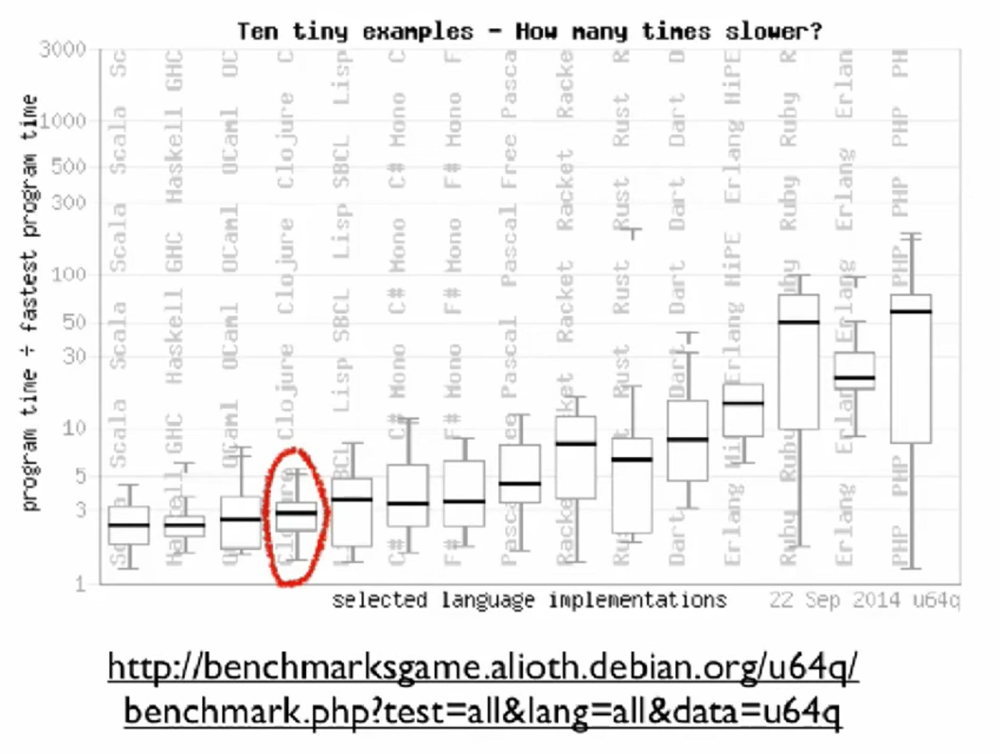
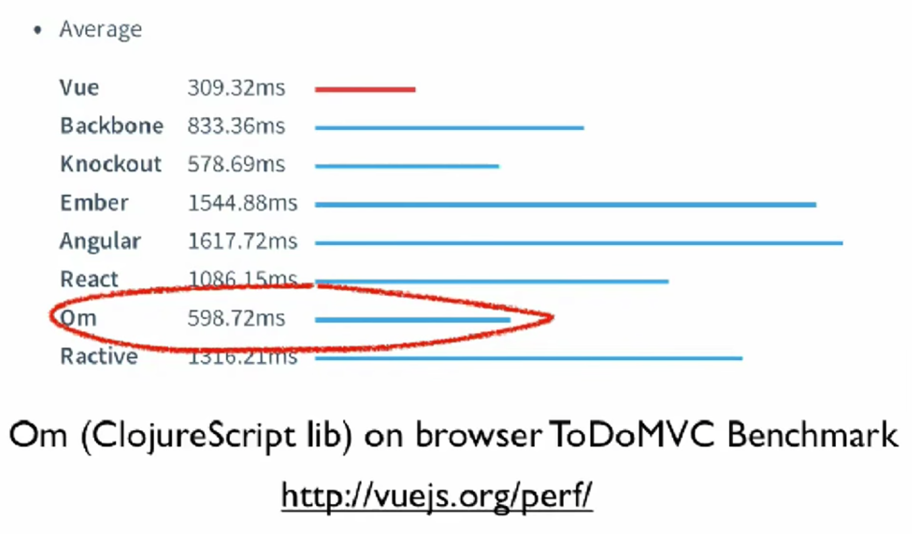
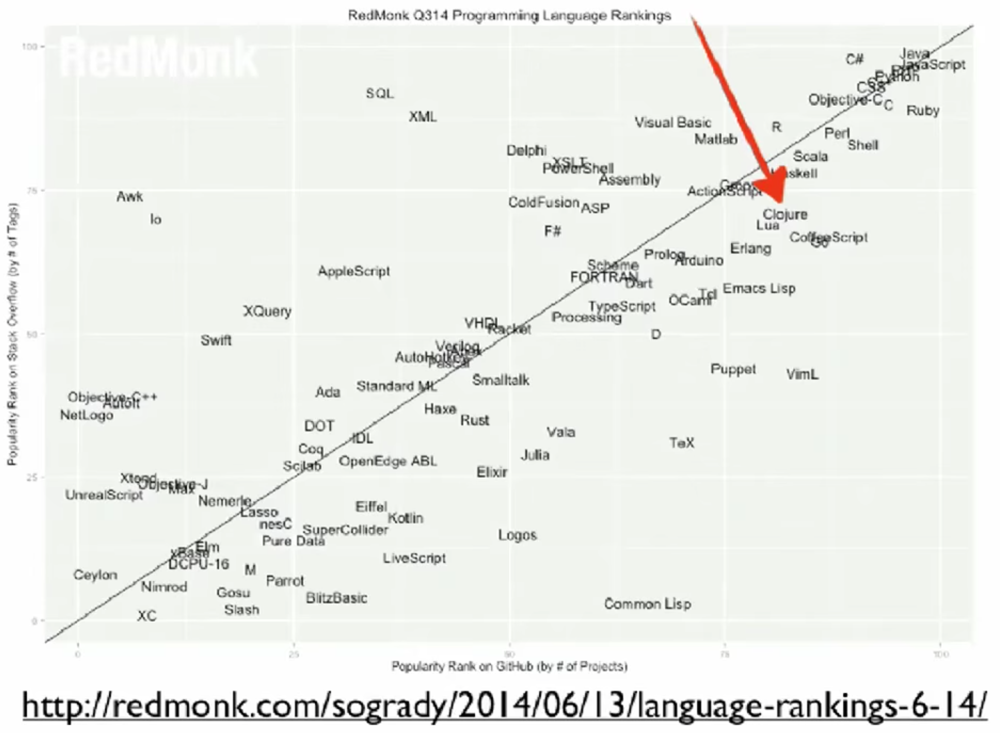
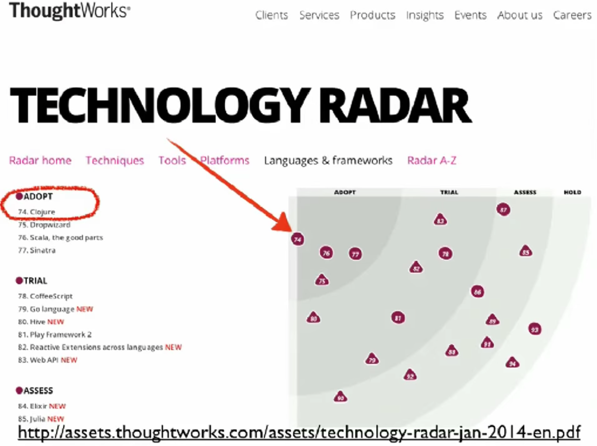

# Clojure, Made Simple

* **Speaker: Rich Hickey**
* **Event: [JavaOne Conference]**
* **Date: June 2015**
* **Video: [https://www.youtube.com/watch?v=VSdnJDO-xdg](https://www.youtube.com/watch?v=VSdnJDO-xdg)**

[Time 0:00:00]

```
slide:

     Clojure,
    Made Simple

    Rich Hickey
```

I want to thank everybody for coming.  The title of this talk is
"Clojure, Made Simple".  On the brochure they left out the comma.  So
it is not "Clojure Made Simple," in other words a tutorial on Clojure
or an easy explanation of Clojure.  It is not actually a comprehensive
explanation of Clojure at all, but a look at a slice of what Clojure
is about.  A way of thinking about why you might want to use it.


[Time 0:00:25]

```
slide title: Me

+ Creator of Clojure

+ Designer of Datomic

+ CTO/Co-Founder Cognitect, Inc.

+ Two decades delivering commercial
  production apps in C++/Java/C#
```

So I am the person who made Clojure.  I currently work on a database
called Datomic, which is kind of a functional database.  It is written
in Clojure.  It runs on the JVM architecture.  I am a co-founder of
Cognitect, which builds Datomic and sponsors the development and
stewardship of Clojure.

But the main point I wanted to make about myself to this audience was
-- because in this talk I might seem somewhat skeptical of Java and
object-oriented programming -- is that I have done an absolute ton of
that.  That is what I did for two decades before I said, "If I still
want to be a programmer, I do not want to do it this way anymore."  So
I know exactly how apps are built using Java and C++ and C#, because
that is what I used to do.  That does not mean what I think about them
is correct, but that is my experience.


[Time 0:01:23]

```
slide title: You

+ (dis)contented Java dev?

+ Clojure tinkerer?

  'wish I could use it at work'

+ Clojure user

+ Couldn't get into Brian Goetz' talk
```

But I am wondering about you.  How many people program in Java here?
How many people are happy about that?  How many of you are actively
unhappy about that, and looking for alternatives?  OK, great.

How many people have tried Clojure at all?  Great.  How many people
have never heard of Clojure and are in the wrong room?  OK.  How many
people have tried Clojure and are trying to get to use it at work, but
not yet?  A few.  Maybe this talk will give you some ways of talking
about Clojure's value proposition that could help you.

How many people actively use Clojure, and somehow are accidentally at
JavaOne?  OK.  And the rest could not get into Brian Goetz's talk.  I
should not even mention that Brian Goetz has talk right now, because
we could have people filing out.  Or maybe you are just tired of Brian
Goetz talking about immutability, in which case you are definitely in
the wrong room.  No, I like him.  Brian's a good friend and his talks
are great, so I appreciate your bringing this one.


[Time 0:02:22]

```
slide title: Clojure

+ Programming language for JVM, JavaScript et al

+ Released in 2007

+ Lisp, functional, data-oriented etc (more later)
```

So there were very few people who had never heard of Clojure, so I am
not going to spend a lot of time on it.

Oh, I had one more question.  How many people have seen my talk
"Simple Made Easy"?  How many people have not?  OK, a few, so I may
spend a minute describing what I mean when I say simple.

Clojure is a programming language.  It runs in the JVM and JavaScript,
and pretty much a substantial subset of Clojure runs on JavaScript.
So it is a programming language with which you can target both.  But
originally it only targeted the JVM and the CLR.  There is still a
port to the CLR that is maintained, but does not see wide use.

I released it first in 2007.  It has had surprising adoption,
especially from my perspective, since then, given its characteristics.
Because it is a Lisp, it is functional, it is data oriented.  And it
has a lot of things that make it seem not like the kind of language
that would succeed.  And this talk will really be about the data
orientation of Clojure.


[Time 0:03:27]

```
slide: 

"A lot of the best programmers and the
most productive programmers I know are
writing everything in ______ and swearing
by it, and then just producing ridiculously
sophisticated things in a very short time.
And that programmer productivity matters."

            Adrian Cockcroft -
Battery Ventures, formerly Cloud Architect, Netflix
```

So a lot of the best programmers and the most productive programmers I
know are writing everything in blank and swearing by it, and then just
producing ridiculously sophisticated things in a very short time and
that programmer productivity matters.  So Adrian Cockcroft was cloud
architect at Netflix.  Now he is at Battery Ventures.

How many people think Java goes in the blank?  OK.  So we know.  We
know this.  There is something about Java that makes it not suitable
for this blank.  So maybe we can tease that apart.


[Time 0:04:04]

```
slide: 

"A lot of the best programmers and the
most productive programmers I know are
writing everything in _Clojure_ and swearing
by it, and then just producing ridiculously
sophisticated things in a very short time.
And that programmer productivity matters."

            Adrian Cockcroft -
```
[https://thenewstack.io/the-new-stack-makers-adrian-cockcroft-on-sun-netflix-clojure-go-docker-and-more/](https://thenewstack.io/the-new-stack-makers-adrian-cockcroft-on-sun-netflix-clojure-go-docker-and-more/)

Yes, of course, he was saying Clojure.  And this talk is about maybe
why.  Like how could this be true?  What is it that makes Clojure
different and possibly a better fit for that blank?


[Time 0:04:19]

```
slide title: Programming is an
             Economic Activity

+ Cost/benefit

+ ROI

+ Time to market

+ Profit
```

So the first thing I want to talk about is that: I think we have this
tendency in programming to think about ourselves just a ton, and our
languages, and our tools, and our techniques, and me, me, me, me, me,
us.  What we are doing, whatever.

We lose track of the fact that we are all working for somebody else
who is, or for ourselves, but for a business or an organization that
is trying to accomplish something in the world.  And the software is
completely secondary to that task.  It should be measured always in
terms of the cost-benefit ratio, the return on investment.  How
quickly can we get a product to market?  And is what we are doing
profitable?  If we are not doing that, we are not really being good
participants in our businesses or organizations.


[Time 0:05:05]

```
slide title: Stakeholders Want

+ Something good

+ Soon
```

So what do the stakeholders want?  They really want two things.  They
want something good, and they want it soon.


[Time 0:05:18]

```
slide title: Something Good

+ --Passes all tests-- [strikethrough]  _Programmer-centric_

+ --Type checks-- [strikethrough]        _means, not ends_

+ Does what it is supposed to do

+ Meets operational requirements

+ Is flexible enough to accommodate change
```

So something good.  We think we know what is something good.  We know
how to make things good, right?  We have these techniques, and things
are good when the techniques are successful with them.  So when our
types check and our tests pass, we have something good.

But of course we all know that with our best efforts in those things,
which are -- I am not saying they are bad activities, by the way --
but no matter what we do there, we end up with programs that do not
work.  We all know we have programs that type check, and tests pass,
and they do not work.

And they do not work from the perspective of the stakeholder.  In
other words, they do not do what the program was supposed to do, and
what it is supposed to do was something that was conveyed between
people, or through documentation, or papers, or things that are not in
programming languages.

They have to meet operational requirements.  And they have to be
flexible.  Now there are some times where people just want something
soon, and they do not want something good.  There are actually better
languages than Clojure for that.  Just give me something fast that I
am absolutely definitely going to throw away.  It will not grow, will
not expand, will not take me further.

So these first two things are means, right?  They are good, but they
are only good insofar as they help ensure the latter three things.


[Time 0:06:34]

```
slide title: Does what it is
             Supposed To Do?

+ From the perspective of the _stakeholders_

+ Very difficult to determine if a large,
  elaborate stateful program does what it is
  supposed to do

+ Very difficult to determine if _large_ _or_
  _elaborate_ _or_ _stateful_ programs do what
  they are supposed to do
```

So if we break it down, what is it supposed to do?  Again, it is a
perspective thing.  If the stakeholder thinks it is doing what it is
supposed to do, they are fine.  And of course, they are going to have
expressed concerns about software, what it is supposed to do.  It
should do this when I push this button.

And they are going to have unexpressed presumed things like: it should
be secure.  It should not cause the computers to go on fire because it
is so slow.  It should not require three new data centers.  It should
keep running, and not stop for an hour every day.  Those are sort of
the unstated presumptions of something being good.

But it ends up that if you build large elaborate stateful programs it
is _extremely_ difficult to ascertain whether or not they are going to
do what they are supposed to do.

And in fact, if you build any one of those things, if you just build a
very large program, or a very elaborate program, or a very stateful
program, it will be as hard to figure out if it is going to do what it
is supposed to do.

So one of the things Clojure is oriented at is making it easier to
understand whether or not your program is going to do what it is
supposed to do, mostly by making it substantially smaller, and also by
making it more functional.


[Time 0:07:43]

```
slide title: Meets Operational
               Requirements

+ Deployment/environment   [first two bullets circled in red]
                           Shared with Java/JavaScript host
+ Security

+ Performance

+ Etc.
```

In terms of operational requirements, there is a boatload of things.
There are a boatload of unstated requirements of software.  Two are:
can I deploy it in the normal way with all my stuff, with the people
who know how to run my machines and everything else?

And that is one of the targets of Clojure.  Clojure was meant to be
hosted.  It is just a JAR.  It runs in the environment.  It is easy to
sneak in.  Let us just add this.  One more JAR.  And then we are
running.

But it is not a small thing.  If you wanted to adopt Common Lisp, say,
or Haskell, you would be asking your ops team and your deployment team
to start manipulating something completely alien, whose
characteristics they do not understand.

In terms of security, everything that is available from the JVM for
security is available via Clojure.  And there are performance and
other concerns.

A very important thing, though, is that now we can also reach the
browser.  So I think -- how many people write applications where some
part of the overall system touches a browser?  Yeah.  So right now you
use two different things.  Almost definitely, you use two different
things.  And I think it is a strength of Clojure that we are
delivering the same value proposition in both places, both on the
server and in the client.  And even if they are separate devs the
value proposition is necessary.  And almost more so in the browser,
which is one of the most complex places ever.


[Time 0:09:10]



[http://benchmarksgame.alioth.debian.org/u64q/benchmark.pgp?test=all&lang=all&data=u64q](http://benchmarksgame.alioth.debian.org/u64q/benchmark.pgp?test=all&lang=all&data=u64q)

[ The URL is obsolete as of 2018-Feb-10, and even about a year before
that, as the Benchmarks Game web site stopped including Clojure
programs in its published data. ]

In terms of performance, a lot of times you might look at a dynamic
language and say, "how could it be ..." whatever?  But Clojure is right
down there with the fast languages, on admittedly, the benchmark game,
which is a benchmark and a game.  But it says we can reach that.


[Time 0:09:30]


```
Om (ClojureScript lib) on browser ToDoMVC Benchmark
```
[http://vuejs.org/perf/](http://vuejs.org/perf/)

[ As of 2018-Feb-10 that page no longer shows measurement results.  It
has some text explaining why they took down the measurements.  It was
not any reason that was specific to Om or any of the other frameworks.
They seemed to believe that the measurements were not as relevant to
the experience that browser users saw, as they originally intended to
measure. ]

On JavaScript we have a very interesting result here.  Om is a
ClojureScript library.  ClojureScript is Clojure on JavaScript,
and Om is a library that actually wraps React, which is the new
hotness.

What is the really interesting things here?  Om wraps React, and then
spanks it in performance.  How is that possible?  It ends up that Om's
use of persistent data structures, which I will talk about in a
minute, make it faster than React, because the big part of React is
doing change detection.  And change detection for immutable things is
identity comparison, so it is super fast.

And in fact, they are re-architecting their whole thing to use
persistent data structures in JavaScript now.  The React dev came up
to me at Strange Loop, shook my hand and said, "You are saving us a
ton of money, because we are switching to that strategy."


[Time 0:10:29]

```
slide title: Flexibility

+ Ability to accommodate _inevitable_ change

+ _Loose coupling_ is key
```

So the other part of the value proposition I said was flexibility.
People that have a stake in software know that they are building a
system now, but tomorrow things are going to change.  Requirements are
going to change.  We are going to have to do something different.
Change is inevitable.  So can we change the program?  Can we make it
more flexible?

And it ends up there is a lot we can learn from bigger system design,
in the small, to make the sub components of systems more flexible.
And of course this is the oldest thing, right?  Loose coupling.  But
we talk and talk and talk about it, and we continue to use techniques
that thwart it.  Like, every single day, you pull out a technique.
You do something that makes this harder.

So what makes it easier?


[Time 0:11:16]

```
slide: 

"With Clojure we get to market faster and with
better quality.  We avoid unintended interruptions
in Java apps when code in one area impacts the
            application in another."

"Clojure shrinks our code base to about one-fifth
the size it would be if we had written in Java."

              Anthony Marcar -
        Senior Architect, WalmartLabs
```

So my talk was done, and somebody said, "You know, I have this quote
from Walmart Labs guy.  You might want to put it in your talk."  And
it was like: wow, this is great!  Because he is telling my story.

With Clojure we get to market faster and with better quality.  We
avoid unintended interruptions in Java apps from code in one area
impacts the application in another.  Clojure shrinks our code base to
about one-fifth the size it would have, had we written in Java.

And these are the points of my talk.  This is what I want.  This is a
stakeholder saying, "this is what we get by choosing Clojure."  Faster
time to market, better quality.  We avoid coupling problems that make
it difficult for us to change.  And we have a smaller code base.


[Time 0:12:05]

```
slide title: How?

+ Data orientation

+ Simplicity

What matters is not just what a programming
language makes possible, but what it makes
         _practical_ and _idiomatic_.
```

So how does Clojure do this?  There are many, many different
characteristics to Clojure, but I only want to talk about sort of two
today, and mostly one.

One is, and because this is the one I think that sets Clojure apart.
It makes it somewhat different, is that it has data orientation,
through and through.  And the other is simplicity.

So when I say simplicity, I mean the opposite of complexity.  I do not
mean ease.  I do not mean Clojure is an easy language.  That is easy,
you type and everything magically happens, or some sort of easiness
metric.

Complex things are intertwined, and simple things are not.  They are
more independent.  They are separate.  Even if they have as many
things going on, this is simpler than this.  Four things like this is
complex, and four things like this is simple. [probably gesturing with
his hands, but it does not show in the video]

So that is what I mean when I say simple.  Unentangled.

So the thing is, that you know all these languages can do everything.
We can do the same stuff.  And people are like: I know I can do the
same stuff in C# and Java and Scala and Clojure, and any
general-purpose language.  You can accomplish the same things at the
end of the day.

So what differentiates languages is what they make practical and what
they make idiomatic.  And in Clojure we focused on making something
idiomatic that I think is _not_, and should be more so.


[Time 0:13:31]

```
slide title: Data Processing

+ Not a dirty word (nor two)

+ Most programs acquire, transform, store,
  search, manage, transmit data

+ Data is raw, immutable information

+ Many langs turn into something much more
  elaborate - with types, 'methods' etc

  esp. OO conflates _process_ constructs and
  _information_ constructs
```

That is this.  Before we had all this high falutin' opinions of
ourselves as programmers and computer scientists and stuff like that,
programming used to be called data processing.

How many people actually do data processing in their programs?  You
can raise your hands.  We all do, right?  This is what most programs
do.  You take some information in, somebody typed some stuff, somebody
sends you a message, you put it somewhere.  Later you try to find it.
You put it on the screen.  You send it to somebody else.

That is what most programs do most of the time.  Sure, there is a
computational aspect to programs.  There is quality of implementation
issues to this, but there is nothing wrong with saying: programs
process data.  Because data is information.  Information systems ...
this should be what we are doing, right?

We are the stewards of the world's information.  And information is
just data.  It is not a complex thing.  It is not an elaborate thing.
It is a simple thing, until we programmers start touching it.

So we have data processing.  Most programs do this.  There are very
few programs that do not.

And data is a fundamentally simple thing.  Data is just raw immutable
information.  So that is the first point.  Data is immutable.  If you
make a data structure, you can start messing with that, but actual
data is immutable.  So if you have a representation for it that is
also immutable, you are capturing its essence better than if you start
fiddling around.

And that is what happens.  Languages fiddle around.  They elaborate on
data.  They add types.  They add methods.  They make data active.
They make data mutable.  They make data movable.  They turn it into an
agent, or some active thing.  And at that point they are ruining it.
At least, they are moving it away from what it is.

And in object orientation I think this is rampant, because our
fundamental construct, the object, conflates two things.  It does not
give us two separate ways to talk about _process_, for which objects
are an OK approach, and _information_, for which they are a terrible,
terrible, terrible approach.

But every time we have a problem, we pull out an object.  We make a
new object.  We make a new class.  We make a new instantiation of
something.  And this makes our programs more about themselves again,
and less about the information.  Programs are more increasingly about
code, and decreasingly about data.  And I think that is a mistake.


[Time 0:16:04]

```
slide title: Data

+ Clojure embraces data

+ Data literals

+ Code is data

+ Majority of functions take/return data

+ _Information_ is represented in Clojure
  systems as _plain data_
```

So Clojure embraces data.  That is like the simplest idea behind
Clojure.  It is just: there is nothing wrong with data.  Data has
these great properties.  Let us use it.  In fact, let us make it a
really important, first class, in your face kind of thing.

So Clojure embraces it first and foremost by having strong data
literals, which I will show you in a minute.  And they are plain.
Plain.  It just means flat, level, unadorned, no extra stuff.

Code, and this is an old Lisp thing, in Clojure is represented as
data.  That is important for a lot of reasons.  It enables macros and
a lot of sophisticated program transformation things.  But it also
means that you do not have different stuff.

The majority of functions in Clojure just take data, and by data I
mean immutable, unadorned stuff, and they return that same thing.  A
giant library of functions.  Hundreds and hundreds and hundreds of
data manipulation functions, ready to go.  They take data.  They
return data.

So if you have anything that is data, you can use all those functions
on it, which tends to press you towards making everything data.
Because then you have this giant library, which you learn once, and
you can apply to every problem you have.  And in particular, every
time we encounter information in Clojure systems -- because there are
different parts of systems.  There is a part of your system that
manipulates information.  There is a part of your system that is sort
of plumbing, or the machinery of your program, like a socket or
communications endpoint -- is more like a machine than it is like
information.  So there are going to be active parts of your program.

But whenever you are dealing with the part of your program that is
just about representing facts and information, we will always in
Clojure choose plain data to do that.


[Time 0:17:51]

```
slide title: Atomic Data Types

+ Integers - 12345678987654

+ Doubles 1.234 , BigDecimals 1.234M

+ Ratios - 22/7

+ Strings - "fred" , Characters - \a \b \c

+ Symbols - fred ethel , Keywords - :fred :ethel

+ Booleans - true false , Null - nil

+ Regex patterns #"a*b"
```

So there is a small set of data literals in Clojure.  They are
relatively obvious.  You can write integers in the normal way, and
doubles the normal way, and BigDecimals with an M at the end.  There
are ratios, and these are proper ratios that do not lose precision.

Strings are in double quotes, and strings are java.lang.String.  When
you write that you get a java.lang.String, and so it is just a literal
for a string.  There are literals for characters.

Because we use data structures for programming, there are a couple of
extra things we need.  But if you look at Java code, is it written all
with quotes around every word?  No.  So Java needs something besides
strings in order to be a successful programming language.  It needs
symbols.  And it needs identifiers.

So if you are going to properly represent your code as data, those
things have to be first-class data structures, or atomic data types,
that are different from strings.  So there are two in Clojure.  One
are symbols, and the other are keywords.  And their use in Clojure,
which I am not going to dive into, is that symbols are generally used
to reference something else.  So like variables and things like that.
They name something.

And keywords name themselves.  They are more like enums, if you want.
They are very useful as keys in maps, for instance, and that is why
they are called that.

There are true and false Boolean literals.  And there is nil, which is
null.  And it is the same.  That is the Java null.  And those Booleans
are Java Booleans.  Those characters are Java characters, etc. etc.
And there are also literals for regex.


[Time 0:19:31]

```
slide title: Data Structures

+ Lists - singly linked, grow at front

  + (1 2 3 4 5), (fred ethel lucy), (list 1 2 3)

+ Vectors - indexed access, grow at end

  + [1 2 3 4 5], [fred ethel lucy]

+ Maps - key/value associations

  + {:a 1, :b 2, :c 3}, {1 "ethel" 2 "fred"}

+ Sets #{fred ethel lucy}

+ Everything nests
```

And then we have data structures.  Some fundamental data structures.

We have the singly linked list.  It is in parens.  Those are all lists
there: a list of numbers, a list of symbols, a list that has a symbol
and then some numbers.  That is OK.  It can be heterogeneous.  And
they grow at the front, and they have linked list kind of performance
characteristics, which means it is fast to put something at the front,
and it is slow to find the 57000-th thing.  It is linear time to find
stuff in the middle.

Then we have vectors.  They are in square brackets.  Again, they can
be heterogeneous.  This happens to be one with numbers, and one with
symbols, but you can intermix them.  They grow at the end in constant
time, but they also offer fast access anywhere in the middle.  So they
are different from linked lists, then.

And then there are maps.  They are key value, key value, key value.
The commas are optional.  The keys need not be keywords.  So this
first one uses keywords mapping to integers, and the second one uses
integers mapping to strings.  But you can be heterogeneous in both the
key and the value.

And then we have sets, which are just curlies preceded by a hash.  And
you can have sets, again, heterogeneous of anything.

And all of the stuff nests.

One of the important things about this is that these maps, they scale
and are efficient from the very small, all the way to the very large.
So you can use them as sort of pseudo objects in the small, and have
four or five fields, if you will, or entries.  Or you can have a giant
map that has millions, tens of millions, hundreds of millions of
things in it.  The same data structure is used throughout that range
in Clojure.  We do not distinguish those two uses at all.


[Time 0:21:11]

```
slide title: Persistent Data
               Structures

+ Immutable

+ Can make new 'modified' versions while
  keeping standard performance expectations

  i.e. not copy-on-write

+ Key to practical functional programming
```

So all of the data structures I showed you are immutable.  There is no
way to change them.  Just like there is no way to change 42, there is
no way to change a vector.  What you can do is make a new vector that
is slightly different from the vector you started with, and then you
have both vectors.

And there is a technique called persistent data structures, which
makes this making of a new slightly different version efficient.  The
two versions will have a substantial amount of structural sharing
going on under the hood.  And that is possible _because_ they are
immutable.  They can share structure because no one can change them.
And that is what makes it practical to use immutable data structures
all the way through the range, from tiny things through very very
large things.

It is _not_ copy-on-write.  These new modifications that you make
still comply with the big O expectations you have for the data
structure in hand.  And this is the key to practical functional
programming, is having this.


[Time 0:22:13]

```
slide title: The Clojure Premise

+ We can build a substantial portion of our
  programs using just the data structures above
  and pure functions thereof

+ These programs will be substantially smaller,
  simpler and more robust than OO programs
  that do the same jobs

+ So, we should make that idiomatic
```

So the idea behind Clojure, or one of the ideas behind Clojure, is
just this.  I had done so much object-oriented programming, and it is
just so much busy work and so much extra stuff.  And when I finally,
later in my career, learned Lisp, I saw people building very very
interesting systems out of much much simpler stuff.  And I tried it,
and guess what?

You can build exactly the same systems out of much much simpler stuff.
And I said -- well, I cannot repeat it.  But I was very unhappy.
Basically, something to the effect of: I have been wasting my time and
my career doing what I have been doing.  I need to do something.  I
need to change what I am doing.  Because I am wasting my time.  I am
wasting my life doing it this way.

Because you can build programs, the same programs, better programs,
that do the same things with substantially simpler stuff.  In fact,
you can build them out of the data structures I just showed you, plus
pure functions that take those things and return those things.  _Most_
of your program, you can build that way.

In little tiny bits of your program you will have state.  You will
have communication.  You will have the other aspects.

I like runtime polymorphism, and Clojure has it.  I will talk about it
in a second.  But you can build programs out of this.  And you can
build big programs out of it.  You can build databases out of it.  I
have done it.  I have built a database out of it.  When I made
Clojure, I was targeting being able to do everything that I used to do
in Java and C++.  So I built broadcast automation systems, scheduling
systems, yield management systems, election projection systems, and
exit poll systems, in all those: C++ and Java and C#.

I believe that I could have used Clojure to build anything I ever
built, with maybe a _tiny_ little bit of lower-level code in small
places.  But that is the target for Clojure.  I wanted to replace what
I was doing.

I think the programs _are_ substantially smaller.  They are simpler,
and they are _much_ more robust than the object oriented programming I
was doing to accomplish the same jobs.  So the idea behind Clojure is:
let us make that idiomatic.  Let us make that the first class way we
do things.


[Time 0:24:19]

```
slide title: Syntax

+ You've just seen it (edn)

+ Data structures _are_ the code

+ Not text-based syntax

  + Syntax is in the interpretation of data structures

+ Things that would be declarations, control
  structures, function calls, operators, are all just lists
  with op at front

+ Everything is an expression
```

So the syntax of Clojure, there is no more.  You just saw it.  It is
those data structures.  That set of data structures, and those
fundamental things, are a format called edn, which stands for
"extensible data notation".  But it is just a grown up version of
S-expressions, which have been used in the Lisp community for years.
Basically you build programs out of data structures, and I will show
you some of that in a second.

So the data structures are the code.  The syntax is not based around
characters.  It is based around data structures.  The definition of
what a function is, is a list whose head is a symbol called "fn", and
whose next thing in the list is a vector of arguments, which are
themselves symbols, etc. etc. etc.

But the syntax is described in terms of data structures.  It is not
like there is no syntax, but that is where the interpretation happens.
And everything that would be special in an ordinary programming
language: declarations, control structures, function calls, operators,
etc. etc. they are _all_ just represented as lists with the verb at
the front.  That is it.  That is the Lisp way.

Also everything is an expression.  And that is typical of functional
programming languages.  That is about all I am going to say about
Clojure the language.


[Time 0:25:39]

```
slide title: edn - extensible data
                   notation

+ meant to be useful for data _and_ code

+ unlike XML and JSON

{
  "Fn::Base64": {
    "Fn::Join": ["", ["#!/bin/bash -ex", "\n", "\n",
                      "yum install ec2-net-utils -y", "\n"
                      "ec2ifup eth1", "\n",
                      "service httpd start"]]
  }
}
```

But I am going to show you a lot more about the use of these aspects
of it.  I have a little bit more later.

So edn, this extensible data notation.  I showed you some built-in
things.  There is also a way to extend it to add new tags, that are
namespaced, that allow you to describe something new, in terms of
anything that is already known.

So you cannot make up arbitrary stuff.  You cannot say, "we will build
a new parser to parse characters and get this thing".  But you can
say, "I have a new interpretation of a vector of two numbers, and we
are going to call that a point."  And so on and so forth.  And you can
cascade these extensions and build richer things.

But one of the important things about edn is: it is meant to be useful
for data and code.  So you saw in a previous slide I said commas are
optional.  That is kind of critical.  Imagine if in between everything
you said in Java you had to put a comma.  Who would like that?  That
would be awful.  So you cannot have stuff like that.  How many people
have ever used any system that tried to encode programming in JSON or
XML?  Yeah, how fun is that?

[Audience member: It stinks.]

Yeah.

So this is a little bit of ...  AWS cloud formation has some functions
in their syntax, which is normally declarative.  So this is a nested
function call.  But you cannot do this.  You cannot program like this.
So if you are going to program using data structures, you have to have
a data structure format that is amenable to that.


[Time 0:27:05]

```
slide title: Data as Program

; Norvig's Spelling Corrector in Clojure
; http://en.wikibooks.org/wiki/Clojure_Programming#Examples

(defn words [text] (re-seq #"[a-z]+" (.toLowerCase text)))

(defn train [features]
  (reduce (fn [model f] (assoc model f (inc (get model f 1))))
          {} features))

(def *nwords* (train (words (slurp "big.txt"))))

(defn edits1 [word]
  (let [alphabet "abcdefghijklmnopqrstuvwxyz", n (count word)]
    (distinct (concat
      (for [i (range n)] (str (subs word 0 i) (subs word (inc i))))
      (for [i (range (dec n))]
        (str (subs word 0 i) (nth word (inc i)) (nth word i) (subs word (+ 2 i))))
      (for [i (range n) c alphabet] (str (subs word 0 i) c (subs word (inc i))))
      (for [i (range (inc n)) c alphabet] (str (subs word 0 i) c (subs word i)))))))

(defn known [words nwords] (for [w words :when (nwords w)]  w))

(defn known-edits2 [word nwords]
  (for [e1 (edits1 word) e2 (edits1 e1) :when (nwords e2)]  e2))

(defn correct [word nwords]
  (let [candidates (or (known [word] nwords) (known (edits1 word) nwords) 
                       (known-edits2 word nwords) [word])]
    (apply max-key #(get nwords % 1) candidates)))
```

So this is what Clojure looks like.  I do not really expect you to be
able to read it.  But I just told you before, that is a list.

"defn", it defines a function.  The name of the function is "words".
It takes an argument called "text".  And there is the implementation.
And so on, and so on, and so forth.

So this is a port of Peter Norvig's Python code.  It is as short as
the Python program.  And that is not like a contest.  It is more about
this: everything that is in here is about the problem.  All the words
you are reading, and everything, it is all about the problem.  There
is no extra stuff.  There is no static, import, blah, type this, type
that, yada ya, extra control stuff.  It is all about the problem.
100% about the problem.

And that is what you want.  So it is short.  It is free of ceremony.
But most important is: it is about the problem, which means it is a
lot easier to look at now, and later, and see what you were trying to
do.  What you are trying to accomplish.


[Time 0:28:12]

```
slide title: Data as HTML
             (Hiccup DSL)

[:html
    [:head
      [:title title]]
    [:body
      [:h1 title]
      [:h2 (str "By " author)]
      (for [post posts]
        [:article
	  [:h3 (:title post)]
	  [:p (:content post)]])]]
```

So once we have this format edn, and we use it for code, and we can
obviously use it for data, you use it for everything.  So let us say
you want to have a DSL to represent HTML.  Because we know HTML on its
own is kind of gross to generate and manipulate.  Because it is XML
plus some randomness.

So this is one of many DSLs for representing HTML in Clojure.  But it
is edn.  This is the same stuff that the program was made out of.  The
same reader reads this.  If I call "read", which is available a la
carte in Clojure, I get a vector that has a keyword, then a vector
that has a keyword, a vector, blah blah blah.

I get data.  I know exactly what I am gonna get, the data structures I
am going to get.  I don't have a special thing.  I don't have a DOM,
blah blah blah.  I get data when I read this.  And that is great.  It
means it is easy for me to process this.  It is easy for me to write a
program that produces this.  So I can produce HTML without an extra
special different thing.


[Time 0:29:09]

```
slide title: Data as Config

(defproject hiccup "1.0.5"
  :description "A fast library for rendering HTML in Clojure"
  :url "http://github.com/weavejester/hiccup"
  :dependencies [[org.clojure/clojure "1.2.1"]]
  :plugins [[codox "0.7.4"]]

  :profiles
  {:1.3 {:dependencies [[org.clojure/clojure "1.3.0"]]}
   :1.4 {:dependencies [[org.clojure/clojure "1.4.0"]]}
   :1.5 {:dependencies [[org.clojure/clojure "1.5.1"]]}})
```

Of course we would use this for our configuration files.  Why not?  We
can read it.  We can generate it.  We can process it.  We can
manipulate it.  Everything we know, all those hundreds of functions we
know how to do, we can use to do this.

Now add up the stuff in Java.  How much have you got?  You have syntax
for which you use I do not know what.  Some parser thingy for that,
from javac or something, to manipulate.  You have annotations.  You
have JSON here.  You have XML there.  Maybe for writing your own DSL
you use ANTLR or something.  It keeps adding up.  More and more and
more different things.

And if you read stuff with an API, what do you get?  Some API author's
idea of the DOM for this kind of thing.  What do you get when you read
XML?  Well it depends on how you read it, but you could get this
machine that calls you back every time it gets a new element.  Wow.


[Time 0:30:03]

```
slide title: Data as Hadoop Job
              (Netflix PigPen)

(defn my-data-2 []
  (->>
    (pig/load-tsv "input.tsv")
    (pig/map (fn [[a b c]]
               {:sum (+ (Integer/valueOf a)
	                (Integer/valueOf b))
                :name c}))
    (pig/filter (fn [{:keys [sum]}]
                  (< sum 5)))))

=> (pig/dump (my-data-2))
[{:sum 3, :name "foo"}]
```
[https://github.com/Netflix/PigPen](https://github.com/Netflix/PigPen)

This is Hadoop programming.  Netflix has quite profitably used Clojure
to build a very succinct DSL for doing Hadoop and big data processing.
It looks exactly like Clojure.  It is Clojure, sort of embedded in
Clojure.

And the thing is, you can run this locally, and then push a button,
and it will distribute it over your Hadoop cluster and run it there.
Same thing.  And you can run your own Clojure functions there, too,
and it will ship them and everything else.


[Time 0:30:34]

```
slide title: More via Data ...

+ Type annotations

+ Data schemas

+ Logic DSLs

  + core.logic

  + Datalog

  + Cascalog

+ Your (embedded) DSL
```

So we just do this.  We do this everywhere.  Everywhere we want.
There is a type annotation system for Clojure that uses data.  There
is a schema language for Clojure that uses data.  There are many kinds
of logic DSLs that all use data as their representation.

And this allows you to do something that is very interesting, which is
to write an embedded DSL.  How many people have written a DSL, and had
more and more pressure to make it Turing complete and general-purpose?

You start with a DSL and it did X and Y.  And then people ask: could
you do Z?  Could you have conditionals?  Could you have case?  Could
you have, ugh!  They always want more stuff.

So one of the cool things about doing DSLs in a language like Clojure
is that you can sort of co-opt all of Clojure inside your DSL.  It is
like, oh, you want to do arithmetic?  Well sure!  All you have to do
is expose something that you are going to flow through to Clojure and
let Clojure eval it.  So it is very powerful.  You keep doing this.

The other big point of programs as data is: it allows you to write
program-generating programs, and that takes a few forms in the small.
There is a capability in Clojure and other Lisps called macros.  They
are nothing like C macros from your past, maybe, depending on how old
you are.

They are functions of data structures to data structures.  But
basically the compiler for Clojure says: if you declare something as a
macro, then if I see that in the program, I will call your code.  I
will give you the form, as data, that I encountered, and you give me
back a different form.

You can do any transformation you want, which means you can build your
own syntax.  You can build your own constructs.  You can extend the
language however you want.  You do not need to wait for me, or for
anybody else, or for the Java JSR, whatever.  You just go.

So we are doing all this stuff with raw data structures, and how do we
contrast that with objects?


[Time 0:32:33]

```
slide title: <rant> Objects are like
                 Marionettes

[ Stick figure drawing of a marionette, i.e. a person-shaped puppet on
strings, with sticks at the top that a puppeteer would hold and use to
control the marionette. ]
```

This is the ranty part of the talk.  Just warning in advance.

So objects are like marionettes.  Everybody has their burrito analogy,
but I could not.  Objects are not like burritos.  Objects are like
marionettes.

They have all these methods on them.  And anybody who has access to
the object, it is like they have that control stick thing.  Wikipedia
says that the person who has that is called the master minder.

I could not find anybody else who agree with them, but that is a cool
name.  Like you can remote control the object, which you can.  If you
have a reference to the object, and you know its type, you can call
any of its methods whenever you feel like it, in whatever thread you
want.  Just have at it.  You can do anything you want, because you can
call those things.

So whoever writes the object, the class, they have to defend against
that.  Because what is going to happen?


[Time 0:33:25]

```
slide title: More Refs, More
               Uncertainty

[ Similar stick figure drawing as previous slide, with same
marionette, but with sad face, and multiple sets of strings attached
to it, controlled from 3 different sets of control sticks. ]
```

Well in a real program, you are going to start passing around
references that object.  Well now you have more than one master
minder.  Now you have as many master minders as you have shared
references to the thing.

And anybody can call something at any time.  And what do you end up
doing?  You end up saying, well maybe they are friends and they are
standing next to each other, and they are like: OK, let us make the
fancy horse dance, and I will do the front legs, and you do the back
legs.

[Audience laughter.]

And that happens in puppetry, but in programming sometimes they just
go off, and somebody is trying to make the front of the horse go this
way, and somebody is trying to make the back of the horse go that way.
And it does not work.  And so you have to have all kinds of
protection.

And you cannot.  You actually cannot effectively do this.  Java, and
languages like it, do not give you an effective way to do this.  So
you are suffering from this, constantly.  As soon as you have a
reference leak, you are suffering.

Now I know you say, "Oh, I use value objects", and blah.  But you
don't, everywhere.  You _could_, but you don't.

And it is not idiomatic, and it is still hard.  And you still do not
even know.  If somebody gives you a reference to an interface, can you
know that it will not start dancing on you?  Is there anything in Java
that will tell you it is not going to move around?  Any way, any
construct, anything in the type system, anything?

No!  Nothing.  So every day, you have this unhappy face.


[Time 0:34:50]

```
slide title: Distribution?

+ Does anyone still think RMI/DCOM/
  CORBA is a good idea?

[ Same unhappy face marionette, now with 2 sets of strings in one box,
probably representing the local computer system where the
object/marionette is, and another set of strings tied to control
sticks in another box, representing a different computer system. ]
```

And then, the final problem.  How many people write a program that is
just a program?  It sits by itself, and it reads standard in, and
spits to standard out?  Compiler writers write that stuff.  And they
write these great languages that are really good at that.

But that is not the real world.  How many people write programs that
talk to other programs routinely?  Yeah, we do that all the time!

How many people put objects on the wire?  Wow!  That is terrifying.
But, just so you know, a long time ago we decided that was a bad idea.
So I don't know if you got the memo, or whatever.

[Audience laughter.]

But yeah, objects do not travel on wires.  You can fake it.  You can
pretend.  You can make all these elaborate things, but most of these
things have have failed in practice.  You can get away with it in
small circumstances, but it is not how things work.  We do not
actually give somebody a reference to something and allow them to
remote-control us.


[Time 0:35:52]

```
slide title: </rant>

+ If your API takes an object, will it mutate?

  Does your type system help with this most
  important robustness aspect?

+ If you wanted to refactor out-of-proc (or
  even onto another thread), how much work?

+ Not the way the world works (ORM, O_M)

+ Not the way successful _systems_ work
```

So this is what I was saying before.  If your API takes an object,
especially via a reference to an interface, so you do not have the
concrete class's definition to sort of make you feel better about it
not changing, do you know if it is going to mutate?  Can your type
system help you with this?

Which is really, it is _such_ an important thing for the robustness of
your program, to control this.  The answer is: no.  You are getting no
help at all.  So your default idioms leave you completely on your own
to deal with these problems.  And really, in a position that
encourages you to create these problems, just by accident.

The other thing is ...  So let us say RMI is not allowed at your
company.  How many people are not allowed to use RMI at their company?
Everybody is allowed to use RMI?  Wow!

[Audience member: And we are allowed to use goto's also.]

Goto?  Yeah, that is actually not as bad.

[Audience laughter.]

But let us say you are allowed.  And somebody says: I want you to
service-ize your thing.  How many people would _choose_ RMI over
something else, like HTTP or _anything_ else?  Nobody would.  And then
what do you have to do?  You have this interface.  You said I took an
object.  I expected all these methods on the object.  And now I have
to talk over a wire.  What do you have to do?

Map.  Mapping, right?  Object relational mapping, object blah map,
object something map.  Every time you want to get to and from the
outside world.  Especially stuff you are not writing.  So RMI is out
of the question.  You are not going to get some web site to accept
your RMI calls, or make RMI calls to you.

Any time you have to go outside of your box, out of your world view,
your object world view, you have to map.  So Java programmers and
object-oriented programs have been kicking SQL saying, "Oh, it
requires object relational mapping", and that is like a problem with
SQL.  No!  It is a problem with objects.  Objects are not the way the
world works.  Nothing in the world works that way.

People do not hand their strings out to other people to start yanking
on them.  And that is how we are going to build this.  So that is how
we are going to have a soccer team.  Everybody is going to have a
reference to somebody else, and you call "pass" to me, and we build
this big spaghetti nightmare.

That is not how the world works.  It is completely not the way the
world works.  It is not how physics works.  So we say objects are the
way to model the real world.  It is not at all.  It is a complete
programming fabrication.  It is not very realistic.  It is not a good
fit for almost anything that is in the outside world.  So you can
build your own world where all this stuff makes sense, but it is
inherently -- I would call it idiosyncratic.

But in particular, it is not the way that systems work, systems in the
large.


[Time 0:38:45]

```
slide title: Learning from Systems

+ system - "to cause to stand"

+ independent parts connected together

+ computer systems

  + different langs/runtimes/types

  + RPC and queues, of plain data

+ Flexible insofar as:

  + support independent development

  + tolerant in what they accept
```

So what are systems?  The word "system" means "to cause to stand".
And I love that idea.  I mean, I always think of these legs sort of
self-assembling to try to make something that stands up.

It is independent parts that you connect together, substantially
independent parts.  Because you do not need to cause something to
stand that is one thing that already has three legs.  You are not
causing it to stand up.  It is the independence of the things that
matters.

And in general we try to build systems in a way that makes them
independent.  Do we want to care if another server is using the same
programming language that we are?  Or the same runtime, the same
version of the Java runtime?  Or the same type system?  Do we want to
build a system like that, where we care?  No, we don't.  Why?  Because
it is going to be brittle.  It is going to be hard to make changes.
We are going to have to agree with the other person.  Tomorrow, we are
going to have this thing, and everything is going to be different.

You know: three, two, one.  We don't do that.  The Internet, does it
work that way?  No!  We do not do specific stuff.  We do general
stuff, and we try to be as independent as possible.

Most things that happen between systems use one of two techniques.
They use RPC with plain data out and back.  Or they use queues, where
you send data and somebody shows up later and gets the data.  You just
send, and you just flow data around.  This is the way that systems are
built, big systems.  Big successful systems like the Internet.  And
most systems.

And those systems are flexible.  You measure their flexibility in
terms of how much independence they support.  Can you independently
develop these parts of a system?  Can somebody upgrade their part of
the system and not mess up the other person?  Because Twitter is not
going to tell your web browser when they change their home page and
have Safari do something special.  That is not how it works.
Everybody has independent development, independent time frames.

Then the other thing that is critical to this, is that if somebody
else on the other end is going to change, you have to be tolerant of
things being different.  You cannot say, "well, here is our contract!"
There are nine hundred things that have to be exactly this way.  And
then I will work, and then you will work.  Then if we are going to
change anything, we have to have lunch, and have a meeting, and decide
this stuff again.  You have to be tolerant and accepting to some more
things, so we do not have to change in lock step.

So these systems are inherently dynamic, and they are inherently
extensible.  That is what I just said.  Systems are made with dynamic
types, extensible types.  They can accept data that you were not
expecting to see, and it will not make them fall over.  And hopefully
they will do a good job of propagating it.  They are all made this
way.


[Time 0:41:30]

```
slide title: Outside/In

+ We should program the insides of our
  systems like we program the outsides

  communicating via immutable data

+ for the same reasons

  loose coupling/subsystem independence

  flexibility

+ RPC => PC (function call)

+ queues => channels
```

So this is the other fundamental idea of Clojure: we should build the
insides of our systems like we build the outsides of our systems.  All
those value propositions that accrue to systems, we want them.  How
many people want to have a meeting every time they change a class or a
subsystem?  How people have meetings every time they change a class?
Yeah, you have to, right?  This could break!  Stuff is going to break.

So we should communicate using immutable data inside our systems, for
the same reason we do outside.  It makes our systems more robust.  It
makes them easier to change.  It makes the independent parts separate.
It makes it easier to move them around.  We get loose coupling.  We
get subsystem independence.  We get flexibility.

And what is the mapping?  Well there is no real mapping.  This does
not _need_ mapping.  RPC [remote procedure call] becomes PC [procedure
call].  We can call functions.  We were calling functions before there
was R.  Then they had R.  We had PC before we had RPC.  We can go back
to PC.  We can do that.  We can pass data to functions and get data
back.  We used to be able to do it, then we had all this elaborate
stuff.  Now we forgot how to do it.

And we can implement queues and flow inside our programs, using queues
or channels or things like that.


[Time 0:42:48]

```
slide title: Process and State

+ Of course there must be state and effects

+ Clojure is not 'pure', but does have _explicit_
  state constructs

  functional succession model

  observation of state _values_

+ core.async offers simple channel (queue) model

  flow vs places
```

So that is the other key idea.  Now there is going to be process and
state.  Clojure is a practical language.  Of course you are going to
have process and state, or there is no reason to run your program.  I
just make the computer hot and you go home.  You are going to have
state and effects.

But this is another area where we are left just totally with nothing,
in object-oriented languages like Java.  You have nothing here.  There
are very fancy functional languages that have purity, where they will
force you, through the type system, to identify and isolate all the
parts of your program that could do IO, or have any kind of effect.
They will either do it via purity, or via effect systems.

And then there is the alternative to that, is nothing.  That is what
most people have is absolutely nothing.

And then you could also have reified constructs that at least make a
state change explicit.  And that is where Clojure sits.  Because in
Java and C++ and C# you have nothing.  We just have nothing.  You have
some really raw constructs like mutexes, and a pat on the back, and
good luck, buddy, and read Brian's book.

[ Brian's book refers to:
Brian Goetz, "Java Concurrency in Practice", 2006, Addison-Wesley ]

So Clojure does not have any purity to it, but it has explicit
constructs for state.  These are like, you can imagine them being
variables that have semantics to them.  So it is not just like anybody
can come in and whack on this variable at any time.  Instead you say,
"I am going to give you a function, and you somehow apply that
function to that variable to move it from one state to another."  But
in doing so, you can ensure it is free of conflict, and free of races,
and it is never going to become half of a thing.

[Time 0:44:27]

And these variables always refer to values.  So you are always able to
observe them, or dereference them, and get out a value.  There is
nothing else.  There is only these reference cells that point to
values, and values.  There is no mutable object that half of which
could be whatever, or a date class that you could set the month, or
things like that.  A date is a value.  You can have a reference to a
date.  You can make that reference point to another date.  But you
can't change a date.

So you have: things you can change, which are references, and you have
values, which are not.  You cannot change dates, any more than you can
change 42.  But you can change these references.  But they are atomic.
They just point to one thing.

So between those, you can get a whole bunch of different variants.
CAS implements a successorship model.  You say: only make this new
thing if my presumption is still valid.

So that is the tiniest version.  And Clojure has a construct that
wraps that, so you do not have to write the loop, or anything else.
You say: here is my function, apply it to the inside of that, use CAS,
do the loop for me.  And I know I will get a clear successorship
there, with no race, and no conflicts.

[ These constructs are called an "atom" in Clojure, and "swap!" is the
name of the built-in function that does what is described above.
Atoms also have a few other similar built-in functions for updating
atoms.

The STM in Clojure can update references in Clojure things called
"ref"s, for which the built-in macros "sync" and "dosync" can update
one or more refs in a transactional way. ]

There is also an STM in Clojure that allows for bigger transactional
kinds of modifications to occur.  But the point is: this construct is
doing the job.  And the construct is calling out: here is where the
mutation is in the system.  Here is where the state is.

And the thing is: you have a way to get out of it.  If I give you
something that you do not know if it is going to change, how can you
save its value?  If I give you a reference, via an interface, to some
composite type, you don't know if it could mutate, how can you save
its value?  What is the safe way to do that?

[Time 0:46:09]

[Audience member: clone]

You do not know the clone is going to work at all.  Sorry, does not
work.  What else?  Walk through all the get's, get this, get that.
You have got nothing.  You have absolutely nothing.  So this is like a
critical thing for making a system that works.  You have absolutely
nothing to do this with.  You have to build up your own convention
around this.

So I think you should pick.  You should either have explicit
constructs, or go all the way to Haskell, because everything in
between is catastrophe.

And then in Clojure we have something called core.async which is a
channel model.  It is a little bit richer than queues, because you
don't have to set up the threads and do all the micro writes.  They
have semantics that are based around something called communicating
sequential processes.  But the basic idea is that you are going to try
to encourage -- especially when you are trying to convey values
through a system -- instead of saying, "I will put the acorn behind
this tree, and you come by later and find it behind the tree," you
say, "I am going to put the acorn on the conveyor belt, and you can
take it off the conveyor belt."

And there is a big difference between those two things, because if you
put something on a conveyor belt and then go back to it, what do you
expect?  Nothing.  A conveyor belt is moving, man.  That is it.  That
flowed.  So you cannot write the logic you can write with variables,
going back and re-examining a place to update it in place and try to
read it again.  It flows.  And so flow is a much more robust way to
build a system.  Data flow is a much more robust way than variables.
So we want to emphasize flow over places.


[Time 0:47:50]

```
slide title: (Program) Size Matters

+ Smaller is better

+ Bigger - more bugs, longer time to market,
  slower maintenance, more brittleness

+ Concision - size in the small

+ Generality - size in the large
```

So program size matters.  Smaller is better.  This is one of the few
areas where we have research.  People have done research and said:
smaller programs have fewer bugs.  It is just that simple.  It does
not matter what programming language it is.  Smaller programs have
fewer bugs.

Bigger programs have more bugs, longer time to market.  They are
harder to maintain, and they are more brittle.

But what I think is interesting is that there are two flavors of
small.  A lot of languages focus on concision, which is size in the
small.  How small is your if statement?  How small is a function call?
How tiny are your constructs?  How much overhead, how much syntactic
stuff is there?  And there are a lot of languages that focus on that:
Ruby, and Python, and a lot of languages are actually very good at
concision.

But the bigger impact on a program overall is not moving from 42
characters to 20 characters.  That only gets you 2x.  The biggest
thing is moving from more specificity, which bloats your program, to
more generality, which shrinks it.  That is the big payoff.  That is
the area where you are going to get a payoff much higher than 2x.


[Time 0:49:06]

```
slide title: Death by Specificity

+ Most information objects are just glorified
  maps of name->value

+ but you can't treat them as such in Java!

+ more code, less reuse, more coupling

  need to access each object via its own
  language (class)

+ this is a complete waste of time (IMO)
```

So one of the other things I think we suffer from in object
orientation is death by specificity.  All the time, we have a new
thing, we have a new idea, a new piece of data.  Boom!  We have a new
class.  Get this, get that, get whatever.

I do not care if they are value types, whatever.  It is just a
glorified map, except you cannot even use it as a map in Java.  There
is no generic way to manipulate something that says: get this, get
that, get that.  So new type, new language, it has got its own little
vocabulary.

So you are going to have more code.  You are going to have much less
reuse.  You are going to have more coupling.  Because essentially what
is happening is every object has its own little language: my class, my
interface, my own language.  This is my biggest pet peeve.  I wanted
to get away from this.  When we saw it writing get this, get that,
there is no purpose to this.  This is just life-sucking.


[Time 0:49:59]

```
slide title: Example - HttpServletRequest

getAsyncContext, getAttribute, getAttributeNames,
getCharacterEncoding, getContentLength,
getContentType, getDispatcherType, getInputStream,
getLocalAddr, getLocale, getLocales, getLocalName,
getLocalPort, getParameter, getParameterMap,
getParameterNames, getParameterValues, getProtocol,
getReader, getRealPath, getRemoteAddr, getRemoteHost,
getRemotePort, getRequestDispatcher, getScheme,
getServerName, getServerPort, getServletContext,
isAsyncStarted, isAsyncSupported, isSecure,
removeAttribute, setAttribute, setCharacterEncoding,
startAsync, startAsync...
getHeader, getHeaderNames, getHeaders, getIntHeader...

                 How many maps?
```

So let us look at life sucking.

[Audience laughter.]

This is just a tiny part.  This is just the servlet request, and I
have a little bit of HttpServletRequest, which really doubles the size
of this thing.

But my question to you is: how many maps do you see here?  Or like,
give a name, you get a value.  I got 1.  I got 1, I got 1, ... I
actually cannot do the auctioneer thing.  How many you got?

[Audience member: It looks like there are one or two sub-maps, like
parameter names, parameter values.]

Yeah.  So first of all, this game is hard, right?

[Audience laughter]

[Time 0:50:43]

[ This slide is the same as previous one, but some names have been
colorized.  I will mark them in the slide text by surrounding them
with _, but not trying to indicate the colors of each. ]

```
slide title: Example - HttpServletRequest

getAsyncContext, _getAttribute_, _getAttributeNames_,
getCharacterEncoding, getContentLength,
getContentType, getDispatcherType, getInputStream,
getLocalAddr, getLocale, getLocales, getLocalName,
getLocalPort, _getParameter_, _getParameterMap_,
_getParameterNames_, _getParameterValues_, getProtocol,
getReader, getRealPath, getRemoteAddr, getRemoteHost,
getRemotePort, getRequestDispatcher, getScheme,
getServerName, getServerPort, getServletContext,
isAsyncStarted, isAsyncSupported, isSecure,
_removeAttribute_, _setAttribute_, setCharacterEncoding,
startAsync, startAsync...
_getHeader_, _getHeaderNames_, _getHeaders_, _getIntHeader..._
```

There are some.  I got three inside, and the overall thing is a map,
too.  So I got four right off, by picking it apart.

What is really interesting is: look at these map interfaces.  They are
all ad hoc.  Guess what else?  They are all different!  One has
setting.  One you can actually get the map.  One you can get a list.
Some you can get out with types.  There are four _different_ maps in
this one class.  This is _crazy_!


[Time 0:51:12]

```
slide title: In Clojure, Just Use Maps

{:remote-addr "127.0.0.1",
 :scheme :http,
 :query-params {"somekey" "somevalue"},
 :form-params {},
 :request-method :get,
 :query-string "somekey=somevalue",
 :content-type nil,
 :uri "/foobaz",
 :server-name "localhost",
 :params {"somekey" "somevalue"},
 :headers
        {"accept-encoding" "gzip, deflate",
	 "connection" "close",
	 "user-agent" "Apache-HttpClient/4.1.2 (java 1.5)",
	 "content-length" "0",
	 "host" "localhost:8383"},
 :content-length 0,
 :server-port 8383,
 :character-encoding nil}
```

In Clojure, we just use maps.  This stuff came over a wire in HTTP, as
text.  How did we turn it into this?

[switches back to previous slide with Java API]

[Audience laughter]

What happened?  What happened?

[switches back to "In Clojure, Just Use Maps"]

This is crazy.

I told you the curly braces are maps.  Who can see how many maps?
One, two, ...  You see all the maps.  Because they are still maps.


[Time 0:51:38]

```
slide title: Specific vs General

+ Everything using HttpServletRequest is special

  + yes, dot completion works and no typos

+ but everything else is much worse

  + inconsistent, idiosyncratic, wide interfaces

  + much more code - can't reuse map
    manipulation libraries

  + consumer code completely coupled

  + harder to fabricate for testing
```

If you are going to write code that manipulates that other stuff [Java
API version], every single line of code you write is going to be
special.  It has to use whatever Java X servlet blah, and you are
writing code explicitly to this thing.

If there is another way to do HTTP, not that there is, so this is
probably the only way to do HTTP.  But if there was another way to do
HTTP, will you be able to reuse that code?  No!  It is all hardwired
to this person or persons idea of what an HTTP request is.

So yeah, there is a tiny little benefit.  Dot works in your IDE.
Whoo!  Oh my goodness, because I could never remember that [back to
Java API slide for a moment here], so something better happen when I
press dot, because I am doomed otherwise.

Of course I could look at the HTTP spec and we could agree on these
names.  And I just don't get it.  You can tell a kid not to put a
spoon in a blender and turn it on, and they will remember that for
their entire lives.  They will never make that mistake.  But grown-up
adult programmers, we need protection from this stuff.

But the protection we get is really minimal.  What is the cost?  It is
huge!  That is an inconsistent interface.  It is incredibly
idiosyncratic.  The interface is huge, so if you wanted to have a
second implementation, get to work.  There is a ton more code to
consume it.  You cannot use any of the libraries you already have.

With the Clojure version, all the map code, like I said those hundreds
of functions, they work on this.  You can create this with them.  You
can read this with them.  You can merge two of these with that.  And
you have no new code to manipulate this.  No new code.  All the
functions you already know manipulate HTTP requests, as soon as you
represent them as data.  Which they were, by the way, before we map
them.

Testing.  It is easier to test data.  Can you make a program that
makes this?  [Clojure map version]  Yeah.  Can you make a program that
makes one of these?  [Java API version]

Yeah.  OK.  And the other problem is your typical Java program has two
to three orders of magnitude more of that.  More of this [Java API
slide].  Right?  100 classes, a couple hundred.  How many people have
programs with more than a thousand classes?  Yeah.  That is a party!


[Time 0:54:03]

```
slide title: Clojure Programs are
                 Smaller

+ Very concise code (in the small)

  dynamic typing

  direct support for idioms

+ Very generic code (in the large)

  programming with data abstractions

  information == plain data
```

All right.  So Clojure programs are smaller in both ways.  They are
more concise, and they support generic programming, because we just
program with these data abstractions.  We represent information as
plain data.


[Time 0:54:14]

```
slide title: Dynamic Typing

+ Yes, you _can_ have an error that a type checker
  would catch

  + e.g. name typos

  + likely to catch at REPL or in tests
```

So this is always the biggest reservation.  I love my types.  I like
my dot.  I like my IDE.  I cannot deal with something other than that.

And it is true: if you have the types of Java -- not fancier types;
fancier type systems can do more -- but if you have the type system of
Java you can catch typos in passing ints when you are supposed to pass
strings.  But it is really likely that your tests or your REPL
interaction is going to catch that stuff.


[Time 0:54:43]

```
slide title: Quality

+ Much more important is avoiding problems
  that your type checker (and tests) can't catch

  + state management

  + coupling

  + lack of flexibility due to specificity

  + problems of misconception hidden in
    morass

+ Clojure's default idioms are a big net win
```

That is not a quality metric.  That is not sufficient for quality.  It
is part of quality, no typos.  But it is not sufficient for quality.

The quality is in all this other stuff.  What did we say?  We have no
way to deal with state management.  We are encouraged to write highly
coupled programs.  We are inflexible.  We are not meeting the customer
stakeholder quality metric at all.  In fact, we are pointed against it
time and time again.  We are pointed at the wrong thing.

And because our code is so huge, we cannot even really understand what
it does any more.  So the biggest source of bugs in programs, which is
misconceptions.  Everybody gets it wrong.  I talked to the
stakeholder.  They told me this.  I did not think of one of the
situations when I wrote the program.  Those are the real bugs in
programs.  Everything else are superficial bugs.  Those are the real
bugs.  They are harder to see.  So I think these default idioms are a
big win.


[Time 0:55:32]

```
slide title: Programming is an
             Economic Activity

+ _economic_ - "relating to household management"

+ Our programming 'house' is a mess

  full of language features, crutch tools

  secret passageways

  dirt (state)

+ Languages and programs are too big

+ Require large staff
```

I am not going to spend much time on this, but it was interesting to
me, because I always like to look up words, what does "economic" mean?
It actually means "relating to household management".  So the idea of
home economics is kind of redundant.  It is what the word means.

And I would say that our programming house is just like a hoarder's
delight.  There is too much stuff in it.  Everything is too big.  We
need too many people to do basic things.


[Time 0:55:59]

```
slide title: There's Much More to
                  Clojure

+ Most of it is _libraries_

+ that can be used independently

+ Small core is protected from bloat
```

There is a lot more to Clojure.  This was not a tutorial on Clojure.
But the important thing is that most of it is in libraries.  Clojure
grows via libraries.  The core is really pretty vigorously protected
against growth.  It is not like an experiment in language design.


[Time 0:56:17]

```
slide title: Polymorphism Made
                   Simple

+ Clojure protocols

  + set of functions polymorphic on first arg

  + Like interfaces, without inheritance

+ Can be extended to existing, even final
  classes like java.lang.String

+ Greatly reduce coupling vs derivation

+ Avoid the 'privileged native framework'
```

So the one other part of Clojure I would like to talk about is
polymorphism, just because it is another example of simple.  I have
not talked a lot about simple.  But one of the cool things about
Clojure is that polymorphism is independent.  In other words, it does
not require inheritance.

Clojure has something called protocols.  They are a set of functions
that work together.  They are polymorphic on the first argument.  So
that is like the same kind of single dispatch you have in Java.  So
you can imagine them as interfaces, but they do not require
inheritance.  And the beautiful thing about not requiring inheritance
is, you can have a protocol, and you can extend it to something that
is finished.  Something that Sun wrote a long time ago and is never
going to change, and certainly is never going to implement your
interface.

You can also take stuff from two vendors.  Because what do we usually
have?  We have the framework problem.  There is a privileged framework
in Java -- the one that comes with it.  And people implement those
interfaces, but if you have a piece of software from vendor A that has
an interface, and stuff from vendor B like objects from vendor B that
you want to use, how do you get vendor B to implement vendor A's
interfaces?  It just does not happen.  Which is even worse than the
C++ world, but in Java we still have this problem.  There is a
privileged framework that people implement the interfaces, and
otherwise implemented interfaces are parochial.  They are small.

So we have polymorphism in Clojure is a la carte.  And that reduces
coupling, because you do not need to derive.


[Time 0:57:41]

```
slide title: Ecosystem and Support

+ Seamless integration with host platforms

+ Keep leveraging existing libs during
  transition

+ Clojure is _stable_

  not an ongoing programming language
  experiment
```

All right.  I know.  Maybe Clojure seems more interesting now.

So it is not just about technology.  It is not even about these
programming things.  It is also about ecosystem and things like that.
And the first thing that is great about using Clojure is that you get
to keep connection to the ecosystem you already know.  Not only the
runtime and the deployment environment, but those libraries.  The
inter-op in both cases is extremely good.

All those Clojure data structures I showed you, they all implement the
appropriate java.util.Map whatever.  They implement all the Java
interfaces.  You can just take one of those things you wrote in square
brackets that was pretty easy, and pass it to something that expects a
java.util.List that implements random access.  Right there, works.
Ready to go.

Clojure is also very stable.  I value that in Java.  I think it is an
important part of why Java grew, and Clojure takes the same approach.
It is not like kids on Github hacking away, adding every new idea, or
it is not a think-tank experiment.  It is made for production use and
it is very stable.  All the programs from a long time ago still run.


[Time 0:58:47]

```
slide title: Books

[ Rather than listing all of the books that appeared on the slide
here, I would recommend looking at the official Clojure site page on
Clojure books, at the link just below. ]
```
[https://clojure.org/community/books](https://clojure.org/community/books)

There are books if you wanted to get started.  There are a lot of
books now for Clojure.

I spoke here last five years ago and people had never heard of
Clojure, and now there is plenty.


[Time 0:58:57]

```
slide title: Tools

[ screen shot ]

Counterclockwise for Eclipse
```

There are tools.  Oh look!  There is an IDE!  That looks like Eclipse,
with code highlighting for Clojure, and structural nav.


[Time 0:59:06]

```
slide title: Tools

[ screen shot ]

Cursive for IntelliJ
```

And oh!  That is IntelliJ.  Same thing.  Breakpoints, look.  And you
type, and it starts popping stuff up!  This is good!  We are good!
And you have a REPL down there, which is even better, once you get
used to that.


[Time 0:59:20]

```
slide title: Tools

+ leiningen (build tool)

+ Typed Clojure (fancy types)

+ Prismatic Schema (schemas for data)

+ test.check (a la QuickCheck)

+ core.logic (a la Prolog)

+ Immutant (interface to JBoss web stack)

+ many more
```

There are a ton of tools in various areas.


[Time 0:59:25]

```
slide title: Libraries

[ Screen shot of search results for term "clojure" in Github, with
"We've found 12,145 repository results" circled in red for drawing
attention.  That number as of 2018-Feb-10 search is 26,144. ]
```

There are lots of libraries.  That says 12,000 repos on Github.


[Time 0:59:30]

```
slide title: Users

[ Screen shot of management screen for Clojure Google group, with
"Showing 50 of 9564 members" circled for attention.  As of 2018-Feb-10
that number is 11,252. ]
```

There are lots of users.  The mailing list has almost 10,000 users on
it.  And they are all happy nice people.  I promise.

[Audience laughter]

No, they are.  I think that matters, if you have ever seen the old
Lisp community.  They were not all happy nice people.  But Clojure
users are happy and nice people.


[Time 0:59:46]



[http://redmonk.com/sogrady/2014/06/13/language-rankings-6-14/](http://redmonk.com/sogrady/2014/06/13/language-rankings-6-14/)

That is where Clojure is at in RedMonk's, where our language is at.
Like way up there!  This functional Lisp.  What is happening in the
world?  Look at it.


[Time 0:59:56]



[https://assets.thoughtworks.com/assets/technology-radar-jan-2014-en.pdf](https://assets.thoughtworks.com/assets/technology-radar-jan-2014-en.pdf)

There it is on the tech radar.  Adopt.  It has actually gone off the
tech radar.  They are like: of course you should be using Clojure
already.


[Time 1:00:03]

```
slide title: Companies

[ logos for these companies:

ThreatGRID (A Cisco Company)
Netflix
heroku
citi
Staples
Twitter
Groupon
livingsocial
Akamai
Deutsche Bank USA
Yahoo! Labs
WalmartLabs
The Climate Corporation, A Monsanto Company
Puppet labs
DRW Trading Group
ConsumerReports.org

[ See the much longer list on the official Clojure web site, linked
below, if you are interested. ]
```
[https://clojure.org/community/companies](https://clojure.org/community/companies)

And they are right.  People are using Clojure already.  A lot of
people are already using Clojure.  Banks use Clojure.  Plenty of
startups use Clojure.  Plenty of analytics houses use Clojure.  So
people are being successful with it.


[Time 1:00:18]

```
slide title: Clojure

+ Better and more flexible programs

+ Sooner

+ because Clojure is _data-oriented_ and _simple_
```

So I think that is the short message for today.  The idea behind
Clojure is to get you to better and more flexible programs sooner.
And the way it approaches that is by being data-oriented and simple.
And I really appreciate your time.  Thanks.

[Audience applause.]

[Time 1:00:36]
