Transcript: **['Clojure core.async Channels' by Rich Hickey (11/2013)](http://www.infoq.com/presentations/clojure-core-async)**

# Clojure core.async Channels

I'm going to talk about Clojure core.async. I'll try to -- I really want to talk about the motivation behind it and how you should think about it, but I will talk enough about the details so you get a sense of what the API is like, but it's not fundamentally about how to use it or the code. 

What problems are we trying to solve? 

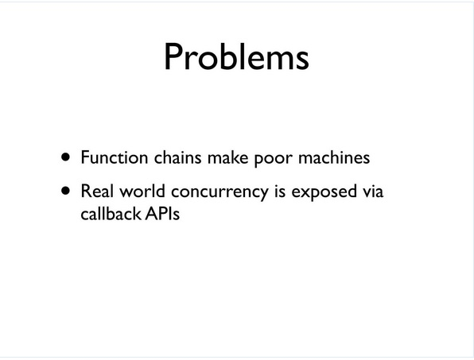

The first problem we're trying to solve is the fact that function chains make poor machines. And if you've heard me speak before about how objects are like little machines and they're not very good for doing logic, functions are like little units of logic that are bad for making machines. And it ends up that because we're moving to this world where people are trying to be more reactive, we have a ton of callback APIs on our hands, and we tend to connect to them with chains of function calls. 

And we're in this situation where we actually need a program that's more like a machine, and we're trying to use tools that are for functional programming to do that, and it's a bad fit. So how do we fix this? 

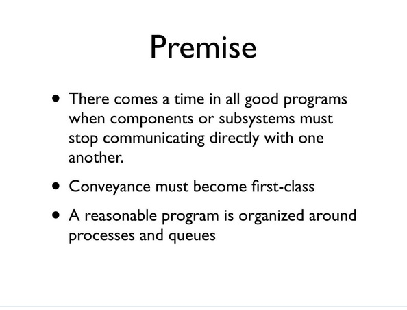

So the idea behind this, and this is something that I've said often is that good programs should be made out of processes and queues. You know, at a higher level, you want to move to queues. And you want to move to queues in particular as soon as you're involved in any kind of conveyance within your application because, at that point, it's no longer nested logic. You're trying to move something from one place to another, maybe from some input through processes in your system that perform calculations or transformations and eventually out somewhere else. That's a one-way street.

So we want conveyance to become first class. We want to organize our programs this way. And we could always do this, right? If we're on the JVM, it already has queues. 

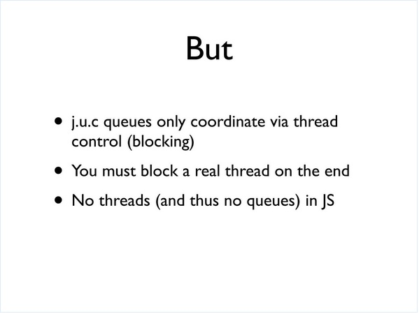

Often people have said, you know, why doesn't Clojure wrap queues? And it's because, you know, there are already queues, and they're perfectly fine. It ends up they're not perfectly fine, and we're going to make them a little bit better with this, potentially. But they're there, and they work. But they do have some problems. 

One is that the only way you can coordinate with a queue, with the java.util.concurrent queue, in other words to wait for data to be present, is to take an actual thread, a real thread and block on the queue. And that has a cost we're going to talk about in a second. Also, if we try to look at the whole scope of platforms that Clojure addresses, which also include JavaScript through ClojureScript, there are no real threads there, and there are no queues there of any real sort. So, using queues directly and looking for queues from the host is not necessarily something we can always do. 

Even when we can do it, there are overheads associated with queues. And people make a lot of this. 

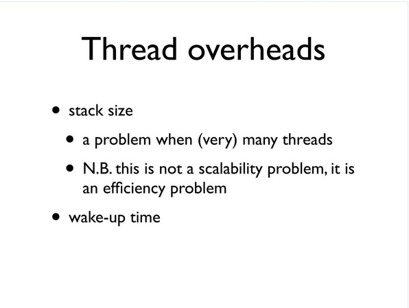

And, in particular, in JVM, there's a definite overhead per thread. I'm sorry, not with queues; associated with threads, which is the stack size. You know, every thread has a pretty big stack, and if you tried to have hundreds or tens or hundreds of thousands of threads, you'd consume a huge amount of memory. There's also wake up time and other, you know, overheads associated with threads.

People will often talk about that as if it was a scalability thing. Scalability is not about what happens inside one machine. It's about being able to add machines or add resources to make things scale. But it is an efficiency problem. Right? Are we making the best use of the machine by using a thread per connection? Oftentimes we're not, so we'd like an alternative to that. 

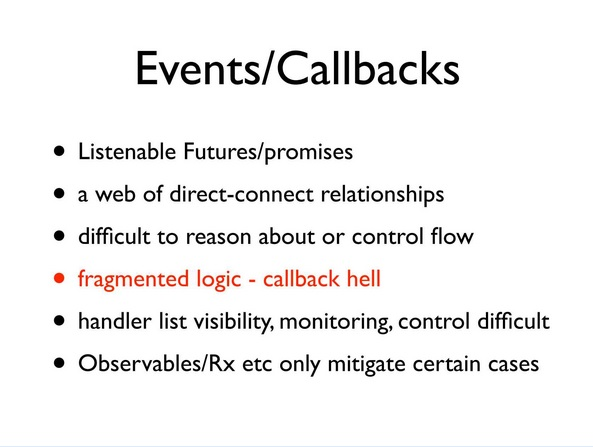

So the -- the API du jour is events and callbacks, right? This is all back, all the ick from a long time ago from UI development is now, like, the way to do everything. We have Listenable Futures and promises and callback handlers and async APIs for every kind of RPC. And, invariably, they expose themselves as these Listenable Futures or some sort of a callback. And what we ended up doing is we put some logic into each of these callbacks that say, you know, on a button click or on a message coming over the pipe, or on whatever, do this stuff, and so the stuff is a little piece of logic that we hook up there. And there are lots of these sources of events, and we end up with lots of pieces of logic. And we end up with this giant web of these direct call relationships, a lot like the kinds of webs we create in object-oriented programs. 

And, similarly, they're very difficult to reason about or to control flow, and everybody understands this phrase, callback hell, and we're going to really look more carefully at what that means and what it's about. But, fundamentally, I think it's about having to break your logic up into little pieces so that those pieces of logic can live inside handlers when those pieces are part of a design or a way of thinking about a state machine or a way to approach the problem that was all of a piece, and the fact that you've divided it up has nothing to do with the way you want to think about the problem and everything to do with the artifact of this mechanism for addressing it. 

And it makes everything difficult. It's difficult to see inside these things, to see which callbacks call, which handlers to monitor them. You know, on what thread are the callbacks going to be run, et cetera, et cetera, et cetera?

And there have been, you know, various approaches to try to mitigate some of this with observables and Rx and things like that, but they only handle a very narrow set of cases, mostly, you know, filtering or making a stream like kind of approach to composable transformations on a single event chain. But if you really are trying to make a state machine that has multiple sources and syncs of events, you can't just get it out of something like, you know, filter and map composition primitives. 

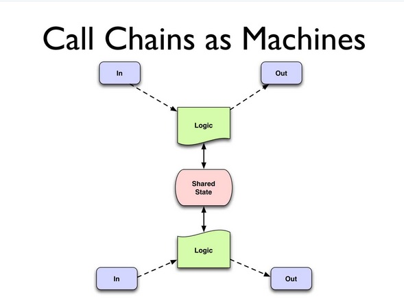

So what does that look like? The problem looks like this, essentially. I mean, I don't care if in and out or queues or external API calls or sockets or button clicks on a browser or whatever. It's just all sort of generically stuff comes from somewhere else that's input. It's outside of your program, and somehow it's going to show up and say, woo, pay attention to me. Right? You have some logic associated with that, which you're going to put in a handler for that. And eventually that logic is going to have to produce something and move it along. 

So at that top part here-- Can I wiggle my mouse over this? I don't know. You don't see that. Okay. Maybe I can point. You don't see that either. 

Okay, up above, the in to the logic and out, those are all function calls, right? The input thing is: on something, you know, call this function. And inside that function, you eventually call, you know, print or send it out or update the dom or some thing like that. And this box is not a whole box because the way you thought about this job may have been a state machine. Maybe you're trying to implement, you know, some algorithm. You're trying to implement some sort of a state machine and, in fact, it involves multiple inputs and multiple outputs. But because you have to break it up into these pieces, you end up with these small, fragmented things. 

And the problem is, if you really did have a state machine model, you had some logic appear that may or may not need to do something in particular depending on something that happened in the logic down below. And how are you going to coordinate those two things because they're both getting separate event streams, and they're both running on each event? And the way you do that, invariably, is having to introduce some shared state. And we all know the kind of party that leads to. 

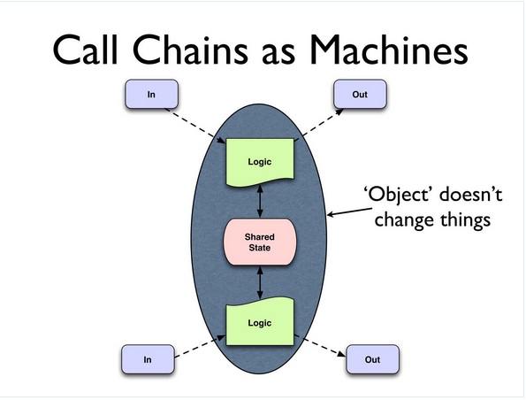

And so objects don't fix this. Right? Objects just put this in a blue oval. That's about--

[Laughter]

That's all that they do. There's nothing, nothing fundamental about what we just talked about is changed by putting it in an object. Okay? Objects are like marionettes, right, where, you know, anybody can pull any string at any time, and you're not going to get an episode of The Thunderbirds out of that. 

[Laughter]

So there are interesting things out there. You know, this happens all the time. Well, what's the problem? 

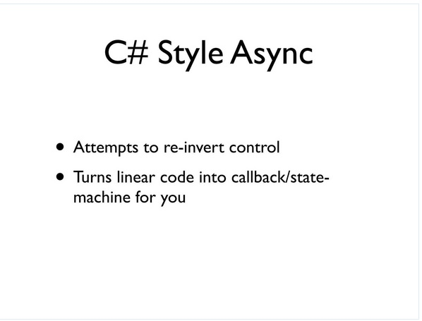

The problem is we had to take what would have been a single thread of control, and we had to break it up into pieces so that we could run it on callback handlers. And, you know, some people have done work in this area already. C# and F# have async primitives, not necessarily oriented around callbacks, but they do something; they are solving the problem of the, what I would call, reversion of control, right, which is that you want to call some asynchronous operation. 

You want to continue to use your thread or give your thread back to a pool and eventually, whenever you were waiting, whatever you were waiting for comes back, somehow resume control. And so the way C# style async works is that it takes code that looks linear, but that calls asynchronous RPCs, for instance, and will turn the code in place into a state machine and actually register that state machine on the callback handler. So your code looks ordinary and linear, and this inversion of control is happening under the hood. 

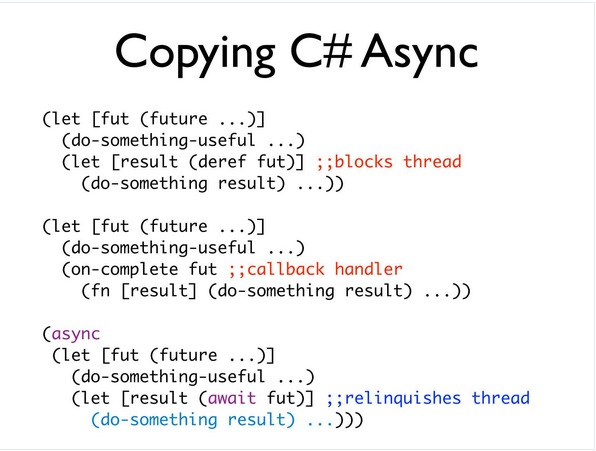

So it's an interesting idea to copy this. I don't know who -- who saw Philipp's Scala Async talk earlier? Good. So it's not a bad idea to think about copying this. And Scala did that, and I saw Philipp's talk in the spring, I guess. And I was like, hmm, that's not a bad idea. We could just copy that in Clojure, and it would look like something like this. And this is not what we ended up doing, but it shows you the idea, right? 

So up top you have traditional blocking code, right? There's some future. The future is blocking. When you de-ref it, you're waiting. You're wasting, you're tying up the thread, and you're wasting resources. 

In the second place, you use something like callbacks, so now you have a Listenable Future, and you'd say: on completion of the future, you know, do this job. And it looks kind of straightforward here, but if you were in the middle of a loop or something else, or you had multiple things you wanted to wait on, this would get really nasty trying to fabricate what the callback handler would be and have a capture of the context of a linear looking program segment would be very difficult. 

So what C# style async does it is says, well, just put that code in some sort of a special construct we'll call aync. And then instead of registering a handler with the callback or actually blocking on it, you'll make a call to a wait, which semantically is blocking. It's like the first; it's like the first code here. But some magic and, in the case of C#, is some compiler magic is going to go and look at this block of code and say: Okay. I see that you're trying to do an asynchronous thing. Let me analyze this block of code. Let me turn it into a state machine that actually can be called back. Let me register that state machine as the callback handler for that future, and relinquish the thread. So the thread is no longer running. 

And what happens is the code that you want to have be the continuation, if you will, of that future is stored away in a blob of a state machine that will eventually be called upon to run on a thread from a thread pool. And that allows you to share, and it's really a great approach to this. It makes for linear code and allows you to use the machine efficiently because you can share this thread pool. You can have lots of these pending, you know, future actions. 

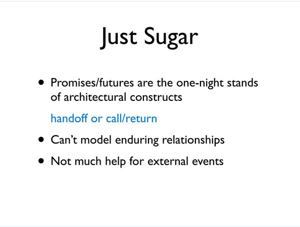

But notice in particular this is really RPC, and that's sort of the problem. You know, I walked away from the talk saying that would be a cool thing to copy, and then like after a weekend, I was like, uh, yeah, because the promise is in futures. It's not actually the first problem I talked about. Right? The first problem I talked about was true asynchrony. Right? Somebody clicks on a button or something comes over a socket. Your code didn't initiate that the same way the code we saw on the previous slide did. That's code that says: Go and do this, and then when it's done, you know, come back. And I want to relinquish the thread in the meantime. 

These things are actually happening asynchronous, so promises and futures are sort of lightweight constructs, you know, that are one-night-stands, right? They're just handoffs or call and return scenarios. They can't really model enduring connections. And so they're not actually helpful for this. So it's sugar. I mean, it's good sugar, but I felt like we should put it on a better cake. 

[Laughter]

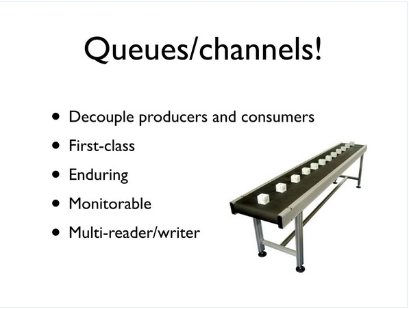

So what do we do? Again, I think that people who are writing production server programs already use queues. This is the way most large server things are decomposed. They aren't a giant, you know, web of direct calls. There are queues invariably inside everything. And they have a lot of great properties, right? They decouple produces and consumers. Right? Who's putting the things on one end of this? Who cares? Who's on the other end? Nobody cares, right? They don't know about each other. Somewhere down there someone is going to take this thing, right? 

They're first class. You know, there's that queue. There's that conveyor belt right there. You can go. You could kick it. Touch it. You can talk about it, name it, bump into it. It's outside. 

They're enduring, right? The person who is on this end putting boxes on takes a break, and somebody else comes up, and the person on the other end is sick today, and somebody else comes out. But this conveyor belt is still there. It's there in spite of people coming and going. Potentially, because it's first class and external and a thing, it's an easier place to hook on some monitoring and supports multiple readers and writers. 

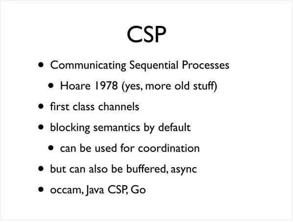

So, of course, there's nothing new to event. It's just a matter of finding stuff, so the thing to be found in this case is CSP, which goes back to Tony Hoare's work in the '70s. Sort of like the parallel track. There's actors and there's CSP. You know, you sort of pick your fight.

So we're going to take this side with core.async and bet on CSP, as many others have. And it has some very interesting characteristics. Maybe not always in the -- not all in the first paper, but over time, CSP has come to represent first class channels as being the only way that independent processes interact with one another. There's no shared state except for these channels. 

The semantics are blocking by default, which means that you can also use them for coordination, which is quite interesting. So it's not just a primitive for conveyance. It can be a primitive that allows you to say, you know, stay here until somebody is ready for me, or vice versa. They can also be buffered and, therefore, allow for some asynchrony between the producers and consumers. And, you know, there's a long set of history behind this: Occam and implementations for Java. And, of course, the most recent rendition that sort of makes this first class and a central point of the language is the Go language, so we owe everything about what you're going to see to all of this prior work. 

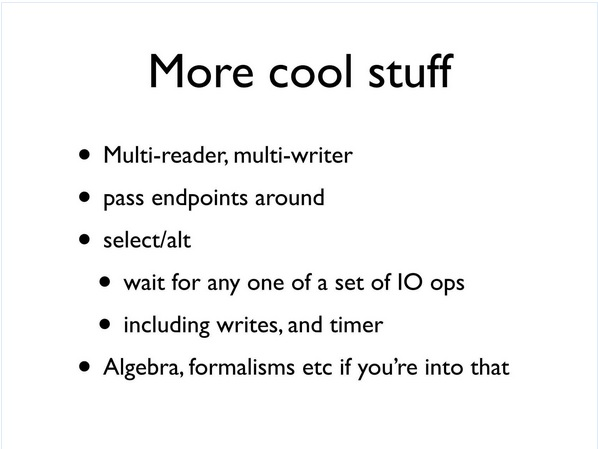

But there are lots of cool attributes to this, right? The multi-reader, multi-writer part is important. You can pass endpoints around as first class things. The other cool thing about CSP and channels is that they support choice via a mechanism called either select or alt depending on what language or what paper you're reading. And the purpose there is that you can wait on one or more of a set of IO operations on channels. Those include both writes, reads, and timeouts. 

In addition, through time and in the academic literature and work, there is formalisms improved some things like that that can be used to help you reason formally about systems built in this style. There's nothing in that area yet done for core.async. So there are already people that have done this. 

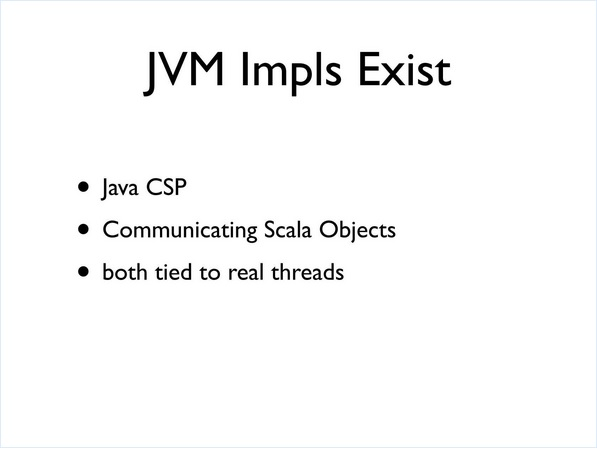

There's a very nice implementation of CSP for Java called JavaCSP. People have tried stuff in Scala. But both of these implementations are tied to real threads. They basically use real threads as processes, one-to-one.

And we want to do something else for Clojure. 

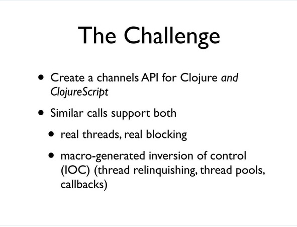

In particular, we want to try to create an implementation of this approach that works both for Clojure and ClojureScript, and that supports both the problem of: I want to use real threads and real blocking, which still has utility if you do not have an arbitrary number of connections you need to support. If you have a small server with a finite number of processes, it can be more efficient and have higher throughput to use genuine threads and real blocking than to force everything to go through the mechanism of a thread pool. But if you are trying to target arbitrary connection counts or work on a platform that doesn't have threads at all, which would be the JavaScript engine, you need something else. 

And so the idea here, if there's any new idea in core.async, it's just to implement this technology on platforms that weren't designed for it. Like if you look at Go, it has a runtime engine that's oriented around this, and to get the more efficient use of threads and thread pools by leveraging the kind of emersion of control technology that was used in C# async, right, because that's what you need to take code that should logically be blocking and instead turn it into data and eventually consume a thread from a thread pool. So that's the idea. 

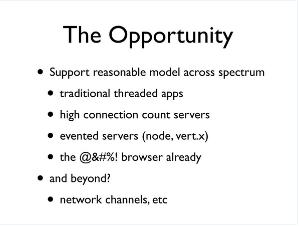

So if we can do this, this is really great, right, because we can deal with traditional threaded apps with low thread counts. We can approach, you know, designs for high connection count servers that are efficient. You can deal with evented server APIs like those provided by Node and Vert, and, you know, we can finally try to make some sanity in browser development. Not targeted currently by core.async is anything to do with extending this over the network. 

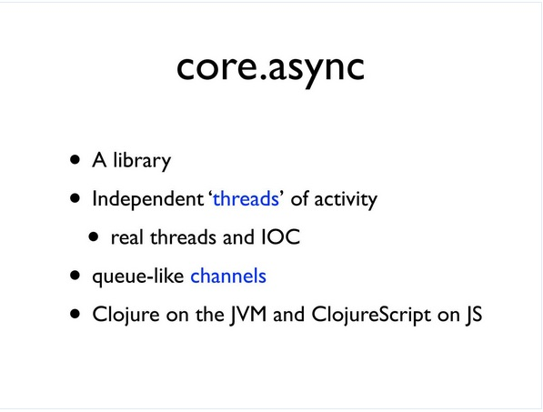

All right, so core.async itself, what is it? It's a library. It's about fundamentally coordinating between processes using channels. But the processes you can think of as independent threads of activity. They may be real threads, or they may be these inversion of control threads where you write code and it looks like it's doing X, do Y, do Z in a row and blocking in the middle. And that process is turned into data whenever the blocking occurs, and the real thread is relinquished, so we'll call those inversion of control threads and, you know, threads like this. 

But logically they're threads, and the semantics are the same. We want the semantics of threads and the semantics of blocking in all cases because it allows us to write linear code. And then we'll connect these things with these queue-like channels and target both platforms. 

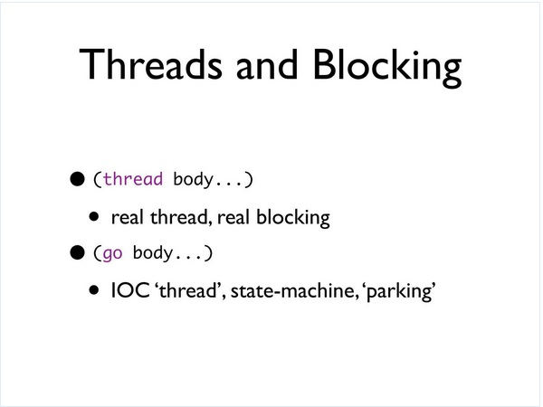

So the first thing you need to be able to do is create a thread or create a process, and there are two ways to do it. There's the thread call, which is a lot like the future call, except this could tap into different thread pools and is clear about what you're doing. When you say thread, you get an actual real thread. And when the use the APIs within this thread, you get real blocking. So it's not quite as -- you can't create as many of these arbitrarily as you could with the next ones, but when you want real threads and you know what you're doing, you can get high throughput with something like this. 

And then we have Go. And Go is the same kind of thing. It creates a logical thread. It runs the block inside of it in this mode whereby if you issue any blocking calls, this mechanism will come into play, create an inversion of control state machine out of your code, and register it on the handler for the asynchronous callback. So we're going to talk about that as a thread where blocking we're going to call parking, which essentially relinquishes the thread and takes the code and parks it somewhere for its resumption later. 

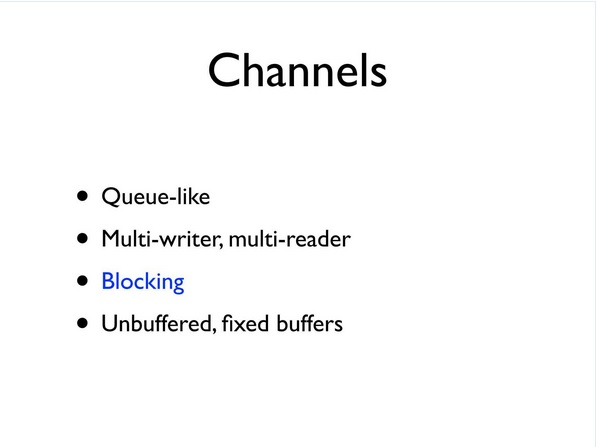

All right, so channels themselves, what are they? They're like queues, right? A queue, you put something on one end; you take stuff off the other end. That's it. That's what they're about. Put stuff in one end; take stuff out the other end. You can have multiple writers. You can have multiple readers. 

Fundamentally, channels are blocking, like if you don't touch them or do anything else, they're blocking. That means that if somebody comes into read and no one has written anything, it waits. If somebody comes in to write and no one is waiting to read, the writer waits, so they block on both sides. They can be -- I mean, by default, they're unbuffered. We also support some fixed buffering, so I'll talk about that in a second. 

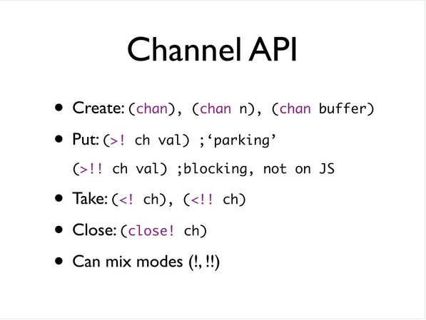

So the API is pretty straightforward. You create a channel with chan. Chan, with no arguments, creates an unbuffered channel, which is essentially synchronous, rendezvous, you can say chan with N, which gives you a buffer of that size, or chan with a buffer and there are a couple of API calls that allow you to create buffers. 

Then we can put with -- put, that's how we read that: right arrow, bang (>!); right angle, bang (>!); and that's the parking variant. All right. That's the one that will park the thread. It must be used within a Go block. 

The other variant is the double bang (!!), and you can read those as blocking. Put blocking and all those flavors, and this will go throughout the API. If there's a double bang (!!), it's a blocking call. You read it as blocking, so put blocking, and none of those are available on ClojureScript, on JavaScript, because there are no threads to block. 

Similarly, there's take and take blocking and closed. What's really useful about this, if you're using it on the JVM, is that you can mix and match these, so you can have a bunch of Go threads, and you can have actual real threads. You can make blocking calls and parking calls on the same channels on different ends of the same channels. It all fully interoperates, which can be extremely useful. 

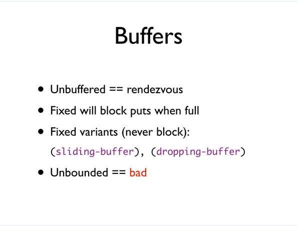

So the buffers themselves, again, normally we're unbuffered or, by default, we're unbuffered. And that acts as a rendezvous, like I said. Readers wait for writers and vice versa. If you supply a fixed buffer, you use N of some value. Then writes will succeed right away until the buffer is full, and then the writes will block. You know, block like this. 

And then there are two flavors of buffers that will never block a writer because they've incorporated a policy about what to do when they're full. And one is a sliding buffer, which effectively walks across and drops the newest stuff, and a dropping buffer, which is, if you come to it with new stuff and it's full already, it just drops whatever you send. And they will never block the provider. 

What we will not, we do not provide and will not provide are unbounded buffers. This is just a recipe for a broken program. It's just like, I don't feel like seeing this bug until later, so I'll make an unbounded buffer.

[Laughter]

I'm not going to help you do that. We've already probably rejected the patch request a couple of times and we'll keep doing it. I mean, just, hopefully people will get tired of submitting it.

[Laughter]

Just don't do it. I mean, what's beautiful about this is that you can establish a policy. Eventually we'll have a recipe for providing other policies with more sophistication but, you know, make a decision. You need to make a decision here. You can't just have stuff piling up all around in memory and not be thinking about it. So it's a value proposition of CSP and of core.async that you're thinking about these things and making choices. 

So the other cool thing, extremely cool thing about CSP and about channels is the fact that they offer choice. 

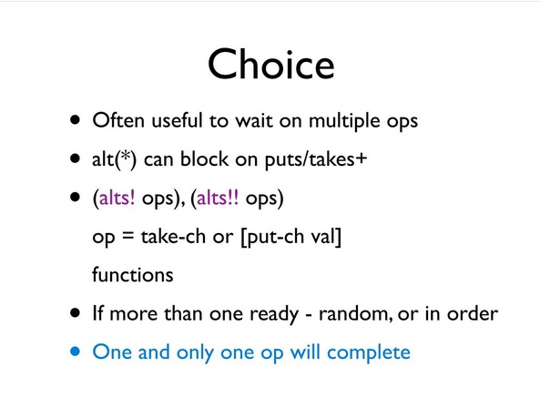

So it's quite frequent that you want to make, you want to put a state machine in particular in a state where it's waiting for one or more possible activities or operations to succeed. And that can be a really difficult thing to do. That's something, for instance, that none of the Java queue primitives support at all. Windows has some nice primitives for wait on multiple things, but Java does not. Obviously sockets do have select and whatever.

So alt and the two flavors of alts are functions that take a set of operations. An operation is one of two things. If it's just a channel, it means try to read something from this channel. If it's a vector with a channel and a value, it means try to put this on a channel. And alts will return whenever one of those things becomes ready to complete. 

By default, it will be random. There's also a priority option that will let you say try them in this order. What's really important about the choices that one and only one operation will complete, so you're going to ask for, you know, let me know when any one of these things has happened, but only one of them will happen. It will be as if all the other pending requests that you made were cancelled, and you just got the one thing. And you get a return value, which indicates, in the case of take, it's just the value. And in the case of take where you had multiple channels, it's going to tell you which channel actually succeeded and what the value was. In the cases of put, it's just going to be like, okay, that worked. That channel put worked. 

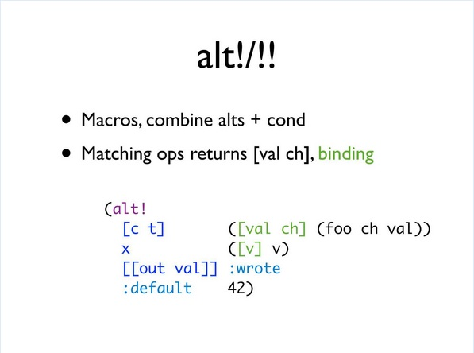

And then there's a macro that combines this function with cond, you know, with the logical branching. So basically you say alt, bang (alt!), which is not a functional. This is a macro. And you supply one or more sets of operations you want to attempt. Right? The whole set of operations is going to be tried sort of in parallel, and the first thing that's available to complete will be the result of the condition. So we have -- I think I have arrows here. Let's see. 

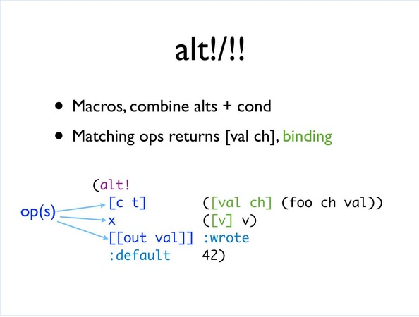

So we have the operations themselves. The first two are reads, try to read from C or T, or try to read from X, or try to put this val to out. Or if none of them are ready right now, just return 42. 

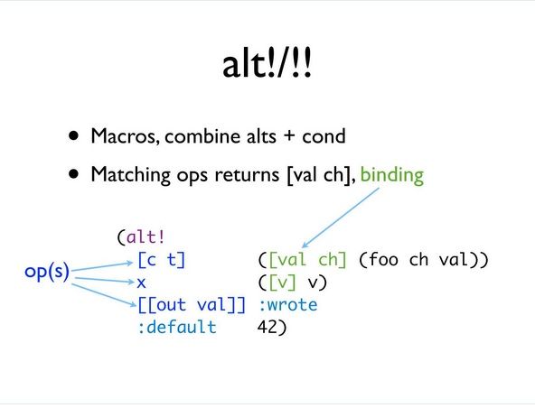

Then we have expressions, right, which would be the result. If C or T returns a value, then we want to grab that value and call it val and grab the channel that actually succeeded because it could be C or T, and call that CH. And then we'll call foo with those two things. So we have a binding and then some expressions. 

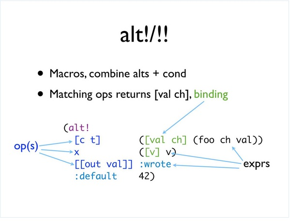

So this is, you know, a macro that is an expression. It's not got all the, you know, gook of Go with the statements. And it will return one of the values, so you're going to try multiple operations, and you can have a default if none of them are ready. Otherwise, you'll block waiting for one of them to succeed. You can get the value that, you know, you desire as a result of that particular operation succeeding. So it's like alts plus cond.

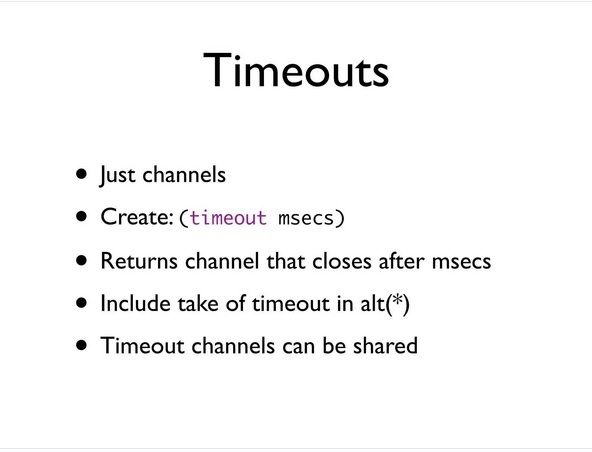

So how do you do timeouts because a lot of times what happens is you're setting off all these blocking things, but you don't want to wait forever? What's really cool about Go is that they decided to make timeouts channels themselves, and that's a really good idea, so well worth copying. So you just create a timeout by calling timeout with the number of milliseconds. You get a channel that closes after that number of milliseconds. So you can put that into an alt, and what will happen is either you're going to get something from the thing that's not a timeout, or the timeout will close, and that will cause your alts to have a completed operation, which is the closing of the timer channel. 

But the cool thing about it is that timeout now is a real thing, as opposed to how many people like putting timeouts in API calls? Yeah, that stinks, right? Especially if you tried to coordinate multiple things or you're just not sure how long to wait, or you were trying to do stuff in a loop where you have to keep trying things, but you're trying to have an overall counter go down, so you have to keep recalculating that timeout to smaller, smaller, smaller, smaller. 

And now you can just create a timeout once and say I'm going to try all this stuff in a loop for three seconds. You create a three-second timeout, and you keep passing that same thing into every API call, the same one, because it's either going to complete or not. And you can just reuse it, so you can share them, which is very powerful.

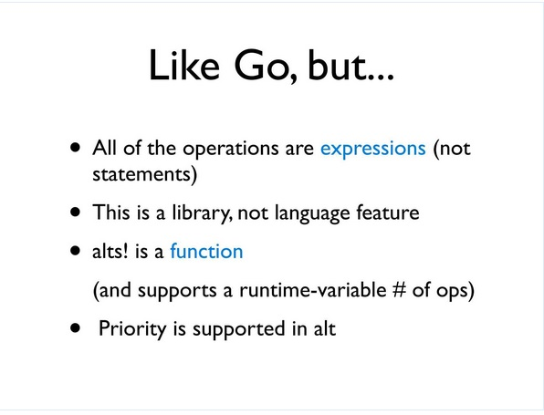

So obviously if you know, Go, this is very similar. It's like Go, but the things that are different are all of the operations, everything I've shown you, they're all expressions. It's for a functional programming language. There are no statements. You don't need to have states that start interoperating with channels because channels are a state mechanism already. It's a library. It's not a language feature. It uses macros to do what it does and the macros are quite interesting, and we'll have to have other talks about those. But the Go macro is the thing that inverts to control and sets up the state machines for you. 

The other thing that's interesting is that alts is a function. You can map it. It's variadic. It supports a run time variable number of operations. You can't say that with any construct in Go because they're all statements. And we support priority.

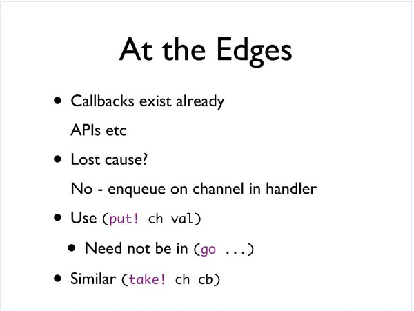

So how do we integrate this into our world, right, because we're not going to get everybody to change their APIs to use channels, right? They already use callbacks. You know, are we doomed? And the answer is no. Right? The trick is, as soon as you're in a handler and something comes in the handler, just put it in a channel and that's it. You should be done. Don't put anything more there. 

So we actually have, because the operator is the put, like the right angle (>), yeah, the right angle, bang (>!), put can only be used inside Go, and you're not in a Go block in this event handler. Right? This is, like, on a mouse click. That wasn't in a Go block. 

What do you do? We have two calls, put! and take!, which can be used from outside of Go blocks that are asynchronous and will just then queue the request and return right away. And it's sort of an entry point from the edges of your system into the channel based system, so you're talking about a process that wasn't part, you know, wasn't really a CSP process has got some input. You use put! to introduce it into this system. And there's a similar take!, which reverts control. This is the way to get out, for instance in JavaScript, and get a callback back. 

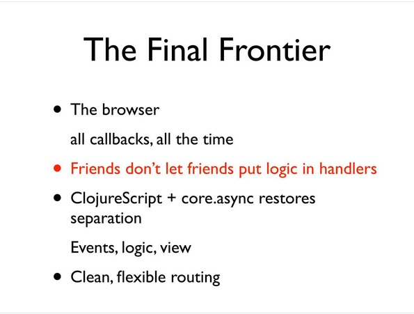

So speaking of JavaScript, so what do we do there? You know, this is the browser. It's just all callbacks. It's 100% callbacks. And again, this is totally fine. Everything I'm showing you is everything about the Go blocks, not the ones that, not the thread ones. It all works in the browser, all works in ClojureScript. If you read David Nolen's posts about this, he's doing fantastic things that are exactly what this was designed to do. Right? You just revert control immediately in your handler, right? Don't put any logic in your handlers. Just take the event, turn it into data, put it on a channel, and be done with it. And that will let you put your world right side up. 

So it's just a way to restore the separation of concerns, right? Instead of fragmenting your logic and building all these little pieces everywhere, you keep your logic together. You use these bridges from channels to get stuff to route through. 

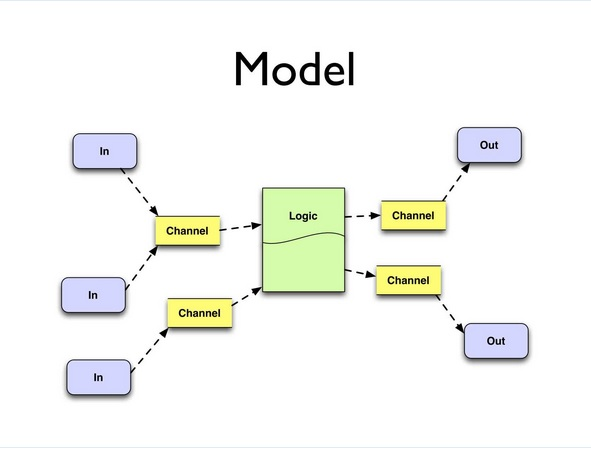

So the model essentially looks like this, right, in contrast to the first one that you're going to just take inputs and put them on channels. You're going to have your logic all together. It can consume from multiple channels. It can put on multiple channels. It can coordinate with other logic and other instances of the logic because it's many to many. But it's all together, and it puts it on channels. And eventually those reach the outside world. 

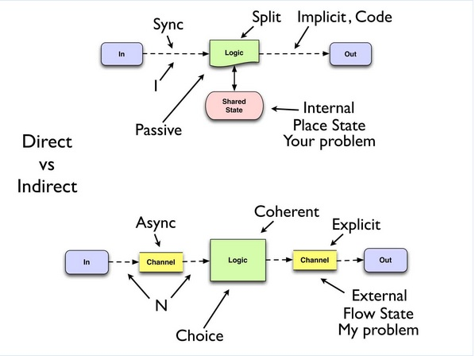

And so the super critical thing is this part of the talk, okay, because we have two solutions here that, on the tin, right, they're the same. These let you efficiently do asynchronous programming. It's like, great. It's a feature. Awesome. Dude, let's go do it. Right? But they're really, really different. The characteristics are completely different, so it's a battle.

Direct versus indirect, right? So how many differences can you see between these things, except for some colors? It looks like, you know, it looks like more of a hassle, right? I have five things down here. I have four things up there. Always a bad measure.

So what happens to your logic in the direct system? It's split up into tiny pieces and spread out through callback handlers. In an indirect system it's coherent. Right? It's all together. It's linear. Right?

What happens on your callback? It directly calls your logic, which directly calls the output. It's all this big chain of fire, fire, fire, unless you manually introduce some more asynchrony. Right? It's synchronous. Right? Channels can be synchronous or not, right? We can set them up with no buffering and actually cause workflow and backpressure waiting, or we can add buffering and get some more asynchronous, asynchrony there. We still have choices in the logic itself, right?

What's the airity of the callback to the callee? It's built in. It's like you gave them a piece of code to call. They call that code. It's the one-to-one. A button click calls the thing. On socket calls the whatever, right? It's end-to-end here, right, with asynchrony. How many people can feed this channel? As many as you want. How many people can consume it? As many as you want, so you can share the work. 

You can have multiple sources. You can do routing. You can create these relationships dynamically. You can pass the channel to talk dynamically. This other stuff has got code. I made code, and the code has got like what to call up above, right? So that's all implicit.

Where am I going from here? It's like inside this piece of code. Where am I going from here? I don't know. I mean there's going to be some code that wires this stuff together, which I'm going to be able to see and think about and cooperate with and possibly manage dynamically, something you can't possibly do in the other scenario.

Where is the shared state? Well, sort of an internal implementation detail of whatever you had to do to try to make your state machine cross multiple callback handlers, which is usually just a real incredible mess, right? 

Where is it here? It's external. It's not like there's no state, right? There is state. Of course there's state. It's a big machine, right? It moves stuff from there out the other side. But in the top we're making function calls, but how do we know we're using function calls wrong up top? 

[Inaudible comment from the audience.]

Right, we -- functions calling functions calling functions. There's nothing wrong, right? That's a call chain. We do that all the time in functional programming. But what else do we also do? We pay attention to the return values, right? Function calling function calling function, getting the return, using it, getting the return, using it, getting the return, using it. It's fine. That's function composition to have a stack of functions serve an algorithmic purpose. 

That's not what we're doing up top, right? We're shoveling stuff across functions, ignoring the return values, and trying to spew stuff out into the real world out the other end. 

So having the state be external is totally fine. It's now clear that there is state. And I think this is very, very interesting, right? These states are different, right? The shared state that you have between two pieces of logic in order for them to communicate with each other is going to place state. It's going to be -- I put something in there, you know. I squirreled away some acorn so that either when I come back or if this other handler comes in, they know that I'm in the middle of doing this, and they should not do that. Or, you know, we've got six of these, and we need four more before we can proceed. 

There's going to be the shared state, which is a set of places that you're using to update things. But I think what's really cool about first class channels is that they expose a subset of state, and it's a very interesting and far safer one, which I'll call flow state, right, which is just about all you can do with this kind of state is put stuff in it, and then you really don't know anything more about it. Or you can take stuff out of it, and you really don't know how it got there. 

And the analogy I'd make is, you know, let's say you work at a factory, right? And you get into the factory, and you have your jacket. Right? And you're going to do something with your jacket. Would you rather hang it on a coat hook, or put it on a conveyor belt that's moving, or dump it down a laundry chute, or put it in the back of the UPS truck that's about to leave? 

Well, it's quite -- there's a difference, right? Those are all places to put your jacket, right? But what is it about the coat hook? You expect to go back there at the end of the day and see your jacket still there. Of course, if there are only a few coat hooks and there are a lot of jackets, you have this contention problem because it's a place. But you would never put your jacket on any of those other kinds of places, states, because you know they're flow. 

They're going to go away. It's going to go on a conveyor belt. It's going to, you know, somewhere else. It's going to go down that chute and you can't recover it. The UPS truck is going to drive away. And that's good because you can't possibly have your life depend on going back and seeing the same thing there again. So it's not really like state the way shared state and place oriented state is. Flow state is much simpler. It's much easier to reason about and much safer because you do not have this expectation of coming back.

Then in any case, if you're running any of these things in an environment in which not only is there, you know, cooperative concurrency, but there's actual, real, simultaneous concurrency, then any kind of state, whether it's a channel or the shared state there is going to have to have some coordination, right, so we don't all step on each other. But in the first case, whose problem is it? It's your problem, right, that coordination. Getting that thread safe is your problem. 

In this problem, in the bottom case, it's my problem, right? It's the core.async library problem. And once we get it correct, I think we've already gotten it correct, but it's correct for everybody. It's correctness is shared by everyone. So which do you want? 

Also, the logic: When do you decide to handle an event that comes through a callback handler? Pf. You don't decide, right? You're, like, you're just passive. You get called whenever you get called. 

When do you have it when you have channels and alt? Whenever you choose. If you don't want to go read that channel right now, don't do it. If you think it's more important to read this other channel or to write to these channels or to wait for ten minutes or to go ask somebody, you're not a passive recipient of control being driven from an external event, unless you've chosen to do that. Right? 

So I think the problem I labeled first is the one I want to call out now, right? This first thing is using code as a queue. Call to call to call to call. When we should always be using data. Again, it's one of these things. We never make this mistake when we go over wires. We never make this mistake. When we go over wires, we don't. The reason is because we can't. 

Wires don't let us make function calls. We always have to turn it into data, put it in a buffer, queue it, shovel it over, de-queue it, do whatever. Maybe we'll map it again to a function call and we'll recreate RPC, but there's no RPC. Wires don't do RPC. They're not code. They don't have entry points. You can't invoke them, so we never do this, but it's a good example of another thing that when we bring it inside, we make this mistake. And when we're shoveling stuff around inside our programs, it's not different than when we're shoveling around between boxes. It's not different. It shouldn't be. It shouldn't be a different way to think about it.

So there's a sense in which the direct callback approach is intimacy, right? It's making pieces aware of the other pieces. Right? The callback event knows who to call. The caller knows where it goes next, and it's all code. And there's a sense in which using channels in this indirection is ignorance. And we all know that ignorance is bliss. 

[Laughter]

And it ends up that, in systems, it's also; it's also bliss. 

[Laughter]

At least in systems.

[Laughter]

Intimacy is pain. This is where the pain comes from. This is why. This is why it's painful.

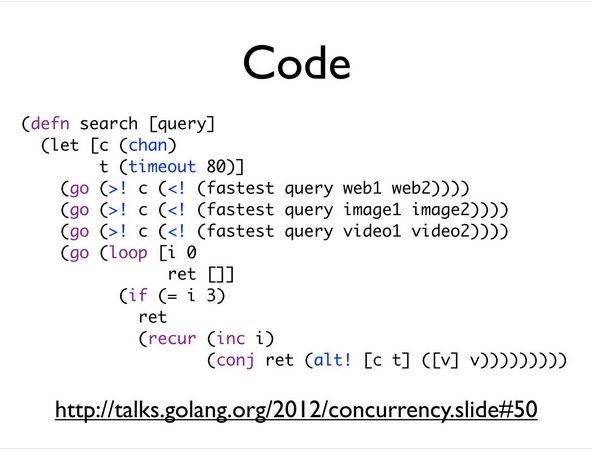

So here's a little bit of code just so that I don't just show ideas on the screen and get complained about. So code, this is a great example from Rob Pike's examples for Go, and it's just nice because it shows everything. I'm not showing the supportive code, but the basic idea here is that you've got a job. You're trying to do this search. You need to come up with a web, an image, and a video result for it. You have a couple possible sources of these answers. They may reply at different speeds. You want to bound the amount of time that you're going to take to do this entire job to 80 milliseconds. You want to try to get everybody to do the job and take the first results you get and get out.

So the function fastest takes a query and, you know, two sources, right, two URI endpoints that it can call. It's going to create a channel. It's going to set off Go processes to go and attempt to do that RPC with each of those web servers and get an answer. And each of those callbacks are going to go and take the answer they get and put it on that channel. And then fastest is going to return the channel. So essentially you can read this as: set off two processes racing to put an answer on a channel and return the channel. 

And you do that similarly for the images and similarly for the videos, so we end up with three channel results, right? And we're going to set off asynchronous processes that are going to go and say: Read from that channel, then put it on this shared channel. So, and it's going to do one, right? So that read and then put back, that's the RPC kind of thing, and there's no -- you can build, right, that C# style async RPC stuff out of channel read and channel write like this, and it's a common idiom, right? 

So it's going to read each one and put it on there. And then we have a loop. And the cool thing is that this loop, it doesn't know where this stuff comes from. It's just been told there are going to be three answers on this channel. Don't spend more than 80 milliseconds trying to read them. 

And that's what it does. It goes through it. It makes an alt call, and it says: Try to read from the channel or time out. Take the value and just add it to the vector. So this vector is going to return up to possibly three results or nils if no results are available, but it's going to be done in 80 milliseconds no matter what. Given that spec for this is the job you want to do, that'll be really hard to write without stuff like this. 

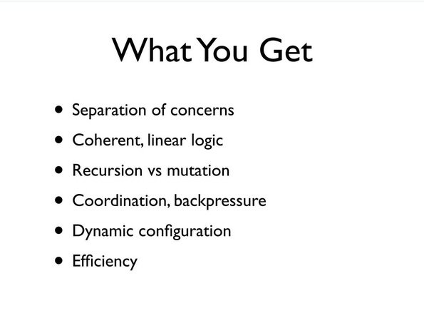

So what do you get from using this kind of technology? You get a separation of concerns. You get it back, right, because you've lost it. You get coherent and linear logic. You move away from mutation. If you have a state machine inside your process, you can implement that using recursion instead of having to create internal state with traditional measures. 

You get coordination possible. You can get backpressure with this, which is quite useful and difficult to get otherwise. You can dynamically reconfigure these networks, and you can use your thread pools and your thread resources efficiently. 

So I'd just like to thank the guys that helped me work on it, and particularly Timothy Baldridge did the Go macro inversion of control stuff, and it's really cool. And when he talks about it at some conference in the future, make sure you catch it.

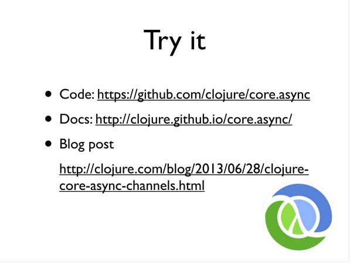

So this is where you can get the code and try it out. It's on GitHub. This doc is there. There's now a maven artifact for it, and there's a blog post that describes it more, but that's it. Thanks. 

[Applause]