# Datomic Ions

* **Speaker: Rich Hickey**
* **Meeting: [Clojure/nyc](http://clojure.nyc) - Sept 2018**
* **Video: [https://www.youtube.com/watch?v=thpzXjmYyGk](https://www.youtube.com/watch?v=thpzXjmYyGk)**

[Time 0:00:00]

Thanks everyone for coming and AppNexus for hosting.  Can everybody
hear me OK?  Great.  Well I can see my screen and now I cannot see
you, so I guess that is ideal.

I want to start by seeing where everybody is at.  One of the
challenges as Clojure grows is no longer talking to people who know
absolutely nothing about it, or other things.  So how many people use
Clojure?  At work?  OK.

How many people have tried Datomic in any form?  How many people have
used Datomic Cloud?  Oh.  OK, cool.  How many people have never heard
of Datomic, or do not really know anything about it?  Not too many.

I will not spend too much time on Datomic first principles.  I will
try to get into the Ions part, which is why I am here.

And how many people are on the cloud?  Their apps are on the cloud,
hosted on AWS, or Google, or something like that?  How many people are
not?  How many people are opposed to the cloud?

[laughter]

It's a thing.  It's all right.  OK, good.

[Time 0:01:30]
```
slide title: Datomic

Databases are a prime source of system complexity

+ DB as a (succession of) value(s)
+ information model
+ Universal relation
+ flexibility
+ Immutability as leverage
```

Let us talk about Datomic a little bit.  And so on each of these
things I think I tried to say what the problem was that we are trying
to solve.

So with Datomic we are trying to solve the problem of: databases are a
source of complexity at the system level.  They are the big giant
global variable that is in the middle of your system.  And it does not
matter if you are using functional programming language, or languages,
all around it.  You have this problem with traditional databases that
you cannot reason about them.  So Datomic is pointed at that, most
generally.

[Time 0:02:07]
```
+ DB as a (succession of) value(s)
  + vs a place
  + simpler
  + facilitates understanding
```

And the idea behind Datomic was to give you, as a programmer, a view
of the database as a value, or as a succession of values, so that over
time you can look at any value of the database at a point in time.
And to break away from this database as a place.  And this is super
important.  It is fundamentally simpler in the trademarked simple way.

And it is so because you can start to understand how your database got
to be the way it is.  When you just have places, you discover some
squirrel in your cupboard, and it is like, "Who put that there?"
Fifty transactions ago, something happened.  So we want simpler
systems, so we can think about them.

[Time 0:02:58]
```
+ information model
  + simple
  + transactional
  + flexible
  + hierarchical
  + indelible
  + chronological
  + queryable
  + SQL? No
```

There is a lot to the Datomic information model, and I am not going to
talk about it at all today, except to run through these "al"s.  So it
is simple.  It is transactional.  So we do have transactions.  It is
flexible, and that goes somewhat to the way we represent information,
and I will talk about that in a second.

It also supports hierarchical data well.  It is indelible.  So we do
not forget anything.  We keep everything that you ever said, unless
you explicitly go out of your way to tell us to remove it.  It is
chronological, in that it has a notion of the time that things
happened in the database.  And it supports query.  So it has all these
"al"s.

I would also say I left out here that an important part of Datomic is
that it is programmable.  That it uses data structures in the way we
tend to do in Clojure, so that you can write a program that writes a
query, or write a program that generates a transaction.  That kind of
programmability is really big.

[Time 0:03:58]

The one "al" it does not have is SQL.  And I think if that is driving
your choices -- if you you need compatibility with that -- Datomic is
just not going to do that for you.  It ends up that it is a relational
system, but it does not have the SQL language.

[Time 0:04:16]
```
+ Universal relation
  + EAVT
  + reduces coupling to table/view definitions
```

So it is a relational system, but it has essentially one relation:
EAVT.  Entity, Attribute, Value, and Time.  If you ever worked with
RDF or anything like that, there are triples.  So this is like triples
plus time.  And in this way you can have different versions of facts
over time.  So today you like pizza, tomorrow you like ice cream.  And
you can switch between those two, but it does not change the fact that
today you liked pizza.

And I think an important aspect of the universal relation, which again
is about building loosely coupled systems, is that it makes for
loosely coupled systems because you do not marry the definitions of
tables.  I think that one of the things we have going for us in
Clojure, and it is a value proposition that is carried over in
Datomic, is that: when you say X, Y, and Z go together, and it is
called foo, and the only way to really talk about X, Y, or Z is to go
via foo -- and here foo would be maybe the definition of a table in a
traditional database -- that mapping, that saying, "well I know where
X is.  It is in foo" is something that is introducing some brittleness
into your system.  You have a sense of where things are.  Even if it
is not an update-in-place database, the idea of tables being a kind of
a place introduces a kind of coupling in your system.

So I really do not like coupling.  And we are trying to reduce that
here.  But getting a sensibility around seeing that, I think is
important to really appreciate Datomic.

[Time 0:05:57]
```
+ flexibility
  + hierarchy
  + sparseness
  + cardinality
  + relationships
```

And then a big value proposition of this universal relation is: it is
flexible.  If you have sparse data, or hierarchical data.  You want to
have something that is a member of something else that has many
things, these are not complicated.  They do not involve the creation
of an intersection record, or anything like that.  And I think as
Clojure people we maybe take all of this for granted now, this kind of
stuff, but it is not common.

I would also contrast Datomic with document stores, where they sort of
will tell this story about being sparse and hierarchical, and things
like that, but they have that same marriage of structure that tables
have.  If you need to know that this thing is in this document, under
this, under that, under that, and that is where we kept it.  That is
another kind of place.  And that introduces brittleness in your
system.

In Datomic we can form those trees.  You can just pull up on any point
in the graph and get a tree that looks like that.  But you could pull
up on a different point in the graph and get a different tree.  You
have not married a particular organization.  So we want that, and that
makes for a flexible system.

[Time 0:07:16]
```
+ Immutability as leverage
  + replicate data/query while minimizing coordination
```

And the last part, which is going to carry through the rest of the
talk, is one of the things I was trying to accomplish with the design
of Datomic was to get more leverage out of immutability.  Datomic is a
big, very big, persistent data structure that is actually durable.  So
it is persistent in the way the Clojure data structures are in memory,
and it is also persistent in being durable, enduring on storage.  And
I mean that in the same way that Clojure data structures are, in that
it is immutable "for reals".  It is not "as if it was immutable".

[Time 0:07:55]

Because it is immutable for real, it means that you can relentlessly
copy stuff around.  You can take nodes in this big tree -- and it is a
persistent data structure like the ones in Clojure in memory -- it is
a big tree of nodes, all of which will never ever be changed again.
And that means that you can freely make copies of them, and they do
not need to be coordinated.  They will never be changed.  There is no
coordination necessary to deal with updates, because updating does not
happen.  That means that you can move the data around.  You can get it
to different places.  And therefore you can locate things like query
in different places with a lot less coordination than is incurred when
you try to set up a traditional database with a replication strategy,
where you are actually sending the changes around, and trying to stay
in sync with changes.  That is the gist of Datomic.

[Time 0:08:54]
```
slide title: Cloud

Computing infrastructure is not a core concern for many orgs

+ IaaS reliability, security
+ Pay for what you use
+ On-demand provisioning
+ Elastic scaling
+ Flexibility
+ Focus
```

What is the cloud about?  I did not write the cloud, so I am speaking
for other people.  I hate that phrase "the cloud".  It sounds like a
superhero.  Like a not very good superhero.  Like "Oh, The Cloud!"  Do
we need to worry about that?

There are a lot of attributes, but if you are trying to say what
problem they are trying to solve, the problem it is trying to solve
is: who cares about this stuff?  Who wants to run machines and figure
out if they are working, and switch out network cards, and deal with
hackers, and blah, blah, blah?  That is not most people's business.
It is some people's business to do that.  When I say it is not a core
concern, I do not mean that you do not care about it.  I mean it is
not what you are about.  Your organization is not about this thing.

How many people have ever been somewhere where you were dominated by
keeping your infrastructure going?  That was a big part of your life?
Yeah, and it is not what the company is trying to do.  Also, I do not
want to buy computers any more.  I do not want to run data centers.
There is a bunch of that.  But I think this is the big point.  This is
not what your company or organization is about.  Therefore let us go
to somebody who can provide it as a utility.

[Time 0:10:10]

So there is infrastructure as a service.  I think it can do better at
reliability and security than most people can do for themselves.
Obviously there are big shops with a lot of expertise who can do great
things.  I am not trying to diss your personal expertise, but most
people are better off letting somebody else do it.  Just like they are
better off letting somebody else generate power.

Other characteristics that are useful is that you pay for what you
use.  You tend to pay for what you use.  There are obviously lots of
flavors out there.  This idea of more utility consumption is a big
thing.

Another thing that is a sharp contrast to "do it yourself with actual
pieces of hardware" is this notion of on demand provisioning.  How
many people have ever worked at a big company where if you wanted a
new computer, you had to fill out a form and wait months and months
and months.  This is not like that.  This is just: give me more
computer.  Just ask for it and you get it.

And I think that that works in multiple directions.  At least,
depending on how auto scaling works in the cloud that you are in, this
notion of getting stuff on demand, and getting more of it when you
need it, and actually getting rid of it when you do not need it, I
would characterize as being elastic.  That is also an important
characteristic, and a value prop of the cloud you want to pursue.

Overall, the idea here is that you have a lot of flexibility.  Before,
anything you wanted, you had to commit to.  Oh, you want new
computers?  Great.  Decide right now what kind of computer you want to
have for the next five years, because I am not getting you another one
for five more years.  Decide on what kind of network card you want,
and decide, decide, decide.

[Time 0:11:57]

Now you can sort of put things together, try them out, resize things,
experiment with new technology.  As new services come on, you can take
them on and try to use them.  And that increases your flexibility.
But again, the theme of this talk will be: by having this, you are
able to focus more on the actual problems of your organization, the
business you are trying to run, the things you are trying to do.

So I am a fan.  I do not think it is perfect.  But I think this is,
again, as inevitable as the transition from creating your own power to
having utilities for that.  Of course, then, Google and Amazon
generate their own power, so it goes around in circles.

[Time 0:12:43]
```
slide title: Datomic Cloud

Maximize leverage from deep platform integration

+ Datomic on AWS Marketplace
+ Security
+ Datomic manages all AWS networking,
+ AWS AutoScaling for availability
+ Storage hierarchy
+ Per-instance-hour pricing
```

So we had Datomic.  Datomic was something that you could run on your
own behalf.  It has not gone away.  It is now called Datomic On-Prem,
for running on your own behalf.  It has the traditional kind of
licensing model.

With Datomic Cloud, I think we are trying to accomplish some more
things, more than we could do by giving you software to run on your
own behalf.  And if I had to boil it down: what problem are we trying
to solve?  We are trying to solve the problem of maximizing your
leverage.  If we could give you deep integration with the platform,
could we maximize the amount of leverage you would get from having
done that?

So there is a sense in which, when we give you software to run on your
own behalf, it is sort of the end of our ability to help you.  Now you
have to go -- well, maybe you have to go ask for a machine and wait
three months so you can run it somewhere.  I hope not.  But even if
you chose to run it on a cloud, it is still a kind of software that
does not necessarily know that you are doing that.  We always
supported cloud storages like DynamoDB, but there is a limit to how
much we can help you.

[Time 0:13:58]

And here the idea is: if we made a version of Datomic that was deeply
integrated and knew where it was running, how much more leverage could
we give you as a user?  We will see that that gives you benefits in
Datomic itself, and then this new benefit, which is Ions.

[Time 0:14:20]
```
+ Datomic on AWS Marketplace
  + no leverage from lift and shift of data center software
  + nor much from cloud-neutral strategies
```

So what is it, exactly?  It is Datomic running on AWS.  It is not a
multi-cloud thing.  It is about AWS.  It is about deep integration
with AWS.  It is available on Marketplace.  So you go to Marketplace.
You know the way you shop for databases.  Don't you just go on the web
and say "I want a database", and you read some descriptions and you
click.  Apparently in Marketplace they think that is what you do, but
that is where it is.

And it is that simple, if you have decided either from reading our
amazing description, or from hearing about it somewhere else that it
is something you want, you click a button and fill out a very minimal
amount of stuff, and you get a Datomic system running on AWS.

But again, the emphasis here is on leverage.  So how many people have
run stuff on the cloud that they used to run on their data center?  So
that phase of cloud adoption is called "lift and shift".  It is like
somebody tells you, "We are closing the data center.  Get all of your
software on the cloud by next Tuesday."  And you are like, "Oh, my
god!"  And I think what happens then is, you look at the cloud as a
bunch of computers that you do not own, and some networking stuff that
you do not own.  But essentially you are thinking about it as: it is a
virtualization of what you used to run on your own behalf.  And that
is sort of the first tier of cloud embracing.

And it is unfortunate, because a lot of people do that and end up with
a terrible experience.  And they end up hating the cloud, and being
like, "Well, A, this does not work very well, and B, it is more
expensive.  If I was running my own computers, it would have cost me
less."  And a lot of people have that experience with the cloud, and
they are still having it.

[Time 0:16:08]

And it is because there is this misfit.  You are taking data center
software.  What does data center software think?  It thinks that you
have what we call pet computers.  You know, a computer that you could
name.  Anybody have computers and they have little stickers on them
that says the name of the computer?  "Fred's computer".  Or it has an
IP address on a little sticker on the label?  And when it does not
work, you can walk over to it and you can whack it on the side, right?
And when the memory is fried, you can pull it out, and you can touch
it, and you can put another one in.  And you can fix hard drives.  You
can touch all of these things.

So data center software thinks you actually have hard drives that do
not vanish.  You have computers that do not go away.  You have IP
addresses that do not randomly change.  They expect this sort of
enduring nature and identity to things that do not exist in the cloud.
So you get up on the cloud and now it is a struggle, because there is
really no such thing as a hard disk that you can trust will be there
tomorrow.  Or if there is a virtualization of that, it has a lot of
intricacies to it.  Like EBS [probably Amazon Elastic Block Store].
I'm trying to create bindings to EBS and make sure that they do not
get orphaned.

So there is lift and shift.  I do not consider that a source of
leverage.  That is just a source of switching your cost basis around.
And there are also sort of cloud neutral approaches.  I do not want to
buy into, and maybe the flip side is, I do not want to be beholden to
a particular provider.  Let me go and make something that will work
anywhere.  And again, I think you have reduced leverage from that.

We are saying we want leverage by embracing AWS as if it was sort of a
cloud operating system that provided a rich set of facilities.  We do
not want to abstract away from that.  We want to directly target it.

[Time 0:18:00]
```
+ Security
  + AWS VPC virtual private cloud
  + AWS IAM to manage access
  + encrypts data at rest with the AWS Key Management Service
```

So there is a whole bunch of stuff you get by being there.  AWS has, I
think, unquestionably the richest set of offerings and services around
what you need.  There is VPC [Amazon Virtual Private Cloud] for
security.  There is IAM [Amazon Identity and Access Management] to
manage access.  Encryption at rest with Key Management Services.  We
utilize all of this stuff in cloud.  We set it up automatically.  We
configure it.  It is running.  We build a VPC.  We use IAM to manage
access.  Instances are running in roles.  All that stuff you want from
AWS, we are directly using.  We encrypt the data at rest with KMS
[Amazon Key Management Services], and you can see the keys and their
use, and everything you would expect.

[Time 0:18:38]
```
+ Datomic manages all AWS networking,
  + routes and security groups for you
  + simple connection endpoint
  + integrates with a Network Load Balancer
```

The Datomic Cloud install will set up all of the networking for you,
and I will show you a picture of this in a second.  So all of the
routes are set up, and Route 53 [Route 53 is Amazon's DNS (Domain Name
System) service] is set up, and the security groups are made.  You end
up with this simple endpoint that you can connect to that is enduring.
We will set up a network load balancer in some of the topologies and
get that all running.

[Time 0:19:00]
```
+ AWS AutoScaling for availability
  + automatic, triggered by load
  + elastic, up/down
```

And here, I think, is where you really start to diverge from data
center software.  How many people had data center software that, when
the software got busy, a computer magically appeared and helped out?
Like in the rack.  Boom!  There is a new computer.  Anybody have that?
No.  That is not a thing.

And it is a very big thing in the cloud.  A couple of years ago, and
it is a long time ago now, I was at the big AWS thing in Vegas, and I
am not sure if it was the CTO of Pepsi or Coke.  Crisis!  But she was
up on stage, and she was saying, effectively, "I am tired of running
data center software.  I want software that can auto scale."  Because
if you have data center software, it was written to run where there
was a rack.  And you could not just say "give me new computer in the
rack".  But in the cloud, you can.  And so you want software that
understands that that is a possible thing, and knows how to scale
automatically.  And in particular, to scale up and down, triggered by
load.  So Datomic Cloud does that.

[Time 0:20:19]
```
+ Storage hierarchy
  + DDB/SSD/EFS/S3
  + redundancy/latency stratification
  + distributed caching built into nodes
```

There are a very rich set of storage subsystems available on AWS.  And
they vary in how much redundancy they provide, how much reliability
they provide, what kind of latencies they have, and things like that.
And Datomic Cloud uses all of these things.  DynamoDB, SSDs, the
Elastic File System, and S3, form sort of a hierarchical
stratification of caching and long term storage, automatically, as
well as building in distributed caching in the nodes.

[Time 0:20:55]
```
+ Per-instance-hour pricing
  + 24x7 Solo about $1/day
```

And then the other thing you expect from running in Marketplace is
that you have per instance hour pricing, so we just mark up the
instance hours, and you pay for it like you pay for EC2 instances.
Which means it is a little bit like Clojure.  Does anybody remember
sneaking in Clojure?  Remember how that worked?  It is like "It is
just a Java library".  So this is just like "it is just this line on
the AWS bill".  And that is how it works.  It is just part of your AWS
bill.

So the emphasis here is on getting leverage from AWS, by knowing about
AWS.  And yes, we are marrying all of this tech.  And it means that
you get the advantages of using all of that, and you do not
necessarily have to get involved in that, knowing about it.

[Time 0:21:50]
```
slide title: Datomic Cloud Topologies

Start small, model scales

+ get started with Solo
+ go to production on Prod
```

So another principle here is that you can start small and grow with
Cloud.  So we have something called Solo, which you can run for as
little as roughly a dollar a day, and get started there.  And then
eventually move to a production topology, which allows you to scale in
various ways.

[Time 0:22:10]
```
slide title: Solo Topology
```
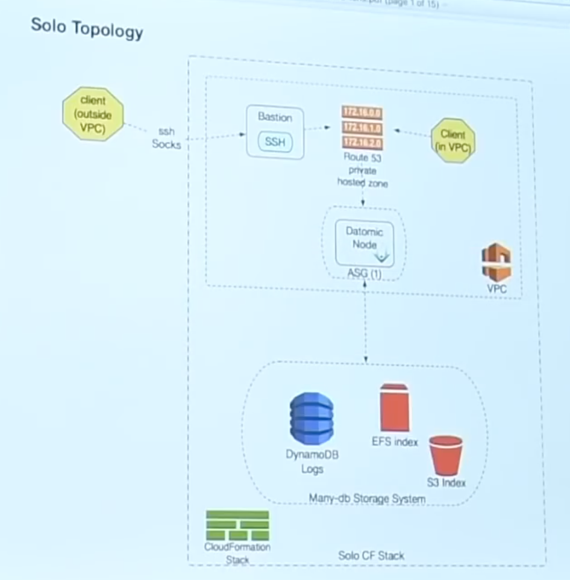

I am going to just quickly let you see what they look like.  So when
you go to Marketplace and you say, "I feel like getting a new database
today", and you push the button "Give me Datomic", in the Solo
configuration we make all of this [referring to figure on current
slide].  So you just push a button and say "start it" and you get a
VPC made, you get a Dynamo table made, you get an S3 bucket created.
You get an Elastic File System created and mounted, and all the
mounted nodes available on all of the availability zones of your VPC.
You get a single node.  That is why it is called Solo.  It is running
in an auto scaling group, but the auto scaling group's job is to keep
it alive, as opposed to scale it out to more than one.  It is
basically one at a time.

We set up a Route 53 hosted zone, and we point it at this node.  We
also keep it updated if you do have the node cycle for any reason.
And this looks to you like a single CloudFormation stack has started
all of this.  It ends up being a master template that has two
independent stacks: one for the storage, one for the top here, which
we call the compute.

In addition, we start a bastion node there, which is designed to
provide access from outside the VPC.  So we never expose your Datomic
cloud nodes outside the VPC, ever.  So there is a bastion, and we
provide you the tools so that the client that you embed in your
Clojure app, and talk to a SOCKS proxy, and get in through SSH, and
eventually talk to the system.

[Time 0:23:46]

This is the tiniest thing!  This is the dollar a day thing!  It is a
huge amount of stuff you do not have to start or operate.  And this
gives you a functioning Datomic system with a lot of reliability.  It
does not have high availability, because it is just one node.  But it
is a great way to develop, build your ideas, try things out.  And it
is pay as you go, so if you just want to try it for a couple of hours,
you can do that.

[Time 0:24:15]
```
slide title: Production Topology
```


When you are ready to try to do things at scale, and have a reliable
system that is highly available, you can push the other button, or
make the other choice in the dropdown, which is the production
topology.  That starts the left side of this.  The right side of this
is optional.  It is actually a secondary stack.

And here you get the same storage infrastructure, and in fact if you
were running Solo and you transition to Production, you can just use
the storage that is already there, and the databases you have created.
All of that stuff will just work.

You still have the bastion.  There is still a Route 53 thing.  I took
it off this picture because it just gets crazy.  But the important
thing here is that now there is a network load balancer in play, and
you are going to have more than one node.  In addition, these nodes
have SSDs on them, which forms the near cache.  The way Datomic Cloud
works is that your logs and your live transactions are going right
into Dynamo, which is the lowest latency system they provide, and it
has the CAS [Compare-and-swap
https://en.wikipedia.org/wiki/Compare-and-swap] semantics we need.

And then as indexing happens, those big trees of immutable stuff I was
talking about, they get put in S3, they redundantly get put in EFS,
and that is so that when you get cache failures higher up, you have a
lower latency thing to back up to than S3, which is pretty high
latency, but very high reliability.  And then there is a near cache.
So every node has got, eventually, the tree cached again on an SSD on
the same box.  So most reads do not go over the network at all.

[Time 0:25:52]

This is a great system, and this is really the value prop of
immutability.  There is nothing to this.  There is no fancy
coordination required, or anything else.  We just build a big -- we
call it the sandwich.  We build a big sandwich of caches, and they all
read repair through and you get data all the way up, all the way
nearby.  Which means that queries are getting satisfied from data that
is on the box.

On the right you see query groups.  Again they get started by
different stacks.  I will talk about them later.

[Time 0:26:24]

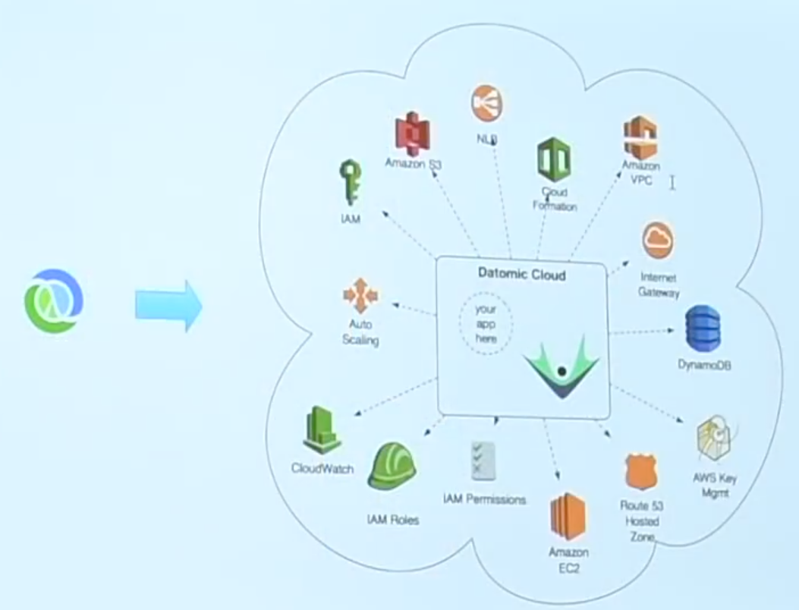

So this is sort of what is happening.  Those diagrams are nowhere near
all of the stuff.  There is a ton of stuff.  We are also creating IAM
roles, auto scaling groups, CloudWatch dashboards, permission sets,
hosted zone.  We create key management keys.  I talked about the
Dynamo table, the Internet gateway necessary to talk to other
services, and the network load balancer.

So we are doing all of this stuff, and Datomic Cloud is all happy, and
you are getting essentially this instant database that is integrated.

[Time 0:27:05]
```
slide title: Production Topology
```


But if you look at this prior diagram, I have these hexagons that say
"client".  What is that?  The client is actually the thing that you
put in your app, your Clojure code.  And that is the API you use to
program against Datomic.  So this is a remote API.  So you get a
client, connect to a Datomic instance, and you talk to the instances.

The problem is -- or a problem is -- I say if the client is in the
VPC, you can connect here.  But the whole client in the VPC, that is a
problem.

[Time 0:27:43]


That is your problem, because your Clojure code is not in the cloud
yet.  Where are you going to run it?  How are you going to get it to
auto scale?  How are you going to secure it?  What VPC is it going to
run in?  What security group is it going to run in?  Are you going to
access that security group from other security groups?  What role is
it going to have?  What permissions does that role need?  And, and,
and, and, and, and!

[Time 0:28:05]

And that is just sort of a fact of building for the cloud.  And so
there was this idea of: you can focus on -- what did I say earlier
about the cloud?  You can focus on your business problem.  How many
people on the cloud think that they do not need to think about the
cloud, and they are focusing on the business problem?  No!  You are
learning all of these things, right?  There is this _huge_ amount of
stuff you have to know to do this well.

So the idea behind Ions is: if we could get your app to run on our
nodes, you could sort of live in this nice nest that we made inside
AWS, and get a free ride, and many other benefits.  That is sort of
the core idea behind Ions.

[Time 0:28:56]
```
slide title: Datomic Ions

Focus on your application

+ Run your app on the Datomic Cloud nodes
+ Leverage your Datomic Cloud cluster
+ Extend Datomic transactions and queries with your own logic
+ Connect to the broader AWS cloud via Lambda events
+ Service web consumers with API Gateway
+ Scale Datomic and your app together
+ Deliver on AWS with high quality
```

So that is a a little bit about cloud.  So what are Ions?  Well now we
are actually going to try to let you focus on your application,
because running on the cloud does not let you focus inherently.  You
do not need to buy computers and deal with wires, but you still have
to provision things, get them to scale, get all of those things
configured correctly.

But could we let you -- this is the problem again -- could we let you
_really_ focus on your application, take advantage of the work we did
in building Cloud, and host your application on those nodes that you
are not running anything else.  If you are running Datomic Cloud, that
is all you are running, and your application code runs on it, scales
with it, etc. etc.

[Time 0:29:41]
```
+ Run your app on the Datomic Cloud nodes
  + Web services
  + Event handlers
  + db extension (query and tx fns)
```

That is the fundamental idea: run your app on the Datomic Cloud nodes.
So I think it is important to sort of talk about your app.  So Stu has
talked about Ions before, and he said one of the problems was people
did not really get that when we say run your app, we mean all of your
app code.  There will not be any clients.  Your app code will be on
the Datomic Cloud nodes only.  He said I should jump up and down when
I said that, which I am not going to do.

[Time 0:30:07]

So let us talk about your app.  So if you build apps for the cloud,
what are they, mostly?  How many people build web services?  Some way
of thinking about what you are doing as some service.  You are doing
some service.  Someone is going to ask you for stuff, you are going to
give them some answers.

The other thing I think happens in the cloud, and it is happening a
lot more now on AWS with Lambda and some of the other infrastructure
for that, is you build event handlers.  Something happens in my
infrastructure or elsewhere in my bigger system, and I need to respond
to that.  I do that in a reactive kind of way.  I am just going to get
an event notification.  So how many people do that kind of stuff?  Get
notifications on queues, SNS [Amazon Simple Notification Service],
something appeared in your S3 bucket.  Something like that.

And the other flavor of app we have is sort of like, both the
supportive code for those kinds of edge jobs.  This is the edge of
your system answering questions on the web, or responding to events.
Internally you have app code both to support those things, and also
something Datomic has always allowed is sort of the extension of
Datomic itself, by integrating code of your own into queries.  You can
call Clojure code in queries and in transaction functions.  So all of
that is what I mean when I say "your app".

[Time 0:31:28]
```
+ Leverage your Datomic Cloud cluster
  + AWS Setup and topology
  + compute resources
  + data locality
```

All right.  So what do we get in terms of leverage from the cloud
cluster?  Well that big picture?  You do not have to do any of that.
That is the biggest thing.  The AWS setup and the topology of that.
The auto scaling groups and the scaling triggering, the dashboards,
and all that, is all wired up.  In addition you can generate your own
metrics.  We have an API for adding your own metrics and logging
messages from your app.  So you can extend what we have done, and that
will appear in your dashboards.  You get compute resources, right?  So
there was this question before, here.

[Time 0:32:03]


Where is your Clojure code going to run?  Do you have to have an
instance?  Do you have to have Elastic Beanstalk, or another thing?
And the answer is no.  You are going to use the compute resources of
the Datomic Cloud cluster.

[Time 0:32:16]
```
+ Leverage your Datomic Cloud cluster
  + AWS Setup and topology
  + compute resources
  + data locality
```

And then the other big leverage point here is data locality.  How many
people use Datomic On-Prem, and had peers?  So what is the big feature
of peers?  The big feature of peers is, if you query, it feels like
you are querying right in your app.  And there is a sense in which
Datomic Ions are sort of an inversion of that.  And when I first gave
the Datomic talks, I said, "everybody gets a brain".  You have your
app, and we give you a brain, which is the query engine to run with
your code.  Now we just sort of invert that, and we say, "the brains
are in the cluster.  You give us your thoughts.  Give us your Clojure
code, and we will think about it."

In both cases, you end up with your thoughts and the caching of the
database, and the query technology of the database, in the same
process.  And that is a source of a lot of power and performance, and
it lets you do things with databases that you just did not think you
could before.

[Time 0:33:20]
```
slide title: Datomic Ions

Focus on your application

+ Run your app on the Datomic Cloud nodes
+ Leverage your Datomic Cloud cluster
+ Extend Datomic transactions and queries with your own logic
+ Connect to the broader AWS cloud via Lambda events
+ Service web consumers with API Gateway
+ Scale Datomic and your app together
+ Deliver on AWS with high quality
```

I talked about a bunch of these things.  Extending Datomic with your
own logic.  There is this notion of connecting to the broader AWS
cloud -- that idea of events.  And we use Lambda for that.  How many
people have tried AWS Lambda?  Yeah.  So the way I think about Lambda
is twofold.  I think there are two aspects to it.

[Time 0:33:45]

One is sort of like this fine grained compute and deployment
infrastructure.  Make a function, include all of Maven with it, put it
somewhere that it can run on demand, and a little bit of computational
resource that will be allocated.  You do not need to think about it.
That does not resonate a lot with me.  I think there are definitely
use cases for that, especially if you have extremely rarely running
programs that respond to events, and things like that.  But once you
are running all of the time, I am kind of old school about wanting
that locality, that caching.  That sense of: I am running all of the
time.  I want the power from doing that.

But there is the other aspect of Lambda, and the way I like to think
about it, and the way we use it in Datomic.  I am going to show you
Lambdas.  We never do anything in the Lambdas.  There is no code
running in the Lambdas.  We use it, and this is the other idea behind
Lambda, as connective tissue.  AWS has said, "Oh, you are interested
in doing something when somebody puts something in your S3 bucket?
You write a Lambda, and we have the way in S3 to go and say: when
somebody puts something here, call this Lambda."  And that is a bit of
connective tissue.  It has actually nothing to do with the Lambda
doing the calculation.  It has to do with: there is a way to say,
"when an event happens, do this thing".  A path from an event to
something happening.  And that is how we use Lambdas: as connective
tissue.

But it is present.  I mean, there are many, many AWS technologies and
services now that can generate Lambda events that your applications
can respond to.  Let us let you build an application that is loosely
coupled that reacts to things without having to have a lot of polling
and things like that.  There is a lot of power there.

[Time 0:35:50]

The other thing that we already talked about is making web apps and
web services, and the way we do that is by connecting through the API
Gateway.  API Gateway is a great idea.  It basically says, "let us
take the idea of web serving and break it into two parts: dealing with
the Internet, and taking a request and generating a response".  We
will let AWS deal with the Internet: authentication, denial of service
attacks, blah, blah, blah.  Who wants to deal with the Internet?  Who
wants to put their server on the Internet?  Not me.

So that is a great decomplecting.  Web serving has two jobs: being on
the Internet, and taking a request and generating a response.  Now
what do we know about taking a request and generating a response,
where the request and response are data?  Clojure is awesome at that.
That is what Clojure is for.  That is like Clojure's reason to exist.
So this is a great separation of concerns.

So API Gateway allows you to set up an endpoint, expose it on the
Internet.  You can bind it to your DNS stuff and things like that.
You can do authentication a gazillion ways.  You can do all kinds of
transformations related to RESTful stuff, which I do not really
believe in, but it can do that.  But it is really good.  But that is
how you are going to expose your service, with Gateway, and you are
going to focus on writing a handler.

The other big thing about this is that by sitting in this nest, you
are in an auto scaling group, which is automatically scaling depending
on triggers you can hook up to various metrics we produce, which
include: how busy are you?  When Datomic scales, it means your app
scales.  There will be more resources for both your application and
Datomic.  So you are already ready to scale elastically.

And the net result of this is that you become much more agile.  This
is what you want.  This is what you imagined the cloud would be until
you saw, oh, there are a hundred services, and each one has a hundred
pages of documentation.

So in the end when we talk about sort of what is your application.

[Time 0:38:10]
```
+ Run your app on the Datomic Cloud nodes
  + Web services
  + Event handlers
  + db extension (query and tx fns)
```

We have web services.  What do they look like after you do not have to
deal with the Internet any more?  You get an HTTP request, you have an
HTTP response.  Ring, Pedestal, all of the Clojure stuff for doing
that.  That is how we do it.  We already know how to turn it from
nasty Java servlets into data and back.  That is just a function,
right?  Web service is just a function.

Event handlers similarly are like that.  Now usually maybe they have
effects, and so could web services.  Let me put something in your S3
thing.  Well maybe that is going to cause you to transact something
against the database.  Process that and make a transaction.  But the
inputs to the event handlers are straight JSON payloads.

And then we have database extensions.  Query functions are functions.
They take arguments, they return data.  Transaction functions are the
same thing.  You have to return transaction data, or macros for
transactions.

So when you get rid of all of the cloud infrastructure and AWS stuff,
the focus part comes down to writing functions.  All of these things
are functions.  If you could just write Clojure code that did these
fundamental operations, Ions would take care of the rest.  That is the
idea.

[Time 0:39:34]


So the idea is: we are trying to get that circle inside here.  So how
does that manifest itself?  How do you do it?

[Time 0:39:42]
```
slide title: Datomic Ions in practice

+ preamble - tools.deps
+ dev
+ push
+ deploy
+ config
+ invoke
```

So the first thing to understand is that there is no extra thing here.
When you run Datomic Cloud, it is ready to do Datomic Ions.  All of
the support, all of the things I show you here that have to do with
CodeDeploy and all of that, and the target groups and whatnot, that
also got set up.  I did not put it on this picture, because I would
ruin the surprise.

[Time 0:40:06]


But more stuff.  Ten more little icons are also being done in support
of Ions.  And that is ready to go when you start a cloud system.  That
is ready to run.

[Time 0:40:20]
```
slide title: Datomic Ions in practice

+ preamble - tools.deps
+ dev
+ push
+ deploy
+ config
+ invoke
```

So before I get into the steps, which are small and easily understood,
I hope, I just want to talk a little bit about tools.deps.  So a
prerequisite of developing for Ions is that you have got a Clojure
app.  You are keeping it in git.  And you are using tools.deps to do
dependencies.  This is not because I hate Leiningen or Boot, or
anything else.  I think that the Clojure community has not completely
gotten their heads around tools.deps, but it is actually a simple
premise.  And the idea is: I want something that only does deps.  I do
not want two things.  I do not want a build system.  I do not want two
things combined.

And invariably dependency systems -- because the build system needs to
know about the dependencies, they all turn into build systems.  And I
think in doing that, then they say, "well other people might want to
know about the dependencies".  So therefore, the way to do that is to
have plugins.  And that whole thing just is too tightly coupled for my
taste.

The idea behind tools.deps is: dependencies a la carte.  And I think
what you are going to see in the way Datomic works, the way Ions work,
is an example of the consuming app.  They are not special to Datomic.
Stu worked on the tools.deps integration for Datomic Ions.  And he was
a consumer of tools.deps trying to use the tools to get dependency
information necessary to do the job we want to do, without having to
add it into tools.deps, or make tools.deps pluggable.  What we want is
something that is composable.

[Time 0:42:07]

Now it ends up tools.deps did not do everything the way we would have
liked, and working on Ions has improved tools.deps ability to be used
by other people for similar jobs in an a la carte way, by composing
processes, as opposed to this sort of nested dolls approach to
plugins.

So I think tools.deps are very important, and the ideas behind
tools.deps are important.  I designed it, and I really believe in it.
So if you have any questions about tools.deps as this weird thing, or
whatever Alex Miller was off imagining something, it is not.  This is
a mission critical thing for Clojure to get this right, to get this
separate.  And I think there are many other benefits, and I am sure we
could have talks about that.  But you have got to do tools.deps.

[Time 0:42:59]
```
+ dev
  + deps.edn
  + local deps ok!
```

So the first thing you have to do is: you have to develop.  This is
like writing software.  We said we want to just write a function that
says: if I get this payload as an HTTP request, this is what the
response should be.  I just want to write that function.

So I am going to have code in git.  And I am going to have
dependencies.  Another problem I wanted to solve, both with tools.deps
and with Datomic Ions, is the problem of sibling dependencies.  How
many people work in a shop that have broken up their giant app into
different libraries?  Many people have, I hope.  This is a -- yes,
this is desirable.

But then, what do you run into?  You run into: everything in Maven
must be an artifact, and you cannot have this half way done, and that
half way done, and this depend on that, because you have to deploy a
half way thing, and then you have "latest" or whatever the Maven-isms
are there.

[Time 0:43:59]

I think that is a disaster.  I think that needing to have artifacts
runs contrary to being able to be agile about working on more than one
thing at a time.  And it actually thwarts the idea of: it would be
good if we separated these things and reused them as libraries.  How
many people have heard of the evil beast called mono repo?  Yeah.
Mono repo.  There is a football term for that.  It is called
"punting".

And I understand why people are driven there, because Maven does not
help you with this.  But it does not have to be this way.  tools.deps
is not like this, and Ions are not like that.  You can be working on
more than one library at a time, and it can all be half way finished,
and it can be on your machine only, and you can deploy them.  Now you
cannot deploy them in a way that is repeatable, and you cannot deploy
them with an identity that would confuse anybody else about: oh, I can
use this thing.  That was just on your machine.  But you should be
able to deploy that and try it.  How else are you supposed to
interactively work?

So let us look at this.  Pictures.

[Time 0:45:08]

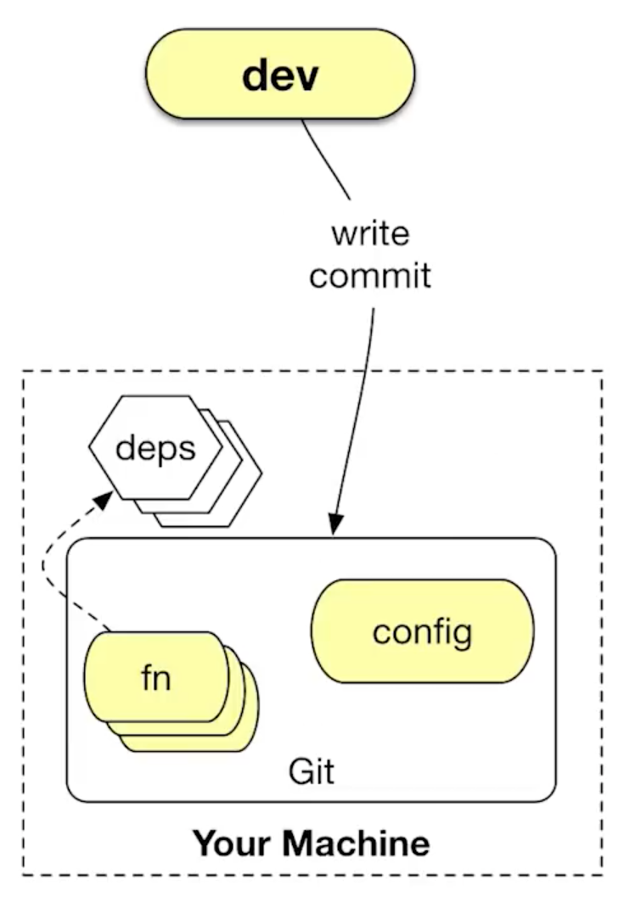

This is what development is like.  You are working on your machine.
You have a bunch of functions in your git repo, in your application.
You have dependencies in a deps.edn file.  The dependencies are on
your machine.  They may be in .m2 as proper artifacts, or they may be
local deps.  That is OK.  The one additional thing we are going to ask
you for is a config file, an Ion config.edn file, which describes some
things about your Ion deployment.  This stuff is not getting jammed
into your deps.edn.  deps.edn is not like this dumping ground.  That
is for deps.  This is not deps.  This is another file.  There is
nothing wrong with that.  I do not now why everything has to go in one
file.  So there is one extra file.  And you do your ordinary stuff:
you write, and you commit.

[Time 0:46:05]

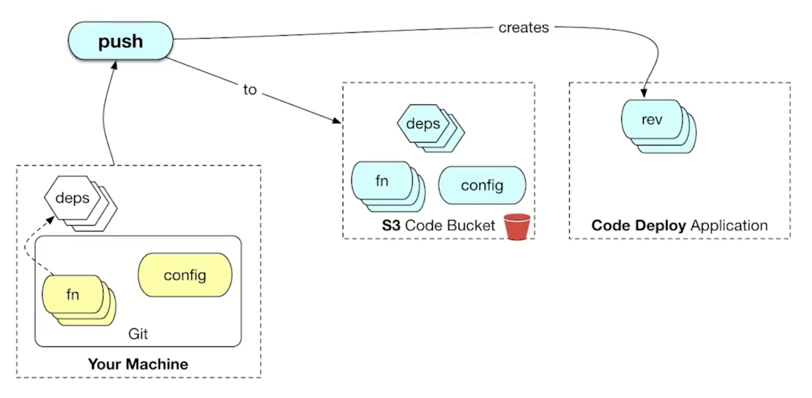

Then you are going to push.  So here it starts to get interesting.
You worked on something locally.  You commit to git.  That is in your
local git, and obviously you can -- when I say push here, I am talking
about Ions push.  You are going to have a library that will be in your
dev time tools.deps alias.  That is the Ion tooling.  And Ion tooling
has an operation called push.  This lets you push your application
into your Datomic cluster.

So where is that?  So you have stuff on your machine.  You have
dependencies, which are artifacts and/or directories.  You have your
git stuff, your functions in Clojure files.  And you have a config.
What push does is it puts that stuff in S3.  There is a place in S3
associated with your Datomic Cloud configuration that we use to put
your deployments.  This is just an application revision.  It is not
running anywhere.  Pushing it just says: put it somewhere, so I could
run it somewhere else.

Something else happens, in addition to putting this stuff out in S3,
is that we create a revision in CodeDeploy.  So how many people have
tried CodeDeploy?  How many people know what CodeDeploy is?  I am
going to talk a little bit more about CodeDeploy, because it is cool.
There are lots of different ways to get stuff running in AWS.  How
many people, for instance, make AMIs [Amazon Machine Images] and
restart EC2 [Amazon Elastic Compute Cloud] instances?  You burn AMIs
some way.  Not too many any more.

How many people make Docker images, and then use something that puts
Docker images on new EC2 instances?  How many people in general start
new instances of EC2 that have new application code running?  It is
pretty common, but it is expensive, right?  The EC2 instance cycle
time can be minutes to get new instances up.

[Time 0:48:03]

CodeDeploy is a way to get code running on EC2 instances that are
already running.  So the idea behind CodeDeploy is: you set up an auto
scaling group.  There are a bunch of EC2 instances.  And they are all
running the CodeDeploy daemon on the boxes.  What CodeDeploy does is
it lets the target group, which would be a particular auto scaling
group, that is the target of a deployment, to know that there is a new
revision that it should be running.  And they will go and grab it.

Before we get to that, and I will show you that in detail later, the
fundamental idea is that a CodeDeploy application is a thing in AWS.
You are going to have an application.  It is going to have a name.  So
imagine you have your Datomic system you set up.  You are going to
have an application called My Web App.  My Web Service.  When you make
your Datomic Cloud instance, we will make a CodeDeploy application
called My Web Service.  It is not running anywhere.  It is just a
place where you can put revisions.  So when you push, we will make a
new revision in CodeDeploy.

If you go to the Console, and look at CodeDeploy and your application
will say, "Oh, there is this revision".  And if it is a repeatable
revision it will have the git commit SHA.  You can run this.  It is
based upon [tbd?] this version of the code.  That is the first thing
we will talk about that is connected to git.  The revisions are
connected to git commits.  That is the identity.  I hate human made up
"version 2".  What does that mean?  Version 2.3.  Oh, that is better.
Or is it better?  These things mean nothing, right?

[Time 0:49:50]

And I think that one of the problems with the artifact system, that I
have with it, is detachment from source truth.  And it is old.  I am
not saying that people got it wrong.  But Maven I think predates git,
and artifacts certainly do, and the idea of 1.2 and 1.3, absolutely
do.  But now we are -- who is not using git for version control?  We
are using git.  Git has a bunch of great properties, and as Clojure
programmers we do not have to have them explained.  So we connect
application revisions to git identity.  If you ever were wondering
"what version of the code is this, actually that is running?"  There
is no question.  It is the name of the version.

But what if you have local deps?  What if you were in the middle of
two different things?  We are going to force you to create a human
readable name.  It is going to go in a different place with a prefix
that says "unreproducible".  So it will say "unreproducible Rich's
latest brainstorm", will be the name of that revision.  And hopefully
no one will look at that and say, "That should go in production".

So we make that -- the important thing about pushes -- we are not
running the code anywhere.  We have given it an identity.  We have
made the bits available in sort of a neutral territory, this S3
bucket.  That is what is happening during push.

[Time 0:51:17]
```
+ deploy
  + code deploy - fast, rolling
```

Now you are going to deploy.  And here things get very interesting,
because the idea behind deploy is that you are going to take a
revision and say: "I would like to see this revision running in this
place, on this target group".  And it ends up that you can have the
same application, at different revision points, running on different
target groups.  We will see diagrams later about the scenarios in
which you would do that.

[Time 0:51:48]

So here you are saying, "I actually want to make that happen".  So
where could you deploy it?  It ends up when you start a Datomic Cloud
system, you say what application it is supposed to support.  You can
run more than one Datomic system, or compute group, and say they all
support the same application, or each one has its own application.
And by default, every new Datomic group will have its own application
associated with it.  You can go many to one, and one to many that way.

So actually deploying means: issuing a command to CodeDeploy to say,
"I would like to see this revision running in this place".  And the
choice of places will be known to you.  And what is neat about
CodeDeploy is that it does not cycle the instance.  It informs the
agent on the machine, on the EC2 instance, that there is a new
revision.  There is a whole life cycle script that happens there,
which in our case will cause us to shut down Datomic on the EC2
instance, go grab that code, pull it locally, and munge the classpath
to include the stuff from your application, and restart Datomic with
your app in the classpath.

[Time 0:53:08]

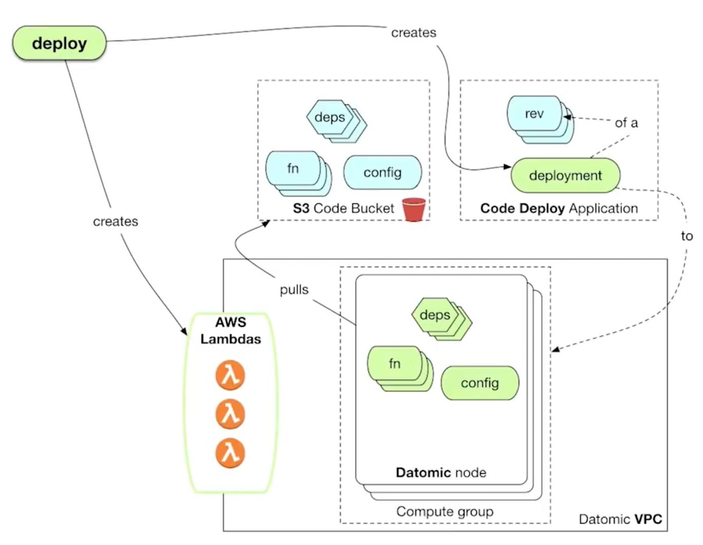

Let us look at that.  That looks like this.  You say "I want to
deploy".  And it takes two arguments: which revision, and where.  And
the where has to match, so you cannot mismatch this thing.  If you do
not know where you could deploy, you just issue the command and it
will tell you, "here are the possible target groups that are ready to
be deployment targets of that application".

And that goes into CodeDeploy, and it makes something called a
deployment, which is a record that you asked for this to happen.  You
asked for this revision to run in this place.  That also causes the
agent to be notified.  What actually happens in CodeDeploy is just a
pull.  So the agent is told, "You have got a new revision".  The code
in the agent goes and issues the commands to get the new revision of
the application.

[Time 0:53:57]

We go and we pull the stuff from S3: the functions, the code, the
dependencies, and the configuration.  Now it ends up that you might
expect to have seen in the S3 bucket some sort of a monolith, like an
uberjar.  And it is actually the design of CodeDeploy that that is
what you would be doing.  They think that that is probably what you
would be doing.  I do not like doing that, because a lot of that is
redundant, right?  These dependencies, they are not different.  How
many times when you make a new revision of your app do you change all
of your dependencies?  Almost never.  Should you have to have put them
all in a JAR and sent them all around the Internet, up to S3, and
down, and back again?  No.  So this system actually knows what is in
the .m2 on the target instances, and only gets from S3 the stuff it
does not know about.  And everything about this is repeatable.  All of
the identities are consistent and reproducible identities.

So we end up with the new functions and dependencies and config on the
Datomic node.  We munge the classpath and we restart Datomic.  This is
a process that you measure in seconds, not minutes, to do this kind of
thing.

So that sort of is the getting the code inside Datomic, but I talked
about connecting to the AWS ecosystem, and it ends up that right now
in the current version of cloud, both to support web services from API
Gateway, and any of those eventing things, you are going to need
Lambdas.  So I said you need this config file.  One of the things that
is in the config file is a declaration that some of your functions --
you wrote many functions, right?  Some of the functions are supposed
to run in transactions.  Some are query functions.  Some are just
supporting your other functions.

[Time 0:55:51]

But a couple of your functions end up at the edge.  They end up being:
this is the function you should call when somebody calls this Lambda.
That is in your Ion config.edn.  And for every Lambda you designate
there.  So it basically says: I want to have this function exposed as
a Lambda called that.  We will make a Lambda, and we will wire that up
so that when that Lambda is called, that code is called.  And I will
show you how that works in a second.

So deployment is not just a CodeDeploy deploy.  It actually also
creates Lambdas.  We use AWS Step Functions and stuff like that.
There is a lot of machinery behind this, and what you need to know
about it is: you do not want to know all of this stuff.

So now your stuff is out there.  The Lambdas exist.  But you are not
actually connected to the world yet.  If somebody knew about your
Lambdas, they could invoke them directly.

[Time 0:56:52]

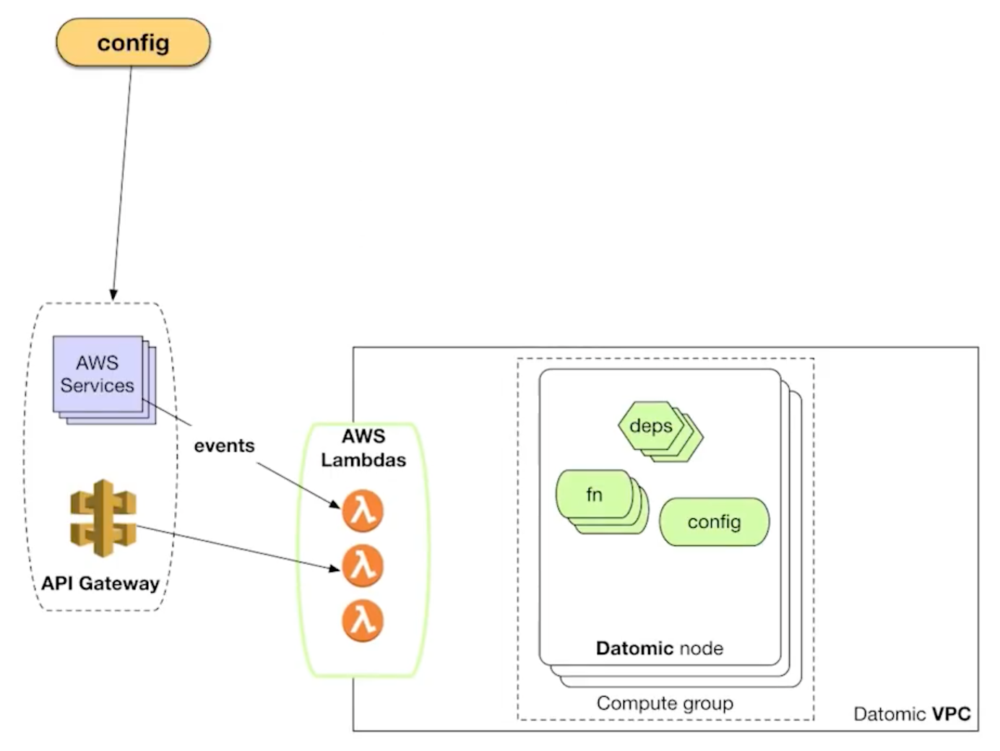

But there is a step left that is outside of this, outside of the scope
of what we can do for you, where you have to go and say, "OK, let me
go to my S3 configuration and say: hey, when someone puts something in
the bucket, call this Lambda".  The one that we made for you.

Similarly you may go to API Gateway and say: stand up a new API
Gateway endpoint, and when requests are made, call this Lambda.  So
there is configuration associated with doing that.  Right now we do
not have any automation around that configuration, but we walk you
through how to do it in Console.  And obviously you can do the same
things from the command line, or other automation tooling.  So this
configuration allows you to sort of make that final connection.  We
have made the Lambdas for you.  Now you are going to connect them to
either event sources, or to API Gateway, so stuff can get in.

[Time 0:57:48]

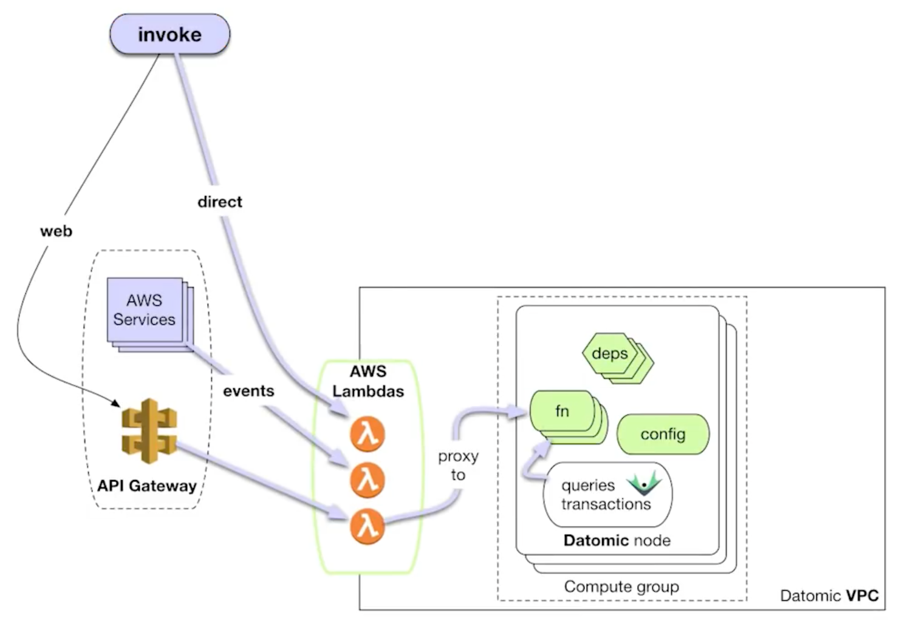

And then you are ready to rock.  You can be invoked.  And so we will
just walk through some of the ways that your application can be
invoked.

[Time 0:57:55]

I will start over here, all the way inside.  If you have written code,
and you have designated it in the config as being callable -- because
not everything is callable.  There is actually an accepted function
list.  Those are the only entry points that we support.  The rest of
the functions would have to be dependencies.  They are supportive
code.

The first thing is: queries and transactions can call your functions.
Just use them directly in your query or in your transaction, and you
can call it.  The new syntax we have for that means that we will
auto-require and everything else.  There is nothing you need to do
except make a fully qualified function call.

The next thing you could do is you can actually directly invoke the
Lambda.  Some people architect systems with processes calling Lambdas
directly.  They do not use web services.  They just invoke Lambdas.
So you can do that.  You call the Lambda, and it proxies through.

I showed one line of proxying, but essentially all of these Lambdas
end up hitting your code.  They all work the same way.  We wrote a
single Lambda, once and for all.  We call it "The Ultimate Lambda".
We called it "Lambda, The Ultimate". [smiles and pauses] No, it is the
Ultimate Lambda.  We just call it ultimate.  It is a proxy.  It has no
code.  It just knows it is configured so that when it gets a request,
it knows which group to talk to, and which function to invoke.  And it
just forwards it, gets the response, returns the response.  No logic
in the Lambda.  They all proxy through.

The other thing that can happen is: stuff can happen in these AWS
services, and they generate events.  That calls your Lambda.  That
calls your function.

Finally, people use your web service over the web.  It hits the API
Gateway.  That hits a Lambda.  And that hits your function.

That is it!  That is all your functions.

[Time 0:59:55]

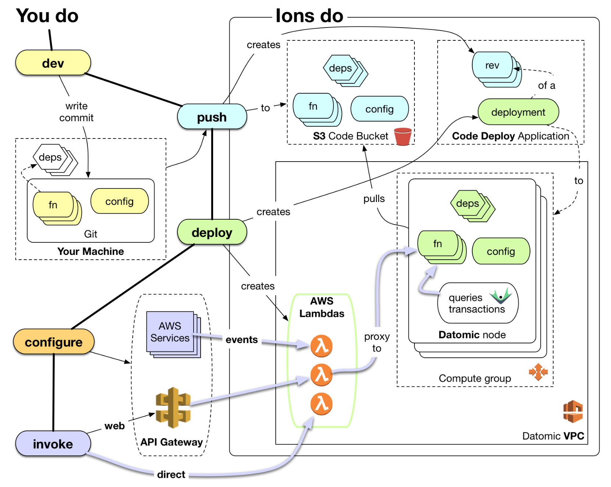

So this is the big picture, which I do not like to show all at once,
because -- it's obvious -- it is big.  But the important thing is to
look at the left side.  This is what you do.  You do ordinary
development of functions, in git, using tools.deps.  You call a
function called push.  I mean, it really just says push what I have
got.  And we may force you to make a name, but if you have a
reproducible thing, we will name it on the checked out commit.  And
that is it, if you say push.  If you say deploy, you say deploy this
revision name to this place.  The configuration, like I said you can
do either manually or with automation.  And the invocation is just
like: stuff happens in the world.  People use your web service.

So there is very minimal that you do that is anything other than write
functions in Clojure and try them in your REPL, the way you always
did.  While you are developing, you do not need to deploy anything.
You can work against your code locally.  You can run the client, as I
showed on the very earliest diagrams, and directly talk to the
databases.  You can work in your REPL.  You do not need to deploy in
order to test.  Hopefully that will be clear on the pictures later.

So and then of course there is this huge amount of stuff that we do.
And this sort of keys you into the other things we have created.  We
have created this code bucket.  We have created these CodeDeploy
applications.  We have made a relationship between the CodeDeploy
applications and the query group, so that they are available targets
of a CodeDeploy.  All that is done automatically.

All right.  Does anybody have any questions about that?  I do not
think I should move forward.

[audience member question not audible]

[Time 1:01:59]

They are consistent.  It is a function of the name of the target
group, and the name of the function.  So they will be stable.  And in
fact, we will not make new Lambdas unless there is something novel
about it.

Oh, I should have repeated the question.  It is: do you have
repeatable names for the Lambdas?  And the answer is yes.  The Lambda
names are a function of the designated name and the target group.
This is not the strongest part of Lambda.  I said it is connective
tissue.  But this namespace, I think it is 64 characters.  It is not
great.  And I think AWS knows this is an area to improve.  But it is
stable.

The other thing I would sort of say overall: this entire architecture
is designed to minimize unnecessary work.  There is no change, no
work.  No change in your deps, we do not shovel them around again.  We
do not make uberjars.  We do not make new Lambdas unless something
about the Lambda configuration has changed.  We do not do anything
unless there is actual novelty required.

So you have high stability.  In fact, if you add a new Lambda, you get
no down time on the other ones.  Oh, that is the other critical thing
about CodeDeploy deployments.  They roll.  So it will do this process
one machine at a time, so you will get a continuous availability
through that deployment.  So as long as you are not doing something
really crazy, like updating in place your functions and things like
that.

This is why I talk about this stuff all of the time.  It is just the
one area that is still left to you.  The sensibilities about accretion
in systems are important.  If you stick to them, this thing works like
a charm.  If you say: "well, I want this thing to have the same name,
and do something totally different, and take different inputs and
return different outputs", you have just said: "I want to break my
system.  Let me go do that".  Don't do that.

[Time 1:04:02]

Other quick questions, then we will talk about query groups.

[audience member question not audible]

The question is: we have shown here responding to things happening in
the outside world.  How do you affect the outside world?  Well, you
could call web services yourself.  I mean it is quite common to make a
hierarchy of services calling services.

[audience member question not audible]

Inside a transaction.  No, you can do it inside a query.  And you can
have an endpoint that is associated with an action.  It depends on how
you want to sense it, I guess.  But no, you can do it anywhere you are
running code.  So you are running code as a result of a service call
through API Gateway.  You are running code as a result of another
event.  Unless you have to poll for these things.  If you think
something interesting happened, say during a query, you can do any
number of things.

It is probably best not to try to synchronously do everything.  You
could, though.  You could call another Lambda.  You could call another
service.  You could put something on a queue.  All the normal systems
topology stuff is available.  But you have access to the AWS API
inside your Ions.  You are situated in a node.  It is running in a
role.  You can give that role any permissions you want to do AWS
stuff, in addition to the things we have given it permission to do in
order for Datomic to work.

But I think the rest of that question is sort of outside of the scope.
That is more architectural guidance.

One other question on this, and then I will move on.

[Time 1:06:00]

[audience member question not audible]

There is nothing multi-region about this at the moment.  I think AWS
is sort of straddling the multi-region thing.  They do not
fundamentally believe in that.  They believe that their regions are
units of reliability.  But of course, from the very beginning, every
customer has asked them for belt and suspenders.  I think that that
idea will become more first class in AWS, and you are starting to see
it sort of an ad hoc basis in some of their services.  When it becomes
fully first class, we would certainly look at it.

But it ends up wherever you look in AWS, it is missing the things you
need to do that reliably, because they do not consider it to be
reliable.  Essentially, if you want independence between these things,
then you do not necessarily know that that is going to be ready to
take over when you want to switch.

I think in general, that kind of multi-region thing will always be
outside the scope of what a service can fully provide, because the
semantics of transitioning, and transitioning back, always involve
business rules, and these sort of operational and business integrity
concerns.  You cannot answer for everyone.  We do not have any
multi-region support built in.

Earlier, I showed you a picture with query groups on it.  And I did
not really explain what they were.  And I am showing you here a bunch
of compute groups that could be targets of deployment.  We never
really talked about having more than one compute group, though.

[Time 1:07:56]

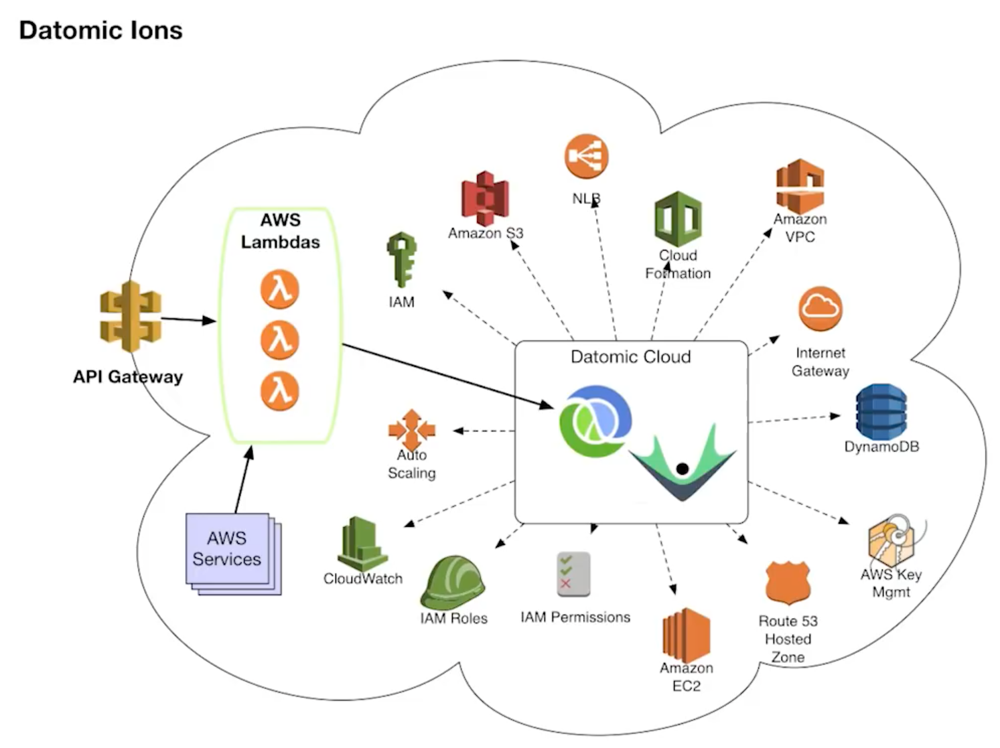

But it ends up that in the production topology -- oh, so here is what
you get after you finish this.  Your Clojure code is on the nodes.  We
have added some Lambdas for you.  They can be wired to services.  You
have API Gateway.  SLT [tbd?] is one future feature, because we have
been asked for this for a while.  And that is, it is possible for API
Gateway to directly invoke Ions if there is a network load balancer
available, which there is in the production topology.  And in that
case we would not need to go through Lambdas from API Gateway.  So
that is something that is on our agenda to do.  So it will be faster
and easier to configure, and take a hop out of it.

[Time 1:08:41]
```
slide title: Query Groups

Use leverage to enable growth

+ Independent compute groups in prod topologies
+ scenarios - apps, scaling and stages
+ Immutability leverage
```

So I am going to walk you through a couple of use cases for query
groups.  This is something we just released last week.  But if you are
familiar with Datomic On-Prem, or have been running Datomic before,
this is sort of the moral equivalent of peers.  I talked early in the
talk about the leverage of immutability, and being able to replicate
things and get independent querying, and independence of applications.
Query groups are the way that really becomes real in Datomic Cloud.

The basic problem we are trying to solve is: use the leverage that we
have in being able to replicate data to enable the growth of the
system.  To have system support for users, to have different
applications use the system.  Isolation between those applications,
and how much computational resources they use.  And we give them
locality for queries.  Data locality, and working set locality, and
things like that.

So there are sort of a couple of scenarios, but the basic idea is that
once you have a production topology, you can start one or more
additional compute groups.  And it will look like the very top part of
those initial diagram.  You get another auto scaling group with
instances in it, and a network load balancer associated with it.  It
can be its own target for CodeDeploy deployments, and therefore for
Ion applications.  And it can have its own scaling.

[Time 1:10:08]

So there are three categories of reasons why you might want to look at
this.

One is to support multiple applications.  I have a web service, and I
also have an analytics thing.  And the analytics thing queries
relentlessly, crunches the computer.  I do not want that to be running
on the same instances as my transactional system at all.  So I have
different applications.  I want to keep them separate.

The other reason you might want to do it is for scaling purposes.
When you first start with Datomic Cloud, that first compute group,
whether it is the Solo one or N, is doing everything.  It is handling
transactions and it is doing indexing.  It is handling queries and
hosting your Ions.  At a certain point, you probably want to get the
queries and Ions out of the way of the transactions.

In addition, we do not advocate elastically scaling that transactional
group, because of the way it does caching and the way it has to handle
things.  That is more of the kind of thing where you are going to say:
"let us have a meeting and go from three to four".  On the other hand,
your web app should be able to scale up and down all day long
elastically, so getting it into a separate query group means you can
now set up the scaling on that to be elastic.

And the other reason why you might want independent query groups is
for different stages of your application.  So you want to
simultaneously run different revisions of your application.  One is in
production, one is being tested, one is in staging.  Maybe the
developers are also doing something.

[Time 1:11:50]

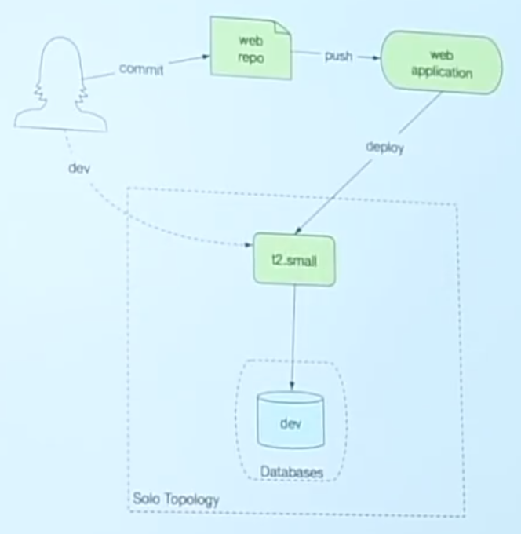

I will show you some pictures.  Start small.  The developer is doing
stuff.  There is a web app.  It is getting deployed to the Solo.  They
are also developing against the Solo.  There may be more databases in
there than this says.  And they are all sharing the same instance.
There are no query groups here.

[Time 1:12:08]

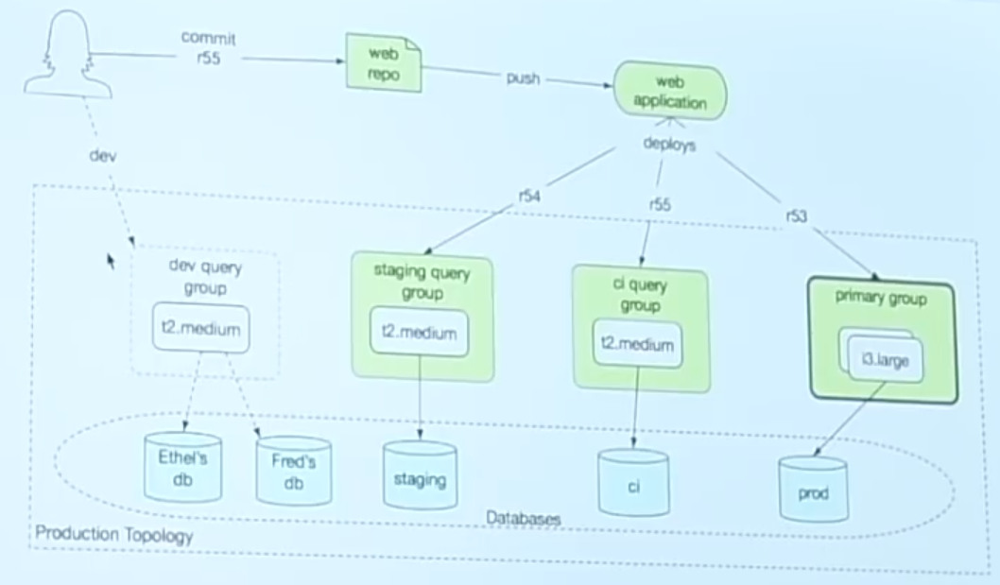

When you move to the production topology, you have a primary group.
And then you may add one or more query groups.  So this shows the
primary group all the way on the right, and it is still running the
application for reals.  And then a separate group was set up for CI,
and a separate one for staging.

So we see the developer is working on the most recently committed
revision 55.  That is in the set of revisions of the application.
This is the CodeDeploy application here.  54 is running in staging.
55 is in CI.  And the primary group is running 53.

And you have a bunch of choices.  I mean, this has some instance sizes
on it, but there are a variety of instances available for the
different query groups in production.  And there are a bunch of
databases and storage.  This is one storage.  This is one system, but
there are a bunch of different databases.

The developers, you might set up a query group for them.  It is only
handling queries.  It is not actually hosting their code, because
their code is live on their machines.  So this does not have a
deployed revision on it.  It is just answering queries and servicing
the databases, where you might give every developer a different
database so they do not step on each other.

So again you are seeing shared infrastructure in the storage tier,
seeing independent groups here.  In this case, the groups are only
being used for developmental stages.  Staging, CI, production, dev.
That kind of thing.  This is how you would do that.

[Time 1:13:49]

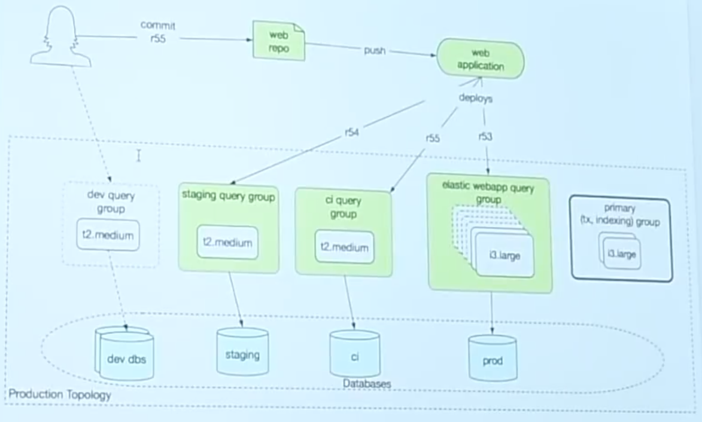

The next thing you might want to do is, as I just said, you might want
to get the actual query and Ion load off of your transacting and
indexing group.  Put it on a group that was more elastic.  This is a
group that will have a minimum of two, but could go up to 10 during
the middle of the day, or whenever it is that you are busy.  And now
the app is running there, and the primary group is not running an app.
It is still serving the transactions.  So an important thing to know,
and I have not drawn the arrows on all of these diagrams, because it
gets to be kind of a rat's nest, is: transactions always get forwarded
to the transacting group.

So you may have your app talking to a query group, or your Lambdas are
wired to a query group, or the query group is serving your web.
Transactions that hit that group still get forwarded to the
transacting group, which does the transacting.  If you are familiar
with the On-Prem architecture, we have replaced the transactor with a
cluster.  It is better from a high availability standpoint.  It is
easier to configure.  There is no heartbeating or failover.  It is
sort of like a live dynamic system for taking over mastership.

So this is the app, with just the main Ions and queries moved off of
the primary group.  We do this for scaling now, not for staging.

[Time 1:15:14]

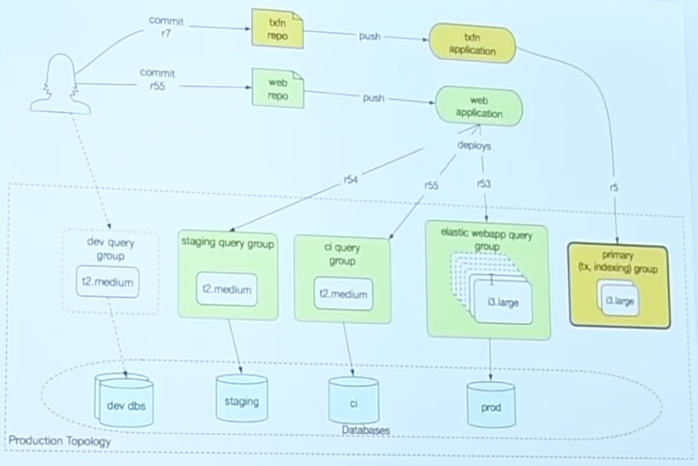

So one of the things that is kind of subtle about this is that all of
the apps talk to one transacting group.  It handles all of the
transactions.  That means that when you have transaction functions,
they are not actually in your app.  I mean, you deployed code over
here to be your app, but the transaction functions are not in your web
app, because they are not run on those boxes.  They are not deployed
there.  They run over here.  You have to start treating your
transaction functions as a shared library to support all of your apps.
It actually becomes its own application.  It is its own repo.  You
maintain it.  You deploy it independently.  That is the first example
of another app you might have.  Once you get more sophisticated with
this, you are probably going to have an independent app for
transaction functions.

[Time 1:16:07]

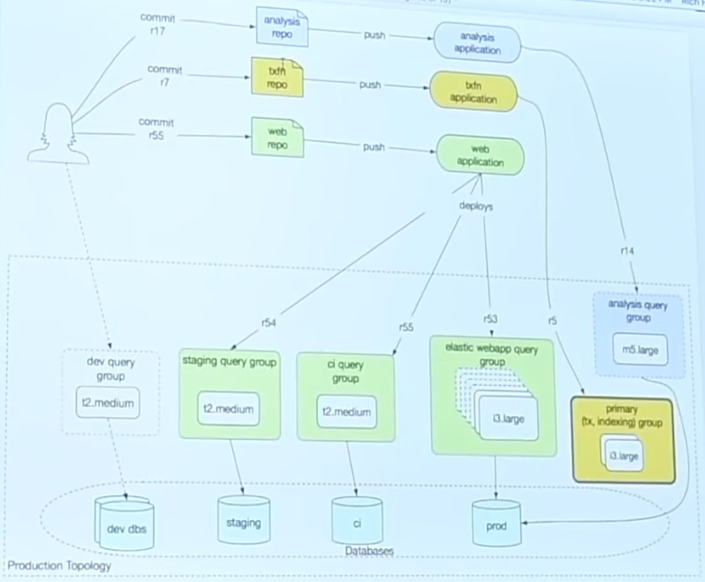

And finally, you may have another app that is for an unrelated
purpose.  This is what I was talking about earlier.  You have an
analytics app that runs on one big box.  Maybe it does not run all of
the time.  Maybe you just run it for an hour a week, or something like
that.  And that is possible in all of these cases.  Just set up a CI
saying once a day to do that, or however often you want to do it.  You
can set up the dev query group to run during working hours, and not
the rest of the time, unless somebody asks.  And you may run analysis
periodically, but not keep that group running.

So the important thing here is this sense of independence.  These
things have independent life cycles, right?  Run it sometimes.  Run it
all of the time.  They have independent scaling characteristics.  They
have independent sizes.  One of the things that you can have in these
query groups is, you can have SSDs, or not.  So they have that same
kind of local durable caching.  They have independence in terms of
compute intention.  The analytics app is not contending for the same
compute resources as the web app.

[Time 1:17:21]
[tbd Audio cut out for a short sentence here.]

Life cycles.  Compute.  Resources.  Oh yeah, and then working sets.
So you have these long running applications, but maybe the web app
uses the catalog all of the time, and the analytics uses the personal
data, or something like that.  Or maybe you have an inventory app that
deals with the shipping stuff, which the front end app never deals
with.  They will all start having their own working sets.  They will
all have in their hottest caches in memory the stuff that is relevant
to what they are doing.  Ditto their enduring caches, and etc. etc.

That is query groups.

[Time 1:18:16]
```
+ Immutability leverage
  + isolation
  + localized working sets
    + code running in db context
  + SSD caching per group
```

And I think this is an example of the leverage that we get from
immutability.  Being able to replicate all of the way to the edges
here, to get this independent localization, get caching wherever we
want it, including this new SSD caching, which really lets you have a
huge local cache.  Much bigger than you could do with like a local
memcache.

[Time 1:18:39]
```
slide title: Summary

Maximizing power and focus

+ Power
  + Clojure is 'hosted'
  + Datomic Cloud is 'hosted'
    + and so are your Ions
+ Focus
+ And
```

So to wrap, the point with Clojure, and with Datomic, and with Datomic
Cloud, and Ions, is to maximize your power and your focus.  Power is
the ability to get work done, the engineering definition.  And it
really is the meaning of it.

So I think there is a way to think about this, and it is written out
here.  Clojure is hosted.  Clojure ran on the JVM.  And people would
be like: oh, Java, blah, blah, blah.  But how many people think it is
a source of power that Clojure is on the JVM?  Or that ClojureScript
is on the JavaScript ecosystem?  Yeah.  That means that when you need
to do something, you can do it, because the libraries exist.
Obviously you can make different libraries, but when you need to
accomplish something, when you need to do work, you have the power to
do it.

And I think a way to think about Ions is: Datomic being hosted, and
therefore your Ions being hosted.  What is the leverage of having your
application be hosted on AWS?  Be intimate with AWS.  Be connected to
all of the services.  Be subject to securing the way AWS things are.
Being managed the same way, with roles.  Being monitored the same way
with CloudWatch, and the Dashboard.  Things like that.  This is
another source of power.  It is on a different plane, right?  It is a
different dimension than sort of like in the app.

[Time 1:20:18]

But it is the same idea.  And I think it matters as much, or more,
when you get to the cloud.  This is a new execution environment.  And
just like you need libraries to accomplish things, in process, you
need services to accomplish things in the cloud.  You cannot be
running data center software up there and expect to get leverage.
That is why AWS has all of these services.  This is how you assemble
this power.  So this means your code is hosted in the cloud, as well
as being hosted on the JVM.

[Time 1:20:54]
```
+ Focus
  + domain, not infrastructure
  + Write and test fns of data->data
```

I do think this really finally helps deliver even on the cloud, which
is a very complex place, with a lot of details.  It helps you focus on
your domain.  You really can write Clojure functions that deal with
Clojure data on the way in, and Clojure data on the way out, and not
have to think about the rest of this.  And I think this makes this
kind of categorically different from the many many things -- there are
many services that are kind of just like: this makes it easy to do
deploys.  And it is not really about that.  It does not let you focus
like this.

And we do what we already know how to do: write functions of data to
data, and we test them, and we reason about them, and we use our REPLs
and things like that.

[Time 1:21:43]
```
+ And
  + it's easy too!
```

But it is also easy.  We did really work hard to make this easy.  So
this is simple and easy.

That is it.  Thanks.

[Time 1:21:54]

[audience applause]

Other questions?

[audience member question not audible]

The question is: are there plans to develop similar integration with
other cloud platforms?  And the answer is: not at present.  I do think
that there is a pretty big difference between the sophistication level
of AWS and the others, at the moment, but it is a competitive
environment.  We certainly are hearing requests, so we are receptive
to the input there, but we do not have plans at the moment.

[audience member question not audible]

If something goes wrong inside an Ion, how can I debug it?  So the
first thing is, you really do want to test your Ions a lot, before you
deploy them.  This is not an environment where you want to: let me
type it in, and then deploy it, and then let us see.  So hopefully,
being functions of data to data, you can do a lot.  Like, for
instance, use spec and things like that to make sure that it is
correct.

Now of course your Ion may do interesting things like call another web
service, or make an AWS call, or things like that.  At that point, you
are going to want the kinds of things that we needed to make Datomic.
In particular, you want to be able to have logging, metrics, and
alerts.

[Time 1:23:43]

And one of the things that is included in the Ions API is an API for
that.  That is called [Ion] Cast.  Essentially it is a semantic
logging thing.  It is not like: do this text [trails off].  But it has
semantics that distinguish those characteristics.  That you say I have
an ordinary communication I want to make.  I have a metric that I want
to do.  And this routes all the way through to Cloudwatch metrics.
This has become Cloudwatch logs.  Alerts will beep somebody.  They
become alerts.

And then finally there is dev spew, which is a thing.  And when you
are running locally, that will appear in your local log, or in your
face.  And when you are running for reals, it will disappear at the
moment.

So those things are all distinguished, and so you have that.  So you
can catch exceptions, and you can both log and generate alerts and
things like that.  And you can also do ordinary messages.  It does not
just do alerts [tbd?].  We sort of have informational messages, which
you can do -- ordinary life cycle things just to see your happy path.
And then you have metrics.  And then the whole ecosystem around
metrics in AWS is pretty rich.

You get a very nice dashboard with cloud, and you are ready to go on
that.  But for your own code you have those same facilities.

Yeah?

[audience member question not audible]

So the question is: is it your whole application, or just your
database layer?  Right now the only host for Ions would be a Datomic
thing.  So the rest of your app does not talk to a database ever?  And
what does it do, the other parts of your app?

[audience member question not audible]

[Time 1:25:56]

Well, it is hosted on the same machines.  It could never call Datomic,
I guess.  So it is not like it is in Datomic, as opposed to running on
the same instances.  You could just write something that just returns
web pages, and never calls Datomic in this.  Fine.  The Datomic part
would sort of just be gravy that you are not eating at the moment.

But actually, a question for the room.  How many people would be
interested in Clojure Ions that were independent of Datomic?  Because
I understand sometimes you use different databases.  So that is an
idea that we have had.  That is all I will say about it right at the
moment, which would more directly address that.  In other words, all
of this infrastructure, the same kind of thing on Marketplace.  You
push a button, you get the whole architecture for using CodeDeploy and
driving it with tools.deps and all of that.  Obviously that makes
sense in other contexts.  It is not something we have productized yet.

Yeah?

[audience member question not audible]

Updates to Datomic Cloud.  The question is how are they managed?  They
are managed via CloudFormation.  So depending on what we have changed,
you will do CloudFormation, and rolling of CloudFormation.  That does
mean instance rolling, when we change the code of Datomic Cloud.

It is the case, however, that the entire infrastructure around Ions
loads via Maven through the Ion deploy path.  So that is CodeDeploy.
When we change the Ions stuff, we do not roll instances.  If we change
database stuff, we do.

[Time 1:27:58]

There are a bunch of setting you can make in CloudFormation when you
first start a Datomic process.  Some of those you could change later,
and they only change as much of the stack as is necessary to reflect
the change you made.  The change sort of rolls, or something like
that.

[audience member question not audible]

Another question is: do we have plans to implement something like the
entity API?  So the entity API is lazy, and it is a misfit for
remoting.  That is why the client API is different.  The client API
has pull.  It is quite powerful.  It is not the same.  But I like it
quite a bit.  But we do have legacy customers who would like things to
be similar.

The trick there is: that is always going to be an anti-pattern over a
wire, to use something like the entity API.  I am reluctant to put it
in the client API.  The fact of it is, though, when you write for
Datomic.  So I talked about, you are working locally using the client.
You are remotely talking to a database to have your queries done, but
your Ion code is still on your laptop.  When you are in that mode, you
are using the client.  The way you configure the client, so you do not
have a code change when you [tbd] to production, is you say that the
client is in Ion mode.  And Ion mode knows I am on my laptop, or I am
in EC2.  When that same code runs in EC2, it runs a completely
different set of code that is intimate with the database, because it
is co-residing.  It is a lot more like the old peer code.

[Time 1:29:48]

I have heard the requests around this.  I have not made a decision yet
about doing that, because I am very reluctant that people start using
it over the wire and getting themselves into trouble.  I do not
believe in pretending that remote things are local.  The entity API
existed because I knew that it was local.  Now, you could be either.
But that is the challenge there.

But obviously if you said, well I know in dev it is going to be a poor
performer, and into production it will be good, that is one thing.  I
am concerned about people putting that into -- using clients, which
are still available.  You may not do everything in Ions, although
there are not a lot of cases where you would not.  But if you did
start having clients that used the entity API over wires, that is bad.

[audience member question not audible]

We are leveraging tbd.  Well we are hosted.  We are hosted.

[audience member question not audible]

No.  I doubt that it would be anything we would ever do.  I mean, I
think if we were to do this in Azure or Google, we would probably do
it for reals.  Because that is where the leverage comes.  Like I did
not put anything in front of Java, right?  The same idea.  It is
actually the same idea.  I only have one idea, right?

[audience laughter]

Just keep doing the same thing, call it different things, give
different talks.  But it is because the principles, hopefully they are
not changing.  That is the idea there.  I do not want anything in
between.  If you are going to be hosted, you want that to be direct, I
believe.  I have worked with too many portable things that I just do
not believe in it.

[Time 1:32:05]

[audience member question not audible]

The question is: is it possible with one application to have multiple
query groups?  You can have the same application be deployed to more
than one query group.  Yes, you can.  The question is: why?  I mean, I
showed that happening on a couple of these diagrams.  In fact, all of
these show this green application deployed to more than one group.
The reason there was staging, different stages.  But my question to
you would be: do you have another reason besides that kind of prod
versus staging versus CI, that you had in mind?

[audience member question not audible]

Sharding.  Yeah.  So yeah, you could.  And you could do it so that --
the idea is would you do this for sharding.  If you had a way to shard
like your user space, or something else, that you knew you would get
locality out of, that would be a big win.  That goes to that benefit
of isolation, because those independent groups would have their own
working sets.  And especially the in memory cache would be highly
optimized for the working set.  If you could effectively shard, that
would be big.

[audience member question not audible]

Well, that was the first part of that sentence I said, which was: if
you had a way to partition your work.  That has always been true of
Datomic, right?  With peers it was the same thing.  And my sentence
also began with: if you had a way to partition your work, that made
sense.  You would then get locality differences.

[Time 1:33:54]

There is nothing here that is really doing that.  I called that sort
of a "shard above".  And there are systems that shard below, where it
is the system's responsibility to shard.  That is always mechanical,
and the system does not understand what you are doing, mostly.

Sharding above becomes an application problem.  On the other hand you
have a lot of flexibility.  So if there is something you can key on
there.  You can just say evens go here, and odds go there, and that
still works.  That is not consistent hashing or anything.  So yeah.

[audience member question not audible]

For transactions, that is right.

[audience member question not audible]

So it could, and I did not put those diagrams on here.  So this keeps
going.  So the question is: if I had something about testing that was
going to crush, from a transaction standpoint, the transacting group,
could I get that off of it?  Could I split that?  And it ends up that
you can.  I mean, you can go through another system, and there you
will now have an independent primary group.

So that is where these diagrams end up.  If you look at this on the
web, on the documentation, you will see the last diagrams actually
have two independent production groups, and production is completely
isolated from dev, CI, staging.  All of that is somewhere else.  And
that is sort of like the full grown up thing splits that off.

[Time 1:35:55]

But the beautiful thing is that your applications are accessible
account-wide, not just in a system.  So that independent system can
still be the target of the same applications, at different revisions.
And that is how you would accomplish that, get the full isolation of
prod.

Other questions?

[audience member question not audible]

No, we are not.  It is not really useful to us, because we do not
really query it.  We pretty much just dump stuff into it, and then
later we index that.  But we are not going back against it the way
that the accelerator would be useful to us.

[audience member question not audible]

I cannot hear you.  I am sorry.  Could you speak up?

[audience member question not audible]

I do not catch the data structure part.  I caught: can you configure
it so that your application would have an IAM role for accessing S3?

[audience member question not audible]

Yeah.  So obviously Datomic ships with a role for these cluster nodes,
and they have all of the permissions they need to do all of the stuff
I have talked about.  But now your Ions may want to do a new thing.
Maybe there is another bucket you want to talk to, or you want to talk
to another service that Datomic does not use, but you want to use.  Or
whatever.

There is a permissions policy that you can extend, and you can put
additional permissions in that policy, and that will be included in
the role that the nodes run under.  And therefore you can allow your
Ions to do more things.  It is very cleanly separated, and we tell you
where you go to add your own policies.  So yes, that is how you do
that.

[Time 1:38:04]

Did that answer the question?  OK, good.

[audience member question not audible]

So the question is: when you deploy, deploy is asynchronous.  So you
deploy and it returns.  And things happen.  A couple of things happen.
The CodeDeploy has to succeed.  And the other part -- and the question
was: what is the other part?  The other part is the Lambda creation.
That is the two things.

So what actually happens when you deploy, there is not just a
CodeDeploy.  What we do is we actually create a Step Function, and
that has the state machine that does a CodeDeploy, and then deploys
each Lambda.  That entire thing then becomes atomic.  But when we are
giving you the status, we are giving you independent status of those
two phases.

Yeah, all of the way in the back.

[audience member question not audible]

Which app owns your Datomic schema?  No, so there can be many
databases.  This does not actually show an application with an
independent database, but you certainly could have completely
independent applications and databases, and each application manages
its own schema and database.  One of the reasons why you see at the
bottom here: CI, staging, and prod, because they are all running the
same code, but they are running it at different revisions, which means
they could be installing different schemas.  So they are separate
databases.

[Time 1:39:51]

We do allow interaction with AWS Parameter Store [AWS Systems Manager
Parameter Store].  And so we have the ability to go and configure
things like database identity based upon a multi-dimensional set of
properties of your groups and your code.  We take those, and we form a
path.  The way Parameter Store works is, it is like a hierarchical
path.  And that lets you figure out: what database should I be using?
That can be independently managed.  It is quite nice.  So that is how
that works.

So that each of these things you see using different databases got to
those databases by actually reading the same parts of their config,
finding different path segments, forming [tbd] the same path to: what
database should green app use?  One gets the answer: the CI DB.  One
gets the answer: the staging DB.  That is how that works.

If it is not evident, there is a ton of stuff of in here.  Like a ton
of things that you do not have to do.  A ton!  A lot.

[audience member question not audible]

All right.  So an hour and 47 minutes before I got this question.  I
am pretty happy.

So the question sort of boils down to: what about Lambda cold start?
And I think that there is a lot of FUD around Lambda cold start, and
the people who have experienced it.  And the people who experience
Lambda cold start the most often are developers who are sitting
around, and they have a brand new thing.  And they are like: I want to
try this.  [mimes someone falling asleep waiting]

[Time 1:42:00]

But in practice, you can divide up the real cases.  So the case is,
have something that is running all of the time, that is being used all
of the time.  That thing is warm.

Then there is: I have something that responds to events.  That thing
probably does not care.

Then there is: I have a human facing thing, a proxy API Gateway.  It
is warm, but I have requests come in that causes me to need to scale.
In other words, all of my Lambdas are busy, and it is going to cold
start another one for me.  That request is the unlucky request.  Is
that partially what you are talking about here?  That scenario?

In that scenario, I think it is important to look at the fact that you
have two things.  It is, I think, not a great part of Lambda that
there is one timeout.  Timeout governs both: how much time does the
code have to cold start?  And, how much time can the consuming code
wait to get an answer?  That is not great, because those are
semantically two different things.

However, once you put API Gateway over a Lambda, you now have two
timeouts.  API Gateway has its own timeout for responsiveness.  Now
that is the timeout of the consumer.  Lambda's timeout always has to
be set high enough to cover your cold start times, unfortunately.

So now what happens when you get the bad request that causes the
scaling?  Well it causes a scaling event here, but you should have
your API Gateway set short.  And it should respond, therefore, with "I
timed out".  Datomic pushes back all the way through your Ions,
through the Ultimate Lambda, through API Gateway.  If you are going to
write a distributed app with elastic resources, you have to deal with
backpressure.  You have to have something that says: I will retry with
exponential backoff when I am given a timeout.

[Time 1:44:17]

And then what happens?  Well that unlucky person, they had an extra
five, fifteen millisecond delay.  Whatever it was.  They did not wait
N seconds for the cold start.  They exponentially backed off and
retried.  They are going to get their response in tens of milliseconds
in the end, because they hit a different instance.  They cannot keep
getting unlucky like that.  So that is the strategy there.

That being said, AWS hears this about Lambda all of the time.  I am
sure it is a high priority agenda item for them.  We are going to do
everything we can to optimize Ultimate over time as we get more
experience with it.  Again, it does not do any computation, but it
still starts.  It has to start like everybody else.

And then I think that this direct route from API Gateway through the
network load balancer, directly to your Ions, is going to trounce
everything and make all of this go away.  And that is why it is likely
going to be the next thing we work on.  Because that is gangbusters.
And it does require the production topology, because that is where you
have the network load balancer.

So that is that.

All right.  So I think we should probably call it?  Yeah.  Great.
Thank you very much.

[audience applause]

[Time 1:45:35]
