# Deconstructing the Database

* **Speaker: Rich Hickey**
* **Conference: [QCon 2012](https://qconsf.com/sf2012) - Nov 2012**
* **Video: [http://infoq.com/presentations/Deconstructing-Database](http://infoq.com/presentations/Deconstructing-Database)**
* **Slides: [https://qconsf.com/sf2012/dl/qcon-sanfran-2012/slides/RichHickey_DeconstructingTheDatabase.pdf](https://qconsf.com/sf2012/dl/qcon-sanfran-2012/slides/RichHickey_DeconstructingTheDatabase.pdf)**

[ This video recording begins with Rich speaking mid-sentence.  The
first slide in the recording is the 3rd one, not counting his title
slide, in the slides at the link above, so there is not a lot missing
from the video.

This transcript includes text versions of those first two slides, but
whatever Rich said while presenting them is not here.  ]

[ This slide is not in the video recording. ]
```
slide title: What is Datomic?

+ A new database
+ A sound model of _information_, with time
+ Provides _database as a value_ to applications
+ Bring _declarative programming_ to applications
+ Focus on reducing complexity
```

[ This slide is also not in the video recording. ]
```
slide title: DB Complexity

+ Stateful
+ Same query, different results
  + no basis
+ Over there
+ 'Update' poorly defined
  + Places
```

... the way we think about update, and in fact Datomic does not
consider update that way.


[Time 0:00:10]

```
slide title: Update

+ What does update mean?
+ Does the new replace the old?
+ Granularity? new ____ replace the old ____
+ Visibility?
```

So if we look at update, I think we have a fundamental question as to
what does it mean to update something?  If you update someone's email
address, you do not actually change one email address into another
email address.  There is a new piece of information, which is that
someone has changed their email address.

But most of the systems we work with allocate a place for the email
address, and updating means going to that place and erasing it, and
putting something different there.

It is a fundamental premise of this system, and the designs of systems
like it, that we stop doing that.  That we stop doing place-oriented
programming, and move to a notion of programming that is about
information accretion.

And there is always a question of granularity as well.  I think as we
move to these new storages, we have keys and values.  And we have also
devolved from what might have been a more nuanced thing in a
relational model, to something where we get a blob at a key.  And then
we have this problem of what is in the blob, and how big is that?

Or you can lift it up.  A column store may let you modify a row, or a
SQL database may let you modify a set of things transactionally.  But
that whole notion of what is the granularity of update is an open
question for every database system that you look at.

And directly tied into that is the notion of visibility.  If I make a
change at a certain granularity, do you see that at the same
granularity, or not?  Can you see it while it is happening?  That is
the isolation question.  When I am done, do you see its entirety, or
can you see pieces of it?  And that is a consistency question that is
sort of orthogonal to the notion of consistency we heard about in the
keynote this morning.

[ The keynote talk for QCon 2012 in San Francisco, where this talk by
Rich Hickey was given, was this: Glenn Vanderburg, "Real Software
Engineering"
https://qconsf.com/sf2012/sf2012/presentation/Opening%2bKeynote_%2bReal%2bSoftware%2bEngineering.html

Video: https://www.infoq.com/presentations/Software-Engineering

Several instances of this talk that Glenn has given: http://vanderburg.org/speaking/#rse ]

Everybody can see the same set of data that does not actually satisfy
our application's notion of what it means for the data to be
consistent.  And that is consistency by CAP, but not consistency by
business requirements.  And the two actually both matter.  So the
visibility of consistent change is something we have to concern
ourselves with.


[Time 0:02:15]

```
slide title: Manifestations

+ Wrong programs
+ Scaling problems
+ Round-trip fears
+ Fear of overloading server
+ Coupling, e.g. questions with reporting
```

When we get this wrong, which we do quite often, we have lots of
problems.  We have programs that are simply wrong.  They do not
produce the right results.  They do not do the right things.

We have difficulty scaling.  I think the other thing I want to talk
about today is: how can we reach ...  We have had a lot of talks
about: just adopt eventual consistency and we get all this great
stuff.  The people who are left saying, "I would like consistency",
well you have that old database thing.  Where are the choices in
between the monolith and eventual consistency?

And I do believe several speakers today have talked about: it is a
spectrum.  So this is about addressing some points in the middle of
that spectrum.

We have problems of round trips.  We have problems of overloading the
monolithic servers that we want to address.

I am not going to talk about the other point.


[Time 0:03:05]

```
slide title: Consistency and Scale

+ What's possible?
+ Distributed redundancy and consistency?
+ Elasticity
+ Inconsistency huge source of complexity

[ There is a small figure on this slide, but it is so small that it is
not clear one is missing out by not seeing it. ]
```

The other thing that Datomic tries to pursue is this question of: if I
want consistency, do I have to give up all of the new research that
has taught us about these great properties of these stores like
Dynamo, and things like that?  What is possible?  Can we combine
transactional components with redundant distributed storages, and get
hybrid systems that have some of the best qualities of each?

Can we get elasticity in query and storage?  We have proof examples of
elasticity of storage.  That is something that we take for granted
now, outside of monolithic databases.  But can we get the same
elasticity for query?

And finally, there are times when consistency matters, and I think it
is easy to say, "The real world is inconsistent", and thing like that.
But there is a lot of coordination in the real world as well.  And
again, there is the spectrum thing.  You can decide I actually do not
want any inconsistent data to enter my system, but I still want to
remain highly available, and maybe I will cache requests until I can
make that happen, in which case you can use both systems.  You end up
saying: I am in this potentially partitioned world where I accumulate
requests for change, and then I move into a world where I can
consistently apply those requests.


[Time 0:04:30]

```
slide title: Information and Time

+ Old-school memory and records
+ The kind you remember
  ... and keep
+ Auditing and more

[ Photograph of a stone tablet with ancient writing on it. ]
```

Another thing I think is tied to that place notion is the notion of
information and time.  Before we had computers, we used the word
"memory" and we used the word "records", to mean things that were
highly enduring, and that we never erased.  We did not go back to old
records and erase them and write new things.  We just wrote new
records.  We just carved new things in stone.

And we kept them around.  And that was a really good thing.  And when
we started to have computers we did not have much memory, and storage
was really expensive, and we stopped doing that.  Of course we had
erasable media, and it seemed like: Wow!  We can just do this
different technique.  But it is a technique we never used in the real
world prior to computers, and which we should abandon now that we have
plenty of memory, and plenty of storage.

So you want to move to a model that is information accretion.  And
there are lots of reasons to do this.  Certainly just being able to
audit things.  What happened, and why?  If you look at a database that
is update in place, that is in a weird state, how did it get there?
You have no idea.  It is just a side effect of the activity stream
that happened.  But you do not actually know why it is the way it is,
unless you have independently kept some sort of log of everything that
happened.

And so I think we can start taking an approach to databases that say:
we will always keep track of everything that happened.  Of course
analytics people are desperate to have everything that happened.  They
do not like you erasing things any more.


[Time 0:06:00]

```
slide title: Perception and Reaction

+ No polling
+ Consistent

[ Simple figure with a sun and a human eye looking at things.  It is
intended to remind you of human visual perception.  The details of the
figure are not important for the talk. ]
```

And the final premise point here is that I think we want to be careful
when we design systems, that we give proper consideration for
perception as its own thing.  Too often we just have this notion of:
interaction is update and read, and update and read.  And those
things, they are tied together.  If you use a traditional relational
database and you want to read something consistent, you actually have
to read inside a transaction.

That kind of coordination is unnatural.  Perception is not a
coordinated activity.  Everybody is free in this room to look at
whatever they want, or look at whomever they want.  You do not need to
get permission, or coordinate, or anything else.  Light just bounces
around, and we can all receive it at will.

In building these systems where we are focused on place, we can no
longer see consistent things without coordinating about access to
place.  That is something we have to abandon, both for consistency and
for scale.  It ends up being a scaling disaster.


[Time 0:07:00]

```
slide title: Coming to Terms

Value                           State

+ An _immutable_                + Value of an identity at a
  magnitude, quantity,            moment in time
  number ... or immutable
  composite thereof             Time

Identity                        + Relative before/after
                                  ordering of causal values
+ A putative entity we
  associate with a series of
  causally related values
  (states) over time
```

So I am just going to briefly go through some of these terms that I am
going to be using.  When I say "value", I mean something that is
immutable, and it is a notion that you have to apply both to things
like 42, and bigger things like strings, and bigger things still like
collections.  And the premise of Datomic is: you can take that notion
_all_ the way, and you can consider the entire database, and the
entirety of activity that has gone into that database, as a value.
You can maintain and not have to consider corrupting in your hands.

We want to separate the notion of identity from where we put values.
So I will talk a little bit more about identities, but the idea behind
an identity is: we have notions that we carry through time, like
sports teams, or rivers, and things like that.

But the actual values those identities take on change over time.  But
the things themselves do not change.  The river does not turn into
another river.  You do not take the people who are on the team and
push them around until they become the next people on the team.

There is just another value of the team.  It is independent of the old
one.  So the notion of the team as an identity, we are going to
associate with values over time.  We are going to call those values
over time "states".

So an identity has a value at a particular point in time.  That is its
state.  It may take on different states at different points in time.

And time is just a relative thing that may reflect some causality.


[Time 0:08:30]

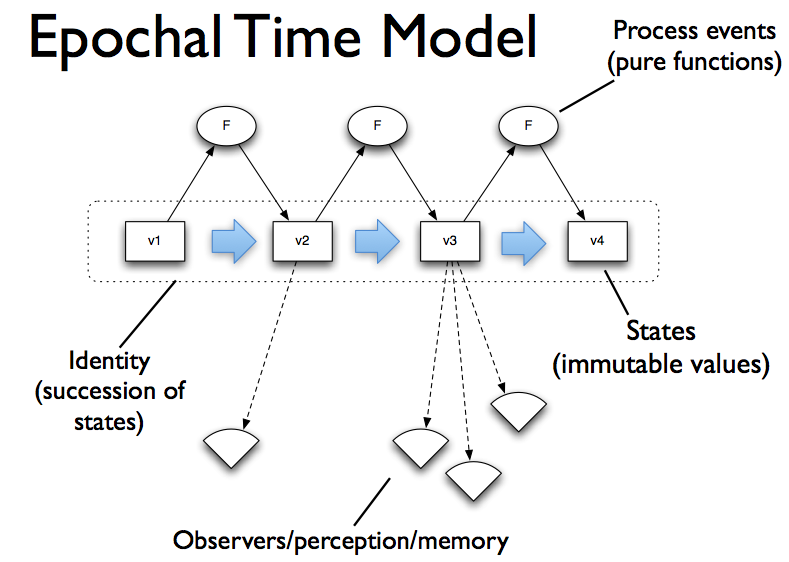

So that gives us a time model that looks like this.  You may have seen
this in another talk I have given about functional programming versus
object orientation.  This is the same problem, precisely the same
problem, in the storage space.

So this is what I was talking about, graphically represented.  The
identity is the dotted box.  It represents a succession of states.
Each state is a value.  We are going to move from state to state via
transformation functions, some sort of process events.

And we want to be able to observe states.  And once we have observed a
state, we want to feel like we have a value in our hand.  And the fact
that time is proceeding should not affect our memory of what we saw.

And it does not in the real world, right?  When things change in the
world, they do not go into your brain and also simultaneously update
your memories.  You have memories of things that, they are always the
past.  In fact, we always perceive the past.  That is how things work.


[Time 0:09:30]

```
slide title: Implementing Values

+ Persistent data structures
+ Trees
+ Structural sharing
```

So how do we implement values?  In memory, we use persistent data
structures.  They are always trees, and they use structural sharing.
And they look like this.  I am not going to spend too much time on
this.  But the idea being, you can represent anything.


[Time 0:09:45]

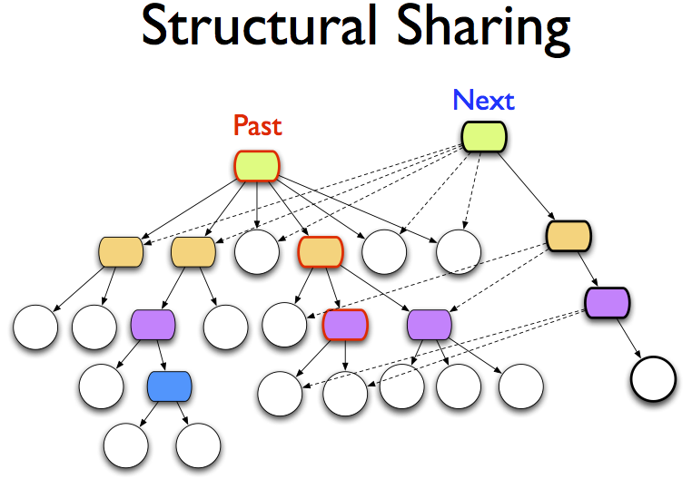

You can represent sets and maps and vectors, all as trees.  And once
you have represented something as a tree, then you can leave that tree
as an immutable thing, and when you want to "change" the value, and in
particular here we are talking about aggregate values.  So like an
entire collection, and we want to add something to it.

You _do not_ copy the entire thing.  You instead make a new tree,
which will at least involve a new root, and a path to the part of the
tree that you had to make anew.  And that new tree can share with the
old tree a whole bunch of stuff.  And in this way, incremental change
is inexpensive, but every particular value of the collection is
immutable itself.

And you know this from linked lists.  You can build linked lists where
it says B, C, D, and you can link A to the rest of that, and that does
not impact the rest of the list at all.  Now I have a list that is B,
C, D, and you have a list that is A, B, C, D, and we share the tail.
There is no problem with that, as long as no one is ever going to
change that in place.

And that is how persistent data structures work.


[Time 0:10:50]

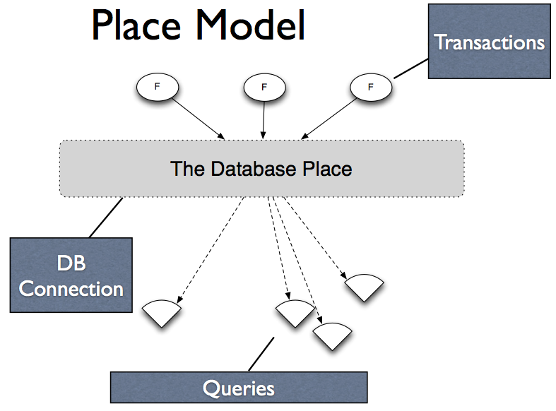

So the problem we have -- and this is _not_ just about SQL databases;
this is a general problem with databases that work this way -- is that
too often the database is a place.  It is this thing.  It may be a lot
of places.  It may be a set of places.  In a key value store it may be
a set of places.  It is still fundamentally a place where we get some
sort of connection to the place.  We can send requests to the place in
order to update it, update parts of it.  And that could be
transactional, or not.

And then we issue queries.  And each time we issue a query we get this
random result out of the contents of the place.  And the same query
later will give us something different.  We never have anything more
concrete than that, that we can hang on to.  It is just this black
box.  It gives novelty, potentially, every time we interact with it.

And there are a lot of problems with this.


[Time 0:11:45]

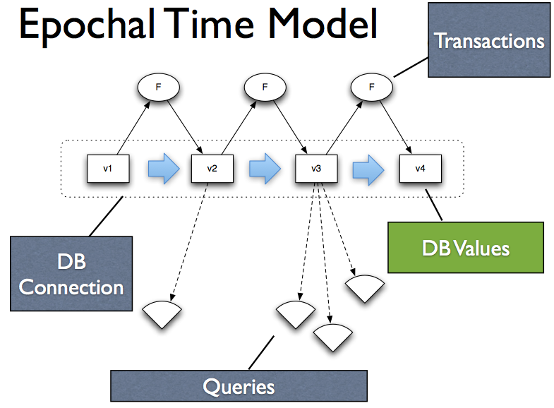

You will recognize: this is the same problem as objects.  They have
the same problem.  They have conflated identity and value.  They are
both the same thing.  This place is both an identity, _and_ where we
keep the values, which means there is no way to get the value
independent of the place, the identity, which should take on new
states.

But unless I have some copy semantic, I cannot really do that, and
copy semantics, again, introduce that coordination problem, and
everything else.  And heaven forbid you try to copy an entire database
like that.

So what we want to do is: we want to adopt this same model, the same
model that corrects the problems of object orientation, for databases.
And we just want to replace that database place, with database values.
So fundamentally we do not want to interact with the connection.
Obviously you have to go through the connection to get a value, but
once you have gotten a value, you should be able to interact with the
value, not keep going back to the connection.

And in that way you can do stable operations.  You can communicate
things to other processes that are stable.  You get all of the
benefits you get from values, for databases.  That is what we are
shooting for.


[Time 0:12:50]

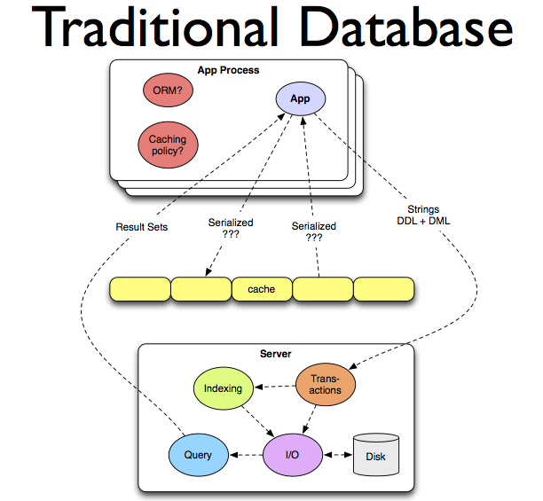

So this is a traditional database.  I do not know if you can read that
text or not.  But you know what is in it.  There is this server.  It
is this monolithic thing.  It does transaction management.  It does
indexing.  It does I/O.  It manages storage.  And it handles query
requests.

And you are separate from it.  And you send it strings or something,
and you get back strings or something.  And you are very terrified of
overloading this thing.  So you stick caching over it.  And the
caching is all on you.  What do you put in the cache?  It is up to
you.  You put the answers to questions, hoping that maybe you will ask
the same question later.  And expiring that, and determining the
policies for it, is all your problem.

And the problem with this is that if we want to scale this, we have to
make that relatively complex thing bigger.  And we know there are
limits to how big you can make one thing.  And then it is going to
burst.  Or we are going to have to make copies of that thing.  And
this is already a really complicated thing.  So we do not actually
want a _lot_ of really complicated things.  It does not get simpler
when we do that.

So this has gotten, correctly, dinged as something that is difficult,
but not impossible, to scale.  But certainly even if you can
successfully scale it, it does not become simpler.  It is very
complex.


[Time 0:14:15]

```
slide title: The Choices

+ Coordination
  + how much, and where?
  + process requires it
  + perception shouldn't
+ Immutability
  + sine qua non
```

[ "sine qua non" is a Latin phrase meaning "an essential condition; a
thing that is absolutely necessary" ]

So if we are going to fix this, we need to make a couple of choices.

The first choice is to be careful about when coordination is actually
required.  How much coordination do we need?  Where do we do it?  And
for what purpose?

Process, which is a term I will use to say "the acquisition of
novelty", of novel information, is something that requires
coordination.  In the end, I do not care if it is transactional or
eventual consistency.  That thing at the end that is going to merge
together your stuff, that is a form of coordination.  There have to be
rules to govern what is allowed, and what is not.  Somebody has to be
responsible for doing it.  We cannot all do it.  One person has to
eventually say, "I am taking these two things, and turning it into
this merged result."

So there is coordination associated with process.  But perception as I
said before, is something that we want to avoid coordination for.  And
we want to remove that.

I am going to say that immutability is a fundamental premise of
solving this problem.  If you do not use it, you cannot solve it.
Period.  There is just no good way to do it.  And you will see the
benefits as we go through.


[Time 0:15:20]

```
slide title: Approach

+ Move to information model
+ Split process and perception
+ Immutable basis in storage
+ Novelty in memory
```

So the approach that is taken by Datomic, which is trying to solve a
bunch of problems.  You may not want to solve all of those problems,
and you may have a subset of them, in which case some of the things
Datomic does may apply to your architectures independent of the
others.  But because we are trying to do all of these things, very
specific things will appear in our design.

So we want to move to an information model.  We want to move away from
a place oriented model to information.  And I am going to talk about
that in the next slide.

We want to split apart process: change acquisition; from perception:
queries, reading, things like that.  Transactions, perception,
queries.  They should not be colocated.  They should not be
intermingled.  They need to be taken apart.

We want to use storage in a way that is fundamentally immutable.
There are a bunch of architectural advantages to that.  There are a
bunch of informational advantages to that.

And we are going to also supplement storage with memory so that we can
do this efficiently, and that is sort of an implementation technique
that I will talk about.


[Time 0:16:20]

```
slide title: Information

+ Inform
  + 'to convey knowledge via _facts_'
  + 'give shape to (the mind)'
+ Information
  + the facts
```

So what do I mean by information?  The word "inform" means "to convey
knowledge via facts".  And information is just "the facts".  So we
want to build a system that stores facts.  And facts, it means
something very specific.  A fact is something that happened in the
world.  There are other things you might use storages for, other than
information.  Sometimes you need a place to keep stuff.  Datomic is
not about keeping stuff.

It is perfectly fine to need to keep stuff, and have systems that just
keep stuff.


[Time 0:17:00]

```
slide title: Facts

+ _Fact_ - 'an event or thing known to have
  happened or existed'
  + From: factum - 'something done'
  + Must include time
+ Remove structure (a la RDF)
+ Atomic _Datom_
  + Entity/Attribute/Value/Transaction (time)
```

[ RDF is "Resource Description Framework" - https://www.w3.org/RDF ]

But if we are trying to build an information system, we need to really
actually be aware of what that stuff is.

So we are going to say this stuff is facts, which means "something
that happened".  It is a fundamental part of the word.  The word is
derived from a past participle that means "something that already
happened".

And one of the key things that falls out of that is: facts _cannot_ be
changed.  They are recordings of what happened in the past.  You do
not change facts.  You do not update facts, or anything like that.
What do you do?  You accumulate new facts.

A fact must have occurred at a point in time, so you have to have some
path to time.  And it is important if you are going to build a system
that is about the accretion of facts, that you have a representation
that your structural representation is minimized.  You do not want to
have this big composite thing and say, "I need to add a fact to it,
like in the middle here."  And store this whole thing to get that new
piece of novelty in.  You need to actually boil down your data
representation to be that primitive thing.

And we call that a Datom.  But it is just an entity, an attribute, a
value, and some path to time.  We use the transaction, because it is
also a path to other information about what happened, including
provenance, or causality, or operations, or anything else like that.


[Time 0:18:25]

```
slide title: Database State

+ The database is an expanding _value_
  + An accretion of _facts_
  + The past doesn't change - immutable
+ Process requires new space
+ Fundamental move away from _places_

[ Background image of this slide is growth rings of a tree trunk. ]
```

So the fundamental difference here from a place-oriented database is
that we are going to consider a database to be a value, but we know
things change over time.  So how do you have something that is both a
value, immutable, _and_ have novelty over time?

And the analogy I make here is to tree rings, but they do not show up
that well on the slides.  But a tree grows, and there are new rings,
and they get added to the outside.  But if you had a view of the tree,
of the middle of the tree, the fact that the new rings are being
added, it does not impact you.  In other words, any particular value
of the database is unimpacted by the novelty that comes later.  That
view is still stable.

I can say that is a value, and it meets all of the criteria of value.
It is immutable.  It does not change.  I can convey it potentially to
somebody else.  And we will see how that works a little bit later.

So a database is about accretion of facts.  And in that way we get
something that both "changes", it grows bigger, and still feels
immutable to the consumers.  Because anyone who is looking at a
particular inner set, or a past point in time before that, has
something that is perpetually stable to look at.

That means that process, novelty, new information, requires new space.
This is a physics problem.  There is just no way to get new stuff, and
keep old stuff, and not have new storage for it.

On the other hand, we are doing this already.  How many people keep
your source code in the file system, in a directory?  And you just
change code, and you just store it over the old code?  I always get
one person that raises their hand.  That is crazy.


[Time 0:20:01]

```
slide title: Accretion

+ Root per transaction doesn't work
+ Latest values include past as well
  + The past is sub-range
+ Important for information model
```

No, we do not do that, right?  We don't do that.  But there was a time
where we were like, "Oh, my god!  Keep every version of every source
file we have?  There is no way we can do that.  We are going to fill
our floppy."

[Audience laughter]

It is not like that any more.  Systems, in the time I have been using
computers, are a million times more capacious than they were.  That is
not an exaggeration.  That is the actual number.  A million times more
capacious.  We do not need to be worrying about space.

And of course we are already doing this.  Everybody is keeping
everything.  Everybody is logging everything.  We are keeping it
around.  And in terms of the kinds of information you would keep in a
database like this, it is certainly no burden to acquire new space.
And we move away from places by doing this.

Now I showed you a picture before about how we do persistent data
structures in memory.  We have this tree.  And we say I want a new
version of the tree.  And I create a new root, and I sew together a
new path to the new data, and I point at all the old data.  And
because I did that in my program, I had this implicit handoff.  I had
the old version of the tree, and I made a new version of the tree.
And I had that in my hand.  And garbage collection got rid of the
other one, if no one was looking at it.

You cannot actually do that on the disk.  Because that would leave us
with a new root for every change to the database.  And instead of
having this ever growing tree, we would have a whole bunch of
independent snapshots.  And no snapshot would necessarily contain the
past.

So instead, what we want to do is say: every value incorporates the
past as well.  It is not a whole bunch of snapshots.  And this ends up
being really important for the information model as well, because you
really want to issue queries across time.

It is a terrible shame when we use databases that force you to
overwrite the email address.  Because when you have a problem, it is
like, "You never notified me about my shipment."  I don't know, what
is your email address?  Oh, that is the email address I have.  If I
could look at the database at the point in time that I notified you, I
could look and say, "Ooh.  We used to have this other email address,
and that is where I sent it."  Or have this other physical address,
and that is where I sent it.

When we update in place, we lose the ability to do that.  We also lose
the ability to answer questions that cross time.  What is happening?
We have a supplier, and they change their prices.  And if we are using
a place-oriented database, we just update the prices in place.

But then the business person comes to us and says, "This supplier
really seems to be jerking us around."  Or maybe they say, "There
seems to be this seasonality to their pricing.  I wonder if we could
game that and get better pricing by ordering at different points in
time.  What is the history of the pricing?"  I don't know.  Every time
they give us a new price, we update the price in place.  I have no
history of that.  If you keep everything, you will be able to go and
say, "Oh, look at this!  Every June they raise their prices.  Let us
order in May."


[Time 0:23:00]

```
slide title: Process

+ Reified
+ Primitive representation of novelty
  + Assertions and retractions of _facts_
  + _Minimal_
+ Other transformations expand into those
```

I am not going to talk too much about process, but the critical thing
about a design like this is that when you have novelty, you do not
want to have effects.  You do not want to say, "Something changed in
the world.  Let me just affect things."  You want to take that change
and turn it into something concrete that you store.  Anybody who is
used to event sourcing, it is a representation of that idea.

But the general notion is that you have to reify process.  You have to
turn it into a thing that you can look at and touch.  Whether that is
a log, or whether that is inside the data itself, which is what
happens in Datomic, you do want to keep track of that.

And you want it to be minimal.  If you are going to keep track of
everything, you cannot say every time you change a single thing, you
have to store a new row, or a new document.  That does not work.


[Time 0:23:45]

```
slide title: Deconstruction

+-----------------------------------------------+
|                   Server                      |
|                                               |
|    +------------+         +----------------+  |
|    |  Indexing  |<--------|  Transactions  |  |
|    +------------+         +----------------+  |
|                 \         /                   |
|                  \       /                    |
|                   V     V                     |
| +---------+      +-------+     +--------+     |
| |  Query  |<-----|  I/O  |<--->|  Disk  |     |
| +---------+      +-------+     +--------+     |
|                                               |
+-----------------------------------------------+

+ Process             + Perception/Reaction
  + Transactions        + Query
  + Indexing            + Indexes
  + O                   + I
```

So we are going to break this apart.  This is the old database that
did everything in one place.  And the first thing we do is: we
partition it into process and perception.  Process is the
transactional part, the coordination required to do that, especially
if we want to have a consistent system.  That means we only want to
have changes enter the system that are consistent with the business
rules for the data.

And we have perception, which is the query side.


[Time 0:24:13]

```
slide title: State

+ Must be organized to support query
+ Sorted set of facts
+ Maintaining sort live in storage - bad
  + BigTable - mem + storage merge
  + occasional merge into storage
  + persistent trees
```

So we have the problem of: how do we represent state?

The critical thing when we are talking about data stores and
databases: we used to have no databases.  And then we had file
systems, which let us put stuff somewhere with a name or a path, and
get back to the stuff.  But we did not call them databases.

Then eventually we had things we called databases, and those databases
did something that the file systems did not.  They gave you _leverage_
over the information that they were storing.  They knew something
about what was being stored.  They imparted some sort of organization
to what was being stored, so that when you wanted to find something
specific, or get an answer to a particular question, there was some
leverage to apply beyond: well just go look at every single byte in
the thing, and figure it out.  And it is that leverage that makes
something a database.

So when we talk about storing this state, I think we want to talk
about storing the state in a way that is organized such that we can
get leverage.  And I would characterize query as leverage.

So we are going to just say the database is a sorted set of facts.  In
fact, it is multiple sorted sets of facts.  And we know from systems
like BigTable that that is not something you can efficiently do live,
into storage.  If every time you had a new piece of information, you
needed to modify your entire index, to put it in the middle of it, and
do that in an immutable way, you would churn through storage
relentlessly.  It is not practical.

So we have systems like BigTable.  What does BigTable do?  It treats
storage completely immutably.  But what it does is: it accumulates
novelty in memory until it has got a block of a certain size, 64 megs
or something like that, and then it blits that out to disk, and starts
accumulating more stuff in memory.

That has nothing to do with durability.  While it is doing that, it
could be logging everything as it comes in.  So the durability for the
purposes of: can I restart?  Can I make sure I have not dropped
anything?  has nothing to do with this.  This is about indexing.  You
accumulate novelty in memory.  You could also have logged it.  Then
periodically you put that into storage, and a process integrates the
novelty, in a batch way, into the index.

In the case of BigTable that is a merge join that is done in the file
system, and in the case of Datomic, that is a merge of these trees,
also done in storage.  So it works the same way.  You accumulate
novelty in memory.  Occasionally you put it in storage, and you use
persistent tree merge to do it.


[Time 0:26:40]

```
slide title: Indexing

+ Maintaining sort live in storage - bad
+ BigTable et al:
  + Accumulate novelty in memory
  + Current view: mem + storage merge
  + Occasional integrate mem into storage
    Releases memory
```

So indexing is just this merging.  It just says: I have accumulated a
certain amount of novelty in memory.  I can now amortize the cost of
integrating that in the tree.  So instead of making a new root for
every new piece of information, I now say I have accumulated a whole
bunch of information.  I will create a new root and amortize the cost
of making the inner leaves to accumulate the stuff.

So it is the same thing.  It is just like BigTable.  We merge them
together.


[Time 0:27:10]

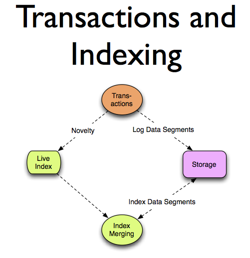

So this is what transaction processing and indexing looks like.
Transactions take novelty as it comes in.  It immediately logs that.
Again, that is the durability side.  It is not really the
organizational side.  And keeps novelty in memory where it is
organized on the fly, and sorted in memory so it can answer questions
from memory.

Periodically this merge job will take that live index from memory and
integrate it into a new tree in storage.  That tree is sharing
structure, just like the other picture.


[Time 0:27:45]

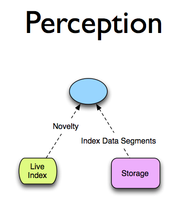

And then we can look at the perception side.  Now the perception side
means: I want to ask a question and get an answer.  I want to ask
query-like questions, and I want to get answers at the speed that
indexes can help me get.

Well in order to do that, I need access to storage, because the last
stable index in storage is sitting there.  Plus I need access to the
delta, what has happened since then, from memory.  And it is the same
thing BigTable does.  If you ask BigTable a question, it does a live
merge join between the file system and what is in memory.  And Datomic
works the same way.  It is a live merge join between the live index
and storage.

The only difference is it is a tree instead of flat files.

The key thing here is: what coordination is required to do this?
None!  The exact right amount.  Zero.  There is no talking to the
server.  There is no need for a transaction.  The stuff in storage is
immutable.  The stuff in memory is immutable.  It uses the same
technique, a tree here and a tree there.  The join is stable.  There
is no coordination required at all.  As long as you have read access
to storage and access to the live index, you are good.


[Time 0:29:03]

```
slide title: Components

+ Transactor
+ Peers
  + Your app servers, analytics machines etc
+ Redundant storage service
```

So the components of the system, roughly, are: there is a transactor,
which coordinates a request for change.

There are peers, and these are actually your application servers,
because now you are no longer tied to this big database server.  We
are going to empower application servers with query capabilities and
direct access to storage.

And some sort of storage service.


[Time 0:29:25]

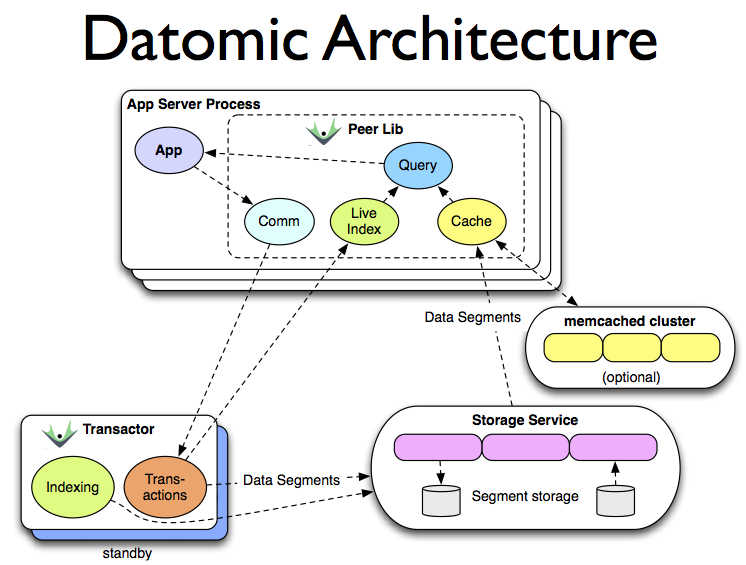

So that whole thing looks like this.  If we start in the bottom right,
we see a storage service.  It is a quite interesting aspect of Datomic
that it is not in the business of disks at all.  There are lots of
good storage services that already exist.

If you take a systems approach to the problem of: how do you make a
new kind of database, you say, "I should be reusing those."  I should
not be reimplementing DynamoDB, and I should not tie the way I use
storage to the details of how I do transactions or queries.  I should
use that a la carte.

And so that is what happens.  Datomic can run in memory.  It can run
against a SQL database.  It can run against DynamoDB.  It can run
against Infinispan and similar memory type grids.  It can run on top
of Riak, as we will talk about later.

And in each case, we can make decisions about storage that are
orthogonal to the other decisions we make.  That is exactly the point
that was made in the keynote this morning.  A systems approach will
give you choices about how you integrate the systems, and when you use
the different parts.

If we move to the left, we see the transactor.  It does transaction
coordination.  So anybody who has some novelty they want to have enter
the system will supply it to the transactor.  The transactor has no
storage at all.  It is strictly a coordination thing.  It will take
the novelty, integrate it into the live view, and put it into storage.
When it puts it into storage directly, that is a logging, append-y
kind of process.  It is the indexing that is going to build the sorted
view that gives us the leverage.

In the case right now, the transactor also does that periodic
indexing, but that could be moved to a different machine.

Finally, if we look at the top we end up with the application server
process, which now is empowered with both read access to storage, and
its own query engine.  So we have relocated query from a monolithic
place where we go to answer questions, to everybody gets their own
brain.

And once you go to everybody gets their own brain, you now have a
system that is scalable.  If you have bigger load and you have to
answer more questions, you can just add more servers here, which you
are already adding, because you are adding these servers as the load
increases anyway.  And that is elastic.  As you do not care any more,
you just have them go away.

The other thing that is interesting about this is the way caching
works.  We saw a picture of cache in the traditional database model
before.  And what did we put in cache?  We put the _answers_ to
questions in cache, hoping maybe we will ask the same question again
later.  And we are doing it because we are trying to keep the burden
off of this single monolithic server, or cluster of servers.

_Now_ what gets cached, and this happens automatically, under the
hood, if you just configure "please use memcache", is that the
_sources_ of answers get cached.  In other words, the actual pages of
indexes from the storage get put into memcache, which means that all
of the queries have access to the resources they need to answer
questions from memory directly.

What actually gets put in storage is not the individual facts.  When
we looked at those trees before, what actually is getting put into
storage are chunks of index, segments, just like the blocks that a
traditional database puts in a file system, in a B-tree in the file
system.  Datomic puts chunks of index into storage, and all it needs
from storage is key-value style access.  And we will talk about the
consistency model in a second.


[Time 0:33:10]

```
slide title: Transactor

+ Accepts transactions
  + Expands, applies, logs, broadcasts
+ Periodic indexing, in background
+ Indexing creates garbage
  + Storage GC
```

So I talked about the transactor.  It does accepting transactions.
The other thing it does is it also rebroadcasts to peers the novelty,
so that they can maintain their own live index in memory.  And
therefore when they do their queries, they do their own merge joining.

So the transactor does that.  It does background indexing.  Indexing
creates garbage.  So we end up with the notion of garbage in storage,
just like we do in memory.  We just acquire new memory with "new",
right?  That is a great thing, but it creates garbage.  And it should
not be surprising when you move to an immutable process where new
information requires new storage that you end up with an analogous
thing on disk.  You end up with garbage on disk, and garbage
collection for disk.


[Time 0:34:00]

```
slide title: Peer Servers

+ Peers directly access storage service
+ Have own query engine
+ Have live mem index and merging
+ Two-tier cache
  + Datoms w/ object values (on heap)
  + Segments (memcached)
```

That is fine.

I talked about this pretty much already.  Peers have direct access to
storage.  And these storage systems, you can imagine something like
DynamoDB or Riak, these are highly scalable, redundant, distributed,
highly available systems.  They are quite capable of serving an
equally scalable set of readers at very high speed.  So they have
direct access.

They have the query engine.  They do the merging.  And there is
extensive caching.  What is great about the fact that everything we
are putting in storage is immutable is: we can cache it relentlessly.
You can cache it anywhere you want.  It is never going to change.

So you can see from this that we have now teased apart some of the CAP
stuff.  We end up with one consistency and availability model for
writing, and a different one for reads and queries.

How many people saw Mike Nygard's talk this morning?

[ QCon 2012 page: Michael T. Nygard, "Exploiting Loopholes in CAP"
https://qconsf.com/sf2012/sf2012/presentation/Exploiting%2bLoopholes%2bin%2bCAP.html

Video: https://www.infoq.com/presentations/cap-loopholes

Slides: https://qconsf.com/sf2012/dl/qcon-sanfran-2012/slides/MichaelT.Nygard_ExploitingLoopholesInCAP.pdf ]


[Time 0:35:00]

```
slide title: Consistency and Scale

+ Process/writes go through transactor
  + traditional server scaling/availability
+ Immutability supports consistent reads
  + without transactions
+ Query scales with peers
  + Elastic/dynamic e.g. auto-scaling
```

It was a great talk.  So Datomic actually has loop-holed 2, 8, and 10,
all put together.

So we have a traditional availability model for writes.  A transactor
can have a backup.  It is high availability only by standby, and if
you get partitioned you lose availability.  But this system is
oriented towards consistency, so that is where the tradeoff was made.
There is nothing wrong with making a different tradeoff.  The trick
is: understanding tradeoffs need to be made, and making tradeoffs when
you need to make them.  And getting the solution that you need for
your business.

But on the read side it is completely different, because of two
things.  One is, everything we put into storage is immutable, which
means that we actually end up getting consistent reads.  Because it
was written consistently, we never have an issue about seeing half of
something.  We are always going to see the entirety of something, or
we will not see it at all.  I will talk about that a little bit more
in a minute.

And then query scales with peers, and it scales in an elastic way, not
in a preconfigured, "I am going to have 17 peers", and I set that in
my configuration file.  But in a real, I just set up AWS auto scaling
and I get more or fewer as load goes up and down.


[Time 0:36:30]

```
slide title: Memory Index

+ Persistent sorted set
+ Large internal nodes
+ Pluggable comparators
+ 2 sorts always maintained
  + EAVT, AEVT
+ plus AVET, VAET
```

So I am going to talk a little bit about the memory index.  It is this
persistent sorted set.  It has big internal nodes, just like the one
on disk.  Not quite as big as the one on disk.

And there are a couple of sorts.  We sort by entity, and we sort by
attribute.  That means you get the effect of something more like a
document store when you via the entity orientation, and you get
something much more like a column store when you go by the attribute
orientation that keeps all the values of email next to each other.  So
you do not have to pull whole records, and there is no notion of
record.

There are these Datoms, and you can sort them different ways.


[Time 0:37:00]

```
slide title: Storage

+ Log of tx asserts/retracts (in tree)
+ Various covering indexes (trees)
+ Storage service/server requirements
  + Data segment values (K->V)
  + atoms (consistent read)
  + pods (conditional put)
```

Storage itself is the same kind of thing.  It is this tree.  We store
the log as a tree.  We store the indexes as a tree.  And they are
fully covering indexes.  So I use the word index, but it is not
actually a pointer to something else.  It is a covering index, all of
the data is in each index.  It is just sorted different ways.

And from the storage service we have very basic requirements.  We have
to be able to put things and, and get them back as keys.  And that is
why I call it storage.  At this point, that storage is not looking
like a database.  It is looking like storage.  And there is nothing
wrong with that.  It is very important that this component is there,
and has the qualities that it has.

So we put values in under keys.  And the keys are just like UUIDs that
label the immutable blocks of index that go in there.  And there are a
couple of cases where we need consistency, in order to support the
consistency model above.  There is no magic trick that I can get
consistency out of inconsistency.

And I will talk about that more in a context.


[Time 0:38:05]


So I just want to show you this picture again.  This is happening on
disk, but not immediately each change.  This notion of trees will move
from one to another.


[Time 0:38:15]

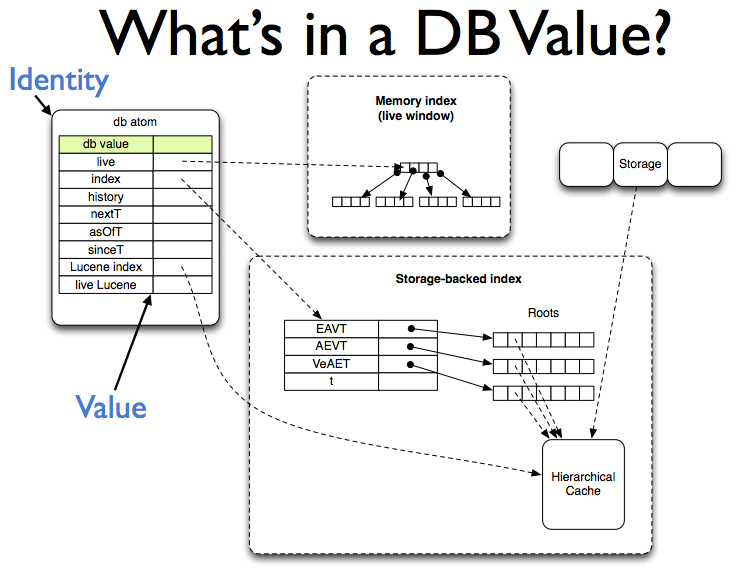

So in memory, this is what it looks like.  We have some immutable
thing.  It is inside a box.  That box is called an atom in Clojure,
but it does not really matter.  We can consider it a pointer.  Things
that are immutable are always pointers, and the things they point to
are always immutable.  That is the recipe for that Epochal Time Model
I showed you before.

And actually it was said in the keynote this morning.  He talked about
the way you use immutability and pointer swap.  That is how Datomic
works.  Exactly that.

So in memory we have this pointer to something that is immutable,
which itself points to the memory index, which is another one of these
trees that is immutable and it does the same thing.  And then it
points to a tree in storage.

And I will show you that here.


[Time 0:39:05]

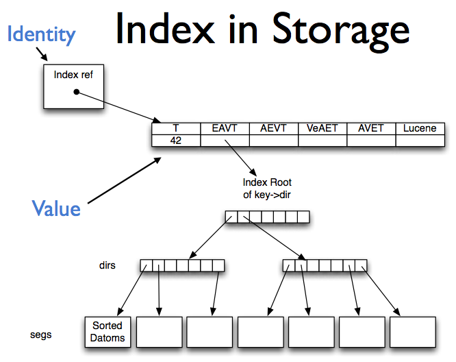

So in storage it looks like this.  There is a cell in storage, an
entry, which is the identity.  How do you find a database in storage
if it is always immutable, and there are always new values, how do you
go from, "I would like to open the customer database", to "one of
those trees"?  Well there has to be at least one mutable thing, which
is "the customer database is there".  A pointer.

There is one of those.  In fact, there are probably four of them per
database.  That is it.  That is all of the mutability you need to make
a database.  That point to an entire tree, which is itself a pointer
to a set of trees, one for each sort.  We can also store Lucene data
the same way.

And then that is a bunch of blocks, just like B-tree blocks that form
this tree with a wide branching factor.  And those all get stored as
blobs in the storage.  So all of the segments of this tree are stored
as blobs in storage.


[Time 0:40:05]

```
slide title: Datomic on Riak + ZooKeeper

+ Riak
  redundant, distributed, highly available
  durable
  eventually consistent
+ ZooKeeper
  redundant, durable,
  consistent (ordered ops + CAS)
```

So I wanted to talk about one particular implementation of storage
under Datomic that is interesting because we desperately wanted to
support Riak.  It is very popular.  It is a very high quality product.
We have a lot of customers who are interested in using it.  But Riak
is only eventually consistent at the moment.  So it is not actually a
store that can satisfy all of the requirements of Datomic.

So in order to make Datomic run on Riak, we had to build another
storage service out of two other services.  I think this is the best
thing ever, because I do not want to write any of this stuff.  But I
love the fact that things like Riak, and in this case we chose
ZooKeeper, exist, do one thing, do one thing really well, have really
great semantics, and are things you can use as building blocks.

This whole notion of, "I am using Riak, and therefore my world is
Riak."  You do not need to do that.  Riak is a tool.  You can use it
for its own benefits, and use it as a piece of a bigger composite
thing.  And that is what this does.

So Riak has these properties.  It is redundant.  It is highly
available.  It is elastic.  It is distributed.  It is durable.  But it
is eventually consistent.  We need to supplement that, because we need
these pointers.  We need to store these pointers somewhere.  And they
need to be written in a consistent, and actually with CAS, way.

And so ZooKeeper does that.  ZooKeeper is both redundant and durable,
and consistent.  It does not scale like Riak does.  It is not actually
for that kind of storage.  It is for very small amounts of storage.
But that is what we have.

We have this beautiful thing.  We have all of this immutable data, and
possibly tons of it with tons of readers.  We have a tiny, tiny, tiny
little bit of mutable data that has to be manipulated consistently,
and it is very infrequently read.  That is _exactly_ what ZooKeeper is
for.  It does exactly that job.

So it looks like this.


[Time 0:42:00]

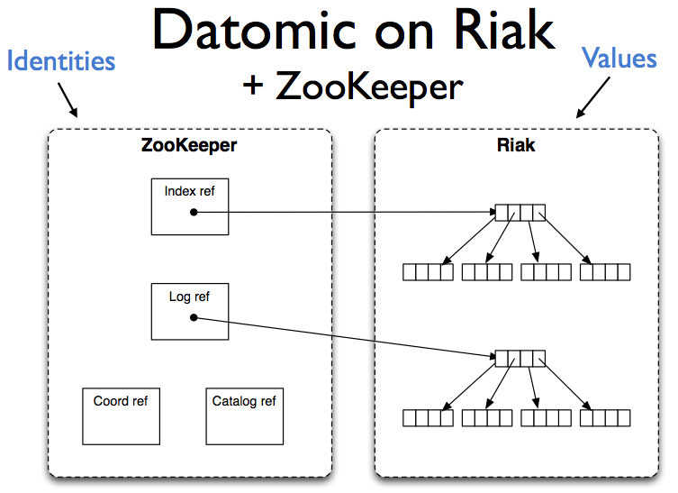

We keep the values in Riak.  Everything we put in Riak is immutable.
It is those big chunks of index.

And we put the identities in ZooKeeper.  A couple of pointers per
database, that point to where the roots are in Riak.  And we use
ZooKeeper's CAS semantics to make sure that they are updated in a
consistent way, and viewed in a consistent way.


[Time 0:42:25]

```
slide title: Riak Usage

+ Everything put into Riak is immutable
+ N=3, W=2, DW=2
+ R=1, not-found-ok = false
  'first found' semantics
+ There or not
  no vector clocks, siblings etc
+ No speculative lookup
```

So everything we put into Riak is immutable.  These are some details.
How many people know about Riak or Dynamo?  So this is just a little
bit of information about that.  If this makes no sense to you, it is
fine.

But we can presume N replicas of 3.  We write with a quorum write of
2.

But the really really interesting thing is the read side.  We read
R=1.  Who starts worrying?  R=1.  You wrote N is 3 and W is 2, and R
is 1.  That is not what I read in the Dynamo paper, for consistency.

But _everything_ changes -- Mike Nygard mentioned this earlier --
everything changes if _all_ you ever write is something immutable,
because then there are only two possible things.  It is there, or it
is not.  There are no other possibilities.  There is no: it was
updated, there was this vector clock, there was this causality of how
it got to be this way.  There is none of that.  It is there, or it is
not.

If it is there or it is not, you can read with R=1, as long as you
have one additional semantic, which is: if you do not find it, try
another guy.  Because as soon as you find any value of it, you have
found _the_ value of it, unambiguously.  That is super efficient, and
really really clean.

So we do R=1, and Riak has not-found-ok as a flag, and if you set that
to false it means: if it is not found on the first read, it will try
another.  And only if it exhausts N will it come back and say: I am
sorry, it is not there.

That is coupled with another thing, which is: do we ever look in Riak
for something that might be there, or might not?  Do we do any
speculative lookup?  No.  Never.  We found the root in ZooKeeper.  The
root is ABCDE, 12345.  When we go to look for that in Riak, we expect
it to be there.  We are not randomly picking a number out of the ether
and saying: do you have this?  Do you know this?  You are never doing
that.  You are always saying, "Somebody told me you had this.  Give me
it."

When we get that value, we get this block of pointers to other values.
Guess what?  They should all be there.

So the combination of immutability and these semantics completely
change the way you can use something like Riak, and drastically up the
consistency that you get.  Because if you have rough availability to
the data and your reads are all satisfied, you know you are always
getting something that is consistent from the application view, what
Mike Nygard called the _predicative_ notion of consistency.  That this
set of data matches the business requirements notion of what
constitutes a consistent data set.  You are never seeing half of one
tree, and half of another tree.

You started from a root.  You found all of the things that were under
it.  That is a consistent view of the world.


[Time 0:45:25]

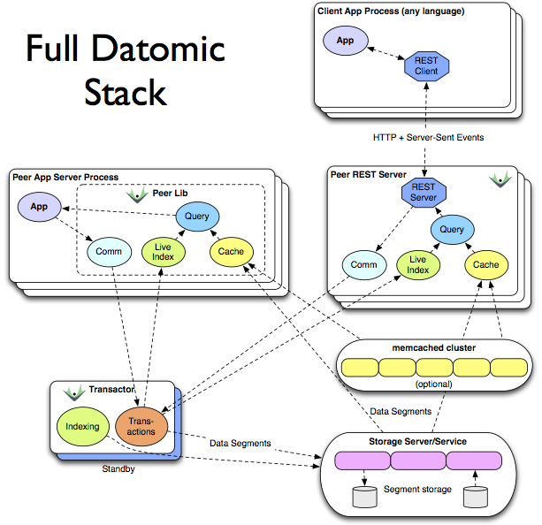

The full stack for Datomic looks like this.  I am not going to have a
lot of time to talk about this, except to show you that there is also
a RESTful interface, which is more client/server oriented.


[Time 0:45:36]

```
slide title: Stable Bases

// Peer
Database db = connection.db().asOf(1000);
Peer.q(aQuery, db);
                               "1000" in both is the "basis"
// Client
GET /data/mem/test/1000/datoms?index=aevt


+ Same query, same results
+ db permalinks!
  + communicable, recoverable
+ Multiple conversations about same value
```

But this just shows you some of the cool things that you can get once
you have the database as a value.

In the first case, we are using Java.  In one of these first class
peers, we say connection dot get the database.  And we can say dot as
of some point in time.  We can ask for one of the inner rings.  And
then we get a value of the database that is that set of inner rings,
that set of data from that point and prior.  And we can issue queries
to it over and over, always with the same basis.  Every query we issue
to that value of the database has the same basis.

And that even works when you go over a client/server protocol like the
RESTful client.  You actually can have permalinks for databases.  I
want to go back to this.  I want to remember this database.  I want to
tell somebody: I think this database was messed up.  And I can send
them a link, and three weeks later they can go look at that link and
say, "Oh yeah, that looks bad."  Let us fix our code and run it
against the same database and see if it is better.

So it is communicable.  You can recover it.


[Time 0:46:38]

```
slide title: DB Values

+ Time travel
  + db.asOf - past
  + db.since - windowed
  + db.with(tx) - speculative
+ dbs are arguments to query, not implicit
  + mock with datom-shaped data:
    [[:fred :likes "pizza"]
     [:sally :likes "Ice cream"]]
```

And there are all kinds of things you get from treating the database
as a value.  You can say as of a point of time in the past.  You can
window it.

You can take a value of the database and say, "I wonder what this
database would look like _if_ I made these transactions."  You can do
that completely locally.  You do not have to talk to the transactor or
the server.  You do not mess up anybody else.  You say: I have the
value of the database.  I am thinking about putting this data in.  I
am going to actually say: Give me that database, with this data.  Then
I can issue some queries and say: do the queries still work?  Or does
this meet my requirements?

OK.  Good.  Now I will really put it in via the transactor, to the
version of the database everyone can see.

The other thing that is key is that everything about database flips
around.  Database is an argument to query.  It is not the ambient
container for a query.  Which means you can have queries that involve
more than one data source, including things in memory.


[Time 0:47:30]

```
slide title: DB Simplicity Benefits

+ Epochal state
  + Coordination only for process
+ Transactions well defined
  + Functional accretion
+ Freedom to relocate/scale storage, query
+ Extensive caching
+ Process events
```

So I think there are a ton of simplicity benefits you get from this.
I do not have time to really dig into them.

But transactions are well defined.  We only have coordination for
novelty, not for perceptions.

You can put your storage anywhere you want, and you have a lot of
freedom about how that works and how it scales.  You can cache
anywhere.

And process is reified, which means both: you can look at it and see
what happened, and you can transmit it around and therefore build
reactive systems.


[Time 0:48:00]

```
slide title: The Database as a Value

+ Dramatically less complex
+ More powerful
+ More scalable
+ Better information model
```

So I think the net approach that you get out of this is that things
are a lot less complex.  You get a lot more power.  You can see the
scalability of query and reads.  You can take advantage of this great
technology like Dynamo databases and things like that.  And I think
you get an information model that is a lot more sound.

So hopefully this has given you some ideas for your own architectures.
And thanks very much.

[Audience applause]

[Time 0:48:26]
