# Design, Composition and Performance

* **Speaker: Rich Hickey**
* **Conference: [QCon San Francisco 2013](https://qconsf.com) - Nov 2013**
* **Video: [http://www.infoq.com/presentations/design-composition-performance-keynote](http://www.infoq.com/presentations/design-composition-performance-keynote)**

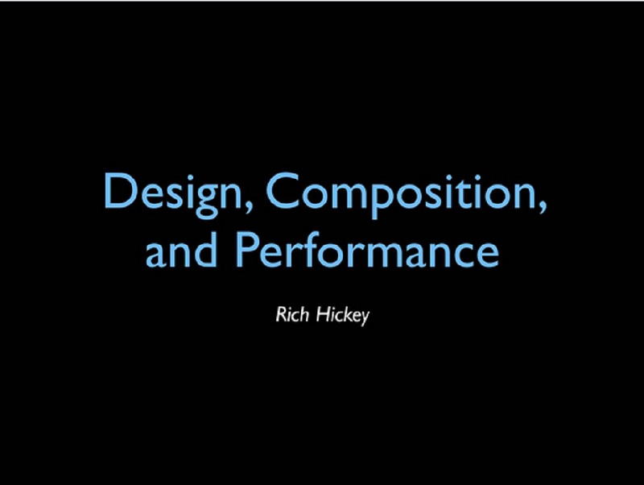

Hi. Thanks for coming. I'm very excited about this conference. It's always great, and I would like to thank the organizers for inviting me today to talk about design, composition and performance. So we start with a legal disclaimer prepared by lawyers.

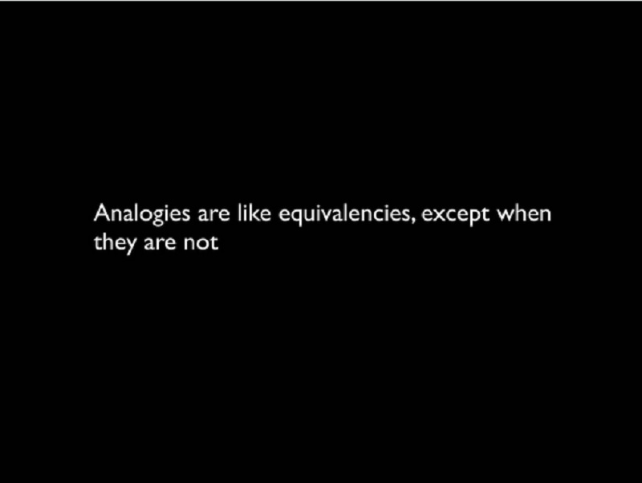

We're going to have some fun with analogies today and, the cool thing about analogies is, they're as much fun when they're wrong as they are when they're right.

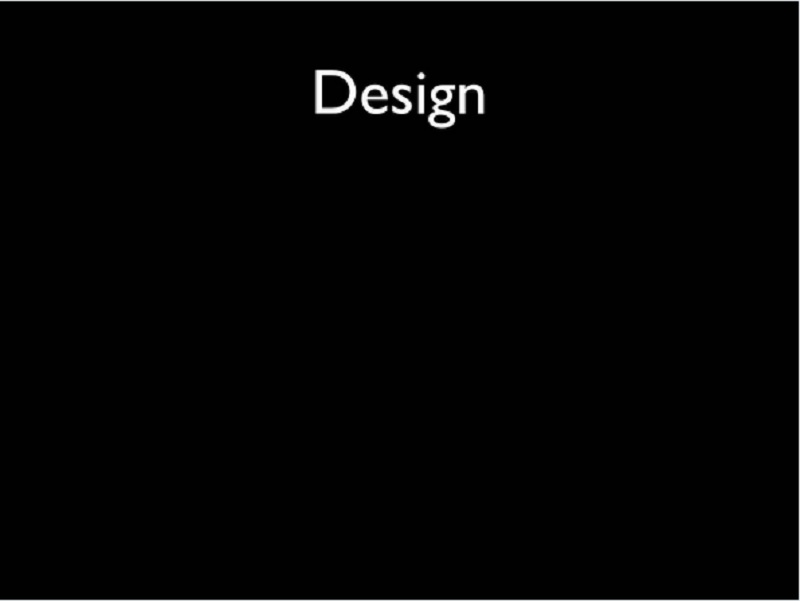

So, design is something we talk about a lot in software development.

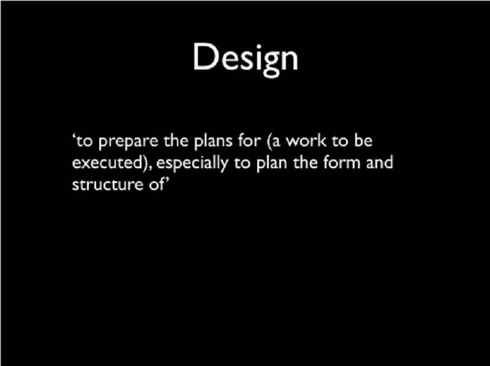

But I think it is something that's somewhat beleaguered these days, not because people don't do it, but because I think people are in a hurry and they're trying to get things done. And I often get developers asking: I'd like to be able to work at the next level and talk about, you know, the design of things before I just code up solutions.

So, what does it mean to design something? And as you all know, all I do to prepare these talks is go to dictionary.com and look stuff up. So I looked up design, and one of the definitions is this, which is really great. Definitions are always great. It says, "To prepare the plans for (a work to be executed), especially to plan the form and structure of that work."

And I think that's super important, the notion of executed. It means that somebody is going to do this. We also have a different notion of executing things in software, which is that this is going to run, which is also interesting.

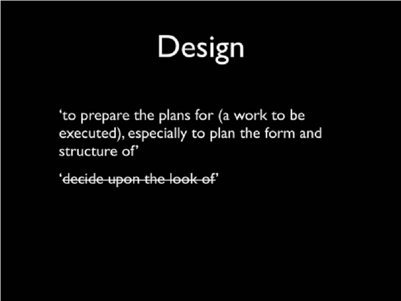

There's another definition, which is to decide what the look of something is. And there's nothing wrong with that kind of design. I just want to say this talk is not about that at all. Never when I say design do I have this meaning in mind.

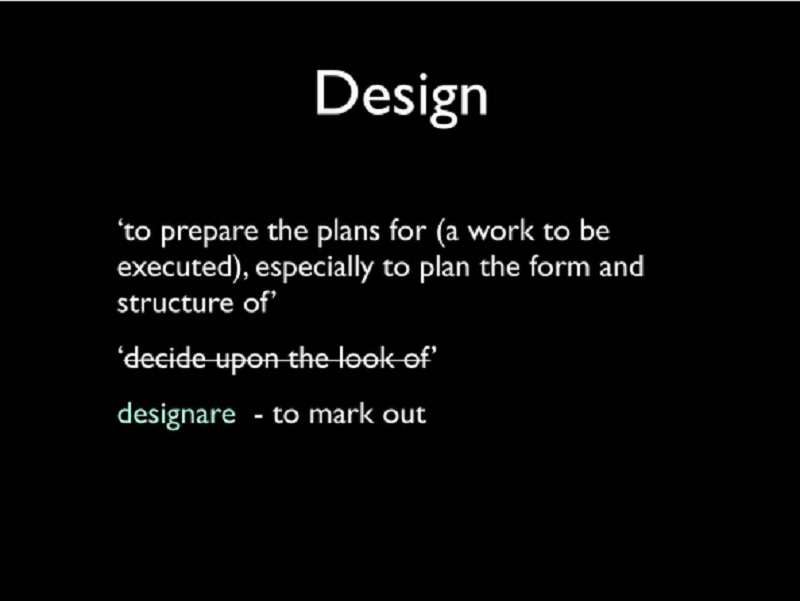

And, of course, we go to the roots and see that the root is in to mark stuff out, and that matters. So there are really sort of two things here: We want to make a plan, and we want to write something down.

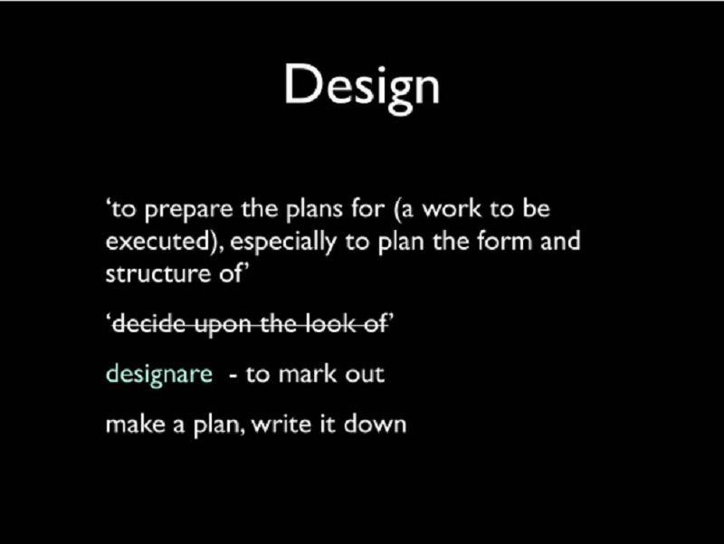

And, of course, here's where everybody is like, oh, you know, we did this. Right?

We did this in the '80s, and we had all this stuff, and it was terrible.

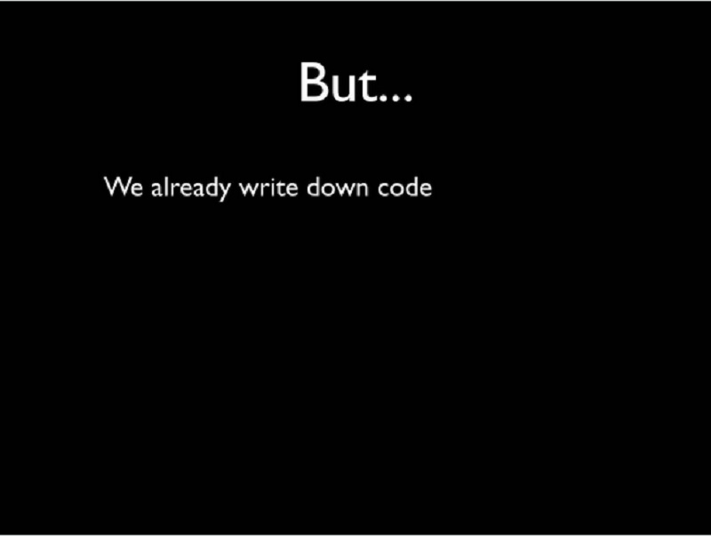

We had these phonebook-sized specifications and nothing got done, and it was all awful. So we already write down code. Is that enough? Do we still need designs if we do this?

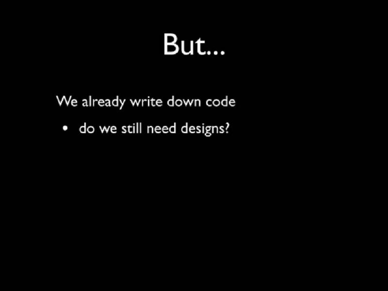

And the answer is yeah because that's not a plan. That's just what you did.

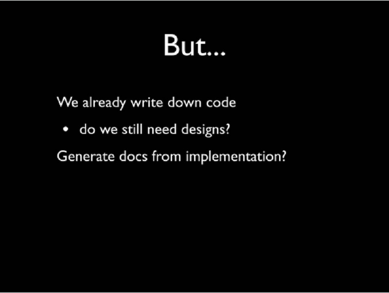

Can we generate docs from implementation? The same thing, right? That's not representing a plan to do something.

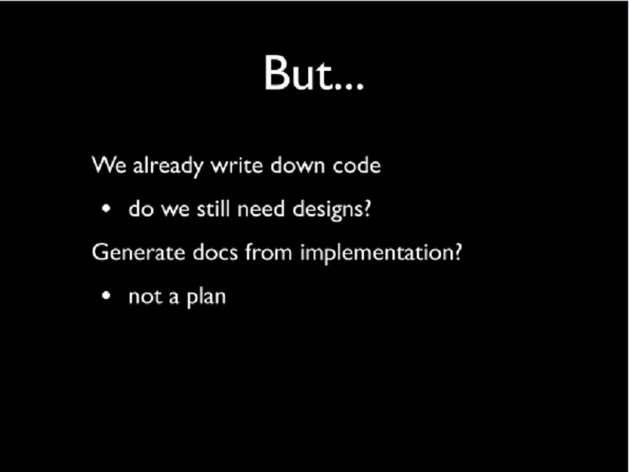

It's like I already did and it and so somebody asked me for a documentation or a design, and so I pulled the lever and this came out. And of course there's this complaint, right? I don't want to do this. These things are big.

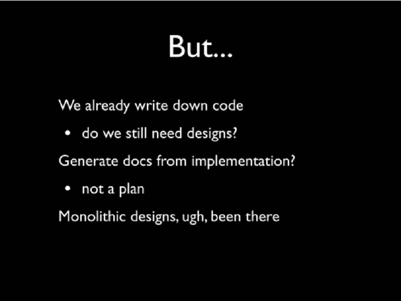

They are top down. They're waterfall model, et cetera, et cetera. We did that already. And it's true that happened, and they were plans, but they weren't good plans.

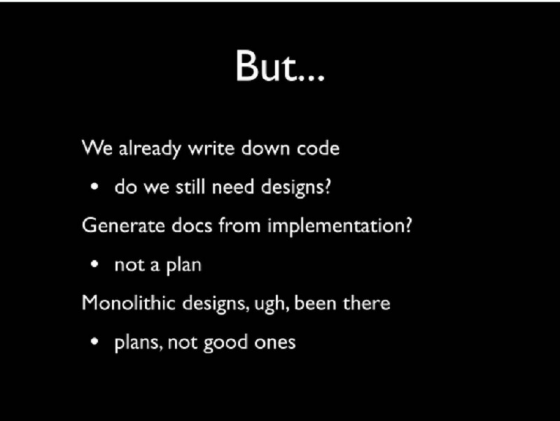

And so what I want to talk about today is a little bit about what do we want out of a design and when we encounter in the world, what do we see?

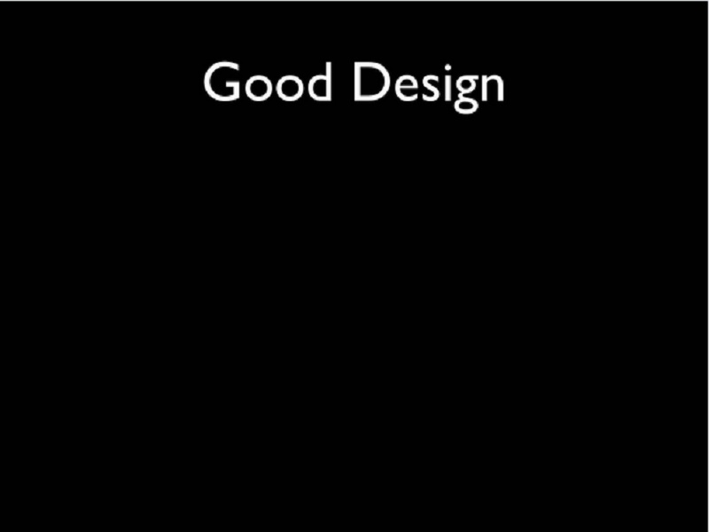

So I think that a simple idea behind design is to look at it in terms of taking things apart.

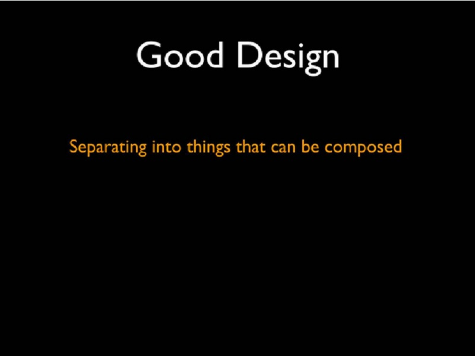

This is the opposite notion we typically have. Typically people think about design, and they say design is, you know, making this big, involved plan that's going to solve every issue that the system is supposed to address. But I think that's not what you do when you're trying to get a design that's going to survive and live over time. I think, instead, what you want to do is break things apart in such a way that they can be put back together.

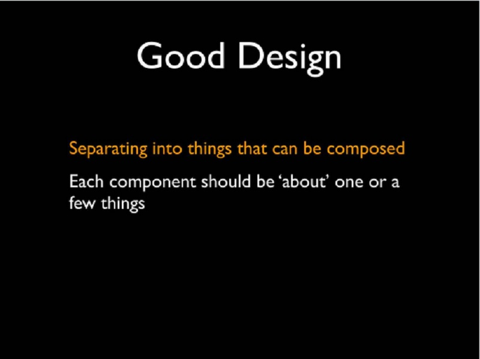

And that's fundamentally what design is about: taking things apart so you can put them back together because obviously taking things apart and walking away is not really going to help.

The other thing you find in good designs is that they're always about one or very few things. Designs that survive, designs that really foster reuse are about a single thing, generally. And then you put them together.

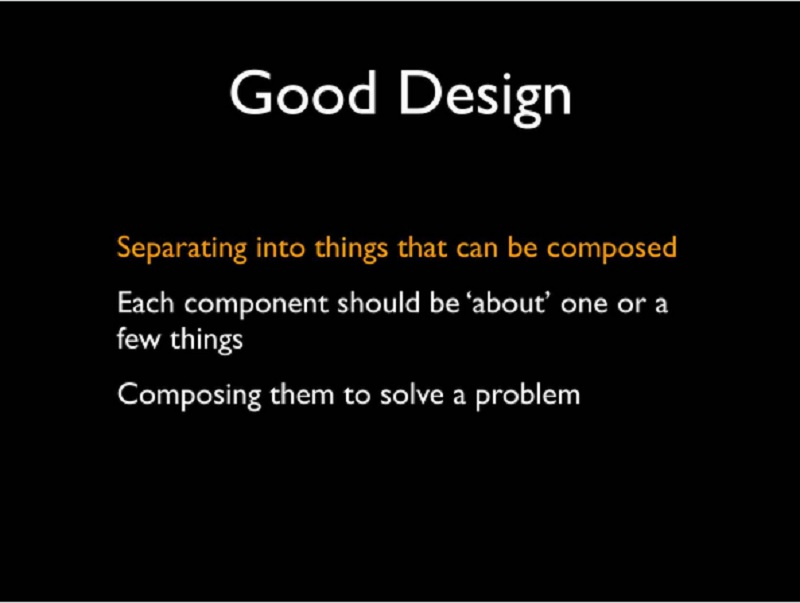

So the first thing you do is you take everything apart. Then you compose them, and then you're solving your problem. But the first thing is the taking apart.

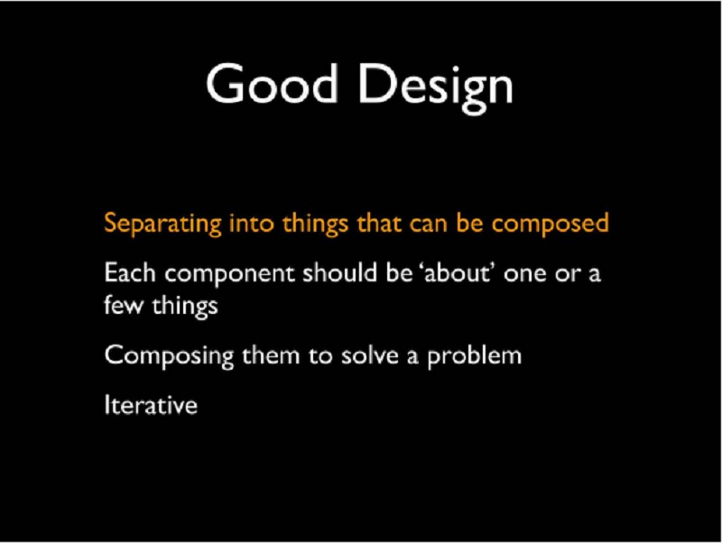

And there's nothing about this that's in conflict with iterative methods for developing software. Right? This can be an iterative process. And all that happens then is that you get feedback during development to your design.

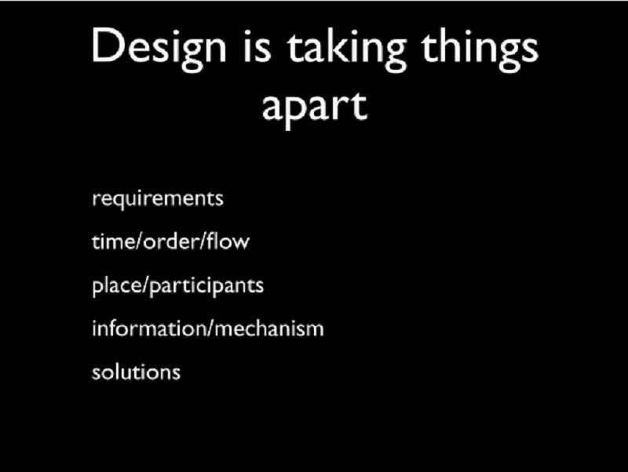

So, what kinds of things would we take apart? There are a whole bunch of things that we could take apart and, in fact, you're constantly finding more things. You can take apart the requirements for a system. You can take apart the order in which things happen, who is going to talk to whom, information parts of your system for mechanism parts, and you can actually take apart different solutions to assess their merit. So let's just look at each of these in turn.

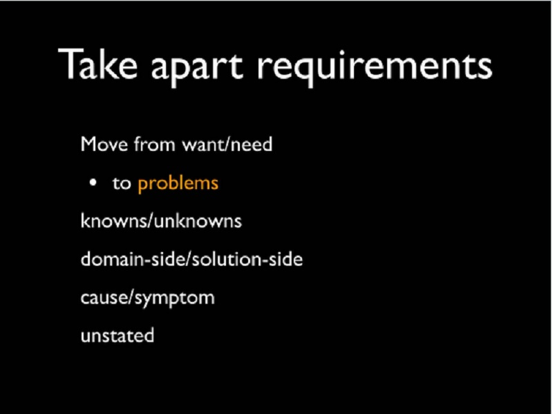

Taking apart requirements: This is something we do not do often enough. Somebody says I want a system that does X. I need Y. You know, it's got to do Z. We get these feature lists, and the first thing that we should do when we're handed that is to break them apart and try to find, in the set of requirements, in the set of features or desired things or needs, the actual problems. And it's only by doing that that you can start to move forward and say, okay, I've broken your need into problems that you have, and then we can try to make things that solve those problems.

The other thing you're going to do initially with requirements is divide them up. The simple way to take them apart is to say these are things I know how to do and these are things I don't know how to do, so your known from your unknown.

You're going to take apart requirements that are domain side - the system must do this to satisfy this business thing - from solution side things like we need to run on AWS or something like that. Often you get requirements, especially for systems that already exist, that are about - it's not working, and everybody has heard that, you know. How do you fix it? It's not working.

The first thing you have to do when you're trying to fix what's not working is to separate out what's the cause of this problem from what's the symptom of this problem. Somebody says my screen is black. You're not - I would say, okay, I know how to fix black screens and start typing because there's not a generic solution to the black screen problem yet.

And then there are a whole bunch of requirements that are unstated, and these need to always be enumerated, if not taking it apart, but they need to be in mind at all times. Unstated requirements are the things that everybody wants the system to avoid, like I'd like a system that doesn't keep crashing, use up all the memory, cost too much to run, use too much energy, require a lot of manual effort, or the users will hate. And so the unstated requirements are often a set of things that your software is supposed to not do, not cause attributes it's not supposed to have, so we want those on the table.

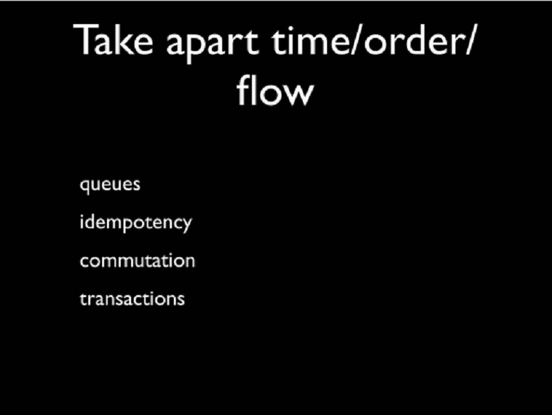

Other things, just completely different dimension of things we can take apart when we do design, which is time. Right? You can take apart the order of things, how things are going to flow from one to the other. You can break systems apart, so there's less direct calling. You can use queues to do that. You can support redundant activity with idempotent approaches. Commutation is a very important concept that's going to be more and more prevalent as we try to build systems that are highly distributed, which says I can make a system order-independent by supporting operations that are all commutative. Then I don't care how things come in. So it's a technique for breaking apart - I used to have this order dependency, and now I don't, so now I have two separate things I can talk about independently. And transactions are the opposite when you say I do need to know these things are going to happen together.

We can take apart place and participants, and there's a certain sense in which design is always about this. But, you know, there's this old adage, right? You just add indirection.

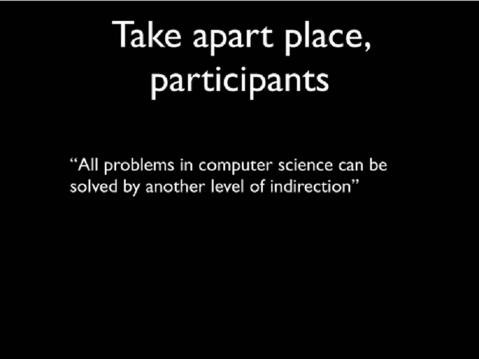

But here we're talking about possibly the whole process of building something. Right?

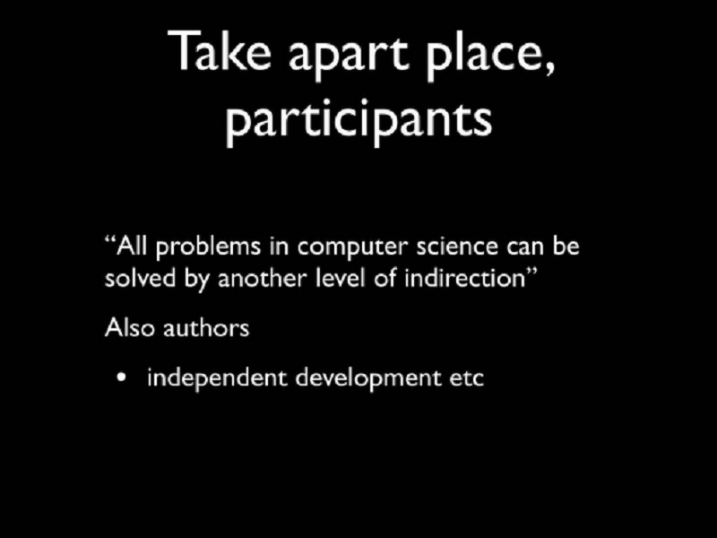

Having a design is a thing that lets two teams work independently or people work in two independent languages. Taking apart things is what facilitates the participants, the authors, as well as the participants, for instance the systems. By breaking things apart you're able to say, well, run this on this machine here, or run this in this tier, or we'll put that on the Web.

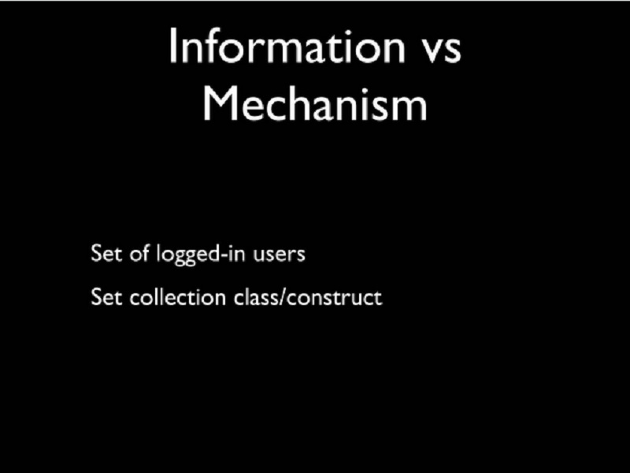

This one is kind of interesting because I don't see it talked about often enough, which is to separate information versus mechanism. So there's always information that our system manipulates. For instance, your system may have the notion of the set of users who are logged in. That's an idea that enumerated set is a piece of information, and then you have, like, you use the set class, a collection class from your favorite framework library to put the logged in users.

And one of the problems I think we have in software development is we use the same stuff for both of these things, but these are two very, very different things. One is sort of this device into which you stick stuff and you can go back later, and it's kind of a little bit of a place. And the other is a piece of information, which you should really not treat that way at all. So pulling these things apart, talking about your system and clearly differentiating the stuff that's information from the stuff that's sort of the mechanics of your program is quite critical.

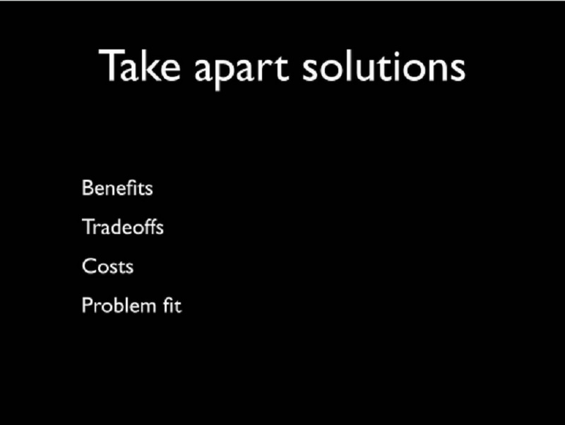

And then, finally, once we think we have an answer, we have a potential solution, we haven't implemented it yet, but we're looking at it, or maybe we have implemented some of it. You want to take those apart to see not just the benefits, right? Those are pretty evident usually. But also the tradeoffs: What part of this is not going to work? How much is it going to cost to run? And does it eventually fit the problem because a lot of times what can happen is you can adopt a solution that is larger than your problem, and then what do you have? You have two problems, right? You have your problem and now you have this thing that was too big, too big for it. So it's not just about getting answers. It's about breaking things apart in a coherent way.

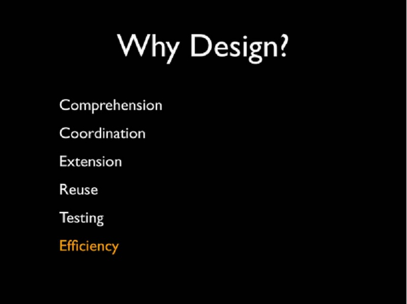

So I'm a big fan of design. I think that we need to do a lot more of it, we need to talk about it more, and we need to spend more time on it. But I think it's pretty easy to rationalize why we need it.

The first is so that we can understand the system, right? A design is hopefully smaller than the code that implements it, and so it's easier to get our head around what it's about. The other thing, as I was talking about, is design is fundamental to coordination.

If you don't have some plan, you can't just send two people off to write. You write one-half a system; you write another half of the system. And that's the end of the conversation. What's going to happen? Well, they're going to wonder which half of the system they're supposed to write, right, because there's no plan. So there's no way to have coordination and to have multiple groups working on something without a design.

Design also facilitates extension and extensibility. People are always like, oh, I want to make something extensible. But the easiest way to make something extensible is this breaking it apart thing because, when you've broken it apart, you end up with two separate things. You end up with pieces that are meant to connect to other pieces, which means there will be connecting points on those pieces. Therefore, when you want to do something new, you can make a new extension, and it can leverage that connecting point because it had to be in place because the things were separate.

The flipside of that is this reuse aspect, which is, when you've broken stuff up into separate pieces that have nice interconnecting points, you can pull them out of one context and put them in another context. And that's how you get reuse. These are not like magical things, and they're not attributes of APIs, necessarily. They mostly fall out of this decomposition.

Finally, testing is greatly facilitated by design. Ideal testing takes some design constraints, some specification and turns it into tests as opposed to sort of embodying design inside tests. That's inside out. But again, that's something we have to work more at. Stems like Quick Check are interesting because you're basically starting with propositions about your system, which reflect the design and saying you write the tests, computer.

And, finally, I think the thing that's often most readily pulled out as an argument against design is: I don't have time. This is going to slow us down. And in fact, I think it's the opposite. In particular, you know, there are all these adages about when is it easiest and least expensive to fix a bug, right? Not out in the field. If you've already shipped it, it's the most expensive. People are like, oh, we should fix it in QA, or we should fix it in our code and do test-driven design. But the thing is, you can keep moving back. It's most - it's easiest to fix your problems OmniGraffle. You just say, ooh, that is not going to work, and you move some boxes around, and it's fixed. It's much cheaper than fixing the software.

But even after you shipped, I think that there's a lot more efficiency in systems that have been designed because you're going to be able to go back to something. And usually the answer to your problem in the field is: I have just insufficiently broken something down, and so the solution I'm going to need is just breaking it down more. And that's less expensive than: I created this giant ball of everything and I need to untangle it. So I do think, in the end, it's more efficient. So that's design.

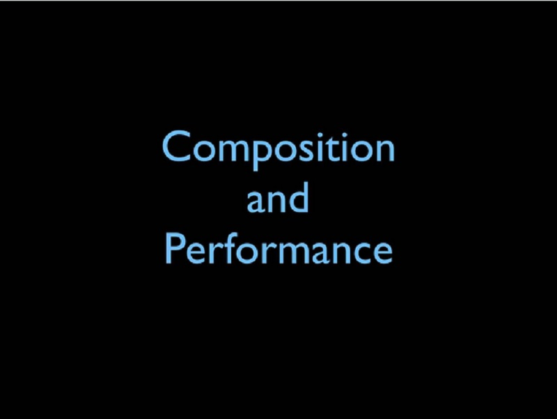

The talk is about design, composition, and performance, and so I'm going to take composition and performance together.

And one of the beautiful things about dictionaries is there's more than one meaning for each word. And so there's more than one meaning for composition, which of course we think about composing systems out of pieces like I was just describing, and we think about performance in systems usually as, you know, how fast do they run?

But when I think about composition, I often thing about Bartok. And when I think about performance, I often thing about Coltrane. And so these are two musicians. Now, Bartok is a Hungarian composer, but he was also a performer. He was a pianist and taught piano. And Coltrane is a famous saxophonist and great performer, but was also a composer, so I'm not trying to pigeonhole these guys. But we're going to use Bartok to stand in for the composer and Coltrane to stand in for the performer and talk about two different notions of composition and performance and maybe how they might inform software.

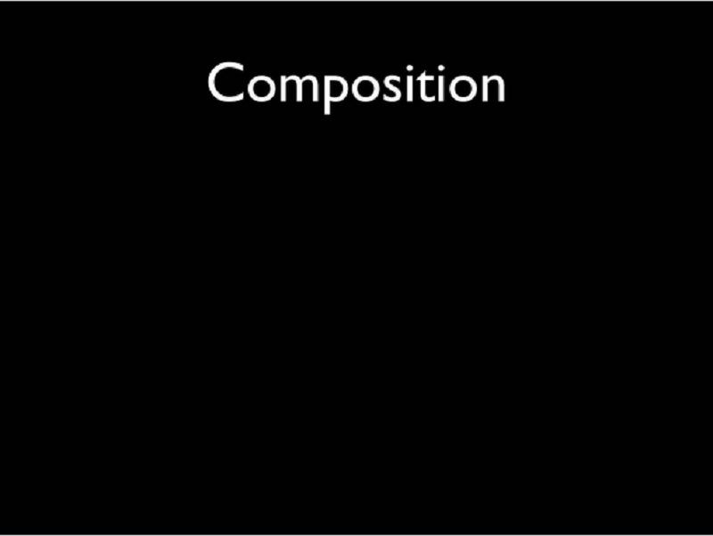

Composition, music composition and other kinds of art creation is about addressing constraints.

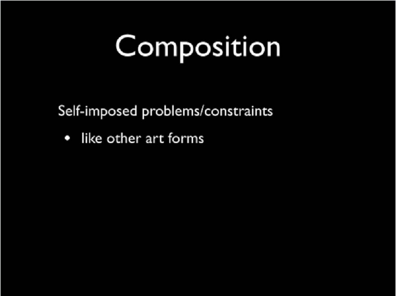

It's about addressing problems, but not real world problems, right? Art doesn't solve real world problems, in general. And if it does, it's more than art. It's something else. So it's quite interesting that the first thing that composers tend to do when they have a blank page - they could do whatever they want - is make up a bunch of problems for themselves. They actually create a bunch of self-imposed constraints. And that's true of all the other art forms. Right? In general, you're going to see this.

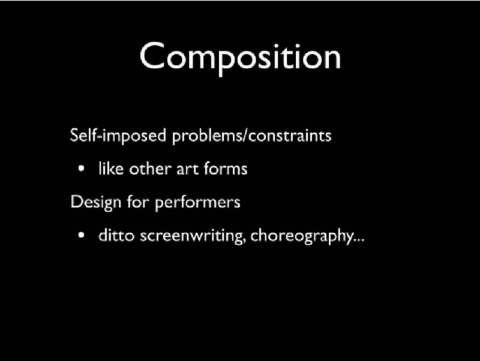

And composition is designed for performance, so we saw that definition of design on the first slide. And it said, "To be executed," and that's what composition is. You're writing something. You're anticipating someone is going to perform it or do it later, and it's the same thing. Screenwriters presume people are going to act it out. Choreographers presume somebody is going to dance it, so it's designed, you know, solving constrained problems by creating your own constraints, and you're designing with something to be executed. So it's very much a design problem.

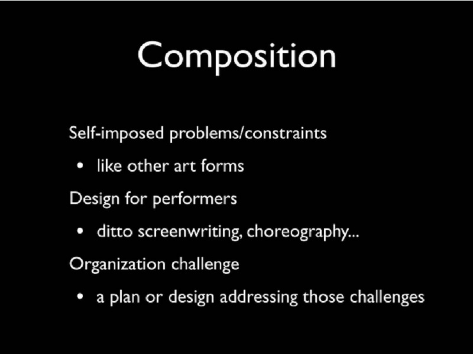

And it's an organizational challenge, right? You're trying to address these constraints that you've set up for yourself, and that's what composition is.

And it's quite interesting that, when you look at music composition, you end up immediately seeing a tremendous variety in the specificity of compositions and the scale of them. And it's telling that software sort of straddles these two things.

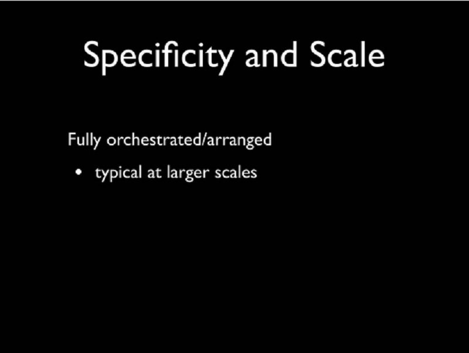

The first is you see fully orchestrated music. It's fully arranged. All the notes are written out for every part. This is typical at a larger scale, so bigger compositions, orchestral compositions, operas and things like that tend to have full orchestration.

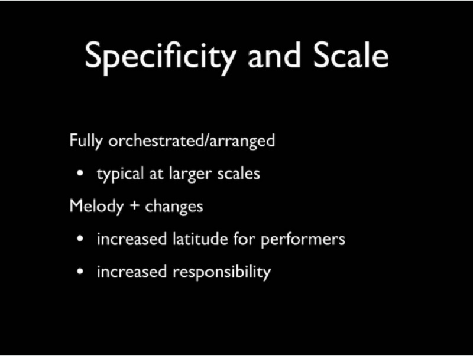

And then smaller compositions, you might have only a melody written out and the chord changes for, say, a song. We'll call it a song, but we're going to not talk about words today. And, in those compositions, you have a lot more latitude for performers because you're not saying you must play this note or this register on this instrument at this time, this loud. You just said this is the melody and have at it. So there's more responsibility for performers, so there's this whole spectrum.

I think that when people push back against design, they're afraid of this first one because, again, back in the '80s we had this stuff, and people had plans that you would draw pictures and push buttons, and it would write programs. Maybe people still have those plans, but they're conducting them in secret.

But I think programmers are like, you know, don't repress me, man. I don't want to see this big thing. But I think that, again, you're going to have the spectrum. You're going to need a lot more writing down, especially if you're going to share amongst people. And then, in the small, when you're talking about your own individual effort, maybe you don't fully annotate the same way.

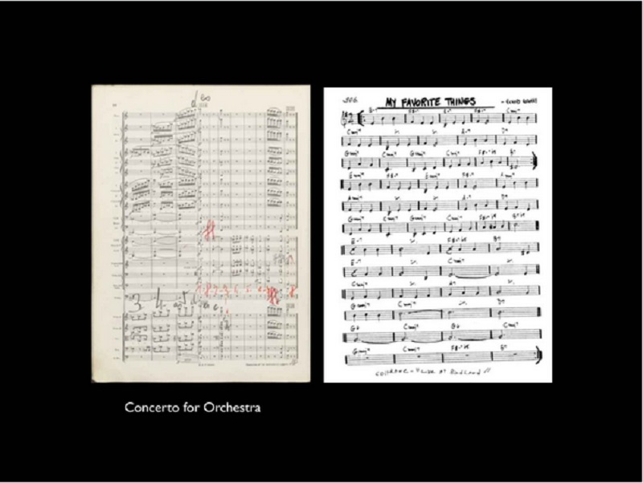

So we can see two pictures of this here. I don't expect anybody to be able to read that, but on the left is the concerto for orchestra. It's a Bartok piece. And, you know, the parts are all written out for the strings, the percussion, and the winds, and it's all specified. Although it really isn't though. I don't know if you can tell, but there are red markings and some other things on here, which were notes taken by who? The conductor, because the conductors says - or, "I don't know what to do here. You didn't tell me exactly, exactly, exactly what to do, so I have to decide what the tempo is," or how to balance these two sections against each other. But, in general, that's pretty fully specified.

On the right, we have My Favorite Things, as it would appear in like a jazz real book. And, you know, this is the tune from Rodgers and Heart, The Sound of Music. And this is all you would get if you're a jazz musician, right? Here are the changes, and here's the melody, and you move from there.

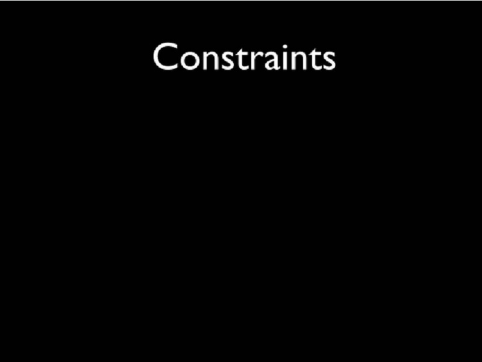

So I talked a little bit about constraints.

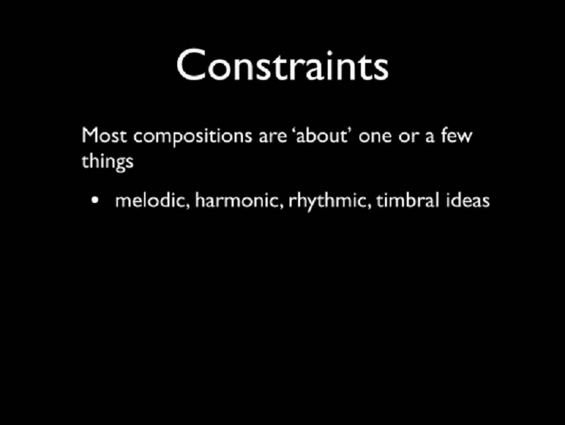

And, again, it's quite interesting to see how this lines up. So most compositions are about one or a few things. The same kind of thing: You're setting out. You're saying what is this piece going to be. You rarely say, oh, I'll just use these notes for a while, and then those notes for a while, and then those notes for a while, and then call it done. Never. You never do that. Composers come up with little motifs and things that they're going to reuse or transform in sort of riff on as time goes by. So there are all these ideas that you're going to set up as boxes in which you're going to work. And you have variations of those things, and you'll do resolution.

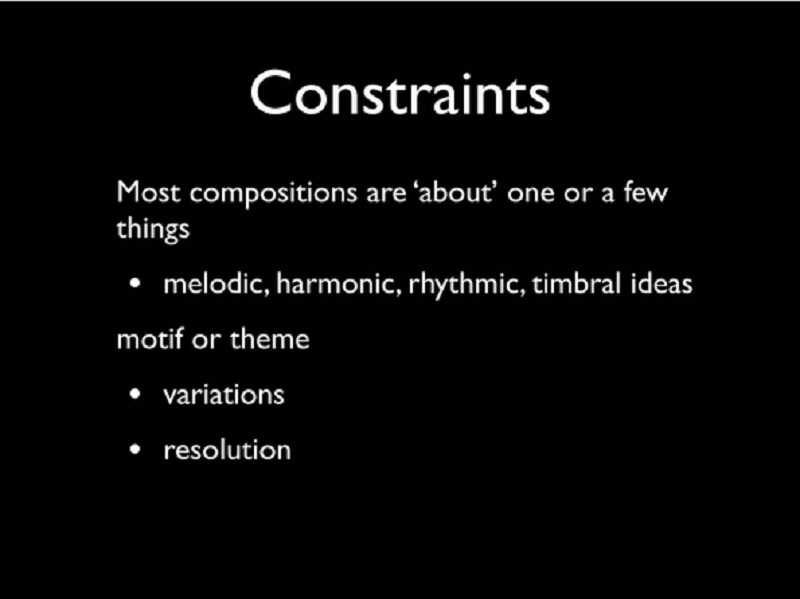

And then the scale and the composition really just determines how many of these things that you have, and maybe how many different levels there are.

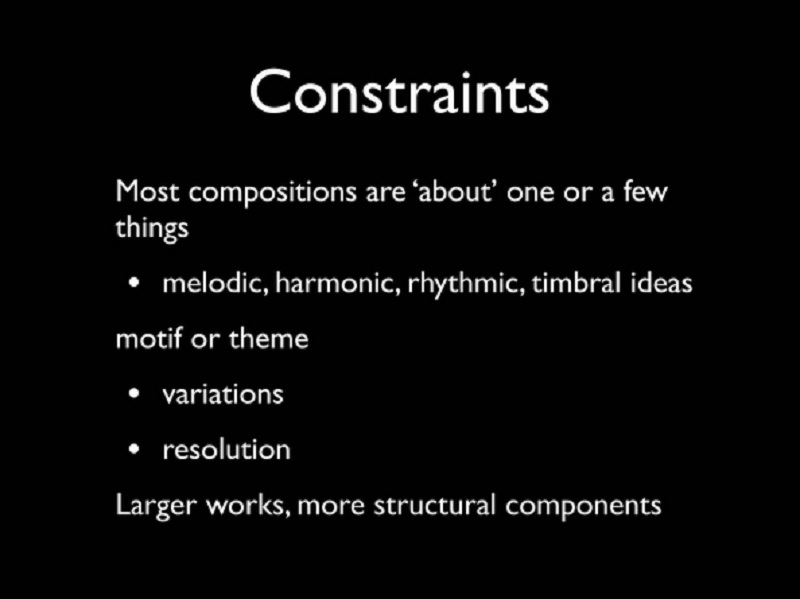

Right? So a big Bartok composition is going to have very, very fine-grained constraints about melodic motifs in a very particular part of the piece and then, at higher levels of structure, deal with big form kinds of decisions. But again, they're self-imposed constraints.

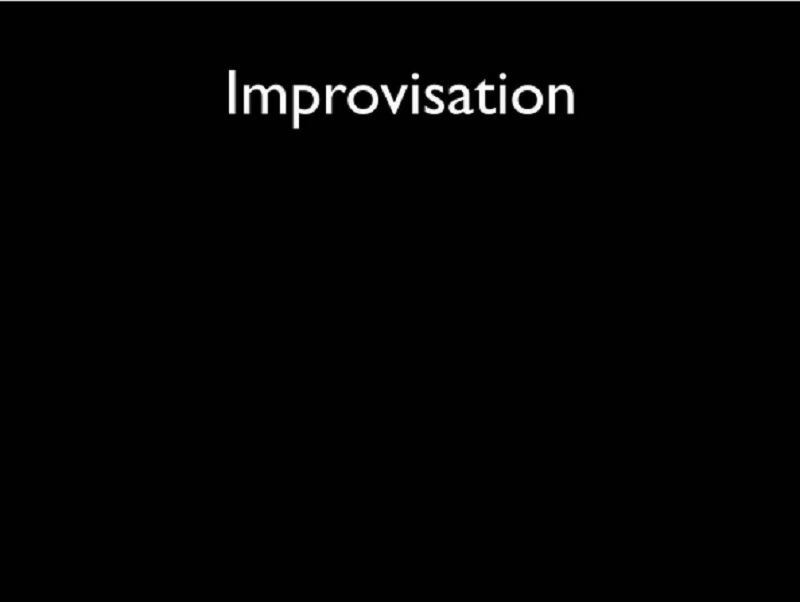

When we move to the performer side of the coin, the improvisation side like Coltrane, I think it's quite interesting. Again, it's an interesting word. It means not foreseen or not provided.

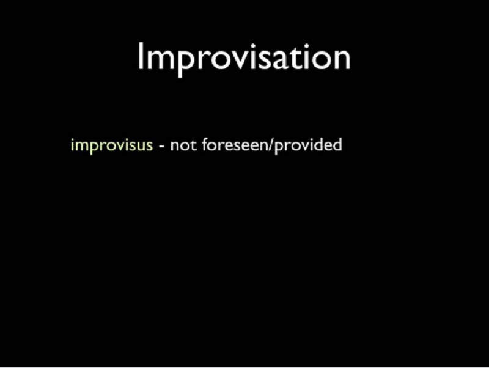

And not provided means you didn't have the answer upfront before you went and did it. Like you weren't handed a complete plan before you went.

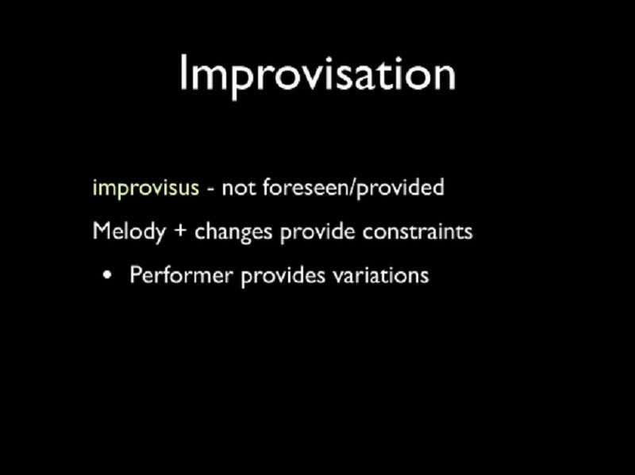

And so in the case of a jazz performer, you're going to have melody and changes. Then you're going to go and provide variations, make something up.

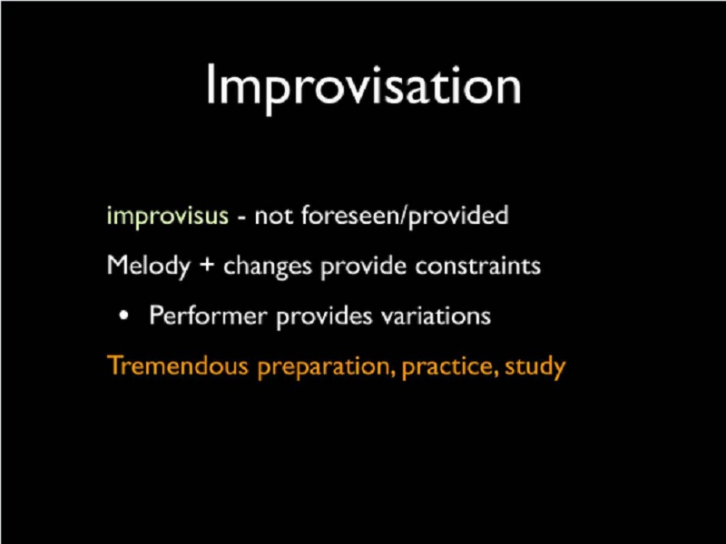

But I think that people have a tremendous lack of understanding of what goes behind improvisation. For instance, a lot of people think Coltrane is just this genius who is spontaneously emoting. They think that improvisation in music is just making stuff up off the top of your head. It's just amazing. It's like hacking, right? Just, I am so awesome. I'm so bright. I am just going to, like, make this up.

But it's quite interesting to see, as we've gone back through the archives and had these new releases of old recordings where they put the alternate takes in there because you'll see Coltrane. He had the solo. It sounds incredibly spontaneous. But then you listen to the other six versions, and you realize that everything that went into the solo that you thought was this amazing one-off, he had worked out. And he was trying them in different orders, different juxtapositions, different cadences and levels, and maybe the order of it was spontaneous, but there was a tremendous amount of preparation associated with that.

So there's a sense in which improvisation is dynamic composition of prepared materials, of planned material, and that to be a great improviser means to make those smaller plans or have those kinds of prepared abilities or approaches or sensibilities that you can apply when the time comes in a live situation.

And you have to have a lot of knowledge to do this and a lot of vocabulary to do it. It's just not something that you make up. And Coltrane was a genius at this preparing. He practiced more than anyone in order to seem as if he was making it up most fluently.

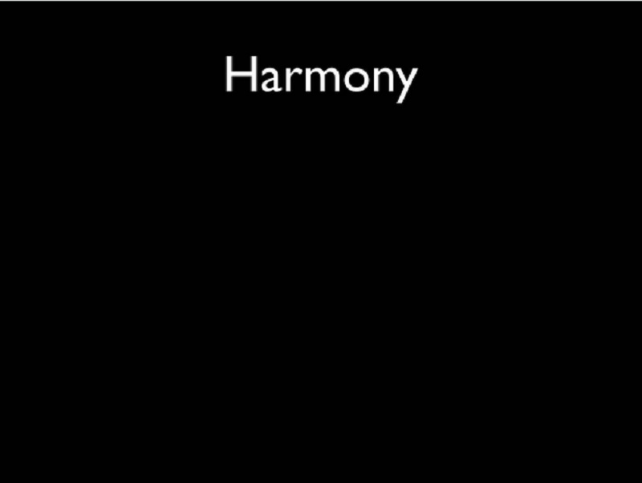

Another thing that sort of crosses the lines in composition and performance in music is this notion of harmony.

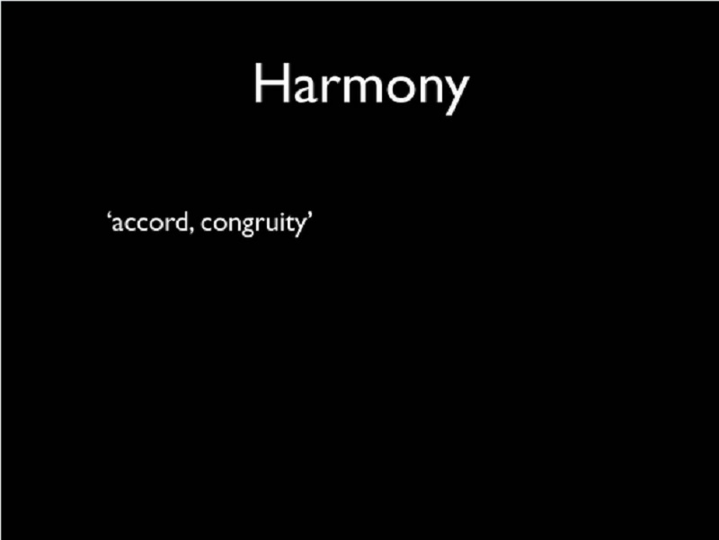

Again, we get this nice word for it, which is a chord or congruity - how do things line up?

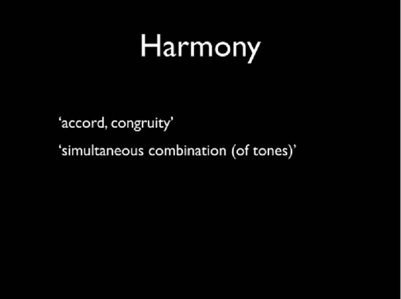

Again, there's this lining up notion and the simultaneity associated with harmony. Right? So we have melody is sequential and harmony is parallel. Music did all this before we had computers. And so this is, how do things work together at the same time? If I played these three notes at the same time, what will happen? Or for Coltrane, if I played this note while these chord changes or this set of notes while these chord changes are happening, what will that be like? Bartok had to imagine, when the strings are doing this and the winds are doing that, what will it sound like all together.

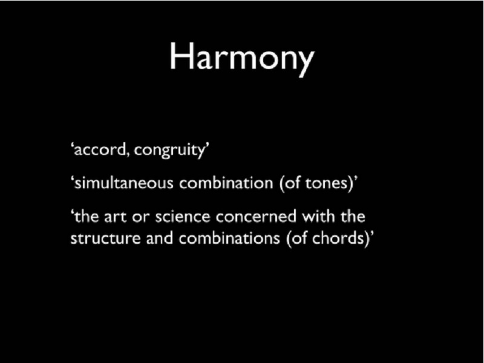

There's also sort of a mathematics of harmony, which is the science behind it or the way you study the rules, if you will, of harmony.

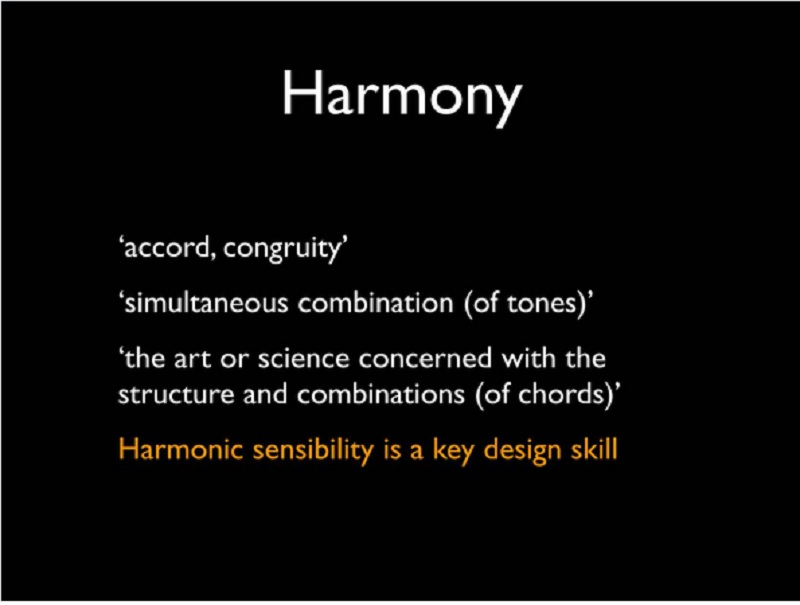

And I'm going to contend that harmonic sensibility is a super critical design skill. This is the thing that you want to nurture in yourself. And it may be a little bit hard to see how the mapping works from music to software, but it's fundamentally what a good designer has. They know if they make this choice in this context, that's going to go together, and those two things are going to work well together. And they know that because of their experience and the study that they've done of working systems.

So I think both Bartok and Coltrane are interesting, even though they're in completely different genres of music, in that they were both masters of harmony.

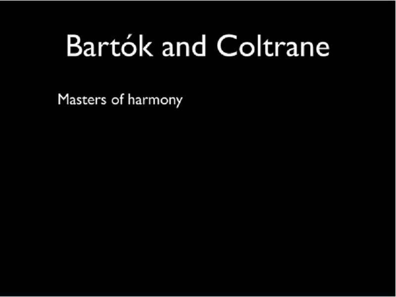

If nothing else, you can say the two are similar because they totally mastered harmony.

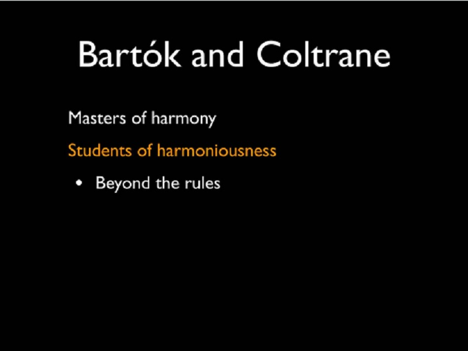

In fact, what was interesting about both of them was that they were students of harmoniousness, if you will. That the thing I think that they were most interested in was what makes things work together well.

Bartok studied obviously the classical tradition, but his music was not compliant with those rules, and it's because he brought a whole bunch of influences in from studies he had done of folk music of Hungary. And what he studied in that music was the sonority that was possible in these tunes that didn't follow the classical rules, but they still worked. And so he pulled out what worked about that and wrote pieces that are hard to really recognize as being completely tonal, but they are tonal, and they're satisfyingly consonant as tonal music is, which is quite, quite astounding.

Similarly, Coltrane invented whole new ways of doing reharmonization over chord changes that had that same sensibility about harmony.

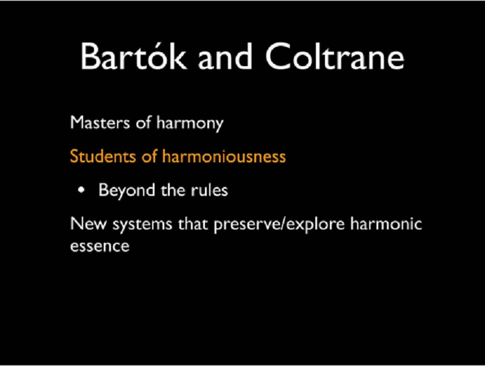

So I think that what was cool about both these guys is that they both sort of developed new systems that preserved what was essential about things being harmonic or being consonant.

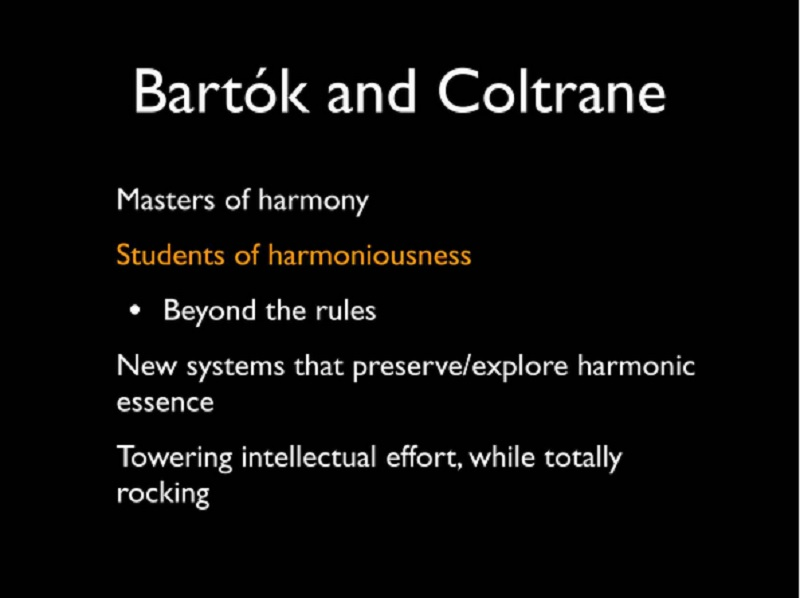

And then the other thing that's quite interesting is that, on both halves, whether you listen to a Coltrane improvisation or the most beautiful, engaging piece of Bartok, what's behind this is a tremendous amount of intellectual effort and activity. I mean you can listen to this Bartok piece and be stunned by it, just blown away by the emotional content. Then you go study the score, and there's like all these fibonacci numbers and ratios in it. And you're like: oh, my God! This was the constraint he set for himself before he wrote this thing that seemed or was so emotionally powerful. So there's a lot to appreciate in both of them.

But what does this have to do with anything that we do? In particular, what does it have to do with languages and libraries, which is really what I want to talk about today: languages and libraries?

Is a language like Clojure or any other language? It doesn't matter. This isn't really about Clojure.

Is it like a song? Are languages like songs? Are they like small compositions?  Are they like big compositions? I don't think so.

I think that languages and tools, to me, if you're going to map this analogy, are more like instruments, so let's talk about instruments.

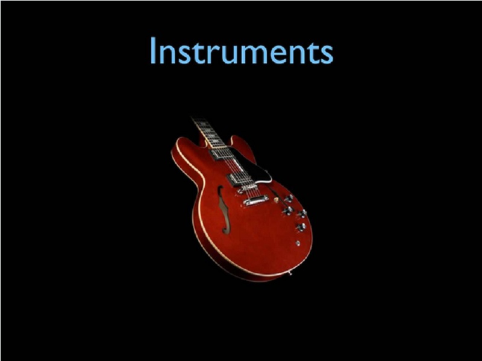

That happens to be one of my favorites. I have that one.

Again, instruments are sort of their own design problem. Right? Instruments start with something called excitation.

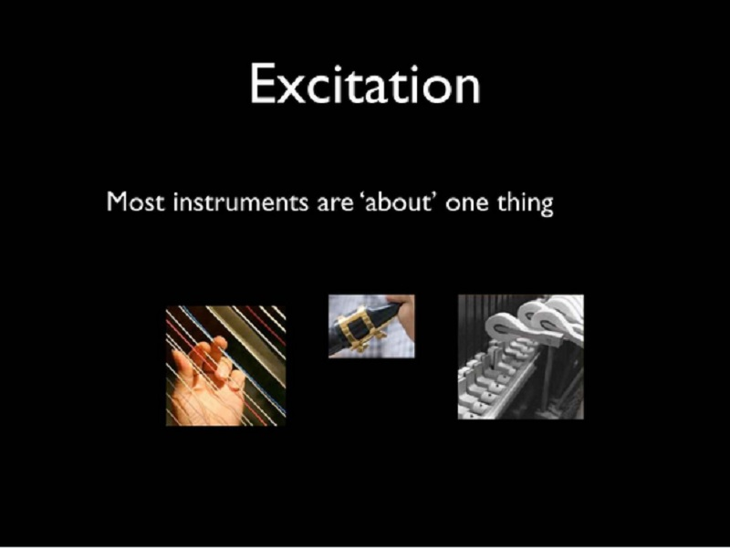

And there's a sense in which most instruments are about one thing.

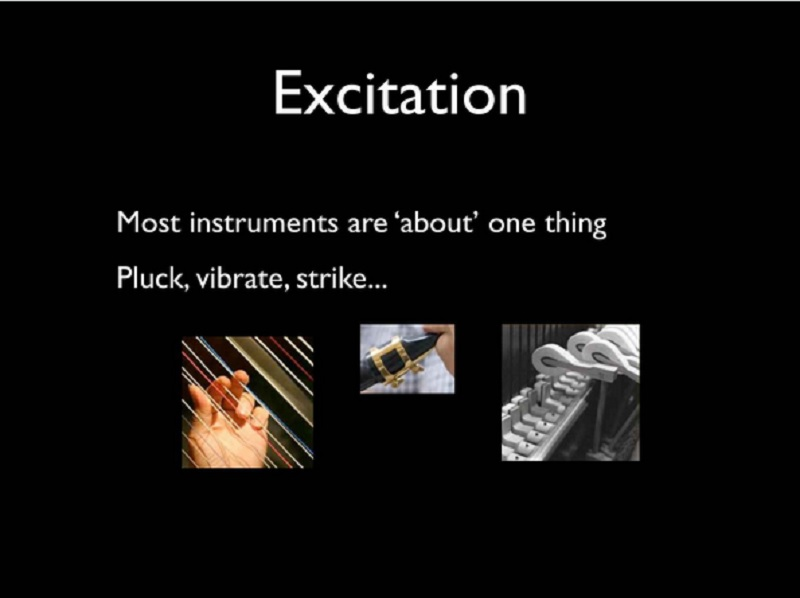

You pluck a string. You cause vibration on a reed by blowing on it. You strike strings with the mallets of a piano or you hit drums or things like that. And what's quite interesting is that very few instruments are about more than one kind of excitation. Most instruments are about one kind of excitation. It's quite rare to see the other.

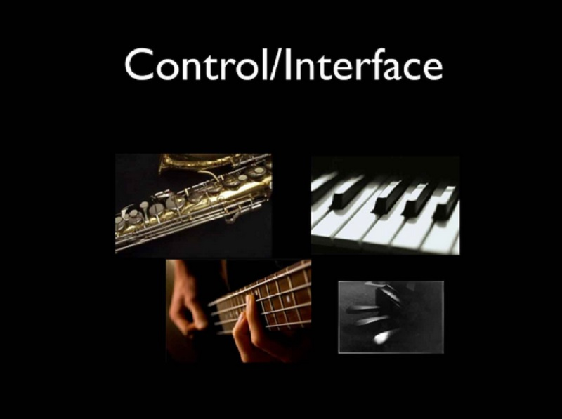

Then this is combined with some sort of control or interface or technology on instruments and saying then there's an interface, right? So there's excitation. Then there's this interface for people to go and shape the excitation.

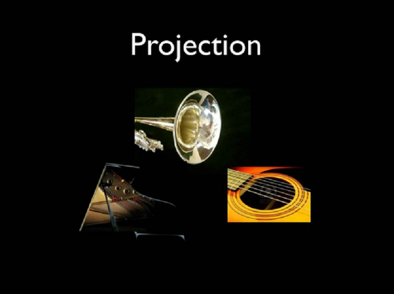

And, finally, there's an aspect of an instrument, which is sort of its fundamental goal in the world, which is to take that excitation and direct it at a problem. And the problem for most instruments is how is somebody going to hear this. How do we get the sound across the room so somebody can pick it up? And so instruments are about directing the force or energy of the excitation out to the audience. They're directed at an outcome, so there's a little piece of design work associated with an instrument.

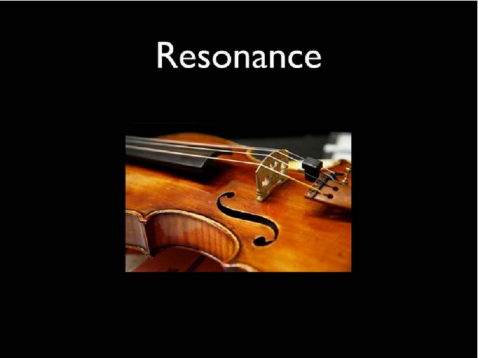

Instruments also have this other interesting aspect, which is resonance. When you design an instrument, especially something like a violin, a guitar, or anything that has a vibrating body to it, the body itself is going to interact with the excitation. So the excitation of the string is going to vibrate, whatever, and the body is going to go and say, woo, that's - I like that. I'm going to amplify that. And it will amplify some things more than other things.

So there's a design problem, and there's a harmony problem to the physics of an instrument to say, well, you know, if I build an instrument whose body resonates at a frequency that's not a harmonic relationship to the strings themselves, it's going to sound awful. And it's actually a physics problem to get that harmony right in the wood.

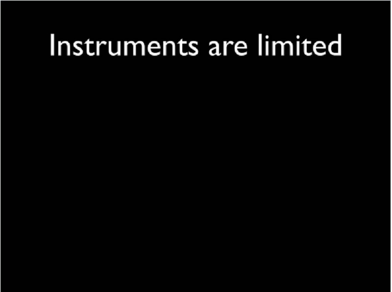

But instruments have a lot of other characteristics, and one of them that's quite striking is that instruments are limited. They're very limited.

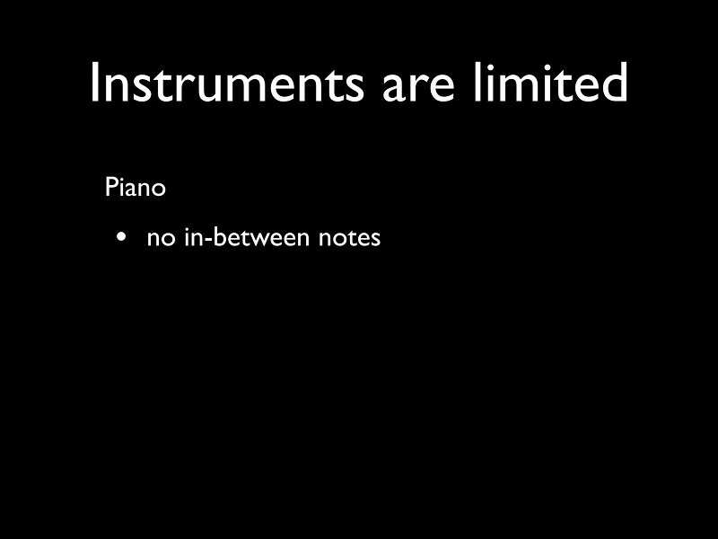

Piano - can't play any in between notes. It can only play specific notes: the 12th root of 2 all the way across or maybe you stretch it a little bit, but there's no in between notes.

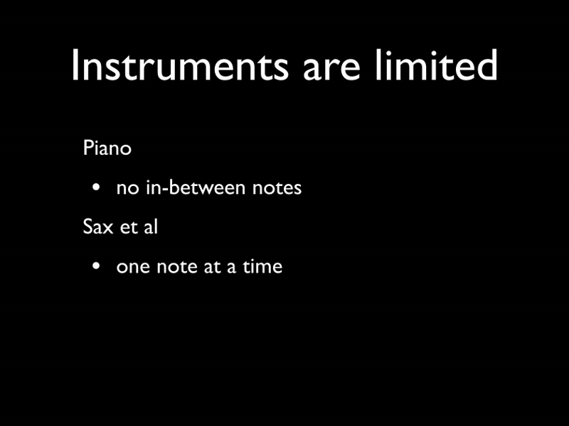

Saxophone can only play one note at a time. This is awful.

[Audience laughter]

I mean, and these things have been around for hundreds of years. I mean they didn't have GitHub, but somebody should issue a pull request.

[Audience laughter]

And, like, fix this! Right?

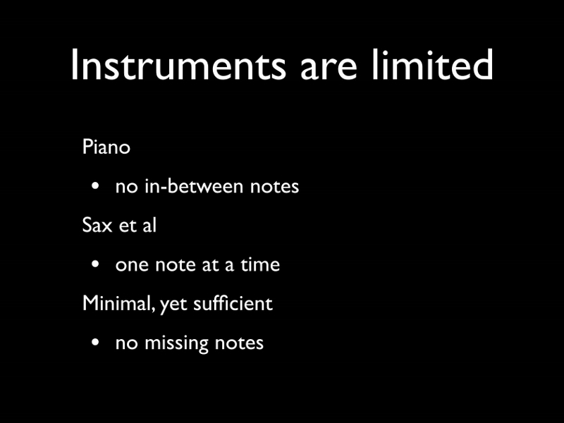

But there's a sense in which they're minimal, yet sufficient. For instance, most instruments don't have any missing notes. For whatever range they cover, they have all the notes. At least we're talking about western instruments and western scales. But they'll tend to have all the notes.

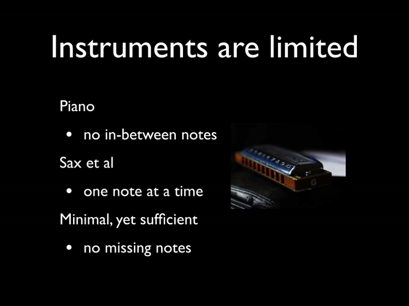

But, not all of them will, right? Blues harmonica doesn't have all the notes. Right?

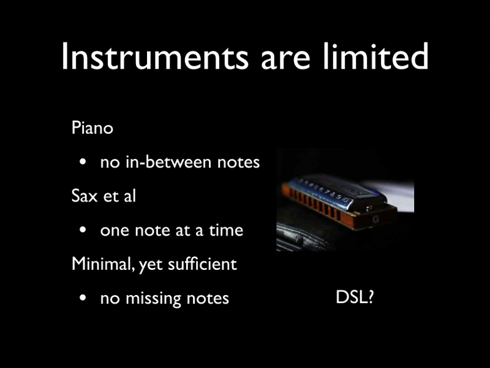

There's a kind of musical DSL, right? It's like you don't need all the notes. You're just a businessperson. I can give you just the blue notes. That's all you get.

And so, you know, is this something to fix? There are all kinds of limits, not just in the notes they can play, but the registers they can play and things like that. Why haven't these all been fixed? Why can't every instrument do everything?

And there's a sense in which the players can overcome this. How many people here play piano? Right? So what do you do to deal with the fact that piano can't play the in between note? What do you have? You have grace notes and trills and mordents and stuff that give you all that sort of feel around the note thing.

John Coltrane famously became so adept at the saxophone and had such physical prowess and muscle memory and combined it with this gargantuan knowledge of harmony that he could play these scales so fast that he could imply not only chords, but entire tonalities, superimpose entire tonalities over chord changes by just playing sheets of sound, is what they called it, over music. So it's not necessarily the case that the shortcomings of these things need to be fixed in an instrument. Right? There may need to be room for the performer to do it.

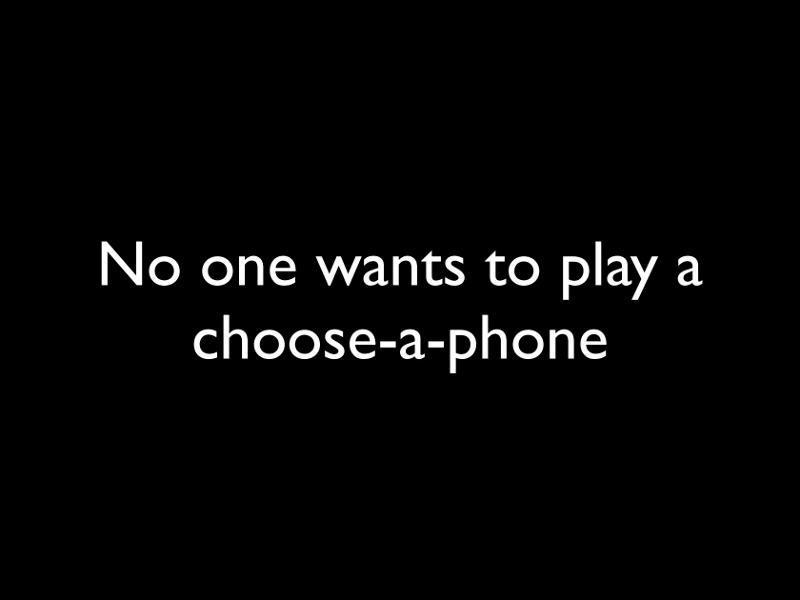

And there's another good reason why we don't fix everything, which is that no one wants to play choose-a-phone. Right? No one wants to play an instrument that does everything. You could push here, and it makes a piano sound, and then it makes a drum sound, and then this happens and that happens.

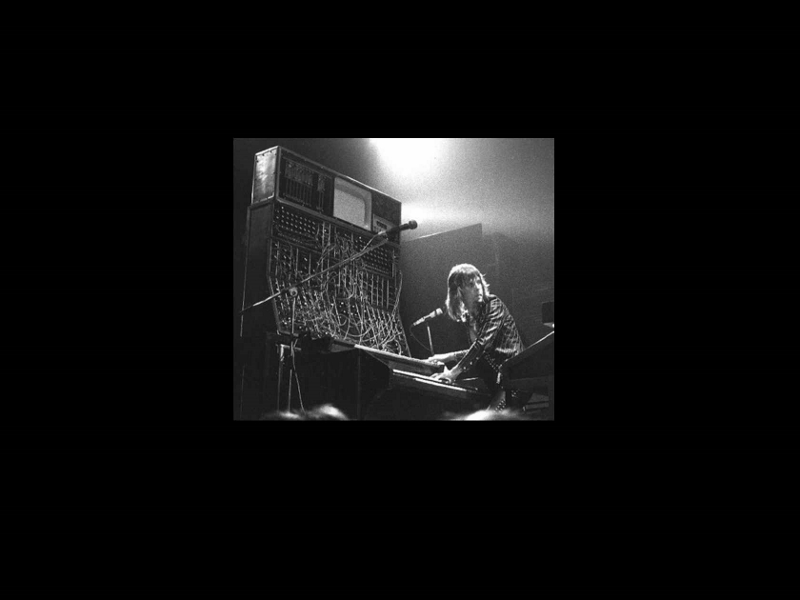

So some people do want to play a choose-a-phone.

[Audience laughter]

This is Keith Emerson sitting in front of a Moog modular synthesizer back in the day, and that was just, wow! You could make it do anything if you plugged in the wires the right way.

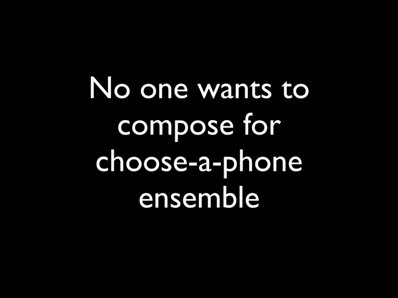

So I'll take a step back and say maybe some people do want to play choose-a-phone, but no one, I bet, wants to compose for a choose-a-phone ensemble.

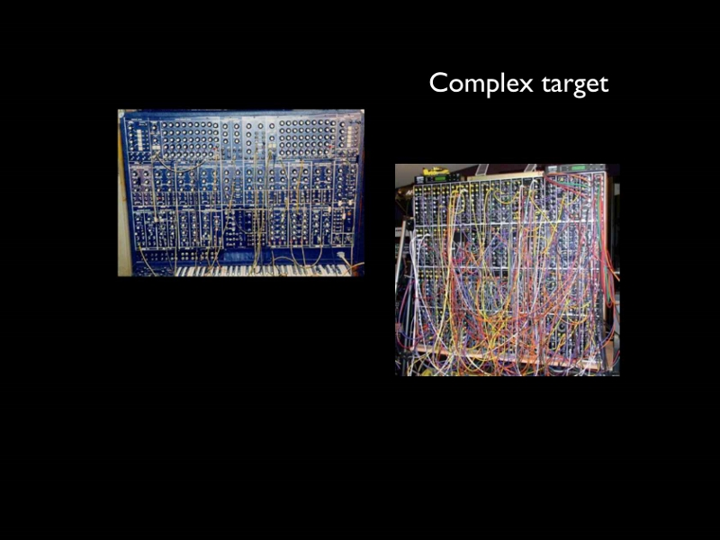

Just imagine that you are sitting in front of an orchestra and everybody in the orchestra had one of these in front of them.

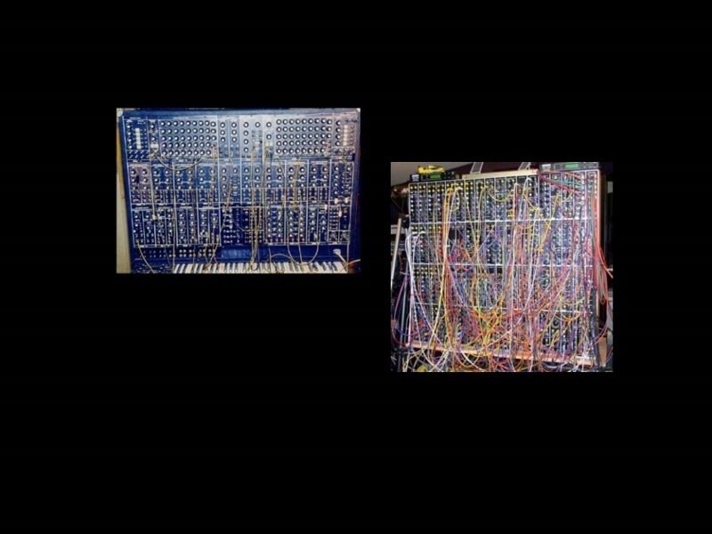

Right? And they put the wires in and whatever. And you're the conductor, and you went like this [raising hands up in the air], and when you say go, what is going to happen? You have no idea. You have no idea of what even could possibly happen.

If you're sitting in front of an orchestra, there's a certain category of things that you think might possibly happen, but you can kind of get your head around what that might be. And so the problem here is that where you to try to build a bigger system out of something with as much, let's say, parameterization, as these synthesizers, you'd end up you're trying to target something that's complex and build something bigger still. That's a recipe for disaster.

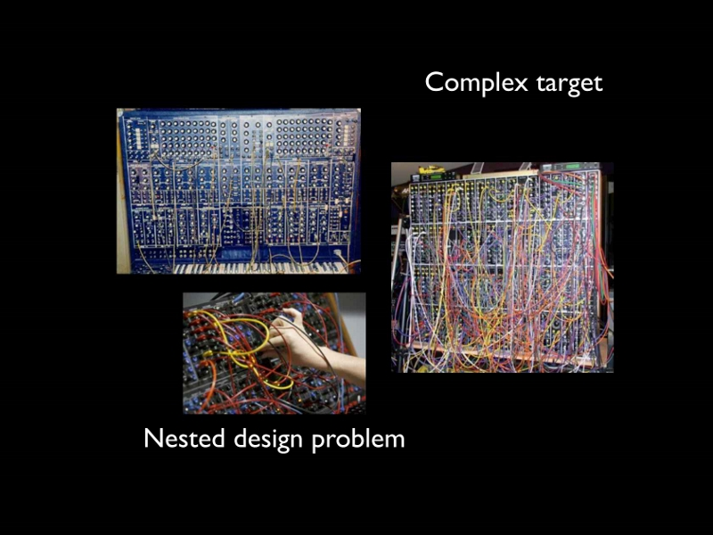

And there's a sense in which this is just the wrong way to go about things because you've got this design problem that's actually multilevel, and it's nested. What happens when you say go? Well, it's the sum of what happens for each person.

What happens for each person? Well, it depends on where they put the wires and what happens, you know, what determines what happens when you put the wires. Well, each module has a different thing that it does. It may be a filter. It may be a sound generator, something like that. So each, there's a level.

There's a set of levels at which there must be design. I must design the modules. I must design the sound, that patch that hooks them together, and then maybe I would try to take on a piece with all of this. But unless there was a way to talk about one of those arrangements and get your head around what it implied, you could never build up higher.

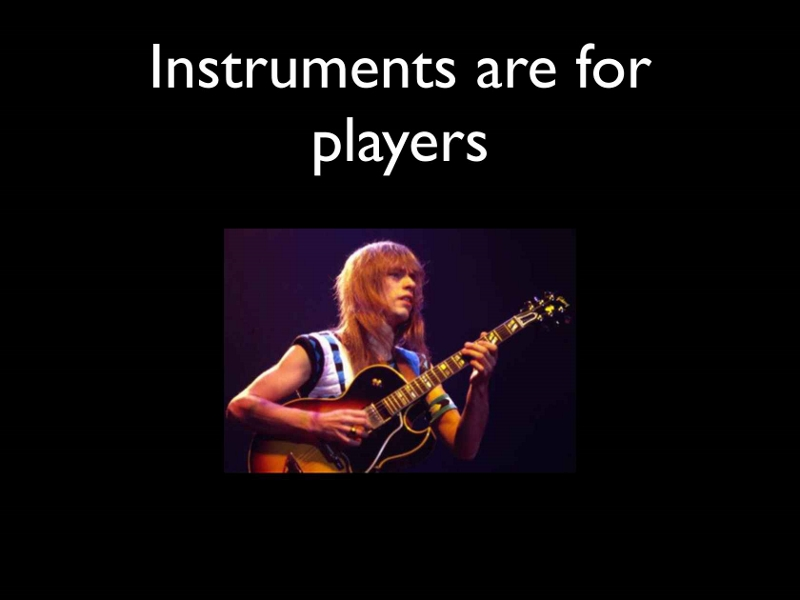

So another stunning thing about instruments, which is just, again, it's astounding that the world has continued, is that instruments are made for people who can play them, who can already play them. I don't know. Hasn't everybody heard of, like, "Explain it to me like I'm five," or whatever? We're not supposed to do this anymore. We're supposed to make everything for beginners.

But instrument makers don't do that. They don't make anything for beginners. They make everything for experienced players. Instruments are made for people who can play them - 100% of the time.

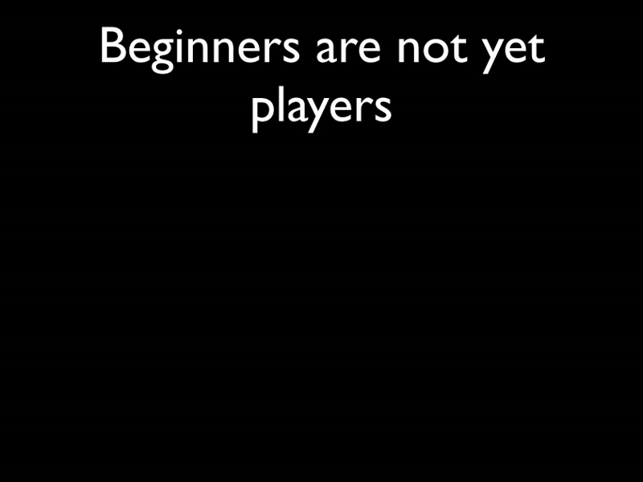

We have this problem, right? Beginners aren't players yet. This is going to cause the world to stop. If you can't have a website with three buttons on it and everything that possibly could happen can happen, we're done.

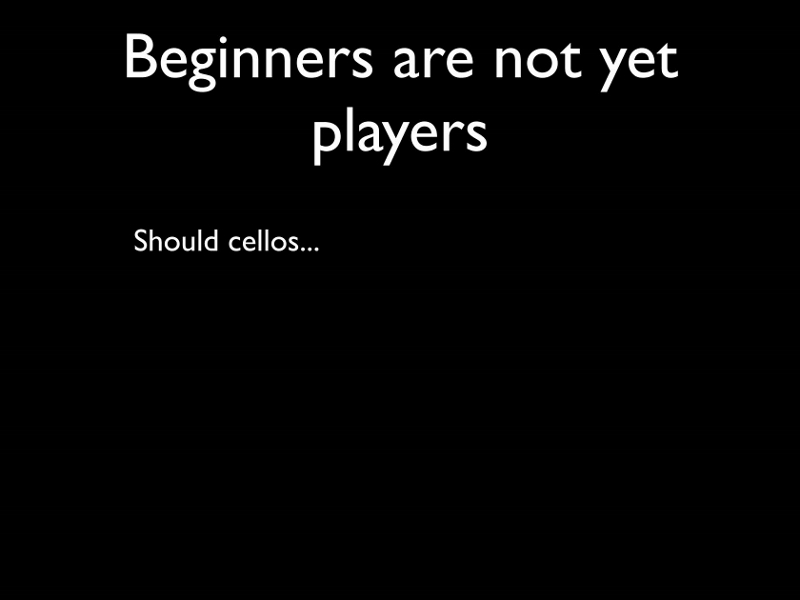

So we should fix this, right? Because we're technologists, we know how to do this.

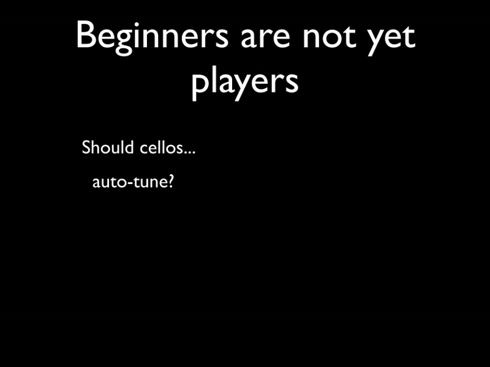

We start with the cello. Should we make cellos that auto tune? Like, no matter where you put your finger, it's just going to play something good, play a good note.

[Audience laughter]

Like, you're good. We'll just fix that.

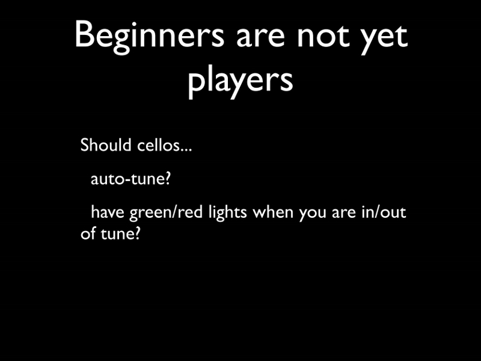

Should we have cellos with, like, red and green lights? Like, if you're playing the wrong note, you know, it's red. You slide around, and it's green. You're like, great! I'm good. I'm playing the right song. Right?

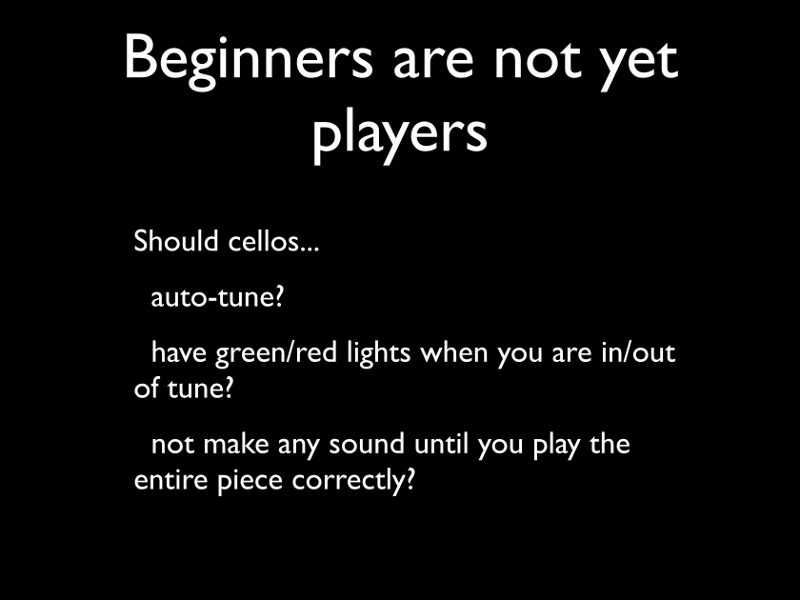

Or maybe we should have cellos that don't make any sound at all. Until you get it right, there's nothing.

[Audience laughter]

And then - then you get it. So, I mean, do we need to fix this?

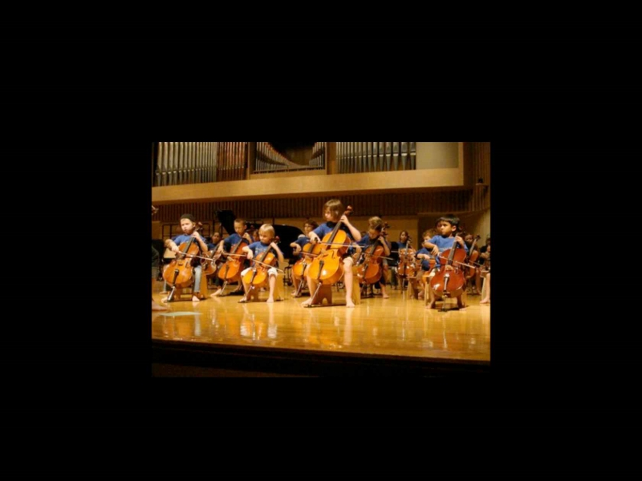

Here we go. We have a bunch of children, young children being subjected to cellos. There's nothing different about these cellos. These are regular cellos, and they're all sitting there. They're out of tune, it hurts their hands, and it's just awful. I think somebody took off, took away their shoes until they get it right.

[Audience laughter]

This is terrible. But it's what happens because what would happen if they had any of those other things that I just talked about? Who could ever learn to play cello? No one. No one would ever learn to play cello.

There's this great [article](https://www.theatlantic.com/magazine/archive/2013/11/the-great-forgetting/309516/) in the current issue of The Atlantic about sort of the tradeoffs, let's say, not the perils, but the tradeoffs involved in automation. And it's got a great line in it, which is that learning requires inefficiency. And it's quite important. And when I read it and was thinking about this talk, I felt like, wow, that's - it does go together.

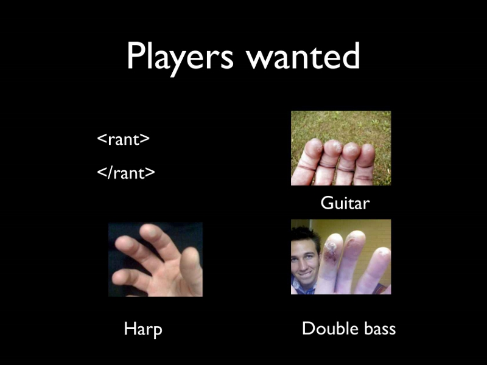

So we need players. I would rant here, but I won't. But look at this guitar player with blisters. A harpist has blisters, a base player with blisters. There's this barrier to overcome for every musician. Imagine if you downloaded something from GitHub and it gave you blisters.

[Audience laughter]

Right? The horrors! And yet how many people here play an instrument or have at one point in their lives? Yeah, a lot of programmers do. And for how many people did you just pick it up and it was awesome? How many wished, like, something could have made it more straightforward to get started with and, like, just made it easy? And how many would have believed after that that they could play it later? No, not at all. This is - it's actually quite important. The level of engagement that's required is quite important.

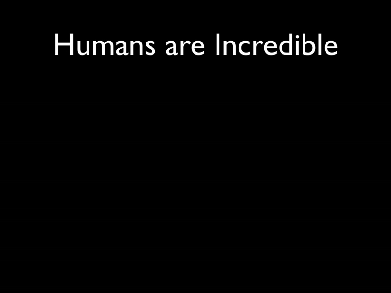

So we shouldn't sell humanity short. Humans are incredible. In particular, they're incredible learners.

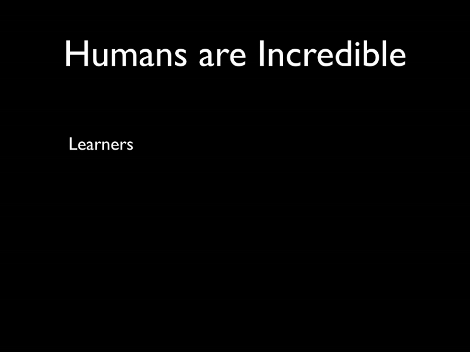

One of the things that's really cool is you give a five-year-old or, I don't know, eight, maybe, a cello and some decent instruction, and they will learn how to play cello if they spend enough time doing it. In fact, humans will pretty much learn how to do anything that they spend enough time doing. We're incredibly good at it.

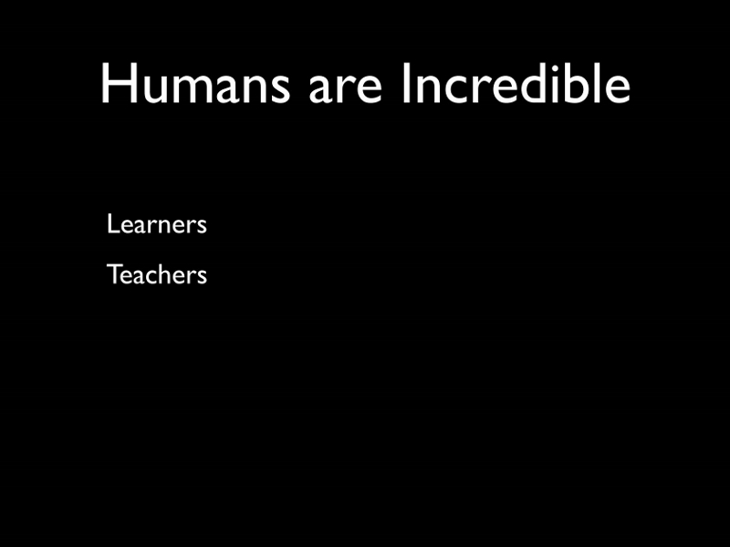

And we're also really good teachers, in general. So I don't think we need to go to our tools and our instruments and make them oriented towards the first five seconds of people's experience because that's not going to serve them well. It's especially not going to serve anyone well who wants to achieve any kind of virtuosic ability with the tools. No one would become a virtuoso on the cello if they had red and green lights when they started.

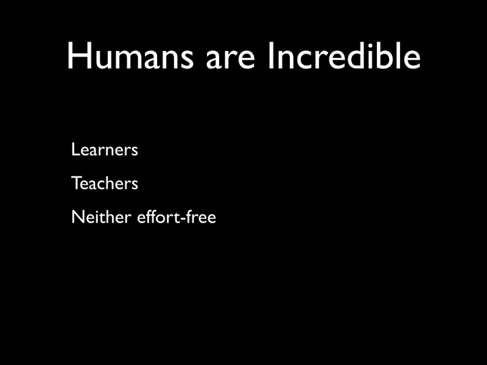

So neither of these two things is effort free, but we shouldn't be in a game to try to eliminate effort because we are novices, right?

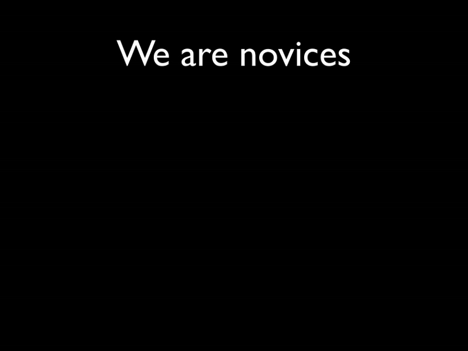

There's a sense in which we're only going to briefly be novices.

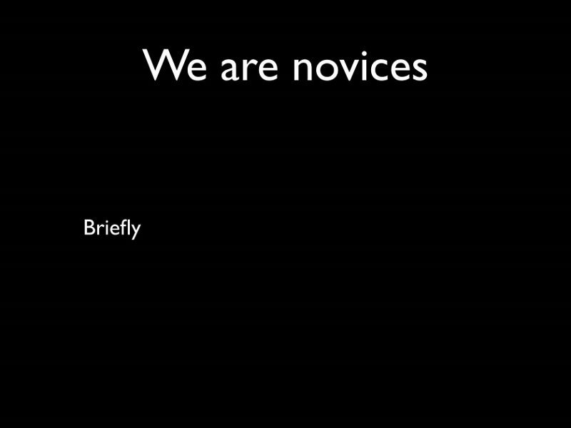

You're only a complete beginning at something for an incredibly short period of time, and then you're over it.

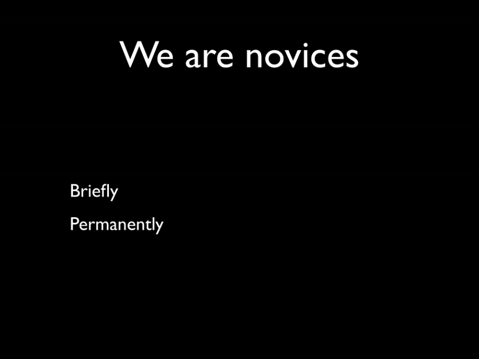

It's like we should not optimize for that. But, on the flipside, we're always learners no matter how much time you spend on the violin. Who sits there and says, "I'm done. I've completed learning violin. I finished it"? That's awesome. I personally don't play violin at all, but I don't think there would be a player on earth, no matter how great they are, who would say, "Yeah, I finished violin and I moved on to something else." We're constantly. It's just the human condition to do this.

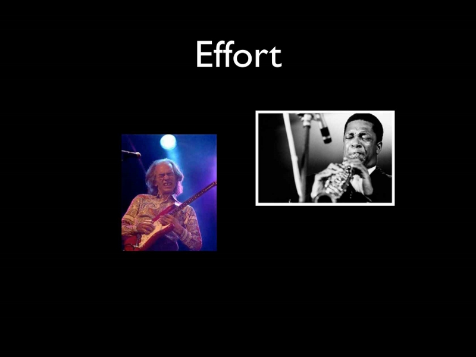

Things take effort. Just like we shouldn't target beginners, we shouldn't try to eliminate all effort. Look at these two guys. These two guys are experts.

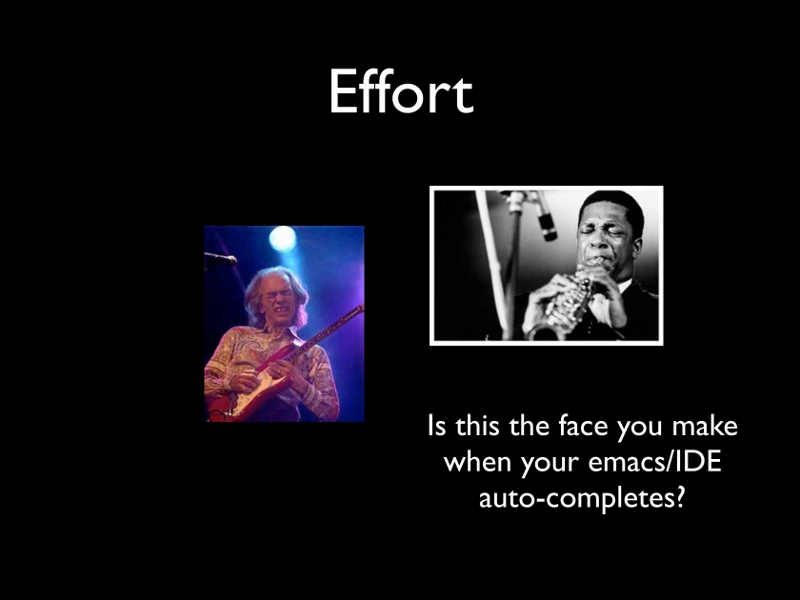

Is this the face you make when you're IDE auto-completes?

[Audience laughter]

Right? Does it look like that? Oh! java.util - oh, man. That does not happen. Right? Your life has just been automated away. And I think that's sort of what's interesting is that, yeah, it sort of looks hard and, in fact, it's probably not hard for either of these two guys. But what you're seeing here is a sense of engagement in what they're doing.

How engaged do you feel in what you're doing when you're programming with IDE that's, like, doing everything for you? You're so isolated from what's happening. So effort matters.

Another interesting observation that's not really that important to this talk is that instruments and tools are usually made for one user at a time, like this whole notion of two guys on one keyboard to program. That doesn't happen in instruments.

Now you make ensembles of instruments. I'm doing this and you're doing that, and we're doing them together in the room, and it sounds great. We do that. But this, like, two people pulling on one tool, that almost never happens.

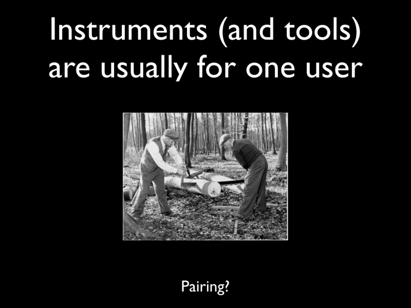

So I wonder if this pairing thing is just a way to keep us from typing all the time, to buy one person some time to think - a little bit. Whoever is not pulling has got an easy ride. Of course, this is pretty fast switch back and forth.

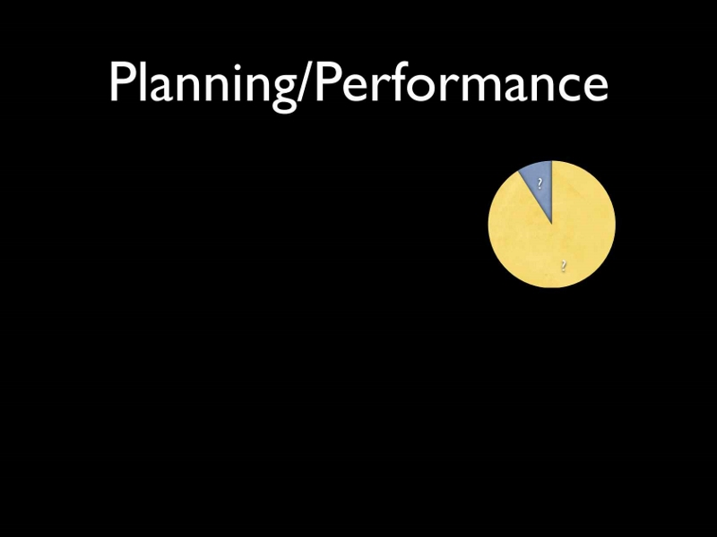

So it begs the question, right? What ratio of time should we have between planning and performance? Which is which in programming? Which one is typing the code in? It's yellow. It is.

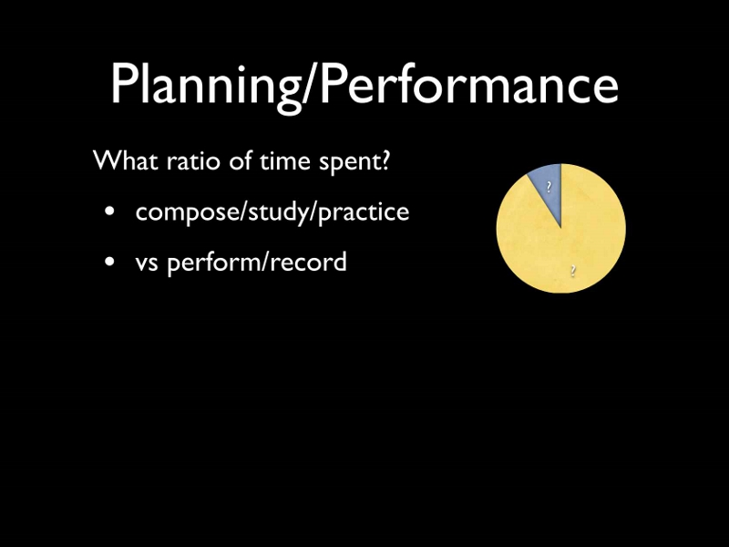

But is that, like, the way other things work? No! How about for an orchestral musician? How much time do they spend practicing versus at the concert? Way more time. Way more time. And do they go and say, "I practiced at college, so I'm done practicing"? No.

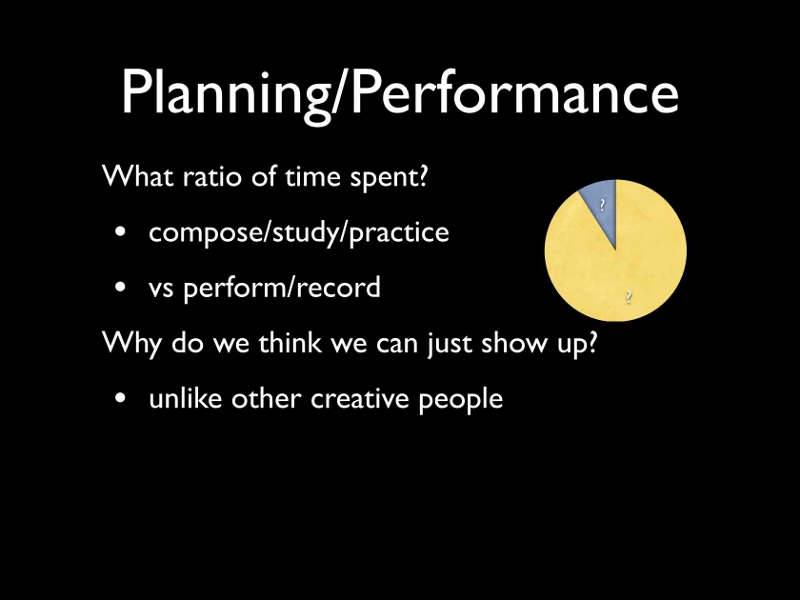

Why do we think that we can do this? We went to college or wherever we learned, whatever, and then, like, we just, like, we're going to go, and we're going to do it every day. We just do it from here on. Went to school; we're done.

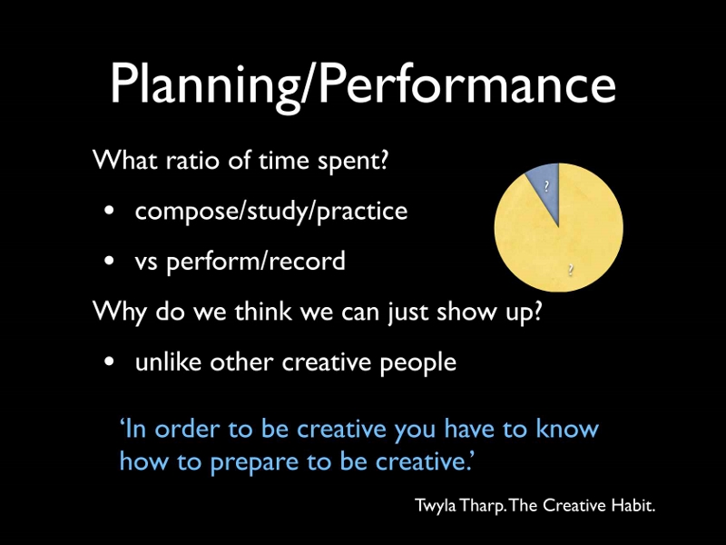

I think that we do need to assess how much time we spend. How many people spend 10% of their time designing? 25%? 50%? I'm going up. No more hands are going to go up. No one spent 10%. It's quite sad.

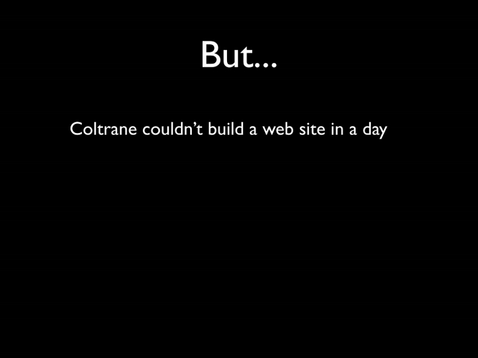

But there's a sense in which -

[Audience laughter]

There's a sense in which - I mean, it is sad. It is. It's actually sad. It's not sad as a joke - sad. It's actually sad. But there's a sense in which it's like, all right, well, this is all so - it's so different, right? Coltrane couldn't build a website in a day. I could. You know, I could do that.

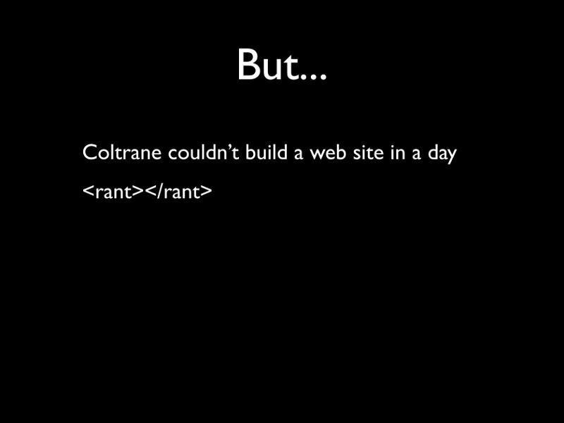

Actually, I personally couldn't, but I know other people who can. And that's where another rant would go about how important is that. Why do we put so much priority on, like, how fast can a beginner do something and how can you, like, regurgitate a template in a day? None of these are things that we need to do on an ongoing basis to solve problems for the world.

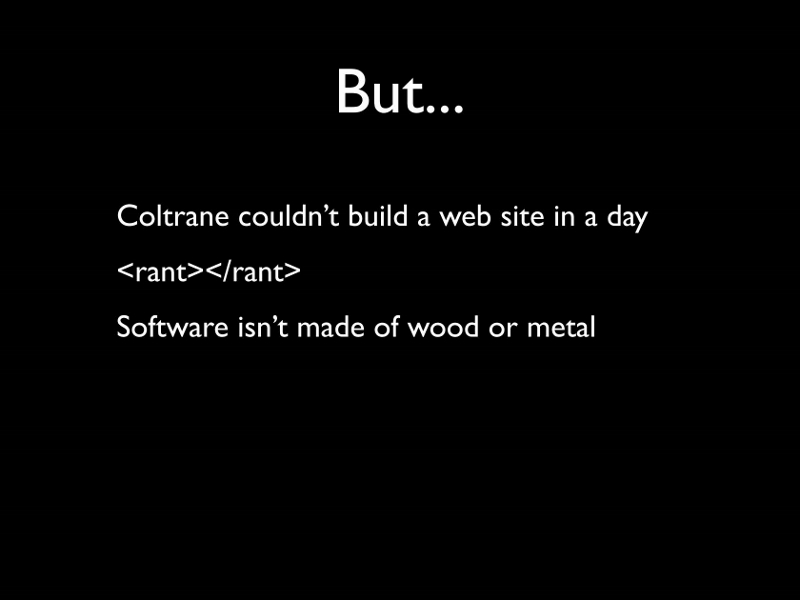

But it's a fair point that, you know, software is not like instruments. It's not made out of wood or metal, right? We have these ones and zeros. There are so many combinations. There are so many ones and so many zeros. It just seems so open. How is this connected?

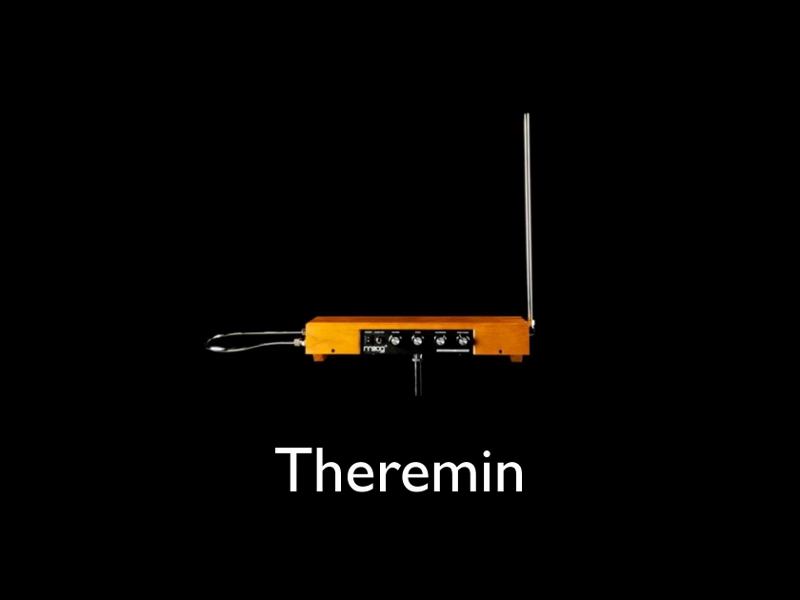

It ends up that there is this connection between instruments and things that are more technological, and they're technological instruments or electronic instruments. This one I want to share a picture of because I also have one of those. It's called a Theremin. No sooner did we have the ability to turn electrical signals into vibrating loudspeakers by having recorded stuff in order to send the signals through that somebody said I wish we didn't have to record stuff. I wish I could just make up an electrical signal and send it to the speaker. Let's cut out that performing and recording part and let's just do - let's just go right for the sound.

And so electronic music was born, and this is one of the first electronic instruments where you play this thing. It's two antenna, and the vertical one controls the pitch. The closer you get, the higher the pitch. The further away, the lower the pitch. And the one, the horizontal one controls the volume. The closer you are, the lower the volume, and the further away you are, the higher the volume. So you can silence it by touching it. You do that, and that's all you got.

You don't actually touch them at all, and the knobs just change the tambour a little bit, but really not very much. It's not really about that. This is an incredibly difficult instrument to play, but it was one of the first ones.

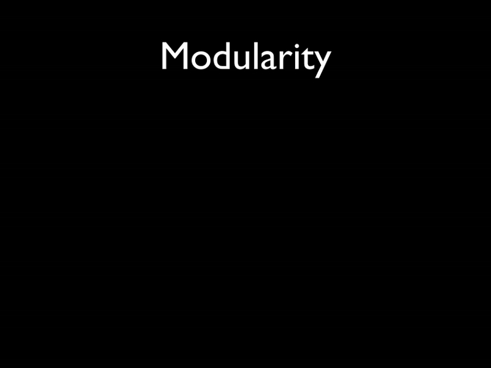

Then things grew up.

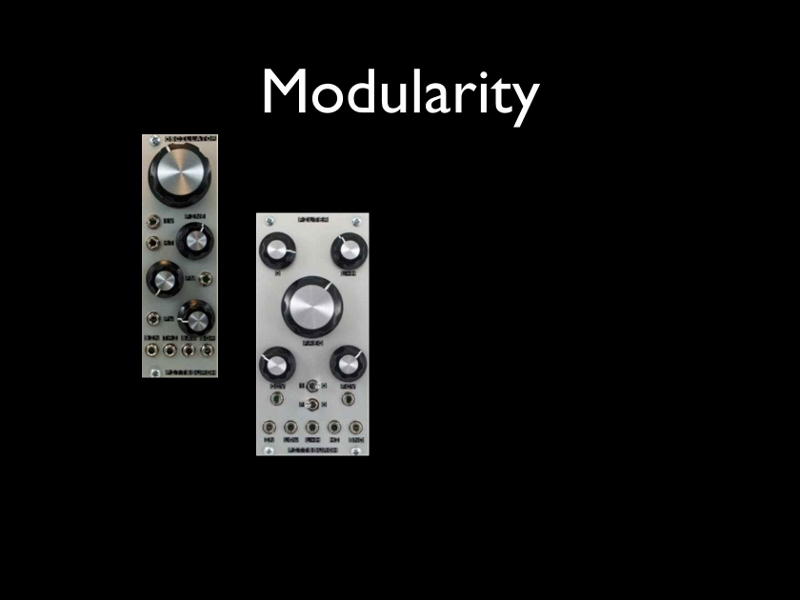

And now we're starting to see things more like we know, we understand. These are some of the first electronic instruments that were made. These are the pieces of that instrument you saw before. Each module does a particular thing. It might generate sound or generate certain wave shapes, or it might be a filter that trims off high frequencies from those shapes, or it might generate a low frequence oscillation you can use to multiple something else.

And one of the really cool things about this is not only do you see the first thing, you know, first, or not the first ones, but not only do you see examples of physical modularity, but you also see examples of control. So there are these little holes, these jacks on the front of these things, and they actually take in our output control voltage. It's just voltage. You send a voltage in and then, depending on the module, the voltage might control the pitch or the frequency of oscillation or something, or the frequency at which the filter kicks in, or the wave shape, or various things like that. And then the knobs are redundant things that sort of give a human interface to what you could have done through control voltage by plugging something into the jack.

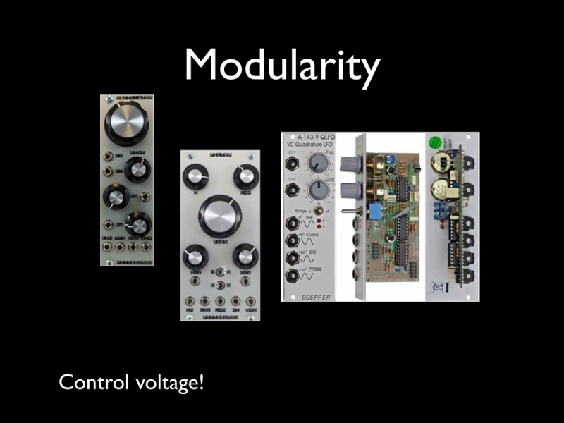

And there's something incredibly interesting about this, and then you see behind these, there's a circuit, so we have the layers of effort.

But there's a really good lesson here about human versus machine interface. These things had a machine interface first. It was all control voltage. And then they put knobs on it. So you could patch the control voltages around and build customized things.

Imagine if someone had built something - SQL - without any machine interfaces - Unix.

[Audience laughter]

But primarily with human interfaces, just the knobs, like, if I gave you a bunch of these modules and they just had the knobs, and I was like, "Put it together." You're going to be - by doing what? Putting little remote controllers on the knobs? Sort of like generating SQL text strings or something. Why would I want to do that? Or parsing random output from Unix programs or specifying command line arguments. It's awful, right? But these hardware guys are smarter than we are. So they built a human interface on top of the machine interface.

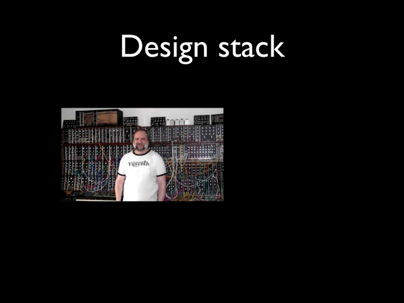

We're seeing this thing, this stacking that occurs. This guy, whose name I'm going to mess up, Yves Usson, is somebody who is awesome. He can work at all the layers of the stack. I think he's a biochemist or something. But in his spare time, when he's not a biochemist, he's a C++ programmer. In his other spare time he actually designs these modules. You see behind him a rack of these modules. But he designs the modules, so he can do the electronics work associated with building a module and building an analog filter, for instance, or an analog generator.

And then he obviously can compose them. He helps people make kits and then you can build them into racks. Then you patch them together. So then you're at another level of design where you're patching things together and setting them in odd positions and designing a sound or patch, they call them, but setting a sound out of the module. Then maybe sometimes there's a little keyboard next to them. Sometimes he gets to play the keyboard and make music with this. But it's all these layers associated to what he does and can do.

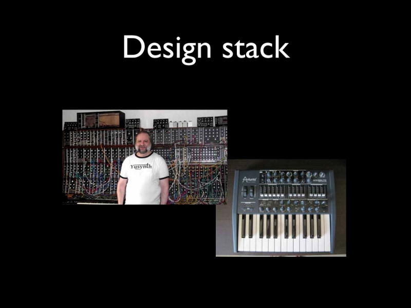

He happened to work with this company, Arturia, to produce an analog synth, which is rare these days. They used to be, all synths were analog like the pictures I was showing you, but now they're kind of rare. Everything has become digital.

They came out with this analog synth and he helped them design it. And he really did design. And what's interesting about what he did there was this thing doesn't have wires coming out all over the top of it. The decisions about - it has the same kind of modules inside it, but the decisions about how they go together he made, he said, or he helped them make. He said we should make this go to that, and this is how the filter should work, and these are what the parameters should be.

There are still knobs on the top, but a lot of the other stuff has been incorporated in the design that allows people to only work at the next level up. They do not need to care about what's inside this box.

And it's quite an important thing because, for him, he has different days. He has days when he's patching stuff together. Maybe he has days when he's playing his thing. And that's all fine, but days when he's soldering, he is not making music. And this is what happens to us.

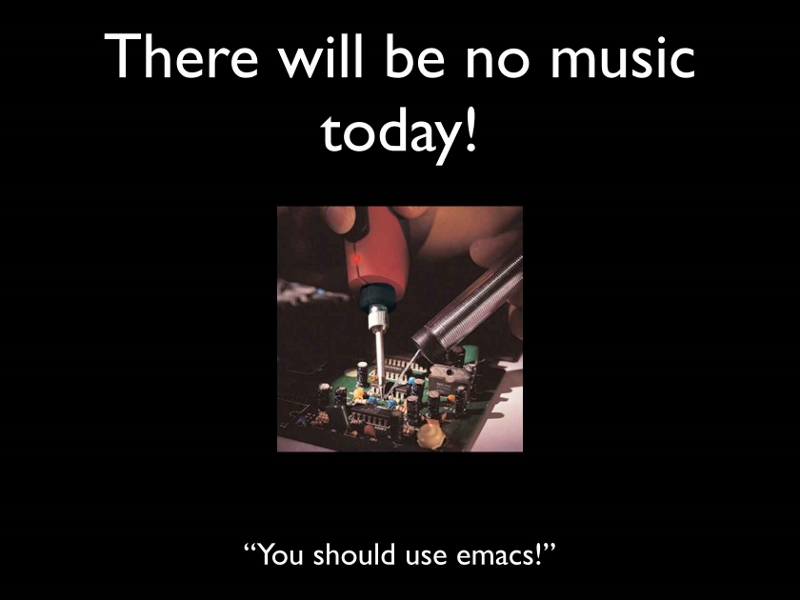

This is what happens to us when we say you should use emacs. It's like somebody wanted to make music, and you gave them a soldering iron. It's like: here you go. Have at it. Start at the bottom.

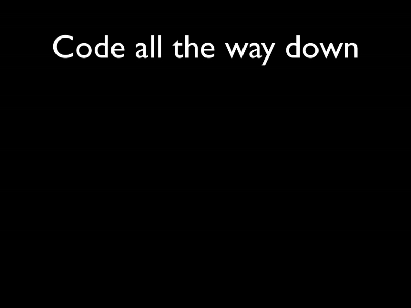

And why does that happen to us? The reason is because, for us, it's the same stuff all the way down. In that space, it's very different. Designing an analog filter is a pretty tricky thing just from a mathematics perspective, and then there's also the componentry associated with the electronics aspect of it. Then there's actually being able to solder and put it together on a circuit board.

And then somebody with a completely different skill set to go and say I can patch these things together, turn these knobs and listen, understand what the architecture of these things is, and make a sound. And somebody else could walk up to that whole patch and say I could make a composition with this sound.

But for us, we have the same stuff at all the levels. It's code. The top level is code. The middle level is code. The bottom level is code. We can do it all. We have the same mechanism at every layer.

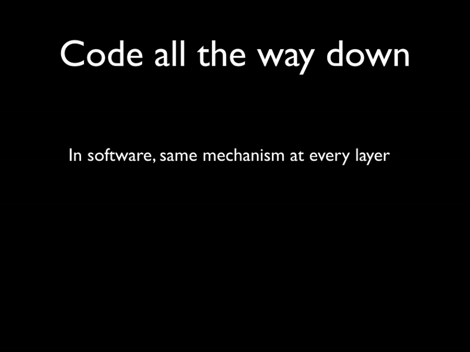

Essentially, we all do have soldering irons.

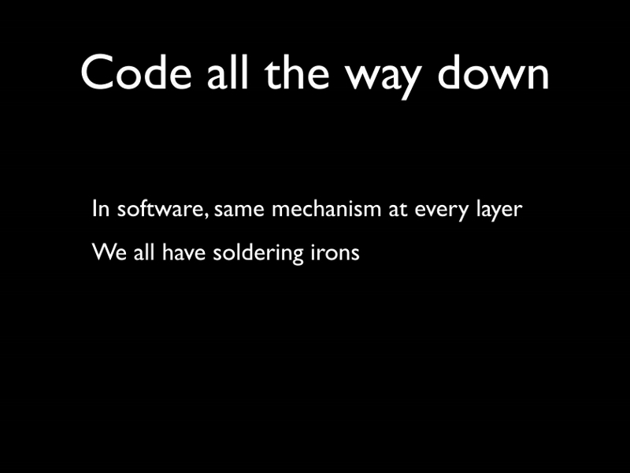

It's like any time you want to, you can start soldering. You're supposed to be up here doing this, but you could just start soldering.

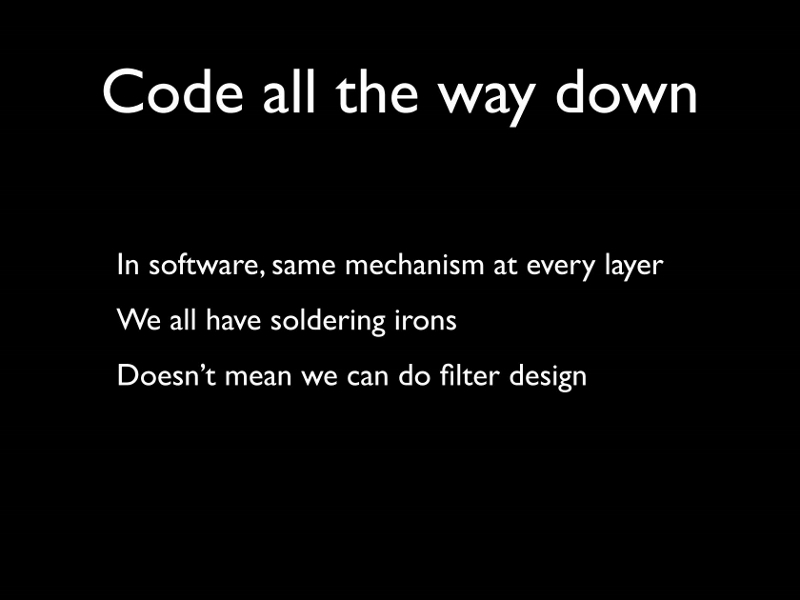

And just because we had the soldering iron doesn't mean we're capable of doing things at all layers, but we just do because we can. We have got the iron in hand.

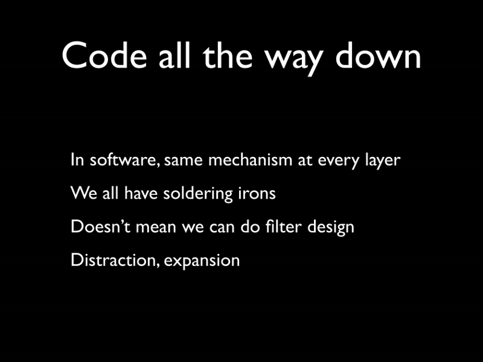

And I think it leads to a lot of distraction and expansion of scope of things. It's like, I was working on this, and then I realized if I rewrote the driver, I could be 10% faster. And now I'm doing something I shouldn't be doing.

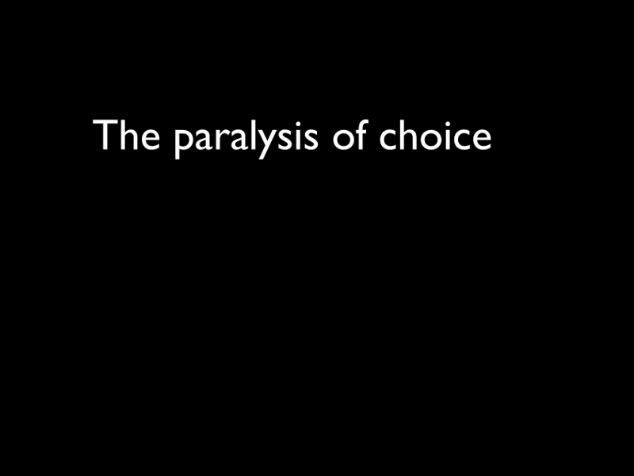

There's a sense in which having so much control over so many parts of the stack, it gives us this paralysis. There's so much we could do at every point. So what are we going to do? And I think that we need to - of course, the problem space has some constraints, but we need to bring constraints of our own into play.

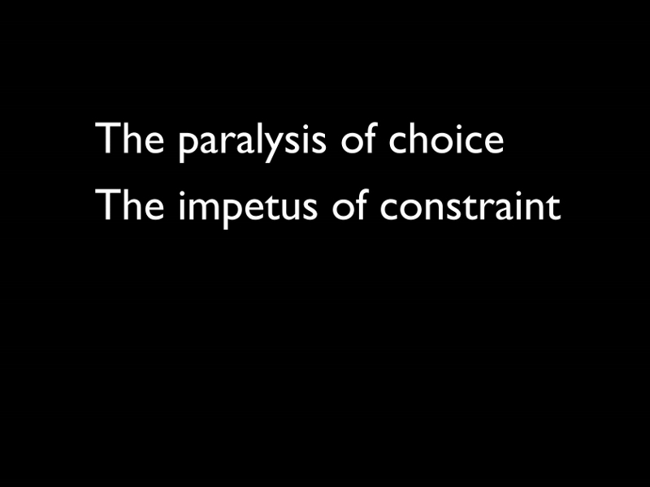

We have to do this for ourselves the same way composers do it for themselves or choreographers or directors do it for themselves. They bring constraints in to help them move forward.

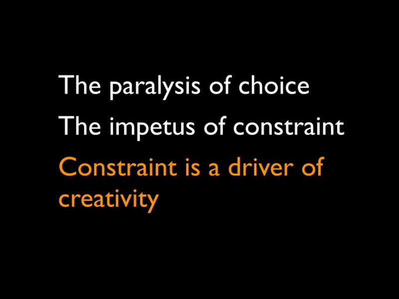

This is not a new idea. This is a very old idea, but it's one we have to keep remembering. Constraint drives creativity. When you don't have a lot of choices, you're forced to pick an answer and move on. We all have choices. You could just mull around about the choices all the time. Making your own constraints is a way to help you do that.

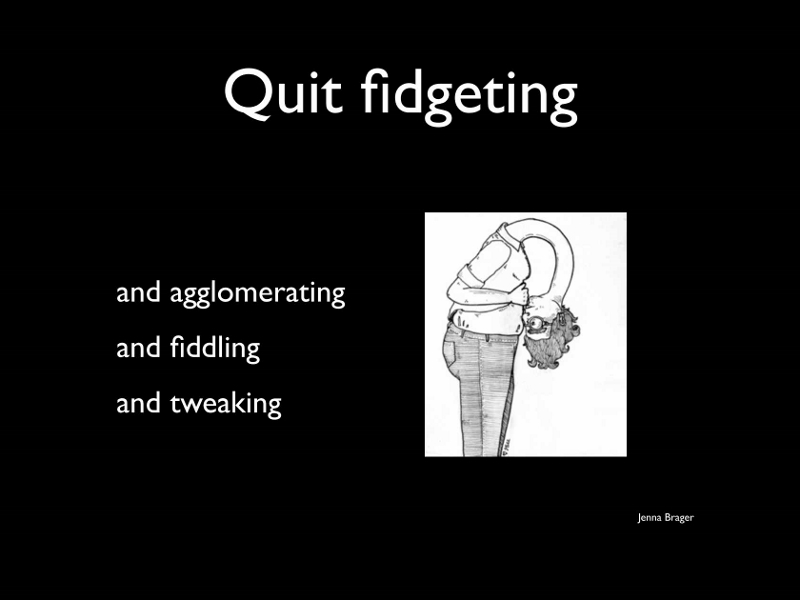

So I think we need to quit fidgeting and glomming stuff on and fiddling around with things and tweaking. I mean, oh, my God. As an industry, we spend an inordinate amount of time focused on ourselves: build tools, automating this and that, and just crazy, crazy, crazy stuff. Talking about it any everything else, and we should just be focusing on what we're doing because what ends up happening is, when you keep fiddling with stuff, and when you have no limitations to scope, and no constraints, what happens?

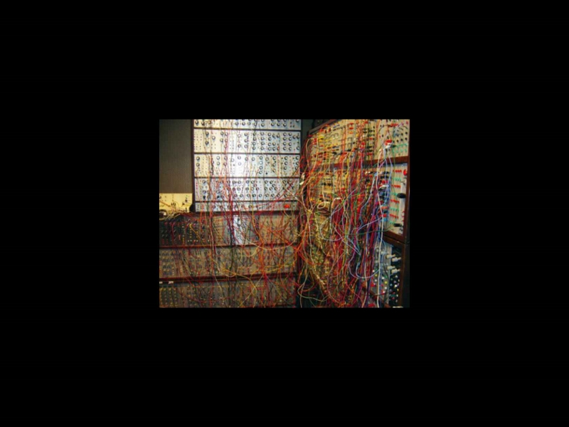

This thing happens. And every one of those parts may be a good idea. They're probably all good ideas. But if you take every good idea, you end up with that.

I don't care if you configure this thing with spring; it's not playable.

[Audience laughter]

No one wants to play this. In fact, this particular one, no one does play. It plays itself.

[Audience laughter]

The actual patching of it is the composition, and it's got stochastic elements in it that cause it to generate novelty, and it plays itself in a museum. I mean, maybe we want programs like that, but maybe we don't.

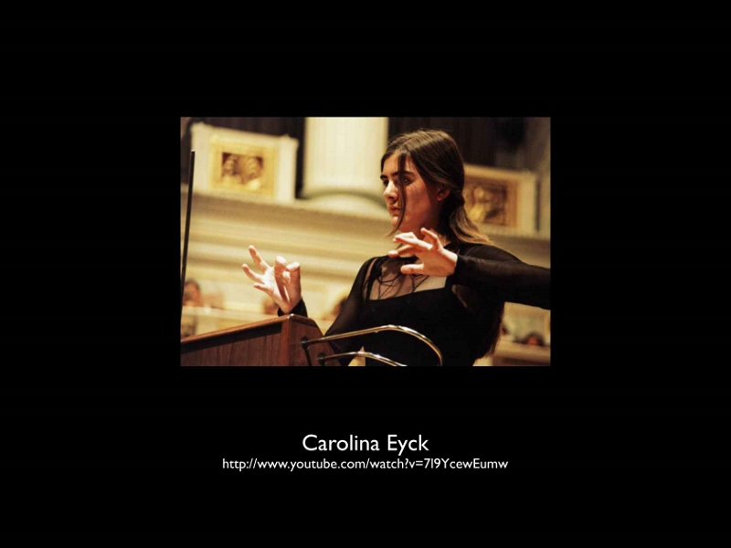

So we should push back, I think, especially in open source projects. There's this constant pressure. Take my good idea. Take my good idea. Take my good idea. They're all good ideas, but whatever.

And we need to remember there are people who make music by waving their hands through the air. That's it. They don't need emacs or anything else. They can just do this. And I'm telling you, if you've every tried to play the Theremin and have it sound like anything other than a siren or a spaceship, it's brutally difficult to do.

And so, I mean, I don't know if you can see it in her face, but she's not making a face like the other guys, but she is engaged. I think the reason why she's not making a face is because the pitch changes if you make a face. It's that sensitive.

[Audience laughter]

But at some point, go listen to that because it's beautiful.

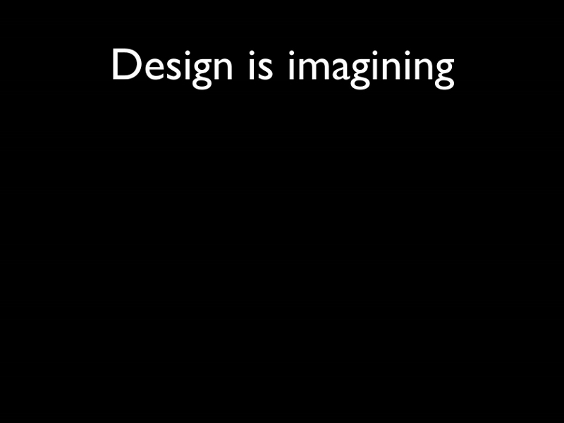

So what is design? If we take a step back and sort of merge all these things together, there's a sense in which design is imagining. If it's not just regurgitating something that's already happened before, you're facing some set of problems. You have to imagine potential solutions.

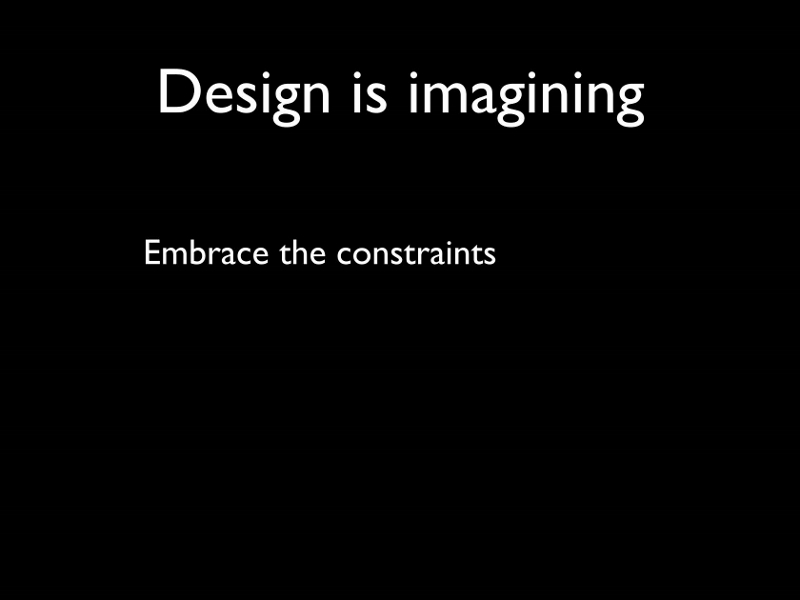

And the first thing you need to do is rush at the constraints. You don't want to be like, don't constrain me; I'm trying to design. It's the opposite of that. You're like, give me, give me, give me the constraints. I want to know about everything. And, if you haven't given me enough constraints, I'm going to make up some because I want this thing to work.

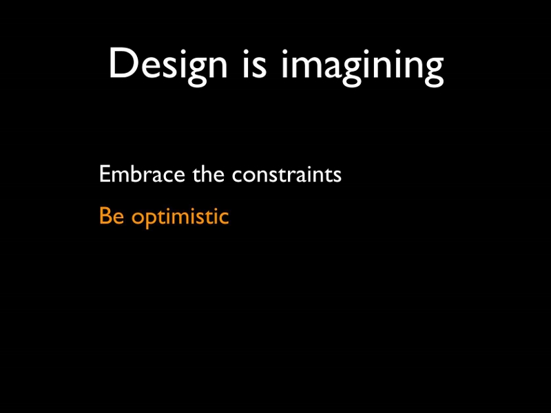

Of course, when you're facing all these constraints, it seems like negative. I can't do this; I can't do that. It must do this and this size and whatever. It's like, oh, you know. So you have to be - there's a sense in which designing is fundamentally an optimistic activity. You have to stay positive. In spite of all these constraints coming your way, you have to stay positive. Remember, people do design that have no constraints and pick constraints in order to get outcomes. So that optimism can be born of the fact that this works and this is the way to make systems that work. And you want to imagine a ton of things.

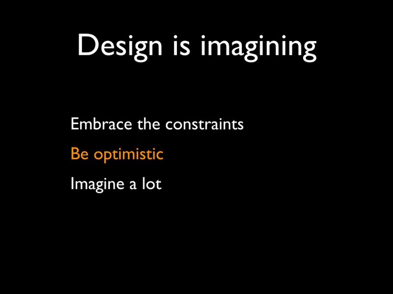

However, actually designing is about making decisions, which means you try to think up 100 times as many things as you actually use, way more things than you use.

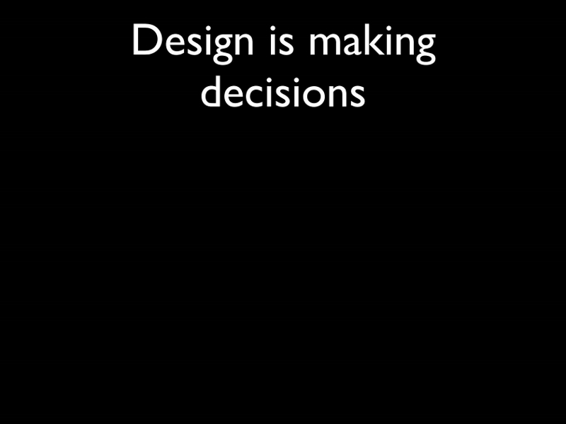

You don't want to think of one thing and be like, okay, let's go do that. You want to think of ten things and then say this one is the one we want to do.

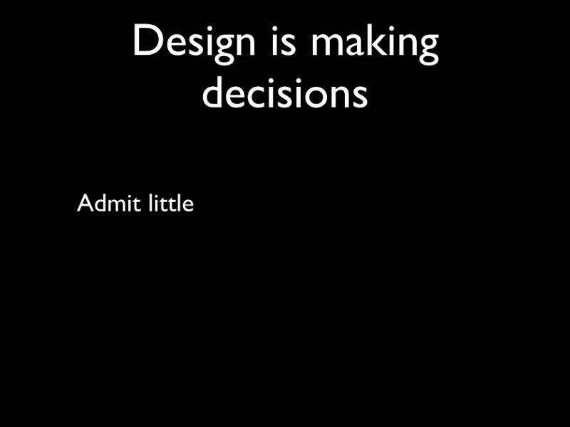

So you want to admit very little.

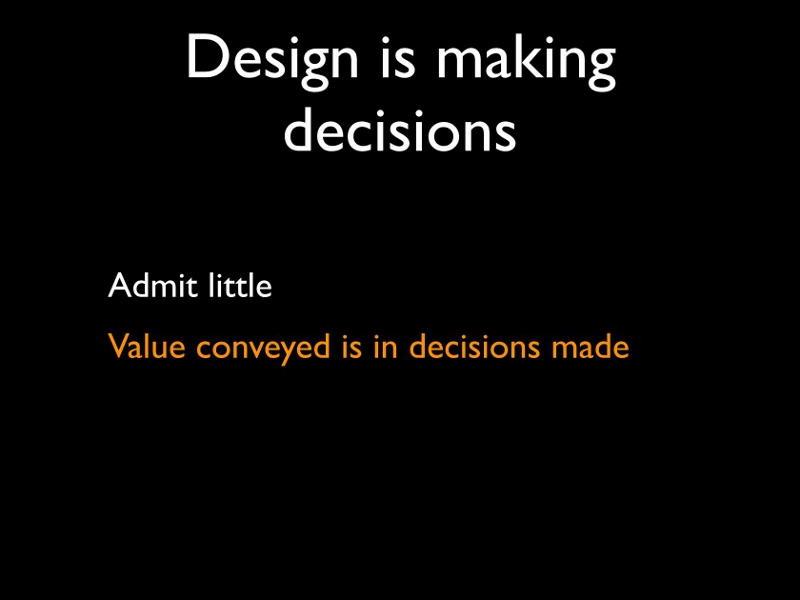

You want to be able to say no because the value that you convey in your design is strictly about the decisions you've made. When Yves helped make that synthesizer, he made a set of decisions. Are they perfect? No. Is it everything you want? No. Do I wish I could patch a wire from here to there? Yeah, sometimes I do. But you know what? I really appreciate the fact that this thing just works, and it sounds great, and I can do the next thing. I don't have to fiddle around with the inside of it.

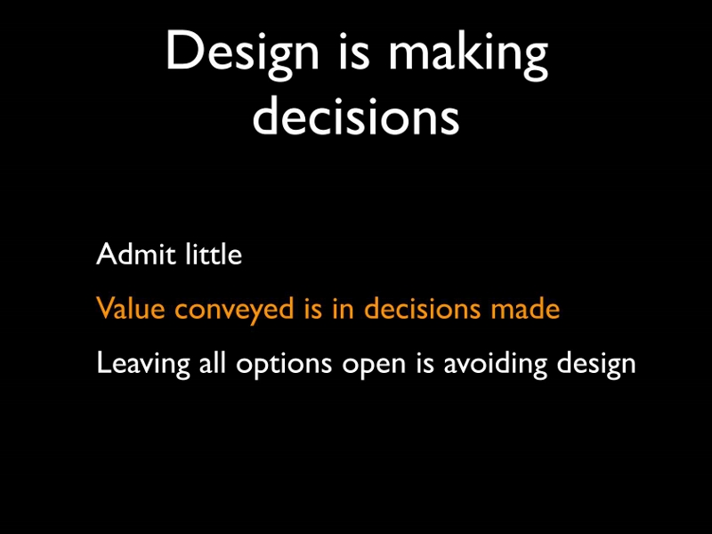

So if you leave all the options open, you're not designing. That is not design. Everything configurable, that's not design. That's like do your own thing.

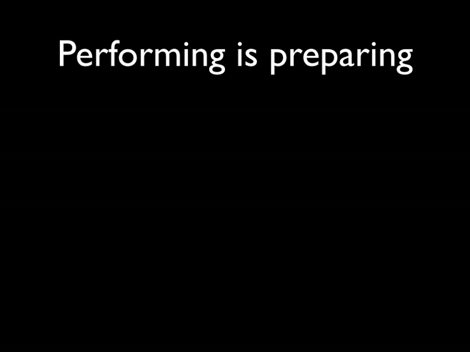

So performing is preparing. It's planning.

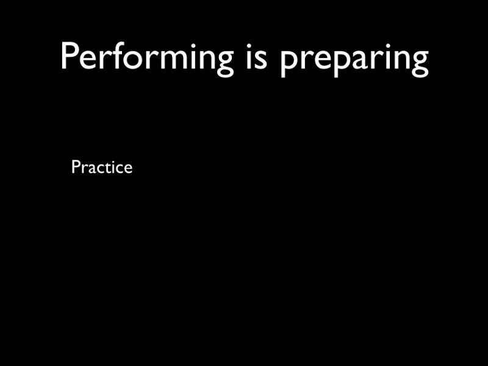

You have to practice.

You have to study.

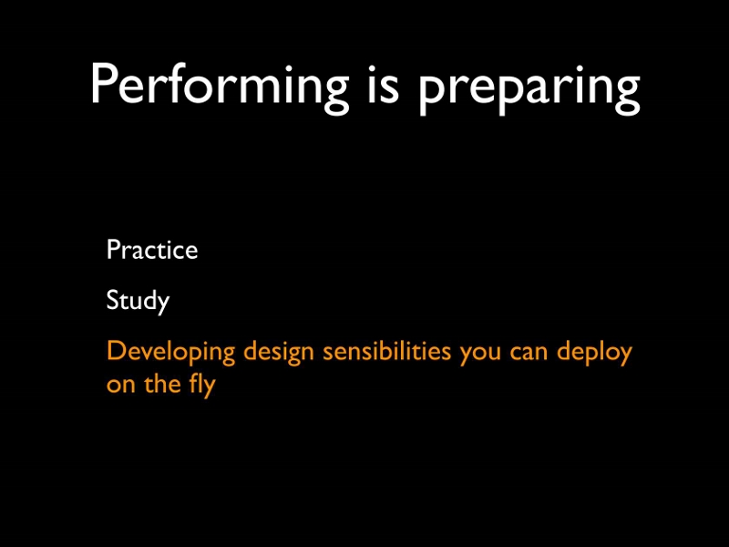

And, in the end, what you want to try to do is develop sensibilities that you can apply when you're trying to write code. If writing code is the performing part, you have to have patterns, techniques, knowledge about what works and what doesn't to apply to what you're going to do. You cannot just make it up as you go.

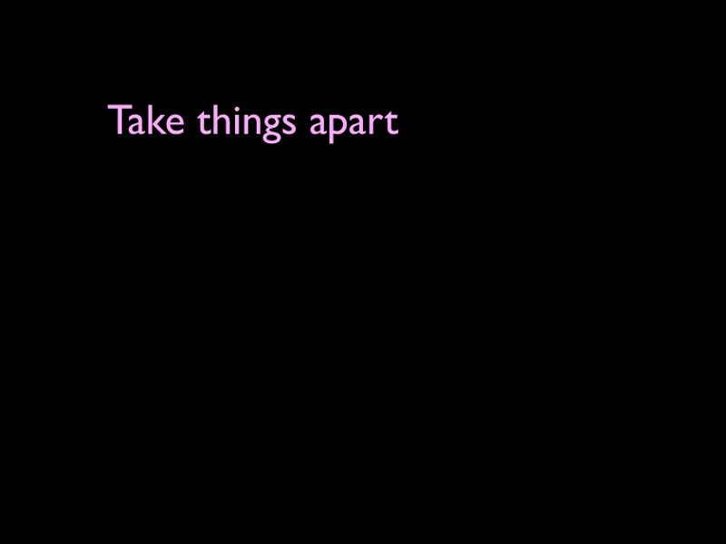

So design is taking things apart in order to be able to put them back together. And that's really all it is. Every time I encounter something, I can boil it back down to that. Every time I encounter something that I wish my design was better, I need to do more of this. It's over and over and over again. It's always this. I did not take it apart enough.

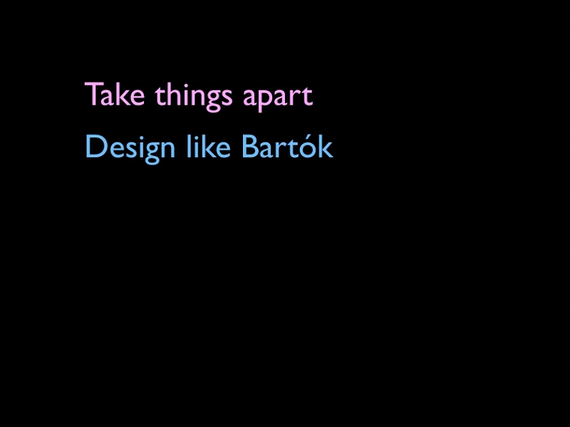

You want to design like Bartok. That is to say, you want to communicate very well. You want to be able to work at multiple levels.

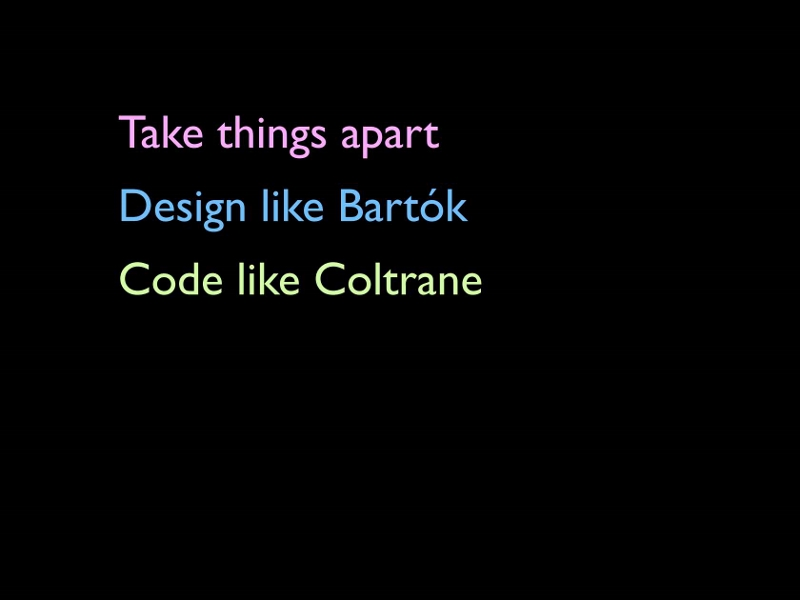

And you want to code like Coltrane. You want to take preparedness and experience, real experience with doing things, not experience by doing the same thing over and over again. And bring them to bear in what feels like a more improvised thing. I'm encountering a new scenario in a programming project. I'm really not making it up. I'm really bringing my background into play to solve that problem.

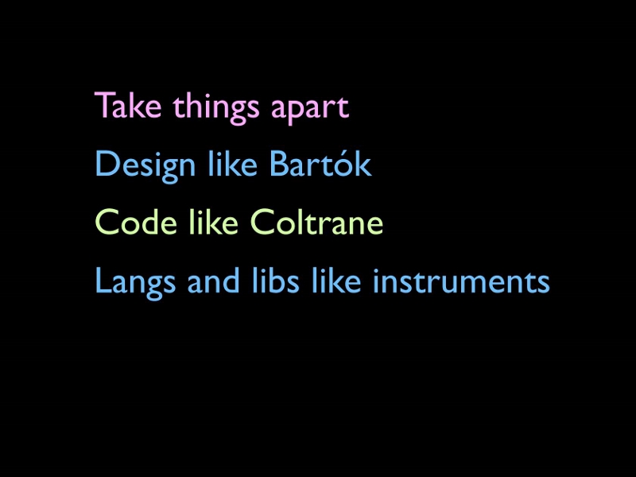

I think you want to find and choose languages and libraries that are like instruments in all the ways I talked about in terms of being simple, directed at one thing, oriented around people that know how to use them and expressing and backing some fundamental excitation or idea. Those are going to be the most satisfying.

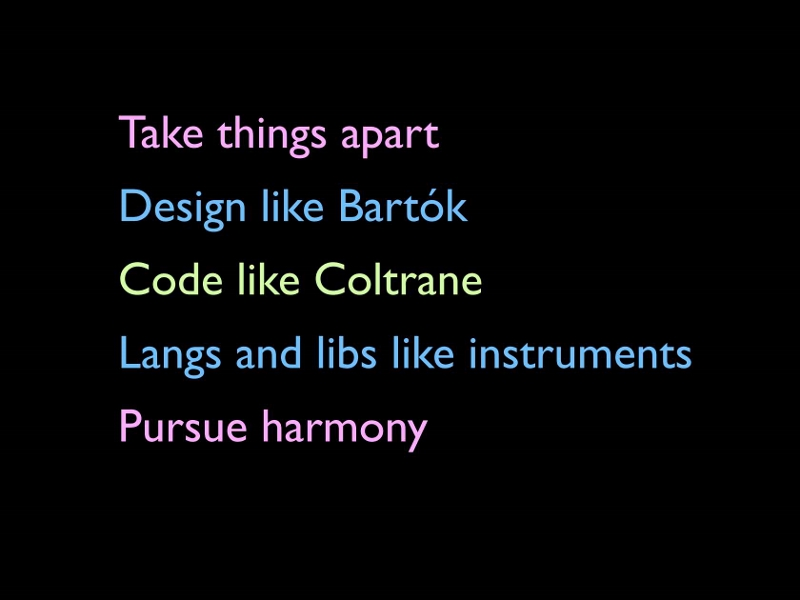

And in the end, pursue harmony in your own designs. Try to think about the nature of harmoniousness in software, what makes things work together, and apply that.

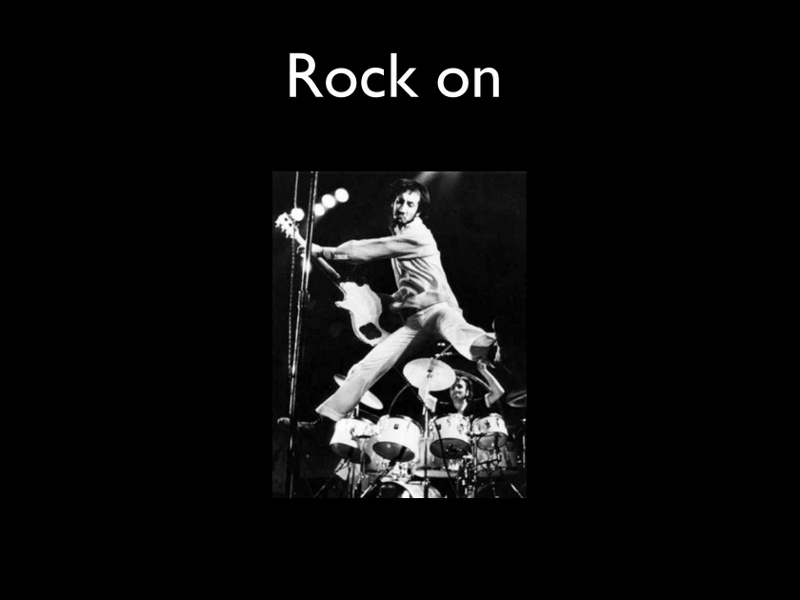

But thanks very much for listening, and I hope you enjoy the rest of the conference.

[Audience applause]
