# Effective Programs

* **Speaker: Rich Hickey**
* **Conference: [Clojure/Conj 2017](http://2017.clojure-conj.org) - Oct 2017**
* **Video: [https://www.youtube.com/watch?v=2V1FtfBDsLU](https://www.youtube.com/watch?v=2V1FtfBDsLU)**

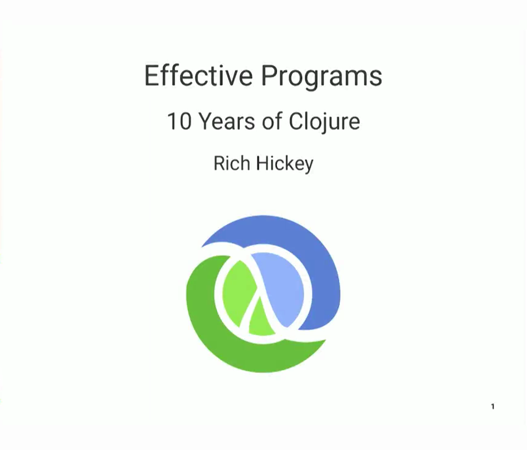

I feel like a broken record every time I start these talks by thanking everybody. So I want to start this way in a different way by saying, "My son is getting married today."

[Audience applause]

"In another state."

[Audience laughter]

So right after I give this talk, I'm gonna hop on a plane, go do that, I'll be back tomorrow morning, so I haven't disappeared. I'm looking forward to the follow-up talks and everything else, but I will be missing in action briefly.

So now, to be redundant. Thanks everybody for coming. Ten years ago, Clojure was released, and there's no possible way

[Audience applause]

I could have imagined this. You know I told my wife Steph, I said, "if 100 people use this, that would be ridiculously outrageous", and that's not what happened. And what did happen is interesting, I don't think it's fully understood.

But I wanted today to talk about a look back a little bit about the motivations behind Clojure. It's not like when you come out with a programming language you can tell that whole story. I think one because it's not good marketing, and two because if you really wanna be honest, you probably don't know. It takes time to understand what happened, and why and what you really were thinking, and I won't pretend I had a grand plan that incorporated everything that ended up becoming Clojure. It certainly involved a lot of interaction with people in the community.

But, there is this, "Clojure is opinionated", this, we hear this. And I think it's interesting to think about two aspects of that. One is, in which ways is it, and what does it mean for a language to be opinionated. I think in Clojure's case, people come to it, and they're like "wow, this is forcing me, everywhere I turn to do something a certain way".

So, and I think the nice way to say that is there's only a few strongly supported idioms, and a lot of support for them. So if you use the stuff that comes with it, there's a whole story that supports your efforts. And if you want to fight against that, we don't do too much.

[Alex was asking me which glasses were the right ones and "neither" is the answer.]

But design is about making choices. 

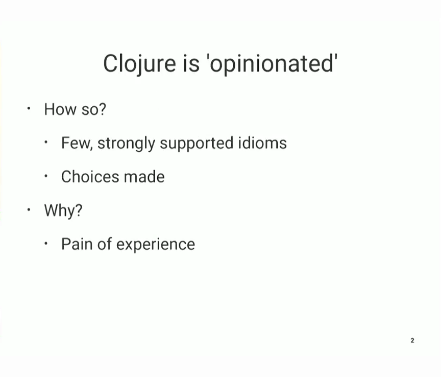

And now there's a bunch of choices in Clojure, in particular, there's a big choice about what to leave out, and part of this talk will be talking about what was left out.

The other side of being opinionated is "how do you get opinionated". I mean it's not like I'm opinionated.

[Audience laughter]

Of course I'm opinionated, and that comes from experience. When I started 

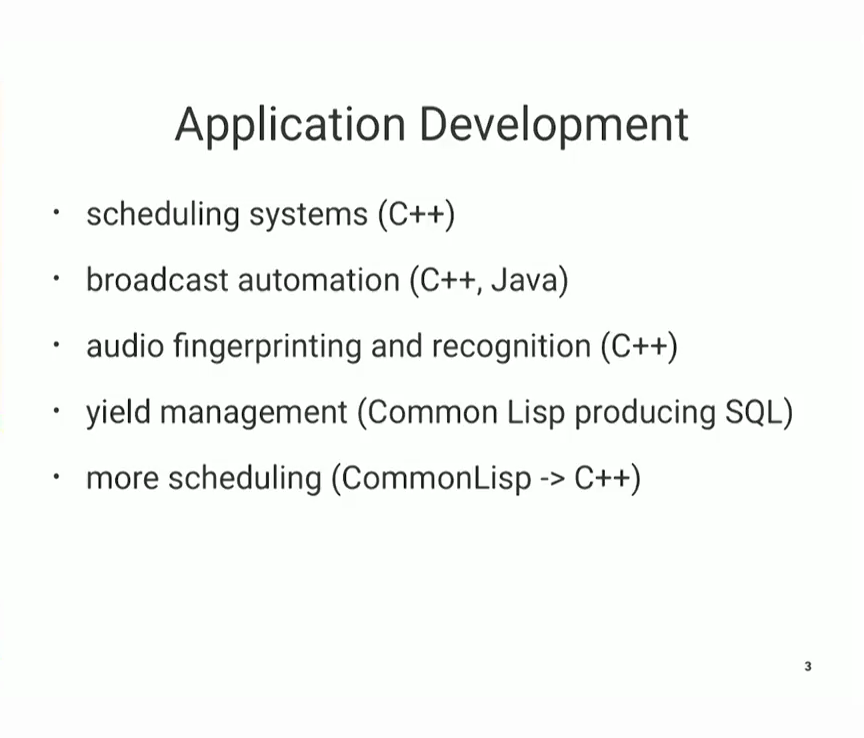

doing Clojure in 2005, I had already been programming for 18 years. So I'd had it. I was done. I was tired of it. But I had done some really interesting things with the languages that professional programmers used at the time.

So primarily I was working on scheduling systems in C++, these are scheduling systems for broadcasters, so radio stations use scheduling systems to determine what music they play. And it's quite sophisticated the way that works. You know, you think about "well over the course of the day you don't want to repeat the same song". You actually have to think about the people who, you know, listen to the radio for one hour in the morning and this other hour in the afternoon. And you create sort of alternate time dimension for every drive time hour. Things like that. So there's multi-dimensional scheduling and we used evolutionary program optimization to do schedule optimization.

Broadcast automation is about playing audio and at the time we were doing this, playing audio on computers was a hard thing. It required dedicated cards to DSP work. I did work on audio fingerprinting, so we made systems that sat in closets and listened to the radio and wrote down what they heard. And this was both used to track station's playlists and eventually to track advertising which was where the money was for that. Which involved figuring out how to effectively fingerprint audio and scrub audio, sort of compare novelty to the past.

I worked on yield management systems. Does everybody know what "yield management" is"? Probably not. So what do hotels, airlines, and radio stations have in common? Their inventory disappears as time passes, right? "Oh, I have a free room, I've got a slot in my schedule, I've got a seat on this airplane", and then time passes and nobody bought it, and now you don't. So yield management is the science and practice of trying to figure out how to optimize the value of your inventory as it disappears out from under you. And that's about looking at the past and past sales and it's not simplistic. So for instance, it's not an objective to sell all of your inventory, the objective is to maximize the revenue you get from it, which means not selling all of it in most cases.

That was not written in C++, that was around the time I discovered Common Lisp, which was about 8 years into that 15 years. And there was no way the consumer of this would use Common Lisp, so I wrote a Common Lisp program that wrote all the yield management algorithms again out as SQL stored procedures and gave them this database, which was a program.

Eventually I got back to scheduling and again wrote a new kind of scheduling system in Common Lisp, which again they did not want to run in production. And then I rewrote it in C++. Now at this point I was an expert C++ user and really loved C++, for some value of love

[Audience laughter]

that involves no satisfaction at all.

[Audience laughter]

But as we'll see later I love the puzzle of C++. So I had to rewrite it in C++ and it took, you know, four times as long to rewrite it as it took to write it in the first place, it yielded five times as much code and it was no faster. And that's when I knew I was doing it wrong.

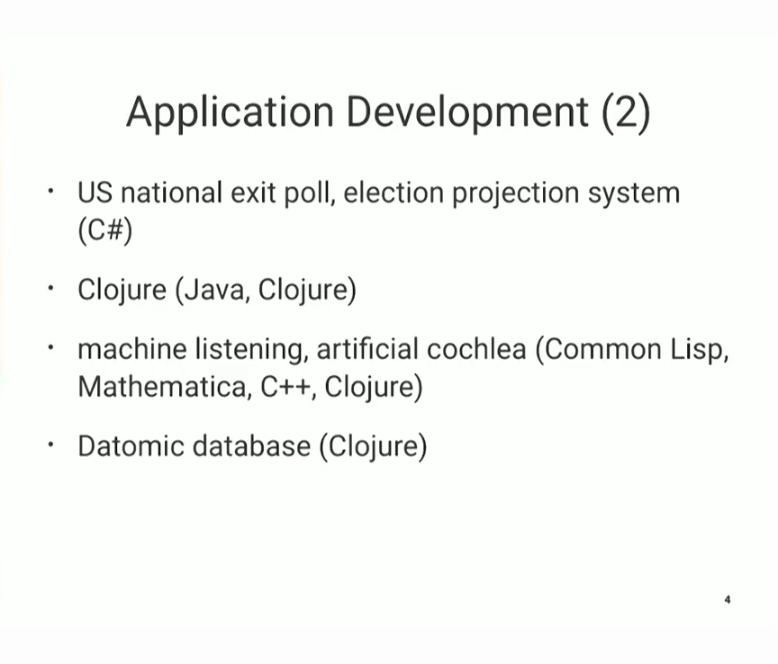

Went out to help my friend Eric write the new version of the National Exit Poll System for the U.S., which also involves an election projection system. We did that in, you know, a sort of self-imposed functional style of C#.

And then, you know, around 2005, I started doing Clojure and this machine listening project at the same time. And I'd given myself a 2-year sabbatical to work on these things not knowing which one would go where. And leaving myself free to do whatever I thought was right so I had zero commercial objectives, zero acceptance metrics, I was trying to please myself for two years, just sort of bought myself a break.

But along the way during that period of time, you know, I realized I'd only have time to finish one. And I knew how to finish Clojure, and you know, machine listening is a research topic. I didn't know if I was two years away or five years away. So Clojure is written in Java and eventually, you know, the libraries written in Clojure.

And the machine listening work involved building an artificial cochlea, and I did that in a combination of Common Lisp and Mathematica and C++. And in recent years as I've dusted it off, I've been able to do it in Clojure, and that's sort of the most exciting thing. I needed these three languages before to do this and now I only need Clojure to do it.

And then I did Datomic, which is also Clojure.

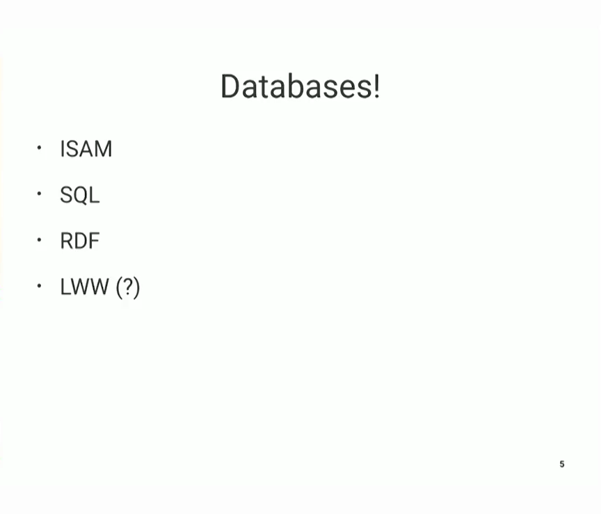

Almost all of these projects involved a database. All different kinds of databases from, you know,  ISAM databases, a lot of SQL, many attempts but not many integrations of RDF. Databases are an essential part of solving these kinds of problems. It's just what we do.

How many people use a database in what they do every day? How many people don't?

Ok.

So this last thing is not an acronym for a database. It's there to remind me to tell this anecdote.

So I used to go to the Light-Weight Languages workshop. It was a one-day workshop held at MIT. Where people working on small languages, you know, either proprietary or just domain-specific, you know, DARPA(?) or whatever would talk about their little languages and what they would do with their little languages. It was very cool and very exciting. Got a bunch of language geeks in the same room, and there was pizza afterwards.

So I remember, I would just go by myself or with my friend. I was not part of the community that did that, they just let me in. But afterwards, they had pizza, so I had sat down with pizza with two people I didn't know, and I still don't know their names. And it's good that I don't, because I'm gonna now disparage them.

[audience laughter]

They were both computer language researchers, and they were talking also disparagingly about their associate who'd somehow had fallen in with databases and lost the true way. And one of them sort of sneeringly ? to the other and said, "aw, David, when was the last time you used a database?", and he was like, "I don't know that I've ever used a database". And like I sort of choked on my pizza, because theoretically they're designing programming languages and yet they're programming and they never use databases. I didn't know how that worked.

But it's part of the inspiration to do 

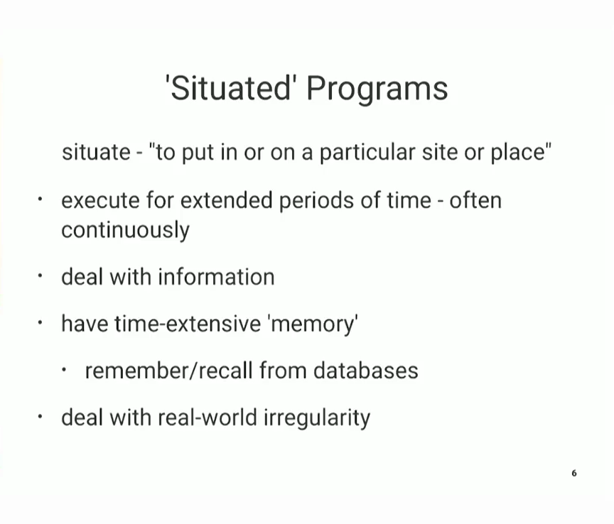

Clojure because, I mean, people who don't do databases can write programming languages, anybody can.

[audience laughter]

So, you know, there are different kinds of programs, and one of the things I tried to capture on this slide is to talk about what those kinds of programs were that I was working on. And the word I came up with was "situated" programs. In other words, you can distinguish these kinds of programs that sit in the world in a sort of entangled with the world. They have a bunch of characteristics. One is, they execute for an extended period of time. It's not just like calculate this result and spit it over there. It's not like a lambda function at AWS. These things run on an ongoing basis and they're sort of wired up to the world. And most of these systems run continuously, 24/7. It's quite terrifying to me that now these things which are 30 years old are almost definitely still running 24/7 somewhere, if they haven't been replaced.

So this first notion of extended periods of time means continuously, as opposed to just for a burst. They almost always deal with information. What were the kinds of things that I talked about? Scheduling. In scheduling you look at what you've done in the past. You look at your research data. What does your audience tell you they like or they're interested in, or what they're burnt out on. And you combine that knowledge to make a schedule.

Yield management looks at the past sales and sales related to particular periods of time and facts about that, and produces pricing information.

The election system looks at prior vote records. How did people vote before? That is a big indicator of how they're going to vote again. Of course the algorithms behind (?) that are much more sophisticated.

But in a simplified way, you can say all of these systems consumed information, and it was vital to them. And some of them produced information. They tracked the record what they did.

And that's this next point which is that most of these systems have some sort of time-extensive memory. That database isn't like an input to the system that's, you know, fixed. It's something that gets added to as the system runs. So these systems are remembering what they did and they're doing it both for their own consumption and for consumption by other programs quite often.

And they deal with real-world irregularity. This is the other thing I think that's super-critical, you know, in this situated programming world. It's never as elegant as you think, the real-world.

And I talked about that scheduling problem of, you know, those linear times, somebody who listens all day, and the somebody who just listens while they're driving in the morning and the afternoon. Eight hours apart there's one set of people and, then an hour later there's another set of people, another set. You know, you have to think about all that time. You come up with this elegant notion of multi-dimensional time and you'd be like, "oh, I'm totally good...except on Tuesday". Why? Well, in the U.S. on certain kinds of genres of radio, there's a thing called "two for Tuesday". Right? So you built this scheduling system, and the main purpose of the system is to never play the same song twice in a row, or even pretty near when you played it last. And not even play the same artist near when you played the artist, or else somebody's going to say, "all you do is play Elton John, I hate this station".

But on Tuesday, it's a gimmick. "Two for Tuesday" means, every spot where we play a song, we're going to play two songs by that artist. Violating every precious elegant rule you put in the system. And I've never had a real-world system that didn't have these kinds of irregularities. And where they weren't important.

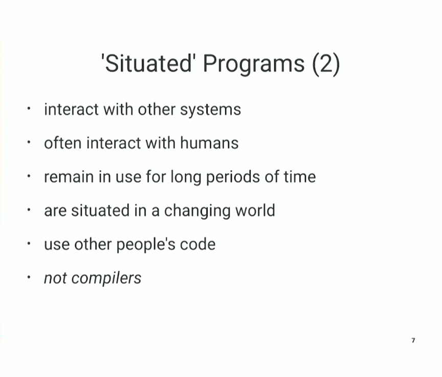

Other aspects of situated programs, they rarely are, sort of, their own little universe where they get to decide how things are and they don't need to interact with anyone else or agree with anyone else. Almost all these systems interacted with other systems. Almost all these systems interacted with people. Somebody would sit there and say, "start playing this song right now", or "skip this song", and we're like "I scheduled that song and I balanced everything around you playing it and now your D.J. just said 'don't do that'".

The election projection system has tons of screens for users to look at things, cross-tabulate? things, and make decisions, feeding all the things you see on T.V. so people can explain things to other people. So people and talking to people is an important part of these programs.

They remain in use for long periods of time. These are not throw-away programs, like I said. I don't know that much of the software I ever wrote has stopped being run by somebody. People are still using it.

And they're also situated in a world that changes. So again, your best laid plans are there the day you first write it, but then the rules changes. May be there's "three for Thursdays". I don't know, but when that happens, go change everything to deal with it.

Another aspect of being situated is one I think I've been thinking about a lot more recently is, being situated in the software environment and community. You know, your program is rarely written from scratch with all code that you wrote just for the purpose of the program. Invariably, you're going to pull in some libraries. And when you do, you've situated yourself in that library ecosystem. And that's another thing.

So when I talk about situated programs and you look at the programs I talked about having written in my career one of them really sticks out, right? What's that? Clojure. Compilers, they're not like this, they don't have a fraction of these problems. They take some input right off the disk, they get to define the whole world, right? When you write a language, what do you do? The first thing you do when you write a language, you get rid of any "two for Tuesdays".

[audience laughter]

Right? You can just disallow it. You try to make the most regular thing, and then your programming is just, well, now I have to enforce the rules that I made up for myself. It's like, wow, what could be easier than that?

[audience laughter]

And it really is a lot simpler. They don't generally use a database. Although I think they probably should. They rarely talk over wires and blah, blah, blah, blah, blah. So compilers and theorem provers and things like that are not like these programs.

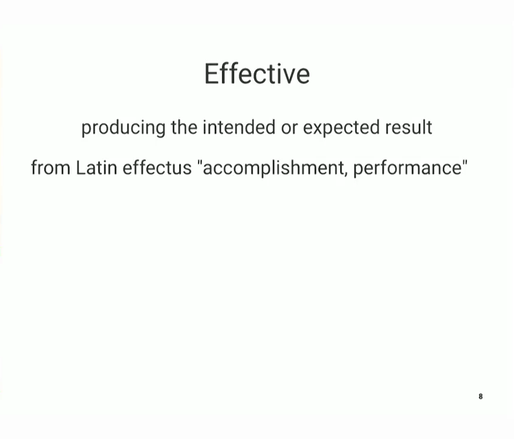

So the title of this talk is "Effective Programs", and what does "effective" mean? It means "producing the intended result" and I really want this word to become important because I'm really tired of the word "correctness". Where "correct" just means, I don't know, "make the type checker happy".

[audience laughter]

None of my (?) consumers of these programs that I did professionally care about that. Right, they care that the program works for their definition of "works".

On the other hand, I don't want this to be taken as, "this is a recipe for hacking", right, just like "do anything that kind of works". So we have to talk about what "works" means. What does it mean to actually accomplish the job of being effective.

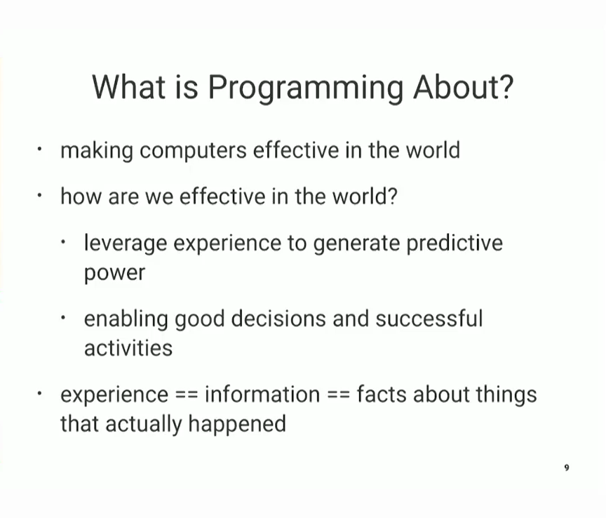

And that's where I want to sort of reclaim the name "programming". Or at least make sure we have a broad definition that incorporates languages like Clojure and the approaches that it takes. Because I think these problems matter.

So what is programming about? I'm going to say, "for me, programming is about making computers effective in the world". And I mean "effective" in the same way we would talk about people being effective in the world. Either the programs themselves are effective or they're helping people be effective.

Now, how are we effective? Well, sometimes we're effective because we calculate really well. Like may be when we're trying to compute trajectories for missles or something like that. But mostly not. Mostly areas of human endeavor. We're effective because we have learned from our experience, and we can turn that experience into predictive power. Whether that's knowing not to step in a giant hole or off a cliff, or walk towards the roaring lion, or how to market to people, or what's the right approach to doing this surgery, or what's the right diagnosis for this problem.

People are effective because they learn and they learn from experience and they leverage that. And so, I'm going to say, "being effective is mostly not about computation, but it's about generating predictive power from information".

And you've heard me talk about information, right? It's about facts, it's about things that happen, right? Experience, especially when we start pulling this into the programming world. Experience equals information equals facts about things that actually happened. Right, that's the raw material of success. In the world, it is for people, it should be for programs that either support people or replace people. So they can do more interesting things.

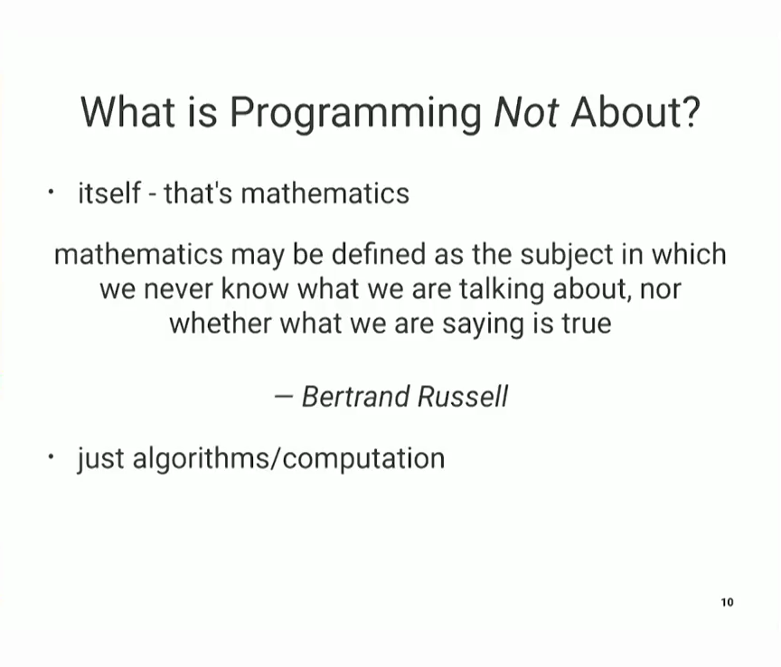

So I'll also say that, "for me, what is programming not about?". It's not about itself. Programming is not about proving theories about types being consistent with your initial propositions. It's not. That's an interesting endeavor of its own. But it's not, it's not what I've been talking about. It's not the things I've done in my career. It's not (?) programming is for me and it's not why I love programming. I like to accomplish things in the world.

Bertrand Russell has a nice snarky comment about that. He's actually not being snarky. He wants to elevate mathematics and say, "it's quite important that mathematics be only about itself". If you start crossing the line, right? And standing on stage and saying, "mathematical safety, type safety equals heart machine safety", you're doing mathematics wrong, according to Bertrand Russell. And it's not just algorithms and computation, they're important, but they're a subset of what we do.

So, don't get me wrong. I like logic, right? I've written those scheduling systems, I've written those yield management algorithms, I've written a Datalog engine. I like logic. I like writing that part of the system. I usually get to work on that part of the system. That's really cool.

But even, you know, a theorem prover, or a compiler, you know, eventually needs to read something from the disk, or spit something back out, print something. So they're some shim of something other than the logic. But in this world of situated programs and the kinds of programming that I've done, and I think that Clojure programmers do,

that's a small part of the programming. Programs are dominated by information processing. Unless they have UIs, in which case, there's this giant circle around this, where this looks like a dot.

[audience laughter]

But I'm not gonna go there.

[audience laughter]

Actually, because I don't do that part. But the information processing actually dominates programs both in the effort, the irregularities often there, right? It's this information part that, like, takes all the irregularity out of the way so my Datalog engine can, like, have an easy day. Cuz everything's now perfect, cuz I see a perfect thing, cuz somebody fixed it before it got to me.

And I don't want to make light of this. I think this is super-critical, right? Your best...Google's coolest, you know, search algorithm, if they couldn't get it to appear on a web page and do something sensible when you type, you know, something and pressed enter, no one would care. Right? This is where the value proposition of algorithms gets delivered. It's super important. But in my experience,

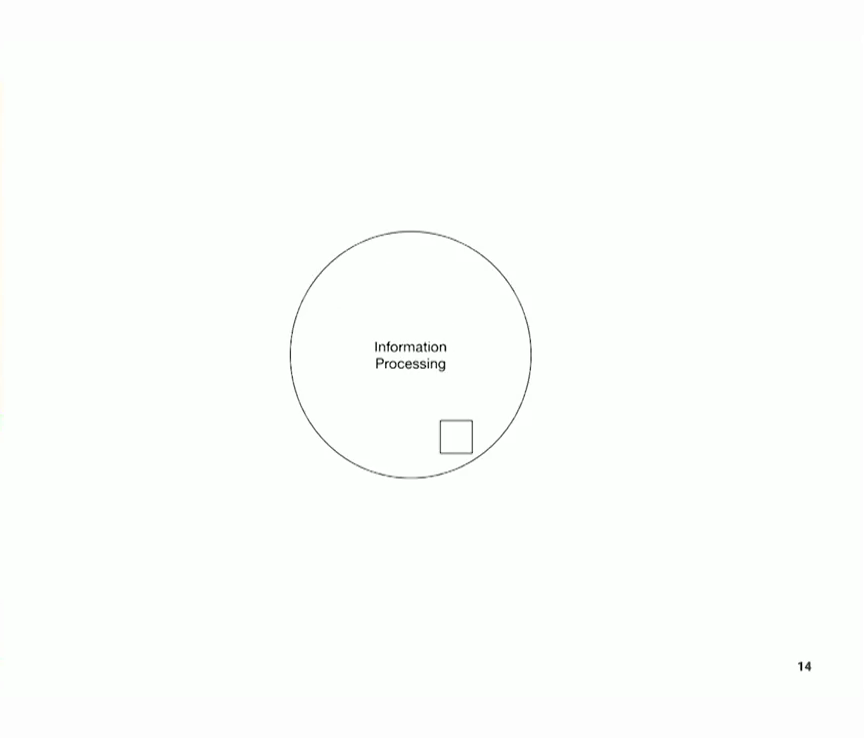

while this is the ratio

it probably needs to be to solve the problem, this is the ratio

it often is, and was in my experience in my work. Actually, this is also sort of bigger, the square would be more of a dot. That the information part of our programs is much larger than it needs to be because the programming languages we had then and still have mostly are terrible at this. And we end up having to write a whole ton of code to do this job. Because it's just not something the designers of those languages took on.

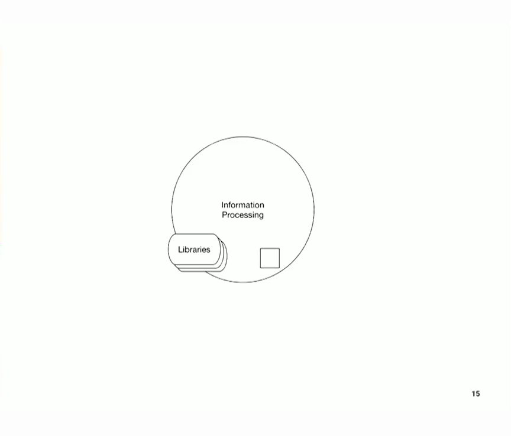

And of course we're not done, right? We don't write programs from scratch, so we have to start dealing with libraries. When we do that, now we've started to cross out of "we get to define everything" land, right? Now we have

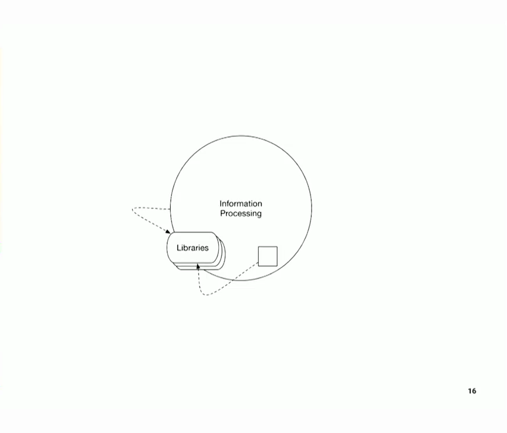

relationships. And we have to define how those, we're going to talk to libraries and how they may talk to us, but mostly we talk to them. So now there are lines, right? There's some protocol of how do you talk to this library. And we're still not

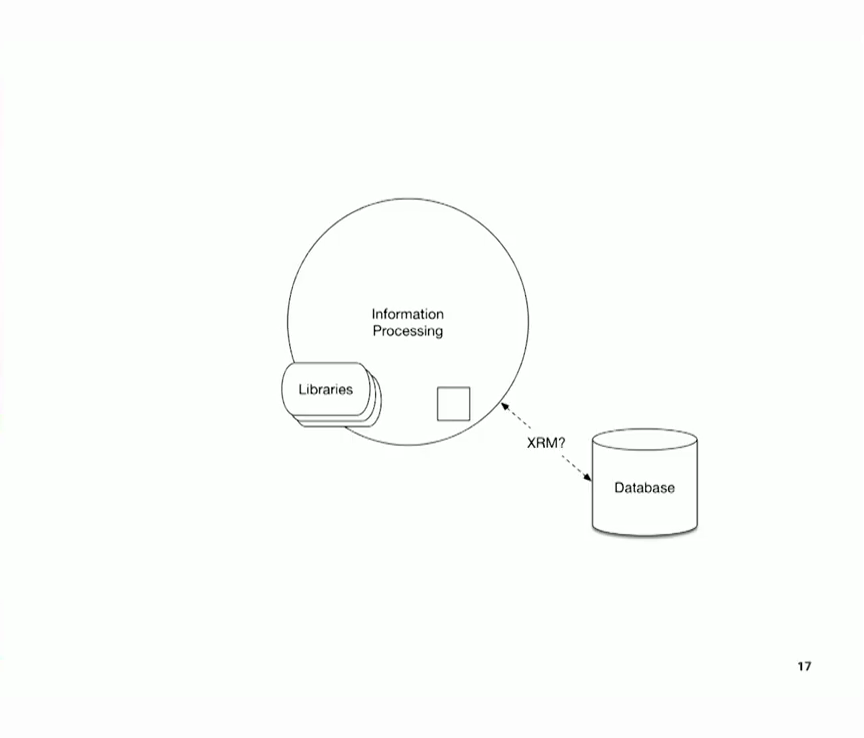

done, right? Cuz we said, these situated programs, they involve databases. Now, while the information processing and the logic and the libraries may have all shared a programming language, right? Or at least, you know, on the JVM, something like the JVM, a runtime. Now we're out (?) it, now we have a database that's clearly over there, it's written in a different language, it's not colocated in memory, so there's a wire. It has its own view of the world, and there's some protocol for talking to it. And invariably, whatever that protocol is, we want to fix it.

[audience laughter]

And why is that? Well it's something I'm going to talk about later called "parochialism", you know, we've adopted a view of the world, our programming language put upon us and it's a misfit for the way the database is thinking about things. And rather than say, "I wonder if we're wrong on our end", we're like, "oh no, we got to fix that...that relational algebra, it can't possibly be a good idea".

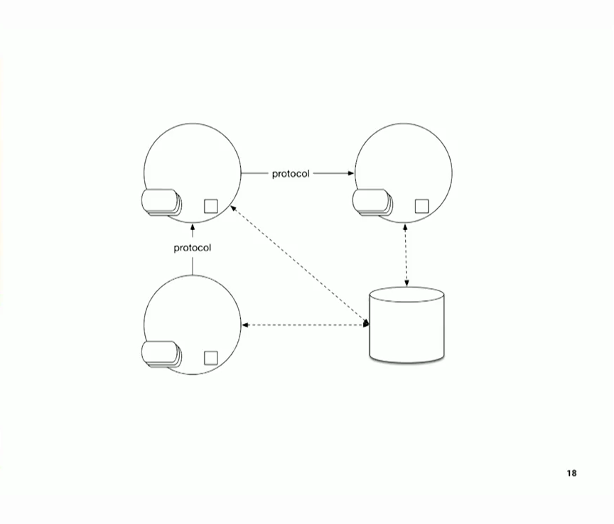

Ok, but we're still not done. I said these programs, they're not, they don't sit by themselves, they talk to other programs. So now, now we have three or more of these things, and now they may not be written in the same programming language, right? They all have their view of the world. They all have their idea of how the logic should work. They all have their idea of how they want to talk to libraries or use libraries, and there's more wires and more protocols. And here we don't get the database vendor at least giving us some wire protocol to start with that we'll fix with ORM, we have to make up our own protocols. And so we do that and what do we end up with? JSON, right? It's not good.

But at least now

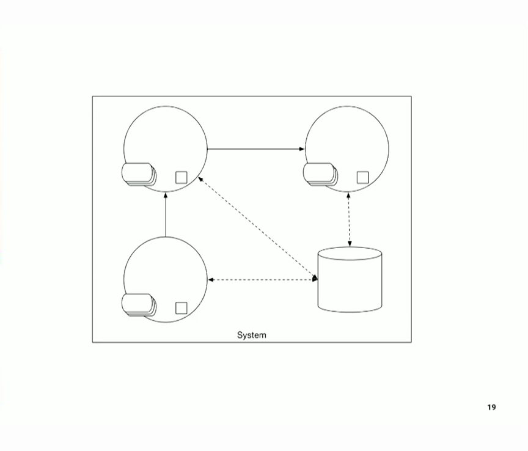

we have something...so when I program, this is what I'm programming. This is a program, to me. This is going to solve a problem and like no subset of this is going to solve the problem. This is the first point you start solving the problem. But you're not done with problems...

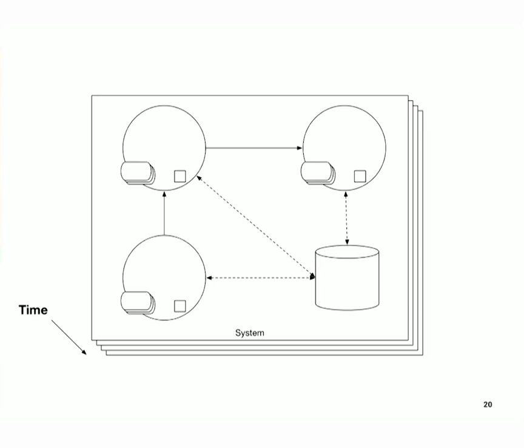

Because it's not a one-shot, one-time, one-moment, one great idea, push the button, ship it, move on, kind of world, is it? Every single aspect of this mutates over time, right? The rules change, the requirements change, the networks change, the computing power changes, the libraries that you're consuming change, hopefully the protocols don't change but sometimes they do. So we have to deal with this over time. And for me, effective programming is about doing this over time well. 

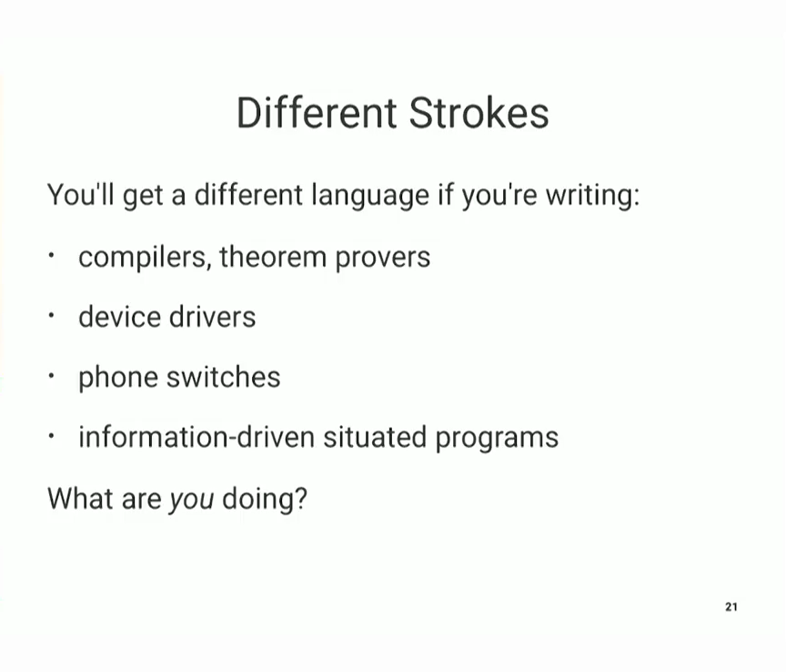

So, you know, I'm not trying to say, "there's a right and wrong way, and, like, Clojure is right and everything else is wrong, right?", but it should be apparent, but may be it isn't, because I think we all aspire to write programming languages that are general purpose. You could probably write, you know, a theorem prover in Clojure, actually I'm sure you could. But you certainly would get a different language if your target were compilers and theorem provers or your target were device drivers or phone switches. Clojure's target is information-driven situated programs, right? There's not a catchy phrase for that. But I mean that's what I was doing, all my friends were doing that. How many people in this room are doing that? Yeah. So when you look at programming languages, you really should look at...what are they for? Right? There's no like inherent goodness, like suitability constraints.

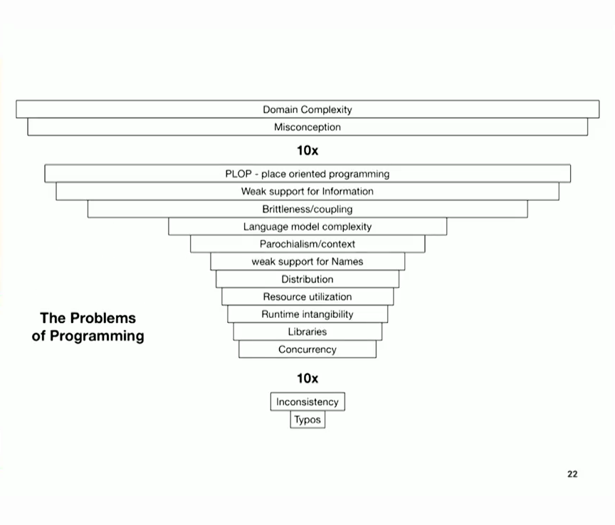

So before I started Clojure, I drew this diagram...which I did not. That would have been an amazing feat of prescience. But as I try to pick apart, you know, what was Clojure about -- cuz I think there's no reason to write a new programming language unless you're going to try to take on some problems, you should look at what the problems are. I mean, why was I unhappy as a programmer after 18 years and said, "if I can't switch to something like Common Lisp, I'm going to switch careers".  Why am I saying that? I'm saying it because I'm frustrated with a bunch of limitations in what I was using.

And you can call them problems, and I'm going to call them the problems of programming. And I've ordered them here -- I hope you can read that. Can you read it? Yeah, ok. I've ordered them here in terms of severity. And severity manifests itself in a couple of ways. Most important, cost. What's the cost of getting this wrong? At the very top you have the domain complexity, about which you could do nothing. This is just the world. It's as complex as it is. 

But the very next level is the where we start programming, right? We look at the world and say, "I've got an idea about how this is and how it's supposed to be and how, you know, my program can be effective about addressing it". And the problem is, if you don't have a good idea about how the world is, or you can't map that well to a solution, everything downstream from that is going to fail. There's no surviving this misconception problem. And the cost of dealing with misconceptions is incredibly high.

So this is 10x, a full order of magnitude reduction in (?) severity before we get to the set of problems I think are more in the domain of what programming languages can help with, right? And because you can read these they'll all going to come up in a second as I go through each one on some slide so I'm not going to read them all out right now. But importantly there's another break where we get to trivialisms of problems in programming. Like typos and just being inconsistent, like, you thought you're going to have a list of strings and you put a number in there. That happens, you know, people make those kinds of mistakes, they're pretty inexpensive.

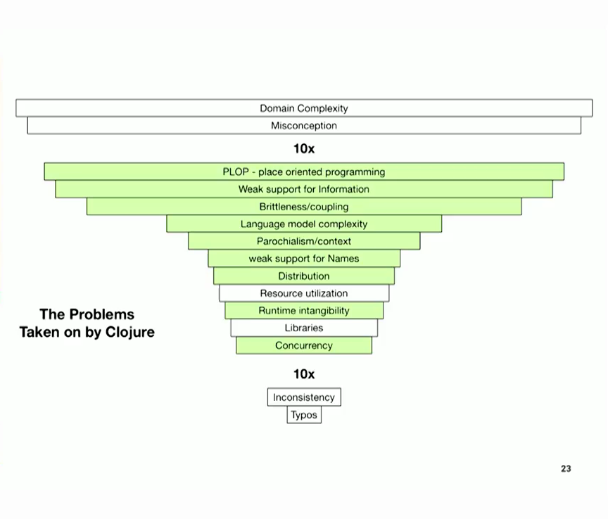

So, what were the problems that Clojure took on, these green ones. And again I'll go through all the green ones in a moment, but I would say, amongst the ones in the middle, I don't think that Clojure tried to do something different about resource utilization than Java did. Sort of adopted that runtime and its cost model. And I don't think that...I mean I wanted Clojure to be a good library language, but I didn't think about the library ecosystem problems as part of Clojure. And, you know, my talk last year about libraries implies that I still think this is still a big problem for programs. It's one of the ones that's left, right? After you do Clojure and Datomic, what's left to fix?

[audience laughter]

And the libraries, the libraries are there. But not the inconsistency and typos, not so much. I mean we know you can do that in Clojure. It's actually pretty good, letting you make typos.

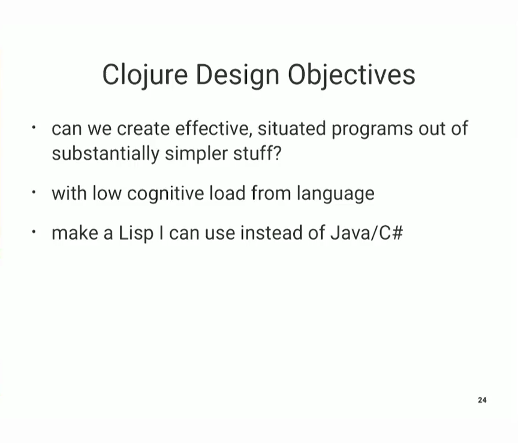

So fundamentally, what is Clojure about? Can we make programs out of simpler stuff? I mean, that's the problem after 18 years of using, like, C++ and Java, you're exhausted. How many people have been programming for 18 years? Ok. How many for more than 20 years? More than 25? Ok? Fewer than 5? Right (?), so that's really interesting to me. It may be an inditement (?) of Clojure as a beginner's language or may be that Clojure is the language for cranky, tired, old programmers.

[audience laughter and applause]

And, you know what? I would not be embarrassed if it was, that's fine by me. Because, you know, I did make it for myself, which I think is an important thing to do. Trying to solve other people's, you know, problems and think you understand what they are, you know, that's tricky.

So, when I discovered Common Lisp, having used C++, I said that, "I'm pretty sure to the answer to this question is, 'yeah, absolutely'". And can we do that with a lower cognitive load? I also think, "yes, absolutely". And then the question is, "can I make a Lisp I can use instead of Java or C#?". Cuz you just heard my story, and I used Common Lisp a (?) couple of times, every time it got kicked out of production, or just ruled out of production, really not kicked out, it didn't get a chance. So I knew I had to target a runtime that people would accept.

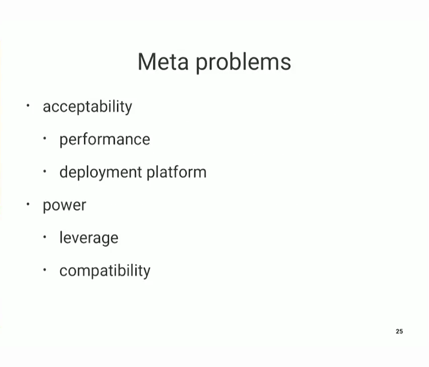

So there are these meta problems, right? You can try to take on some programming problems but there are always problems in getting a language accepted. I did not think Clojure would get accepted. Really, honestly. But I knew, if I wanted my friend who thought I was crazy even doing it, like, person number one other than myself to try it, I'd have to have a credible answer to the acceptability problems and the power problems. Because otherwise it's just not practical, it's like, "that's cool Rich, but, like, we have work to do".

[audience laughter]

"If we can't use this professionally, really it's just a hobby". So we have acceptability, I think that goes to performance, and for me, I thought it was also the deployment platform. There's a power challenge that you have to deal with, and that's about leverage and I'll talk about that later. And also compatibility. Again that's part of acceptability. But, you know, Clojure's ability to say "it's just a Java library", was big. How many people snuck Clojure into their organization to start with? Right, ok. Success!

[audience laughter]

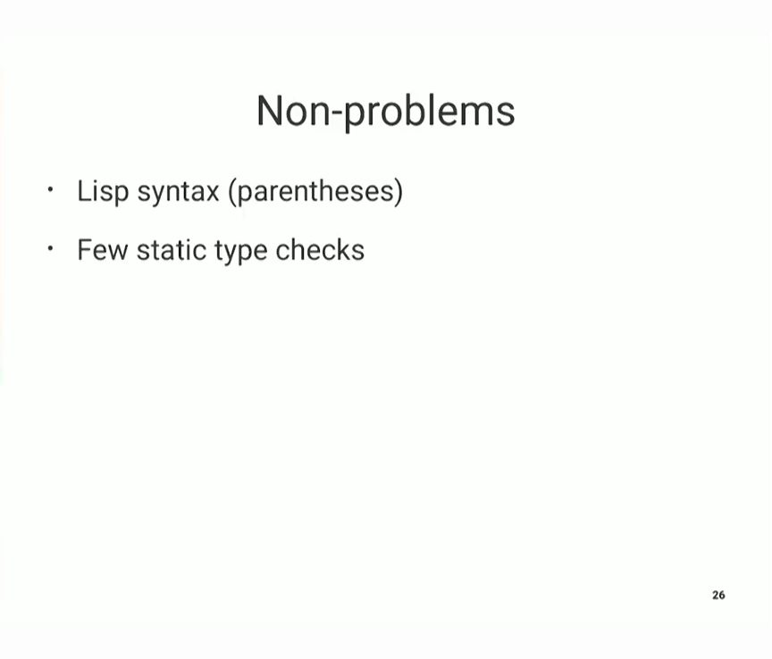

And then there were other things I considered to be absolute non-problems and the first of these is the parentheses, right? How many people...and it's ok to admit, right? Every (?) has a story. How many people thought the parentheses were going to be a problem and now think that was crazy thinking? Yeah. Which is fine, I think everybody goes through that. Everybody who looks at Lisp is like, "this is cool but I'm going to fix this part before I get going...before I start, before I understand the value proposition of it at all, I'm going to fix this", and that says something about programmers. I'm not sure exactly what. But I don't believe this is a problem and in fact when we get to the middle of this talk you'll see that I think this is the opposite of a problem. This is the core value proposition of Clojure. And I think things like, par-make-it-go-away whatever that is a bad...it's a terrible idea. And it's not good for beginners to do that, to, you know, to try to solve a problem that's, that's a feature.

The other thing I considered not a problem is it being dynamic, right? I worked in C++, you know, we had a thing where (?) we said, "if it compiles it will probably work", right? Like they say of Haskell. And it was equally true then as it is now.

[audience laughter]

But we really did believe it. We totally did. And it doesn't help. It really does not help for the big problems.

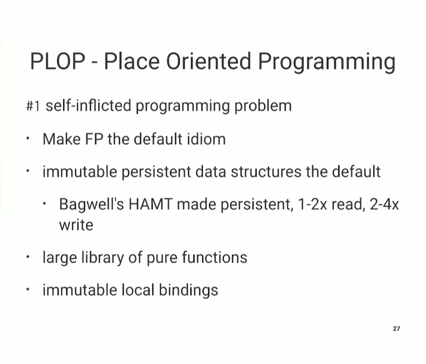

The top, the big wide ones.

Ok, so, problem number one on that list was place oriented programming. Absolutely, this is the problem. Almost all the programs I wrote, lots of the things on that list were multi-threaded programs, you know, they're crazy hard in C++. Just impossible to get right, when you adopt a normal mutability approach, you know, mutable objects. So, this is the number one self-inflicted programming problem. It seemed, you know, clear to me that the answer was to make functional programming and immutable data the default idiom. So the challenge I had was, were there data structures that would be fast enough to say, "we could swap this for that". And the objective I had, the goal I had was to get within 2x for reads and 4x for writes. And I did a lot of work on this, this was actually the main research work behind Clojure, was about these persistent data structures. Eventually I found...you know I looked at Okasaki's stuff and, you know, the fully functional approach and none of that gets here. And then I found Bagwell's structures were not persistent, but I realized could be made so, and they just have tremendously great characteristics combining the persistence with the way they're laid out, the way memory works. They made it. They made this bar, and I was able to get my friend to try my programming language. You know, we (?) have large library of pure functions to support this, and, you know, immutable local bindings. Basically if you fall into Clojure, your first hurdle is not the parentheses, right? It's this, this functional paradigm, everything is gone, there's no mutable variables, there's no state, there's no mutable collections and everything else, but there's a lot of support, there's a big library. You just have to, you know, sort of learn the idioms. So I think this was straight-forward, the critical thing that's different about Clojure is, by the time I was doing Clojure, the people who invented this stuff had adopted a lot more, right? I think most of the adherents in the functional programming community considered functional programming to be about typed functional programming, statically typed functional programming is functional programming. And I don't think so, I think that this is, you know, this falls clearly in the 80/20 rule. And I think the split here is more like 99/1. The value props are all on this side, and I think Clojure users get a sense of that, they get a feel for that. This is the thing that makes you sleep at night.

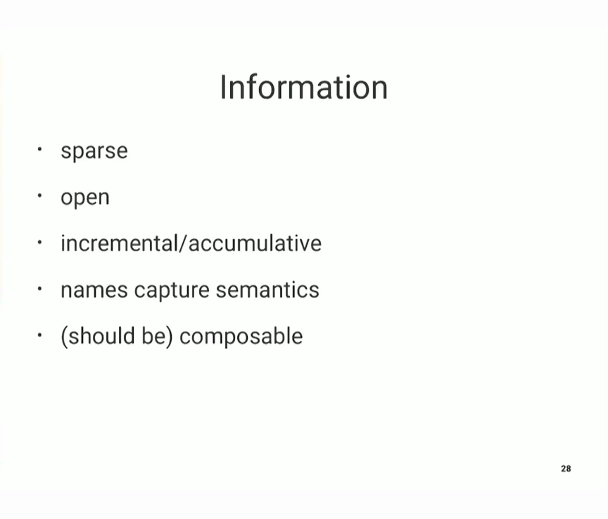

Ok, problem number two -- and this is the most subtle problem, this is the thing that annoys me the most about statically typed programming languages -- is they are terrible at information. So let's look at what information is. Inherently, information is sparse. It's what you know, it's what happened in the world. Does the world fill out forms and fill everything out for you? All the things you'd like to know? No! It doesn't. It doesn't and not ever is probably more correct. 

The other thing is, "what can you know?". What are you allowed to know? There's no good answers to that. Whatever you want, right? It's open, right? What else is there? What IS there to know? Well I mean, what time is it, right? Cuz every second that goes by, there's more stuff to know, more things happen, more facts, more things happen in the universe. So information accretes, it just keeps accumulating. What else do we know about information? We don't really have a good way of grappling with it, except by using names, right? When we deal with information as people, names are super-important, right? If I just say, "47", now there's no communication going on. We have to connect it. And then the other big thing, and this is the thing I struggle with so often, right? I have a system, I made a class or a type about some piece of data, then over here I know a little bit more data than that, do I make another thing that's like that if I have derivation, do I derive to make that other thing? What if I'm now in another context and I know part of one thing and part of another thing, what's the type of part of this and part of that. And then, you know, there's this explosion. Of course these languages are doing this wrong, they don't have composable information constructs.

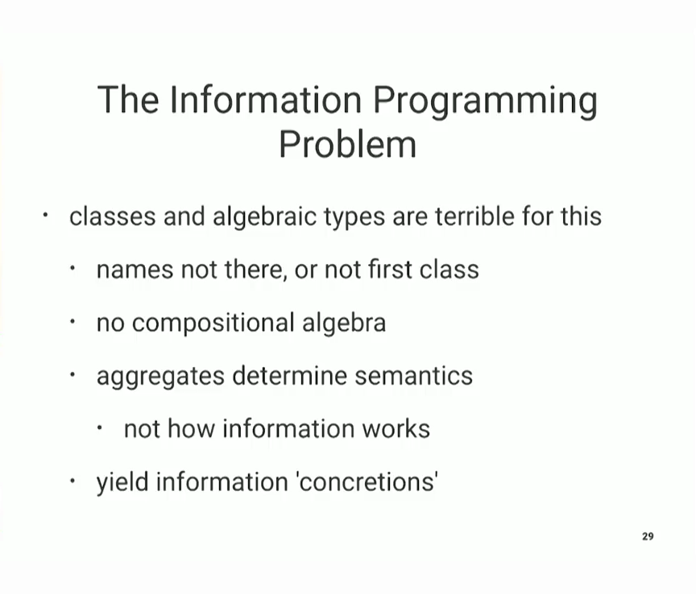

So what is the problem with programming in a way that's compatible with information. It's that we elevate the containership of information to become the semantic driver. Okay, we say, "this is a person, and a person has a name, and a person has an email, and a person has a social security number", and there's no semantics for those three things except in the context of the person class or type, whatever it is. And often, depending on the programming language, the names are either not there, right? If you got these product types where it's like, person is string x, string x, int x, string x, string x, int x, float x, float, product type. Like, a (?) complete callous disregard for people, names, human thinking, it's crazy. Or your programming language may be has names, but they compile away, right? They're not first class, you can't use them as arguments, you can't use them as look-up vectors, right? You can't use them as functions themselves, right? There's no compositional algebra in programming languages, for information. So we're taking these constructs, I think were there for other purposes, we have to use them because it's all we're given, and it's what's idiomatic, right? Take out a class, take out, you know, a type and do this thing. But the most important thing is that the aggregates determine the semantics, which is dead wrong, right? If you fill out a form, nothing about the information you put on that form is semantically dominated by the form you happen to fill out. It's a collecting device, it's not a semantic device, but it becomes so. And what happens is you get these giant sets of concretions around information. You know, people that write, you know, Java libraries, you look at the Java Framework it's cool, it's relatively small and everything's about sort of mechanical things. Java's good at mechanical things, well mechanisms. But then you hand the same language to the poor application programmers who are trying to do this information situated program problem, and that's all they've got. And they take out a class for like everything they need, every piece, every small set of information they have, right? How many people have ever seen a Java library with over 1500 classes? Yeah, everybody. And this is my experience. In (?) my experience, it doesn't matter what language you're using. If you have these types, and you're dealing with information, you're going to have a proliferation of non-composable types, that each are a little parochialism around some tiny piece of data that doesn't compose. And I'm really not happy with this, you know...in programming literature, the word "abstraction" is used in two ways. One way is just like, "naming something is abstracting", I disagree with that. Abstracting really should be drawing from a set of exemplars some essential thing, right? Not just naming something. And what I think is actually happening here is we're getting not data abstractions, you're getting data concretions, right? Relational algebra, that's a data abstraction. Datalog is a data abstraction. RDF is a data abstraction. Your person class, your product class, those are not data abstractions. They're concretions.

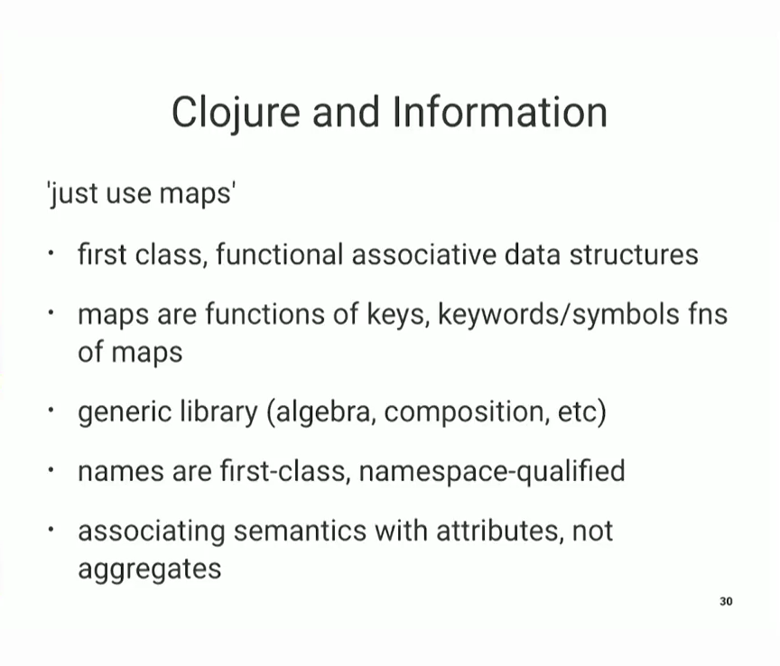

So, you know, we know in practice, Clojure says, "just use maps". What this meant actually was, "Clojure didn't give you anything else", right? There was nothing else to use. There were no classes, there weren't (?) the thing to say deftype, there weren't types, there wasn't algebraic data types or anything like that. There were these maps, and there was a huge library of functions to support them, there was syntactic support for it. So working with these associative data structures was tangible, well-supported, functional, high-performance activity. And they're generic. What do we do in Clojure if we have just some of the information here and just some of the information there (?) we need both those things over there? We say, "what's the problem?". There's no problem. I take some information, some information and merge them, I hand it along. If I need a subset of that, I take a subset of that. I call keys, and you know, select-keys and I get a subset. I can combine anything that I like, there's an algebra associated with associative data. The names are first-class, right? Keywords and symbols are functions, they're functions of associative containers, they know how to look themselves up. And they're reified so you can tangibly flow them around your program and say, "pick out these three things" without writing a program that knows how to write Java or Haskell pattern matching to find those three things. They're independent of the program language, right? They're just arguments. They're just pieces of data. But they have this, they have this capability.

And the other thing which I think is a potential of (?) Clojure -- it's realized to varying degrees, but the raw materials for doing this are there -- is that we can associate the semantics with the attributes and not with the aggregates, right? Because we have fully qualified symbols and keywords. And obviously spec is all about that.

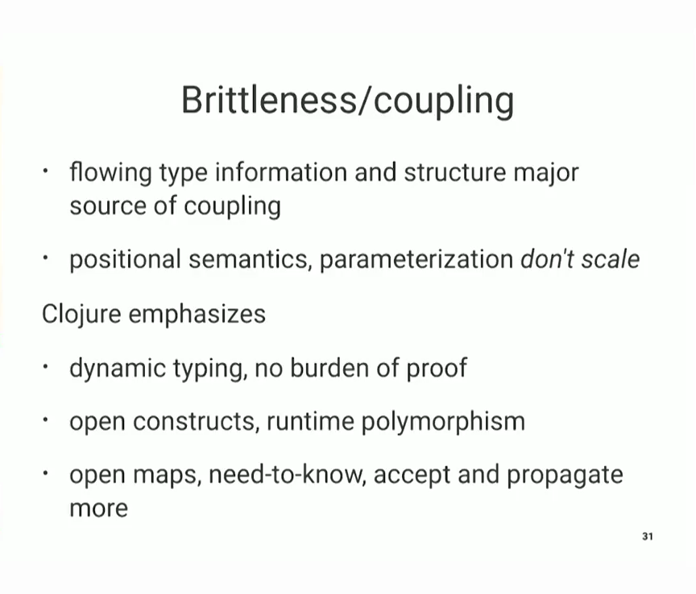

Alright, brittleness and coupling, this is another thing that's just my personal experience that (?) static type systems yield much more heavily coupled systems. And that a big part of that time aspect of the final diagram of what problem we're trying to solve, is dominated by coupling when you're trying to do maintenance, right? Flowing type information is a major source of coupling in programs. Having a de-, you know, pattern matching of a structural representation in a hundred places in your program is coupling, right? Like, this stuff I'm siezing up when I see that the sensibilities you get after 20 years of programming, you hate coupling. It's like the worst thing and you smell it coming and you want no part of it. And this is a big problem.

The other thing I think is more subtle, but I put it here because unless you see this, is positional semantics don't scale. What's an example of positional semantics? Argument lists, right? Most languages have them (?), and Clojure has some too, right? Who wants to call a function with 17 arguments? Nope.

[audience laughter]

There's one in every room.

[audience laughter]

Nobody does, we all know it breaks down. Where's it break down? Five, six, seven? At some point, we're no longer happy. But if that's all you have, right, if you only have product types, they're going to break down every time you hit that limit, right? How many people like going to the doctor's office and filling out the forms, right? Don't you hate it? You get this big lined sheet of paper that's blank, then you get this set of rules, that says, "put your social security on line 42, and your name on line 17", that's how it works, right? That's how the world works, that's how we talk to other people? No! It doesn't scale. It's not what we do. We always put the labels right next to the stuff and the labels matter, but with positional semantics we're saying, "no, they don't matter (?) just (?) remember the third mean this and the seventh thing means that".

And types don't help you, right? They don't really distinguish this, float x, float x, float x, float x, float...at a certain point it's not telling you anything. So they (?) don't scale but they...it occurs in other places, so we have argument lists, we have product types, where else? Parameterization, right? Who's seen the generic type with more than 7 type arguments? Or see (?) it (?) in C++ or Java, yeah, we tend not to see it in Java because people give up on parameterization, right?

[audience laughter]

And what do they switch to? Spring!

[audience laughter]

No, I mean, that's not a joke, it's just a fact, right? They switched to a more dynamic system for injection, right? Because parameterization doesn't scale and (?) one of the reasons why it doesn't scale is there are no labels on these parameters. They may get names by convention, but they're not properly named (?). When you want to reuse the type with parameters, you get to give them names

[audio cut off]

(?) again. Just like in pattern matching. That's terrible. That's a terrible idea. And it does not scale. So anywhere parameters, anywhere positionality is the only thing you've got, you're eventually goning to run out of steam. You're going to run out of the ability to talk to people or they're going to run out of the ability to understand what you're doing. So I think types are an anti-pattern for program maintenance and for extensibility. And because they introduce this coupling and it makes programs harder to maintain and even harder to undersand in the first place.

So Clojure is dynamically typed. You do not have this burden of proof. You don't have to prove that, you know, because I made something here and somebody cares about it over there, every person in the middle didn't mess with it. You know, mostly they don't mess with it. I don't know what we're protecting against, but we can prove now that, you know, they're still strings over there.

The constructs are open, right? We much prefer runtime polymorphism either by multi-methods or protocols to switch statements, pattern matching, and things like that.

The maps are open. They're need-to-know. What do we do in Clojure if we don't know something? We just leave it out. We don't know it. There's no MayBe this MayBe that. If you actually parameterized the information system, it would be MayBe everything. MayBe everything no longer is meaningful, it just isn't. And nothing is of type MayBe something, right? If your social security number is a string, it's a string. You either know it or you don't. Jamming those two things together, it makes no sense. It's not the type of the thing. It may be part of your front-door protocol, that you may need it or not, but (?) it's not the type of the thing. So the maps are open. We deal with them on a need-to-know basis and you get into the habit of propagating the rest. May be you handed me more stuff, should I care? No. The UPS truck comes and my TV is on the truck, do I care what else is on the truck? No. I don't want to know. But it's ok that there's other stuff.

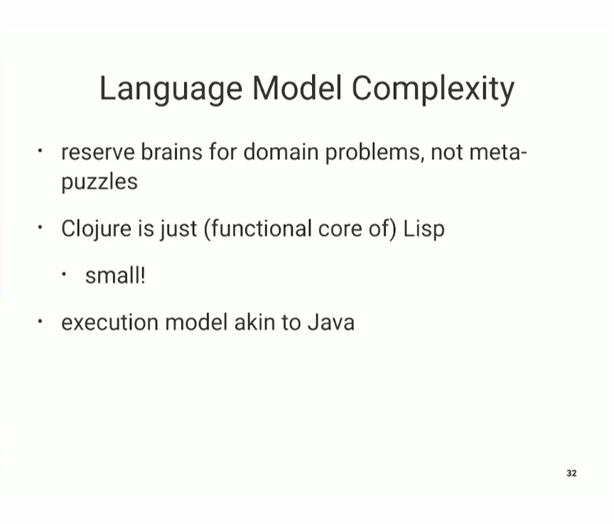

So the other problem is, you know, language model complexity. You know C++ is a very complex language and so is Haskell and so is Java and so is, well, most of them. Clojure is very small. It's not quite Scheme-small but it's small compared to the others. And it's just, you know, the basic lambda calculus kind of thing with, you know, immutable functional core. There are functions, there are values, you can call functions on values and get other values. That's it. There's no hierarchy, there's no parameterization, there's no, you know, existential types, blah blah blah blah blah.

And the execution model is another tricky thing, right? We're getting to the point even in Java where it gets harder and harder to reason about the performance of our programs, right? Because of resources. And that's unfortunate, you know, at least one of the nice things about C was, you know, you knew if your program crashed if was your problem and you just figure it out but you knew what it was going to take up in RAM and you could calculate things and it was quite tractable. And that matters to programmers, right? Programming is not mathematics. In mathematics you can swap any isomorphism for any other, in programming you get fired for doing that, right?

[audience laughter]

It's different. Performance matters, it's part of programming, it's a big deal. So making this something at least I could say, "it's like Java", and blame them.

[audience laughter]

Well (?) it's fine. But it also meant all the tooling helped us, right? All the, you know, all the Java tooling works for Clojure. I mean how many people use YourKit and profilers like that on Clojure? That's pretty awesome to be able to do that.

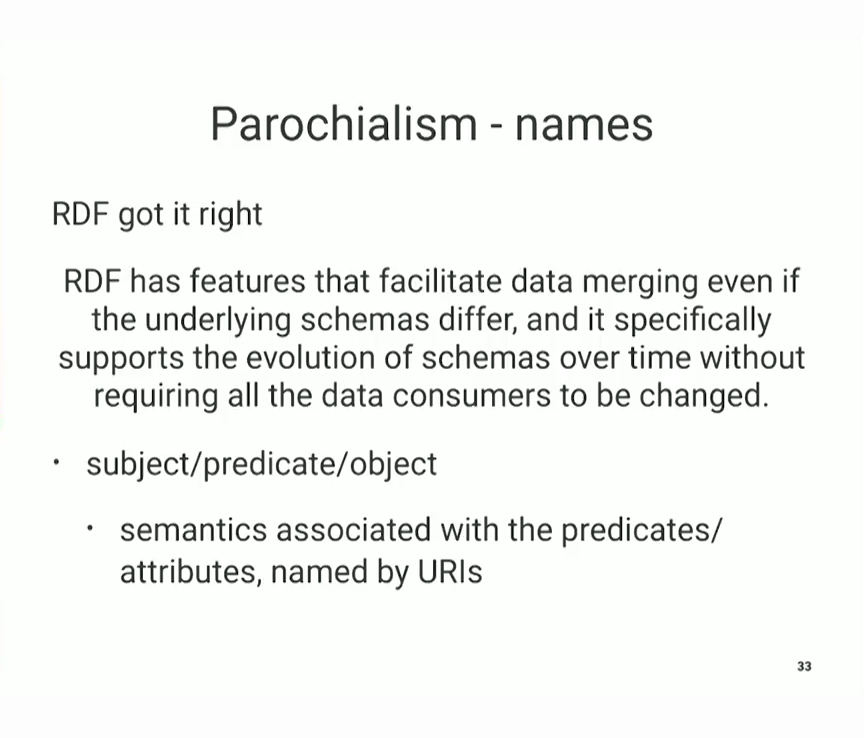

Alright, now we're into the real nitty gritty of things I didn't like and therefore I left out. This type thing, it goes everywhere and the name I came up for it is "parochialism", right? This idea that "I have this language, and, you know, it's got this cool idea about how you should think about things, you should think about things using algebraic data types or you should think about things using inheritance". It yields this intense parochialism, right? You start to have representations of things, manifestations of representations of information that they only make sense in the context of this language's rules for things and they don't combine with anybody else's ideas, right? You smash against the database. You smash against the wire. You smash against this other programming language, because you've got this idiosyncratic, local view of how to think about things. RDF did this right. And they did it because they had this objective, right? They're trying to accomplish something. We want to be able to merge data from different sources, we don't want the schemas to dominate the semantics, right? How many people have ever gotten the same piece of mail from the same company and been like, "what is wrong with your databases, dudes?", right? Yeah. What is wrong? What's wrong is, one company bought another company, right? Now they're the same company, they now have these two databases. In one database, your name is in the person thing and in another database your name is in the person table and in another database your name is in the mailing list table, right? Who knows that mailing list table name and person name are actually the same piece of information? Nobody. They have to have meetings, I mean this is a big dollar, this is a big ticket problem. It's not a small...it's not a laughing matter, right?

[audience laughter]

Right? These big companies have giant jobs trying to merge these systems because, because table parochiality, it's the same as classes and algebraic data types. It's the same problem, it's not a different problem. It's all like, I had this view of the world and on the day I decided how the world is I decided that names were parts of person, and you decided that names were parts of mailing lists. And now we need to fix this. And you know how a lot of those companies fix it? They introduce a third database, usually an RDF database as a federation point so they now can figure out these two things are the same. And eventually they will stop sending you two pieces of mail...the same piece of mail twice.

Right, so this is subject, predicate, object and obviously you can see the influence of this on Datomic.

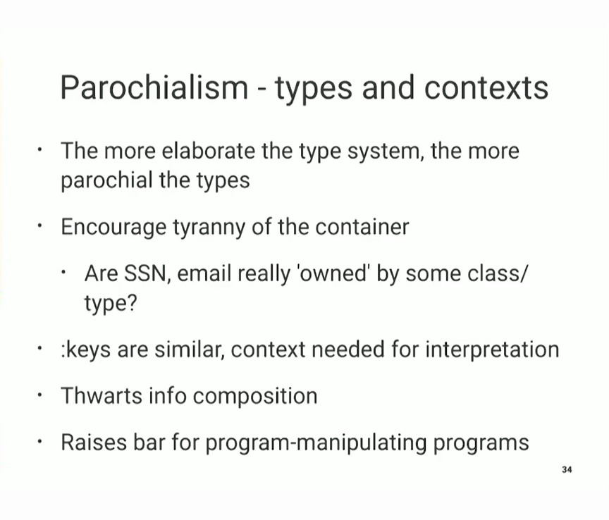

Right, but it goes further, right? I would say that the more elaborate your type system is, the more parochial your types are, right? The less general they are, the less transportable they are, the less understandable by other systems they are, the less reusable they are, the less flexible they are, the less amenable to putting over wires that they are, the less subject to generic manipulation that they are, right? Almost every other language that deals with types encourage this tyranny of the container I talked about before. We have a choice in Clojure, I think people go either way, right? There's two things, one is the container dominates, the other is just sort of the notion of context dominating the meaning, like, because I called it this in this context, it means that. But we have the recipe in Clojure for doing better than that, in (?) which you use namespace-qualified keys. With namespace-qualified keys we now can merge data and know what things mean regardless of the context in which they're used.

And anything about this thwarts the composition I talked about before.

And in particular because we're pointed at this program-mainpulating-program idea, as you'll see later, it makes this harder.

So Clojure has names that are (?) first-class. This is, you know, stuff that was in Lisp. It just dominates more because they became the accesses (?) for the associative data type. They are functions in and of themselves. Keywords being functions is sort of the big deal.

They don't disappear, they're not compiled away into offsets, we can pass them around. We can write them down. A user who doesn't know Clojure can actually type one into a text file and save it, and do something meaningful with a (?) program without learning Clojure.

We have this namespace qualification. If you follow the conventions, which unfortunately a lot of Clojure libraries are not yet doing, of this reversed domain name system, which is the same as Java's, all Clojure names are conflict-free not only with other Clojure names, but with Java names. That's a fantastically good idea, and it's similar to the idea in RDF of using URIs for names.

And the aliases help to (?) make this less burdensome.

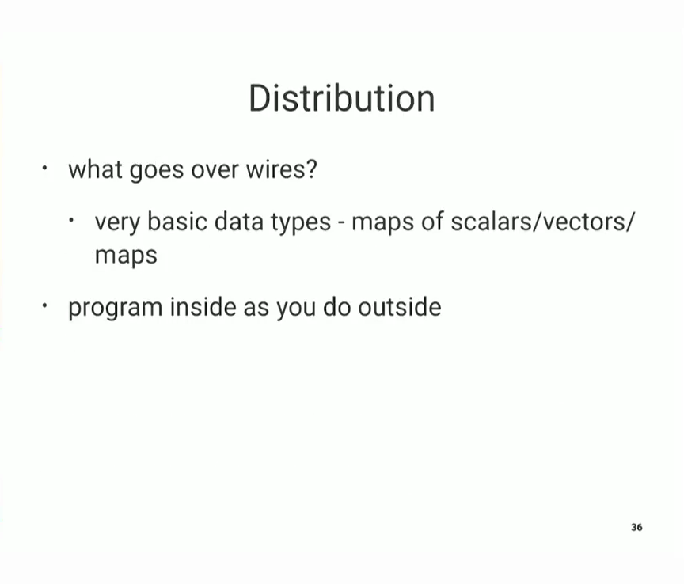

And we've (?) done some more recently to (?) do more with that.

Then there's this distribution problem. And here's where I start saying, "taking a language-specific view of program design is a terrible mistake", because you're in that little box. You're ignoring this big picture. As soon as you step back, now you have this problem, you have to talk over wires. How many people use, you know, remote object technology? I'm really sorry.

[audience laughter]

Cuz it's brutal, right? It's very brutal. It's incredbilty brittle and fragile and complex and error-prone and specific. How many people use that kind of technology to talk to people not under their own employ? No, it doesn't work. That's not how the Internet works, right? Distributed objects failed, right? The Internet is about sending plain data over wires. And almost everything that ever dealt with wires only succeeded when it moved to this. And this is very successful. Why should we program in a way that's all super-parochial if we only need to eventually represent some subset of a portion of some subset of a program, may be a subset we didn't know in advance, over wires, right? If we program this way all the time, we program the inside of our programs as "let's pass around data structures", and then somebody says, "oh, I wish I could put half of your program across a wire, or replicated over six machines", what do we say in Clojure? That's great, I'll start shipping some edn across a socket and we're done. As opposed to, you gotta do everything over.

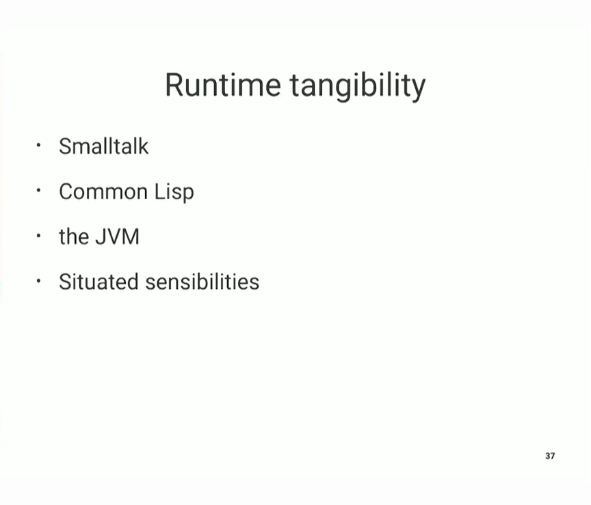

So there were plenty of inspirations and examples for me of (?) this runtime tangibility is one of the things I really got excited about when I learned Common Lisp coming from C++. Smalltalk and Common Lisp are languages that were obviously written by people who were trying to write programs for people. These are not language theoreticians. You can tell, they were writing, they were writing GUIs, they were writing databases, they were writing logic programs and languages also. But there's a system sensibility that goes through Smalltalk and Common Lisp that's undeniable. And when you first discover them, especially if you discover them late as I did, it's stunning to see. And I think it's a tradition that's largely been lost in academia. I just don't see the same people making systems AND languages, you know, together. They've (?) sort of split apart and that's really a shame, because there's so much still left to pilfer from these, these languages. They were highly tangible, right? They had reified environments, all the names you could see, you could go back and find the code, the namespaces were tangible, you could load code at runtime. I mean, one thing after another after another, right? And the old Perlis, you know, quip about, you know, "any sufficiently large C or C++ program, you know, has a poorly implemented Common Lisp", is so true. Again, Spring, right? You eventually...as you get a larger system that you want to maintain over time and deal with all those complexities of, you know, that I showed before, you want dynamism, you have to have it, it's not like an optional thing. It's, it's necessary. But was particularly interesting for me in implementing Clojure was how much runtime tangibility and situated sensibilities were in the JVM design. The JVM is actually a very dynamic thing. It's not just Java looks like say, C# or C++, the JVM, you know, it was written with an idea of "well we're going to embed these programs on set top boxes and network them and need to send code around (?) you could update their capabilities", that's like, it's situated everywhere you turn. And the runtime has got a ton of excellent support for that. Which makes it a great platform for languages like Clojure. And thank goodness, you know, that the work that the people did on Self, and it didn't die, that it actually got carried through here. Not everything did. But it's quite important and it will be a sad day when, you know, somebody says, "well let's just replace the JVM with, you know, some static compilation technology". And I'll tell you, targeting the JVM and the CLR, it's plain, the CLR is static thinking and the JVM is dynamic thinking.

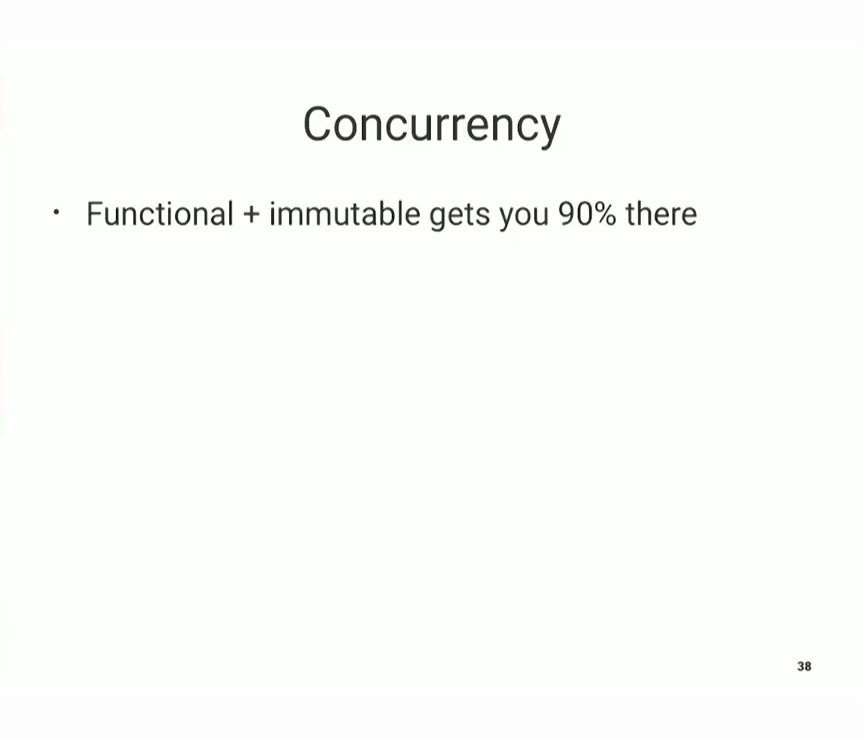

So there's situated sensibilities in all of these.

The last problem on my initial slide was concurrency, and I think mostly concurrency gets solved by being functional and immutable by default.

The other thing you need, is you need some way to, some language for dealing with state transitions. And that's the epochal time model. I'm obviously not going to get into this again here, but I've given talks about this before. So Clojure has this. And it was a combination of those things that let me say, "I think I have a reasonable answer for my friend". If he says, "how can I write a real program with this?", I can say, "here's how you can write a real program, including a multi-threaded program and not go crazy".

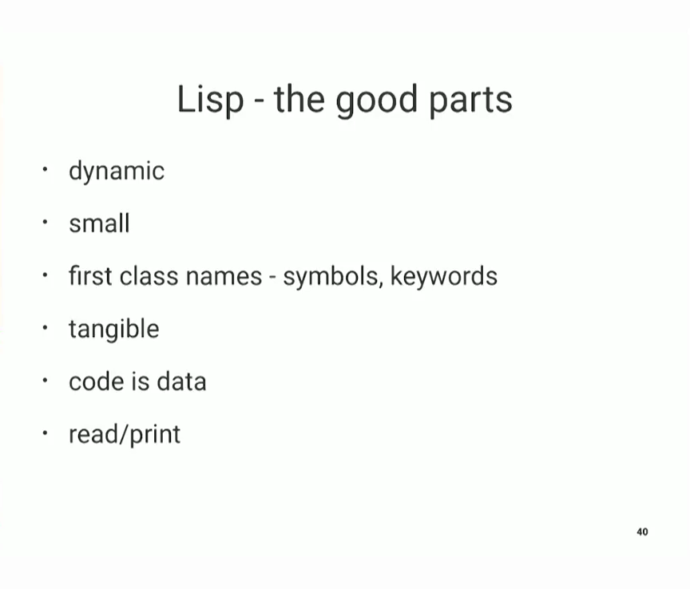

So there's lots of stuff I've wanted to (?) take from Lisp, and I think I talked about a lot of these. It's dynamic, it's small, it had first-class names, it's very tangible, there's this code is data, and read/print, and I'm going to talk a little bit more about that.

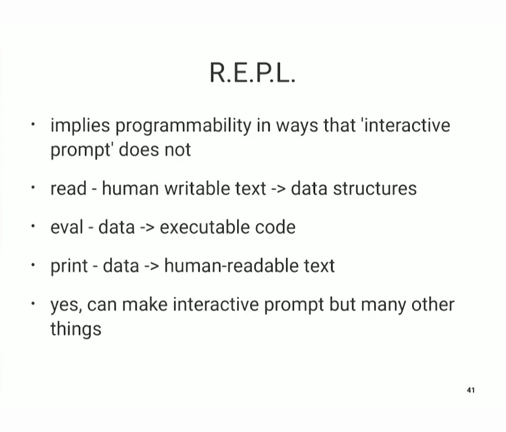

But there's the REPL. And I think that still people are like, "the REPL's cool cuz I get to try things", and that's true but the REPL is much cooler than that. It's cooler than that because it's an acronym and it's cooler than that because read is its own thing. And what Clojure did by adding a richer set of data structures, is it made read/print into a super power. It wasn't just a convenience, it isn't just a way to interact with people, it isn't just a way to make it easy to stream programs around or program fragments around. It's now like, "here's your free wire protocol", for real stuff. How many people ever sent edn over wire? Yeah. How many people like the fact that like they don't need to think that's a possibility, they can just do it? And, you know, if you want to switch to something else you can. But it's a huge deal.

Eval obviously we know, it lets us go from data to code and that's the source of macros, but I think again, it's much bigger than the application to macros.

And finally there's print which is just the other direction.

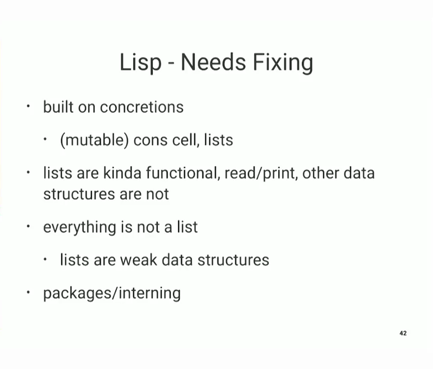

But Lisp had a bunch of things that needed to be fixed in my opinion. It was built on concretions, you know, a lot of the design of more abstractions and CLOS and stuff like that came after the underpinnings. The underpinnings didn't take advantage of them so if you want polymorphism at the bottom, you have to retrofit it. If you want immutability at the core, you just need to, you need something different to, you know, from the ground up. And that's why Clojure was worth doing as opposed to trying to do Clojure as a library for Common Lisp. The Lisps were functional kind of, mostly by convention. But the other data structures were not, you had to switch gears to go from, you know, assoc with lists to, you know, a proper hash table. And lists are crappy data structures, sorry, they just are. They're very weak, and there's no reason to use them as a fundamental primitive for programming. Also packages and interning were very complex there.

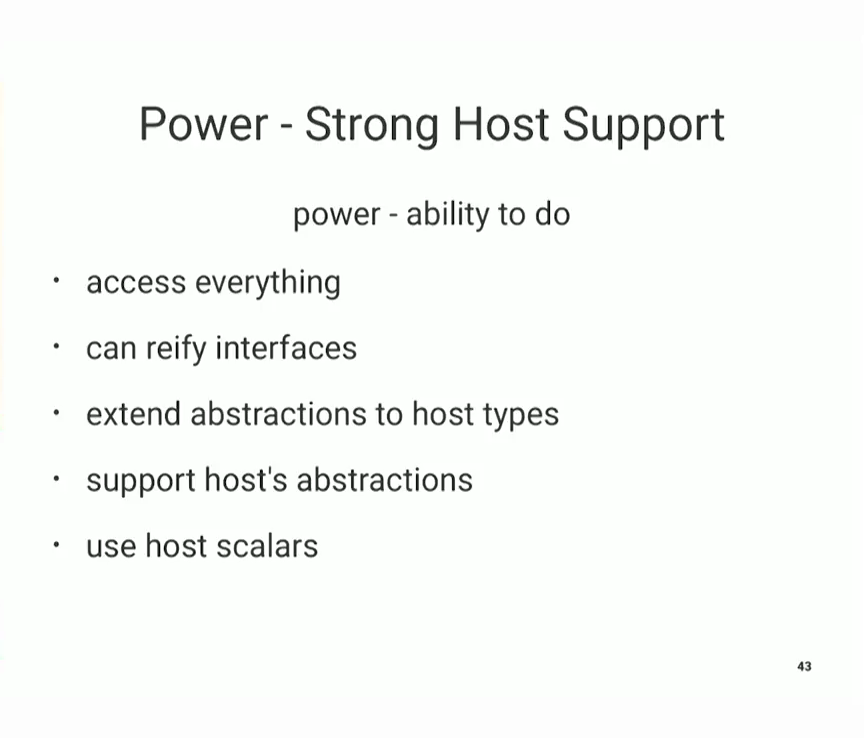

The other part about Clojure that is important is leverage.

Oh I'm running out of time. I'm not going to talk about that.

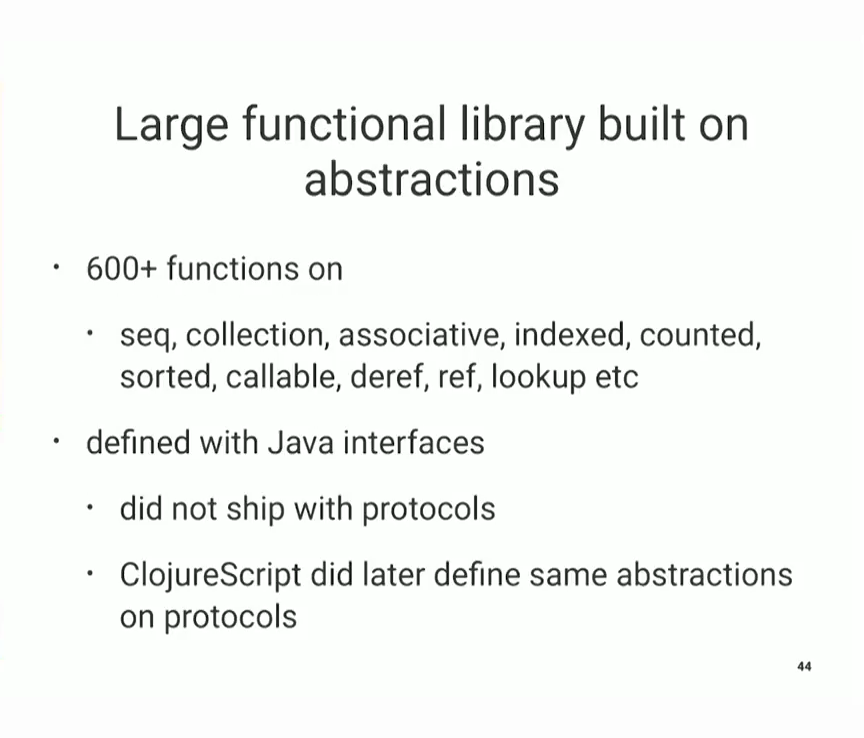

Or that.

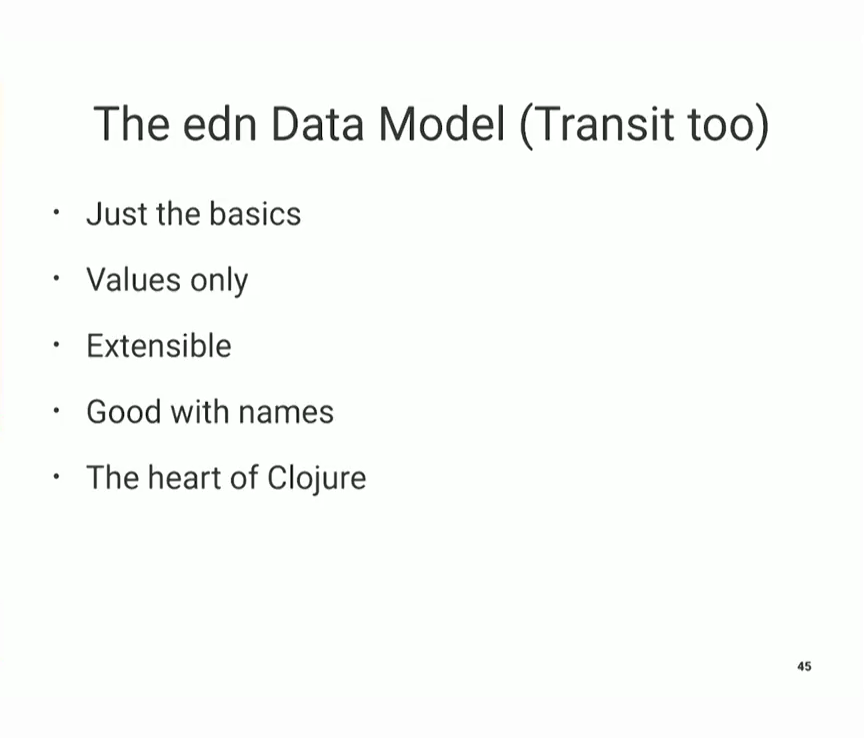

So the edn data model is not like a small part of Clojure, it's sort of the heart of Clojure, right? It's the answer to many of these problems. It's tangible, it works over wires, it's not incompatible with the rest of the world. Do other languages have maps? Associative data structures and vectors and strings and numbers? So it seems like a happy, you know, lingua franca. And why shouldn't we use the lingua franca in a program? Why should we have, you know, a different, a different language. It's actually not that much better and you have to keep translating.

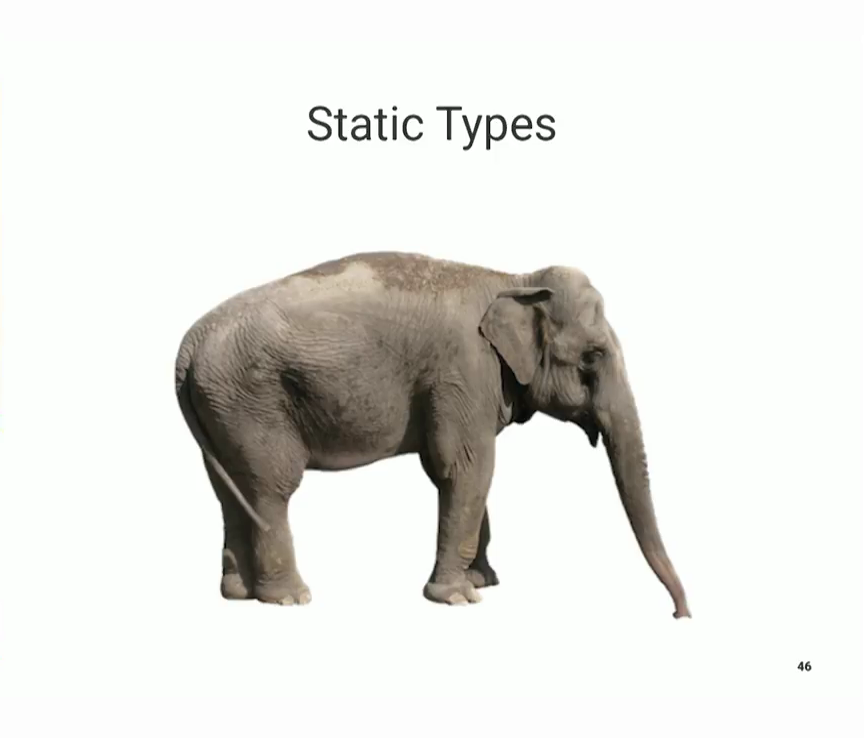

Alright. Here's the final thing.

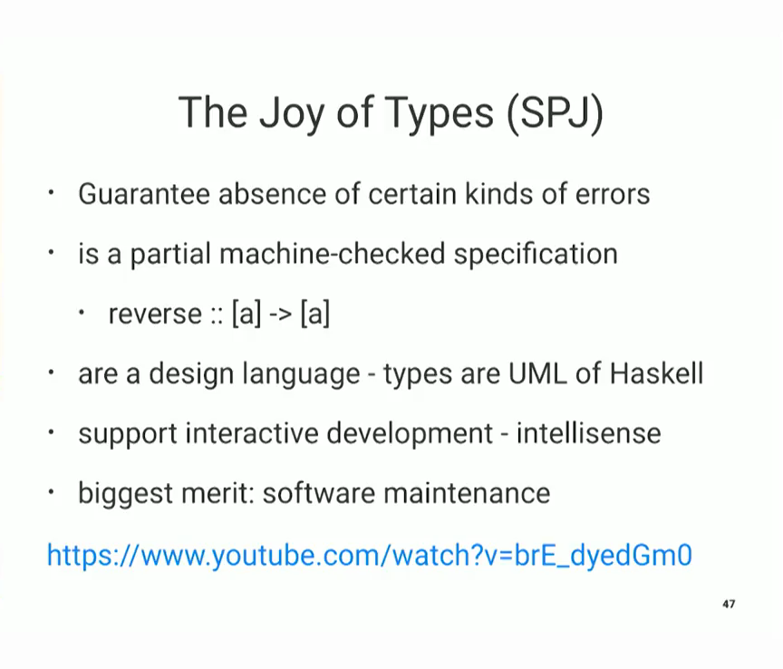

Simon Peyton Jones, in an excellent series of talks, listed these advantages of types. Cuz this is the big thing that's left out of Clojure, there's no types. They guarantee the absence of certain types of errors, which is true. And he would say, he does say, "this is the least benefit" of static typing. They serve as a partial machine-checked specification and "partial" is the operative word here. It's very partial. They're a design language, right? They help you think, you have a framework in which you can think about your problems. They support interactive development like IntelliSense. But the biggest merit is in software maintenance.

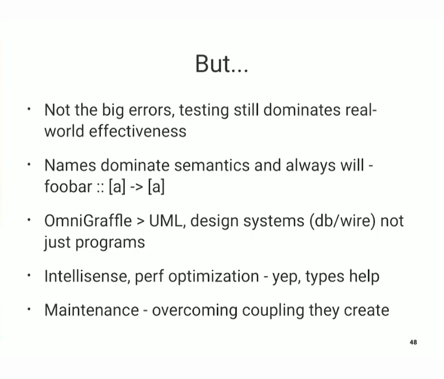

And I really disagree just a lot of this. It's not been my experience. The biggest errors are not caught by these type systems. You need extensive testing to do real-world effectiveness checking. Names dominate semantics, a to a, list of a to list of a, it means nothing, it tells you nothing. If you take away the word "reverse", you don't know anything, you really don't. And to elevate this to say, "oh this is important thing, we have all these properties", it's not true, it just isn't true. There are thousands of functions that take a list of a and return a list of a. What does that mean? It means nothing. And checking it...I mean, if you only had a list of a-s, where you gonna get something else to return? I mean, obviously you're going to return a list of a-s, unless you're, you know, getting stuff from somewhere else, and if you're functional, you're not. How many people like UML? How many people have ever used a UML diagramming tool? Right? It's not fun, right? It's like, "no, you can't connect that to that", "oh no, you have to use that kind of arrow", "no, you can't do this", "no, you can't...", it's terrible. OmniGraffle is much better, draw whatever you want. What are you thinking about? Draw that. What's important? Write that down. That's how it should work, right? Yes, IntelliSense is much helped by static types and performance optimization, which he didn't list, but I think is one of the biggest benefits. We loved that in C++. And maintenance, I think it's not true. I think that they've created problems that they now use types to solve. Oh, I pattern-matched this thing 500 places and I want to add another thing in the middle. Well thank goodness I have types to find those 500 places. But the fact was that thing I added, nobody should have cared about except the new code that consumed it and if I did that a different way I wouldn't have had to change anything except the producer and the consumer, not everybody else who couldn't possibly know about it, right? It's new.

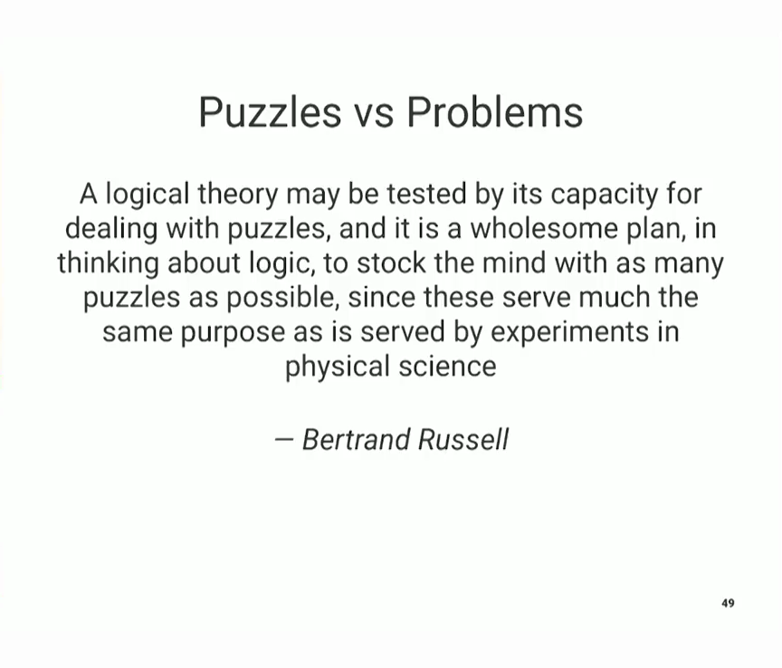

So I mean for young programmers, if everybody's tired and old, this doesn't matter any more. But when I was young, when I was young, I really, you know, when you're young you've got lots of free space. I used to say "an empty head", but that's not right. You've got a lot of free space available and you can fill it with whatever you like. And these type systems they're quite fun, because from an endorphin standpoint solving puzzles and solving problems is the same, it gives you the same rush. Puzzle solving is really cool.

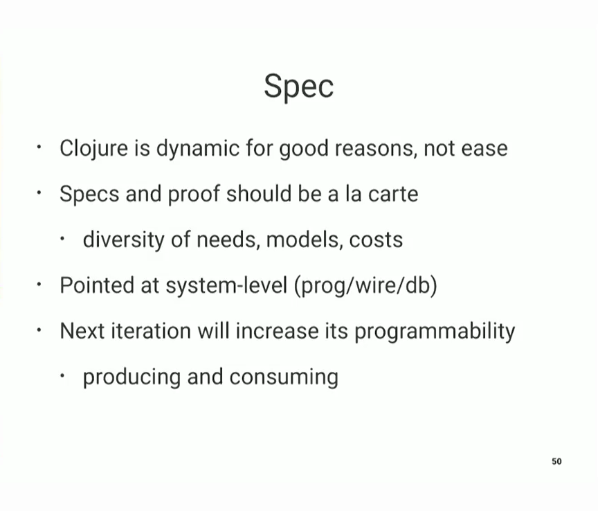

But that's not what it should be about.

I think that this kind of verification what-not, it's incredibly important, but it should be à la carte, right? Depending on what you need to, depending on the amount of money you have to spend, depending on what you want to express, you should be able to pull different kinds of verification technology off the shelf, and apply it. It should not be built in, right? There's a diversity of needs, there's a diversity of approaches of doing it, and a diversity of costs. In addition, I think to the extent these tools can be pointed at the system level problem and not some language parochialism, you get more bang for your buck, right? How many people have used spec to spec a wire protocol? Yeah. There's going to be a lot more of that going on. And I won't talk much more about spec, but the next version will increase programmability.

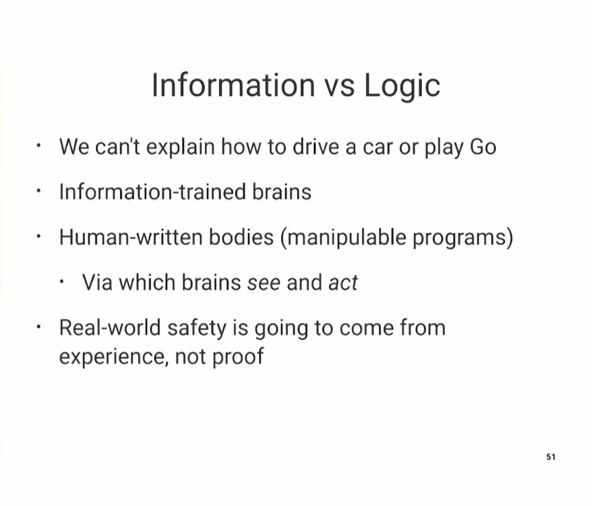

So finally, Information vs Logic. The bottom line is, "where are we going in programming?", right? The fact is, we actually don't know how to drive a car. We can't explain how to drive a car. We can't explain how to play Go. We can't...and then, therefore we can't apply traditional logic to encoding that and make a program that successfully does it. We just can't do it. We're approaching problems in programming now that we don't know how to do. We don't know how to explain how to do. Like, we know how to drive a car, but we don't know how to explain how to drive a car. And so we're moving to these information-trained brains, right? Deep learning and machine learning, statistical models and things like that. You use information to drive a model that's full of imprecision and speculation but that is still effective because of the amount of data that was used to train it at making decent decisions, even though it also couldn't explain necessarily how it works. These programs though are going to need arms and legs and eyes, right? When you train a big deep learning network, does it get its own data? Does it do its own ETL? No. Right? It doesn't do any of that. When it's made a decision about what to do, how's it going to do it? Well, when we get to Skynet, it won't be our problem anymore.

[audience laughter]

But for right now, it is. And I think it's quite critical to be working in a programming language that is itself programmable. That's amenable to manipulation by other programs, right? It'll be fun to use Clojure to write, you know, to do brain building. But it'll also be useful to be able to use Clojure for information manipulation and preparation as well as use Clojure programs and program components as the targets of action of these decision-making things. In the end real-world safety is going to come from experience, it's not going to come from proof. Anybody who gets on stage and makes some statement about type systems yielding safe systems where "safe" mean real-world? That is not true.

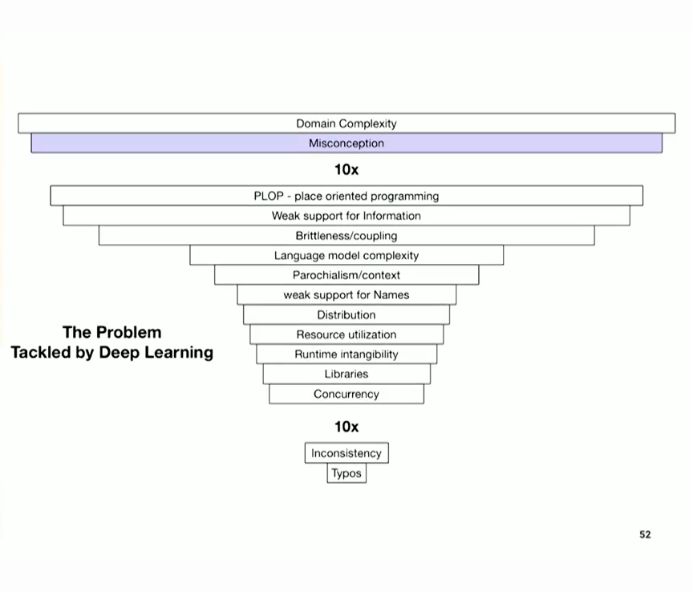

So, this is what's really interesting. Deep learning and technologies like that are pointed above the line, above that top 10x, they're pointed at the misconception problem. They say, "you know what? you're right, we don't know how to play go, we do not know how to drive a car, let's make a system that could figure out how, and learn it, because otherwise we're just gonna get it wrong".

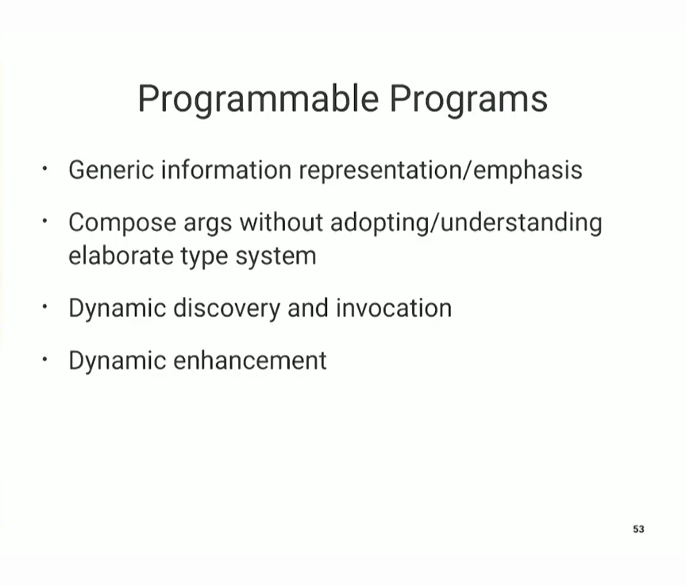

So, I'm going to emphasize that we write programmable programs and that Clojure is well-suited to that. We have a generic way to represent information and emphasis. We have a generic way to compose arguments without adopting the (?) type system, right? It's hard enough to drive a car, if you have to understand monads too, you're, you know, it's just not going to work. A reified system is subject to dynamic discovery, and I think spec combined with the rest of Clojure being reified is a great way to make systems that other systems can learn about and therefore learn to use. And of course we have the same ability to enhance our programs over time.

So, I would encourage you all to embrace the fact that Clojure is different. Don't be cowed by the proof people, right? It is, it's not a, programming is not a solved problem, ok? Logic should be your tool, it shouldn't be your master, you shouldn't be underneath your logic system when it works out for you. I'm encouraging you to design at the system level, right? It's not all about your programming language. We all get infatuated with our programming languages. But you know what, I'm actually skeptical about programming languages being the key to programming. I don't think they are, they're a small part of programming. They're not, you know, the driver of programming. And embrace these new opportunities. There's going to be a bunch of talks during the conference about Deep Learning and take advantage of them. Make programmable programs and 

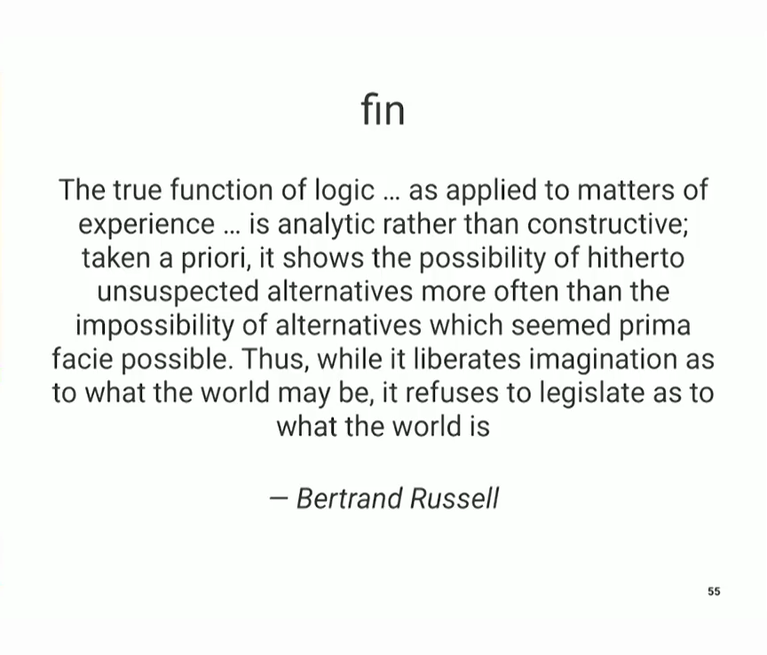

solve puzzles, problems, not puzzles. Thank you.

[audience applause]
