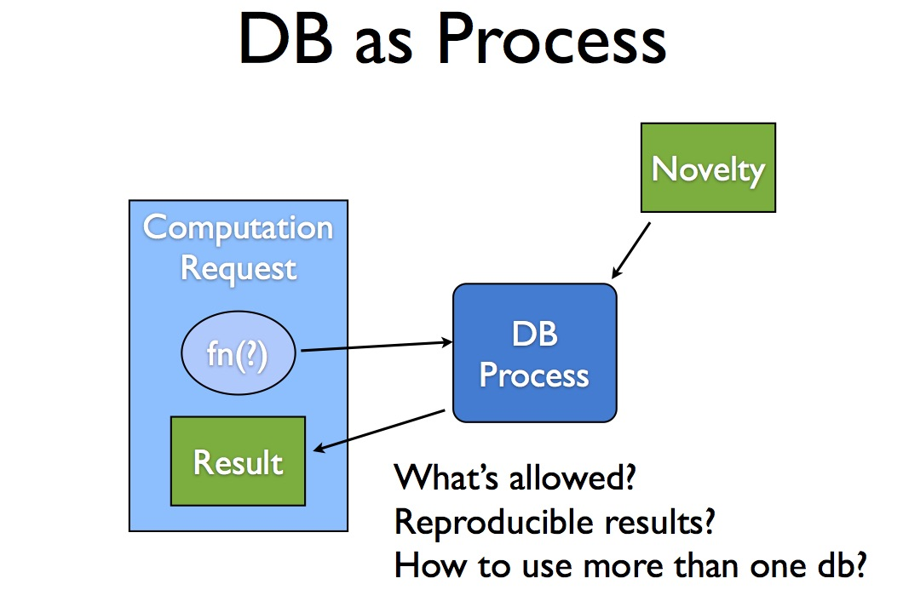
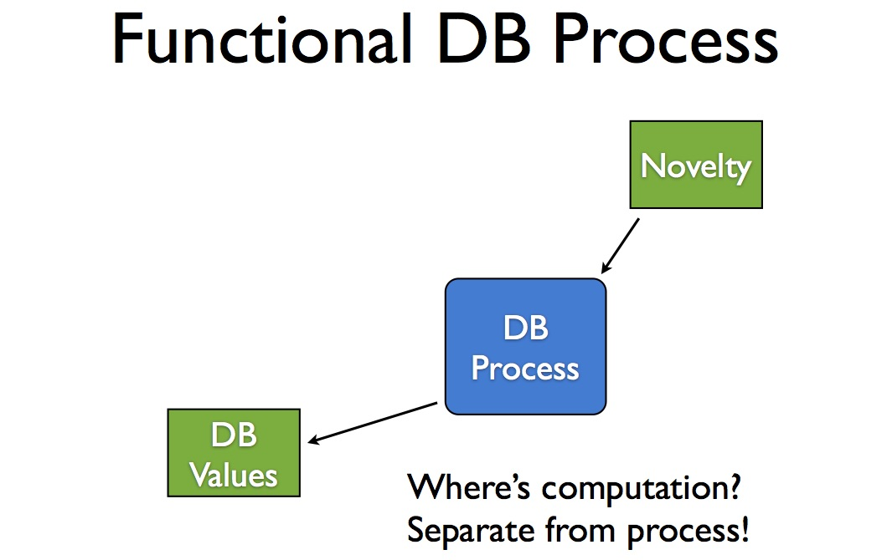

# The Functional Database

* **Speaker: Rich Hickey**
* **Conference: [QCon 2013 New York](https://www.infoq.com/qconnewyork2013 - Jun 2013**
* **Video: [http://infoq.com/presentations/datomic-functional-database](http://infoq.com/presentations/datomic-functional-database)**


[Time 0:00:00]

```
slide:

[ Datomic logo ]

The Functional Database

      Rich Hickey
```

Thanks for coming.  This talk is about the functional database.


[Time 0:00:18]

```
slide title: Why Functional Programming?

+ To stop us from accidentally doing I/O during computation
+ really?
```

This talk is not specifically about Datomic, but Datomic is the
example I am going to use.  You can substitute any functional database
you like.

So the first question I have is: how many people here do functional
programming?

How many people do it in a functional language?

How many people do it in a non-functional language?

All right.  How many people are skeptical of functional programming?

That is OK.  All right.

So why do we do it?  Do we do it to stop us from accidentally doing
I/O during computation?  How many people have written some math
library and accidentally talked to the Internet while they were doing
it?  And they need monads to keep them from doing that?

Nobody.  That is right.  That is not why we do functional programming.
I do not think.


[Time 0:01:11]

```
slide:

[ Image of a hand raised, balled into a fist. ]

rage
against the machine
```

One way to think about this, and think about functional programming,
and what our programs do, is to try to distinguish the parts of our
programs that are computationally oriented, and the parts of our
programs that are machine oriented.  They are like little machines.


[Time 0:01:30]

```
slide:

+ Languages are high-level to the extent they are not about 'make the
  computer do X'
+ Just because a computer is a machine doesn't mean our programs
  should consist (primarily) of machines
+ Objects are little machines
+ FP provides an alternative to building computations directly out of
  machines
```

And I think that when you think about languages, and you think about
programming, you can think about languages being on a spectrum.  There
is assembly language, which is sort of like talking directly to the
machine, and it feels very much like "make the machine do stuff".

And then there is C, which is still very squarely in the category of
"make the machine do this, then make the machine do that, then access
this part of the machine's memory and do whatever".

And some of those programming languages are like that because the
people using them are building things that are substantially like
machines, like operating system kernels and things like that.  But
that is really hard to do, and it is extremely hard to do well.

And so when we consider higher level languages, we measure them by the
extent to which they keep us from having to think about things in
terms of "make the computer do X".

Just because the computer is a machine, and it is one, it does not
mean that our programs should consist of machines, where a machine is
something stateful that goes from this to that.  It is doing this, and
then it is doing that, and then doing another thing.

And there is a sense in which objects are like little machines.  And I
mean that in the most pejorative way possible.  That is what they are.
And it ends up that that is _really_ difficult to think about.  And
especially when you think about combining different machines, things
that are moving around.  It is very difficult to reason about.

So the whole benefit package, I think, the immediate benefit package
from functional programming is: it allows us to choose something other
than machines as the model we use in our head for thinking about what
is happening in our program.  It gives us an alternative to building
computations out of machines.


[Time 0:03:11]

```
slide title: Values + Functions

+ More like math
  + timeless, stateless
+ Facilitates reasoning
  + and thus correctness
```

And the recipe for functional programming is basically combining
values and functions.  And I am not going to dive off into a talk
about values, except to say that when I say value, I do mean something
immutable.

How many people were in Erik's talk earlier?  So "immutable" means
"not in the I/O monad".  It is just another way to say the same stuff.
It is something that cannot change, and everything that he said, and
all of the premises, and all of the math that he showed you, does not
work if any of the arguments to any of the functions are mutable in
the way that we consider it to be true.

So it ends up that immutability is quite important.  But when you
combine immutable values and functions, which take a value, or more
than one value, and produce another value, and always produce the same
value as a result given the same arguments, you end up with something
that is more like math.  And that is very much easier to reason about
than reasoning about machines that are moving around in different
states.  There is a sense in which mathematics does not have any
notion of time and/or state.

That does not mean that there are not machines in our programs.  At
the bottom of even the coolest functional programming constructs are
little machines.  You cannot implement laziness in a functional
language without a little machine that does caching for you.

But that does not mean that that is the abstraction, or that is the
level that we want to be working most of the time, because we do not.
It is far too complex.  We all like doing that.  Anybody who has
implemented a really cool data structure, or a cache, or queue, or
something like that, has written a little machine.  But we want to
isolate that work, and the amount of time we spend doing that kind of
work, to the corners of our applications where that is necessary,
which is very very small corners.

So it is more like mathematics.

And the bottom line is: it facilitates reasoning.  And I am not
talking about any kind of formalism here except thinking.  It lets us
think about our programs.  And the easier our programs are to think
about, the better our chances are of getting them right.


[Time 0:05:10]

```
slide title: A Functional DB

+ Must provide database as a value
+ Must support writing functions that can
  + take db values as args
  + return db values
```

So if we are going to have something we are going to call a functional
database, I think it has to meet a couple of requirements.  First
thing is, it has to provide a database as a value.  And I am going to
go even further than immutability in a minute and talk about
persistent data structures, but it really needs to provide the
database as a persistent data structure.  Something that is immutable.

Because only then can you get the second part of the recipe for
functional programming, which is: you should be able to write
functions that take a database, or databases, as arguments, and maybe
even return a database as a return value.  If you can do these things,
you have a functional database.


[Time 0:05:49]

```
slide title: Plus regular DB stuff

+ Durable
+ Consistent
+ Leverage
+ Shared across processes
```

In addition, if it is going to be called a database, it has to be able
to do the other database stuff.  It has to be durable, and I am going
to distinguish that from persistent.  Persistence is sort of a
characteristic of data structures, immutable data structures in
memory.  And durability is: it has been put somewhere so that if every
machine was turned off, and we turn them all back on, we can find it
again.

Consistency is another thing we seek in databases we do not always
get.

Leverage is an important property of a database.  A database is not
just a bag into which you have dumped stuff, and every time you want
to do something, you have to go through everything in the bag.  If you
are doing that, then you are not getting any leverage.  It is just a
pile of bits.  So databases have to give us some leverage.

And the other traditional characteristic of a database, although it is
not always present, something that we desire most often from databases,
is that they are shared.  And this is where it gets tricky, because we
have lots of constructs for dealing with immutability and state
management in memory, in process, in a particular programming
language.

But the nasty thing about a database is: it is outside of all of that,
and there is more than one process, possibly in more than one
language, and definitely with more than one idea of what is going on,
sharing this thing.  So far, databases have been treated like giant
shared global variables, and all of the values we seek in choosing
functional programming are not present for databases, normally.


[Time 0:07:08]

```
slide title: A Functional DB value must be accretive

+ IMO
  + important for information model
+ Else what - snapshots?
+ In any case, immutable
```

I am going to make the claim that a functional database value, so the
value that you get when you look at a functional database, should be
an accretive thing.  That means that it should be something that grows
as more information enters your system.  That it accumulates
everything that has happened.  And I have given other talks about why
that is essential for an information model.

And I also think it is sort of an essential implementation detail of
doing this, because your alternative is something like snapshots, and
then you have the whole question of: how do I find a snapshot
corresponding to a particular point in time, and can I ever do
anything that crosses time?

So I am going to be showing you some things today that are benefits of
being accretive, in addition to being benefits of being functional.  I
think they go together.

In any case, there is no doubt, if you are going to have a value of a
database, it has to be immutable, or else you cannot do any functional
things with it.


[Time 0:08:00]

```
slide title: 2 Notions of DB

+ Database system
  + facilitates the process of creating, sharing, growing db values
  + a machine
  + has identity
+ Database values
  + the things with which we compute
```

So far I have been saying the word "database" over and over again.
And I think there are two notions of a database that we normally do
not disentangle, that we now have to start doing.  And if you have
seen my talks about objects, this is the same kind of thing.  We need
to separate out the identity of an object from the state that it takes
on at any point in time.  And when we do that, we can start writing
functions of this state, and we do not get into trouble trying to
manipulate a machine directly.

So there is this notion of a database system.  There is something that
is going to facilitate multiple processes interacting with some shared
data set, and being able to get values out of it, and grow it by
putting more information into it.  And that is actually going to be a
machine.  That is going to be some process that works a lot like a
machine.  There are conveyor belts.  Stuff gets taken into it.  It
bakes some new cakes.  It gives out new cakes to everybody else.

And that is where the identity part of the system is going to live.
There is some database.  It is called "our customer database".  We
know the idea of "our customer database" persists through time, but
the values "our customer database" takes on change over time.  We get
new states of the database.  Usually there are more and more
customers in it.

[Time 0:09:09]

It could be the case that when we lose a customer, we erase them.  But
more and more we are finding that businesses value information models.
They do not _want_ to forget things that they knew, because there is a
lot of value in doing time based analysis of what happened.

Does this person change their email address all time, or move all the
time?  If every time they give you a new email address, or a new
address, you erase their old one, you will have no idea.  Does your
supplier change their prices all of the time?  I do not know.  I just
take the price and I overwrite the old price.  You cannot learn.

As people, we use time based decision making all of the time, yet we
build systems that are supposed to be "information" systems that
forget what happened.

So we want to accumulate stuff inside of this thing, and we need
something that coordinates that.  And then, this machine is going to
deliver to us -- when we look to perceive the database -- values.  And
these database values are the things we are going to use to do
computation.  Disentangling this is sort of the essential job of
building a database that is going to be more functional.

This talk is primarily going to be about this second part.


[Time 0:10:13]

```
slide title: DB as Process

[Figure]

What's allowed?
Reproducible results?
How to use more than one db?
```



But let us look at what this looks like.  So this is the traditional
thing, where I am going to say the entirety of a database is just one
thing, just that first thing I talked about.  The database as a
machine.  This is the kind of database you are usually dealing with.

There is something to get novelty into it.  Maybe people are doing
transactions against the database.  And then if you want it to do some
kind of computation -- issue a query or something like that -- you are
going to make up a request, which is something that I want to have
run.  And you are going to have to pass it in to the database process,
and the database process is going to execute that in this black box
context inside the middle of this moving machine, and give you back
some result.

I think it is really critical to think about some of the issues
associated with that.  For instance, what is allowed in this function?
What are you allowed to do?  You are allowed to do whatever the
database system says you can do, in whatever language they support.
Maybe it support SQL.  Maybe it supports JavaScript.  Maybe it
supports nothing; all you can do is do HTTP GETs or something like
that.

The other question is: can you get reproducible results?  If I send
the same request again later, will I get the same answer?  Generally
in a system that has the database as a process, and does not
disentangle the state from the identity, the answer is no, you do not
get the same answers over and over again.

And the other tricky thing about the machine being the thing into
which you send the computation is: how do you compose that?  How do
you make queries that manipulate more than one database at a time?
Because you are sending the request into a particular set of data, how
do you make that request deal with this set of data [gesturing to
indicate a separate database from the first].  Do you make all of
these linking things, or some nasty thing where you have to copy the
stuff out into another place, or you need to federate it, or make some
external thing to do that job?


[Time 0:12:01]

```
slide title: Functional DB Process

[Figure]

Where's computation?
Separate from process!
```



So we will contrast that with a functional database process, where
obviously it is still the same thing.  It is accreting novelty.
Different processes have said: ooh, I learned about a new customer.
Here is the new information.  And then, instead of doing anything
else, the _only_ other thing we get out of this is the ability to say:
let me see your state.  Let me see what the value of the database is.
And so this machine will dispense values on demand.  Here you go.
Here is the value of the database.

So the question here is: where is the computation?  I showed you more
stuff on the previous slide.  Where is it here?

And the answer is: it should not be here.  This is a machine.  This is
a nasty moving thing.  You play with machines, what happens?  You get
hurt.  You stick your hand into a machine.  It is bad.  Composing
machines is difficult.

So we want to separate computation from process.  There _is_ process.
There is some state here.  We are going to move on.  We are going to
put stuff on disks, or in some sort of storage.  It does not mean we
have to commingle that with computation.


[Time 0:13:05]

```
slide title: Functional DB Computation

[ Figure showing an oval labeled "fn(db, db)" taking two "DB Value"s
as input, and producing another "DB Value" as output. ]
```

So we are going to have functional database computation that is
completely orthogonal to functional database processing.  Once we have
got the values, we can write functions.  We can write a function, and
the argument to the function is not some ambiguous: who knows what is
inside the database while it is running?  It is a clear thing.  There
is a database value.  We are going to pass it to a function.  And we
are going to get a result out.

The cool thing about having separated this is that there is no problem
having a function that manipulates more than one database value, so it
is a function of two databases.  And there is not a problem writing a
function whose result is another database value.  So we have a
function of two databases that produces a database.  This is not a
problem, because computation has been split out, _presuming_ we can
get something that looks like a value of the database.

I have given other talks about how to do that architecturally, so for
the purposes of this discussion you are going to have to presume that
that is possible, because it is.


[Time 0:14:04]

```
slide title: Value Propositions

+ Just data
  + language-independent
  + aggregate, compose
+ Persistent data structures
  + alias freedom
  + efficient incremental 'change'
```

So there are a bunch of value propositions of values that we would
like to get from having done this.  Otherwise, what is the point?  It
is not just about to say: ooh, I have a function database.  Where is
my T-shirt?  It is about getting some benefit.

And we are looking for a lot of the benefits we get from using values
in our programs.  The first thing is: a database is just data, and
data is language independent.  We are not talking about objects with
methods, written in a particular language with an interface, or
whatever.  We are talking about information.  Information does not
have a programming language.  What is the programming language of
information?  There is no such thing.  It does not even make sense.
It is just information.  So it is just data that is language
independent.

The other thing about data is that it composes and aggregates to data.
When you combine two pieces of data, you get another piece of data.
When you combine two machines, you get trouble.  So that is the value
proposition we are looking to get.

There are other value propositions you get from using persistent data
structures when you use a functional programming language.  So a
persistent data structure is a way to implement an immutable data
structure -- something big like a collection -- such that you can give
that collection to anybody.  It will never change.  But if somebody
wants to make a modified view of that collection, they can, and it is
inexpensive to do so.  In particular, it is less expensive than
copying the whole thing over.  That is the benefit proposition of
persistent data structures.  That is what you get from functional
programming languages.  Most of the data structures are persistent
data structures.

[Time 0:15:40]

And so what we want is: the database to behave as if it was a
persistent data structure.  So in spite of the fact that there is --
there is, in fact, in the implementation that I am talking about --
there is a persistent data structure in memory, plus another
persistent data structure in storage, and they get merged dynamically.
I can treat that entire thing as a persistent data structure.  And if
I want to make a small incremental change that is local to me, I can
do that, and not impact anybody else.  Because it is a persistent data
structure, and it is a value.  And my "changes" are not really
changes.  They are local trees with shared structure with the rest of
the stuff.

So some of the benefits that we get from using persistent data
structures are freedom from worrying when we alias.  If you pass
around copies of machines to people, or pointers to machines to
people, you have this immediate problem, which is coordination of
activity with that thing, because it is moving around.  People are
issuing requests to it that cause it to move in different ways.  Those
requests can collide.  It is almost impossible to obtain the state
from the thing.  So you worry a lot when you do not have immutable
data structures, about sharing them with anyone.  Defensive copying --
what a horrible term that is.  Why do we do that?

So when we use persistent data structures, we are free of that worry.
Aliasing is cheap and completely free of worry.  Because it is
immutable, you cannot interfere with each other.  And we also want to
get these benefits of efficient incremental change.


[Time 0:17:08]

```
slide title: One Structure, Many Functions

+ Datalog queries
+ Other query langs
+ Direct index access
  + seek + scan
+ Entity navigation
```

So the other thing we get from functional programming is: we revisit
that old Perlis quote, which is: it is better to have one data
structure and 100 functions that manipulate it, than it is to have 10
data structures with 10 functions each.

And that is super true.  I think people are learning it in very tiny
increments, but I believe that quite strongly.  And so another benefit
of having inverted this thing, instead of saying, "here is my
computation, it must comply with your rules, go let me do this,
please".  You turn it inside out and you say, "give me your state",
then what can you do with that?  You can do anything you want.

Datomic happens to support Datalog queries, but you could write other
query languages that manipulated the same data.  You can directly
access the indexes and write ordinary functional mapping code across
the data.  You can get a view of the data -- if it happens to be
hierarchical -- as if it was a set of entities.  By manipulating data,
and by walking through data structures, not by having to create and
fabricate objects, or do other kinds of ORM silliness.  There _is_, in
fact, information there.  It _is_ hierarchical.  There are connections
between the things.  And you should be able to just navigate that all
as data without any kind of additional stuff.

So this is another expectation we get from having separated values and
functions.  We have a value.  We can write a whole bunch of functions
-- you can write a new function every day if you want -- that can
manipulate this value, because the value is -- it is not opaque.  It
does not incorporate code.  It is basically exposing itself, and it
does so because it is immutable.  So what can you possibly do in your
function?  You cannot hurt it, so have at it.  Write as many functions
as you like.

And that is the kind of approach we want to have.  It should be an
open thing.  You have this information.  Why should you be limited in
how you consume it?


[Time 0:19:04]

```
slide title: Speculation

+ What-if scenarios
  + Just drop to backtrack
+ Datomic's "with"
  dbval tx-data -> dbval
+ Try before you buy / transact
+ Tree propagation
```

Another really interesting property of persistent data structures and
functional programming is that speculation is done completely
differently than it is in an imperative context.

So if you want to have a what-if scenario, and you have a whole bunch
of data structures in an imperative object-oriented program, and you
want to say: what would it be like if I moved everyone from here to
there, or if I gave everybody a discount and then they told their
mother about it, and what would happen?  And you just have to copy
everything and go into an alternate universe.  If that data happens to
be in a database, there is almost no way to do it.  You cannot put
your speculative data in the database.  Maybe you can try to abuse
temp tables or something, but it is really not the same.

But when we do functional programming, and we try to write things that
do speculative tree walking, we can just keep incrementally enhancing
our data structure.  And if we get to a point in the tree where we
say, "Agh!  This is a dead end", what does it take to backtrack?  You
just drop that value.  You do not have to undo it.  You do not have to
re-fix your state, or reset everything that you have set along the
path.  You just drop it.

So speculation ends up being a really important thing in functional
programs.  And when you can do speculative work with a database, it
completely changes your life.

[Time 0:20:17]

So I am going to show you, in a minute, a capability of Datomic, which
is something called "with", which takes a database value, and some
transaction data that you would normally send in a transaction, and
get a new database value.  But you never did it.  It is just a
function of data, a database value, and transaction data, and it gives
you a new database value.  But you do not have to send it over the
connection and have everybody see it.

And when you have that, it means you can do very very interesting
things.  The simplest thing you can do is: you can try before you buy.
I want to do this transaction.  Anybody ever seen somebody issue a
transaction, and then wish they had not?  Yeah.  Everybody has done
that.

Well imagine if you could have tried that transaction first, and seen
how it worked out?  In fact, and seen how your reports look, and seen
everything about your system as if that had happened, but you did not
have to do it in a way that anybody else could see.  It just really
changes things.

And then we have had people using the system to do that kind of tree
propagation work where they had a very sophisticated change they
wanted to do where it is hierarchical, and there is some parent, and
you have to calculate something over the tree, and calculate a new
value of the parent, and then recurse into each child.  And they need
to see the decision that was made by the parent, and they sort of need
to see a new view of the world.  And you can actually flow the
database through and have each branch incrementally enhance it, and
then issue queries against that what-if database to make their
decisions about what to do.  And collect all of the changes they
intend to make up, back up when you return, and say: OK, A, that all
worked, and B, here is the set of things I need to transact against
the database to bring it to that new state.

Or you can discover that something about it did not work, and make a
different decision.


[Time 0:22:05]

```
slide title: Time Travel

+ Accretive values contain all history
+ Query as-of and/or since a point in time
+ Query across time
```

Finally, again, this is not strictly a property of functional
databases, but if you believe me that they must be accretive -- that
is, they must accumulate new information, and not ever get rid of
information -- then you get a whole other bunch of great things that
you are used to having.  How many people use Git?  How many people use
a directory on their file server for source code, and you just
overwrite stuff?

[Audience response]

Well, we _have_, but who does it _now_?

We do not do it any more, because we see so much of a value
proposition in keeping what had happened before.

So if you have an accretive value of a database, that means you have
all of the history in any particular value of the database, which
means you can go and pretend it was an earlier time, or you can see
something that has happened in a particular time range.

Or you can actually do queries that cross time, like "how many times
has somebody moved?" or "how many times have they changed their email
address?" or "what is the frequency of change of our supplier's
pricing to us?"  All of those kinds of things that you need to
actually think about across time.  If you only had the current value
of everything, you really could not be very good at making decisions.
And in all other cases we do not accept that, but with databases we do
for some reason.

So we want to be able to do this.


[Time 0:23:30]

```
slide title: Testing

+ Flowing connections around, ugh
  ambient connection pool no different
+ Reproducibility
+ Values can easily be fabricated / generated
```

Finally, and everybody is always very interested in what the testing
story is.  Well, it is _phenomenally_ good.  How many people like
testing database code?

[Audience reaction]

The React guy likes testing database code.  That is OK.  I understand.
It is fun.

So how many people like code that flows connections around everywhere?

Really a breeze, right?  Because what is a connection?  A connection
is sort of like a pointer to a machine.  And how do you know what
happens?  Well I called this code.  I flow a connection through and it
...  And we all know what the solution to this is, right?  The
solution is: ambient connection pools, so we do not have to flow it.
And anybody who wants to, at any point in time in their program can
immediately say "give me a connection to whatever, and let me go issue
a query".  And I will get whatever is happening right then.

We know that is brutal, because we have no idea what is happening.  If
five different points in the code go and make an independent call over
that connection, as part of sub components of a bigger computation, we
have no idea that they all got things that make sense together.  There
is no shared basis between that code.  That is all independent.  So it
is like this big variable that we are passing around.

So now we just completely switch from that.  We, once, grab the value
of the database, and we pass it through our program.  And then we know
absolutely everything underneath is using the same value.  And it
means that we can write tests that are reproducible.

Another phenomenal characteristic of values is that they are easy to
fabricate.  So if you have the database as a value, it means that
mocking a database is not making a connection that says "yes" to
everything, or pretends to do stuff.  Or having to reset a database
from blank into some particular state.

It means that you can just fabricate values in test code, and send it
to code that would otherwise expect a database.  And that code will
work, and you know that the test values are things you can generate,
make sure that they exhaustively test ranges and things like that.


[Time 0:25:29]

```
slide:

[Datomic logo]

Hands On!
```

So my intent with this talk was not to talk and talk and talk -- which
is what I usually do -- about abstract things.  But to give you a
sense of what it is actually like to use something like this, and
touch it.


[Time 0:25:47]

```
slide:

;; load some support code
(require '[datomic.api :as d])
(require '[clojure.pprint :only [pprint]))
(defn tempid [] (d/tempid :db.part/user))

;;;;;;;;;;;;;;;;;;;;;;;;;;;;;;
;; create the db
(def uri "datomic:dev://localhost:4334/demo97")
(d/create-database uri)

;;;;;;;;;;;;;;;;;;;;;;;;;;;;;;
;; get a connection
(def conn (d/connect uri))

```

So I am going to -- at tremendous risk to myself, and especially to
you, try to do something live.

So this is a brand new REPL I just called up, and this is Clojure
code.  If you do not know Clojure, do not worry about it.  It just
means exactly what it says, which is quite convenient.

[Audience laughter]

And there is no extra stuff.  That is all you have to know.

So we are going to load up some support code, just to be able to talk
to the database.  And I should have put a note in here, which is "if I
do not change this, you should all yell at me right now", but here I
am changing it.  So there is no need for yelling.

So we are going to creating a name for a database.  There is actually
a transactor running on this machine.  And we are going to create a
name, which is a URI, for the database.  And we are going to make one.

And we are not going to make one, because I do not know if I have the
... oh, I have to restart this.  Hang on one second.  There we go.
See, it is peril at every point.  Every time I sleep my machine, I
lose my connections.  There we go.

So what is happening here -- oops.  Make this big again.

[Time 0:27:17]

What is happening here, just so people know, is: this is a way you
program in Clojure, which is: you leave your source code in one file,
and there is a command you can hit on the keyboard.  It is probably
the only thing I know how to do in Emacs, that says: evaluate the
thing my cursor is on.  So that is what I am doing.

[Note: In the transcript of this interactive session, we will use a
line beginning with => to mean "This is the return value that was
shown when evaluating the preceding expression.]

    ;; load some support code
    (require '[datomic.api :as d])
    (require '[clojure.pprint :only [pprint]))
    (defn tempid [] (d/tempid :db.part/user))

    ;;;;;;;;;;;;;;;;;;;;;;;;;;;;;;
    ;; create the db
    (def uri "datomic:dev://localhost:4334/demo97")
    (d/create-database uri)

    => true

So if you see my cursor going -- hey, true!  That means we just
created this database.

    ;; get a connection
    (def conn (d/connect uri))

And then we are going to get a connection to the database.

So this is a critical thing.  This connection, this is that machine.
This is the machine side.  When you are using databases traditionally,
you are used to using the connection all of the time.  One of the
things I want you to note in this part of the talk is how infrequently
we do that.

[Time 0:28:00]

So we now have a connection to the database, and this means that
anything we do via that connection is stuff that everybody else can
see, and can share.

    (def schema {:db/id (d/tempid :db.part/db),
                 :db/ident :email,
		 :db/valueType :db.type/string,
		 :db/cardinality :db.cardinality/one,
		 :db/unique :db.unique/identity,
		 :db.install/_attribute :db.part/db})

This is not really a tutorial, but there is a minimal schema required
for Datomic.  You basically define what attributes you are going to be
able to put on entities.  So we are just going to define one for this.

    :db/id (d/tempid :db.part/db),

This says that there is some thing, which is an attribute we are
defining right here.

    :db/ident :email,

that's name is email.

    :db/valueType :db.type/string,

Its value type is string.

    :db/cardinality :db.cardinality/one,

You can have one of them.

    :db/unique :db.unique/identity,

It should be unique across the database.

    :db.install/_attribute :db.part/db

And the last attribute we are going to assert here is that: that
should become an attribute in the database.  This object, this value,
is that.

This thing that I am pointing at here [the multi-line expression in
curly braces] is a representation of a Clojure map.  So it is just
key, value, key, value, key, value.  You can insert any Java map the
same way.  So have at it in your own programming language.

And then we are actually going to transact across the connection.

    (def schema-ret @(d/transact conn [schema]))

So we are going to transact [d/transact] across the connection [conn],
just sending that data [schema].  That is all we do.

[Time 0:29:00]

We send data in.  Remember that was that novelty.  So there is some
novelty.  We are going to tell you about the email.  We are going to
do that right here.

And that gives us back this thing.  And "def" just says: call this
name [schema-ret] that value [everything after schema-ret on the "def
schema-ret" line of code above].

So now we have schema-ret, which is the return value from having
transacted that schema data into the database.  And that returns a
map.  So we can look at the keys of that map.

    (keys schema-ret)
    => (:db-before :db-after :tx-data :tempids)

We see some really interesting stuff right away.  Transacting across a
database returns the database before the transaction as a value [the
value associated with the key :db-before in schema-ret], the database
after the transaction as a value [:db-after], any data created by the
transaction [:tx-data], and a resolution of any temporary ids that you
created [:tempids].  That is pretty cool.

So theoretically the database after should be the value of the
database having done that schema.

    (def newdb (:db-after schema-ret))

We are going to call that "newdb" just so later we can talk about the
database.  This is the blank db, "newdb".

And we can see: is the new database the same as the database before we
transacted?

[Time 0:30:00]

    (= newdb (:db-before schema-ret))
    => false

We come down here and it says "no" [return value from evaluating
expression above is "false"].

    (= newdb (d/db conn))
    => true

And now we are going to go and we are going to say -- this function
"db" goes to the transaction and says "get me the latest database
value".  And because there is nobody else using this database right
now, that should be the same thing as the after value.  And it is.

How many people have ever used equal on two database instances?

[Audience laughter]

OK.  So things are different already.

    ;; define a query as data - find all emails
    (def query '[:find ?e ?email
                 :where [?e :email ?email]])

And now we are going to define a little query.  We are going to keep
reusing this query on different values of the database throughout the
talk.

So this says find me some "e", an email, where "e" has an email.
Basically this is "get me all the emails".  Give me the entity and the
email, all of them in the database.

    (d/q query newdb)  ;; nothing yet
    => #{}

And we are going to go and issue this query.  And that is what "q" is.
We are going to say: issue this query [named "query"].  So sending
this value.  This is, again, this [the query that is the value of
"query"] is just a data structure.  It is a java.util.List.  You could
write it however you want in your own JVM language.  It is just a
list.

So we send that list, and we are going to pass the database value
[newdb] to query.

[Time 0:31:00]

Notice: there is no connection in this call.  This is not a query to a
connection or a server, or anything else.  It is a function of the
database and the query value.

And this is the empty set down here [evaluating last expression above
returns value #{}, which in Clojure represents an empty set].  We do
not have any emails yet.  We created the attribute.  We have not made
any entities.

So let us make one.

    ;; add a user and email
    (def fred-ret @(d/transact conn
                    [{:db/id (tempid)
		      :email "fred@email.com"}]))

We are going to transact again.  It takes the connection [conn].  And
this is the same kind of thing.  I have just put it in-line.  We say
there is some new entity with an id we are just making up [via the
expression (tempid)] whose email is "fred@email.com".

And we are going to transact that.  And just like before, that is the
same kind of thing.  It is a transaction.  It returns those same keys.

    (keys fred-ret)
    => (:db-before :db-after :tx-data :tempids)

The database before and after, and whatnot.

So it would be interesting to recover fred's identity, because we are
going to want to talk about fred later.

    ;; get fred's id
    (:tempids fred-ret)
    => {-9223350046623220289 17592186045418}

So the tempids part of that return value is a map.  It is all of the
temporary ids to the actual ids you have got in the database, because
the ids are auto-generated.

    (def fred-id (-> fred-ret :tempids first val))

So this little piece of code just says: go into that return value
[fred-ret], get the tempids [:tempids], get the first one of them
[first], and its value [val] is fred's id.

[Time 0:32:01]

No fluff there.

    (identity fred-id)
    => 17592186045418

And if we look there we see fred's id.  We will use that later.

    (def an-id #(-> % :tempids first val))

And that function was so interesting, we are going to name it "an-id",
because we can grab other ids that way.

Now if we issue a query, because we have just added fred.

    (d/q query newdb)
    => #{}

Woah.  We have got nothing.  Why do we have nothing?

Well I did not do anything to newdb.  It is immutable.  I hope I did
not mess that up.  Somebody else could be using that.  I did not grab
the new value of the database.  I have the old value.

So the :db-after that was returned by the transaction is the value
there.

    (def fred-db (:db-after fred-ret))

Now what if other people are using this database?  If I immediately
went back and said: get me the database, could I get exactly the
database that was produced by the fred transaction?  I do not know.
Maybe, maybe not, but I do not have to worry about that.  It was
returned to me from the transaction.  So I will just grab it.

[Time 0:33:00]

So the :db-after after I issued the fred transaction is the one that
includes fred, I hope.  And let us just see if that is the case.

    (d/q query fred-db)
    => #{[17592186045418 "fred@email.com"]}

There he is.  We have fred in that value of the database.

So now we are going to do a similar thing.

    ;; add ethel
    (def ethel-ret
         @(d/transact conn
	  [{:db/id (tempid)
	    :email "ethel@email.com"}]))

We are going to add ethel.  Same exact thing.  We are going to have
some new temporary id, and the email is ethel, and we are going to put
the return value of transact into ethel db [He probably meant to say
"ethel-ret" there].  It has the same things: :db-before, :db-after,
ids, and whatever.

    (def ethel-db (:db-after ethel-ret))

We are going to name the value of the database that was created from
that transaction the ethel-db.

    (d/q query fred-db)
    => #{[17592186045418 "fred@email.com"]}

We did not mess up fred-db.  It still has fred in it.

    (d/q query ethel-db)
    => #{[17592186045420 "ethel@email.com"] [17592186045418 "fred@email.com"]}

If we query the ethel-db, we see we have both.

    (d/q query (d/db conn))
    => #{[17592186045420 "ethel@email.com"] [17592186045418 "fred@email.com"]}

And if we do actually go back over the connection again, because we
are not sharing this database with anyone, we will see that the live
database also has both fred and ethel.

Everybody OK so far?  All right, we are still having fun.

[Time 0:33:59]

So let us say fred wants to change his name to freddy.  And he has
done it.  He has told his mother.  And she is still upset about it,
but he has gotten his new email address, and that is it.  Moving
forward.

But let us say this is the first time that you ever used this
database, and maybe you are not really sure that you know how to do
this.  So you are going to try it first.

    ;; speculative changes - fred changes name to freddy
    (def freddy-tx [{:db/id (tempid)
                     :email "freddy@email.com"}])

I have this transaction I want to issue to make fred's name freddy.
And I am going to write that as data here.  And I am just going to
name that.  So I have a value called freddy-tx.  And it really is just
that.

    freddy-tx
    => [{:db/id #db/id[:db.part/user -1000003], :email "freddy@email.com"}]

Any time I type down here, you should tell me: do not do that, because
you are just going to mess up, and use code you did not try before.

So this just says we are going to make a guy.  We are going to make
freddy here.

    (def freddy-db (-> (d/db conn)  ;; get the current value of db
                       (d/with freddy-tx)  ;; with dbval tx -> dbval
                       :b-after))

Then we are going to do something completely different.  We are not
going to call transact.  This arrow thing [->] just says: take the
first thing, and pass it to the next thing, and pass it to the next
thing.  It is a way so I can write code in order, that you are
probably more familiar with.

[Time 0:35:01]

So we are going to take the value of the database from the connection
[(d/db conn)] and we are going to get a value of the database.  We saw
this before.  We get a value from doing this.

And then we are going to say: imagine that database, or give me a new
database as if I had done this freddy transaction [freddy-tx] to it,
the one I just wrote up here [(db/with freddy-tx)].  And that returns
the same stuff that transact does, so I am going to get the :db-after
it.  I will call that "freddy-db", to see what happened.

Now what is going to happen when I look at freddy-db?

    (d/q query freddy-db)

Will fred become freddy?

    => #{[17592186045420 "ethel@email.com"] [17592186045422 "freddy@email.com"] [17592186045418 "fred@email.com"]}

No.  Actually I made a mistake.  What was my mistake?

[Audience response]

Yeah, actually I just made a new guy.  I did not talk about fred.  I
just said there is somebody else who has freddy.  But thank goodness I
did not really do this.

    (d/q query (d/db conn))  ;; no harm done
    => #{[17592186045420 "ethel@email.com"] [17592186045418 "fred@email.com"]}

If I go and look at the connection, look at the database that everyone
is seeing, I did not talk to the connection to do this job.  Therefore
I did not change anything.

[Time 0:36:01]

    ;; better, use fred's id, not new id
    (def freddy-tx [{:db/id fred-id
                     :email "freddy@email.com"}])

So let me see if I can fix that.  What I want to do is say: fred's new
email is this.  I am just adding a new fact.  I am not doing anything
else.  And I am going to name that thing.

    (def freddy-db (-> (d/db conn) (d/with freddy-tx) :b-after))

And I am going to try that again the same way.  Take the fresh value
of the database [(d/db conn)], imagine it with fred transaction
[(d/with freddy-tx)], and see what happens.

    (d/q query freddy-db)
    => #{[17592186045418 "freddy@email.com"] [17592186045420 "ethel@email.com"]}

And then we will issue the query here.  And that is what I expected to
see.  This same id, [ending with] 418, that was fred, is now freddy.
That is good.  Fred changed his name, and changed his email.

    ;; now transact for real
    (def freddy-db (-> conn (d/transact freddy-tx) deref :db-after))

So now we will do this for real.  We are going to take that same
transaction data [freddy-tx], and instead send it to the connection
using transact like we did before, saying: now, OK, apply this change
to the value of the database that other people might see.

This is just chaining it.  Take the connection [conn], pass that
transaction to it [(d/transact freddy-tx)], dereference it [deref],
and grab the database after [:db-after].  So that is the new
freddy-db.

[Time 0:37:00]

    (d/q query freddy-db)
    => #{[17592186045418 "freddy@email.com"] [17592186045420 "ethel@email.com"]}

And we issue the query.  We see that.

    (d/q query (d/db conn))
    => #{[17592186045418 "freddy@email.com"] [17592186045420 "ethel@email.com"]}

But now if we look at the database that everyone sees, everyone sees
freddy.

Everybody good?

So now we are going to look at that accretive nature, which is that
every value of a database contains all prior values of the database.

    ;; an information system retains history

    (def latest-db (d/db conn))

So we are just going to get the latest value of the database, and we
are going to call it "latest-db".  We ask the connection to get the
value, and we now have the value, and we are done with the connection.

    (d/q query latest-db)
    => #{[17592186045418 "freddy@email.com"] [17592186045420 "ethel@email.com"]}

And we will just issue our same query again, to make sure what our
basis is.  This is the current view of the world: freddy and ethel.

    (d/q query (d/history latest-db))
    => #{[17592186045418 "freddy@email.com"] [17592186045420 "ethel@email.com"] [17592186045418 "fred@email.com"]}

But now we have this new function here, called "history".  And
"history" takes a database and says: instead of just showing me the
current truth, the most recent true value of every attribute that you
know, show me _every_ value of the attributes that you ever knew.

How many people would like to be able to do that, sometimes?  Yeah.  I
did.

[Time 0:38:00]

So there we go.  So this is very interesting.  So now we see, unlike
in all of the other queries, that 418 can come up more than once.  We
have freddy here, and we have fred there.

Now this is kind of neat, except I do not know if I could make any
decisions on this basis.  Why not?

[Audience response]

I do not know when.  Boy, I wish I had a database that remembered when
things happened.

And it ends up that you do.  So what I have been showing you is a
query that binds only three of what are actually five parts of what we
call a "datom", which is a fact.  The first is what entity, the second
is what attribute, and then the value.  But the fourth thing is: when?
At what transaction was this true?  So I am just going to enhance the
query, and we will call it "tquery".

    ;; enhance query to grab txes
    (def tquery '[:find ?e ?email ?tx
                  :where [?e :email ?email ?tx]])

which will pull back that additional thing.  So we will get the id,
the value, and the transaction [?tx].

    (d/q tquery (d/history latest-db))  ;; hrm, more results, why?
    => #{[17592186045418 "fred@email.com" 13194139534313] [17592186045420 "ethel@email.com" 13194139534315] [17592186045418 "freddy@email.com" 13194139534317] [17592186045418 "fred@email.com" 13194139534317]}

And when I issue this, I get back the transaction times.

[Time 0:39:00]

But what else is really interesting?

How many results did I get last time, when I used history?

[Audience response]

Three.  How many did I get now?

[Audience response]

Four.  Hmm.

And what is interesting about those four is that two of them have time
317 at the end here.  One says freddy, and one says fred.  So I am
still not really able to distinguish these, because these two things
happened at the same time.  What is different about them, do you
think?

[Audience response]

Right.  One was, "I am saying this is true", and the other one is
saying, "I am saying this is no longer true".  One was an assertion,
and one was a retraction.  And it ends up that fifth part of a datom
tells you that.

    ;; get assertion/retraction status too
    (def full-query '[:find ?e ?email ?tx ?added
                      :where [?e :email ?email ?tx ?added]])

So if you are looking at history, you are probably interested not only
in the time, but also whether or not things were asserted or
retracted.

[Time 0:39:58]

So the full kahuna can grab the entity, the attribute, the value, the
time, and whether it was an assertion or retraction [?added].

    (d/q full-query (d/history latest-db))
    => #{[17592186045418 "freddy@email.com" 13194139534317 true] [17592186045418 "fred@email.com" 13194139534313 true] [17592186045418 "fred@email.com" 13194139534317 false] [17592186045420 "ethel@email.com" 13194139534315 true]}
    
So that is "full-query", and if we issue full-query, we see that we
were asserting freddy at 317, but we were retracting fred at that
point in time.  That seems like something that you could do reasonably
cool analytics with, I think.

So the other thing that is useful about having all of history inside
something is if there was a way to say: I found this cool thing back
then, or I just did something at this point in time.  I would like to
tell you about it.  Maybe I am going to send you an email.  But I know
the database is going to keep moving along.  The process of the
business is active, and things are happening.  I wish there was a way
for you to get back to the thing that I saw, or for _me_ to get back
to the thing I saw.  And that is about having a basis that you can
recover, and look at, and send around.

So wouldn't that be nice if we could get that?

[Time 0:40:58]

    ;; stable, conveyable basis
    (def fred-t (d/basis-t fred-db))

And we are going to go back now.  And remember we captured "fred-db"
right after we added fred.

And it ends up that we can ask any database for its "basis-t", which
is the time -- there is a monotonic time that increases in the
database that labels every point.  So we will say: what was the point
in that database?

    (identity fred-t)
    => 1001

And we will see that is 1001.

    (d/t->tx fred-t)
    => 13194139534313

And it ends up that T's have a relationship to tx's.  So we saw tx's
earlier.  And you can translate from one to the other.  A tx is
actually an entity, because transactions are entities, but the T is
inside their transaction id so we can turn one into the other.  So
this is 313, and that is what we have up here [return value from
issuing full-query above].  This assertion of fred came in in
transaction 313, and 1001 and 313 are the same things.

It is just that we do not want to have to send those giant numbers
around and have people try to understand them.

So now we have this basis, and we called it "fred-t".

So now we have two other really cool things we can do.  We can say --
this is the latest database, but I would love to see it as it was at
time 1001.

[Time 0:42:00]

    ;; even the latest db can give us any prior point in time
    (d/q query (d/as-of latest-db fred-t))
    => #{[17592186045418 "fred@email.com"]}

And I am going to go and get that value and pass it to query.

Now you notice, I am not changing "query".  Same query, different
value of the database.  And if I issue that query, boom!  It is as if
I never saw ethel, or fred never changed his name.

The other thing I can do is I can say: let me see the database, only
the stuff that has happened since.  In other words, after that.

    (d/q query (d/since latest-db fred-t))
    => #{[17592186045418 "freddy@email.com"] [17592186045420 "ethel@email.com"]}

And if I issue that query, I will see freddy and ethel.

So I can see the database before, since, or combinations of that give
you windows of time.

    ;; query 2 dbs
    (def query2 '[:find ?e ?email
                  :in $d1 $d2    ;; in allows named args
		  :where
		  [$d1 ?e :email ?email]
		  [$d2 ?e :email ?email]])

And finally, we can talk about seeing more than one database.  So this
is a slightly more involved query.  And we add this :in clause, which
says, "I am going to give you data sources".  If you do not supply the
:in clause, "query" presumes you are going to give it one argument,
which is the data source implied for all of it.  If you are going to
have more than one data source, you are going to have to name them in
:in, and you have to name them in these binding clauses.

[Time 0:43:00]

So we are going to name two data sources $d1 and $d2.  And we now
expand, so the actual binding form is: database, entity, attribute,
value, time, assertion.

And this basically says: show me everybody that was the same in both
databases -- have the same email in both databases.  So what should we
get?

    ;; who had the same email then and now?
    (d/q query2 ethel-db latest-db)

If we issue this query against the ethel database, which has what in
it?  fred and ethel.  And the latest database has what in it?  ethel
and freddy.  What should we get?

[Audience response]

ethel

    => #{[17592186045420 "ethel@email.com"]}

So there we go.  We can imagine sending other databases, and doing
interesting things between databases, but the principle I showed in
that picture applies.

So we were talking about testing.  I wonder what I would do if I
wanted to test this?  Should I create two databases, and fill them up
with stuff ... ugh.  That is so hard, right?

[Time 0:44:01]

Even with this it is hard.  Why should I have to do that?  I have to
set up machines to run.  I wish I could just supply data in the same
shape that the database values are, and have queries work against
that.

    ;; data is as good as db

    (d/q query2
         '[[lucy :email "lucy@email.com"]]
	 '[[lucy :email "lucy@email.com"]
	   [ricky :email "ricky@email.com"]])
    => #{[lucy "lucy@email.com"]}

Here are two relations, written as lists of lists.  And remember the
query is: what is the same in both databases?

Same query.  Query against databases.  We just saw it work against
databases.  That database could have the entirety of a giant thing on
DynamoDB behind it.  We could test it with two lists.  Obviously we
know how to make lists.

OK.  We are going to switch gears now, and I am just going to show you
the paradigm shift.  So I am actually going to connect to a database
that is already installed.

    ;; entity nav
    (def music-uri "datomic:dev://localhost:4334/mbrainz")

    ;; get a connection
    (def mconn (d/connect music-uri))
    ;; and the db
    (def db (d/db mconn))

which is a large music database derived from the MusicBrainz data, and
get a connection to it, and get a value of the database from that
connection I am going to call "db".

[Time 0:45:00]

So I have a second database, another connection, I grab the database
value from that.  There is no problem doing this.  And if I had any
relationship between these two databases, I could supply the music
database and the email database, but I do not.

So I am going to go a little bit more quickly through this.

    ;; find the Foo Fighters
    (def ff-id (ffirst (d/q '[:find ?e
                              :where [?e :artist/name "Foo Fighters"]]
			    db)))

This is a query that says: find me the artist whose name is the "Foo
Fighters".  And it is just going to go and grab the first return
value, because there will be only one, and that is the Foo Fighters
id.  So we do that, and we look at ff-id.

    ff-id
    => 17592186275492

And we see some number.  We do not really care.

But now there is another completely different way of looking at the
same data value -- the same value of the database -- which is more
entity-oriented.  That is not to say it is object-oriented.  Objects
are not created.  It is just as if there was a big map, and it could
point to other things, and each of the attributes points to other
things.  It is implicit in the data.  The data has hierarchical
structure implicitly.  Albums have artists, and things like that.

[Time 0:45:57]

    (def ff (d/entity db ff-id))

So I am going to make an entity, which is sort of a lazy map, from the
value of the database.  So we are done with the connection.  We are
not using the connection.  The value of the music database, which is
huge.  It has hundreds of millions of stuff in it.  Hundreds of
millions of facts.  Give me the entity corresponding to the Foo
Fighters.

    (keys ff)
    => (:artist/startYear :artist/country :artist/type :artist/sortName :artist/name :artist/gid)

And it behaves like a map, so I can ask for its keys.  So Foo Fighters
is an artist, so they have a start year, and a country, and some other
stuff.  So we are going to say "what year did the Foo Fighters start?"

    (:artist/startYear ff)
    => 1994

Now I am not in a query language here.  I am using Clojure's
facilities for manipulating maps.  But if you wanted to use Java's
facilities for manipulating maps, it would work just the same way.  It
is not different.  You would call "get" and stuff like that.

So that is kind of cool, but it ends up that artists are not that
interesting.  They have facts about themselves.  I know the database
knows which albums are by the Foo Fighters, but that actually is a
property of the album.  So albums have artists, instead of artists
have albums.

[Time 0:47:01]

And there is always that kind of choice.  Which should it be?  If I
get that wrong, will I be screwed and not be able to find my stuff?

It ends up: no.  First of all, it is correct to say that artists have
albums, because there might be more than one artist on an album.  But
since I have organized it that way, what if I wanted to find what
albums were by the Foo Fighters?  Do I need to go back to query and
things like that?  It ends up, no.

    ;; relational attributes, so can nav either direction
    ;; releases have artists via :release/artist
    ;; what releases have Foo Fighters as artist?
    (pprint (:release/_artists ff))

It ends up that I happen to know that there is this attribute called
release artists, which is: what are the artists on a release?  Who
made this album?  And if you use this little underscore, it means you
can go backwards.

This basically says: show me all the releases that have the Foo
Fighters as an artist.  And this is not a query.  This is just you are
using this like a field lookup.  It is imagining the Foo Fighters have
this attribute, which was "who points to you?"  It is fixing objects.
Object pointers only go one way.  Here it is relational.  Pointers go
both ways.  In fact they are not really pointers.  They are more like
bridges.

[Time 0:48:02]

    => [multi-screen long output ending with]
        {:db/id 17592188695391}
        {:db/id 17592188695600}]

And there we go.  These are all of the releases.  So that is not that
interesting, because these are just the ids.  But you will notice
these are like little maps.  In fact, they are lazy entities just like
the one we just saw, one for every release that has the Foo Fighters.

    (-> ff :release/_artists first keys)
    => (:release/artistCredit :release/label :release/name :release/language :release/status :release/artists :release/year :release/gid :release/country :release/script :release/day :release/media :release/barcode :release/month)

So if I take that set, and grab the first one and look at the keys, I
now can see these are the keys of a release.  These are the attributes
a release has.

    (->> ff :release/_artists
         (map (juxt :release/name :release/year :release/country))
	 pprint)

And so finally I can go and just use regular functional programming to
take the Foo Fighters [ff], grab the releases that have the Foo
Fighters as an artist [:release/_artists], map this higher order
function [juxt] that says, "grab these three attributes and put them
next to each other in a tuple", and then print them [pprint].

There is no query language here.  This is regular functional
programming.

    => [multi-screen long output ending with]
        ["The Colour and the Shape" nil nil]
        ["The Colour and the Shape" 1997 :country/GB]
        ["Fighting the 'N' Factor" nil nil])

And we do that, and we get that.

And so with that we will go back.

[Time 0:49:00]

```
slide title: Conclusion

+ Functional approach to DB brings same benefits FP does
  to other programming
+ Many new DB capabilities
+ Dramatic simplification
```

So I think that when you finally have this, having a functional
approach to the database brings the same kinds of benefits you get
from using functional programming otherwise.  And there are many, and
they are extremely valuable.

You also get a lot of new stuff.  There are several things here that I
think are extremely difficult, if not impossible, to do otherwise.

And the most important thing, and the real reason to be here and to
pursue this, is that this makes programming, and programming that
involves databases, much simpler in the core way, in the core meaning
of "simple".  Much less entangled than it has ever been.  And that is
really the point.

So thanks very much.

[Audience applause]

[Time 0:49:54]
