# Step Away from the Computer or Hammock-driven Development

* **Speaker: Rich Hickey**
* **Conference: [Clojure/Conj 2010](http://clojure-conj.org) - Oct 2010**
* **Video: [https://www.youtube.com/watch?v=f84n5oFoZBc](https://www.youtube.com/watch?v=f84n5oFoZBc)**

 
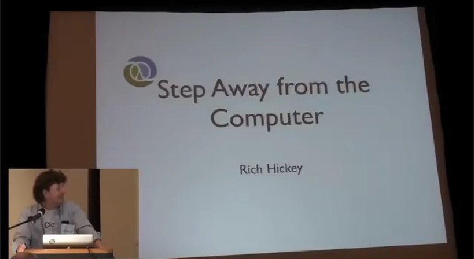
 
 Hi. As I said yesterday, I swapped the talks around so this is the more philosophical talk. There's multiple titles.
 
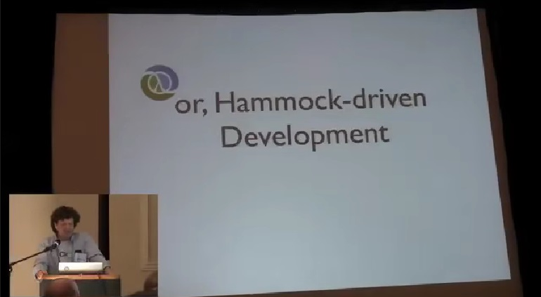
 
I couldn't decide. Some of them were semi-cranky.
 
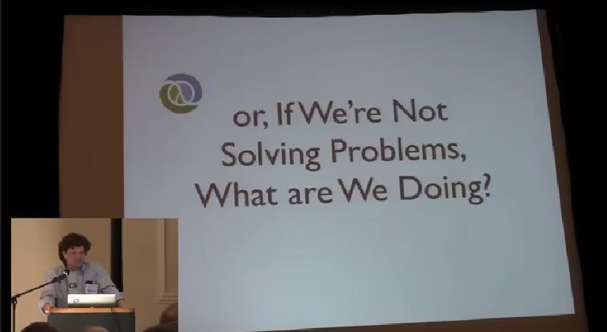
 
In those moments.
 
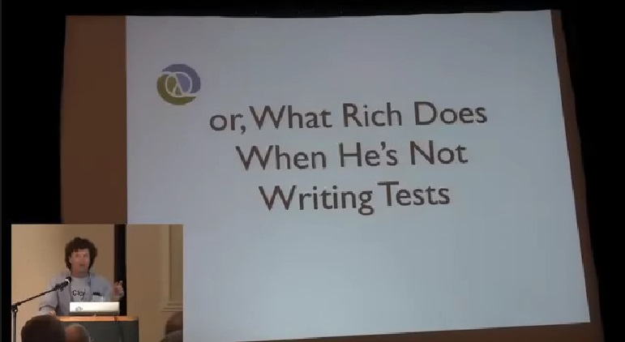
 
And then Mark gave me a great Phaedo [tbd] line.  So this is about
step one.
 
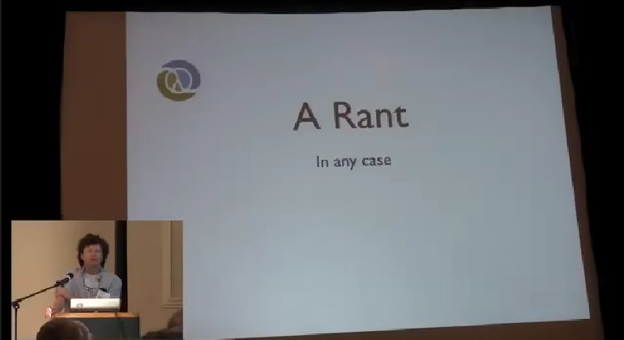
 
This is just an experience report.
 
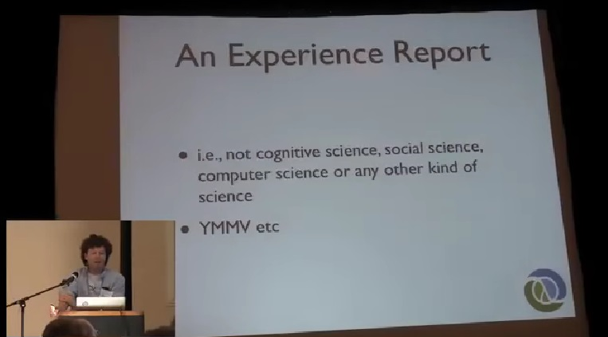
 
It's not advocacy, there's little methodology here or science or anything. So I'd like you to think about when was the last time...
 
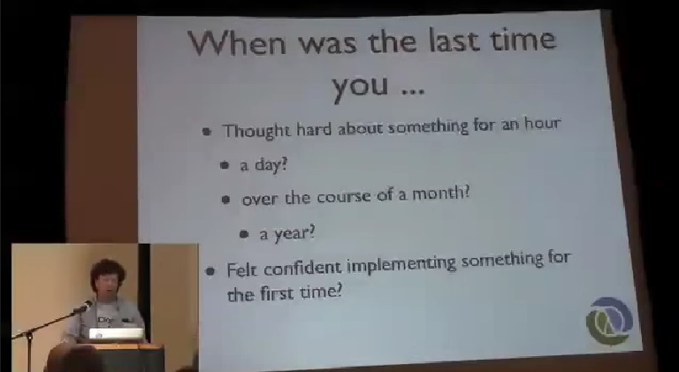
 
...you thought about something for an entire hour? Like nobody bothered you and you had an idea and you sat for an hour and thought about it. How about for a whole day? Does everybody remember the last time they sat and thought about something for a whole day? How about over a course of a month? You had something you were working on and obviously, not spending all the time every day when you started thinking for a month. Or a year? These are tremendously valuable moments if you get to have them at all. I consider myself extremely lucky to have had the ability to think about probably three different things for a year or more. One of them is Clojure. And there's nothing I prize more than that kind of time. The other thing I'd ask is when was the last time you felt confident trying to do something you had never done before and what do you think it takes to become confident doing something you've never done before? Obviously, as software developers, a lot of times we're doing the umpteenth application that takes something out of a database and puts it on the web, but the luckier you are, the more likely you are to encounter problems you've never done before and... How do you start doing that? And not feel incredibly at risk?
 

 
So I'll start by talking about some software development, you know, things we all know to be true. We hate bugs in our programs, we are trying to write quality programs and we know, if we let the programs reach the field, it's incredibly expensive to fix inadequacies and inaccuracies in the program. Right, so we'll say we'll have a big testing process in Quality Assurance and even that, we know, is not so great because it sort of has this removal, this distance from the development effort which is not good. So now, we know what to do in this area, right? We fix bugs while we're coding by testing in development, and this is the best way to avoid bugs in our applications, right?

No.

(Did you notice that I learned how to make each bullet happen one at a time? So now, you don't know what I'm going to say. It's awesome. It's got this menu item for it...)

 No, definitely, absolutely, positively not. The least expensive place to fix bugs is when you're designing your software... which everybody does, yes? (Mm-hmm.) I will contend of all the things I'm saying here which are very very extremely fuzzy, that without a doubt, most of the big problems we have with software are problems of misconception. We don't have a good idea of what we're doing before we do it. And then, **go**, go, go, go and we do everything. We have practices and all kinds of stuff, and we feel really good about ourselves after that point; but if you mess it up, as Mark said, in step one, it is not going to turn out well. They're not problems of implementation. There are problems of implementation, obviously; and testing and other things help with those. But problems of misconception are not generally addressed by testing or type systems or the things we use to correct defects in implementation. There aren't really type systems that can tell us if we've got a good idea or what we're doing addresses that idea.
 
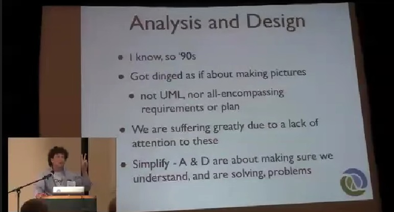
 
I'm going to talk a little bit about Analysis and Design. I know that's so 90s and ugly and was rightfully criticized and really dropped, because people considered it to be about process and drawing pictures and knowing everything about everything and making comprehensive plans in the Waterfall Model, and there was amazing amounts of stuff that was terrible about this. But that doesn't mean that the step before 'go do it' is not an important step. I think we don't spend enough time and energy or make enough time or get allocated time. It may not be a matter of our choice. We could say: oh, we would like to spend some time thinking about it but we have to ship something next week. But we are definitely suffering in quality because we don't spend enough time here. So what I'd like to do is sort of just whatever you think Analysis and Design is. I'd like you to just forget for the moment and let's try to make really simple definition. Analysis and Design is about two things, identifying some problem that we're trying to solve and assessing our proposed solution in terms of whether or not it solves that problem. That's really what it's about, not about anything else. We should be solving problems. We should not be building features.
 
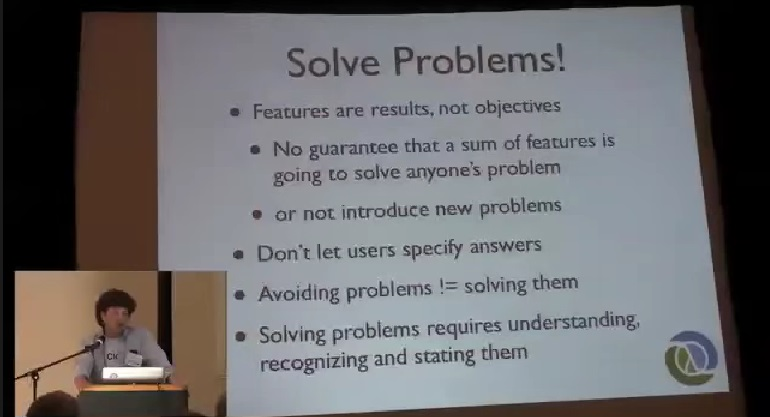
 
There's nothing about feature... what is feature? Feature is just an attribute of something. It's the shiny, you know, chrome knob on something. It's not the purpose of the car. There's no guarantee, if you put together a feature list, even if it comes from the customer, that it's going to solve their own problem or that it solves any problem, or that the features, when you put them together don't introduce a whole ton of other problems. So programming and writing software is not about completing lists of features. In particular, features provided by users, in spite of their best efforts to satisfy themselves, are often really not good ideas. You've got to dig underneath it and figure out what problem they have and that's the best solution to it, and then reconcile it with whatever they ask for. We also have a tendency, because we're all smart and we love being smart and sort of figuring out how to make things go that figuring out how to make something go is good no matter what it took to do it. If we can find a way to get around a problem, we're like, "Whew. That's great." And it's not great. Avoiding problems, which we're all capable of doing, very capable of doing, isn't the same as solving them. We should really try to work on solving problems. The thing that I'm going to talk about today is really that there is a bunch of technique and skill to solving problems and the first one is just to make an effort to understand the problem you're working on, to recognize, identify it, put it somewhere and talk about it.
 
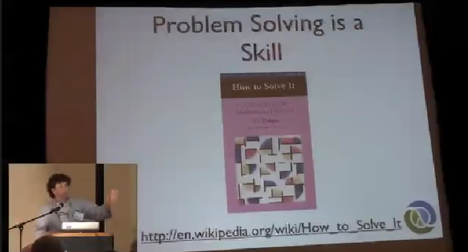
 
Problem solving is definitely a skill. I think you shouldn't take away from this talk that, you know, there's a certain kind of person who's good at problem solving and they get to this part of the job and we can practice these other things. You can practice this part. Polya wrote this amazing book called, 'How to Solve It' in 1945 or something which is about how to practice _how to practice_, and what are the techniques of solving math problems in this case. It's a terrific book, full of great insight and if you've never read it, **[go onto Amazon](https://www.amazon.com/gp/product/069111966X/)** right after my talk and order yourself a copy.

One of the things that's not so great about the book is that it is in the Math space, right? In that space, there's this really nice thing that happens. When you're done, you think you have an answer, you have all the techniques of mathematical proof to determine, if you actually have, whereas as software developers, we don't have that. There's no way to prove that you have a good solution to somebody's e-commerce site problem. There's no mathematical techniques and there's not going to be any anytime soon, that will let us do that.
 
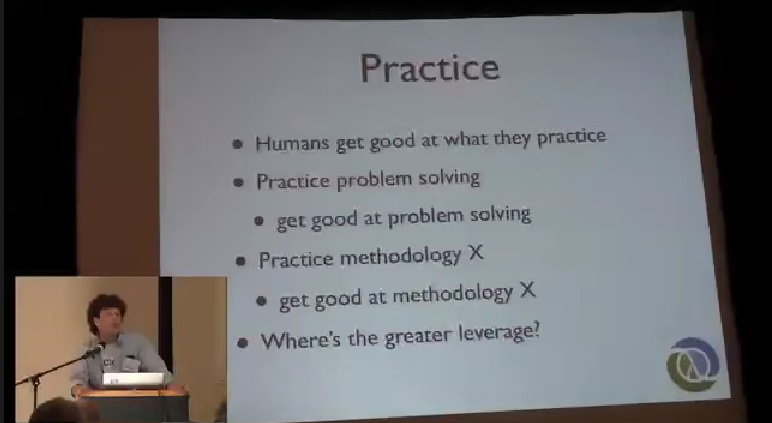
 
But it is a skill and it is something you can practice, something you can learn about. And it's worth doing right because as human beings, we get good at what we practice. It doesn't matter what it is. There's amazing examples. People practicing things that they seem to have no potential hope to become good at it and they get good at it because they practiced it. If you practice problem solving, really practice, you will get good at it. If you practice methodology X, you will get good at that. I'd like you to ask yourself, where do you think there's more leverage? I don't care what X is. Pick any X you want. Would you rather be good at it? Or the general skill of solving problems?
 
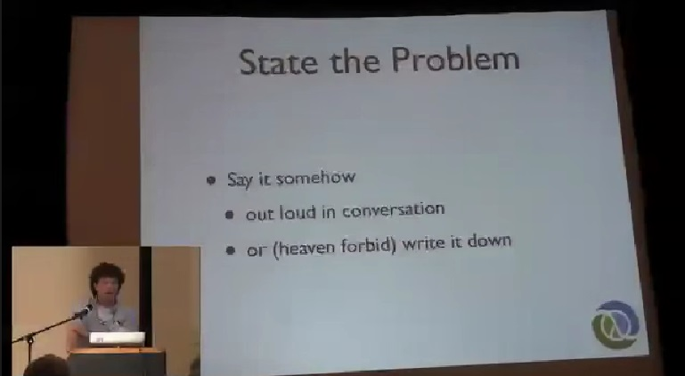
 
So what do we need to do? If we're going to work on solving problems, what is the activity like? The first thing is to actually say, "I am solving this problem. The problem is this blah, blah, blah, blah, blah and therefore, blah." I have seen so much software made where no one ever said that. No one ever wrote that down. Then, we have a whole system and no one said what problem it's supposed to solve. If we're not solving problems, I have no idea why we're in this room. We absolutely should be working on solving problems which means we should be enumerating what they are. And then from the mental standpoint, which I will talk about a little bit later, it is actually important to say them out loud. As the person who is trying to solve a problem, say it. Have a conversation with somebody in your group and say, "We need to solve this. The problem is blah, blah, blah." Rant or talk and have a little conversation, or write it down. It's just like you use the practice of repeating somebody's name when you're introduced to them as a mnemonic to help you remember their name. It's the same thing. This is the seed of solving the problem. It is stating it.
 
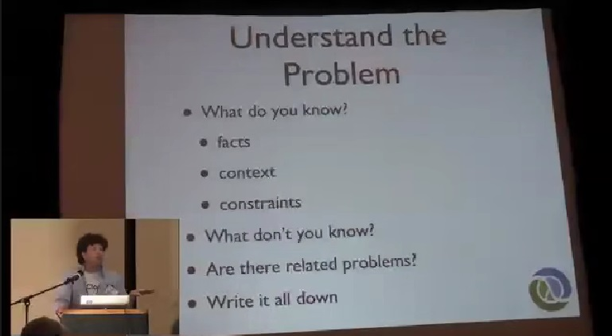
 
The next part which is definitely trickier, and Polya's book is great. It's got a lot of practical things. Many of these overlap what he said. It is to understand the problem, so we said, "We have this problem. I think we need a NoSQL database." There's something missing, right? "We have this problem. We need a NoSQL database." We haven't actually said why. What are the characteristics of this problem that lead us to this solution space? And this is where all the interesting work is, I think, in software development. So the first step is, what do you know about what you're trying to do? There's definitely going to be a bunch of facts. There will be customer requirements. There will be other things. There will be context, you know, the system has to run on this kind of box, run this long... It can't consume more than this many watts and has to support 10 million users, whatever it is. There are those kinds of things, and constraints. All the stuff are facts you know about what you're suppose to do. 

There will be things that right away you know you don't know. I wonder where we're going to get the data as an input to this thing? Or what are we going to do when our main data source for it isn't available? Do we have a secondary type? There will be things like that. Of course, there will be things that you don't know when you don't know. Well, that's fair but if there's things you don't know, you should think about them now. The other thing to do is to say, you know, everybody says, "Oh, do X. I have this great idea for X." As if you're the only person in the world that ever had this problem to solve. That's very, very unlikely so go find some other solutions to similar problems. Are there any others you know about? What can you find out about them? Because looking at other solutions to the same problem is the number one way to get up to speed really quickly and start working ahead of the best known solutions in this space because what you'll have to do then will just be an incremental step above what the last guy did. But if you're ignoring what the last guy did, you're starting from scratch so you definitely want to look around in the space.

Now, I'm not advocating methodology or anything but if you're going to bother to do all this work, you should write it down somehow, in some way. I don't care how.

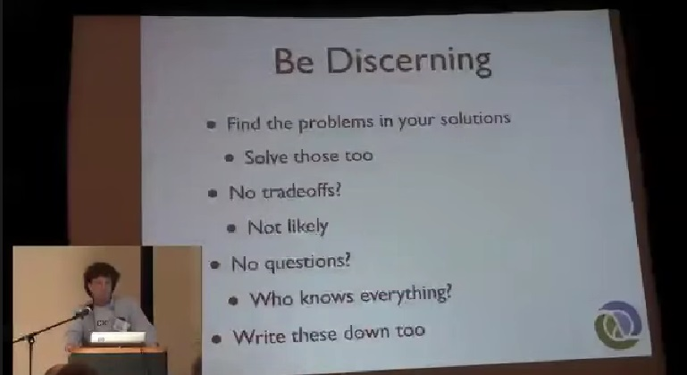
 
The other thing you have to do is you have to be discerning. You have to be critical. We're sort of in this world because there's this whole community stuff. It's like, I just hear awesome. I'd like awesome to happen. I just hear it 50 times a day. Not everything is awesome. So it's hard to talk about other people's stuff not being awesome so just, mainly, focus on your own stuff. In particular, as you're finding solutions, as you're trying to get on your way to a solution to a problem, look for defects in your own solution. Of course, you could have a whole talk about this because there will be technical errors. There will be errors in logic. There will also be errors of taste and judgement, abstraction and all those kinds of things. It all feeds into this, and there is an entire talk and this area. But whatever issues you can find in your own solutions, try to solve those too, right away, up front. So the other thing you see is, "Oh, we're going to do this." "We use a NoSQL database." "That's great. It has these 10 attributes. It's awesome." It's really easy to get excited about the good parts of what you do, but you should be looking for tradeoffs. The chances of there being no tradeoffs in any solution are slim. The other thing is just this, again, the 'what you don't know' thing. If there's stuff you know you don't know, there are questions you should be asking in order to find out what you don't know. You don't know everything so there should be question marks on this, whatever it is that you want to use that you are going to write all this stuff down. There should be question marks on that page. If there are no question marks, you're missing a step.
 
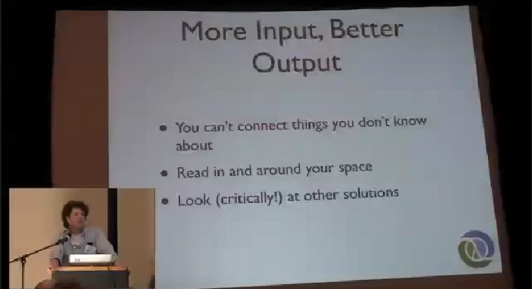
 
The other thing is you have to think about, you know, none of us are born knowing how to write software. None of us are born knowing about SQL or the characteristics of the web or protocols or anything else. And if you're trying to solve a problem, especially in a space where you haven't done it before, you're going to have a very limited ability to come up with a solution if you don't have a lot of input. You're going to need a lot of different inputs so that you can let your brain go around in between them and say, "Oh. Yeah, this idea and that idea are connected to each other and therefore, I can do this other thing." If you only take a really narrow slice up, "I see exactly what I'm doing right now, right this second to deliver next week." You're not going to have enough inputs to make decisions. So you want to read about the kind of space that you're in, widely, very specifically. Ooh, there are other people trying to do exactly the same thing and then, broadly that there's other characteristic problems and maybe, even if you want, go try to find research papers that are kind of in the same space. It's amazing the cool things you can find by searching something like ACM for papers about the kind of, it's like, "Oh, I wonder if we can get a certain kind of hash code that does whatever." You go into Google and type, 'hash code that does whatever.' Enter, and if there's some scholarly, ACM references, grab those papers. Even if you only understand like a tiny fraction of the paper, it's likely to contribute to your ability to think about your problem.
 
The other thing is even if you're not going to tell the other guy, when you're looking at other solutions, be extremely critical. I can't tell you how often you're going to find the next best idea by completely crucifying the last guy's idea. At least, in your own head. Take it apart because when you take it apart, you're going to find a couple of things maybe they didn't write down when they were doing it.
 

 
So everybody says design is about tradeoffs. Everybody knows this. Usually when they talk about tradeoffs in their software, they're talking about the parts of their software that suck. I had to make these tradeoffs. That is not what a tradeoff is, right? You have to look at, at least, two solutions to your problem. At least two, and you have to figure out what's good and bad about those things before you can say, "I made a tradeoff." So I really recommend that you do that, and when you do it, you might want to write that down somewhere.
 
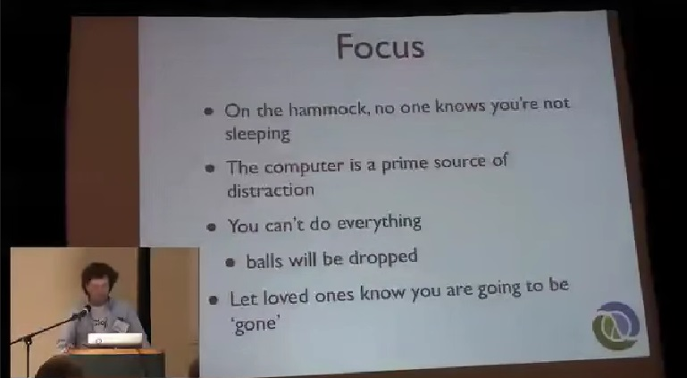
 
Okay. So let's talk a little bit more about practice. A big part of trying to do this work is maintaining your focus. We had a really nice talk yesterday about flow and that is kind of focused-related concept, and when you're trying to do design work, you also need... I think some of the most extreme focus you're going to ever need. And so there's some cool aspects to the hammock. One of the cool aspects to a hammock is that you can go on a hammock and you can close your eyes and no one knows that you're not sleeping but they won't bother you be cause they think you might be sleeping. So it's very cool. Computers are bad, bad sources of distraction. They are so bad especially for people like us. It's just like, uh... something else besides what I'm trying to think about. You desperately need to get away from the computer if you're trying to focus. It's almost impossible to focus sitting at a computer. The other thing about focus is that you're going to be making tradeoffs when you try to focus really intensely. You're going to drop balls. You're going to miss calling people back and responding to emails, and doing your slides for conferences until the airport on the way there and things like that. That's just the game. The one thing though is that you should communicate to people that you care about, about this process. And the fact that when you're doing it, you're going to seem pretty far away and that's not a comment about the person that you care about. It's just the nature of doing this kind of work, so it is important to sort of do it. A lot of people will not get time to do this all day every day, or over the course of an entire week, but if you're going to get some focus time, define what that is. Everybody knows about time-out time for little kids. Well, programmers need this focus time so like little kids, they need to go sit on the hammock and have nobody bother them.
 
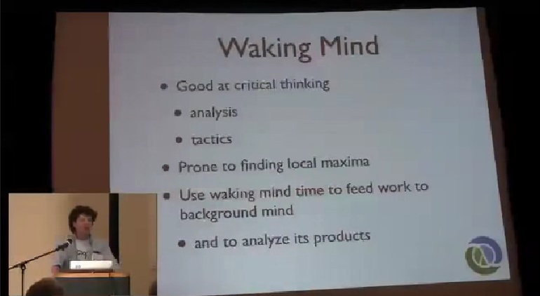
 
So for me, personally, I think that the process involves two parts of your mind and this is the stuff that you're seeing in books written about this or whatever. I haven't read them but they seem to correspond to my personal experience which is that, you sort of have this waking mind and background. And your waking mind is really good at that criticizing part. It's extremely analytical and it's very, very good at tactics. Like right now, we need to make a decision, the lion is chasing after us, jump left. We are really good at that. That's what our waking mind is about, about keeping us alive and making short-term decisions, and looking at the immediately present information and doing something about it. However, if you think you're going to sit down and look at a problem for the first time and stare at your computer and do whatever and have a conversation for 10 minutes, and make a really great decision. I don't think so. I know I can't do that. Definitely not. The problem with this kind of thing is it tends to push uphill, "Oh, I see this. Oh, I see that. Oh, I see... okay, here I have a choice of left and right. I can go right, okay, that's more up. Left or right, right. You know, left does more up." This part of your thinking is really good at finding the local maximum, but it's not very good at getting off the track it's on, and finding that there's another hill over there that really takes you higher. But there's a very, very critical activity that you have to engage in and I think that if you want to use your entire brain and become very good at problem-solving, and that is, to think about using your waking time to assign tasks to your background mind, to actually think hard about something and create work for your background mind. That really is the point of the hammock and all this listing and all this work that we're going to talk about you're going to do when you're awake, is actually to give the other half of you stuff to do.

The other good thing about your waking mind is when you do think that you have a great idea that you have come up with in your background mind, your waking mind is good at picking it apart, saying, "Ah. You thought you woke up with this brilliant idea but now, I'm seeing this characteristic of it that seems not so brilliant."
 
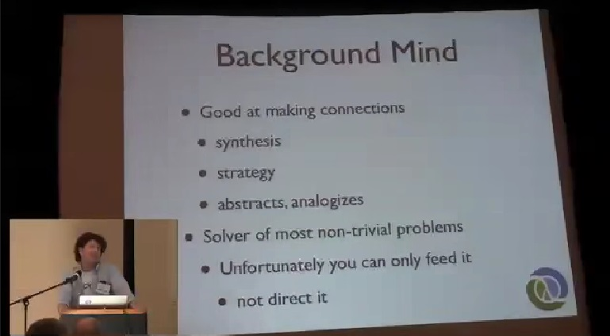
 
So let's talk about the background mind. I'm not going to directly equate it with the sleeping mind, but the sleeping mind is the number one instance of background mind. You can find access to your background mind during the day while you're awake but it's tricky. It's good at making connections. The kind of thing like, if I leave my... If I make a hut out of mud and it rains hard, it will disintegrate. It's not necessarily the thing that you can tactfully figure out, your background mind is going to know aspects of all those different components and make the connections and synthesize them. Even when you think you're really hot at making decisions on the fly, you're almost always just regurgitating something your background mind has already figured out. So the background mind is good at synthesizing things. It's good about strategy. And so when Mark talks about abstractions and things like that, abstractions are software strategy because the idea there is you're making some super global decision that's going to need to be correct in a whole bunch of contexts in which you can't make tactical decisions yet.
 
Now, what does it mean to make an abstraction you're going to derive libraries from? What does it mean to put something in a programming language when I had no idea what you guys are going to do with it? It's a more strategic kind of thing. You don't build programming languages and say, "How did this programming language deal with HTTP requests?" And what you want to do is give Mark something that he can use when he's got tactical decision to make about HTTP requests. And that's just strategic kind of thinking. Your background mind is good at strategic thinking. If you want to do abstraction, you have to find time to do this thinking because that's the part of your brain it comes from. It does abstraction, it draws analogies. I think this is where you solve most non-trivial problems. You can make good decisions in the moment otherwise, but if you're really trying to solve something hard, you've got to engage the other half of your head. So I'm not just saying this.
 
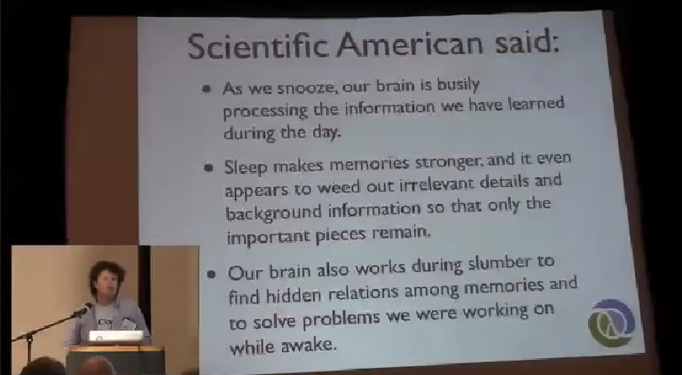
 
Scientific American said that when we're sleeping, we process the information during the day because that's pretty obvious. Sleep reinforces memory which is good. I mean, it is important to remember what you're working on, but more importantly, it is a great sorter out of things. So we had this whole... I just advocated taking a lot of input. Taking a lot of input, doing all this analysis of the requirements in the space, doing all the reading, looking at competitive solutions and tearing them apart. There's this ton of stuff. When are you going to decide what about that is important and what isn't? When you're asleep. That's what happens. Evolution has solved this problem for us and that's the solution they came up with. We can't ignore it. We have to use it. But the most critical thing is this one, finding hidden relations and solving problems we were working on. So imagine if somebody says, "I have this problem of this, that, that, that, that, that." And you will look at it for 10 minutes and say, "Okay, I'm going to go out to the movies and do something else or whatever." Then, you go to sleep. Are you going to solve that problem in your sleep? No. And you didn't think about it, did you? No, you didn't think about it. You didn't think about it hard enough while you were awake for it to become important to your mind when you're asleep. And this goes back to that feeding your background mind thing. You really have to work hard just think, not typing it in. Just thinking about a problem during the day so that it becomes an agenda item for your background mind. That's how it works.
 
It's when people are out there and they're like, "Oh my God. How am I going to find food and this is happening there but I know I saw elk over there and they seem to be by the water sometimes, or whatever." That's when you wake up as a caveman and say, "Let's go hunt for animals by the water." It's not a logical deduction. It seems like that when your foreground mind is analyzing it. There's no logic for that necessarily. It's really a process of this very parallel kind of thinking. So this is very important.
 
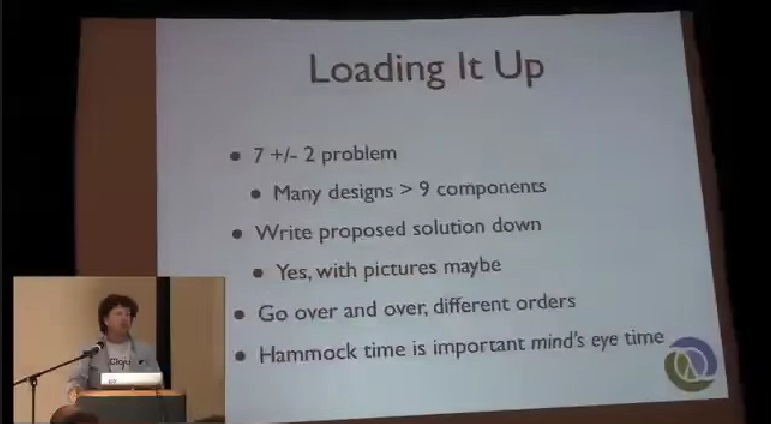
 
So we have a problem, in general, because we're just being asked to write software that's more and more complex as time goes by. And we know there's a 7 +/- 2 sort of working memory limit and as smart as any of us are, we all suffer from the same limit but the problems that we are called upon to solve are much bigger than that. So what do we do if we can't think the whole thing in our head at the same time? How can we work on a problem with more than nine components. What I'm going to recommend is that you write all the bits down especially now, you've written a lot down about the problem. You know what the problem is, you know a lot of facts about it, you know the constraints about it, where it runs. You know you've asked yourself those questions. You wrote them down. I wish I knew blah. You looked at competitive things and said, "That looks great over here but that part of that competitive thing sucks. I hate that. I wish that wasn't there." You gave this huge agenda to your background mind and when you're trying to load it up, you need to survey, and that's the point of writing it all down before. If you've written all the stuff down including some sketch of how you want to solve the problem, you can go and just sort of jump around and look at that. And sort of like, you know, how many balls can you juggle? "Well, I can only juggle so many but I can't juggle at all." But if we look at the 7 +/- 2 thing, we could say we can juggle seven to nine balls but if you can imagine having an assistant who every now and then can take one of those out and put a different color in and you can juggle balls of 20 different colors at the same time as long as there are only nine in the air at any one point in time. And that's what you're doing, you're going to sort of look around at all these pieces and shift arbitrary shapes of seven into your head at different points in time. Maybe you'll draw pictures. Don't use a UML tool to do this. It's not a methodology. So go over and over. But then, you must again step away from the computer. 

There's another really important part of doing this which is go and sit somewhere and have no input, and close your eyes and not go to sleep. Close your eyes, because we have this other thing. Everybody knows what it is. It's really hard to describe it, but does everybody have a concept of their own mind's eye? What you see when you close your eyes and you start thinking about something. It's this weird, I mean, it's not actually technically visual, though some people are really vibrantly visual. I know, for me, it's... I don't know. I can't describe it but it's not very realistic. But you need to do that. That part is important for your brain because at that point, you're switching out of a sort of input reception mode. If you just look at your list, you're sort of in the mode of, "I'm getting input." But when you're sitting and contemplating something, and hashing it over in your head, you don't have any other input which means you're exercising the recall. I've looked at those 20 points. Let's just say it was 20. I've looked at those 20 points over and over and over again and I jumped around with input between them. Now, I close my eyes and I'm trying to recall them and think about them a little bit more in my head, and you're going to find if you've done the last step going over and over, you will actually be able to sit on a hammock and pull all the different parts of a fairly large problem in and out of your head, admittedly maybe one at a time, and think about them that way. That exercise is really, really important. I don't know why, it just is because it forces this recall thing that definitely makes those agenda items for your background mind. So we call that mind's eye time.
 
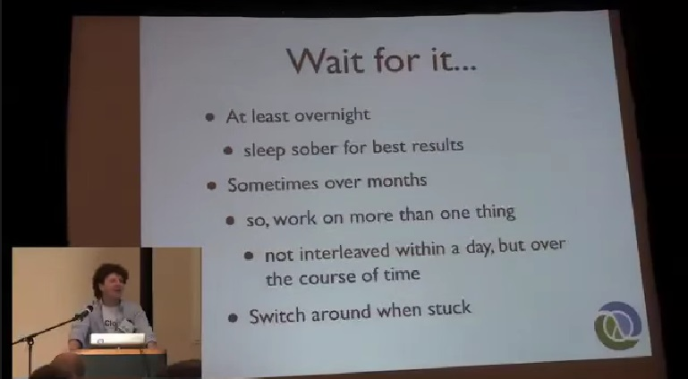
 
Now, you're done. Cake is in the oven. You just have to wait. It's so good. One of the things I would say is at least wait overnight. No matter how you and your buddies talk about it and you just feel like such a hotshot today, "I have got this thing." Yup, sleep on it at least one night. At least, if it's an important decision. Now, how many people woke up this morning with the answer to a heart problem? You see? It's science. Science at work. No, it's really kind of an unfortunate thing. If you're not thinking about this, you think what happened? "I worked hard all day." Like, "I'm done working. Time to relax." Unfortunately, if you believe in what I'm saying today, you're actually doing something kind of important when you're sleeping. So occasionally, you really have to give your brain a chance to do that other part of the job. If you always deny it, I don't think you're going to have the best results.
 
Unfortunately, sometimes, overnight is not enough. Some big problems, especially finding really good abstractions or finding answers to things that satisfy a bunch of simultaneous constraints. Take a long time, it just does. And I know, everybody has to ship and everything else. In that case, a lot of what I'm saying doesn't apply and like I said before, I consider a huge opportunity when I get an extended amount of time to think about a problem because I know I'll come up with a better answer. But one of the ways that you can deal with this and not get stymied like, "Well, let me just think about that for 3 months." Because most managers are not incredibly receptive to that sentence. Just work on more than one thing not inside one day. Try to work on one thing each day but if over the course of time, you have like three projects, it's quite possible to load one up and work on it for three days. And you're not finding answers to any of your question mark items or able to enumerate new possibilities, so you're kind of stuck a little bit. Just switch to another project and do that for a few days. You have to amortize the loading up time that can take between an hour and an entire day to load up something, so once you've done that, you try to get at least the rest of the day or three days or more on it, but don't get hung up about the stuck thing. Just switch. Don't stay stuck. Switch. Or get more input, talk about it more. You've got to keep stimulating the pathway. Don't stay stuck on it.
 
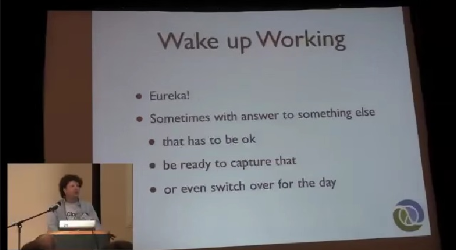
 
Then, yeah. Then, eventually, the cake comes out of the oven. You wake up and you have a great idea. You think you know the answer to your problem or you have a good idea for a solution. Unfortunately, sometimes, you have an answer to not the problem you were working on. You were working on three projects and you loaded up Project C, and you woke up with the answer to Project A. That has to be okay. Just switch and take advantage of it, at least capture it. Now, if you wake up to an answer with some other thing that you can't work on that day, capture the results of the background process. They're really useful.
 
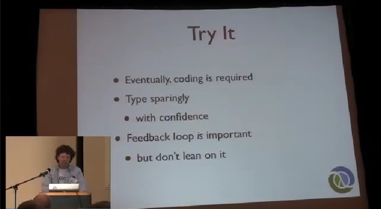
 
Finally, you do have to take your great ideas and figure out if they're actually great by either analyzing them more which is certainly important but sometimes, you just have to write them and type them into your computer. Actually, we all have to do this. You do, eventually, have to code. It's fun, Stu has this great - he's seen some of my design sheets (motions of folding something open) - what does he call it, "document of despair" or something. It seemed to be all like, you can't do this and work like that, question marks, blah, blahs. Only thing is it's just like that. It's all negative but it's all challenges to the problem solving process. It's not like despairing. It's positive, it's saying, "I know what my challenges are and therefore, I can work on them." But you spit this thing out, now, you have something so you tried it... Try to avoid a lot of typing. I know I do because if I know that I've got an answer and the answer is small, that's one of the most telling attributes that is probably good.

What I would hope from doing this whole process is that you gain confidence in it after you've seen it work for you. So that you say, "You know what, I have never done this before but I really have thought about it and this solution I came up with overnight feels awesome. Let's go." It is important to look at what you did and to run it and see, and find out new things about the solution and say, "Oh, you know what I had this supposition. It's not correct. I thought it would have this characteristic. It doesn't, etc., etc." I am not advocating the Waterfall Model. You're going to try stuff and go back, that's fine, but don't lean on this. Test-driven dentistry, I don't think I could come up with a better thing. Now, we can't really do that.
 
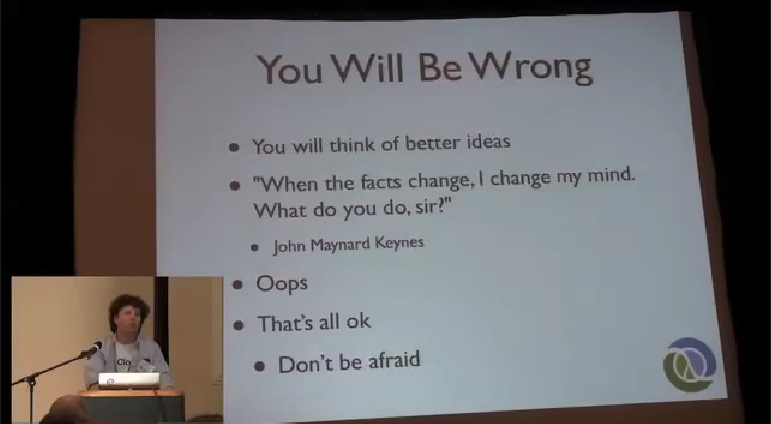
 
The last thing is you are going to be wrong. I'm frequently wrong. That's part of the game. You're going to think of better ideas. I think that's one of the most exciting things. I think no matter what I ever thought of, the fact that I know, I'm going to think of something better as much as it will suck a little bit because I know I delivered something that was not the best, means that I'm still going. It is still working. So you will think of better ideas.

Also, the facts change. It can change because of two reasons, right? One, you missed some of them early on so they're new to you because you skipped them. What else do we have? Changing requirements. It's just... we all know this. The facts will change. When the facts change, do not dig in. Do it over again and see if your answer is still valid in the context of the new requirements, the new facts. And if it isn't, change your mind. Don't apologize. Sometimes, you'll just make mistakes, errors on logic or you just get it wrong. That's fine. If I could advocate anything, that's 'Do not be afraid' especially, 'do not be afraid of being wrong.'
 
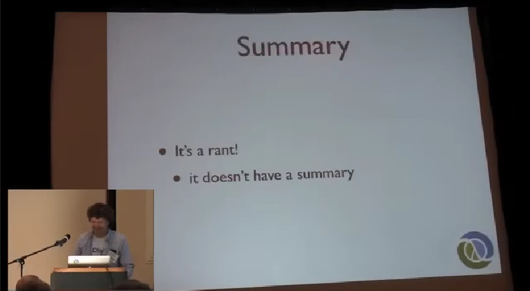
 
So in summary, this was a rant. There's no summary.
 
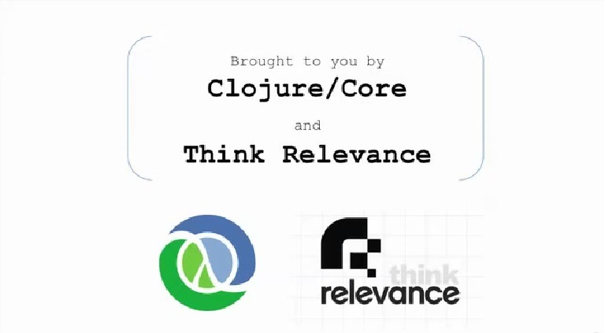
