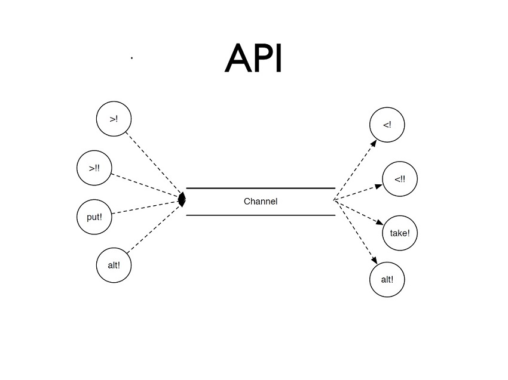
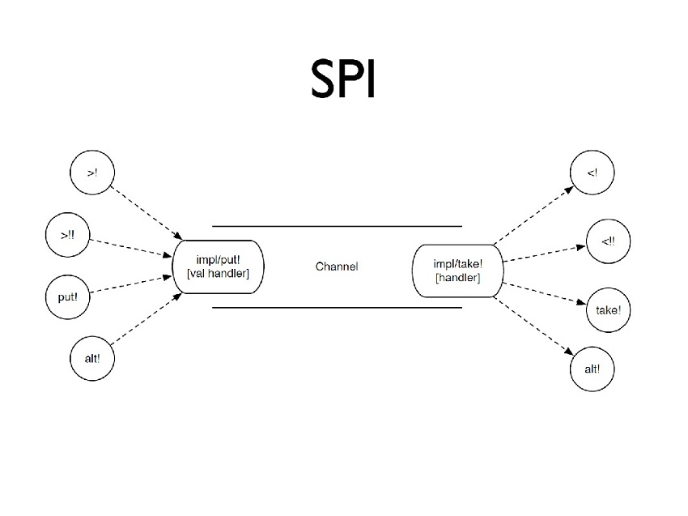
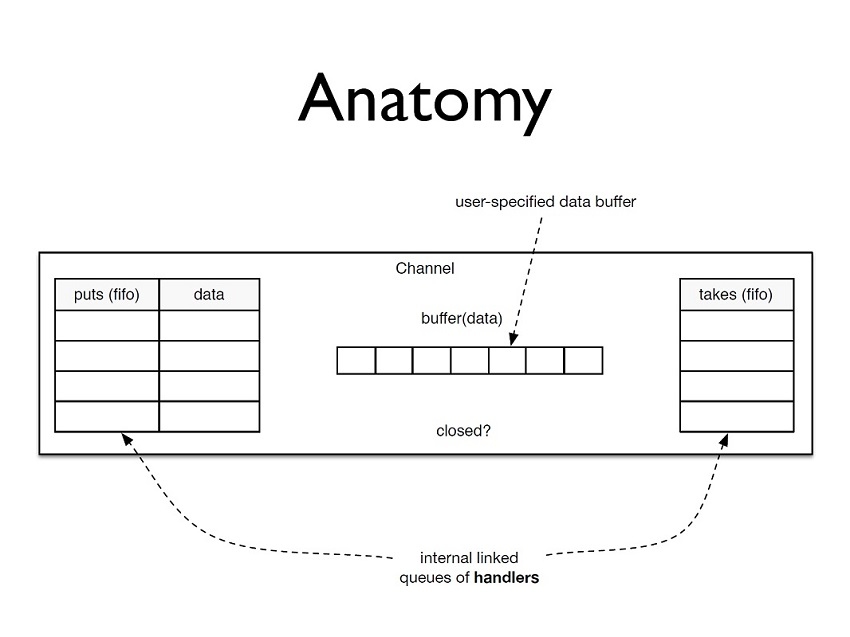
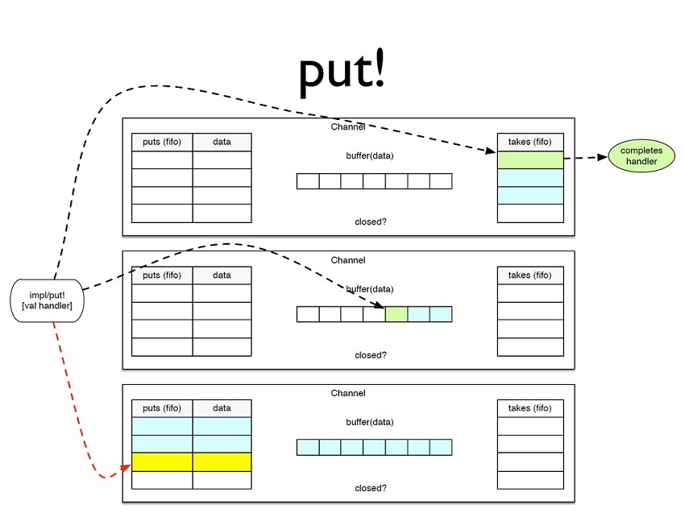
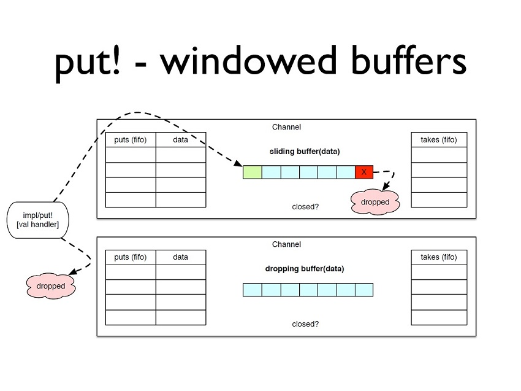
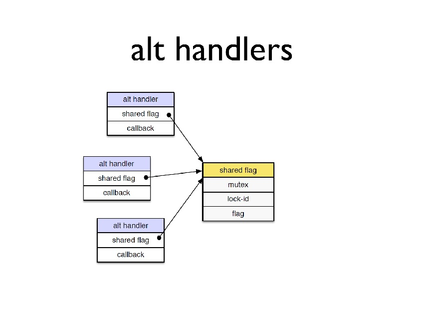
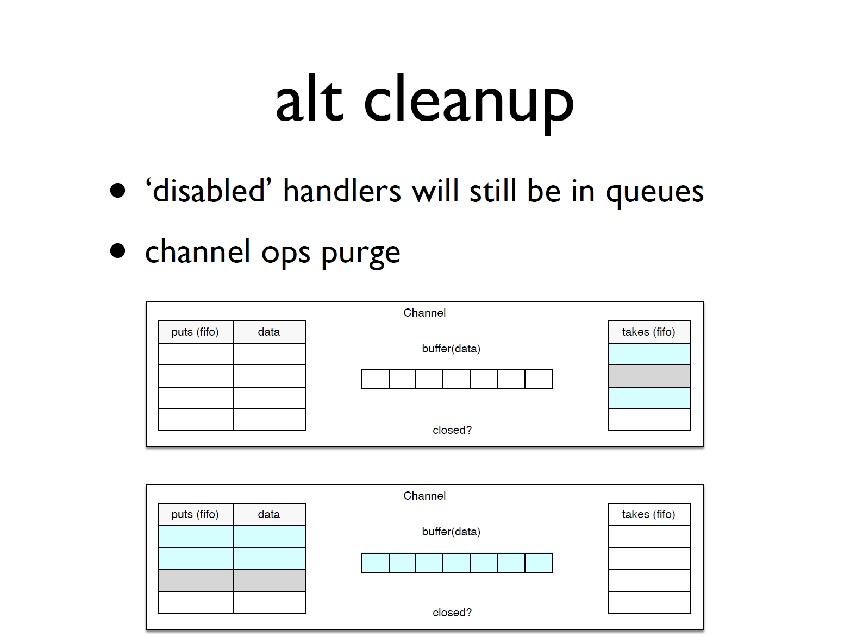
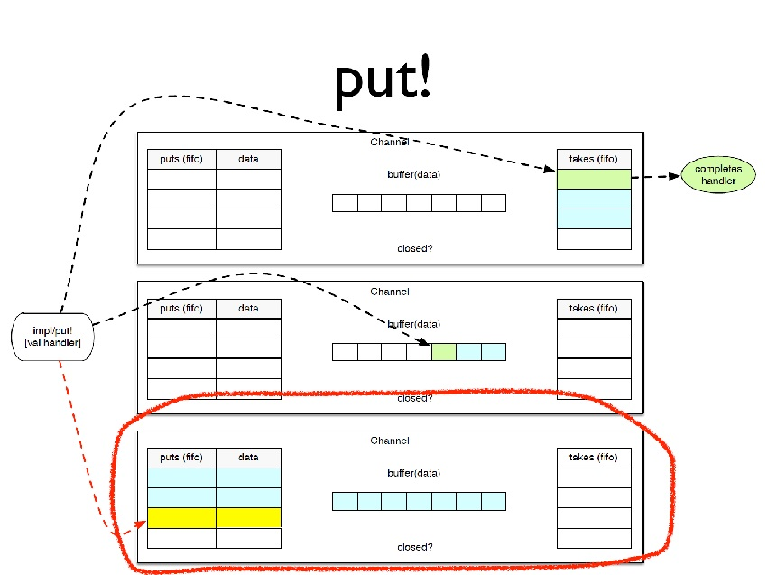
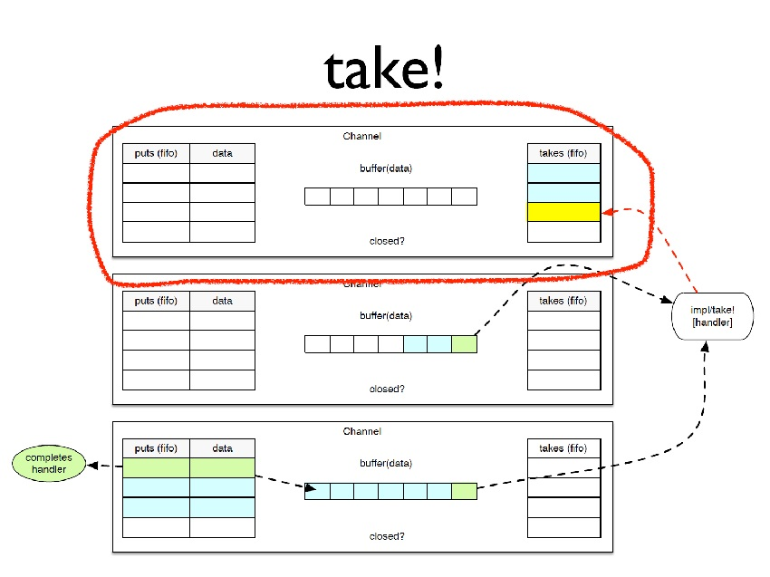
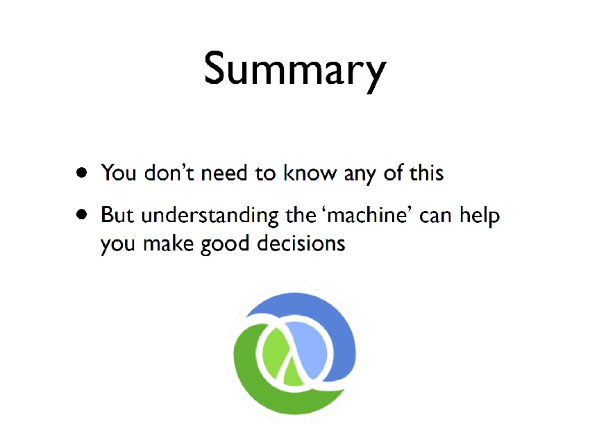

# Implementation details of core.async Channels

* **Speaker: Rich Hickey**
* **Conference: [EuroClojure](http://euroclojure.com/2014/) - June 2014**
* **Video: [https://vimeo.com/100518968](https://vimeo.com/100518968)**

[Time 0:00:00]

```
slide title: Inside core.async Channels

Rich Hickey
```

All right; now to the task at hand.

[Time 0:00:04]

```
slide title: Warning!

+ Implementation details
+ Subject to change
```

So, what I want to talk about today is sort of some of the
implementation details of core.async channels, mostly just so that
more people know about them and how it works.  And, as a point of
interest.  And I was looking forward to giving a technical talk as
opposed to trying to be inspirational.

So, implementation details - oh, there is something else I want to say
about the prior talk.  Everything about that may be class loader or
whatever.  In the fast load branch, there is now a cache in front of
that, and that is no longer a hotspot for the compiler.  So if you
just look in that branch, you will see that it is already been
improved and that will be in the next version of Clojure.  There is a
bunch of other optimizations in the fast load branch, which will be
interesting to people who want Clojure to load faster.

So there are going to be implementation details in this talk.  So this
is not something you want to marry, or really get fixated upon.  All
of it is subject to change.  We are still not really advertising some
of the protocols I am going to be talking about as extension points,
but it is useful to understand how they work for you as a user of the
library.

[Time 0:01:13]

```
slide title: The Problems

+ Single channel implementation
+ For use from both dedicated threads and go threads
  simultaneously, on same channel
+ alt and atomicity
+ multi-read/write
+ concurrency
```

So these are the problems we are trying to solve, or I was trying to
solve, in taking on channels.  The idea was to support both genuine
threads and lightweight threads.  But I knew a couple things that I
wanted to do.

One was support a single implementation of a channel.  That was to
say, there is one channel and, whether you were consuming or producing
for it with genuine threads or with the lightweight go threads, should
be independent.  We do not care.  And it should be able to support
readers and writers from either side, so there is a strict
orthogonality between the channel itself and the consumers and
producers, and the thread stuff that is in core.async, which I am not
going to talk about too much.

So we want to be able to use from both dedicated threads and go
threads simultaneously with the same channel.  The other thing I
wanted to support was alt with full atomicity.  If you had ever looked
at some of the Java CSP libraries, alt was something that was sort of
not really that great.  And so we wanted to do that, and that is a
little bit tricky to do atomically.

We want to support multi-reader and multi-writer and make sure all the
concurrency is correct.  And like most of the other Clojure
constructs, we make it so that the construct deals with all the ick of
threads and mutexes and things like that, and that you do not have to.
Part of the value proposition is that that stuff is sort of in there
already.  You know, I write it so you do not have to.

Of course, I am going to be focusing on the Java channel
implementation, the ClojureScript one is similar, but it does not
actually have a lot of the concurrency challenges because there is
only one thread in the JavaScript engine.

[Time 0:03:02]

```
slide title: API
```


So, how many people are using core.async?  Yeah.  Love it.  And how
many people have heard about it?  Right.  I am not actually going to
describe core.async at the API level at all today, so I apologize if
some of this surface stuff is not familiar to you yet.  But the basic
idea is that there are these channels, and you can put stuff in one
end of the channel and you can get stuff out of the other end.

The fundamental operations are: this sort of lightweight parking
input; a blocking input, which blocks a real thread; a non-threaded
put.  This is sort of their external entry point to a channel if you
are writing a callback handler.  Put bang (put!) is the right way to
get data in.  You do not need to start up a thread or a go block.  In
fact, you should not.  You should just use put.

And alt, which is sort of the underpinnings of the multi-operation
thing.  Alt is really the great feature of modern CSP implementations
where you can have more than one operation that you initiate, and what
you will know is that, at most, one of those operations will complete.
And none of the other operations will do anything.  And this is sort
of like an algorithmic select, if you will.  It is the equivalent of
the Unix socket capabilities.

And you have alt on both ends.  And on the other end, you have the
same thing.  You take stuff out of the channel.  It is not an RPC
mechanism.  It is just a conveyor belt.  Put stuff on one end of the
conveyor belt; you take stuff off the other end.

So that is the application programmer's interface through a channel.
But like most things, there is usually another level of interface
below.

And if you have not heard me or someone talk about using protocols,
that protocols are for service provider interfaces, that is what that
is about.  So a lot of the functions up here, they are ordinary
functions.  And the functions down here are functions on a protocol.
And it is the contract between those API functions and any
implementation of a channel.  It happens to be the case that there is
one really first class, full implementation of channel and some other
lightweight stub-like things to help with some of the mixers and some
of the other mults and things that we have in the API.  But the
multi-reader, multi-writer channel is what I am going to be talking
about today.

[Time 0:05:37]

```
slide title: SPI
```


So the service provider interface basically boils down all of the
things you can do with either end of the channel to two things: the
impl/put! and impl/take!  impl/put! takes the value you want to put
and a handler.  And for now, you can think about that handler as just
a callback.  And impl/take!, similarly, returns something from the
thing and it takes as an argument, again, a callback.

And I will explain the insides of handlers in a minute.  And you can
define all of those operations in terms of one of those two, or more
than one of those operations.  So alt! can put and take in the same
alt!  You can try to get some stuff, and try to put some stuff, and
see what happens.

[Time 0:06:23]



So, what is inside a channel?  Well, when you use the channel API, you
create a channel.  You are able to say whether or not it takes a
buffer, and you can supply an "and" and a buffer will be created, or
you can actually hand in a buffer, and there are a few flavors of
buffers.  There are fixed buffers, and there are windowed buffers,
which I will talk about later.  So inside the channel, obviously, it
is got to keep track of that buffer you handed it, and that is the
thing in the middle.  And the thing that is in the buffer is always
data.  It is what was put on the channel: data values.

But if you think about the fact that the way channels work is with
synchrony, right, so by default there is no buffer, and a reader has
to wait for a writer or a writer has to wait for a reader, and then
there is this synchronous flow of control, that means that they have
to wait somewhere.

And in particular, when you have multiple readers and multiple
writers, they have to wait somewhere.  So it ends up that there are,
inside any channel, two queues, if you will, of pending operations.
This is not just about the data.  It is about the operation not yet
completed.  And they are just linked lists, but they are internal to
the channel and managed by it.  You cannot really touch them.  But
they will accumulate operations in the case that no one is available
or there is not buffering available.

It is very important that you distinguish these lists of operations
from the buffer of data.  And I hope, in this talk, if you take away
nothing else, that you get a good grip on how that works with
channels.

[Time 0:08:03]

```
slide title: Invariants

+ Never pending puts and takes
+ Never takes and anything in buffer
+ Never puts and room in buffer
+ take! and put! use channel mutex
+ no global mutex
```

So there are a bunch of things that have to remain true in
implementing this and getting it right.  And some, they just fall out
of the logic of it.  What we said was somebody trying to take has to
wait for somebody to put, or vice versa.  That means that there should
never be a situation in which there are both pending puts and takes
because they would have found each other.  You cannot have both people
waiting to put and people waiting to take.  If it is working, they
should have met.  They should have agreed to do a transfer.

You should never have pending takes if there is anything in the
buffer.  Because why is it in the buffer then?  Somebody came in to
take, and you queued them.  You should have given them something from
the buffer, so that should never happen.

There should never be puts that wait in that queue if there is room in
the buffer.  If there is a buffer and there is room in it, a put
should go and put something in the buffer and finish, not go into the
waiting room.

Take and put is not an invariant, except it is part of the design.
Take and put use a channel wide mutex to work.  And you will see that
there are actually very few conflicting states.

The other thing is, we do not want any global mutexes.  At no point
should there be some core.async wide mutex, or even multi-channel
mutual exclusion.  And I will show you a little bit more about that
later.

[Time 0:09:33]

```
slide title: put!
```



So what can happen?  What are the scenarios?  If we take this internal
model and look at the scenarios for put, a few things could happen.
In the first case, we have a put coming in, and it encounters a
channel where there are one or more waiting take operations.  At that
point it immediately completes that waiting take, the first one in the
queue.  It says, okay, you are waiting for data.  I have data.  We are
both good to go.  And the put returns immediately, and the take's
handler gets completed.  And I will explain handlers and completion in
a little bit.  So that is that scenario.

The next scenario is, well, there is stuff in the buffer.  If there is
stuff in the buffer and there is room in the buffer, we know there can
be no pending takes and puts due to the invariants I just described.
So the put is going to come in and say, room in the buffer.  I will
put my stuff there and I am out of here.  I am finished.  So in that
case as well, put succeeds and sort of immediately completes.

And the last scenario is that either there is no buffer, or the buffer
is full.  But you can describe both those cases as being there is no
room in the buffer.  So a putter comes in, got us some new
information.  There is nowhere for it to go.  In that case, the put
gets enqueued.  The put operation gets enqueued.

So you will see that there are two columns in this queue, because what
we have to hang onto is both the data that we want to eventually
convey, which we have not yet conveyed - we actually really have not
succeeded in putting it in the channel - and the handler that we need
to communicate with, when and if that ever gets into the channel.

So there are two things always on the left-hand side.  And you will
see the red arrow here implies something I will talk more about later,
which is: this is actually the only case of these scenarios where we
are going to have that parking effect or blocking effect because we
cannot finish this job right now.  There is nowhere to put this stuff.

[Time 0:11:48]

```
slide title: put! - windowed buffers
```



I talked about the fact that there are these other buffers that are
available.  They are both kinds of windowing buffers.  Basically, they
cannot keep everything, but their purpose in life is to make sure that
you have installed a policy such that, especially if you are getting
raw data from some external source, and you are using put bang (put!),
there is no backpressure on put bang (put!).  All those put bangs
(put!) where do they go?  Well, they just go in that queue.  So it is
a bad design for you to sort of not take care of.  What should happen
if I cannot keep up?

One of the ways you can take care of not being able to keep up is to
implement backpressure by using a blocking construct on the entry
point.  The other is just to use one of these windowed buffers, which
say: I know what I should do.  If I cannot keep up, I only want the
latest information.  And that is the first case.  That is the sliding
buffer.  That says the latest information takes priority.  If you come
in with some new data, we are going to drop the first thing in the
sliding window.  So basically what happens is the first thing in the
buffer, it gets dropped.

That means some piece of information that somebody successfully put in
the channel gets thrown away.  Their operation completed, but this
policy says I have determined that I do not care if anybody ever sees
that.  It is more important to me to manage memory and to stay up to
date than it is for every piece of information to get processed.  And
the way I am going to do that is by dropping the oldest stuff.  So
that means there is room and the data goes into the buffer.

The other form of windowed buffer is one that says: once the buffer is
full, anything new that comes in, throw that away.  That is the
dropping buffer, in which case you just come in, and it says, okay,
thanks for that data.  I just dropped it on the floor, but you are
good to go.  Your operation has completed and you are fine.

These are both good, and I anticipate we will have more sophisticated
policy-based buffers, but a policy-based buffer is a great way to sort
of say up front: this is what I want to have happen in this scenario,
as opposed to sort of saying later, "Wow, I wonder why this is not
working?"  So both those cases, from the perspective of the person
putting, they complete right away.

[Time 0:14:06]

```
slide title: take!
```


All right, and I will take the other side.  Really, it is the same
three possible states of channels.  What happens when you take off of
those three scenarios?  In the first case, there are already people
waiting, and there is nothing in the buffer.  If I asked to take, my
request has to wait.  There is nothing to take.  We have no stuff.
There is nobody waiting to write, and there is nothing in the buffer,
so your take gets enqueued.

The only thing that gets enqueued there is the handler.  There is no
data associated with the take, so that is a single column queue.  Just
enqueue the handler associated with the take.  And that has got the
red arrow.  That is where that operation will park the thread that
requests it.

In the next scenario, we have some data in the buffer, so we are going
to hand that to the taker, and that will immediately complete.  It
will get the first thing out of the buffer.

And in the third scenario, there might be no buffer, or the buffer is
full, and there are pending writer puts.  In that case you will get
something.  You may get the first thing out of the buffer or, if there
is no buffer, you will get the thing from the first waiting put.  But
what will happen is you will get something as the taker, and the first
waiting put will complete.

They may complete and hand it to you if there is no buffer, or they
may complete and put it at the end of the buffer, as what is shown in
this diagram.  But that is another case where somebody is completing.
So there is a correspondence between the red arrows in one case and
the green completes handler in the other.  That is sort of the magic
of making this work.

[Time 0:15:55]

```
slide title: close!

+ all pending takes complete with nil (closed)
+ subsequent puts complete with nil (already closed)
+ subsequent takes consume ordinarily until empty
  any pending puts complete with true
  takes then complete with nil
```

There is the third operation, which is somewhat orthogonal to the
rest, which is closing the channel.  When we close a channel, all the
pending takes complete right away with nil.  You have got nothing.
And if there are pending takes, it means there was nothing in the
buffer, and there is no pending reads due to that earlier invariant.

If you put later, you get nil.  That is the already closed signifier,
which is new.  I do not know how long ago we added it, but it was
something people wanted to know.  Like, am I right?  Am I wasting my
time writing to this?  So you can now detect that.

Subsequent takes will continue to consume data.  So if there is data,
if there is data inside the buffer, or if there were pending puts,
they will still be delivered by a closed channel.  The close is sort
of after the data, if you want to think about it that way.  In fact,
it is after all of the operations.

So that will continue to work.  When they are done, then you will
start getting nils back from your takes.  And all those puts that were
pending, as they get consumed, they will complete.  But subsequent
puts will also complete with this indicator saying: already closed.
All right?

[Time 0:17:10]

```
slide title: Queue Limits

+ puts and takes queues are not unbounded
+ 1024 pending ops limit
+ will throw if exceeded
+ not for buffering, use buffers/windowing
```

So we said there was this put and take thing.  That is not a recipe
for unbounded buffers.  It is a design principle of core.async that we
are not going to let you have unbounded buffering.  Just do not want
to see it.  It is just going to make for programs that do not work and
bugs that show up late.  So there are limits to both of those queues.
They are somewhat arbitrary and it may change.

Right now it is 1,000 of pending operations.  If you exceed that
limit, you are just going to get an exception.  And it is not a happy
story.  It is not like something, well, I should, you know, do.  It
should be something I should be seeing.  If you are seeing that, you
have not yet architected your system with appropriate buffering or
buffering policies.  You just have not said: I am set up to handle
this.  So that exception, if you see it, is one that you need to
examine your buffering, because you _should not_ be using these
operation queues in this way.

And if you think about it, if you are really using go blocks and
thread blocks and the IO operations to do these things, you are
talking about having 1,000 operations in progress.  Not just 1,000
pieces of data, 1,000 separate threads or activities.  The place you
most likely will get into this, is if you do use put bang (put!) on
the edge of your system.  Because there you have not really thought
that you were starting up a process to do a job, but these channels
are using these queues thinking that they are lists of processes
waiting to do work.

And having more than 1,000 processes waiting to do work on a single
channel means you probably are trying to do too much with too little
memory assigned to the job.  So use buffers and use windowing policies
to make sure you do not get into this scenario, but it is something
you may have to tune around.

[Time 0:19:02]

```
slide title: alt(s!!)

+ attempts more than one op
+ on more than one channel
+ without global mutex
  nor multi-channel locks
+ exactly one op can succeed
```

All right, so alt.  Alt is actually the tricky operation.  Almost
everything that is built into this channel implementation is there to
support alt, because alt is the hard part.

What alt does is it attempts more than one operation.  It may attempt
more than one operation, and often, usually, on more than one channel.
So now we have more than one operation, separate channels.  We have
the invariant we had from before, which we do not want any global
mutex.  And we do not even want any multi-channel locking.  We do not
want to say, well, if you try to alt to channels A, B, and D, we are
going to lock A, B, and D for the alt.  Because we get into all of
these channel blocking intersection problems.

Also, you cannot hold onto them for long enough to see the things
succeed, right?  Alt could block arbitrarily long.  And the other
trick with alt is that exactly one operation can succeed, so you have
to make sure that somehow we have a way to stop everything else from
happening.

[Time 0:20:12]

```
slide title: alt implications

+ registration of handlers is _not_ atomic
+ completion might occur before registrations are finished
  or any time thereafter
+ completion of one alternative must 'disable' the others
  atomically
+ cleanup
```

So this implies a whole bunch of constraints on the implementation.
The first is, because we are not going to have any global mutex or
even multi-channel mutex, it means that the registration of handlers,
so I say alt.  I am going to try to read from A, read from B, write to
C.  Those three operations are going to be registered, which is sort
of that entry into the channel, non-atomically.  That registration
will not be atomic.  So I will have already registered something for A
before I try to do anything with B, which means that registration is
_live_, even as I go try and to do the rest of the alt job.  You
cannot make the registrations atomic.  That is implied by what we saw
before.

That already implies this next thing, right?  Some completion could
happen even before we are finished registering, or any time
thereafter.  We do not know when this alt is going to complete, when
any one of these things we have requested are going to finish.

As I said before, making that, at most, one operation completes sound
means making the completion of any operation, and the disabling of all
the other ones, in the same alt atomic.  That is the critical thing
that has to be made atomic.

The other thing that may not be obvious from this, from the
description of what alt does, is the fact that there is going to need
to be some cleanup associated with this, and I will show you that in a
second.

[Time 0:21:41]

```
slide title: Handlers

+ Wrapper around a callback
+ SPI
  + active?
  + commit -> callback-fn
  + lock-id -> unique-id
  + java.util.concurrent.locks.Lock: lock, unlock
```

So this takes us to handlers.  Essentially, handlers are just like a
wrapper around a callback.  So essentially, we are trying to support
real threads where we can block, and lightweight go threads, and
JavaScript where we cannot block or we do not want to block, and we
cannot block.  We do not even have threads.  So the least common
denominator in all three of these environments in which you want to
execute are callbacks because we all know about callbacks.  What do we
know about callbacks?  They are awesome, right?

[Audience laughter]

We love programming directly with callbacks.  No, callback is
something you want to hide.  But it is okay as an implementation
detail, again, of something like this.  So handlers are wrappers
around callbacks, but they have their own service provider interface,
and it is used by the channel to implement the operation so that it
all can work.

So the first thing a handler has is this notion of being active.  As
we said before, we had these handlers to register.  We want one to
complete, which means the other ones have to be able to say: I am no
good anymore.  Do not use me.  And so the active flag is a way to say:
I am no longer viable to commit.

We have this commit function, and the commit function takes a handler
and just returns the callback.  It also, simultaneously, does whatever
is necessary to make sure that, if it is one of a set of operations,
it is the only one that says yes to commit.  So it is just a way to
get the callback function out.

And then there are lock IDs associated with every handler, and I will
explain why they are there.  And then handlers implement the
java.util.concurrent.lock API, so a handler is something that you can
lock.  It is something that the channel can lock.

[Time 0:23:39]

```
slide title: take/put handlers

+ simple wrapper on callback
+ lock is no-op
+ lock-id is 0
+ active? always true
+ commit -> the callback
```

So there are very simple handlers associated with take and put.  If
you look at take, what does take say?  Take says I have this function
I would like you to call back when the operation has completed.  In
the case of the actual blocking takes, that callback is just going to
fulfill a promise and allow the initial thread to proceed.  In the
case of the go macro threads, that callback is just going to callback
through to the state machine of the go macro and allow it to proceed.

So there is nothing else to really do.  A take or a put by itself is
just its own operation.  It is not part of a set of operations, so it is
just a wrapper and a callback.  There is no lock.  The lock operation is
a no op.  The lock ID is always zero.  It is not part of a composite.

"Is it active?" is always true.  Yeah.  I am ready to go.  And commit
always just returns that callback, so it is a very small shim used for
take and put.  Really, all of this SPI is about alt.

[Time 0:24:49]

```
slide title: alt handlers

+ each op handler wraps its own callback, but
  delegates rest to shared 'flag' handler

+ flag handler has lock

  a boolean active? flag that starts true and
  makes one-time atomic transition

+ commit transitions shared flag and returns callback

  must be called under lock
```

So alt is trickier, right?  What we have is a pair of things for every
operation inside the alt.  There is the operation handler.  So let us
say we will go back to the scenario where I want a put on A, a put on
B, and take from C.  Each of those is an operation that is going to be
part of the alt.  They are all going to have their own handler that
implements that service provider interface that I talked about before.

But what they are going to do is they are going to delegate the
locking bits and their commit stuff to a shared flag handler, if you
will.  The flag handler has a lock.  It has a boolean flag that says:
this entire alt is still viable to work, or the entire alt is now
dead, it is finished, it is completed.  It is no longer active.  That
flag starts true and it makes a one-time transition to false depending
on one of the operations committing.

And then any of the operations committing transitions that shared flag
to inactive, and returns the callback.  So that is the atomic commit
that disables all of the other things because they are all sharing
this.  They all share the same notion of being active, and they are
all sharing the same mutex.  And they are all sharing the same
transition.  And that is how you can get the multiple operations to do
that.  But it must be called under the lock of the overall handler,
which is again shared.

[Time 0:26:26]



So just to show you that.  So here are the handlers.  So there will be
one of these for each thing in the alt: put, put, take.  Three purple
alt handlers, each of which holds their own callback, and each of
which points to a shared implementation of the rest of the handler,
which has a single mutex, a single lock ID, and the single flag.

So now, if you handed out the first one, and before you even got to
registering the second one, the first one completed, the second one
has no danger of running, because the thing it is pointing to has
already been toggled to inactive.  And that is how we become tolerant
of the registration not being atomic.

[Time 0:27:14]

```
slide title: alt concurrency

+ no global or multi-channel locking
+ but channel does multi-handler locking
  some ops commit both a put and take
+ lock-ids used to ensure consistent lock acquisition order
```

So the beautiful thing about doing it this way is you do not end up
with any global locks, right?  We can register everybody
independently.  You do not have any channel wide multi-locking, right?
So when I registered the first operation with channel A, I did not
need to have that wait at all for me to do something with channel B.
that is completely - it was in A.  It was in and out of A's mutex.  It
just put that operation in the queue, likely, and returned.

It is the channel itself that locks multiple handlers, because we saw
there are these two rendezvous operations, right?  The two rendezvous.
In the first put diagram, we saw the one thing that launched commit.
And in the take diagram, we show the other thing that launched commit.
And it is those two operations that actually involve something being
atomic on two handlers.

I want to tell the taker: you got it; your take was accepted.  And I
want to tell the putter: your put was accepted and your put went to
this take.  And both of those handlers need to be told atomically that
the transfer has happened.  And so what happens is: both of the
handlers get locked, and then we can commit and commit, and then take
the locks off the handlers.  So there are some operations that do both
of them, and _that_ is the explanation for the lock IDs.

I have random sets of operations: A, B, C here; A, B, D there; D, B,
C, A.  Okay, so what order should I lock these things?  If I am using
B and A, and you are using A and B, that is a recipe for what?

[Audience member: Deadlock.]

Deadlock.  So the classic technique for dealing with deadlock when you
only really have non-nested locking, when you just have a locking set,
have a set of things to lock, is to use consistent lock acquisition
order.  In other words, no matter what the set is, we are going to
order them consistently.  Then we can lock in the same order, and we
cannot deadlock that way.

And that is what happens, right?  The lock IDs are assigned
monotonically to these handlers.  And, during one of those
multi-handler operations, their lock IDs will be examined, and they
will be done least and greater no matter what, by lock ID.  And that
means lock acquisition order is consistent and the system cannot
deadlock.  So it is simple, but that is how it is done.


[Time 0:29:44]

```
slide title: alt cleanup

+ 'disabled' handlers will still be in queues
+ channel ops purge
```



So, now we can get more of the truth of these diagrams.  So it ends up
that - so what happens?  What happens if I just did an alt and
everything was in queue, nothing succeeded right away, nothing
completed right away?  And then one of the alt operations completed.
What happens to the other ones?  Where are they?

They are somewhere in these queues, right?  They have to be in these
queues.  They got registered, and we are waiting for them to happen,
and now they are in these queues.  But they are inactive.  When it
comes time to do them, there will be nothing to do.

And so that active flag is used -- and it can be called outside of a
lock, by the way -- is used to determine whether or not something is
still a candidate for completion.  And if it is not, it needs to get
purged.  And so what happens is: the ordinary channels ops, the
ordinary takes and puts, will go into these queues and clean up the
dead requests, the dead operations.  And that is how that is done, so
there is nothing for you to do, and they will just get purged
automatically.  But they are in those queues until that happens.

[Time 0:30:57]

```
slide title: SPI revisited

+ handler callback only invoked on async completion
  + only 2 scenarios
+ when not 'parked', op happens immediately
  + _callback is not used_
  + _non-nil return value is op return_
```

So I talked about this completion of a handler, and now we know better
about how handlers work.  So we want to look more carefully at the two
scenarios when this is happening.  It ends up that there are only two
scenarios out of the six plus two that I showed where there is a
two-element completion and any kind of callback of the handler.  All
of the other operations, if it immediately completes, the callback is
_not_ called in those cases.  It is not used.  If you are not parking
the operation, that return value of the operation is returned
immediately by the operation.

Now remember, this is the service provider interface to the wrapping
operation.  So the wrapping operations, you know, arrow bang (->!),
and things like that, they look at the return value and say, "Oh, you
know what?  You just immediately returned to me.  I am not going to
look at that promise because I know my callback is never going to be
used.  And the callback was the only thing that ever fulfilled that
promise, and I am just going to ignore that promise and return to the
user."

When you get a non-nil value, it means that the operation actually
returned.  When you get a nil value from the service provider
interface, it means your operation was enqueued and your callback will
be called eventually.

[Time 0:32:20]

```
slide title: put!
```



So, if we go back to look at these diagrams, this is the case for put,
and the only case for put, where this enqueueing is going to go on,
where it gets blocked, and the same thing there.  And, similarly, you
have to sort of switch between these.  The case where you got enqueued
for put is the place where you get completed.  That same bottom
scenario is the place where the put gets completed by a take later.
So for both the blocking cases, the corresponding completion case is
the opposite operation.

[Time 0:33:00]

```
slide title: take!
```



So here again, the take that gets blocked is in the first case, which
is the one that completes when a put is done.  It is the thing that
completes the take.  So the block and the completions pair up like
that.  And only in those two cases do you get the handlers running.

[Time 0:33:22]

```
slide title: Wiring !/!!

+ blocking ops (!!)
  create promise
  callback delivers
  only deref promise on nil return from op
+ parking go ops (!)
  IOC state machine code is callback
```

All right, so then there is the wiring of this up.  So that is the
service provider interface.  That is not what you actually use.  Then
we have sort of two implementations that fill in the details of what
arrow bang (>!) and arrow double-bang (>!!), and vice versa, do.

In the blocking set, so in the thread macro and the double-bang (!!)
operations, a promise is always created.  So the consumer of the
service provider interface, which is the API function, the API
function creates a promise.  And it makes a callback that completes,
that delivers that promise - usually with a return value on a take.
For put, it just delivers the promise.

And then it tries the operation.  If it gets back non-nil, it knows
that is the actual return value.  A callback is not going to be used,
and it will not deref that promise.  If it gets back nil, then it
tries to deref the promise, and in which case it is blocked.

For the parking ops, the go ops, what happens is: the callback that is
registered is the state machine resumption callback.  And, similarly -
actually, I am not sure if Tim yet takes advantage of the fact that
the direct return is available.  He may always wait for the callback,
but I do not believe he is allowed to do that.  So that is how it gets
wired up.

[Time 0:34:55]



```
slide title: Summary

+ You don't need to know any of this
+ But understanding the 'machine' can help
  you make good decision

         [ Clojure logo ]
```

[Audience laughter]

You do not need to know any of this, but understanding it, I think,
can help.  And I want to leave enough time for questions, which it
seems like I have, so any questions?  Yes.

[Audience member: One of your best nights, you talked about the puts,
I mean, in all of the literature they use hooks, the same thing for
multiple channels.  Can you describe the scenario, or expand a bit
more why you use ...]

No, alt can do puts or takes.

[Audience member: Yeah, but why?  What is the rationale?]

Versus? 	

[Audience member: I can understand when you ? to take the graph ]

Yeah.

[Audience member: it is like a C select.  You want to know kind of
where ...  comes from.]

Yes.

[Audience member: I am just trying to get my head around when you use,
or when you might use, put.]

Oh, okay.  So when would you use alt around puts?

[Audience member: Exactly.]

When you have consumers with different capabilities, right?  So maybe
you have a set of consumer channels I can communicate with, and one of
them is slower than the others.  So I want to try to write to
everybody, but whoever is ready will be the first one to complete.  So
maybe I am issuing operations that take varying amounts of time.  So I
have four people that are going to help me out, do a bunch of jobs
that take varying amounts of time, and I now have a new job, who
should I ask?

I do not know.  There is not really a good answer to that question,
but alt is a good answer to that question.  I am going to ask the
first one who can say yes.  That is what alt lets you do.  And that is
a lot of power, so that is why.  That would be one case why.  Does
that make sense?

[Audience member: Yes.]

[Time 0:36:43]

Okay.

[Audience member: So what is the difference with all these workers
consuming the same queue where they are all putting on the same
channel?  Because if you reverse that, all these four consumers can
just compete on taking on one channel TBD]

There could be, but the beautiful thing is that, for that simplest
scenario, that might work okay.

[Audience member: Yeah.]

There may be other semantics associated with the operations.  You have
priority to combine with it.  You may have a cost metric associated
with different things.  You may want to try one of these three and
then a fourth.

Also, the way you compose them, it may not have been available to you
to make them all consumers of the same channel.  They all gave you
channels, right?  So you have sort of a bunch of options for putting
things together.  Sometimes you can achieve the same result two
different ways.

Other questions?  Yes.

[Audience member: There is something I do not fully understand. Why
does a global mutex or multi-channel mutex TBD]

Well, it would be easy.  That is for sure.  The question was: why
wouldn't a global mutex be good enough?  It would be great.  I mean a
global mutex could always solve any problem.

[Audience laughter]

As long as all of your program is ready to wait for all of the rest of
your program.

[Audience laughter]

The thing is that there are multiple problems associated with this.
So a global mutex could make registration atomic.  But that does not
help you because there are two other hard jobs you have to do.  One
is: you have to make disabling all the other alts atomic also, _and_
you have to make rendezvous atomic.  So unless you want to keep going
back to that global mutex and do all three of those jobs that way, it
may -- I do not like it as a solution for anything.

[Time 0:38:49]

STM does not do it, and I think you do not want to build concurrent
systems that have global mutexes because it makes too many things wait
that need not, right?  You can have two completely different sets of
channel operations that are unrelated to each other.  Why should they
be making each other wait?  We are dealing with different sets of
channels.  We should not be interacting with each other at all.

So I think global mutexes, in general, are bad.  They are easy though,
for sure.  But it ends up, in this case, they are really a not very
good solution to registration and a much worse solution for the other
two things: for atomic completion and for rendezvous.  But, yeah, you
could do the job that way.

In all cases where you use multiple locks you could always say: if
there was one lock, this would be easy.  And it would be.  But it
would not allow things to be concurrent that could otherwise be
concurrent.  And every time anybody has a global lock, everybody hates
it eventually.  It is just a matter of time, because it is in the way,
needlessly.  So it is ruled out by my esthetic sense.

[Audience laughter]

Not by technical reasons, let us say.

[Audience member: Hello.]

Hi.

[Audience member: I was thinking about this TBD]

Yes

[Audience member: (Indiscernible)]

No.

[Audience member: There was 10,000 or 100,000 Googles.]

[Audience member: Yeah.  I just wanted to know is it outcome or TBD]

No, no.  It should not be that.

[Audience member: It should not be that.  Okay.]

No, he was probably using a sliding buffer or something.

[Audience member: (Indiscernible)]

Yeah.  I am not sure exactly what --

[Time 0:40:48]

Other questions?  Yes.

[Audience member: Do you think that the buffer and queue sizes are
useful metrics to monitor, or is that more like TBD]

No, they would be great to monitor, and it is definitely on the to-do
list to add monitor ability of those things.  Yeah, you would.  It is
our intent to make the channels more evident so that you could look at
them, so you can make decisions and get warnings and things like that.
That is definitely an enhancement area.  Yes?

[Audience member: TBD core.async?]

That is hard to say.  Certainly the monitoring would be great.  I
think there are some more nuance notions of channel buffer policies
that are useful.  Having a pluggable policy, I think, is just
generally useful, because there are all kinds of logic you could have
about the context of the buffer.  These messages are higher priority
messages than those, would be a great example.

So I think that that is an active area, or an area that is ripe for
enhancement: more sophisticated buffers.  And that is maybe the first
part of the service provider interface that we try to finalize for
exposure because I do not think we are going to provide every kind of
buffer policy you could want.  And it is probably a great area for you
to customize for yourself.

Another thing that is interesting to me, and I cannot promise I will
do it or I have started working on it, other than the early design
stuff is: I think core.async has already proven its utility to many of
us.  Immediately people started using it and having success with it,
and it is just working.

[Time 0:42:34]

So it has become important, I think, to me, the stuff I write, and to
a lot of people who are doing production work.  And I think that the
go macro, in all of its glory, is a great proof of concept of what you
could do with a macro with now several thousand lines of code behind
it, that whole mini sub-compiler and whatever.  But it is quite
challenging to get that right.  I think there are still a lot of
things in there that are difficult, because it is trying to sort of
re-implement Clojure.

It also does the translation of Clojure to Clojure to solve the
problem of doing the state machine.  And some of the raw materials you
might want to use to do that are lower level than Clojure is itself,
like go-to byte code would be useful for it, and just lower level
access to the way the compiler emits local variable access.

So one potential solution or enhancement to that would be to actually
build async support into the compiler and make not really go blocks.
Go blocks would be a level higher, but the meat and potatoes of a go
block is the set of code that interprets Clojure code in a way that
does not use local variables on the stack.

The idea of all that is happening in the go macro is that all the
things that were local variables become data.  You can imagine, you
could turn all the local variables and move them from the stack to
fields of the method objects that you saw before.  When you have done
that, you now have the ability to say, well, I have nothing on the
stack.  I could just -- I could stop now if I wanted to, and I could
tell somebody to resume me if I had a way to remember where I am and,
when I am next called, jump or go to, that spot.

[Time 0:44:24]

And so it would be relatively straightforward, I think, to enhance the
compiler to compile what I will call "async blocks" that would
implement local variables via fields, and would have a generic way for
you to declare a function as being async, which means it is going to
comply with this service provider interface the way I am handling
these callbacks to say I am going to hand you a callback.  If I can
immediately consume, I am going to return a result.  If I cannot, I am
going to return nil, and I will definitely call your callback later
with the result.

And with that contract in place, you could build the go macro and its
support for the IO ops of Clojure, of core.async, as it stands now,
but you could also build things like generators within yield and some
other generic thing.  Having it be part of the compiler proper would
mean it is the same implementation of all the code and likely to be,
you know, to work right away.  And it would just mean some
conditionality on the code that emits local variable access.

So I think it has become important enough that the pride moment of,
"Look, you can do this with just a macro!" is not dominated by the
production objectives of having something that is robust and as fast
as we can make it, which I think this would be.

So that is a candidate enhancement.  That is a very long answer to
that question.  I wanted to explain it because I am sure Tim will
watch this and be like, "Oh, my God. My macro!"

[Audience laughter]

[Audience member: What you were just describing sounds a bit like TBD]

No, no.  Uh-uh.

[Audience laughter]

[Audience member: (Indiscernible)]

Well, so a continuation is definitely more general.  And this is not
going to use continuation passing style or anything like that, so I am
loathe to call it a continuation.  It is in the same category,
certainly.

[Time 0:46:18]

I am joking with you, but I think it is best to reserve the term
continuation for something that really is a continuation, which this
would not be.  And the operation provided by async would not be like
call/cc in that way in terms of the continuation being first class.
It would not be -- you could not resume it more than once and a bunch
of other limitations will be present.  So it is really for a very
specific set of use cases, which are very general.  I mean, I just saw
Oleg give a talk about just generators are enough to do what a lot of
people think they need a lot more stuff to do.

[ call/cc is "call with current continuation" from the Scheme
programming language.  Most likely "Oleg" refers to Oleg Kiselyov, a
person who is legendary for coming up with mind-bending ways to do
surprising things with many programming language features. ]

Yeah, it is in the same category, but I think continuations proper are
pretty difficult for people to understand and difficult to use.  And
implementing with their full set of implications is also a challenge
that can compromise other aspects of your run time performance, so
Clojure is not going to get continuations.

[Audience laughter]

[Audience member: Was there something planned for dynamic binding with
regards to core.async?  There are a bunch of issues using those TBD]

With go?

[Audience member: With dynamic binding and ...]

With the go macro?  Specifically, yeah.  Yeah, I mean there are
functions that allow you to do the conveyance.  I am not sure the go
macro can allow all those to work yet.  But certainly the thing I was
talking about would not have to be any different.  It would still be
at a level higher up to deal with that conveyance of bindings.

Yes?

[Audience member: If I remember correctly, Timothy Baldridge released
recently something with channels on the network.  Could you tell us
something more about that?]

[Time 0:48:10]

Hmm.

[Audience laughter]

So it is easy to have something that you call a channel and put over a
wire.  But it is actually pretty hard to get all the semantics of
these channels to work over wires.  And there are lots of wires that
already exist.  You already have queues.  You already have all kinds
of interfaces for doing stuff over wires, and so I am not sure that we
need to say: this is a channel over wire.  And I especially do not
want to say this is a channel over a wire if it is not actually the
semantics of channels.  And so things like atomic, one time only
completion of alt over more than one wire, I do not think so.

So it is possible, for instance, to have a subset of channels that
work over wires, but you have to know what they are, and you have to
be able to talk about them.  If you look at the inside of channels and
the implementation, you will actually see this word called "port".
And there is a semantic notion, which is not exposed anywhere, other
than in the naming, of ports and sort of having an endpoint, a read
endpoint or a write endpoint independent of each other.  And I think
we could come up with semantics for ports where we might be able to
say that you could have the read semantic of a port over a wire, or we
could have limitations on alt.

But I really -- and I discouraged Tim from doing that and still do.
But he understands that these are my reservations about it.  I think
that there are a lot of people -- how many people are using core.async
and having a wire somewhere in the middle?  It is okay to admit.  I
am.

[Audience laughter]

[Time 0:50:02]

But the thing there is to understand the wire, it has its own
semantics.  It is got an API.  Maybe it uses callbacks.  Maybe it has
some semantics about failure, and message delays, and queuing, and
everything else.  There is no crime in saying: okay, well, something
is going to come over a wire, and that will have the semantics it has.
And I will take whatever it produces with whatever semantics it has,
and I will put that thing on a channel.

And when I have done that, now I have two things I can understand.  I
can go look at the documentation of the wire and say: this wire is not
working.  And what is wrong?  And I am using some ZeroMQ or HornetQ or
HTTP, or some other thing, raw sockets.  This is not working.  What is
it supposed to do?  I understand that.  Boom.  It did come over.  Now
it ended up in the channel.  Now something went wrong.  Now I have the
semantics of channels.  That all makes sense to me.  That is something
I can build and compose on.

And I do not think there is anything wrong with that.  I think that is
actually better than pretending that you had these semantics over
wires, when if, in any way, you do not.  But that is not to say that
we will not end up with a subset of the things that work over wires.

But it is so easy to take something that came over a wire and call put
bang (put!), and in fact that is really what I recommend you do.  You
are going to get an IO library.  It is going to have a callback.  That
is a perfect place to put bang (put!) and enter the channel world and
just be channels from there on.

I like that separation myself.  That is what we are doing in
production code that uses channels is: we are not pretending the
channel goes over the wire.  You can write to a channel and say that
channel will eventually talk to a wire, but the semantics of the wire
are what they are.

[Time 0:51:45]

Yeah?

[Audience member: Is there a typical way to monitor a go routine?]

No.

[Audience laughter]

[Audience member: TBD some time?]

What kind of monitoring do you want to do?

[Audience member: See that it is still working, still alive.  Maybe
kill it if it is not working.]

Yeah, so I mean I think that we talked already about monitoring of the
channels themselves, so I think to the extent a go block is dependent
on the channels its interoperating with, that gives you some insight.
The killing part, well, you cannot really make an operation that would
kill channels and threads, equivalently, because you cannot kill
threads in the same way.  But you do have more ability, for instance,
to tell a channel to stop working.

I am not sure I would want an out of band extra thing that did that.
People are building go blocks, and processes that live inside a go
block, that are stoppable.  And the nice, super clean way to do that
is to have a channel on which you communicate "stop".  And I think, in
almost all cases, that is better.

It is not really the same thing as monitoring, but you would have to
tease out what it is you want to look at.  Killing it, I think, is
something better done with the channel itself.  But if the channels
were monitorable, then you could see how is it successfully producing
and consuming the way you want, by looking at the channels themselves.

[Audience member: Yeah, basically like, you know, thinking that you
can monitor your system and ...]

[Time 0:53:26]

Yeah, if there is arbitrary code in there, I mean there is arbitrary
code in the rest of your system too, which you cannot monitor
necessarily either, right?

[Audience member: Yes.]

[Audience member: Last one.]

Last one.  Yes?

[Audience member: What other options you have that might be during the
design.  I mean, what were the other options you rejected how to
implement core.async?]

Implementation options?

[Audience member: TBD the design, like other options than the channels
and ...]

Something other than CSP, or ...?

[Audience member: Yeah.]

At that level you are saying options?  Yeah, so I have seen the
generator stuff.  Obviously there are continuations.  I really like
what the Go language did.  I thought they made a good choice, and they
are building on top of what people have been doing with CSP all along.
It was the Java CSP library that implements the same kinds of
operations, and it did not seem to me to be a great area to invent,
because it is difficult to get the semantics of these things correct
and really have stuff that is useful as a building block.  And I did
not see anything fundamentally wrong.

I mean, the thing I wanted to do was make sure alt was a regular
function and not syntax.  So there is that alt function, which is
quite powerful for that to be a function.  That is an enhancement
versus Go, but there are small things like that.

I think it is just a fabulous fit for Clojure because, in Clojure, we
not only have this, but we combine it with the fact that what we are
putting on these channels is immutable.  And so that combination of
things really yields something that is robust.  And that is why I
think it is just super great for Clojure, and I am very happy to see
everybody using it.

Given that was the last question, I just want to use my opportunity up
here to say I am so happy to see everybody here, and see Clojure grow,
and to see what everybody is doing with it.  It is really fantastic,
and it makes me very happy.  So congratulations to all of you for what
you are accomplishing with Clojure.

[Audience applause]

[Time 0:55:38]
