# Inside Transducers

* **Speaker: Rich Hickey**
* **Conference: [Clojure/Conj 2014](http://clojure-conj.org) - Nov 2014**
* **Video: [https://www.youtube.com/watch?v=4KqUvG8HPYo](https://www.youtube.com/watch?v=4KqUvG8HPYo)**


[Time 0:00:00]

```
slide:

[Clojure logo]

Inside Transducers
  + more.async

   Rich Hickey
```


Hi.  Thanks.  Thanks for coming.  Thanks for using Clojure.  Every
year this gets bigger, this event, and this community, and this thing
that has become Clojure, and it could not be more exciting to see
this, and see all the old friends here.  And a lot of new people have
been introducing themselves to me and telling me what they are doing,
and that is always very exciting.  So it is really fantastic to see
what people are accomplishing, people who are learning, people who are
really killing it with Clojure, succeeding in businesses, helping
other businesses or starting their own businesses.  It is just totally
fantastic.

This year is especially exciting for me because, finally, someone has
been able to come to the Conj who has been critical in Clojure's
development.  I think it is very difficult to understand what it takes
to make Clojure, and I am not talking about my own activity, but just
what is involved in sort of dropping what you are doing, and spending
your retirement money, and having your spouse watch all that and be
like, "Go for it!" and be supportive of that, and to listen endlessly
to minutia about Clojure and transducers, and all this stuff that
nobody should ever have to listen to.

[Audience laughter]

So I am really happy that my wife Stephanie was able to come today,
and I think she deserves a big round of applause -- Clojure's biggest
supporter.

[Audience applause]

Without whom there would be no Clojure.  I can promise you that.

All right!  So today we are going to talk a little bit about inside
transducers -- this is not the same talk I gave at Strange Loop -- and
also a little bit about some new stuff we are doing in core.async.


[Time 0:02:18]

```
slide title: Transducers

[ Two photos, one of a close-up of a guitar's strings near the bottom
of the fret board, and another of a speaker. ]
```

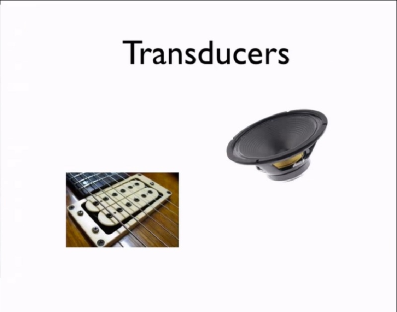

Transducers are great, because you could probably put a new picture up
every time you talk about them, and it would still be a valid
transducer.  Actually, these are much better examples of transducers
than burritos are.

[Audience laughter]


[Time 0:02:32]

```
slide title: What are They?

+ extract the _essence_ of map, filter et al
+ away from the functions that transform sequences / collections
+ so they can be used elsewhere
+ recasting them as _process transformations_
```

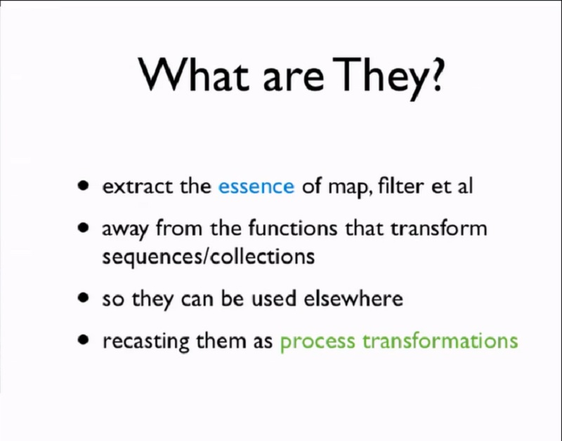

So I am actually not going to spend a lot of time describing what
transducers are, but just as a show of hands, how many people saw the
Strange Loop talk?  All right, everybody else, you are going to have
to go back and fill in some more of the details, because I do not have
enough time to both explain the ideas behind transducers and the
implementation stuff that I really want to focus on today.

There will be three slides now that are in common with that talk.
What is the idea behind a transducer?  It is that we were writing
"map" and "filter" once again for core.async and realizing that
probably was not the best thing to be doing.  Is there some way to
extract this stuff out?  Finding an example of how to do that in the
reducers work, by basically saying "map" and "filter" are just
functions that transform another function, some reducing function.
And they could be actually reducing, or it could be something that has
the same shape as reducing.

And the way to think about that overall is that "map" and "filter" can
be thought of as functions that change some process in a particular
way, so you can define them as process transformations.  And as soon
as you do that, you can use them for push.  You can use them for pull.
You can use them for data.  You can use them for events.  I think it
is a super important abstraction away from context, which allows you
to now express things and use them in different contexts, which is
sort of what we keep trying to do.


[Time 0:04:00]

```
slide title: What Kinds of Processes?

+ ones that can be defined in terms of a _succession_ of _steps_
+ where each step _ingests_ an _input_
+ building a collection is just one instance
+ _seeded left reduce_ is the generalization
```

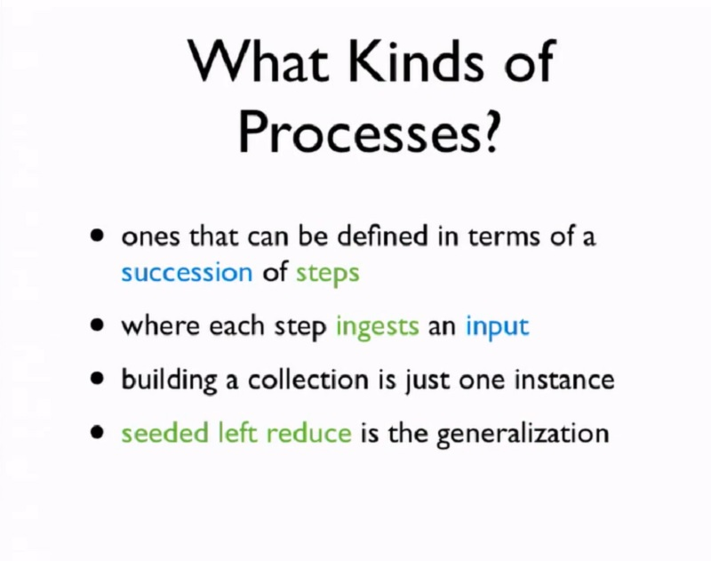

So when we talk about being able to modify a process, what kind of
process?  I mean, there are a lot of processes with a lot of different
shapes, and it ends with the transducers can transduce one particular
kind of process, which is pretty generic.

Which is any process that can be defined as a succession of steps,
where each step takes some new input and sort of incorporates it in
the process.  Building a collection is an example of that kind of a
process.  You have a collection so far, and you have one new thing,
and you put it, and you add it to the end.  But it is just one
example.

And I think too much thinking about "map" and "filter" has been
connected to collection processing or list processing or sequences for
too long, and that is not the bottom.  I think the bottom is the step,
not the stuff.  So seeded left reduce is the generalization of this.


[Time 0:04:55]

```
slide title: Why 'transducer'?

+ _reduce_
  'lead back'

+ _ingest_
  'carry into'

+ _transduce_
  'lead across'

+ on the way back / in, will carry _inputs_ across a series
  of _transformations_
```

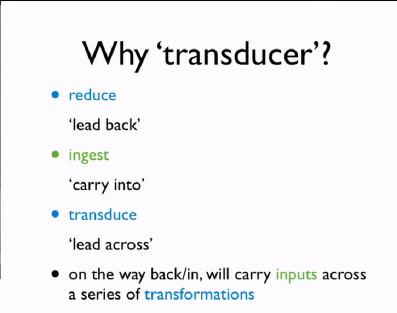

You know we like our words in Clojure.  So "reduce" means "to lead
back".  I am not going to talk much about the ingestion part in the
rest of this talk, but "transduce" means "to lead across", and that is
definitely what transducers do.  They are leading the input across the
series of transformations on the way to, well, maybe reduction or
maybe something else, some other process.  But they lead them across a
transformation process, so the name makes sense.


[Time 0:05:27]

```
slide title: Transducers

+ (map f)
+ (filter pred)
+ (take n)
+ (mapcat f)
+ (partition-by f)

  _return_ transducers
```

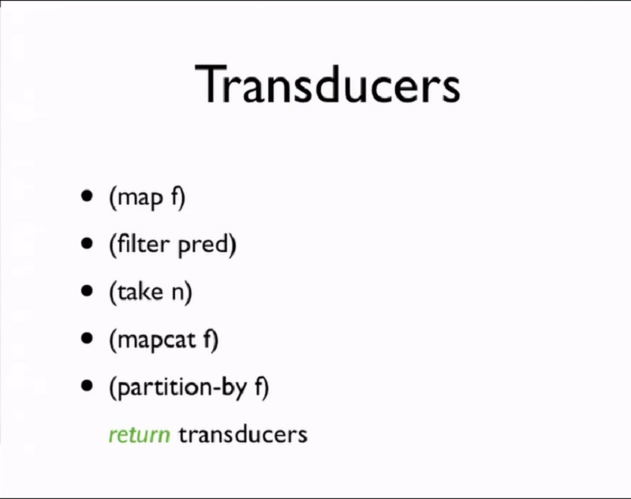

In Clojure, moving forward, we are going to have transducers be
returned by all the sequence functions that you are used to.  So "map"
of f is no longer -- I mean, it can still take a collection and do
what it always did, but when it is not passed a collection, it returns
a transducer.  So it returns a function that takes a step-like
function, a reducing function, and returns one.  So "map" f returns a
transducer.  "filter" with a predicate returns a transducer.  That
transducer modifies the process.  A filtering transducer takes the
inputs and maybe does not use them sometimes.  That is what filtering
is.

Mapping is taking the inputs and applying a function to them before
you use them.  It is modifying a process.  And similarly "take",
"mapcat", and whatever.  They all return transducers.  So "map" is not
a transducer.  "map" of f returns a transducer.


[Time 0:06:27]

```
slide title: Implementing Transducers

+ take and return a 3-arity fn
+ arity-0 flows through to wrapped fn
+ arity-1 is used for completion, if none flow through
+ arity-2 is reducing step, you can morph input, call nested (or not),
  expand etc
```

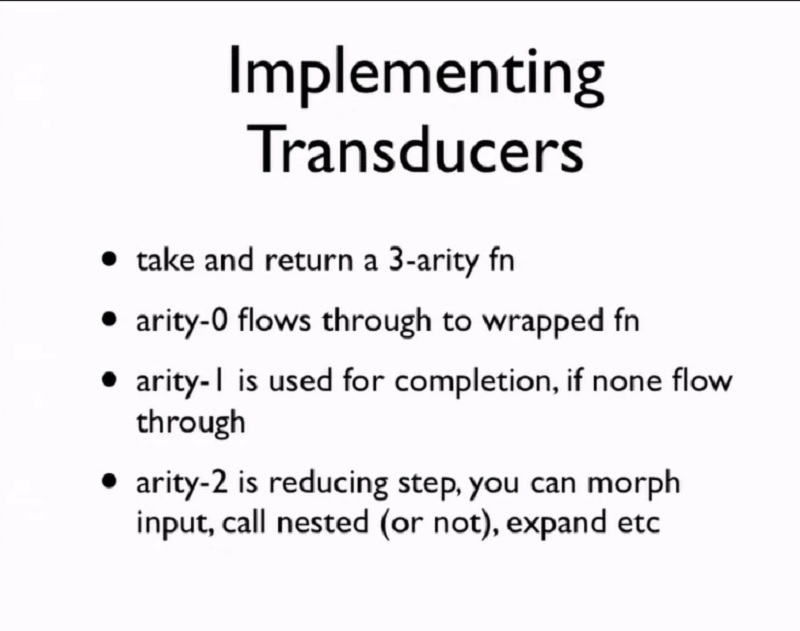

What I want to talk about today is sort of the insides.  Maybe
hopefully you will leave this talk feeling comfortable being able to
implement a transducer, or being able to implement a transducing
context.

So what does it take to implement a transducer?  We implement them in
Clojure as a function that takes a 3-arity function, and returns one.
That is the transducing job.  The step functions themselves, the
function you have to return, and the one you can be expected to be
passed, have three arities.

The first one is optional, arity-0.  When it is used at the bottom, it
is used to fabricate the initial result, so you can think of plus,
when you call it with no arguments, returns the identity for plus,
which is zero.  And multiplication returns one, which is the identity
value for multiplication.  If that is present, we want the transducers
to preserve it.  So far, that is the only use of arity-0 in
transducers, so we just flow it through.

Arity-1 is used for completion.  And if you do not have any completion
to do -- a lot of transducers will not.  You do not have any
accumulated state.  You are not keeping track of something as you go
along like every step is its own world -- then you have nothing to do
with arity-1.

In other words, somebody says, "We have this value.  Do you have
anything more you need to do with it, because we have no more input?
I am calling you with just the return value.  Do you have anything to
do with it?"  And usually your answer will be no, and so you just call
through to the function that you are wrapping.

[Time 0:08:07]

And the big one is the arity-2 function, which takes the result so
far, and that is a very generic idea.  That could be anything.  It
could be nothing, too.  There are reducing functions and step
functions that do not use that.  They just return nil and you are just
passing nil around, and nobody knows better from that.

But one way to think about it is that there is this something that is
standing in for the process.  It may be the result that is being built
up.  It may be something the process needs in order to do the next
step.  Whatever that is is passed along with a new input.  And your
job as a transducer is to preserve the result so far.  You cannot mess
with that.  And maybe you do something with the input.

You can morph it.  That is what "map" does.  You could ignore it.  Not
use the function given this input.  You say I am only supposed to be
using even numbers and, when I see an odd number, I just skip.  And
you skip by just doing nothing.  You do not call the nested function,
and you just return.

You can do expansion and various other things in transducers.  So the
arity-2 is the reducing step.  It has the same shape as the function
you pass to reduce: result so far, and a new input, returns the result
next.


[Time 0:09:21]

```
slide:

Code
```

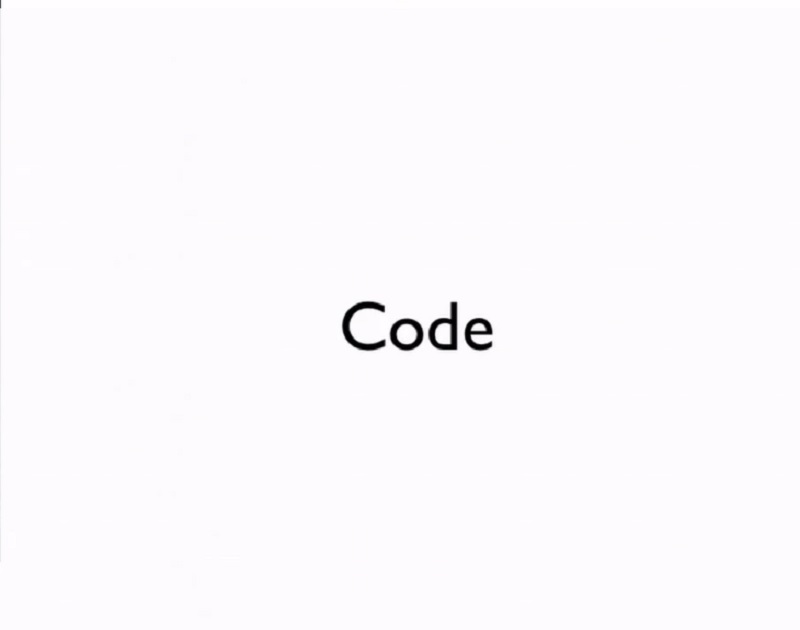

Everybody says I do not have enough code in my talks.  So now I have a
big slide that says Code.

[Audience laughter]

You can imagine -- no.

[Audience laughter]


[Time 0:09:34]

```
slide:

(defn map
  ([f]
    (fn [rf]
      (fn
        ([] (rf))
	([result] (rf result))
	([result input]
	  (rf result (f input)))))))
```

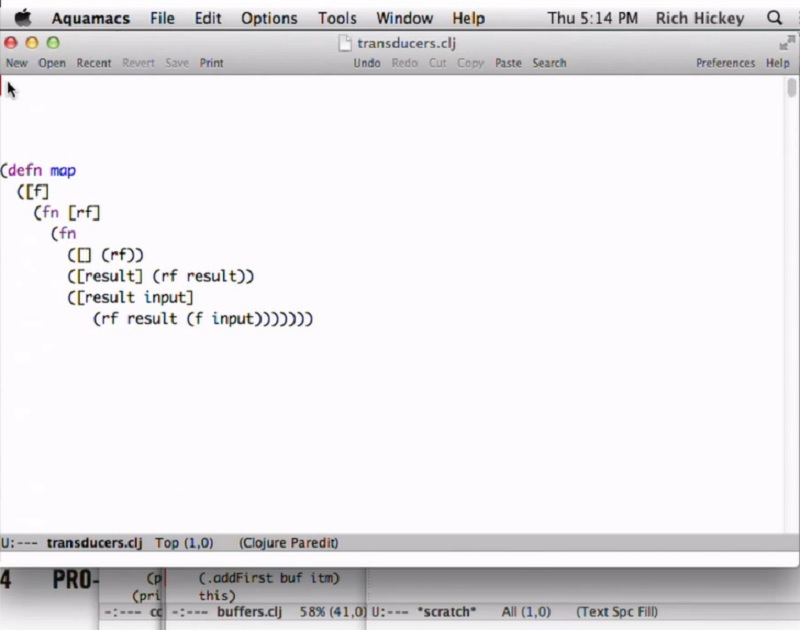

That is a little bit tiny, isn't it?  I had this all worked out so the
page downs take me to the next thing.  If I make this bigger, that is
not going to work.  Can people see this, or does it need to be bigger?

[Audience response]

It is OK.  Great.  This is an excerpt of "map".  This is not all of
"map", because it is missing the meat of "map", but it is the
transducer returning arity of "map", mostly.  But it serves as a nice
example.

"map" takes a function.  That is the function you are going to apply
to every input, so you are going to "map" increment.  Increment would
be f.  That is the ordinary argument to "map", and this is the arity
that does not take the collection, so just "map" "inc".  That would be
f.

Then what "map" is supposed to return then is a transducer.  So a
transducer is a function that takes a reducing function, and returns
one.  So "rf" is the reducing function that you are wrapping, in a
sense.  And you have to return one.  Like I said, a reducing function,
or the full shape of a reducing function, is an arity-3 function.  You
must have arity-0, 1, and 2.

[Time 0:10:51]

[Points at arity-0 definition on slide]

"map" does not accumulate anything from step-to-step.  Every step of
"map" is its own world.  I take the input.  I call the function on it,
and I use that input later.  I have no state in between calls so, A, I
have nothing to construct.  This is really for the bottom, so that
this arity is always just call the nested function.

[Points at arity-1 definition on slide]

When I am passed a result to complete, I have nothing to do.  "map"
has no more work to do, so you just call the reducing function of the
result.  Maybe they have something to do.  It is not up to you.

[Points at arity-2 definition on slide]

Then finally, there is the actual step.  And this is the essence of
mapping is in this step.  Given a result and an input so far, and some
function you want to transform, mapping is taking that function, the
result so far, and passing a transformed input to that function.
Calling f.  We imagined we were calling "map" with "inc".  "inc" would
flow down here.  You increment the input before you use the wrapped
reducing function.

So we have modified a process.  "rf" was a process.  We do not
understand what it is, but we just changed it a little bit.  We said,
"if you were getting a number, you are now getting a little bit bigger
number", or whatever f does.  This is the simplest example I can give
of a transducer.


[Time 0:12:09]

```
slide:

(defn filter
  ([pred]
    (fn [rf]
      (fn
        ([] (rf))
	([result] (rf result))
	([result input]
	  (if (pred input)
	    (rf result input)
	    result))))))
```

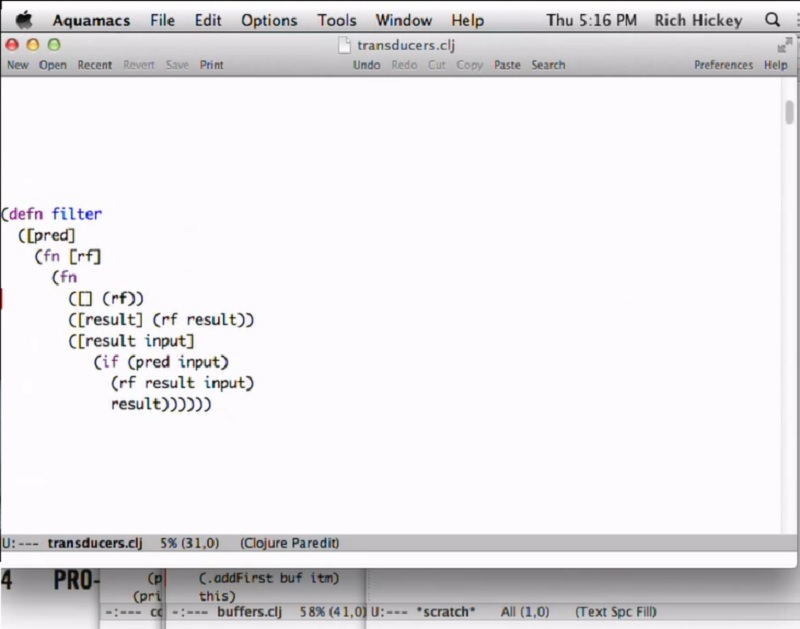

If we move on -- oh, look at that.  It is still working.  So the first
example is "map", one-to-one.  "filter" is one of the sort of the
three cases.  "map" is one-to-one.  That is sort of the easiest.
"filter" needs to use the result or not.  Again we see arity-0.  So
"filter" takes a predicate.  It says, if this predicate is true of the
input, do the work; otherwise, do not.

And it is interesting, because that means of describing what filtering
does is a process-oriented way of talking about it.  It is not like if
you are given something, and we are supposed to be filtering, and you
are not supposed to use it, then give me nothing.  That is a data
orientation.  That is not really what filtering is.  Filtering is
ignoring, and that is exactly what we are going to do.

Again the first two arities are the same as "map".  When we are given
a result and an input, we say, "if the input satisfies the predicate,
use it; call the nested reducing function with that input".  In other
words, it is OK input.  It passes the predicate.  We use it.

Otherwise we do not call "rf".  Don't do anything.  This is the way
any kind of reductive or conditional transducer would work.  If you do
not need to use the input, you do not call the nested function.  You
just do not do it.  That is the pretty much the most efficient way to
do nothing, is by doing nothing.

[Audience laughter]


[Time 0:13:36]

```
slide:

(defn take
  ([n]
    (fn [rf]
      ;; create state anew each time called
      (let [nv (volatile! n)]
        (fn
	  ([] (rf))
	  ([result] (rf result))
	  ;; note we can't lazily take 0 - needs input to run logic
          ([result input]
	    (let [n @nv
	          nn (vswap! nv dec)
		  result (if (pos? n)
		           (rf result input)
			   result)]
              (if (not (pos? nn))
	        ;; stop early, but don't double-wrap
		(ensure-reduced result)
		result))))))))
```

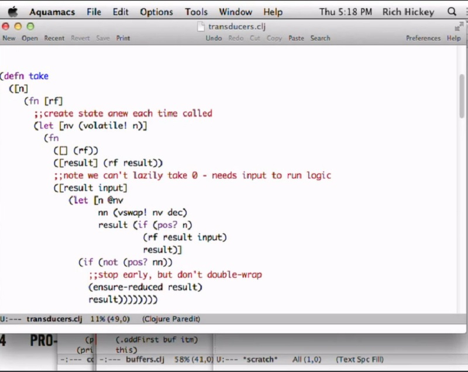

That is what we do.  I am not going to dig totally into "take", but I
wanted to show you an example of a stateful transducer.  So "take" has
some logic that crosses across execution.  As you go, you are only
supposed to use so many of the inputs, and then you are not supposed
to use anymore.  But I wanted to show you a few things just so you
have some rules of thumb about creating a stateful transducer.

I think there have been some blog posts that sort of made a lot of
stateful transducers.  The fact that we can do stateful transducers is
great.  That does not make stateful transducers sort of the most
important thing about transducers, or where the emphasis should be.

But if you are to write a stateful transducer, some rules you need to
follow are: Make sure you -- no, it was supposed to be "anew." I am
just looking at one word and not the sentence.

When you have a stateful transducer, if you have some local state,
make sure you create it anew every time you are asking to modify the
reducing function.  So you will note that this "let" that creates a
volatile variable here is inside, is underneath, the call.  So every
time you are asking to transform a new reducing function, there is a
new state associated with that.  That is so that independent
transduction stacks are independent, including the fact that their
state is independent.

[Time 0:15:03]

Like the others, there is no accumulation in "take".  "take" does keep
track of a counter, but it is not accumulating values that need to be
flushed out during completion, so both init and complete are just
dummy implementations.  But there are some interesting things.  In
particular, you can only be so lazy with a transducer.  So "take" 0
cannot be lazy, because none of the logic of a transducer runs until
an input has been supplied.  So there has to be some input supplied.

But here it is the basic logic of just saying, "Are we done yet?"  The
one other thing you want to see here is that: "take" is something that
aborts the process, so we are going to take until a certain point.
Then we are not going to go anymore.  The way we do that is with
reduced, which is something we already had in Clojure as a way of
saying, "Stop reduction."  We are saying transduce and transduction
and transducers are sort of an abstraction of reduction.  But we still
use reduced as a way to signal that we want early termination of this
process.

And ensure-reduced is a nice way to say: we called our f here and we
might have gotten a reduced value back.  We do not want to "reduced"
it more.  We just want to make sure it has just got a single wrapper.
So ensure-reduced is another helper that is present I wanted to call
your attention to.

All right.  OK.  What just happened to me?  Here we go.  It is my
cursor.  I have to use the right keys.  All right, so that is "take".


[Time 0:16:51]

```
slide title:

(def mapcat
  ([f] (comp (map f) cat)))

;; note cat *is a* transducer
(defn cat
  "A transducer which concatenates the contents of each input, which
  must be a collection, into the reduction."
  [rf]
  ;; helper that surfaces reduced from reduce
  (let [rrf (preserving-reduced rf)]
    (fn
      ([] (rf))
      ([result] (rf result))
      ([result input]
        (reduce rrf result input)))))
```

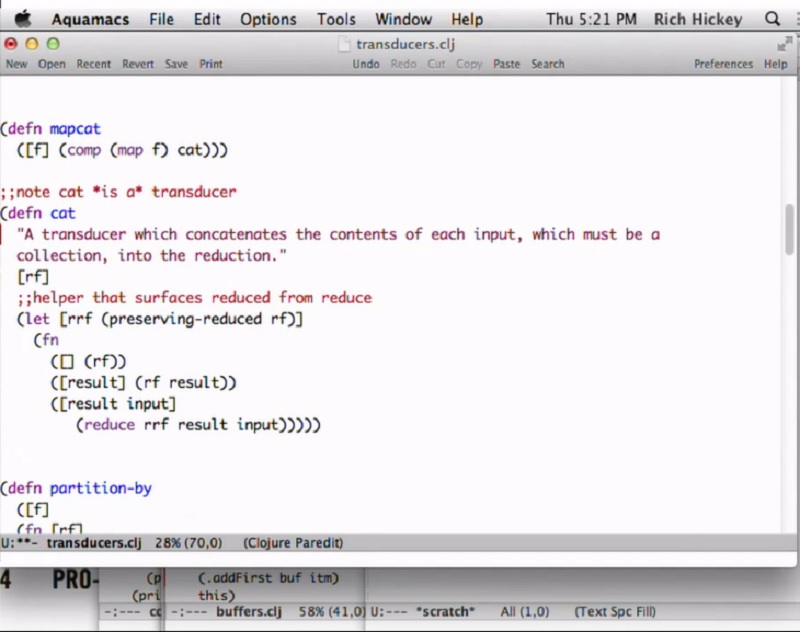

"mapcat" is the other kind of transducer.  So we have seen one-to-one.
We have seen elision, maybe we will not use the input.  We have seen
early termination in "take".  And now we have expansion.

What does "mapcat" do?  It says I have a function.  I am going to call
it on something, and presume that that result is itself a collection,
and I am going to integrate that collection in the result.  Now
"mapcat" itself sort of streams the answer into a resulting sequence,
but "mapcat" the transducer sort of concatenates into the transduction,
which may be sequence building or something else -- whatever is
produced by calling f on an input.  You call f on an input; you get a
collection.  What you want to say is: all of that collection now gets
incorporated as input.  That is what we want it to feel like.

So we get to see an example of transducer composition here.  "mapcat"
is just a composition of "map" and "cat".  If we "mapcat" f, we get
"map" f composed with "cat".  "cat" is a new thing.  We have not seen
"cat" before because -- I do not know if "cat" is really an idea with
sequences alone, but it certainly is one with transducers.

So "cat" is a little bit different in that the "cat" function is a
transducer.  It is not a function of some argument that returns a
transducer.  "cat" _is_ a transducer, because it has nothing else to
do.  So it just takes a reducing function, and takes its input and
reduces it into the result.  So it is going to take a reducing
function, and take input, which is presumed to be a collection, and
incorporates it as input, which means it uses each piece of that
collection as an argument to the reducing function.  We are just going
to reduce, with the reducing function, all those inputs.

[Time 0:18:59]

We got one collection of five things as an input.  We took each of
those fives things and used them as an input to the function we are
wrapping.  That is what catenation is.  And so "cat" is a useful
transducer.  Although, once you have "mapcat", you will probably end
up using that alone, but you can use "cat" directly.  If you do not
have a function that returns a collection -- you just have collections
-- you can just "cat" them if you are composing transducers, and so
"cat" is kind of cool as a transducer.

So this gives you expansion.  "cat" gives you the ability to say I had
one input, and it yielded multiple inputs to the next stage, so it
expanded.  We had one-to-one.  Filtering is potentially reductive.
Taking is abortive, and catenation is expansive.  That is sort of the
whole flavor of things.  We can be one-to-one.  We can have fewer
things than we have got.  We can have more things than we have got.
And we can not use everything that we get.

Oops.  I just lost my whole system here.  Let us just do this.


[Time 0:20:09]

```
slide:

(defn partition-by
  ([f]
    (fn [rf]
      (let [a (java.util.ArrayList.)
            pv (volatile! ::none)]
        (fn
	  ([] (rf))


          ([result]
	    (let [result (if (.isEmpty a)
	                   result
			   ;; flush
			   (let [v (vec (.toArray a))]
			     ;; clear first!
			     (.clear a)
			     ;; unwrapping helper
			     (unreduced (rf result v))))]
               ;; complete
               (rf result)))
```

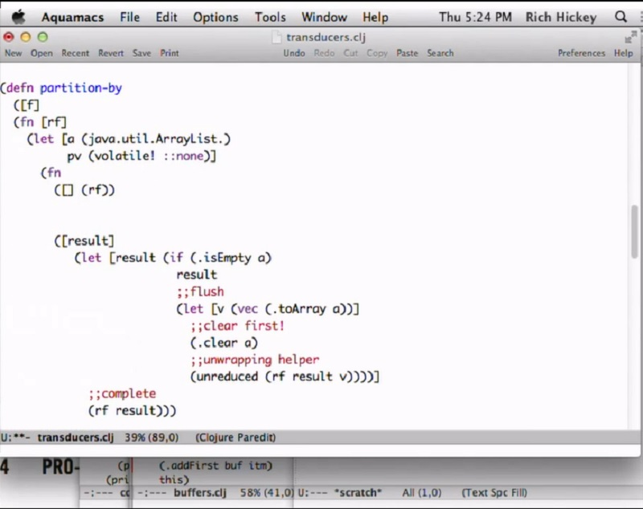

OK.  And the final and most complex one I want to show you is
partition-by.  Again, I do not really want to have you think through
and understand all the implementation of this, but I just want to
point out a couple things.  Again, it has state, so we are going to
create that state anew each time we are asked to wrap a reducing
function.  This is the first case in which we are going to be building
up some intermediate results that need to be flushed during
completion, so this is the first transducer I am showing you that has
an implementation body of any merit inside complete.

So partition-by, if you do not recall, is a function that takes a
function, and it calls it on every input.  And as long as it is
returning the same value, it keeps that stuff in the same result
collection.  And as soon as it returns a different value, it yields
that collection that it has been building up so far and starts
building up a new collection.  So it sort of snips your data into
collections every time the value of f returns a different result on
the input that it is passed.

So eventually, if the process that you are transforming terminates --
now it may not.  There are kinds of transformations that never stop,
in which case partition-by is going to yield as this function changes,
but if it never changes again, you will never get that last segment.

But if it is a transduction process that terminates, like reduce, it
is given a finite collection, it will terminate.  It will end.  That
means that this arity will get called saying, "OK, there is no more
input.  Time to wrap it up."

And partition-by says, "Whoa!  I have leftovers.  The last time this
function returned a value, I snipped it off.  I returned a collection.
Now I have been building up a new collection, and you are telling me
we are done.  What am I supposed to do with this stuff?"

[Time 0:22:08]

And the answer is, "now is your chance."  You get one more use of the
result.  You can use the 2-arity version as much as you need.  So it
ends up that what is going to happen in partition-by is: it is going
to take the collection that is been building up.  And you do not have
to see the details of that.  But it is going to pass it to the wrapped
reducing function one more time with a value.

I have one more value.  I have been building up these partitions.  I
made one last partition.  I am going to call you with the two-argument
version saying, "here is the results so far and here is a value".  So
that is going to be typical if you have been building up results.  You
are going to make one more, or maybe you will reduce, but you are
going to make a set of calls to the step function, the two-argument
step function, in order to flush your results.  And you have to be
aware of the fact that that may itself call return reduced saying, "I
have seen enough from you.  I do not want anymore input."

Then, finally, you have to complete.  If you have been building up a
result, and you are asked to complete, you can call the wrapped
reducing function as many times as you want, ordinarily, to flush out
what you have been building up.  And then you must call the reduced
argument on that, the reduced flavor or arity of this to complete with
the final result.  OK?  So that will be typical of a transducer that
builds up over time.


[Time 0:23:49]

```
slide:

          ([result input]
	    (let [pval @pv
	          val (f input)]
              (vreset! pv val)
	      (if (or (identical? pval ::none)
	              (= val pval))
	        (do
		  (.add a input)
		  result)
                (let [v (vec (.toArray a))]
		  (.clear a)
		  (let [ret (rf result v)]
		    ;; when nested done, we are too, don't add
		    (when-not (reduced? ret)
		      (.add a input))
		    ret))))))))))
```

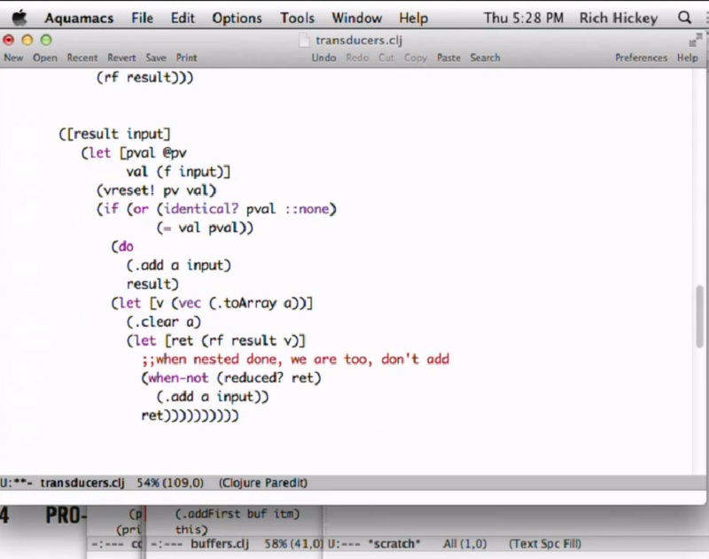

Then some tips on your actual step function.  So partition-by is also
interesting in that it is incorporating input, and it is building this
interim result.  It ends up every time it produces an output, it
clears the array it has been building up so far.  But it may, when it
is passed that down, have the function it is wrapping say, "I have
seen enough."  It returns reduced.

At that point, we do not want to add anymore to the input.  In other
words, if you are accumulating, as soon as the function under you --
the function you are transforming -- has told you it is done, it has
seen enough -- in other words it is terminated early -- you should not
accumulate anymore.  You should put yourself in a state so that when
you are asked to complete, you say, "I do not have anything to flush,"
because you know the function underneath you does not want to see it.
It does not want to see any more from you.  It said, "I am done".  So
that is what this bit does here.  So that would be typical of that.

Again, no one is forcing you to write stateful reducing functions or
transformers, transducers.  They are tricky, so you can just use the
ones other people write.  But if you are interested in doing it, these
are the caveats and tips.


[Time 0:25:11]

```
slide:

(defn transduce
  ([xform f coll] (transduce xform f (f) coll))
  ([xform f init coll]
    (let [xf (xform f)  ;; transformation of reducing step
          ret (reduce coll xf init)]
      ;; completion
      (xf ret))))
```

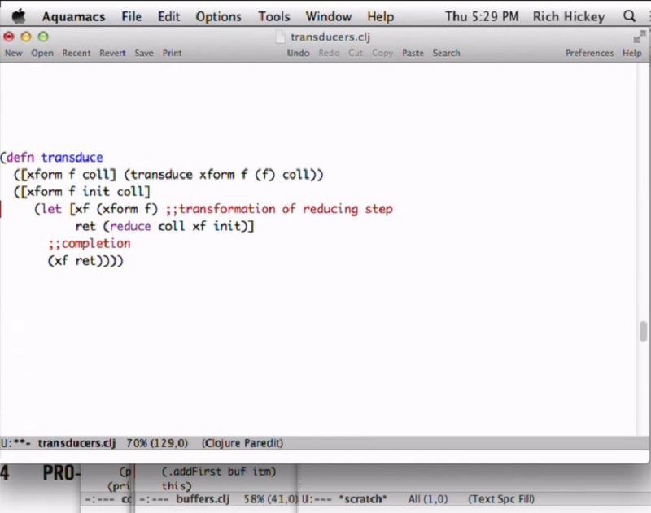

All right.  Look, that was code.


[Time 0:25:17]

```
slide title: Transducible Contexts

+ transduce
+ into
+ sequence
+ channels
```

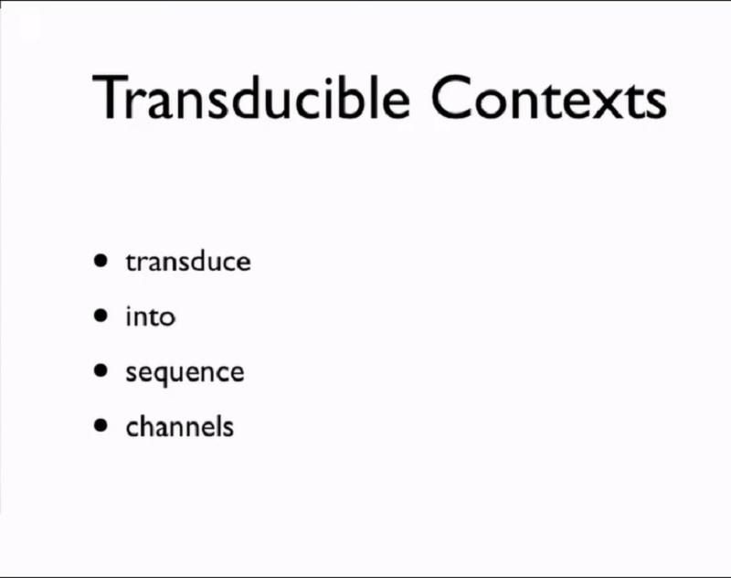

OK, so that is writing a transducer.  What about writing a
transducible context?  What does that even mean?

Well, a transducible context is some thing, some process that can
incorporate a transducer.  We are adding a bunch of these to Clojure.
One is a new function called "transduce".  It is analogous to reduce,
but it takes a transducer, and it will transduce the reduction process
with whatever transducer you pass it.

"into" has been enhanced to take a transducer.  "into" used to just
say, "dump this collection into that collection", pour it in.  Now you
can pour it in and stick a transducer in the middle of that, so
everything coming from one collection gets transduced and then put in.

"sequence" will take a collection and produce a lazy view of that
collection, having pulled it through a transducer.

And finally, there are channels that will accept transducers.

So these are all examples of transducible contexts.  Again, it is even
less likely you are going to write your own transducible context, but
you should be able to, and hopefully seeing the insides of these will
help you.


[Time 0:26:22]

```
slide title: Implementing a Transducible Context

+ select a step fn - [result input] -> result
+ transform it with transducer
+ call per input
  might be data source or event
+ iff you have a notion of 'done'
  + call arity-1
```

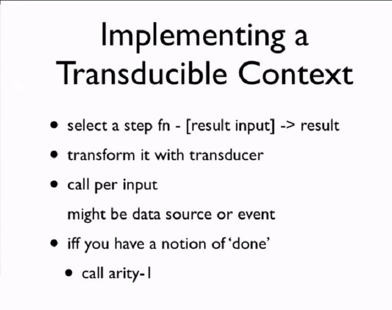

So what do you need to do if you are implementing a transducible
context?  You have to figure out some way to talk about what you are
doing as if there was a step function.  Now a lot of times there will
be a step function, and it will be plain what it is.  And other times,
you may have to just think a little bit and say, "Is there a way for
me to think about what I am doing as if it was a function of some
result so far and a new input, producing a result next?"  As long as
you can do that, you can transduce it.  So select a step function with
that shape.

Then you are going to have to have some ability to say, "Give me a
transducer".  It is your job as a transducible context to apply the
transducer to your step function.  That should never be a user space
activity.  Why is that?

[Audience response]

What is a transduced function like?  It has got this whole stack of
stuff.  All right, what happens if you transduce with partition-by?

[Audience response]

[Time 0:27:28]

That transduced step function is now potentially a stateful thing,
which means you do not want more than one person to have that, which
means you should never hand it to somebody else.  You should never
hand a transduced reducing function around, which means all
transducible contexts should accept a transducer and, inside them, you
call the transducer on the step function and make the transformed step
function.  And you just keep that to yourself.

Then, every time you have a new input, maybe you are proactive.  You
have got a collection in hand.  Your job is to reduce it, so you just
have your stuff already.  Or maybe you are reactive.  A channel is
reacting to stuff coming in from somewhere else.  Well, every time
there is a new thing, you are just going to call the step function,
the transform step function on it.  Maybe it is data source or it may
be an event.

If, and only if -- you do not have to do this -- if you have a notion
of being done.  If you are processing a collection, you will have the
notion of being done.  If you are dealing with events from the outside
world, you may not have a concept of being done.  You are like an
infinite process.  You are done when they pull the plug on the
computer or something.

But if you do have the notion of being done, when you are done, call
the arity-1 to allow any flushing to occur.  Call the completing
arity.


[Time 0:28:50]

```
slide title: transduce

+ basic transformation of reducing fn
+ reduce, but adds completion call at end
+ implies reducing fn must support arity-1
  + _completing_ - helper that adds it
```

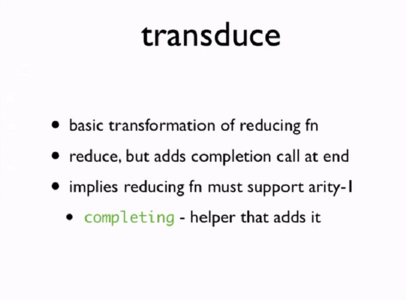

All right, so let us look inside a couple of these.  "transduce" is
the most basic.  It is just like reduce, except it has a transducer
and it transforms the reducing function.  It also has to add the
completion step at the end.  It does imply that the reducing function
must support arity-1, which it may not do.


[Time 0:29:10]

```
slide:

Code
```

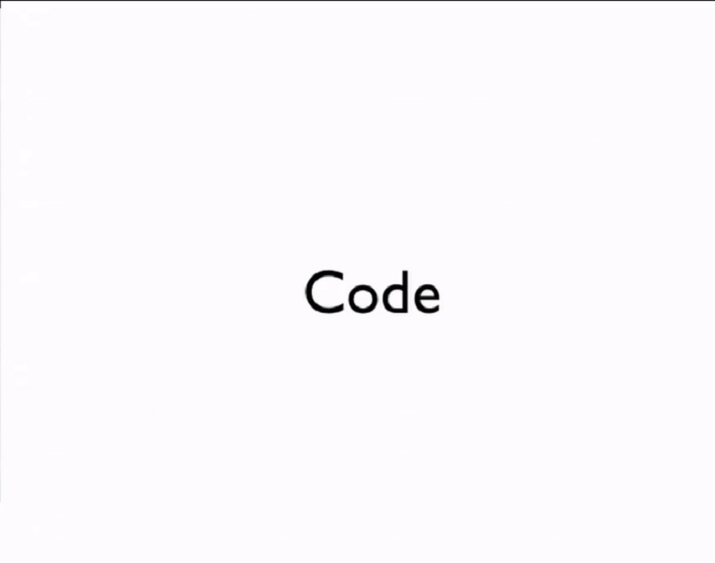

Let us look at code.  Do I have code?  Oh, look - code.


[Time 0:29:13]

```
slide:

(defn transduce
  ([xform f coll] (transduce xform f (f) coll))
  ([xform f init coll]
    (let [xf (xform f)  ;; transformation of reducing step
          ret (reduce coll xf init)]
      ;; completion
      (xf ret))))
```

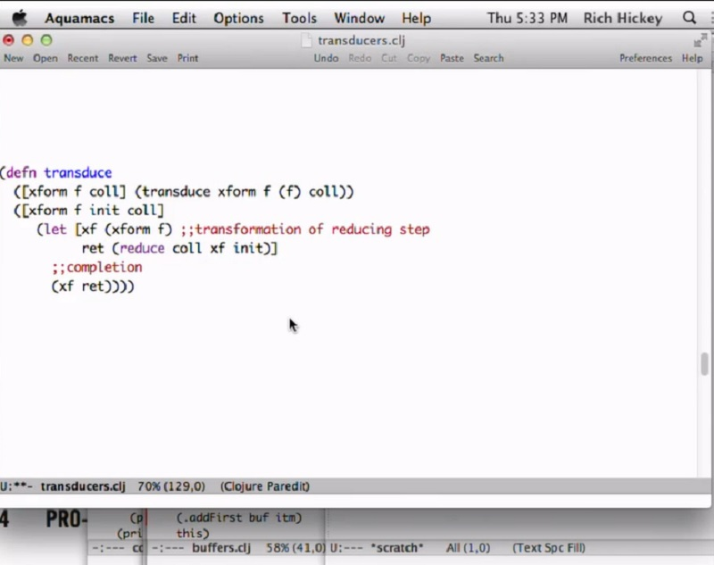

All right, code.  I talked too much about this before showing it.  OK,
so what does "transduce" do?  It calls reduce.  All right, but before
it calls reduce, so it supports the same form of reduce here, but it
actually has different semantics of reduce.

Who knows what the semantics of reduce are when you call it with a
collection and no initial value?

[Audience response]

No one, right.  No one knows.  It is a ridiculous, complex rule.  It
is one of the worst things I ever copied from Common Lisp was
definitely the semantics of reduce.  It is very complex.  If there is
nothing, it does one thing.  If there is one thing, it does a
different thing.  If there is more than one thing, it does another
thing.  It is much more straightforward to have it be monoidal and
just use f to create the initial value.  That is what transduce does,
so transduce says, "If you do not supply me any information, f with no
arguments better give me an initial value."

Note though, there is no requirement that you support that.  You do
not have to have that arity.  You do not have to allow people to call
"transduce" with no initial value, because sometimes there is just no
good made up from nothing initial value.  Somebody needs to think
about an initial value, or supply some inputs to your process to get a
starting value.  Not everything can be made from nothing.  It is easy
to come up with zero from nothing.  But it is not easy to come up with
a channel from nothing or other kinds of things, event systems.  You
do not have to support this.

[Time 0:30:43]

What will happen is if somebody gives you an f and it does not support
this arity, it will not work.  That is OK.  But the normal form takes
an initial value and a collection, so it is just the same shape as
reduce, except it has this new first argument: transform.  This is the
reason.  This different treatment of f is the reason why we did not
just slap transform into reduce.  That is why we have transduce.

This is just what I said verbally before.  First take the function you
are supposed to be using.  In the case of transduce, f is the step
function.  It is the reducing function.  It is just like reduce.
Somebody gave you a step to use.  So you just transform it.  You have
not told anybody else about this.

"xf" is now a private transducer stack that has been constructed
around this step function.  Then "transduce" just pawns off the job to
reduce to do this work, and passes the initial value and the
collection.  It gets a return value, but this is another piece that is
different.  It must call completion.  Reduce does have a notion of
being done.  This collection is going to become exhausted.  Therefore,
it should call completion, so one last call.

This does imply, however, that the step function support arity-1,
which again not all existing step functions do.


[Time 0:32:13]

```
slide title: transduce

+ basic transformation of reducing fn
+ reduce, but adds completion call at end
+ implies reducing fn must support arity-1
  + _completing_ - helper that adds it
```

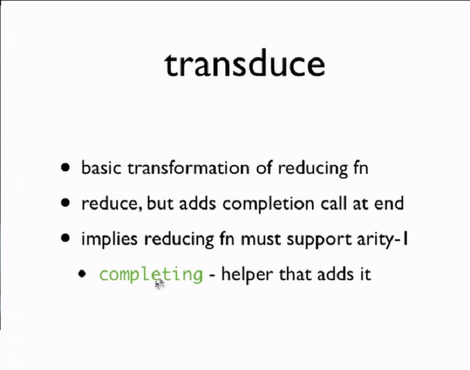

So we have a helping function called "completing", which will take any
function that is just a plain reducing function, so it only has the
2-arity: result, input, returning result.  And it will add arity-1
with an implementation that is just identity.  Given this result,
return the same result.  So that is a way to sort of take an existing
function that is not ready to have complete called on it, and make it
possible to do that.


[Time 0:32:43]

```
slide title: IReduceInit

+ IReduce does too much (no init)
+ IReduceInit still does (eats reduced)
  eventually a variant that flows reducing out
  but would be breaking to change IReduce
```

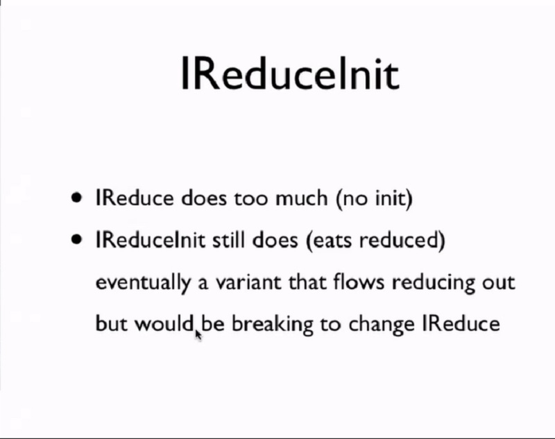

All right.


[Time 0:32:44]

```
slide:

(defn transduce
  ([xform f coll] (transduce xform f (f) coll))
  ([xform f init coll]
    (let [f (xform f)
          ret (if (instance? clojure.lang.IReduceInit coll)
	        (.reduce ^clojure.lang.IReduceInit coll f init)
		(clojure.core.protocols/coll-reduce coll f init))]
      (f ret))))
```

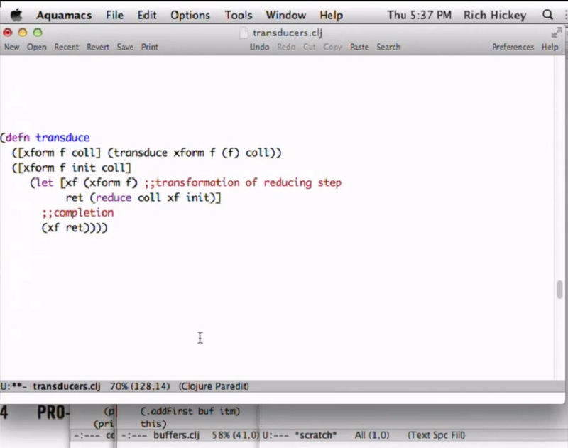

So let me just show you one more thing here, which is the real
implementation of "transduce" is a little bit more involved, but I
wanted to just introduce this because this is another piece of novelty
in Clojure that people are wondering about: what is this reduce init
thing?

How many people know about IReduce?  Not too many.  IReduce is an
interface that supports the semantics of Common Lisp reduce.  It has
two methods: one that is called reduce and it takes no init value, and
the other is reduce that takes an init value.  It is a way for a
collection to say, "I know how to reduce myself.  Instead of asking me
for a seq to walk through my stuff, just let me do it because I have a
faster way to run through all my own stuff."

So internal reduce is sort of the Java interface version of
CollReduce.  It already existed, and other people implemented it, but
most of the existing implementation of reduce is done by CollReduce,
which has the same exact semantics.

But it ends up that it would be nice to have an interface that just
represented the second part of IReduce.  Remember, I said Common Lisp,
who knows what the no init value thing does in reduce?  Nobody.  And
so to force everyone to keep implementing both, where the first one
has these tricky semantics about no values and one value, was tough.
So IReduceInit only has the version of reduce that takes an initial
value, and it is implemented by collections.  It is going to come up
later, because we are going to see "educe" use it.

So all that is happening inside "transduce" is, it says: I am trying
to take advantage of the fastest possible way to reduce you, which is
what reduce does now as well.


[Time 0:34:44]

```
slide title: IReduceInit

+ IReduce does too much (no init)
+ IReduceInit still does (eats reduced)
  eventually a variant that flows reducing out
  but would be breaking to change IReduce
```

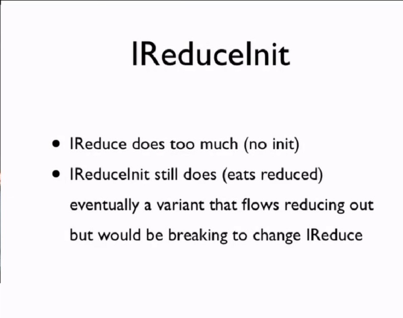

All right.  So IReduce did too much.  It has the no init flavor, which
I really do not like, but I cannot just change it, because people have
implemented it and they have code that depends on it.  So I cannot
change its semantics.  So all I did was split IReduce into two halves.
IReduceInit takes an init, and IReduce derives from it and adds the no
init flavor.

But IReduceInit still does something I wish it did not, which is that
it eats reduced.  In other words, if there is a reduced returned by
the function internally, it eats it.  It says, "OK, I should stop",
and it stops, but it returns the final result.

It ends up that a lot of times, if you are using reductions in nested
contexts, whether you are processing a tree or you are doing
transduction, which is sort of a tree of ... or at least a list of
nested reductions, you might want to a reduction in an internal step.
You need to know if that bailed out, so that you could bail out.

So I would like a variant that actually returns reduced, but we have
not had time to integrate that yet.  So you see IReduceInit.  It is
just an interface that implements the reduce version that takes an
init.


[Time 0:36:00]

```
slide title: sequence (LazyTransformer)

+ (sequence xform coll)
+ builds linked list (thus caches)
+ transformed step is list append
+ tricky bit is that a transducer might not yield any output for
  a particular input
  + thus to satisfy pull, must loop
```

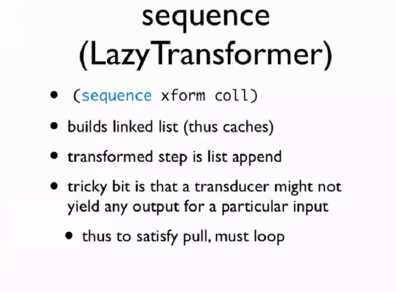

All right.  Another transducing context is "sequence".  We always had
"sequence".  I do not know if anybody ever used it.  It basically was
just a way to explicitly say: I want to get a sequence out of this
collection.  Now it takes a transformer and it has become
substantially more interesting, because the collection might not be
lazy, but the return value from sequence _is_, and its use of the
transducer is also sort of lazy.  And we will see what "sort of" means
in a second.

What is this step of "sequence"?  Essentially it is building a linked
list.  So the transform step is sort of list append.  We do not really
use list append, and usually list append is really expensive, so it
must be doing some fancy modifying version that is efficient of list
append that actually can add to the end of a list.  And that is what
it does.  And that is what "lazy-seq" did as well.  "lazy-seq" just
knew how to attach things to the end of the last cell.

The tricky bit -- if you think about making a lazy list out of a
transduced collection -- is the fact that that collection might
sometimes return nothing.  Maybe one of the transducers is "filter",
which means I pulled, because I am going to be eating a sequence by
pulling.  I am pulling.  I say: give me something.

If you just consumed one input from the collection and it filtered it
out, what would you hand to the user?  You have got nothing yet.  You
actually have to keep going until you see something.  So inside, if
you look at the implementation of LazyTransformer, which is tricky,
you will see that there has to be a loop there, because you have to
keep consuming input until you can produce output.


[Time 0:37:52]

```
slide title: Lazy vs Pushy

+ Transducers are fundamentally push
+ sequence implements pull via introducing inputs
  + lazy in input consumption, not output production
+ thus sequence not as lazy as lazy-seq
  but still usefully lazy in practice
```

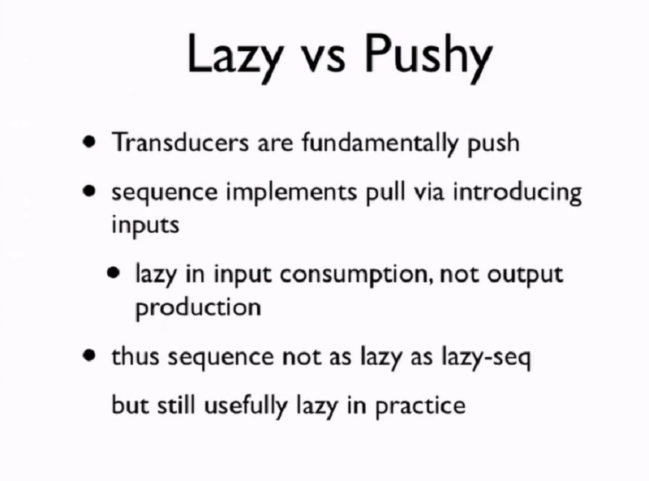

The other thing that is tricky about this is: it sort of changes the
notion of what it means to be lazy.  And I do not really want to
change that.  I just want you to think about another notion of lazy.
Transducers are fundamentally push.  You supply input and then the
logic runs.  They are not fundamentally pull like lazy sequences are.

So "sequence", the function, implements pull by going around the other
end and saying: you wanted something, so I am going to take another
input and feed it to the step function.  Now we just said one tricky
bit is: you may ask for something and I put it through the step
function, and the step function gives me nothing, in which case I have
got to keep doing this until I have one thing to return to you.  But
what else could this have done?

[Audience response]

It could have returned one thing each time I ask.  It could return
nothing.  It also could return what?

[Audience response]

More than one thing.  Where is that going to go?  I asked for one
thing.  You called the step function.  It gave you, like, six things.
What is going to happen?

[Audience response]

Yeah, I am just going to attach them to the linked list, which means
that it is not quite this laziness we are used to.  We are used to
saying, "do not run any little part of the calculation until I ask for
one thing, and then just do exactly that much work", which ends up
being a huge amount of overhead.

[Time 0:39:11]

So now we are saying you are going to ask for one thing.  What is
actually lazy is not your consumption, but the production.  In other
words, we are lazily going to add only as much to this to produce an
output to give you, but each step might produce more than one thing,
so it is kind of pushy.

So it is lazy in the input consumption, which means if you have
something that expands to an infinite sequence, it is not going to
work.  If you have something that, in a single step, expands to
something that consumes all of your memory, that is also not going to
work.  In particular, it is not going to work because, even if your
result produces something lazy, it is going to be eagerly consumed.
_Nothing_ inside any of the transducers uses laziness at all because
we want to be able to have these other semantics.

So that is something to be aware of.  A lot of people initially trip
up over trying to use something lazy in a step, and are surprised that
it got fully realized.  But that is the nature of this.

I still think this is a useful granularity for laziness.  I do not
think people are consuming all their memory in a single step.  And
otherwise, this gives you the best of both worlds, because you get
very high performance and only as much caching as you need per step.
And it still is sort of windowed, so I think it would work for most
things, but it is something to be aware of.


[Time 0:40:34]

```
slide title: educe / Eduction

+ _educe_ - 'lead out'
+ (educe xform coll) -> Eduction
+ IReduceInit / Iterable / Seqable / Sequential
+ Work happens every use!
  no caching, unlike seqs / sequence
+ Subsequent transductions combine work w/o intermediates
```

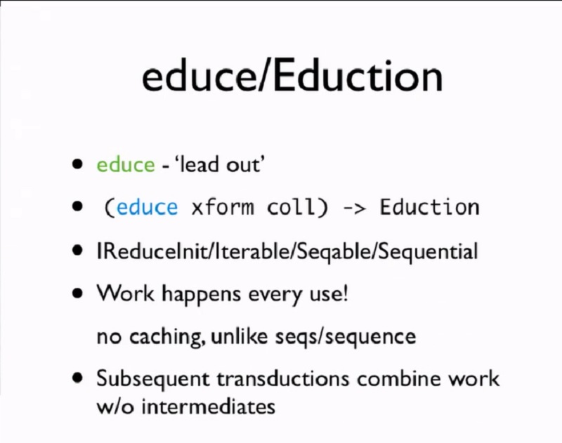

OK.  I do not think I showed any -- yeah, I do not show you the code
for that.

All right, the other thing that is new in here is "educe".  This is
just basically I saw this word and I am like, I have to figure out how
to make a language feature out of this.

[Audience laughter]

That is not actually true.  There were many, many different names.
There was a thing, and then there was the name, not the other way, but
it is.  Educe, it is so -- this is so cool, right?

Educe means "lead out".  We had reduce, which is to lead back, like
towards the thing you are making.  And we have transduce, which is to
lead across this transformation.  We have educe, which is just to sort
of lead out.

To where?  Like where is it going?  It does not say.  That is what is
really cool.  It is actually sort of a word game, too, because it is
like, if you have ever seen the definition of reduce, it says it takes
R and I, and it returns R.  It is like reduce without the R.  We do
not have the -- we do not know what we are going to do with this yet.
We do not have the result.  We are not there yet.  We just take the R
off.  We still end up with an English word, and we are good.

[Audience laughter]

So when you educe a collection, basically you are taking a transducer.
You are going to make the recipe for transducing this collection, but
you are not going to do anything right then.  _Nothing_ happens when
you call "educe", except the recipe is created.  And you return
something that is called an Eduction, or a leading out of this data.

So when does it actually happen?  It happens when you use it.  It ends
up that Eduction implements a bunch of important interfaces.  It
implements IReduceInit.  So it knows how to reduce itself, which means
it knows how to transduce itself, and reduce ... and anything that
uses IReduceInit.

[Time 0:42:34]

It is iterable.  So you can use it anywhere you need something that is
iterable.  It is seq-able, so you can use it.  You can call "seq" on
it, get a seq, and use it in existing code that is expecting lazy
sequences.  And it is sequential, which is just a tag thing, because
it is a sequence of things.

The most important thing about eductions and "educe" is that every
time you ask for a seq and walk through it, or every time you ask for
an iterator and use it, and every time you transduce or reduce it,
every single time the work is going to be done across the entire
collection, or as much of it as you consume with the process.  There
is no caching like there is for seq.  So if you had side effects, you
would seem them go off over and over again.  Don't have side effects.
This is not really what this stuff is for.

[Audience laughter]

So the work happens with every use.  And this is one of those
tradeoffs.  You probably do not want to hand around an eduction and
have ten copies where the work is really expensive.  You should
probably pour that into a collection and share the results.  But you
may very well want to give away an eduction if it is pretty
inexpensive and you do not know how much of it is going to be consumed
by each user.  Then it is worth doing.

Also, the nice thing is you can have an eduction as long as you are
not really ready to use it.  The cool thing about eductions is that if
you subsequently transduce them, then the recipes fold together, and
it is as if you put them, as if you composed both sets of transducers
together.  And there is no intermediate stuff created.  And you can do
that over and over again.

So you can say: I know about how much of this much of the work to do.
I had the source material, so I cannot just give you a transducer.  I
know what the source was.  I had the initial set of transformations.
But now I am handing it to another stage that I do not want to know
about, and it does not want to know about me.  It knows it can
transduce that some more, hand it to the next guy who can transduce it
some more, and then finally someone can pour it into a collection,
reduce it, or something like that.  And all those intermediate
operations are going to fold together, and there will be _no_
intermediate data created.


[Time 0:44:42]

```
slide:

Code
```

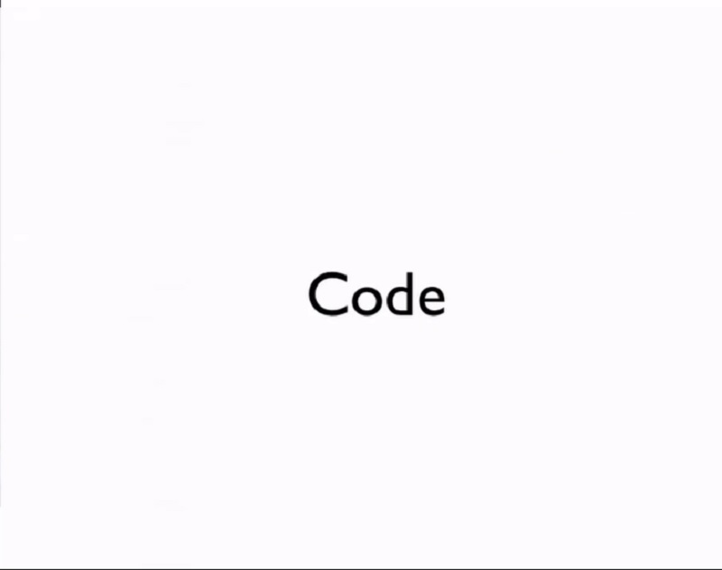

It is just all work.


[Time 0:44:43]

```
slide:

TBD ?
```

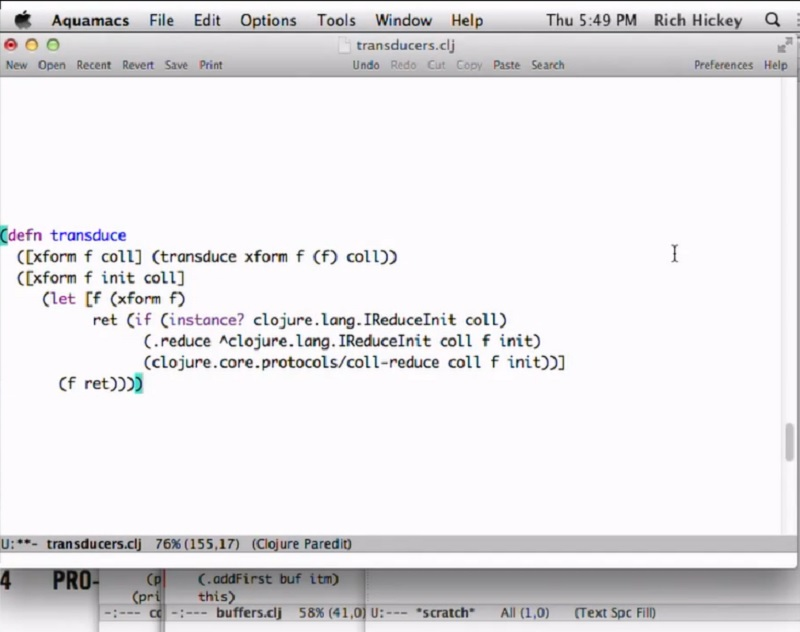

So we can look at this.


[Time 0:44:45]

```
slide:

(deftype Eduction [xform coll]
  Iterable
  (iterator [_] (.iterator ^java.util.Collection (sequence xform coll)))

  clojure.lang.Seqable
  (seq [_] (seq (sequence xform coll)))

  clojure.lang.IReduceInit
  (reduce [_ f init] (transduce xform f init coll))

  clojure.lang.Sequential)

(defn eduction
  "Returns a reducible/iterable/seqable application of
  the transducer to the items in coll.  Note that these applications
  will be performed every time reduce/iterator/seq is called."
  [xform coll]
  (Eduction. xform coll))
```

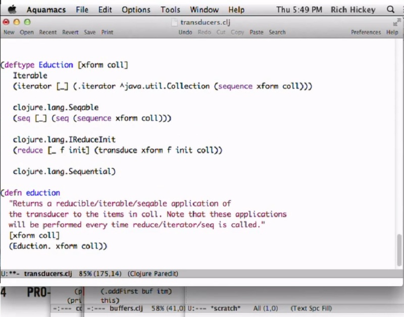

That is what an educt does.  This is all of it right here.  So
Eduction is just a deftype.  It implements Iterable.  Now the key
thing here is it just uses "sequence" to do that.  It implements
Seqable.  It also used "sequence" to do that.  It implements
IReduceInit.  It used "transduce" to do that.

What is this ... weird?

Oh, yeah.  It uses transduce to do that.  And it is a tag.  Sequential
is just a tagging interface, so you see there is nothing inside this.

But other tricky aspects of this is: it is not a collection.
Unfortunately, java.util.Collection is this giant interface, and
satisfying it does not make sense for this class.  But it is kind of
unfortunate, because Java built a lot of things saying, for instance,
all collection constructors take other collections, so they know how
to initialize themselves from another collection.  It would have been
vastly better had they said, "I take an Iterable", because that is all
they really need to know.

So that is a little bit tricky, but we are enhancing, say, "vec", so
that it will be able to quickly and efficiently with both.  Using
"reduce" will build up a value quickly given an eduction.  And
"eduction" just makes one of these things, so nothing to it.


[Time 0:46:12]

```
slide title: channels + transducers

+ Being able to apply same transducers to events / async get key value
  prop vs laziness et al
+ transformed step is buffer's add!
  [buf input] -> buf
+ new buffer semantics due to expansion
  if not full?, one input may add more than one item to buffer
```

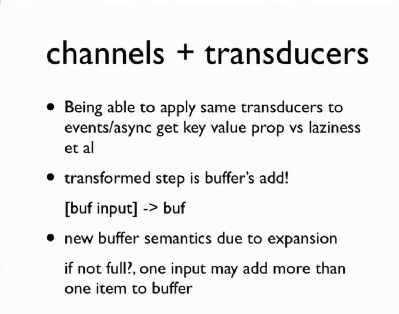

All right.  And finally, we have channels as the last example of
transducible contexts.  This is really the whole point.  A lot of what
I have talked about already are variants with some performance
enhancements, possibly, over what you can do with sequences and pull.

But the fact that you can use transducers in those contexts, and in
completely push contexts like channels, that is the Holy Grail of this
thing.  That is what this is all about.  The fact that you can make a
transducer stack and pass it to reduce the most on-demand, do it now,
eager thing you can think of, and also pass it to a channel, which
does not even have any stuff to do until later when some asynchronous
thing comes by with some input.

These are the opposite parts of programming.  They are opposite.  But
transducers connect the two.  You do not need a different transducer.
You can use the same transducer.

So this is the point of transducers, is the fact that they cross
across this.  So if we look at transducing a channel, we need to think
about channels as if they were a step function.  And it ends up in the
bottom of channels is this function that looks like this.  It takes a
buffer and an input, and returns a buffer.  It is just a matter of
sort of looking at that function and saying, "that is a reducing
function".  "reduce" was not called inside channels because it does
not have all the stuff.  It is getting one thing at a time, but there
is this step, and it is called sequentially.  It follows all the rules
I talked about before, so it is perfect.

[Time 0:47:43]

So what happens in a channel is: this buffer add function gets
transformed by the transducer.  The one trick of this is the same one
we saw earlier with "sequence".  Buffers have a notion of being full.
So when you are one away from being full, are you full?

[Audience response]

No.  Somebody is going to ask the buffer, "Are you full?", it is going
to say, "No, I have got room".  It used to be, it was saying, "I am
not full", and expecting one more thing to get added, and be asked
again, "Are you full now?"

But what happens in a transduction?  Well, you are going to get one
more input.  You are going to let one pending write occur.  That is
going to go through a transducer, and what could come out?

[Audience response]

More than one thing.  And it ends up that buffers, now the semantics
are, if you are not yet full, you are going to accept one or more
things.  And all the buffers have been modified to do that.  It ends
up that that is, again, sort of a nice fit.  If you are going to
consume all of memory, it will not work.  But otherwise, the notion --
as soon as you have done that with one step, it is going to report
full until it drains all the way down to what its target was.

So you cannot use fixed sized buffers, but on the other hand, I think
you can implement the logic of saying: the activity of this buffer is
gated by its size.  It is just not limited to that size at any one
point in time.  So we have added this semantic to all of those.


[Time 0:49:20]

```
slide title: More...

+ parallel transduce
+ supportive implementation macros
+ primitives?
+ multi-arity?
+ kv-transduce?
+ functional stateful transducers?
```


All right.  There are many places we want to take this.  Certainly I
am hoping to get to the point where we are going to take the
parallelism that we built for reducers and sort of bring it into this
model, so it takes transducers.  It should be very straightforward to
do.

You saw a lot of repetitiveness in the implementations.  A lot of them
dummy out: 0-arg, and 1-arg, variants.  If you look at the
implementation of reducers, there was a macro that made that go away.
I will probably implement that, so other implementers will sort of be
able to focus on just what is unique about their transducer.

We have ideas about supporting primitives.

There are open questions about multiple arity.  "map", in fact, does
support multiple arity, but not all the other ones do, and it does not
really make sense for a lot of the others, but it might for "filter".

Reducers had a notion of being able to fold maps using a key value
function as opposed to a function of key and value.  That is very
efficient.  It would be nice to find a way to talk about that and make
it explicit.


[Time 0:50:20]

```
slide title: more.async

+ better integration with existing code
+ channels as promises
+ facilities for endpoints
+ all works-in-progress
```

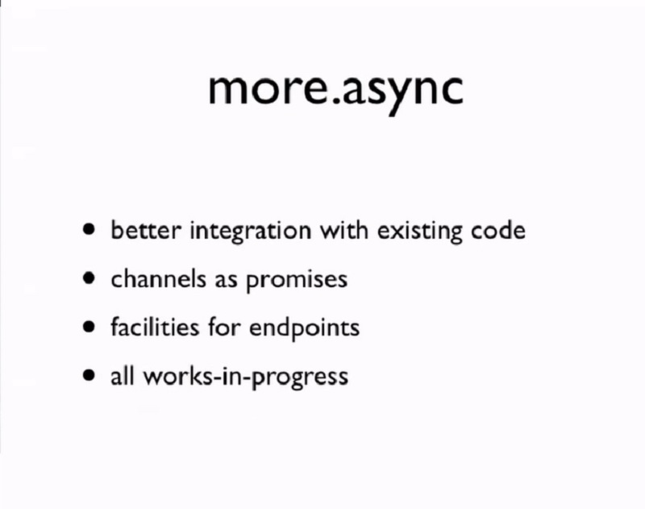

Maybe we can talk about that last bit.

All right.  I am running out of time, but I just want to take you
quickly through some of the new things that are coming into
core.async.  They are in these categories: better integration with
code that already exists, using channels as promises, making it easier
and better to use channels for, like, RPC kind of endpoints.


[Time 0:50:40]

```
slide title: Channels become deref-able

+ Integrates with existing code
+ deref reads from channel
  will block until available
+ timeout flavor of deref also supported
  will read _or_ timeout (not both)
```

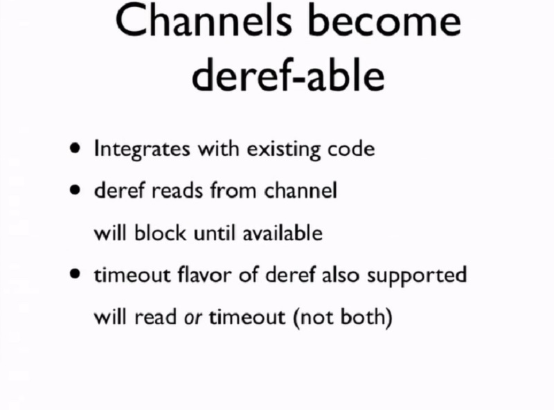

And just all this stuff is in progress.  So if you are following along
with the alphas, you are seeing some of this stuff happen.

The first thing is that channels are going to become deref-able.  This
is very useful, again, for existing code.  How many people have code
where the contract of the code is, "Give me something deref-able"?
And you are kind of independent then of whether or not that thing is
actually one of the reference types or a promise.  There are lots of
things that are deref-able.  People have made new deref-able things.

This would make it so that a channel is a valid thing to be
deref-able.  That will have blocking semantics, so deref will be
blocking.  It will be like promises that way.  And when you deref, it
will read from the channel.

But, because they are blocking, these channels will also support the
timeout flavor of deref.  Everybody know that deref can take a timeout
and evaluate a return if the timeout occurred?  Yes?

[Audience response]

No?  Yeah?  Okay.  Well, deref can take a timeout, and it is useful
when the thing that you are derefing can block.

And so the cool thing about channels when you deref them with the
timeout is that they will either successfully read and return that
value, or time out, but not both.  So they will not time out and then
later have a side effect of reading because of some pending read.  The
read will be killed.  You will either get the time out or the read
value, but not both.  So I think this helps integrate to existing code
and has useful semantics.


[Time 0:52:05]

```
slide title: Promise channels

+ create with _promise-chan_
+ write once, read many
+ buffer of one
  always write-ready
+ first value written 'wins'
  subsequent dropped
+ all readers unblocked by first write
  always readable once written
```

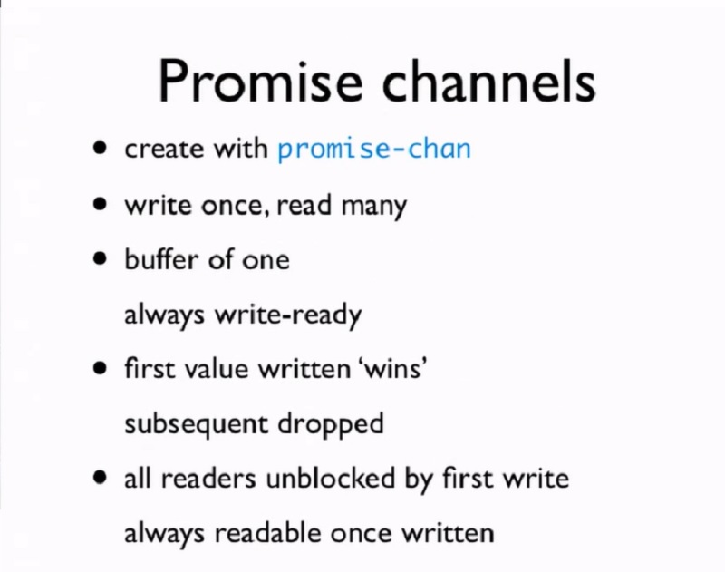

The other thing that is coming are promise channels.  Promise is cool,
but channels are cooler, because they support alt and things like
that.  And of course, you can think of a channel as if it was a
promise.  But there is some more you would want to see to make sure
that using a channel as a promise was not a pile of convention that
you had to get right over and over again.

So we are going to have a function called "promise-chan", which will
return a promise channel.  it is a write-once read-many channel.  So
as soon as somebody has written a value to it, that value will be
returned over and over and over again, permanently.

So it has a buffer of one already by default, so you cannot get that
wrong.  One of the things people do not want is for you to have a
promise that blocks them when they fill it.  That is no fun, so we are
not going to do that.  So that will already be built in.

The first value that gets written wins.  That is the same as promises.
Subsequent ones will just get dropped.

And the other thing that is really neat about it, compared to using
channels raw, is the fact that all of the readers will unblock
together.

Mult-channels, like the ones we have, all their readers are racing for
the next value.  And that is not what you want in a promise.  You want
everybody who is awaiting that value to succeed, not just the first
one or the lucky one to succeed.  So that is a new semantic.  It is
not actually a different semantic of the channel.  It is the semantic
of the buffer that is used to create it, which is kind of neat.  In
other words, we implement the promise channels just by making a new
kind of buffer.  So that is coming.


[Time 0:53:42]

```
slide title: Endpoints

+ If you give me a channel to fill with a response, how do I know
  you won't block me?

  _offer!_

  + prefer over put! at ingest

+ and _poll!_

  only when you can presume item already there, please don't
  poll with poll!

+ neither blocks / parks

  return nil if no room / no item
```

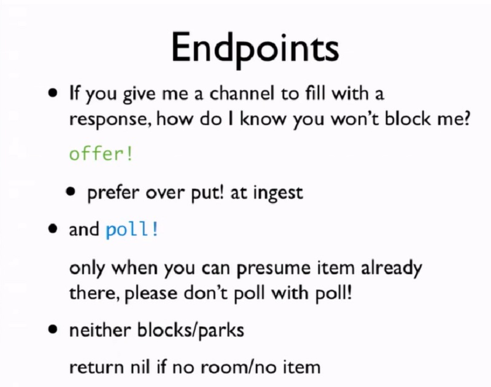

If you think a little bit about that use case of being a supplier to a
promise-chan, you get into the third category I wanted to talk about
today, which is just being a consumer of channels in a more RPC-like
way, or a more API-like way.  I think there are sort of two
fundamental ways to use channels.

One is you are building a flow network in your program.  So channels
are the interface points of subsystem boundaries, and you say this
subsystem has an input channel, and that is where it gets its stuff
from, as opposed to calling a function on it.  And it uses one or more
output channels to distribute its results, as opposed to sort of
somebody having called the function and getting the results.  That
decoupling is import for building systems.  That is why we like
channels, and you are going to compose a system out of channels
orchestrating ... out of processes, orchestrating the channels to wire
them together.  But you end up with a stable network of relationships
that are used to flow data.

But if you think about something like a promise-chan, or using a
channel for RPC, that is not that kind of enduring relationship.  You
_can_ use channels for these things, but the semantics get a little
bit trickier.  In particular, that thing I just talked about for
promise channels exists for RPC-like uses of channels.

So how many people are using channels as a way for an asynchronous
function to return a value to its caller?

[Audience response]

Yeah.  OK.  Look, it is already happening.  All right.  Now how many
people are concerned, when they put something on that channel, that it
might block them if the person who made the channel messed up and made
an unbuffered channel and has not bothered to come back and read it?

[Audience response]

I know I worry about that.  And you do not have a great way to
communicate about the semantics except, again, via convention to say,
"You better give me a buffered channel or dropping channel, because I
do not want you to block me."

[Time 0:55:38]

So we are going to have two new functions.  The most important one is
offer!.  What offer! does is it says, "If there is room for this in
the channel, that is going to get written to the channel.  If there is
not, it is just going to return nil.  Did not do it.  No.  Did not
happen.

As an API author, as an author of somebody who is using RPC with
channels or filling promises, you are going to tell the user, "I am
going to offer you a value."  Now that is a way to tell them quite
clearly they better have room for it, or they better be willing to
have it get dropped, because now you cannot get blocked.  If you call
offer!, it will not block, which means you can use it in "go" blocks.
It will not block.

And this is definitely a _much_ better semantic for those kinds of
scenarios.  You can say, "I will offer you values," and that is what
your documentation should say.  This function will offer the value to
the channel you provide.  So that is a lot cleaner.

There is a corresponding logic for poll!.  This is a lot less
justified except for sort of completeness and balance.  Here you are
saying, "You better have given me a channel with stuff in it already,
because I am going to poll it", and either there will be stuff there,
or it is just going to give me nil.

Now, how many people think polling is good?

[Audience response]

Nobody.  Right?  That is why it is called poll!.  If you put this in a
loop, you are polling, and everyone will know because you just said,
"poll!"  I am polling.  So I think this should be pretty rare, but I
would not say that there is no good use for it, but there is no good
use for polling, so neither of these block.
 

[Time 0:57:20]

```
slide title: pipeline

+ "don't do too much work in your callback function" is back:
  "... in your channel transducer"
  + runs under the channel lock
  + inhibits other channel ops
+ use pipeline instead
```

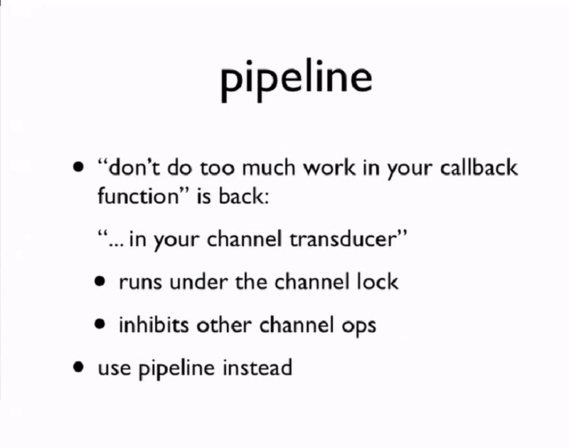

I am not going to have enough time to talk about "pipeline", except to
say "pipeline" is awesome.

[Audience laughter]

But one thing -- well, first of all, transducers and channels are
awesome, but you should be aware of the fact that a transducer in a
channel runs in the most protected part of the channel code, which is
in the part that transfers values in and out of the buffer, which is
the part that runs under the lock of the channel, which means that you
will impede other activity on that channel for the duration of your
transducer, which means we are back to the old, "do not do too much
work in your channel transducer ... or in your callback function."  So
now it is in your channel transducer.  All right, because of these two
things.


[Time 0:58:07]

```
slide title: pipeline

+ Moves items from one channel to another
+ subject to a transformation
+ with user-specified parallelism (first arg)
+ always in-order results
```

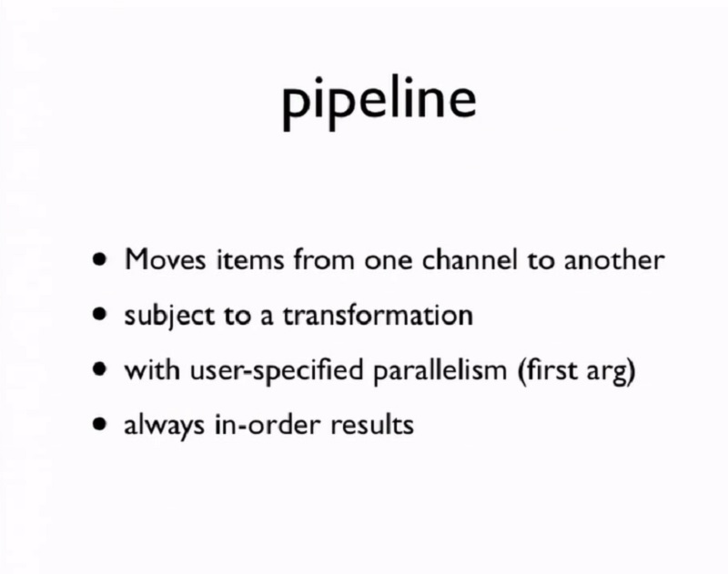

So there is a new set of three functions called "pipeline" that I
think encapsulate a whole bunch of what is pretty hard work to get
right, involved with pipelining.

So just so everybody is aware, what a pipeline does is it takes a
bunch of sequential work.  This is usually a stream of inputs and then
a job you want to do.  It is going to turn those jobs into a set of
parallelized work, and then return the results in order out through a
serial process.

You can think of "pmap" sort of does this, but "pmap" is sequence to
sequence.  And so "pipeline" is channel to channel, subject to a
transformation using a transducer.  And you are also able to control
the parallelism.  You can say, "Use this many threads or that many
threads.  Do this many at the same time".  So unlike "pmap", you have
a lot of control.  It takes a channel, returns a channel, takes a
transducer, but it is parallel in the middle.

There are three flavors.  I am going to talk about this.


[Time 0:59:03]

```
slide title: pipeline

+ 3 flavors
  _pipeline_ (computational)
  _pipeline-blocking_ (a blocking op per item)
  _pipeline-async_ (an async op per item)
+ pipeline and pipeline-blocking take transducer
  (pipeline [n to-ch xf from-ch] ...)
```

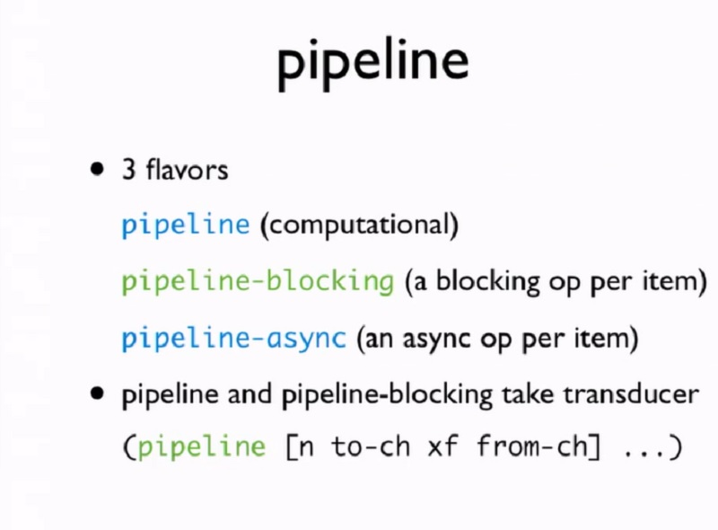

I am going to go five minutes late.

There are three flavors.  There is "pipeline" itself, which is for
computational purposes -- exactly what the transducer was for.  So do
not block in this thing.  Do not call an async function in this thing.
You are just here to calculate.  It is going to use the right threads
internally to do that.

There is "pipeline-blocking".  This says, "In the middle of the step
transformation I want to do, I need to block".  Well, this would be
catastrophic inside the transducer in a channel.  You are blocking in
the middle of a channel, and now the channel is blocked, so pipeline
is a better place to do that.

And then there is "pipeline-async".  Maybe you want to take everything
that comes through this channel and make a web call.  You do not know
when it is going to come back, and then proceed out the other side.

How many people have written pipelining themselves manually?

[Audience response]

Yeah.  How many people got it right the first time?

[Audience laughter]

Yeah.  And how many people find them doing it over and over again,
right, because it is a hard thing to sort of encapsulate?  So I think
channels give us the ability to sort of capture a pretty high level
pattern as a reified programming construct, so we have pipeline-async
as well.

Pipeline and pipeline-blocking both take a transducer.  So it takes N,
which is the amount of parallelism, the to-channel -- where is this
stuff going to go? -- the transducer, and the from-channel -- where is
this stuff coming from?  "pipeline-blocking" does the same thing.
 

[Time 1:00:31]

```
slide title: pipeline parallelism

+ uses appropriate threads for nature of job
  compute vs blocking vs async
+ because pipeline is parallel, transducers are applied per-item,
  not across items
+ so can't pipeline stateful transducers, e.g. partition-by
+ can still be filtering or expansive
```

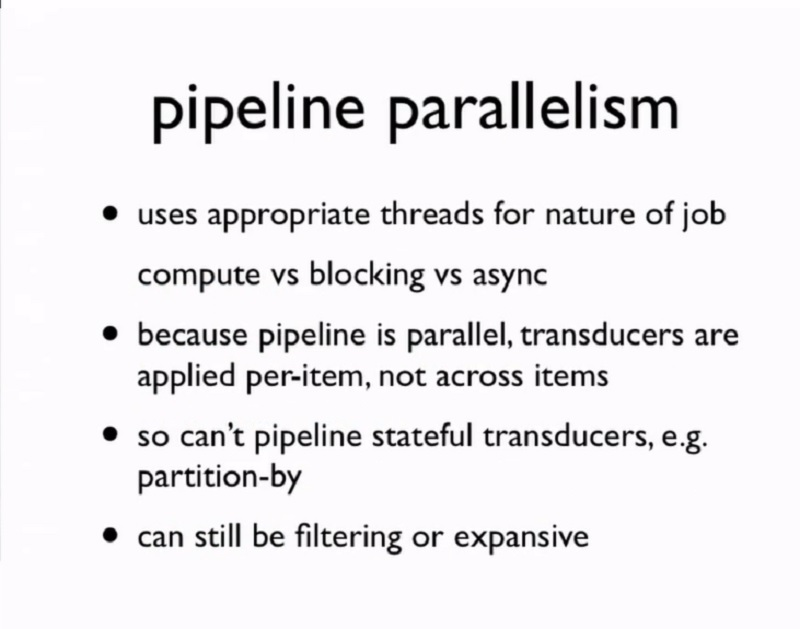

Something to be aware of is the fact that because pipeline is
parallelized.  Well, first of all, it is going to do the right thing.
For async stuff, it is going to use go blocks, and for compute stuff,
it can use -- for blocking stuff, it will use thread.  So it will do
the right thing.

But because it is parallel, you cannot do any stateful transducers.
Each of these things, you took work like this and turned it into that
briefly and then turned -- which way did it come in?  This way, then
that, and back out, right?  It keeps the order.

But, in the middle, it is parallel, so no stateful transducers.  If
you look at the doc strings for transducers, for all the things that
return transducers, they all say "stateful" when they return stateful.
You cannot use them in parallel contexts.  You cannot use them in
"pipeline".  You are not going to be able to use them effectively with
the parallelism versions of ... when we move reducers into a
transducer compatible format.

Of course, right?  You should think, "Of course not".  That is not a
problem.  They have utility in one context.  They do not in another.
All right.  That is OK.  There should still be round holes even though
that there are square pegs.

Because of that, your transducer is a "one operation at a time"
transducer, no state allowed.  But they can still be filtering or
expansive.  We can take one thing and return more than one thing.  We
can take one thing and ignore it.  What we cannot do is accumulate any
information across.  No state.


[Time 1:02:04]

```
slide title: pipeline-async

+ pipeline-async takes channel filling fn
  (pipeline-async [n to-ch af from-ch]
  _af_ is [input result-ch] -> nil
+ _af_ should return immediately, having launched async work that fills
  result-ch and closes it
```

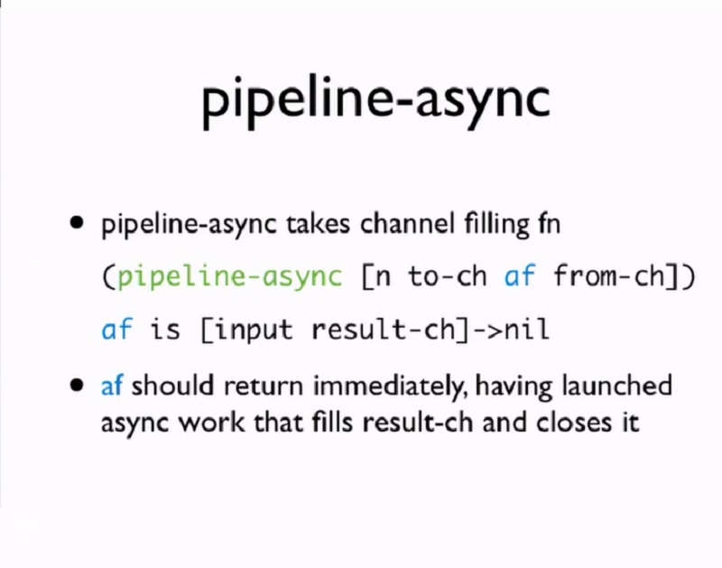

All right.  "pipeline-async" I really will not have time to go into.
It is a little bit different.  It does not take a transducer, because
it needs a way to get an asynchronous result, and it uses channels to
do that.  It will soon tell you it is going to offer your results to
the channel.  But basically it is going to give you your input and a
place to put, a channel to put the result.  Then it collapses all that
stuff and effectively streams it out the other side.  Between the
three of these, that should cover all your pipelining needs.


[Time 1:02:33]

```
slide:

+ core.async and transducers have seen great community uptake and feedback
+ keep it coming
+ more cool stuff on the way for 1.7
+ Thanks!
```

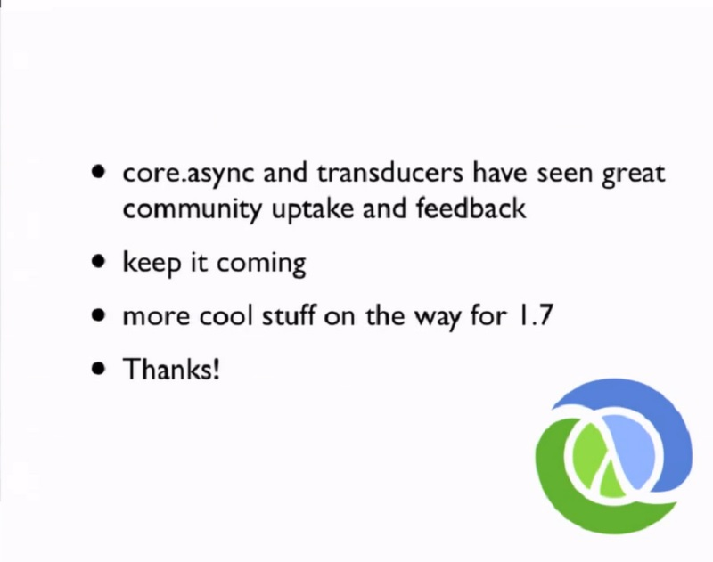

To wrap up, how many people are using transducers?

[Audience response]

All right.  How many people are using core.async?

[Audience response]

Yeah, so I think both of these have seen a lot of community uptake
early on, especially since transducers have still just been in the
alphas.  And a lot of great feedback, so please keep it coming.  It is
really great.  There is a lot more stuff coming for 1.7.  I think Alex
is going to run a thing on feature expressions later, which is
probably the next other big thing, so look forward to that and other
stuff, and rock on.

Thank you.

[Audience applause]

[Time 1:03:07]
