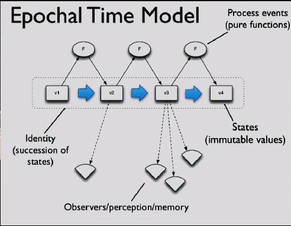
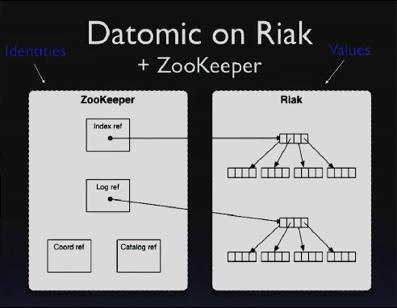

# The Language of the System

* **Speaker: Rich Hickey**
* **Conference: [Clojure/Conj 2012](http://clojure-conj.org) - Nov 2012**
* **Video: [https://www.youtube.com/watch?v=ROor6_NGIWU](https://www.youtube.com/watch?v=ROor6_NGIWU)**


[Time 0:00:00]

```
slide:

     TBD

  Rich Hickey

```

Thanks.  This is the third Conj and the fifth year of Clojure as being
a public thing, and I could not be happier to see everybody here, and
a lot of good old friends and new friends.  And so excited about the
vibrancy in the community and obviously the creativity of everybody
involved, so congratulations on what you are accomplishing.

Now what I have been accomplishing is something I call TBD.  And I am a
little bit frustrated because my thing leaked.

[Audience laughter]

[Time 0:00:44]

```
slide:

      B
    T   D
```

It is like one of those Apple keynotes.

So TBD.

[Time 0:00:49]

```
slide: 

       Better
     To      Do


+ Putting the personal in pmap
```

What does it mean: To?

[Audience member: (Indiscernible)]

To Better Do.

And that should have a little trademark, a trademark thing on it.

[Audience laughter]

So To Better Do is a new, massively parallel, concurrent, AI driven,
to-do list application.

[Audience laughter]

And our trademark is: "Putting the personal back in pmap".

[Audience laughter]

That is all I have.  There will be a GitHub repo tomorrow with nothing
in it.  And that will probably be all that it will ever be.


[Time 0:01:37]

```
slide: 

   The Language of the
          System

       Rich Hickey
```

No, so today I would like to talk about the language of the system.

[Time 0:01:45]

```
slide title: The Language Bubble

+ Programming Language defines world (w/Runtime)
+ I/O as if someone else's problem vs the point of your program
```

Which is a title that may not convey anything in particular, but
hopefully it will make some sense by the end.

So one of the things I think happens to us all, especially as
enthusiasts of languages, and some people use their language as like,
it is just a tool or whatever.  And then you find something that you
really like, and you become enthusiastic about it, and you look
forward to enhancing it, or making libraries for it, or making things
to interconnect with other things.  And you sort of define your world
synonymously with the world that is implied by your programming
language.

And it is impossible to avoid this, because the semantics of a
language, they eventually pervade your brain.  We say things in these
conferences that people from outside the Clojure community would be
like, how come you can say that?  And everybody says, oh, yeah, you
know.

[Audience laughter]

It is all data.  You know, it is all the data.  It is like, oh, yeah.
I know, it is.  I hear you.  I hear you.

So a programming language sort of defines the world.  And I am going
to say language here, and I really mostly mean sort of: the language
and the corresponding runtime.  Because we have languages, a lot of
languages at the bottom.  The primitives are kind of the same.  There
is control flow and things like that.  And the runtime sort of
enhances that with a bunch of other things.

But we get involved in this programming language as a world, and then,
of course, if it is a functional language like Clojure, we get even
more involved with, wow, this functional part, this is the good world.
This is the world I really want to live in, and everything else is
sort of like the ick.  So I have the good world, and we want to
minimize the ick.  And we call it I/O or something like that.

And by painting it as I/O, we almost sort of like to make it somebody
else's problem.  And Haskell is really good at this.  It is like there
a is monad and it is like: stay out!  It stays over there.  We do not
really force that, but by convention and discipline, we try to do
that.

But it is important to note that that has never been Clojure's
approach: to imagine that that part of your application was not
important.  I mean the whole existence of the state model is there
because actual programs need to do interactions with the world.  They
need to affect the world.  If you are not affecting the world, I do
not know why you are writing software.  So it really, really is
important.


[Time 0:04:04]

```
slide title: Language + Runtime

+ Memory model
+ Calling conventions
+ Resource management
+ Coordination
+ Abstraction
+ Types
+ ...
```

So if we look at what constitutes a language, and again sort of
language plus runtime, we get all of these facilities.  And this is in
no particular order.  But some of the things that really matter when
we start talking about the bigger picture as being either present, or
missing, or the analogies either hold or do not, are things like a
memory model.  So we have this presumption in Java.

Maybe in Clojure you are isolated from this.  But as the author of
Clojure, and as the author of the primitives that guard state and
memory transitions, the existence of a memory model in Java is super
critical.  It is a big, big promise and the fact that it is present,
it is true for all libraries written in Clojure or not that run in the
same runtime, that it is based upon a resource management structure, a
garbage collector that is shared, is a gigantic suite of facilities
that is common both to your language, other things written in the same
language, and things written in other languages.

Calling conventions: who even knows what a calling convention is any
more?  C programmers remember calling conventions, because you had all
these choices.  And maybe even in the absence of who is pushing what
at the stack level, we still have sort of conventions around deciding
whether we pass values or references.  Even in Java, though, that is
sort of disappearing.  But that would be one aspect of it.

Resource management, like I said, mostly in the memory space.  We know
eventually the runtimes and the languages start not helping us any
more with resources outside of memory.  There are all kinds of
coordination.  We have monitors.  We have volatile and things like
that to interact with the memory model that help us coordinate things.
And again, that is sort of embodied in the primitives in Clojure.
Swap and things like that are coordination primitives that rely on
coordination primitives down underneath.

And, of course, probably the biggest things that we derive from
languages, as we touch them, that are more fun -- again, there are the
primitives for control flow and whatnot -- are any of the tools for
abstraction and/or type stuff.  And of course some languages emphasize
this more than others.  And Clojure probably does not emphasize it
nearly as much as some others.  So that is what we talk about when we
talk about programming language, and typically language.


[Time 0:06:22]

```
slide title: System

+ Stand together
+ Ensemble of programs (services)
+ No global managers as with runtimes/OS
+ Connected how?

[ Photo of 3 legged stool. ]
```

When we talk about system, we are talking about something bigger,
bigger than a program.  In particular, I am talking about something
bigger than a program.  So the definition of system is -- the roots of
it are in "stands together".  And by that I think the interpretation I
would take is that one leg of this stool is not a particularly useful
thing.  And a stool with two legs is dangerous, but when you compose
enough of the pieces, you end up with something that performs
something, a useful function.

And it is actually these systems that most of us deliver.  How many
people have a main product of their effort that is a single program
that does not interact with any other programs?  How many people think
mostly what they do is build systems or parts of systems?  Right.

So we do that, but the programming languages pretty much stop before
the system.  In other words, the system is this composition of things
whose language does not know anything about systems.  It does not say
anything about systems.  It is an ensemble of programs.  And, of
course, there are lots of ways to build systems.  And I am going to
try to narrow the scope of that because, in the old days, any two
programs could talk to each other any particular way, and that is a
system.  And it is still a system.

I think, over time, we have gotten more disciplined about how we build
systems, and now we tend to think of systems as compositions of
programs that offer services to other programs, and it is an analogy
we can draw out of what we do inside programming languages.  You can
get libraries that give you services as you consume the library.  And
then in the process space you have services that you can call, and
they have certain APIs.  And you call them, and that is what happens.

But there are many things about a system that are very different.
And, in particular, there is no global supervision any more.  A lot of
what we get inside the language is not there.  There is no global
resource manager.  There is nothing watching everything.  There is
nothing that knows everything that is going on.  It could be more than
one process in the same box.  It could be more boxes.  There is no,
like, person in charge of the Internet making sure everything is okay.

And the question is: how do we connect these?  How do we connect these
pieces?  And the premise of this talk is that there is a way to talk
about the way we connect these pieces that draws analogies to the way
we talk about how we connect pieces inside programming languages.  And
it both informs the design of systems and, I think, goes the other
way, and systems should help inform the design of languages or the use
of languages.


[Time 0:09:01]

```
slide title: Language

+ 'Tongue' - communication
  programmer -> programmer

+ Programming Language
  programmer -> computer

+ System language
  program -> program
```

So when we say language, what do we mean?  The root, again, is tongue.
It is obviously about communication.  But everybody knows the old saw
about programming is: you think it is about talking to the machine.
And in a certain sense it is, but it is certainly also about talking
to other programmers.  So you write a program.  The other programmer
could be you, later.  Ten years later, you look at your code, you are
like, "Whoa!".

[Audience laughter]

Who said that?  But I think it does split out a little bit.  So I
think, in all cases, all programming language and all the use of
language I am going to talk about is somehow about programmers talking
to programmers.  But inside a programming language, there is also the
other aspect, which is the programmer talking to the machine.
"Machine, make this happen.  Do this stuff."

But that a very interesting, different characteristic of the
communication that occurs between programs in a system is that the
language that is used there is a language for programs to talk to
programs, almost definitely.  It is _extremely rare_ to see the
interface on a service be one that is oriented towards people, or at
least oriented towards people in human interaction, fundamentally.  It
is fundamentally oriented towards a program talking to a program, and
that is going to become really important as we move forward.


[Time 0:10:22]

```
slide title: The Stacks

  Program                 System
  ---------------------   -----------------------

  Application libs        Application as services

  Runtime and core libs   ?

  Language primitives     Protocols and formats
```

So one way to think about these two things is as stacks, stacks of
specificity and hierarchy and encapsulation.  So at the bottom of a
programming language is a bunch of primitives, language primitives for
control flow, for memory acquisition, and things like that.  Then on
top of that we have core runtime facilities and core libraries and/or
libraries from third parties.  And then, finally, we build our
application libraries and our applications on top of that.  And that
is sort of all inside the program, inside the program view.

If we look at systems, I think it is a little bit harder to sort of
tease out what are the primitives of systems.  But certainly if you
start with the communication side, you end up with two very evident
pieces to the language of systems.

One are the protocols: UDP, TCP, HTTP, Web sockets, all these things.
Sort of the negotiated transfer primitives that we have.  And the
other are the formats: What do we say over these protocols?  And I
think that is pretty evident and straightforward, although I will talk
more about formats, but not at all any more about protocols.  The
analogy to the next level up, though, I think, is an area where we are
particularly weak in having good language for it, and it is where the
focus of this talk is going to be.

And finally, somehow, at the top, we end up with either portions of
applications or entire applications acting as services and/or
consuming each other as services.  And that is a system.  Of course,
there is a joining here because those things that are the applications
on the right were written using the stack on the left.  But the stack
on the left does not have a lot to say - usually - it does not have a
lot to say about the stack on the right.


[Time 0:12:16]

```
slide title: Say What?

+ XML, JSON, Protocol buffers, Avro, edn, Hessian, BERT ...
+ All data, but
+ Extensible? to new types, new versions
+ Self-describing?
+ Schemas? explicit? in/out of band?
+ Generic processors and intermediaries?
```

So the first thing we have to talk about is, "Say what?"  Again, we
talk about protocols and formats, but formats are huge.  How many
different ways do we have to talk over these wires?  What are we
sending?  XML, JSON is probably the big winner right now, Protocol
Buffers, and then, of course quite common in this room would be EDN
and Clojure data.  But there is also Avro and Hessian and BERT.  How
many know what all of these things are?  Not too many.  How many know,
of those people, could make a matrix as to why one is better or
different than another?

And yet this is actually pretty important.  This is what we are going
to be saying from one process to another.  It is a _huge_ thing.  And
it is full of decision points.

I think one of the things that is really cool about it is: all of
these things are representations of data.  What is not up here?  What
key Java technology for things talking to other things is not here?

[Audience member: RPC]

That is not really what --

[Audience member: Serialization.]

Yeah, with RMI.  RMI, yeah, a big winner.  How about DCOM?  CORBA?
Anybody?  Okay.  Those are not even on this list, right?  They all
lost.  They all lost for really good reasons.  So we are not even
going to talk about that.  We have already reached the point where
every single one of these choices is a data format.

So already we have got this great premise.  The way services are going
to talk to each other is by conveying data, not through some
hyper-linguistic or extended linguistic thing where there are all
these extended verbs, and there is a notion of a program object being
on a different machine, and things like that.  We are just going to
talk with data.

So we have to talk.  We have to split out: what about the data is good
or bad?  What are the decision points?

[Time 0:14:09]

One is extensibility.  Given this format, if I have a new thing to say
to you tomorrow, is there a way for me to encode that?  If there is
not, it is not extensible.  Which of these things on the list is not
extensible?  JSON!  There you go.  That is really not good.  And it
leads to a couple problems we will get to later.

And there are two notions of extensibility.  One is to new types.  The
other is to new versions.  There is a sense in which, for instance,
Protocol Buffers are really mostly about being extensible to new
versions.  You can make things go to new types, but an existing
consumer cannot be really aware of those.  But they can be tolerant of
new versions.

Self-describing: which of these things is self-describing?  XML, kind
of sort of.  What else?

[Audience member: Protocol buffers]

Not Protocol Buffers.

[Audience member: Avro.]

Avro, EDN, Hessian, and BERT, and Erlang's Transfer, which is what
BERT is a flavor of.

What does that mean: to be self-describing?  It means that if I have a
decoder that understands the rules of the format, I can read anything
that you send, and I do not need to know anything else out of band.  I
do not have to get a description any other way.  That is not true of
Protocol Buffers.  If somebody starts streaming you Protocol Buffer
stuff, it is like gobbledygook if you have never seen the schema, and
where is the schema in the Protocol Buffer stream?  It is _not_ in the
stream.  It must be transmitted out of band.

So we get to this other part, which is schemas: in or out of band?  Of
the ones that are self-describing, one of them has schemas.  Which is
that?

[Audience member: XML (indiscernible).]

That is optional though.  But one has one that is required for reading
them.

[Audience member: Protocol Buffers.]

[Audience member: Avro.]

No, Protocol Buffers are already out.  Avro.  Avro has a prelude
schema thing.  So then you have this question.  Are the schemes in or
out of band?  Avro has schemas.  Protocol Buffer has schemas.  Avro's
are in band.  Protocol Buffers are out of band.  But both of those
have more requirements on the schema interpretation than something
like EDN or XML.

[Time 0:16:30]

Of course, XML, you can definitely read it.  You may not understand it,
but you can read it without anything.  If you have schemas, they are
sort of optional.

Why does it matter whether or not schemas are in or out of band?  It
is on the slide.

If you have schemas, what can't you have?  If you have out of band
schemas, what can't you have?  You cannot have these things: generic
processors and intermediaries.  It is really interesting that Google
came up with Protocol Buffers.

Imagine if the Internet was built with Protocol Buffers.  How good
would Google's search be?  It would be bad, because they are in the
intermediary business.  They are taking advantage of the fact that any
HTML processor can read any HTML.  If everything was a negotiated
contract, it just simply would not work, so you really have to
understand.  It is not to say that Protocol Buffers are bad.  I am not
saying that.  But what I am saying is that there is a spectrum of
choice and tradeoffs that is _really_ important here.

It is as important as choosing a language when you pick your
programming language.  But picking any programming language now leaves
you with this decision when you move up to the system level.  Of
course, a lot of times this is not your choice.  You are consuming a
service that somebody else has made a choice.  And that highlights
sort of the next problem in this space, which is that there is nobody
in charge.

When you use a programming language, the programming language kind of
sort of says, "We are all going to pass arguments like this, and we
are going to define our types like that, and everything else."  And
with no one in charge, systems struggle against this set of
independent decisions, which may or may not compose.  And the formats
problem is the first place this comes up.  So this schema is out of
band is really tricky.

[Time 0:18:13]

And that is one of the things where people are like, oh, JSON.  I
could put dates in JSON.  How do you put dates in JSON?

[Audience member: (Indiscernible)]

As strings.  And how do you know they are there?

[Audience member: (Indiscernible)]

Out of band.  You go back to the napkin, right?  It is like if the key
has the word "date" in it, then the string is a date.  There we go!
And so there is another aspect of that, which is: that is not merely
out of band.  If you get a Protocol Buffer schema out of band, it is
not a napkin.  It is very straightforward.

JSON is very, very -- the people's _use_ of JSON is extremely context
dependent, and a lot of times that context is not captured anywhere
except on a napkin.  It is like, OK, we have all agreed to send this,
and you know this is coming.  And therefore, you are going to go to
the "last edited" field, and you happen to know that "last edited" is
a string that has a date in it.  So that context sensitivity is really
bad.


[Time 0:19:12]

```
slide title:  Values

+ Most often ephemeral, on wire
+ Need names when not
  + passing large values,
  + memory
+ How to distinguish value from reference?
  + permalinks etc
```

So obviously in this room we do not have to talk about the value of
values.  We like values.  And I think the only thing to do here is to
sort of, again, think about the differences between programming
languages and systems with values.  So we definitely have values in
systems, at least at one level: on the wire.  We just looked at all
the popular formats for transmitting stuff.

They are all data formats.  They are all values.  We are not really
passing a reference to a guy that you are going to then call back on
his RMI interface to go get more stuff and have this big, chattery
communication with objects.  We just convey the data that we care
about.

So that is fine.  Those are ephemeral, and they are usually nameless.
And, in programming languages, values are often usually nameless.  We
have the same notion.  We can pass values.  We get our value as a
return from a function.  We just have it.  We start processing it.

Java is not a particularly strong language for values because
everything, almost, is a reference type.  But in languages that really
have them as distinct things, a lot of times values are completely
anonymous.  You have an array of structs.  None of the structs have
names.

If, however, you want to have a value in a system that is not
ephemeral, that means that either - maybe it is large.  It is so
large, I do not want to put it on the wire and send it to 100 people.
I want to put it somewhere and let the people know where it is.  Or I
want to have memory in a system.  I want to remember a value.

In both those cases, you end up incurring a new thing, which is that
your values need to have names.  And that is a definite change versus
your programming language.  It is one that really matters, because
until we start becoming more cognizant of when we are manipulating
values and that this is a name that names a value, we are going to
keep making these icky, messed up systems that do not distinguish
references from values.

For instance, how do you know when a link is a permalink?

[Audience member: (Indiscernible)]

You do not know the link is a permalink.  Because, on the Web page
where you got it, it said: "this is a permalink."

[Audience laughter]

And so, when designing a system, you need to be more considerate of
this and call it out.


[Time 0:21:30]

```
slide title: Names

+ Global scope
+ Namespaces critical
+ Very few used for 'code' or verbs
+ Services, machines, storage locations etc
```

So that brings us back to names.  And again, here, we sort of have
this difference.  Inside a program, we have all these great scopes.  I
am in a local scope.  I have a let.  Just nobody knows about this.
Now I am in a function.  I am also sort of cool.  And this function is
in a name space; that is also sort of great.  And then the name space
is on GitHub, and then what happens?

Then we are all fighting for cool names on GitHub.  We are going to
use up all the characters, and all the stars, and robots, and names of
food.

And so it is really critical, once you lift up as a system, and nobody
is in charge any more.  What is true of most system names?  They are
global.  They are potentially global.  And you really need to think
about that.  You really need to be considerate of the fact that as you
start building systems, as your names start escaping out of your
processes, that they are global names.  And the really tedious things
like Java's com.whatever.whatever, that stuff matters.  Because what
is com.whatever?  Where did that come from?

[Audience member: (Indiscernible)]

Somebody who is in charge.  There is a somebody in charge there.  In
the absence of that, it is a free for all.  And so those DNS names and
whatnot become critical.  And using fully qualified namespace names
that are truly global names is an important discipline for doing
systems.

But it is also interesting to think about how different the names are.
Especially in a Clojure program, 99% of your names are what?

[Audience member: (Indiscernible)]

They are one of two things.  They are either locals or what?

[Audience member: (Indiscernible)]

The names of functions.  And we have a huge, huge number of names
dedicated to functions in our programs.  That is where most of our
names go.  They are mostly verbs.

What happens in systems?  Who likes to work with a system that has a
ton of verbs?

That is really interesting.  Why is that?  There is all of these
inversions as we get to systems, aren't there?  We have got lots of
names of verbs, hardly any.  We have this global control.  We do not
have global control.  And we are going to have a lot of names in
systems, but they are going to be used for other things, probably not
verbs: machines and things like that, storage locations.  And then
these values are going to need names, which is another critical thing.


[Time 0:24:04]

```
slide title: Read Between the Lines

+ Where do the semantics of a system live?

      +---+   +---+         +---+
      | 7 |   | 5 |         | 3 |
      +---+   +---+         +---+
        | \    |             | |
        |  ----|------      /  |
         \    /       \    /   |
          V  V         V  V    |
         +----+       +---+    |
         | 11 |       | 8 |    |
         +----+       +---+    |
          |  | \     /         |
          |  |  ----|------    |
         /    \    /       \   |
        V      V  V         V  V
      +---+   +---+        +----+
      | 2 |   | 9 |        | 10 |
      +---+   +---+        +----+
```

So systems look like this.  Every process has a number.  No, obviously
they do not.  This is - I am being lazy on Google images.  That has
circles and lines.  It is faster than me trying to learn how to do
that in Keynote.

Does anyone know how to make a line connect to a thing and stick?

[Audience laughter]

Like, I moved the thing, and the line is just sitting there.  Can you
make them connect?

[Audience member: Omnigraffle]

No, I can do it there, but then it is like two things.  And then the
Internet has this picture.  So if you ignore the numbers, the numbers
are not important.  The numbers are not important.

But a lot of systems have this shape.  It is fundamentally
hierarchical.  It is not like everybody is calling everyone and it is
this big, big nightmare.  It is generally some things call other
things call other things, come back, come back.  And there is some
sharing across.  There may be a couple of lines across at a level, and
there may be one guy at the top.  From your perspective that is you.
Ooh, I get to consume all this stuff.  And maybe I do not serve
anybody else.  It depends on how I am situated.

But the critical thing here is that: while each of these things, in
their bubble, might make a ton of sense, maybe they are written in
Haskell and, like, it is proven that they are correct or something
awesome.  As soon as you start drawing lines between them, what
happens?  All sorts of new implications about what things mean have
_arisen_, have _emerged_, from the connections of these things.  And
it is different in some way from consuming libraries.

You might look at this and say: this is not different from libraries.
When I have libraries it is the same thing.  They wrote the library,
and they did whatever.  Then I am consuming it.

But what do the library and you share?  A _ton of stuff_.  All that
runtime stuff.  You share all kinds of presumptions about memory,
coordination, locking, threads, garbage collection, the whole nine
yards.  What do you share between these things?  Some wires, routers,
and things like that.

So the question is: where do the semantics of the system live?  What
does this mean?  How can we define the pieces such that we can sort of
get a grip on what this is?  So usually it is hierarchical, but that
is not enough to really understand it.


[Time 0:26:14]

```
slide title: The Revenge of Objects?

        DANGER [in bright red oval]

+ 'Service' is an arbitrary notion

+ Triggering effects across a graph of stateful
  --objects-- [strikethrough that word] services
```

And this is where I think we really run into trouble.  This is where
the problem is.  What does that look like?

[goes back to previous slide "Read Between the Lines"]

It looks like object-oriented programming.  All these objects, they
are connected, and they send stuff to each other and whatever.

[goes back to slide "The Revenge of Objects?]

And it is possible that this system, built out of all these processes,
is exactly like objects at scale.  Every process is like an object,
and it is stateful, and it sends things over to other guys, and then
they change, and the whole thing is really ... exciting.

[Audience laughter]	

Because service is an arbitrary notion.  What does it mean to be a
service?  You send me stuff, and I do stuff.  One thing that is sort
of telling is, there aren't a lot of verbs, which is kind of good.
But all the services are still nouns.  The fact that they do not have
a lot of operations is helpful about saying: maybe they are not like
objects.  But there is nothing stopping them from being objects.

That is crossed out, right?  Yeah, so in what way is this not object
orientation?  How do we keep it from being object orientation in the
large?  Because if we have spent all this time doing functional
programming in the small, only to build object-oriented programming in
the large, then our system in the large is still going to have the
negative attributes of object orientation.


[Time 0:27:46]

```
slide title: Welcome to the Machine

   [ Figure of a multi-part machine that looks like
     it is arranged in an assembly line fashion. ]

+ Machines apply force to accomplish work
+ That's what systems do!
```

So I think one way to think about this is to think about machines and
production lines and things like that.  What we are trying to do here
in the next few slides is to try to think about a way ...  Obviously
we are saying change happens.  We know that this is a dynamic system
that is producing stuff.  It is affecting the world.  That is the
_point_ of it, so we are not going to try to _deny_ that.

But what is a way to organize it such that we do not end up with
object mess?  And one way is to think about it like this production
line thing.  So what does a machine do?  A machine applies forces to
accomplish work.  Now think about like a car factory.  What happens in
a car factory?  People go in there every day, and they work real hard,
and they mutate the state of the car factory, and then they go home.
Right?

[Audience laughter]

That is like objects.  It is like an object-oriented program.  Maybe
some stuff - No! it is not like that.  There is like one end of the
factory, and something comes in there.  What?  Raw materials, parts,
iron, and tires, and stuff.

And then something comes out the other end.  What?  Hopefully cars.
And so this notion of flow, I think, is the key to keeping a system
sorted.


[Time 0:29:11]

```
slide title: Avoiding Objects

+ Transform (values)
+ Move (values)
+ Route (values)
+ Record/remember (values)
+ Keep separate
+ _flow_ vs places
```

So there are a bunch of characteristics that you can combine that will
-- even though that technically a certain percentage of them are not
functional -- accomplish something in a way that is not place
oriented.  If you have heard me talk negatively about place
orientation.  That we all went into the factory and had a good time
and went home, and the factory is now better -- this place
orientation.

And this kind of flow orientation cures that.  So what are the things
that we have in flow?  We have transformation.  So one of the things
we are going to be doing is transforming values.  I am going to take
the lugs and the whatever things go in, the tire.  I am going to screw
them together, and now I will have a wheel instead of the parts of a
wheel.

We are going to move things from one place to another.  We are going
to route them.  Maybe it needs to go here or there.  We are going to
have decisions about that.

We may remember things.  And again, the word "remember" is a term that
is not incompatible with functional programming, in a way that update
is.  And I think the critical thing to sort of making systems out of
these parts is that you, as much as possible, keep them separate.  In
other words, when you make a transforming, moving, routing,
remembering thing, it is really going to be hard to keep that from
being something you cannot take apart and reason about or combine with
other things.  So even though each of these steps, I think, has a
sound use, if you were to put them all together in one thing, it would
not be sound any more.  So you want to keep transforming separate from
moving, and moving separate from routing, and routing separate from
remembering, things like that.

And this is the difference between flow and places.  But move and
route and remember are not strictly functional.  That is okay.  We
know we need to affect the world.


[Time 0:31:08]

```
slide title: Transform

     [Greek letter lambda]

+ Values on I/O straightforward
+ But sometimes work from/to storage
```

So transformation, this is the thing that is easiest.  We know
transformation is just functions.  It is basically straightforward.
The only thing here is that generally there might be some input to the
function, which is now not just sort of a local input from a call from
a programming language, but it is coming over a wire, and there is
output over the wire.

The thing that gets a little bit trickier sometimes with functions at
the system level is that sometimes you need to convey information off
the wire.  I need to have put it in a database so that you can see it
later, and I am not going to actually put some huge thing over the
wire to you in every message.  And, in that case, you now have this
sort of stranger view where I need to run this function, and what I
have is not the value but what?

[Audience member: (Indiscernible)]

The name of the value.  And I am going to try to distinguish the name
of the value from a reference because they are actually different.  So
sometimes you work to and from storage.  Otherwise, though, it is
still functions.  This is not hard.


[Time 0:32:10]

```
slide title: I'm a Mover

+ Queues rule
  decouple producer and consumer
  identity and availability
+ Move/route _values_
  Pub/sub etc

[ Figure of a line of identical objects on a conveyor belt. ]
```

Now we get to moving things around.  I think it is one of the things
in Clojure maybe I did not make clear enough, because I did not need
to wrap them, is that the queues in java.util.concurrent are awesome.
If you are not using them as part of your system designs internally,
you are missing out.  And, in the large, queues also rule because they
have this really great characteristic: they are completely decoupling.

Messages: What happens with a message?  A says something to B.  When A
says something to B, what does A need to know?  B.  That is a problem.
If A puts something on a queue, who gets it?  Don't know.  So that
decoupling is really good, both in the identity of the consumer.

Also in the availability.  If I put something in a queue and the
person who is supposed to consume it is not running, do I care?  Not
usually.  There may be backflow and some other kind of considerations,
but the availability of the consumer is also something that you do not
care about.  Again, a directly connected message: A said something to
B.  If B is not around, that is now a problem for A.  If A puts
something on a queue, presumably if you can make the queue more
available than B, you get this independence, both in the identity of
the consumer and the availability of the consumer, which is extremely
strong.

The other great thing about conveyor belts and queues is that what do
they do?  What is their job?  Move stuff.  What is their other job?
There is no other job.

[Audience laughter]

That is all they do.  So it has that characteristic we had from
before.

When you get to pub/sub, you end up with routing and moving, and they
are both on this slide, but that is really strong.  Queues are
extremely important.  Queues are _decidedly different_ from messages
for those reasons.  Messages, they need an available consumer, and you
need to know who you are talking to.  It is architecturally
_completely_ different.


[Time 0:34:17]

```
slide title: Memory     [ figure of human brain ]

+ Epochal time model still works
+ References (identities) to values
+ Coordination a la carte
```

All right, now there is memory.  This is the part that is really
tricky, because you do not have a ton of great options for memory that
are not place oriented.  There is a new thing that is kind of good for
this.

[Audience laughter]	

But you do not need to even use that.  The key point I want to make
here is that the epochal time model, the one that is behind Clojure,
it works in systems.  It works at the system level.  I am going to
show you the picture again later.  But the basic idea is what?  We
have reference types.  And we have values.  And the reference types
only ever contain values.  They only ever just point to values, and
they have semantics about how they transition from one value to the
other.

There is nothing about what I just said that is about Clojure, that is
about memory, that is about locking.  There is a little bit that is
probably about CAS, but not CAS on the chip.  It is a very, very
general notion, and Datomic implements that notion in the large, but
you can also implement it yourself.  And you are going to need to
combine a couple things.  You are going to need to combine naming
values with some sort of reference and some sort of a la carte
coordination.

[Time 0:35:29]

```
slide title: Epochal Time Model
```



So this is my old slide of the epochal time model.  Clojure implements
this.  We know atoms are this.  Refs are this.  Agents are this.  And
we can do this ourselves.  We are going to say we have a reference.
It takes on different states over time.  Each of the states is a
value.  You are able to obtain the value out of the reference as an
independent thing.

And we just said before about values in systems that you are going to
need to get a hold on, are going to need to have what?  Names.  They
are going to need to have names.  That is what is different.  And then
we can transition from values to values.


[Time 0:36:06]

```
slide title: Datomic on Riak + ZooKeeper
```



So we can see this in action in the way Datomic uses ZooKeeper and
things like Riak or S3.  So Riak and S3 do not have the semantics
required to do the state succession.  They do not have what you need
to do that.  You need something along the lines of either CAS, or
versioned updates, or something like that.

But ZooKeeper, they have that.  They have versioned updates.  So you
can combine them, and you can implement something like refs in
ZooKeeper, that point to values that you store in something like Riak
or S3 or a store that does not otherwise have the consistency or the
ordered transitional semantics.

And you can pull tools out like Avout right now and do this for
yourselves.

[ Avout: https://github.com/liebke/avout ]

So the important thing to note is that the Clojure state model is
available at the systems level.  You do it this way, and the only
thing you have to do is put names on your values.  What is a good name
for a value?

[Audience member: UUID.]

UUID.  Is that Stu?

[Audience member: No.]

No.  That is good.  Stu is always my spoiler.  Yeah, UUID.  What is
not a good name?  Fred.  I got this from wherever, or anything else.
Because what starts to happen when you have those kinds of names?
People start to care about them.  What should you care about, about a
value name?  Nothing at all.

[Time 0:37:38]

Also, because a lot of the places where you are going to be putting
values, you really want to be conflict free.  You do not want to have
to coordinate on values.  You do not have to - oh, is this Fred 27 or
Fred 217, or whatever?  You just do not want to be there.  So UUIDs
are a good thing to use to name values.  You do not care, because that
is not the identity.  What is the identity?  The one over here, which
you are going to have very few of.

For instance, in Datomic, you could have hundreds of millions of items
in Datomic.  Do you know how many refs you are going to have in
ZooKeeper for a database?  Three.  You know it now, right?  You have
built systems in Clojure.  How many refs do you end up having?  How
man atoms?  A tiny, tiny amount.  Probably the best thing about
Clojure is showing people how little of that you actually need.  It is
the same thing here.

But the strong names, the globally qualified name space names, will be
the identity names.  That is really important that they be like that.
The value names, you want to be conflict free, tear off names that
anyone can create without coordination, and that is what a UUID is
about.


[Time 0:38:49]

```
slide title: Failure

+ Partial
+ Independent
+ Timeouts
+ Retries, idempotency
+ http://www.erlang.org/download/armstrong_thesis_2003.pdf
```
[http://www.erlang.org/download/armstrong_thesis_2003.pdf](http://www.erlang.org/download/armstrong_thesis_2003.pdf)

All right, of course this is my favorite topic: errors and error
messages and whatever.

[Audience laughter]

So there is this really important paper at the bottom here.  And if
you read this paper over and over again, which I recommend, you are
going to see a couple of facts about systems.  And it is another way
in which systems are really different from programs.

In a program, are you really afraid that some object you are going to
call is not going to be there?  No.  The whole program tends to be
around, or not, all together.  It succeeds or fails all together.

We get all confused because we live in this bubble.  It is like,
"errors are when I made a mistake."  That is not right.  That is just
like programmer convenience thinking.

In the real world, failures are all the time.  The things that you
depend on are possibly not there all the time.  A large system is in a
state of partial failure almost continuously.  The math is against you
for having all of your 10,000 machines always work all the time.

So parts of your system, when you look at the whole thing, will not be
working.  It also means that those things that are not working will
not be available.  Those failures are going to be uncorrelated.  They
are going to be completely independent.  You still are fine, but
somehow the thing you are talking to has become unresponsive or
unreachable or whatever.

[Time 0:40:29]

And it starts to give you a whole new way of thinking about dealing
with failure.  Because the things you are talking to are unreliable,
you have to use timeouts.  You have to retry.  If you are going to
retry, you have this open question.  I might not have heard back from
you, but you might have heard my original request and done it.  So I
need to know that my future requests are idempotent.  Who is worried
about that when you are working on stuff in memory inside your
program?  You do not worry about these things at all.

But the thing is, as soon as your program becomes part of a system,
these error modes are going to go right through your program.  You are
not going to be able to deny them, and you are not going to be able to
convert them into something else.  You cannot fix them.  They go right
through you.

And as soon as they go right through you, you realize that distributed
error modes are the _only_ error modes.  Everything else is just like
programmer convenience error handling stuff, but it is not really what
the system's error modes are about.

So I definitely recommend that you read the paper because you cannot
think about it often enough, and it really is difficult to
internalize.  And you will still write systems where you presume the
best, and then you are like, ah, the best thing is not going to happen
sometimes.


[Time 0:41:45]

```
slide title: Systems are Dynamic

+ Membership
+ Capacity
+ Capability
+ Discoverability, scalability, elasticity etc
```

So the other things about systems is that they are dynamic, and they
are dynamic in a whole bunch of different ways.  They are dynamic in
membership where we just said some machines come and go.  Sometimes
they will come and go on purpose, not because they failed, but because
somebody started some more machines.  They will come and go for
capacity as people are trying to scale.

They will also come and go for capability.  The system will be
running, and all of a sudden somebody wants to do something new, and
they will start up new stuff.  And systems that can become dynamically
capable of doing new things are really strong systems.  It is the kind
of system that you want to pursue.

And so all new kinds of terminology is going to come to bear at the
system level that you do not have inside.  You cannot scale one box.
But you can scale a system.

There are not usually the same notions of discovery.  Somewhat.  Maybe
if you are talking about injection and things like that.  But the true
notion of discovery is a distributed thing.  Elasticity is the same
kind of thing.  So we know that systems are dynamic, and that has
implications for the programming languages.


[Time 0:42:48]

```
slide title: Holistic Approach

+ e.g. Erlang
+ fundamental language units are services
+ bespoke communication
+ specified model (actors)
```

So there is a holistic approach to this.  And there is a great example
of the holistic approach to this, which is Erlang.  Erlang _is_ a
language of the system.  It takes the approach of saying: I am only
going to be building systems.  I know that up front, and I want these
semantics inside the processes.  I do not want different sets of
semantics.  I do not want my bubble semantics and my system semantics.
I do not want my bubble interfaces and my system interfaces.

Just so you are not worried, this is not where I say, "we should all
switch to Erlang".

[Audience laughter]	

I just saw everybody is like, "Oh, my god!  Did he change his mind
already?"

[Audience laughter]

"It has only been a couple years."

No, so there is nothing wrong with a holistic approach.  In Erlang,
the fundamental units of programs are services.  They call them
processes, but they are little services.  They have communications
capabilities.  But they follow all the things that we talked about
before.  In particular, it is not like RMI.  Those little services are
not like objects.  They send what?

[Audience members: Messages.]

Messages, which are data.  They are data.

[Time 0:44:01]

It is, though, custom communication that they use, and there is a very
specific model baked into the language that basically said: we are
going to do actors.  We are going to do asynchronous, send only,
receive asynchronously, no synchronous communication.  RPC you have to
build out of pieces and things like that.  So there is a very, very
specific model here, which I think is extremely well suited to making
communications programs.

But what is the tradeoff with the holistic approach?  Is Erlang a
great number crunching language?  No.  Is it really expressive in
certain kinds of domains?  No.  Definitely, it is good at some things
and less good at other things.  It does not have a rich type system.
It does not have a rich abstraction model or other things.  So the
tradeoff of a holistic approach is just sort of you put all your eggs
in one basket.

I think the fact of it is: you are never going to be able to dictate
to everybody to use Erlang or use any one thing.  You cannot say: we
are all going to do our programming in this one language.  That is the
whole "there is a king of the world" thing.  Inside Ericsson, maybe
they can do that and say everybody is going to do Erlang.  But in the
world on the whole, I do not think you can sell holistic approaches
because you cannot convince everybody to use the same language, even
if it is better.


[Time 0:45:19]

```
slide title: Heterogeneous Approach

+ Cross-language/runtime/platform
+ The language of the system:
  + Protocols (TCP, UDP, HTTP etc)
  + Formats (XML, JSON, edn etc)
  + Simple Services
```

So that leaves us with the heterogeneous approach.  We have to have
some sort of cross-language notion of how to talk about things, how to
express the semantics of systems, and what the language of systems are
that crosses languages, and runtimes, and platforms, and things like
that.  And, as I said at the beginning, we know parts of that language
are protocols and formats.


[Time 0:45:43]

```
slide title: The Stacks

  Program                 System
  ---------------------   -----------------------

  Application libs        Application as services

  Runtime and core libs   _Simple_ Services [highlighted for emphasis]

  Language primitives     Protocols and formats

```

And I think the third part, the thing that fills in this box, are
things that I will call "simple services".  So a simple service is a
service.  It is its own process.  It does communication using data.
It should have a very small surface area in terms of the API.  If the
API is mostly data, it should have an extremely small number of verbs
associated with it.  And it should do mostly one thing.  And you will
see that a lot of the facilities of programming languages and runtimes
are now available as services.


[Time 0:46:17]

```
slide title: _Simple_ System Services

+ Communication (message queues)
+ Coordination (ZooKeeper)
+ Control flow (AWS Simple Workflow, Storm)
+ Memory (memcache, redis etc)
+ Storage (S3, K/V stores et al)
+ More, and smaller - the best do the least
```

So we have queues.  We have java.util.concurrent queue and then how
many message queues are out there?  Tons, tons, all with different
characteristics, and you will make different choices.  But there are
plenty of message queues that are dedicated to that.

Now, unfortunately, this says simple and if I knew how to use Keynote,
that would be blinking and on fire.  I saw fire was good.

It is super important, and I think one of the challenges for this
approach is, invariably, people would like their service to do some
more.  And making it do a little more also breaks the simple part.  So
for instance, queues usually have very, very icky durability things,
like, once they start to get into that space.  And all of a sudden,
wow, this is not simple any more.

Coordination, things like ZooKeeper are _extremely_ interesting.  If
you have not used it, or something like it, it is very cool to think
about all I have over here is just coordination.  And if you can
constrain yourself to that, of course, again, ZooKeeper is durable,
and you could try to treat it like a database, and now you are trying
to make it do more stuff and not use it simply, because it does do
more.  But if you treat it simply, it is a fantastic, little utility
just to do that part of the Clojure state model or whatever - epochal
state model.

Control flow, you have things like Amazon Simple Workflow and Storm.
We just saw an example of Storm before.  Look at Storm.  What is it?
It is what I have been talking about.  It is this flow model.
Although, again, it sort of says: this is the recipe that crosses all
the pieces, as opposed to saying we are going to compose queues plus
arbitrary consumers of queues and other queues.  It sort of says: I
want to wrap around your whole thing, and I want you to play this
coordinated game.  So again, it is less simple than it could be.  But
as an architectural strategy, it is an example of what I am talking
about.  It is flow oriented.

[Time 0:48:14]

We are used to memory services.  Memcache is a beautiful thing.
People are like, oh, memcache, blah, blah, blah.  Most of the problems
with memcache is people are using it to solve horrible problems with
using place-oriented databases.  That is a sucky problem.  That is not
a suckiness of memcache.  Memcache is brilliantly simple and it does
exactly one thing.  Of course, they keep trying to make it do a little
bit more, but it does the one thing it does really well, so that is
shared memory.

Redis is another popular example.  Again, hopefully they will keep it
simple.  And, to the extent they do, it is the kind of thing you can
compose together.

And, of course, storage has exploded.  S3 is global shared memory.  It
is an awesome thing, except what?  Shared memory is dangerous.  But we
know how to make shared memory safe.  Clojure has shared memory.  It
uses it.  In fact, it is quite fundamental to Clojure that you have
shared memory, and shared memory is important.  You just have to be
careful in using it.

If you combine the reference to immutable objects, you can use S3 just
as safely.  You can use a key value store just as safely, exactly the
same way.  The only trick there is the transitions of the refs needs
help from things like ZooKeeper.  But moving up the stack, like
DynamoDB, has that semantic built into it.  A lot of the memory caches
like Infinispan have it built in, so you can get it.  You can get both
together like we have in-memory, in systems.

So I think we want more of these, and we want them to be smaller still
and to do as little as possible.


[Time 0:49:50]

```
slide title: Whither the Interface?

+ What abstracts away service details?
  not much (IDL, WSDL etc not common)
+ de facto standards get copied
  S3, memcache
+ Can do this in programming-language libs
  e.g. jclouds
```

So I think one of the problems we have here is: there is something
that we really like inside our programming languages, an important
tool, which is the interface or the protocol.  It is the thing that
abstracts away from us the details of what we are talking to.  Where
is the interface for S3?

In a different audience, there would be people gripping the arms of
the chairs.  Like, no, we have solved this.  We use WSDL, and then
they use a BPL thing, and I draw these pictures, and I have systems.
We are just naive in here because we like to build things out of
smaller parts, and we should be up there.

No.  There are things like that, but they do not get used.  Amazon did
not use WSDL.  Maybe they tried?  Did they try early on?  Does anybody
remember?  Were there any schemas ever?

[Audience member: (Indiscernible)]

There used to be.  Now it is just like, "Read the docs.  Try it!"  And
when you get it right, you will not get a 404.

[Audience laughter]

So you just do not see it.  You just do not see it any more.  And so
what you have seen now instead is S3 is so dominant that when
OpenStack wants to have the same kind of service, they do not have any
abstraction to tap into to say, "We also implement that abstraction."
What do they have to do?

[Audience member: (Indiscernible)]

They have to directly imitate the protocol of S3.  This is not a great
place to be.  The same thing has happened with memcache.  People are
like, memcache is cool.  People are like, I have this other cool,
distributed, redundant memory cache.  It is like, I use memcache.

But this has more, better.  But what do they have to do?  Mimic
memcache on the wire.  This is really a _bad_ thing.  And I do not
know what the answer is because I do not think WSDL and things like it
are the answer either.  But it leaves us in a difficult place.

[Time 0:51:56]

This is an area that we can repair inside the programming language.
There are all kinds of variants of: put stuff out of place, like S3.
Some of them mimic S3 and some of them do not.  But something like
jclouds can go and isolate you from that.  So it is superimposing
abstraction.

Now there are two ways to think about doing this.  That
superimposition of abstraction happens where?  Is it a service?  Who
knows what jclouds is?  All right, a fair amount.  So jclouds is a
library.  It is a Java enclosure library that has an encapsulation
both over sort of the EC2 elements of cloud services and of the
storage.  And we just think about the storage right now.  There is
this thing called blob store, and it abstracts away the details of
connecting to S3, or connecting to OpenStack's stack, or to whatever
VMware sells, or whatever another vendor has.  And so they have given
you an abstraction inside the language.

If we do not want to do this inside, what do we end up with?  What is
the system version of this?  Proxy.  And that you tend not to see.
Why?  It adds a hop.  It adds a hop, and it is like that.  But it is
still tricky.  We do not have interfaces, and I think we are
suffering.


[Time 0:53:12]

```
slide title: Programs -> Systems

+ Need more values if we want FP benefits
+ Flow orientation and fine granularity
  encourage reuse and composition
+ Interfaces/abstraction
  lives where?
  w/o, difficult to parameterize service with services
```

So what can programs tell systems?  What can our systems learn from
our programming?  One is, we need more values.  Values need to be
first class.  We need to name them.  We need to start using the
epochal time model in our systems designs.  You can do it yourself
today.  I just showed you three ways to do it.  You just have to
_choose_ to do it.

You have to take this flow orientation.  This is something you may or
may not be using.  People talk to me a lot in Clojure.  They are like,
I love Clojure.  I have the functional part.  I think I am getting a
grip on it.  And every time I try to get the state, even if I use the
state stuff from Clojure, I still end up sort of struggling with a
model for the whole thing.

The model is this flow model.  Just flow values around.  Use queues
inside your application.  It is not like this trivializes everything
you need to do, but you can do a lot by just emulating this inside.
And, of course, if that is your best practice inside, it is nice to
convey it out.  This is the way you are going to get more reusable
things and things that are easier to compose.

I do think we are struggling with any kind of abstraction.  We know it
is good, but we do not know how to do it at the system level.

And I think the biggest thing we suffer from here is, A, how does
somebody else provide a service like S3 and let you try to use it?
But the B side of it is, what if you are trying to be a service and
you are trying not to build in durability into yourself?  You would
like to be playing this game well and saying, "I am componentized".

In a programming language, we totally know how to do this.  You say: I
will work with anything that implements this interface, or anything
that implements this protocol.  We now have a way to say that.  And
the person who wants to compose you with something else has this
recipe for doing it.

Now what is the systems way to do that?  What is the systems way for
saying I am parameterizable in my storage?

[Audience member: (Indiscernible)]

It is really difficult.  A URI is not enough.  You need to know what
method to talk over.  So what ends up happening right now is your
service needs to embed something like jclouds or an implementation of
an abstracting thing, and you need to individually support what your
users are going to need, or provide an extensible mechanism, but you
are doing it inside yourself.  As opposed to sort of saying, at the
system level, I have a way to say this is an interface that I use so
that you can plug in the kind of storage you want with me.  So we are
suffering there.

[Time 0:55:37]

```
slide title: Systems -> Programs

+ Recognize machine-like portions of programs
+ Build human interfaces atop programmatic
+ System failure model is the failure model
+ Systems are dynamic and data driven
  Is your language?
  Are your protocols?
```

What do systems tell programs?  There are great old papers that say,
"Do not try to make your distributed system like your programming
language."  And they are totally right, especially at the time they
wrote it, which is when objects were hot and people were trying to do
CORBA and things like that.  Terrible, terrible idea.

But we should also be able to pull - so, but some things are
important, like functional programming is important.  I think it is
not done a lot in systems.  What can systems tell programs?  The one
thing is this machine-like thing.  Maybe it is easier to see when you
have wires.  It is quite obvious the only thing I can send over the
wire is a value in XML, so I have chosen to use that.

In this audience I do not have to say this, but in Java, people have a
real question.  They do not tend to send data structures around in
their interfaces the way we do.  And they have this real choice.  I
could send a data structure, or an object that has all these verbs and
knows how to do stuff and changes and dances, and I might as well send
that.  It is only one argument.  It is a lot easier, and I do not have
to type.  In fact, IntelliJ will just type it for me.

[Audience laughter]

So I think, in Clojure, we are kind of spoiled because we do this all
the time.  But it is something that if you are trying to talk to
somebody, you are trying to talk to somebody else who is building a
system about maybe they should bring this architecture _inside_ their
program, you have to make the rationale from that systems level.  This
makes sense in systems, and you explain to me why it does not inside
the program, because I do not understand why it would not.

The other thing is this programmatic, program-to-program interfaces
rule.  Where do we suffer when we do not do that?  When we only define
a human interface, or we define a human interface first, where do we
suffer?  Every single time we do it, every single, single time.

[Time 0:57:30]

Anybody ever try to write a program that manipulates any UNIX program?
Yeah.  Is it fun?

[Audience member: (Indiscernible)]

Yeah.  You have to write parsers.  You have to figure out how the
command lines work and all this other stuff.  Try to manipulate Git
from a program.  It is terrible.  I just did it.  It is not fun.

What else is an example of that?  SQL.  In both these cases, they
wanted to support - so some person is going to be sitting at their
computer, and they are going to want to, like, do stuff.  And they are
going to go [gesturing typing on a keyboard] and go, and it is got to
work.  And there is nothing wrong with that.  That use case is
important.  You want to make that happen.

But when the _only_ interface you define is the one for that, you end
up with no programmatic interface.  So what do we have in SQL?  We
have, well, this is simple.  People will say "where" and blah, and
that is really great.  And what do we have for programs?  String
building.  We have got nothing.  We have nothing to work on.

So build your human interface on top of a programmatic interface,
because programmatic interfaces are all you have got in the systems
level.  Nobody is typing into Amazon AWS services.  No one is like,
oh, I am going to, like, use S3.  They do not do that.  So you want to
have the programmatic interface underneath.

The systems failure model is the only failure model.  You have to look
at all of your error handling from that perspective.  And, as soon as
you do, you realize there are not going to be a lot of places for the
"I made a mistake" flow.  It has got to be dominated by the "system is
partially unavailable" flow.

Systems are dynamic and data driven.  It might be a nice idea to use a
language that was also dynamic and data driven.  Again, in this room, I
do not need to say that.


[Time 0:59:17]

```
slide title: Call to Action

+ Consider building simple services rather than language libs
+ Try to avoid bespoke protocols and formats
+ Consider the abstraction of your service
+ Design to be composed
```

So, I think people are building some great libraries.  I would love to
see more people build some services, some simple services.  I think
this is a tremendous opportunity area for Clojure.  Clojure is really,
really well suited to building these things.  And if you build these
things, it is going to give you the inroads into your organizations.

Oh, can I build this new thing in Clojure?  I do not know.  I built
this service.  Do you want to use it?  Oh, yeah.  What does it do?  It
does this.  Oh, it is nice.  It is simple.  It does this one thing.

And we are seeing some of that, like the Riemann thing.  Who even
knows it is Clojure?  It is this cool logging thing.  But it does one
job.  It does it really well.  It is a service-like thing.

There are tons of opportunities.  We just saw a bunch of things that
were done, and Storm is really great and things like that, but there
are lots more.  And when you build something like that, you are going
to end up with something that is much more reusable than a library.

Now things will have to be libraries, and libraries are great.  But I
would encourage you to build systems.  I would encourage you, when you
do it, to avoid custom formats.  Of course, again, in this room, I do
not really need to say that.  There is a good format.  We tend to all
like it, and we will try that first.

Even though you do not necessarily have a means of expressing at the
system level, the abstraction of your service, design it anyway.
There is always all this stuff about premature abstraction, whatever.
Definitely it is a danger.  By the time you are writing a service,
there is nothing premature about abstraction.  The thing has got a
surface area this big.  You are going to spend time on that.  There is
no problem spending time on that.  It is never not worth it.  It is
never going to be, oh, it is overkill.  You wrap this thing with the
thing.

[Time 1:00:58]

Down in the small in a program, you can over-abstract.  Up here, you
cannot, unless you start making a lot of new layers.  But for your
service, you want to have some abstraction.  Consider a second
implementation of your interface.  Maybe you have decided, for speed,
you are going to use Avro or something like that.  But if you _also_
design an HTTP interface, you will sort out your abstraction just by
that exercise.  It still does not give somebody the ability to say: I
am going to make something like it with the same shape.  But it will
make your service better.

And the other thing is to design your service to be composed.  And
again, I think this is a _challenging_ area.  Do not keep adding stuff
inside yourself.  You are going to make a little monolith.  You are
going to become a stack, yourself.  You do not want to become a stack.
You want to allow people to plug in.

If you need to store stuff, consider using something like jclouds.
Now you do not need to store.  Disks are terrible.  Who wants to write
and program disks?  Ugh!  It is a solved problem.  So as soon as you
get to the "Oh, I need to put something somewhere," plug in something
like jclouds or anything.  You can roll your own, whatever.

It has to make sense for your thing.  But make it so that somebody
does not say, "Oh, I am taking you on, and I am taking on the fact
that you store stuff over here."  Do not do that.  Let them say, "This
is how I want you to store."  Let them make things composable.  Let
them say: this is the kind of queue I want you to use.  This is the
kind of storage I want you to use.  To the extent you can do that, you
will build components that can become parts of systems that are built
of services that are simple.

And that is it.

[Audience applause]

[Time 1:02:38]
