# The Language of the System

* **Speaker: Rich Hickey**
* **Conference: [Clojure/Conj 2012](http://clojure-conj.org) - Nov 2012**
* **Video: [https://www.youtube.com/watch?v=ROor6_NGIWU](https://www.youtube.com/watch?v=ROor6_NGIWU)**

Thanks. This is the third conj in the first year of Clojure as being a public thing, and I couldn't be happier to see everybody here and a lot of good, old friends and new friends. And so excited about the vibrancy in the community and obviously the creativity of everybody involved, so congratulations on what you're accomplishing.

Now what I've been accomplishing is something I call TBD. And I'm a little bit frustrated because my thing leaked.

[Audience laughter]

You know, it's like one of those Apple, Apple keynotes.

So TBD.

What does it mean: To?

[Audience member: (Indiscernible)]

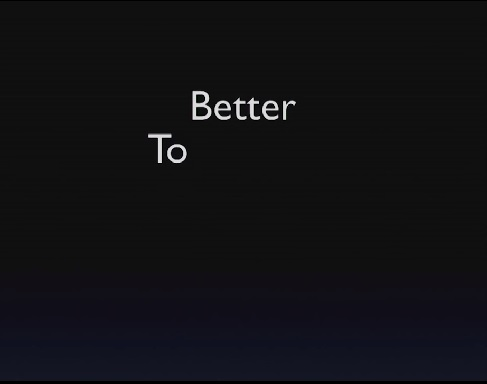

To Better Do.

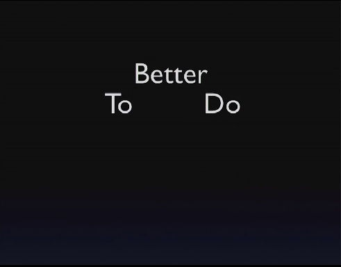

And that should have a little trademark, a trademark thing on it.

[Audience laughter]

So To Better Do is a new, massively parallel, concurrent, AI driven, to-do list application.

[Audience laughter]

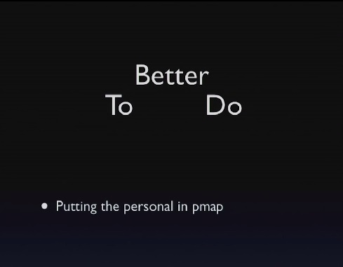

And our trademark is putting the personal back in pmap.

[Audience laughter]

That's all I have. There'll be a GitHub repo tomorrow with nothing in it. And that will probably be all it will ever be.

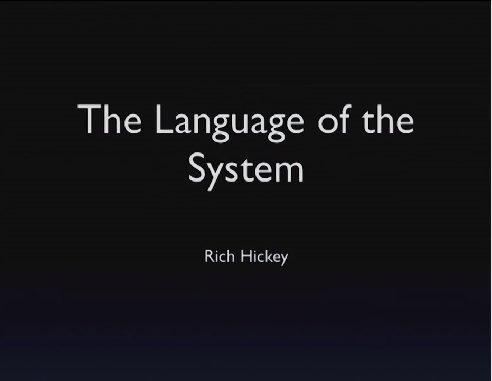

No, so today I'd like to talk about the language of the system 

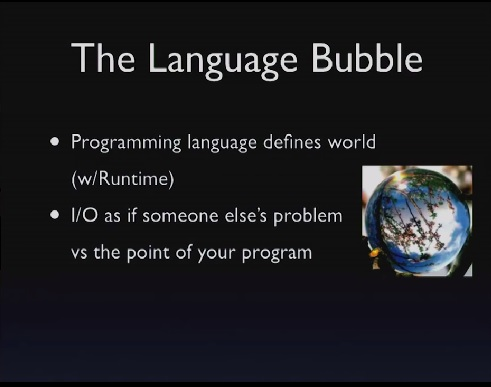

which is a title that may not convey anything in particular, but hopefully it will make some sense by the end.

So one of the things I think happens to us all, especially as enthusiasts of languages, and some people use their language as like, it's just a tool or whatever. And then you're like, you find something that you really like, and you become enthusiastic about it, and you look forward to enhancing it or making libraries for it or making things interconnect with other things, and you sort of define your world synonymously with the world that's implied by your programming language. And it's impossible to avoid this, right, because the semantics of a language, they eventually, you know, pervade your brain. We say things in these conferences that, you know, people from outside the Clojure would be like, how come you can say that? And everybody says, oh, yeah, you know.

[Audience laughter]

It's all data. You know, it's all the data. It's like, oh, yeah. I know, it is. I hear you. I hear you.

So a programming language sort of defines the world, and I'm going to say language here, and I really mostly mean sort of the language and the corresponding runtime because we have languages, a lot of languages at the bottom. The primitives are kind of the same. There's control flow and things like that. And the runtime sort of enhances that with a bunch of other things.

But we get involved in this programming language as a world, and then, of course, if it's a functional language like Clojure, we get even more involved with, wow, this functional part, this is the good world. This is the world I really want to live in, and everything else is sort of like the ick. You know, so I have the good world, and we want to minimize the ick. And we call it I/O or something like that.

And by painting it as I/O, we almost sort of like to make it somebody else's problem. And like Haskell is really good at this. You know, it's like there's a monad and it's like: stay out! You know, it stays over there. We don't really force that, but by convention and discipline, we try to do that.

But it's important to note that, you know, that's never been Clojure's approach to imagine that that part of your application was not important. I mean the whole existence of the state model is there because, you know, actual programs need to do interactions with the world. They need to affect the world. If you're not affecting the world, I don't know why you're writing software.

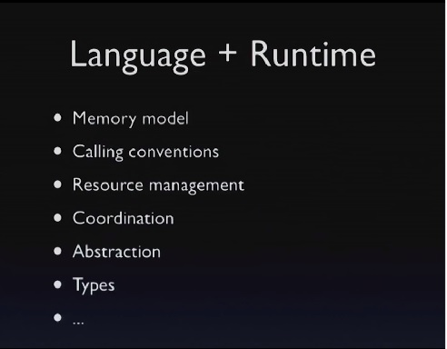

So it really, really is important. So if we look at what constitutes a language, and again sort of language plus runtime, we get all of these facilities. And this is in no particular order, but some of the things that really matter when we start talking about the bigger picture as being either present or missing or the analogy is either hold or don't, are things like a memory model. Right? So we have this presumption in Java.

Maybe in Clojure you're isolated from this. But as the author of Clojure, and as the author of the primitives that guard state and memory transitions, the existence of a memory model in Java is super critical. It's a big, big promise and, you know, the fact that it's present, it's true for all libraries written in Clojure or not that run in the same runtime, that's based upon a resource management structure, a garbage collector that's shared, is a gigantic suite of facilities that's common both to your language, other things written in the same language, and things written in other languages.

Calling conventions, who even knows what a calling convention is anymore? C programmers remember calling conventions because you had all these choices, right? And maybe even in the absence of, you know, who is pushing what at the stack level, we still have sort of conventions around deciding whether we pass values or references. Even in Java, though, that's sort of disappearing. But that would be one aspect of it.

Resource management, like I said, mostly in the memory space. We know eventually the runtimes and the languages start not helping us anymore with resources outside of memory. There's all kinds of coordination, right? We have monitors. We have volatile and things like that to interact with the memory model to help us coordinate things. And again, that's sort of embodied in the primitives in Clojure. Right? Swap and things like that are coordination primitives that rely on coordination primitives down underneath.

And, of course, probably the biggest things that we derive from languages, as we touch them that are more fun - I mean, again, there are the primitives for control flow and whatnot - are any of the tools for abstraction and/or type stuff. And of course some languages emphasize this more than others. And Clojure probably does not emphasize it nearly as much as some others. So that's what we talk about when we talk about programming language and typically language.

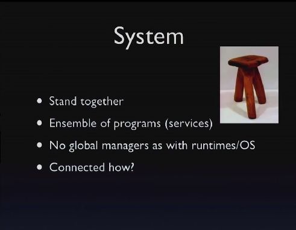

When we talk about system, we're talking about something bigger, bigger than a program. In particular, I'm talking about something bigger than a program. So the definition of system is the roots of it are in stands together. And by that I think the interpretation I would take is that, you know, one leg of this stool is not a particularly useful thing. And a stool with two legs is dangerous, but when you compose enough of the pieces, you end up with something that performs something, a useful function.

And it's actually these systems that most of us deliver. How many people have a main product of their effort that is a single program that doesn't interact with any other programs? How many people think mostly what they do is build systems or parts of systems? Right.

So we do that, but the programming languages pretty much stop before the system. In other words, the system is this composition of things whose language doesn't know anything about systems. It doesn't say anything about systems. It's an ensemble of programs. And, of course, there are lots of ways to build systems. And I'm going to try to narrow the scope of that because, in the old days, any two programs could talk to each other any particular way, and that's a system. And it is still a system.

I think, over time, we've gotten more disciplined about how we build systems, and now we tend to think of systems as compositions of programs that offer services to other programs, and it's an analogy we can draw out of what we do inside programming languages. You can get libraries that give you services as you consume the library. And then, you know, in the process space you have services that you can call, and they have certain APIs. And you call them, and that's what happens.

But there are many things about a system that are very different. And, in particular, there's no global supervision anymore. A lot of what we get inside the language is not there. Right? There's no global resource manager. There's nothing watching everything. There's nothing that knows everything that's going on. It could be more than one process in the same box. It could be more boxes. There's no, like, person in charge of the Internet making sure everything is okay.

And the question is: how do we connect these? How do we connect these pieces? And the premise of this talk is that there's a way to talk about the way we connect these pieces that draws analogies to the way we talk about how we connect pieces inside programming languages. And it both informs the design of systems and, I think, goes the other way and systems should help inform the design of languages or the use of languages.

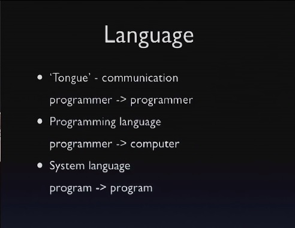

So when we say language, what do we mean? The root, again, is tongue. It's obviously about communication. Right? But everybody knows, you know, the old saw about programming is, you know, you think it's about talking to the machine. And in a certain sense it is, but it's certainly also about talking to other programmers. Right? So you write a program. The other programmer could be you, right, later. Ten years later, you look at your code. You're like, whoa.

[Audience laughter]

Who said that? But I think it does split out a little bit, right? So I think, in all cases, all programming language and all the use of language I'm going to talk about is somehow about programs talking to programs - programmers talking to programmers. But inside a programming language, this is also the other aspect, which is the programmer talking to the machine. You know, "Machine, make this happen. Do this stuff."

But that a very interesting, different characteristic of the communication that occurs between programs in a system is that the language that's used there is a language for programs to talk to programs, almost definitely. It's extremely rare to see the interface on a service be one that's oriented towards people, or at least oriented towards people in human interaction, fundamentally. It's fundamentally oriented towards a program talking to a program, and that's going to become really important as we move forward.

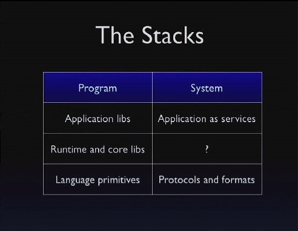

So one way to think about these two things is as stacks, stacks of specificity and hierarchy and encapsulation. So at the bottom of a programming language is a bunch of primitives, language primitives for control flow, for memory acquisition, and things like that. Then on top of that we have core runtime facilities and core libraries and/or libraries from third parties. And then, finally, we build our application libraries and our applications on top of that. And that's sort of all inside the program, inside the program view.

If we look at systems, I think it's a little bit harder to sort of tease out what are the primitives of systems, but certainly if you start with the communication side, you end up with two very evident pieces to the language of systems, right? One are the protocols: UDP, TCP, HTTP, Web sockets, all these things. Sort of the negotiated transfer primitives that we have. And the other are the formats: What do we say over these protocols? And I think that's pretty evident and straightforward, although I will talk more about formats, but not at all anymore about protocols. The analogy to the next level up, though, I think, is an area where we're particularly weak in having good language for it, and it's where the focus of this talk is going to be.

And finally, somehow, at the top, we end up with either portions of applications or entire applications acting as services and/or consuming each other as services. And that's a system. Of course, there's a joining here because those things that are the applications on the right were written using the stack on the left. But the stack on the left doesn't have a lot to say. Usually, it doesn't have a lot to say about the stack on the right.

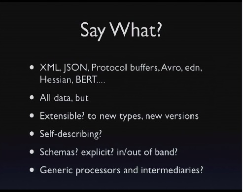

So the first thing we have to talk about is, "Say what?" Again, we talk about protocols and formats, but formats are huge. Right? How many different ways do we have to talk over these wires? What are we sending? XML, JSON is probably the big winner right now, protocol buffers, and then, of course quite common in this room would be EDN and Clojure data. But there's also Avro and Hessian and BERT. How many know what all of these things are? Not too many. How many know, of those people, could make a matrix as to why one is better or different than another?

And yet, you know, this is actually pretty important, right? This is what we're going to be saying from one process to another. It's a huge thing. And it's full of decision points.

I think one of the things that's really cool about it is all of these things are representations of data. What's not up here? What key Java technology for things talking to other things is not here?

[Audience member: (Indiscernible)]

Well, that's not really what --

[Audience member: Serialization.]

Yeah, with RMI, right? RMI, yeah, a big winner. How about DCOM? CORBA? Anybody? Okay. Those are not even on this list, right? They all lost. They all lost for really good reasons, so we're not even going to talk about that. We've already reached the point where every single one of these choices is a data format.

So already we've got this great premise. The way services are going to talk to each other is by conveying data, not through some hyper-linguistic or extended linguistic thing where there are all these extended verbs, and there's a notion of a program object being on a different machine, and things like that. We're just going to talk with data.

So we have to talk. We have to split out what about the data is good or bad. What are the decision points? One is extensibility, right? Given this format, if I have a new thing to say to you tomorrow, is there a way for me to encode that? If there's not, it's not extensible. Which of these things on the list is not extensible? JSON! There you go. That's really not good. And it leads to a couple problems we'll get to later.

And there are two notions of extensibility. One is to new types. The other is to new versions. There's a sense in which, for instance, protocol buffers are really mostly about being extensible to new versions. You can make things go to new types, but an existing consumer can't be really aware of those. But they can be tolerant of new versions.

Self-describing: which of these things is self-describing? XML, kind of sort of. What else?

[Audience member: (Indiscernible)]

Not protocol buffers.

[Audience member: Avro.]

Avro, EDN, Hessian, and BERT, and Erlang's Transfer, which is what BERT is a flavor of.

What does that mean to be self-describing? It means that if I have a decoder that understands the rules of the format, I can read anything that you send, and I don't need to know anything else out of band. I don't have to get a description any other way. That's not true of protocol buffers, right? If somebody starts streaming you protocol buffer stuff, it's like gobbledygook if you've never seen the schema, and where is the schema in the protocol buffer stream? It's not in the stream. It must be transmitted out of band.

So we get to this other part, which is schemas, in or out of band. Of the ones that are self-describing, one of them has schemas. Which is that?

[Audience member: XML (indiscernible).]

Well, that's optional though. But one has one that's required for reading them.

[Audience member: Protocol buffers.]

[Audience member: Avro.]

No, Avro. Protocol buffers are already out. Avro - Avro has a prelude schema thing. So then you have this question. Are the schemes in or out of band? Avro has schemas. Protocol buffer has schemas. Avro's are in band. Protocol buffers are out of band. But both of those have more requirements on the schema interpretation than something like EDN or XML.

Of course, XML, you can definitely read it. You may not understand it, but you can read it without anything. If you have schemas, they're sort of optional.

Why does it matter whether or not schemas are in or out of band? I mean, it's on the slide.

If you have schemas, what can't you have? If you have out of band schemas, what can't you have? You can't have these things: generic processors and intermediaries. It's really interesting that Google came up with the protocol buffers.

Imagine if the Internet was built with protocol buffers. How good would Google's search be? It would be bad, right, because they're in the intermediary business? They're taking advantage of the fact that any HTML processor can read any HTML. Right? If everything was a negotiated contract, it just simply wouldn't work, so you really have to understand. It's not to say that protocol buffers are bad. I'm not saying that. But what I'm saying is that there's a spectrum of choice and tradeoffs that's really important here.

It's as important as choosing a language when you pick your programming language. But picking any programming language now leaves you with this decision when you move up to the system level. Of course, a lot of times this is not your choice. Right? You're consuming a service that somebody else has made a choice. And it highlights sort of the next problem in this space, which is that there's nobody in charge.

When you use a programming language, the programming language kind of sort of says, "Well, we're all going to pass arguments like this, and we're going to define our types like that, and everything else." And with no one in charge, systems struggle against this set of independent decisions, which may or may not compose. And the formats problem is the first place this comes up.

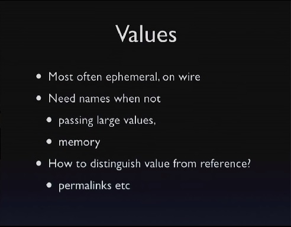

So this schema is out of band is really tricky.

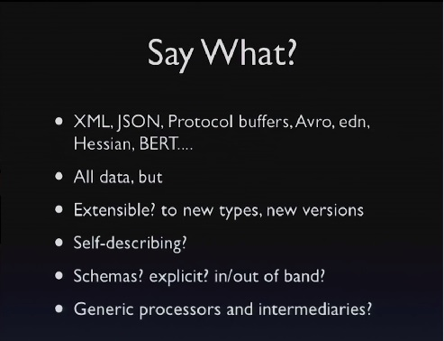

And that's one of the things where people are like, oh, JSON, well, I could put dates in JSON. Right? How do you put dates in JSON?

[Audience member: (Indiscernible)]

As strings. And how do you know they're there?

[Audience member: (Indiscernible)]

[Audience member: (Indiscernible)]

Out of band. You go back to the napkin, right? It's like if the key has the word date in it, then the string is a date. There we go. And so there's another aspect of that, which is, that's not merely out of band. Right? If you get a protocol buffer schema out of band, it's not a napkin, right? It's very straightforward.

JSON is very, very -- the people's use of JSON is extremely context dependent, and a lot of times that context is not captured anywhere except on a napkin. It's like, okay, well, we've all agreed to send this and, like, you know this is coming. And, therefore, you're going to go to the last edited field, and you happen to know that last edited is a string that has a date in it. So that content sensitivity is really bad. 

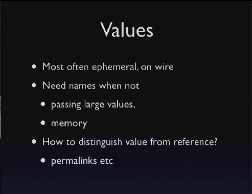

So obviously in this room we don't have to talk about the value of values. We like values. And I think the only thing to do here is to sort of, again, think about the differences between programming languages and systems with values. So we definitely have values in systems at least at one level: on the wire, right? We just looked at all the popular formats for transmitting stuff.

They're all data formats. They're all values. We're not really passing a reference to a guy that you're going to then call back on his RMI interface to go get more stuff and have this big, chattery communication with objects. We just convey the data that we care about, so that's fine.

Those are ephemeral, and they're usually nameless. And, in programming languages, values are often usually nameless. Right? We have the same notion. We can pass values. We get our value as a return from a function. We just have it. We start processing it.

Java is not a particularly strong language for values because everything almost is a reference type. But in languages, it really have them as distinct things. A lot of times values are completely anonymous. You have an array of structs. None of the structs have names.

If, however, you want to have a value in a system that is not ephemeral, that means that either - maybe it's large. It's so large, I don't want to put it on the wire and send it to 100 people. I want to put it somewhere and let the people know where it is. Or I want to have memory in a system. I want to remember a value.

In both those cases, you end up incurring a new thing, which is that your values need to have names. And that's a definite change versus your programming language. It's one that really matters because, until we start becoming more cognizant of when we're manipulating values and that this is a name that names a value, we're going to keep making these icky, messed up systems that don't distinguish references from values.

For instance, how do you know when a link is a permalink?

[Audience member: (Indiscernible)]

You don't know is a permalink because, on the Web page where you got it, it said this is a permalink.

[Audience laughter]

And so, when designing a system, you need to be more considerate of this and call it out.

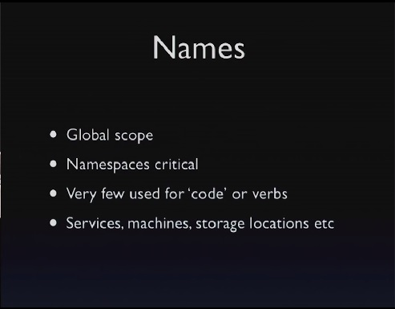

So that brings us back to names. And again, here, we sort of had this difference, right? Inside a program, we have all these great scopes. I'm in a local scope. I have a let. Just nobody knows about this. Now I'm in a function. I'm also sort of cool. And this function is in name space; that's also sort of great. And then the name space is on GitHub, and then what happens?

Then we're all fighting for names on cool names on GitHub. We're going to use up all the characters and all the stars and robots and, you know, names of food. And so it's really critical, once you lift up a system, right, and nobody is in charge anymore. What's true of most system names? They're global. I mean they're potentially global. And you really need to think about that. You really need to be considerate of the fact that as you start building systems, as your names start escaping out of your processes, that they are global names, right? And the really tedious things like Java's, you know, com.whatever.whatever, that stuff matters because what's com.whatever? Where did that come from?

[Audience member: (Indiscernible)]

Somebody who is in charge, right? There's a somebody in charge there. In the absence of that, it's a free for all. And so those DNS names and whatnot become critical. And using fully qualified namespace names that are truly global names is an important discipline for doing systems.

But it's also interesting to think about how different the names are. What are the things that - what are most of your names in a program, especially in a Clojure program, most of your names; 99% of your names are what?

[Audience member: (Indiscernible)]

They're one of two things, right? They're either locals or what?

[Audience member: (Indiscernible)]

The names of functions, and we have a huge, huge number of names dedicated to functions in our programs. That's where most of our names go. They're mostly verbs.

What happens in systems? Who likes to work with a system that has a ton of verbs?

That's really interesting. Right? Why is that? There's all of these inversions as we get to systems, aren't there? We've got lots of names of verbs, hardly any. We have this global control. We don't have global control. And we are going to have a lot of names in systems, but they're going to be used for other things, probably not verbs: machines and things like that, storage locations. And then these values, right, are going to need names, which is another critical thing.

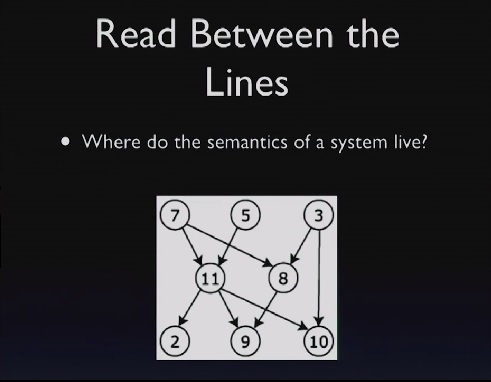

So systems look like this. Every process has a number. No, obviously they don't. This is - I'm being lazy on Google images. That has circles and lines. It's faster than me trying to learn how to do that in Keynote.

Does anyone know how to make a line connect to a thing and stick?

[Audience laughter]

Like, I moved the thing, and the line is just sitting there. Can you make them connect?

[Audience member: (Indiscernible)]

No, I can do it there, but then it's like two things. And then the Internet has this picture. So if you ignore the numbers, the numbers are not important. The numbers are not important, but a lot of systems have this shape. It's fundamentally hierarchical. It's not like everybody is calling everyone and it's this big, big nightmare, right? It's generally some things call other things call other things, come back, come back. And there's some sharing across. There may be a couple of lines across at a level, and there may be one guy at the top. You know, from your perspective that's you. Ooh, I get to consume all this stuff. And maybe I don't serve anybody else. It depends on how I'm situated.

But the critical thing here is that, while each of these things, in their bubble, might make a ton of sense, maybe they're written in Haskell and, like, it's proven that they're correct or something awesome, right? As soon as you start drawing lines between them, what happens? All sorts of new implications about what things mean have arisen, have emerged from the connections of these things. And it's different in some way from consuming libraries.

You might look at this and say, well, this is not different from libraries. Where I have libraries it's the same thing. They wrote the library, and they did whatever. They're now consuming it. But what do the library and you share? A ton of stuff, all that runtime stuff, you share all kinds of presumptions about memory, coordination, locking, threads, garbage collection, the whole nine yards. What do you share between these things? Some wires, routers, and things like that.

So the question, where does the semantics of the system live? What does this mean? How can we define the pieces such that we can sort of get a grip on what this is? So usually it's hierarchical, but that's not enough to really understand it.

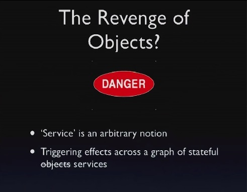

And this is where I think we really run into trouble. This is where the problem is. Right? What does that look like?

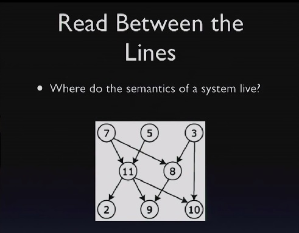

It looks like object-oriented programming. Right? All these objects, they're connected, and they send stuff to each other and whatever. And it's possible, right? It's possible, but that this system, built out of all these processes, is exactly like objects at scale. Right? Every process is like an object, and it's stateful, and it sends things over to other guys, and then they change, and the whole thing is really exciting.

[Audience laughter]	

Because service is an arbitrary notion. What does it mean to be a service? You know, you send me stuff, and I do stuff. I mean, one thing that's sort of telling is, there aren't a lot of verbs, which is kind of good. But, you know, all the services are still nouns is the fact that they don't have a lot of operations is helpful about saying, well, maybe they're not like objects. But there's nothing stopping them from being objects.

That is crossed out, right? Yeah, so in what way is this not object orientation? How do we keep it from being object orientation in the large? Because if we've, you know, spent all this time doing functional programming in the small only to build object-oriented programming in the large, then our system in the large is still going to have the negative attributes of object orientation.

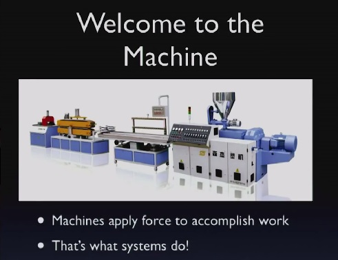

So I think one way to think about this is to think about machines and production lines and things like that. What we're trying to do here in the next few slides is to try to think about a way. Obviously we're saying change happens, right? We know that this is a dynamic system that's producing stuff. It's affecting the world. That's the point of it, so we're not going to try to deny that.

But what's a way to organize it such that we don't end up with object mess? And one way is to think about it like this production line thing. So what does a machine do? A machine applies forces to accomplish work. Now think about like a car factory. What happens in a car factory? Well, people go in there every day, and they work real hard, and they mutate the state of the car factory, and then they go home. Right?

[Audience laughter]

That's like objects. It's like an object-oriented program, right? Maybe, you know, some stuff - No! It's not like that. Right? There's like one end of the factory, and something comes in there. What? Raw materials, parts, you know, iron, and tires, and stuff. Right?

And then something comes out the other end. What? Hopefully cars. Right? And so this notion of flow, I think, is the key to keeping systems sorted.

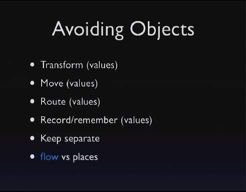

So there's a bunch of characteristics that you can combine that will - even though that technically a certain percentage of them are not functional - accomplish something in a way that is not place oriented, right, if you've heard me talk negatively about place orientation. That, you know, we all went into the factory and had a good time and went home, and the factory is now better - this place orientation.

And this kind of flow orientation cures that. So what are the things that we have in flow? We have transformation. So one of the things we're going to be doing is transforming values. I'm going to take, you know, the lugs and the whatever things go, the tire. I'm going to screw them together, and now I'll have a wheel instead of the parts of a wheel.

We're going to move things from one place to another. We're going to route them. Maybe it needs to go here or there. We're going to have decisions about that.

We may remember things. And again, the word remember is a term that is not incompatible with functional programming in a way that update is. And I think the critical thing to sort of making systems out of these parts is that you, as much as possible, keep them separate. In other words, when you make a transforming, moving, routing, remembering thing, it's really going to be hard to keep that from being something you can't take apart and reason about or combine with other things. So even though each of these steps, I think, has a sound use, if you were to put them all together in one thing, it would not be sound anymore. So you want to keep transforming separate from moving, and moving separate from routing, and routing separate from remembering, things like that.

And this is the difference between flow and places. But move and route and remember are not strictly functional. That's okay. We know we need to affect the world.

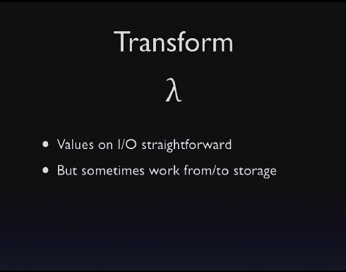

So, transformation, this is the thing that's easiest, right? We know transformation is just functions. It's basically straightforward. The only thing here is that generally there might be some input to the function, which is now not just sort of a local input from a call from a programming language, but it's coming over wire, and there's output over the wire.

The thing that gets a little bit trickier sometimes with functions at the system level is that sometimes you need to convey information out of, you know, off the wire. I need to put it, you know, in a database so that you can see it later, and I'm not going to actually put some huge thing over the wire to you in every message. And, in that case, you now have this sort of stranger view where I need to run this function, and what I have is not the value but what?

[Audience member: (Indiscernible)]

The name of the value. And I'm going to try to distinguish the name of the value from a reference because they're actually different. So sometimes you work to and from storage. Otherwise, though, it still functions. This is not hard.

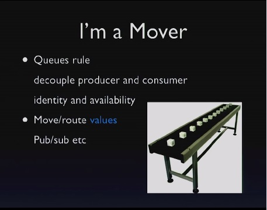

Now we get to moving things around. I think it's one of the things in Clojure maybe I didn't make clear enough because I didn't need to wrap them is that the queues in java.util.concurrent are awesome. If you're not using them as part of your system designs internally, you're missing out. And, in the large, queues also rule because they have this really great characteristic. They're completely decoupling.

Messages: What happens with the message? A says something to B. When A says something to B, what does A need to know? B. That's a problem. If A puts something on a queue, who gets it? Don't know. So that decoupling is really good, both in the identity of the consumer, also in the availability.

If I put something in a queue and the person who is supposed to consume it is not running, do I care? Not usually. There may be backflow and some other kind of considerations, but the availability of the consumer is also something that you don't care about, right? Again, a directly connected message: A said something to B. If B is not around, that's now a problem for A. If A puts something on a queue, presumably if you can make the queue more available than B, you get this independence, both in the identity of the consumer and the availability of the consumer, which is extremely strong.

The other great thing about conveyor belts and queues is that what do they do? What's their job? Move stuff. What's their other job? There is no other job. That's all they do, right? So it has that characteristic we had from before.

I mean, when you get to pub/sub, you end up with routing and moving, and they're both on this slide, but that's really strong. Queues are extremely important. Queues are decidedly different from messages for those reasons. Messages, they need an available consumer, and you need to know who you're talking to. It's architecturally completely different.

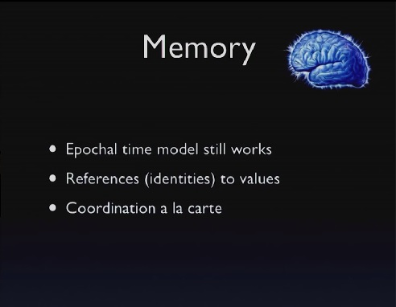

All right, now there's memory. This is the part that's really tricky because you do not have a ton of great options for memory that are not place oriented. There's a new thing that's kind of good for this.

[Audience laughter]	

But you don't need to even use that. The key point I want to make here is that the epochal time model, the one that's behind Clojure, it works in systems. It works at the system level. I'm going to show you the picture again later. But the basic idea is what? We have reference types, right? And we have values. And the reference types only ever contain values, they only ever just point to values, and they have semantics about how they transition from one value to the other.

There's nothing about what I just said that is about Clojure, that is about memory, that is about locking. There is a little bit that's probably about CAS, but not CAS on the chip. It's a very, very general notion, and Datomic implements that notion at large, but you can also implement it yourself. And you're going to need to combine a couple things. You're going to need to combine naming values with some sort of reference and some sort of a la carte coordination.

So this is my old slide of the epochal time model. Clojure implements this. We know atoms are this. Refs are this. Agents are this. And we can do this ourselves. We're going to say we have a reference. It takes on different states over time. Each of the states is a value. You're able to obtain the value out of the reference as an independent thing. And we just said before about values in systems that you're going to need to get a hold on, are going to need to have what? Names. They're going to need to have names. That's what's different. And then we can transition from values to values.

So we can see this in action in the way Datomic uses ZooKeeper and things like Riak or S3. So Riak and S3 don't have the semantics required to do the state succession. They don't have what you need to do that. You need something along the lines of either CAS or versioned updates or something like that.

But ZooKeeper, they have that. They have versioned updates. So you can combine them, and you can implement something like refs in ZooKeeper that point to values that you store in something like Riak or S3 or a store that doesn't otherwise have the consistency or the ordered transitional semantics.

And you can pull tools out like about right now and do this for yourselves, so the important thing to note is that the Clojure state model is available at the systems level. You do it this way, and the only thing you have to do is put names on your values. What's a good name for a value?

[Audience member: UUID.]

UUID. Is that Stu?

[Audience member: No.]

No. That's good. Stu is always my spoiler. Yeah, UUID. What's not a good name? Fred. I got this from wherever or anything else because what starts to happen when you have those kinds of names? People start to care about them.

What should you care about, about a value name? Nothing at all. Also, because a lot of the places where you're going to be putting values, you really want to be conflict free. You don't want to have to coordinate on values. You don't have to - oh, is this Fred 27 or Fred 217, or whatever? You just don't want to be there. So UUIDs are a good thing to use to name values. You don't care because that's not the identity. What's the identity? The one over here, which you're going to have very few of.

For instance, in Datomic, you could have hundreds of millions of items in Datomic. Do you know how many refs you're going to have ZooKeeper for a database? Three. You know it now, right? You've built systems in Clojure. How many refs do you end up having? How man atoms? A tiny, tiny amount. Probably the best thing about Clojure is showing people how little of that you actually need. It's the same thing here.

But the strong names, right, the globally qualified name space names will be the identity names. That's really important that they be like that. The value names, you want to be conflict free, tear off names that anyone can create without coordination, and that's what a UUID is about.

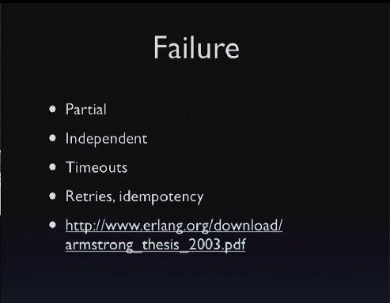

All right, of course this is my favorite topic: errors and error messages and whatever.

[Audience laughter]

So there's this really important paper at the bottom here. And if you read this paper over and over again, which I recommend, you're going to see a couple of facts about systems. And it's another way in which systems are really different from programs.

In a program, are you really afraid that some objects you're going to call is not going to be there? No. The whole program tends to, like, be around or not all together. It succeeds or fails all together.

We get all confused because we live in this bubble. It's like, well, errors are like when I made a mistake. That's not right. That's just like programmer convenience thinking.

In the real world, failures are all the time. The things that you depend on are possibly not there all the time. A large system is in a state of partial failure almost continuously, right? The math is against you for having all of your 10,000 machines always work all the time.

So parts of your system, right, when you look at the whole thing, will not be working. It also means that those things that are not working will not be available. Those failures are going to be uncorrelated. They're going to be completely independent. You still are fine, but somehow the thing you're talking to has become unresponsive or unreachable or whatever. And it starts to give you a whole new way of thinking about dealing with failure. Because the things you're talking to are unreliable, you have to use timeouts. You have to retry. If you're going to retry, well, you have this open question.

I mean, I might not have heard back from you, but you might have heard my original request and done it. So I need to know that my future requests are idempotent. Who is worried about that when you're working on stuff in memory inside your program? You don't worry about these things at all.

But the thing is, as soon as your program becomes part of a system, these error modes are going to go right through your program. You're not going to be able to deny them, and you're not going to be able to convert them into something else. You can't fix them. They go right through you.

And as soon as they go right through you, you realize that distributed error modes are the only error modes. Everything else is just like programmer convenience error handling stuff, but it's not really what the system's error modes are about. So I definitely recommend that you read the paper because you can't think about it often enough, and it really is difficult to internalize. And you'll still write systems where you presume the best, and then you're like, ah, the best thing is not going to happen sometimes.

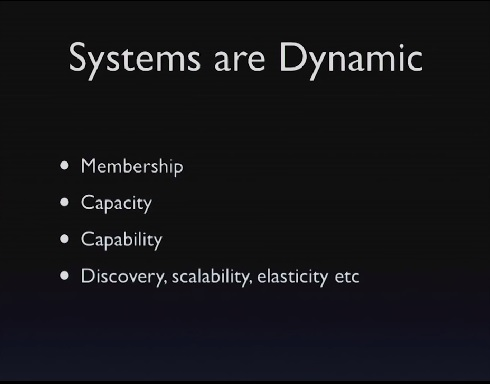

So the other things about systems is that they're dynamic, and they're dynamic in a whole bunch of different ways, right? They're dynamic in membership where he just said some machines come and go. Sometimes they'll come and go on purpose, not because they failed, but because somebody started some more machines. They'll come and go for capacity, right, as people are trying to scale. They're also come and go for capability. The system will be running, and all of a sudden somebody wants to do something new, and they'll start up new stuff. And systems that can become dynamically capable of doing new things are really strong systems. It's the kind of system that you want to pursue.

And so all new kinds of terminology are going to come to bear at the system level that you don't have inside. You can't scale one box. But you can scale a system. There are not usually the same notions of discovery, right? Somewhat, you know, maybe if you're talking about injection and things like that. But the true notion of discovery is a distributed thing. Elasticity is the same kind of thing. So we know that systems are dynamic, and that has implications for the programming languages.

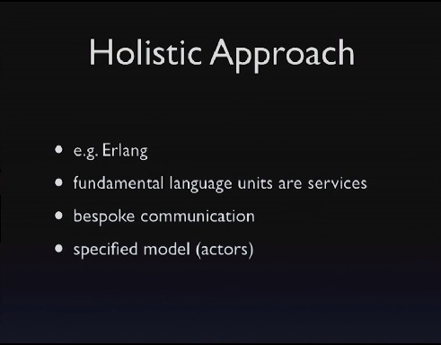

So there's a holistic approach to this, and there's a great example of the holistic approach to this, which is Erlang. Erlang is a language of the system. It takes the approach of saying: I am only going to be building systems. I know that upfront, and I want these semantics inside the processes. I don't want different sets of semantics. I don't want my bubble semantics and my system semantics. I don't want my bubble interfaces and my system interfaces.

Just so you're not worried, this is not where I say we should all switch to Erlang.

[Audience laughter]	

I just saw everybody is like, "Oh, my gosh! Did he change his mind already?"

[Audience laughter]

"It's only been a couple years." No, so there's nothing wrong with a holistic approach, right? In Erlang, the fundamental units of programs are services. They call them processes, but they're little services. They have communications capabilities, but they follow all the things that we talked about before. In particular, it's not like RMI. Those little services are not like objects. They send what?

[Audience members: Messages.]

Messages, which are data. Right. They're data. It is, though, custom communication that they use, and there's a very specific model baked into the language that basically said we are going to do actors. We are going to do asynchronous, send only, receive asynchronously, no synchronous communication, RPC, you have to build out of pieces and things like that. So there's a very, very specific model here, which I think is extremely well suited to making communications programs.

But what's the tradeoff with the holistic approach? Is Erlang a great number crunching language? No. Is it really expressive in certain kinds of domains? No. Definitely, it's good at some things and less good at other things. It doesn't have a rich type system. It doesn't have a rich abstraction model or other things. So the tradeoff of a holistic approach is just sort of you put all your eggs in one basket.

I think the fact of it is you're never going to be able to dictate to everybody to use Erlang or use any one thing. You can't say we're all going to do our programming in this one language. That's the whole "there's a king of the world" thing. Inside Ericsson, maybe they can do that and say everybody is going to do Erlang. But in the world in the whole, I don't think you can sell holistic approaches because you can't convince everybody to use the same language, even if it's better.

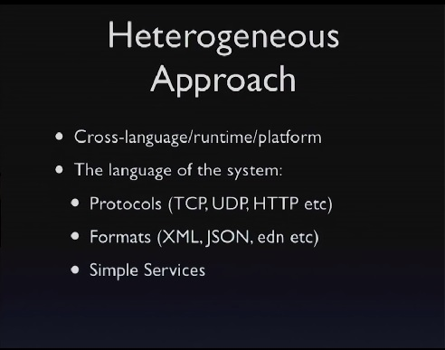

So that leaves us with the heterogeneous approach. We have to have some sort of cross-language notion of how to talk about things, how to express the semantics of systems, and what the language of systems are that crosses languages and runtimes on platforms and things like that. And, as I said at the beginning, we know parts of that language are protocols and formats.

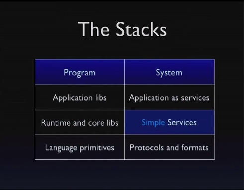

And I think the third part, the thing that fills in this box, are things that I'll call simple services. A simple service is a service. It's its own process, right? It does communication using data. It should have a very small surface area in terms of the API, right? If the API is mostly data, it should have an extremely small number of verbs associated with it. And it should do mostly one thing. And you'll see that a lot of the facilities of programming languages and runtimes are now available as services.

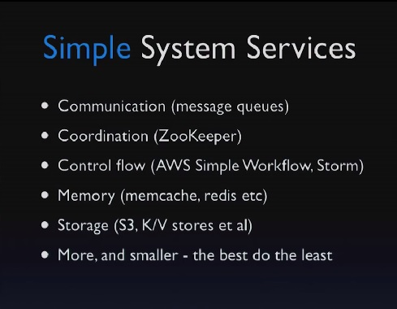

So we have queues, right? We have java.util.concurrent queue and then how many message queues are out there? Tons, tons, all with different characteristics, and you'll make different choices. But there are plenty of message queues that are dedicated to that.

Now, unfortunately, this says simple and, you know, if I knew how to use Keynote, that would be blinking and on fire. I saw fire was good.

It's super important, and I think one of the challenges for this approach is, invariably, people would like their service to do some more. And making it do a little more also breaks the simple part. So for instance, queues usually have very, very icky durability things, like, once they start to get into that space. And all of a sudden, wow, this is not simple anymore.

Coordination, things like ZooKeeper are extremely interesting. If you've not used it or something like it, it's very cool to think about all I have over here is just coordination. And if you can constrain yourself to that, of course, again, ZooKeeper is durable, and you could try to treat it like a database, and now you're trying to make it do more stuff and not use it simply because it does do more. But if you treat it simply, it's a fantastic, little utility just to do that part of the Clojure state model or whatever - epical state model.

Control flow, you have things like Amazon Simple Workflow, right, and Storm. We just saw an example of Storm before. Look at Storm. What is it? It is what I've been talking about. It's this flow model. Although, again, it sort of says this is the recipe that crosses all the pieces as opposed to saying we're going to compose queues plus arbitrary consumers of queues and other queues. It sort of says I want to wrap around your whole thing, and I want you to play this coordinated game. So again, it's less simple than it could be. But as an architectural strategy, it's an example of what I'm talking about. It's flow oriented.

We're used to memory services, right? Memcache is a beautiful thing. People are like, oh, memcache, blah, blah, blah. Most of the problems with memcache is people are using it to solve horrible problems with using place-oriented databases. That's a sucky problem. That's not a suckiness of memcache. Memcache is brilliantly simple and it does exactly one thing. You know, of course, they keep trying to make it do a little bit more, but it does the one thing it does really well, so that's shared memory.

Redis is another popular example. Again, hopefully they'll keep it simple. And, to the extent they do, it's the kind of thing you can compose together.

And, of course, storage has exploded. S3 is global shared memory. It's an awesome thing, except what? Shared memory is dangerous, right? But we know how to make shared memory safe.

Clojure has shared memory. It uses it. In fact, it's quite fundamental to Clojure that you have shared memory and shared memory is important. You just have to be careful in using it.

If you combine the reference to immutable objects, you can use S3 just as safely. You can use a key value store just as safely, exactly the same way. The only trick there is the transitions of the refs needs help from things like ZooKeeper. But moving up the stack, like DynamoDB, has that semantic built into it. A lot of the memory caches like Infinispan have it built in, so you can get it. You can get both together like we have in-memory and systems. So you want, I think we want more of these, and we want them to be smaller still and to do as little as possible.

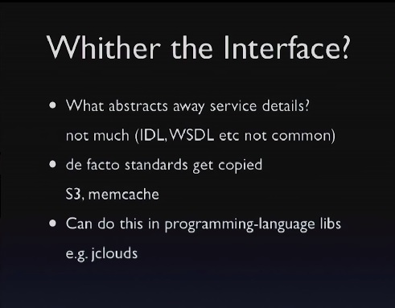

So I think one of the problems we have here is there is something that we really like inside our programming languages, an important tool, which is the interface or the protocol. It's the thing that abstracts away from us the details of what we're talking to. Where is the interface for S3?

Right, in a different audience, there'd be people gripping the arms of the chairs. Like, no, we've solved this, right? We use WSDL, and then they use a BPL thing, and I draw these pictures, and I have systems. We're just naïve in here because we like to build things out of smaller parts, and we should be up there.

No, I mean there are things like that, but they don't get used. Amazon did not use WSDL. Maybe they tried? Did they try early on? Does anybody remember? Were there any schemas ever?

[Audience member: (Indiscernible)]

There used to be, right? Now it's just like, "Read the docs. Try it!" And when you get it right, you won't get a 404.

[Audience laughter]

So you just don't see it. You just don't see it anymore, and so what you've seen now instead is S3 is so dominant that when Open Stack wants to have the same kind of service, they don't have any abstraction to tap into to say we also implement that abstraction. What do they have to do?

[Audience member: (Indiscernible)]

They have to directly imitate the protocol of S3. This is not a great place to be. The same thing has happened with memcache. People are like, well, memcache is cool. People are like, well, I have this other cool, distributed, redundant memory cache. It's like, well, I use memcache.

But, I mean, this has more, better. But what do they have to do? Mimic memcache on the wire. This is really a bad thing. And I don't know what the answer is because I don't think WSDL and things like it are the answer either. But it leaves us in a difficult place.

This is an area that we can repair inside the programming language. There are all kinds of variants of put stuff out of place, like S3. Some of them mimic S3 and some of them don't. But something like jclouds can go and isolate you from that. So it's superimposing abstraction.

Now there are two ways to think about doing this. That superimposition of abstraction happens where? Is it a service? Who knows what jclouds is? All right, a fair amount. So jclouds is a library. It's a Java enclosure library that has an encapsulation both over sort of the EC2 elements of cloud services and of the storage. And we just think about the storage right now. There's this thing called blob store, and it abstracts away the details of connecting to S3 or connecting to Open Stack's stack or to whatever VMware cells, or whatever another vendor has. And so they've given you an abstraction inside the language.

If we don't want to do this inside, what do we end up with? What's the system version of this? Proxy. And that you tend not to see. Why? It adds a hop, right? It adds a hop, and it's like that. But it's still tricky. We don't have interfaces, and I think we're suffering.

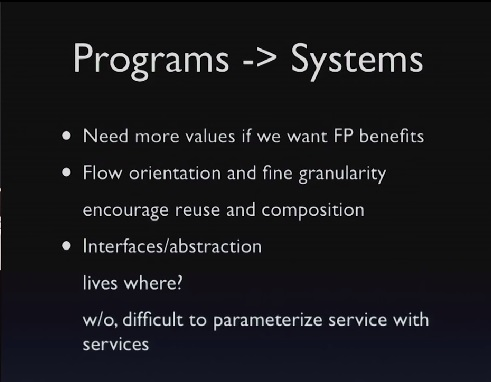

So what can programs tell systems? What can systems, what can our systems learn from programming? One is, we need more values. Values need to be first class. We need to name them. We need to start using the epochal time model in our systems designs. You can do it yourself today. I just showed you three ways to do it.

You just have to choose to do it. You have to take this flow orientation. This is something you may or may not be using. People talk to me a lot in Clojure. They're like, I love Clojure. I have the functional part. I think I'm getting a grip on it. And every time I try to get the state, even if I use the state stuff from Clojure, I still end up sort of struggling with a model for the whole thing.

The model is this flow model. Just flow values around. Use queues inside your application. It's not like this trivializes everything you need to do, but you can do a lot by just emulating this inside. And, of course, if that's your best practice inside, it's nice to convey it out.

This is the way you're going to get more reusable things and things that are easier to compose. I do think we're struggling with any kind of abstraction. We know it's good, but we don't know how to do it at the system level.

And I think the biggest thing we suffer from here is, A, well, yeah, how does somebody else provide a service like S3 and let you try to use it? But the B side of it is, what if you're trying to be a service and you're trying not to build in durability into yourself? You'd like to be playing this game well and saying I'm componentized.

Well, in a programming language, we totally know how to do this. You said I'll work with anything that implements this interface or anything that implements this protocol. We now have a way to say that. And the person who wants to compose you with something else has this recipe for doing it.

Now what's the systems way to do that? What's the systems way for saying I'm parameterizable in my storage?

[Audience member: (Indiscernible)]

It's really difficult. A URI is not enough, right? I mean, you need to know what method to talk over. So what ends up happening right now is your service needs to embed something like jclouds or an implementation of an abstracting thing, and you need to individually support what your users are going to need or provide an extensible mechanism, but you're doing it inside yourself as opposed to sort of saying, at the system level, I have a way to say this is an interface that I use so that you can plug in the kind of storage you want with me. So we're suffering there.

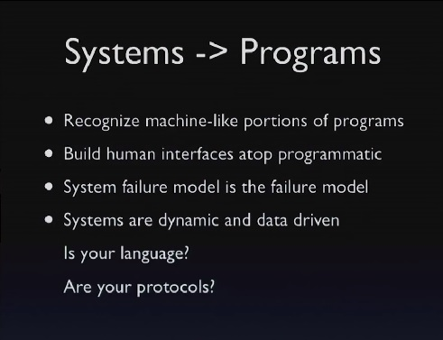

What do systems tell programs? I don't think - you know, there's a great papers, great old papers that say, "Do not try to make your distributed system like your programming language." And they're totally right, especially at the time they wrote it, which is when objects were hot and people were trying to do CORBA and things like that. Terrible, terrible idea.

But we should also be able to pull - so, but some things are important, like functional programming is important. I think it's not done a lot in systems. What can systems tell programs? Well, the one thing is this machine-like thing, right? Maybe it's easier to see when you have wires. Right? It's quite obvious the only thing I can send over the wire is a value in XML, so I've chosen to use that.

But now, like, well, in this audience I don't have to say this, but in Java, people have a real question, right? They don't tend to send data structures around in their interfaces the way we do. And they have this real choice. I could send a data structure or an object that has all these verbs and knows how to do stuff and changes and dances, and I might as well send that. It's only one argument. It's a lot easier, and I don't have to type. In fact, IntelliJ will just type it for me.

[Audience laughter]

So I think, in Clojure, we're kind of spoiled because we do this all the time. But it is something that if you're trying to talk to somebody, you're trying to talk to somebody else who is building a system about maybe they should bring this architecture inside their program, you have to make the rationale from the systems level. This makes sense in systems, and you explain to me why it doesn't inside the program because I don't understand why it wouldn't.

The other thing is this programmatic, program-to-program interfaces rule. Right? Where do we suffer when we don't do that? When we only define a human interface or we define a human interface first, where do we suffer? Every single time we do it, every single, single time.

Anybody ever try to write a program that manipulates any UNIX program? Yeah. Is it fun?

[Audience member: (Indiscernible)]

Yeah. You have to write parsers. You have to figure out how the command lines work and all this other stuff. Try to manipulate git from a program. It's terrible. I just did it. It's not fun.

What else is an example of that? SQL. In both these cases, they wanted to support - so some person is going to be sitting at their computer, and they are going to want to, like, do stuff. And they're going to go [gesturing typing on a keyboard] and go, and it's got to work. And there's nothing wrong with that. That use case is important. You'll want to make that happen.

But when the only interface you define is the one for that, you end up with no programmatic interface. So what do we have in SQL? We have, well, this is simple. People will say where and blah, and that's really great. And what do we have for programs? String building. We've got nothing. We have nothing to work on.

So build your human interface on top of a programmatic interface because programmatic interfaces are all you've got in the systems level. Nobody is typing into Amazon AWS services. No one is like, oh, I'm going to, like, use S3. You know, they don't do that, so you want to have the programmatic interface underneath.

The systems failure model is the only failure model. You have to look at all of your error handling from that perspective. And, as soon as you do, you realize there aren't going to be a lot of places for the "I made a mistake" flow. It's got to be dominated by the system as partially unavailable flow.

Systems are dynamic and data driven. It might be a nice idea to use a language that was also dynamic and data driven. Again, in this room, I don't need to say that.

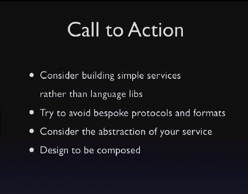

So, I think people are building some great libraries. I'd love to see more people build some services, some simple services. I think this is a tremendous opportunity area for Clojure. Clojure is really, really well suited to building these things. And if you build these things, it's going to give you the inroads into your organizations.

Oh, can I build this new thing in Clojure? I don't know. Well, I built this service. Do you want to use it? Oh, well, yeah. What does it do? It does this. Oh, it's nice. It's simple. It does this one thing.

We're seeing some of that, like the Riemann thing, right? Who even knows Clojure? Well, you know, it's this cool logging thing. But it does one job. It does it really well. It's a service-like thing.

There are tons of opportunities. We just saw a bunch of things that were done, and Storm is really great and things like that, but there are lots more. And when you build something like that, you're going to end up with something that's much more reusable than a library.

Now things will have to be libraries, and libraries are great. But I'd encourage you to build systems. I'd encourage you, when you do it, to avoid custom formats. Of course, again, in this room, I don't really need to say that. There's a good format. We tend to all like it, and we'll try that first.

Even though you don't necessarily have a means of expressing at the system level, the abstraction of your service, design it anyway. You know, there's always all this stuff about premature abstraction, whatever. Definitely it's a danger. By the time you're writing a service, there's nothing premature about abstraction. The thing has got a surface area this big. You're going to spend time on that. There's no problem spending time on that. It's never not worth it. It's never going to be, oh, it's overkill. You know, you wrap this thing with the thing.

You know, down in the small in a program, you can over-abstract. Up here, you can't. Up here, I mean, unless you start making a lot of new layers, but for your service you want to have some abstraction. Consider a second implementation of your interface. Maybe you've decided, for speed, you're going to use Avro or something like that. But if you also design an HTTP interface, you'll sort out your abstraction just by that exercise. It still doesn't give somebody the ability to say I'm going to make something like it with the same shape, but it will make your service better.

And the other thing is to design your service to be composed. Again, I think this is a challenging area. Don't keep adding stuff inside yourself. You're going to make a little monolith. You're going to become a stack, yourself. You don't want to become a stack. You want to allow people to plug in.

If you need to store stuff, consider using something like jclouds. Now you don't need to store. Disks are terrible. Who wants to write in program disks? Uh. You know, it's a solved problem, so as soon as you get to the "Oh, I need to put something somewhere," plus in something like jclouds or anything. You can roll your own, whatever.

It has to make sense for your thing. But make it so that somebody doesn't say, "Oh, I'm taking you on, and I'm taking on the fact that you store stuff over here." Don't do that. Let them say, "This is how I want you to store." Let them make things composable. Let them say this is the kind of queue I want you to use. This is the kind of storage I want you to use. To the extent you can do that, you'll build components that can become parts of systems that are built of services that are simple.

And that's it.

[Audience applause]
