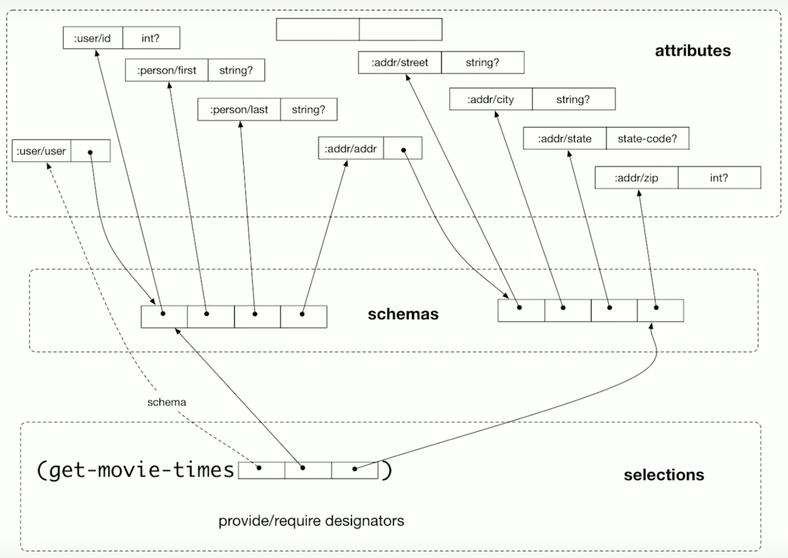

# Maybe Not

* **Speaker: Rich Hickey**
* **Meeting: [Clojure/conj 2018](http://2018.clojure-conj.org) - November 2018**
* **Video: [https://www.youtube.com/watch?v=YR5WdGrpoug](https://www.youtube.com/watch?v=YR5WdGrpoug)**

[Time 0:00:00]
```
slide title: Maybe Not

Rich Hickey
```

Thank you.  Hi.  Everybody can hear me?  All right.

Once again, it is wonderful to see everybody here.  A lot of friends.
How many people have been here every time?  How many people it is the
first time?  Nice.

[Audience applause]

How many newlyweds?  Yes.  Oh, two!  Woo!

[Audience applause]

Yeah.  That is awesome.

Before I get started, there has been a lot of controversy about what
we are working on, and how much we are working on it, and road maps.
I hope it is evident to everyone this week what we have been working
on.  It is our fashion sense.

[Audience laughter]

And I am happy to announce tonight, with the caveat that things can
change, and also that this is completely up to me, but the five year
road map for Clojure is going to be stripes [touches his shirt],
because I know you have seen enough of my purple shirt.

And if we get enough time to work on it -- and again, no guarantees --
we have done some experimental work already -- but we may work on
scarves.

[Audience laughter]

[Time 0:01:39]

OK.  Actually we have been working on a ton of stuff, and it is mostly
getting spoken about at the Conj, but the thing we did not _quite_ get
out in time for Conj was [Clojure version] 1.10.  But it represents a
ton of work.  And in particular, it represents a ton of work by
someone who is not getting to speak, who you just heard speak, but I
would really like to hear a super recognition for the work of Alex
Miller.

[Audience applause]

All right.  Maybe not.  So yeah.

[Time 0:02:27]
```
slide title: $N Mistakes

+ "I call it my billion-dollar mistake.  It was the
  invention of the null reference in 1965"

                   -- Tony Hoare
```
[ https://www.infoq.com/presentations/Null-References-The-Billion-Dollar-Mistake-Tony-Hoare ]

It is tricky working at the bottom of everybody else's stuff, being a
language designer, and working on languages.  And it is something that
anyone who does it takes very seriously.  And it is super stressful,
because you just do not want to make mistakes.

But they happen.  So let us talk about N dollar mistakes.  So we are
going to start with this quote from Tony Hoare, who said that null
references were his billion dollar mistake.  And they led to all kinds
of exploits in languages like C, and things like that down the line.
And of course they still exist.  And we still have nulls, although we
have Java's memory system, which makes them not necessarily exploit
vectors, but certainly still things that we are not happy to see at
run time, null pointer errors or whatnot.


[Time 0:03:24]
```
slide title: Where are nulls / options used?

+ optional requirements (args)
  + variadics and kw-args mitigate in Clojure
+ conditional provision (returns)
+ managing partial information (aggregates)
  + not idiomatic in Clojure
```

And there were many reasons why you might have put null references in
a language back when he did that had nothing to do with design
intention, or user intention.  Things like: it was easy to implement,
or it is efficient to implement, or they did not have another idea.

And in this talk, what I want to talk about is the fact that we still
use things like this.  We still have the desire to say that something
is optional, and whether we use nulls or some other thing in our
programming languages, this is still an idea.  This idea of maybe not
needing information in a certain context.

So when do we do it, and why?  Well the first is that we might
optionally require something.  So you could give me this, or not.  If
you give it to me, maybe I will have an extended set of features I
provide, but I do not need it.  So this is an argument to my function
I might not need.  And of course if you have got no variadic args, and
you have a fixed number of slots and some have to be optional, you are
going to have to put your optional thing as one of the types of the
args.  Or if you are using something like spec, you are going to have
to say that there.

Now we do that less often in Clojure, because we have a couple of
other ways to accommodate optionality.  For instance, we have
variadics.  So you can just not pass me those extra args.  I will put
them on the end, and I will have different overloads of arity, and
that is how you can get them.

Or you can say the optional args are keyword args.  And that is
another way to do that that does not have you having a nominal thing
which is a nilable, nullable, optional, maybe kind of thing in there.
But that is a place, certainly, argument lists are kind of product
types.  They have places in them.  The first argument, the second
argument, and whatnot.  When you have places, you have to put things
in places.

[Time 0:05:25]

Another place where we use optionality is in returns.  I am going to
go try to find that thing for you, and if I find it I will return it,
and if I cannot find it I will return null, did not find it, some
other kind of thing.  So I might or might not provide something to
you.  That is in the return value spot.

And pretty much there we do the null thing.  And we have nil punning
and everything else, because we are still having the nil party in
Lisps.

And then the core of this talk is going to be about the third context,
which I think is particularly interesting, and very challenging, which
is: how do you manage partial information in aggregates?  So I am
going to give you a collection of stuff, or a bunch of things that
have a name associated with the bunch, and then names within the
bunch.  And maybe in certain contexts I want to, or need to, see them
coming towards me, or I will or will not give you them as a provision.

We do not, in Clojure, tend to do this using nulls, right?  We do not
put a key in our map, and put nil in as the value there.  And I am
going to talk about the differences there.

So this is the context.  How do we represent optionality in programs?


[Time 0:06:51]
```
slide title: FTFY ?

Haskell

  data Maybe a = Just a | Nothing

Scala

  abstract class Any

  abstract final class Nothing extends Any

  sealed abstract class Option[+A]

  object None extends Option[Nothing]

  final case class

    Some[+A](value: A) extends Option[A]
```

So of course nils were bad, so other people fixed them for us, and we
are philistines for not yet using this.  And there are many floating
around.  This is not like: there is one answer.  There are many
answers.  So probably they are not all the best.

But in Haskell there is a type called Maybe.  It is a parameterized
type, Maybe of some type A.  And it has two constructors.  You can
have just an A, or you can have "Nothing", which is our nil.

And then Scala uses a lot of things to make that same kind of thing
ish, somewhat.  So I think we will stick with the Haskell version
moving forward.


[Time 0:07:43]
```
slide title: Making an arg optional

+ Yesterday

  foo :: x -> y

+ Today

  foo :: Maybe x -> y

+ compiler will force foo to check - win!

+ existing callers - break :(
```

And you will hear this said: this is the way to do this.  This fixes
the problem.  What is great about it is: it forces you to check.  And
of course that is the most important thing in programming: that
somebody is watching you and making sure you are checking for nils,
_no matter what the cost_.  And the problem is: no one can articulate
the costs.  No one ever mentions costs.  It is all benefit.

But it is not.  So when do you see the cost of Maybe?  You see them in
program maintenance.

So yesterday I had a function.  It took an X, and returned a Y.
People wrote code to that function.

Today, I am like: you know what?  I was asking too much of you.  I
actually can get by without that X.  I am now making it optional.
This is an easing of requirements.  An easing of requirements should
be a compatible change, I think.

So we make this change.  We say foo now takes a Maybe X.  This is the
way you write optionality.  And returns a Y.  And the compiler, inside
foo, will make sure that the code in foo does not accidentally fail to
consider Nothing.  Woo!  That is _all_ win.

Except what?  This breaks existing callers.  This is a breaking
change.  It should be a compatible change, but it is a breaking
change.


[Time 0:09:20]
```
slide title: Providing a stronger return promise

+ Yesterday

  foo :: x -> Maybe y

+ Today

  foo :: x -> y

+ future callers getter stronger guarantee

+ existing callers - break :(
```

Let us talk about providing a stronger return type.  So yesterday, I
was not sure if I could do the job in all cases.  I was not sure I
could provide a meaningful return value.  So I took an X, and I
returned a Maybe Y.

But today, I figured out how to give you an answer in all cases.  And
so, because when I was giving you that Maybe Y you had to deal with
it, I want future callers to have more certainty about what they are
getting.  So I want to make a compatible change of strengthening my
promise.

So relaxing a requirement should be a compatible change.
Strengthening a promise should be a compatible change.

So I do this.  I change it.  I say: I am definitely going to give you
a Y.  Guess what happened?  I broke all of my callers again.  I broke
my callers.  Because now they have code that deals with Maybe, and
they are not getting a Maybe any more.


[Time 0:10:21]
```
slide title: What's happening?

+ Maybe/Either are not type system's 'or/union' type
    + rather, evidence of _lack_ of first-class union types
  + 'Either' is -malarkey- [strike-through] misnomer
    + not associative / commutative / composable / symmetric
```

So what is happening here?  What is happening is that Maybe and
Either, in spite of their names, and the play on language in English,
are not actually type systems "or", no matter how many blog posts from
people that just learned Scala you read, and Haskell that you read.
This is not "or".

This is evidence of a type system that does not have "or" for types,
does not have union types, and you are trying to fix it in the user
space.  And guess what?  You cannot fix it in the user space.

Either, in particular, wow.  It is just not a beautiful thing.  It
does not mean "or".  It has got a left and a right.  It should have
been called "left right thingy", because then you would have a better
sense of the true semantics.  There are no semantics, except what you
superimpose on top of it.  And using English words to try to give you
some impression is not good, _especially_ in this case where you are
so failing to come close to "or".

It has none of the mathematical properties.  It is not associative.
It is not commutative.  And it is not symmetric.  Actually, better
than "left right thingy" would be "sinister dexter thingy", because at
least you would have some sense of how it treats "left".  It is: quite
poorly.


[Time 0:11:53]
```
slide title: Need not be this way

Kotlin - Nullable and Non-Null types:

  var a: String = "abc"

  a = null  // compilation error

  var b: String? = "abc"

  b = null  // ok

Dotty:

  "Union types are dual of intersection types.  Values of type A | B
  are all values of type A and all values of type B.

  | is commutative: A | B is the same type as B | A."
```

So I have a reputation for bashing type systems, and I am not.  I am
bashing Maybe and Either.  But other type systems have other answers
to the same questions.

Here is Kotlin.  Kotlin has nullable and non-null types.  So if you
say "String", it is assignable from a string.  That is pretty good.
But if you try to assign null to it, it says "compilation error".  So
they have strengthened the reference types in Kotlin.  They have said:
you know what?  Null is not an OK value of all reference types, even
though the Java JVM allows you to have a null as the value of string,
we are not going to allow it in the surface language of Kotlin, even
though it compiles to byte code.

But you can have string question mark ["String?"], and question mark
is the way you add nullability to a type.  And it creates a proper
union -- all of the strings and null -- as a type.  Because types are
sets.  So it is all of the strings -- that set -- and one more thing.
And then it is assignable from both.  You can assign it from "abc" and
you can assign it from null.

[Time 0:12:59]

If you made the same changes I just described in Kotlin, you would not
break callers.  Subject to how Kotlin links, and I do not know how
Kotlin links.

Dotty, the successor to Scala that the Odersky team is working on, has
union types in their plan.  And it says of union types: union types
are the dual of intersection types.  Values of type A -- I am going to
say "or" because I think it matches -- values of type A or B are _all_
values of type A, and _all_ values of type B.  That set.  It is a set
union.  "or" is commutative.  "A or B" is the same type as "B or A".

I think this is awesome.  I have never used a type system where I have
not desperately wanted this.  So it can be different.  Do not get
lectured to by people about Maybe and Either.  They are not the best
answers in the type system world.


[Time 0:14:00]
```
slide title: What about Clojure?

+ spec/nilable
+ spec/or
```

So let us get to the harder problems.  First of all, let us talk about
Clojure's versions of those things.  Obviously we are dynamically
typed, so we do not get into the "are you doing the right thing?" game
until we add spec.  But once we add spec, we are exactly in the same
place.  We are trying to enforce, in testing, the same kinds of
things.  Are you making sure you are dealing with what you expect?
Are people passing you what you expect?  Are you returning what they
expect?  Are you providing and requiring?

So we have spec/nilable, which is an analogy to the Kotlin nullable,
and we have spec/or, which is straight "or".  Of course, our types are
just sort of predicative sets.  You have a predicate.  Things that
satisfy the predicate constitute a set.  And "or" is unions of those
sets.  And it has all of the same properties you want for "or".  That
is why we are allowed to call it "or".


[Time 0:15:01]
```
slide title: Partial information

+ when requiring / providing aggregates
+ aggregate
  from ad- "to" + gregare "flock / herd"
+ information that travels together
```

So let us talk about the hard problem.  The hard problem is this
partial information problem.  So here we are talking about providing
or supplying aggregates.  So in Clojure, we would be talking about
sending around maps.  In object oriented languages you would be
talking about sending around objects, instances of classes.  You might
have a language that has record types.  It could be that.  Or it could
be Haskell-style types.

Of course we have our definition: aggregate.  And the thing that is
cool -- more secrets of giving talks -- is that it seems like I know
all of this Latin stuff.  But what happens is: I look it up, and I see
this great definition, and I am like: "oh my goodness!"  I mean, we
have known it all along.  Like our languages embed essential concepts.

[Time 0:16:01]

And so when I looked up "aggregate", I discovered that "gregare",
which is the same root as "gregarious", it means "flock" or "herd".
And flocks or herds mean animals that travel together.  This is a
beautiful notion.  It is exactly the right notion that I need for this
talk, which is that we are trying to talk about information flow in
programs.  And we are trying to say: we are creating these sort of ad
hoc, willy nilly aggregations for the purpose of a particular
communication.  We are gathering a set of fields, sets of information,
things we know, and we are passing them around.  It is going to travel
together.

So the notion of aggregates I think is super important, and the notion
of an aggregate being a herd is really beautiful.  So we want to stick
to that.  No matter how you make aggregations in your programs, you
are doing the same thing.  You are trying to name your herds, your
flocks.


[Time 0:17:04]
```
slide title: Sets vs Slots

[ Left picture is a herd of sheep grazing near each other in an open
grassy field.  Right picture shows a collection of small square pens
bounded by short walls, with one sheep inside each pen. ]
```


So now we get to sort of a fundamental difference in how you model
this.  It is sets versus slots.

In Clojure we use maps.  That is fundamentally sets of keys, and the
things to which they are associated.  In languages with records and
whatnot, you are dealing with slots.

Of course, you can already tell which one is better.

[Audience laughter]


[Time 0:17:38]
```
slide title: Maps vs Records / Fields

+ maps are (mathematical) functions!
+ simplest functions in programming
  + keyset -> vals
  + no code, no categories
+ in Clojure, we can directly write, and invoke

  ({:a 1 :b 2} :b)  =>  2
```

So let us talk about maps.  I find it really interesting, because
people look at maps, and our use of maps, and they are like: it is
just you being lazy, blah, blah, blah.

But you know what?  The thing is ...  Russ Olsen just gave a talk, and
he was trying to talk about functional programming to people who were
just trying it.  And he talked about mathematical functions, and the
fact that they are essentially mappings, but they are essentially
abstract.  And in programming, we only get mappings via code.

That is not true, actually.  We have an even more primitive way to get
from a mapping of one set to another.  And it is the literal map.  It
is saying: if you give me this, I will give you that.  If you give me
this other thing, I will give you this other thing.  And if you give
me this third thing, I will give you this third thing.  I am saying
specifically, declaratively, with no executable code, no functions
being run, nothing, a definition of a function.  A mathematical
function.  A mapping between a set and another set.  It is a concrete
thing.

[Time 0:18:51]

It is the best function in programming, because it is the easiest one
to understand.  It should be a function.  It should be something that
you can call, if it is a function.  And we can call the keys, right?
We do this all day long.  Maps are the most fundamental functions in
programming.  They should not be denigrated.  They should be exalted.
This is the first place to start.  This is the simplest thing that you
can do.

There is no code associated with it.  There are no categorical
statements that need to be made about it.  It is not like: something
of this, mapping to something of that, and binding between two ...  It
is like: no, it is this set, and that set.  An enumerated set is the
simplest possible thing.  A categoric set, or predicative set, is a
bigger notion.

So we can directly write these, and we can directly invoke them.  And
everyone knows, who works in Clojure, the feeling of this.  This is a
big deal.


[Time 0:19:57]
```
slide title: Records / Fields / Product Types

+ Place-oriented programming (PLOP)
+ Even when named fields
  + names not usually first-class indices
  + thus are not functions
+ Product types complect meaning and place

  data Person =
    Person String String Int Float String String
```

All right.  Records, fields, product types, blugh!  The stuff you did
before you did maps.  I will contend: even if they are immutable, this
is still place oriented programming.  There is a place for the name.
There is a place for the address.  There is a place for the other
thing.  This is not a function any more.  And in general, because even
when the fields are named, and sometimes they are not, if you just
have raw product types you have got no names.

But even when the fields are named -- so for instance a Java class,
you have got names for your fields -- they are still not first class.
You cannot say: given this object and this name, give me the thing.
Obviously, you can use Java reflection and make six function calls to
get the same effect, but it is not an invokable entity.  So they are
not functions.  You do not get to use your information as a functional
mapping.

And a straight product type just completely complects the _meaning_ of
things with their position in a list.  Now I know Haskell has a record
syntax, and I am going to show that.  So I am not trying to say they
do not have a way to put names on these things.  But the fact is, you
have to know the second string is different from the first string
because, I do not know what.  It is not in the types.  So this is
place oriented programming.

And it matters, right?  Because what is the challenge of having a
place?  There always has to be something in the place, right?  There
is this big difference between having places, and therefore spaces,
and not.


[Time 0:21:50]
```
slide title: But ...

+ At least records enumerate what's possible
+ maps completely open, no guidance
```

But -- and of course this is another thing we have to be defensive
about -- at least these records, classes, whatever, they enumerate
what is possible.  We are passing maps around, it is the wild West.
It could be anything.  How do you know what it is?  All I am going to
do is debug this thing forever.  Maps are too open.  There is no
guidance.  There is no delimiting thing.  There is nothing that
enumerates the possible herd.


[Time 0:22:20]
```
slide title: spec/keys

+ independent, reusable attributes, RDF-style

  (spec/def ::make string?)

  (spec/def ::model string?)

  (spec/def ::year (spec/and int? #(>= % 1885)))

+ aggregate to form _schema_

  + information about cars that travels together

  (spec/def ::car (spec/keys :req [::make ::model ::year]))
```

But of course that is true until you add spec.  The idea is that spec
is an orthogonal way to add that kind of communication, expression,
validation, testing, around statements you would make about your
aggregates.

And then we have similar kind of stuff.  Of course, it is not the same
at all.  What we have is RDF-style, independent, reusable attributes,
especially when they are namespaced keywords.  And we connect them to
their range specifications.  And they are all by themselves, until we
go, in a second step, and we aggregate them when we say: let us take a
set of those and name that.  And that is our little herd or flock.  We
are going to group some of them together.

And I would like to call those aggregations schemas.  They sort of
imply a shape.  And we will talk a little bit more about that shape
not just being always a list, in a second.

So that is how we can say: this is information about cars that travels
together.  Car is a spec, or names a spec, which is a keys spec, which
means it is just sort of describes the keys that can be present in a
map.  And there is make, model, and year.  So this gives us the same
kind of ability to say there is a name for the herd, and there are
names for the things that could be part of the information that
travels together.  So we are sort of drawing a circle around a
particular kind of shape.  Or we are drawing a shape around the
particular set of information.


[Time 0:24:05]
```
slide title: Optionality and aggregates

+ When something is missing from a set
  + _leave it out!_
+ When something can be missing from a slot
  + make a billion dollar mistake?
  + Maybe sheep?
```

So now we are at the core question.  What do we do when some of the
stuff can be missing in a particular usage context?  We sort of talked
about this before.  If we are dealing with maps in Clojure, what do we
do if I do not have the street address for some user?  What am I going
to do?  I am just going to leave the key out.  I am going to leave it
out of the set.

And there is a tremendous benefit from that, because the thing is that
in addition to the maps being functions, maps are also self
descriptive.  You can call "keys" on a map, unlike a function.  If you
want to know: "what mapping does a function make between X and Y?",
the categoric descriptions of it: "takes a string and returns a
string", that actually does not really help you understand: "if I gave
you this string, what string would I get?"  Categoric descriptions do
not really tell you what is happening in the function.

[Time 0:25:06]

But maps as functions, you can do that.  You can say: "exactly what
things can you take?"  And "keys" tells you.  Exactly what things can
you return?  "vals" tells you.

So this enumerability is super important, which is why you do not want
junk empty keys in your maps.  You want to leave it out.  That way the
map can tell you: I do not _know_ the last name, or the address.  I do
not know that.  The maps know what they know.  That sheep is missing
today.  It was sick.  It stayed in the barn, not out in the field.  I
do not have to worry about it.  It is not like: where is Fred sheepy?
Just "not present".  It does not help me.  Now I am anxious, right?
Should I have Fred sheepy?

What about slots?  Now you have a problem.  You have those boxes.  We
saw the sheep in the boxes.  If you have places, you have to have
something in the place.  These languages pride themselves on not
having uninitialized memory.  Because in the old C days, you could
just do nothing, and have at it.  When you try to touch it, it will
definitely blow up, spectacularly.

But in the area of no uninitialized memory, then you have to have
something to put there.  Which means, what are you going to put?  You
have a couple of choices.  You have billion dollar mistakes, which
they do not love.  Maybe sheep.

So that is the thing.  When you say maybe sheep, you know that that is
not really a thing.


[Time 0:26:48]
```
slide title: Context

+ RDF-style attributes are context-free
+ make it clear that Maybe things aren't real
+ e.g. either you know the ::model or not
  + in some context
+ nothing is inherently a Maybe string

  (spec/def ::model (spec/nilable string?))  [strike-through that entire line]
```

So how do we know it is not a thing?  How do we get to: "it is not a
thing"?  Well I do think that the RDF people -- who are information
representation experts, who have been working on that problem for a
long time -- really have good ideas.  And I think their ideas about
properties being independent, and about making declarations about
properties, about their ranges, that are independent of how you might
ever put them together with other properties to form any kind of
aggregate, is a completely sound one.

And when you do that, you realize that you would never say "maybe
anything".  Because when you are talking about something in isolation,
destined to be combined in myriad ways in many different aggregates,
to be part of many different herds, who knows that it is maybe?  That
you might not need it, or will need it, definitely will need it?  You
cannot decide then, because you know this is a building block.  And
that is how you know "Maybe" is not a good idea, Maybe types.  And I
do not care what they are, they are not really a great idea.
Especially maybe types now in slots.

[Time 0:28:04]

Because the thing is, there is no such thing as a maybe thing.  If
names are strings, names are always strings.  You either know the
name, or you do not know the name.  That is an orthogonal idea from
"what is a name?"  A name is a string.  Knowing a name is a different
idea.  If type systems make you jam those two things together, they
are wrong, because they are separate ideas.  We would like to keep
them separate.  We are trying to use our programs to model the world
and communicate with each other, and when we communicate with each
other you never say "I have got six maybe sheep in my truck".  Never
ever.  Nothing is inherently a maybe string.

So we do not want to do this.  And this is actually sort of usage
guidance.  We do not want to say that a thing is a nilable whatever.
Because we do not know where it is going to be used.  We would like
that to be something that happens later.  And it is part of the talk
just to talk about this.


[Time 0:29:02]
```
slide title: Optionality in aggregate schemas

  data Car = Car {make :: String,
      model :: Maybe String, year :: Maybe Int}

  (spec/def ::car (spec/keys :req [::make]
                             :opt [::model ::year]))

+ model and year are optional ...
```

Let us talk about how we do this, then.  I want to contrast these two
things.  So we have these ideas in both spaces.  If you were doing it
in Haskell -- and this now shows the record syntax, because they do
have names possible.  It is just sugar over that product type I showed
you before.  But we have the same idea.  A make is a string.  We have
a car.  It has a make, a model, and a year.  And we are saying maybe
it has a model, and maybe it has a year.

And in spec we can say the same kind of thing.  We say "keys", and we
say we require [:req] the make, and that the model and the year are
optional [:opt].

There is this word in your head.  It is like [sound effect].  It is
like The Tell-Tale Heart.

[ "The Tell-Tale Heart" is a short story by Edgar Allan Poe:
https://en.wikipedia.org/wiki/The_Tell-Tale_Heart ]


[Time 0:29:51]
```
slide title: Optional when?!

+ mistake
+ unlike args/returns, there is no usage context here
+ wrong place for optionality
+ _I made this mistake too in spec_ :(
```

"When?"  When?  When?  When?  When?  When?

We do not know the model and the year.  _When_ don't we know the model
and the year?  We do not give you the model and the year.  _When_
don't we give you the model and the year?  We do not require the model
and the year.  _When_ don't we require the model and the year?  Who
knows when?

[ jump back to previous slide ]

When does this say when?  This does not say when.  This says forever
and ever and ever: cars maybe have years and models.  There are a lot
of times when they do have years and models, and there are other times
when I do not care about the years and models.  Or I only care about
the make and the model, but not the year.  Show me everything about
Ford Mustangs.

[ jump back forward a slide ]

So this is a mistake.  It is a mistake to put optionality in aggregate
definitions.  There is no usage context.  At least when you look at
function arguments and returns, you are in a usage context.  You are
saying "of function foo, it requires these arguments, and it provides
this return value".  There is like a baked in context in the fact that
you are talking about foo's arguments, and foo's return.  The context
is: when calling foo, this is required and that is not.

[Time 0:31:06]

Making an aggregate definition that you are going to use all over the
place -- it may be an argument sometimes.  It may be a return
sometimes.  It may be arguments to five different functions that do
different jobs.  It is the wrong place for optionality.  And I made
the same mistake, right?

[ jump back to previous slide ]

I just showed you this.  This is not better.  This is the same
problem.  This is not Clojure being better than Haskell, or Kotlin, or
Scala, when you put maybe in the definition of a struct or record.
This is the same problem.  There is no context here, and optionality
is context dependent.

[ jump back forward a slide ]

So I know people are wondering: oh, where is spec?  When is it going
to be finished, or whatever?  It is going to be finished when I figure
this out.

[Audience laughter]

So last year I had a pang.  I saw this.  I had seen some people using
it.  I had done more thinking about it, and I realized that this was
not right.  And I spent the last year -- in addition to other stuff,
like picking out this scarf -- thinking about optionality and how it
should work.

And in particular, I saw a lot of people struggling trying to use
spec, and when I talk about some of the areas in which things could be
better, I think you will all recognize how maybe they have been hard.


[Time 0:32:33]
```
slide title: What do we want?

+ maximize schema reuse
  + don't want context-driven proliferation
    + yields more code, less reuse
+ support symmetric request / response
  + call partially filled in, get more filled in
+ information-building pipelines
  + many partial information increments
```

Because a lot of times, you just do not -- I gave it to you and it
looked good.  And it is good.  I am not saying it is bad, but it could
be better, especially right in this area.

So what do we want?  So it is easy to say that things are wrong.  What
would be right?  Well what we want is to maximize schema reuse.  We
want to maximize the reusability of the idea of a herd of information
that represents a car.  The kinds of stuff we might think are
interesting about cars include these things.  And we are going to give
that a name.  That helps us communicate.  It can help us validate
things.  It can help us check for errors, even before we get to
optional requiredness.  There is a lot we can do with that notion.

The other thing that we want is we want to make sure that we do not
have a proliferation of different schemas just because the contexts
are different.  My car for passing to foo.  My car for passing to bar.
My car that gets returned by baz.  We do not want that.

What happens when you do that?  Well first of all, besides having a
proliferation of types, which -- how many people have worked in typed
languages and had a proliferation of types?  Yeah, I mean it is like
what happens.

[Time 0:33:55]

The problem with that is that is not really helping you.  Those names
do not help you.  And they drive down the reusability of your
consuming code.  I write some code that deals with my cars.  Well my
code deals with my cars.  And your code deals with your cars.  We do
not have any code that deals with cars, because we all had to make
separate cars, because we all had to make a car that had a different
masking of optionality for use in a different context.

So we do not want that.  We want to maximize the reuse of the idea of
car, or other schemas.  Other shapes.  The shape is sort of a generic
idea.  It is not yet instantiated.  A schema is a form for a model.
It is not the thing.  It is sort of like the outline of a thing.  The
form.  That is what schema means.

We want to support a whole bunch of situations.  And these are the
situations I think people have encountered, and see if you recognize
them in trying to apply spec.

For instance, there are many kinds of APIs, especially wire protocols
and things like that, that have symmetric request-response
specifications, from a schema standpoint.  Give me a partially filled
in form, I will give you back a more filled in form.  That is quite a
common thing.

But with spec, if you had to say, well the thing I require is you must
give me the id and the database something context, and what I provide
will definitely include the names and phone numbers, but maybe not
these other things, they were forced to become two different specs.
One was the spec for what is required, and the other was a spec for
what was provided.  And everybody wanted to reuse the specs across
those things, and they wrote really goofy predicates inside to try to
reuse some stuff.

[Time 0:35:53]

Because you see, the other problem with not being able to reuse: it is
a recipe for error.  If you have to define car, and I have to define
car, well maybe you will call it make and model, and maybe I will call
it brand and model.  And now we have got no connection, where we
absolutely should have had a connection, because we have had to
restate the same ideas.

So that is a context.  Another context which is quite common is a
pipeline of information building.  So you think about Ring [see below]
request chains and things like that, where each handler can sort of
adorn the request with more information, or to fill out default
information.  Things like that.  We have a bunch of handlers that work
that way.  Well what would the spec be for each stage?  Again, it is
sort of like an explosion.

[Ring is a Clojure specification and library for dealing with web
server requests and responses, that predates the creation of Clojure
spec.  https://github.com/ring-clojure/ring ]

What we want is the overall name for the idea of "this herd is coming
through", but the herd may start small, and then I walk by with my
sheep I added to the herd, and you add your sheep to the herd.  We are
acquiring information.  Acquiring information should not be hard.  And
we were doing it already in Clojure, and Clojure programs are actually
really good at both of these things, but spec was not as good as
Clojure was in allowing you to talk about, orthogonally, the
information set, the information schema, and the actual requirements
and provisions of, for instance, stages in a pipeline.

How many people have felt tension applying spec in these kinds of
contexts?  Yeah.  Eventually, if you get to become -- you are doing
more, you will feel this more.


[Time 0:37:36]
```
slide title: Schemas are deep

+ can nest
  + and thus roots potentially describe trees
+ attribute values can be collections
+ optionality specs should be deep
```

It is even harder than this, right?  Because the thing is, schemas
nest.  You can have a schema that is an aggregate, and one or more of
the things in the aggregate are themselves aggregates.  And this is
where you truly realize that putting in aggregates is impossibly
wrong.

Because essentially, schema means shape.  If I give you a schema that
says "A B C D" and C and D are themselves "X Y Z", "FOO BAR BAZ", what
is the shape?  It is not a four thing vector, is it?  That shape
described by that schema, which has pointers to other aggregates,
describes a tree.  The shape of the thing is actually a tree.  And the
thing you get passed will be a tree.  And the thing you return will be
a tree.  It is deep.  And it means the optionality spec should be
deep.

Because you cannot talk about a tree only by putting annotations on
the root.  There is no place for it.  If I said C has "X Y Z", and you
need X, where are you going to put that in a definition of the top?
You cannot.


[Time 0:39:07]
```
slide title: Fixing it

+ split apart _schema_ - shape
+ from _selection_ - what's required / provided in a context
```

So we want it to be deep.  We want this to be deep.

So like all design things, this is just: what was wrong?  Two things
were combined that should not have been combined.  And how do you fix
it?  You take them apart.  The rest of this -- this is all it is.  The
whole thing is this.  You got a dictionary, and the idea of taking
things apart, and you are done.

[Audience laughter]

So talking about forms is "schema".  Just the overall shape.  And then
talking about subsets of the schema, subsets of the shape in context
is "selection".  What things are we going to pick as being required,
or as being provided?  And we do selections in context.  And that
gives us this orthogonality, and two things we can combine.


[Time 0:40:01]
```
slide title: _schema_ - shapes only, no requirements

(s/def ::street string?)
(s/def ::city string?)
(s/def ::state state-code?)
(s/def ::zip int?)
(s/def ::addr (s/schema [[::street ::city ::state ::zip]]))

(s/def ::id int?)
(s/def ::first string?)
(s/def ::last string?)
(s/def ::user (s/schema [[::id ::first ::last ::addr]]))

(get-movie-times user) needs ::id and ::zip
(place-order user ...) needs first, last and full address
...
optionality specs in top level alone can't express these
```

So let us look at how we would do this.  So we have this schema.  This
is shapes only.  This is pseudo future code.  And the idea here is
that this does not imply required or optional at all.  That is not
what it is talking about.  It is only talking about: in this herd, we
can have sheep, and we do not have helicopters.  That is the idea.  We
are just talking about that.

So we can have an idea of an address that has a street, a city, a
state, and a zip.  I am not advocating any of these things as canonic
whatever, and I know zip codes are hard, and blah blah blah.  So we
say street describes its range, city describes its range, etc. etc.
So state has an arbitrary predicate "state-code?"  They are a thing.
Zip code could be its own function, right?

And then address is a schema that says: you could have streets or
cities or states or zips in addresses.  That is all that says.  And
that is a useful thing to be able to say, and to name.

And then we have a user.  We have a user in our system.  People make
systems with users all the time.  And so a user has an id, a first and
last name, or _can_ have an id, a first name, and last name, and an
address.  So we are going to define new attributes for id, first name,
and last name, and then we are going to say user could have id, first
name, last name, or address, which was the other aggregate.  So this
describes a little tree.

[Time 0:41:38]

Now we have some imaginary usage contexts.  So maybe we are building a
system.  We have users in our system, and our system can let you get
movie times, and it lets you buy popcorn.

So "get-movie-times" -- in order to give you the movie times, I need,
or want to see, your user id and your zip code.  That is all I need.
I am going to use that, and I am going to go find the stuff.  So I
want a user to be passed, but all I need to know about it are these
two things.

Now the user id is up high in the root definition of user, but the zip
code is an attribute of the address of a user, inside a nested
aggregate, further down the tree.

What about placing orders?  Placing an order, I want to see your first
and last name, and I am going to ship it to you, so I need your whole
address.

So these are both functions of users that have different requirements,
in different contexts.  These are the kinds of things we want to
model.  The important thing is that there is no way, there is no
optionality spec at the top level, that can represent saying these
things.  You cannot say it, which means nobody can say it.

We just had a GraphQL talk.  Guess who cannot say it?  Yeah.  But you
will be the first to be able to say it.  This will be awesome.


[Time 0:43:06]
```
slide title: [None]

(get-movie-times user =>
  (s/select ::user [::id ::addr {::addr [::zip]}]))
               ^
               |
               +------------------------  reusing schema in
                                  ------  different contexts
(place-order user =>             /
  (s/select ::user  <------------
            [::first ::last ::addr
	     {::addr [::street ::city ::state ::zip]}]))

+ _select_ - deep requirements
  + still an open system, can have more
+ separates requiring attr from reqs _of_ attr
+ can spec into members of colls
+ syntax TBD
```

So how will this work?  And again, this is not syntax yet.  But
imagine you could say that the spec for user will be this "selection".
It will say: from the herd user, from the shape, the schema, user, I
am interested, and I must have, the id and the address.  And of the
address, I need the zip code.

And then to place an order, we are saying again, I am interested in
user information here.  This is what I am expecting to see.  And I
need the first and last name, and the address, and from the address I
need the whole thing: street, city, state, and zip.

This "select" notion is a deep requirements thing.  If you have ever
used Datomic pull, this should smell like some pizza.  It is a similar
pizza.  You need a language for talking about trees and recursion, and
things like that.

So this separates requiring the attribute, from the requirements _of_
an attribute.  You saw address, and then zip of address.  That seems
like, what?  Why do I have to say that?  That is like four more
characters.  This is so hard.

[Time 0:44:25]

But it ends up, they are different things, because there are
definitely contexts in which you say: addresses are optional, but if
you give me an address, you have to give me a whole address.  Those
are two different ideas.  I need an address, or: I do not need an
address, but when you give me addresses, I need this part.  Those are
two separate things, so they are said separately in this model.  Does
that make sense?  OK.

And this allows you to spec into members of a collection, because that
is what you need.  What you are actually accepting as an argument is a
tree implied by the schema.  It is the whole tree.  The context
specifications you need to supply have to be about the whole tree.

Because otherwise, how are you going to compose this?  If you need
different fractions of addresses in different contexts.  Think about
the explosion.  The combinatorial explosion of root things with
different kinds of nested things, so that the roots could have the
right stuff.  You just cannot do this job on the aggregates
themselves.  You have to be able to talk about the trees.  It just
took a long time to figure out.

[Time 0:45:40]

The other thing that this will be able to do, that I am not showing on
this slide, is to spec into members of collections.  So sometimes you
will say: the spec for something will be "I have friends".  And then
friends is a collection of person, and persons have whatever.  And so
you want to be able to say: of every friend you are telling me about,
for each friend, I need this information.  So to be able to spec not
only into nested schemas, but also nested collections of things.  So
you will be able to talk down into nested schemas, as well as each
member of a nested collection.

This is the kind of power you need to apply spec really everywhere,
because obviously function it [TBD] data in and out is one thing.  And
it gets pretty complex, but how many people use spec for wire stuff,
and APIs, and things like that?  It is definitely intended to be used
there.  That is part of the value proposition of it.  Those kinds of
things definitely need this kind of stuff.  So I am really happy about
being able to go there.


[Time 0:46:52]
```
slide title: Don't repress me, man!

  (s/select ::user)

+ This (no requirements) is ok!
+ Why bother?
  + communication
  + test generation
```

What about this?  Is this saying anything?  You are not forcing me to
do anything.  Where is the fun in that?  What are the points of types,
if you are not forcing some thing?

Well there are two good reasons.  So anyway, this is going to be OK.
You are just saying: what I expect to see is user information.

And the thing also to remember about these selects: this is just
minimal requirements.  You can always have more stuff.  You can have
way more stuff coming in.  There may be more stuff coming back.  And
there may be stuff not in user.  Spec is an open system.  Having more
is OK.  I am not going to help you write closed, brittle, breaking
systems.  I am not going to do it no matter how much you complain on
Twitter.

[Audience laughter]

It is not going to happen.  It is just not going to happen.  So this
is like minimal requirements, minimal provision.  It is not a boundary
around things.

So saying this just says: I have an expectation of seeing user data,
stuff from the user flock.  I want to see sheep.  I do not want to see
helicopters.  Or, I cannot do anything with helicopters.  I am
expecting sheep.  You could send me a helicopter, and maybe my job is
to pass it along to the next thing, which is going to air lift the
sheep to somebody else.  That is not what I do, but they do it.

[Time 0:48:27]

I think that that is an important part of making flexible systems:
that you can flow information through things that just do not even
know it is happening.  That is important.  That is how transportation
networks are built.  You cannot _not_ have that.  You cannot have
trucks that only hold certain kinds of things that run on roads that
only hold trucks of certain kinds of things.  The world does not work
that way.

So why would you say something like this?  It helps you communicate.
The user gets a sense of: what am I supposed to pass?  Or what will I
get?  And it will help us with test generation.  Your function does
expect to see user data.  I will generate tests that give you user
data.  And in this case, various random subsets of anything that a
user could, that is implied by user, deeply down the tree.  Which we
already do the trees, and all that work.

And that is another part of why this makes sense.  When we generate
user stuff, we do not generate roots only.  We generate trees, right?
We go down into the nested specs.  And if they are collections, we
generate down into those.  This lack of symmetry between selection and
generation, that was a warning sign.


[Time 0:49:42]
```
[Figure showing attributes near the top, schemas in the middle, and
selections near the bottom, with many boxes and arrows between them.]
```


Is that super tiny?  It does not really matter.  It is exactly what I
was talking about before, so you do not need to read the text in the
boxes.  This is still the same users and addresses, and whatnot.

But what I am trying to show here is the split.  We start with RDF
style attribute, and they map to RDF properties.  Definitions that
describe their own ranges.  They are just floating around, waiting to
be gathered up in herds, and herded around in your programs.

And you can gather them up, and of course that creates other
attributes, which point to the gatherings, the aggregates.  But we are
going to call those schemas.  They still do not have any
requirement/provision sub-setting.

And then finally we have selections, which you will tend to use only
at the edges of usage contexts.  It is unlikely, although it will not
be impossible, for you to make named specs that point to selections,
but I will probably prohibit nested selections, because then you are
just back to the thing I just fixed.  I do not want to let you make
that, and do it to yourself.  But it would fall out of this being
fully general that you could, so we will probably close that door.

So now you have these separate ideas, which are the way you think
about things anyway, but now you get to say it the way you think about
it.  And this is going to make systems a lot more reusable.


[Time 0:51:27]
```
slide title: Coming up

+ this _schema_ / _select_ work replacing _keys_
+ better programmatic manipulation of specs
+ refined _fn_ specs
  + looking askance at argument-independent return type descriptions
```

And extensible.  That is part of the idea of spec, is that you can
make systems that you can change, that you can enhance over time.
That _is_ the game.  Saying today you could do X or Y, it is not
enough.  Every program changes.  Every program grows.  You _need_ the
ability to talk about type-like things in ways that are compatible
with program evolution.  That is the idea behind spec.

So this is coming.  Of all of the things we are working on, this one
was least far along by Conj, but this is the next thing coming in
spec.  It will eventually replace keys, but these are obviously two
different names, so there may be a migration world where all three
names exist.

We also have been working on better programmatic manipulation of
specs.  If anybody is looking at alpha2 on this pretty cool system, I
think, for defining macros on top of multi-methods, which now gives us
the sort of intermediate step that is program accessible that does not
involve generating the shape of a macro form and eval'ing it, because
I know a lot of people want to write programs that write specs.  That
has room to grow more, but the underpinnings are in that system.  Also
it is a cool system to make extensible macro libraries, so have a
look.

[Time 0:52:54]

And other things I have been thinking about have been refining the
function specs.  So I am of course very wary right now about any other
type system-y gook getting into spec.

And the next thing I was going to work on a year and a half ago in
spec was trying to refine the idea of the return specs.  I know people
are struggling to say: it takes a collection of X, and returns a
collection of X.  This kind of thing you would say with parameterized
types.  The amazing type signature for "reverse".  It takes a list of
A and returns a list of A.

And the problem is: when A is predicative, that is harder to say.  But
there is a bigger problem: it is pointless to say that.  That is not
something you want to say.  That "reverse" takes a list of A and
returns a list of A, it does not communicate anything about what
reverse does.

If I asked you what "reverse" did, and you told me that, I would not
be happy.  If you needed to implement "reverse" and I told you that,
you would not be happy, because it does not communicate anything.

What do you want to say about "reverse"?  _At least_ you want to say:
it reverses the list it was given.  So if that list was all of
strings, what could you possibly derive using the most basic logic
about the return, if what you said was: the stuff that was in the
collection that came in.  Well you would know if that was all strings,
that it would return all strings.  The categoric declaration of that
is almost information free.  You almost always want your return
specifications to be dependent on your arguments.  In other words, the
fn specs.  The fn specs are the real deal, because you can derive the
trivialities from that.

[Time 0:55:01]

But it also means that you do not need something like parameterization
to say: I take a collection.  I do not care what it is, but it will
satisfy some set of predicates.  If I could say I return that same
stuff, or a subset of the stuff that you gave me, you would know those
same predicates applied.  You could use logic to do that.  You would
not need some icky category language to talk about return types,
because it does not really say what is happening at all.

The fact that you return the same stuff, or a subset of the stuff,
says way more.  And of course then you could do more with spec.  You
could start talking about what "reverse" actually does.  What are the
properties of the reversed thing compared to the incoming thing?  What
did "reverse" do?  Which is what fn specs allow you to say.

So I am starting to smell "ret" in fn specs, but I want to make it
concise to sort of do something without _having_ to fully define your
fn spec, because sometimes that is a challenging thing to do.  But the
fact is, if you could just say: returns the stuff from the collection
it was given, you would be saying more than type systems let you say.
And if you cannot say everything about the nature of your algorithm,
and all of the transformations, it is OK.  You are still adding value.
You are still adding rigor to your system.  And you are still helping
people understand what it does.  Maybe it is a combination of a
partial specification of the result, and documentation, that helps
them totally put it together.

[Time 0:56:38]

Which is another thing I would just sort of say generally about spec
is: there is often a desire to completely nail everything down.  That
is not necessary in a lot of cases.  There is a spectrum of what you
can communicate.  What is straightforward to communicate, and what is
not.  And all along that spectrum, pretty much after the very first
spec step, you are saying more than type systems ever let people say.
And you are letting things be tested in an automatic way more than you
were ever getting.  So do not go crazy if you cannot completely spec
the entire nature of your inner algorithm, because sometimes it is
challenging.

Other things about making return types talk about the inputs is that a
lot of people in spec are struggling with talking about functions that
rely on external state.  Reifying external state as an additional
input, which is what it is, is another thing that I have been thinking
about.

So that is really future thinking kind of stuff, but the important
thing is: I have been working on spec.  New things are coming.  They
are going to make spec better.  We are extremely sensitive to breaking
programs that you spec, and making the transition of Clojure's use of
the current spec to the next spec straightforward.  So we are thinking
about those things.  And we are working on it.

And that is it!

[Audience applause]

[Time 0:58:11]
