# Persistent Data Structures and Managed References

* **Speaker: Rich Hickey**
* **Conference: [QCon]() - Oct 2009**
* **Video: [http://www.infoq.com/presentations/Value-Identity-State-Rich-Hickey](http://www.infoq.com/presentations/Value-Identity-State-Rich-Hickey)**

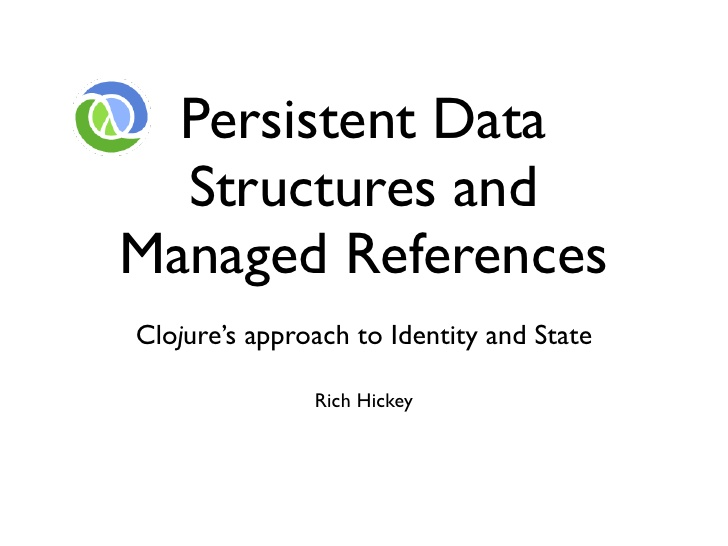

How many people program in a functional programming language? Okey, so halfway ??? converted and not in a functional programming language, a non-functional programming language? so still a lot of that. Ah, I think this will be useful to both audiences and in particular if you're not in a functional programming language, in fact if you're not in Erlang, which I think has a complete story for how they do state, all the other functional programming languages have you know 2 aspects, they have this functional part, and then, and then, you know, Haskell has this beautiful side where the type system keeps this part pure and then there's the other part which is kind of imperative, do this do that, and then they have a bunch of constructs to make,err , provide the facility for ??? state ,on that side ? Similarly there are a lot of hybrid functional programming languages, like Scala, F#, where I think there are questions to be asked about, okey here's the pure part, what's the story about the other part.

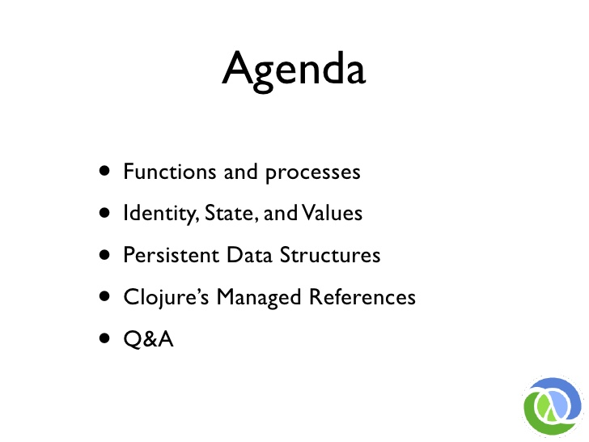

 So what I want to do today is to talk about functions and processes and to distinguish the two. In fact, the core concert in this talk is it to try to parse out what we mean by identity, state and values, try to separate those concepts and see how programming with values while a really important part of the functional of your program ends up being a critical part of the non functional part of you program, the part that actually has to manage state and behaviors if things are changing, and there are two components in that one is how you represent composite objects and values. Lot of people who are new to functional programming wonder about the efficiency and representation issues there and I'll talk about that and finally I'll talk about one approach to dealing with state and change in a  program, the one that Clojure uses, which is compatible with a little bit of philosophy which I'm gonna start with.

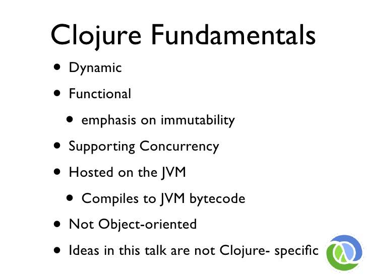

I'm not really gonna talk about Clojure very much, how many people were in the talk yesterday. Okey, how many people who weren't know something about Clojure. Okey. This is not really a Clojure specific talk, though there'll be some code later, it shouldn't be too threatening. Just gonna summarize quickly with this one slide. What Clojure is about is it's a dynamic programming language, it's dynamically typed, it's functional in particularly, it's functional in emphasizing immutability, not just in, you know, supporting higher order functions. All the data types in Clojure are immutable. It supports concurrency  in that it's a two part story, one is you have type support for immutability and pure functions, the other part is you have to have story for when multiple things happening at a time and you're gonna have some perceptible change, and Clojure does. In fact, I think it's an important part of a language that purports to be functional to have a story about the non-functional part. Clojure is not particularly object oriented, it may be clear after listening to this talk why not, because I think as currently implemented, all of the object-oriented technologies have big problems when they face concurrency and functional programming, as I said, from a conceptual standpoint nothing about this is Clojure specific.

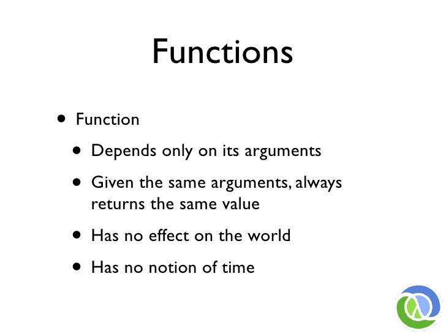

So what do we mean by functions, I think that there's a really easy way saying oh function is something that you call and that's not what we're talking about here, we're talking about a very precise notion of function which is something that you call that takes values as arguments and produces values as returns. When it's given the same arguments, it always produces the same values, it doesn't depend on the outside world, it doesn't affect the rest of the world. So many methods in your classes are not functions by this definition, but in particular too, I want to highlight the fact that pure functions have no notion of time. Time is gonna be a critical notion through this talk.

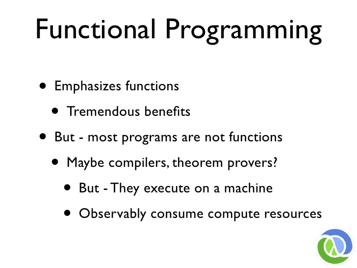

So what is functional programming, there are a lot of answers to this questions and I think people who are really into type system will claim a stronger arguments for what constitues functional programming. But I'm gonna limit the definition here to, you know, programming that emphasizes program with functions, so you wanna try to write as much of your program as you can with pure functions. When you do that you get a ton of benefits, they've been talking about that in other talks, it's not really the focus of this talk other than to say, even without concurrency, your program will be easier to understand, easier to reason about, easier to test, more modular and so forth. That all falls out of programming with functions to the greatest an extent as possible. On the other hand, when you step back and look at your entire program, very few programs on the whole, are functions. You know, that takes a single input and think about it and produces a single output. Maybe some compiler or theorem provers work that way, but most real world programs that I worked on, and I think most real world programs in the real world don't work that way. In particular, well, even if you claim your program is completely functional, it's gonna produce, say, outputs, it's not, coz otherwise it's just gonna warm up the machine. But, even if it's mostly functional, there's still an observable effect of a purely functional program runnning, right. It's running on a computer, as soon as it's running on a computer it's not math anymore, right? It's a program running on a computer, it's consuming memory, it's consuming clock cycles, it's observabaly doing something over time. So all programs do things over time. But most real world programs ??? actually have observable behaviors, that is not just the fact that they're running on a computer, but that they're doing things, they're interacting with the outside world, they're talking over sockets, they're putting stuff on the screen, they pulling things in and out of the database. In particular though, we use one critical measure about how to define states, which is if you ask the same question twice, and you get different answers, then there's state. I don't care where you put it, you put it in a process, you put it in an agent, you put it in an atom, you know, in a variable, doesn't matter, in a database. If you ask the same question twice and get different answers at different times, you got states. So again, the word time just came up again there.

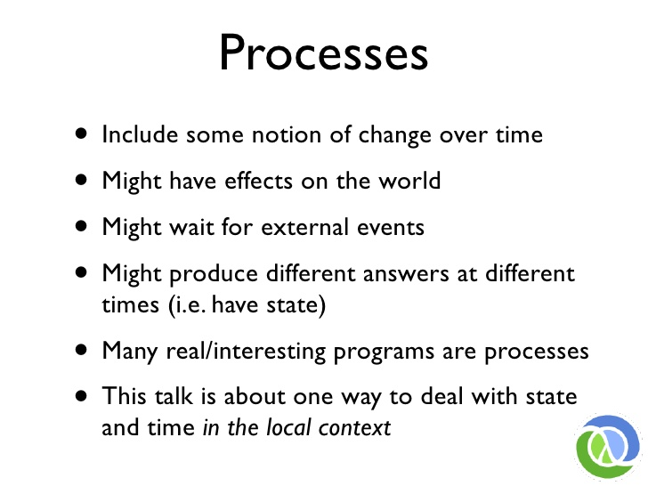

So I think most programs are processes which means we need to talk about the part of your program that can't be purely functional, the part that's gonna have to produce different answers at different times. How do you do that, and not make a complete mess out of what you created with the shining pure part. In particular though I wanna highlight the fact that this talk is strictly about the notion of state and time in a local context, I'm talking about in the same process. There're a completely different set of requirements and characteristics of distributed programs, where you cannot do the same things that you can do in the same process. So I'm talking only about same process concurrency and state.

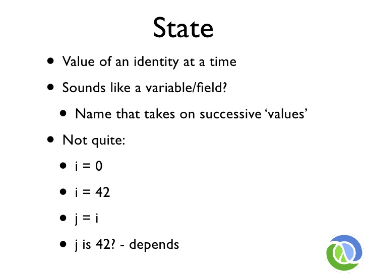

So I want to be a little more precise about what I mean when I say identity, state and value and these kinds of things and in particular I'm gonna talk about state and I'll talk about it twice. One is just ??? a generic statement, state is the value of an identity at a time. Maybe none of that makes sense. Maybe it sounds like a variable from a traditional programming language right? Because I think if you ask anybody who uses traditional programming language Do you have state? Yeah I have some variable, I change them and that is not a good sound definition of what constitute state. So is variable state? Do they do this job? Do they manage the value of an identity? not over time. We can have a variable i, we can set it to zero, we can set it to 42, we can asign one variable to another, right. Is j 42? That depends. In a sequential program, probably, kinda, sorta. In a program that has threads. What can go wrong? Well I didn't say what order these things happen, right? or what thread they happen in. For instances if you set j equals i in a separate thread, what bad thing could have happen to you when it is 42 not necessarily. No definitely not. Because that memory may not have been flushed through to the other thread's cache. okey, it's not volatile necessarily i. What else could happen that is bad? Maybe i is a long, maybe setting a long is not atomic in your programming language. bad.

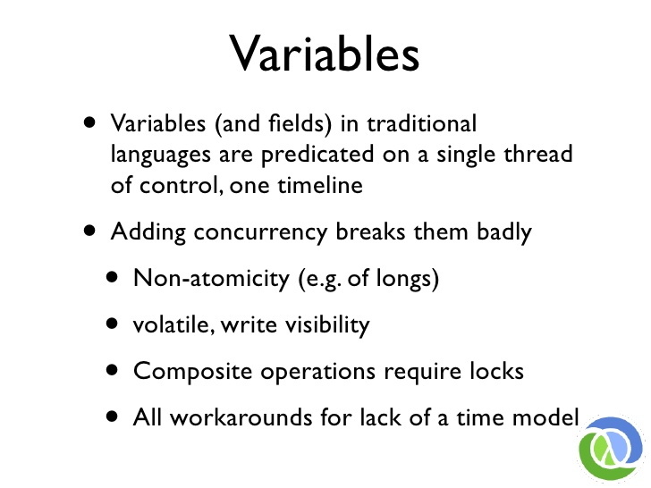

So variables are not gonna be good enough to do the job of managing states. Alright? They predicate on a single thread of control, they actually don't work at all otherwise. They're harmly broken by concurrency, the whole notion of this is a piece of memory is, does not work, and our programs are built substantially on this, whether it's a variable sitting on the stack or a field in your object, same problems. Pieces of memory aren't sufficient abstractions. So we have the problem of non-atomicity of long, right? It is a problem in a lot of languages, it's not atomic , so you can have half a number if you look at it from another thread. Write visibility and memory fences have to be accounted for once you have multiple threads of control on a true concurrent box. If you have an object and it has a bunch of these things collected together that constitutes a state, now you have the problem of composing composite operations because making it into another valid state requires touching several of these variables things, which now makes you impose locks of some sort of synchronization that says, stay away from me, so I can pretend there's only one thread of control because that's what my language thought when they wrote it, or the language they copy thought when they wrote in. All of  these things are example of the same problem, we're having to work around the lack of a model for time. Coz there's no point to have a variable if you have no time, and just think about that for a second, if there's no time notion, why would you need a variable. If you can't go back to it later and see something different, how is that a variable?

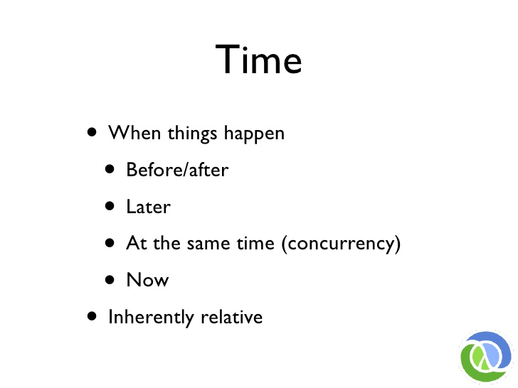

So if you want to be clear about time, which we're not gonna be in a non-physics lecture. We're just gonna say something, what do you think of when you think of time? You think of things being before or after other things, you think of something happening later, you think of something happening at the same time, you think of something happening right now, which is sort of a self-relative perspective of time. But all of these concepts are important in that they're inherently relative, right? When you think about time, there's not a lot about time that are hours or you know, this particular moment with the name on it, most of our notions on time have to do with relative time, the ordering between two discrete things.

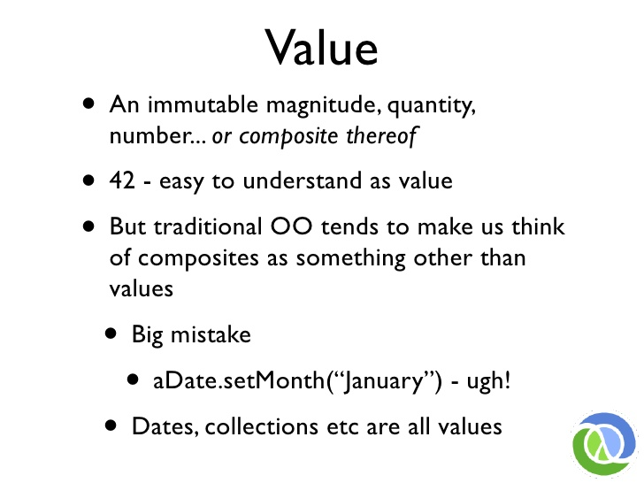

What do we mean by value, again, here's an area where there's so much ambiguity and loose thinking, that we can't write correct program without sort of nail this down. So the core characteristic of a value is that it's immutable, right? Some values are obvious, number, we're all comfortable with that concept it's a value. But I will content that until you start thinking about composites of these things like numbers as value, you're doomed in the future. You may not have been doomed right now but at some point, it's gonna be a problem for your programs. So what went wrong? OK we all think 42 is indivisible, of course we still store it as long, it may not be depending on the language but the idea of 42 we're concerned to be atomic concept but we have a big problem in the way we think about composite objects, some of that falls out of our languages I think, you know, they have Date library where you can set the month is a crazy concept. There's not this date and that date, there's not setting the month of a date and it's another date, right away you have that problem, I set the month of a date then it's another date. If it's another date, you have two dates, you don't have one setable date. Our class library has destroyed our brain in this area. Also the default behaviours of our languages, you create a new class in most languages and everything is variable and instantly you have stateful mess that maybe you have to cleanup with a lot of disciplines on your part. So I'm gonna contend that dates, sets, maps, everything is a value and should be treated like a value, and you should separate the concept of value from the concept of change.

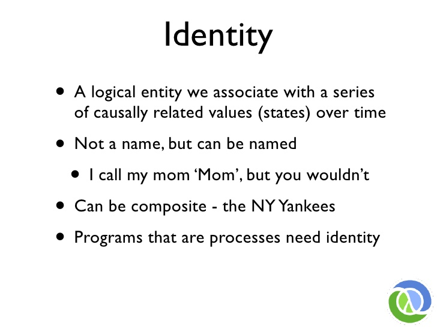

So one more concept in the philosophy portion of this talk, which is the concept of identity. This is probably the most nebulous of these things, but it's an important thing. What happen in the real world? What happens in the real world when we talk about, you know, today or mom or Joe Amstrong? Is that a single unchanging thing? Or one way to think about it is we have a logical entity, that we associate with different values over time. In other words, at any particular moment, everything is frozen, and the next moment we see something different, is that the same thing? Well, it's the same, if some force exert on this thing to produce the next thing, I consider it to be the same thing, otherwise, they're unrelated things, two things can pass through the same space, they're not the same thing because they're in the same space. So a set of values over time where the values are causally related is something we need to name, these are different values. They maybe in different space, I can walk over here and I'm still Rich, so what's happening? What's happening is easy to undertand if you have three notions: There's a state I'm standing right here, there's a state I'm standing over here, right? They're both values, you know, if you could stop time for a second, nothing about me would be changing, and it's me because you know I'm using my legs moving myself over here and I'm still talking and you see a set of causal reactions between me being here and me being there so you say it's all Rich, it's not 2 people, you know, doing that. Identities are not the same thing as names, I just want to make that clear ok. I have a mother, you know have that concept in your head, this identity, but I call her mom and you would call here Mrs Hicky I hope. These identities can be composite, right? We can talk about the New York Yankees or Americans, right, no problem. Those are sets, but they're also identities, they change over time, but at any particular point in time they have a value, these are the guys who are on the Yankees now. Any program that is a process needs to have some mechanisms for identity. It all goes together.

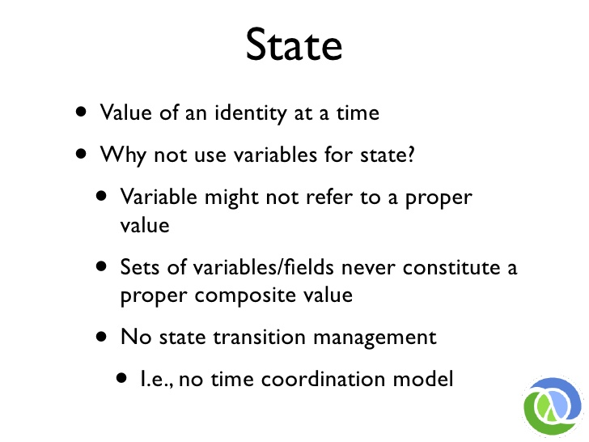

So I will go back and talk about state. We have some turn that hopefully means something. Now we can say a state is a value of an identity at a time, hopefully that makes sense. The identity is a logical thing, it's not solely place, it's not a piece of memory. A value is something that never changes. And time is something that is relative. Now it's easy to see I think why we can't use variables for states, in particular, that variable may not refer to something that is immutable, so already that's a problem, if you refer, if you make a variable refer to a variable, you're building on sands. The key concept is variable or whatever we're gonna do to manage time has got to refer to values. Sets as variables as we traditionally have them can never constitute a value because they're not atomically composite. If something is a value, it's immutable, if you can change the part independently, then it's not immutable, coz there's gonna be a moment when one part is halfway there and another part is not there. That's not a valid value now, something is happening in the middle. And more globally you can say about variables, their problem is they have know state transition management, okey, that's the management of time, a coordination model for time, how do you go from I'm in this state, now I'm in that state. Both states being immutable values.

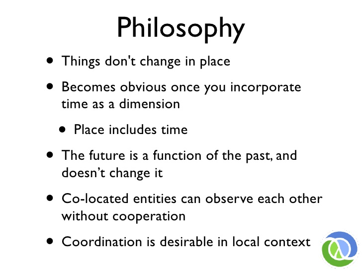

So this is some read of the philosophy portion. A key concept I think is things don't change in place. We think that they do but they don't. The way you can see that this is the case is to incorporate time as a dimension. Once time is a dimension you have x, y, z, time, guess what, that's over here. If something is happening here, this is no different. Things do not change in place, time proceeds, function of the past, creates the future. But both things are values. There's a couple of aspects I think to the design of the thing I'm gonna show you that I think are important when you try to model time in a local context, is the thing I don't want to give up, is the thing I know I can achieve by bruteforce in Java, and in some language I can achieve them, in Clojure for instance, which is co-located entities can see each other without cooperation. There are a lot of messaging model that require cooperation, if I want to see what you're about, I have to ask you a question, you have to be ready to be asked a question, you have to be willing to answer my question, but that's not really the way things are when you're co-located. I don't know what's happening in the next building but I can see all of you and I can certainly look at the back of your head without asking you permission. The other thing that I think is really important in local context, that is really should be written of as impossible in a distributed context is you can do things in a coordinated manner with co-located entities in the same process. You can say let's all work together to do this all right now. As soon as you're distributed, you can't do that. So the model I'm gonna show you supports visibility of co-located entities and coordination.

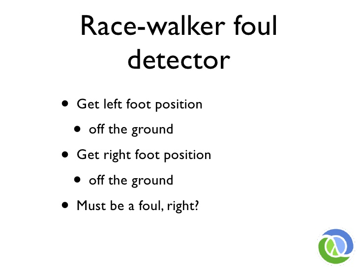

So let's take a look at an example. A little race-walker foul detector. Race walkers they have to walk, they can't run. They have to walk step step step, heel to toe and they can't have both feet off the ground at the same time. It's a foul and you get kick out of the race. So how do we do this? Well we go and we get the left foot position and see if it's off the ground, we go and get the right foot position and we say oh it's off the ground. So they're running right? It sounds funny but everybody writes programs that do exactly this all the time, exactly this. And you wonder why didn't it work. We can't work that way. We can't have time and value all munch together where things are changing why we're trying to look at them, that doesn't work. We can't make decisions. We don't make decisions as human beings this way.

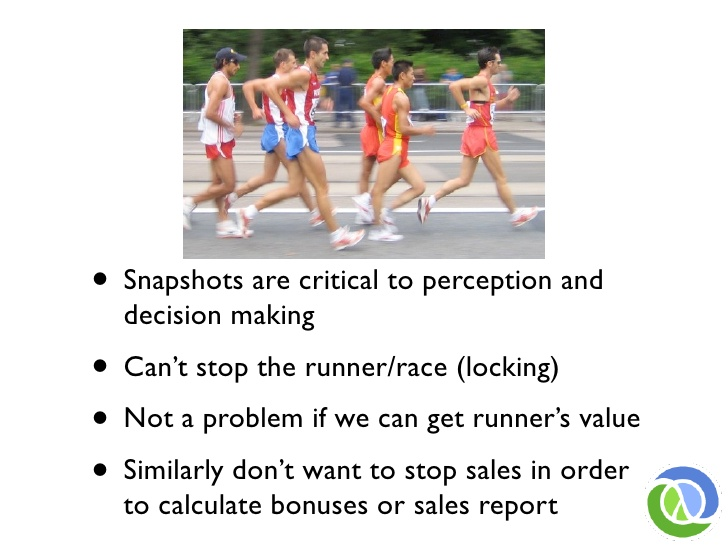

Snapshots and the ability to consider something as a value at a point in time are critical to perception and decision making and they're as critical to programs as they are to us as human beings. If you look at our sensory system they're completely oriented on creating momentary glimpses of a world that would otherwise just perceived to be completely fungible. Now how do we achieve this, programmatically?. Well one of the things I think we have to advocate if we want to write programs that can work on multiple cores benefits from being a multiple cores is that we can't stop the race, we can't stop the race. We can't wow, could you just hang on a second coz I just want to see if you're running. Also we can't expect the runners to cooperate. Could you just tell me if you're running? But if we can consider the runner to be a value, this guy on the right here, it's kind of nice that we can look at him as if he was a value. There's a point in time that was captured by this photograph, right? It's a single value I don't have to independently look at the left and right while time proceeds, right. I got a value in hand that was captured at a point in time. The race keeps going but I can see the guy got a foul on the right, he's got both his feet of the ground. That's easy. That's the kind of easiness you want to have in the logic of your application, you want to be working with values. You do not want to be working with things that are running away from you as you're trying to examine them. So it's not a problem to do this work if we can get the runners as values. In a similar way, we don't want to stop people from conducting sales so we can give them bonuses or do sales report. We need to move to a world in which time can proceed and we can do our logic and we don't need to stop everybody so we can do our logic. Those two things have to be independent.

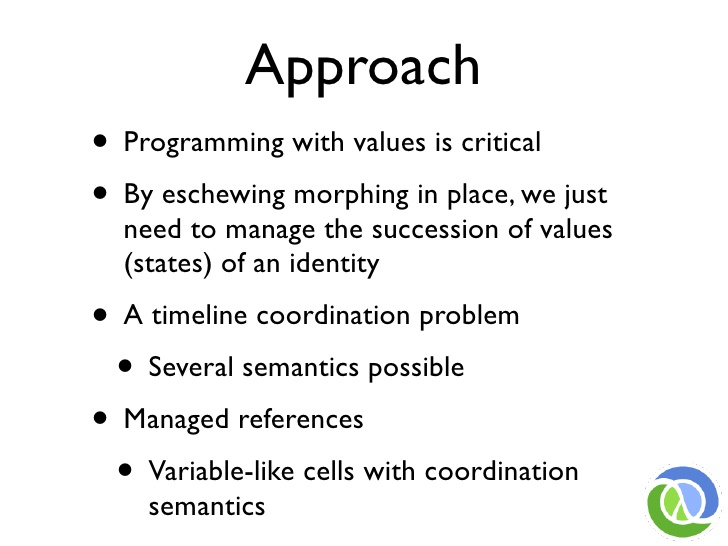

So, how does it work? Well, the first thing is we have to program with values. We have to use values to represent not just numbers, and even small things like date, but pretty much everything. Collections, sets, things that you would model as classes should be values. I'm not saying there couldn't be an object-oriented system that works this way, I don't know one that does. You should look at your entire object as if it was a value, it should never be in pieces that you could twiddle independently. You want a new state of that object, you make an entire new value. So then what's the problem with time, it becomes a much smaller problem. All we need to do is to get some language constructs or some way to manage the succession of values. And identity is gonna take on successions of values over time. We just need a way to model that, right? Because we have pure functions, we know how to create new values from old values. We only need to model the time coordination problem. What's nice about this is when you separate the two things, when you have an unified values with pieces of memory, you end up with multiple options for the time semantics. You have a bunch of different ways to look at it, there's message passing and there's this transactional, but because it's now a separate problem, you can take different options, you can even have multiple options in the same program. So I'm gonna say there's a two-part approach, one part is programming with values, the other part is in this example that I'm gonna talk about today, in Clojure example, is the concept called managed references which you can think of as, they're kind of like variables, except they fix all the problems with variables. In other words, they're variables that have cooridination semantics, so they're pretty easy to understand. They're just variables that aren't broken.

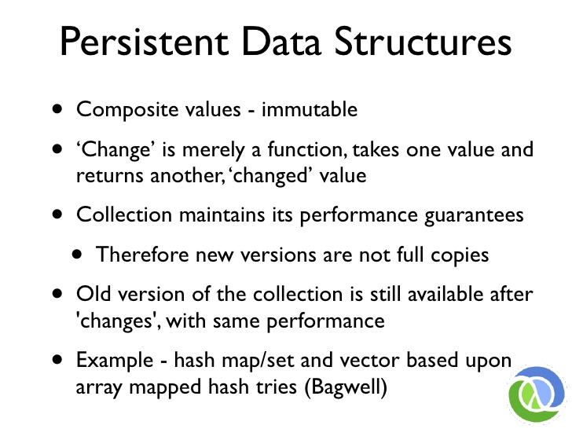

So there're two parts we're gonna talk now about the values. One of the thing people ??? initially if they have a new functional programming language as before is "That sounds expensive", you know, if I have to copy the whole runner every time he moves his foot there's no way I'm gonna do this. And a particular resources I'm talking about is collections and things like that, people get extremely paranoid because what they know are sort of the very bad collection class libraries that they had, which either have no capabilities in this case, or some very primitive things, you know, sometimes there're copy-on-write collections. Everytime you write the entire thing gets copied. But there's a technology which is not complicated, and has a fancy name. It's called persistent data structures, that has nothing to do with databases or disks. But it's a way to efficiently represent a composite object as a value, as an immutable thing, and to make changes to that in an inexpensive way. So change for one of these persistent data structures is really just, quote, they don't change. It's a function that takes this thing, instances of collections or composites, and returns another one that has the change enacted. But there's a very particular meaning to Persistent Data Structure which is that, in order to make these changes, the data structure and the change operations have to meet performance guarantee expect from the collections. BigO, Logn collections, you know, or collections that has constant time access. Those behavior characteristics have to be met by this changing operation. It means you can't conduct the change on something that you expect to have Logn behavior and copy the entire thing, because copy the entire thing is linear behavior, right? So that's the critical thing. The other critical aspect of persistent data structure is sometimes you see library trying to cheat. They make the very most recent version that's good immutable value, but on the way they ruin the old version. That also is not persistent. There's another key aspect to the word persistent. In a persistent data structure when you make the new version, the old version is perfectly fine. It's immutable, it's intact, it has the same performance guarantee, it's not decaying as you produce new values. Every functional programming language, you know, tries to cheat this side and eventually said "forget this, we're going all immutable and we're gonna pay performance cost because the logical cost of having the old versions decay or have some bizarre behaviors either from a multithreading perspective or performance perspective is too high". So what I'm gonna show you are legitimate persistent collections where their all values have the same performance characteristics. And the particular I'm gonna show you is the one that's in Clojure. It's derived from some work that Phil Bagwell did on these ideal, he called him ideal hash tries, and there're bit mapped hash tries that have really good performances. His version were not persistent so what I did for Clojure was I made them persistent.

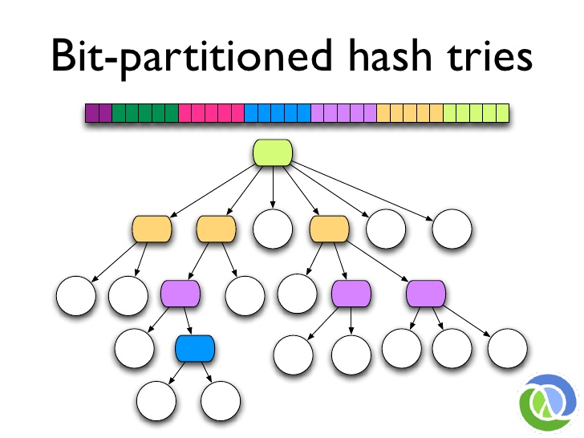

The secret to all persistent data structures is that they're tries. There we go, now you know. There's lots of different recipes and I think people are very familiar with bit-trees and red-black trees, or maybe you know, Erlang uses some generalized balanced trees I think, which are interesting, in this trees they use randomization techniques for balancing and other things. These are different. In particular, they're different because they're tries with the `i`, some people call them `tries`.

The idea behind that is you're not gonna have a fix path down to a leaf, you're gonna use as much of path that you need to produce a unique leaf position. You usually see these things in strings, sort of things, and I think internet routing tables and stuff like that. Here the model very simple, we want, at least I want it for Clojure something equivalent to a hash table. I know I can't sell Clojure to Java programmers if it doesn't have something equivalent to a hash table. They don't want to hear about a red-black tree. They've known that, they know it's ok, but it's not as good as a hash table, they're used to something faster than that. And these are. The way they work is that you hash the value you want to put into the collection. You end up with a 32 bit hash. You're gonna use the first 5 bits of that hash to see if there's a unique position in the first layer of your tries. So effectively what's happening is you have a 32-way branching going on in this trie. In addition, there are some fancy bit twiddling going on in each nodes so that those nodes are sparse. They're not fully populated so you're not wasting the space of not populated nodes. You're abusing a combination of population, you know, bit pop, some algorithm you copied out of, hackers, or you can just use Clojure. In fact, Clojure's vectors use the same kind of technology that has been ported to Factor and Scala already. Fine by me. So if it's unique in the first 5 bits we're done, we put it in the first level of the tries. If it's not, we're gonna look at the next 5 bits and walk down one more level to the trie, until we find some unique position and then we're done. We're gonna put the value there. The key thing about this is how deep can this trie get. So this one is the root so, down one two three four five six if you had, whatever you know, 4 billion things. So it branches extremely fast and you know, you can get a million items in three. It's very very shallow. So the combination of being very shallow and using this bit twiddling to walk through the sparsely populated nodes in intermediate level makes it really fast. So that's the representation, now we only have to talk about how we change versions efficiently.

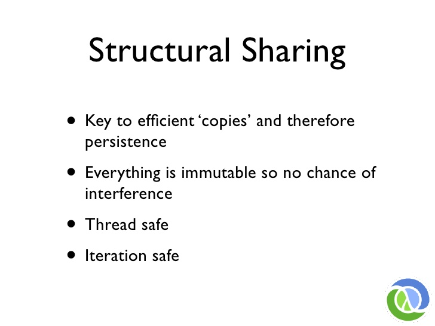

And the key there as this is true for all of these things is structural sharing. All functional data structures are essentially recursively defined, structurally recursively defined. Which means that you can make a new version that shares substantial structure with the version you just had and that's the key to making efficient copy, you're not copying everything, you're copying a very little bit, I'll show you in a picture in a second how little bit you use. Since everything is immutable, sharing structures is no problem, nothing is gonna change about the structures that you're sharing, which means it's safe for multithreaded use, it's safe for iteration, you got none of this, you know, mutated while iterating nonsense.

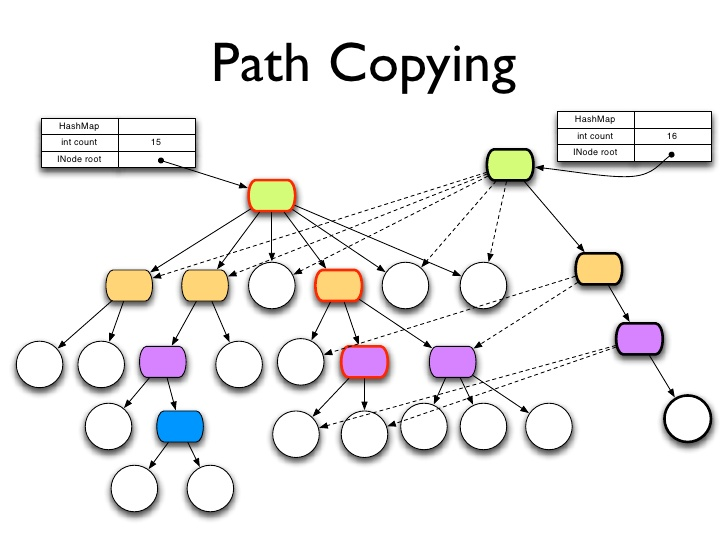

So how do we share structures? There's a technology called path copying, again this is true for all tree data structures, they're all exactly the same way, which is if we ignore the right hand path here, that's the tree I show you before, it has 15 leaves, we want to add one under that red outlined purple guy at the bottom. We want to add a new node, 16th guy. So what needs to happen is we need to make a copy of that node obviously, because we're gonna be giving him a new child. A copy of his parent and finally, the root. This copy gets one additional child and the rest of the structure of the old version were shared. Still, I said 3 level could hold a million items, right? 32 times 32 times 32, did I get that right? A lot. Well, 3 levels down, right, if you count the root, 4 levels. However populated this last level was, making a new node here is ever gonna by copying 4 items. How is that old tree? Looking good, still fine. We didn't touch it, and this is the path we need to copy to make the new one which looks just like a new tree with this extra item. If we're no longer referring to that root, it will get garbage collected when the things that are referring to are no longer referenced. So it's kind of basic, but I want to show because a lot of people just are not aware it's a possible thing. This is the data structures that I think you should be using all the time unless you have some emergency reason. And that's why Clojure works this way, all of its data structure work like this way, by default. You have to go through extraordinary effort to pick something else.

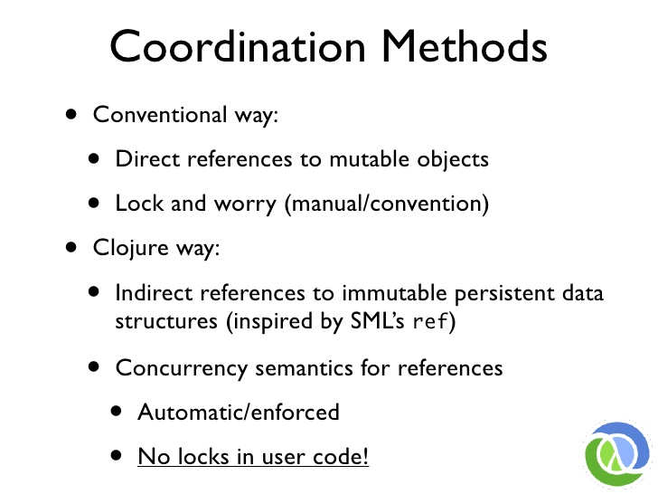

Okey, so that's the way to efficiently represent composite objects as values. We got one part of the problem solved, now we need to talk about coordination methods. The conventional way is not really a method, the conventional way is your problem. Okey we saw this Scala talk, there was a var that didn't have volatile semantics but it happen to be the case that the actors library in Java conduct some synchronization thing which causes it to happen before, happen after memory fence effect in order to make sure that the content of that var is valid in another thread. In your own program, that's gonna be your worry. It's nice that that library takes care of vars and actors, but the vars in your program otherwise are your problem. And typically if we're trying to do composite objects we have to use locks. And everybody knows the problems with locks I think. Everybody knows the problem with locks? Everybody knows the pain of locks. Locks are ... Experts can build programs that work with locks, but most people don't have the time and energy to do that well and maintaining it is really really difficult, extremely difficult. So in Clojure what we're gonna just do is we're gonna add another level of indirection instead of directly referring memory, those variables, we're gonna use indirection, and then we're gonna add concurrency semantics to these references. If you watched the talk yesterday I said that but I'll show you some more details today.

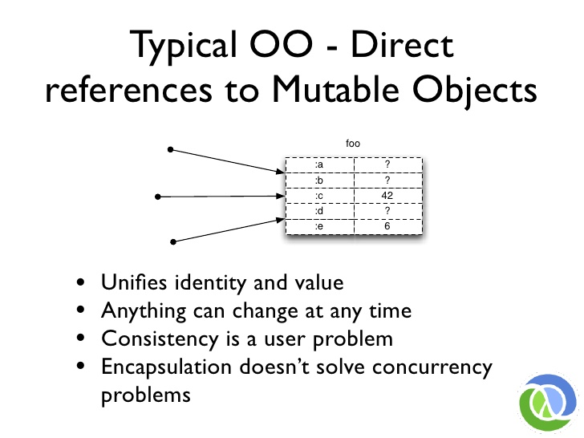

So just quickly this is a picture of the current state of the world in a lot of object-oriented languages, you have a lot of references to the same chunk of memory. Basically it's a free for all. They don't know they're gonna see a consistent object that all the parts are related to each other and noone is twiddling with anything unless they can somehow stop the world. But the core problem here now we have lingo for it is this unifies identity and value, right? The only place to put this value for this identity is in the same piece of memory. That's a problem. We just look at how to do new value, it's great. So what do we need to do, we need to create new memory to represent that new value. If we say old value foo need to end up in the same chunk of memory piece, we can never do a good job. So that's a lot of problems.

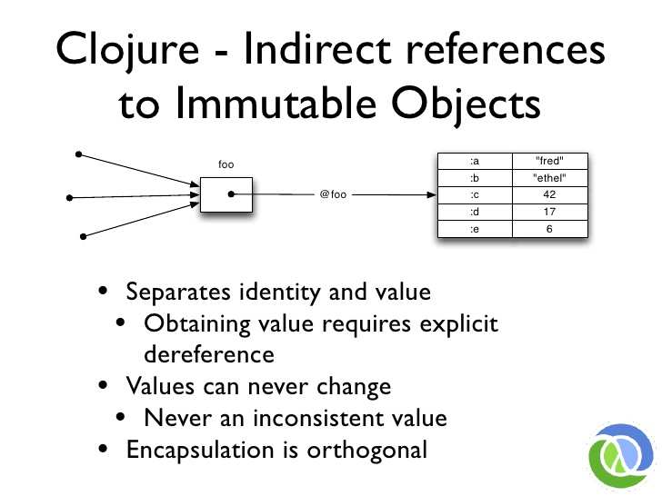

How do you solve this. You just use indirection. It's a solution to all computer science problems, right? One level of indirection and now we have options. Because this guy now can be immutable. We separated the value, which is now immutable, and the identity, which we're gonna model with these little boxes. Values never change, right? If you want to see the current state of an identity, you have to dereference it. You have to say "give me your state". What you get out of that is a value that can't change. You can spend all day looking at it, just like you spend all day looking at the photo to try to see if the runners were fouled. And I want to emphasize if your object oriented programming languages encapsulation techniques are solutions to this problem, that is not true. If you have a variable or field inside your object and you write three methods that can change that field, people can call those methods from different threads, you haven't encapsulated anything from a concurrency standpoint. You just spread the problem and hid it behind something.

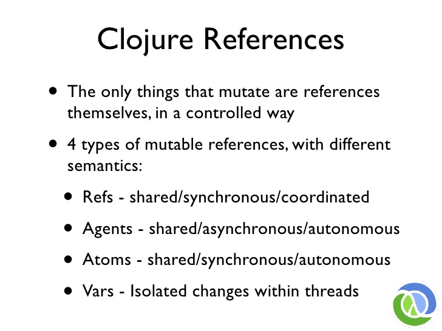

So I'm gonna call those boxes references. We have to many overloaded terms I can't think of any new words. It's a reference because it refers to something else. So identities are references that refer to their values. But the critical thing is in Clojure these are the only things you can mutate unless you drop to Java and use Java cause there're still class and arrays and all that, but if you want to follow the Clojure model, you're gonna have these references, they're the only things that can change and what they do is just manage time. And you can atomically move from one value, which is immutable, to another value which is immutable, and each of the reference type provides different semantics for time. So what are the characteristics of these semantics, one of them is: "Can other see the change that I'm making?" "Is it shared?" . Cause one way to manage time, which is the Star Trek alternate universe model. One there is bad Kirk in one universe timeline and a good Kirk in another and they'll never meet, of course the problem with that is occasionally they do meet. But one way isolation, so we see the last model of isolation. But in general most of these models are around making changes that other parts of your program can see, so sharing. The second part is synchronicity, and here we mean synchronicity in the sense of now. What now means to the caller. In other words, from a self-relative standpoint, is the change gonna happen now? or at some other time relative to me. Is it independent? And we're gonna call those differences synchronous, if it happens now relative to me it's synchronous, if it doesn't happen now relative to me it's asynchronous, it happens at some point in the future, we can't say exactly when. And the final characteristics of these references where again you got different choices and options, is whether or not the changes coordinated. I can be an independent runner running all by myself, completely fine. But a lot of times you need to move things from one collection to another collection, you don't ever want to be in both, you don't ever want to be in neither. That requires coordination, that's impossible to do with independent autonomous entities, you need coordination and it ends up that in the local case you can do coordination. Distributing coordination like this is, you know, a fool's errand probably, but people keep trying. I don't think it's ever gonna be distributed coherent coordinated change, but people are already recognizing the fact that if you delay consistency, you can sort of have coordination. But in the local model, it's perfectly possible to get coordinated change. Otherwise, changes are autonomous. I change by myself I don't care what you're doing and no two of us can do something together.

So now we have these 3 characteristics, Clojure has 4 types of references that have made different choices in these 3 areas. Refs are shared, people can see the changes, they're synchronous, they change right now. They change in a transaction which means that you can change more than one references in the same transaction and those changes will be coordinated, sort of the hard problem is that coordinated change problem. Agents are autonomous, feel a lot more like actor and actor model. They're shared, people can see them. They're asynchronous, so you ask for change, it's gonna happen some point in the future but you're gonna immediately return. And they're autonomous. There's no coordinated activities of agents. Atoms are shared, people can see the changes. They're synchronous. They're right now so that is the difference between them and agents. And they're also autonomous, you can't change more than one atom in a single unit of work. And finally, Clojure has something called vars. They isolate changes with the good Kirk bad Kirk alternate universe model. For any identity there's unique value in every thread. You can't possibly see the changes in different threads. I'm not gonna talk too much about that, it's kind of a special purposed construct derived from Lisp.

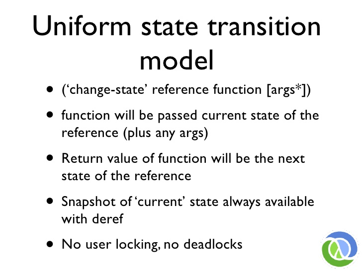

One of the things that's nice about the way these references work is they have uniform state transition model. All of them have different functions that change the states that say move from one state to another state, and they use different names because they have different semantics. I don't want people get all confuse because of all this happening synchronously or asynchronously or do I need transaction. But the model is always the same, you're gonna call one of the changing functions , you're gonna pass the reference, the box and you're gonna say "Please use this function", you're gonna pass the function, maybe with these arguments, apply it to the current state of the box and use this return value as the new state. So the function will be passed the current state, under some constraints, either atomically within a transaction some way. It will be passed the current state, it can calculate a new state. Again this is a pure function you're passing, that new state becomes the new value of the reference. In Clojure's references, you can always see the current state of a reference by dereferencing it. In other words, that's local visibility, it's completely free to do. And it yields much more efficient programs, to be able to do that. If you have to ask for permission to see collections everytime you want to see them, it doesn't work in the local context. In addition, one of the other shared attributes of these things is that there's no user locking, you don't have any locking to do this work and none of these constructs can deadlock.

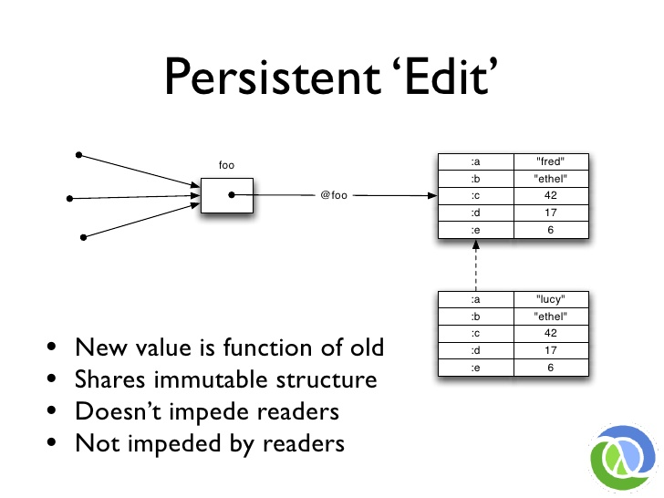

So what does it mean to edit something in this new world. You're gonna have a reference to a new value, right? We can make a new value a la carte, on the side. We're gonna call a function create this new value which we intend to become the new state of foo. The new values are function of the olds, they can share structures, we just saw that. Doing this stuff doesn't impede anybody who is reading foo, right? They're completely free to keep reading. They don't have to stop while we figure out the new version of foo. In addition, it's not impeded by people reading. We don't have to wait for people to stop reading so we can start making a new version. This is the kind of thing you're gonna need for high-throughput concurrency.

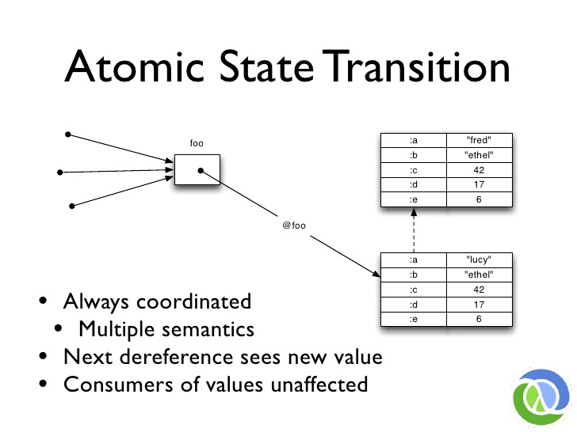

And then going to a new state is just a atomic swapping of this box to look at the new immutable value. That's always coordinated. There's always rules for how that happens. I just showed you the multiple semantics. Anytime somebody dereference this after this happens, they'll always see the new values. Consumers are unaffected. If I was looking at the old values, I don't get disturbed by this happening. I'm just looking at the old values. It's like I'm looking at the picture of the runners of the scene, I know the race's over. That's ok, we need to behave that way. If you've been programming for so long as I have, it's really hard to break from I own the world, stop the world, the world go when I say go. We have to just break from that. That's the future. We have to understand that we're going to be working with data that is not necessarily the very latest data. That's just the future for us.

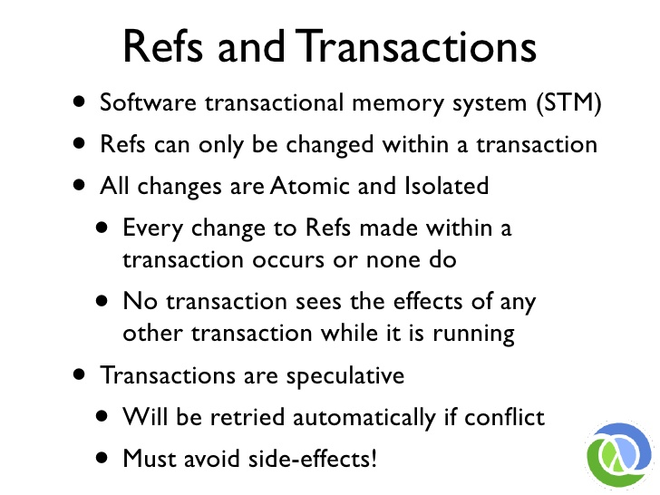

Ok so the hard references as I said is the transactional one. Clojure has a software transactional memory system. I almost hate using this term because people like to critize STM as if it's one thing. There's whole bunch of different STMs. They have radically different characteristics. Clojure's is radically different from the other ones. But they all share something which is basically a model that feels a lot like a database model. You can always change them within a transaction. All the changes you made to an entire set of references, refs, inside a transaction, happen together or none of them happen. That's atomicity. You don't see the effects of any other transactions while you're running, they don't see your effects, is the normal thing. The one unique thing about STM transactions is that they're speculative. You may not win, somebody else may win. You will automatically retry up to a certain limit, which means your transactions cannot contain side-effects.

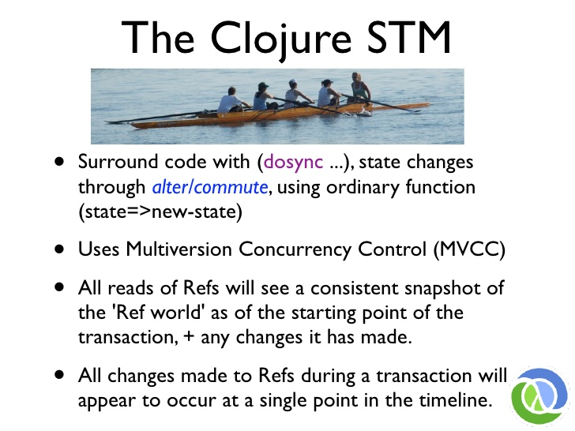

This is the way you do coordination. You can't really do coordination without some technique like this. You can't system of independent entities and do this kind of work. So in practice what you do is you just wrap your code in `dosync` which means this is the transaction. There are two functions alter and commute which work like I described. They take a function, a reference set of functions and some args and say, apply this to the references in the transaction and make the return value a new state. Internally Clojure uses multiversion concurrency control (MVCC) which I also think is a very critical component to doing STM in a way that's gonna work in the real world. A lot of STMs designed so you just write your app in the terrible way you are in the object oriented language, banging on fields and STM is gonna magically make that better. I don't believe in that at all. Clojure STM is not designed for that kind of work. If you make every part of your object a ref, it isn't gonna work and I'm not gonna feel bad cause I just explained how to do it. You make your object the value and atomically switch that value and everything is better but you do have the issue of, again, people would criticize STM universally because most STMs do something called `retracking`. In order to make sure nothing bad happens while your transaction is going on, they track every read that you do in addition to all the writes that you do. I also believe that that's not going to work. So Clojure has no retracking. The way it accomplishes that is with the technique called Multiversion Concurrency Control which is the way Oracle and ProgreSQL work as databases. Essentially all values can be kept around in order to provide a snapshot of the world for transactions while other transactions that are writing can continue. That is being extremely effective. But it falls out of this neccessity to be using references to values. It's gotta be cheap for me to keep an old value around. I just showed you how it is cheap, using persistent data structures. All these things go together. You don't do all the stuff together, you don't have an answer to the problem in my opinion. But when you do this, it's really nice. So MVCC STM does not do retracking.

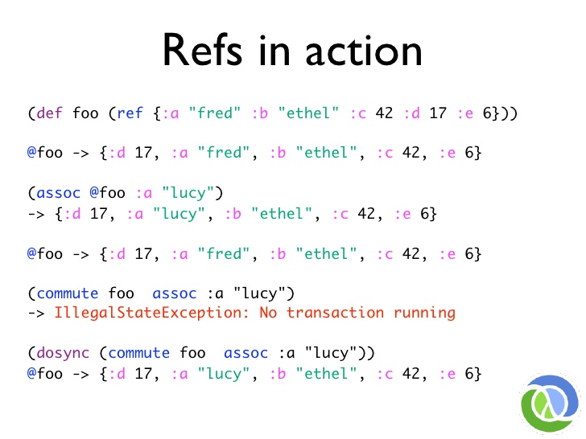

So what it looks like in practice? We define foo to be a ref that is a transactional box to that map. We can dereference foo. When we see what's in there unfortunately the name order changes because they're hashmap so they don't guarantee any order of iteration. We can go and manipulate the values inside foo. We can say give me the map that's inside foo and associate the `a` key with `lucy`, that returns the new value. Nothing about that impacted the reference. I took the value out, I made another value. We can do all kinds of calculation completely outside of transactional system. It's still a functional programming language. Get the value out and write functional program. So that didn't have any effect on foo. We can go and use that `commute` function which commute reference with a function `assoc` which adds a value to a map the key `a` and value `lucy`. And that fails because there's semantics to those refs which you can only do this for refs inside a transaction. So you get an error. If we however put the same work inside a transaction, it succeeds. And when the transaction is complete, that's the value of foo.

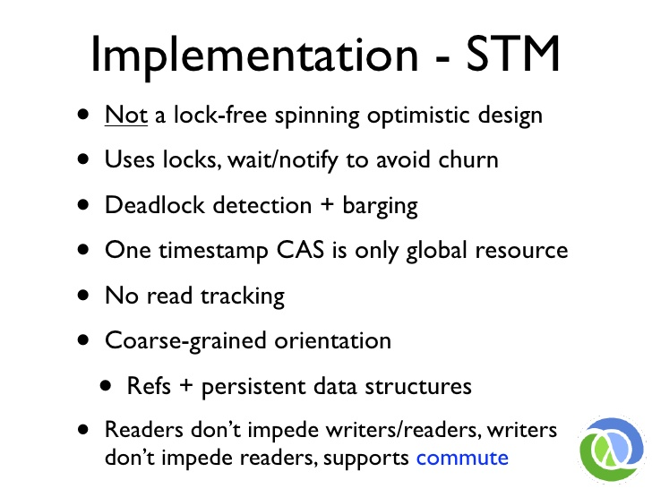

I don't have a lot of time to talk about the implementation details but again, don't think that STM is one thing. You read one paper about STM you know nothing about STM. If you read all the papers about STM, you know a little bit more than nothing about STM. None of us knows anything about STM. This is still a research topic. But I do know this, this works and it works really well and it makes it easy to write programs that don't use locks. I think all the programs that I've written in my career I could have used this any time I needed a coordinated change and it would have been fine. People can bang on it try to push the scalability issue and what not. From a correctness standpoint, it's a godsend. However, inside, unlike some STMs, Clojure STM is not spinning optimistic, it does use locks. It uses wait notify, it does not churn processes away from other processes, it's got deadlock detection, age-based barging. This is extreme minimum. In fact I think what is actually the minium amount of sharing in a transactional system which is one CAS, which is for the timestamp. People have demonstrated you can hammer on one CAS continuousely with 80 threads and it's about the limit of scalability. But when you actually have some work in your transaction, it's no problem running stuff on an Azure box with 600 cores and that CAS is not gonna be the problem. As I said there's no read-tracking. It's important that this STM is designed for coarse-grain orientation. It's not one of these snake-oil STMs where you can do what you were doing. You have to do the new thing. You have to use references to immutable values, then you can use my STM. It's not gonna make your old programs good. And readers don't impede writers and vice versa. It also supports commute which I don't have time to explain right now.

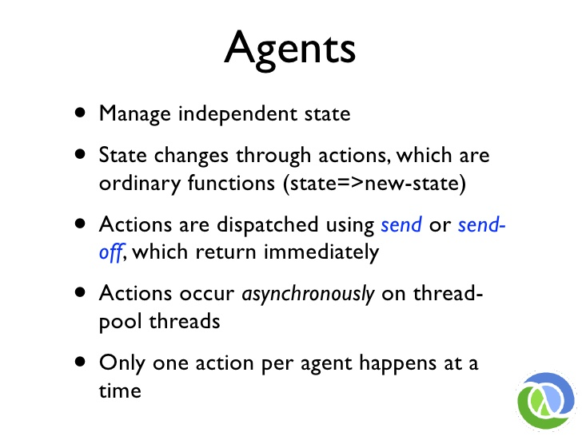

I do want to show you on other model because it is very different and it's nice in that it's very different yet very much the same which is sort of isolate change from values. You can take a completely different approach through time. So in an agent, which is another kind of these reference cells, each agent is completely independent. They have their own state and they cannot be coordinated with any other. State change is through actions, which are essentially just ordinary functions that you're gonna send to the agent with a function `send` or `send-off`. That function is gonna return immediately. You're gonna send this function and some data, say at some point in the future, apply the function to the current value of the agent with these arguments and make the new return value of the function the new state of the agent. That happens asynchronously on a thread from a threadpool. Only one action per agent happens at a time so agent essentially has sort of an input mailbox/queue so they also do all of their work serially. This is another promise of the semantics of an agent.

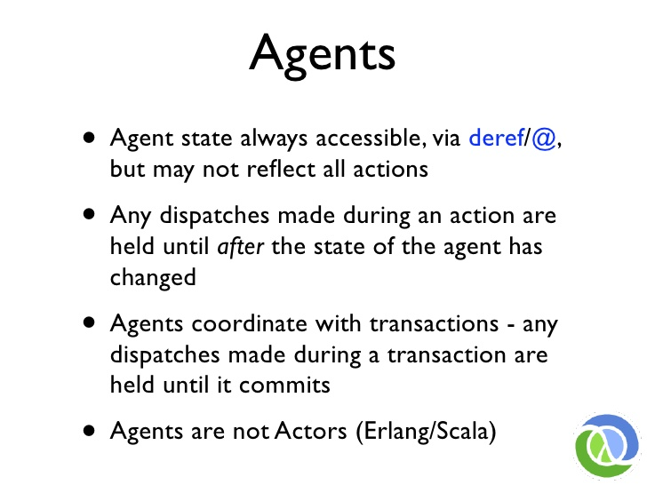

 Again as with other reference types you can just dereference it and see what's in there. If you do successive actions to agents inside the same action, they're held until the action completes so they can see the new state. They agent do coordinate with transaction which is kind of nice. So you want the problem to solve no side-effect inside a transaction. So how do I let somebody knows I complete these actions, do I need to send a message or something, side-effecting. It ends up that if you send agent actions during a transaction, that's held until the transaction commits so if the transaction gets retry, those messages don't go out until the transaction actually succeeds. So that coordination is a really nice feature. These two things work together. They're not quite actors. The difference with an actor model is that a distributed model don't have direct access to the states in an actor model, because you can't cause you can't distribute that. Since I'm not doing distribution I can let you access the states directly which means it's the suitable place for something you actually may need to share a lot without serializing activities.

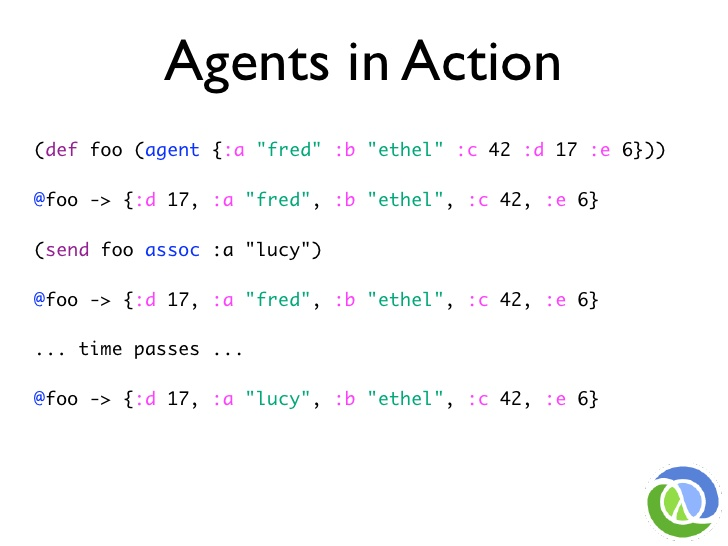

So what's this looks like to you. I say `def foo` to be an `agent` referring to a map. I dereference it. I see the contents of the map. I send that reference the same function `associate` `:a` with `lucy`. I look at it right away. It may not be there yet. Some of our time will pass. I can't promise you what. And then they'll be different. This is a different way of thinking about things with people with Erlang completely do amazing things thinking about things this way. Things can be asynchronous. You cannot keep programming your computer as if it was your old Apple and there's only you doing in your assembly language and you were king of the universe. Things happen at the same time now.

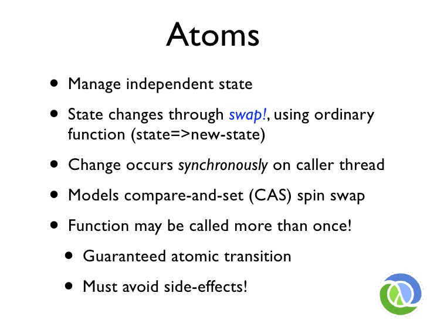

Atoms, a very similar story to agents. Right, they're independent. You can't coordinate change to atoms. There's a different name for the state change function, called `swap`. Again it takes an ordinary function of the old state state to the new state. The change happens synchronously now so that's the difference between agent and atom, happens right now. This is the model for compare and swap. Compare and swap or compare and set is the primitive that's gonna let you look at a piece of CAS memory and say I wanna turn in to this and it will turn into this if it's no longer, if it's still that. So you look at this, you see it's that, you want to turn in to this if it's still that and inside atomically it'll say, okey I make it this. The problem with CAS by itself is usually you want to read the value, do something with it and then put it back. And then you get the interval between when you looked at it and when you try to do the CAS. And of course when you do that and somebody else has done something that CAS is gonna fail, and now what do you do? Typically, a well-written CAS thing, where CAS is a suitable data structure will have a little spin loop. You're gonna spin in a value until it CAS. Atoms do the spinning for you. As a result, the function maybe called more than once. Again, we're in this world where you should be programming with the side-effect free functions because they need to be called more than once both in transactions and in atoms. So they have to avoid side-effect but the value you get out of this is that when you succeed, you know the function you applied was applied to the value with the function was passed and the result that got put in have no intervening activity occur on that atom. That's the powerful construct you need to have.

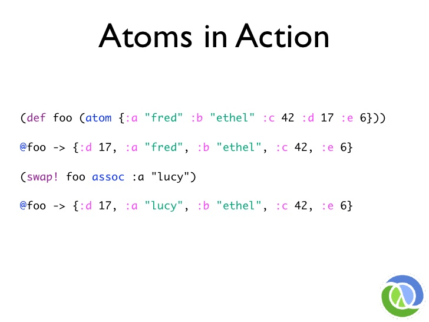

And look at this. It looks a lot like the other one. Define `foo` to be an `atom` that refers to that map. Dereference it, it's there. we swap immediately we got the new value

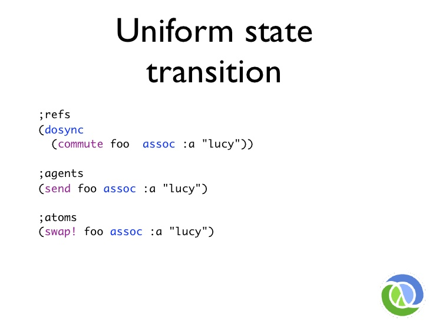

So this is the uniform state transition model. That's what ref looks like. Start a transaction, commute or alter. Your ref, passing some function and some arguments. The result of the function is your new value.

Agents, same thing, except completely different time semantics. Happens asynchronously and it's thread-pool. Some time later. You return immediately.

Atoms, happen right now, but are independent from the others. You need all of these things to write a real multi--threaded program especially in a local model. These are all things that I need to do in my career writing concurrent programs in the local model part of the program and I don't think you can do without them. So here they are, but it's the uniform way to go.

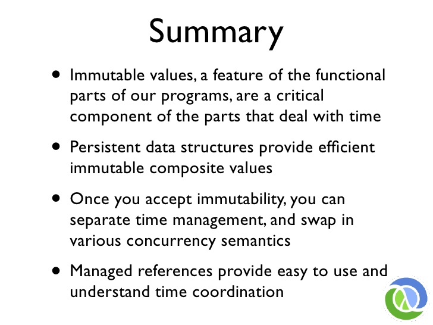

So, in summary, immutable values are critical for functional programming. But they end up also critical for state. We cannot really manage time and state without immutable values. If you got 2 things changed, time and value, you can't do anything that's reliable.

Persistent data structures let you represent composite object efficiently, immutably. Once you're able to accept this constraint of immutability on your values, you have all these options. Now we're working on a fifth reference type with slightly different semantics. It's easy to do because I've seprated time management from value management.

Finally, I think this is pretty easy to use. If you've seen some other models this is a lot like variables that work.

So, thank you!
