# Reducers

* **Speaker: Rich Hickey**
* **Conference: [QCon NY 2012](https://qconnewyork.com/2012/) - June 2012**
* **Video: [http://www.infoq.com/presentations/Clojure-Reducers](http://www.infoq.com/presentations/Clojure-Reducers)**

Thank you all for coming. I'm going to talk about reducers today. As you know, this is a substitution because somebody couldn't make it to talk about LMAX Disruptor. So they got me in because they want to make sure they still had a talk that would filter out luminous, hardcore people. I don't know if you get a T-shirt when you leave or something but that's where you are. Just quickly before we get started, how many people here know Clojure? How many people do not know Clojure? Of the people who don't know Clojure, do you use a language like Scala or Haskell that has higher order functions? Who here does not use a language or have access to a language with higher order functions? Nobody. Self-selecting crowd, that's perfect. While this library is fundamentally a Clojure library, the ideas underlie it would cross any language that has higher order functions and collections.

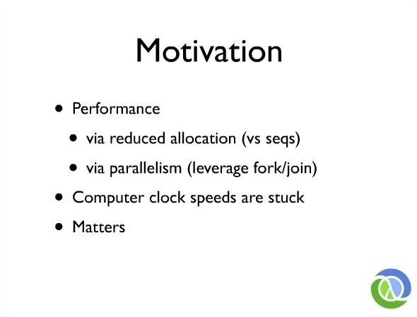

So the motivation for this work is simple. It's performance. There are two things we are looking to get by moving to a different framework for manipulating collections. One is to have some efficiency improvements over lazy collection processing which is what Clojure does by default. But the bigger motivation is to try to move to a set of collection operations that can be parallelized and eventually leverage fork/join, because as we know, computer clock speeds are stuck and I think everybody knows the old joke about, "How do you make your program faster?" You wait. You wait 18 months and new computers make it faster but that joke is not funny anymore, right? Because that's not happening anymore. For Clojure and all the programming languages, how do we get that back? I mean, they are making denser chips and the chips have more cores on them and that's not necessarily helping, or it's not helping a sequential program at all, right? A sequential program with the same clock speed on a new computer does not get any faster. And we've been sitting in sort of a queezy interim period here where our businesses are buying new computers and our software's not getting any faster but eventually, they're going to be like, "Hey, wait. I do remember 10 years ago whenever I gave you a new computer, all the software was twice as fast." That's not happening anymore and what are you going to do about it? It really matters. All programming languages that want to be viable in the future have to have an answer for this. So what we're trying to do here is provide a model for collection processing that's as similar as possible to what we have already, because we like that and people are familiar with it and to leverage parallelism.

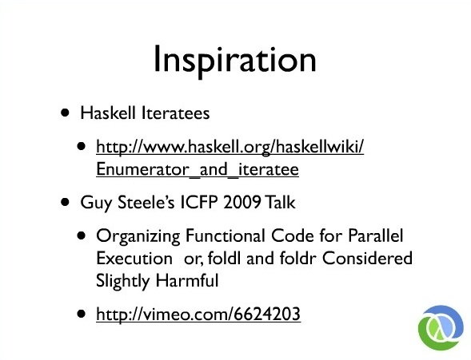

There are two big inspirations for this library. One is Haskell Iteratee and their Enumerator work. This is some great stuff. There's papers linked to their first link, describing the works that's pretty dense, admittedly. But it was the first thing I remember that took the work of reducing operation and it really reified it into a thing that you could talk about it and say, "Well, these are the properties of that thing. The Iteratee." The other thing that was really inspiring was Guy Steele's talk from 2009. If you haven't seen it, you should definitely watch it. He's so mild-mannered but essentially, he was a condemnation of what we're doing today. Basically saying all of the sequential processing we're doing. And it doesn't matter what language you're in, whether you're in Java and using Iterator or you're in Clojure and Haskell and you're using map and fold left or fold right. These things are all inherently serial and therefore, not amenable to parallelism. We have to break-free of that, but what do we do? Do we need new collections? Do we need new algorithms? Do we need new libraries?

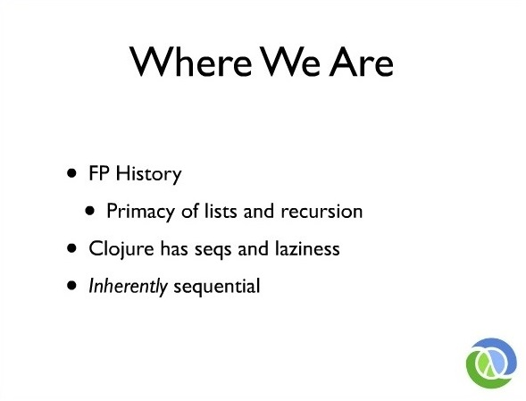

So just a little bit of history of how we got here. Again, this has a functional programming bent. You know that's the history of programming too, right? Lisp was an early influence and it was built around a one data structure. It was the List and it had a mathematical basis for processing that was based heavily on inductively defined data structures and recursion. And Clojure is derived from this heritage, as is, Haskell and Scala. In Clojure's case, we have seqs and laziness and all of these things. Lists and recursion are inherently sequential. They're about take one thing, do something to it and then, connect that to the result of processing the result of the rest of the stuff in a row. It doesn't actually matter if you're doing this imperatively by bashing on an accumulator or functionally, by generating successive results that those both are still sequential operations. It's not like functional programming has made this non-sequential miraculously.

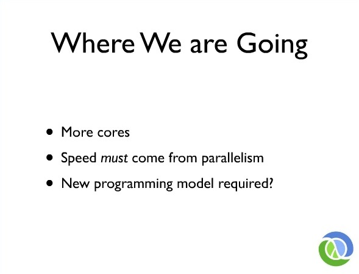

But the future is more cores. As I said before, the speed has to come from parallelism. And do we need something else from the model? So we should look a little bit at the model. 

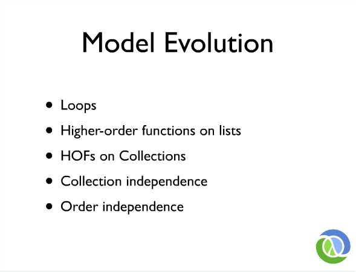

We started with bashing on accumulators, right? We had Assembly language. We had a little register there and we had Goto, and it was like a party, right? Just keep going around and around, bashing on that thing until you have the answer that you wanted, then you were done, which is sequential operation. Languages like Lisp and it's successors, functional programming languages lifted that up to higher order functions, operating on lists. Eventually, languages like Clojure and others lifted that again to say, "We don't really need your data structure to be a list. If you could meet the algorithm at some interface or abstraction that the algorithm was happy with, we could process you." So that abstraction for Clojure is the sequence, but for other languages, that might be the Iterator or the stream or something like that. But the idea was if a collection can turn itself into something that can be sequentially accessed, then you could take an algorithm that was built around sequential access and connect the two together, so now you have higher-order functions operating on collections. And those functions have names like map. Map takes the function and applies it to every element of a collection. Then gives you a result for every element as a new collection or usually, as a new sequence type or list. Where we want to go in evolving this model is to have even more independence from the collection representation. We take it as far away from collection representation as we can, but the real key for getting to parallelism is to get out of the order business. And that order dependency is really where we struggle right now, in a way, our current operations are defined.

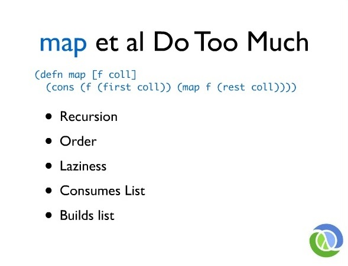

So this is that map function I talked about. Map being a function that takes a function and some collection. This is a classic definition in LISP, but it basically means, 'take the result of applying that function to the first item in the collection and attach that to the result of mapping that function to the rest of the collections.' This is the classic recursive definition of map. While it's a very small function, basically a one-liner, it does weigh to much and it possibly promises too much. First of all, it works recursively. It relies on order in several respects so that call to first and that call to rest is utilizing and abstraction that the collection provides for accessing its elements in order. The whole notion of first is an order-sensitive thing. In Clojure's case, this function is also lazy and promises to be lazy. That also has dependencies so if it's lazy, that means I have an expectation that if I have only consumed so much of the result, only so much of the work has been done, again, there's order in that sentence. So much of the work from the start, from some point, the beginning. This definition is based upon a Clojure abstraction called the sequence, but logically, this classical definition is, map is defined in terms of a list. It's the same thing for Haskell, map is defined in terms of a list, in a singly linked list. It consumes a list. It's passed a collection and in Clojure's case, we don't have to have an actual list. We can meet at the sequence abstraction or Iterable. You can say anything like that, but it consumes a sequential thing. It's defined by saying, I will consume a sequential thing. In addition, it builds a list, so map has a return value. What does it return? It's going to call this function. It's going to make an answer in the first elements in the collection, and it's going to attach that to the results of the rest. It's actually building a singly linked list in this case. And that's what cons does, it builds little linked list cells as it goes. So this does too much.

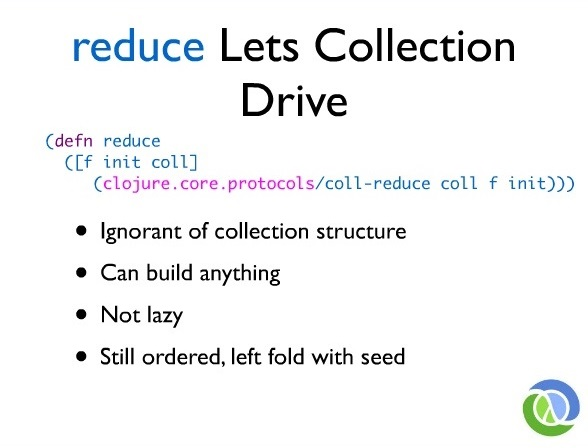

Now, there are other functions that also process collections and process sequences. A very important one is reduce. Depending on your programming language, this might be called, 'fold left' or 'foldl.' This function takes a function and an initial value and a collection. And the logical model is similar to map. The classic definition is also a loop over a sequence and what reduce does is it says, take the initial value and the first item in the collection, and apply the function to them so you get an answer so far. Then, take that answer so far in the next item in the collection and apply the function to that and you get the next answer so far and keep doing that until you process the entire collection. Different from map where you get an answer for every element in the collection, reduce is going to produce one answer for the entire collection. So you can, for instance say, reduce with the function plus with the initial value zero and some collection. That's a way to say 'sum' using reduce because it's going to add the first thing to zero, add the next thing to that result, add the next thing to that result, and so forth and now you've added all the numbers using a higher-order function like reduce.

In Clojure we've moved away from that definition of reduce based upon a sequence definition. I know, it's no longer meet-me-at-the-sequence abstraction instead this uses a Clojure technique called protocols, which is an open form of polymorphism. If you work in the language that has type classes or something morally equivalent to that, it's the same idea. There's a protocol that says, "This is the way that you can tell me that you know how you can reduce yourself," and the cool thing about protocols is you don't have derivation stuff. You can say, strings know how to reduce themselves by externally defining this protocol for string without touching the string class. So defining reduce this way is really powerful because now, we've got some independence of the collection structure. We're not actually meeting at an abstraction. We're not meeting at a sequence abstraction. I gave you the example of 'sum', but reduce itself can build anything. You can reduce each step, add something to the collection and the results of reducing is actually another collection. That's done all the time. So you can really build anything with reduce. Although, another critical aspect with reduce is it is not lazy, so we're stepping away from laziness. But it's not going to get us all the way there because we said, reduce starts with that init and it says, "take the init and the first thing." Those sentences, those phrases are now still in full of order dependence, so we need to get away from that. At least, this definition let's the collection drive. It's gotten us some collection independence.

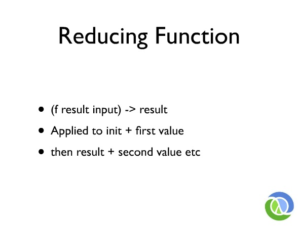

So I want to talk a little bit about the reducing function for people who may not be familiar with it, because this entire mechanism is based around manipulating these reducing functions. So we said, you could reduce with plus to get a sum, so plus is a binary operator. It just takes two things and returns an answer. And a reducing function is essentially that. It's a binary function that takes two things and returns an answer, but there's a certain interpretation or semantics to the arguments to the reducing function. That is, that the first argument is the result so far and the second argument is the next thing incorporated into the result. It ends up that that actually matters quite a bit when you try to define things in terms of manipulating reducing functions, because plus, I mean, there's no real difference between the two arguments to plus, right? You know you can swap them around so it doesn't have the semantic but reduce's use of the function plus has this semantic. It considers the first argument to be the result so far and the second argument to be the new input. And I described what reduce does before. Is everybody clear on what reduce and what reducing function is? Because it's gonna get a lot thicker, fast.

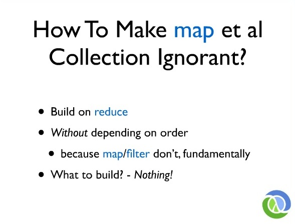

Okay. So what we're trying to do now is to come up with a new definition of things like map and filter and these classic functions that are completely collection ignorant and order independent and so, the idea is to build on reduce. We already saw that reduce has currently defined this kind of like a universal collection manipulator or using something like a protocol or a type class means that you can pawn off any collection knowledge on somebody else, so now your algorithm's going to be independent on that. But we want to avoid the order problems of reduce, because map and filter really don't care about order. Map is just supposed to produce a result for everything in the collection. Filter's just supposed to produce some new logical collection that might be missing some stuff. They actually don't care about the order. They just accidentally had the order incorporated. So we can get that out of using reduce by just ignoring the fact that reduce, as classically defined, has an order dependence. In other words, if you define map in terms of reduce, you ignore that fact that reduce promises to do it in a certain order when you haven't been poisoned by that order dependence. So we're going to starting by building on reduce and eventually, eliminate the order dependence but we have to start by ignoring it. We have to make sure we don't have run any code that cares about operating on the first thing first and the second thing second. We're still left at the fundamental question, though, which is, if we're going to redefine map in terms of reduce, what should we return? Because we had two ordering problems and two collection dependence problems with map. When it was on the input side, we depended on taking a list or a sequence or something that could meet us there. The other was on the return side. We had to build up something concrete and it ends up that the answer to this question is to define map in such terms that it doesn't actually build anything concrete. And that takes us to the fundamental idea.

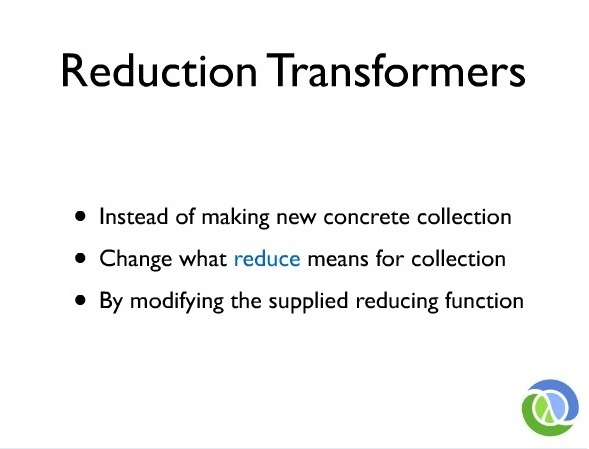

The fundamental idea is that we can define map and filter instead of as functions of collections to collections that produce concrete collections as something that instead something like collection and changes what reduce means in that collection. In other words, you have some collection. Maybe, later you're going to reduce it. If I map some function on that collection, I can implement map by just changing what reduce will mean later for that collection. Every time I get to this point of the talk, I get the same look coming from the audience. They're like, "What just happened? What are you talking about? It was like so good. Now, it's all bad." And so the very first time I gave this talk, right now, I made up a thing and it seemed to have worked. It's worked three times. That's how I'm going to do it again. I'm going to talk about the guy who makes pies. 

There's this guy who makes pies. He's the pie-maker guy and he has an assistant, the pie-maker assistant guy and the assistant has a bag of apples. The pie-maker says to the assistant, "I'm going to make pie out of those apples, but when I do, you've got to make sure that you take the stickers off the apples." Because they all have stickers now. You know the organic? So that you know they're organic, they put this nice inorganic sticker and glue on them, right? Organic. "So take the stickers off and only keep the good apples. Don't keep the bad ones." Those two things, the first one, take the sticker off the apples, what is that? That's map, right? And throw out the bad apples and only keep the good ones, what's that? That's filter, right? So the pie-maker has told the assistant to map and filter the bag of apples. Now, the assistant, like any good programmer/pie-making assistant, is lazy. He says, "I could, right now, take every apple out, take the stickers off and put them in another bag. And then, I could take that bag of apples and I could go through that bag and take the rotten ones and throw them into another bag. Then, I have the bag and when it's time to make pies, I could just hand those apples to the pie-maker. Or I could go play minesweeper for a little bit and when it's time to make the pies, when the pie-maker asks me for an apple, I'll take one out and just take the sticker off and look at it and go, 'Okay. Here you go.' I'll do it then. I'll just wait." In other words, that instruction to map, remove stickers, and filter for good apples is a recipe that can be applied only when we reduce the bag of apples into pie. We don't actually have to make different bags of apples. We don't have to move the apples around. That's the idea behind this library, is that we can implement map and filter by just changing what it means to make pie. So what does that look like?

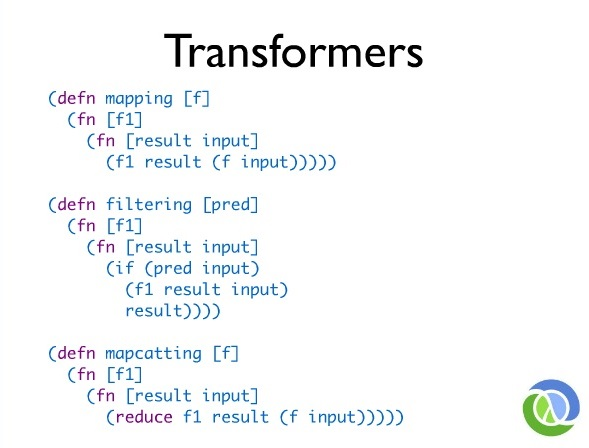

The library doesn't actually do this code exactly, but I've written this code explicitly because macros make this stuff go away and you can't see it when you look at the library code. But the real key here, for me, in designing the library was to try to find what is the fundamental definition of 'What is mapping? What does mapping mean? What does it mean to map something?' So if you tried to say, "If I was going to have a function called mapping that implemented this idea, what would it look like? So if we want to function, we want to map some function. That function might be something like take the stickers off the apples. We wanted to find this function by returning a new function that says, "when you give me a reducing function like make pie, I'm going to give you back a reducing function which is a function of a result and a new input that will call the function you gave me, make pie, but before I do, and this is the pie so far, I'm going to take the sticker off. That's the essence of mapping. It's given some function -- take the sticker off -- and now, what it all does is it changes the meaning of the reducing function. Given some reducing function, I'm going to return a different one that's going to actually use the reducing function I was given after I've mapped that function on the input. This is the essence of mapping. What's really cool about this? Where's the collection? What collection? It's gone.

So that's good but mapping is probably the easiest case. There are two other category cases that matter. One is where you have some stuff and you end up with possibly less stuff. That's what filter does. So can we do the same thing for filter? What is the essence of filtering? Filtering takes a predicate. Is the apple good or is it rotten? It's the same thing. This is going to return a new function when passed to reducing function like make pie, will return a modified reducing function. This is just Transforms. It takes make pie and it says, make pie out of non-rotten apples. Transforming your reducing functions is it's going to take it and returning another one and it's going to do the predicate. It says, "If the apple is good, include it in the pie." Otherwise, what? Don't. What's really critical here though, and we just talked about map reduce, does this return an empty bag of apples or something like that? Does it put every apple in a Ziploc? And then, sometimes it gives you an empty Ziploc? No, it does not. This is very important. There's no junk in the middle of this. Filtering means don't use it, not make emptiness. Okay? So that's the filtering case.

And what about mapcatting or flatmapping? It depends on what language you use on what you call this. So what is mapcat or flatmap? It's like map. It takes a function and it applies this to another element in the collection but the presumption is that that function returns for each element a collection itself and what you want is all the contents of those collections without the collections around them anymore. That's what flatmap or mapcat does. So how do we do that? That's another tricky case. That's the expansive case. So we looked at the one-to-one case. We looked at the possibly reducing case or I should say, eliminating or filtering case and now, we have the expansive case. So it's the same thing. Somebody gave me a good example of what this was. Oh, chopping the apples up into pieces. That's it. So that's what we want. We're going to say, "We're going to mapcat and slice up the apple and it's going to produce more than one slice per apple which is going to take some reducing function like make pie, it's going to return a new reducing function that, given the pie so far is going to slice up the apple and then, do what? Put every slice into the pie. As we can just use reduce to do that job. In other words, what does it mean to have an expansive transformation function? It means operate on the result more than once. So filtering might not operate on the result and expansion might operate on the result more than once. But no, this doesn't actually return what from each guy? A little baggy of slices of apples. No, it just puts the slices of apples right in. It's very important. This is much different than what you see in some other libraries that are sort of mapping-oriented that must produce collections for every step.

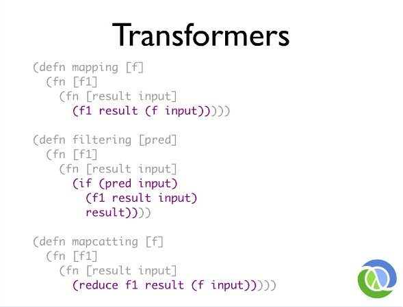

So I think one of the things that's really critical about this is to look at what's common between these things, right? So what's all this stuff? What do we call that? The legal term. Boiler plate. When we're working with the language of macros, what's going to happen? They become victims of macros. That's just going to go away. When that goes away, when macros make something that you don't have to write, what exactly do you have to write? What do you have to write to define what map is? Just that little purple part. Is there possibly a smaller definition of what mapping is than that? I don't think so. How about filtering? Just the purple part. You just write the purple part.

When you get your fancy, new parallelism libraries from your language designers, ask them, "What do I need to write to write my own things, my own extensions, my own parallel operations? Can I just write the purple part, please? Because that's all I want to write. The same thing here, this is the essence of flatmapping by defining it this way, these reducing transformers. That's basically good and we like the fact that we can handle these three cases that's starting to smell like an answer.

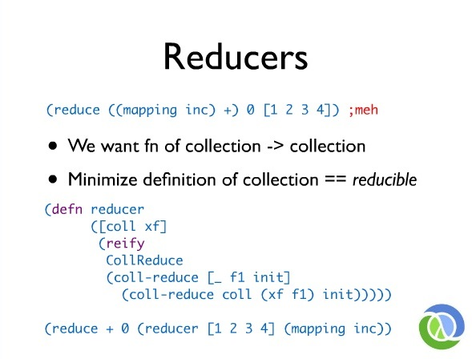

But the use right now is still awkward, because we said that mapping is a function of a reducing function. For instance, if we wanted to sum this collection, but first increment everything in it. Normally, we would say, map the increment over the collection and reduce with plus to sum. That's what summing is and that's what this does, but it's kind of backwards, right? Because what we have to do is say mapping inc transforming plus first and then, applying that then, reduce with that. That's not actually what we want to do. That's awkward. We're used to, in Clojure and most other languages, mapping increment across to collection and then reducing the results of that. We need to turn mapping into a function, not of the reducing function but of the collection. It's still going to work this way. We just need to move it over.

So what we want and what we're used to is for map to be a function that takes a collection and returns a collection, but we said, we don't actually want map. This guys is lazy. He's playing Minecraft or minesweeper. Why did I say minesweeper? Who still plays minesweeper? Minecraft. He's a modern pie-making assistant. He plays Minecraft and he does not want to make an actual bag of unstickered, non-rotten apples. He's busy.

So we need to revisit our notion of what constitutes the question. What's true of every collection? That's a hard question, right? What is actually true of every collection? Do they all have stuff in them? Not necessarily. Can they give you a count? Are they all iterable or something-able? Or do they all have nth? Almost nothing is common with all collections. They're very, very tiny. Java has a huge pile of stuff of collections, but that's just Java being Java. Logically, there are very few things. A collection might have stuff in it and in particular, it might have more than one thing in it. That's really all that's true of every collection. It might have more than one thing in it.

What we want to do now is we want to say we wanted to define map like we used to. Taking your collection and returning your collection, we're going to have to be clever about our definition of collection. What I'm going to say is, if you have stuff in you and I have something like protocols or type classes which say, if you have stuff in you and ask you to apply this function to reduce yourself with this function, you can, you're a collection. That's good enough for me because I can build a pile of functionality on top of reduce-ability. So we're going to change the definition of collection. We're not going to say collection is iterable. We're not going to say collection is countable or add any other fancy stuff. We're just going to say the minimal definition of collection is that you're reducible which means that you support the reduce protocol. I can call reduce on you. That's it. 

Now, we could say, "Could we make a definition, given one of these transformers, could we make something that is reducible?" In other words, we need to make a collection now. I don't actually want to make a bag of apples, I want to make a recipe for something that would reduce into a nice pie. I don't want to make a concrete bag. The answer is yes, right? Because this protocol is open, Clojure has this thing called, 'reify' that lets you create an instance of a protocol. You can consider it to be the moral equivalent to making an anonymous inter-class that implements interface. You can make an instance to this protocol just from scratch with some code and that's what we're going to do. We're going to say, "reducer" takes some collection and some transformation function. So collection here is bag of apples. Transformation function is something like mapping like the ones we defined before. 

Back in return to collection. If you're going to tell me that collection is only reducible then I can return the collection given those two things by saying, "the definition of reducing this collection given some reducing function like make pie in an empty pie tin is to ask the collection itself, the bag of apples, to reduce itself with the transformed make pie. This is now the make pie after taking the stickers off the apples, and here's the empty pie tin. In other words, this is a recipe for a new collection, that itself, is reducible. Because I can ask this thing to reduce itself with make pie and if I had a bag of apples that had all the stickers taken off, I'm just going to on-the-fly modify the reducing functions, so first, take the stickers off with this mapping we've defined before. This thing now returns something that behaves like a collection in so far, it's reducible. It means that we can write this now. Reduce with plus, starting with zero, so this is a sum. First making reducer around the collection using mapping with increments. 

Increments are everything in a collection and then, make a new collection that's a logical collection out of that. It's not quite what we want. We're going to fix that in a second, but the key thing is this. This reducer makes a logical collection that itself is reducible because it implements this protocol by just transforming the reducing function, the way we showed. We know we can do mapping and filtering. What about if this is going to change when we move from mapping to filtering? Does this even know that it's doing mapping? Does it know that it's mapping or filtering? Or mapcatting or any other collection? No, it doesn't. We can define reducer once. So we have a boiler plate on the prior slide. We have the definition of user once and once only. This is a universal collection maker. We can make a collection out of any collection of any reducing transformer. Now, at least, we've moved the transforming to be some function of the collection as opposed to the function of plus. We're close. We're very close, in fact.

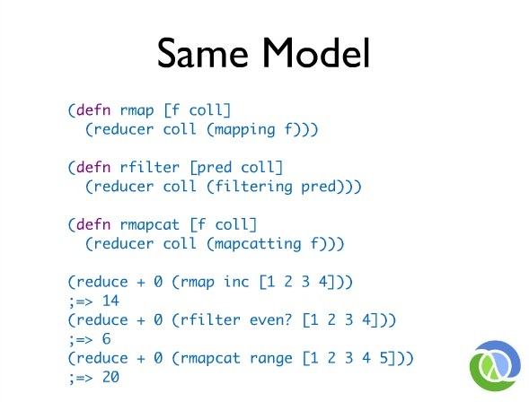

There's just one more step to have something that feels like map used to feel, so I just call these rmaps so they wouldn't clash with Clojure's map. Map in the new model, in the reducing model takes the function in collection just like the old map used to and it returns a new collection by making a reducer on that collection using the transformer on the reducing function. A transformer that's based around a mapping function. That's what map is.

Filter, the same thing. Mapcat, same thing. Look at these things. How similar are they? Totally. What's going to happen to all that? The victim of a macro again. It's going to go away. So we have all the boiler plate on both sides of this, disappears. One function called reducer that makes a collection given another collection in a transforming function. We have a universal recipe for making reducible collections from other reducible collections based around our set of transforming functions that don't know anything about collections at all, not at all. And now, our invocation looks the way we're used to. At least, if you're a Clojure programmer, this is what you're used to, right? You say, map inc across this and then, reduce that, result with plus. It's just function application. You can do this. You can compose these things. The filter looks the same thing. The filter call, filter out the even, the numbers and then, sum those. Or you know, get me ranges of all these different lanes in some of the ranges flattened.

Now, we're pretty good. We, now, have a recipe for all these functions. It's completely different than it used to be, but the invocation looks exactly the same than it used to be. And we've gotten rid if all the stuff except...

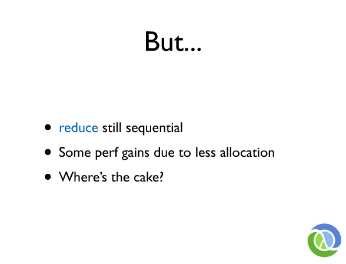

Reduce, we know inside, is still sequential, so this is actually faster than Clojure's lazy code because this is not lazy anymore and it does not do any allocation per step. You saw the way those transformers work, they weren't building boxes. They weren't building lists around things and all those. There's no allocation per step. There's no stuff in the middle. There's nothing, so it is faster now. Oh, I keep forgetting to change the slide. I was suppose to say, "where's the pie now?" So where's the pie? 

I started this talk by saying, the whole point of this is to get the parallelism, but reduce itself is not parallel. So we, now, have map which is cool but not parallel. What's really needed about it is it's not actually doing the job, right? Map no longer does the work right then. When does mapping happen? Only later when you reduce it, right? When does the stickers get taken off? Not right now, I'm playing Minecraft. Later. No concrete work is being done so even though, reduce is sequential and when we call reduce later, it's sequential, we didn't actually put anything in mapping or filtering that cared. So maybe we can use them again in a different context, and that's how we get to the real prize which is something called, 'fold'.

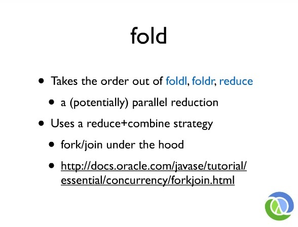

Of course, fold is an old word, but typically in programming language is it means like something concrete, either fold left or fold right. Or they call them foldl or foldr, and reduce is foldl. Clojure's reduce is foldl. Lisp's reduce is foldl. Fold is an abstraction of folds generically that specifically says, "I might work in parallel." It implements its semantics by threat. I, hereby, threaten you that I might operate in parallel. When I do that, when I say that, what does it mean of your reducing function? It might operate in parallel. Better be associative. It's going to need to be associative. What fold is it's a potentially parallel reduction. You might not always get parallelism. There might be reasons not to parallelize. You're too small. Parallelization overhead would dominate. I'm not going to bother to go that way. Or you're trying to fold a collection for which it's not amenable to parallelism. Like a linked list, a singly linked list is not amenable to parallelism. That's okay. We will do it in parallel.

So what fold is it's like reduce. You're going to take a function and apply it to a collection, it's goin to reduce the collection pair-wise, but it's not going to start at the beginning. It could potentially happen in parallel. The way fold works is it uses a reduce combine strategy. Strictly, it does not use a map reduce strategy and I'll show you why in a second. Under the hood, the implementation of fold leverages the Java fork/join framework, so it's going to partition the work and use the work stealing capabilities of fork/join. How many people know about fork/join? Okay. I'll show you a little bit about fork/join in a second.

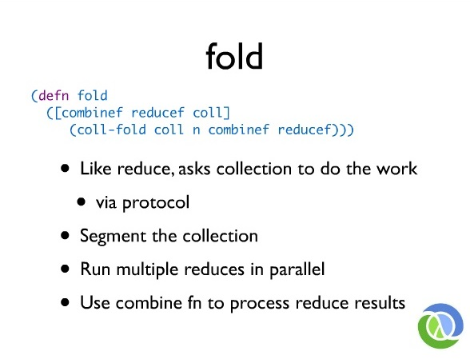

So fold is very similar to reduce. It's a function that takes a reducing function in a collection, but fold also can optionally take a combining function. It actually has another optional argument that happens earlier, but we're going to talk about this three argument flavor for now which is, 'takes a combining function, a reducing function in a collection.' And fold, just like reduce, is also implemented in terms of a protocol so it's an open system. Basically, you say, "I know how to fold myself if you give me these two functions. I can fold myself." So fold just says, "ask the collection to fold itself using those two functions." This is a partitioning size which is optional. It has a default. That's why you don't see n anywhere here. So just like reduce, it asks the collection to do the work and it uses a protocol to do that. The logical operation of fold is to segment the collection into pieces. Then, to run multiple reduces in parallel on those pieces using the reducing function. Then, using the combining function to pairwise, combine the results. So now, you've got a single result, that's how fold works.

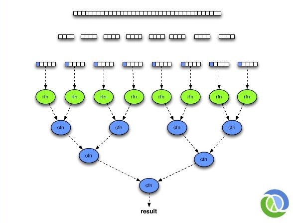

That looks like this. So you can imagine, the collection is a big continuity here. Chances are, in reality, it will be a tree of some sort. It doesn't really matter, but in a functional programming language, it will usually be a tree because it works on a raise and things like that. Logically, it gets segmented. You don't actually produce these segments, but you just got to divide it up. You know, sub-vector or subrange, it's the same idea. The big thing is still there but I've got a window, it's a little piece of it that I'm going to operate on. Now, we're going to do independent reduces. We know reduce takes an initial value and it operates on that value on the first item and the result to that in the next item. Because we're going to be firing off a bunch of reduces in parallel, we need a bunch of initializers. You have to remember that because that seems tricky. Where did that come from. Then, we're going to use the reducing function so that's a straight reduce. It's exactly the straight reduce. 

An important characteristic of this design is the fact that, while in a theoretical model for fork/join, what happens is, you take the work that you have to do, divide it in half. You divide the halves in half, and you keep dividing in half turning down to one. Then, you do the work on one and then, combine it with the other. In practice, you never use fork/join that way because the overhead of processing individual items at the bottom would dominate, so you would always stop short of that. The practical use of fork/join always segments and stops it at segment size which is greater than one, usually much greater than one. But a lot of the designs around fork/join pretend as if it's going to go down to one. I don't see the point of that. If you're going to go down to n and the best way to process n things is with reduce. Why pretend you're going to go down to one and process the bottom things with map? Because you're not and when you do that, you end up all the goofiness, right? All the empty baggies and baggies with slices in them, like all those extra collections and stuff like that.

We know we're going to reduce at the bottom. We know we're going to have a collection at the bottom and the best way to process a collection is to reduce it. So this leverage is to find in terms of reduce at the bottom, not map. Then, we'll get answers for that. This reducing function can be arbitrary so if it was plus, these might all be numbers. If it was concatenate to an empty collection, these might all be collections. It doesn't matter. This is very general, reducing and then, combining. Then, the combining function is another binary function that takes two of whatever those are and then, returns something and so forth, and so forth. Finally, you get a result. This is really good, right?

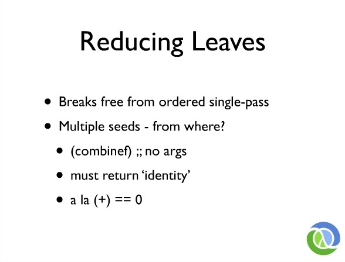

First of all, it breaks free from the ordered single pass. There's no initial value. The big difference between fold and reduce is there's no initial value for the whole job. Reduce took that initial value but fold doesn't. Fold doesn't take init up here. That's what's missing. It doesn't have an initial value. So we've broken away from the ordered single pass. That was the last piece. We had an initial single value, we just have to go in order. Now, we don't. We have the threat of the parallelism. We can do it in separate pieces, but you do have this question. Where do the seeds come from? These reducers have to start with something. Where do they start with? Who cares about what they start with? Who's going to ultimately consume that? The reducing function has to be able to process it, but maybe there's nothing to reduce in which case it would flow through. Who really cares a lot? These guys. They care a lot. This value here must constitute a sort of magic value for these combining functions. Because imagine we had a segment here and after we had filtered out all the rotten apples, there were no rotten apples. This value here has to flow through this function and do what in it? Represent nothing. It has to disappear to that function.

So what happens in the library is we need to have an initial value for each of those things. We're going to obtain that initial value by calling the combining function with no argument. So when you call the combining function with no argument, it returns something. That thing has a name. It's called an identity. If you think about it, the identity for plus is zero. You can add zero to anything and the result is that thing, so it's like a no-op value for that thing, that operator. What you need of a combining function is a binary function of two things for which there's some identity. The identity for addition is zero. The identity for multiplication is what? One. Identities for collection things are usually like empty collections and stuff like that, but it's every important actually that this not be a value. You'll hear this talked about as being a value and that the mathematical definition of this thing is called a monoid, which every time I say it, people are like, "Okay. Did you just go tell me to..."

All monoid means is exactly what I'm saying. It's a binary function that has an identity value that disappears when it's used, it's combined. That's what it means. That fancy word is for all these things, so go ahead if you want to be fancy. That's all it means, that's the property that we expect of this function that reducing functions and combining functions must be associative binary operators and that their combining function in particular also have an identity value that you can obtain by calling it with no arguments. By calling it instead of saying, "I'm going to give you the identity value." You can actually have identity values that, for instance, are mutable. If you want to do a very high performance folding job, you might want to have ArrayLists in there.

Well, if you gave every step here, the same ArrayList, what's that going to do? It's going to make a mess, right? They can't all have the same ArrayList. They have to call the same constructor. They don't want to have the same value. So we get the values that way.

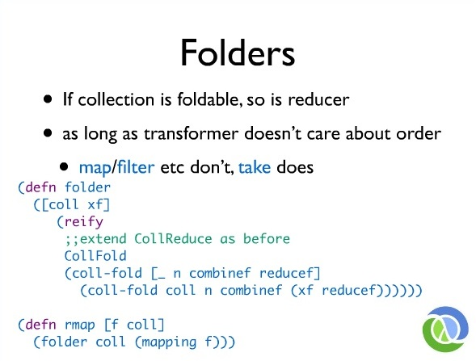

Now, we have an idea. We talked about a reducer. A reducer is just something that takes a collection and this transforming function and makes it into something that the self is reducible. We had the same notion here of folder, is something that takes a collection and some transforming function and makes something that itself is foldable. That's all. It ends up being the case that as long as the transforming function doesn't care about order. Map doesn't care about order. Filter doesn't care about order. Take actually cares about order, but as long as the transformer itself doesn't care about order then, any reducer is also actually a folder. Anything else that's reducible is also foldable. Mapping of something is foldable because map doesn't care about order.

We can define something that looks a lot like reducer called, 'folder' and it takes a collection a transforming function. Remember, those are like mapping stuff. It's going to reify both reducible and foldable. We can just think of them that way. Both of these protocols and it's going to implement fold the same way. It's going to say, "If you ask me to fold with this combining function and that reducing function, I'm just going to ask the collection to fold itself with the same combining function and with the modified reducing function. If it ends up that the pie-maker and the pie-maker assistant are like master jugglers, and the pie-maker can actually catch more than one apple at a time and the pie-maker assistant can deliver more than one apple at a time, they can have multiple apples flying through the air at the same time and make pie twice the speed of anybody else because they have all this juggling capability. It has nothing to do with taking the stickers off. He takes the stickers off and he throws them at the same time. He has to be pretty agile to take the stickers off one-handed, but he's got a lot of spare time.

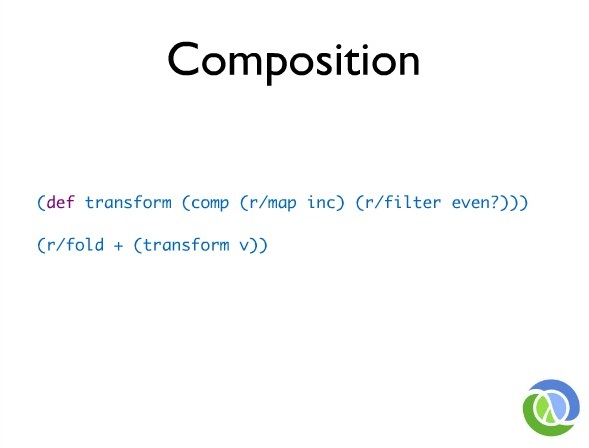

This looks like reducer before. It's just a generic thing that says, "I can make a folder out of a transforming function in a collection by reifying this protocol." Instead, you'll find that map and filter in the library are not defined in terms of calls to reducer as I showed you before but in terms of folder which makes them both folders and reducers that can be used for both of these jobs. The cool thing here is we didn't touch mapping at all. We're all done with that by making that completely collection independent and simultaneously operation independent. Are you reducing? Are you folding? Map does not care. Mapping does not care, neither does map, because what map does is make a recipe for something you can do something with later, and it's going to ask the thing to do the hard work. All I want you to do is transform the function in the first place. You made these completely orthogonal. That's huge.

Collection representation, order independence, operation independence and transformation, all are independent, completely independent. We do not have parallel map. We don't have parallel collection. We don't have those. We don't need them. What you need is to just take stuff apart far enough so you can put it back together whenever you want and that's how this works. It has some very neat properties that's composable. So instead of saying, "Filter the even numbers on the collection and then, mapping on that collection and then, reduce it," you can just say, "Make this recipe for me. Filter out the rotten apples and take the stickers off."

We can compose those two things. You'll notice that these two calls are missing the collections. They're curried. They don't have the collection, so what you end up is a recipe for taking the stickers off and taking out the rotten apples or filtering out only the good ones that doesn't yet have the job or the bag of apples. It just has the recipe. You can write this recipe down. You could give it to your friends. They could make apple pie or they could make pear pie. If there's such a thing. Or they could make, I don't know, what else has apples in it? Crumble. The recipes are first class. This is first class. You can compose these recipes and later apply them to the collection sources. That's what you want. That's why you just function programming languages, right?

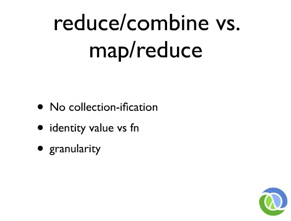

So I'm just going to beat up a little bit here on reduce/combine versus map/reduce. In particular, one of the things that struck me about Guy's talk was he has examples of parallel filter and parallel filter is returning all these empty collections and is collectionizing things. You're just going to see that. You're going to encounter that everywhere. I think it's not a small thing that this library does not do that. I think that's what makes it categorically different from a lot of what you might see and it makes it very fast. It means you don't need sufficiently smart compilers or things to like that make stuff go away or stream fusion or other really amazing magic. It's really quite simple but the thing is, that could just be an implementation detail. The biggest thing is you only write the purple part. What else lets you write only the purple part from before? Because that's really the key win. When you want to write one of these things, you want to write the essence of the job, you're completely isolated from everything else.

So you don't have any collection-ification. I talked earlier about that you don't want an identity value. You want an identity value creating function that will let you create identity values that are mutable which is very important if you want to have high performance inside because we don't care. Inside this job, if we bang on ArrayList and end up with a mutable thing at the end, that's a win. We don't need to be all religious inside there about functional programming. We need to produce a result in a functional manner which means we took inputs. We didn't affect the outside world. We gave you an output and we're going to give you the same answer every time. You can use arrays inside the middle of that, that's okay. But if you want to use arrays inside the middle of that, you can't pass the same array to every step of the reducing job. You're going to need to manufacture arrays for each step of the reducing job.

The other thing is just the granularity difference is there. What happens when you use map/reduce style is you end up with jobs in the intermediate steps of the computation. If I say, "Fold the collection that I've mapped and filtered, did they produce extra work for the parallelism job?" No. They're gone. They're gone before the parallelism job even starts. All they did was transform the reducing function at the leaf. If you have a map space system where the bottom job is creating empty collections, that's going to create work for what function? The combining function. The combining function is going to have to undo all that stuff, concatenate empty collections, uncollection-ify stuff, flatten all, and every time you concatenate those things together, that's more work. Then the compiler guys are going to be like, "Oh my God. We've got to make this disappear." You don't have to do that if you choose reduce at the bottom.

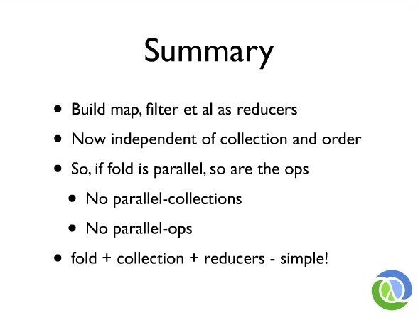

In summary, the idea is to revisit the ideas of map and filter as reducers which are logical collections that are themselves reducible that are defined in terms of making a transformer of a reducing function to another reducing function. They're now completely independent of the collections that mapping doesn't know about collections. It knows nothing about collections. It's just the essence of the work at a step with no notion of where that step occurs. So they have no collection dependence and no order dependence. They do not know that the part of any particular kind of algorithm if it's happening sequentially or in parallel. They don't know. If you fold itself as parallel, all these operations are inherently parallel because that's orthogonal now. Parallelism is not a characteristic of map. Parallelism is also not a characteristic of the collection. If the collection didn't think of this, then you can find the protocol fold for it, you've now added parallelism to that collection. This works on the existing Clojure collections just as they stand, and it works with existing operations. You don't have parallel collections. You don't have parallel operations. I'm not really sure I believe in all those things. You'll build parallel algorithms around this, but these fundamental things are independent of order and that's where the parallel comes from. Fold, collections and reducers are all independent and then, you can compose them simply. That's the idea. I just want to show you how this works.

So we're just going to load up this library and we'll make a big collection of numbers. This first of the three calls here is ordinary Clojure code, it calls the lazy sequence function so it's going to filter out to even the numbers in the collection. It's going to map increments over those and finally, produce the sum so we'll call that. Of course, this guy is the first guy to run so he's going to get penalized with some compiling time and we'll run him a bunch of times so we get a good speed. There we go, so that's roughly where he's at.

This next guy, second one. We're doing the same job over the same collection, did not touch the collection. I left him behind my back, but we're now going to switch to the reducer versions of filter and map. We're using the same reduce function. This is Legos. Take your pieces, put them together however you want. So we're filtering with the reducer and mapping with the reducer which means those jobs are not actually happening. They're just building a recipe and then, we're going to reduce with ordinary reduce so let that warm up and there you go. That's faster. That's just eliminating the allocation per step overhead of laziness.

Finally, we're going to, now, just switch this last one. It's from reduce to fold. Again, fold is logically the same job. In fact, when fold can't parallelize the operation, it just follows back to reduce because it's the same logical operation. I should have said, "If you don't supply combining function, the reducing function is the combining function." Because you notice this call of fold doesn't have a separate combining function. It just has plus. It means that plus is being used for the combining function and the reducing function which makes sense. We can add all at the leaves and then, add the results to the leaves and that's very convenient. So folds can be used exactly as a replacement for reduce if you don't have a hybrid job or you're trying to do something fancy. We just swap for fold here and boom. There we go, it's pretty easy. So that's it. Thanks.
