# Simple Made Easy

* **Speaker: Rich Hickey**
* **Conference: [Strange Loop 2011](http://thestrangeloop.com) - Sept 2011**
* **Video: [https://www.youtube.com/watch?v=SxdOUGdseq4](https://www.youtube.com/watch?v=SxdOUGdseq4)**

Hi. So who is ready for some more category theory?

[Audience applause]

You're all in the wrong room.

[Audience laughter] 

This talk I hope seems deceptively obvious. One of the things that's great about this conference is this is a pretty cutting edge crowd. A lot of you are adopting new technologies. A lot of you are doing functional programming. And you may be nodding, saying yeah, yeah, yeah through parts of this. And if some of it is familiar, that's great. On the other hand, I think that I would hope that you would come away from this talk with some tools you could use to help conduct a similar kind of discussion to this talk with other people that you're trying to convince to do the right thing.

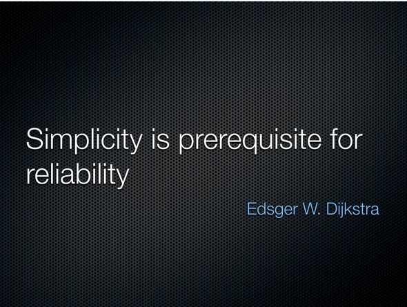

So, I'll start with an appeal to authority. Simplicity is a prerequisite for reliability. I certainly agree with this. I don't agree with everything Dijkstra said, and I think he might have been very wrong about proof in particular. But I think he's right about this. We need to build simple systems if we want to build good systems. I don't think we focus enough on that.

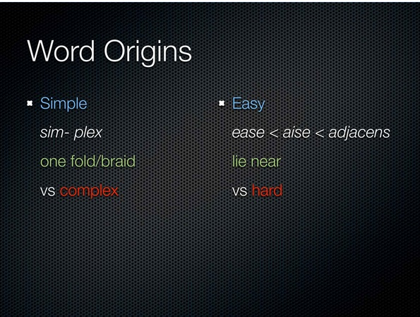

I love word origins. They're tremendous fun. One of the reasons why they're fun is because words eventually come to mean whatever we all accept them to mean. You know, whatever is commonly understood to be the meaning is what it means. And it's often interesting to say, well, I wish I could; I wish we could go back to what it really means and use that. And I think there's a couple of words that I'm going to use in this talk that I would love for you to come away knowing the origins of and try to use more precisely, especially when talking about software. 

So the first word is simple. And the roots of this word are sim and plex, and that means one fold or one braid or twist. And that characteristic about being about one literally fold or twist, of course one twist, what's one twist look like? No twists, right, actually. 

And the opposite of this word is complex, which means braided together or folded together. Being able to think about our software in terms of whether or not it's folded together is sort of the central point of this talk. 

The other word we frequently use interchangeably with simple is the word easy. And the derivation there is to a French word, and the last step of this derivation is actually speculative, but I bought it because it serves this talk really well, and that is from the Latin word that is the root of adjacent, which means to lie near and to be nearby. And the opposite is hard. Of course, the root of hard has nothing to do with lying near. It doesn't mean lie far away. It actually means like strong or tortuously so.

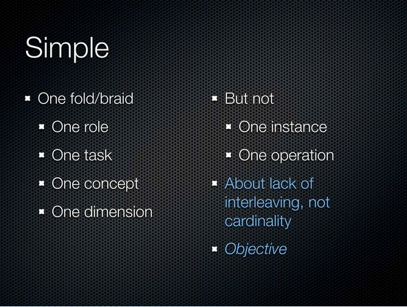

So if we want to try to apply simple to the kinds of work that we do, we're going to start with this concept of having one braid. And look at it in a few different dimensions. I thought it was interesting in Eric's talk to talk about dimensions because it's definitely a big part of doing design work. And so if we want to look for simple things, we want to look for things that have sort of one of something. They do, they have one role. They fulfill one task or job. They're about accomplishing sort of one objective. They might be about one concept like security. 

And sort of overlapping with that is they may be about a particular dimension of the problem that you're trying to solve. The critical thing there, though, is that when you're looking for something that's simple, you want to see it have focus in these areas. You don't want to see it combining things. 

On the other hand, we can't get too fixated about one. In particular, simple doesn't mean that there's only one of them. Right? It also doesn't mean an interface that only has one operation. So it's important to distinguish cardinality, right, counting things from actual interleaving. What matters for simplicity is that there is no interleaving, not that there's only one thing, and that's very important. 

Okay, the other critical thing about simple, as we've just described it, right, is if something is interleaved or not, that's sort of an objective thing. You can probably go and look and see. I don't see any connections. I don't see anywhere where this twist was something else, so simple is actually an objective notion. That's also very important in deciding the difference between simple and easy.

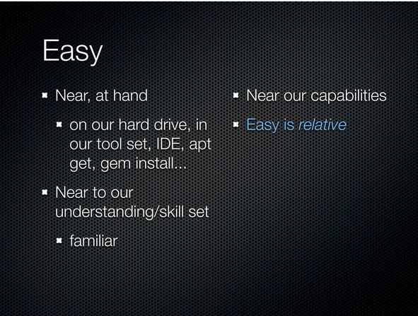

So let's look at easy. I think this notion of nearness is really, really cool. In particular, obviously there's many ways in which something can be near. Right? There's sort of the physical notion of being near. Right? Is something, you know, right there. And I think that's where the root of the word came from. You know, this is easy to obtain because it's nearby. It's not in the next town. I don't have to take a horse or whatever to go get to it. We don't have the same notion of physicality necessarily in our software, but we do sort of have, you know, our own hard drive or our own toolset, or it's sort of the ability to make things physically near by getting them through things like installers and stuff like that. 

The second notion of nearness is something being near to our understanding, right, or in our current skill set. And I don't mean in this case near to our understanding meaning a capability. I mean literally near something that we already know. So the word in this case is about being familiar. 

I think that, collectively, we are infatuated with these two notions of easy. We are just so self-involved in these two aspects; it's hurting us tremendously. Right? All we care about is, you know, can I get this instantly and start running it in five seconds? It could be this giant hairball that you got, but all you care is, you know, can you get it.

In addition, we're fixated on, oh, I can't; I can't read that. Now I can't read German. Does that mean German is unreadable? No. I don't know German. So, you know, this sort of approach is definitely not helpful. In particular, if you want everything to be familiar, you will never learn anything new because it can't be significantly different from what you already know and not drift away from the familiarity.

There's a third aspect of being easy that I don't think we think enough about that's going to become critical to this discussion, which now is being near to our capabilities. And we don't like to talk about this because it makes us uncomfortable because what kind of capabilities are we talking about? If we're talking about easy in the case of violin playing or piano playing or mountain climbing or something like that, well, you know, I don't personally feel bad if I don't play the violin well because I don't play the violin at all. 

But the work that we're in is conceptual work, so when we start talking about something being outside of our capability, well, you know, it really starts trampling on our egos in a big way. And so, you know, due to a combination of hubris and insecurity, we never really talk about whether or not something is outside of our capabilities. It ends up that it's not so embarrassing after all because we don't have tremendously divergent abilities in that area.

The last thing I want to say about easy and the critical thing to distinguish it from simple is that easy is relative. Right? Playing the violin and reading German are really hard for me. They're easy for other people, certain other people. So unlike simple where we can go and look for interleavings, look for braiding, easy is always going to be, you know, easy for whom, or hard for whom? It's a relative term.

The fact that we throw these things around sort of casually saying, oh, I like to use that technology because it's simple, and when I'm saying simple, I mean easy. And when I am saying easy, I mean because I already know something that looks very much alike that. It's how this whole thing degrades and we can never have an objective discussion about the qualities that matter to us in our software.

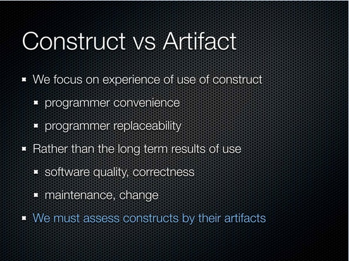

So, what's one critical area where we have to distinguish these two things and look at them from a perspective of them being easy and being simple? It has to do with constructs and artifacts. Right? We program with constructs. We have programming languages. We use particular libraries, and those things, in and of themselves, when we look at them, like when we look at the code we write, have certain characteristics in and of themselves.

But we're in a business of artifacts. Right? We don't ship source code, and the user doesn't look at our source code and say, "Ah, that's so pleasant." Right? No? They run our software, and they run it for a long period of time. And, over time, we keep glomming more stuff on our software. All of that stuff, the running of it, the performance of it, the ability to change it all is an attribute of the artifact, not the original construct.

But again, here we still focus so much on our experience of the use of the construct. Oh, look; I only had to type 16 characters. Wow! That's great. No semicolons or things like that. This whole notion of sort of programmer convenience, again, we are infatuated with it, not to our benefit.

On the flipside it gets even worse. Our employers are also infatuated with it. Right? Those first two meanings of easy, what do they mean? Right? If I can get another programmer in here, right? And they look at your source code, and they think it's familiar, right? And they already know the toolkit, right? So it's near at hand. They've always had the same tool in their toolkit. They can read it. I can replace you. It's a breeze, especially if I ignore the third notion of easy, right, which is whether or not anybody can understand your code, right, because they don't actually care about that. They just care that somebody can go sit in your seat, start typing.

So again, as sort of business owners, there's sort of, again, the same kind of focus on those first two aspects of easy because it makes programmers replaceable. So we're going to contrast this with the impacts of long-term use. Right? What does it mean to use this long term? And what's there? What's there is all the meat. Right?

Does the software do what it's supposed to do? Is it of high quality? Can we rely on it doing what it's supposed to do? Can we fix problems when they arise? And if we're given a new requirement, can we change it? These things have nothing to do with the construct, as we typed it in, or very little to do with it, and have a lot to do with the attributes of the artifact. We have to start assessing our constructs based around the artifacts, not around the look and feel of the experience of typing it in or the cultural aspects of that.

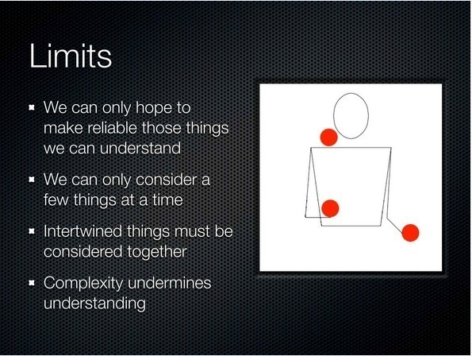

So let's talk a little bit about limits. Oh, look; it does move. This is just supposed to sort of lull you into this state where everything I say seems true. 

[Audience laughter]

Because I can't use monads to do that.

[Audience laughter] 

This stuff is pretty simple logic, right? How can we possibly make things that are reliable that we don't understand? It's very, very difficult. I think Professor Sussman made a great point saying there's going to be this tradeoff, right? As we make things more flexible and extensible and dynamic in some possible futures for some kinds of systems, we are going to make a tradeoff in our ability to understand their behavior and make sure that they're correct. But for the things that we want to understand and make sure are correct, we're going to be limited. We're going to be limited to our understanding.

And our understanding is very limited, right? There's the whole notion of, you know, how many balls can you keep in the air at the time, or how many things can you keep in mind at a time? It's a limited number, and it's a very small number, right? So we can only consider a few things and, when things are intertwined together, we lose the ability to take them in isolation.

So if every time I think I pull out a new part of the software I need to comprehend, and it's attached to another thing, I had to pull that other thing into my mind because I can't think about the one without the other. That's the nature of them being intertwined. So every intertwining is adding this burden, and the burden is kind of combinatorial as to the number of things that we can consider. So, fundamentally, this complexity, and by complexity I mean this braiding together of things, is going to limit our ability to understand our systems.

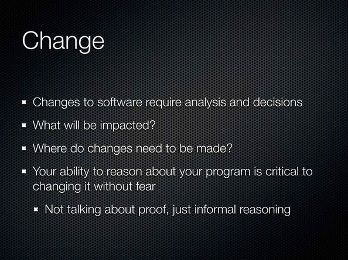

So how do we change our software? Apparently, I heard in a talk today, that Agile and Extreme Programming have shown that refactoring and tests allow us to make change with zero impact.

[Audience laughter] 

I never knew that. I still do not know that.

[Audience laughter]

That's not actually a knowable thing. That's phooey.

[Audience laughter]

Right? If you're going to change software, you're going to need to analyze what it does and make decisions about what it ought to do. You know, I mean, at least you're going to have to go and say, "What is the impact of this potential change?" Right? "And what parts of the software do I need to go to to effect the change?"

You know, I don't care if you're using XP or Agile or anything else. You're not going to get around the fact that if you can't reason about your program, you can't make these decisions. But I do want to make clear here because a lot of people, as soon as they hear the words reason about, they're like, "Oh, my God! Are you saying that you have to be able to prove programs?" I am not. I don't believe in that. I don't think that's an objective. I'm just talking about informal reasoning, the same kind of reasoning we use every day to decide what we're going to do. We do not take out category theory and say, "Woo," you know. We actually can reason without it. Thank goodness.

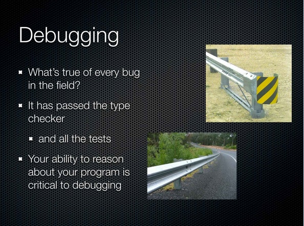

So what about the other side? Right? There are two things you do with the future of your software. One is, you add new capabilities. The other thing is you fix the ones you didn't get, you know, done so well.

And I like to ask this question: What's true of every bug found in the field? 

[Audience reply: Someone wrote it?]
[Audience reply: It got written.]

It got written. Yes. What's a more interesting fact about it? It passed the type checker.

[Audience laughter]

What else did it do?

[Audience reply: (Indiscernible)]

It passed all the tests. Okay. So now what do you do? Right? I think we're in this world I'd like to call guardrail programming. Right? It's really sad. We're like: I can make change because I have tests. Who does that? Who drives their car around banging against the guardrail saying, "Whoa! I'm glad I've got these guardrails because I'd never make it to the show on time."

[Audience laughter]

Right? And - and do the guardrails help you get to where you want to go? Like, do guardrails guide you places? No. There are guardrails everywhere. They don't point your car in any particular direction. So again, we're going to need to be able to think about our program. It's going to be critical. All of our guardrails will have failed us. We're going to have this problem. We're going to need to be able to reason about our program. Say, "Well, you know what? I think," because maybe if it's not too complex, I'll be able to say, "I know, through ordinary logic, it couldn't be in this part of the program. It must be in that part, and let me go look there first," things like that.

Now, of course, everybody is going to start moaning, "But I have all this speed. I'm agile. I'm fast. You know, this easy stuff is making my life good because I have a lot of speed."

What kind of runner can run as fast as they possibly can from the very start of a race?

[Audience reply: Sprinter]

Right, only somebody who runs really short races, okay?

[Audience laughter]

But of course, we are programmers, and we are smarter than runners, apparently, because we know how to fix that problem, right? We just fire the starting pistol every hundred yards and call it a new sprint.

[Audience laughter and applause]

I don't know why they haven't figured that out, but -- right. It's my contention, based on experience, that if you ignore complexity, you will slow down. You will invariably slow down over the long haul.

Of course, if you are doing something that's really short term, you don't need any of this. You could write it, you know, in ones and zeros. And this is my really scientific graph. You notice how none of the axis are -- there's no numbers on it because I just completely made it up.

[Audience laughter]

It's an experiential graph, and what it shows is if you focus on ease and ignore simplicity, so I'm not saying you can't try to do both. That would be great. But if you focus on ease, you will be able to go as fast as possible from the beginning of the race. But no matter what technology you use, or sprints or firing pistols, or whatever, the complexity will eventually kill you. It will kill you in a way that will make every sprint accomplish less. Most sprints be about completely redoing things you've already done. And the net effect is you're not moving forward in any significant way.

Now if you start by focusing on simplicity, why can't you go as fast as possible right at the beginning? Right, because some tools that are simple are actually as easy to use as some tools that are not. Why can't you go as fast then?

[Audience response: You have to think.]

You have to think. You have to actually apply some simplicity work to the problem before you start, and that's going to give you this ramp up.

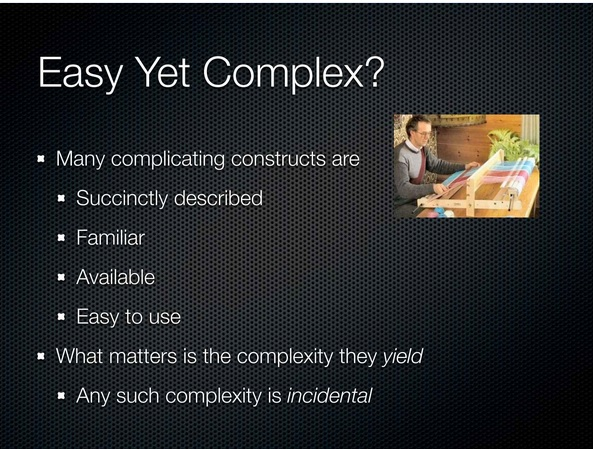

One of the problems I think we have is this conundrum that some things that are easy actually are complex. So let's look. There are a bunch of constructs that have complex artifacts that are very succinctly described. Right? Some of the things that are really dangerous to use are like so simple to describe. They're incredibly familiar, right? If you're coming from object-orientation, you're familiar with a lot of complex things. They're very much available. Right?

And they're easy to use. In fact, by all measures, conventional measures, you would look at them and say this is easy. Right? But we don't care about that. Right? Again, the user is not looking at our software, and they don't actually care very much about how good a time we had when we were writing it. Right? What they care about is what the program does, and if it works well, it will be related to whether or not the output of those constructs were simple. In other words, what complexity did they yield?

When there is complexity there, we're going to call that incidental complexity. Right? It wasn't part of what the user asked us to do. We chose a tool. It had some inherent complexity in it. It's incidental to the problem. I didn't put the definition in here, but incidental is Latin for your fault.

[Audience laughter]

And it is, and I think you really have to ask yourself, you know, are you programming with a loom? You know, you're having a great time. You're throwing that shuttle back and forth. And what's coming out the other side is this knotted, you know, mess. I mean it may look pretty, but you have this problem. Right? What is the problem? The problem is the knitted castle problem. Right?

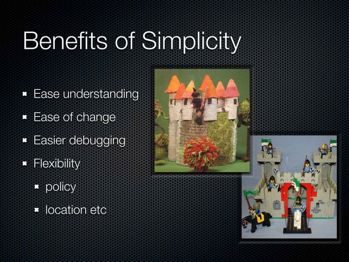

Do you want a knitted castle? What benefits do we get from simplicity? We get ease of understanding, right? That's sort of definitional. I contend we get ease of change and easier debugging. Other benefits that come out of it that are sort of on a secondary level are increased flexibility. And when we talk more about modularity and breaking things apart, we'll see where that falls. Like the ability to change policies or move things around, right? As we make things simpler, we get more independence of decisions because they're not interleaved, so I can make a location decision. It's orthogonal from a performance decision.

And I really do want to, you know, ask the question, agilest or whatever: Is having a test suite and refactoring tools going to make changing the knitted castle faster than changing the Lego castle? No way. Completely unrelated.

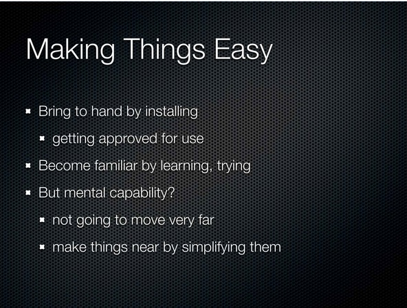

Okay. So how do we make things easy? Presumably, you know, the objective here is not to just bemoan their software crisis, right? So what can we do to make things easier? So we'll look at those parts, those aspects of being easy again. There's a location aspect. Making something at hand, putting it in our toolkit, that's relatively simple. Right? We just install it. Maybe it's a little bit harder because we have to get somebody to say it's okay to use it.

Then there's the aspect of how do I make it familiar, right? I may not have ever seen this before. That's a learning exercise. I've got to go get a book, go take a tutorial, have somebody explain it to me. Maybe try it out. Right? Both these things we're driving. We're driving. We install. We learn. It's totally in our hands.

Then we have this other part though, which is the mental capability part. And that's the part that's always hard to talk about, the mental capability part because, the fact is, we can learn more things. We actually can't get much smarter. We're not going to move; we're not going to move our brain closer to the complexity. We have to make things near by simplifying them.

But the truth here is not that they're these super, bright people who can do these amazing things and everybody else is stuck because the juggling analogy is pretty close. Right? The average juggler can do three balls. The most amazing juggler in the world can do, like, 9 balls or 12 or something like that. They can't do 20 or 100. We're all very limited. Compared to the complexity we can create, we're all statistically at the same point in our ability to understand it, which is not very good. So we're going to have to bring things towards us.

And because we can only juggle so many balls, you have to make a decision. How many of those balls do you want to be incidental complexity and how many do you want to be problem complexity? How many extra balls? Do you want to have somebody throwing you balls that you have to try to incorporate in here? Oh, use this tool. And you're like, whoa! You know, more stuff. Who wants to do that?

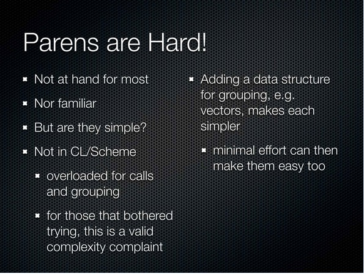

All right, so let's look at a fact.

[Audience laughter]

I've been on the other side of this complaint, and I like it. We can look at it really quickly only because it's not -- this analysis has nothing to do with the usage. This complexity analysis is just about the programmer experience. So parens are hard. Right? They're not at hand for most people who haven't otherwise used it.

And what does that mean? It means that, like, they don't have an editor that knows how to do, you know, paren matching or move stuff around structurally, or they have one and they've never loaded the mode that makes that happen. Totally given, right? It's not at hand, nor is it familiar. I mean, everybody has seen parentheses, but they haven't seen them on that side of the method.

[Audience laughter]

I mean [laughter] that is just crazy!

[Audience laughter]

But, you know, I think this is your responsibility, right, to fix these two things, as a user, as a potential user. You've got to do this. But we could dig deeper. Let's look at the third thing. Did you actually give me something that was simple? Is a language built all out of parens simple? In the case I'm saying, right, is it free of interleaving and braiding? And the answer is no. Right?

Common LISP and Scheme are not simple in this sense, in their use of parens because the use of parentheses in those languages is overloaded. Parens wrap calls. They wrap grouping. They wrap data structures. And that overloading is a form of complexity by the definition, you know, I gave you. Right?

And so, if you actually bothered to get your editor set up and learn that the parentheses goes on the other side of the verb, this was still a valid complaint. Now, of course, everybody was saying easy, and it's hard, it's complex, and they were using these words really weakly. Right? But it was hard for a couple reasons you could solve, and it was not simple for a reason that was the fault of the language designer, which was that there was overloading there. And we can fix that. Right? We can just add another data structure.

It doesn't make LISP not LISP to have more data structures. Right? It's still a language defined in terms of its own data structures. But having more data structures in play means that we can get rid of this overloading in this case, which then makes it your fault again because the simplicity is back in the construct, and it's just a familiarity thing, which you can solve for yourself.

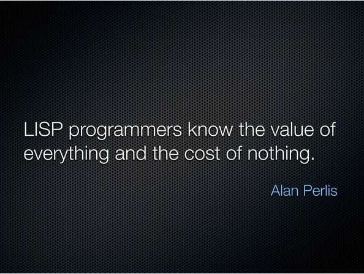

Okay. This was an old dig at LISP programmers. I'm not totally sure what he was talking about. I believe it was a performance related thing. The LISPers, they consed up all this memory, and they did all this evaluation, and it was a pig. LISP programmers at that time were -- LISP programs at that time were complete pigs relative to the hardware. So, you know, they knew the value of all these constructs, right, this dynamic nature. These things are all great. They are valuable, but there was this performance cost.

I'd like to lift this whole phrase and apply it to all of us right now. As programmers, we are looking at all kinds of things, and I just see it. You know, read Hacker News or whatever. It's like, oh, look; this thing has this benefit. Oh, great. I'm going to do that. Oh, but this has this benefit. Oh, that's cool. Oh, that's awesome. You know, that's shorter. You never see in these discussions: was there a tradeoff? Is there any downside? You know, is there anything bad that comes along with this? Never. Nothing.

It's just like we look all for benefits. So as programmers now, I think we're looking all for benefits, and we're not looking carefully enough at the byproducts.

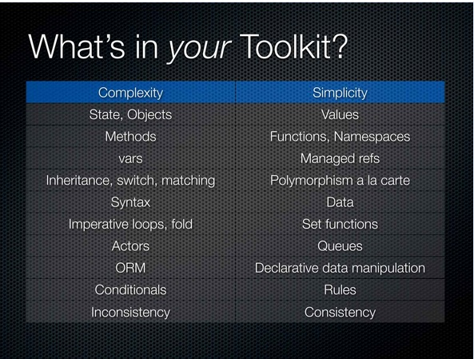

So, what's in your toolkit? I have, you know, I have these two columns. One says complexity and one says simplicity. The simplicity column just means simpler. It doesn't mean that the things over there are purely simple. Now I didn't label these things bad and good. I'm leaving your minds to do that.

[Audience laughter]

So what things are complex and what are the simple replacements? I'm going to dig into the details on these, so I won't actually explain why they're complex, but I'm going to state and objects are complex, and values are simple and can replace them in many cases. I'm going to say methods are complex, and functions are simple. And namespaces are simple. The reason why methods are there are because often the space of methods, the class or whatever, is also a mini, very poor namespace.

Vars are complex and variables are complex. Managed references are also complex, but they're simpler. Inheritance, switch statements, pattern matching are all complex, and polymorphism a la carte is simple. Now remember the meaning of simple. The meaning of simple means unentangled, not twisted together with something else. It doesn't mean I already know what it means. Simple does not mean I already know what it means.

Okay. Syntax is complex. Data is simple. Imperative loops, fold even, which seems kind of higher level, still has some implications that tie two things together, whereas set functions are simpler. Actors are complex, and queues are simpler. ORM is complex, and declarative data manipulation is simpler. Even Eric said that in his talk. He said it really fast near the end.

[Audience laughter]

Oh, yeah, and eventual consistency is really hard for programmers. Conditionals are complex in interesting ways, and rules can be simpler. And inconsistency is very complex. It's almost definitionally complex because consistent means to stand together, so inconsistent means to stand apart. That means taking a set of things that are standing apart and trying to think about them all at the same time. It's inherently complex to do that. And anybody who has tried to use a system that's eventually consistent knows that.

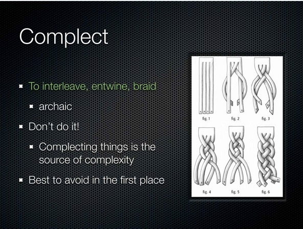

Okay. So there's this really cool word called complect. I found it.

[Audience laughter]

I love it. It means to interleave or entwine or braid. Okay? I want to start talking about what we do to our software that makes it bad. And I don't want to say braid or entwine because it doesn't really have the good/bad connotation that complect has. Complect is obviously bad. Right?

[Audience laughter]

It happens to be an archaic word, but there are no rules that say you can't start using them again, so I'm going to use them for the rest of the talk. So what do you know about complect? It's bad. Don't do it. Right? This is where complexity comes from: complecting. It's very simple.

[Audience laughter]

In particular, it's something that you want to avoid in the first place. Look at this diagram. Look at the first one. Look at the last one. Right? It's the same stuff in both those diagrams, the exact. It's the same strips. What happened? They got complected.

[Audience laughter]

And now it's hard to understand the bottom diagram from the top one, but it's the same stuff. You're doing this all the time. You can make a program a hundred different ways. Some of them, it's just hanging there. It's all straight. You look at it. You say, I see it's four lines, this program. Right? Then you could type in four lines in another language or with a different construct, and you end up with this knot, so we've got to take care of that.

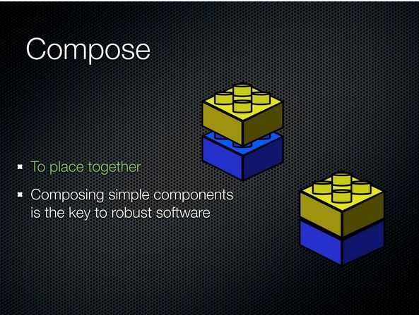

So complect actually means to braid together. And compose means to place together. And we know that, right? Everybody keeps telling us. What we want to do is make composable systems. We just want to place things together, which is great, and I think there's no disagreement. Right? Composing simple components, simple in that same respect, is the way we write robust software.

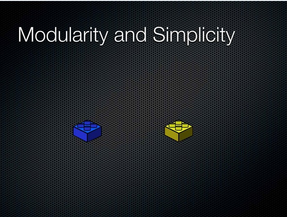

So it's simple, right? All we need to do is -- everybody knows this. I'm up here just telling you stuff you know. We can make simple systems by making them modular, right? We're done. I'm like halfway through my talk. I don't even know if I'm going to finish. It's so simple. This is it. This is the key.

No, it's obviously not the key. Who has seen components that have this kind of characteristic? I'll raise my hand twice because not enough people are raising their hands. It's ridiculous, right? What happens? You can write modular software with all kinds of interconnections between them. They may not call each other, but they're completely complected.

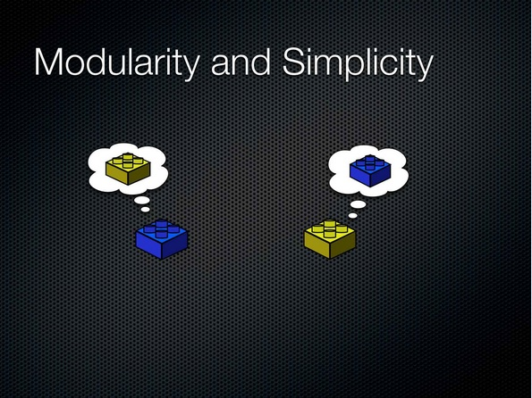

And we know how to solve this. It has nothing to do with the fact that there are two things. It has to do with what those two things are allowed to think about, if you want to really anthropomorphize.

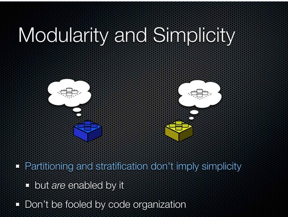

And what do we want to make things allowed to think about, and only these things? Some abstractions. I don't know if that's coming out that well. That's a dashed white version of the top of a Lego. That's all we want to limit things to because now the blue guy doesn't really know anything about the yellow guy, and the yellow guy doesn't really know anything about the blue guy, and they've both become simple.

So it's very important that you don't associate simplicity with partitioning and stratification. They don't imply it. They are enabled by it. If you make simple components, you can horizontally separate them, and you can vertically stratify them. Right? But you can also do that with complex things, and you're going to get no benefits.

And so I would encourage you to be particularly careful not to be fooled by code organization. There are tons of libraries that look, oh, look, there's different classes; there's separate classes. They call each other in sort of these nice ways, right? Then you get out in the field and you're like, oh, my God! This thing presumes that that thing never returns the number 17. What is that?

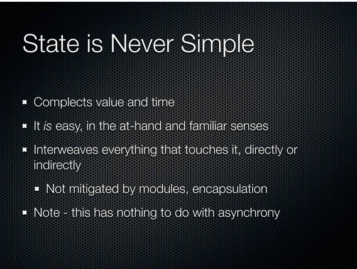

Okay. I'm not going to get up here and tell you state is awesome. I like state. I'm not a functional whatever guy, whatever. I'm going to say instead: I did this, and it sucked. I did years and years: C++, you know, He-Man, stateful programming. It's really not fun. It's not good. It's never simple.

Having state in your program is never simple because it has a fundamental complecting that goes on in its artifacts. It complects value and time. You don't have the ability to get a value independent of time. And sometimes not an ability to get a value in any proper sense at all. But again, it's a great example. This is easy. It's totally familiar. It's at hand. It's in all the programming languages. This is so easy. This complexity is so easy.

And you can't get rid of it. Everything -- I have modularity. That assignment statement is inside a method. Well, if every time you call that method with the same arguments, you can get a different result, guess what happened? That complexity just leaked right out of there. It doesn't matter that you can't see the variable. If the thing that's wrapping it is stateful and the thing that's wrapping that is still stateful, in other words by stateful I mean every time you ask it the same question you get a different answer, you have this complexity and it's like poison.

It's like dropping some dark liquid into a vase. It's just going to end up all over the place. The only time you can really, you know, get rid of it is when you put it inside something that's able to present a functional interface on the outside, a true functional interface: same input, same output. You can't mitigate it through the ordinary code organization things.

And note in particular, I didn't talk about concurrency here. This is not about concurrency. This has nothing to do with concurrency. It's about your ability to understand your program.

Your program was out there. It's single threaded. It didn't work. All the tests passed. It made it through the type checker. Figure out what happened. If it's full of variables, where are you going to need to try to do? Recreate the state that was happening at the client when it went bad. Is that going to be easy? No!

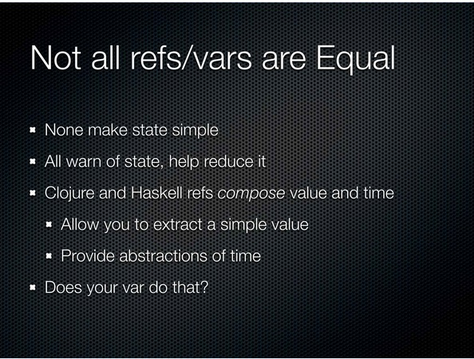

But we fix this, right? Your language, your new, shiny language has something called var, or maybe it has refs or references. None of these constructs make state simple. That's the first, primary thing. I don't want to say that even of Clojure's constructs. They do not make state simple in the case I'm talking about, in the nature of simple I'm talking about. But they're not the same.

They all do warn you when you have state, and that's great. Most people who are using a language where mutability is not the default and you have to go out of your way to get it, finds that the programs you end up writing have dramatically, like orders of magnitude, less state than they would otherwise because they never needed all the other state in the first place. So that's really great.

But I will call out Clojure and Haskell's references as being particularly superior in dealing with this because they compose values and time. There are actually little constructs that do two things. They have some abstraction over time and the ability to extract a value. That's really important because that's your path back to simplicity. If I have a way to get out of this thing and get a value out, I can continue with my program. If I have to pass that variable to somebody else or a reference to something that's going to find the variable every time through the varying thing, I'm poisoning the rest of my system. So look at the var in your language and ask if it does the same thing.

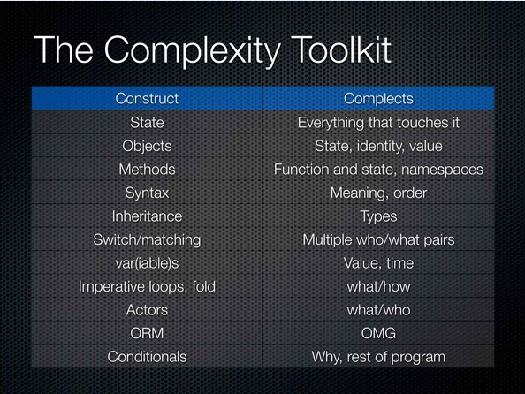
 
All right, let's see why things are complex. State, we already talked about. It complects everything it touches. Objects complect state, identity, and value. They mix these three things up in a way that you cannot extricate the parts.

Methods complect function and state, ordinarily, right? In addition, in some languages, they complect namespaces. Derive from two things in Java and have the same name method, and [hand gesture with sounds like explosion]. It doesn't work.

Syntax, interestingly, complects meaning and order often in a very unidirectional way. Professor Sussman made the great point about data versus syntax, and it's super true. I don't care how many you really love the syntax of your favorite language. It's inferior to data in every way.

Inheritance complects types. These two types are complected. That's what it means: inheritance, complecting. It's definitional.

Switching and matching, they complect multiple pairs of who's going to do something and what happens, and they do it all in one place in a closed way. That's very bad.

Vars and variables, again, complect value and time, often in an inextricable way, so you can't obtain a value. We saw a picture during a keynote yesterday of this amazing memory where you could de-reference an address and get an object out. I want to get one of those computers. Have you ever used one of those computers? I can't get one. I called Apple, and they were like, pff, no.

The only thing you can ever get out of a memory address is a word, a scalar, the thing that was all derided. Recovering a composite object from an address is not something computers do, none of the ones that we have. So variables have the same problem. You cannot recover a composite mutable thing with one de-reference.

Loops and fold: loops are pretty obviously complecting what you're doing and how to do it. Fold is a little bit more subtle because it seems like this nice, somebody else is taking care of it. But it does have this implication about the order of things, this left to right bit.

Actors complect what's going to be done and who is going to do it.

[Audience laughter]

Now Professor Sussman said all these talks have acronyms, and I couldn't actually modify my slides in time, so object relational mapping has oh, my God complecting going on. You can't even begin to talk about how bad it is, right? And, you know, if you're going to do, like, duals, what's the dual of value? Is it co-value? What's a co-value? It's an inconsistent thing. Who wants that?

Conditionals, I think, are interesting. This is sort of more cutting edge area. We have a bunch of sort of rules about what our programs are supposed to do. It's strewn all throughout the program. Can we fix that, because that's complected with the structure of the program and the organization of the program?

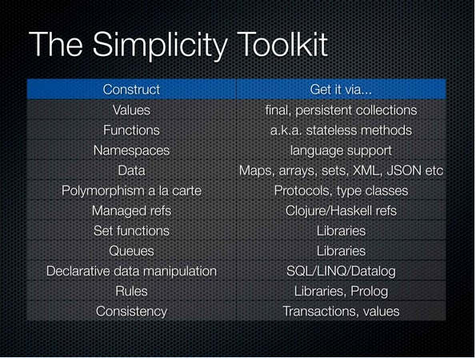

All right, so if you take away two things from this talk, one would be the difference between the words simple and easy. The other, I would hope, would be the fact that we can create precisely the same programs we're creating right now with these tools of complexity with dramatically drastically simpler tools. I did C++ for a long time. I did Java. I did C#. I know how to make big systems in those languages, and I completely believe you do not need all that complexity. You can write as sophisticated a system with dramatically simpler tools, which means you're going to be focusing on the system, what it's supposed to do, instead of all the gook that falls out of the constructs you're using.

So I'd love to say the first step in getting a simpler life is to just choose simpler stuff. Right? So if you want values, usually you can get it. Most languages have something like values. Final or val, you know, let's you, like, declare something as being immutable. You do want to find some persistent collections because the harder thing in a lot of languages is getting aggregates that are values. You've got to find a good library for that or use a language where there's the default.

[Audience laughter]

Functions, most languages have them. Thank goodness. If you don't know what they are, they're like stateless methods.

[Audience laughter]

Namespaces is something you really need the language to do for you and, unfortunately, it's not done very well in a lot of places. Data: Please! We're programmers. We're supposedly write data processing programs. There are always programs that don't have any data in them. They have all these constructs we put around it and globbed on top of data.

Data is actually really simple. There are not a tremendous number of variations in the essential nature of data. There are maps. There are sets. There are linear, sequential things. There are not a lot of other conceptual categories of data. We create hundreds of thousands of variations that have nothing to do with the essence of this stuff and make it hard to write programs that manipulate the essence of the stuff. We should just manipulate the essence of the stuff. It's not hard. It's simpler.

Also, the same thing for communications. Are we all not glad we don't use the Unix method of communicating on the Web? Right? Any arbitrary command string can be the argument list for your program, and any arbitrary set of characters can come out the other end. Let's all write parsers.

[Audience laughter]

No, I mean it's a problem. It's a source of complexity. So we can get rid of that. Just use data.

The biggest thing, I think, the most desirable thing, the most esoteric, this is tough to get, but boy when you have it your life is completely, totally different thing is polymorphism a la carte. Clojure protocols and Haskell-type classes and constructs like that. Give you the ability to independently say I have data structures, I have definitions of sets of functions, and I can connect them together, and those are three independent operations. In other words, the genericity is not tied to anything in particular. It's available a la carte. I don't know of a lot of library solutions for languages that don't have it.

I already talked about manage references and how to get them. Maybe you can use closures from different Java languages.

Set functions, you can get from libraries. Queues, you can get from libraries. You don't need special communication language.

You can get declarative data manipulation by using SQL or learning SQL, finally. Or something like LINQ or something like Datalog.

I think these last couple of things are harder. We don't have a lot of ways to do this well integrated with our languages, I think, currently. LINQ is an effort to do that.

Rules, declarative rule systems, instead of embedding a bunch of conditionals in our raw language at every point of decision, it's nice to sort of gather that stuff and put it over someplace else. You can get rule systems in libraries, or you can use languages like Prolog. If you want consistency, you need to use transactions, and you need to use values. There are reasons why you might have to get off of this list, but, boy, there's no reason why you shouldn't start with it.

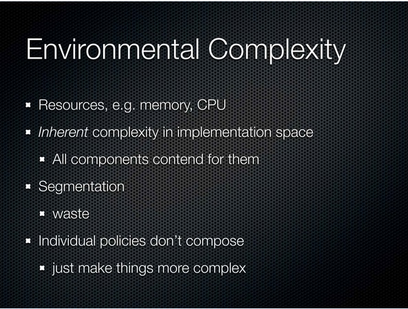

Okay. There's a source of complexity that's really difficult to deal with, and not your fault. I call it environmental complexity. Our programs end up running on machines next to other programs, next to other parts of themselves, and they contend; they contend for stuff: memory, CPU cycles, and things like that.

Everybody is contending for it. This is an inherent complexity. Inherent is Latin for not your fault. In the implementation space and, no, this is not part of the problem, but it is part of implementation. You can't go back to the customer and say the thing you wanted is not good because I have GC problems. But the GC problems and stuff like that, they come into play.

There are not a lot of great solutions. You can do segmentation. You can say this is your memory, this is your memory, this is your memory, this is your CPU and your CPU. But there's tremendous waste in that, right, because you pre-allocate. You don't use everything. You don't have sort of dynamic nature.

But the problem I think we're facing, and it's not one for which I have a solution at the moment, is that the policies around this stuff don't compose. If everybody says, "I'll just size my thread pool to be the number of," you know, of course. How many times can you do that in one program? Not a lot and have it still work out.

So, unfortunately, a lot of things like that, splitting that stuff up and making it an individual decision, is not actually making things simpler. It's making things complex because that's a decision that needs to be made by someone who has better information. And I don't think we have a lot of good sources for organizing those decisions in single places in our systems.

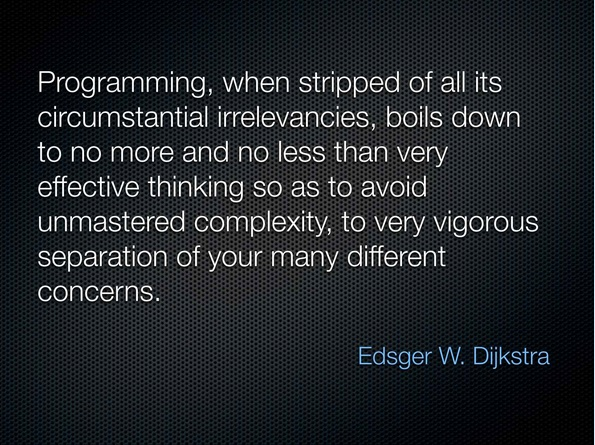

This is a hugely long quote. Basically, it says programming is not about typing, like this [gestures of typing on a keyboard]. It's about thinking.

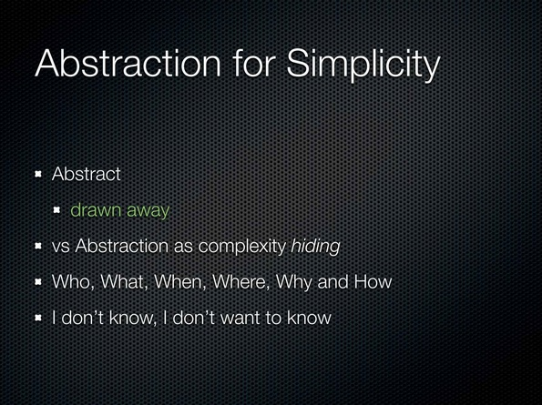

So the next phase here--I've got to move a little bit quicker--is how do we design simple things of our own? So the first part of making things simple is just to choose constructs that have simple artifacts. But we have to write our own constructs sometimes, so how do we abstract for simplicity? An abstract, again, here's an actual definition, not made up one. It means to draw something away. And, in particular, it means to draw away from the physical nature of something.

I do want to distinguish this from, that sometimes people use this term really grossly to just mean hiding stuff. That is not what abstraction is, and that's not going to help you in this space.

There are two -- you know, I can't totally explain how this is done. It's really the job of designing, but one approach you can take is just to do who, what, when, where, why, and how. If you just go through those things and sort of look at everything you're deciding to do and say, "What is the who aspect of this? What is the what aspect of it?" This can help you take stuff apart.

The other thing is to maintain this approach that says, "I don't know; I don't want to know." I once said that so often during a C++ course I was teaching that one of the students made me a shirt. It was a Booch diagram because we didn't have whatever it is now, the unified one. And every line just said that. That's what you want to do. You really just don't want to know.

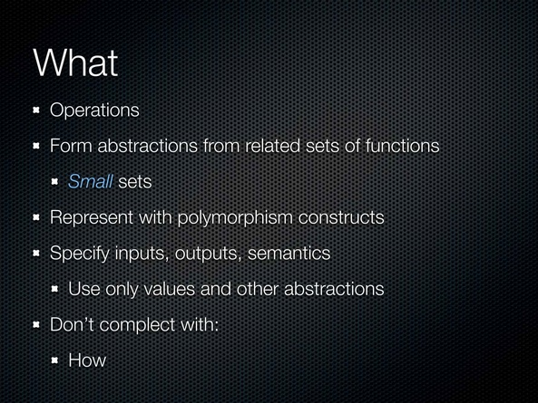

All right, so what is what? What is the operations. What is what we want to accomplish. We're going to form abstractions by taking functions and, more particularly, sets of functions and giving them names. In particular -- and you're going to use whatever your language lets you use. If you only have interfaces, you'll use that. If you have protocols or type classes, you'll use those. All those things are in the category of the things you use to make sets of functions that are going to be abstractions. And they're really sets of specifications of functions.

The point I'd like to get across today is just that they should be really small, much smaller than what we typically see. Java interfaces are huge, and the reason why they are huge is because Java doesn't have union types, so it's inconvenient to say this function takes, you know, something that does this and that and that. You have to make a this and that and that interface, so we see these giant interfaces. And the thing with those giant interfaces is that it's a lot harder to break up those programs, so you're going to represent them with your polymorphism constructs.

They are specifications, right? They're not actually the implementations. They should only use values and other abstractions in their definitions. So you're going to define interfaces or whatever, type classes, that only take interfaces and type classes or values and return them.

And the biggest problem you have when you're doing this part of design is if you complect this with how. You can complect it with how by jamming them together and saying here is just a concrete function instead of having an interface, or here's a concrete class instead of having an interface. You can also complect it with how more subtly by having some implication of the semantics of the function dictate how it is done. Fold is an example of that.

Strictly separating what from how is the key to making how somebody else's problem. If you've done this really well, you can pawn off the work of how on somebody else. You can say database engine, you figure out how to do this thing or, logic engine, you figure out how to search for this. I don't need to know.

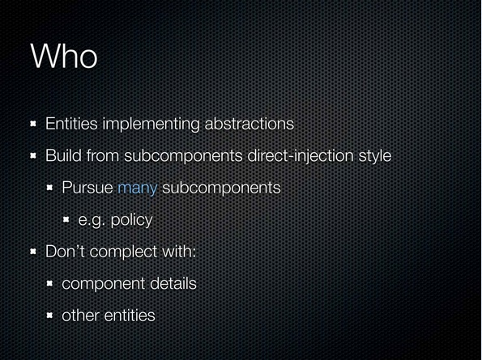

Who is about, like, data or entities. These are the things that our abstractions are going to be connected to eventually depending on how your technology works. You want to build components up from subcomponents in a sort of direct injection style. You don't want to, like, hardwire what the subcomponents are. You want to, as much as possible, take them as arguments because that's going to give you more programmatic flexibility in how you build things.

You should have probably many more subcomponents than you have, so you want really much smaller interfaces than you have, and you want to have more subcomponents than you probably are typically having because usually you have none. And then maybe you have one when you decide, oh, I need to farm out policy. If you go in saying this is a job, and I've done who, what, when, where, why, and I found five components, don't feel bad. That's great. You're winning massively by doing that. You know, split out policy and stuff like that. And the thing that you have to be aware of when you're building, you know, the definition of a thing from subcomponents is any of those kind of, you know, yellow thinking about blue, blue thinking about yellow kind of hidden detail dependencies, so you want to avoid that.

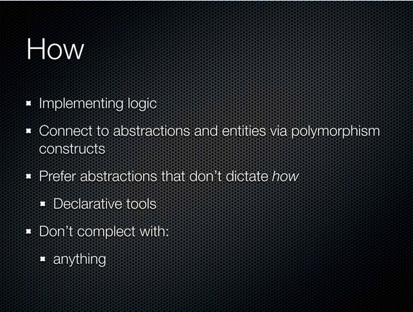

How things happen, this is the actual implementation code, the work of doing the job. You strictly want to connect these things together using those polymorphism constructs. That's the most powerful thing. Yeah, you can use a switch statement. You could use pattern matching. But it's glomming all this stuff together.

If you use one of these systems, you have an open polymorphism policy, and that is really powerful, especially if it's runtime open. But even if it's not, it's better than nothing. And again, beware of abstractions that dictate how in some subtle way because, when you do that, you're really, you're nailing the person down the line who has to do the implementation. You're tying their hands. So the more declarative things are, the better, the better things work. And the thing that -- I mean, how is sort of the bottom, right? Don't mix this up with anything else. All these implementations should be islands as much as possible.

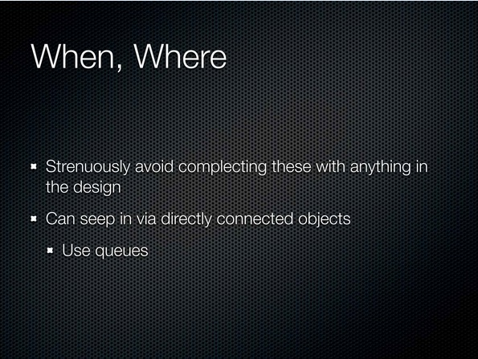

When and where, this is pretty simple. I think you just have to strenuously avoid complecting this with anything. I see it accidentally coming in, mostly when people design systems with directly connected objects. So if you know your program is architected such that this thing deals with the input and then this thing has to do the next part of the job. Well, if thing A calls thing B, you just complected it. Right? And now you have a when and where thing because now A has to know where B is in order to call B, and when that happens is whenever A does it.

Stick a queue in there. Queues are the way to just get rid of this problem. If you're not using queues extensively, you should be. You should start right away, like right after this talk.

[Audience laughter]

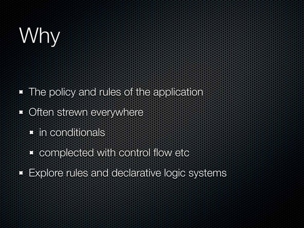

And then there's the why part. This is sort of the policy and rules. This is -- I think this is hard for us. We typically put this stuff all over our application. Now if you ever have to talk to a customer about what the application does, it's really difficult to sit with them in source code and look at it.

Now, if you have one of these pretend testing systems that lets you write English strings so the customer can look at that, that's just silly. You should have code that does the work that somebody can look at, which means to try to, you know, put this stuff someplace outside. Try to find a declarative system or a rule system that lets you do this work.

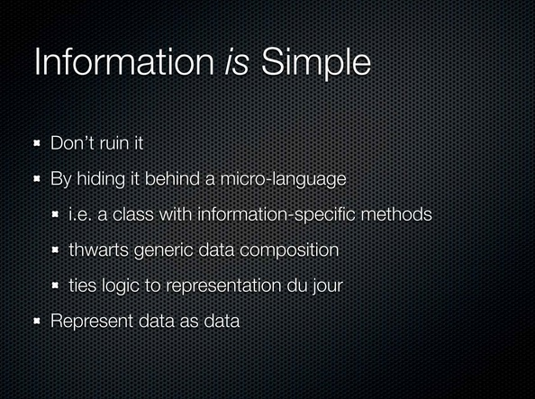

Finally, in this area, information: it is simple. The only thing you can possibly do with information is ruin it.

[Audience laughter]

Don't do it! Right? Don't do this stuff. I mean, we've got objects. Objects were made to, like, encapsulate IO devices, so there's a screen, but I can't, like, touch the screen, so I have the object. Right? There's a mouse. I can't touch the mouse, so there's an object. Right? That's all they're good for. They were never supposed to be applied to information. And we apply them to information that's just wrong.

It's wrong. But I can now say it's wrong for a reason. It's wrong because it's complex. In particular, it ruins your ability to build generic data manipulation things. If you leave data alone, you can build things once that manipulate data, and you can reuse them all over the place, and you know they're right once and you're done.

The other thing about it, which also applies to ORM is that it will tie your logic to representational things, which again tying, complecting, intertwining. So represent data is data. Please start using maps and sets directly. Don't feel like I have to write a class now because I have a new piece of information. That's just silly.

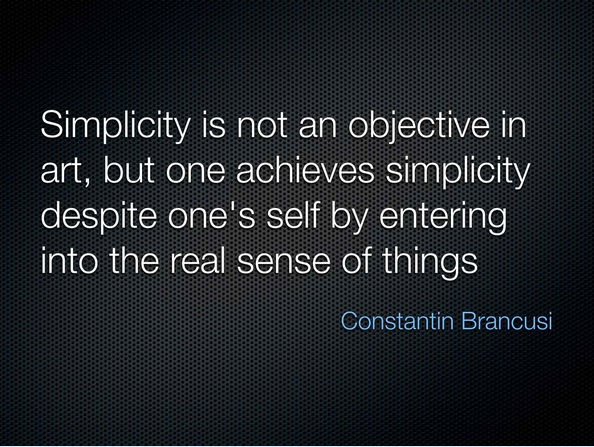

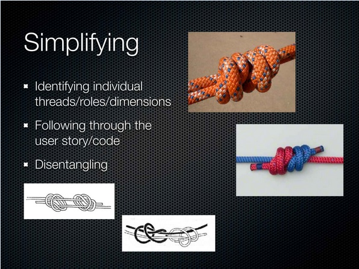
So the final aspect, right, so we choose simple tools. We write simple stuff. And then sometimes we have to simplify other people's stuff. In particular, we may have to simplify the problem space or some code that somebody else wrote. This is a whole separate talk I'm not going to get into right now. But the job is essentially one of disentangling, right? We know what's complex. It's entangled. So what do we need to do? We need to somehow disentangle it.

You're going to get this. You're going to need to first sort of figure out where it's going. You're going to have to follow stuff around and eventually label everything. This is the start. This is roughly what the process is like. But again, it's a whole separate talk to try to talk about simplification.

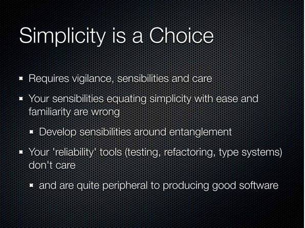

All right, I'm going to wrap up a couple of slides. The bottom line is simplicity is a choice. It's your fault if you don't have a simple system. And I think we have a culture of complexity. To the extent we all continue to use these tools that have complex outputs, we're just in a rut. We're just self-reinforcing. And we have to get out of that rut. But again, like I said, if you're already saying, "I know this. I believe you. I already use something better. I've already used that whole right column," then hopefully this talk will give you the basis for talking with somebody else who doesn't believe you.

Talk about simplicity versus complexity. But it is a choice. It requires constant vigilance. We already saw that guardrails don't yield simplicity. They don't really help us here.

It requires sensibilities and care. Your sensibilities about simplicity being equal to ease of use are wrong. They're just simply wrong. Right? We saw the definitions of simple and easy. They're completely different things. Easy is not simple.

You have to start developing sensibilities around entanglement. That's what you have to -- you have to have entanglement radar. You want to look at some software and say, uh! You know, not that I don't like the names you used or the shape of the code or there was a semicolon. That's also important too. But you want to start seeing complecting. You want to start seeing interconnections between things that could be independent. That's where you're going to get the most power.

All the reliability tools you have, right, since they're not about simplicity, they're all secondary. They just do not touch the core of this problem. They're safety nets, but they're nothing more than that.

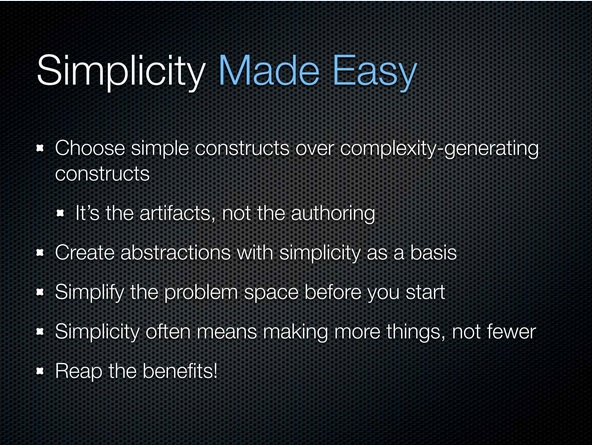

So, how do we make simplicity easy? Right? We're going to choose constructs with simpler artifacts and avoid constructs that have complex artifacts. It's the artifacts. It's not the authoring. As soon as you get in an argument with somebody about, oh, we should be using whatever, get that sorted out because, however they feel about the shape of the code they type in is independent from this and this is the thing you have to live with.

We're going to try to create abstractions that have simplicity as a basis. We're going to spend a little time upfront simplifying things before we get started. And recognize that when you simplify things, you often end up with more things. Simplicity is not about counting. I'd rather have more things hanging nice, straight down, not twisted together, than just a couple of things tied in a knot. And the beautiful thing about making them separate is you'll have a lot more ability to change it, which is where I think the benefits lie. So I think this is a big deal, and I hope everybody is able to bring it into practice or use this as a tool for convincing somebody else to do that.

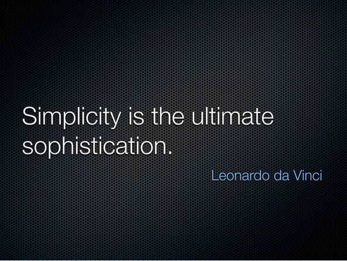

So I'll leave you with this. This is what you say when somebody tries to sell you a sophisticated type system.

[Audience laughter]

Thank you.

[Audience applause]
