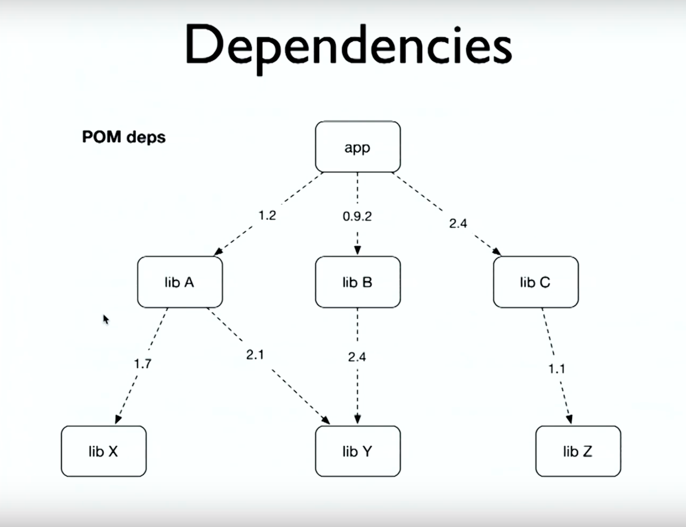
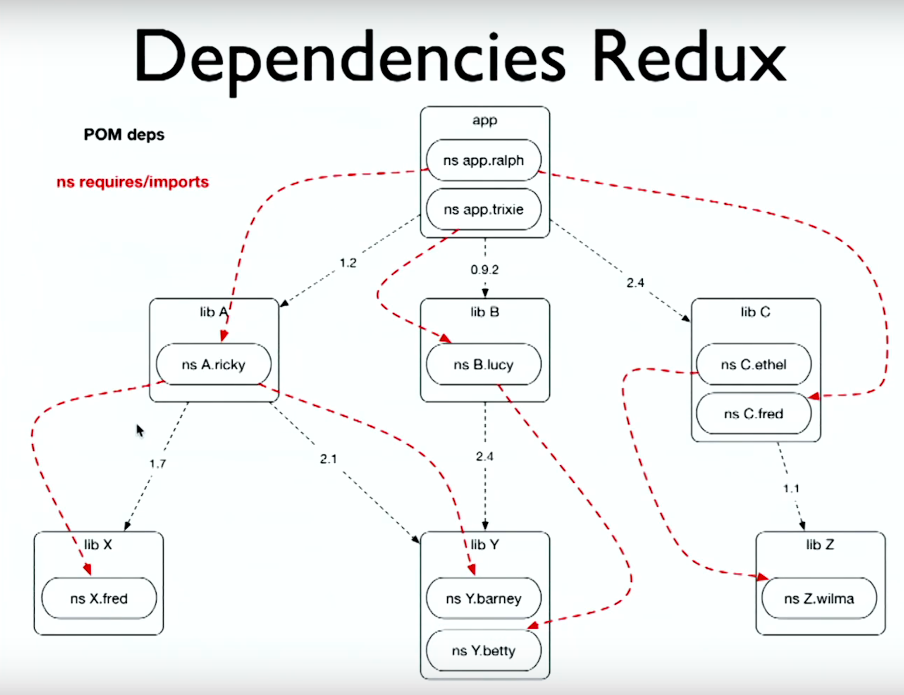
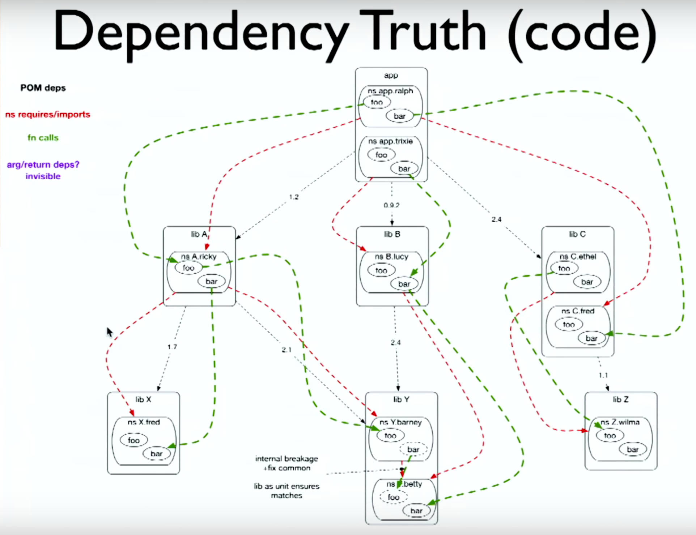

# Spec-ulation

* **Speaker: Rich Hickey**
* **Conference: [Clojure/Conj 2016](http://2016.clojure-conj.org) - Dec 2016**
* **Video: [https://www.youtube.com/watch?v=oyLBGkS5ICk](https://www.youtube.com/watch?v=oyLBGkS5ICk)**

```
slide title: Spec-ulation

Rich Hickey
```

Hi.  Once again, it is fantastic to come to the Conj and see
everybody.  Old friends, and all the new faces, and everybody being so
happy.  That is really great.  It is just so important to revisit the
fact that the community is a positive one that is full of optimistic
people, or crazy people, who are willing to try this new stuff, and do
things in a way that is different.  And to help out other people who
are similarly optimistic or crazy.

So this talk is called spec-ulation, and that is just a way of
covering the fact that it is a rant.


[Time 0:00:57]

```
slide title: This is not a talk about
                       _spec_

+ It is a talk about what spec is _about_

  + Giving something to someone that they
    can _use_

  + Making a _commitment_

    + i.e. not taking it away later
```

So I think we have a few talks about spec, and there was a spec
workshop.  So this is not a talk about spec.  It is not a tutorial
about spec.  It is not about the tech of spec, sort of, in any way.

But it is very much a talk about what spec is _about_, because I am
not sure, when you look at spec, and especially when you hear a talk
-- and you see it can do this!  And it is a floor wax!  And it is a
dessert topping! -- that it is evident, necessarily, particularly that
some of the design decisions are pointed at these two things, which
seem to not say very much at all.

One is that spec is about being able to give something to someone so
that they can use it.  And the important thing about that word "use"
is that it is sort of like a positive thing: here is something that
you can use.  As opposed to: here are some rules that you have to
follow.  So you want to be able to give people things that they can
use.  And Stu talked about getting a piece of code that had no
documentation, or insufficient documentation, and wondering: what
should these maps be?  What are the keys?  And things like that.  So
it is hard to use that without more of a description.  So it is about
that.

But the other side of it -- and again, this is not about you, the
user, doing something wrong, it is about me, the provider, saying, "I
am going to make a commitment.  This is the way this thing works."
And in particular, commitment means, "And I am not going to take that
away later."  So I want to emphasize that today.


[Time 0:02:46]

```
slide title: Change

Is it a thing?
```

And spec is designed around that.  And that is sort of part of a
bigger problem, which is change.  It is interesting to look at spec
and say, "spec is about doing this this way, or doing that that way,
or providing these things."  But spec is really about being able to
change later.  A lot of what spec is, is oriented towards changing
things later.

But it is an important question, because I had a conversation just
today where the word "change" was used a ton of times, and we use the
word "change" to sort of cover a lot of things that happen in software
development.  And one question we need to answer is "Is this a thing?"
And if it is a thing, is it a thing that we want in our software
development lives?"


[Time 0:03:35]

```
slide title: 'Change'

+ Origin:

  + from Latin cambire "to exchange, barter"

+ You could change a cow into wheat!

  + c.f. Eurogames

+ One-sided change is... theft?

  + Anti-social at least

+ Productivity and soul-crushing at worst
```

So of course, I do not think this has happened yet today.  I am
surprised, but here we go, the mandatory definition of a word.  I was
very surprised by this.  Everybody said, before I do my talk I go to
Wikipedia to make sure I do not say something obvious, or obviously
wrong.  So I go to the dictionary and the definition for "change" is
sort of circular, in that one of these two words has the word "change"
in it as well.

But the origins of the word were actually exchange.  It was about
barter, right?  You can turn a cow into wheat.  How many people play
Eurogames?  Oh, come on!  Well, you know you can turn cows into wheat,
and wheat into wood, and wood into stone.  Apparently these things
lead to great success in the Middle Ages.

So that is not transmutation, right?  That is not stuff changing in
place.  That is exchanging stuff.  And when you think about it that
way, you can say, well what does it mean to just change something
without somebody's permission, or cooperation, or participation?  One
way to say it is that you just took something from them.  But at least
it is not something that is nice.  But I think that in practice, we
have things changed on us, and we experience this last line.  How many
people have ever chased down dependency problems?  How many people
enjoyed that?  OK.


[Time 0:05:12]

```
slide:

We want our software (esp.
libraries/services) to be
different/better tomorrow.

What will that mean for our
consumers?
```

So what are we going to do?  It is not like software should be
immutable.  That is not the thing, but how do we move it forward?  So
I would like to find some different words than "change" in this
particular case.  How do we make it better and different tomorrow, in
a way that our consumers can tolerate?  Or at least can we consider
that when we make it better?


[Time 0:05:40]

```
slide title: Dependencies
```


So we all know how we do change.  We use Maven, or something that
drives Maven.  And we have artifacts, which are libraries.  And our
application says, "I want to use these libraries: A, B, and C".  And
these are the versions I want.  And then library A says, "Oh, but I
need library X to work, and this is the version I want.  And I need
library Y to work, and this is the version I want."  Library B says,
"I also need library Y, and I want a different version."  And library
C says, "I want library Z."

So we have a little conflict here: 2.1 and 2.4.  I do not know if you
can read that.  You can imagine what it says.  Something that is in
conflict.  And then Maven has some rules that automatically make this
work.  Usually it will pick the later thing.  2.4 it is.  And this
tree, our immediate dependencies, and the transitive dependencies, are
the things we need to have our program run, right?

You all know better than to answer yes/no rhetorical questions with a
"yes".  No.  No.


[Time 0:06:58]

```
slide:

       But...

+ Artifacts don't actually _use_ other artifacts

+ There is nothing in the _code_ about artifacts
```

So the first thing is that artifacts do not use anything.  A library
does not use a library at that level, because artifacts are not doing
anything.  They are just packages.  So they do not use the other
artifacts.  They have these lists of them for various reasons we will
talk about.

The other thing is: there is nothing in the code, at least in Clojure,
and I think in most languages that use this infrastructure, there is
nothing in the _code_ about these artifacts.

These are the two things to know.

So what does your application actually need?


[Time 0:07:42]

```
slide title: Dependencies Redux
```


And so we will look at this problem again, and we have expanded it a
little bit.  So when we look inside each of those artifacts, what do
we see?  If they are Clojure artifacts, we see namespaces.  I give you
this JAR, it has got a bunch of namespaces in it.  Were it Java code,
there would be packages in there.  But it is the same kind of thing,
namespaces, packages.

So there are a bunch of them.  And in fact our app is decomposed
similarly, right?  Our app starts with a couple of namespaces that we
wrote in our application space.  Now those namespaces do say
"requires".  So my app ralph namespace requires a ricky namespace.
And my app ralph namespace requires C fred namespace.  And app trixie
requires B lucy.

And that is in code.  That is nice.  So we can see it in our program
at least.

And then we go down and we say A ricky needs Y barney.  Somebody else
had some names this morning.  Paula did.  These are different TV
shows, apparently.  So we have barney and wilma.  And for anybody who
has good eyesight.

So this is the truth, right?  This is the actual namespace requiring
namespace, or importing package.  And now this is in code, and these
are the actual connections between the things.  Right?

Well, anybody with good eyesight, what can you tell about this right
now, already, about our app needing X, Y, and Z?

We don't need Z, right?  Only ethel uses Z, and the app does not use
ethel.  Hmmm.


[Time 0:09:46]

```
slide:

         But...

+ Namespaces/packages don't actually _use_
  other namespaces/packages

+ At least require/import appear in the
  code

+ Where is the mapping to artifacts?
```

So it is actually the same thing, right?  Namespaces are not code.
They do not _do_ anything.  Well, namespaces could be effect-ful, so
you could require something for a side effect.  But if we set that
aside, the namespace declaration that says require is not actually
trying to accomplish anything itself.  So they do not really use that.
We like the fact that we can see this in the code.

But we have this other niggling -- I would hope niggling -- problem
with this, which is that: how do we know which namespaces are in which
artifacts?  Are in which JARs?  Yeah, I do not know.  Somebody tells
us, right?  We meet somebody on the street who says, "Did you try this
JAR, man?  It has got fred in it.  I am loving it."

No, really, there is not a place where we keep this.  So that is a
problem.


[Time 0:10:46]

```
slide title: Dependency Truth (code)
```


So what is the truth?  The truth is, you need better and better
eyesight to solve this problem.  So we open it up a little bit more,
and we look inside ralph.  And we see that ralph actually has
functions in it.  There is a function foo inside our app in our ralph
namespace.

And we also see the beauty of namespaces here, because I just got
tired of making up new names, and I did not want to get into TV shows,
so every namespace has a foo and a bar function, but they are conflict
free!  Because namespaces are awesome.

So ralph foo calls ricky foo, and ricky foo calls barney foo, and
ricky bar calls fred bar, and so on and so forth.  These are the
actual calls that are made.  These are the _actual_ dependencies,
right?  Code that needs to run needs other code in order to work.
That is the truth.

So we can also see that, because those calls are evident.  But one
thing that is not evident.  There are no purple lines, but in the
legend there is purple, which is that we depend, for instance, we see
that ralph foo depends on ricky foo, the function, to exist, but there
are other details about that call, right?  What does ralph foo pass to
ricky foo?  Well maybe that changes over time.  I do not really know.
What does ricky foo return to ralph foo, and all callers?  Well maybe
that changes over time.  That stuff is invisible, right?  Because
maybe you start consuming it tomorrow.  It is very subtle what you use
of the return values, especially when we start returning maps.

And then for people with really excellent eyesight, what else do we
discover now from this?  We do not need X.  Right?  ralph foo calls
ricky foo.  It never calls ricky bar, and ricky bar was the only thing
that needed X.  So this is already like not great.  Our dependency
tree is not really reflecting our actual needs.

Another thing that is going on here in the bottom, and I am not going
to talk too much about it, except to say that there are also internal
calls.  So inside library Y, barney bar calls betty foo.  That needs
to match, but nobody can see that in the direct tree, necessarily.
But we do want to make sure that those things match.

And that is one of the "advantages" of pulling in an entire library,
is that you know the stuff will match.  Even if you are getting way
more stuff than you need, whatever stuff you need should match.


[Time 0:13:45]

```
slide title: Do deps Force Versioning?

"What you can do is let Semantic Versioning provide you
with a sane way to release and upgrade packages without
having to roll new versions of dependent packages"

http://semver.org/spec/v2.0.0.html

+ Is that what happens?

+ Often, no, cascading version bumps

  + to let root 'know' about improvements to
    leaves, even if path nodes' code unchanged

  + level violation
```

So this is not great, but supposedly this is not a problem.  One of
the reasons why is because we have semantic versioning.  And in the
semantic versioning spec -- which has been versioned, by the way.  And
I had to walk through like a ton of diffs to see what had changed over
time, mostly I guess because I do not know how to use Git, but there
was not a summary of what is different between the two things.

But it has been versioned.  And of course when you start versioning
your versioning ... [holds up hands in what could be interpreted to
mean "I don't know what is going on here"]

But supposedly we have these rules?  We have major versions, and if
the major version does not transition, we have this implication that
it should still work.

Is this what happens in practice?  Has anybody ever bumped a dep in
order to make a library visible to an application?  Yeah?  Everybody,
at some point, has done this?  Yes!  This is the answer.  Yes, we all
do this.  It is OK.  Yes.

No.  This is not what happens.  We are bumping versions all of the
time.  Something we use is better somehow in a way that our code does
not care, and it does not change our code at all, we get our new dep.
It changes our name.  It changes the name of the thing that talks to
us.  And so on, and so on, and so forth.

This is a lie.  This cascading version bumping happens all the time.
We are just trying to communicate through this palm tree, through this
thing.

And I will call this a level violation.  And we are going to talk
about levels.


[Time 0:15:27]

```
slide title: Names, Levels, Scopes,
                   Contexts

+ fns depend on (call) fns by _name_

+ ns/packages/ requires/includes set up a
  _context_ in which those calls can succeed

+ Artifact deps/poms set up a _context_ in
  which those requires can succeed

+ fn name scopes include ns _but not artifact_

  + artifact context is _MAGIC_
```

So what is actually happening?  Well there is a stratification of
problems here.

If we start at the bottom, this call truth, we know that functions
call other functions by name.  And it is clear ... In fact, if you
just treated the namespace declarations as aliasing, forget about code
loading, if they were just aliasing, they tell you enough.  They would
tell an analysis tool enough to know, when you said "foo" over here,
you were talking about ricky's foo, and therefore you need to know
about ricky's foo.  The actual "requires" is just creating an
execution context in which that call will work.  That the code for
ricky's foo will be available.  And that requires will do that.  It
will also make a whole bunch of other code you do not call available,
but we know it will cover your need, so we put that in our code.  So
it creates a context.

If we go up a another level to the artifacts, the same thing is
happening.  Those palms are saying, "I need these other libraries."
They create a context in which those requires are going to succeed.
That this thing requires this other library, this other namespace,
that will be there because somebody on the street told us that if I
use this JAR, fred will be there, and therefore it will work.

But the problem that is really broken is at this last level -- the
person on the street told us to do this -- is pure magic.  There is
nothing in code about this thing, and that is going to come back
later.

So we now understand the levels: functions calling functions,
namespace requires, artifacts.


[Time 0:17:18]

```
slide title: Basis

+ Why put things in our deps/pom?

  + We need access to libs while developing

  + Maven chases transitive deps

  + Incorporated in artifact to communicate
    needs to our consumers

  + "we tested against x.y.z" [strikethrough style on that whole line]

+ But, coarse-grained, implies too much

  + doesn't capture actual deps, just context
```

So why do we do this?  What is this doing for us?  I do not think it
is just inherently terrible, but what is happening?  Can we
disentangle what we are trying to say?

So why do we put things in our deps, or POM, or project file, at all?

And one is that we need the code when we are working.  We are writing
our app.  We are not writing this library.  It used to be, before we
had deps, that we would download JARs, and we would make classpaths
ourselves, and say, "use this classpath".  It actually was not worse
than this, to be honest with you, because there is something about a
list that you made, and you know what is in it, and you know what is
not in it, and you know what it says, that is somewhat -- well, it is
certainly more tangible.

But it is somewhat more reliable than this next point, which is that:
what is also nice is we conveniently say we needed A, B, C, and the
fact that X, Y, and Z were needed was just solved for us.  Maven will
nav through the transitive dependencies and pull everything else in.
So there is an ease factor to point two here.

The other thing we do with these deps, or the POM, is that we turn
around, or our build turns around, and propagates them into our
artifacts, so that Maven can do this with our stuff.  Can continue to
nav down.  And let somebody who uses us.  And in particular, when I am
talking about "us" today, I am mostly talking about when we write
libraries.  When you are the consuming app it is somewhat different,
and I will talk about that later.  But in particular, when we are
writing libraries, so we are writing A, B, or C, we use X.  We need
that in our POM, so someone who uses us gets X in addition to us, so
the whole ease thing and stuff works.

So that is why we do it.  I think one of the things people _imagine_
happens from putting in this project file is: we give some integrity
promise.  We make some integrity promise about: we have tested our
library against this thing.  I do not care, because the chances of me
running against the thing you tested against are slim in the end.  And
we will talk about that later.  I think that is a non-benefit.  You
imagine it, but it is not true.

But again, the problem is that this is coarse grained.  These things
do not tell us what is actually happening, and they just create a
context.


[Time 0:19:48]

```
slide title: (Ex)changes in Software

+ What is _required_?

  + fn - args

  + ns - var names

  + artifact - ns/package names/paths

+ What is _provided_?

  + fn - ret (proc/service effect)

  + ns - vars/fns

  + artifact - namespaces/packages
```

So what I would like to talk about is: how we talk about change.
Because I have mentioned things change, and then we are going to
change versions, or get new versions.  But I want to disentangle this.

And I think that you can boil down all change into this kind of
language, which is, if I am making a library, I may make requirements
of the users of my stuff.  So what do I require?

If I am writing a function, what I require are the arguments.  You
have to pass me arguments.

If I am a namespace, what do I require?  Just names, right?  A
namespace is sort of like a lookup.  You give me this name, I give you
this var, or the function, the thing in it.

Go up a level again.  What do artifacts require?  If I give you a JAR,
what are you going to do?  You are similarly going to look for stuff
in there, with either a name or a path, you are going to find the
actual class file or clj file, given some name.  So there is a sense
in which namespaces and artifacts are just functions of names to
stuff.  A namespace is a function of a name to a var or function.  An
artifact is a function of a name to a namespace or package.

Then you can flip it around, and you can say: what does a library
provide?

A function provides its return.  If you gave me what I required, I
will provide to you this result.  And of course I would like to
broaden this discussion to include services and procedures, and things
like that.  So if your thing is effectful, one of the things you
provide is that effect.  If you call this thing with these arguments,
the thing will be in the database, or I will send an email for you, or
some other thing.

What does a namespace provide?  It is just a lookup.  You give it a
name, it gives you the var or function.

What does an artifact provide?  You gave it the name, it is going to
provide you with the class files, the packages, this kind of stuff.

So that is how we exchange things.


[Time 0:22:11]

```
slide title: Growing Your Software

+ Accretion

  + provide more

+ Relaxation

  + require less

+ Fixation

  + bash bugs
```

So what I will say is that you can now look at the kinds
categorically, the kinds of changes you would make in these ways.  The
first is this idea of growing your software.  Your software is going
to do more.

The first thing is just accretion.  What happens when you accrete?
You say: I am going to provide you more.  You were giving me seven
before, and I gave you back 42, and now I am going to give you back 42
and some wheat.  More stuff.

So this is not a lightweight use of this word provide.  I mean very
specifically we need to say the words provide and require.  So we are
going to provide more.  That is straight accretion.

The other thing is relaxation.  It used to be you give me two wheat
and a donkey, and I will give you some steel.  And now, I do not need
the donkey.  Just give me wheat and I will give you steel.  So I
require less.  That is a relaxation on my part.

And there is a nice Zen-like thing of saying the less you need, the
more you are growing.

It is a ... well, whatever.  I will not push that.  I am not that
touchy feely.

And the other is fixation.  And this is another cool thing.  I looked
up "fixation", and it actually means to fix things.  It does not mean
to be paranoid.  So then the final thing is just fixing stuff, which
does not impact what you provide or require.  It just means you are
now doing it correctly, or maybe faster, or maybe with fewer
requirements.  You know, fewer dependencies, or something else.  But
whatever.  It does not impact what you provide or require.


[Time 0:24:14]

```
slide title: Breaking Your Software

+ Require more

+ Provide less

+ Unrelated stuff under same name
```

Because again, this blanket concept of change, it also is used,
casually in conversation, to talk about these things, which is
breaking your software.  How do you break your software?

You require more.  Oh, that two wheat and a donkey?  It is not enough.
I want gold, too, and a ruby, and then you will have steel.

And it is sort of evident.  We use bigger sentences to mean, "I broke
you" and "it is incompatible", or something like that.  But we should
be using these small things.  I just require more.  If you require
more, then somebody who is giving you less now is not going to get
what they want.  It is not going to work for them.  It is broken.

The flip side is, you are providing less.  Well I was giving you
steel, and now I am going to give you tin.  And good luck with your
building.  So you are providing less.  You are returning less than
what you promised previously.

The other sort of categoric "why are you doing this?" is just
changing.  You know, we were calling that "trade", and now we would
like "trade" to mean something completely different, so we are just
going to use it for something else.  And so if you were calling
"trade" -- it is like the classic thing.  If you have homophones, or
something straight out like "draw".  Drawing pictures.  We used to
draw pictures for you, and now we draw guns for you.  Just the
semantics are shot.  It is a complete do over.


[Time 0:25:55]

```
slide: Change is Not a Thing

+ It's one of _two_ things

  + Growth

  + Breakage

+ In the small (fns), _spec_ can help us
  determine which, prevent breaking specs

+ As long as we don't try to do something
  silly like _versioning_ specs!
```

So the thing here is that change is _not_ a thing.  We should not
really be saying, "I changed it".  Because you are telling me nothing
when you say that.  You are telling me nothing, because I just
described two ...

[goes back to "Growing Your Software" slide]

This is great.  I like this.  I am happy to give you less.  I like the
new gold you are giving me.  Awesome, awesome sauce.

[moves to "Breaking Your Software" slide]

Here I am really angry at you.  This is not good.

[back to "Change is Not a Thing" slide]

So calling it change is just not useful.  We need to talk about one of
two things.  It either grew or it broke.  There is growth and there is
breakage.

So one of the things that spec is designed to do is to help us
understand, and maybe even programmatically detect, when we have
accidentally broken something, when we just intended to grow it.  And
I make an argument for growing it in a minute.  But that is an
important part.  So that is why spec uses set logic for maps, and uses
regexes for sequential syntax, is because there is already logic for
determining growth-like compatibility of those two things.  There is
already math for that stuff.

So it is not just going to be this "I promise you" kind of used car
dealer thing.  We can run a program and maybe determine this.  We do
not have those programs yet for spec, but spec is designed to support
them being written.

So that helps us in the small, as long as we do not do something like
try to version specs.  Version 2.0 of the spec says you need to give
me gold now.  Do not do that.


[Time 0:27:56]

```
slide title: Recognizing Collections

+ You only 'change' a collection by adding/
  removing members

+ Adding = growth, removing = breakage

+ Namespaces - collections of vars/fns

+ Artifacts - collections of namespaces/packages

+ Don't conflate levels!

  + My family doesn't change when I put on a hat
```

So what about change in the large?  Well, the key thing here I would
say is that we need to start recognizing when things are collections,
because this is only two rules for collections.

If something is _just_ a collection, including an indexed collection
-- you give me the name, I give you a thing.  But that is still a
collection.  It is just an index keyed collection.  There are only two
operations.  There is adding stuff to the collection, or removing
stuff from the collection.  Adding stuff is growth.  Period.  It is
just easy.  It is just accretion.  And removing stuff is always
breakage.  Always.  Removing is breakage from a collection.

But the important thing is: when you look at software, you need to see
these collections.  Because the other problem we have all the time is:
we keep conflating changes at different levels.  And the versioning
system encourages that.

And namespace is just a collection of vars.  Artifacts are just
collections of namespaces or packages.  We need to see that.  spec
uses sets for maps.  It does not let you say what the keys mean.  For
this reason.  It is the same thing.  Maps are collections of keys.
They are not the stuff inside the keys.  If I put on a hat, it does
not change what my family is.  I am still a member of my family.  My
family contained these people before.  It stays the same people later.
I did not version my family when I put on a hat.

But we do this all of the time.  All the time.  We do not see this.
So you have to recognize collections.  So really all of the
interesting stuff happens at the leaves, and everything else is a
collection with these two rules.  Adding stuff fine, taking stuff away
is breaking.


[Time 0:29:52]

```
slide title: "Semantic" Versioning
                  "Semantics"

+ 1.2.changed

  + "you don't care"

+ 1.changed.0

  + "you don't care"

+ changed.0.0

  + "you're screwed"
```

All right.  Now we get really ranty.  Semantic versioning.  I looked
this up in the dictionary and it was not there.  What if we had
dictionary versioning?  There is sort of a fundamental problem with
this idea of semantic versioning, which is like "things mean what they
mean, until they do not mean what they mean".  This is helping me how?
I do not really see it.

So let us dig into the semantics promised by semantic versioning.  If
you change the patch part, you do not care as a consumer.  If you
change the minor version, you also do not care.  You just do not care.
These things, they have this great semantic: four is more than three.
That is it!  I am glad there is like a manifesto about this.

But what about the major component?  What does it mean?  It means you
are screwed.  Right?  That is the semantic of the major component.  It
is terrible.  It is an absolute catastrophe, because it does not tell
you in what way.  Right?


[Time 0:31:18]

```
slide title: Even worse...

+ "you might be screwed"

+ Considered covering of change at _all_ levels

  + Good luck determining where

+ Might just as well change the name
```

What it really says is "you might be screwed".  So if somebody says,
"you are screwed", you are like "oh, that is terrible.  Ugh."

If somebody says, "you might be screwed", you are like "oh, man".  It
is worse!  It is clearly worse.

And why is that?  It is because this level thing did not occur to the
people who did this.  Smash all of the levels together.  Any change,
anywhere, of anything that might be any of the things that we just
carefully pulled apart and said, "you are requiring more, you are
providing less". [gestures that it is all mashed together] It is this
big ugly thing, where anything could have happened, and we are just
telling you, "watch out!"  Watch out.

And I do not think that is useful.  I think Stu said it before, trying
to steal my thunder: you might as well just change the name.  Going to
2.0 is not helping anybody.


[Time 0:32:24]

```
slide:


Might just as well change
        the name
```


[Time 0:32:27]

```
slide:


MIGHT JUST AS WELL
_CHANGE THE NAME_
```

Yeah.  Just change the name.  I mean, what does it mean?  I mean, it
is just completely not meaningful to do this to somebody.  It just
isn't.  It is just like, "now we are playing a different game, and it
is called the same name.  Have a seat.  You do not know how it is
played.  You thought you did.  I predict you are going to lose."


[Time 0:32:52]

```
slide:

         But...

    that's not change,

    That's a new thing!

         Right.
```

And I think the thing is, you are like, "well then I am not changing
it."  That is a new thing!  Yeah.  That is exactly right.  It is a new
thing.


[Time 0:33:06]

```
slide title: Which Name?

      Levels again
```

So this raises the question of which name do you change?  Because we
just saw this smashing together up into the version of the artifact is
probably not good.  So if I am going to say to you, "change the name,"
I need to be able to answer this question: what name should I change?

Should I change the whole thing?  If I am requiring more in one of my
functions, should I change the artifact name to "new game"?


[Time 0:33:39]

```
slide title: Requiring More args?
            Providing Less on return?

+ i.e. incompatible spec

+ _New function_

  old-ns/foo-2 or new-ns/foo

+ N.B. - the namespace is part of the name

  + ns aliases can ease transitions
```

And no, it is the same thing, right?  You are going to go look at the
levels for providing, requiring.  So are you requiring more arguments,
or more from the arguments?  Or are providing less in your return?  We
recognized these things as breakage before.

Essentially, we are going to be able to say: this spec is
incompatible.  The spec for your revised function is incompatible.
And if it is, I want to see a new function.  And in Clojure you have
two ways to do that.  You can stay in the same namespace and you can
have foo-2.

Or maybe you made a systemic kind of change, so it is like: we have
been passing around this thing, and now I realize that everywhere in
our API we should be passing around two things.  Well just make API2
namespace.  You can keep all of the inner functions the same.  Which
is fine.  I mean, I know thinking of a good name is hard.  But
namespaces mean you can glom some different thing on the front and
have good name.  New place [new namespace name], good name [same
original name inside of the original namespace].  You do not have to
go on and on.  But in practice I would not either be afraid of foo-2,
because it just does not happen that often.  It really just does not.

And one of the things that is really great about this is to remember
that the namespace is part of the name.  There is really nothing
called foo in Clojure, except like a local variable.  Everything else
has a big hairy name that includes the namespace before hand.  We are
always dealing in Clojure with these nice hopefully globally unique
names.  And spec leans on that, and you can lean on that to make these
kinds of changes.

The other thing we have are the aliases, which help again.  Because I
could take some code that used game1 namespace and called game1/foo,
and now it wants to call game2/foo, and it can just say g/foo
everywhere in the code, and just change the ns declaration and say
require game2 as g.

Now if I just did that and walked away from the code, it would break,
but when I am doing that, I am saying, "well I am moving to the new
thing.  I should read the new specs, read the docs.  I know some of
the names have been reused."  But I am in charge, right?  When do I
need to do that?  When I feel like playing the new game.  If I want to
continue playing the old game, which maybe I am decent at, I am going
to do that.  I got a lot of wheat to get rid of.


[Time 0:36:13]

```
slide title: Providing Fewer fns/
                     vars?

+ New namespace/package
```

So what about if you want to get rid of a fn?  I mean, I just hate
this function!  I hate it!  I hate it!  I hate that people call it.  I
just want it out of my life.  There are no functions like this in
Clojure.

So the way to do that ...  What have you changed, if you want to get
rid of a function?  You did not change the function, really, because
it is gone.  What did you change?  You changed the collection.  The
collection no longer has the thing that was in it.  So where are
functions?  They are in namespaces.  So the namespace, that collection
level, has changed.  So you need to pick a new namespace.  And again,
a major refactoring might be a way to do this.  We have deprecated a
whole bunch of functions.  Blah, blah, blah.  And we are going to move
to library 2.  And really the biggest change there is not that any of
the functions are different.  It is that half of them are missing.  We
just do not want to have them any more.  So we have a new namespace,
the game2 namespace, and we just took out a bunch of stuff.  And that
is what really is different about it.

So this is the way to do that.


[Time 0:37:18]

```
slide title: Providing Fewer
          namespaces/packages?

+ _New artifactId_?

+ but... that's what MAJOR segment is for?

  + no, "_any_ backwards incompatible changes"

    i.e. too-broad "semantic"

+ The problem is artifact->namespaces magic
  means possibility of collision

  + No 'scope' implicitly renaming children
```

All right, moving up another level.  What about at the artifact level?
So what if I want to get rid of this namespace?  I hate this
namespace.  People are still using this namespace.  I gave them a
better namespace three years ago.  They should be using that.  I am
tired of these people.  I am going to take this away from them.  I
just really want to do this.  What should I do?

Well, again, because of the levels thing, we are getting rid of
something in the collection, and the collection is the artifact.  And
you would think by applying this logic that you should just change the
artifactId.  And you could.  You definitely could.

The first objection I would expect here is "that is what the major
version is for.  That is what it is."  And it isn't.  Unless they are
going to have semantic versioning 3.0, which completely changes what
this means for everybody who uses it, and breaks all uses of it, and
all presumptions about it forever for everyone.

Which they are not going to do, because, in fact, they do not believe
in semantic versioning.  You could not version Semantic Versioning
into supporting this change, and that shows that it is broken, right?
Semantic Versioning cannot support this change.  You cannot have
Semantic Versioning 3.0 do this without breaking everybody in an
unfixable way.

So unfortunately they already decided what this means, and this is a
quote from the spec: "_any_ backwards incompatible changes" across all
of the levels.  We cannot suddenly make it mean: only removals of
namespaces or packages would cause this to move.

So it has got too broad a semantic.  So that is not it.  The problem
we have here is that magic I talked about earlier.  If I just say:
this is game2 library.  Inside it it has got turn1 namespace, but game1
library also has turn1 namespace.  And where is the mapping from
artifacts to namespaces?  I do not know.  The guy on the street, he is
not there today.  It is nowhere.  There is not a place for this.

So we can have these clashes.  How many people have ever had a clash
where two JARs they included had the same package in them?  Woohoo!
How many people enjoyed that?  So this can happen, and there is really
nothing there.  The thing that solves this for us when we made this
change at the namespace level was the fact that that implicitly gave
us a new scope.  It really actually renamed everything in that thing.
If I still had foo and bar, I have game2 foo and bar.  They are not in
conflict with game1 foo and bar.  I am sort of OK.

If I do this up at this level [artifact level], I am not OK, because
it is actually not an implicit change.

Some of the ways to deal with this would be actually renaming your
namespaces to match this change.  Because usually your namespaces have
some relationship to the artifact name.  The library name is in both.
I am not actually sure if that is the right answer to this, but I
would like to fix this.


[Time 0:40:32]

```
slide:

  Doesn't Doing the
Right Thing Name-wise
Make You Reluctant to
   Remove Things?

     Yes.  Good.
```

So this just seems like a lot of work, right?  And doesn't this make
you reluctant to remove things?  This is a rhetorical question.  The
right answer is yes!  It does.  It makes me reluctant to remove
things.

And it should.  Why should you get so up tight about someone calling
the function that you do not like any more?  So what?  Like really,
what is more important?


[Time 0:41:01]

```
slide title: Breaking Changes are
                  _Broken_

+ Full stop

+ Don't do it

+ Don't try to figure out the best way to do it

+ Avoid _breakage_ by turning it into _accretion_

  + old and new can co-exist
```

OK, so here is the root of the rant.  Breaking changes are broken.  It
is just a terrible idea.  Don't do it.  Don't do it.  Don't try to
figure out the right way to do it.  Don't get together on the Internet
and say, "Oh, we have all agreed, major version makes this possible.
Woohoo!"  It is a bad thing.  You don't want to do it.  Don't figure
out the best way to do it.

This method of renaming turns breakage into accretion, right?  We
still accomplish the same thing, right?  We got rid of that pesky
function, because we have a new namespace that does not include it.
We clarified these arguments, or we really need new stuff to do this
new job.  Well, we wrote a new function to do that, and it sits along
side the other one.  This is gigantic, because this coexistence means
that people can just freely proceed.  Otherwise, they have to be
paranoid all of the time.  Because how many people have ever
encountered a breaking change that _didn't_ move the major version?
And how much fun was that?

It does not matter.  The version does not matter.  What matters is
that you did this.  It does not matter how you covered it, or did not
cover it, or what you said, or how you excused it, or whatever.  It is
just not good.  So we like this.  They can co-exist.  We want to turn
breakage into accretion.


[Time 0:42:24]

```
slide title: So Maven is Broken?

+ Not really - how we use it may be broken

+ Maven central doesn't let you 'change' artifacts

  + and never 'breaks', is not versioned!!

  + no "I'm using maven central 1234567.0.0"

+ You're always happy to use latest maven central

  + Why?

  + it's an accreting collection of immutable things
```

So, is Maven broken?  Right, this is what we do with Maven.  Not
really, right?  We are doing this to ourselves.  Maven is actually
quite interesting.

First of all, Maven does not let you change artifacts in it.  It does
not let you do this.

And Maven never breaks.  And Maven is not versioned.  Is there a Maven
central version 1,600,017?  There is not!  How could this work?  How
could this be?  All of these people changing all of this stuff all of
the time, and Maven never breaks?  It never breaks because it says,
"that is for losers".  I am not doing versions.  Maven central is a
big name you can rely on.  Go to Maven central and you can find
everything you have ever found in there forever and ever and ever.
That is the idea of Maven central.

You do not say: I am going to use Maven central 5062.  I mean the
number would be astronomical, right?  And like, "oh no, I used Maven
this" And then we will have Maven versioning versioning.  Maven
central versioning.

We do not do that.  And yet, it works, right?  It is crazy.  We have
all presumed what this name "Maven Central" means.  We all share it,
and we also all share an understanding, and actually sort of a
peaceful feeling, that it will continue to mean what it always meant,
forever and ever and ever.  How could this work?  How could it work?

It is very straightforward.  It is an accreting collection of
immutable things.  As functional programmers we should be, "Like,
duh!"  Of course this works.  This is what we do, in the small, every
day.  And at the very top end of the ecosystem, this is how it works
also.  So at the bottom it works like this, and at the top it works
like this.


[Time 0:44:27]

```
slide:

(insert rotten sandwich image here)
```

So I will just advise you right now not to look up rotten sandwich on
the Internet, because it is quite unpleasant.  But you can imagine
this beautiful sandwich, right?  At the bottom we have our functional
programming, and we know what we are doing.  We have all this ...

I was having a conversation today with somebody, and we were talking
about talking to Java people about using Clojure.  And I do think it
remains one of the biggest challenges you have in trying to evangelize
Clojure is that you are eventually going to end up in a point where
you are trying to say to somebody: Clojure solves the problem that you
do not know you have.  And that problem is like this intense anxiety
and pressure you feel dealing with mutability on an ongoing basis.

And until you have experienced that lifting, and Clojure is not the
only language that can do this for you, but until you feel that
lifting, you do not really know what you were suffering from before.
It is like, if someone was standing on your foot every day, you would
not even know.  And then they get off your foot, you are like, "Woah!
That is pretty good!  Walking is a lot easier now."

So we have experienced this at the bottom.  And we actually do
experience that same thing, like I said.  When you use Maven central,
you also feel the same way about it.  I am not really afraid I am
going to go look in there and JAR XYZ 1.2.3.4 is going to be different
tomorrow, or missing.  I am not really worried about those things,
because they have these rules that play the game I have been
describing so far, which is: names should be enduring in their
semantics, and you should be accreting immutable stuff.

But in the middle, we are messing this up big time.  The way we do
artifacts, the way we do namespaces, the way we just trash function
signatures, is a complete mess.


[Time 0:46:28]

```
slide: So SemVer is Broken?

+ Yes

  + It is, in part, _about_ how to ship breakage

  + and the other 'semantics' are of little utility

+ What instead?

  + Maybe chronological versioning?

    + YYYYMMDD.HHMMSS

  + Conveys more and supports some forms
    of relativism
```

So this is not a surprise at this point in the talk.  Is Semantic
Versioning broken?  Totally.  Yes, broken.  Bad idea.  We should
abandon it as soon as possible, because it is fundamentally, in the
biggest semantic it has, not the small ones which are like "4 is
bigger than 3" -- in the biggest semantic it has, the semantic about
major version change, it is a recipe for how to break software.  That
is what it is.  That is what Semantic Versioning is.

Here is how you break software.  Here is how you screw up your users.
Here is how you make life difficult for people.  Here is how you
undermine software development.  But it is a standard!  And it has a
web page and everything.

I am not actually advocating for something in particular instead,
except to say that it does not matter a whole lot.  Meaning, as long
as you have something that still has the property that 4 is bigger
than 3, some sort of sequentiality to it, you have a lot of options
here.

One of the problems with versions, even if you get rid of the major
version, this minor version thing, is that it is completely
self-relative, right?  1.2 is bigger than 1.3, but I have these 6
libraries.  This is 1.2.  This is 3.7.  This is 4.1.  One of these 3
is 11 years old, and the other one was released yesterday.  Can you
tell which one?  No.  These numbers, they do not relate to each other.

Now that is not saying you could take this chronological versioning
and do something deterministic with it, because you do not know what
people saw.  But you could use Lamport like logic to know what they
could not have seen, which is not nothing.  You do not have that,
otherwise.

So if your artifact name is a stable thing, as stable a thing as Maven
Central, you have a lot more flexibility about this.  You could do
something like this.  It would convey more information than 4.3 does,
and have some sort of possibilities for relativism.


[Time 0:48:47]

```
slide title: What about Git?

+ Wonderful, immutable, truth-of-the-code
  system, widely adopted

+ Content-based addressing

+ Almost completely ignored by artifacts/
  versioning, even though code basis

+ Deserves a role

  + but, SHAs vs order/causality/readability
```

What about Git?  So this is another thing.  I mean, obviously these
approaches predate Git.  Everything we are doing about JARs and Maven
and stuff is really pre-Git.

But Git has these great properties that definitely co-align with a lot
of what I am saying, right?  It is immutable.  It is truth-of-code.
It really is about the source code, as opposed to stuff you just made
up about it later.  I mean "4.3".  What does it even mean to say "this
is 4.3"?  Oh, that is good.  I mean, it does not mean anything.  So
the truth is always the code.

Now, it is quite widely adopted.  It has a nice property of being able
to do content-based addressing.  Like I said, it is pretty much
ignored by these systems.  It is not their fault.  It is just that
they existed before it does.

It does have some challenges.  I think this should participate.  I
started this talk by saying, "the truth is actually the code
dependencies", and Git is where the code is being managed.  But the
way Git talks about stuff is via SHAs, and people do not like SHAs.
They like the characteristics of it, in terms of being a universal
unforgeable key.  But it does not convey anything about order unless
you have the rest of the repo.  It does not imply anything about
causality.  I mean "4 is greater than 3" at least says that.  It came
after.  And there are readability issues.

But I think that there is a way to integrate this stuff, and I think
it would be driven from the bottom back up to make a solution.


[Time 0:50:37]

```
slide title: It's a Social Thing

+ We won't be able to tech ourselves out of
  this

+ We need to agree that treating each other
  well is important
```

Now this is not like me preaching to you.  I think we all could do
better with this.  Clojure does not have a perfect track record in
this area.

But the most important thing is that we are not going to be able to
tech ourselves out of this.  What did I say about Maven, and it is
actually not broken, right?  What is broken is what we are putting
into it is broken.  For that to be different, we need to not put
broken stuff in there.  And that is a social thing.  That is about
considering other people.


[Time 0:51:17]

```
slide title: Local dev vs Open dev

+ Incompatible churn acceptable in private

+ Slack is not standup

+ OS user base is _open_ and _unknown_
```

One of the things that I think makes this challenging is open source.
Because when we work in a local team, or whatever.  In your team.  It
might be a distributed team.  But when you work in your team, you have
a small set of people, and you have standups, and you are working on
private stuff that does not get published, and no one is consuming it
except yourselves.  You have everybody in on the call, and we say,
"You know what?  I think we did this wrong.  We really do need wheat
and corn to do this job.  All right.  Well, we have got to change all
of our calls to pass corn.  Everybody good on that?  Yeah.  Sally, when
can you have yours done?  Tuesday.  I will have mine done by Friday.
All right, by next Monday we will all be passing wheat and corn.
Everybody OK?  Yeah, yeah, yeah, yeah, yeah.  Great.  Have a good day.
Standup is over."

Now we move to the Internet.  And we have Slack.  And it feels like
that, right?  We are hanging out.  Our friends are there.  A bunch of
people who work on this library are there.  We are like, "Ah, you know
what?  This library.  It is just not good.  We are passing wheat, and
we need wheat and corn.  What do you think?  Oh, yeah, I think so,
too.  Everybody on Slack that day agrees: we should be passing corn.
All right, good.  I am going to go do it.  I am just going to do it."
Boom.  Git commit.  Github.  Artifact gets in Clojars.  "I talked to
everybody on Slack."  It does feel like it is the same.

Because it is what we want.  It is what we would want open source to
be.  Sort of like the team is now everybody.  But there is two things.
Maybe everybody who actually is an author of that library was in
Slack.  But it is different, right?  On standup, everyone who was an
author was on standup, and everyone who was impacted was on standup.
On Slack, maybe everyone who was an author was on Slack.  Everyone who
was impacted?  Phhhh!  Who knows who they are?  Who knows who all of
the users of their libraries are?  Unless it is nobody, then you do
not know.

So the user base is open, and it is unknown.  You have to be caring
about these people that you do not know.  I know, in this political
climate, it just seems like something wild to say, but you actually
do.  You have to care about these people that you do not know.  And in
software we need to do the same thing.

And so open source development, it is not the same.  Slack is not
standup.


[Time 0:54:15]

```
slide title: Coding for Growth

+ _Open_ specs and data formats are _key_

+ Specs are about what you _can_ do, not about
  what you _can't_

+ Prohibition turns growth into breakage,
  cascades

+ Always presume you might be handed
  more than what you need or know about

  + ignore, or have policy for it
```

So how do we code for growth?  Alex Miller has talked about spec a
bunch, and so has Stu, and the number one question they get about spec
is: "Why don't you let me say disallow any other keys in maps?  I am
angry about this.  I cannot check for correctness without this thing."
It is the number one beef.

And we saw this beautiful talk by Paula about logic this morning.
Guess what most logic systems do not have?  In fact, I do not know of
any logic systems that do have it.  They do not have something that
says, "and nothing else will ever be true".  And the reason why they
do not have it is because then you could almost do no good logic with
that system.  You could never ever know or calculate anything you did
not know on the very first day.

So open specs, and open data formats, which we like, right?  We use
maps.  We use them all of the time.  In general, we should be writing
code that does not care if there are keys in the map that we do not
care about.  But it is like a _critical_ thing about spec.  spec is
about what you could do.  It is not about what you cannot do.  Because
tomorrow, maybe I could turn wheat into cows.  I do not know.  I want
to retain the flexibility to be able to do that, especially if I can
figure out how to do that.  It might be a cool thing.

So you cannot let your checking problem du jour dominate your specs.
That is not what specs are for.  They are about what people can do.

You could make something with spec that could do that extra thing.  Do
not put it in your specs.  That is not your public thing.  You want to
add another layer of spec that shuts down stuff, or run an additional
check, to help people detect errors and stuff like that, that is fine.
But do not put it in your primary public spec.  Your primary public
spec should be oriented towards growth, because otherwise you are
gonna have nowhere to go.

Because what happens?  If I let you prohibit things, I promise you
that this is what is going to happen.  And believe me, every
engagement we have had where people have said, "I really want to say
you can't."  Two days later, their world broke, because they had
nowhere to go.  If you say you cannot do X, it means you can never do
X.  And if you are going to try to make it OK to do X later, then you
need a new name.

But now we did the opposite of what I was saying before.  Right?  What
I said before is, "If you are going to break somebody, use a new
name."  Now we are saying, "If you want to grow, use a new name."
That is awful, because that is going to cause your thing to change,
the key that was in your map to change, your spec to change, the spec
of the thing that included you to change, the spec of the thing that
included that to change.

spec is designed so that that does not happen.  That as long as you
make growing changes, you do not need to cascade up.  spec is not like
semantic versioning that way.

But if you do this, you will turn that completely upside down.  You
will have this problem.  So this is why you cannot.  I do not have a
shorter way to do that, but that is why it is this way.

The other thing you have to do if you want to code for growth is: you
always have to presume that people might hand you stuff that you do
not know about.  That has just got to be OK, although it is a coding
discipline to deal with that.  A lot of people have a "just take
everything that is in the map and put it on the screen."  You know,
maybe you should select keys.  Because if you just throw everything on
the screen, and they just gave you their social security number,
because they are already anticipating API 2.0, which grows in that
way, that is not good.  So you have to either ignore it, or have a
policy for it, or something like that.  But you should be OK with it.
You should not be disallowing this stuff.

You can make checkers that run occasionally to do whatever, but as a
specification, this has to be OK.


[Time 0:58:31]

```
slide title: What about Iterative
                Development?

+ Alphas are OK

+ But maybe should be in artifactId?

+ Or - incremental API 'publishing'

+ Open source is not an excuse for indefinite
  public thrashing around
```

So what about iterative development?  This all sounds like, "I have
got to get it right the first time."  And that is not the case.  You
are going to have a place where you are just trying to figure it out.
You get off the hammock, hope you went on the hammock a little bit,
you came in, you started typing.  You push something, and you look at
it.  People kick it around, and they say, "Oh, I tried it and it is
not that great."

That is fine.  You just need to be clear that you are there.  You are
in that mode.  And people should expect to have to move along.  If
they want to use your alpha, they want to be on your standup.  They
want to be in that circle.

But I think what we need is something more fine grained than artifact
releases to be a tool for publishing.  Actually calling an entire API
an alpha is somewhat of a problem.  Because then you need this big
moment to get out of that.  So I think that is an area where we could
do something more specific.

But, that is not to say just leave your thing 0.0.967.  At a certain
point, you are going to have users, and whether you change it to 1.0
or not, they are going to be depending on your stuff.

But I do think we need to be clear about where your promises lie.
What did you actually promise.  Yes, you discovered the fact that if
you give me a ruby, I will give you a magical sword, but I never told
you I would do that.


[Time 1:00:14]

```
slide title: The Only Truth is
                  Runtime

+ Deps/POMs are just suggestions

  + can be full of 'conflicts'

+ Someone needs to build a classpath

  + that alone determines runtime context

+ Possibly a lib set that _none_ of the
  components have ever run against
```

Did I go this far already?  Yeah, OK.

So now we have talked through, we start with code, we get to
artifacts.  There is this magical jump there.  But there is this other
problem which I talked about when you are building your library, which
is: I do not care what you said in your POM for your library.  That
does not mean that you are going to get what you said.  The very first
slide, one library wanted Y 2.1, and another library wanted Y 2.4.
Well they both cannot get what they want, and your app needs to use
both of them.  So there is no truth in this transitive dependency
tree.  It is all suggestive.

I would like this.  I would like that.  It is like a Christmas list.
Santa is saying: "Hmmm.  All right.  Maybe."  But not everyone is
going to get the train set.

So the truth is the runtime classpath, if you set aside tricky
classloader stuff.  Somebody has to make that classpath.  They will
maybe take as input, well probably take as input the dependency tree
they find from Maven.  But then they are going to have to resolve
things.  Maybe a human being is going to get involved and say, "I know
these two things do not work."  But it is quite possible that your
library is going to run against a set of components that it has never
ever run against.

So you cannot say, "Well I built this thing and it works with 2.1".  I
do not care.  I need to run it with 2.4 because it is running in a
context.  That is the thing about contexts, is that you are not
guaranteed your context.  You get put into a different context.  That
is what context means.


[Time 1:01:59]

```
slide title: Testing is Runtime
                 Dependent

+ And runtimes are independent (if related)
  of dev- and build-time deps

+ Plus, you can't test against an open set of
  consumers

+ Artifact release testing is inherently limited

+ We could be reifying artifact sets at a
  macro (e.g. app or multi-app) level
```

So this has an impact on testing.  We think we tested.  Oh, you know.
Reproducible development.  Reproducible builds.  Oh.  [TBD] A lot of
times, the things that you depend on, it does not impact the bytes of
your build at all.  You are just getting some testing with this
library today.  But it is an independent thing.

So you cannot test against an open set of consumers, and you cannot
test against changes to your downstream dependencies, all the time,
which means that the actual testing you do of your artifact at release
time is limited.  It should be about: does my thing do what it says?
Do my own tests succeed?  But it is not really communicating a lot
about the dependencies, because they are going to change.

But I do think we need a higher level way to talk about artifact sets
that is independent of this tree.  Admittedly, as an application, I do
not want to have to write an explicit file with every JAR that is the
flattening of the transitive tree.  But how many people have ever had
to exclude, or put an explicit version of a library in?  Yeah.  And
was that fun?  No.  But it should be something that is more practical.
We should be able to have tools that start with the code and say, "You
know what, you do not even need libraries X and Z at all.  I am just
not going to include them."  And your life is simpler.  We should have
things that say, "We are rolling this stuff up."

If we were doing what I was saying about names being enduring, that
tool would have a lot more leeway in what it could do.  It could just
say, "I am just going to use the latest of everything."  And it could
know latest without you telling it, as a side effect of updating your
deps and updating your version.


[Time 1:03:47]

```
slide:

(Live Coding Demo)
```

All right.

A hush comes over the room.  I mean, this is just, I had a template
for the talk, and it said "insert joke here".


[Time 1:04:01]

```
slide title: What about Web
                Services?

+ Same problems, same mistakes

  + 'versioning' non-answer

  + conflating collections w/contents

+ Web service is collection of ops

+ ops require/provide

+ Accretion could prevent a lot of client/
  service version hell
```

So what about web services?  It is the same thing, right?  Some people
are like, "Oh, JARs.  Oh, man.  You are old.  We do everything with
web services now.  And I do not care about JARs.  I do not have JAR
versioning.  I do web services.  I just talk to services."

It is the _same_ thing.  It is the same thing.  It is the same
problems.  It is the same mistakes.  Everything is the same.  How many
people have versioned web services?  Do you have major versions?
Woohoo!  And it is no better.

Versioning is still not an answer, and it is still this same mistake.
How many people version their web service when they change the
arguments to a function?  You do it.  I mean, it is OK.  You do it.
It is what industry practice is.  People are doing this, right?

But that is a level violation, right?  If you have an operation in
your service, and you modify what it does, it is putting on a hat.
Your web service is not a different service.  Your service provides a
set of operations.  A web service is a collection of operations.  The
end.  It is a collection.  That is the end of that level.  There are
two things you can do to a web service.  You can add operations, or
get rid of operations.

Then you can mess around with the operations.  And you can look at
them, just like we looked at functions.  What do they require?  What
do they provide?  Is there a way to grow web service operations?  Yes.
Especially if you take these approaches about openness, and open
specifications, and open data formats.

Is there a way to provide more back from a web service and grow that
way?  Totally yes, as long as you have expressed to your consumers, "I
am going to give you at least this, but I may give you more."  And
then we can grow together.

Similarly, you can break them in the same ways.  Requiring more.
Providing less.  And when you think you want to do that, well think
twice.  Because what happens if you, instead of saying I am going to
break foo, you make foo2?  If you were going to break foo, what would
you have to do?  What happens today?  You break foo, you say we have
version 2 of our API.  You have to tell everybody and their mother
version 2 of the API is coming Tuesday.  Switch here, talk to this new
endpoint, blah, blah, blah.  Change your world.  There is no getting
around that.

Now what happens if you just put foo2 next to foo?  You can still tell
people.  They can say, "I am in Bermuda this week, but next week I
will try foo2.  That sounds awesome."  But right now, my web service
is going to keep working, because it calls foo, and you did not take
it away from me while I was on vacation.  Accretion solves the problem
in exactly the same way.


[Time 1:07:03]

```
slide title: We Need to Bring FP to
               the Library Ecosystem

+ Currently update-in-place, excused but not
  corrected by versioning

  + dependency hell == mutability hell

+ Makes programming fragile

+ Libraries less useful

  + Even undesirable, whatever their features
```

So what we need to do is bring functional programming to the library
ecosystem.  That is it.  We need to take this thing.  We need to make
it a good sandwich, that the top and the bottom and the middle are all
good.

Right now, we do update-in-place.  We excuse it with this versioning
thing, which is just not good.  Dependency hell is not a different
thing than mutability hell.  It is the same thing.  It _is_ mutability
hell.  It is just at this scale.  It makes programming fragile.

But the worst thing is this: it makes libraries less useful.  How many
people are reluctant to take on dependencies?  Yeah.  I am.  And it is
not just because they bulk up my thing.  It is because I am afraid.  I
am afraid of other people.  But I do not _want_ to be afraid of other
people.  And I do not think we all should be afraid of other people.

And this is the thing that is really sad about this, is that you made
your thing, and you open sourced it, and you got on Slack, and you
were feeling all really good about things, but people do not trust
you.  And it is not necessarily because you did anything wrong.  It is
because they have seen this happen.  And like I said before, it is
sort of a social thing.


[Time 1:08:18]

```
slide title: "This is Impossible/
                 Impractical"

+ Nope

+ Many examples of decade+ compatibility

  + Unix APIs

  + Java

  + HTML

  + Clojure?

+ Compatibility a prerequisite of success?
```

Now, how many people are saying, "No"?  This all sounds fine, but it
is easy for me to make a little piece of data immutable.  It is easy
for me to know that 42 cannot change to 43, but at this scale I just
have new requirements all of the time.  You cannot possibly make a big
thing that does not change.

This is just not true.  Look at these things.  Has anyone tried to
call something from Unix that was there in 1970-something?  It is
still there.  It still works the same way.  Anybody ever tried to run
an old Java program?  It still works.  People are still using the same
old HTML.  It is still working.  And I think Clojure core also has had
this approach.  I do not think we have done it perfectly, but it is a
value prop.

So when I keep saying no, and when stuff just stays there that you
think, "Ew!  We should get rid of this.  I hate this function!"  This
is why it is still there.  Because I do not want to do that to people.
And I think that whatever makes things successful is somewhat unknown,
but I really believe that compatibility is a prerequisite to being
successful.  You cannot ignore this and have something that is going
to endure, that people are going to value.  And if you want people to
value the stuff that you write, you need to consider this.


[Time 1:09:47]

```
slide title: What If We Never
               Broke Anything?

+ names become enduringly meaningful

+ orthogonal compatibility checking becomes
  possible

+ fine-grained deps can be explored

+ use the latest with impunity

+ compose with impunity
```

So what would happen if we never broke anything?  Names would be
enduringly meaningful.  Maven Central.  I know what it does for me,
and it will always do that.

This compatibility checking I was talking about.  It would be
possible, and we would also be able to sort of just move to the latest
and let a testing thing that is independent of any of the authors go
and figure out the right thing.  Figure out who needed what when, what
the times were.  Here is a set that works, because it is not going to
have to be afraid of these breakages.

We could look into fine grained dependencies, which is something I
think is particularly interesting, and I will talk about it in another
slide.

We could use the latest with impunity.  We do that with Maven Central,
right?  We are not like, "Oh, man, I need to get at Maven Central from
three weeks ago."  We do not ever say that.

And the other thing that is super critical to software development is
that we can compose with impunity.  When we take two things, and then
a third thing needs one of the other things, and we do not really know
if we can put them together, we are missing composition, which is
something we value as functional programmers.


[Time 1:10:54]

```
slide title: Open Challenges

+ We can't 'see' some changes

  + collection adds are easy

  + fn args/ret not visible in source

    + specs can help

+ spec compatibility context-dependent

  + provide vs require

+ repo->artifact->namespace not first class

+ tooling that reinforces the status quo
```

So I think there are a bunch of open challenges here.  One is that
there are some changes we cannot see.  I talked earlier about
arguments and returns.  It is harder to see than the presence of a
function, or the dependency on a function.  Collections are
straightforward.  But when we start using spec more, it will help
here, because we will be able to see in a growing change to a spec,
that something changed.  The calls do not necessarily look different
yet, or in a way that is machine detectable, but the spec will look
changed in a compatible way, and kept the same name.  And we can see
that happening.

The spec compatibility is a little bit tricky, because compatibility
somewhat differs depending on whether you are providing something or
requiring it.  Because you can make a spec bigger or smaller, and we
know in one case it is breaking, and in another case it is not.  So
this directionality is something that I want to build into spec.
Being able to determine the difference.  This spec in this context is
a providing context vs. a requiring context.

I mentioned repo to artifact to namespaces.  It would be great to fix
that.  It would be great to have global registries of: given this
namespace, here is the repo, here is the artifact.  And then we could
work from the bottom up, as opposed to, "I talked to Fred, and he said
use this JAR.  And then I found Incanter was in it.  That's cool!"  It
should work the other way.

And another big problem is just that we have tooling that says, "Do
this!"  And we have culture that says, "Do this!"  We solved this
problem.  We have major versions for this.


[Time 1:12:39]

```
slide title: Opportunities for
                 Clojure

+ spec

+ Flexible (vs fragile/brittle) dep awareness

+ Explicit code->artifact/repo support

+ First-class, fine-grained 'publish' for APIs

  + ditto deprecation

+ Testing based on fine-grained deps

  + generative testing needs this
```

OK, so Clojure can help.  We have spec.  I think that will lead us to
flexible dep awareness, as opposed to this fragile/brittle thing,
which is talking about too much.  We saw it was already broken, even
at the first example.

Maybe we can do something explicit about code to artifacts, which I
was just saying.

I also mentioned before, public is not really that great because a
consumer of your alpha needs access to something, so you really need
to say something else when you say, "I am publishing this.  I am
making a commitment now."  And similarly you might want to say it is
deprecated.  It does not mean I am going to take it away.  It just
means, "Hey, look over here.  There is foo2.  It is better.  It is
twice as fast, and it makes cows."

The other thing that is going to come out of this is testing based on
fine grained deps.  I do not want to steal Alex's thunder, but this is
something that we are already working on, because it is necessary for
generative testing.  Right now, you press save in your editor, and all
of your tests run, because your tests are pretty useless.  You wrote
them yourself and they do not test anything.  But generative tests are
useful, but they take a long time.

But the thing is, why should we ever test this function more than
once?  If we did not change this function, should we test it again,
and again, and again, and again?  Should I test it, and you test it,
and somebody else tests it.  It is pointless.  We should have SHAs for
code, and say, "I tested this SHA.  It is done."  And I tested the SHA
in this context with this other function.  We know what the fine
grained deps are.  This is something that you could have.

And then, yeah, you could press save, but only the stuff that actually
is affected by what you did would get this, admittedly, more expensive
generative testing.


[Time 1:14:23]

```
slide title: Exchange > Change

+ _Grow_ your software

+ Give _birth_ to variation

  + don't break, _accrete_

+ Think of the children _consumers_ [strikethrough on "children"]

+ Move forward without burning bridges

+ Create a lib/service ecosystem of which we
  can all be proud
```

All right.  I know everybody wants to eat, and I certainly do.

So what I am going to say is: you should value exchange over change.
Writing libraries for other people to use is about exchanging.  If you
need to change it, you need to be considerate, because the primary
thing is exchange, not change.

And there are two really good ways to do this.  One is to grow your
software.  Just grow it.  The other is to turn what would have been
breaking into accretion.  In other words, if you are going to have a
variant, give birth to a variant.  Do not muck with a thing.

Think of the children.  Think of the consumers.  And that is not to
say that consumers are kids.  I mean, think of the children is less
about the children than it is about the future.  Think about the
future of your software.  Do you ever want to be able to change it,
and fix it, and make it better, and have people rely on it, and like
you?  Then you need to do this.  You need to move forward without sort
of trashing stuff behind you.

And like I said, I think we all could do better with this, and I am
certainly hopeful that we will start with some of the contribs and
apply some of these new things, but I would like Clojure to lead in
this area.  What I have described is not unique to Clojure.  It is
sort of the industry standard.  And it is not great.  So why don't we
be the first community to make it great?

That's it.

[Time 1:15:59]
