Transcript: **['Transducers' by Rich Hickey (09/2014)](https://www.youtube.com/watch?v=6mTbuzafcII)**

#Transducers 

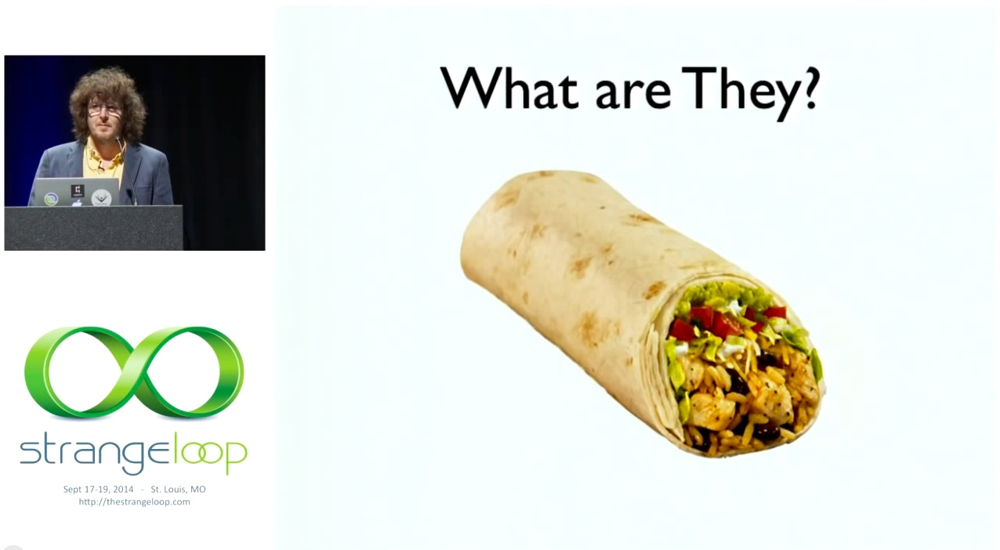

Of course, everything is just some combination of the same ingredients, the shell's on the outside, [00:13] the top, whatever. I'm not claiming any novelty here, it's just another rearrangement of the same old stuff as usual. But you know, sometimes, the cheese on top, you know, tastes better than when it's inside.

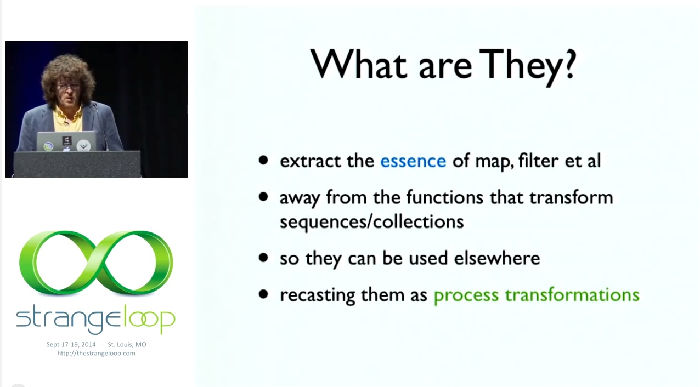

Alright, so, what are transducers? The basic idea is to go and look again at map and filter and see if there's some idea inside of them that could be made more reusable than map and filter, because we see map and filter being implemented over and over again in different contexts, right? We have map and filter on collections. We have map and filter on streams. We have map and filter on observables. We were starting to write map and filter, and so on, on channels. And there was just no sharing here, there's no ability to create reusable things. So we want to take the essence out and see if we can reuse them. And the way that we are going to do that is by recasting them as process transformations. And I'll talk a lot more about that, but that's essentially the entire idea. Recasting the core logic of these sequence processing functions as process transformations, and then providing context in which we could host those transformations.

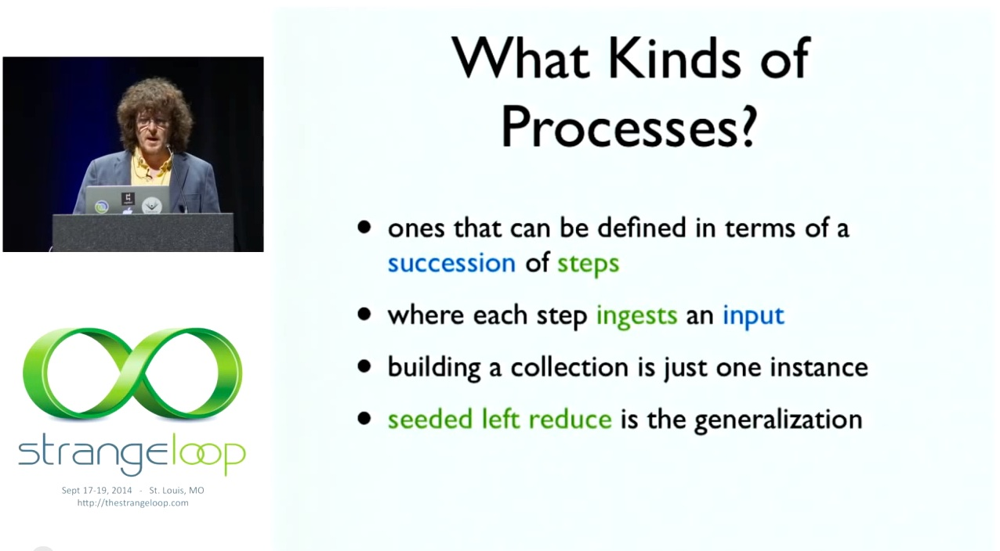

So when I talk about processes, what am I saying? It's not every kind of process, there are all kinds of processes that cannot be modeled this way, but there are ton of processes that can. Right? And the critical words here are that if you can model your process as a succession of steps, right? And if you can talk about a step or think about a step as ingesting an input, as taking in or absorbing some input, a single input. So something going on, there's an input, we're going to absorb that input into the something going on and proceed. That's the kind of process that we can use transducers on. And when you think about it that way, building a collection is just one instance of a process with that shape. Building a collections is, you have a collection so far, you have the new input, and you incorporate the new input into the collection and you keep going. But that's a specialization of the idea. The general idea is the idea of a seeded left reduce. Of taking something that you're building up in a new thing and continually building up. But we want to get away from the idea that the reduction is about creating a particular thing and focus more on it being a process. Some processes build particular things; other processes are infinite, they just run indefinitely.

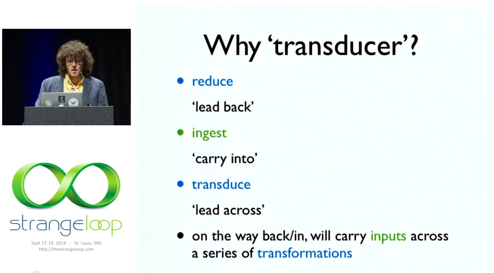

So, we made up words. Actually we didn’t make up a word. Again, this is actually a word. But why this word? We think it's related to reduce and reduce is already a programming word. It's also already a regular word. And the regular word means to lead back, like, to bring something back. The word has come to mean over time to bring something down or to make something smaller. It doesn't necessarily mean that. It just means to lead it back to some mother-ship, and in this case, we're going to say, the process that we're trying to accomplish. The word ingest means to carry something into, so it's the same kind of idea, but that's about one byte, right? Reduction is about a series of things and ingestion ingests itself into one thing. And transduce means to lead across. And the idea basically is: as we're taking inputs into this reduction, we're going to lead them through a series of transformations. We're going to carry them across a set of functions. We're going to be talking about manipulating input during a reduction.

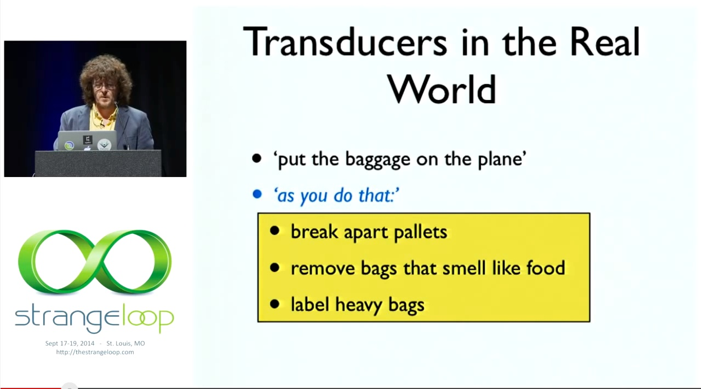

So this is not a programming thing. This is a thing we do all the time in the real world; we don't call them transducers, we call them instructions. And so, we'll talk about this scenario through the course of this talk, which is, 'put the baggage on the plane'. That's the overall thing we're doing, but I have this transformation that I want you do to the baggage. I want you to, while you're doing it, while you are putting the baggage on the plane, break apart the pallets. We're going to have pallets, you know, big wooden things with a pile of luggage on it that's sort of shrink-wrapped. We're going to break them apart so now we have individual pieces of luggage. We want to smell each bag and see if it smells like food. If it smells like food, we don't want to put it on the plane. And then we want to take the bags and see if they are heavy. And we want to label them. That's what we have to do. We're talking to the luggage handlers, we say, "That's what you are going to do". And they all say, "Great, I can do that".

One of the really important things about the way that was just said, and the way you talk to luggage handlers and your kids and anybody else you need to give instructions to, is that the conveyance and the sources and the sinks of that process are irrelevant. To the luggage handlers, get the bags on the conveyor belt or on a trolley? We didn't say. We don't care. In fact, we really don't want to care. We don't want to say to the luggage guys, "Today, there's going to be luggage on the trolley, do this to it and put it on another trolley". And tomorrow when we switch to conveyor belts, have them say, "We didn't know what to do". "It came on a conveyor belt and like, you didn't.. I have rules for trolleys". So the rules don't care. The instructions don't care. This is the real world.

Then we have programming. What do we do in programming? We have collection function composition. We're so cool. We have lists. We have functions from lists to lists. So we can compose our functions. We're going to say, well, labeling the heavy bags is like mapping. Every bag comes through and it gets a label or doesn't but for every bag that comes through, there's a bag that comes out. Maybe it has a label or it doesn't. And taking out the non-food bags or keeping the non-food bags is a filter. It's analogous to filter. If it's food, we don't want it. If it's not food, we are going to keep it. So we may or may not have an input depending on this predicate. And unbundling the pallets is like mapcat. There's some function, that given a pallet, gives you a whole bunch of individual pieces of luggage. So we already know how to do this. We're done, we're finished. Programming can model the real world. Except there's a big difference between this and what I just described happens in the real world.

Because map is a function from whatever, collection to collection or sequence to sequence. Pick your programming language, but it’s basically a function of aggregate to aggregate. And so is filter and so is mapcat. And the rules that we have only work on those things. They are not independent of those things. When we have something new like channel or stream or observable, none of the rules we have apply to that.

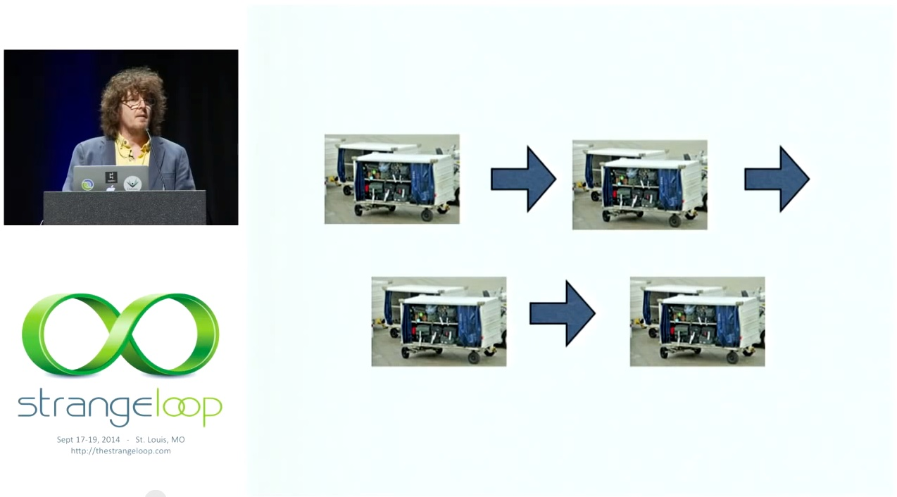

And in addition, we have all this in-between stuff. It is as if we said to the luggage guys, "Take everything off the trolley, right, and unbundle the pallet and put it on another trolley. And take it off that trolley. And see if it smells like food. And if it doesn't, put it on another trolley. And then take it off that trolley, and if it's heavy, put a label on it and put it on another trolley". This is what we're doing in programming. This is what we do all the time. And we wait for a sufficiently smart supervisor to come and like, say, "What are you guys doing?". So we don't want to do this anymore.

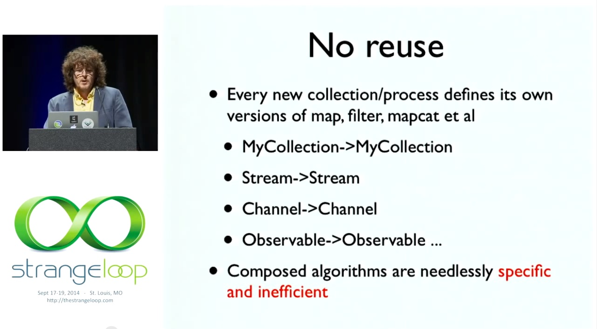

We don't have any reuse. Every time we do this, we end up writing a new thing. We write a new kind of stream, we have a new set of these functions. We invent.. rx, boom, there's a 100 functions. We were starting to do this in Clojure. We had channels and we are starting to write map and filter again. So, it's time to say, time out. Can we do this? Because there are two things that happened. One is, all the things we are doing are specific. And the other is, there's a potential inefficiency here. Maybe there's sufficiently smart compilers, and maybe for some context, they can make the intermediate stuff go away. Maybe they can’t. The problem is our initial statement really doesn't like what we normally do. It's not general, it's specific. We'll rely on something else to fix it.
 
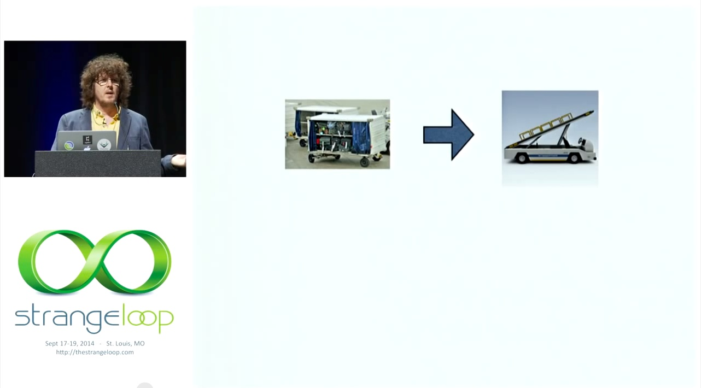

We also have this problem, when we are going to go from one kind of conveyance to another, and now all of a sudden, you know, map is from x to x. How do we fix this? And I know what everyone's thinking, of course. 
 
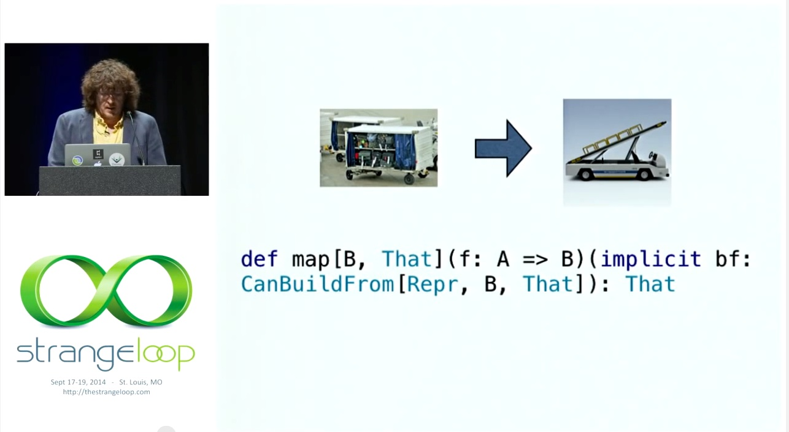

[laughter, applause]

Yeah. So, that may fix some of this but in general it doesn't solve the problem. The problem is mostly about the fact that we are talking about the entire job. Those instructions, they were about the step. They weren't about the entire job. The entire job was around it. While are you doing this thing, here's what you going to do to the inputs. Here's how you are going to transform them while you're doing the bigger thing which could change. It could change from conveyor belts to trolleys and stuff like that.

So we want to just take a different approach. If we have something that's about the steps, we can build things that are about the whole jobs but not vice-versa. 

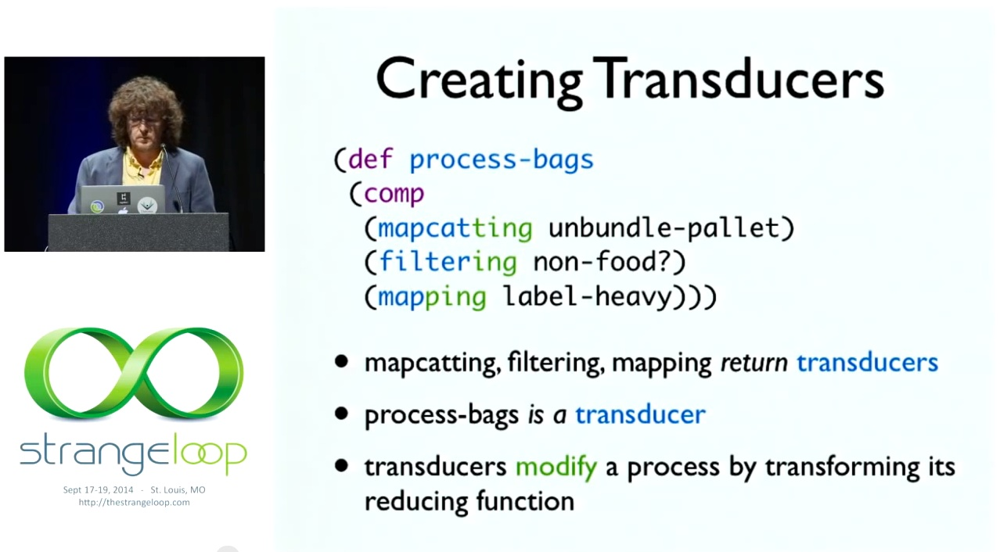

Ok, this is just going to be some usages here and then I'll explain the details in a little bit. Because when I do it the opposite way, people are like, "Oh, my brain hurt for so long and, like, 40 minutes in, you showed me the thing that made it all valuable".

So, here's the value proposition. We make transducers like this, we say, "I want to make a transducer, I want to make a set of instructions. I'm going to call it process-bags. I'm going to compose the idea of mapcatting using unbundled pallet as the function. So I want to unbundle the pallets. Then I want to filter out the non-food or keep the non-food, filter out the food. And I want a map labeling the heavy bags. And in this case, we are going to compose those functions with comp which is Clojure's ordinary function composition thing. So mapcatting, filtering and mapping return transducers. And process-bags, which is a composition of those things, is itself a transducer. So we are going to call mapcatting, call filtering, call mapping, get 3 transducers, compose them and make another transducer. Each transducer takes a process step, its reducing function, and transforms it, changes it a little bit. So, before you do that step, do this. I'll explain why that seems backwards in a little bit.

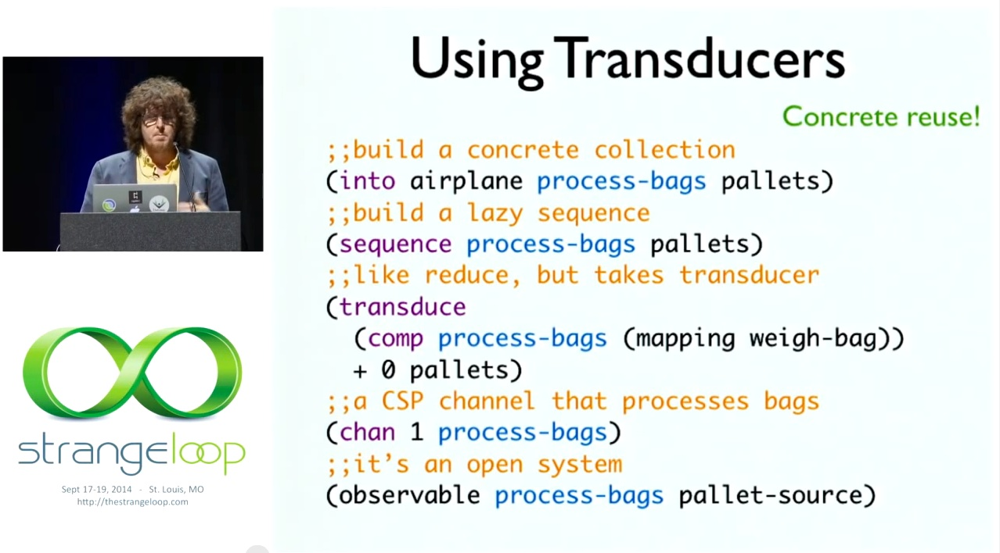

Having made those instructions, we can go into completely different contexts and reuse them. Amongst the several contexts that we are supporting, in Clojure in the first version, is supporting transducers in into. And into is Clojure's function that takes a collection and another collection and pours one into the other. Instead of having, you know, more object oriented collections that know how to absorb other collections with buildFrom, we just have a standalone thing called into but it's the same idea. Your source and destination could be different. So you want to pour the pallets into the airplane, but we're going to take them through this process bags transformation first. So, this is collection building. into is already a function in Clojure, we just added an additional arity that takes transducers. Then we have sequence. Sequence takes some source of stuff, and makes a lazy sequence out of it. Sequence now additionally takes a transducer, and will perform that transformation on all the stuff as it lazily produces results. So we can get laziness out of this. There's a function called transduce which is just like reduce except it also takes a transducer. So that takes a transducer, an operation, an initial value and a source so the transducer is a modification of process bags -- we'll talk about in a second. The operation is sum, the initial value is 0 and the source are the pallets. So what does this composition do? What is this going to do? It's going to sum the weight of the bags. It's the weight of all the bags. So, it's cool. We can take the process we already have and modify it a little bit. We can add 'weighing the bags' at the end of that set of instructions. And that gives us a number and we can use that number with plus to build a sum.

So that's transduce. The other thing we can do is go to a completely different context now. So we have some channels. We are going to be sending pallets of luggage across channels. They don't really fit but the idea's there. This is a very different context. Channels run indefinitely. You can feed them stuff all the time and get stuff out of the other end on a continuous basis. But the critical thing here is that these things are not parametrized. They are not 'I'm a thing that you can tell me later.. you're going to tell me if it's trolleys or conveyor belts'. This is the exact same process bags I defined here, this concrete thing being reused in a completely different context. So this is concrete reuse, not parametrization. So we can use transducers on channels. The channel constructor now optionally takes a transducer and it will transduce everything that flows through. It has its own internal processing step, and it's going to modify its inputs accordingly with the transducer it's given. And it's an open system, I can imagine, but I did not get time to implement, that you could plug this into RxJava trivially. And take half of the RxJava's functions and throw them away. Because you can just a build a transducer and plug it into 1 observable function that takes an observable and a transducer and returns an observable. And that's the idea.

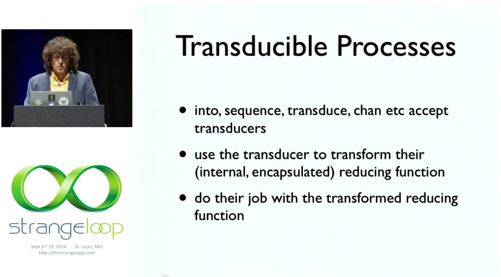

So, we call all of these things - into, sequence, transduce and chan - transducible processes. They satisfy the definition of process we gave before, and they accept a transducer. So transducers sort of have two parts, you make functions that create transducers, and in contexts where they make sense, you start accepting transducers. Then you have these two orthogonal LEGOs you can put together. Inside each process, they are going to take that transducer and their internal processing function. So what's the internal processing function of into? The thing that adds one thing to a collection. In Clojure, it's called conj for conjoin. Similarly, inside lazy sequences, there's some funk mechanism that produces a result on demand and then waits to produce the next thing. So that has a step inside of it that can be transformed this way.

Channels also take inputs. Somewhere inside channels is a little step function that adds an input to a buffer. That step function has exactly the same shape as conj and as laziness. So it can transform its fundamental internal operation but the operation remains completely encapsulated. The transducible context takes the transducer, modifies its own step function, and proceeds with that.

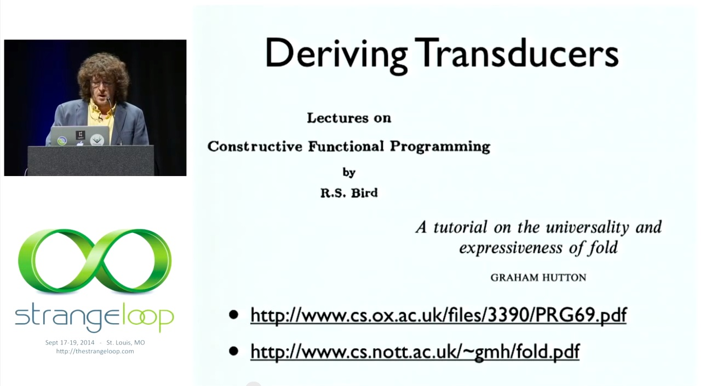

So, as I said before, there's nothing new. Two papers I find useful to think about these things are these Lectures on Constructive Functional Programming which is a lot closer to the source of when people started thinking about folds and their relationships to lists. And the 2nd Graham Hutton paper served as a summary paper that sort of summarizes the current thinking at the time it was written. So they're both really good. But now I take you through 'how do we get to this point?'.

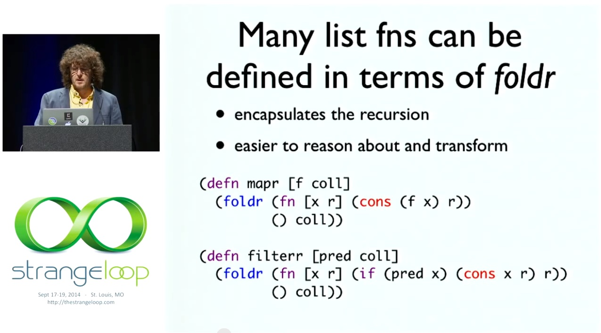

How do we think about these things? So we're in the fundamental things that the Bird paper and the work that preceded it talk about is the relationship between these lists processing operations and fold. In fact, there's a lot of interesting mathematics that shows that they're the same thing. That you can go backwards and forwards between the concrete list and the operations that constructed it. They are sort of isomorphic to each other. So many of the list functions that we have can be redefined in terms of fold. There's already been a definition of map in several talks here, I think, but the traditional definition of maps says if it's empty, return empty sequence. If you're getting a new input, cons that input onto the result of mapping to the rest of the input. It's recursive and calls itself. But map does that, filter does that, mapcat does that. They all sort of have these structures. But filter is a little bit different. It has a predicate inside, it has a conditional branch and then it recurses in two parts of the branch with different arguments. So what this earlier work did was say, you can think of all of these things as folds. If you do, you get a lot of regularity in things that you can prove about folds, which are now all uniform will apply to all these functions but otherwise look a little bit different from each other. So there's a lot of value to this.

fold encapsulates the recursion and it's easier to reason about. So if we look at a redefinition of map, it's not often defined this way, but if we look at a redefinition of map in terms of fold, then we say we're going to fold this function that cons the first thing onto the rest. And we start with an empty list. So this is fold way. We do it over a collection. We can similarly define filter this way, and what's really interesting about these things is that the foldr, the empty list and the coll, that's all boilerplate. It's exactly the same. map and filter are precisely the same in those things. All that's different is what's inside the inner function definition. And even there, there's something the same.

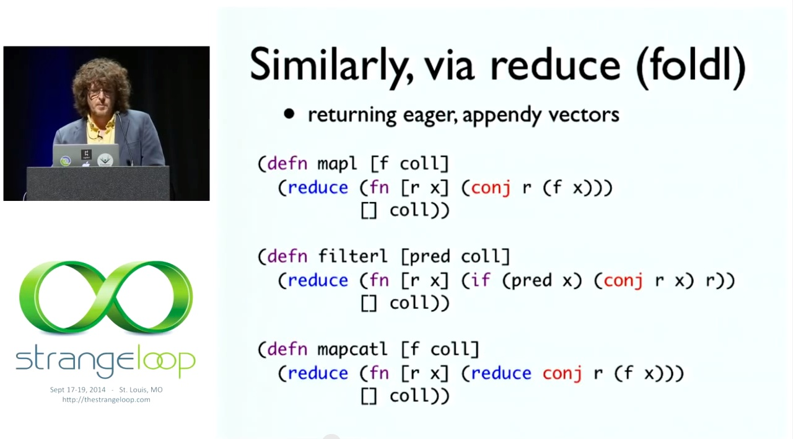

So it ends up that you can similarly define these functions in terms of foldl. foldl is just left reduce. And here's some what-if definitions of map and filter, and we added mapcat, that are left folds that use left reduce. So, the trade-off between left reduce and right reduce is that right reduce sort of puts you on the laziness path and left reduce puts you on the loop path. It ends up that the loop path is better and faster and more general for the kinds of things we want to apply this to, especially if we can get laziness later, which I just said we kind of could. So we like that.

This means we can turn these things into loops. Like, reduce becomes a loop. But the same thing, we have a boilerplate, we have reduce, by these definitions, use vectors, which in Clojure are like arrays but their fundamental conjing operation adds at the end. This has the same shape I want to talk about for the rest of the talk. We have something that we are building up. A new input, we produce a new thing, and sort of the stuff is coming from the right and getting added to the right hand side. So it just makes more sense here. So these are eager and they return vectors. But it's the same idea. We are reducing. We have a function that takes the vector so far and a new value. We're conjoining the new value, having applied f to it. That's the idea of mapping. There's an idea behind mapping that luggage handlers understand. Put the label on everything that comes through. It's very general, that's mapping. They get that, we get that. We're all human beings. We understand the same thing. As programmers, we muck this up because look at what's happening here. map says there's this fundamental thing you do to everything as it comes through. filter says there's this fundamental tiny thing you do to everything as it comes through. And mapcat says there's this fundamental tiny thing you do to everything as it comes through. What's the problem? conj! conj is basically like saying, "To the trolley or to the conveyor belt". It's something about the outer job that's leaked, it's inside the middle of the idea. Inside the middle of the idea of mapping is this conj. It does not belong. Inside the middle of the idea of filter is this conj. It shouldn't be there. Same thing with mapcat. This is specific stuff in the middle of a general idea. The general idea is just take stuff out. We don't want to know about conj. Maybe we want to do something different.

So we have a lot of boilerplate. We have these essences and the other critical thing is the essences can be expressed as reducing functions. Each of these little inner functions is exactly the same shape as conj. It takes the results of r and new input; returns the next result.

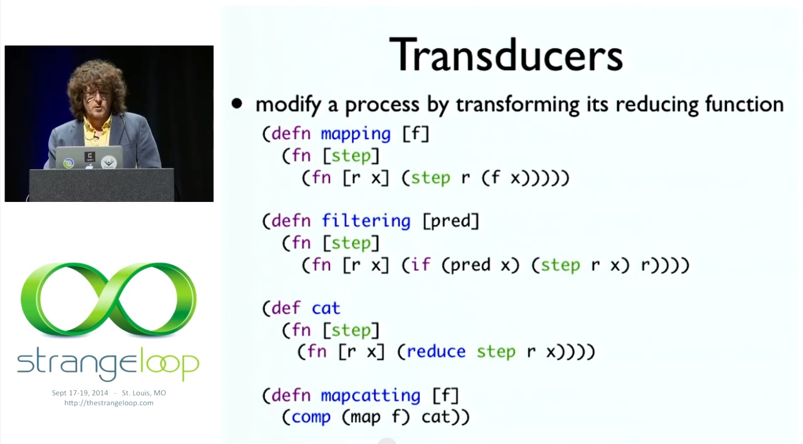

So, to turn those inner functions into transducers, we are just going to parametrize that conj. We are going to parametrize the old fashioned way. With the function argument. That anything higher-order blah blah blah, you know, we are going to take an argument which is the step. So right in the middle body of this mapping - this is the same as it was in the last slide, this is where it said conj, now we say step. We put that inside a function that takes the step. So this is a function, mapping takes the thing that you're going to map, label the baggage, and it returns something that is a function that expects a step. What are we doing? Putting stuff on conveyor belts. What are we doing? We're putting stuff on trolleys. And it says, before I do that, I'm going to call f on the luggage. I'm going to put a label on the luggage. I don't know about luggage anymore. The step, you're going to tell me later. What are we doing today? Conveyor belts or trolleys? Conveyor belts, cool. I got the rules, I understand how to do mapping and filtering and mapcatting. So same thing, filter, and what's beautiful about this is what's the essence of filtering. Apply a predicate and then maybe you do the step or maybe you don't. There's no stuff here. It's a choice about activity. It's a choice about action. Same thing with concatenating, cat. What does it do? Basically says, do this step more than once. I'm giving you an input that's really a set of things. Do it to each thing. And mapcatting is just composing map and cat. Which it should be. OK.

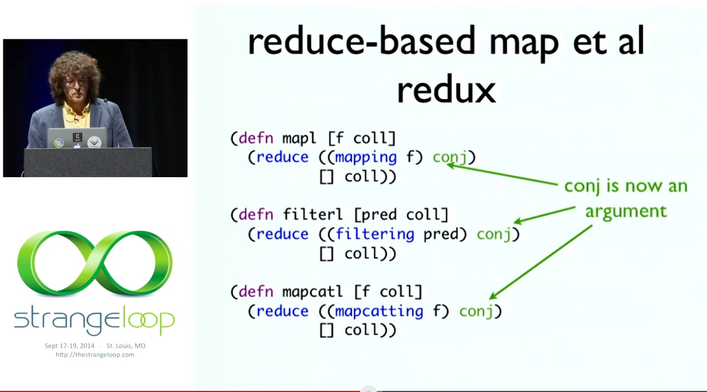

So we can take these transducer returning functions, so mapping returns a transducer, filtering returns a transducer, cat is a transducer, and mapcatting returns a transducer. And we can then plug them into the code we saw before, like how could we define map, now that we have made mapping into this abstract thing which doesn't really know about lists or vectors anymore. And what we do is we just call mapping, that gives us a transducer that says, "If you give me a step function, I'll modify it to do f first on the input". We say, "OK, here's the step function: conj". Now I rebuild the functions I had before, except conj is not inside mapping or filtering or mapcatting anymore. It's an argument. Woohoo!! We now have the essence of these things, a la carte. And that's the point.

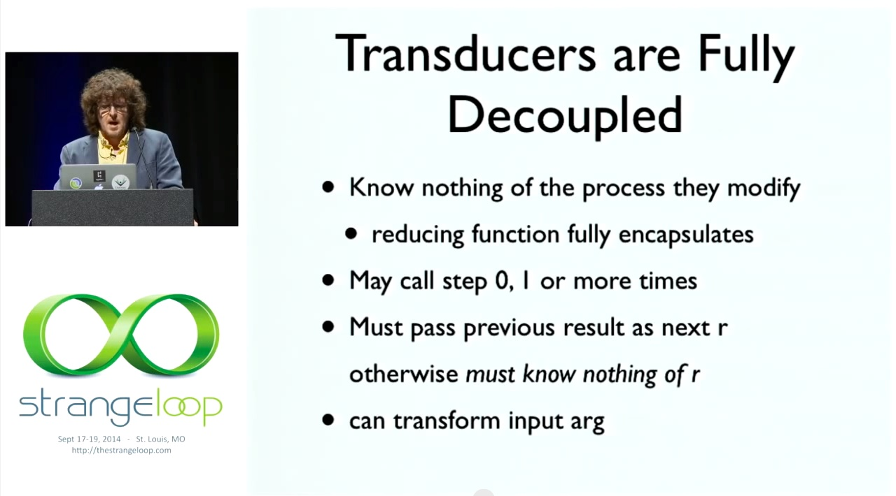

Transducers are fully decoupled. They don't know what they're doing. They don't know what process they're modifying. The step function is completely encapsulated. They have some freedom; they can call the step function not at all. Once exactly per input or more than once per input. But they don't really know what it does so that's what they are limited to doing: using it or not using it. That's pretty much it, except they do have access to the input. So when we said mapcat unbundle-pallet, the function we're supplying there is something that knows about pallets. It doesn't know about conveyor belts. It doesn't know what the overall job is but it knows about pallets. It's going to know how to turn a pallet into a set of pieces of luggage. There's a critical thing about how they use that stuff function that they have been passing, it goes back to the successor notion I mentioned before. They must pass the previous result from calling the step function, as the next first argument to the next call to the step function. That is the rule for step functions and their use. And no others. They can transform the input argument, the second argument.

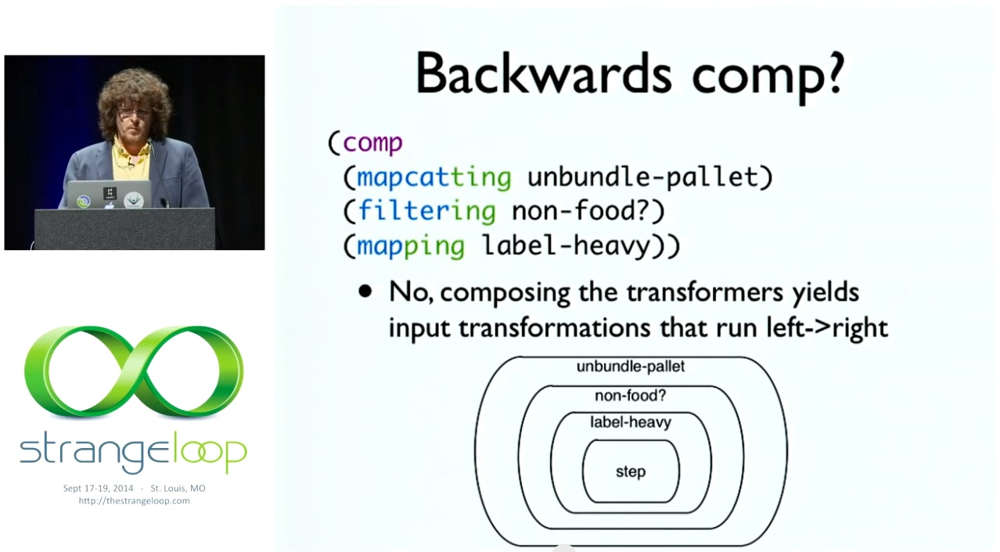

So let's talk a little bit about the backwards part. This is a frequent question I get. What did you do? Does transducers change comp? That is the first thing, they ruin comp or something like that. So what we've to do is look at what transducers do. A transducer function takes a function, wraps it and returns a new step function. That is still happening right to left. This is ordinary comp and it works right to left. So mapping gets run first. We are going to have some operation, you know, 'put stuff on trolley' or conj. Mapping will be the first thing that happens. It's going to make a little modified step that labels the heavy bags before it calls 'put it on the airplane'. Then filtering gets called, it does go right to left. It says, "Give me that step, I'll make you a new step that first sees if it's food. If it's food, I'm going to throw it away, if it's not food, I'm going to use it". Then mapcatting runs, or the result of mapcatting runs. And that says, "Give me a step and I'll take its input, presume it's a pallet, unbundle it, and supply each of those arguments to the nested thing". So the composition of the transformers runs right to left. But it builds a transformation step that runs in the order that they appear: left to right in the comp. In other words, comp is working ordinarily. It's building steps right to left. The resulting step runs the transformations left to right. So when we actually run this, we'll unbundle the pallets first, call the next step, which is to get rid of the food. Call the next step, which is to label the heavy bags. So that's why it looks backwards.

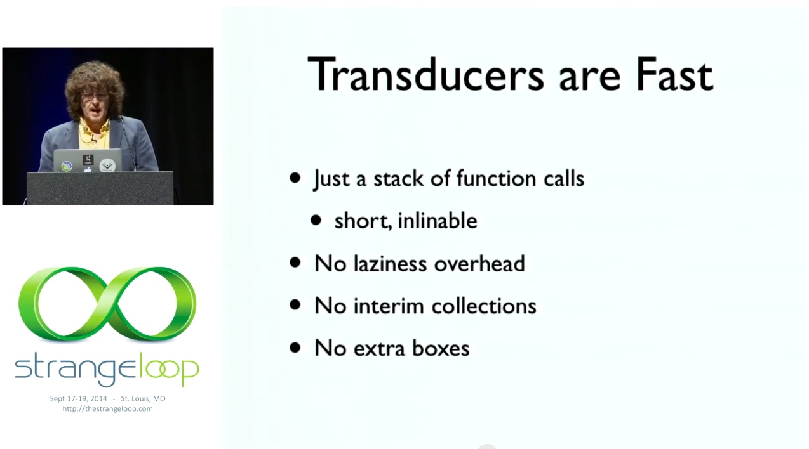

Ok, so, the other nice thing about transducers is that there's no intermediate stuff. They're just a stack of function calls. They are short. Potentially they could be inlined. There's no laziness overhead. There's no laziness required. There's no laziness utilized. Like, there's no interim collections. We're not going to tell, "How do you make everything into a list?". So, you can say, "An empty list is nothing". No, nothing is nothing. Empty list is an empty list. And one thing is one thing. A list of one thing is a list of one thing. These are not the same. So you use the step function or you don't. And there's no extra boxes required, or boxing for communicating about the mechanism.

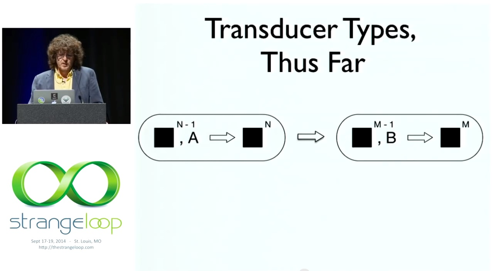

So the other thing, that was sort of interesting was.. I started talking about transducers and a lot of people in Haskell were trying to figure out what the actual types were because I had shorthand in my blogpost and I'm not going to get into that right now, except to say that I think it's a very interesting type problem and am very excited to see how people do with it in their various languages. I've seen results that were sort of, "It works pretty well" to "Man, these types are killing me", depending on whether the user's type system could deal with it. But let's just try to capture what we know so far graphically, and somebody who reviewed these slides for me, said this should have been subscript stuff. Like, computers are so hard to use, I couldn't switch them in time. So they're superscripts but the idea is that if you're trying to produce the next process N, you must supply the result from step N-1 as the input. If you try to model this in your type system saying R to R. That's wrong. Because I can call the step function 5 times and then on the 6th time, take the return value from the 1st time and pass it as the first thing. That's wrong. So you have got to make the type system make that wrong. So figure that out. Also, if you make the black box and the black box the same thing, that's also arbitrarily restrictive. You can have a state machine that every time it was given X, returned Y. Every time it was given Y, returned Z. Every time it was given Z, returned X. That's a perfectly valid step function. It has 3 separate input types and 3 separate output types. It only happens at particular times. There's nothing wrong with that state machine. It is a perfectly fine reducing function. It may, you know, be tough to model in a type system. And don't say X or Y or Z. Because it doesn't take X or Y or Z and return X or Y or Z. When it's given X, it only returns Y. It never returns Z. So, seems like a good project for the bar, later on.[laughter] But the thing we're capturing here is that the new step function might take a different kind of input. It might take a B instead of an A. Now, our first step does that. It takes a pallet and returns a set of pieces of luggage but each step returns a piece of luggage.

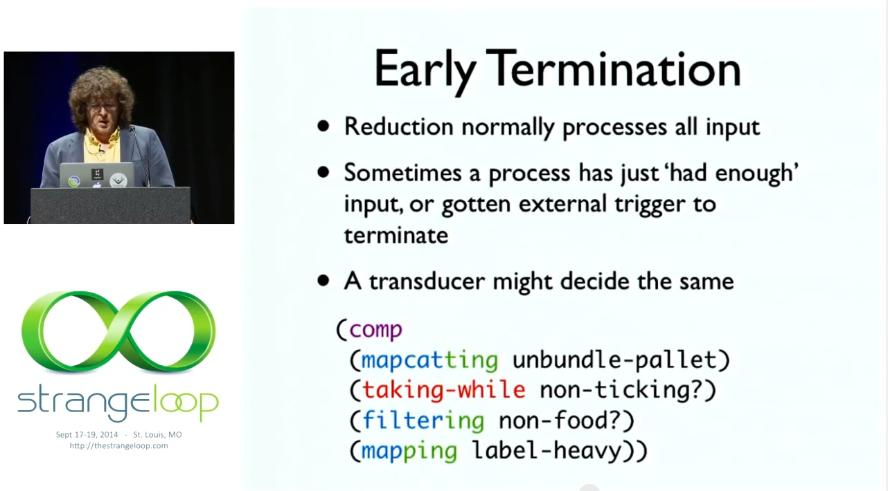

OK, so there are other interesting things that happen in processes. Ordinary reduction processes everything, but we want this to be usuable in cases that run arbitrarily long. We're not just talking about turning one kind of collection into another kind of collection. A transducer that's running on a channel has got an arbitrary amount of stuff coming through. A transducer on an event stream has an arbitrary amount of stuff coming through. But sometimes you want.. either the reducing process or somebody says "Whoa! I've had enough. I don't want to see anymore input. We're done. I want to say, we're done now even though you may have more input". So, we're going to call that early termination. And it may be desired by the process itself, like the thing at the bottom. Or it may be a function of one of the steps, one of the steps may say, "You know what, that's all I was supposed to do. So, I don't want to see any more of them". And the example here will be, we're going to modify our instructions and say, "If the bag is ticking, you're finished. Go home. We're done loading the plane". [laughter] So, we're going to add that - taking while non-ticking. Taking while non-ticking needs to stop the whole job in the middle. It doesn't matter if there's more stuff on the trolley. When it's ticking, we're finished.

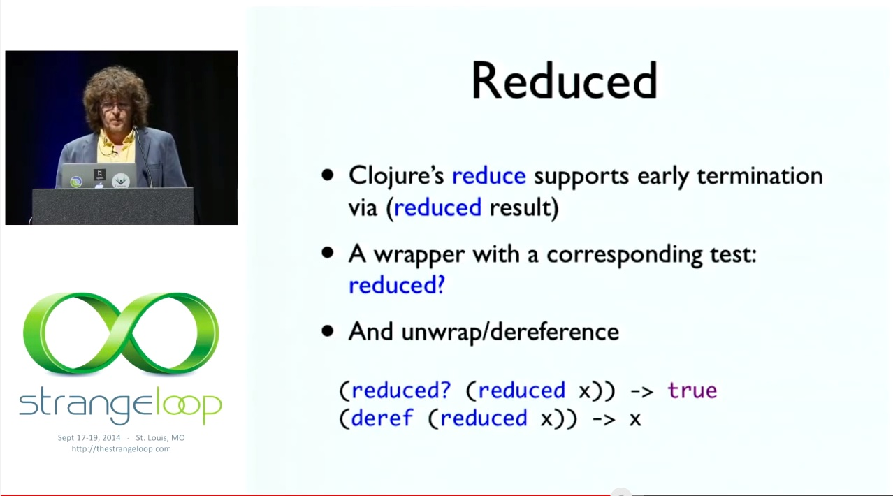

So how do we do that? It ends up, in Clojure, we already have support for this idea in reduce. There's a constructor of a special wrapper object called reduced which says, "I don't want to see any more input. Here's what I have come up with so far, and don't give me any more input". And there's a predicate called reduced? that allows you to ask if there's something in this wrapper. And there's a way to unwrap the thing and look at what's in it. So you can say, is the reduced thing reduced? That will always return true. And you can deref a reduced thing and get the thing that's inside it. This is not the same thing as maybe. maybe also wraps the other things that are not reduced. Or either, or those other boxy kind of things. So we don't do that. We only wrap when we're doing this special termination.

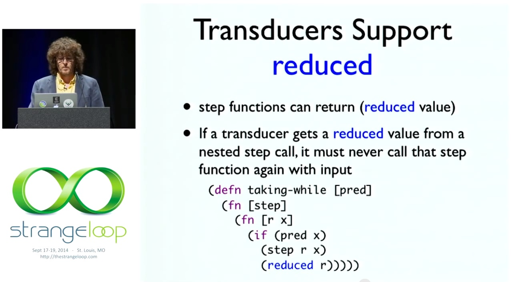

So, like reduce, transducers must also support reduced. That means that the step functions are allowed to return a reduced value. And that if a transducing process or a transducer gets a reduced value, it must never call a step function with input again. That's the rule. Again, implement the rule in your type system, have at it but that's the rule. So now we can look at the insides of taking-while. It takes a predicate, it takes a step that it's going to modify. It runs the predicate on the input. If it's OK, it runs the step. If it's not OK, it takes what has been built up so far and says, "We're finished. Reduced result". That's how we bail out. But notice the ordinary result is not in a wrapper.

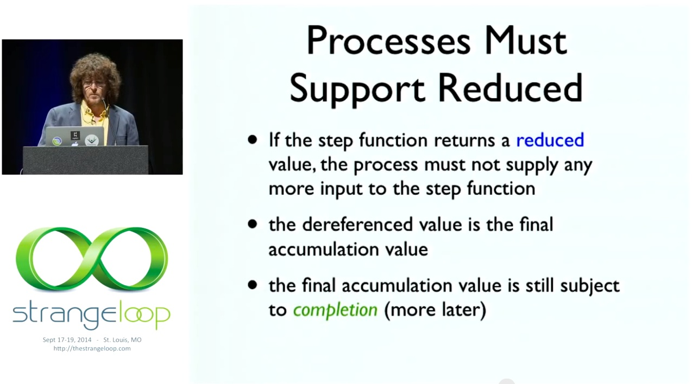

And so the reducing processes must also play this game. The transducer has to follow the rule from before, and the reducing processor has to similarly support reduced. If it ever sees a reduced thing, it must never supply input again. The dereferenced value is the final accumulated value. But the final accumulated value is still subject to completion which I'm going to talk about in a second. So there's a rule for the transducers as well. They have to follow this rule.

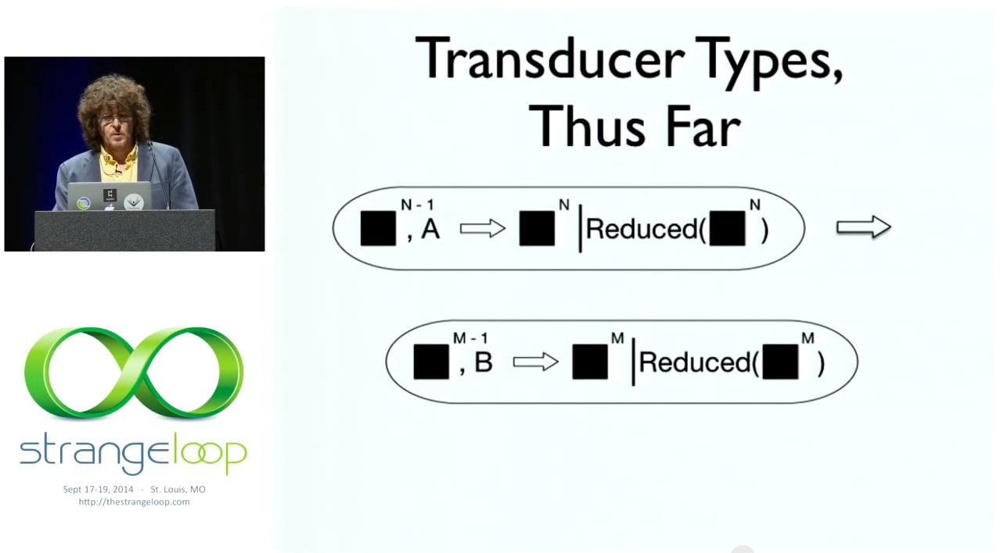

So now we get new pictorial types in the graphical type language that is Omnigraffle. [laughter] So we can have a process that takes some black box at the prior step and an input and returns a black box at the next step, or maybe it returns a reduced version of that. So one of those two things could happen. Vertical bars 'or' (|). And it returns another step function that's similarly can take a different kind of input, a black box, returns a black box or a reduced black box. Same rules about successorship apply. Alright.

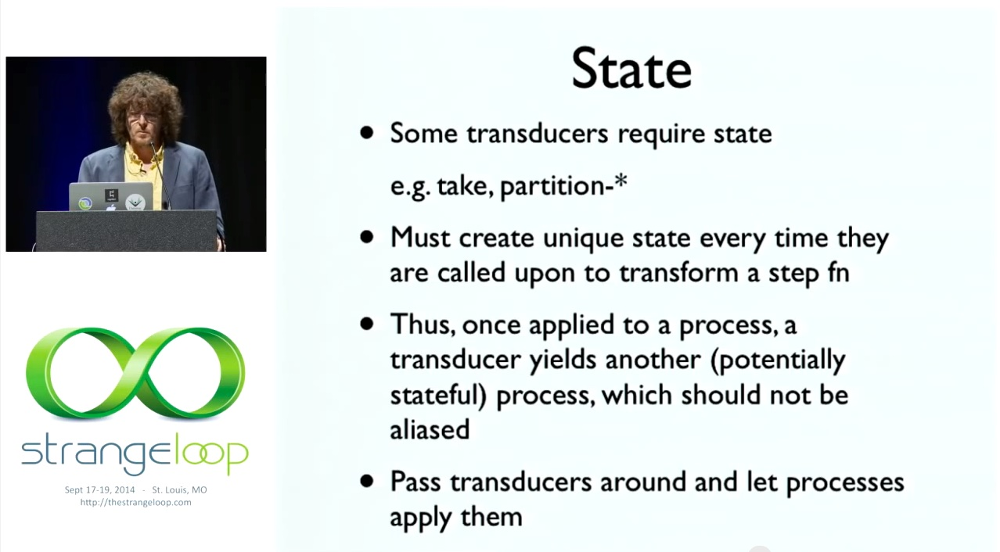

So, some interesting sequence functions require state, and in the purely functional implementations, they get to use the stack or laziness to put that state. You get somewhere in the execution machinery a place to put stuff. Now we're saying, "I don't want to be in the business of specifying we're lazy or not lazy or recursive. I'm not going to give you space inside the execution strategy because I'm trying to keep the execution strategy from you". And that means the state has to be explicit when you have transducers. Each transducer that needs state, must create it. So examples of sequence functions that need state are take, partition-all, partition-by and things like that. They have some accounting or they are accumulating some stuff to spit it out later. Where's that going to go? And it has to go inside the transducer object. They have to make state. And there's some rules about that. If you need state as a transducer author, you have to create it every time uniquely, and again, every time you are asked to transform a step function. So anew you're going to create state every time you transform a step function. That means that if you build up a transducer stack, some of which are stateful transducers, and you apply it, not when you build it, no state exists then. Now, after you have called comp, there's no state. When you've applied it, you now have a new process step. But as we should be thinking about all transducer process steps including the ones at the bottom, that may be stateful. We don't know the very bottom process hasn't launched stuff into space. So you should always treat an applied transducer stack as if it would return a stateful process, which means you shouldn't alias it. What ends up happening in practice is all of the transducible processes, they do the applying. It's not in the user's hands to do it. To pass around a transducer and input to the job, the job applies the transducer to its process. Gets a fresh set of state when it does that and there's no harm. But you do have to do this by convention.

So, here's an example of a stateful transducer. Dropping while a predicate is true. So we start with our flag that says it's true. As long as it's still true, we're going to drop. When we see that it's not true, we're going to reset it and continue with applying the step. And from then on forward, we are going to apply the step. So that is not the prettiest thing.

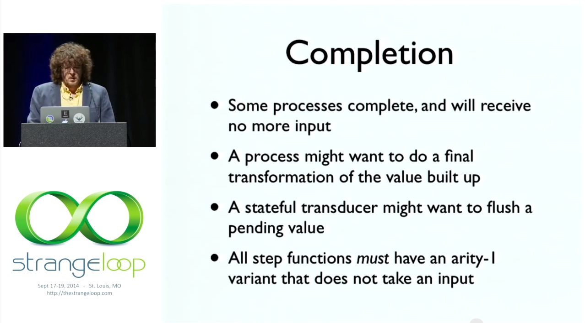

I talked before completion. So we have the idea of early termination. The other idea that transducers support is completion. Which is that, at the end of input, which may not happen. There will be plenty of jobs that don't complete. They don't have ends. They are not consuming a finite thing like collection. They're processing everything that comes through a channel. Or everything that comes through an event source. There's no end. But for things that have an end, there's a notion of completion which is to say, if either the innermost process step wants to do something finally when everything is finished. They can, or if any other transducers have some flushing they need to do, they can do it. And so the process may want to do a final transformation on the output. Any stateful transducer in particular, a transducer like partition, it's aggregating to return aggregates. You say, partition 5 and it collects five things and spits it out. If you say, we're done, it's got three things. It wants to spit out the three things. You need to be able to tell it, "We've exhausted input". In order to do that, the way that's implemented in the Clojure implementation of transducers is that all the step functions must have a 2nd operation. So the operation that takes the new input and the accumulated value so far and returns a new accumulated value or whatever. It's upto the process what the meaning of the black box is. But there must be another operation which takes just the accumulated value and no input. So an arity-1 operation. That's required.

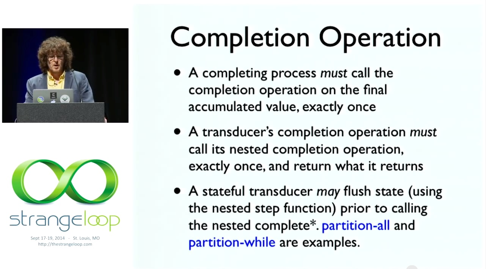

We'll take about what that does, or how that gets used. If the process itself, if the overall job is finished, it has exhausted input or it has a notion of being finished - this is not bailing out - this is like there's nothing more to do, there's no more input ordinarily. It must call a completion operation exactly once on the accumulated value. So there's no more inputs, I'm going call you once with no input. Do whatever you want. Each transducer must do the same thing. It has to have one of these completion operations and it must call its nested completion operation. It may, however, before it does that, flush. So if you have something like partition that's accumulated some stuff along the way, it can call the ordinary step function and then call complete on the result. And that's how we accomplish flushing. There's just one caveat here, which is that it you're a stateful thing like partition and you've ever seen reduced come up. The earlier rule says you can never call the input function, so you just drop whatever you have hanging around. So somebody bailed out on this process. There's going to be no ordinary completion.

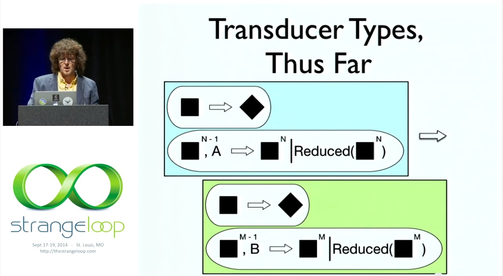 

So we can look at our types again in OmniGraffle 2000. You notice the programming innovation. And think about a reducing function as a pair of operations. It will be different in each programming language; it's not really important. In Clojure, it ends up a single function can capture both of these arities. Whatever you need to do to take two operations. The first one up there which takes no input is the completion operation. And the second is the step operation you've been seeing so far. It takes a pair of those things and returns a pair of those things. That's it. And again, we don't want to concretely parametrize the result type there either. You have got to use rank-2 polymorphism or something because if you concretely parametrize that, you 'll have something that only knows about transducing into airplanes, as opposed to the general instructions.

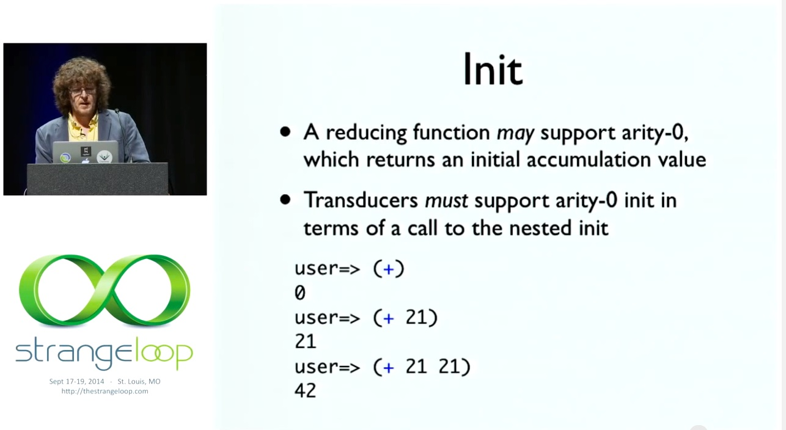

OK, there's a 3rd kind of operation that's associated with processing in general, which is Init. We had talks before which mention monoids and things like that. The basic idea is just, sometimes it's nice for a transformation operation to carry around an initialization capability. It need not be the identity value or anything like that. It does not matter. What does matter is that a reducing function is allowed to, may, support arity-0. In other words, given nothing at all, here's an initial accumulated value. From nothing. Obviously, a transducer can't do that because it's a black box. One thing it definitely does not know how to do is to make a black box out of nothing. Can't do it. So all it can ever do is call down to the nested function. So transducers must support arity-0, init, and they just define it in terms of the call to the nested step. They can't really do it but they can carry it forward except the resulting transducer also has an init, if the bottom transducer has an init. I've talked about the arity overloading, so here's an example. plus from LISP, this is older than transducers. LISP programming has been doing this for a while, sorry, Currying fans, this is what we do. plus with nothing returns the identity value for plus: 0. Multiplication of nothing returns 1. It implements plus if an accumulated result has identity and the binary operation that does the work.

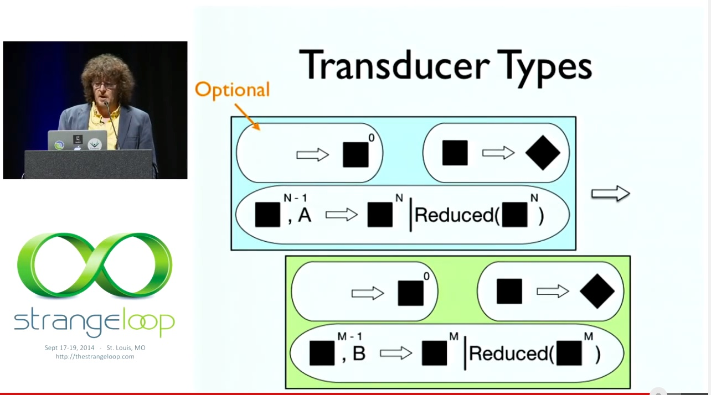

So, here's the types again. We now have an optional init from nothing. And we're taking a set of three operations and returning a new set of three operations.

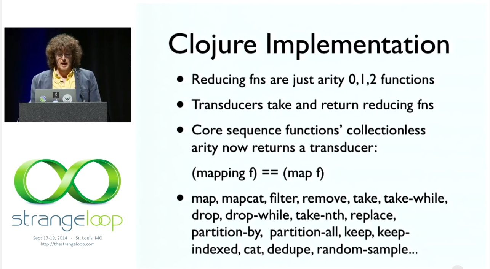

In Clojure, we just used arity to do this. A transducer enclosure then is just something that takes a reducing function and returns one where a reducing function has these 3 arities. We haven't actually called the reducing functions mapping and filtering and -ing this and -ing that. We think that's an Englishism that's not going to carry over very well, and we have available to us arity overloading because we don't have currying. So map of f with no collection argument returns a transducer. And we modified so far all of these sequence functions to do that.

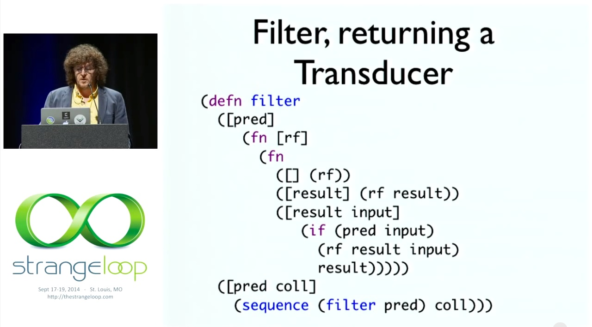

So this is the final example of filter returning a transducer. It takes a predicate and returns us a step modifying function, which takes a reducing function, which presumably has these three arities, and defines a function with 3 arities. init, which just flows it through because it doesn't know what it could possibly do. complete: filter doesn't have anything special to do, so it just flows that through and then the result and input one which is the one we've seen before. Now we can see, we can define collection implementing one by just calling sequence with this transducer. And that's true of all of these functions. You're going to find the collection version exactly like this. Which shows that transducer is more primitive than the other.

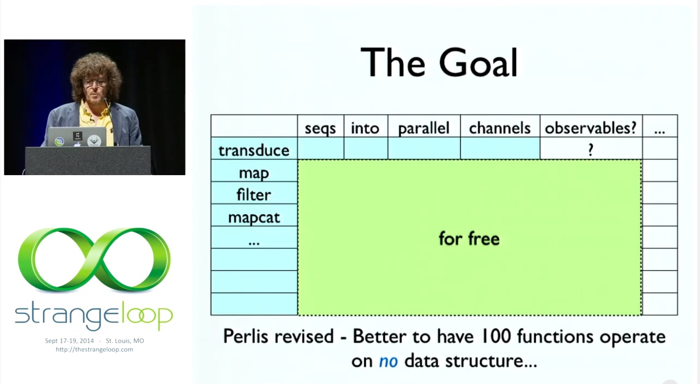

So this is what we're trying to accomplish. You define a set of transducers once. You define all your new cool stuff. So channels today, observables tomorrow, whatever the next day. You just make it accept transducers, and every specific implementation of these things, you get for free. And every recipe somebody creates, that's a composition of those transducing operations, works with your thing right away. That's what we want, right? We're going to take Perlis and just say it's even better. We want a hundred functions with no data structure.

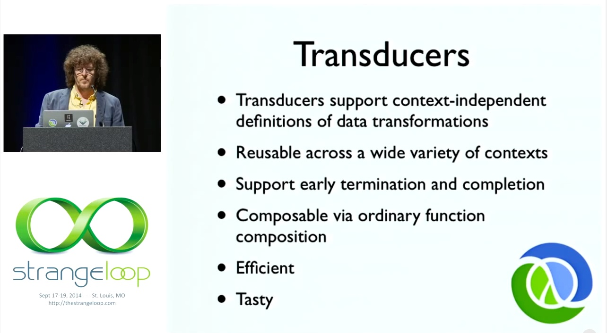

So, transducers are context independent. There's tremendous value in that. They're concrete re-reusable. So someone can make this and not how you're going to use it. That has tremendous value. It's much stronger than parametrization. Because you can flow it. They support early termination, completion. You can compose them just as easily as you can compose the other ones. They're efficient and tasty.

Thanks.
[applause]