# The Value of Values

* **Speaker: Rich Hickey**
* **Conference: [JaxConf 2012](http://jaxconf.com) - July 2012**
* **Video: [https://www.youtube.com/watch?v=-6BsiVyC1kM](https://www.youtube.com/watch?v=-6BsiVyC1kM)**

So The Value of Values. Who here works in I.T.? Everybody, I think. Alright. What does it mean? What does it stand for, I.T.?

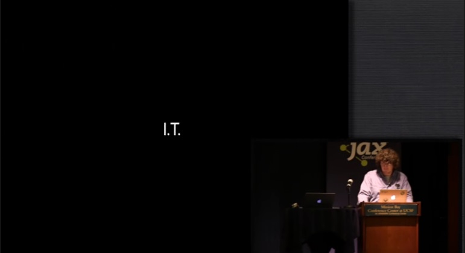

Information and Technology.

Yeah, or other things. So what do we mean when we say information? As you may know from my other key notes, all I do to make a key note is I use my dictionary because my dictionary has all the answers. And my dictionary says, information is based on the word inform which means to convey knowledge via facts and the purpose of that is to give shape to the mind. And information is just those facts. That's what information is. Information is facts.

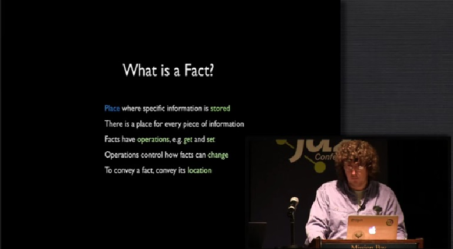

So what's a fact? Well, fact is a place where information is stored and what's great about that is that there's a place for every piece of information. Facts have operations like get and set and they may have other operations. Those operations control how facts can change. The other great thing about facts is that it's easy to convey them. To convey a fact, we just convey its location. How many people are uncomfortable right now?

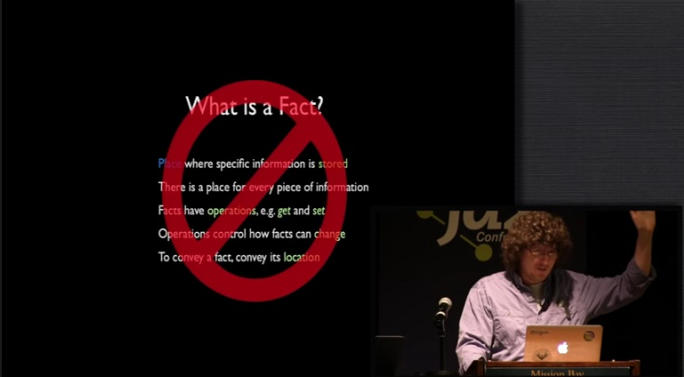

I am. This is not true, right? This is wrong. Everything that I just said was wrong. Dead wrong. And you should be uncomfortable. This is not what facts are.

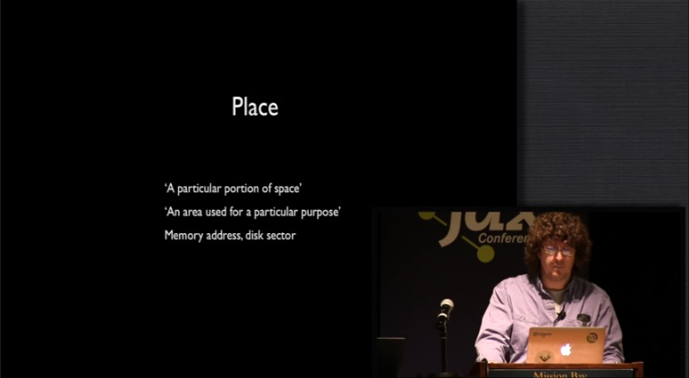

So are facts places? Well, what's a place. Again, back to the dictionary. A place is a particular portion of space, and space is an important word. We're going to dig into it later. In particular, the part about place that matters is the fact that it's sort of delimited. There's a specificity to the location named by a place or vice versa. We know about places, right? We have good examples of places in our everyday work and programming, right? Memory addresses are places, disk sectors are places. They have addresses and we can go to them and we can substitute their contents with other contents and that we're very familiar with this notion of a place.

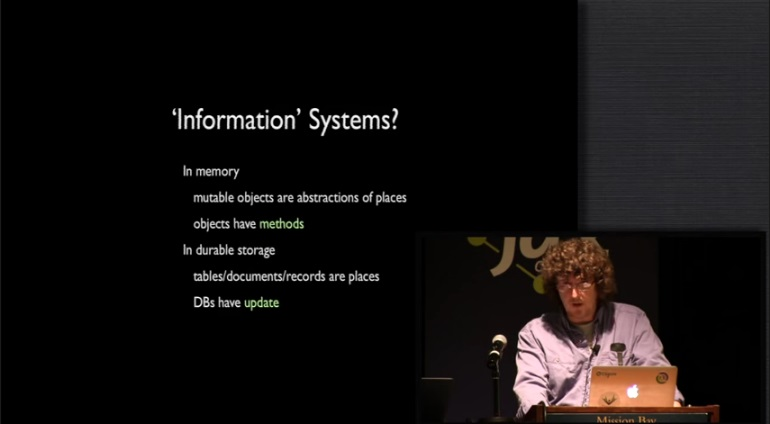

But I think it's quite important to think about whether or not with these memory places and disk locations we're actually building information systems that are about information as we just defined it. In particular, we use memory and we use objects typically, especially at this conference. And mutable objects are nothing more than abstractions over places. They're little abstractions that are over places especially or often particular mutable objects, and they have methods. Just like the thing I talked before about facts having methods and objects have methods. This is the core thing we're building systems out of. On the other side, on the durability side, we have the same kinds of notions. We have tables and documents and records, all of which are places, all of which have an update notion.

Like the notion of going to the place and setting it to be a new value. These are the underpinnings from which we build systems but we're sort of making abstractions on top of them that don't hide what they're about.

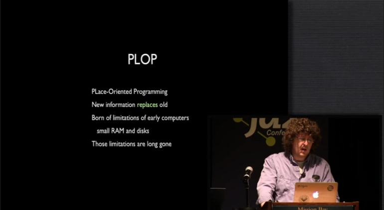

And I have a word for this or a term for this which I call, PLOP. PLace-Oriented Programming, which is what this is and you can tell when it's going on because anytime new information replaces old information, you're doing Place-Oriented Programming. There's a reason we do Place-Oriented Programming because way back in the early days of computers, we had to do Place-Oriented Programming. I saw Guy Steele give a great talk where he was talking about working, you know, building these systems on a computer that had four kilowords of memory. In every piece of memory, you knew the address, you knew the even number addresses starting at 2000 were used for jump table and these other addresses over here where used for data, and other parts of the addresses were used for code. Sometimes they were used for more than one thing because you knew, like right now, no one's using this for codes so we can use it for data and vice versa. You had to do it. There wasn't enough capacity to do anything else. Computer memories were really small. Disks were very small. Everything was very expensive. So we adopted an approach to programming that was based around the manipulation of places. It totally made sense. And the keyword there, the key aspect to that is it made sense. It used to make sense. Those limitations are gone. In the time that I've been doing programming, the capacity of these two things have increased a millionfold. A millionfold. What other thing in life you know has the same facts about it remain true when the size of something changes by a millionfold. Imagine if your car was a million times bigger than it is. What rules would still apply? What characteristics would still be true? Almost nothing but yet, we're retaining decisions we made when things were much much smaller and moving forward with it. So why does PLOP still rule?

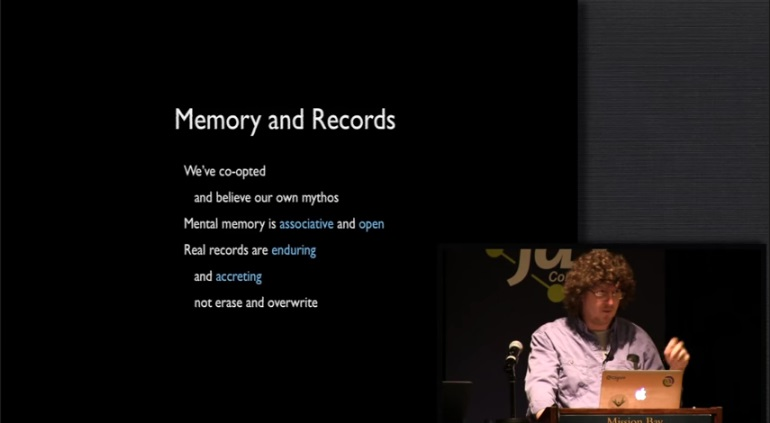

That's the key question here. When we talk about Place-Oriented Programming, we often talk about these two things, memory and records. These words had meanings before we had computers, yeah? And we've taken them over. We've said, "Memory means addresses in RAM chips and records mean slots in database tables." And worse than just taking over these words, because obviously there's a limitation to a number of words and the analogies roughly hold, right? The analogies between memory and memory in your head roughly hold but the problem is, we've now been doing this for so long that we believe our own myths about what these things mean but we should go back to the facts of memory and records. The fact of memory is that it's an open system. If you're friend gets a new email address, that doesn't go to your brain and find your friend's email address cells and replace his email address in that part, in those neurons in your brain. That's not how brains work. That's not how memory works. Memory is essentially an open system and an associative system. It is not an address-based system. Same thing, record keeping. We used to keep records before we had computers. What did we do? We took out the stone tablets and we chiseled the thing or we took out the papyrus and we wrote stuff there. When we had new information, what did we do? We did not go and smoothed over the marble and chiseled new stuff. We didn't go to the papyrus and take out erasers and things like that. When people built accounting systems before there were computers and they didn't use erasers either, right? What did they use? Double-entry accounting or ledger-based accounting. They only made correcting entries. They did not go back with erasers. That's not the way things worked before we had computers.

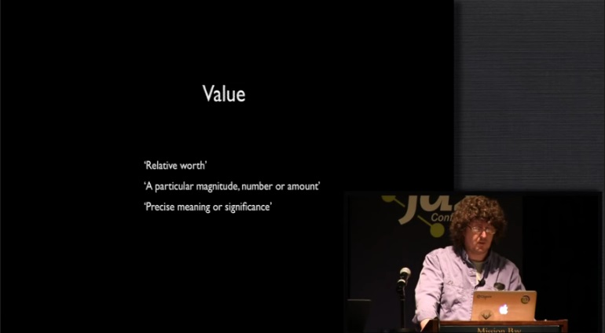

This talk is about values. It's another term we should define, and again, we just go back to the dictionary. There's some very interesting definitions for value. First is 'relative worth' and relative ends up being a very critical aspect of values because the next thing is the one is the one you're most probably familiar with especially in computer. Because this next definition is the one that applies to like 42, right? It's a magnitude. It's a number. It's something we use to measure something else and that notion of a value, I think, is the one we're most readily able to adapt. But again, the bigger notion of value is about meaning and about comparability and about relative worth. That's the bigger notion of value because when you measure something, you have to measure it in terms of something else. There's no absolute measurements. The comparing part is important.

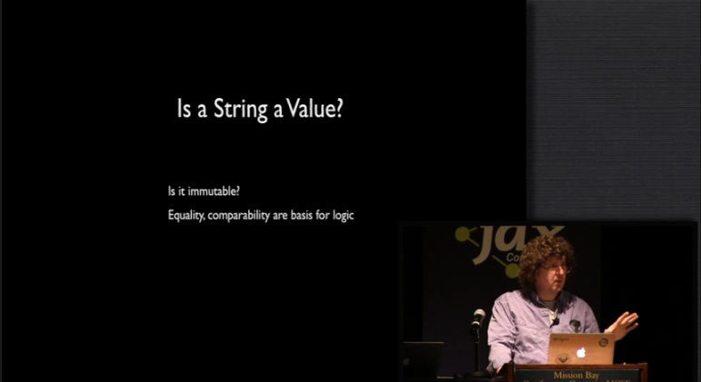

The question right now is, 'Is a string a value?' How many people think it is? I love doing it, answer the questions by raising hands because not everybody has hands, by the way. How many people think a string is not a value? How many people think it depends? You always wait for 'it depends,' right? It's the best answer so you hold out for it. What does it depend on? Is it immutable? If the string is immutable, it's a value. If it's not immutable, it's not a value. How many people worked in programming languages or do work where strings were mutable? How many people want to go back? No. We don't like this. And it ends up that this equality notion of value because right now, string doesn't measure something, right? It's not a magnitude or an amount. It doesn't correspond to that definition of value, but it ends up that an immutable string is a comparable thing. Comparability is where we derive our ability to do logic and to make decisions until we can say, "This is the same as it was yesterday. Is it greater or less than what it was? Does this string label this thing correctly according to my understanding of it." Or anything else we do with information and that comparability and equality test is sort of at the bottom and that goes back to the other notion of value. So we really do not want to go back. 

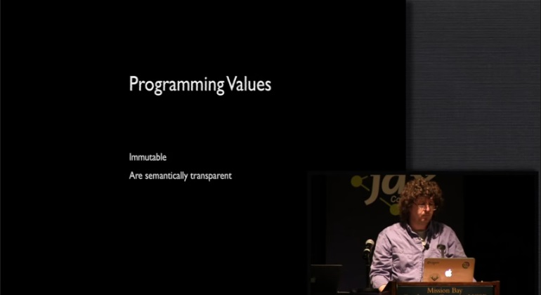

So now we want to talk about values, not from the dictionary definition but very specifically in terms of what we do in programming. There are lots of nuances to this but for the purpose of this talk, given that it's a half hour, I'm just going to focus onto values are immutable and values are semantically transparent. The purpose of a value is to expose itself to you so you can do that comparison and that equality test. Value's not about encapsulating something in methods and doing things. Value's about saying, "Compare me to something else. I'm telling you what my precise meaning or my significance is." Right on the label, right on the outside. That's what a value is about.

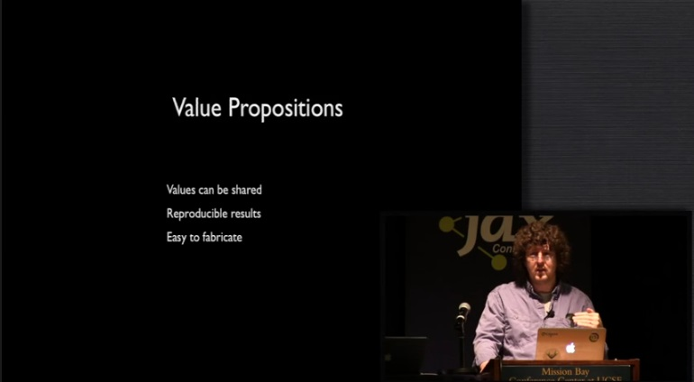

The reason to give this talk is sort of the value propositions of values. What makes values good? Originally, this talk was an hour long so this is going to go a little bit fast but there's a bunch of characteristics of values that are valuable. The first is that values can be shared. If you have a value, if you have an immutable thing, can you give that to somebody else and not worry? Yes, you don't have to worry. Do they have to worry about you now because they both now refer to the same value? Anybody have to worry? No. Values can be shared. That's very, very valuable. Values support reproducible results. If you define a function in terms of values every time they call that function with the same values, will you get the same answer? Yes. If you define a function in terms of places every time you're on that function, will you get the same answer? No. It depends what's in the place. Reproducible results really matter. They allow you to run tests and reproducible tests. So many people running tests now of places. They don't tell you anything. They're all conditional upon your ability to bring that place back to the same place, to the same value. Another critical aspect of values is that they're easy to fabricate. You can make up a value from scratch in any programming language quite readily. Can you make a string in any programming language? Yeah. Can you make a list of strings? Sure. A list of numbers? Yeah. A list of a list of numbers? Yeah. A map of a list of numbers? Yeah. Can I make an instance of your fancy interface in any other language? No. It's not easy to fabricate that. It's not easy to make programs that write programs. It's not easy to make programs that write tests. If your programs are not based around values so the fact of values are easy to fabricate is important.

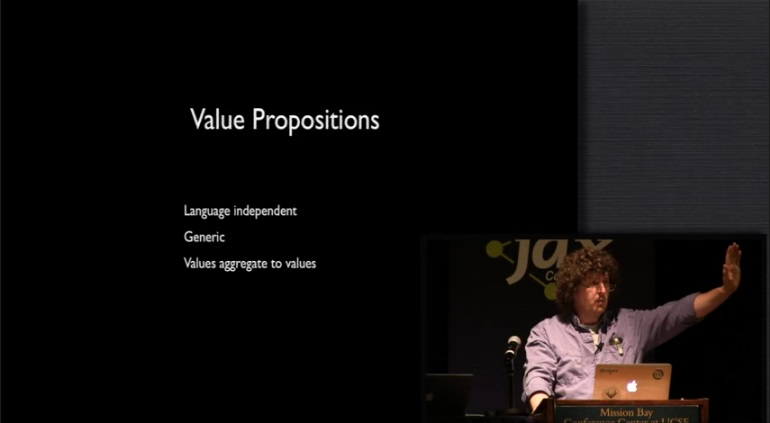

Alright. Values are language independent. So I just talked about that already. The notion of a list or string or number or a map. This has nothing to do with the programming language. Those things I just said. Nothing at all, right? Nor any of the aggregates of those things has nothing to do with that. They're generic, right? These ideas, the notions of values are generic. And I think it's something that we don't think about often enough in our programming designs and our systems that the actual cause of specificity. We love specificity. We use Java. Every new idea gets a new class. Every new thing gets a new thing. What does that cause to happen? We get this explosion of code. Just a tremendous explosion of code. Objects were suppose to support reuse that done the exact opposite thing especially in typed languages. You get very little reuse because you make a new thing every time, and what does more code mean? More code equals more bugs. Right away.

Another interesting thing about values is values aggregate to values and this is something I really want you to focus on. We talked about 42. We talked about a string. We talked about a sort of atomic thing. But a list of immutable things is itself an immutable thing and so on and so forth. So as you build aggregates, those bigger things are also values, and I think that we tend to stop. We say, "Of course, strings should be immutable but an immutable collection? Oh, I can't even comprehend it." But you should. It has all the same desirable attributes that that immutable string did. Nobody wants a program with mutable strings anymore. Why don't you want a program with mutable collections anymore? You shouldn't and there's really important benefits you get from doing this. For instance, compare it to objects. If you have an object and you want to share it, what do you want to do? You have to define the object, define the interface for it and everything else but then you have to do what? What if it's in a concurrent environment? What do you have to have for that object? Some sort of locking policy, right? Very, very difficult thing. In fact, a lot of languages don't give you any resources for defining it well. It's like there's this napkin and on it, we defined how we're going to use this object. But if you've done that and there's also other kinds of problems like, how do you copy it, what are the cloning semantics, whatever. Let's say you've done that work and you've done that work for everyone of your classes and now, you build something that's a composite of those things, do you get a lock policy from combining them? No. It all falls away. You have to do it all, do over again. This composite of all these things for which I have lock policies now no longer has a lock policy. I have to come up with a new one. I have to come up with a new cloning policy and everything else over again. Values aggregate to values. All the benefits apply to aggregates.

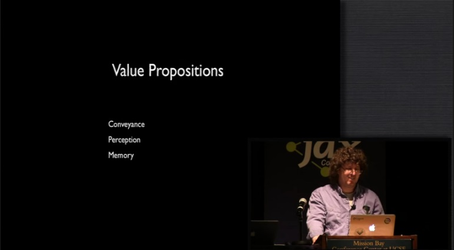

There are other benefits you get from values and we see these all the time. Values are easy to convey. If I have some piece of information I think is useful, I can send you that value and I know I've communicated to you what I was seeing. If I see something interesting and I communicate to you the place where I saw it, what have I actually conveyed to you? Nothing, right? Not the information, that's for sure because if you go look at that place and see something totally different from what I saw. It works the other way as well. When I want to perceive something, if it's a value, I can take my time and look at it especially if it's a set of values, if it's a composite thing. If I want to perceive something that's based around places, how do I do that? There's a bunch of places I want to start and look at it, what do I have to do? I have to stop the world. Please stop while I look at these places, because otherwise, I'll look at one and as I turn my head to the other, something will change and by the time I sort of perceived the whole thing, I don't know they had anything consistent. I don't know they're making a decision based on anything consistent.

This also goes to memory. How do you remember anything? If you encounter an object during the course of your program running and you want to remember it, what do you do? You just store the reference. Not good enough, right? What do you have to do? Clone it. How do you do that? It depends. Exactly. It depends.

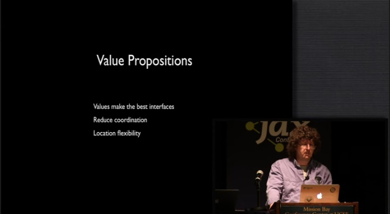

The other thing I want you to do is start thinking bigger, bigger than your box, bigger than your process because these value propositions extend to your systems and in particular, values make the best interfaces. Now here, I don't think we have any arguments. I think we're already doing this. What do you send around on the wire? Anybody still using CORBA or DCOM? No, no. They died for good reasons, right? We now use values. We send around JSON or XML or you know, if you have to, but both are representations of values. And that allows us to build interfaces to things that are easy to change on both ends.

The other aspect of values is it's very interesting especially in the large but it's also true in the small, right? We talked about how do I perceive something after I lock the world down? That applies in the large as well. How many people have ever heard of read transactions? Yeah. How many people like read transactions? No. The whole idea is counter-intuitive and violates physics. In physics, we just look at each other. We don't have to stop everything in order to look at things. So when we're programming with values and using values especially in storage, we, again, have reduced coordination.

Another benefit we get is location flexibility. If in the small you build a system and the system is defined in terms of processes that are communicating values, and you decide, "You know what? That part of the system, I want to re-write that in a faster language or I want to run that on a different box." Is that straightforward to do if you're using objects and specific things related to your programming language? If I'm passing Java interfaces, is it easy for me to re-write... or let's say Ruby interfaces, is that easy for me to re-write that in Java? No. But we know, we don't do this in the large. In the large, we don't do this. In the large, we communicate values but in the small, in a programming language, we start doing icky things. And those icky things keep us from being able to move stuff. We can't move it to another thread. We can't move it to another language. We can't move it over to another box. But if we're using values, we can. That I would call location flexibility.

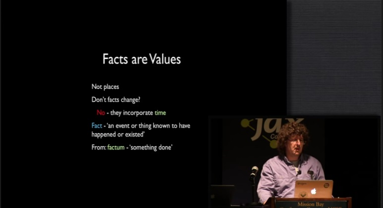

So let's get back to information technology and back to facts. The first fact about facts is that facts are values. They're not places. That slide upfront was a lie. Everybody in here's saying, "But don't facts change? Don't we have a president at one time? Don't we have a new president?" No, they don't because facts incorporate time. How is that? What does that mean? Again, the dictionary knows everything because what does fact mean? Fact means something that happened, something known to have happened or existed. It comes from Latin and it comes from a past participle Latin that means something that happened. A fact is something that happened. It's not a place. It's not something you can change. Bill Clinton was president. The fact that he was president will always be a fact. We can have new presidents. That's a new fact, just like you can have new email addresses.

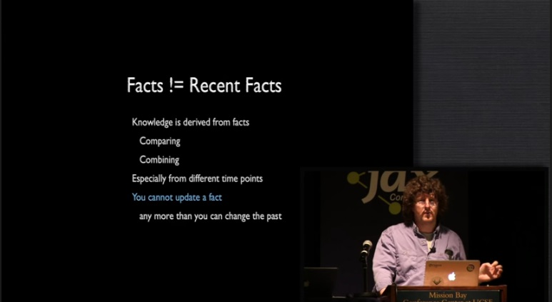

The other thing about facts is that it's very important when you consider facts that it's insufficient for you to consider recent facts. And again, we'll go back to the whole point of information. Information is to inform so that people can convey knowledge, but knowledge is derived from facts. When we try to make decisions, we compare times, we compare two different things, we combine facts and especially we use different time points. Imagine if you only knew the present value of any property or attribute in the world. How good would your decision making capability be? It will be awful. It will be absolutely terrible and yet, we're building systems that only know the most recent set of facts. We don't know anything else. But we're supposed to be making information and decision making support system.

So the bottom line is that you can't update a fact and the reason why you can't update a fact is because you can't change the past and that's what facts are, the documentation of the past.

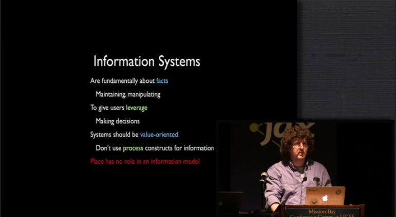

Well, let's go back and sort of revisit what would it mean to build information systems that are about information. It would mean that the systems would be fundamentally about facts. It would be about maintaining facts, manipulating facts and presenting facts to users to give them leverage so they can make decisions. Now, we think we're doing this, right? When we're in information technology, we think we're building systems that are decision support systems? But we're not using infrastructure that's fact-oriented.

In the most bottom level of notion before you even get to the temporal aspect of facts, we should certainly be building systems that are value-oriented. Now, that's not to say the programming languages shouldn't have process-oriented constructs. Of course, they should but we don't distinguish them. If you look at any program, it's going to have two different parts. There's going to be the part of your program that's sort of like a machine. It's got a loading dock and stuff comes in, you put on a conveyer belt and it moves and then, it gets sorted. It gets split and then, some stuff goes over here and some other stuff goes over there.

All programs have this aspect to themselves which is process-oriented and it's sort of like a machine. And we built programming languages that may allow us to use constructs that are analogous to little machines. They do stuff. The problem is we apply that technology to everything including to information and information is not a little machine. It's not at all like a machine and so you have to separate out these process constructs. And in particular, one of the big take-aways should be that place, that all of your constructs related to place have no role at all in an information model. They are artifacts of the way computers work. They have nothing to do with what software is suppose to be accomplishing if your software is supposed to be accomplishing information management and decision support.

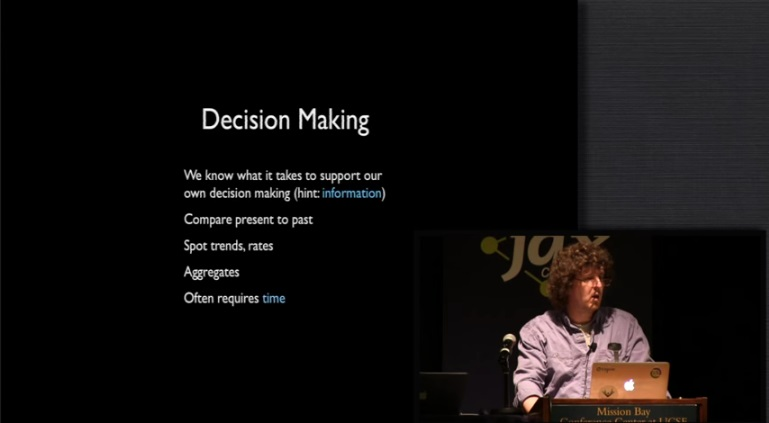

One of the great things about this talk is, I think, you all already know this because we do decision making, right? We know what it takes to support our own decision making. We're constantly comparing the present to the past. We're trying to spot trends. We're trying to see the rate of change. We need to add stuff up that's happened over time. We almost always need a temporal aspect.

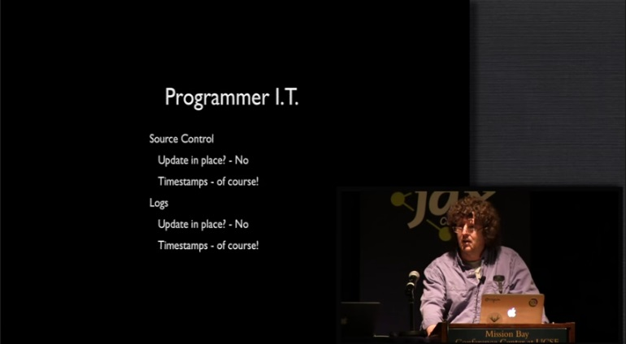

How can I tell you I know this is true? Well, it's really straightforward. We're programmers. We have stuff to do. We have our own little businesses, right? We make stuff. What do we make? What's our concrete artifact? We make source code, right? And then, we have an operations aspect to what we do. What do we do? We run our programs and we maintain information about both these things. Let's look at programmer I.T. Let's look at our own I.T. systems, the ones we build for ourselves. Source control. Is it update in place? How many people use a directory on the file system for source control? And when you have a new edit to your program, you just put it in the directory? You really don't want to raise your hand. No, of course not. It's not update in place. Anybody use a source control system that doesn't have dates and times on stuff? No, of course not. How would we possibly know what we were doing? How can we possibly make the decisions we need to do to run our little software business if we didn't have this information? No way.

Okay, what about our operations I.T.? We run our systems, what do we do with our running systems? We log. We log and log. We keep track of everything that's happening, right? Anybody use an update in place log? Anyone use a log that says the last latency was five? Yeah? No. Anybody use a log that doesn't put time stamps on every entry? No, of course not. How could we possibly understand what our systems were doing if we didn't have this information? How can we make decisions? We know there's no way. No way so we don't do this.

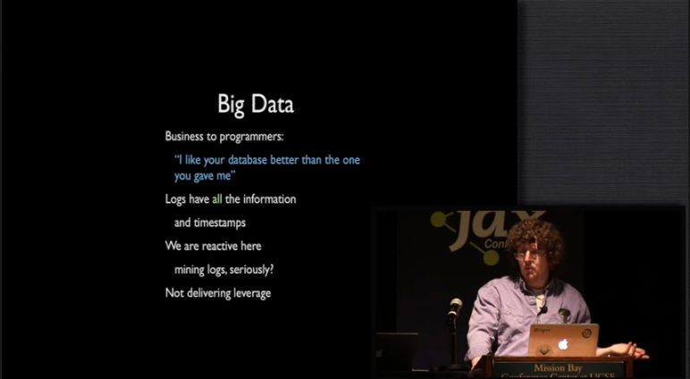

So big data. It's all connected. What is big data? I will contend that a certain percentage of big data is this. It's businesses telling programmers, "That database you have, I like better than the one you gave me because the one that you gave me only remembers the last thing I told it and your database, your logs, they know everything that happened in our business. You know everything. You have times for everything. Let's go mine that, find some good business decision making information because my database, it doesn't have it. It doesn't remember anything other than the last thing.

The logs have all the information. The logs have the time stamps, but I think it's really sort of a shame here because we're being reactive in this area. Mining logs, we know much better ways to reference information. We know how to store information in ways that's leverage-able. Logs are not that. MapReduce over logs is not that. Logs are full of crap, too, right? They're full of stuff about the program operation itself. There is business value information in there. We haven't built databases to store that yet, but that's sort of our fault.

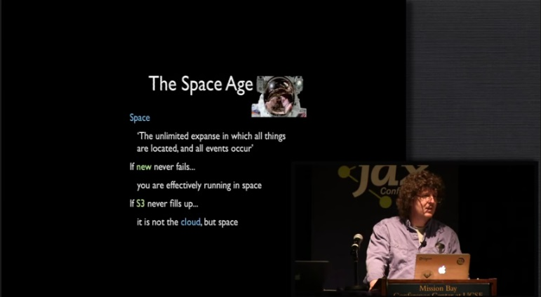

I think we're moving into what I would like to call The Space Age. One more definition, space, the unlimited expanse in which all things are located and all events occur. What's really interesting about the definition of space is that it has always, if you go back to the oldest definitions in the oldest languages, the definition of space has always incorporated both place and time. It's never been something that applied only to one or the other of those two things. It's always connected to two and there's a certain physics aspect to that. So if new never fails, if you can call new day after day, 24/7, over and over and over again, you are not running in a place. You're running in space. You're not seeing the edges of things. You're not delimited. You need new stuff, you'd get it.

If S3 never fills up, that's not the cloud, that's space. If every time you want to put a file on the S3, sure. Are you worried about the edge of it? I mean, most of the times, we don't worry about the edge of space. I mean, maybe you do but I don't.

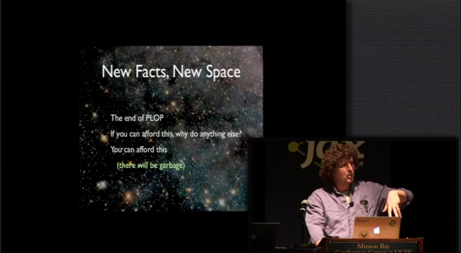

So information systems should have a different approach. They should say that new facts require new space. This should be the end of Place-Oriented Programming. We've had the facilities of this programming a very long time. If you could afford to do this, why would you do anything else? Anybody feels like, "I wish I could log but I can't? Because my disk is only 5 megabytes." Anybody ever had a 5 megabyte disk that cost thousands of dollars? That's not that way anymore, right? So you can afford to do this. Lots of interesting things will happen when you take this approach. A lot of the things that happen in memory with garbage collection are going to happen with storage. There will be garbage.

But that's okay. These are things that we're learning how to manage. So to summarize, unfortunately, I think we continue to use Place-Oriented Programming and the rationale is gone, and the sadder thing is we continue to make new things that are like this, brand new programming languages and brand new databases that still take this approach, still use a place orientation that's been invalid for at least a decade but certainly for the last five years. The rationale is gone.

We're missing out on all those benefits I listed before and I could talk to you about any one of those benefits for an hour. There this huge number of benefits to using values. We recognize them, right? Look at our information systems that we use for ourselves. We're proving we already know that. We don't overwrite our logs. We don't overwrite our source control. We're ready... we're in the space age for ourselves where we need to be in the space age for the businesses we're supporting.

There's definitely demand for this, this whole big data push and mining logs and everything else and tracking everything and keeping the time of everything. Businesses know there's tremendous value here. They want it. The demand is quite obvious. We have the resources to do it and I think that the challenge is to make sure that we do. What I would recommend is that you try to take an information-oriented approach to the way you build your programs.

Thanks.

[Audience applause]
