# Writing Datomic in Clojure

* **Speaker: Rich Hickey**
* **Conference: [GOTO Copenhagen Conference 2012](https://gotocon.com/cph-2012) - May 2012**
* **Video: [https://www.infoq.com/presentations/Datomic](https://www.infoq.com/presentations/Datomic)**


[Time 0:00:00]

```
slide:
                    copenhagen goto; conference

Writing Datomic in Clojure

       Rich Hickey
     Datomic, Clojure


```

I just want to verify my presumption.  How many people here know
Clojure?

How many people do not know Clojure?

One of the great things about Clojure, as it is in hiring, it is also
with audiences.  It is a great way to filter out the best of the best.

[Audience laughter]

I appreciate your coming.


[Time 0:00:27]

```
slide title: Overview

+ What is Datomic?
+ Architecture
+ Implementation - Clojure Applied
+ Summary
```

So what I am going to do is talk about how we implemented Datomic in
Clojure, and I will start by describing Datomic itself, and the
overall architecture, and then dig into a few of the implementation
details, and sort of summarize.

What I would like to do is go relatively quickly and have some
question and answer, but that may be too ambitious, because I do have
almost 40 slides, which usually takes me two hours.  So why don't we
get started.


[Time 0:00:58]

```
slide title: What is Datomic?

+ A new kind of database
+ Bringing data power _into_ the application
+ A sound model of information, with _time_
+ Enabled by architectural advances
```

So I guess the other question is: how many people are familiar with
Datomic at all?  A little bit.  OK.

So I will go through what Datomic is about.  Fundamentally, Datomic is
a database.  And the overarching goal is to move away from a
monolithic notion of what constitutes a database, to one where the
facilities of a database are distributed.  In particular, substantial
portions of the power normally attributed to the server in a database
are moved into your application servers themselves.  So you get more
power over programming with data inside your application logic.
Because typically, that has been "over there", and outside the scope
of your program itself.


[Time 0:01:48]

```
slide title: Why Datomic?

+ Architecture
+ Data Model
```

It couples architectural changes with a data model.  It might seem
familiar if you were at the keynote yesterday, because it really
strives to achieve the objectives that I discussed about modeling
information itself, and incorporating time.

[ The keynote he mentions above is Rich Hickey's talk "The Value of
Values".  He gave a one hour version of that talk at the GOTO
Copenhagen Conference 2012.  There is a transcription of it here:
https://github.com/matthiasn/talk-transcripts/blob/master/Hickey_Rich/ValueOfValuesLong.md ]

And it has been enabled by the fact that computers have gotten faster,
and networks have gotten faster, and many of the old architectural
presumptions about data locality -- in particular about the advantages
of a particular machine having the data on its disk -- are gone now,
due to the way networks work.  There are not advantages for that
machine.

So why do this?  I think for at least two reasons.  We want to pursue
this different architecture.  What happens when we deconstruct the
database?  And I want a different data model.


[Time 0:02:39]

```
slide title: Architectures

[Figure with many boxes labeled "App" connected via bidirectional
arrowed lines to a Server.  Figure labeled "Client-Server".]

Queries
Transactions
Consistency
Storage
```

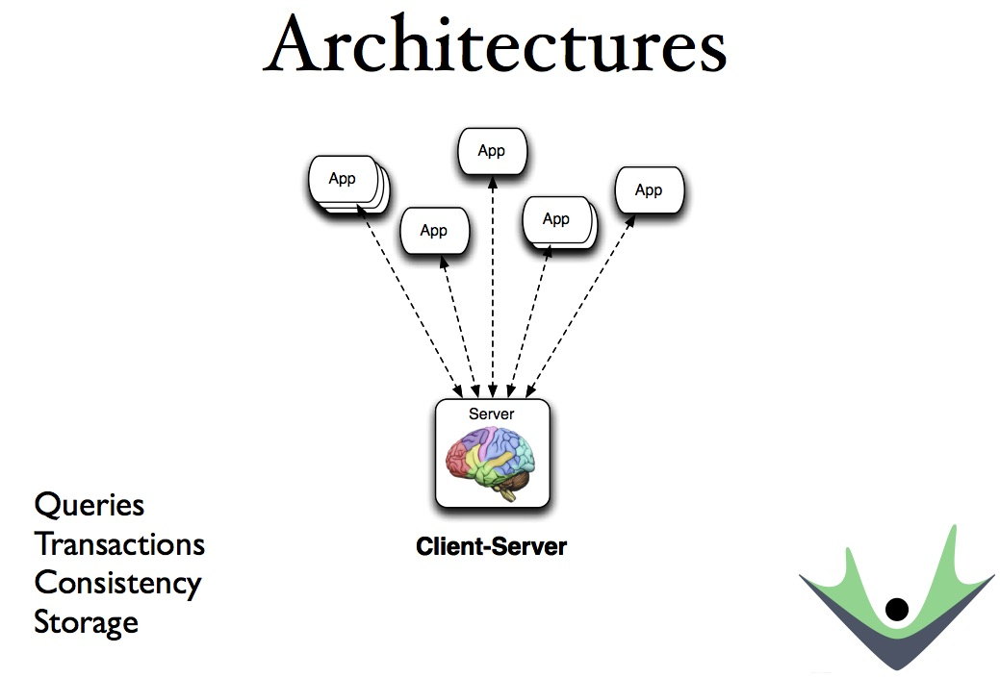

So architecturally we can look at databases moving through this
spectrum.  We start with traditional client-server.  This was born of
the fact that, way back, computers were really expensive.  They did
not have very much capacity, and getting a single one big machine was
a big expense.  So that machine became very special.  And you could
only afford one, and you put all the good stuff there, and the clients
were pretty light weight.

But this design fundamentally has a bunch of capabilities that we want
to track as we move from architecture to architecture.  A traditional
database has query support.  It supports transactions.  It ensures
consistency of the information that is placed into it.  And usually,
traditionally, that server also was in charge of storage.


[Time 0:03:31]

```
slide title: Architectures

[Same as previous slide, but now there are 2 servers instead of one,
now with title "Clustered Client-Server"]
```

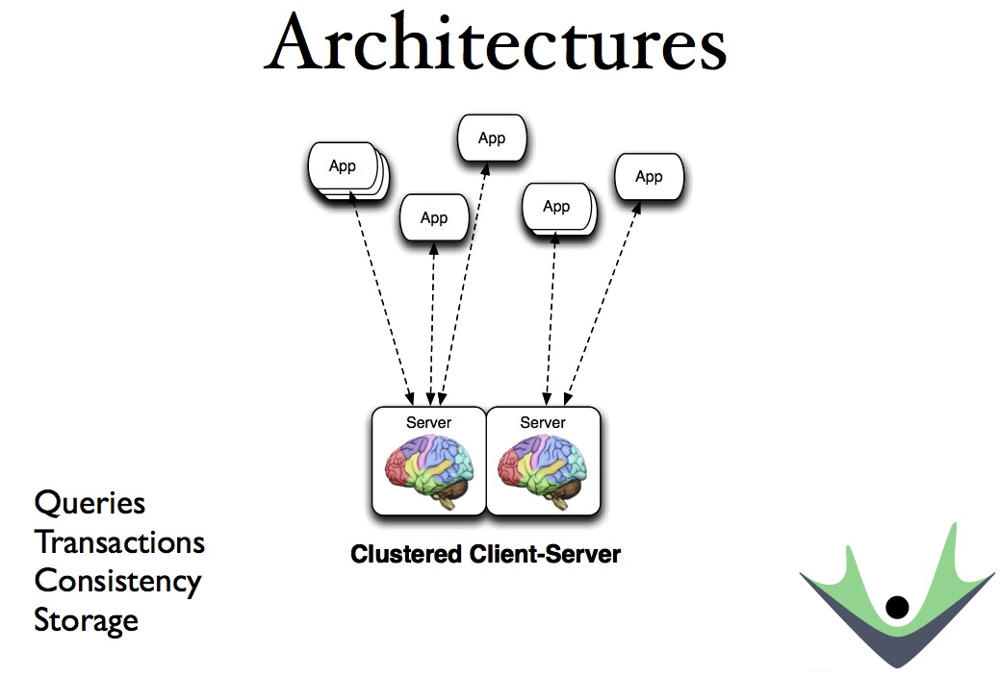

Moving forward from this we can look at, maybe in an effort to get
more throughput or some scalability, we would cluster this server.
Again we still have sort of a single logical entity.  We are using
more than one machine to accomplish it, but it still acts as a single
entity, handling the same jobs and sort of acting as one unit.

And this is very difficult to do, and as you know, probably, usually
expensive to do.

Of course there are still real big challenges there, because the
amount of coordination between clustered servers is very high.


[Time 0:04:09]

```
slide title: Architectures

[Same as previous slide, but now there are 3 servers instead of 2,
where each has one third of the data instead of all of it.  Now has
title "Sharded Client-Server"]
```

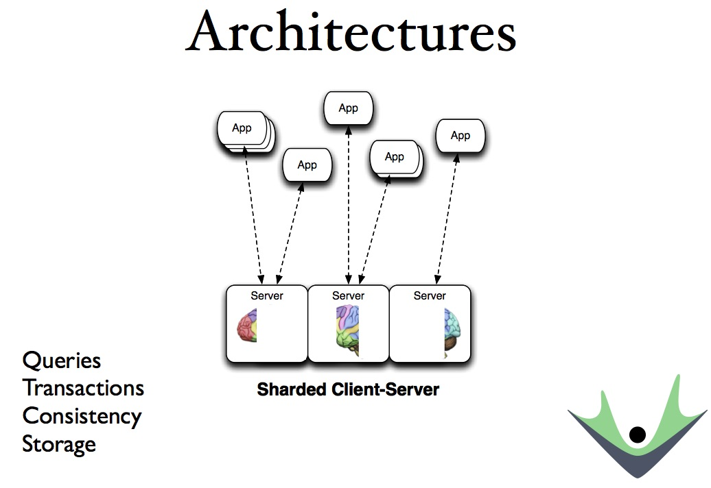

So in an effort to get even more scale, we have taken those servers
and divided them up and said: let us shard the data.  And at the point
you shard the data, you really end up with independent databases.
Maybe the sharding is done sort of globally, but really your
information is no longer connected.  This is three different
databases.


[Time 0:04:31]

```
slide title: Architectures

[Same as previous slide, but now the words "Queries", "Transactions",
and "Consistency" are shaded gray, instead of their former black.]
```

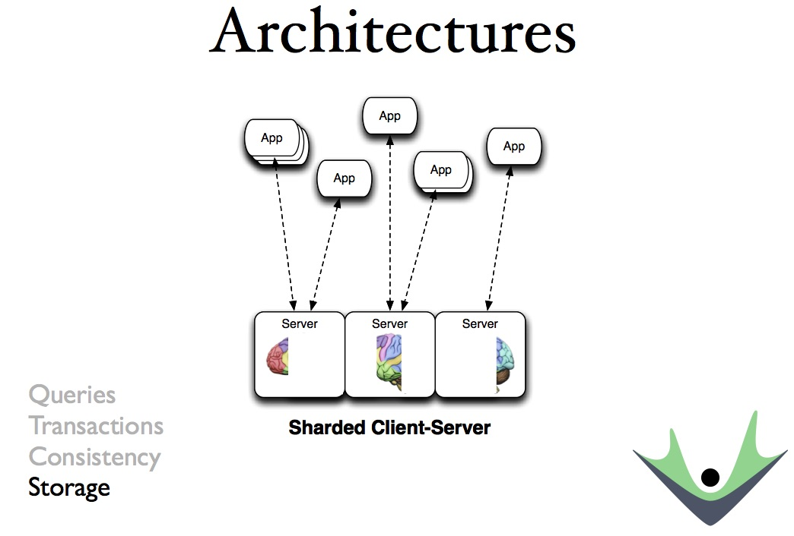

So you start to lose.  You start sharding, and then you cannot query
against shards.  You cannot do transactions across shards.  You cannot
ensure consistency across shards.  And really, that is why I think you
should consider these independent.  But you still have, maybe, storage
subsystems that are being serviced, but sharded servers really have
fewer capabilities.


[Time 0:04:53]

```
slide title: Architectures

[Same as previous slide, but now each of the three server boxes has no
figure inside of it.  Now has title "K/V Store".]
```

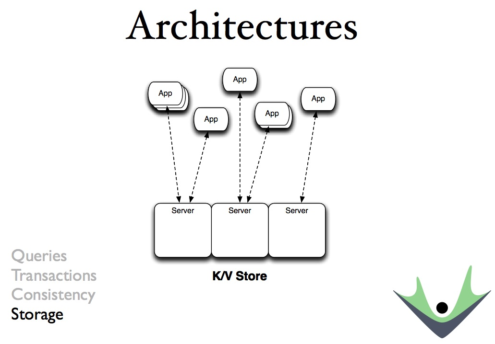

And then we move to the newer generation of things that say: you know
what?  By the time you are sharding, you are not getting many of those
advantages.  Let us just have key-value stores.  Now we have true
independence.  We are just going to consistent hash your keys, and
then go find the machine that they are going to run on.  And now we
have independence here.


[Time 0:05:13]

```
slide title: Architectures

[Same as previous slide, but now the three words "Queries",
"Transactions", and "Consistency" are not only gray, but also have
strike-through lines through the middle of them.]
```

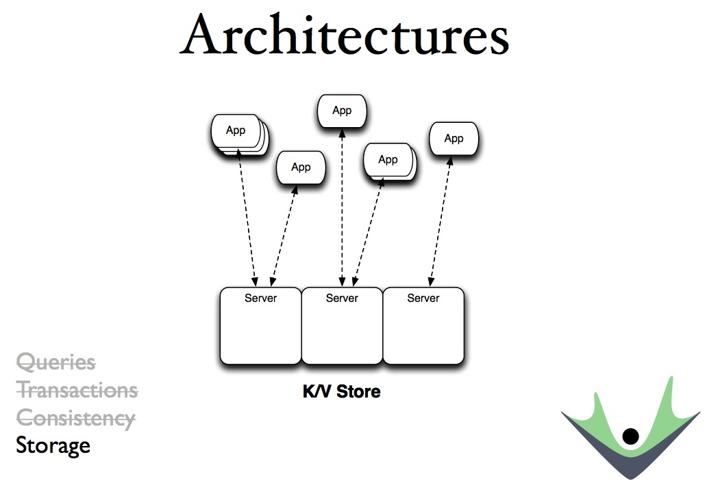

And at this point, I think you completely lose everything.  You no
longer have queries of any -- certainly not ad hoc queries.  There is
no transactionality left.  There is no consistency left.  Everything
is atomic and independent, so the idea of multiple things being
related to each other is gone.  You are really just in a storage
system.


[Time 0:05:32]

```
slide title: Architectures

[Same as previous slide, but now the three server boxes are labeled
inside with "Distributed" "Storage" "Service".]
```

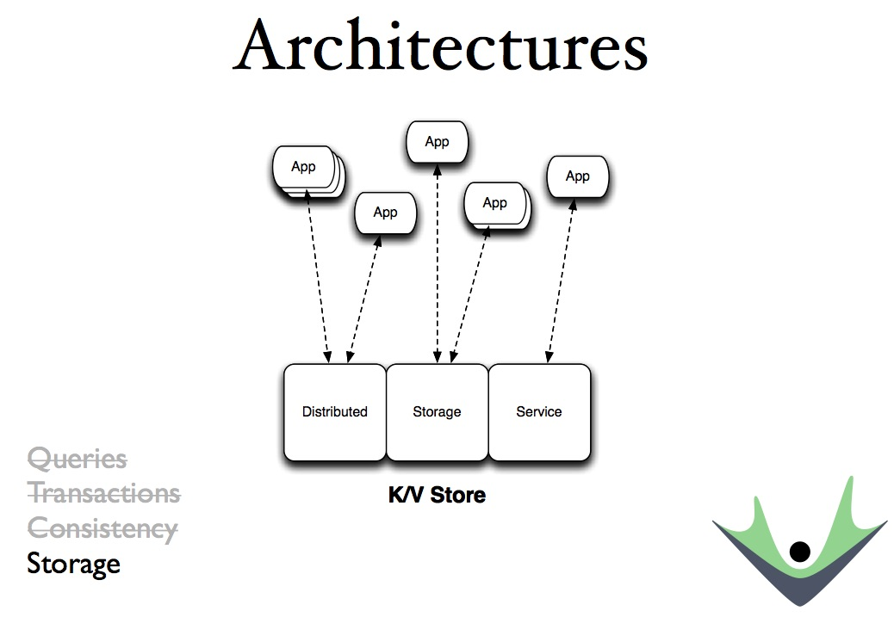

And I think you should basically start labeling these things
"distributed storage services", because they are not at all like
databases any more.  Databases really had a lot of leverage.  That was
one of the words I used yesterday.  Databases give you leverage.

There is no leverage in a key-value store.  Leverage is gone.  This is
like a glorified file system.  I put this blob there.  I called it
"1234".  And if I ask for "1234" I get the blob back.  That is not a
database.  No leverage.


[Time 0:06:00]

```
slide title: Datomic Architecture

[Now many boxes labeled "App" have the "brains" inside of them,
instead of in the servers.  Each has links to one of three boxes
labeled "Distributed" "Storage" "Service".]
```

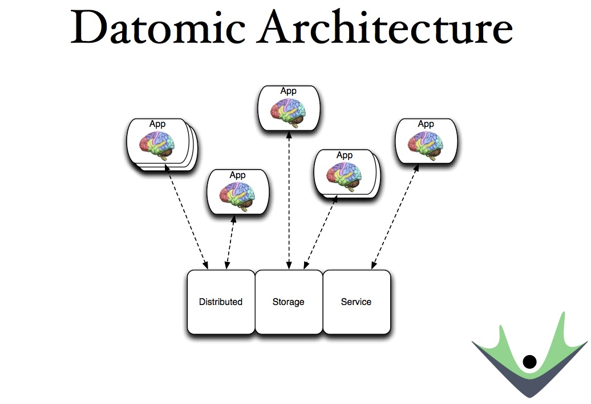

But there are lots of interesting architectural advantages to this.
In particular for scale, and for read scale.  So we want to tap into
that.

So Datomic starts with that idea of a distributed storage service, and
says: there is a lot of value to that proposition.


[Time 0:06:17]

```
slide title:

[Add this text to same figure]

Queries
--Transactions-- [strike-through]
--Consistency-- [strike-through]
Storage
```

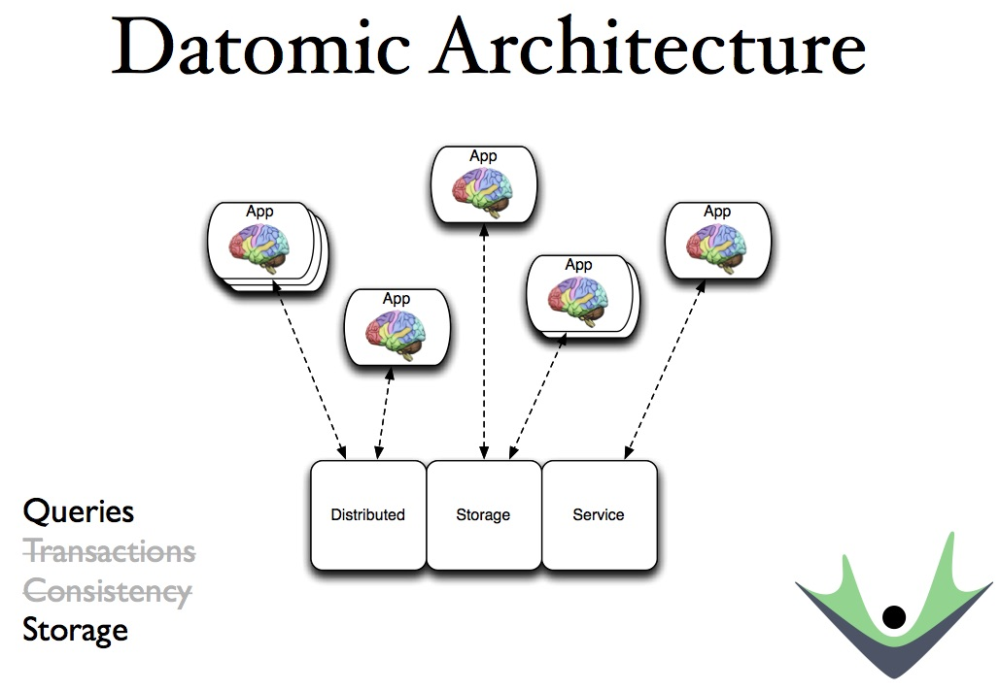

But let us try to re-obtain the leverage we had from traditional
databases.  And the first thing we want to do is reinstall queries.
So obviously if we use a storage service, we have storage, and what we
are going to do with queries is: we are going to place them in the
application servers.  So now every application server gets its own
brain.


[Time 0:06:37]

```
slide title:

[Same figure, except with small change that what were bidirectional
arrowed lines between App boxes and Distributed Storage Service boxes
are now single-directional to the App boxes, indicating that the App
boxes only read data from the Distributed Storage Services boxes,
never write to them.]
```

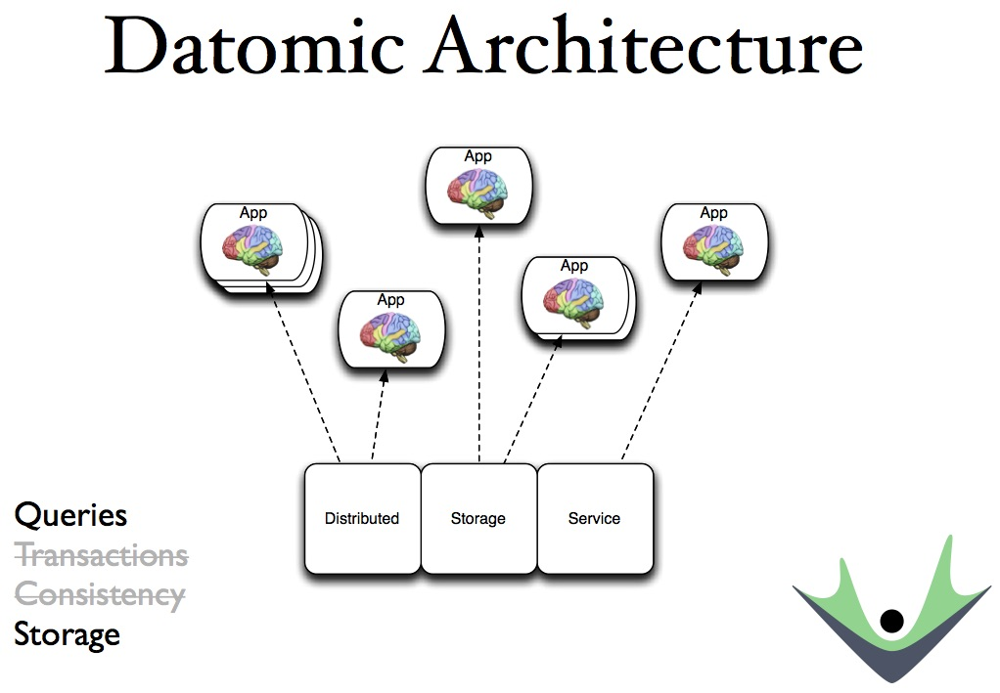

But we still do not have transactions or consistency at this point.
But you will see, if we move from the key-value store, every client of
a key-value store could write to the key-value store and read from it.
We are going to change that.  We are going to say: you can only read
from the storage service.


[Time 0:06:54]

```
slide title: Datomic Architecture

[Add to previous figure a box labeled "Transactor"]
```

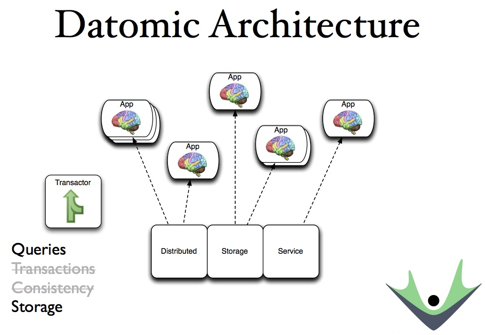

And we are going to reinstall a privileged member here, which we call
the transactor, whose job is strictly to coordinate transactions and
consistency.  And by reintroducing this element, we end up with a
hybrid model with some interesting properties.  We have distributed
reads.  We have distributed storage.  We have redundancy in storage.


[Time 0:07:18]

```
slide title: Datomic Architecture

[Same as previous slide, but now words "Transactions" and
"Consistency" no longer have strike-through lines through them.]

Queries
Transactions
Consistency
Storage
```

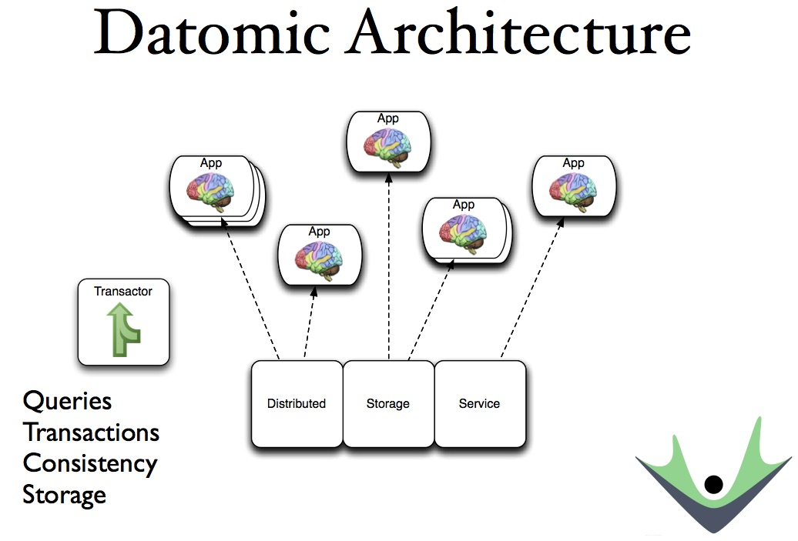

But we get back transactions and consistency.

So this is a hybrid model that has sort of a traditional model for
writes, and a new model for reads.


[Time 0:07:31]

```
slide title:

[Same figure as before, except a green line directed from one App box
to the Transactor box has been added, indicating that App box sending
the transactor a request to write to the database.]
```

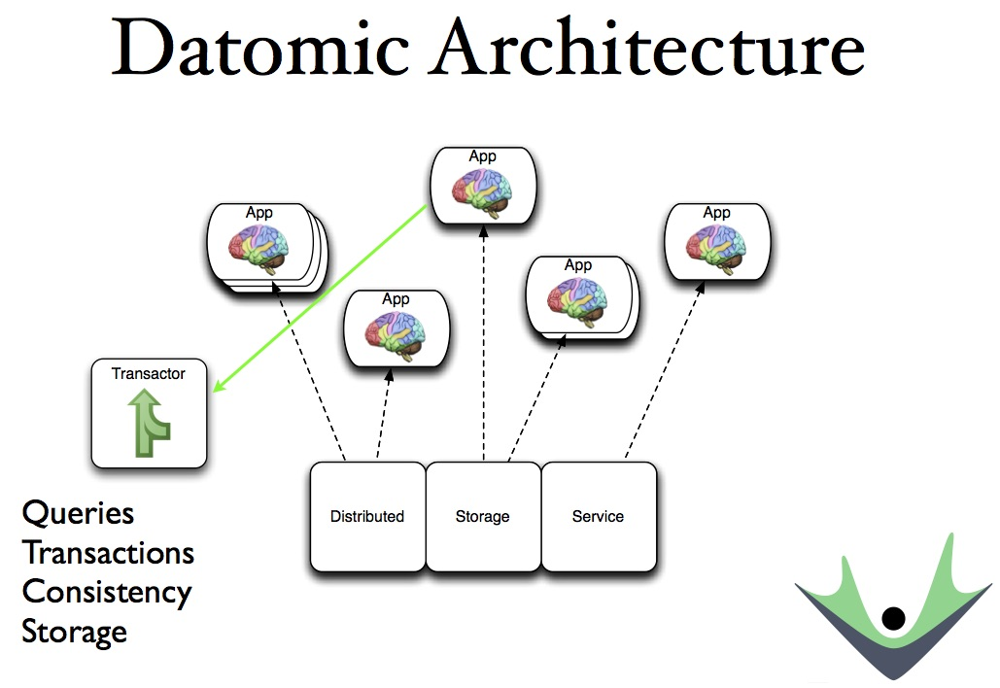

And this transactor only deals with writes.  It does not handle any
read load at all.  It does not answer queries or anything like that.


[Time 0:07:38]

```
slide title:

[To previous figure, add blue lines directed from Transactor box to
several App boxes, and to the Distributed Storage Service boxes,
indicating the Transactor sending updated data to those other
machines.]
```

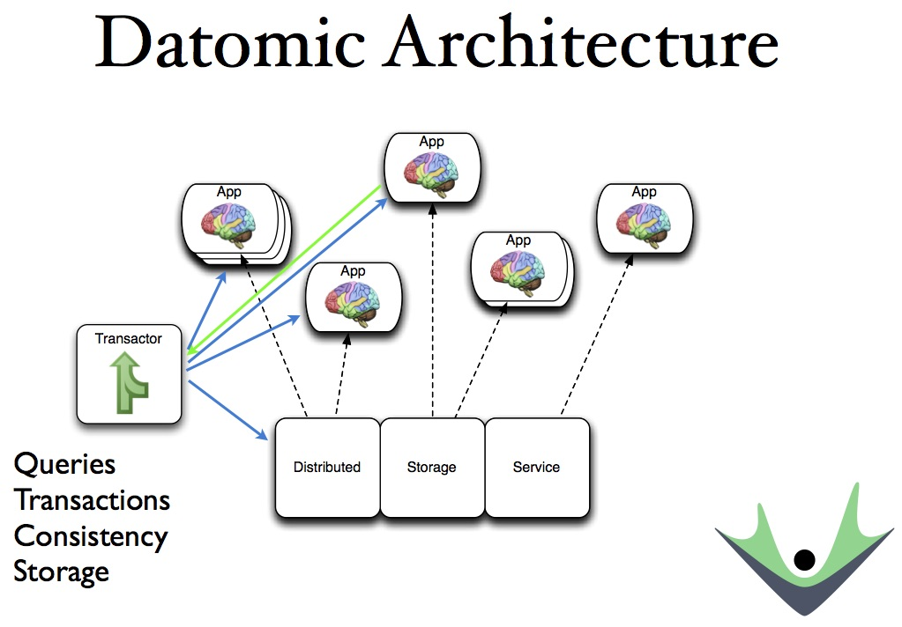

So when an application has some novelty, new facts, it is going to
send it to the transactor.  The transactor is going to broadcast this
back to other peers, we call them, that are connected.  And also
commit it to storage.  So it is transactional.  It is durable.  It
will not return until it is in storage.  And at that point it gets
reflected back.


[Time 0:07:59]

```
slide title:

[From previous figure, remove the green line from App box to the
Transactor box, probably to emphasize the blue lines from the
Transactor box sending novelty to the other machines.]
```

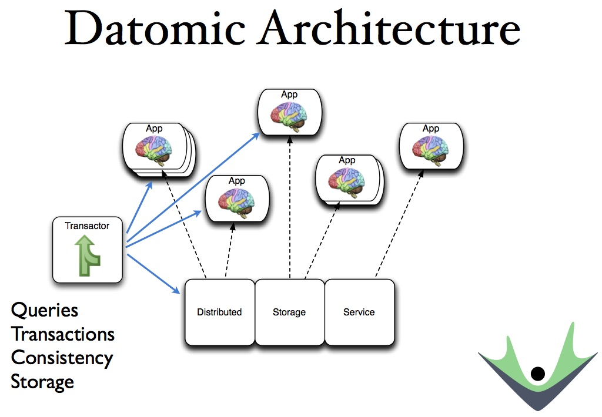

But you also have this nice path of novelty being distributed by this
system.


[Time 0:08:05]

```
slide title:

[From previous figure, remove the blue lines from Transactor box to
other boxes.]
```

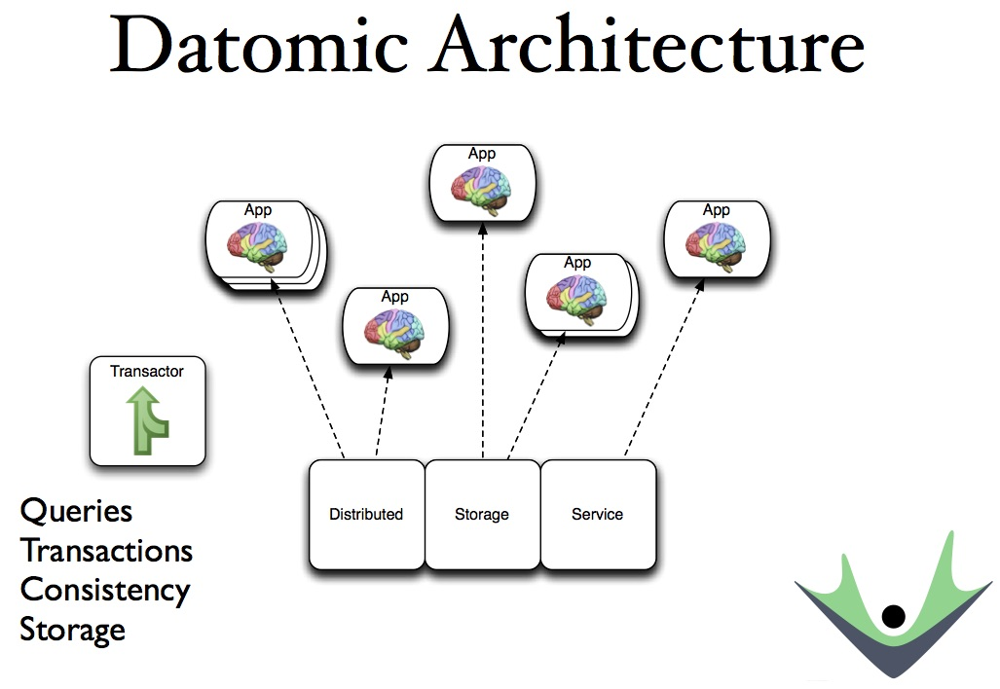

And at this point we have everything back.


[Time 0:08:12]

```
slide title: The Database, Deconstructed
```

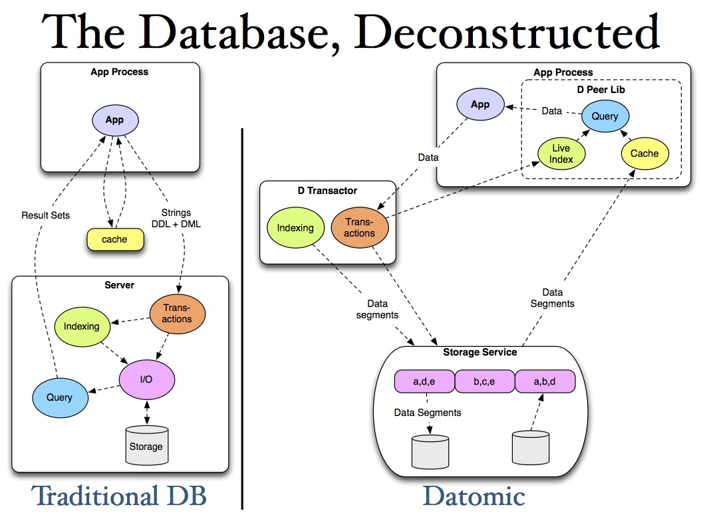

So one way to look at this is to sort of take the pieces of the
traditional architecture, and see where they end up in this model.

So if we look at a traditional database, again we have this monolithic
thing.  It does indexing.  It does transactions.  It does I/O to
storage.  It handles query load.  Your application itself, it does not
have much power at all.  It is completely relying on the server to do
all of the thinking.

But it often has a caching layer, or something like that, because this
unit [the server] gets overloaded.  So what happens is applications
would go issues queries, and then say: wow, that was expensive.  Maybe
somebody else will ask this same question.  I will manually go and put
that answer in a cache.  And then I will manually check the cache
before I do this, and this is all sort of "on me" to add this layer to
try to avoid overloading this central resource.

So we can look at where all of these components end up.  I/O moves to
a storage service.  And it is handled completely by that.  And that is
isolated.

Transactions move into the transactor, which only does that.

Indexing is currently a background process inside the transactor.
That could move out of there, but that happens to be where it is done
right now.

And then the application process itself, and you can read this as an
"app server" -- that tier that was your app server -- now has a query
component inside it, which is embedded, as well as this propagated
index.  So it has got a live index, and the ability to read from
storage.  And by reading from storage as needed, and live merging with
this index, it can provide the application with very very fast local
query capability that is isolated from the rest of the system.

And so we can go and dig into what attributes we are trying to achieve
by breaking it apart like this.


[Time 0:10:05]

```
slide title: Designed for the Cloud

+ Ephemeral instances, unreliable disks
+ Redundancy in storage service
+ Leverages reliable storage services
  + e.g. _DynamoDB_
```

So the first thing we want to do is: we really want to accept the fact
that as we move forward with more virtualization -- we had virtualized
memory, now we have virtualized storage -- and now we have sort of
virtualized architecture.  We have "machines" that we can start, and
then they go away.  We have "storage".  We have all of these ephemeral
components.

So you want to design systems, moving forward, where every component
is ephemeral.  Everything can die.  Failure is a continuous state.  So
you want to design for that.  You want to design for unreliable disks.
And that is part of what is happening here.  You need redundancy as
soon as you do that.  You cannot have a privileged machine with a
privileged disk.  So you want redundancy in the storage.

And we want to be able to piggyback on top of existing reliable
storage services.  So DynamoDB would be an example of an existing
reliable storage service.  There is no reason why every database needs
to solve every problem associated with databases.  You are just going
to get a million implementations of how to put blocks on the disk, and
how to read them back.  And there is really no advantage to doing that
any more.

And there is substantial advantage, as you will see, in making this an
independent architectural component.  In particular, you can have more
than one storage service.  So we support memory.  We support SQL.  We
support Infinispan.  And there are a bunch of other interesting
key-value stores like Couchbase or Riak that make logical sense in
this role as a storage service.

So combining these things makes a lot of sense.  Let each component do
what it does best.


[Time 0:11:41]

```
slide title: Elastic Scaling

+ More peers, more power
+ Fewer peers, less power, lower cost
+ Demand-driven
  + No configuration
```

The other thing we are looking for is scale.  So I think one of the
problems we have had in deconstructing architectures so far is that we
have taken everything together and said: there is this monolithic
database.  Let us make a bunch of monolithic databases.  And that is
how we get distribution.

But now we are taking everything.  Storage, query, transactionality,
or the lack thereof, and saying: let us divide that up, and have a
bunch of little pie pieces that all look the same.

As you saw in the prior diagram, I do not think you actually want to
do that.  I think you want to make independent decisions about
transactionality, storage, and query.  When you do that, you get
independent scaling characteristics, and independent failover
characteristics for each part of the architecture.

So in the case of query, because we have put query capability in each
application server, when you add more application servers, you get
more query power transparently.  And that is truly elastic.  When you
need less query power, you just stop some of those machines from
running and it goes down.

It is easy, also, for this kind of scaling to tap into demand-driven
scaling.  So when you set up auto-scaling, in Amazon for instance, you
can make that triggered by the amount of demand, the amount of load,
that is being seen.  And you are getting query scaling out of this.

Contrast that with saying: I am going to preconfigure a cluster, or I
am going to manually go to a console and add a machine to a cluster,
so that I can have a bigger clustered server.  That is a very explicit
action.  It is not responding to demand dynamically.  So it is a big
deal to tap into demand driven scaling capabilities.  And that is what
is happening now with query when you embed it in the application tier.


[Time 0:13:29]

```
slide title: Get Your Own Brain

+ Query, communication and memory engine
+ Goes into your app, making it a _peer_
+ The db is effectively local
+ Ad hoc, long running queries - ok
```

So you get your own brain.  We are going to look in more detail at
what these pieces are, from an implementation detail.  But we have
query, a communication engine, you have memory and a caching engine,
all built in to your application servers by including the peer
library.

And the effect of that to your application is: the database feels like
a local resource.  And this is a very big deal, because I do not think
people really appreciate how much client-server has invaded the way
they think about what applications can do, and what is OK.  Because
there is this conversational aspect, and the fact that you think it is
expensive, and you think that you are tapping into a shared resource
that is potentially getting overloaded, really compromises what you
think your application is allowed to do.

And when you move this stuff local, now it is completely different.
If you have your own app server, and it is doing analytics, and it
needs to run queries that run a long time, is that OK?  Now all of a
sudden it is completely OK.  Those queries do not tie up any shared
resources.  No one is waiting for you.  It is your own machine.  That
is a complete inversion of logic from when you have a server, or even
a set of servers, that is a shared resource that you really count on.

So ad hoc queries, long running queries, that all becomes OK because
you have your own brains.


[Time 0:14:51]

```
slide title: Logic

+ Declarative search and business logic
+ The query language is _Datalog_
  + Simple rules and data patterns
+ Joins are implicit, meaning is evident
+ db and non-db sources
```

From a logic side, again, one of the mission statements was to bring
the power of programming with data into the application.  That is what
we are trying to do.  So we have a declarative logic engine built into
the application peers.

It uses Datalog.  How many people know what Datalog is?  Not too many.
So it is a query language.  It is kind of pattern oriented.  It is
very simple, in a true notion of simplicity.  But it has power
equivalent to relational algebra.  So it is the full power of
relational algebra.

But the point now is now that this is part of your application.  So
this is a really great thing.  SQL is a really great thing.  It is set
oriented.  It is declarative.  It is very powerful.  But it has always
been "over there", in the server, in a different language.  You have
to send strings to it.  I get something back.  It is conversational.
There is a lot about that that does not make it useful to you in your
application.  It would be nice if you could use it in your
application, and that is what we have done.

So you have Datalog locally.  In Datalog itself, joins are implicit.
It is very evident kind of code as you read it.

And in addition to being able to access the database, we really want
applications to be more declarative themselves.  So the Datalog engine
can be applied to your own data in memory, or data from other sources.
So you can combine database sources, and in memory sources, and
collections, together in queries.  You can query collections.  You can
query System.getProperties.  You can query that.  You can query the
result of that, instead of having to write this loop.

And I think that is really important, because those kinds of
applications are clearer, and easier to debug and make correct.


[Time 0:16:49]

```
slide title: Perception

+ Obtain a queue of transactions
  + not just your own
+ Query transactions for filtering / triggering
```

So perception is also important.  It is a thing I talked about
yesterday.  Perception in the real world is facilitated by passive
communication.  You do not ask things to see them.  Light bounces off
of them, and you just observe it, because it comes to you.  You did
not do anything, and they did not do anything.

And mimicking that architecturally means push, essentially.  It means
some sort of broadcast.  And so you can get a queue of transactions
inside a peer.  It will include your own transactions as well as the
transactions of others.  And then you can hook into that for any
purpose you want.  So you can make reactive systems that do not have
to poll the database.  Again, you are trying to get away from this:
there is this central thing I need to go and keep asking questions of.


[Time 0:17:37]

```
slide title: Consistency

+ ACID transactions add new facts
+ Database presented to app as a _value_
+ Data in storage service is immutable
```

From a consistency standpoint, because we have reestablished a
significant component in the transactor, we get back ACID transactions
with full ACID capabilities, including the ability to be consistent
across any piece of data inside the system at all.  So there is no
sharding, and there is no separation there.  There are no per-document
transactions, or per-document set, or anything like that.

So that is the traditional notion of consistency that has to do with
process, change.  I want a set of changes to be done all together, or
not at all.  And isolated.  Those properties.

But I think there is another notion of consistency, which really
matters to application logic, which is: can I present to my
application logic a consistent set of data, so that I can run a
report.  How many people are able to make reproducible reports against
an in place update database?

It is very difficult, because the database changes between when you
made the report and not, and then you have to do all of this extra
work.  And sometimes it is just simply impossible.

What happens inside Datomic, and what we are trying to achieve -- and
this is part of what it interesting about the implementation from a
Clojure perspective -- is we are actually trying to present the entire
database to the application as a value.  As a first class value, like
I talked about: completely immutable.  You do not see any other
changes.  Every part about it is evident.  It is comparable, and all
of those other kinds of characteristics.

And so the way we achieve that is to make sure that all of the data
that is kept in the storage service is immutable.


[Time 0:19:14]

```
slide title: Programmability

+ Transactions / Rules / Queries / Results are data
+ Extensible types, predicates, etc
+ Queries can invoke your code
```

We want the database to be programmable.  Obviously as Clojure users
we care a lot about programmability of programs.  And it is a
traditional sore spot for databases, that they are not particularly
programmable.  So you will see, as we go through this, that
transactions and rules and queries: they are all data.  They are data
in.  They are data out.  They are defined in terms of data, not in
terms of operations.

And there are a bunch of common sense things in terms of extensibility
and predicates.

And also, critically, queries can invoke your own code.  So it is an
extensible system in terms of the logic that can run.


[Time 0:19:49]

```
slide title: A Database of Facts

+ A single storage construct, the _datom_
  + Entity / Attribute / Value / Transaction
+ Attribute definition is the only 'schema'
```

Unsurprisingly, the model, from a data model perspective, is that it
is a database of facts.  And when you try to follow through some of
the things I talked about yesterday all the way down, you realize that
it is very difficult to make an efficient database of facts if the
granularity of a fact is a row, or a document.  They are too big.

If you are going to say: I want to record change, unless you have an
independent delta scheme, you have to say: I have got a new address.
Let me save "you" again.  That does not make sense.  You need
something that can represent just "new email address".

And so that means boiling down to sort of an atomic notion of what
constitutes a fact.  And you can easily build up the requirements for
this.  "Sally" is not a fact.  "Sally likes" is not a fact.  "Sally
likes pizza" is also not yet a fact, because what did we learn about
facts yesterday?

[Audience response]

Yeah.  Facts are things that happened.  So "Sally likes pizza as of
when"?  When did that happen?  That now is a fact.

And rather than store a time of day component here, what we do is we
store the transaction that recorded the fact, because then we can put
the time of day on the transaction, but we can also put other
interesting and useful stuff on the transaction like "who did it?",
"what was the source of the data?", "has it been approved?", and other
things like that.  And only incur the expense of one additional
component to this thing [the datom].

[Time 0:21:27]

So we call this thing a datom.  Entity, attribute, value, and
transaction.  And the only schema that is associated with a Datomic
database is the definition of attributes.  There is no other
structural construct.  There are no records.  There are no types.
There are no classes.  There are no document schemas, or anything like
that.  But you do need to define attributes before you use them.

[Audience member: What do attribute definitions look like?]

They have a name.  They have a type.  They have a cardinality.  They
have whether or not it is a component of the thing that points to it.
And a few other things.

[Audience member: Is that a setting thing that you define before you
actually use it, or is it a run-time "I want a new attribute of
this?"]

You can make a new attribute, and attributes are data.  Attributes are
facts, right?  They are stored in the database just like, and right
along side, everything else, completely queryable and time coordinated
to everything.  They are just data.  They are just facts.

[Audience member: Every element had a time.]

Every fact has a transaction that it occurred in, and transactions
have time associated with them.

[Audience member: TBD]

No.  There is the new fact, which is: you no longer like pizza.  And
that fact happened at a different time.  And that is how we do it.  So
there are assertions and retractions.  We do not go back to facts and
change them.  There is just a new fact.

I moved, so that does mean: my address is no longer this.  But just
saying "I have a new address" is sufficient to imply that it is not
the old address, and cardinality can help make that automatic, too.
If you have a cardinality one thing, and you now have a new value of
it, it means the last value has been superseded.


[Time 0:23:10]

```
slide title: Adaptability

+ Sparse, irregular, hierarchical data
+ Single and multi-values attributes
+ No structural rigidity
```

Like many of the newer databases, we do want to try to address some of
the pressures faced by people trying to use rectangle-oriented
databases.  Traditional relational databases force rigid schemas that
cannot have blanks, and have difficulty dealing with multi-valued
entities, and hierarchical data, and sparse data.

And of course the beautiful thing about a model like this that is
atomic, is that you can build any of those things that you want.  But
you are not forced into them, and Stu's talk later is going to have
great examples of all of that.

That talk is not the next talk.

[ "the next talk" refers to "Get Logical with Datalog", Stuart
Halloway
https://gotocon.com/cph-2012/presentation/Get%20Logical%20with%20Datalog ]

It is the talk in the Iconoclasts track.

[ "The Impedance Mismatch is Our Fault", Stuart Halloway
https://gotocon.com/cph-2012/presentation/The%20Impedance%20Mismatch%20is%20Our%20Fault
Video: https://www.infoq.com/presentations/Impedance-Mismatch ]

[Stuart Halloway, from the audience: But the next talk will be really
good, too.]

[Audience laughter]

Yeah.

So we want to move away from structural rigidity, as most people do.


[Time 0:24:01]

```
slide title: Time Built-in

+ Every datom retains its transaction
+ Transactions are totally ordered
+ Transactions are first-class entities
+ Get the db _as-of_, or _since_, a point in time
```

And of course we saw, in order to be a fact based database we have to
have time built-in.  We saw every datom has its own transaction.  The
transactions are totally ordered.  They are first class.

And because the database is a value, and because everything has time
on it, you can actually say of the database itself: give me this
database as of last week, or since two months ago.  And then issue
queries against that view of things.


[Time 0:24:28]

```
slide:

Implementation
```

But the focus of this talk is on implementation.


[Time 0:24:31]

```
slide title: Architecture
```

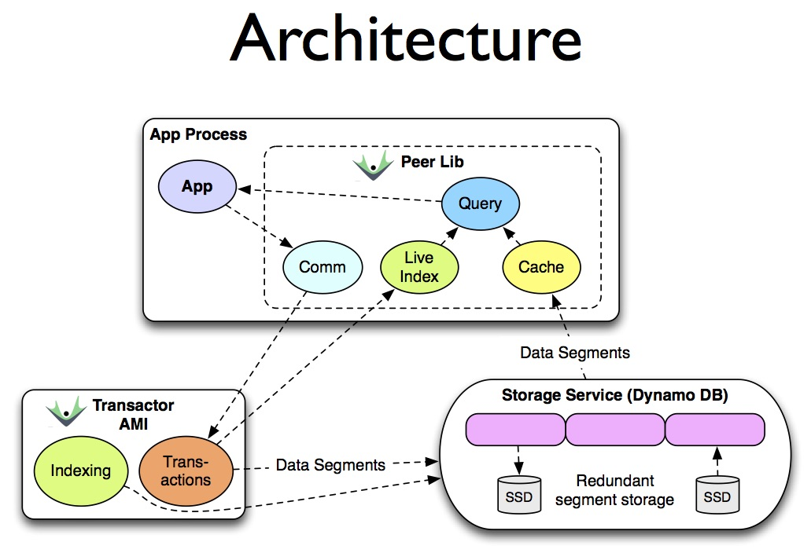

So let us look at the architecture a little bit more close up.  This
is just the components of Datomic now.  We are going to see the
application process uses a peer library.  It has some communications
components.  It has something that represents the index.  It has a
caching component and a query component.

The transactor has indexing and transactions and storage.


[Time 0:24:51]

```
slide title: State

+ Immutable, expanding value
+ Must be organized to support query
+ Sorted set of facts
+ Maintaining sort live in storage - bad
  + BigTable - mem + storage merge
  + occasional merge into storage
  + persistent trees
```

The things we are trying to accomplish with this design, or the
problems we are trying to solve in the design, the first thing we have
to deal with is state.  How is the database a value?  In other words,
how can you think of something that is getting new facts as a value?

And one way to conceive of it is sort of like the rings of a tree.  As
you add new rings to the outside of a tree, the inner parts do not
change.  And so with that kind of a notion of value -- in other words,
it is immutable, but it expands over time.  You are still not updating
in place.  So you still actually have all of the value benefits, as
long as you are able to talk about it as a particular point in time.

So that is sort of a philosophical hurdle you have to get around.  But
at that point, you are fine.

But again, the key here is leverage.  The point of a database is to
organize information so that you can get leverage out of it.  In my
mind, leverage is query, and its organization is indexes.

So the way we do this is: state is represented as a sorted set of
facts.  But one of the things that is really important is to learn the
lessons of BigTable.  And what BigTable showed us was: maintaining
sort, and maintaining an index live on disk, is a bad idea.  It is
incredibly inefficient.  You keep rewriting the head of something.

[Time 0:26:08]

And what you want to do instead is accumulate change, and merge it
periodically.  Does everybody know how BigTable works?  Does anybody
know how BigTable works?  So BigTable accumulates a bunch of stuff.
It keeps a sorted set in memory, and a sorted set on disk.  And then
every now and then it will merge from memory to disk.  When you ask it
a question, it always answers the question by giving you a live merge
of memory plus disk.

So it is the same strategy here.  That is very very important.  I do
not think you can do an efficient live indexed immutable thing.  You
just use _way_ too much storage, and you are constantly garbage
collecting.  So we do an occasional merge into storage.

Now that does not mean that the data is not durable.  We keep
everything that comes in, as of the transaction acknowledgment, has
been made durable, but it has not necessarily been merged into the
durable index.  And until it has been, it is kept in memory.

And unsurprisingly for Clojure users, the whole thing behind this is
persistent trees.  So now we have durable persistent trees.


[Time 0:27:15]

```
slide title: Memory Index

+ New persistent sorted set
+ Large internal nodes
+ Pluggable comparators
+ 2 sorts always maintained
  + EAVT, AEVT
+ plus AVET, VAET
```

So we can look at what the memory component of this looks like.  It is
a persistent sorted set.  It is not the one that is in Clojure, which
is a red-black tree.  This is a new persistent sorted set that uses
big internal nodes, so it works a lot more like some of the other
Clojure data structures.  And it has pluggable comparators that you
would expect.

And there are always two of these maintained.  So without any user
intervention, we are always maintaining all of the datoms in entity,
attribute, value, time sort [EAVT], and attribute, entity, value, time
sort [AEVT].

And then there are ways to get, or request, attribute value sorts
[AVET], and the reverse indexing [VAET].  We do reverse indexing
automatically for any entity to entity references.  So if "Sally likes
Fred", there is a fast way to get from Fred to the fact that Sally
likes Fred.


[Time 0:28:14]

```
slide title: Storage

+ Log of tx asserts / retracts (in tree)
+ Various covering indexes (trees)
+ Storage requirements
  + Data segment values (K->V)
  + atoms (consistent read)
  + pods (conditional put)
```

So we can look a little bit about what we do in storage itself.
Unsurprisingly, we use storage like a tree.  Unlike BigTable, which
takes the segments that it produces in memory, and does a full merge
sort into another big block on the disk, we are not that disk centric.
We are anticipating using more "key-value store"-like storage engines.
So we want to keep the block orientation that is traditional in
databases.

So we use storage akin to the way a traditional database uses the file
system.  We store blocks in storage.

So what we are going to do is: we are going to have asserts and
retractions.  That is, all of the fundamental data boils down to
asserts and retractions, stored in these sorted indexes.  What we
require of a storage engine is most basically key-value storage.  We
are going to associate a key not with some particular fact.  These
values are actually big chunks.  They are like segments.  They are
like blocks of a traditional database.  We put blocks of sorted
Datomic data into storage.

But, interestingly, doing this full implementation requires the
Clojure data model, the Clojure state model.  We have essentially a
distributed version of the Clojure state model, with the moral
equivalents of atoms and refs.  And that puts the requirement on the
storage system that they offer consistent read, so we can implement
atoms, and conditional put, or CAS, or something like it, so we can
support pods, or you can ... I hate to say pods.  But pods are like
accumulator-like refs.

So it is the Clojure state model, now extended to storage.


[Time 0:29:59]

```
slide title: Index Storage
```

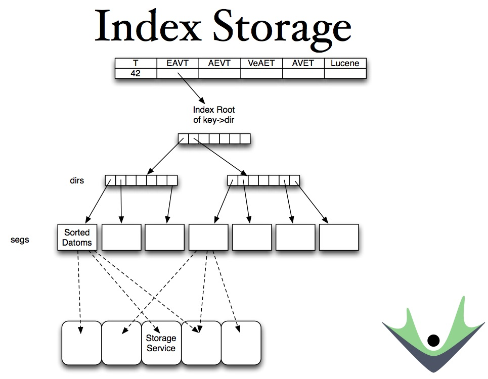

And storage looks like this.  Essentially there is a single root of
the index.  There is additional storage associated with the log.  So
as data comes in, it is immediately put in the log.  This [depicted on
the slide] is the thing that is periodically updated.  And again, it
is not updated in place.  Everything we put in here is immutable.

But there is a root that points to a bunch of the different sorts.  We
also do Lucene inside this.  And it is associated with a transaction
time.  In other words, this includes all transactions prior to this
one.

Unsurprisingly, it is a tree.  It is a very very high branching factor
tree, and it is very shallow.  So it is only three levels, no matter
what.  There is a root, which is a bunch of pointers to directories,
which are a bunch of pointers to segments.  Each segment is a bunch of
sorted, compressed datoms.

And it is these things that we actually store, key-value like, into
storage.  So a whole big block, like 64K, of sorted datoms go in at a
time, into storage.

That is how that looks.


[Time 0:31:07]

```
slide title: What's in a DB Value?
```

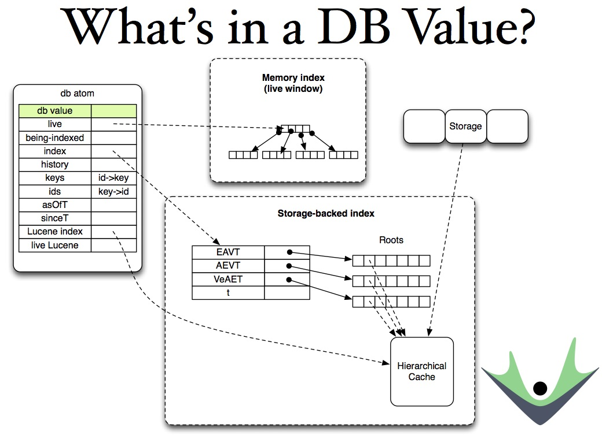

And then we can lift up a level to what a database value is.  So we
said the application has a database value.  So we know what a map is
in Clojure.  It is all in memory.

So how do we do a value like that, to present to the application, that
is actually backed essentially, partially, by storage, and has I/O
associated with getting that storage.

And that looks like this.  There is a root, which is the DB value
object, which is stored in an atom.  This is it.  This is _all_ the
Clojure state stuff that I need to implement a database in Clojure.
That is all.  There is not like a pile of stuff.  One atom is wrapped
around the database.

It has got a pointer to that memory index.  So this memory index is a
set of persistent sorted sets.  And it has got a pointer to a
hierarchical cache that is backed, on cache miss, with I/O to the
storage system.  And that is, again, in parallel.  So there is going
to be EAVT up here, EAVT down here, AEVT, AEVT, and everything else.
So there is the new, the novelty is accumulating in memory.  And
everything that happened before is accumulating here.

So periodically we will flush the novelty, and it will be here.  This
will empty out.  And all of this is immutable.  This is immutable.
That is immutable.  This is immutable.  This is the only mutable
thing.  This atom.  We are going to swap it occasionally to new stuff.

So you have this mirrored set of things, a memory version and a disk
version, and the disk is ultimately backed by storage.

I will describe a little bit about how we use Guava for that.


[Time 0:32:57]

```
slide title: Process

+ Assert / retract can't express transformation
+ Transaction function:
  (f db & args) -> tx-data
+ tx-data: assert | retract | (tx-fn args ...)
+ Expand / splice until all assert / retracts
```

So that is sort of the storage side.  The other part of the system is
the process side.  How do we send change across?

And fundamentally, process is done with assertions and retractions.
But assertions and retractions are insufficient to do transformation.
If I want to say: I want to add ten dollars to your account balance.
If you balance was a thousand, and I assert a thousand and ten, that
is potentially a race condition with somebody else who is trying to
adjust your balance.

So you really want to have a functional transformation of values in
the database.  And the way we do that is with transaction functions.
A transaction function is a function of the value of the database, and
some arguments.  And what it produces is: other transaction data.  So
if a transaction is assertions and retractions, and maybe calls to
transaction functions, then a transaction function can return
assertions, retractions, and maybe calls to other transaction
functions.


[Time 0:33:56]

```
slide title: Process Expansion
```

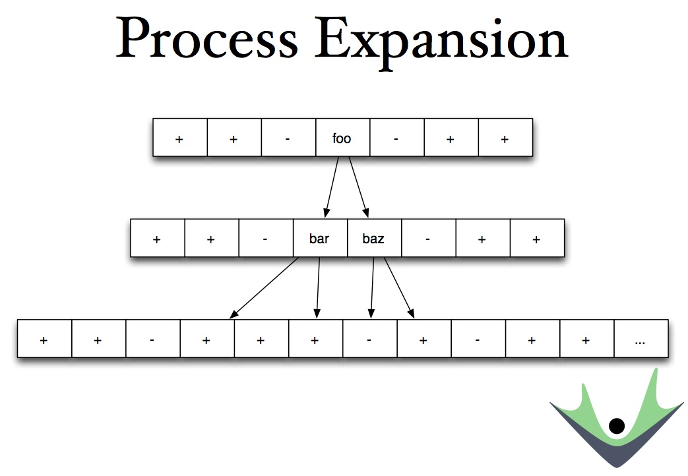

So that is what it looks like.  A set of these things.

And what happens is: transaction functions get called, and their
results get spliced into the transaction.  So if I said assert,
assert, retract, call foo on something, or let us just read this as
"adjust account balance for Fred", retract, assert, assert.  And then
this turned into a two step process that was: do this, and then do
that.

Eventually it is going to bottom out on: all assertions and
retractions.  And for Clojure users, what does this smell like?

[Audience member: Macros.]

Macro expansion, right.  It is just like macro expansion.  But it is a
beautiful thing for a data model, because it really makes sense.
There is a ground for data, which is assertions and retractions.  And
functional transformations either expand into other transformations,
or eventually it all turns to ground.

And it is only this set of final assertions and retractions that ends
up in the database, and that gets broadcast out to the peers.


[Time 0:34:57]

```
slide title: Transactor

+ Accepts transactions
  + Expands, applies, logs, broadcasts
+ Periodic indexing, in background
+ Indexing creates garbage
  + Storage GC
```

So the transactor accepts transactions.  It serializes transactions.
There is research done at Yale that proved it is much faster to just
serialize transactions and do it all in memory, than it is to have a
complicated scheme for trying to figure out who is overlapping with
who, and how queries and transactions interact with each other.

[ Please send any knowledge of the particular research mentioned here
so this transcript can point to it.  The best lead I have found so far
are the pages linked below, mentioning some academic research that
guided the design of the VoltDB database:

https://www.voltdb.com/product/data-architecture/academic-research-behind-voltdb

https://www.voltdb.com/product/data-architecture/no-wait-design

This might be one of the academic research papers involved, found by
searching for the list of author names from the page at the first of
the two links above: Stonebraker Abadi Helland Madden Pavlo Zdonik

https://dl.acm.org/citation.cfm?id=1325981

See also this Wikipedia page on H-Store, which later became VoltDB,
and links to research articles in its "References" section:

https://en.wikipedia.org/wiki/H-Store ]

It is actually the same research that is behind Volt, which takes a
similar approach, but Volt still combines reads and writes, where we
only use this for writes.

So we accept transactions.  Transactions need to be expanded in the
process I just described.

They have to be applied.  That may or may not succeed.  That is all
done truly functionally inside the transactor.  So if the transactor
has any problems doing any of that job, the prior value is untouched.
It is unaffected.  It was done as a functional transformation.  There
is no undoing, and no complicated rollback.

At the point it has got an acceptable transaction, it needs to log it.
At that point, the transaction happened.  So it has been made durable.
And it will then broadcast the change to everybody who is connected,
and obviously to the person who issued the transaction, so they know
it succeeded.

The other thing the transactor does is index in the background.  I am
going to talk about that in a little bit.

And the indexing itself creates garbage.  I said "there will be
garbage" in the slide yesterday.  So using storage immutably, and
using it to represent persistent data structures, creates garbage.
But the beautiful thing about this garbage is: it is not interleaved
in the middle of another file.

What happens when we make a new index is: some nodes of the other tree
are now no longer referenced from the new tree.  So we just say: we do
not care about them.  We delete them wholesale.  There is no merging.
There is no recreating a whole big master thing again.  And some of
the big long rewrites associated with things like Cassandra, for
instance, they go away, because we are not taking the BigTable
approach to merging.


[Time 0:36:51]

```
slide title: Transactor Implementation

+ HornetQ for transaction communication
+ Extensive internal pipelining - j.u.c. queues
+ Async message decompression
  + transaction expansion / application
  + encoding for, communication with storage
+ Java interop to storage APIs
```

Inside the transactor implementation we use a bunch of interop stuff.
So we use HornetQ to do the communications for transaction
communication.  The internal structure of the transactor is highly
pipelined.  So, again, I talked about programming with data, and the
ability to use queues to pipeline your architecture internally.  That
is what happens inside the transactor implementation.  There is a lot
of pipelining.

What is interesting is: you say, ooh, couldn't you make the transactor
faster if you did transactions in parallel.  The answer is: no, but it
does not mean you want your transactor to use only one core of the
transactor machine.  So how do you get back leverage from having the
cores?

You pipeline your architecture.  You say: OK, there will be a thread
that is just expanding transactions, a thread that is applying
transactions, a thread that is taking applied transactions and
compressing them, and then a thread that is doing the I/O, and a
thread that is doing the acknowledgment.  Now you are using all of the
cores in your box efficiently, but you are still doing what is
effectively a serial process with just a lot of pipelining inside it.

And a lot of stuff is done asynchronously like that.

And then of course the other nice thing about being Clojure is: all of
the storage engines we want to use have Java APIs, so we just use
them.


[Time 0:38:09]

```
slide title: Indexing

+ Extensive use of laziness
+ Parallel processing
+ Parallel I/O
+ Async, rejoins via queue
```

Indexing itself does extensive use of laziness.  So the indexing job
has got to walk through the tree in memory, and find the nodes in the
tree that is in storage that need to be replaced because they have
data merged into them.  And that process is done in parallel.  It uses
"pmap" because it is dealing with a data set that is bigger than what
fits in memory, but we want to have parallelism.

Also it does a lot of parallel I/O to the storage engines, because we
expect storage engines like DynamoDB to be highly parallelized.  So we
do not want to have a serial approach to interacting with the storage
engine.  So again, a ton of parallelism in the indexing job, but it
all uses ordinary Clojure stuff.

The one interesting point here is: I told you the database was a
single atom.  So if you think about the fact that the indexing job's
role is to take what is in memory, merge it into disk.  The result of
that operation should be: you do not need to have it in memory any
more.

But while the indexing job was going on, more transactions came
through.  So you are going to have this point in time where you are
finished indexing, you may have accumulated some more novelty, but you
need to now say: of that novelty, I only care about the stuff that
happened since I started the indexing job.

Rather than have a contention issue coming back from indexing, we just
put the indexing results into the input queue, because it is being
serially processed.  So then you are going to process transactions,
see the result of an indexing job, do what we call the acceptance of
that, which will nuke the fact that you do not care about this memory
index, and not have any contention.  So we can still do it with one
atom.

So I think the critical thing for Clojure people is: Clojure has these
state constructs.  It is really great that they have really good
semantics.  They are meant to be used sparingly, and this shows you
how tiny a little bit of it you need for a very large system.


[Time 0:40:16]

```
slide title: Declarative Programming

+ Embedded Datalog
+ Takes data sources and rule sets as args
+ Extended to work with scalars / collections
+ Expression clauses call your code
```

On the peer side, one of the things we said is: we are going to have
declarative programming, so we have an embedded Datalog.  It is a new
language, essentially, that I had to write, which is beautiful and fun
to write in Clojure.

It takes data sources and rule sets as arguments.  So if you are used
to Cascalog, it sort of has an ambient notion.  It uses actually being
embedded in Clojure, and name resolution in Clojure, to sort of figure
out what the data sources are.

This is callable from Java, so everything is explicit.  If you have a
data structure you want to operate on, you pass it.  If you have a
rule set you want to use in the Datalog query, you are going to pass
it.

And it has been extended to work with your own collections, and it
calls your own code.


[Time 0:41:01]

```
slide title: Datalog Implementation

+ Data driven, in and out
+ Query / Subquery Recursive (QSQR)
  + Dynamic, set oriented
+ DB joins leverage indexes
+ Expressions use Clojure compiler
  + caching of transforms at all stages
```

Inside the implementation it is all data driven.  So queries are data.
Rule sets are data.  Query results are data.  Transactions are data.
And by that I mean java.util.Collection's, java.util.List,
java.util.Map.  And obviously Clojure collections are those things, so
using this from Clojure is a breeze, but Java people can also program
against this without using strings.  They can write programs that
write queries and so forth, because the interface is actually defined
in terms of data structures.  So that should be familiar.

The implementation -- if you know anything about Datalog, there are
sort of two fundamental ways to go about doing Datalog implementation.
One is query / subquery recursive, and the other one is -- blanking on
me now -- magic sets.

Query / subquery recursive is actually a great fit for Clojure, in
particular because it is dynamic, but the big advantage -- how many
people know about core.logic in Clojure?  The big advantage over
something like core.logic or Prolog is: the semantics of those things
are result at a time, or tuple at a time.  The semantics of Datalog
are set at a time.

That means that underneath the hood, inside queries that run here,
entire sets are being merge joins.  And the things that you expect of
a query engine, like a hash join, a true hash join.  So I could have M
and N, instead of doing M times N lookups, I am going to go and take
N, put it into a hash table, and whatever the join characteristic is,
and now I have M plus N complexity.

That kind of thing, which you never write yourself by hand in your
applications, you want from a database engine.  And it is possible in
Datalog, but not in the semantics of Prolog.  So it does that, and
therefore is really fast.

It will leverage the indexes when one of the components is the
database itself.

And when it encounters expressions -- you can embed expressions in
queries -- it uses the Clojure compiler.  It calls "eval" not for
interpretation reasons, but it evals a function definition once, and
then caches the result so it can make a true function call every
iteration.  So it is not interpreting, but it does use the Clojure
compiler at run time.

And we cache all of the transformation stages.


[Time 0:43:20]

```
slide title: Over Here

+ Peers directly access storage service
+ Have own query engine
+ Have live mem index and merging
+ Two-tier cache
  + Segments (on/off heap)
  + Datoms w/ object values (on heap)
```

So I talked about the difference between over here and over there,
with a server.  We have in the peers direct access to the storage
service, so we are actually going to embed in the peers the library
for communicating with Dynamo, or SQL, or whatever your back end is.

They have this query engine.  They have that database I described: the
combination of a live index and a storage backed index being live
merged.  That happens in the transactor, for transaction support.  It
happens in the peers for query support.  The exact same thing.  The
exact same components are present in the peer to represent the
database.

Peers also have a caching scheme built in.  Obviously the data set
could be huge.  It could be arbitrarily large.  But all any particular
application server cares about is its working set.  So it does not
have to store the whole database.  It does not synchronize the whole
database.  It does not have to keep up with the whole database.

But what it does need is: it needs, when it goes over to storage, to
remember that this is part of my working set.  So we have two level
caching.  The first level of cache are the raw segments out of
storage, which are actually a binary format that has been compressed
and very efficient.  Thousands and thousands of datoms per segment.
And we keep that in an on- or off-heap cache.

And then the higher tier is actual Java objects on the heap, which is
what you need when you finally want to evaluate them.


[Time 0:44:46]

```
slide title: Peer Implementation

+ HornetQ for transaction communication
+ Google Guava caches
+ Java APIs for storage
+ Entities are like multimaps
  + key -> value(s)
  + reverse attrs
```

From an implementation standpoint, again we said we are going to use
HornetQ for the transactions.  We are going to use that.

We use Google Guava caches to do the caching stuff.  We found that to
be OK, but has some overheads we would like to get rid of.

Obviously we used the Java APIs for storage.

And the other thing we present to application programmers, a different
way of looking at the datoms is as entities.  And entities feel like
maps.  So you can say of the database: get me Fred.  And what ends up
happening is: you get back something that looks like a map.  You can
ask for its keys.  You can do "get" and keyword lookup on it.

But it is effectively a multi-map.  Because when you look at Datomic,
because we have multi-valued attributes, you can say: I like pizza,
and I like ice cream, and I like whatever.  The "like" attribute is
multi-valued.  The maps that result from this are also what are called
multi-maps: one key can map to more than one value.  When it is a
multi-valued key, the value you get back you can consider like a set
of values.

So that is kind of an interesting thing.  It is very useful.  It makes
it extremely easy to use from Clojure, but also it gives map-like
interactions to Java.

One of the neat things that we have, though, is the reverse
attributes.  So we talked about there being this inverse index, so we
can point backwards.  And that you cannot do with Clojure maps,
obviously, because the map knows what its things are, but because
there is actually a set underneath it, we can go backwards.


[Time 0:46:20]

```
slide title: Consistency and Scale

+ Process / writes go through transactor
  + traditional server scaling / availability
+ Immutability supports consistent reads
  + without transactions
  + scale reads turning knobs on storage
+ Query scales with peers
  + dynamic e.g. auto-scaling
```

So what are the consistency and scale characteristics of this?  Well
obviously the process goes through the transactor, so that has a very
traditional model of scaling.  Fortunately, when you take a transactor
and you remove all of the concurrency stuff and all of the need to
service reads and queries, you can accomplish a huge amount of work
with one box.  And that is the scope of the kinds of systems for which
Datomic would be suitable.

If you need arbitrary write scaling, it is not the right system.  But
people that are choosing this, are choosing it because they want ACID,
and they want transactions, and they want queries, and all of the
other things that they would otherwise have to give up if they did
that.

And you would make that highly available in a traditional manner with
a standby machine, which we support.

And then the immutability is really the key to these consistent reads.
By using storage immutably, you can cache relentlessly.  That whole
notion of: could you have a CDN for a database?  You _could_ actually
use a CDN for Datomic.  It would completely totally work.  You could
use HTTP caching for Datomic segments, because they never get changed,
and because you have a basis for deciding whether or not that is the
latest.  Those are the problems it sort of solves.

And then if you want to scale reads, you can obviously have more
peers.  You get more query.  And you can scale reads depending on the
storage you choose.  A storage like DynamoDB really -- it has a knob.
Unfortunately when you turn it, it costs more money, but it is still
really cool to have a knob.  And that is what you want.

And the query scales with the peers.


[Time 0:48:00]

```
slide title: Testing

+ test.generative was born here
+ Functional tests
+ Simulation-based testing
```

The testing story is really interesting.  Probably a whole independent
talk, which Stu would do at some point, because he is in charge here.
But just so you know, test.generative was born inside Datomic.  It is
what we use.

I found one of the most interesting things about the prior talk, was
talking about the value of tests in terms of information theory.

[ From this GOTO Conference 2012 schedule page:
https://gotocon.com/cph-2012/schedule/wednesday.jsp

It appears that "the prior talk" mentioned is:
"Embracing Variability" by Don Reinertsen
https://www.infoq.com/presentations/Embracing-Variability ]

So if you write a test, you know it will always work.  How much
information is being generated by that test succeeding?  None.

That is a really really important point.  It does not take away from
the value of that test as a regression barricade.  But generative
testing is really good for figuring out if you got it right in the
first place, because it is generative.

And _you_ missed the talk, and it was awesome.

[ "you" is probably Stuart Halloway, since a voice that sounds like
Stuart's responds: I was comfortably asleep, I am sure.]

It was great.  Really great.

So we do that, and we do a lot of functional testing.  We do not do a
lot of the unit testing where you say: this should obviously do this,
and I hope it does it forever.

And then at the higher level we do simulation based testing, which is,
again, really interesting.  But I want to summarize and have some time
for questions.

So the last couple of slides.


[Time 0:49:13]

```
slide title: Simplicity is Agility

+ Key protocols extremely small (< 7 fns)
+ Memory, embedded SQL, remote SQL, Infinispan, DynamoDB
+ Move from our own dynamo cluster to DynamoDB:
  + 2 weeks
+ Support PostgreSQL, Infinispan
  + 1 day each
```

The first thing I would like to just talk about is the fact that being
a simple system, and using Clojure the way we have, was a definite
source of agility.  I do not think these two things get connected
enough, but it was another critical thing that was in the last talk.

He talked about margin.  And if you increase your capacity, you can
deal with more variability.  But then he said: don't stop there.  And
the very next slide, the very next slide was an argument for
simplicity in software.  It was a big involved slide, but the point of
it was: your degree of architectural independence is going to
dramatically improve your ability to deal with variability, which is
what we consider agility to be.  Can you do something when things
change?  Without redoing them, without rework?

If you can ever get his slide deck, the slide after the leverage
slide, where he talked about capacity, he said the other thing to
mitigate variability in your process is: isolation of components,
architectural isolation of components.

This simplicity argument I have been making, the two things are
connected.  I was so happy to see that.  I wish he had said the word
"simple" somewhere.

So how do we get agility?  One of the things is that these subsystems
are defined in terms of protocols, and the protocols are really really
small.  Seven entry points is the biggest protocol.  The protocol for
storage is three functions.  Three functions.

So we support a whole bunch of back end things.  We support memory.
We support SQL embedded.  We support Postgres, and SQL server, and
stuff like that.  We support Infinispan and Dynamo, and we can
probably add others.

We did not know about DynamoDB.  We were not on the beta.  We did not
know anything about it.  It came out in January, or whatever.  Two
weeks after it came out, we had taken out my own home made version of
Dynamo, and swapped in Dynamo, and changed our business model.

[Time 0:51:17]

[Audience laughter]

In two weeks.  A _huge_ architectural change to the system.  We were
running our own clusters, and everything like that.  It just vanished.
Very straightforward.  Two weeks that took.

Supporting something like Postgres or Infinispan was a one day job.
One day, you got a new back end.

So I think there is a lot of power in that.


[Time 0:51:41]

```
slide title: Leverage

+ Read / print data
+ Embedded language
+ Runtime compilation
+ Extend standard interfaces / protocols
+ Interop
+ State model - extended
```

In terms of leveraging Clojure, all the traditional leverage points
that you see in Lisps, and now more specifically in Clojure.

Did we use print / read on Clojure data relentlessly, because it is a
cheap way to get serialization?  Absolutely.  It is awesome.  It is
brilliant.  It works.  You do not have to think about it.  Do it.  If
you do not consider doing that already in your programs, just do it.
It is fantastic.

Having an embedded language is another sort of characteristic of: when
applications get large enough, you are going to need an embedded Lisp.
Well if you start with an embedded Lisp, you are ready to go.

Runtime compilation was just there.  When you have Clojure, you have a
runtime compiler.  If you want to have a language that compiles at
runtime, you just sit on my back.  It is there.  Up!  I will carry
you.

[Audience laughter]

Extending standard interfaces and protocols of Clojure.  Another big
leverage point.  You don't have to go all off on your own.  When you
start writing your own stuff, you should always think about: can I
extend one of the standard interfaces or protocols?  Because then I
can just plug into all of the other algorithmic stuff that is sitting
around.  You should _always_ try to do that.  Always seek
opportunities to do that.

And of course using things like defrecord automatically make you play
in a whole bunch of things, but when you are doing something more
specific, you should always consider that.  Oh, I am doing a
vector-like thing.  Should you support nth?  Should you support
Indexed?  You should.  If you do, you are going to get some benefits
out of doing that.

Obviously we used interop extensively, and that paid off for us.

And you can see how we extended the state model.


[Time 0:53:15]

```
slide title: Summary

+ Clojure was made for this kind of app
+ Fast enough at all levels
+ Most key subsystems < 1000 lines
+ A ton of concurrency, no sweat
+ Leverage interop - Hornetq, Guava etc
+ Startup time could be better
+ Datomic is Simple
```

So in summary, I think Clojure was made for this kind of app.  It is
not surprising.  Clojure was not made with this app in mind, but _this
category_ of application.  It needs to be very fast.  It is a large
system, but no part of it is large.

There is a ton of concurrency, if it was not evident.  A ton of
concurrency.  We never ever -- right, Stu? -- we never sweat about
concurrency.  Never.  It is never one of our problems, because
everything is immutable, and when we need some coordination, we use
one of the constructs like atoms to make that straightforward.

We definitely leveraged certain interop things.

As a negative thing I would say embedding Clojure as a library is
still not great.  The startup time that we sort of amortize on the
server, we now have to pass on to our customers, who are going to
consume the peer library.  Of course most of their consuming
applications are themselves servers, but it is still something I would
like to improve.

But the net result of implementing Datomic in Clojure, and following
the Clojure principles in the implementation of Datomic, is: the
resulting application was simple.  And I think the same benefits are
available to any application of a similar size written in this way.

Any questions, if we have time?

[Time 0:54:38]

[Audience member: Is the source code available?]

No.

[Audience laughter]

Not at the present time.

[Audience member: Is it the kind of thing that developers could add
new back ends, or would you guys need to do that?]

Right now, we need to do that.  And it is mostly just because I am not
sure I would consider that part "baked" yet.  As I add more back ends,
I refine how that looks, and so publishing it would be sort of pouring
concrete on it, and it might be premature.  But certainly anybody who
wants a back end supported should talk to us.  We are very interested
in doing it, and obviously we have already spoken about Couchbase.  I
think it is logical.

[Audience member: You mentioned that the core protocols are all small.
Could you give us another example of one of the protocols?]

So the protocol above storage is the cluster protocol, which is the
more involved one.  I talked earlier about the Clojure state model
having values and refs and pods.  That protocol is defined in terms of
the storage protocol, but it is a wider protocol that has seven entry
points.  That is the biggest one.  That is the big kahuna, the cluster
protocol.

Actually, it could be divided into two separate ones, and each one
would be three and four.  But that is as big as that gets.

[Time 0:56:01]

[Audience member: Was that your first cut, or did you evolve your way
toward narrower and narrower protocols?]

I did the cluster protocol first.  So I worked on the state model very
very hard.  In fact, the state model was built so that it would comply
with HTTP semantics, even though we were not necessarily going to
implement it that way.  But I tried to make that work, and that is how
I ended up with that seven entry point thing.

And then we implemented a Dynamo cluster, and it was our only intended
storage engine.  So it was an implementation of that protocol.  And
even though we only had one, there was a protocol for it.

And then the Dynamo thing came up, and I was like: oh, boy, I am glad
I put this behind a protocol!  And we swapped Dynamo in.  But at the
point of time I was doing Dynamo, I realized I needed less of it than
this first protocol did.  So it was a refactoring job to create that
storage protocol.  It did not change this one, but it put another
layer in.  And then that one is the one that is really trivial to make
implementations of.  So that would be one example of sort of the
evolution.

[Time 0:57:06]

In terms of changing stuff, I spent a lot more time before I start,
because I do not really like hashing around on it.  As Stu knows.  He
is always waiting for me to get off the hammock and put some code in.

[ Stuart Halloway - There is a great story with cluster, right?
Because when we only had the distributed storage system, I was griping
about testing.  And I think I set him off, because I said "mock" or
"stub" or something like that, and his hair stood on end.  And he came
back the next day.  This is a great example of Clojure protocols.  He
had taken the cluster protocol and extended it back to
ConcurrentHashMap in Java, which gave you a conformant implementation
of the entire stack that ran in memory, which is how I do a lot of the
small localized testing.  Because you do not ever have to mock or stub
for performance reasons with this thing, because you could use the
whole stack thing, and it is just backed by in-memory collections.
And that was a trivial job to do with Clojure protocols.  It would
have been potentially quite tricky with a different implementation. ]

[Time 0:58:07]

Right.  So there are protocols or interfaces around datoms, around the
peer -- what appears to be a peer, so we can swap peers out that
actually do not have any of the same infrastructure behind them at
all, but satisfy the same communications.

I think it is critically important.  You should _always_ put a
protocol or interface between any two things in your system, if
nothing else.

And if you do data driven programming, you can also then put a queue
in, or put a wire in between two things.

And those two architectural guidelines will solve 90% of your
problems.

[Audience member: Are there samples of TBD or TBD?]

We just saw the benchmarking thing yesterday with the Yahoo whatever,
and we intend to implement that so we can show some comparable things.
But we have not done Java pet store or anything, no.

[Stuart Halloway: There is a small example on the web site that uses
the Seattle data.  It is just an introductory ...]

Yeah, but it is not a point of comparison with something else, though.

[Stuart Halloway: No.]

[Time 0:59:10]

[Audience member: There is something called two-dimensional time,
where you go by technical time and business time.]

Yes.

[Audience member: Is it implemented or do you plan to do something
like that?]

We do not yet now.  So the time that is on the transaction is -- what
were your two terms?

[Audience member: TBD]

Yeah.  Technical time.  So the time on transactions is technical time.
But the thing is, transactions are first class.  So you can make
assertions of transactions.  So if you want to assert an attribute of
a transaction, which is its business time, you can do that.  But the
granularity you have for that is the transaction level, not the datom
level.  Otherwise datoms become enormous.

[Time 0:59:57]

[Audience member: TBD business time to the data.]

Well what I am saying is: if you add the business time -- depending on
what you need to attach business time to, if the transaction is
coordinated with that, you make it an attribute of the transaction.
It is very efficient.  You could have added a thousand things in the
transaction, you can get from those facts to the transaction, and then
to the business time, very efficiently.  Or any other fact about the
transaction: business time, business user, business process, business
approval.  Put them on the transaction.

[Audience member: The transactor, does it have natural limitations?
Let us say if you do pipelining on 20 cores.  Do you have numbers to
show us that this is not the bottleneck?]

It _is_ the bottleneck.

[Audience laughter]

It is the bottleneck.

[Audience member: So why is it not a problem?]

Because nothing is infinite.  That is why it is not a problem.  If you
need arbitrary write scaling, this is not the system for you.  If you
are like 99% of the businesses that could not saturate one box with
the amount of novelty in your system, this was a good fit.  It is that
simple.

[Time 1:01:03]

But trying to make a universal system that can handle infinite, means
dropping a whole bunch of value.  And the point of Datomic is: I am
tired of seeing that value dropped.  I want that value.  I know many,
many, many businesses that want to leverage that value, and giving it
up is a bad idea for those businesses.  It is a bad choice.  Saying: I
want to possibly, maybe, one day support infinity, is a bad choice for
most businesses.

[Time 1:01:28]
