# Founder School Session - The Future Doesn't Have to Be Incremental

* **Speaker: Alan Kay**
* **Conference: [DEMO Enterprise 2014](http://www.demo.com/) - April 2014**
* **Video: [https://www.youtube.com/watch?v=gTAghAJcO1o](https://www.youtube.com/watch?v=gTAghAJcO1o)**

Moderator: Our final speaker, I'm really, really excited about this because he is really one of the true pioneers and true inventors in Silicon Valley. He was one of the original group at Xerox PARC when they invented all of the, you know, the computering technologies that we take for granted: object-oriented programming languages, the GUI.

His Dynabook concept sort of, you know, you might think it predicted the laptop, but it still hasn't been realized. And he's had also life-long commitment to education and using technologies to further that. And we're really going to learn a lot here from Alan Kay, who is going to talk to us about how the future doesn't have to be incremental, and the difference between innovation and true invention. So please, a big round of applause for Alan Kay.

[Audience applause]

[Introduction music]

Alan Kay: If I had a musical instrument here, I would play something different.

[Audience laughter]

My friends here are fixing things up, but I'd like to see a picture on a screen before I actually get started, if possible. There's something.

[Long pause - setting up slides]

Okay. And they haven't started the clock. That's what I call an honest conference.

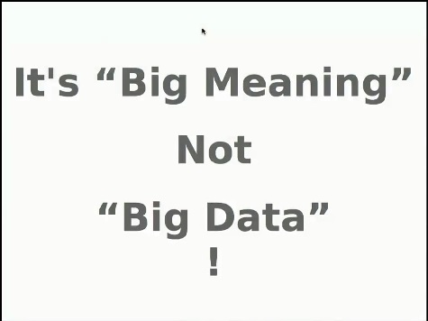

Okay, so the talk is something I've decided to springboard from Steven's talk because I know he likes to give demos, and I like to give demos also, and there isn't time to give my talk and give demos also. But since he gave a bunch of demos, I don't have to.

And this slide sums up something that we should all be paying attention to, and it's the difference between incrementalism and something that involves a larger leap. Big data is a way that a lot of people are trying to make money today, and it's a favorite of marketing people because it's in the wind. Everybody has heard the phrase big data. Not everybody knows what it means, and so it's the perfect context for doing things that people can say, well, this is an application of big data, and this is an application of big data.

But, in fact, the interesting future is not about data at all. It's about meaning. And Steven's demos showed you a thought that most people in the computing world haven't had, which is, what if my programming language actually knew something. And, in fact, what if my user interface actually knew something, not like Siri doesn't know things. But what if it actually did know things? What if it actually knew about me? What if it actually knew about the context in which I'm trying to do things? That's an example of a leap.

That set of ideas is actually old, and it was funded back when a lot of leap ideas were funded. And when the funding went away, many of the things that weren't realized by about 1980 just haven't been worked on in any strong way since. And that's something that'd be interesting to talk about.

So, some years ago, Regis McKenna, who was a Silicon Valley fixture here, he ran - did, basically, public relations and publicity for companies and especially Apple. And, Regis finally got sick of people confusing the two words invention and innovation. He said, "Look. Invention is what Xerox PARC did, and innovation is what Apple does." So Xerox PARC invented things that were leaps and that was one kind of work to do. You can think of it as creating wealth, the kind of wealth that you have in the potential for making a hydroelectric dam or getting energy from the sun. What Apple does is innovation, which is to convert wealth into money by doing a completely different kind of work, also very difficult work, and actually much more expensive work, which is to do all of the packaging and incremental stuff that's necessary to bring an invention out into the world.

And as we'll talk about, a lot of times only a bit of the invention comes out because it's going out into a place where the potential buyers usually are relatively unsophisticated about whatever it is, especially if it's closer to new than news. And we'll talk about that in a minute. So I'm going to talk about invention today. Here's an example of it.

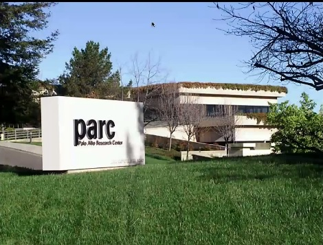 

3333 Coyote Hill Road.

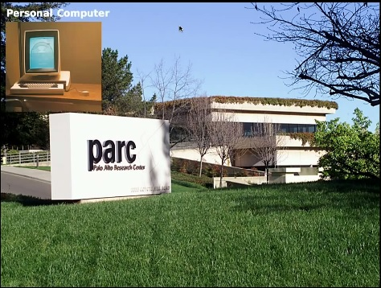 

And so the personal computer that was like a Mac was done there. This machine started working 11 years before the little - remember the Mac with the little screen? This machine, this first machine done at PARC was about like a Mac of 1988 or 1989. And it was first done in 1973 and we built about 2,000 of them because you can't invent personal computing without having personal computers, right? You can't do it with a demo. You have to do it with a real system. And bitmap screens so you could show anything.

 

The GUI, which is probably the central technology in the sense of being able to make money because it's the thing that allows billions of people to use computing equipment.

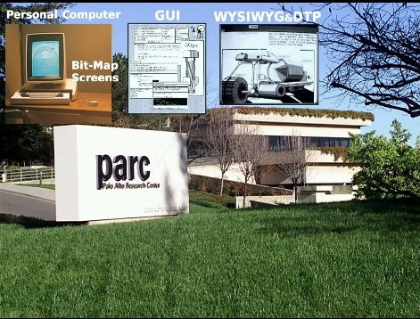 

WYSIWYG, desktop publishing.

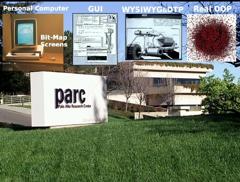 

What I like to call real object-oriented programming.

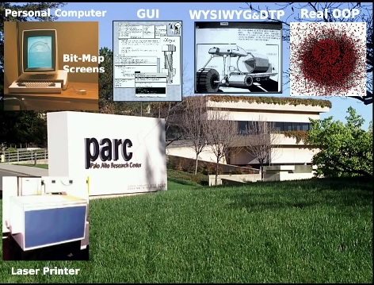

Laser printer.

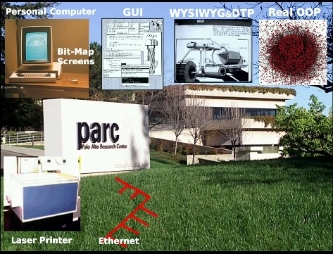

The Ethernet to hook everything together.

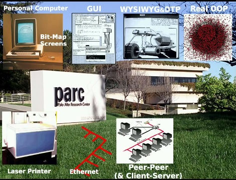

Peer-Peer and Client-Server.

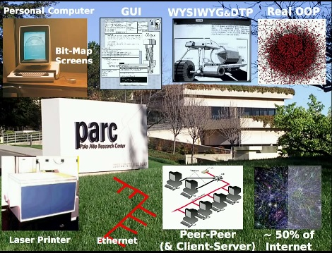

And about half of the Internet. And there are a bunch of other things like, for instance, PostScript was done there. So all of these things were things that were not particularly like stuff that had been done before. But, of course, we all realize that even invention is not done completely from scratch. I'll say more about that later. So we measure the difference between invention and incrementalism by just how big the jump is.

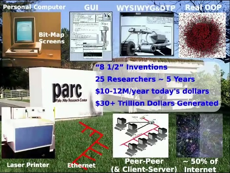

And here's the fun part. This was all done by two dozen people in about five years. So it's cheap. It's about if you scaled what was done there to today, exactly, using constant dollars, it was about $10 million a year. But, of course, the way the assets were spent were completely different. For instance, the salaries were low, and the house prices were really low. So when I was there, I made about $22,000 a year, but my house in Palo Alto on a third of an acre was only $45,000.

And so, on the other hand, we spent roughly two to three times a person's salary each year just on technology for that person because we were buying. As I'll show you, we bought our way into the future because Moore's Law says that if you're interested in something 15 years from now, you can have that computing power now if you're willing to pay through the nose. So these Altos in today's dollars were about $85,000 a piece, and we made 2,000 of them.

So if you think about, wow, go into a university, and what are the students using? They're using laptops. Go into most companies, what are they using? They're using laptops. They're computing on the computers of the past, and so the chance that they're going to do something that's non-incremental is almost zero. If you want to compute in the future, you have to compute with the computing power of the future because it actually is part of the thing that opens up the kinds of ideas that you can have.

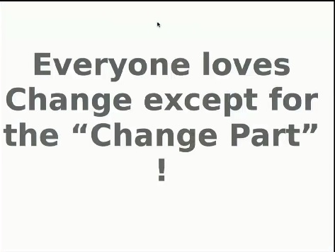

And here's the problem. Everybody loves change except for the change part. And I don't mean just the public. I mean technologists. So probably the most interesting thing about PARC, except I don't know whether people gandered at the bottom, but it's generated now almost $40 trillion of wealth.

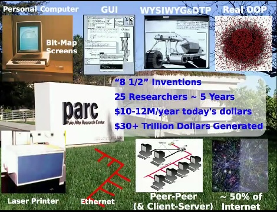

So another difference between invention and innovation is that people feel very good if they make a company that winds up being worth a billion or does a turnover of $10 billion a year. A $10 billion year is 1% of a trillion dollars. But an invention that changes the context that actually completely brings in a new suite of technology is something on the order of hundreds to thousands of times the wealth generating power of incrementalism, and it's the thing that allows incrementalism. Once all of these gating technologies are invented, then thousands of people can sit down and have an idea, like the guy a couple of speakers ago, who had a little idea. And every time he had a little idea, he started a company. And he's probably made a gazillion dollars from it just because most of the public can only handle little ideas.

The most interesting thing, I think, to us is that the technologists also had a real problem with this. For instance, the way we designed computers was rejected by Intel and Motorola. The way we actually did programming languages was rejected by the programming community in spite of the fact they were able to show all of the stuff that could be done. But because the stuff at PARC was successful, the labels were retained.

So one of the amusing things in the '80s was all the object-oriented languages that suddenly appeared, none of which were actually object-oriented languages by my estimation, and I was the person who made up that term. So C++ is not an object-oriented language, but the cache of having the same labels as Xerox PARC had, you see this all the time. It's basically the designer jeans, Guitar Hero syndrome.

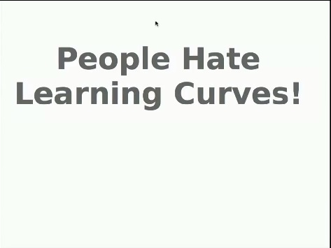

And human beings tend to hate learning curves. We'll look at that in a second.

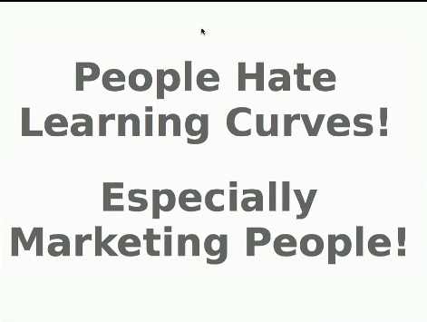

And marketing people really hate learning curves. And I don't mean just about themselves, but any product today that requires a substantial learning curve is not what marketing people are looking for. As the joke goes, they want a brand new idea that's been perfectly tested. And they would like something that people instantly recognize, but you're the only person who has it. So they want something essentially that would appeal to any caveperson 100,000 years ago, something that actually fits into what our genes set us up to be interested in.

And so it's an interesting question. If the bicycle were invented tomorrow, would it actually be carried through? Think of how dangerous a bicycle is. Think of the lawsuits. The bicycle is only tolerated today because it has been around for a long time when people didn't sue when a kid got dinged.

And another way to look at it is the larger world out there is kind of a low pass filter, and this is still going on. The iPad has a much more brain dead interface than the Mac. Astoundingly doesn't even have an undo. It doesn't really have a help. There's a thing buried down in an iPad manual somewhere that says some applications, if you shake the iPad, will respond will help.

But if you think of the iPad as a gesture device, the gesture is inherently something that gives you not just naturalness, but efficiency. And so when you're doing gesture oriented computing and the origin of that goes back into the '60s with some really wonderful systems back then, what you really want to do is to learn a bunch of gestures to make you fluent and efficient on the thing. And the iPad doesn't have any particular way of teaching you those gestures. They don't force the developers to put a teaching thing for those gestures in there. And so basically everything has evolved down to the few system gestures that are generic to the iPad. So this is kind of a dumb-downism that has been incredibly successful for people who are only interested in making money. It has not been good for personal computing.

So here's another way of looking at this.

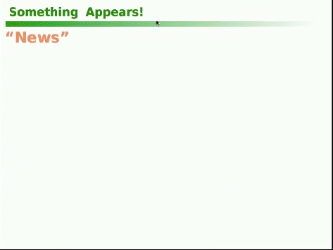

When something appears, there's news.

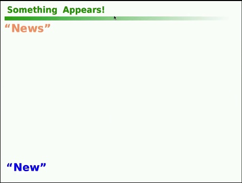

And there's new. What is news?

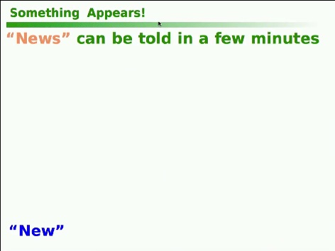

News is something that can be told in a few minutes. Why? Because if you look at the news on television, they never show you anything that isn't part of some category you already know about. And so instantly it's about this plane crash, this shooting, this good deed. So it's all categorized into things that you know completely about. And the news broadcast shy away from new, which by definition is actually invisible. If something is really new, you can barely see it. And many people, when they are approached with something that's new, they either reject it, or they try and convert it into something that's already familiar to themselves.

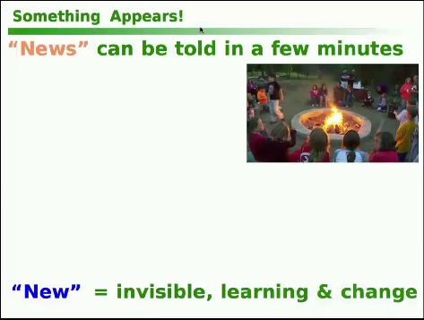

News is about campfires, which is built into our genetics, telling stories, making up stories, making the stories better stories.

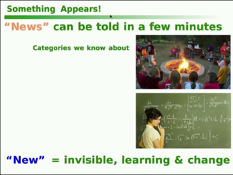

And new can require years of study in order to actually understand what it is. So I cannot remember ever seeing anything about calculus that would actually help people understand global warming on the evening news, and calculus has been around for a few hundred years. But, in fact, only about 7% of Americans have ever taken a calculus course, and about 4% only understand it, and so this is completely something that is not going to be covered either on television or by the New York Times.

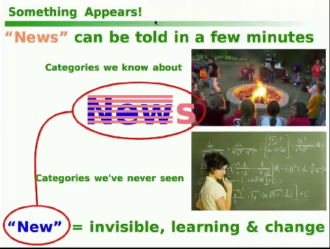

And no matter what you do in a talk like this, I would like to talk about new because I'm talking about how the future won't be incremental. But, in fact, to give a talk, I'm around the camp. This is a campfire. Not as fun as some of them. You know, you're all facing and no hotdogs and marshmallows here.

And so in order to talk about new, I have to use the paraphernalia of news. I have to deal in categories that I'm sure that you understand in order to get done in another 15 minutes. So here's another thing if we look at human psychometrics. Here's a really, actually, an oversimplified thing, but it's an interesting thing.

When a new idea tool appears, about 95% of us are what are called instrumental reasoners.

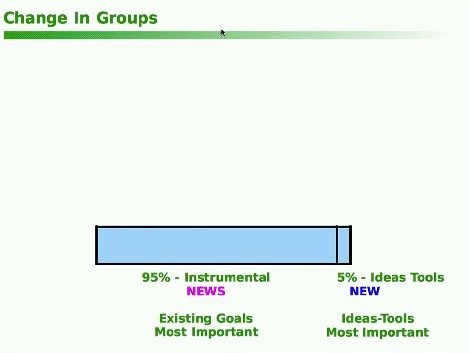

This is the natural, normal human thing. An instrumental reasoner is a person who judges the new idea or the new tool on whether it will advance their current goals. So instrumentalists are trying to get goals achieved and they're very conservative about shifting their goals.

Five percent of us are interested in the new idea and the tool just because we're interested in new ideas and tools, and many of these people will actually change their goals when a new idea tool appears, so 5% to 95%.

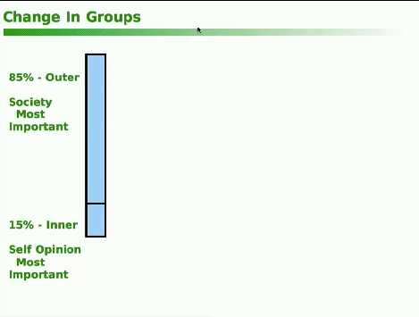

If we look at the other axis, about 85% of us do things primarily for social approval. That's what extraversion actually means. It doesn't mean you're a performer. It means you're actually interested in the opinions of others. About 15% of us are inner directed.

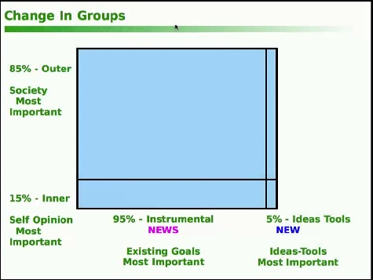

And if you combine these two, and realizing that they might not be completely independent dimensions, they're independent enough for this talk. You get this interesting thing.

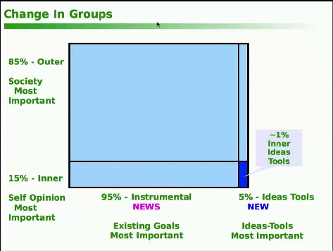

One percent of us is inner directed, not so interested in the approval of others, and intrinsically interested in new ideas and tools.

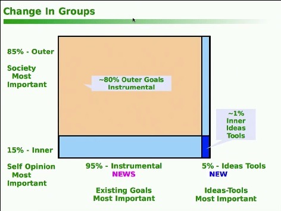

And 80% of us are goal conservative, instrumental, and directed by what our society thinks of us. This group requires almost everybody to agree on something before anybody agrees on something.

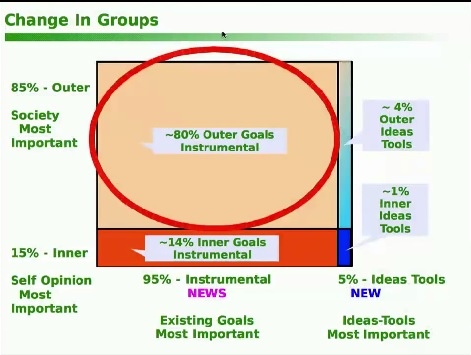

And so the way this happens is not actually by thought. So this group, generally, cannot do something just because it's a good idea. That is just not a concept that this group has - the majority of human beings. They will do something if it's actually part of a sanction. And so this group is capable of doing things that are terrible ideas. But if they're sanctioned by the group, that's the way they decide that this is something that is actually part of the local culture. So if you think about it, the two, the large quadrant there and the small one, explain a lot about human behavior.

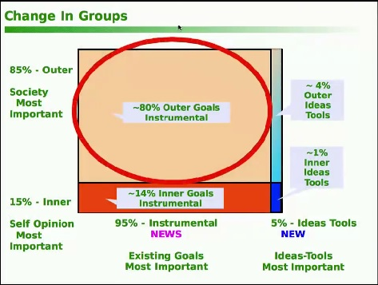

And it turns out, if you want to make a change in the larger world, you have to do something with the 80%. The 1% are more or less always with us and doing things. Some years they get burnt at the stake. Some years they get rejected. In the '60s, they actually got funded for a while. That's where our Xerox PARC came out of the funding of those people in the '60s, but they're always with us.

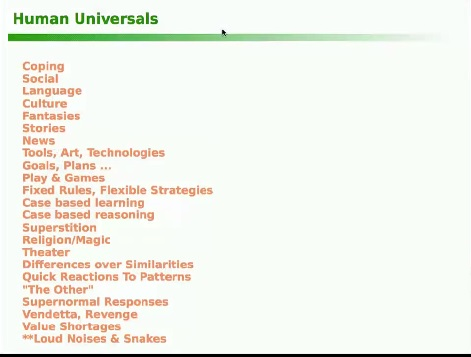

So here's another idea to think about, and this is something that anthropologists have discovered by looking at about 3,000 traditional cultures. And, in every case, without exception, they found a bunch of traits, behavioral traits, that were always there. So every culture had strong coping mechanisms. They were social. They had language. They had stories. They fantasized and planned. They use news.

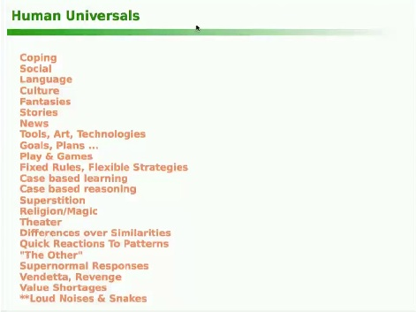

You know, you can see what a bunch of them are there. Now I just want to point out that the conclusion that most of these are actually human built-ins or actually genetically. It's not that you're born with a particular language, but you're born with a language learning mechanism, which readily picks up the language of the local culture. And anthropologists believe that if you take a child at birth from any place on the planet and put them in some other culture at birth, they will just grow up in that culture and not in the one that they were originally born into. This is the universal idea of anthropology.

And so for everybody here who is an entrepreneur who is primarily interested in making money, this is - for instance, there's a book by the anthropologist, I think his name is Robert Brown, that lists 300 of these. And if you want to make money, well, find out what these are and build a technological amplifier for them.

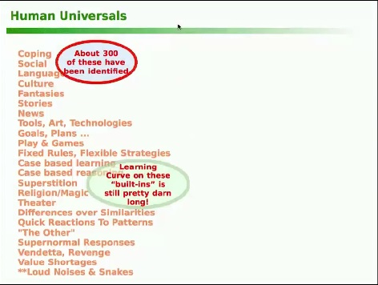

And if you look here, you can see most of the products that are popular with people are in this group. They are technological amplifiers for communication, for fantasy, for telling stories, right? Because these are the things that hardly have to be marketed. We're already pre-wired for them.

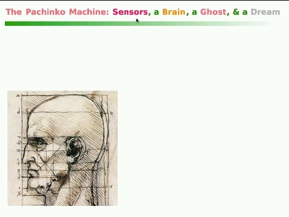

Okay. So now here's a couple of little things about the way our brain works. We actually have a kind of a pachinko machine in our head called a brain.

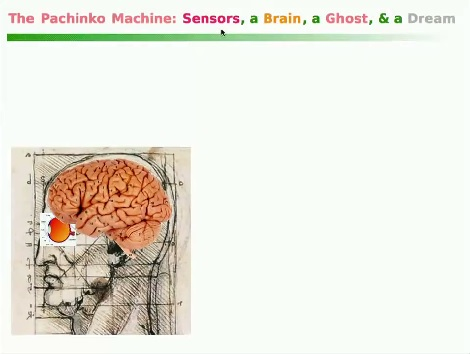

And we have a sensor like the eye.

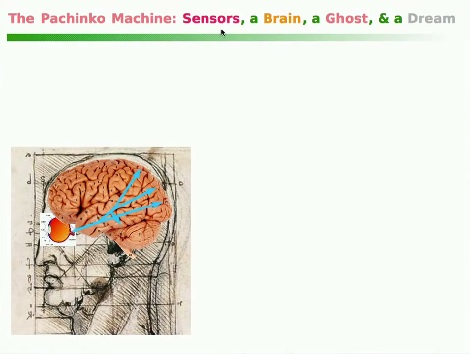

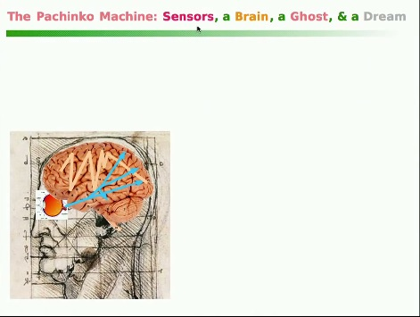

And things get bounced around from one part of the brain to the other. And what's created out of this is two ideas here.

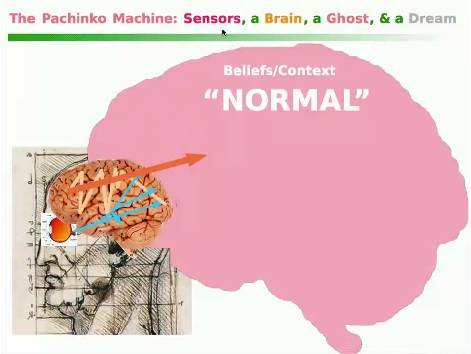

You can think of this as manifesting what our mind is. Mind is a manifestation of the processes of organic materials in our brain. And the two parts of the mind that I want to talk about today, one is the set of things that we believe in and another way - I put a slash there, the context, our beliefs, the stuff we call normal. In fact, we think normal is reality, most of us.

This is why it took us almost 200,000 years to invent science because we were already living in reality. The world is as it seems, and it's just as it appears in our belief system and our culture, so why look further? Really? I'm not kidding. That is, so this is normal.

I call that the ghost. The ghost is the set of beliefs we call normal or reality.

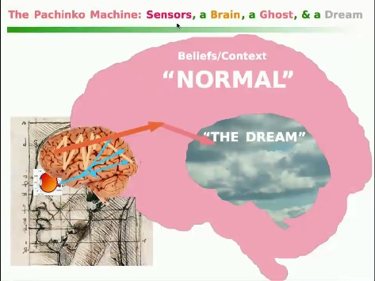

And then, moment-to-moment, we have what I call the dream because, in fact, what we call consciousness is just a waking dream that is slightly more constrained by what's going on around us than what we have at night when we don't see what's going on around us. So we actually are creatures who, moment-to-moment, are in our own hallucination. And this is easy to prove. In fact, there are a lot of things we could do if we had more time. But here's a good one.

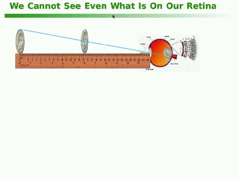

If you have two quarters or two oranges, two things that you know what they are and they're the same size, or your two thumbs - that's a good one - hold one up so it's twice as far away as the other. And realize that geometrically the further away one is going to subtend half the angle on your retina. And so the further away one should look half the size of the close one, but it doesn't. Nor do the quarters. Nor do the oranges. This is an illusion called size constancy that is well known. Where does it come from?

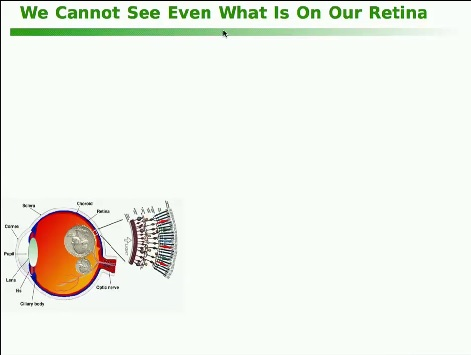

Well, here's the image on our retina. And, by the way, that image is on our retina. Descartes was so interested in this that he dissected some ox eyes back in the 17th century to see that the organic lens that mammals have works the same way as a regular lens. And so he pealed off the sclera on the back of the eye so he could see what was projected on the retina back there. And, yep, it's half the size.

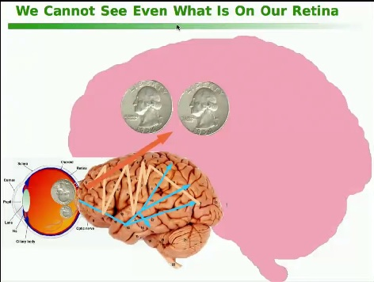

So it goes through the pachinko machine here and passes through the dream. And the dream knows something about those quarters. Those two quarters are the same size. Right? That's what they are. A quarter is a thing of a certain size, and so what happens in - on the other hand, we're looking at the damn things.

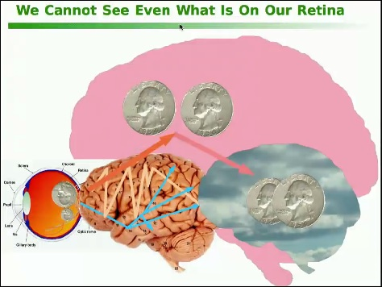

And so what we actually see is a compromise between what our dream, what our ghost knows is true and what the dream is actually seeing. However, it is not what our retina sees. And you can show this over and over again. And, in fact, virtually every perception, every piece of reasoning that people make about the world is actually quite false because it's completely based and perturbed by what's in our ghost.

Okay? So I'm just going to skip past this because I want to get to -

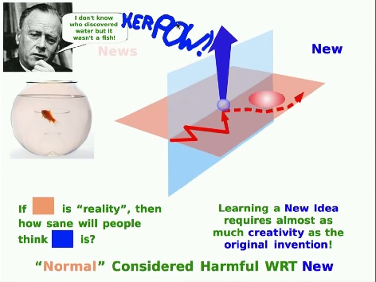

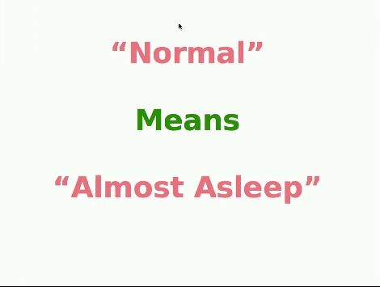

So a simple way of thinking about it is normal means almost asleep because we've already restricted ourselves, and we don't even think we are. So we're like an ant crawling around on the floor and thinking, "Man, this is a big world." And it is. It occupies every - it's like learning Linux. It has thousands and thousands of commands, and you can spend your entire life just dinking around with Linux and never learn anything about computing. Right? It has the illusion of being something important about computing, but in fact it's kind of a budget of bad ideas.

[Audience laughter]

So if we come back to these universals again, let's take a look. Once the anthropologist found out what was universal in humans, then they got interested in, hey, these things are very rare on the right here. Writing and reading, most people have lived and died on the earth without ever learning to read and write. We're not wired for it. In fact, it's hard to learn. Deductive abstract mathematics, model-based science, something as simple as equal rights, one of the hardest things for humans to learn.

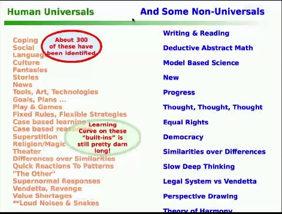

These things are all inventions. These are not incremental things to what our genetic nervous system are. These are inventions, and they're hard to do. And, as far as anybody can tell, they started only about 13,000 years ago and were very sporadic until recently.

So one of the ways of thinking about it is coping is built into us, but the idea of progress actually only surfaced in the 18th century. How about that? Because before the 18th century, virtually everyone on the planet, including in Europe and America, died in the same world that they were born into - the change was so slow.

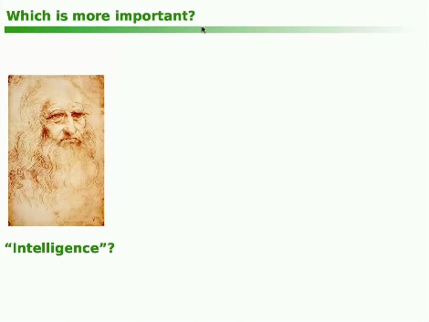	

Okay. Suppose you had twice the IQ of Leonardo, but you were born in 10,000 BC? How far are you going to get? Zero before they burn you at the stake.

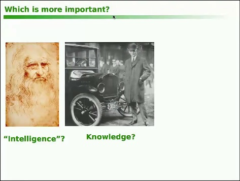

Henry Ford was nowhere near Leonardo, but Henry Ford was able to do something Leonardo couldn't do. Leonardo never was able to invent a single engine for any of his vehicles. But Henry Ford was born into the right century. He had knowledge, and he did not have to invent the gasoline engine. It had already been invented. And so he would be what was called an innovator today. He did not invent anything, but he put things together and packaged them and organized them and got them out into the public. And for most things, knowledge dominates IQ, if you think about how they go in isolation.

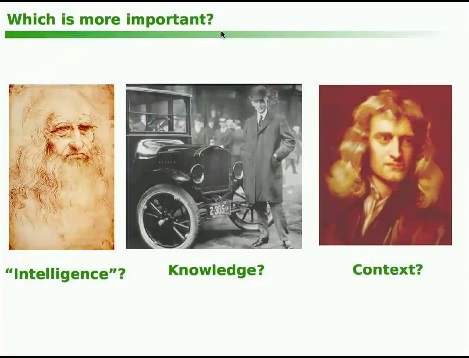

And we have to look at why was Henry Ford able to do something that Leonardo couldn't do, and the answer was because of a supreme genius by the name of Isaac Newton who changed the context of the way human beings think, maybe the larger single change of that kind in history. And because of the way Newton started thinking about things, he got people thinking in a completely different way than they'd ever done before.

And if you think of the wealth that Newton created, it's almost unimaginable because virtually every technology, a substantial part of every dime every entrepreneur in Silicon Valley earns comes because there was a Newton. This is why invention is something to pay attention to. This country used to fund invention, but partly because of five or six different factors that I don't really have time to talk about except maybe in questions. Invention is not being funded now.

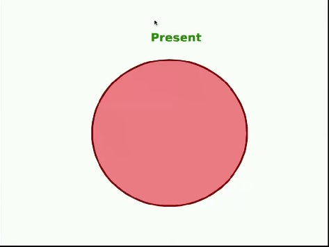

So another idea here is the present is so overwhelming because we have these tiny little brains. We spend a lot of time just dealing with what's going on right now. It's very distracting. And the present just came from a tiny part of the past.

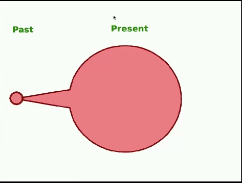

And that's the past we pay attention to when we pay attention to the past at all. America - de Tocqueville wrote a book about America in the 1840s and one of his great observations of us, he said Americans have no past and no future. They live in an extended present. And that characterizes us very well today. So the tyranny of the present is, it makes it very difficult to think of any change that's not incremental to it.

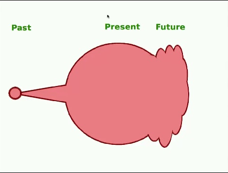

That's the nature of the distraction of it when you're trying to invent something. 

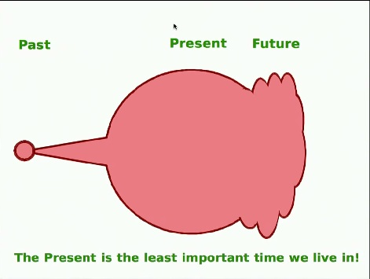

So it's the worst time, the least important time we live in.

And if we could just see the present as not reality, but just a construction done by our particular system and our particular beliefs, once we see it as a construction, we can realize we can make any other construction. That's, by the way, how the United States of America got built. Thomas Paine said, in Common Sense, instead of having the king be the law, why we can have the law be the king. That was one of the biggest shifts, large scale shifts in history because he realized, hey, we can design a better society than tradition has, and we can put it into law, so we're just going to invert thousands of years of beliefs. So once you see the present like that, you can say, "Screw it."

Get rid of it.

And as soon as you do that, it opens up much of the rest of the past because now it's taken away the special nature of the little past that made us and allows us to look at more things.

And it also allows us to dream about things that have no connection to the present because we've done away with it.

And by sampling the past, we can get a few ideas that can work on that little dream.

The dream can be expanded into a vision.

And the vision can combust into ideas that are not like the ideas that are around us. So this is a process that is rarely done these days.

And so one way of thinking about it is, we are a culture that is set up to do problem solving. That's what we're taught in school. But it's the wrong idea because problems arise naturally out of the present and us, and what we really need to do is problem finding.

We just assume that anything that looks like a problem - like a really good, creative person assumes that anything that is an obvious problem is some manifestation of the current worldview. And very often it is not the real problem, so you make changes by finding out what the real problem actually is.

So a guy who is really good at this is Wayne Gretzky. He was so good that he's been retired for decades, and I can still refer to him, and most people remember that he was the greatest hockey player who ever lived. And they gave him interviews. One of the interviews, he said, well - they said, well, you take a lot of shots and miss. And he said, well, you miss 100% of the shots you don't take, so why not shoot?

And then the other thing was that he said a good hockey player goes to where the puck is.

And that's the news part of it.

We're following the puck, but a great hockey player goes to where the puck is going to be.

And that's new. And he didn't mean estimating where the puck is going to go. He meant getting to a place where somebody could pass him the puck, so he could make a goal. That's why he scored more goals than anybody else.

And I'm going to show you one of the games we played at Xerox PARC called the Wayne Gretzky Game. And it might help you think about time spans that are longer than the three months that were mentioned by the speaker - I found that laughable, absolutely laughable. But, of course, you can do something in three months.

I mean, what if you want to play a Mozart concerto? Yeah, I'll make that a three-month project. Why not? So the idea of the Wayne Gretzky Game is to put the puck way out there like 30 years out.

So far out that whatever you think about out there need have no visible way of getting there. It's just something that would be cool to have and/or important to have. So one of the things I thought of was, in 1968, that it was inevitable that we were going to have laptop and tablet computers. And there was a technological reason for it, and there was a user reason for it, and there was an education reason for it. So all of those things gave this misty vision, and I didn't have to prove anything to anybody because, 30 years out was in the '90s. I didn't have to worry about it.

But then, if you're going to play the game, you want to bring it closer in and start thinking about what would this thing be 10 to 15 years out. And you start thinking, hmm, I wonder if there's something we could do there.

But a device like this has hardware and software of the future. And we have to do that now because it's going to take decades to do fundamental hardware and software for a new kind of thing. And you can get that by paying.

You just pay whatever the Moore's Law thing is going to save you later on. You run Moore's Law in reverse so you double the amount you're going to pay for every 18 months you're going to take this thing into the past and be able to use it. And if you do that, you can start planning a little machine that's going to be able to do that, and that machine was the Alto, which became the Macintosh, but it was there to simulate this laptop of the future.

And, when you have a machine that's that powerful, $80,000 machine in 1973, you can do a bunch of things. Like one of the things you can do is to do many experiments in user interface, and user interface is so bad today because most people don't do the hundreds of experiments with users that you need. We just don't actually understand how to design good user interface yet. So the way you get good user interface is by doing experiments with hundreds of people, and that's exactly what we did at Xerox PARC. We didn't put out stuff that hadn't been tested.

And because this machine was so fast compared to everything else, we didn't have to optimize, and so we could drink a couple of pitchers of beer at lunch and come back and play all afternoon trying out user interface ideas, and often we didn't even save the code. We just kept on doing that part of it.

Then the other thing you could do is, if you did optimize, then you could make an app now that's like the one that is going to be saleable in a reasonable way on a - so Microsoft Word, for example, was done at PARC, and it ran on this machine in 1974. And it was a big moneymaker for Microsoft in the '80s. And it took some work to do there. So everybody get the idea?

Yeah, so - and if you think about it, it's actually cheap. I'm talking about something that is really inexpensive to do when you think about what you're going to learn by that process. Okay. Let me get to the punch line.

Wonderful how many things you can throw away. Well, here's something to think about. Everybody think now where were you seven years ago? Let's see. It's 2014, so 2007. I can remember that because that was when the financial community stole our money - 2007. How long does that feel ago? Nothing, right? Today was seven years from then. And let me show you what you can do in seven years.

If you have a ten-year vision, today it might be something having to do with communication, or it might be having to do with big meaning rather than big data. Do you play the Wayne Gretzky game, you get a vision that's further out than you're going to actually work on. You want to have a five-year research horizon because you should never try a research process that's less than five years. Psychologically, it's actually important because you're really going to take the first three years of it.

But if you set a three-year horizon, the engineers and scientists will do completely different things. If you give them five years, they'll do the things they should do the first couple of years, and they will save a couple of years because of those things they do first. If you don't give it to them, you've started a ten-year project because a two-year or three-year project can't fit exactly in unless you give it some room.

And the same thing with the innovation horizon of these inventions you're going to get.

And you have a transfer process, which is a very difficult thing to do that links these two together. And the same thing, you want to take the first three years of the innovation thing. And if you add all this together, the minimum time for doing a real invention and getting it innovated for a first product is actually not as long as you think.

Now what actually happens is people do not actually go through the top three bars there. Instead, what they do is they have a little idea based on something that's out there, some convenience, something on the left-hand side of that chart, and they immediately start trying to get it to product and to market. And it's good for them if the people like it. But it's actually not good for the actual future because it actually leads to a completely numbing way of thinking about what we're doing.

For instance, pretty much only scientists and engineers use computers for what they're good for. Everybody else uses it as a convenient way of getting at old media, not new media like Steven Wolfram was showing. Okay? Bingo.

So this is a quick tour through some of the invention process, why people have difficulty in dealing with various forms of the new and a little bit of an insight as to how you might be able to persevere regardless. Thank you.

[Audience applause]
