# The Functional Final Frontier

* **Speaker: [David Nolen](http://swannodette.github.io/)**
* **Conference: [Philadelphia Emerging Technologies for the Enterprise 2014](http://phillyemergingtech.com/2014/) - Apr 2014**
* **Video: [http://www.infoq.com/presentations/om-clojurescript-facebook-react](http://www.infoq.com/presentations/om-clojurescript-facebook-react)**

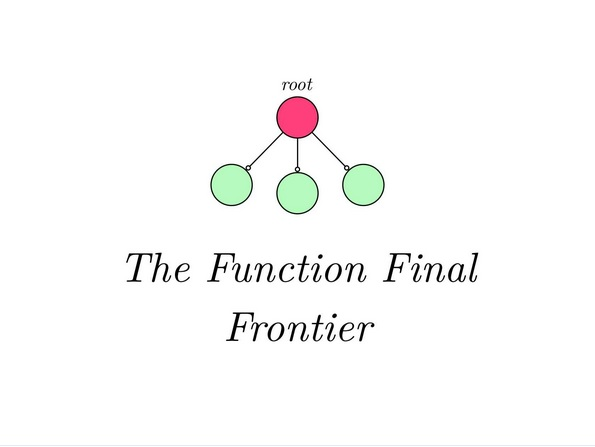

All right. This is my talk: The Functional Final Frontier. I'm David Nolen. I was formerly at the New York Times. I left the New York Times, actually, last Friday. I had been there for four years as a front-end JavaScript developer. I now work for Cognitect. They are the sort of stewards of the Clojure programming language, as well the Datomic Database. 

I'm not going to talk about any of those things today. I'm going to talk a bit about what I call the functional final frontier. And the reason this talk has a curious title is because I've been doing basically object oriented user interface programming for, you know, eight years now, and I'm kind of excited about taking the lessons I learned from OO approaches to user interfaces and combining those approaches with the lessons from functional programming. 
 
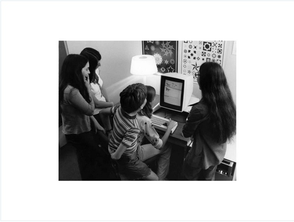

So, you know, user interface programming basically happened almost at the exact same time as object-oriented programming. This is an image of the Xerox Alto running a Smalltalk system, and these kids are sort of like, you know, doing interactive computing, sort of something that you could recognize today for the very first time. And this was built with an object-oriented system called Smalltalk developed by Allen Kay.

You can actually still fire up a Smalltalk image today. There's a really great, open source Smalltalk called Squeak. I highly recommend it. What's fascinating is that, you know, in 35 years' time - I believe this is the image of Smalltalk 80 - you will be able to identify most of these sort of elements of an object-oriented system that you would interact with today. It's not that different. 

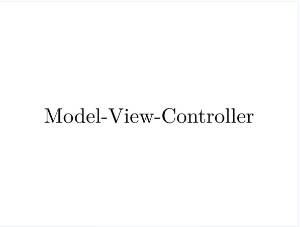

In fact, if you went through the sort of what's called the system browser, which exposes all of the classes of the Smalltalk system, you would probably see things called models, views, and controllers because that was also invented at Xerox PARC.

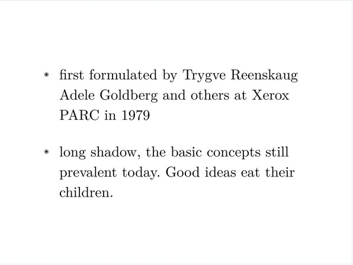

It was first formulated by Trygve Reenskaug, Adele Goldberg, and others at Xerox PARC in 1979, so 35 years, people are still building model-view controller systems. The concept has a very long shadow. The idea is still very prevalent today, and I would say that's because good ideas tend to eat their children, and so I think, if we're going to move beyond MVC, I think we have to come up with something significantly better.
 
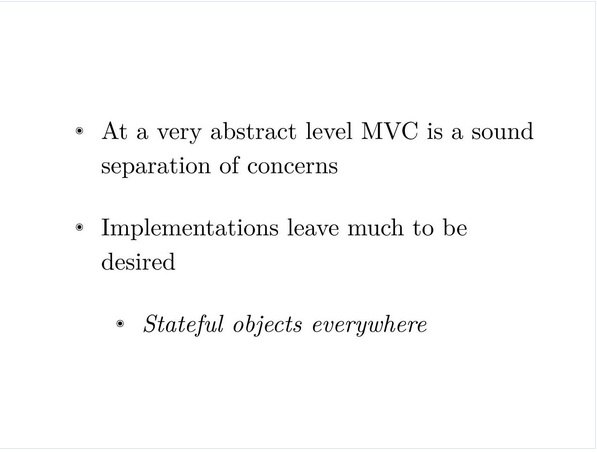

So I do think that, at a very abstract level, I think there's, you know, MVC is sort of a sound separation of logical concerns. In the end though, I think, the part that I'm moving away from personally, and I'm trying to sort of speak about why I think we should abandon some things, is that the implementations leave a lot to be desired because most people, when they build MVC systems, they are constructed on stateful objects. Of course, if you've done any OO, you're like, well, of course it has to be done with stateful objects. How is it possible to design UIs without stateful objects? And that's what my talk is about today. It is actually possible to design object-oriented systems without stateful objects everywhere. 

But to sort of throw a wrench in that entire narrative of the sort of history of the user interface, here we have an image of a NeXT machine with the very first Web browser using - this was built by Berners-Lee using a very rich, powerful, object-oriented framework, which eventually became Cocoa as the same logical framework that runs on your phone. Right? The same architecture, so this was, what, '87? No. I forget the year that this came out, but a very long time ago. 

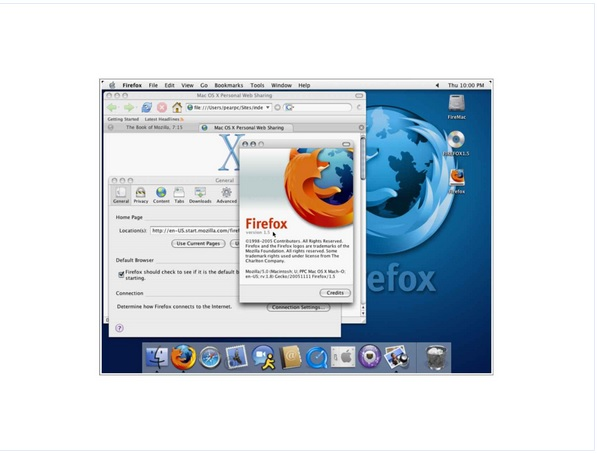

And then fast forward to today and who would have imagined that the primary mode of interaction for most people on their computer is via the Web? You know, apps have come along and, of course, apps play a big role. But to a large degree, most of our interactions happen online and many of them happen through the Web. 

Now the problem is that when Berners-Lee created the first Web browser, the intention was never for the Web browser to be a rich interface, right? It was like hyperlinks and texts, and it was document oriented, and that made sense because there was already extremely powerful desktop GUI systems, like I said, like NeXTStep, which again eventually became Cocoa. So, you know, the document object model really was never designed to solve the same kinds of problems. Yet, here we are today attempting to build rich interactions inside of Web browsers.

And so you have this issue, right? The document object model doesn't actually map to user interface widgets or the typical types of things you want to do in user interfaces. So, you know, you basically have JavaScript, which was, again, a language not designed for experts, on top of immutable DOM, which was never intended to do serious user interface programming, on top of what I would say are sort of like best attempts at doing MVC systems. But again, I think they're sort of built on top of a stateful paradigm, which I think is eventually going to be a dead end.

And, basically, who here does any JavaScript programming or has done? Okay. Good. Great. So a lot of you. So a good number of you. 

So after having done serious JavaScript programming on the Web building these interfaces for eight years, I mean you get to this point where you really feel like - Alan Kay has this great analogy about software architecture, that most software architecture looks like the great pyramids. Right? It's very impressive, but there's no big idea here. There's no serious concept at play except brut force, hundreds of years, thousands of people. Right? So that's really what modern software architecture is like in many cases.

And he has this really great analogy where he says, I mean, all architecture really needed was just a very simple, a truly simple, profound concept, and you could have a radically different architecture. Sort of like you'd be able to more efficiently distribute sort of the architecture materials. And in this case he's pointing out the arch, right? Once we understood the arch and the architectural implications of it, we were able to build entirely different types of things.

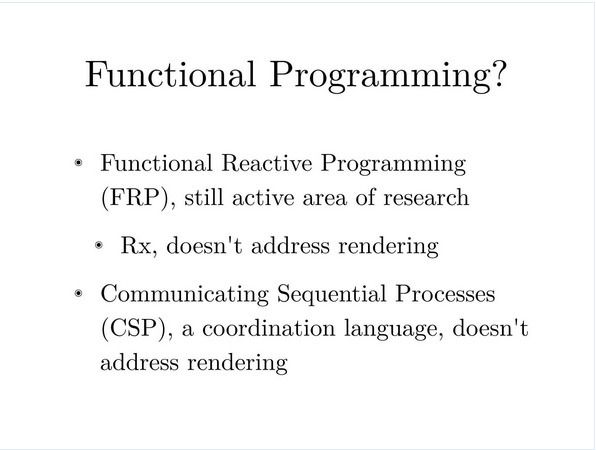

So what is - you know, part of me feels like in - when I'm doing this interface programming, what's the arch? Like, what's the concept that I still think that we haven't found today? So we know what objects have to offer and, actually, objects have a lot to offer. But I don't think it provides the arch, but what about functional programming?

I'm a big fan of functional programming, and so what is functional programming offering in this space of user interface, the design of user interfaces? So there's a great thing called functional reactive programming, FRP for short. It's still an active area of research if you're talking about the pure form of it. It arose out of Haskell. It's really amazing stuff.

Probably the coolest implementation I've seen is ELM, who is actually, I believe Evan will be talking about either, I think, today or tomorrow. But you should check it out. ELM is very cool. And, in fact, it does a lot of the things that I'll be talking about today.

There's also Rx. Microsoft has this thing Reactive Extensions. You know, there's Reactive Cocoa or Reactive Java. These things are interesting, but the problem with Reactive Extensions is it's really a coordination language, and it doesn't really talk too much about the endpoints, like how do I render something in a functional manner. 

There's another thing called Communicating Sequential Processes, and that's like if you're a fan of GO, the Golang. They use CSP. Clojure, which is a lot of what I'll be talking about today, also has something called core.async, which is also a form of CSP. But again, it's a coordination language. It's not really; it doesn't really address the fundamental problem: How do we efficiently render something? How do we render something when the target at the end is something mutable like the DOM?

So you might get to this point were, like, wow, 35 years of object-oriented programming, 56 years of functional programming, and there doesn't seem to be a solution. Maybe there isn't an arch.
 
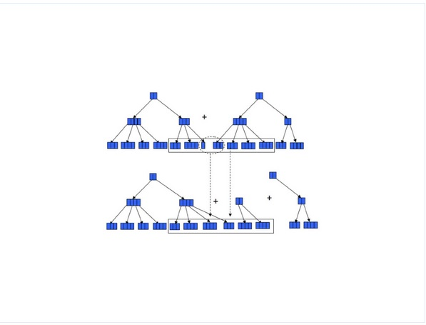

And I would actually say, if you're from the functional programming community, you would know this a little bit better, but there is actually a pretty awesome idea here that I think serves the purpose, and that's what called functional, purely functional data structures. So in 1997, this guy, Chris Okasaki said, you know, not a lot of thought has been or sort of a survey has been done, like, how can you do immutable functional data structures and get good performance, like good complexity? And so he collected some of this work.

And thanks to Phil Bagwell, who passed away, he was at EPFL, and he wrote a lot about thing called The Hash Array Mapped Trie. And then Rich Hickey, who invented Clojure, came along and created immutable variant, and that sort of kicked off a wave of research across many functional programming languages on doing higher performance immutable data structures. So Clojure ships with a bunch of these and actually, ClojureScript does as well. And ClojureScript is a version of Clojure that targets modern JavaScript engines. 

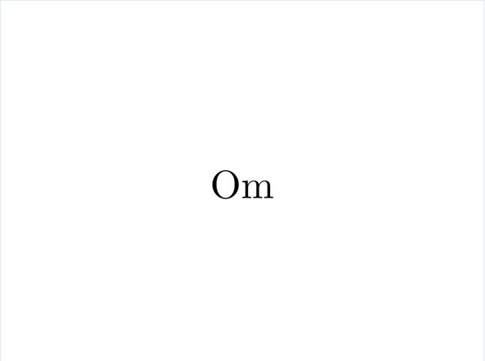

So the idea here is, let's take these really fast, persistent data structures, and can we do something? How does this help us do UIs? I released a library last December called Om, which created a bit of a splash.

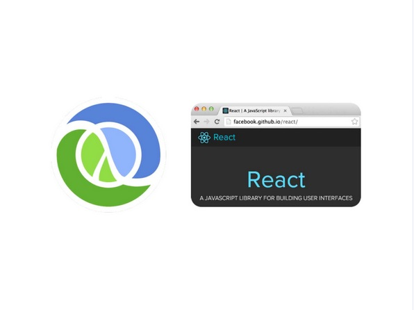

And, basically, what we do is we combine the fast immutable data structures that are present in ClojureScript, which again is a version of Clojure that targets JavaScript, and we combined it with React, which is not even a framework. It's more like a rendering library from Facebook. Who here is familiar with React? So not as many people, so we'll dig into React a bit.

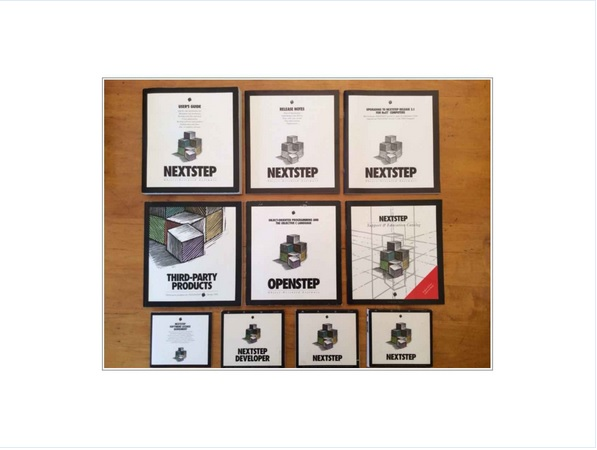

So Om is my attempt to sort of take the lessons that I like from object-oriented frameworks. I actually think things like NeXT and modern UI frameworks have a lot of lessons to teach us, especially around components and modularity.

I also am a huge fan of this, of Mathematica. Mathematica is something that not a lot of people get to play with because the license is so expensive. Who here has played around with Mathematica? Cool! 

So the cool thing about Mathematica is Mathematica is a symbolic system. It's a very different approach to user interface programming where you can literally have like, "I'm going to write a formula." And then there's a thing called Manipulate where you can convert the formula into an object, which has handles. And it's really powerful. And I will actually demonstrate something like this later.

So taking these two really cool approaches to UI programming and making sure that whatever system we have can accommodate them is definitely a goal of Om.

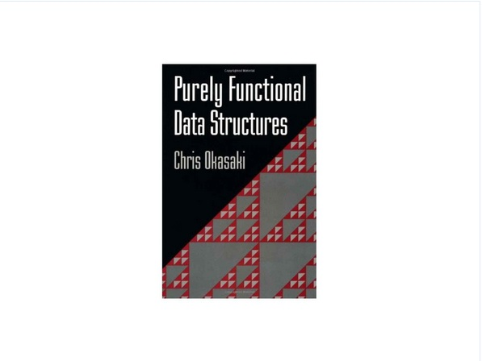

As I said, purely functional data structures, so there's like three big ideas in Om, and this is where we're going to sort of kick it off. 

So in Om, what we'd like to do is we like to have data. This is - imagine that your application, you basically have data, and that's the sort of like database of your application state. We'd like to apply a function and get some virtual version of what we're going to render. And I'll explain why this is useful.

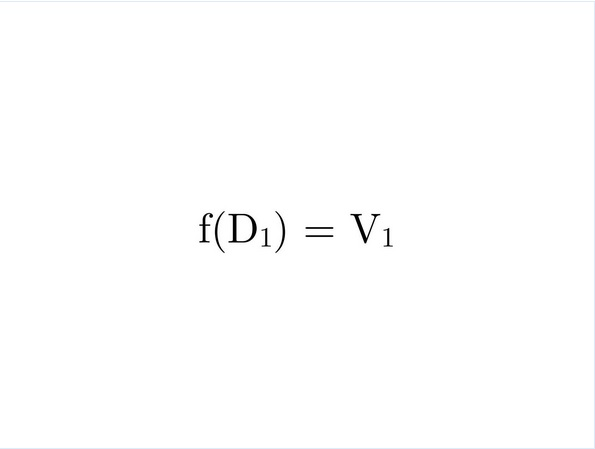

Now say the user changes the data. Now of course the data is immutable. It's immutable. Right? You can't really change it, so we have some new set of data, D1, which is like what is the state of the application at time, T1. And we're going to apply the function, and we're going to get some new virtual DOM representation. 

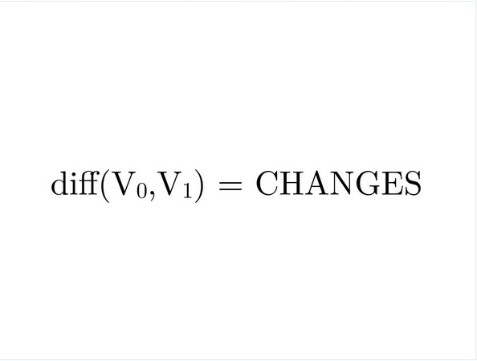

And the reason the virtual DOM representation is useful, and again this is something that React provides, is that it allows us to do a diff. Right? We can take the view that was calculated at time zero, and the view that's calculated at time one, and these are virtual, and we can use React, and React will calculate a diff. And what it will do is it will create the change set that it will apply to the DOM. So the innovation with React is that you don't actually talk to the DOM. 

But why this is very interesting is, what happens if we flip V0 and V1 here? Right? We can get the reverse change set. Right? The diff will give us the delta to go backwards in time as efficiently as we can move forwards in time. And I'll demonstrate that. 

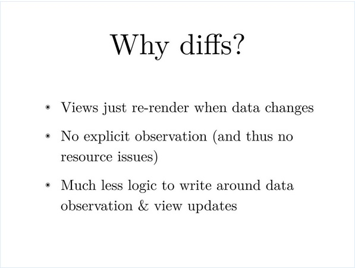

So again, why diffs? Maybe you're not convinced even though the going forwards and backwards in time sounds fascinating. Actually, there are some basic things that are really cool about just doing diffs versus doing observation. If you look at any modern UI framework, regardless of JavaScript, Java, Cocoa--it doesn't matter--they all rely on explicit observation. You have to, like, observe something. 

So the nice thing about diffs is that views just rerender when the data changes. There is no explicit observation. I don't have to observe a property, right? If I want to change the UI, React will just calculate the diff and change the DOM. That means I don't have to allocate listeners for when data changes. 

And this actually means there are no resource issues. Right? Whenever you imperatively add a listener, you have to remember when that object or that widget disappears or gets removed from the screen to remove the list of listeners. Right? So it's a common mistake in JavaScript programs to add a bunch of listeners to the DOM, destroy the DOM, and then not remove those listeners, and those listeners still point to the DOM, and then you have a memory leak. That's like the number one reason for memory leaks is that you didn't clean up your event listeners.

And again, just removing this means there's a lot - you end up writing a lot less logic. Right? Code that you don't have to write. Observation code that you don't have to write is just one less bug to think about.

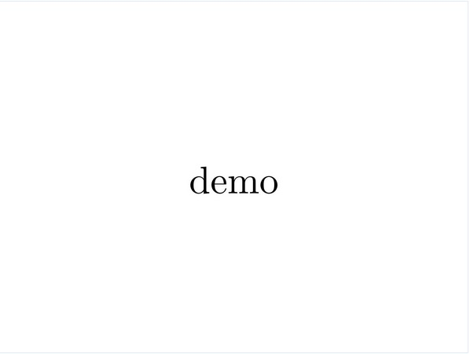

[00:14:26 DEMO on computer shown in video]

So I'll show a quick demo. So here is - I did post, and this was the post that got people really excited about React as well as Om. And, you know, people were sort of shocked because the way that Om works, for example if you do a naïve backbone to-do application, Om and React are just way faster. So this is like the flame graph. If this is in Chrome, you can, like, do a profile. And this looks pretty bad for backbone, and this is actually, you know, significantly faster. And this is just due to diffing. And we also use request animation frame.

But just to sort of drive the diffing and the going forwards and backwards time thing and drive it home, this is all the code that I had to write to do undo for what I'm about to show you. So I reimplemented to-do MVC, which is a very famous reference application for MVC frameworks in JavaScript. So there are only five lines of code here that are relevant. Even if you don't read ClojureScript, just note that, like, if I did this purely in JavaScript, I still would have written only five lines of code because of immutable data structures and diffing.

So here is to-do MVC. And I can go, you know - so this is the same two MVC you might have seen many, many times. Yeah -

Oops.

And then I can select this, click this, turn these off, switch tabs.

And the five lines of code that I showed you is all that I need to add undo, so this is actually going to step through every interaction. And you can see up here that the undo is, you know, this is like, what, 100, I don't know, 200 frames a second.

So if you've ever done any object-oriented programming, and you've ever had to do undo, it's usually a lot more complicated than that, right? So this is the benefit from diffing and representing. The entire app state is sort of like a value instead of having objects have their own state, which is what people are normally doing in object-oriented MVCs.

[END OF DEMO]

Okay. So if you're coming from the OO perspective, then you're saying, okay, well, so now you have the app state as some big, immutable value, and you're able to efficiently update it. But when what happens to modularity? How do components hook into this global state without leaking information to everybody else? Right? That's something you should be concerned about.

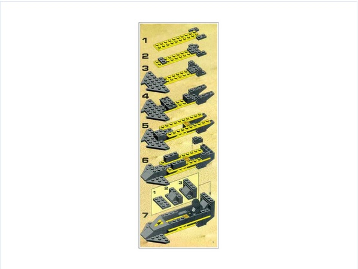

So objects do teach us this great lesson that, you know, you really want these pieces that you can put together. And if you need to pick them apart and reconfigure them, that should not be a sort of like Herculean task. It should be fairly straightforward. That's definitely a lesson from OO that we want to keep.

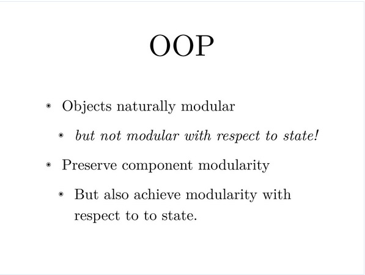

So objects are naturally modular. But I would actually argue, while it's very nice that objects are, in a very basic way, modular, they're not modular with respect to state. And that might sound confusing, especially if you think, oh, but doesn't encapsulation give you modularity? Doesn't state hiding give you that? And actually that's almost never the case, and we'll see why.

So if we're going to build a new type of system that's functional, we want to preserve modularity, but we also want to achieve modularity with respect to state, which objects fail at doing. So you might be skeptical about this claim, so let's look at a little image here.

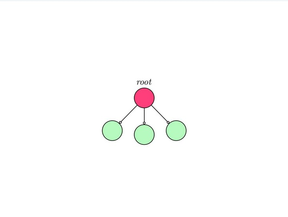

So imagine you have some root component in your application, and it has three subviews, right? 

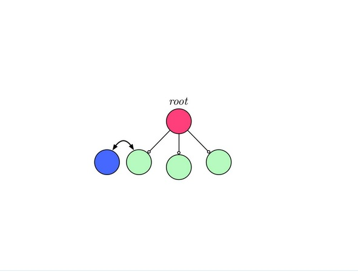

And then I read about some component and was like, oh, it satisfies the interface that I like. And, actually, it's - you know, they said that I can swap it in. Right? I have this component, and here's some other component that does what the other one did, but something more. Right? It extends it. And, of course, as the programmer, I'm like: this is great. I have A, but I actually need B. I'm just going to swap in B. It's just going to work.

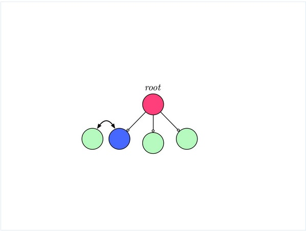

And you swap in B, and you run your program, and you run some tests, and it doesn't work. 

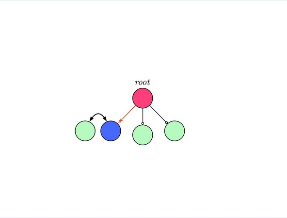

And why didn't it work? Right? Because there was hidden state.

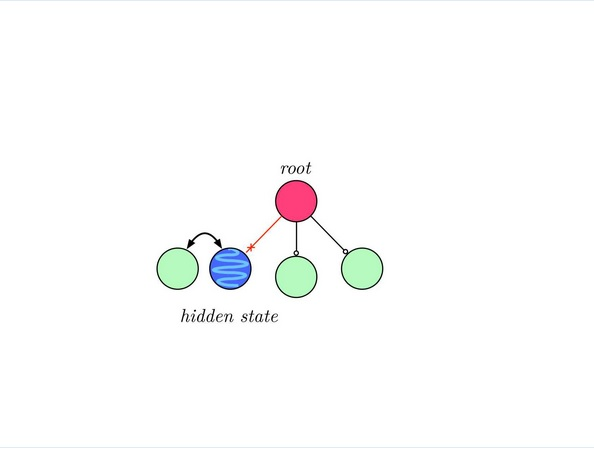

So if you do any concurrent programming, this is like a classic case of this is thread safety, right? It doesn't matter; it doesn't matter if you've hidden something at all. Hiding something doesn't matter. Encapsulation doesn't matter. Right? It's going to leak out because, under concurrency, whether your object is thread safe is really what's important.

In the case of Om, so imagine I want to do global undo, and somebody hands me widget B, and they hide something. Can I incorporate that into my system that has global undo? No, because there's hidden state inside their thing, so I actually can't integrate it. So this is a way in which objects just aren't modular with respect to state and encapsulation, in the general case, isn't going to be enough.

It's enough to make you feel like this. And so having done lots of different systems, you get something, and it has some hidden state, and it's not a fun thing.

So I could spend more time on this idea, but there's a really great blog post by this guy David Barber. It's called Local State is Poison. I highly recommend reading it. He covers a lot of things that I agree with. 

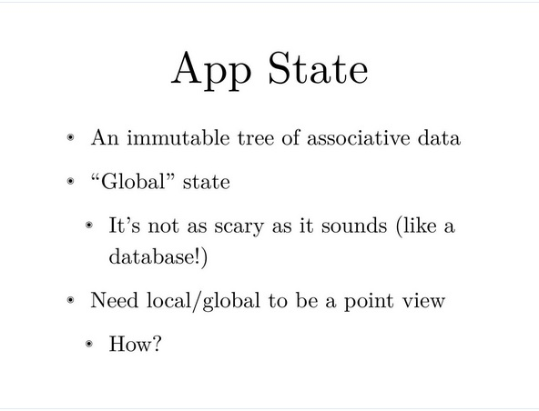

So we're going to stick with this app state idea. The app state, this global app state is going to be an immutable tree of associative data. And it's global state. And, of course, you're like, isn't that a recipe for failure? Isn't, like, every programming lesson you've ever heard says global state is horrible.

But it's not as scary as it sounds. Every - almost any nontrivial software engineering system I've ever seen has what? A database. What is a database? A database is global state, right? Every nontrivial application on the Web uses global state. Right? So there's nothing wrong with global state. It's, you know, often what people hate is not the global state. It's not the database, which is the source of truth.

What people hate are global bindings, global stateful bindings. So separate the notion of like global variables, which can be rebound, and some oracle of truth that is actually a great software principle and had done a very great job for 50 years. Databases work. They're a global state. There's nothing wrong with that.

However, in order to build a UI system, we do want to be able to have a local and global point of view if we're going to build modular components. So how are we going to do this?

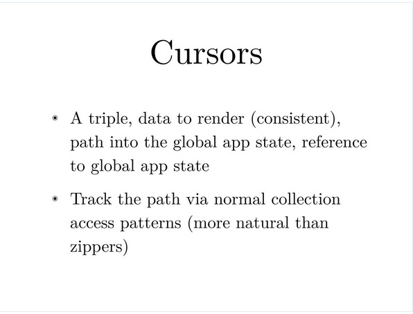

So I'm not going to spend too much time on this, but hopefully, if you're a JavaScript, of the JavaScript persuasion, this will give you some ideas about how, if you don't want to write ClojureScript, you can take what I'm talking about and implement it purely in JavaScript. It's definitely possible.

So a cursor is my solution to this problem, so you have the global application state. And in order so that components don't leak information to each other, there's a think called a cursor. And what it does is it's a triple. It's basically the value inside the global application state. It's a path to that value, and then it's a reference so that if a widget needs to update the global application state, it can. And if this sounds a little bit dense, I'm going to show some images.

So basically cursors allow us to track the path to some location in the database via normal collection access patterns. Again, this is more - if you're more familiar with functional programming, there's a thing called zippers, which I think are a horrible interface. There's a better thing called lenses, but I didn't really care about some properties of lenses, so I came up with this thing called cursors.

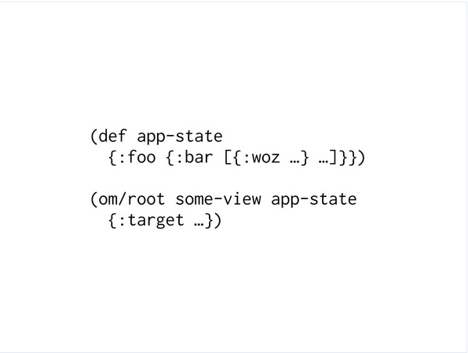

So here is an application state. So I have some - I have a - this is a nested hash map that includes a vector, which is like an array. And then I render some view using this global app state. And so what is some-view going to get? Some-view is not going to get the original data.

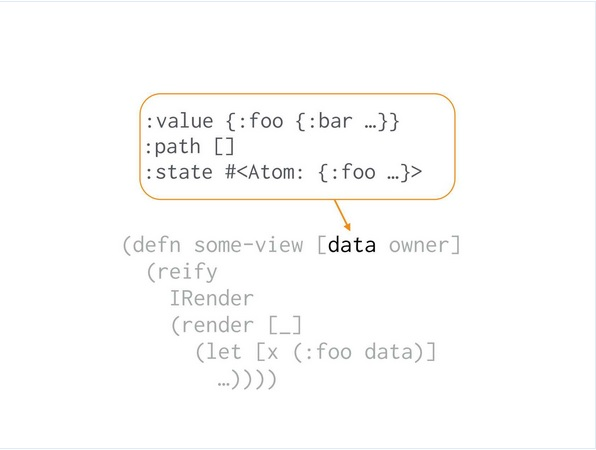

It's going to get a cursor onto that data. So here you see that I have the entire app state and the path that this view is receiving, which is a root component. It's the root of the application. The path is empty, right? We're just taking the entire world right now. And then we have a state thing so that if somebody needs to update the application state, they can.

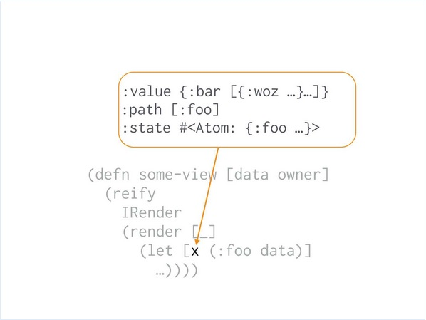

Now, further down here you notice I'm accessing the foo property inside of that cursor, and then I'm binding that to X. And what I get is a new cursor, which is a slice into the thing, but it also now has tracked the path. How do we get to that piece of data? So if some widget needs to update data, we can combine the path and the state so that we can basically allow widgets to update the database without actually knowing where that data came from, right? It's because, under the hood, we tracked the path that components don't need to know where that data actually lives.

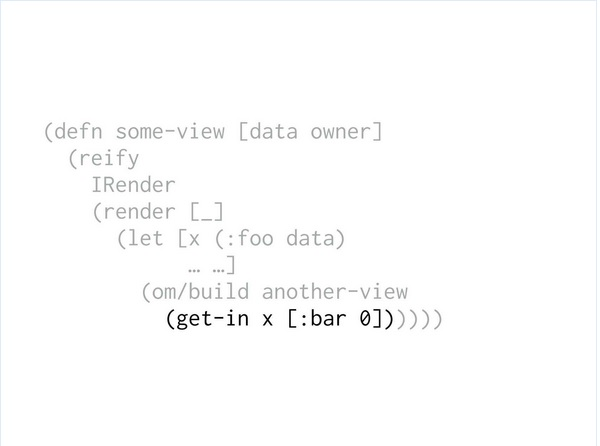

So we're going to build some other subview, and then we use get-in, which is, in ClojureScript, just a way to do a nested get. We're going to get whatever is at the key bar. And then whenever we get that, we're going to get whatever is at index zero.

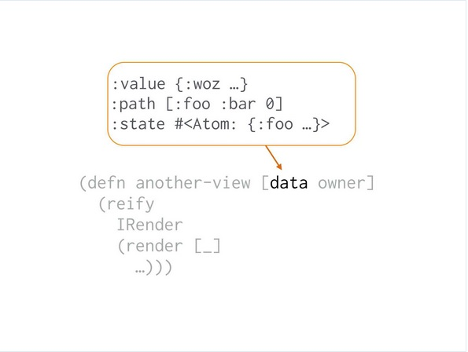

So that brings us to the fully, the piece of data that was nested inside, which was a map containing a [?]. Right? And the path is now foo bar zero. And again, this just is so that if this other view needs to update the application state, it can take the three pieces of data and use that to update that state, but another view doesn't know where that data came from, right, because, again, we're hiding the path. The path is not something that's exposed to the user, right?

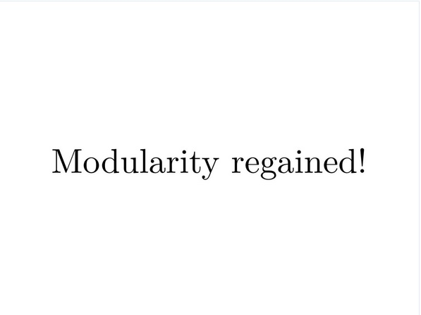

So this gives us back modularity. Again, I wish I had more time to talk about this, but if you're confused still, go to the Om GitHub repo, and there's more details about cursors. But again, the big idea here is to get back modularity.

In the end, this is still actually not enough. There are other properties you want from a UI programming system that's functional, and I want to talk about some of those things.

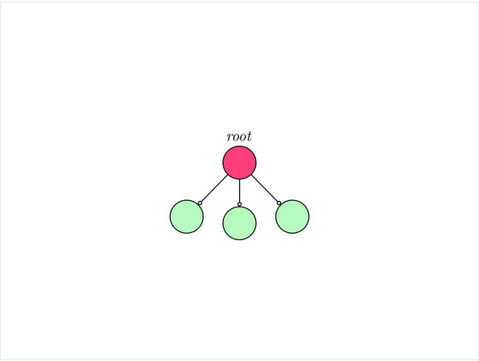

So I'm building an application. I've got some - I've got three components.

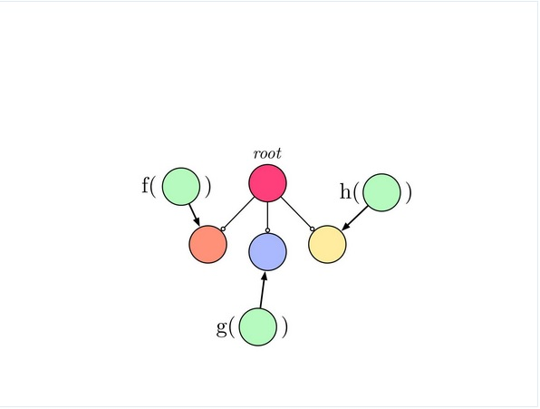

And often what you want to do is you want to customize those components in some way, and this can be something as simple as, like, I actually need to customize the thing, or I want to create a custom inspector. Like, I want to know how long all my components took to render. And I want to do that without changing my own code, like without having to go write print line statements everywhere. I should be able to instrument my application to determine what's the rendering profile for every component.

So this is actually quite difficult to do, like having done JavaScript. You end up basically writing printlines everywhere, and it's very ad hoc, and I got sick of that.

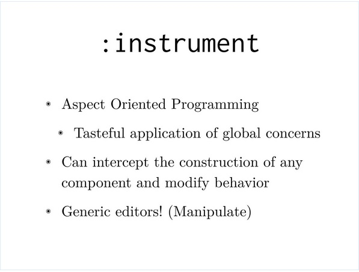

So I came up with this instrument concept. It's very much an aspect-oriented programming idea. It's a tasteful application of global concerns. And, basically, it allows you to intercept the construction of any component and modify the behavior. And it lets us do generic editors. It lets us do debugging components. It let's us do, you know, profilers, what have you.

[00:26:20 DEMO on computer in video]

And this might also sound a little bit too abstract, so let's show you a demo. So here is a - this is actually an Om component, and it's composed of three subcomponents, which are these radio button text pairs. Down here is the exact same component rendered again. It's actually the exact same thing. The only different is I've used instrument to intercept those things and then add this UI around them.

So they actually are the same. If I click, you notice the bottom guy; the bottom guy updates as well. If I click here and go like that, right, so they're exactly the same. And the reason I was able to do this is because I had this thing called instrument, which again allows me to intercept the widgets that I have and then wrap it in some other behavior.

I can, you know, go like this. That's pretty cool. To show you how much code that involved, it's basically down here, so this is - I'm calling - I'm calling the root of my application, and that's the regular way. And then here is the way where I was able to instrument my whole application.

Notice I didn't have to change anything about my actual application. This is just changing the root component so that every widget gets invoked here, and it says, "If it's radio button, build an editor around it." And that's awesome because, again, I don't have to pollute my own application with profiling or debugging or anything like that.

[00:28:00 END OF DEMO]

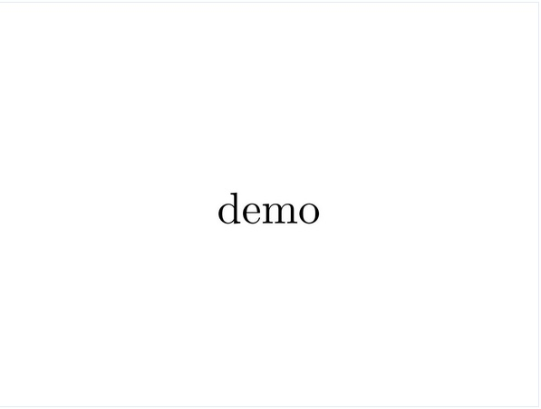

So we saw the demo.

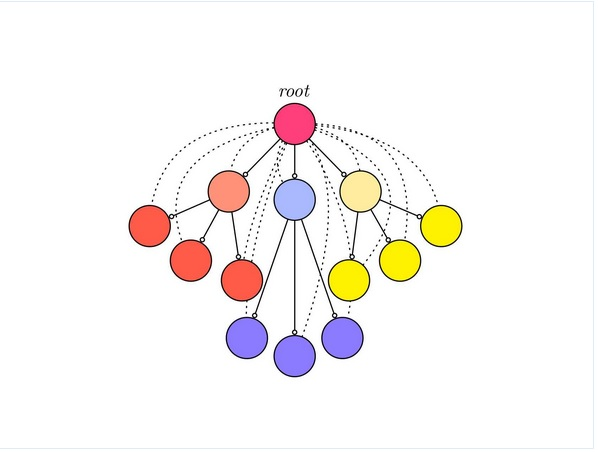

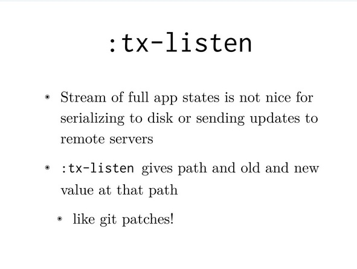

And then one other thing I want to show, which I think is important and useful is: so we have this thing called tx-listen, so something that also has frustrated me for a long time about doing client side programming is the question of synchronization. How do I synchronize with the server? And actually, with the prevalence of mobile devices, how do I do offline? Right? Offline. And then if I'm offline, and the user does a bunch of stuff, when I go back online, how do I synchronize the changes? So often you end up rolling a whole bunch of custom, like non-modular, unreasonable stuff. 

And I was like, this is something we can solve hopefully once and for all because we've adopted this functional, immutable approach. So what you don't want to do is you don't want to serialize the entire app state. Right? If we're going to synch with the server, or if we're going to write to local storage, you don't want to like serialize everything over and over again at all.

So there's a very nice feature inside of Om called tx-listen. And what it does is it gives you the path. So imagine you have your global app state again. It gives you the path that changed, and it gives you the new and old value. And that's generally a very small piece of information, and that you can write to local storage efficiently or send over the wire efficiently.

And again, the only reason we can do this is because there's no such thing as people changing their local state, right? When a widget changes some piece of some data, it's changing the data for the entire world, and that's what gives us the path information and the old and new value at that path. And this is just like get patches. This might sound crazy or esoteric, but it really is the same, right? It's like Om gives you a stream of patches, which you can efficiently encode, again, whether you're sending it to the server or whether you're sending it to local storage. Even better, you can serialize to local storage. And, when you get back online, you can then, you know, pass those onto the server.

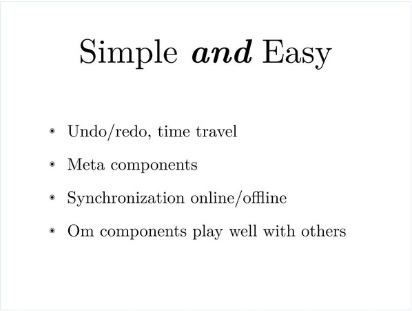

So things that one thing - so again, it's not like Om is the final answer, but hopefully you've seen some properties that I think are unique and, I think, could easily be replicated elsewhere. And it makes some classic, hard problems simple and easy, things like undo and redo and time travel. Right? You saw that I was able to do basic undo in five lines of code. And I'm going to show a more sophisticated example here in a second.

And again, undo and redo, and time travel, and rolling back, these are generally hard to do in stateful MVC systems. Meta components, things like writing generic debuggers or inspectors or profiling tools, again, generally extremely hard to do. Most frameworks don't make that easy. And, in fact, they have to often, like if you look at Angular or Ember, they have to spend hundreds of man-hours constructing these things for you. Right? And if it doesn't do exactly what you want, you're kind of out of luck.

Synchronization, online/offline, right, this is never fun. And Om presents a model where it's at least not terrible. And this, you know, the one thing that if you play around with Om, a big goal was that Om should play very well with React, so if you actually want to use Om from JavaScript, you can. If you get an Om component, you can actually use it with React. And then I made it so that anybody that - basically, anyone that uses React, Om components work well with.

So just to wrap it up, so the idea here is that you've seen some properties, but I want to show some examples of applications. I hate showing my own things. I've shown you a lot of demos that I've done. So, fortunately, I can end with some things that other people are building. I think there's a really awesome, wide world of the types of UIs you might want to create. One of these is Mathematica.

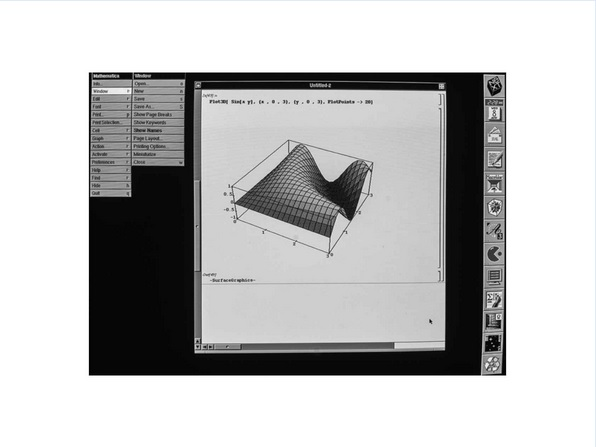

So I have a good friend, Kovas Boguta. He has a really great project called Session, and he's basically building a sort of version of Mathematica that has novel properties, yet holds onto the things that are great about Mathematica.

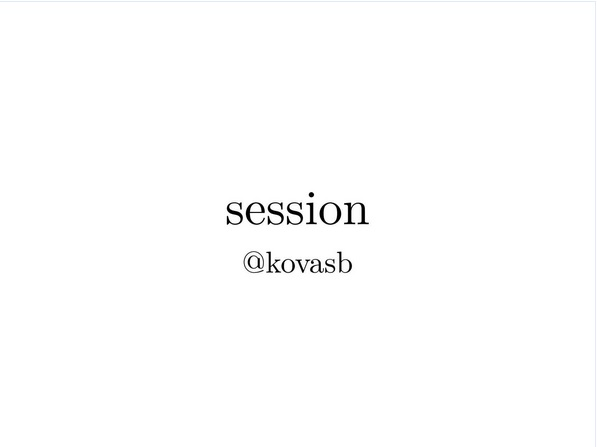

[00:32:20 DEMO on computer in video]

So like Mathematica, Session is a symbolic system. It's written entirely in - hopefully -

Is this going to work? Oh, that might not work. Maybe I have to skip this. Is that because my -

Oh, sorry. I'll come back to that.

[00:32:50 END OF DEMO]

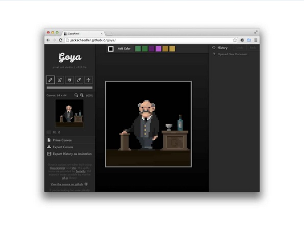

So while we wait for that to boot up, so let me, so this is not something that I did. One of the devs from Ableton, like Ableton Live, the music software, last week made this amazing pixel editor called Goya. And it actually - he was inspired. I was hoping somebody would eventually get inspired by my undo example. So he was like, that looks really simple. It can't possible be that simple. So he built a pixel editor in which he added undo, redo, and then he had a preview based on the time travel to random access. So you can jump to basically any point in time. So let's look at that right now.

[00:33:24 DEMO on computer in video]

So this is the editor. He has some default thing here. This is an Om application, so I can draw, you know, this like that. I can switch colors. On the upper right, you should see that, like, we've got different things happening, recording the things that I'm doing.

Go like that. Right? So I can click "undo." I can click "redo." But on top of that, this is actually just random access. Notice the preview at the left.

So every image is actually an immutable data structure. Right? That's why he - he literally is recording everything into an immutable value and then, when I jump to it, he uses the exact same undo trick that I showed you. He's just setting the state of the application, and everything rerenders, and diffing makes it fast. It's the diffing that makes this efficient.

And he actually - I can export this as an animation. I've never tried this, but you can click this, and it will actually put the gif.js into a Web worker and generate the frames from the history. And again, this is hardly any code.

Let me just show - so -

[Audience member: (Indiscernible) canvas, or is that…?]

It is canvas, yeah.

So I just want to show his time machine code, his undo manager. So if you've ever looked at undo manager, undo managers suck. So here he's got three lines of code for updating the preview, for showing the preview. He's got undo, some undo logic, push onto the undo stack, undo, redo. What? That's like 50 lines of code. Right? All the undo capability you see in the project is possible here.

This actually also powers the gif animation, so when he wants to create the animation, he just reads out the history and sends it to a Web worker. I think that's pretty cool.

Let's see if Session is working. Yes! Cool.

Okay, so this is my friend Kovas Bogutas' - this is also an Om application. It's a symbolic computation environment in the same way that Mathematica is. You know, I can - I can evaluate some expressions here, and, look, this is just Clojure code. If I go like that or if I -

So that's pretty cool. It's just like a nice, little REPL. Where it gets interesting is that it's symbolic in the way that Mathematica is symbolic, so down here -

Sorry. 

So what I'm demonstrating here is that I have a list. Right? This is a list, a Clojure vector and it includes an image, like a graphics primitive in there. And I have hash maps and, if I remove this stuff, and I evaluate that, right? So that's - this - it's embedded inside of the list, so in the same way that Mathematica graphics primitives and numbers and lists and graphs and all these objects are all manipulatable by the user, and they all are the same, Kovas has put that property into this.

So if you've seen iPython, iPython is like an extremely limited form of this because iPython is not really a symbolic system. It is a computational environment, but different types of primitives have different properties, and they don't really work together. And so, in this environment, he's tried to make the entire thing symbolic so that if you want to mix and match images and computations and strings, maps, it doesn't matter. It all just works together. And I definitely recommend checking it out. It's very cool.

Let me just - I guess I can show one other thing. There's like some graphs. It's pretty cool.

[00:37:53 - END OF DEMO]

Okay. That was it. That's all I had. Hopefully you enjoyed that and I'll take some questions.

[Audience member: How does - can I articulate this. You're storing. You've got a global database with kind of a façade over it. What does that do to your memory footprint in various scenarios without getting too specific?]

So actually it's a great question, and we should get specific. Oh, okay, so the question was a great question. If you're watching this, of course you probably are like, well, if you did that with copy on write data structures, aren't you going to eat up a lot of memory? I mean, isn't that just going to consume tons and tons of memory?

So this is actually a solved problem because we're using structural sharing. So the classic case of structural sharing is a linked list, right? Lists can share structure. Even if I have multiple lists, if they share the tail, that's memory that's shared between different lists. So we actually use this to implement both random access data structures and our hash maps.

So for example, if I have each frame of the Goya pixel editor is 4,096 elements in an immutable vector, if I change one pixel, right, just one pixel, I'm going to get a new thing in which the only difference between the old frame and this new frame is one array. Right? It's a tree of arrays, and so we only have to change one array, and all the other things in memory get shared.

Just to give a more concrete example, somebody recently or like a few months ago said, "I read your tweet about persistent data structures. I made a game using ClojureScript. I recorded 1,000 frames of the entire game application state." The entire state of the entire game, 1,000 frames. That's 41 seconds of animation, 2 megabytes of memory.

[Audience member: So those things are point….]

Inside the data structures, yeah. Yes, this is correct. This is correct. Great question. Thanks. Other?

[Audience member: So for the canvas example, is that actually using React to calculate the difference between the DOM for the canvas, or is he just..?]

No, no, no. No, for the canvas, so that's what's great about the React model is that, for the canvas, he just renders to canvas. The diffing is really just for the other parts of the UI. And then, of course, it's immutable when he's updating the pixels. But no, he just calls canvas to render the current state.

Again, that's exactly how React works, right? How does React work? React creates a change set and mutates the DOM for you, so there's one case where React doesn't mutate, can't mutate the canvas, so he wrote his own mutation logic. But again, it's lower in the system, and he doesn't interact with it directly.

[Audience member: But it's not doing like a diff. It's actually just clearing the canvas and repainting that whole frame.]

It is. That's totally correct. Yeah. And it's fine to do it that way.

[Audience member: Right, yeah. I thought maybe somehow it was doing -- trying to figure how it would do the undo of figuring out efficiently paint just part of the frame to get back to the previous state.]

No, no. You could imagine doing more sophisticated tricks. But for this, he just blows away the thing and rerenders it.

[Audience member: Often in an undo scenario, you want to distinguish between an operation that actually changed the state of your data and an operation that just changed the view so that when you do an undo, like if you had your several tabs that were looking at the data in different ways, if you have an undo chain, you wouldn't want to see changing views as an undo step. You would just want to see when did I change the data.]

Right, so the pixel editor actually demonstrates that. So it doesn't --

[Audience member: I’m more thinking of your first example with the to-do list.]

Sure, but the following thing, it's conceptually the following thing. It doesn't record every pixel. So in my undo, it was as if I was recording every pixel modification. And the next one says you don't have to do it that way. You can record an entire change set as one logical point in time that you want to return to possibly. Is that what you're asking?

[Audience member: My question is: When I implement a change of view by clicking on a tab, say, that is going to update my view state, but I wouldn't want that to be part of my undo state.]

Okay, so -- and I didn't cover this. It is possible, for various reasons, to not encode state changes directly into the application state. So this is actually something we maintain from React. React has a notion of component local state, and that's to encode transient information that doesn't, that isn't something you actually want to record. So there is a way to do this.

[Audience member: (Indiscernible)]

You can choose what you want to record. That's correct. I think - any other questions?

[Audience member: I'm a bit of a - thank you - a little bit of a neophyte when it comes to all this technology. However, I was wondering about the performance when there's an extremely long stack frame. So if I have several tens of thousands of state, and I wish to move forward and backward in that state, am I going to be hitting a very hard performance penalty in rendering?]

So, fortunately that's - so the question was, like, imagine I have decided you want to record 10,000 things, which is pretty wild. You're approaching the type of sophisticated undo that's like people do in PhotoShop or something, like infinite undo. I can't make any promises because nobody has tried it yet, right? But -

[Audience member: …enterprise applications that are in the Web browser and sometimes you could have somebody who sits there for like eight hours doing their job.]

Right, so -

[Audience member: So you end up with this massive state...]

To me it's like situations like that, you're going to have to do more design. Do you want to do, for example, exponential decay? Imagine you record everything for the last minute, like you record every minute of the hour. And then after that you record every five minutes. And after that, you know, it just depends on what strategy makes the most sense for your application, for your user.

But I will say that it's definitely the case that React is very fast, so the speed of diffing, that's their problem, and it's very efficient. And then again, we've spent now three years tuning our data structures for JavaScript engines. And I'm not aware of any pure JavaScript implementations that can compete with the ones that we have.

So I would say I would be very surprised if there was a performance problem. And, of course, I would love to hear about it if there was. We would want to accommodate that. But I can't say much more than, like, depending on what you're building, you might have to, like, okay, we're going to have to cache some of this onto the server, some of this we keep on the client, and again maybe exponential decay.

[Audience member: So, I mean, you support like redo and undo off of the end of the stack, but could you be able to just, like, take an action out of the middle, or would you have to go, undo all the way back to that starting point and then take that one thing out and redo the actions that followed it? Because it might not work, right? I mean the actions might not play out on that state.]

So remember, so Om itself doesn't give you out of the box any undo capability. It's just it gives you a model in which it's simple to do it. In the same, like, what does Git do? Git takes - Git is an immutable storage model like it's just the blob. And when you update the file, you're going to record the entire thing over again, and then you calculate deltas. But the beautiful thing is that, what is Git? Git is like a snap-shotted file system, right? So Om gives you snapshots of the entire application state. It doesn't give you any particular form of undo, but the model makes it simple to create whatever undo system you want.

Like, if you want merging, if you want branches, all these, like in a regular application you're like, "No way! We're not going to do branching or merging!" But in Om it's like, oh, okay, that's going to be like a couple hours of work.

[Audience member: Just an easy question. What's a good place to go to learn more about immutable data structures and functional data structures?]

So, sadly, there's not like a really great resource. There is actually a fairly good write-up by - yes, so **[Hypirion.com](http://hypirion.com/musings/understanding-persistent-vector-pt-1)** has - this guy wrote a very good sort of introductory explanation on how they work, and you don't - it doesn't assume any real knowledge about Clojure. It's just like what's the algorithm and how it's implemented.

I think there's one in the back. This is the last one, probably.

[Audience member: Can you talk a little bit more about using Om as a JavaScript library - I think you had mentioned that it's possible--and any downsides?]

I mean, it's only possible in theory. The main downside is that it's really not going to be that great. It's definitely optimized to be used from ClojureScript, and it's actually quite large because the way that ClojureScript works is that whenever you write everything in ClojureScript, we can do very powerful, aggressive optimizations over your code. But if you write a bunch of JavaScript code that talks to it, that stuff can't be optimized in the same way. So the downsides is just that it's like you could do it, but you would lose out on a lot of the benefits, so that's why I tried to talk a bit about implementation details so that if people wanted to implement this purely on JavaScript - persistent data structures. I mean, literally, if you just implement some persistent data structures, most of the benefits you would get immediately just by coupling them with React.

All right. I think that's it. Thanks.

[Audience applause]
