# Components Just Enough Structure

* **Speaker: [Stuart Sierra](https://twitter.com/stuartsierra)**
* **Conference: [Clojure/West](http://www.clojurewest.org) - March 2014**
* **Video: [https://www.youtube.com/watch?v=13cmHf_kt-Q](https://www.youtube.com/watch?v=13cmHf_kt-Q)**

I'm Stuart Sierra. I work at Cognitect, and I'm here to talk about components, and I'm here to talk about software architecture because, as we all know, every software application you could ever possibly want to write fits into this three layer architectural pattern.

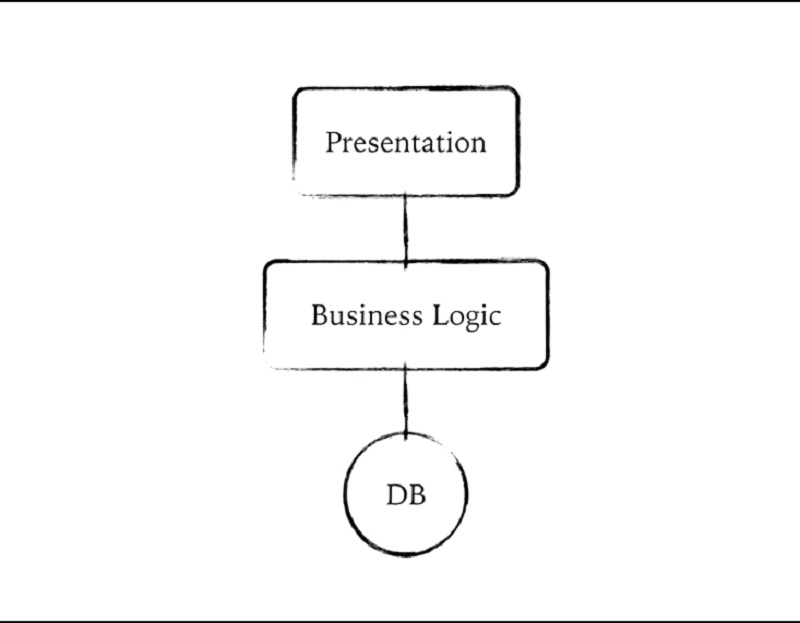

[Audience laughter]

Thank you. Thank you. Yes, you know, you have your UI. You have some business logic, whatever that is, and then a database underneath it all. When was the last time you wrote an app that looked like that? Not likely, huh? Yeah, most of the apps I work on tend to look a little more like this.

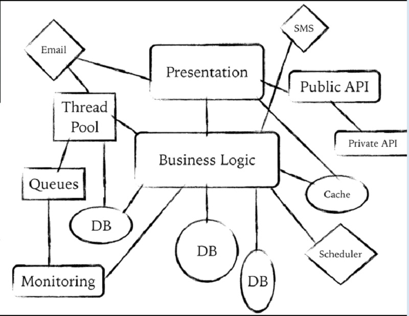

You know, they've got to send email. They've got to send SMS messages. There's this other database over here, and a data warehouse, and a scheduler and monitoring. You know, apps have to do a lot of stuff. And if there's any business logic at all, it kind of gets splayed across all of these different pieces.

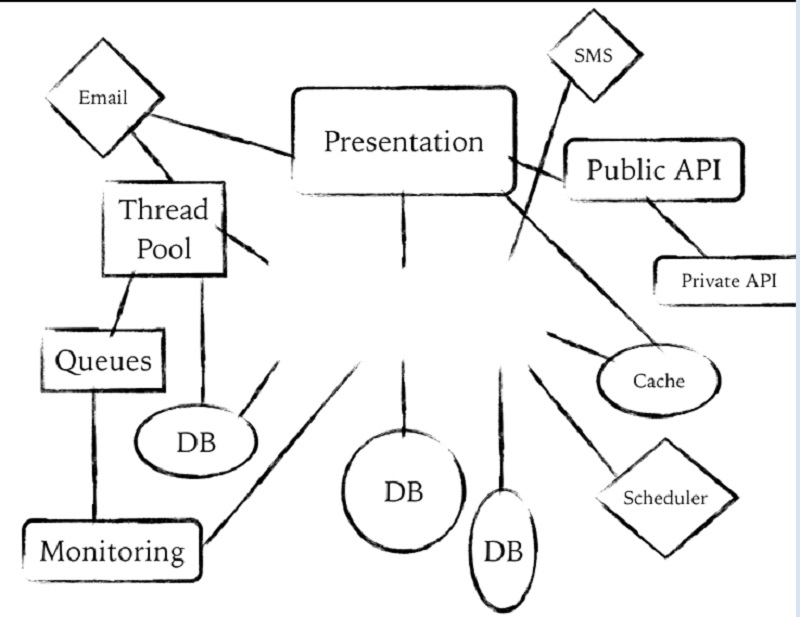

So this is the world. This is what we live with, what we have to deal with. And a lot of these pieces of functionality in our app have state in them. Now some of it's easy.

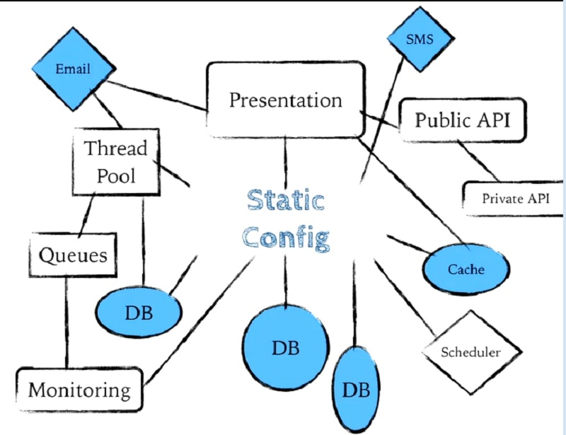

It's just static configuration, but we have to keep track of things like database connection URLs, API keys, user names, passwords, all that stuff.

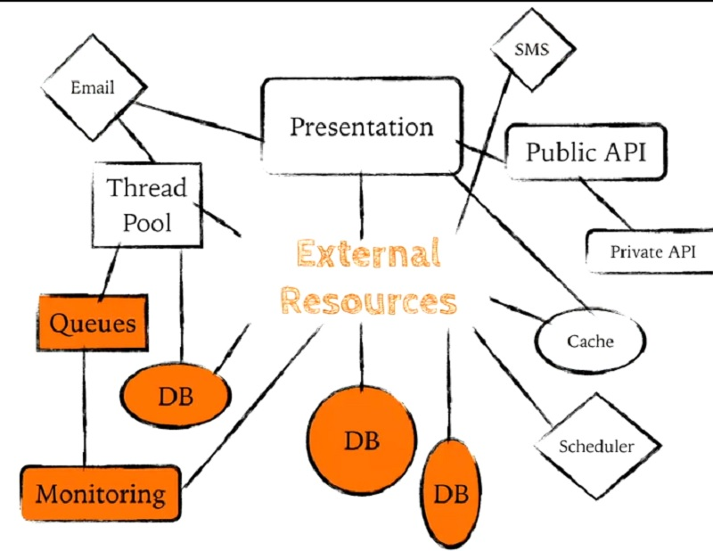

Then we have a lot of external resources that we need. Any time you have a client API for some service that has a connection object or a session object, or even something simple like a socket connection or a file handle, these are all stateful resources that our applications need to use and keep track of.

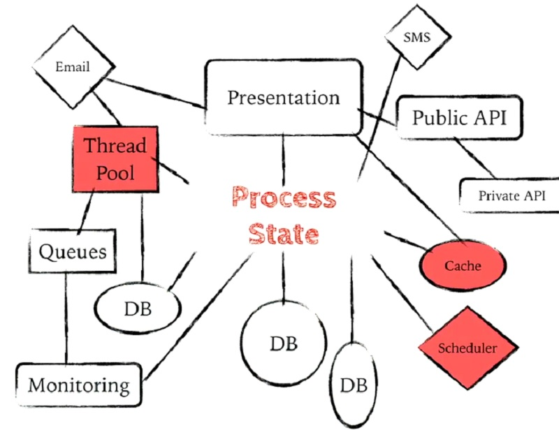

Finally, we can have things that are inherently stateful in our applications. We can create threads. We can use mutable reference types like refs and atoms and agents. We can use core.async channels. We have things in our program that are inherently stateful, and somewhere we have to keep track of that state.

So the question that sort of confronts us every time we start a Clojure project is: Where do we put it? Where does the state go? And this is really someplace where I think object oriented languages kind of have the leg up. They make it obvious.

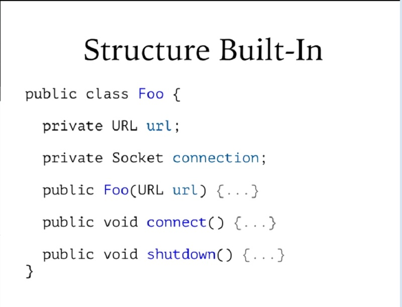

If you have an object oriented language like Java, and you need a thing, you need a fu, well, what do you do? You make a class. That's the only thing you can do. And a class has this structure built into it.

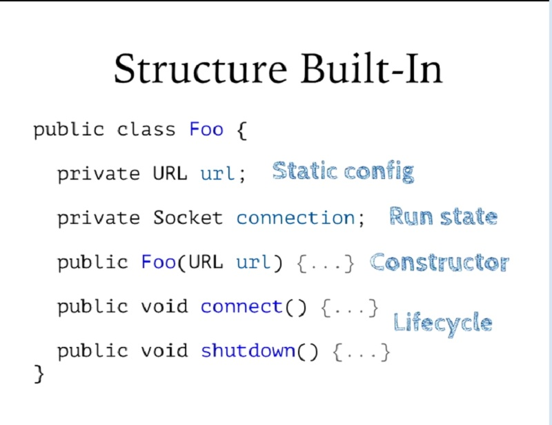

You have an obvious place to put static configuration, runtime state. You have a constructor function to initialize that state. And you may have one or more methods loosely defined that are going to transition that object between different states in its lifecycle. So, in Clojure it's a very different world, in a lot of functional languages, actually.

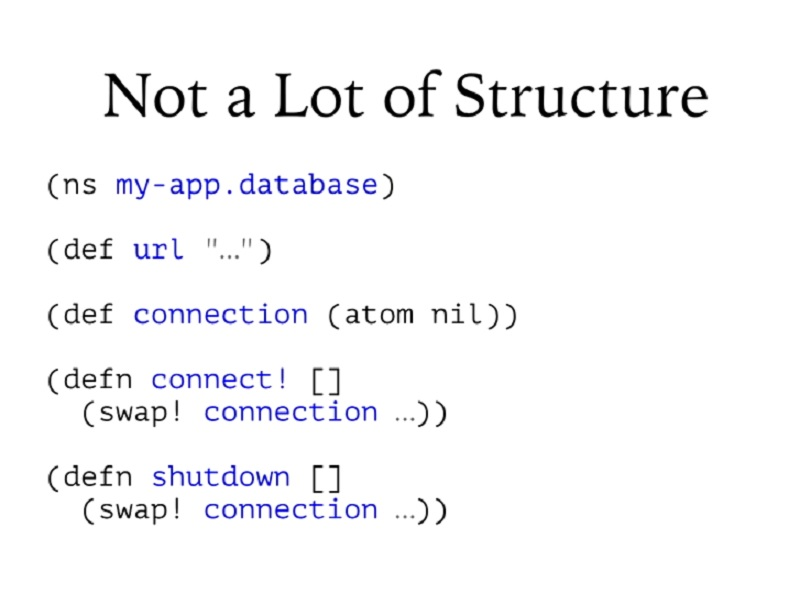

There's a lot less structure inherent in the language. If I took this code here as a very naïve translation of the Java class on the previous slide. It looks like it's kind of the same, but it's actually doing something very different.

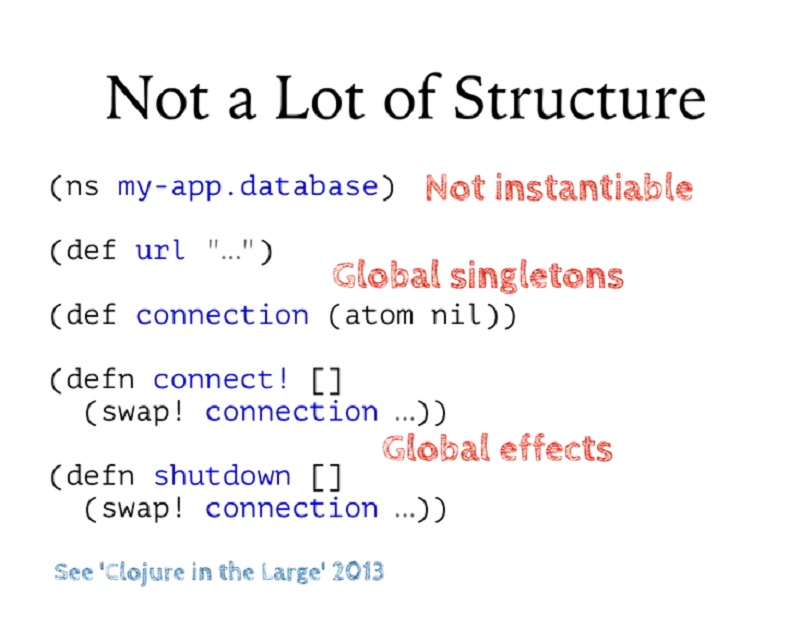

Clojure namespaces are not classes. They are not instantiable. We cannot create an instance of a name space or parameterize it on another name space. We can't treat name spaces as modules that way.

And, in Clojure, if we need a thing, well, what do we do? We def it. That's the default thing we know how to create stuff in Clojure. But anything we def is a global singleton. And any functions we write to manipulate that, whether it's an atom or a var or whatever, those are going to be global effects throughout our program.

Now, last year at this same conference, I did a talk called Clojure in the Large where I described a lot of the problems that result from this sort of default global behavior in Clojure programs. And I made one big recommendation in that talk, which was to make your state local, to make every function only depend on things that were passed to it in its arguments. Now, unfortunately, I hadn't completely figured out how that would work, and I didn't articulate it very clearly.

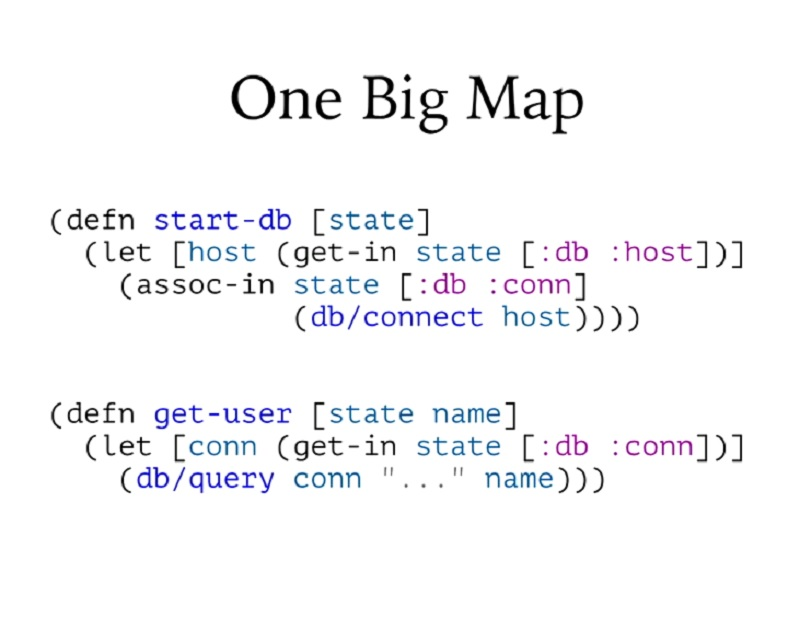

So what people ended up doing in response to this was they would have all the state in their application and put it together in one map. And then they would pass that map as an argument to every function in the program. Now don't get me wrong. This was an improvement. This does make some things easier to manage. Now the state is at least local to the function.

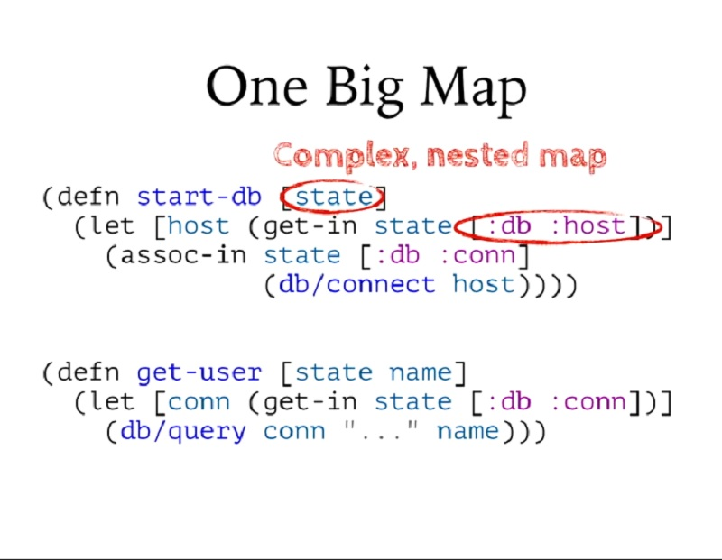

But the problem with having just one of these is that it ends up being very big and complicated. You have this deeply nested map with lots of nested maps and other things inside it. And, in any given function, you may be reaching through several layers of that to get at the piece of state you need.

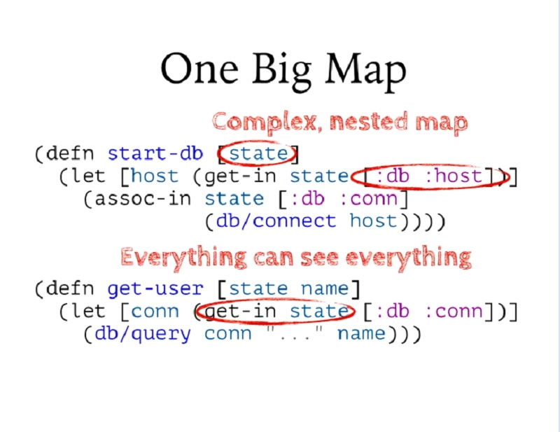

It also means, if you're using the same map everywhere, that everything can see everything. Every piece of state is always available. Effectively, this is just another way of recreating global state. So what you end up with, often without intending it, is an application where every piece of code is very tightly coupled to every other piece of code because they're all sharing this state, and any piece of code might be manipulating it somewhere.

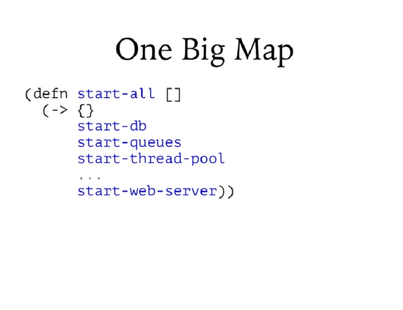

Another downside to this pattern, although it does have this nice feature that you can just sort of pass this same map through a bunch of functions to build up the state that you need to carry around, you still have to keep track of the ordering.

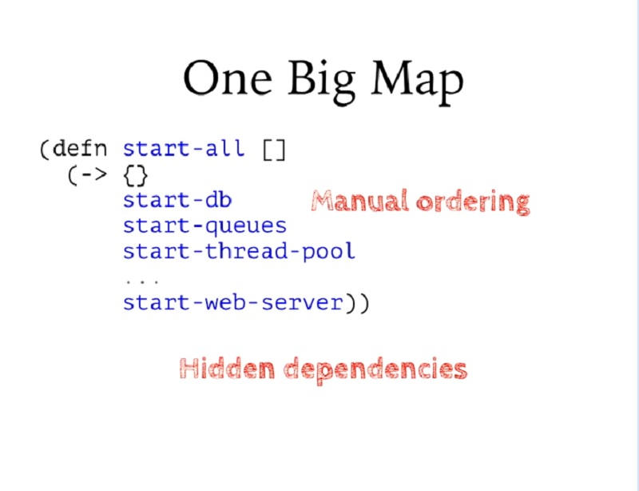

There's nothing about this that's saying that DB has to come before Web server. That's just something you have to remember. You can also have hidden dependencies between these things. I just have to know, because I wrote the code, that one of these functions is going to use some of the state that was created by an earlier function. So it's better, but it doesn't really get what I was hoping to get out of the description in Clojure in the large.

So I wanted to take those ideas and see if I could advance them just a little bit further and actually codify this into a library of reusable code that I could use in lots of different applications. So I settled on building it around this idea of a component.

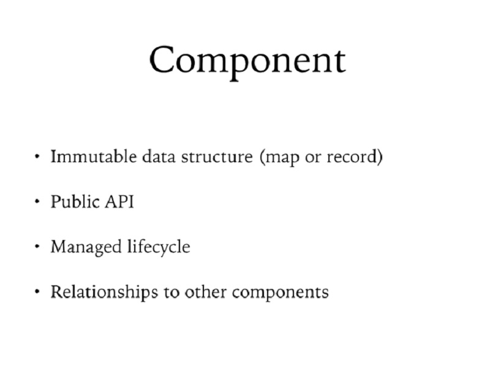

A component is something that I've just given this definition. This is my definition of a component for the purposes of this talk and this pattern. It's an immutable data structure. In fact, it's a Clojure map or record. And then it has a set of functions associated with it, and I'll call those the public API of this component. It has a managed lifecycle consisting of a constructor and a couple of functions that can transition the component between different states. And then it has relationships to other components on which it depends.

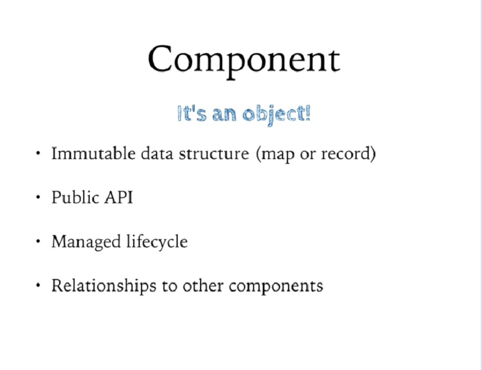

Now if this looks suspiciously like the definition of an object from object-oriented programming, that's because it is. I took this definition, or I stole this definition almost word-for-word from literature on object-oriented design patterns with one, one key difference.

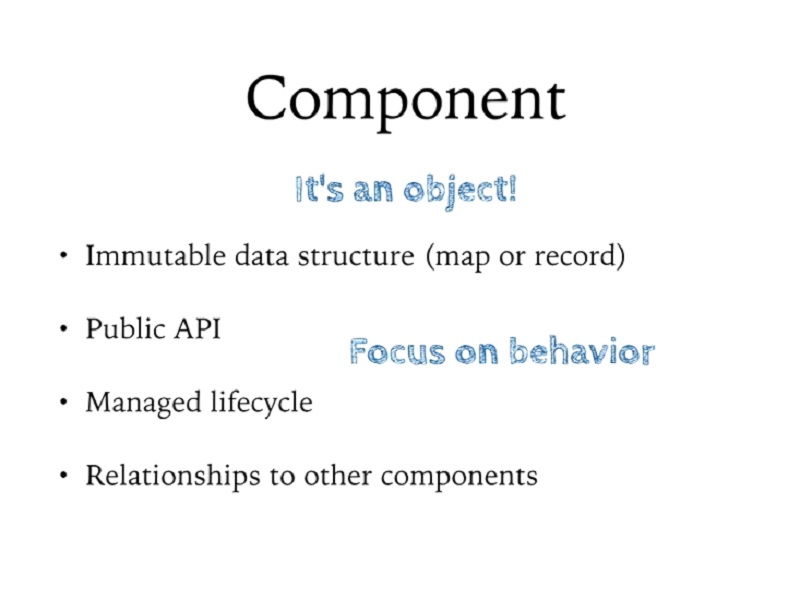

And that is that, really, with components, I'm only interested in behavior. Object-oriented patterns and object-oriented programming tends to combine data about a thing and the functions that operate on it. I’m primarily interested in the behavior and the processes. There will be some state that I need to do that, but it's largely incidental.

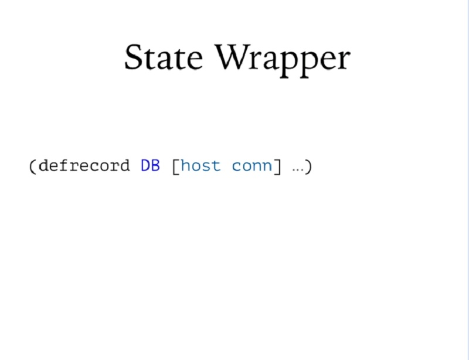

So the most common type of component that I end up using, and the one that sort of sent me down on this path is a simple state wrapper. I have some stateful object, say a connection to a database, and I'm not using a nice database like Datomic, so I actually have to keep track of this expensive connection object that I create once and then pass everywhere in my program.

So I'm going to take things: the configuration for this, which is just a host name and the runtime state, and encapsulate them together in this record, which I've called DB. Then I'm going to adopt a convention that this object, this DB record will be opaque to most pieces of my code.

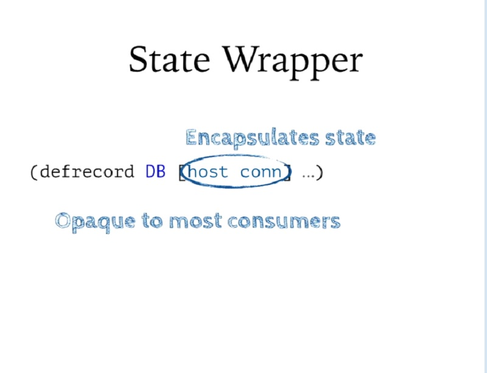

They'll use it. They'll have it. They'll pass it around, but they won't actually be looking inside it. It's as if this were a Java object and those host and conn were private fields in that object, except I'm not actually going to enforce that because I don't need to.

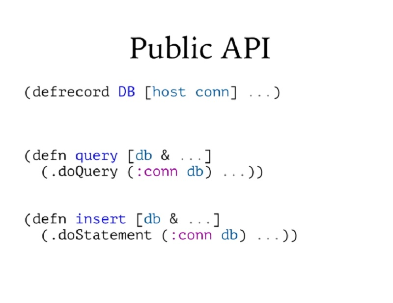

So then I'll write my public API. I'll write some functions that use this component to accomplish some task.

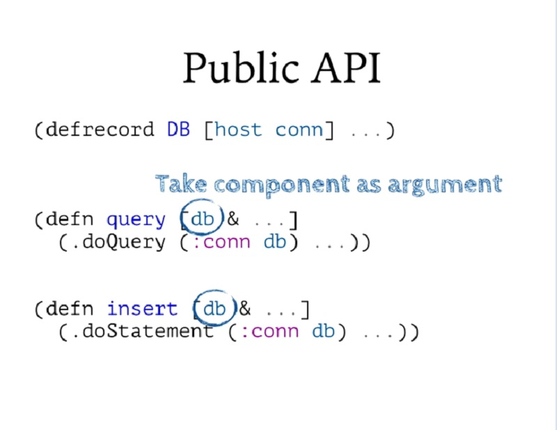

Now, each of these functions is going to take the component as its argument, usually the first argument. So these functions are actually working with the DB component. They are part of its API.

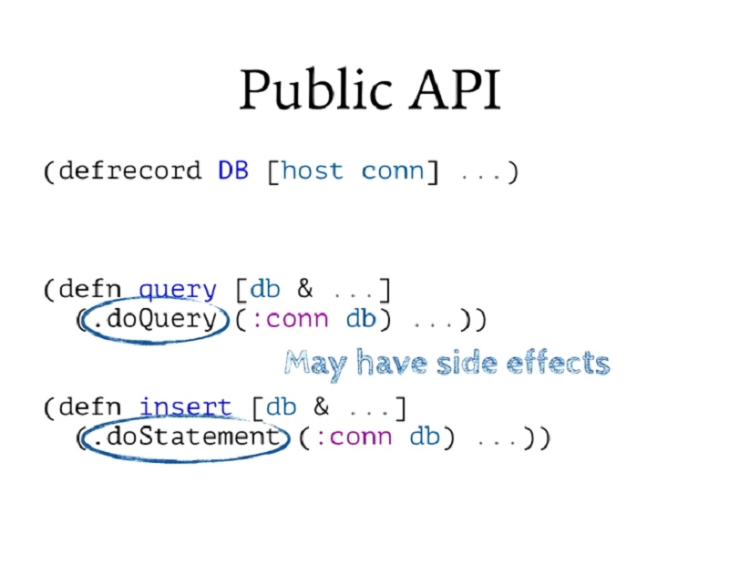

They can have side effects. They can do computation. They can do whatever I want.

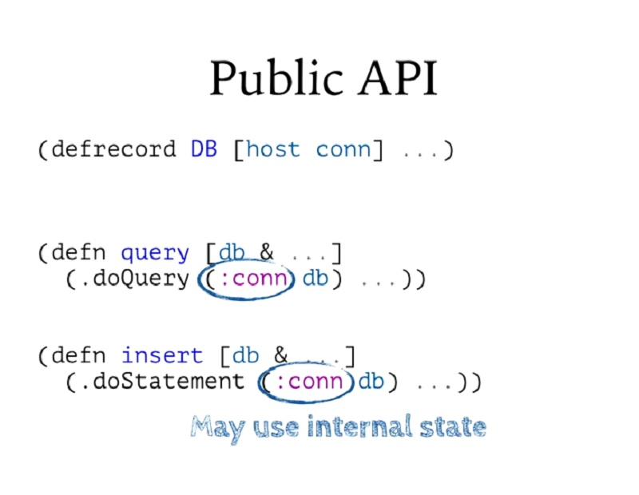

And, in particular, they can use the internal state of this component. It's as if these were public methods on a class with private fields in that class that they can refer to. So I'm just adopting these conventions of visibility in what is allowed to see what that will help me create boundaries between different parts of my program.

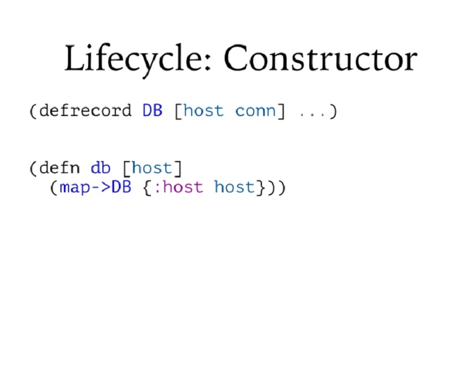

Then I have to provide a constructor for my component. Now, I could just reuse the default def record constructor. But in this case I'm going to write a little constructor function that just uses the static configuration to create the initial state of the component.

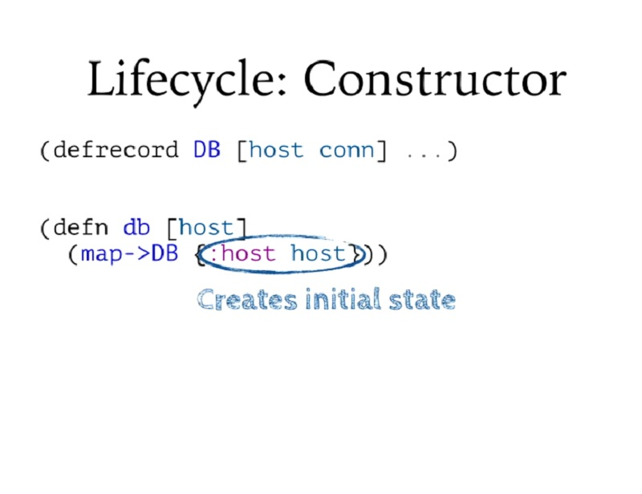

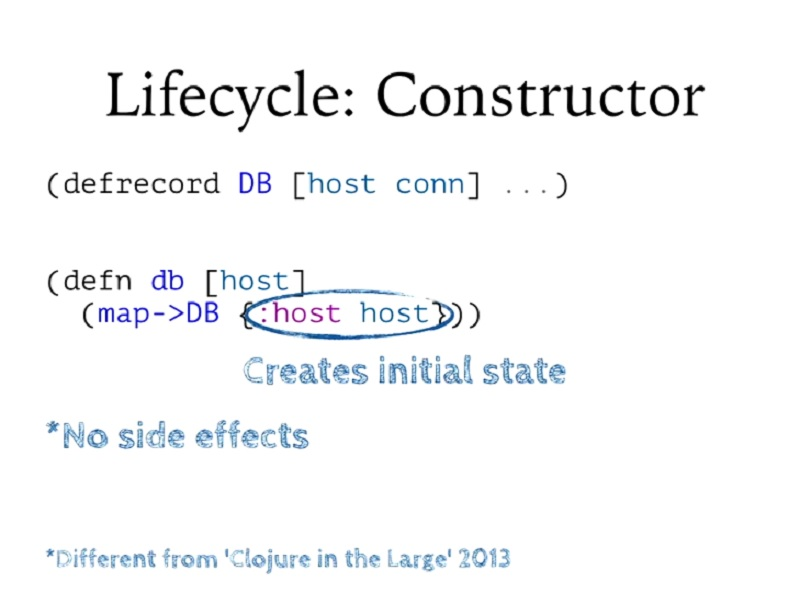

In particular, this constructor does not have any side effects. Now this is the first of several differences between the system I described in Clojure in the Large and the patterns I talked about there and the patterns I'm talking about in this talk. And I'll try to keep track of those differences as I go on. So no side effects in the constructor.

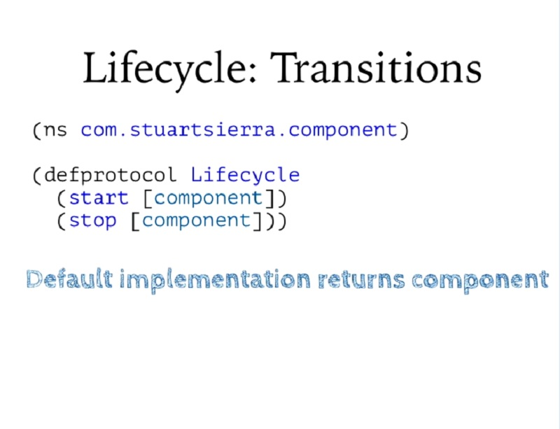

Then I have probably the most famous piece of code I ever wrote: the lifecycle protocol. Now I talked about this in Clojure in the Large, and there have been many different versions of it. People have come up with their own extensions and variations of this. But I have a slightly different version of it now that I've actually put into a library called component.

It's two methods: start and stop. They take a component as an argument, and they will return a component as a return value. There's also a default implementation of this that is just a no op. It returns whatever you pass in. So if you don't implement this, the default will be: don't change anything.

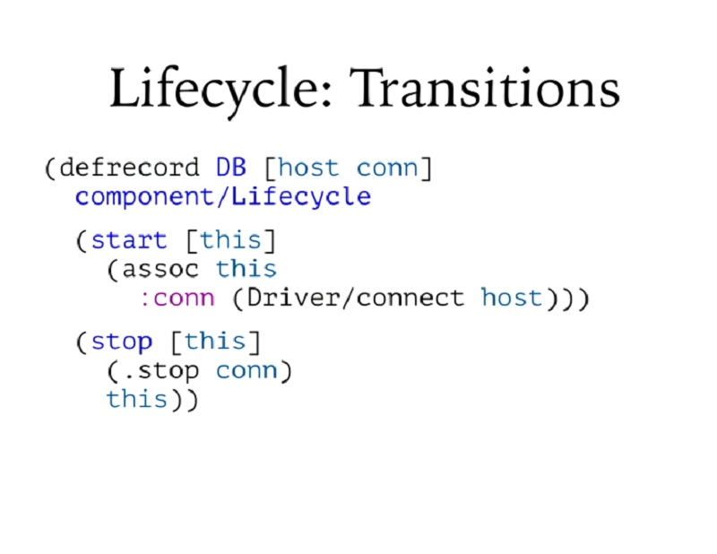

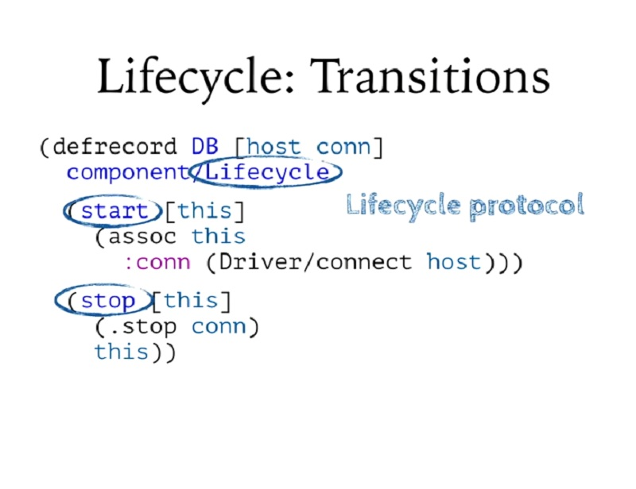

So if I'm implementing this protocol on my database component, for example, I provide start and stop implementations, which may have side effects.

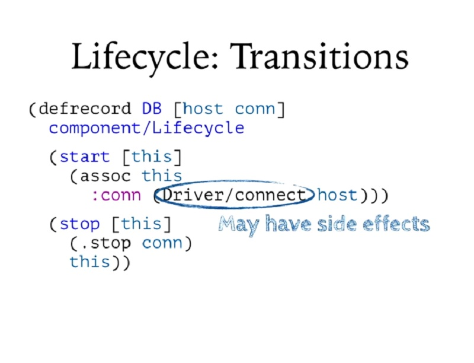

They can do things. They can create connections to external resources. They could create internal resources like threads or channels.

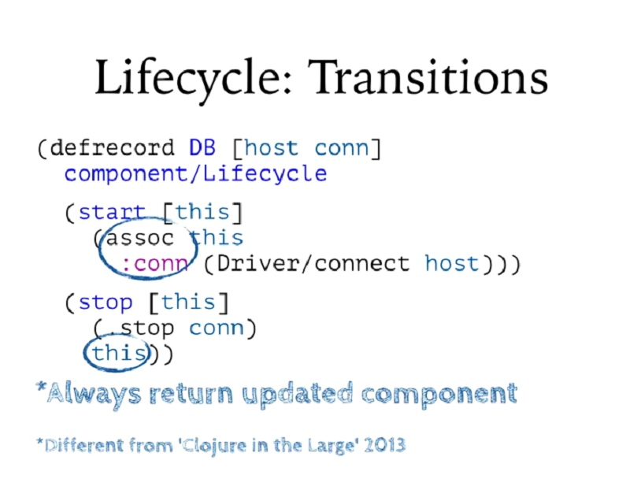

And then they're going to assoc those new things they've created onto the component itself. This is another key difference from Clojure in the Large. In that talk, I only described start and stop for their side effects. Now I'm saying start and stop have side effects, but they also have a return value, and that will become important later.

So I have to return a possibly updated version of the component that was passed in. And remember, the component is a record, so it's an immutable data structure. I can create a new version of it to return.

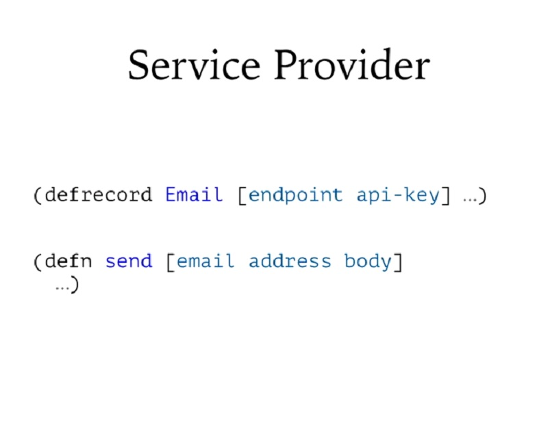

The next type of component is one that simply provides a service to other components. So let's say my application needs to send email because every application needs to send email. And let's say I'm using some email API service that requires these two bits of configuration, an endpoint URL and an API key.

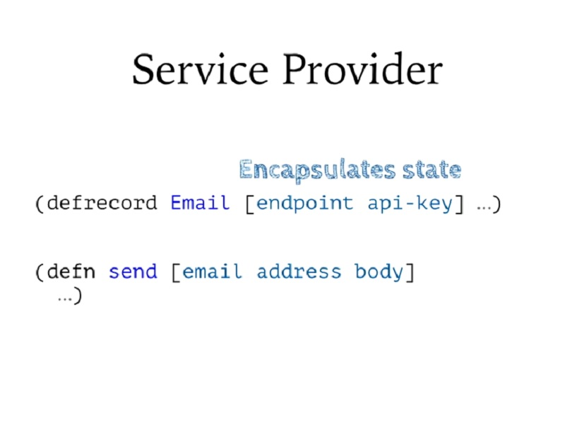

Well, I can put those two things together. There isn't actually any runtime state to keep track of, but I know that in order to send email, I need those two bits of configuration. So I'll encapsulate them together in this record called email.

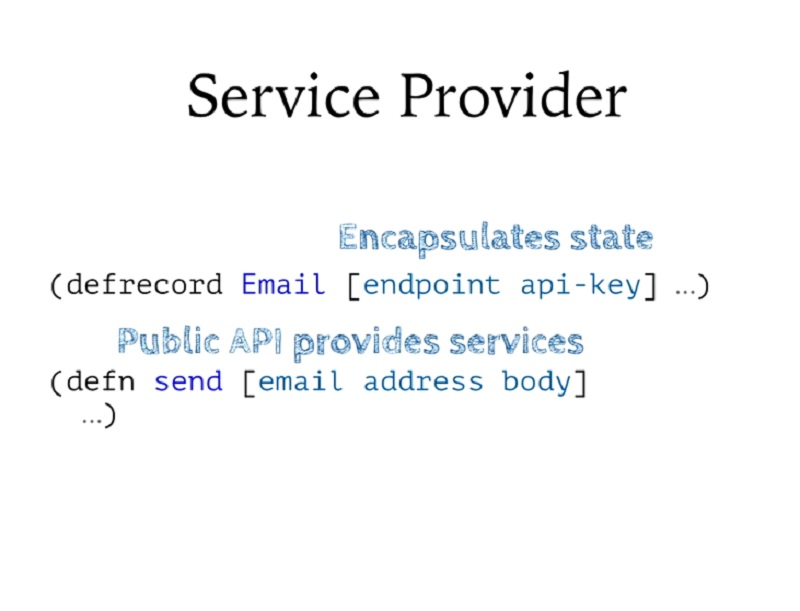

And then I'll write a public API function that takes the email component as its argument and provides the service. It does the thing that it needs to do. In this case, sending an email. So anyone else who wants to send email, they need an instance of this record, but they don't need to know anything about endpoint or API key. They don't need to know the mechanics of how sending email works.

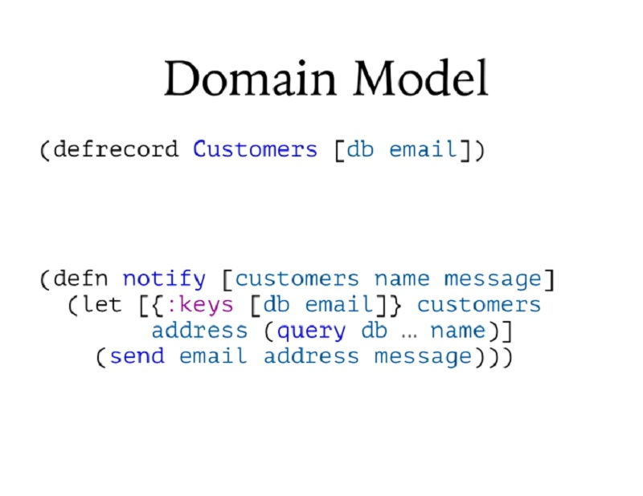

Finally, probably the most interesting kind of component and the one that took me the longest to really figure out how to describe is a domain model. I can take some subset of functionality in my application and represent it as a component. I can make it into a data structure. Now, again, this is where we start to differ a little bit from the typical object-oriented approach.

In a typical object-oriented app like Java, you'd expect to have a customer class, which would both have data representing a single customer, and methods that define the behavior and the operations you can do on a customer.

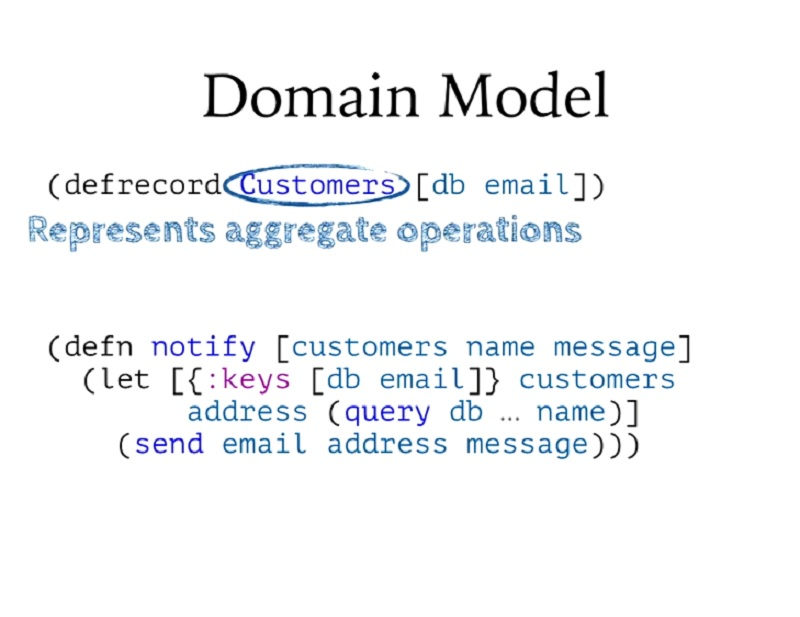

This customer's component is all about behavior. It basically represents a set of aggregate operations, things I might want to do with customers. But the actual customer data itself can just be ordinary Clojure data. We like that. It's useful.

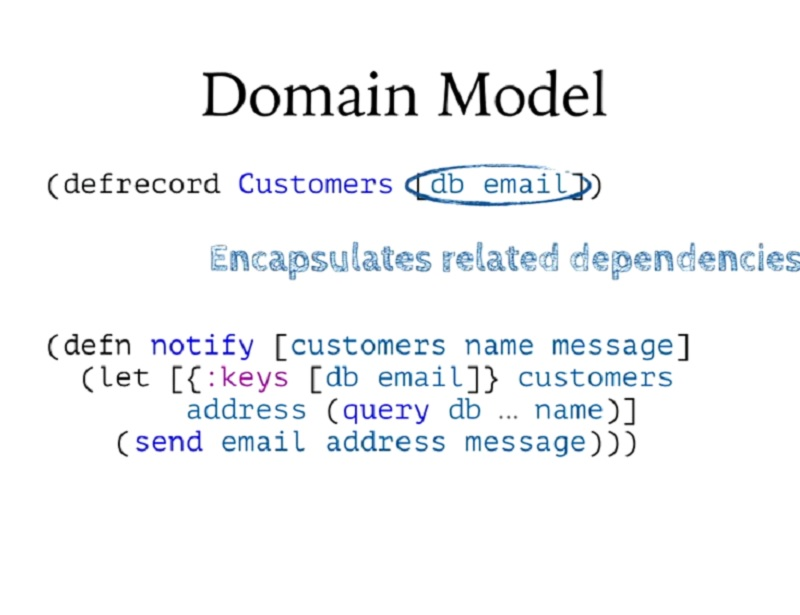

So what this does primarily is encapsulate a set of related dependencies. So maybe I know, in my application, in order to deal with customers, to satisfy the services that I need for customers, I need access to the database, and I need to be able to send email. So I'll put those as fields in the customer's component. Now I could actually use a map here. It would work just as well, but I like giving things names, so I'll call it customers and use a record, but a map would work exactly the same way.

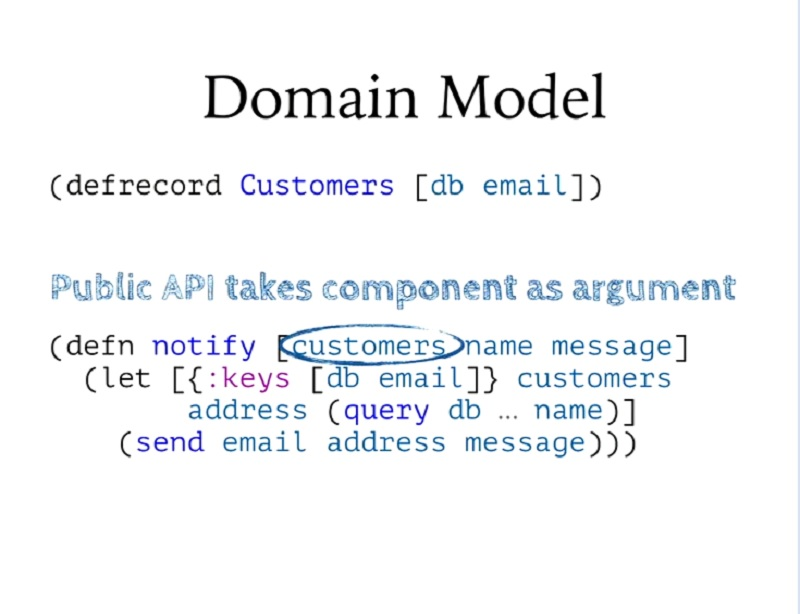

Then I can define the API for the customer's component. I'll have this function to notify a customer. I want to tell the customer something. And I'm going to do that by sending them email.

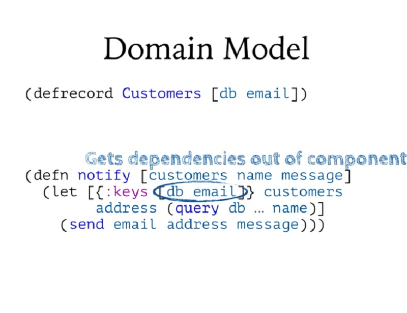

So the customer's component is the first argument to this function, and then it uses those fields to get its dependencies. So it gets DB and email out of its local state. It doesn't need to reach out to some broader, more global context to find those things.

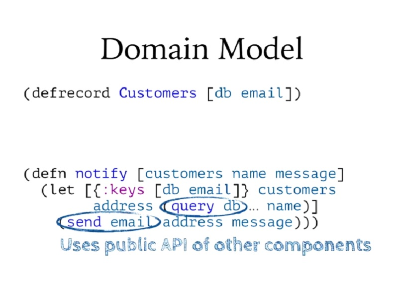

Then once it has them, it can invoke those components through their public APIs. Now notice I haven't said anything here about what DB and email are in this component. I haven't said where they come from, what type they are, or anything else. All I know is that they will be provided to this component and that I can call them using these functions. So DB is something on which I can call query and email is something on which I can call send, and that's all this component needs to know.

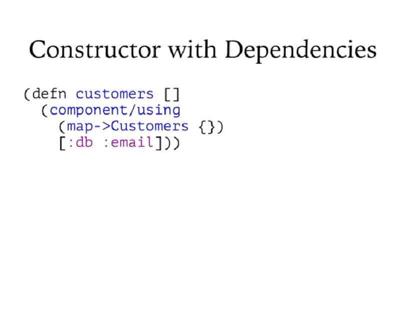

Now when I construct this component, I'm going to add something new. I'm going to use this function that's in my library called using.

Using just takes a component, which I've constructed using the default def record map to record constructor, and a collection of keys. And those keys are the names of that component's dependency. Actually, all it's doing is adding some metadata onto the component. But I'm declaring that this component, customers, depends on something named DB and something named email.

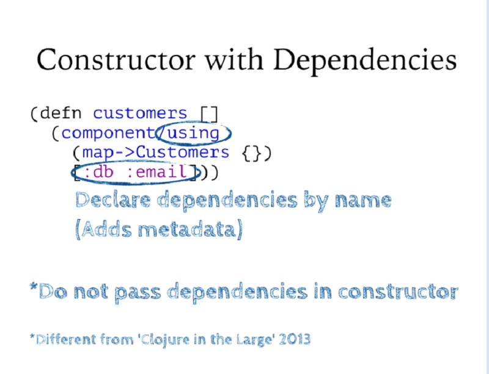

In particular, I am not passing the dependencies in the constructor function. This is another difference from what I described in Clojure in the Large. All I'm going to do is declare my dependencies and they'll get filled in later.
 

So I have these components. I've done three so far, and I have some dependency relationships that I've declared between them.

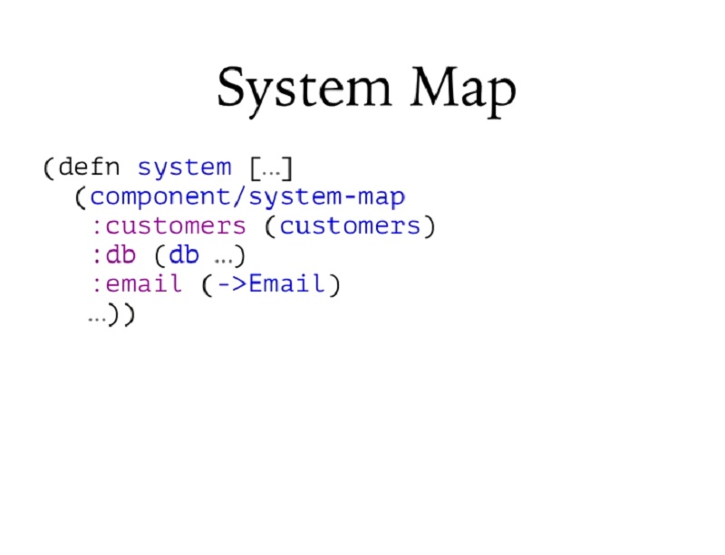

Now I want to put them together, and I do that in what I call a system or a collection of components. A system, in this case, is just, really just a map.

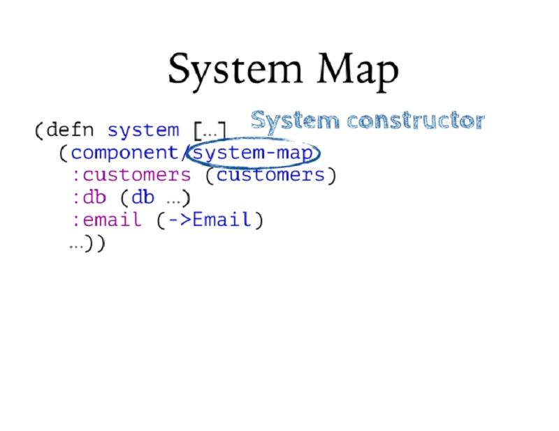

I provide this little helper function to construct it. It basically just makes a record. And, for all practical purposes, I can treat that record like a Clojure map.

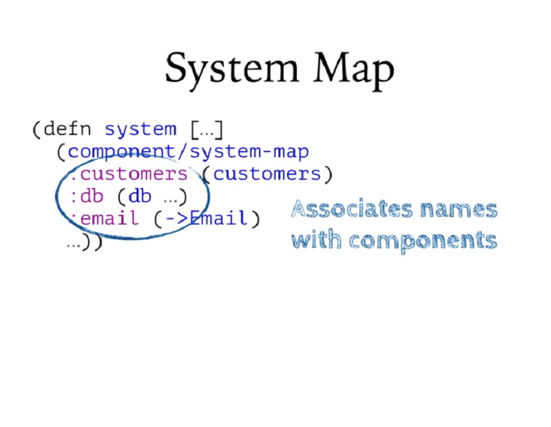

The purpose of a system is to associate components with names. Those names are usually keywords, although they don't have to be. So I have three components, which I'm constructing for this system, and I'm assigning each one a name within the scope of the system.

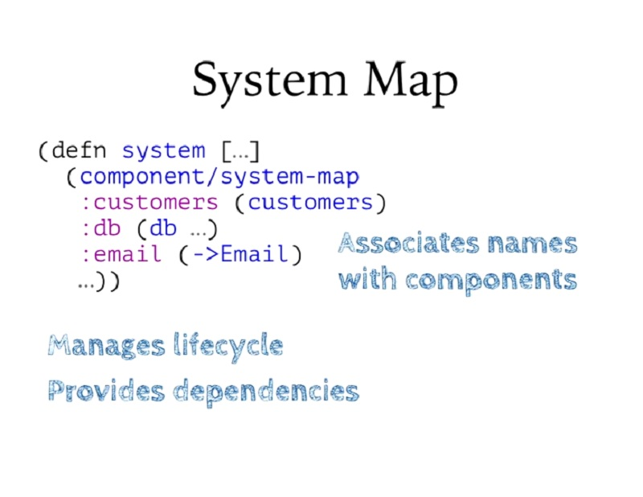

So the system itself is responsible for managing the lifecycle of the components it contains and providing them with their dependencies.

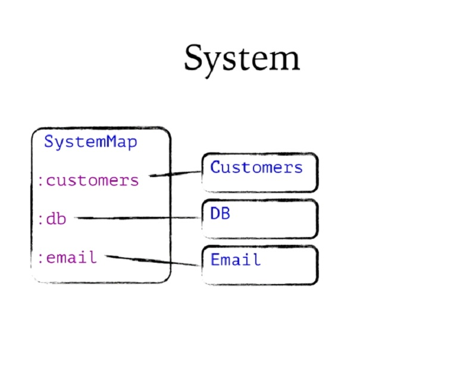

So here's how it works. SystemMap is just a function. It takes keys and values, and it returns an instance of this system map record that I've defined. Now remember, Clojure records are maps. They can have any arbitrary keys associated onto them, so I didn't need to say in advance that customers, DB, and Email were going to be the keys in this system. That's just what I happened to put in it.

The only difference with SystemMap, the only thing that distinguishes it from an ordinary map is it has its own implementation of the lifecycle protocol built in. So a system knows how to start and stop itself.

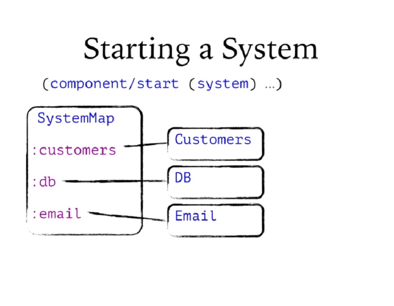

And, in particular, it knows how to do that by starting all of the components it contains. So when I call start on a system, it's going to go through this procedure in order.

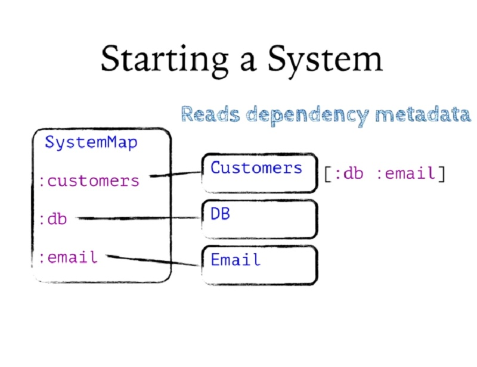

First, it's going to look at the components it contains and see what their dependencies are. It's going to read off that metadata that the using function added onto my records. So it sees that customers depends on DB and Email, and it knows that it has things called DB and email.

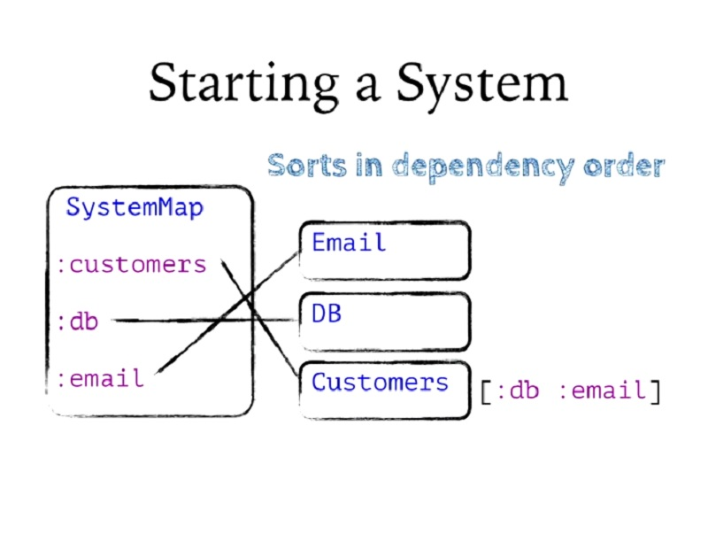

Then it's going to sort all the components in order. It's going to build a graph of all the dependencies and then do a topological sort on that graph to figure out what order the components should be started in.

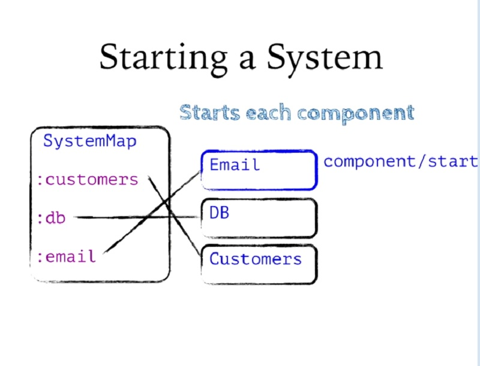

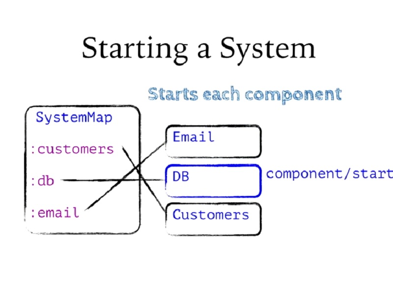

Then it's going to call start on each component in order. It's going to step through the components in dependency order and start them all by calling the lifecycle start method.

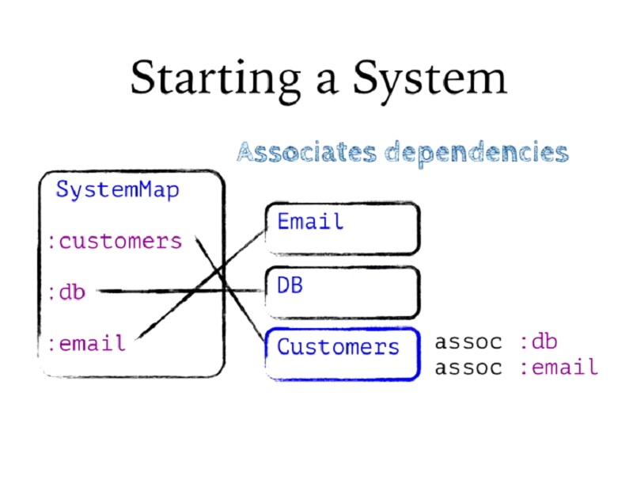

When it gets to a component that has dependencies, like Customers in this example, it's going to first associate its dependencies into it. Remember, records or maps, whichever these are, I can just assoc onto them, and I've declared that customers needs DB and Email, so I'm going to assoc DB and Email from the system into Customers.

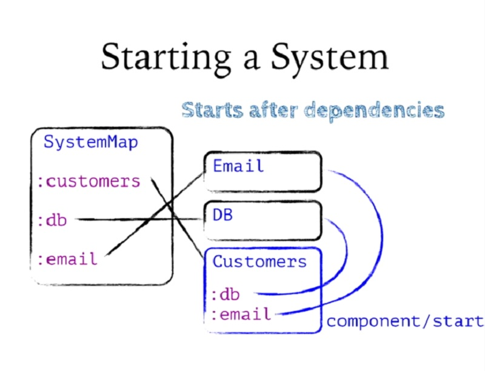

And once I've done that, then I can start Customers, so I know that by the time I call component start on Customers, DB and Email have already been started and they've been assoced into Customers.

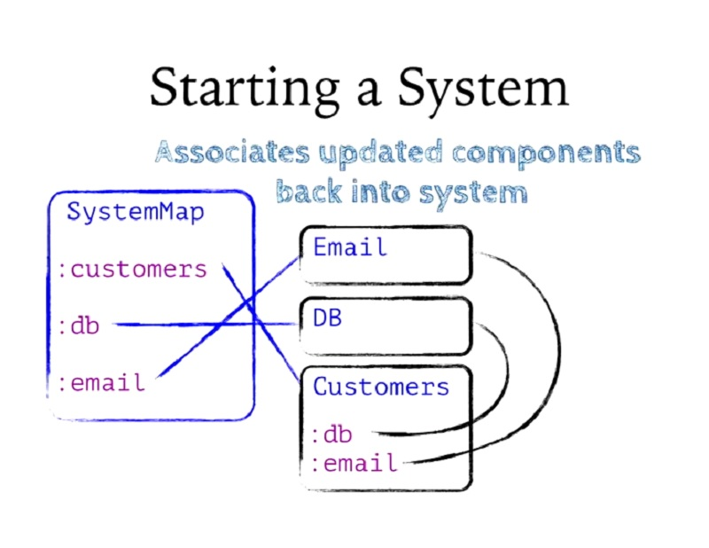

So we get all of these started components. Remember, each time we call start it returns potentially a new version of the component with some new state in it. We assoc all of those back into the system. That's the last step that the system does when it's starting itself. So now I have my components connected together, and they're all started, and it's all happened in the right order.

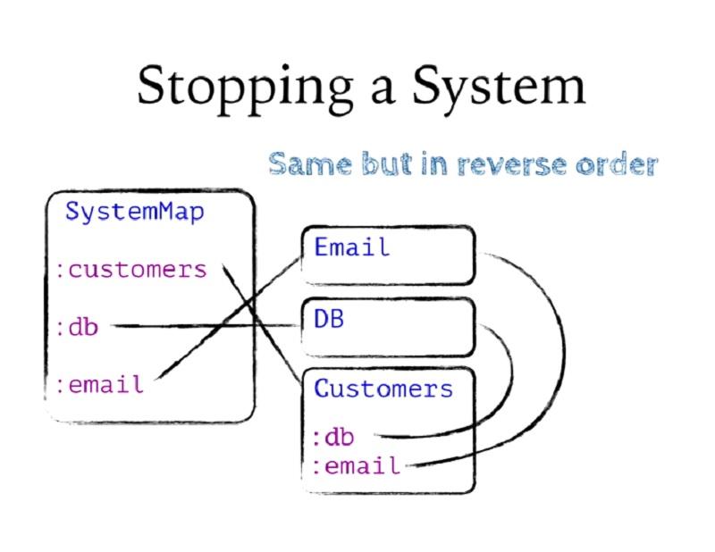

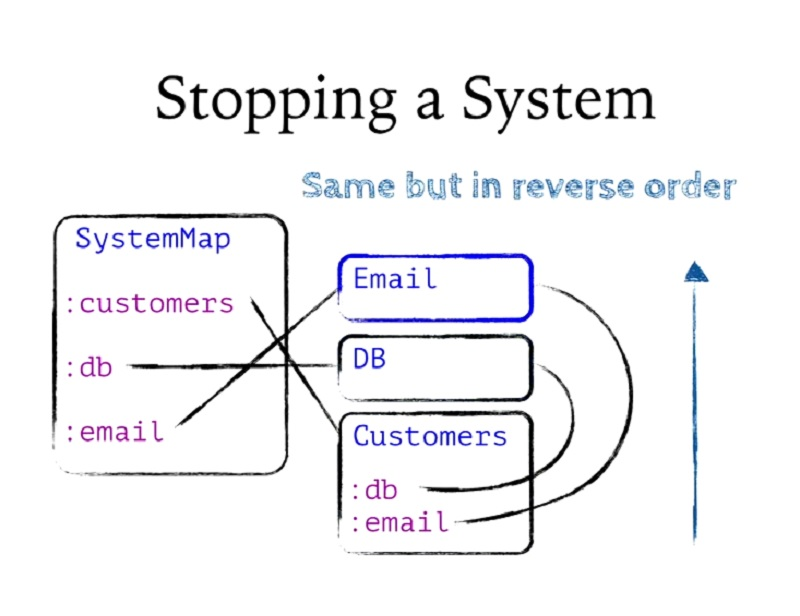

Stopping a system is the same procedure. It just goes in the reverse order. It goes from customers back up to the least dependent things in the system.

So in -- this has allowed me to connect a component to its dependencies. I've basically injected Email and DB into Customers, finding them in the system.

Now in the object-oriented literature about patterns and design, there's a lot of talk about dependency injection and these two sort of competing schools of thought on how you should do it. You can do constructor based injection where you inject dependencies of a thing when you construct that thing, or you can do setter injection where you actually mutate the thing to give its dependencies to it.

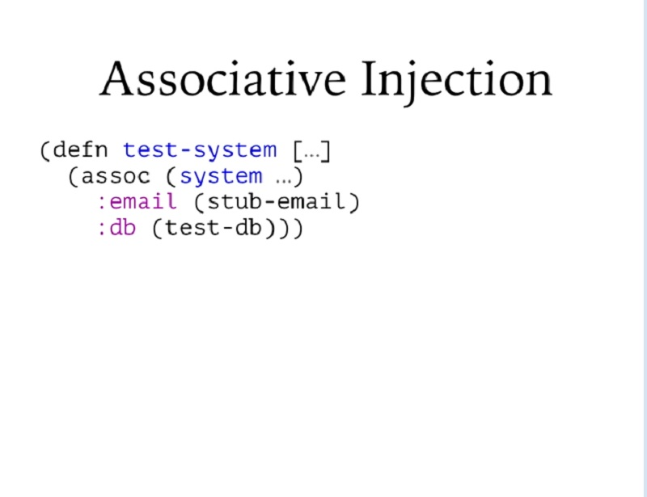

When we have immutable maps as our components, we can do something else. We can actually do associative injection. So say I've got my system with my three components in it, and I want to write some tests. But I don't want my tests to actually send real email, and I don't want them to use my actual production database. I can create new versions of these components that are just for testing purposes. And then, if I want to include them in my system, all I have to do is call assoc, ordinary Clojure assoc.

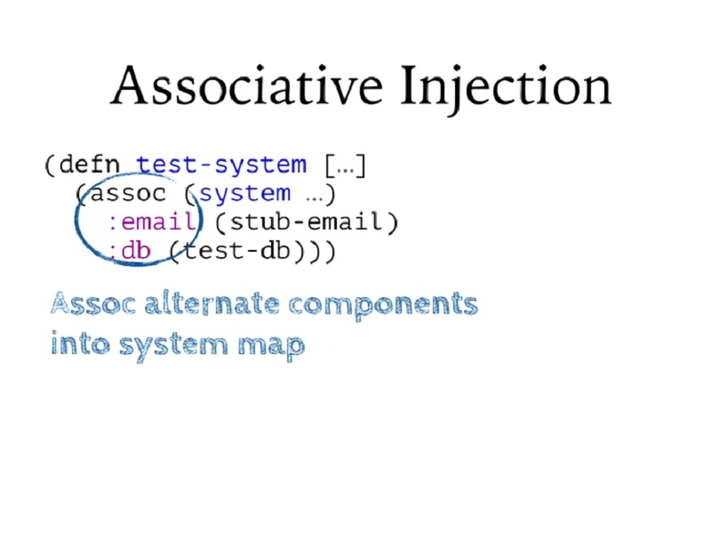

Remember, a system is a record. A record is a map. I can assoc onto a map, so I can replace Email and DB in my system with alternate implementations provided I do this before starting it.

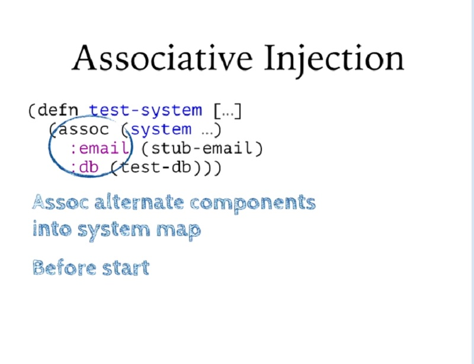

Remember, everything is going to get connected together when I call start. So before calling start, I can do whatever I want to this map. I can replace components, add components, remove components. And then when I start, that's when things will get connected and start using each other.

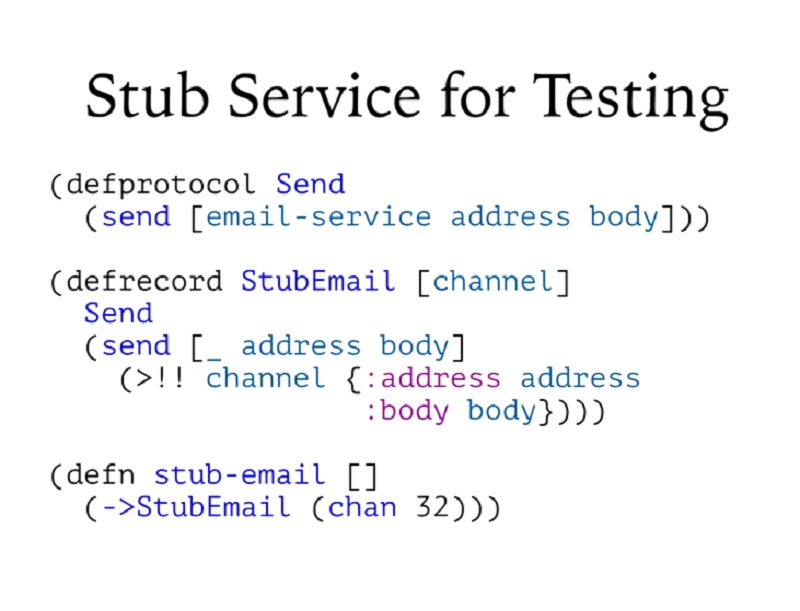

So just as an example, say I wanted a stub version of my email service for testing purposes.

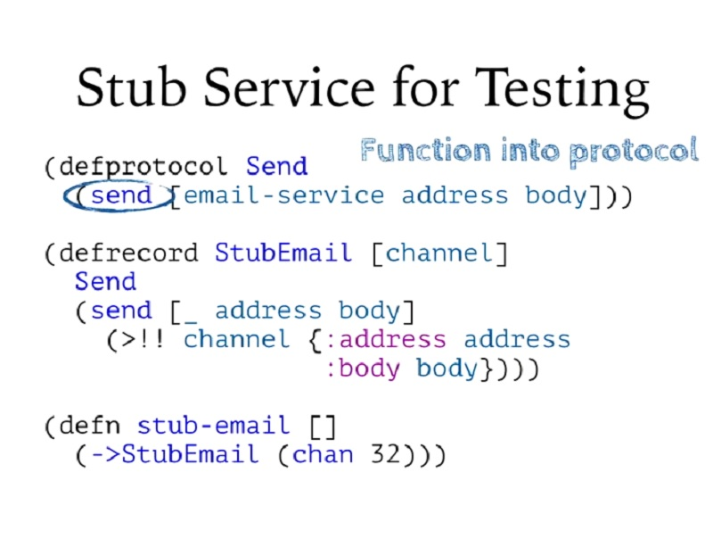

Well, I'll do one thing first. I have to take my send function and turn it into something that I can dispatch on. I'll turn it into a protocol in this case. I could also use a multi-method. It would have the same effect. But I need to establish some boundary at which I can swap out a different implementation of this component. In this case, I'm using a protocol. So then my original email service would implement this protocol, and I can write a stub implementation of the service that doesn't do whatever the external side-effecty thing is.

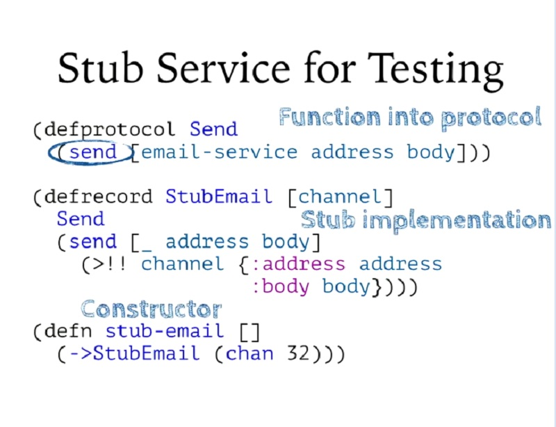

In fact, what this stub email implementation does it take whatever calls I give to it, whatever operations I ask it to do, turn them into data structures -- that little map in the middle there -- and put them on a core.async channel. And then I create the channel with a buffer in it so that I can sort of collect any calls made to this component and verify that they were what I expected. I can use this as a mock in my test.

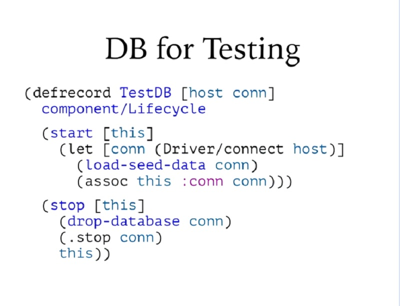

Now for something like a database, I'm not going to try to mock out an entire database. That's far too much work. It's too complicated, too many things, too many operations to support, unless of course your database is Datomic, in which case it's really easy.

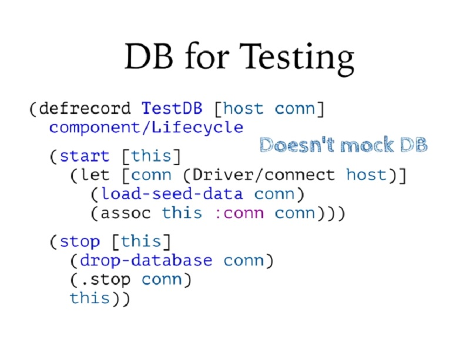

So -- but what I will do is I'll create an alternate version of my database wrapper component that creates and destroys a unique copy of the database every time I want to use it.

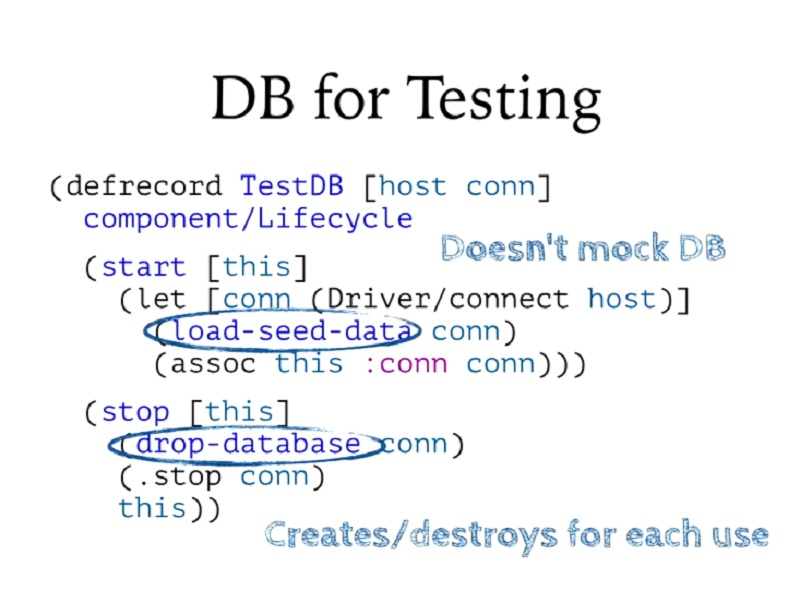

So I'll use this for testing or local development. Every time I start this, it's going to create a new, uniquely named database, and then it's going to destroy it when I stop it. So I can use this in development. I can use it in my tests and be certain that every time I use this database it's going to be in a fresh, known, well-understood state.

Now, I might use a local database server to do this. I might use an in-memory database. Whatever is the quickest way to get this working, this is how I'll develop and test my application.

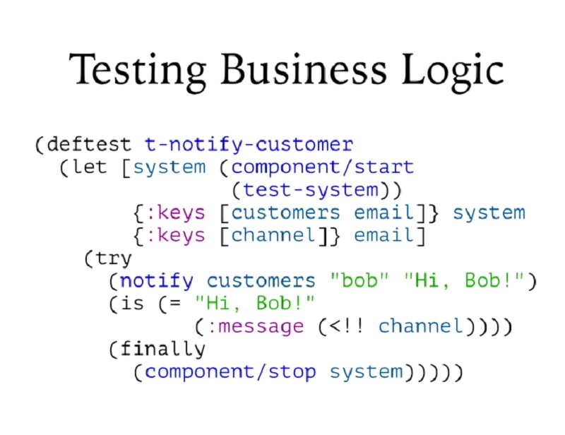

So now when I get to actually testing the business logic, I want to test that customers component. I want to do that in a unit test. When I do that, I can create a completely isolated system in which to run it.

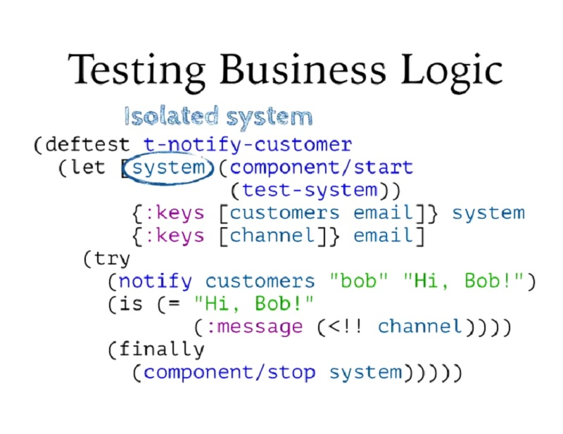

I can start my test system that I create for this test alone, and I know it's not going to be affected by any other test in the system. I could even run my tests in parallel and they're not going to interfere with each other. So I just pull out the things that I want to look at. I pull out the Customers component. I pull out the Email component, which is my stub implementation, and then I can make a call to one component and verify the results in another.

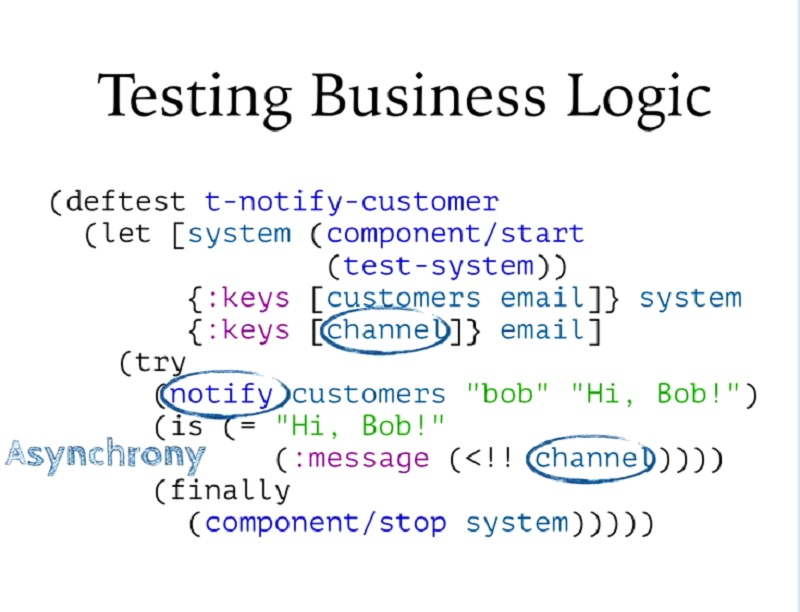

And because all of the dependencies get passed through the call chain, nothing is every looking at global scope. That makes it very easy to write a test that could include asynchronous operations. Now this particular example doesn't actually do that, but suppose that notify were going through several layers of asynchrony: dispatching to a thread pool or a channel or a message queue, or some other thing that might happen some point later in time; I don't know when. I can be sure that whatever version of email ends up at the end of that chain, it should be the same version that I passed in when I created this test system here.

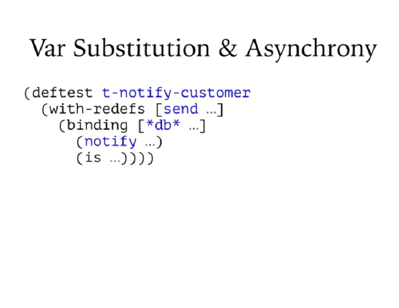

And the reason I like this is that pretty much the only other mechanism that I've seen commonly for doing this in Clojure for substituting in an alternate implementation operates at the level of individual vars. You can either use with-redefs, which is global across your entire program, or binding, which is confined to a thread.

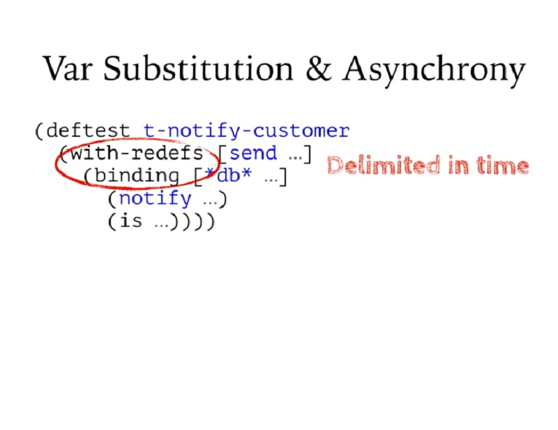

But in either case, both with redefs and binding, are delimited in time. They specify a scope of time in which this alternate world is true. And that can lead to problems. If I have different notions of time in my program, if I have things happening asynchronously on different threads or maybe happening at an unpredictable time, I could have potential race conditions in my test.

And I've run into this a lot where I'm trying to test something that has mocks or stubs in place, and then it works some of the time, and it doesn't work other times. Or my personal favorite: You run it on a faster or slower machine and all the tests start failing. That's really annoying.

So, you know, these are useful tools. With redefs and binding both have very good uses, but if you're trying to test some data flow that could be asynchronous, they can run into problems.

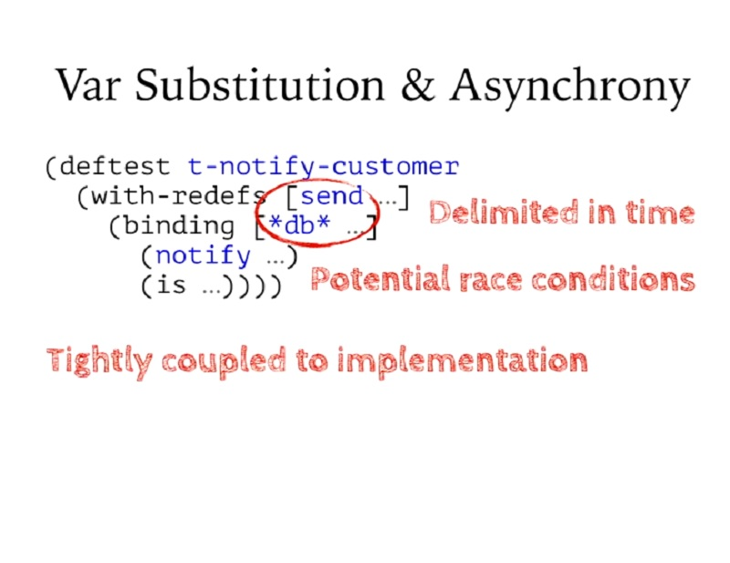

Another thing I don't like about substituting at the var level is it really feels like the wrong level of granularity. Usually I don't want to replace a single function. I want to replace a whole group of functions.

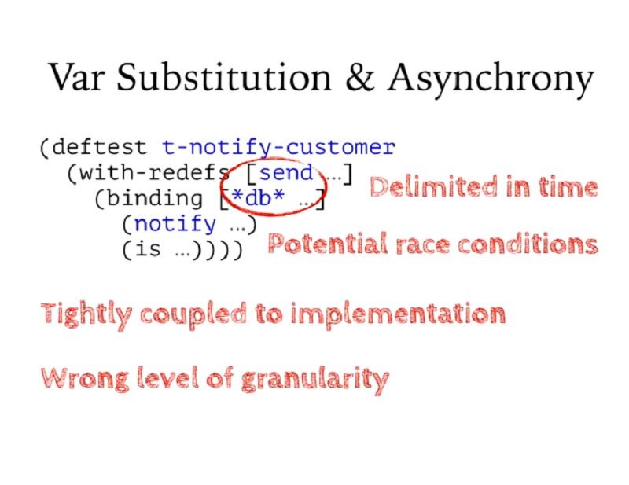

I want to replace the database or the email service. So just by having to replace individual vars within a tests, I have a risk. It won't happen all the time, but I have a strong risk that I'll end up with a test that's very tightly coupled to the implementation. If I change some subtle detail of how these vars get used in whatever code defines them, I might end up breaking my tests inadvertently.

So now I've got my components. I've put them together in a system. I've connected them all together, so they all know how to talk to each other. What do I do with them? The one thing I don't want to do is take that big system map and then pass it as an argument to every function in the program. That puts me right back where I started with the one big map, and it has all the same problems.

Instead, what I'm going to do is find key entry points in my application and insert specific components at those entry points.

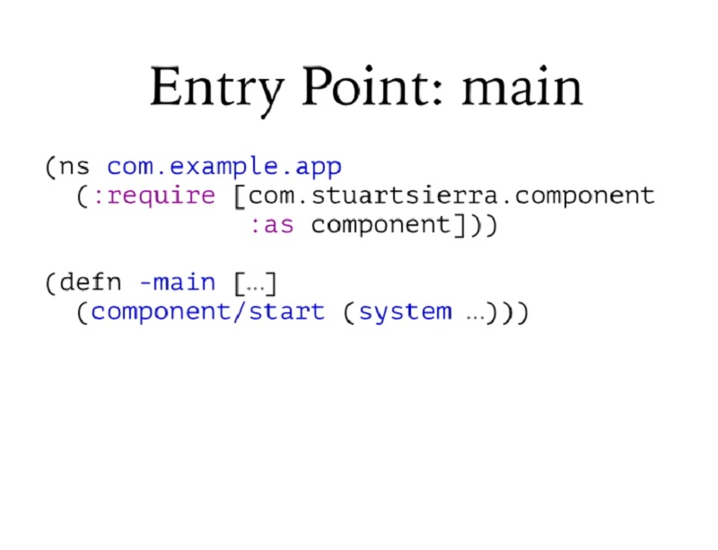

An entry point is just any place that your code starts running. The most obvious example is the main function. If you control the main, you control how your application starts up, and this is all it needs to do, then it's easy. Just create a system and start it. You're done.

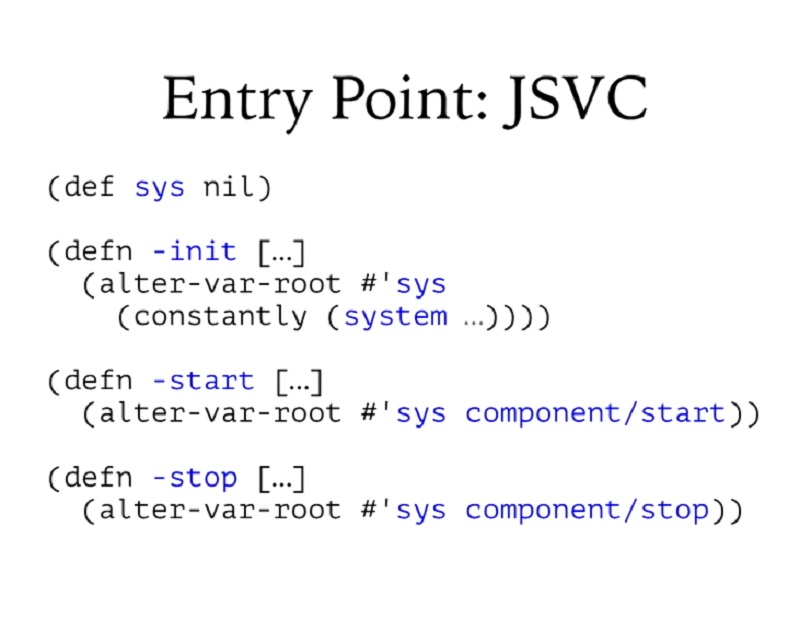

If I'm using some sort of management framework, let's say I'm using Apache Commons Daemon or JSVC, and I'm using that as a container for my application, well, that requires that I implement this interface with V's methods in it, and I might need to add a mutable container to hold the system. So I have one piece of mutable state in my application and that's to hold the system object so that V's different entry points at which I get called in its start and stop will all work.

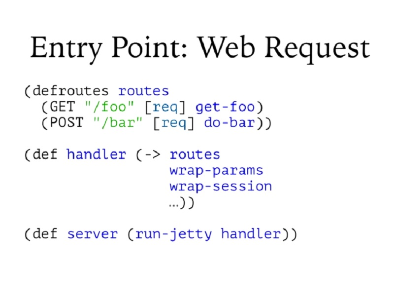

The most common case, though, probably is Web apps. And here this is sort of an unfortunate habit that I think we've fallen into just because it seems easy at first, and that is to define things like a routing table or a Web handler statically.

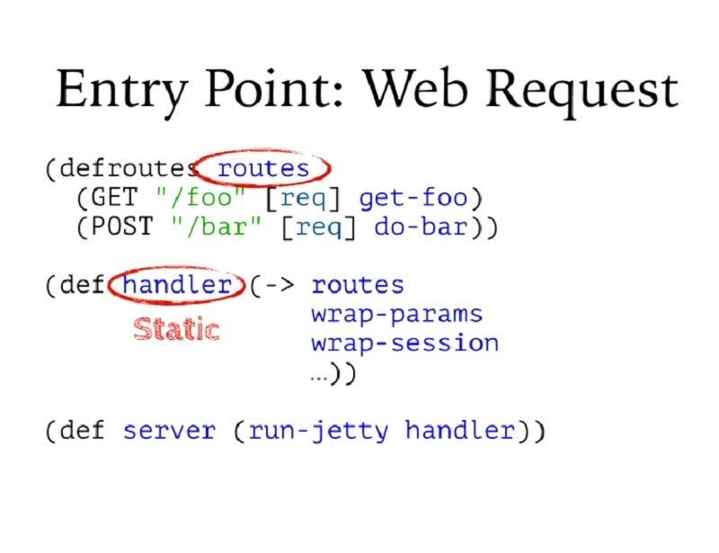

This routing table and this handler function are created by wrapping a bunch of functions. This is wrapping, say, ring middlewares around a function. But it's doing that when this file gets loaded. It's doing it statically at compile time, which means there's no place in here that I could inject any runtime state. I would have to refer to some global variable somewhere in order to get that state back into my Web handling function.

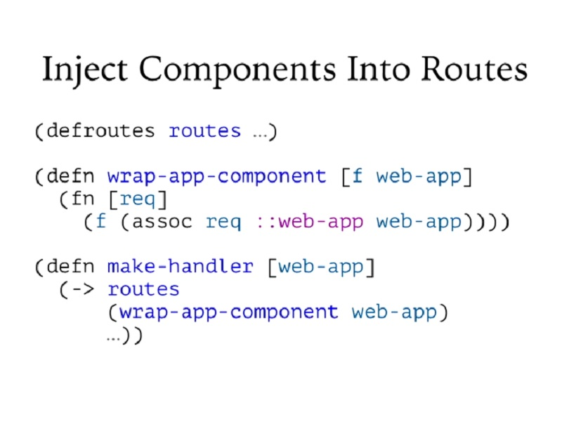

But it turns out you can actually work around this fairly easily. I need to, instead of defining that route handler function statically, I need to provide a constructor function to build that function. Here I've called it make-handler. And I've added an extra little piece of middleware that wraps that function in something that's just going to associate a component into the call chain. In this case, I'm assuming it's a ring request, and I'm going to associate a component called web-app into that request.

![00.32.13 Inject Components - build slide](Components/00.32.13

So this make-handler function, I'll call it when I'm starting up the application to build up the handler function dynamically. And, at that point, it can close over a web-app component that I've constructed.

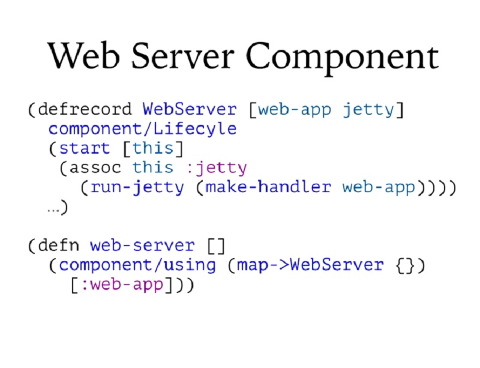

So then I might have a Web server component that uses jetty or netty or whatever my Web server is.

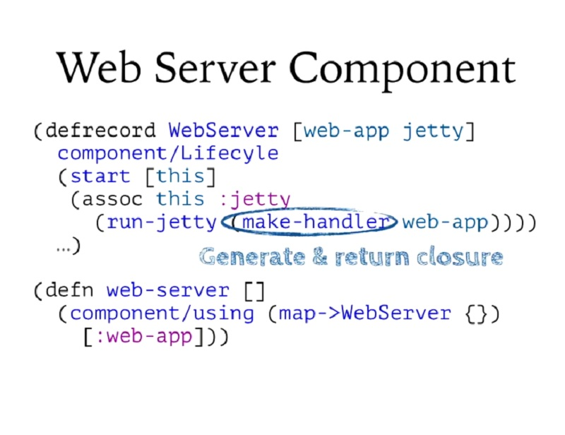

And when I'm starting that, I will call the function that actually creates the route handler function that the server infrastructure is going to use. Now in this example, I have assumed there is one component called web-app, and it represents my entire Web application. It might end up depending on everything else, or it might not. But I could do it different ways.

This is very open. I could have a different component for each and every route in my application. That might make sense for an API type service. I could have different components for different subsets of routes in may application. Whatever I want to do, I just have to make sure they're available at the right point and inject them into the call stack.

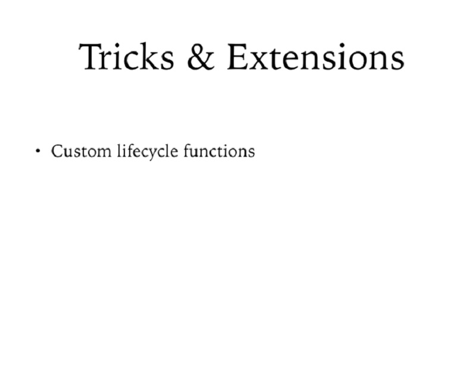

So there are all sorts of tricks that you can do with this. The amount of code in this framework I've created is tiny. It's really just shuffling maps around. There's not a lot to it. But you can do things like define your own lifecycle functions.

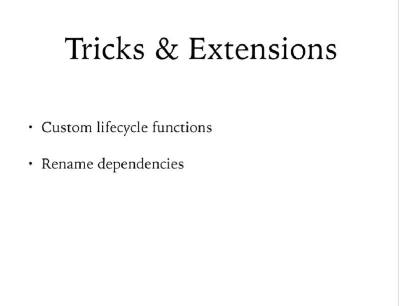

You can rename the dependencies of a component. In my example, DB and email had the same name in the system that they had in the customers component, but that doesn't have to work that way. I could use different names in the system and the component and show the mapping of how they get renamed.

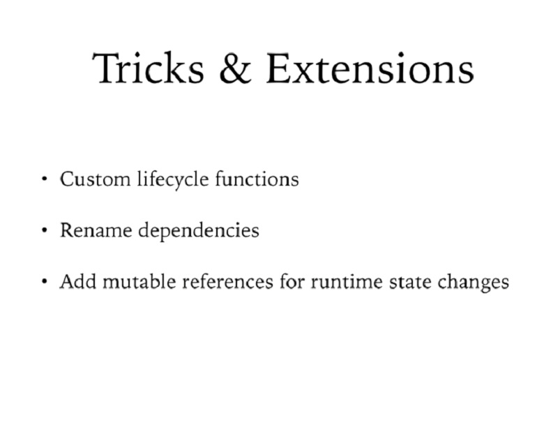

One thing this framework does not deal with is runtime state changes. You can bring the whole system up, and you can shut the whole system down, but you can't change part of it at runtime. But Clojure has perfectly good tools for doing this already. If you need something to be mutable at runtime, add a mutable reference. Put an atom or a ref or an agent or a channel inside your component, and that can exhibit change at runtime.

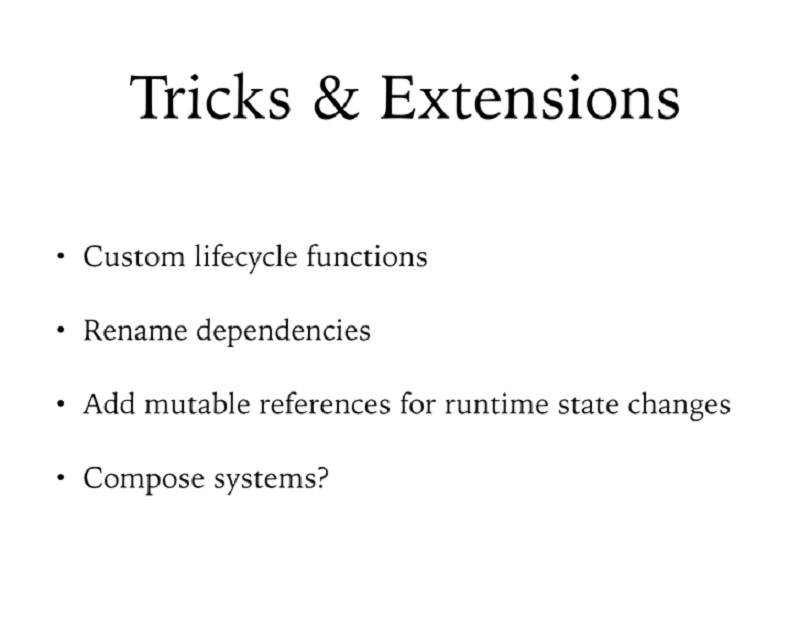

Another thing I should mention is that systems are themselves components. They obey all the same properties, so in theory you could compose systems of systems that are nested. Now I've actually never found a use case for this, and I'm not even sure it's a good idea, but maybe there's some situation where you'd actually want to do this. I generally find it easier if the systems are all flat and all the components live at the same level.

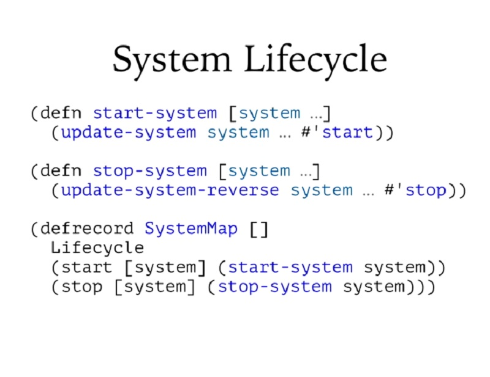

So here's an example if you wanted to make your own lifecycle. I've seen some APIs in Java, for example, that define four lifecycle methods like init, start, stop, and destroy.

Defining your own lifecycle is very easy. You just need to provide your own version of SystemMap. You need to define your lifecycle functions, whether they're protocols or multi-methods and implement them on all your components, and then provide your own version of SystemMap that calls them in the right way.

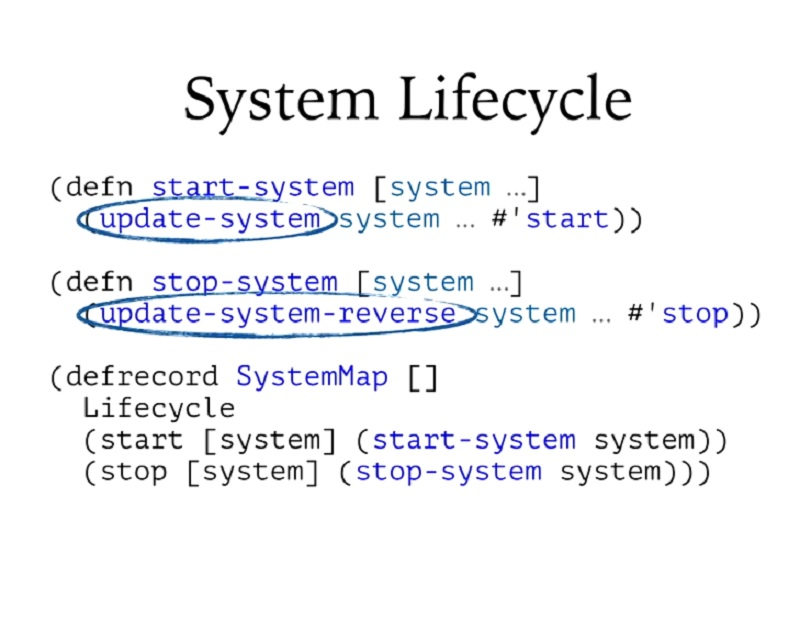

And there you can make use of these two helpers: update-system and update-system-reverse. This is how the component library I've written actually implements start and stop on systems. update-system just takes any arbitrary function you pass it and calls it on each component in dependency order while doing the associng in of dependencies at the same time. update-system-reverse does the same thing. It just goes in reverse dependency order.

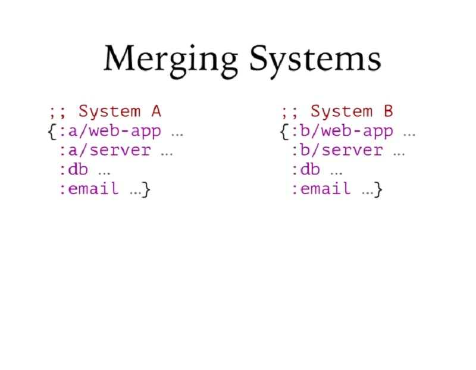

So this is very simple. It's just maps, which means I actually discovered things I could do with these systems after I'd started working with them. One of the most fun for me to discover was that I could take two system maps and merge them. If I have an application that has two, three, however many different systems, and let's say I'm going to deploy them to production on different machines, they're actually going to be running in different processes. But if I want to test them locally in a single process, I could just merge them together.

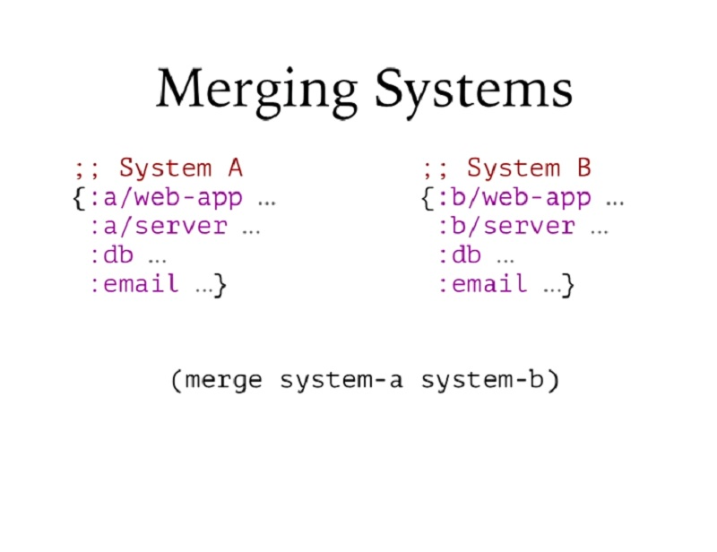

Remember, systems are records. Records are maps. I can call merge on two maps and get a bigger map that has all the contents of both.

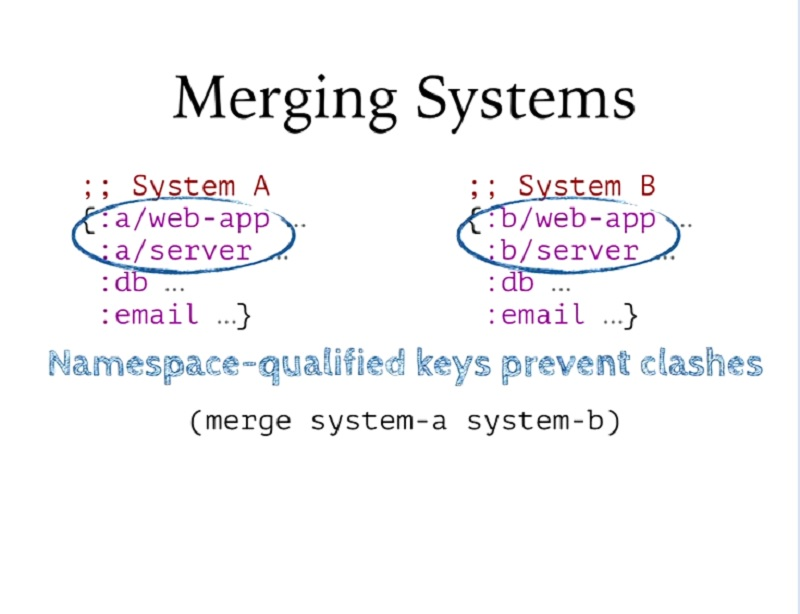

And if I know I'm going to do that, I can use name space qualified keys for the components that are different in the different systems and then use the same names for components that are going to be reused.

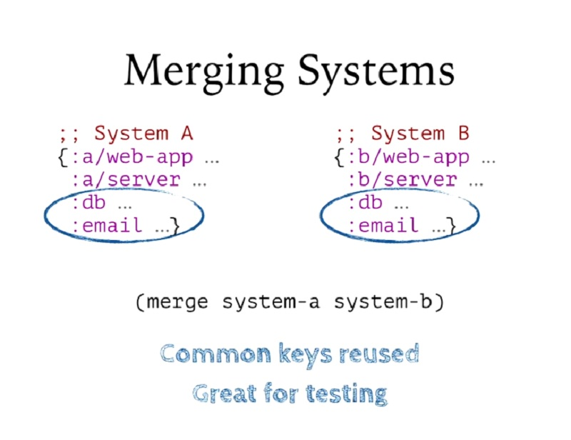

This is fantastic for testing. Now I can actually simulate running two different applications without duplicating any of the code or any of the runtime state that I need to use them.

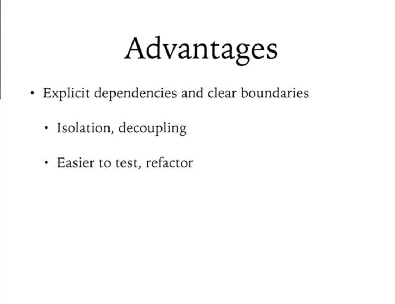

So like I said, this is not a lot of code. You could probably all go home and write this yourselves just from the description that I've given here. But it does have some real advantages, the biggest one being it forces you to think about the boundaries between different parts of your code. What does this piece of code need to do? What does it need to use in terms of services and state?

Doing this actually makes it easier to test and refactor your code and possibly even separate pieces of a program into different programs. I've actually used this technique to take a big monolithic application and split it up into smaller pieces.

Another advantage is it takes the ordering of dependencies and makes it automatic. You no longer need to think about which component gets started before which other thing. That's built into the library. It does it automatically based on the relationships that you declare.

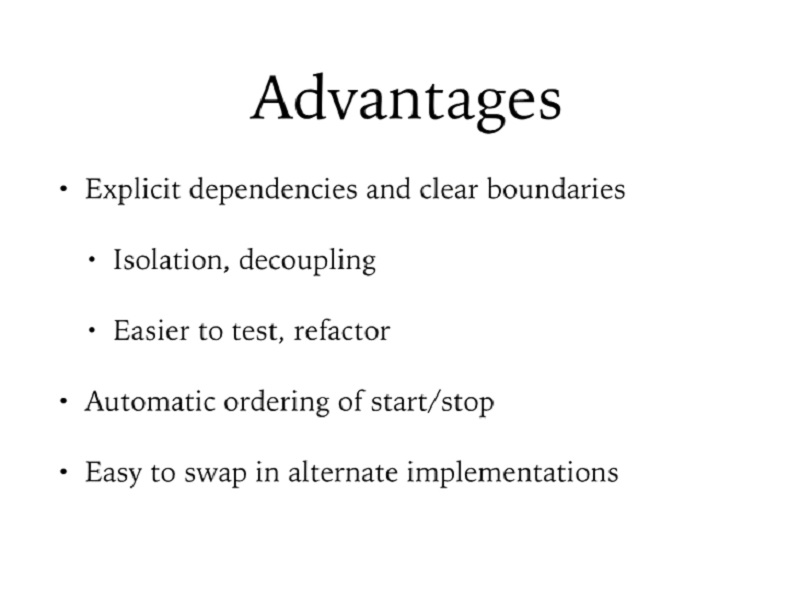

As we've seen, it's very easy to swap in alternate implementations. All you have to do is assoc onto a map. It's hard to get much easier than that.

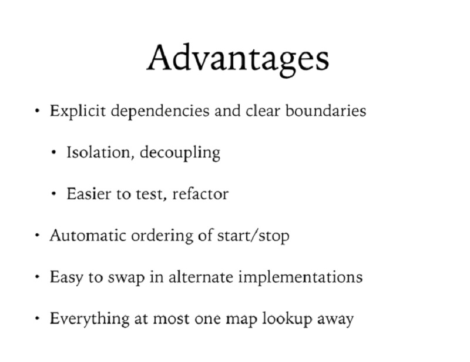

And then, within a component, we know that everything is, at most, one map lookup away. Everything is local in any given function that we need to call. But adding a new dependency into a component is easy. We just add a new key to its declared set of dependencies.

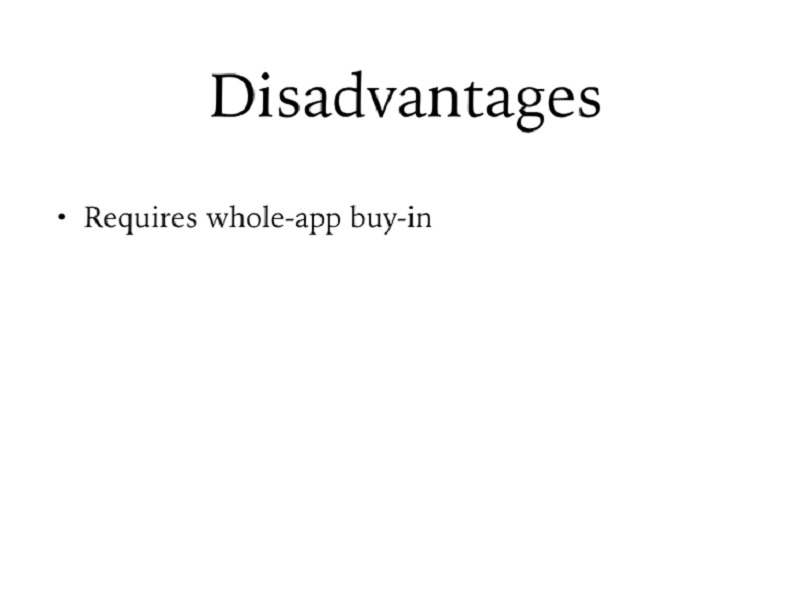

Now it's not perfect. I'm not going to claim this is the only way to write apps. And it has one big disadvantage, which is that if you're going to do this, it really only works if you build your entire app around this model. It is, if you only use this pattern in one small part of your application, you won't get most of the benefits. And it's quite a lot of work to refactor an existing application to use this model everywhere, although I have done it, and it does then make the application easier to test and refactor in the future.

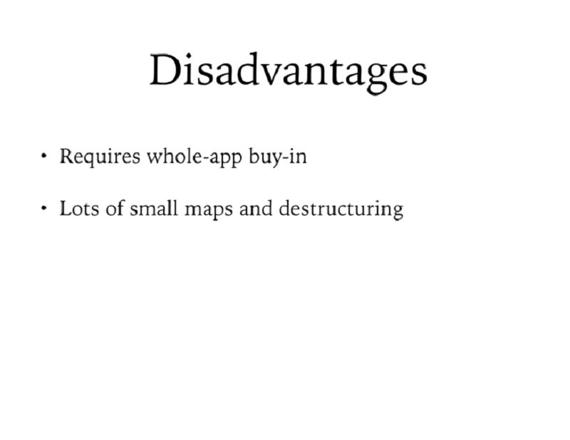

Another thing is, and this is kind of just a nuisance, you end up with lots of these little maps everywhere. They could be records. They could be maps. It works the same way, but you're going to end up doing a lot of destructuring. Almost every API function will be destructuring some stuff out of its component map at the top. This doesn't bother me personally. Some people get irritated by it. You could mitigate it somewhat with macros, although I think, again, in my opinion, the added complexity of macros is not worth the small amount of typing you'd save by doing that.

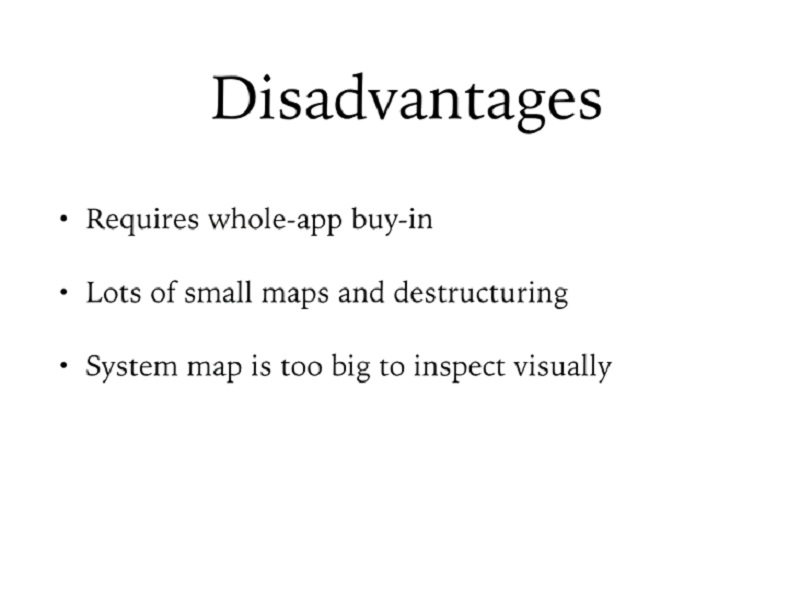

Another thing I've run into is that the system map, after you've started it, ends up being quite large. It has a lot of repetition. Every component may be repeated at multiple places in the map. Now that's fine from a memory point of view because they're all the same persistent data structure, but it means you can't just print this thing out or log it and expect to be able to look at it and see that it's correct.

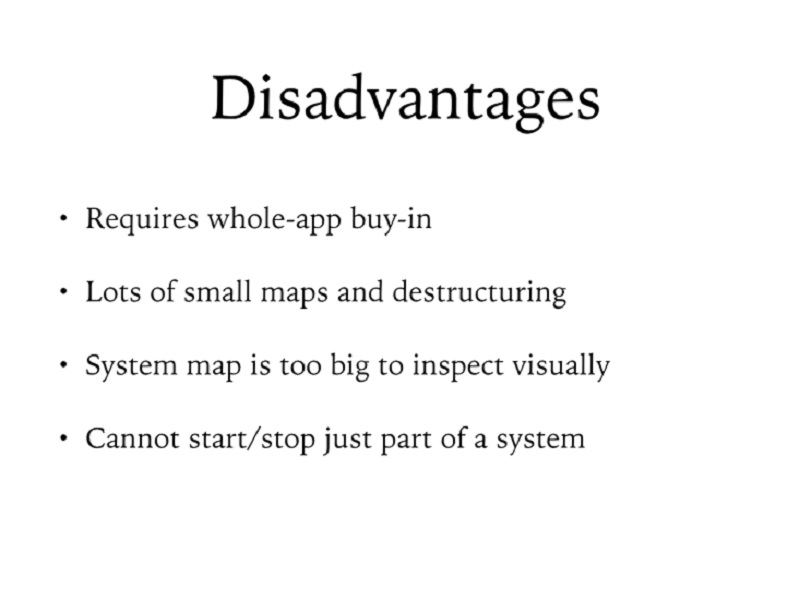

Another limitation, as I mentioned, is that this only works for the whole system at once. There is no facility in this library, as I've written it, to start or stop just a subset of the system. So you couldn't imagine -- you couldn't use this as a runtime tool to bring different parts of a system up and down while the whole program continues to run. That would require a very different model. It would probably have to have more mutability built into it.

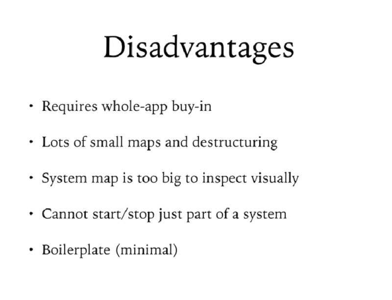

And, finally, there's a little bit of boilerplate. You have to write constructor functions. You have to declare metadata. I don't think it's very much. You know, there's no XML configuration here that you have to write, so it's pretty easy.

And we've reached the end of our time. There's the library. You can get it. You can pester me with questions. And thank you all for sticking around.

[Audience applause]