Transcript: **['How to Think about Parallel Programming: Not!' by Guy L. Steele Jr. (01/2011)](http://www.infoq.com/presentations/Thinking-Parallel-Programming)**

# How to Think about Parallel Programming: Not!

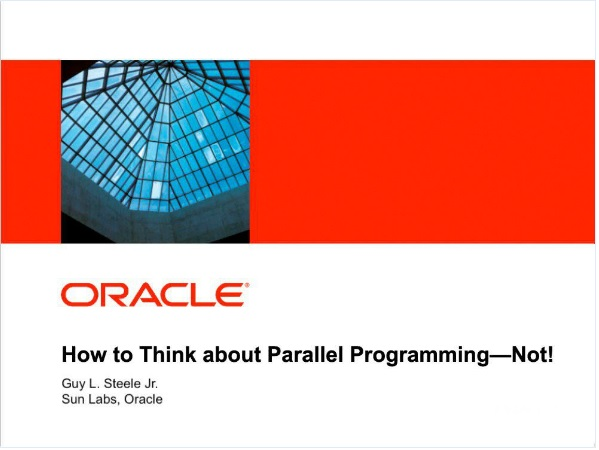

I am here to talk about parallel programming or not. But before that, I wanted to show you the ugliest program I ever wrote. Here it is.

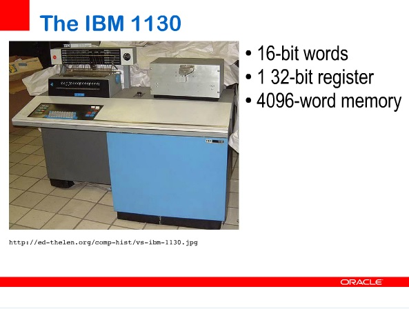

[Audience laughter]

I wrote this program 40 years ago for a computer, the IBM 1130, about as big as a desk. In fact, it physically was a desk. It had 16-bit words. It had one 32-bit register. Actually, the high 16 bits were called the accumulator and the low 16 bits were called the accumulator extension. And its main job was to hold the 32-bit result on multiply instruction. Otherwise it was a 16-bit computer.

It had 4,096 words of memory. That made it an 8-kilobyte main memory. Ran a full Fortran for a compiler, as well as other interesting software.

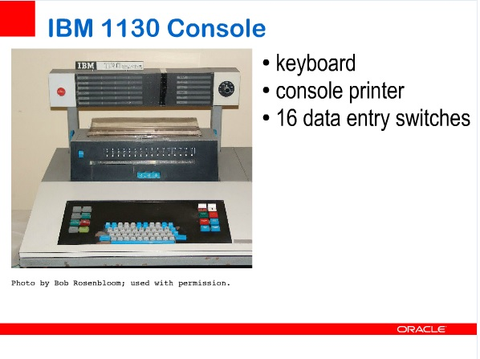

Here's a closer view of the front console of the 1130. It had a keyboard down there at the bottom that you can see, and a bunch of big, fat lights and big, fat pushbuttons. I miss those square pushbuttons. The big black box above it and below the panel of lights is the console printer. This is a modified Selectric typewriter that had one of those electromechanical golf balls that would strike out characters one at a time on the paper. And on the front of the console printer there are 16 data entry switches that you can see. Just in case you needed to enter some data into the computer, you had these switches.

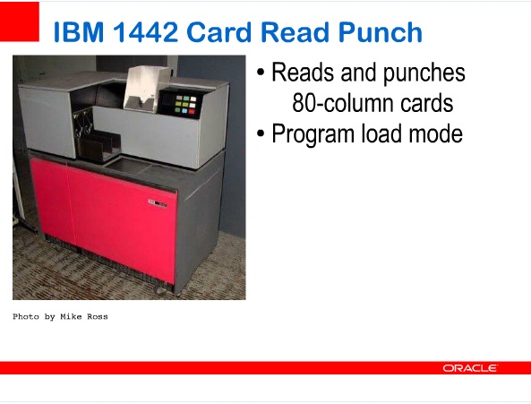

This program that I showed you on this Hollerith card was actually designed for Fortran code, but I used it for another purpose. And this would go into a card reader that looks something like this: another big, hulking piece of big iron equivalent in size to the CPU desk, a little taller. And it could read and punch 80-column cards, and it also had this special program load mode, which is where this comes in.

The way you bootstrap the system was to load one of these cards into the card reader and then hit the program load button the console, and the card reader would suck in one card and dump 80 words of data into the memory and then start that at location zero. And usually the job of this program, one of these cards, was to contain an IO driver that would either read more cards or read a bootstrapping program off of the disk drive or something. But sometimes little utility programs were written on these cards.

And the job of this particular program was to do a core dump. Now, this idea was not original with me. IBM had a version of this program, but I wanted to improve upon it. IBM's version would read a 16-bit address from the switches and then start; it would print that address on the console printer as a record and then start dumping data at that location, printing out one word at a time as four hexadecimal digits.

Being able to do this was pretty important because this is back in the bad old days before separation between supervisor mode and user mode. It was very easy for a user mode program to execute some random constant and halt the CPU. And in order to figure out what happened, taking a core dump was very helpful. And because there were only 4,000 words of memory, you could dump all of memory onto the printer and it only took about four and a half pages to print. Then you could take it off to your desk and, you know, pour over the hexadecimal listing and try to figure out what had happened. It was literally possible to inspect every bit of the main memory and try to figure out what was going on back in those days. That's impossible now because things have gotten so big.

Now, I found IBM's version awkward to use because it printed one address and then all this long string of data. And when you were 3,000 words along, it was hard to tell what address was what, so I wanted an improved version that would format the printed data better by first printing a newline. IBM's version didn't even do that. Then print the address, then 16 words of data, then another newline, the address incremented by 16, 16 more words of data and so forth, so as to get a nice tabular format. Then, as an extra fill, to print the addresses in red and the data in black because I was fascinated by the two-color ribbon in the Selector typewriter.

[Audience laughter]

Okay, so I wanted to -- I would like to show you the original source code for this, but unfortunately I seem to have lost it. This is all I've got.

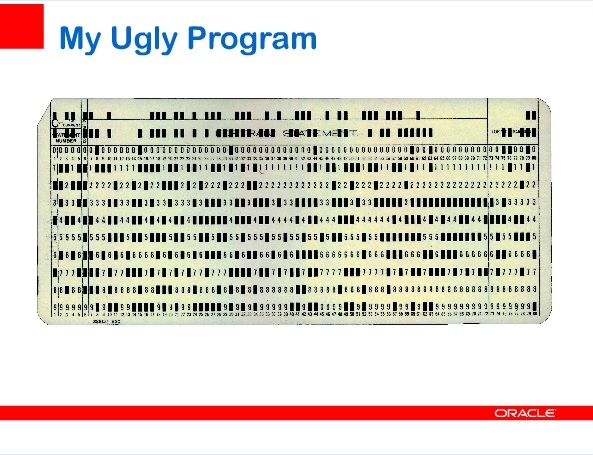

There's my ugly program. Well, I spent this last weekend reverse engineering it, which is an interesting exercise doing forensics on your own code from 40 years ago.

[Audience laughter]

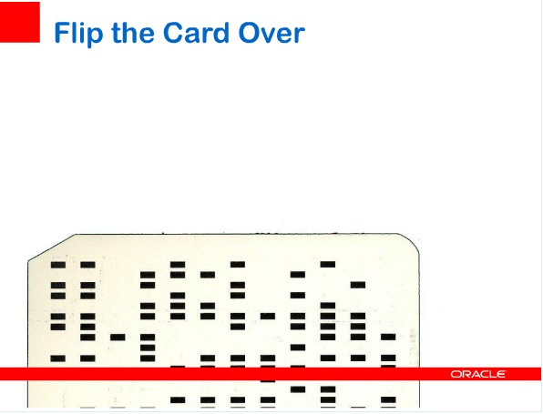

So the first step in doing this is to flip the card over like this so that you can read off the columns as rows and receive them as binary words.

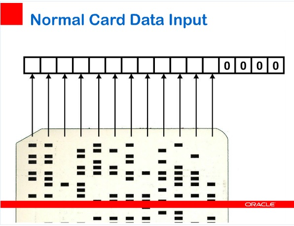

Now when card data is ordinarily read into the computer, it's read in this format. The thing you need to realize is it was a 16-bit computer, but the card has only 12 rows. You only get 12 bits of data. And normally when you're trying to read character data, you pull in the 12 bits from the card into the high order 12 bits of the word and the low order 4 get set to zero.

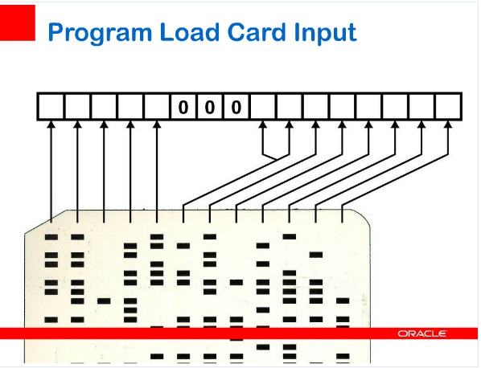

But in the special program mode load, it gets read in in this funky way.

[Audience laughter]

You have five into the high, seven into the low, one of the bits gets duplicated, and three in the middle get set to zero.

[Audience laughter]

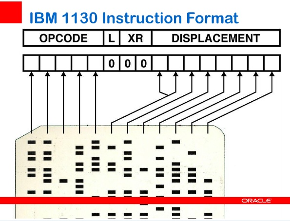

Which seems utterly insane until you take a look at the instruction format for the IBM 1130, which is five bits of opcode, eight bits of sign displacement that tells you where the operand is. That displacement is added to the address of the instruction plus one. Why plus one? Well, because the instruction counter is always kept one ahead of the instruction you're executing. So the displacement gets added to the instruction counter, and there's also this long mode bit, which if one says the instruction really takes two words, but the card always sets it to zero.

And there are two bits of index register field. Besides the accumulator, there are architecturally three index registers that are actually implemented as main memory locations, so I didn't count them earlier.

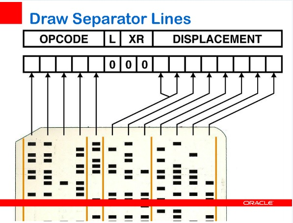

Okay, so that's why the card is read in in this format. So with this understanding, we can draw vertical lines on the card, which is something I literally do and did back in those days, so as to separate the card rows into the groups of corresponding to hexadecimal digits. 

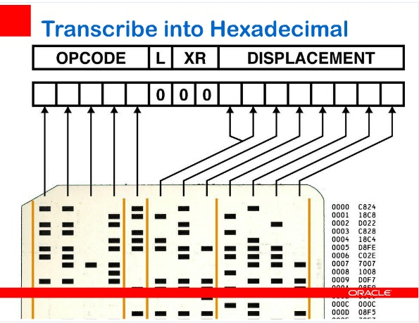

And then you do the long and tedious work of transcribing the holes on the card into hexadecimal like that. So down the left-hand column, I show you the addresses in hexadecimal into which they will be loaded into the computer's memory and, on the right-hand side, the transcription of the data on the card. And you will notice that, in the second column of the transcribed data, the digit is always eight or zero. And in the third column, the high two bits of the digit are always the same because that's what you are read in for one of these cards.

Now, not all instructions fit this format. If you want to have an instruction in your program that uses the long format or uses an index register, you can't represent it on the card, so if you need that instruction, you will have to devote instructions on the card to constructing those other instructions. That's okay. Self-modifying code is the way of life on the 1130.

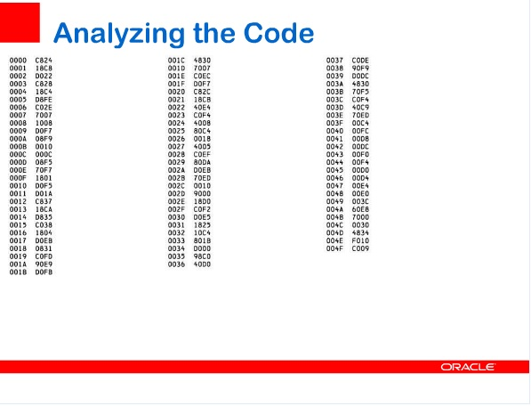

[Audience laughter]	

Okay. So let's take a look at how one analyzes this code. I have taken the transcribed hexadecimal and, just so it'll fit on the slide, organized it into three columns. And then I did the second tedious process of getting out my old IBM 1130 functional characteristics manual and transcribing the opcodes, many of which I still remembered after 40 years, but not all of them.

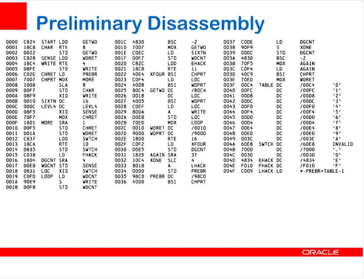

And so I got this as a provisional transcription of the code. I say provisional because there are some things in there that I didn't understand anymore. I remembered it was ugly code. That's why I wanted to show it to you, and that's why I undertook the exercise.

And, by the way, while I am confident in my transcription of the opcodes and of the behavior of this code, I am not confident that I have reconstructed the precise labels for the instructions that I used when I was a teenager. I tried to reconstruct the zeitgeist and did my best.

Okay, but there are some funny things. For example, if you look at what's going at address 0025, which is about ten down in the second column, there is this label GETWD, and I've transcribed that as a defined constant of 80C4. It could be transcribed as an add instruction because 80 is the opcode for add, but there's a negative displacement there that points to somewhere beginning of the card, so that can't be right. So I know there's something funny going on there.

Also, I'm going to click back a couple slides, several slides. When I first looked at this card, I saw this region in the upper right where the first five rows of the card were empty. And, to the trained eye, that suggests that there's a data table lurking there because zero opcodes normally mean halt the computer. So, in this transcription, that suspicion turns out to be correct. And so I transcribed that in the right-hand column as something called TABLE.

And if you look at the codes there--C4, FC, DB--these are in fact the console printer codes for printing a zero, a one, a two, and so forth, all the hexadecimal digits up to F, except that B and C aren't right. One of them is an invalid console printer code and other is a console printer code for a period. So something else is going on there as well.

By the way, I speak of console printer codes because, in those days, every IO device had its own idiosyncratic character set code that you had to use to talk to it. And doing the translations among the codes for the different devices was a job for a computer. You couldn't afford to put another computer in the IO device to do the translation for you. And these console printer codes, for example, the bits of it are related to the physical motions of the selector type ball, so that's what that's about.

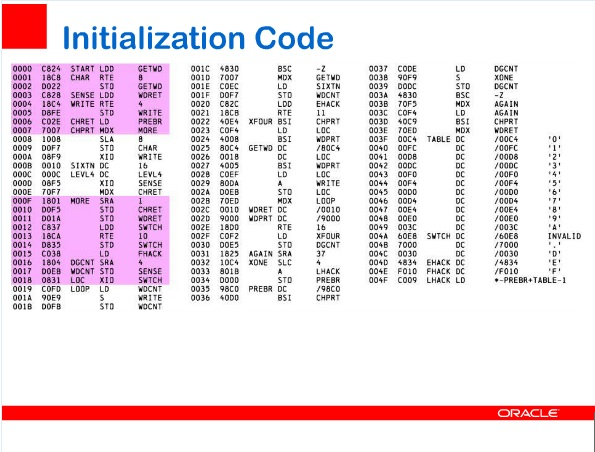

Okay, so this is the preliminary disassembly. And after getting this preliminary transcription and studying it for a while, I realized that, or half remembered that, there are chunks of code near the beginning of the card that serve as this initialization code whose job is to modify other parts of the card, probably because there are bit patterns that could not be represented directly on the card. And if you hand simulate what this code does until you have finished doing the first six instructions and then, at address seven, there's a branch instruction around that little chunk that takes you to the place called MORE down at address F. And then there's some more initialization code.

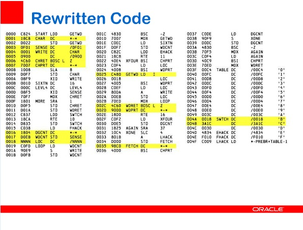

And when the initialization code is finished, we see that the areas of the card that I have highlighted here have either been rewritten or at least repurposed. Eight locations got rewritten, and now we'll see that, hooray, the table is correctly organized. It has the console printer codes for the characters B and C, but there are some other bits in the high order bits there that may have a purpose down the line, as we shall see.

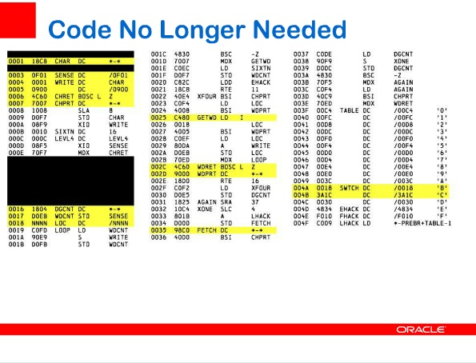

Now once this code has been rewritten, there are parts of the initialization code that are simply not needed anymore, and I have blacked those out on this slide. That is code that is no longer needed.

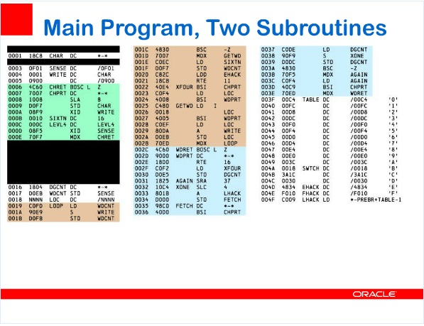

And this is now the final code that was really intended to be executed. This is the program. That does the console printer core dump. And if we study it further, we see that there are in fact three subroutines here, plus the table. In the first column, there is this routine called CHPRT, whose job is to print one character. Then, in the middle, starting at the bottom of the first column and continuing into the second column, is the main program loop. And the third part is a subroutine beginning at WDPRT at address 002D. So we're going to take a look at each of these subroutines and see what's going on.

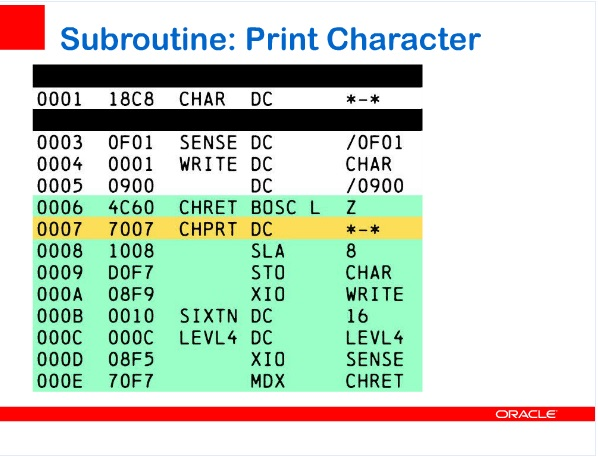

So let's look at this print character subroutine. You come in at location CHPRT with a BSI instruction, branch and store instruction counter. Now this is not only in the days before supervisor/user mode separation and before virtual memory and before a bunch of other things, it was also before stacks. We've gotten used to having stacks in architectures.

But, back in those days, stacks weren't really a well-understood thing when these computers were being designed. So the accepted practice was simply to store the return address in memory in the location before the first instruction of the subroutine, and then you'd carry on from there. And then you had to do a branch indirect back through that stored instruction return address location. We will see, instead of using an indirect branch, we're going to use a different technique here.

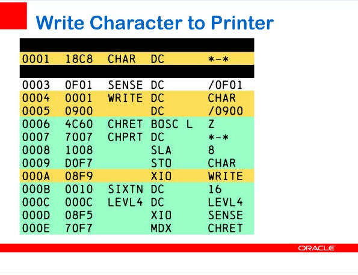

So we come at CHPRT, shifted character left by eight, store the character at location CHAR, which is address one, and they do an XIO instruction. This is execute IO. It uses an IO command block at location right, which is at address four, which contains the address of a place where I had the character, and then 0900 is the command to the console printer, print this character. Hoorah!

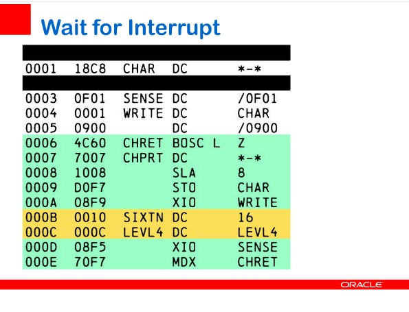

And then we execute this constant, 16. Why are we executing a constant? Well, the higher order bit is at zero, and that's good enough to get the computer to halt. And we need to halt because we need to wait for the interrupt. The console printer will produce an interrupt, and there's no way to turn off the interrupts, so we have to; we have to take the interrupt.

So we execute this wait instruction at location 16, which leaves the instruction counter pointing at address C and wait for the interrupt. Well, what happens when the interrupt comes through? Oh, I had highlighted this. The execute IO instruction happens.

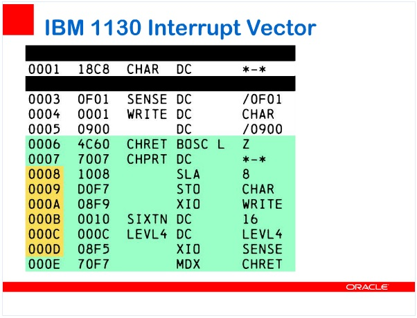

And then the interrupt comes through, and the way the interrupt vectors work is that the level number of the interrupt gets added to eight, and you look at that address of the core memory, and their interrupt levels from zero to five.

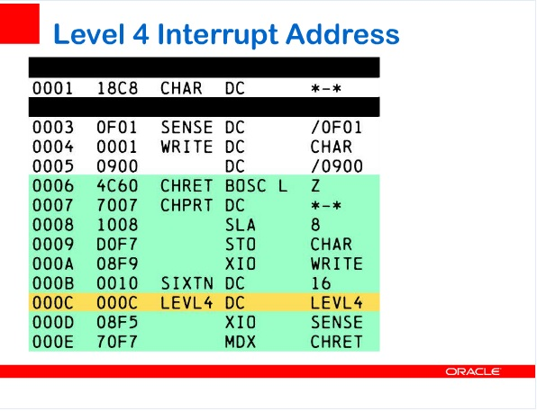

We happen to know that the console printer interrupts on level four. Therefore, its interrupt vector is at location C, which is eight plus four. And it will pick up the address that is stored at location C and branch there. In fact, it was a subroutine call there, thereby storing the current instruction counter there.

Well, this is a very strange thing. Location C in fact points to itself, therefore the instruction counter will be stored at location C. But this is okay because we carefully halted at location B, so the instruction counter contains C. So when it gets stored, the same C will get stored back into that location. And all this just to save a word so I wouldn't need a separate halt instruction or something. Okay, because I've only got 80 words to work with. I've got to cram it onto the card.

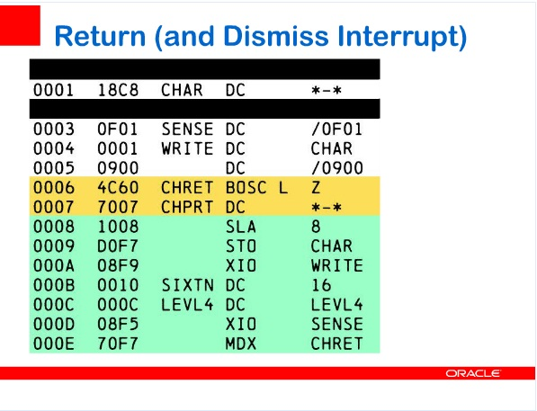

Then we execute another SENSE IO instruction to tell the console printer, okay, I've got the character. We branch back up to here and execute this BOSC instruction, whose job is to do a long branch while dismissing the interrupt on the processor side. And it is a long format instruction that got constructed by the initialization code. The second word of the instruction is in fact the deposited return address at location CHPRT, and so we can branch.

But what's this Z sitting there? Well, the Z is a conditional bit that says, "Don't do the branch if the accumulator is zero." But I always want to branch. Well, if you look at the encoding of the instruction, the hexadecimal 4C60, and then trace it back through the initialization code, you'll see that it was constructed from a constant whose bits came from that duplicated bit in bits eight and nine. One of those bits is the zero bit and the other is the dismiss the interrupt bit. I needed to dismiss the interrupt, and I had to take the Z bit along with it. Fortunately, the accumulator is always non-zero as this point, so everything is okay.

[Audience laughter]

I happen to know that.

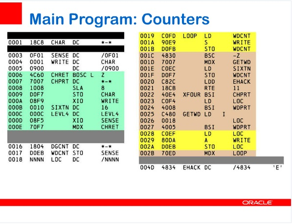

Okay. Now let's look at the main program. I have rearranged the code slightly so the main program is all on the second column here. And it begins at location LOOP. And one of the things that's going on here is that there are a couple of counters. One is the word counter, WDCNT, that's initialized that normally starts at 16 and counts down to zero, and that will tell us when we need to print an address and do the new line. And also, there is this location called LOC, which is in fact the data that got read in from the switches telling us what address to print, and that's at address 18.

Okay, and these counters get incremented or decremented simply by loading up into the accumulator, adding or subtracting this thing at location WRITE, and then storing it back. What's at location WRITE? Look back at the first column. That's location four. WRITE contains the address of CHAR, which I needed for that IO block. I had carefully placed the variable CHAR at location one, so I can use this address also as the constant one for bumping counters up and down.

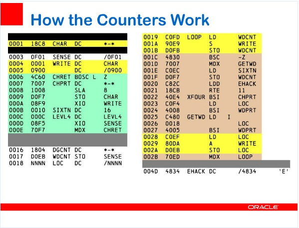

Okay, and you can see that highlighted on this slide.

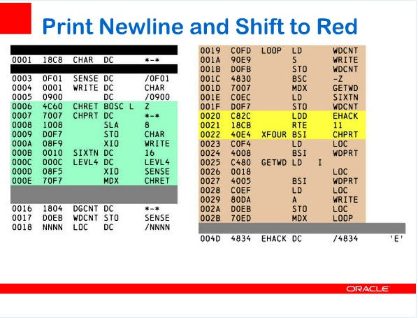

Now, another thing that needs to go on is that before printing the address, I need to do a newline on the console printer and also shift the ribbon from black to red. And that's done by loading the constant at location EHACK, which is shown down there at the bottom of the second column. It's actually off somewhere in the table. Remember the character E had some funny, high order bits? Well, by picking up that bit pattern, rotating it by 11 and then using that as a console printer character--

[Audience laughter]

--I issue the correct control code. So, in effect, the same bits are serving both as part of letter E and as part of the newline shift to red character.

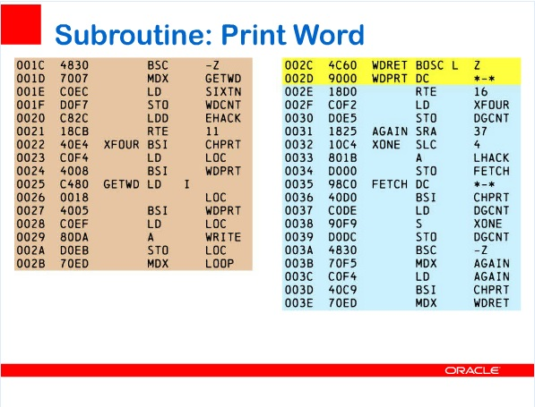

Now let's take a look at what's going on in the print word subroutine. The main loop does fairly obvious things, picking up words and calling this print word routine in various ways. Again, the instruction address is stored at location WDPRT there at location 2D, and it also uses this BOSC instruction as the technique for returning. That was convenient because the initial routine had to construct that BOSC construction and then was able to store it in two different places.

Now what's ugly about this is that, once again, the Z bit is set, so I have to be real sure that the accumulator is non-zeros I'm returning. And it's also dismissing the interrupt even though I'm not in an interrupt routine, but that's okay. It turns out the processor ignores that. Okay, so that's a little confusing, but it all works.

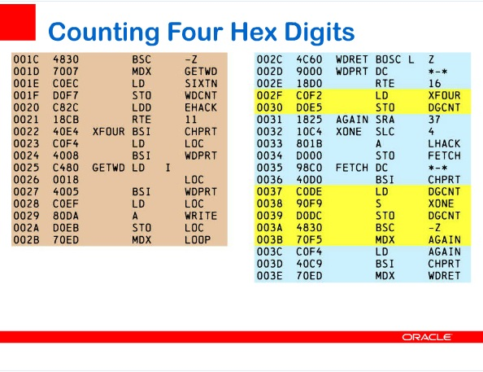

Now let's take a look at how it is counting the hex digits. The job of this little subroutine is to take a data word in the accumulator and print its four hex digits. It actually rotates it right by 16 at address 2E, thereby putting it in the extension and shifts up four bits at a time, uses that to index into the table of hex digits, and then prints the hex digits by calling the character print routine.

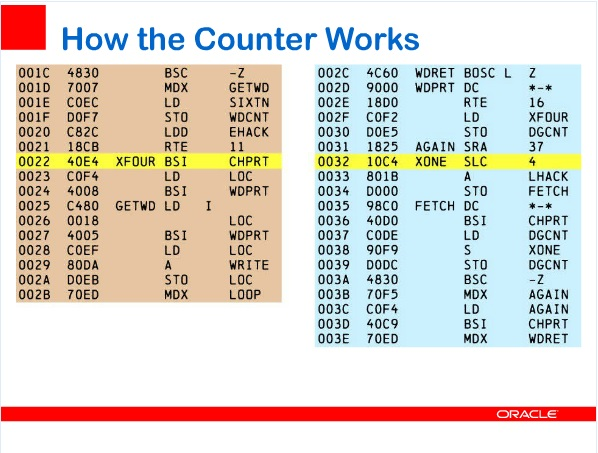

But it needs to count the hex digits. It needs to be able to count up to four, so it loads XFOUR and uses that to initialize the digit count. And then further down there, at address 37, it loads the digit count back up, subtracts XONE, stores it back again, uses this conditional skip instruction to decide whether we're done and, if we're not done, we use the MDX instruction. MDX stands for branch and goes back up to location again and goes around the loop. Don't ask.

[Audience laughter]

Okay. What about these locations, XONE and XFOUR, that are being used to do it? Well, they're instructions. One is this shift left instruction by four that's at XONE, and the other is this subroutine call instruction to CHPRT off in the main program loop that's labeled XFOUR. Why am I doing that? Well, I had the constant one available at location WRITE, but I didn't have another word on the card to represent four. So instead, I picked up these instructions and XONE, it's opcode is about 1,000 hexadecimal, and XFOUR is about 4,000 hexadecimal, and this is good enough to drive a counter to four. That's fine. But I'm relying on the bit patterns in those opcodes.

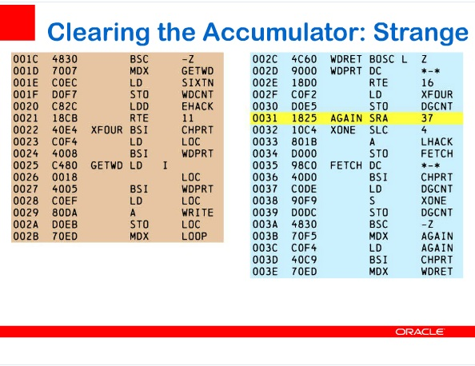

The other slightly strange thing going on here is that at location AGAIN, it's clearing the accumulator, and the normal idiom for this is to shift accumulator right by 16, thereby shifting out all the bits. But here I'm shifting it by 37 locations. It turns out that's okay. The processor will do it. It takes longer because it's doing it one clock cycle at a time, so it takes 37 cycles to shift those bits out, but, hey, I'm dealing with a console printer. It's only 15 characters per second. I've got time.

[Audience laughter]

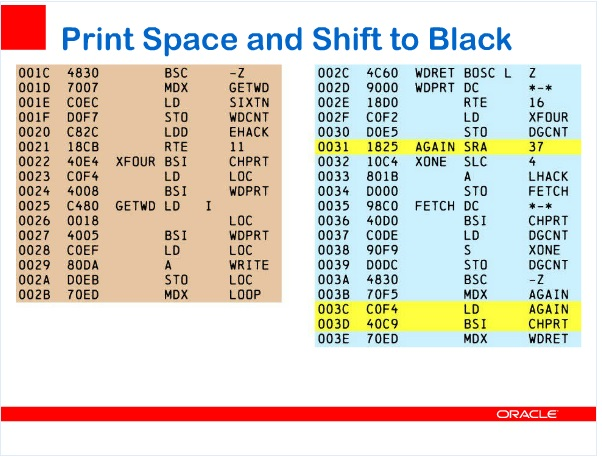

But why 37? Well, look further down here at the bottom. It's loading up that instruction and then calling the character print routine. Ah, this instruction is getting printed as a character. And 37 decimal is 25 hexadecimal, which is exactly the code for shifting, making the console printer print a space and shift the ribbon to black, so that's what's going on there. Once again, saving a word. I've only got 80 words to work with.

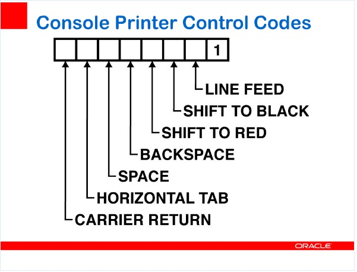

Okay. So there's one other dirty trick I was pulling, which is that IBM, in its manuals, documented seven distinct console printer control codes and said this is the character you print to do this; this is the character you print to do that. Something I did as a teenager was to realize that there were individual micro-coded bits there and that while it was probably a bad idea to tell the printer to both space and backspace at the same time, probably I could get away with spacing and shifting to black at the same time. And, empirically, it worked. No IBM documentation ever comments that, but hey.

[Audience laughter]

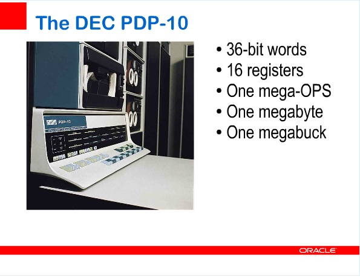

Okay. So we're laughing at this code. I'm glad that you're laughing at some of these tricks, and I want to return to that laughter later. But first I would like to show you another program for a completely different computer, a PDP-10, of roughly the same era, the early 1970s. It was a more civilized computer. It did have the user mode, supervisor mode distinction. It had 36 bit words. It had 16 registers instead of 1. It was about one mega-ops per second. It had about one megabyte of memory, and cost about one megabuck. These are nice, round figures to remember.

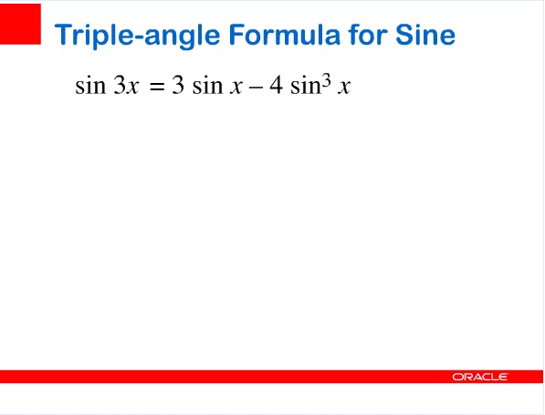

Okay. The subroutine I would like to show you is a very clever and tiny routine, space efficient way for computing the trigonometric sin of an angle. So we are going to use this triple angle formula for sine. You can read. You probably learned double angle formulas when you were in high school. And, from that, you can fairly easily derive this triple angle formula: sin 3x = 3 sin x - 4 sin³ x

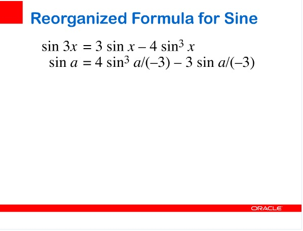

By rearranging this and substituting A over minus 3 for X, we can get this modified version of the formula that tells us we can compute sin of A if only we can compute the sin of A over minus 3 and then do this polynomial computation on it.

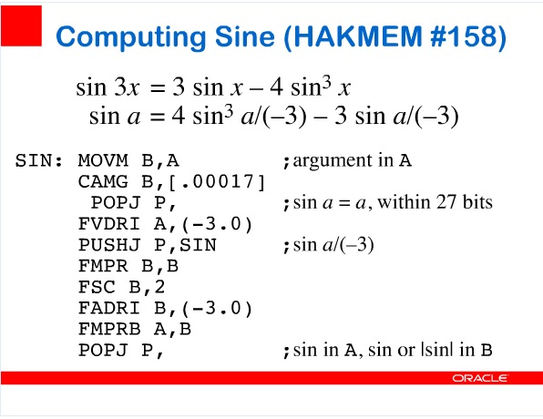

And here is the code. The argument comes in in register A, and we're going to use register B as a second working register. And we're going to set up an interesting contract on this subroutine. The argument comes in register A, and we will return the sine of A in register B. But we're also going to promise to return a value in register B that is either the sine of A or its negative. That is, we promise to get the magnitude right, but the sign bit might be off.

Okay, so we're going to use -- in the first line we use a move magnitude instruction that takes the absolute value of A and puts it in B. We compare that absolute value to this tiny constant, .00017, carefully chosen so that if the argument is smaller than that, then you can say that sin of X is X to within 27 bits. So if the argument is small enough, we just return it. That's close enough.

Otherwise, we divide A by minus 3 in the fourth line, call ourselves recursively with a push jump instruction that pushes the return address onto the stack, call ourselves back, thereby computing the sine of A over minus 3. This bottoms out when eventually after repeatedly dividing A by minus 3, its magnitude gets small enough. And when we come back, remember that we have not only the sine of A over minus 3 in A, but we also have its magnitude, possibly the sine incorrect in register B. So we can use a multiply instruction to square what's in B. We don't care about the sign bit because that now becomes positive, thereby getting, thereby squaring that sine.

We then multiply it by 4 with a floating scale instruction, scaling its exponent by 2. We add the constant minus 3 to B, and then there comes this multiply instruction in the ninth line that multiples A and B together. And the B on the end of FMPRB is an addressing mode that means put the result in both places, which is a really handy thing, thereby satisfying our contract. The sine of A comes back in A, and its magnitude with some sign bit comes back in register B. So the whole thing fits in 10 instructions or 49 bytes, if you want to measure it that way.

It's a model of elegance. It's not numerically terribly accurate, but it's good. It's okay for a lot of applications. And I view this as one of the early poems of the early computer era. It has a certain understated elegance. It doesn't need any extra working registers. It just uses registers A and B. And it uses this sort of very clever and mathematical technique.

This came out in 1970. It was published in a famous memo called Hackmen that had all kinds of interesting, small subroutines. But something about it bugged me over the years. And, 25 years later, I found an improvement - in the mid '90s - which is to realize that that constant there in the second line -- by the way, that constant is in square brackets. And those square brackets are interesting because what they tell the assembler, "Please put this constant in some other word of memory for me. I don't care where. And make this instruction point to its address."

This is an interesting piece of abstraction compared with the IBM 1130 code where, for every constant, I had to pick a particular place to put it. This gives me a way to say, "I don't care. Any address will do." That's an important kind of abstraction.

Okay, so here's this constant, .00017. I realize that was small enough that its exponent probably didn't have the high order bit turned on. It was small enough that its bit pattern was probably an octal 200. I know those bit patterns. Those are the floating-point instructions because, of course, I also know the bit patterns are mostly PDP-10 instructions.

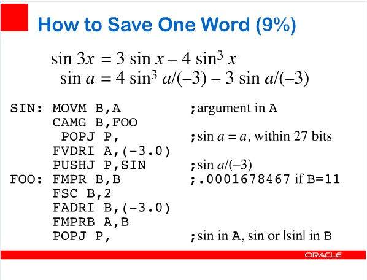

So quickly I evaluated all the floating-point instructions in here and realized that the floating point multiply instruction was just about right. In fact, if you can arrange for register B to be register 11, then the value of that instruction, as a floating point, constitutes .000167, which is close enough to be good enough, and that's how you can finally, after 25 years, knock four bytes off the size of the routine.

[Audience laughter and applause]

Much too late to be of use of anybody, but I felt good about it for a while, and then I realized maybe I've really desecrated a diamond here because, while I have in fact made it smaller, I've also made it much less understandable and much less maintainable.

[Audience laughter]

And that matters. There's a tradeoff here. It wasn't 100% perfect.

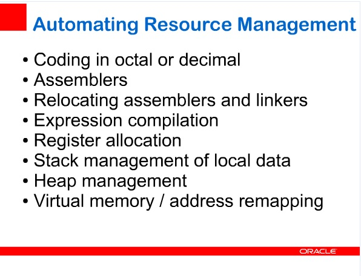

This brings me to the theme of my talk. I want to talk about the automation of resource management in computer software. And, over the years, since the bad old days, we've seen a constant improvement in the kinds of ways we write our programs and the kind of infrastructure we use to do that. Way back in the beginning of the time of ENIAC, people simply wrote their programs as strings of decimal or octal or hexadecimal digits.

Then came along the technique of assemblers, which allowed you to use names for the instructions and perhaps also provided names, labels for the instructions so that you didn't have to make a decision about what the displacement instruction, what the address instruction would be. You would tell the assembler, "All I care about is that this instruction has the address of this data location, and I don't particularly want to worry about its numerical value. I'll just give a name to it. You take care of the details."

Then came the idea of a relocating assembler, which not only took the symbolic form of your machine language program and translated it into decimal, hexadecimal, or bits or whatever, but also kept track of whether each location contained an address or not. And then a linker could take the program, move it to a different location in memory, use the information from the assembler about which ones were addresses to update the addresses, and thereby make it feasible to bind together separately assembled subroutines and have them all work together. That depended on the programmer in effect saying, "Not only do I not care about the numerical value of this address, I really don't care where in memory the program is placed. It should still work." So once again what used to be a very important concern to the program, was a great concern of mine when writing this code because I was taking advantage of numerous puns between addresses and data, we got more maintainable and more reusable code by releasing some of those concerns to automated tools.

And then came other technologies. The compilation of expression, so I didn't have to worry about the order in which instructions were coded. I just said, "I want to compute. Here's an expression I want to compute. Compiler, you take care of the details."

Register allocation became something to delegate to compiler. The rise of stacks and the use of stacks to contain not only return addresses, but also local data. Heap management: This required writing in a style where you say, "Not only do I not know what address my code is at, I don't care what address my data is at. And in fact, I don't even want a way to find out what the address of the data is. You take care of it. I delegate the details."

Virtual memory, address remapping, all of these are ways of letting the programmer release concerns to the automated technology.

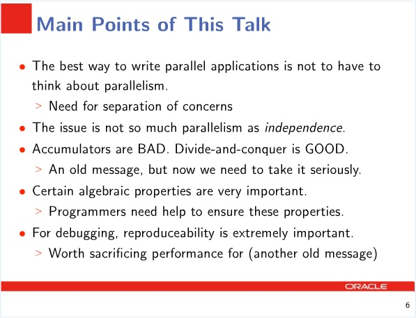

So the main point of this talk is how can we release the concerns of parallelism to the automated technology. How can we let go of the details that we have been obsessing about for two or three decades at this point?  And my thesis is that the best way to write parallel applications is not to have to think about parallelism just as the best way to deal with data and its management does not have to worry about its management. You have this garbage collector. Let it deal with it. Now sometimes you can't release all the concerns, and sometimes you do need some controls but, for the most part, for most kinds of code, we can have a separation of concerns and delegate some of these problems.

Now, I want to distinguish between parallelism and concurrency here. There are some kinds of code, which are modeling things going on in the real world and are connected with other processes that you have no control over, you know, other people, the Internet, that kind of thing. That calls for concurrency. Usually those are situations where you have different things going on at the same time, and they're competing for resources. They're competing for processors. They're competing for memory, for a database, for the user's attention. But there's some form of competition.

I'm talking about parallelism where there's one task at hand, but you have many resources, and you're trying to bring all those resources to bear to solve one problem, and they're working cooperatively rather than competitively. And, in a typical application, there are some parts that need to be concurrent. There are some parts where you really care that something be sequential. I really care that this happens, then this, then this. And there's a large mass in the middle where it doesn't have to be sequential. It doesn't have to be strictly concurrent. But if there are parallel resources that can be brought to bear, we'd like to do that and do it effectively without having to worry too much about it.

And I thought a lot about what are the consequences of that for a programming style, and what about our traditional programming styles might be obstructing the effective use of parallelism? And there are several things, but the one I'm going to harp on in this talk is the design pattern of the accumulator. And I'm going to argue that accumulators have served us extremely well for 50 years. They're very effective on sequential architectures. There's a reason why that register in the IBM 1130 was called an accumulator. It was something you initialized to zero and then you add things in one at a time, and then you'd have the sum.

But going forward on multicore computers, I think accumulators are sort of a bad data organization strategy and divide and conquer is going to have to take its place. This is an old message. It's been studied by the academics for 40, 50 years, but now is the time to start taking it seriously. And, furthermore, in order to make this effective, understanding certain algebraic properties of your code is going to be important, and programmers need to help ensure these properties.

For debugging, reproducibility is also very important. We like not to have asynchrony mess up the behavior of a program. I'm not going to talk too much more about that in this talk, but it's a point I wanted to make.

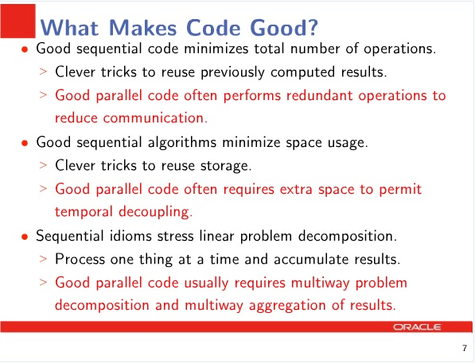

So what is it that makes code good? Well, we've got intuitive metrics for this. Good sequential code that was trying to be fast typically minimizes the total number of operations executed because minimizing that number is a good proxy for optimizing speed on a sequential computer. And so we tend to use clever algorithmic tricks to reuse previously computed results rather than re-computing things new.

But good, parallel code will often have to perform redundant operations in order to reduce communication. Sometimes a processor is better off re-computing something for itself than trying to borrow something another process did, so there's a tradeoff here between computation and communication costs.

Also, good sequential algorithms will try to minimize space usage, and there are a lot of algorithms in literature that use clever tricks to reuse storage. A lot of sorting algorithms involve tricks for reusing storage, so you can sort the array in place rather than using extra temporary storage.

Good parallel code will often require extra space, extra memory to permit temporal decoupling. And, finally, and this is the main point I want to talk about, these first two have to do with resource usage, but I want to talk about programming style. Sequential idioms tend to stress a linear problem decomposition that requires sequential execution. You process one thing at a time and you accumulate the results. And I think the good parallel code is going to require multi-way problem decomposition and multi-way aggregation results. In a nutshell, I'm arguing for map reduce in the small as well as in the large, as we shall see.

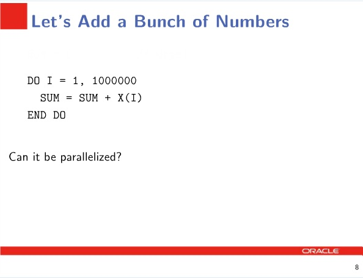

So let's add a bunch of numbers, and let's assume we want to bring parallel resources to bear. Okay. I've written this DO loop in a language similar to Fortran, which I call Fortran.

[Audience laughter]

And I like lots of different languages, so I tend to mix them up in my talks. Okay, so here's a DO loop that takes I from one to a million and, for each value of I, it indexes into an array X, grabs X of I, and adds it into the sum. Can this code be parallelized? And my answer is who cares. It's buggy. I forgot to initialize the sum.

[Audience laughter]

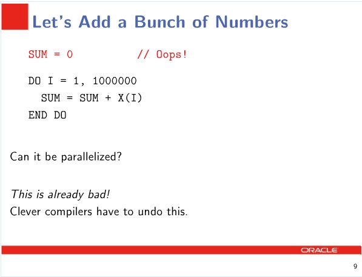

This is actually something that bugs me - pun intended - about the accumulator design pattern is that it's so easy to forget to initialize. Okay, so can this code be parallelized? Yes, it can, but the way this code is organized is already bad. And good, clever, parallelizing compilers have to undo this and say, "Oh, I see what he's really trying to do."

And there are people such as Fran Allen who won the Turing Award a few years ago for her work, a lifetime of work on making such clever parallelizing compilers taking raw Fortran code and making it run in parallel on parallel computers, had to know an awful lot about these loops and what you could get away with doing in the way of program transformation. You realize the programmer really doesn't care in what order I add them into the accumulator. In fact, I could make several accumulators, one per processor, and have each of them add up part of it and add it up, then add up their sums at the end. I can play games like that.

Well, maybe I can. Floating-point numbers are a tricky business, and sometimes that's okay and sometimes it isn't. I've got to finesse the problems of floating point today and assume that we're dealing with integers.

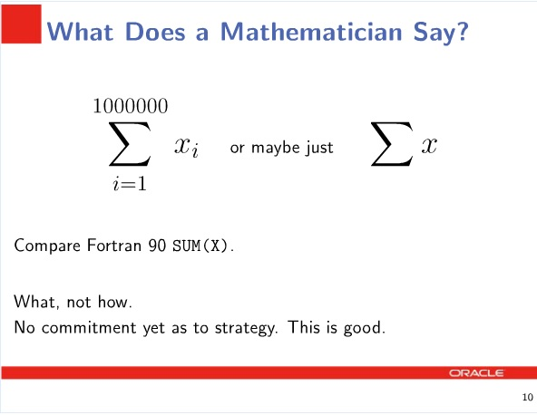

Now what does a mathematician say to add up a bunch of numbers? Well, there's this big sigma notation and it just says, for I for one to a million, I want to add up the X of Is, and I'm not going to specify here how that is to be done. And it's okay not to specify how because I know that addition is associative and commutative. And, therefore, the order doesn't matter, and the way I group them doesn't matter.

In fact, the mathematician might not even bother with the indexing apparatus. It might just say there's a specter X. Add them up. Done. I don't want to think about the details.

Now Fortran 90 eventually introduced library routines such as sum that let you do exactly this. Another library routine such as max and count could find the largest value or count the number of non-zero values, count the number of true values, that kind of thing.

And I think this is an advance in abstraction because it says what you want to do without specifying in obsessive detail how. There's no commitment yet as to the necessary execution strategy. And for the bulk of programming, that's a good thing.

So now let's look at the sequential computation tree that is literally described by this DO loop. I'm going to abstract away the indexing apparatus and just look at the expression tree that is implicitly built up on the fly by the execution of this loop of the addition operations involving sum. So sum is initialized to zero. Then we add an X of 1. Then we add an X of 2. Then we add an X of 3, and all the way up to adding in X sub a million.

Now how could we parallelize this code? Well, a strategy that was explored quite heavily in the '80s and the '90s, and it's still used today, is to say, well, let's put an annotation on the DO loop and say, "It's okay with me if the body of the DO loop, if its various iterations are computed in parallel because I really don't care about their ordering." So we slap a parallel keyword on it and then ask whether this does the job. And the answer is who cares. It's got a bug in it. There's a race condition.

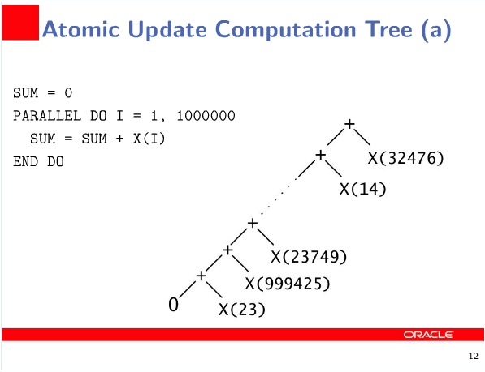

If I turn all million executions of this body loose, say I've got a million processors to bear, and suppose they just accidentally all run at the same speed, then they all pick up the value of sum, you know, competing in the memory interfaces because it's become a hotspot. They finally all get the value of sum. They add their own value of X of I. Then they store it all back into sum and, boom, most of the additions have been lost, so this is a bad race condition.

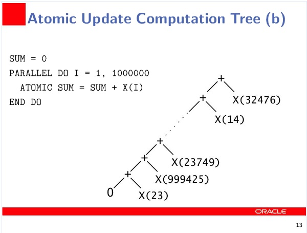

And we fix it by putting an atomic keyword on the body. Now the code is correct again. But, unfortunately, it's no longer parallel. What we have said here [Audience laughter] is that all the updates can be done in some order, and I don't care what the order is, but they still have to be sequential.

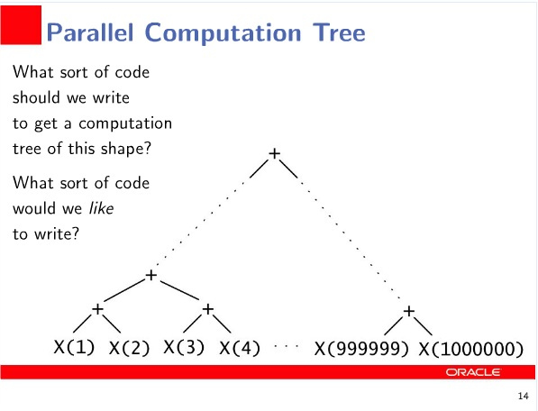

So here's a possible computation tree that might result. What we really want is a computation tree that looks like this. You know, something more like a balanced binary tree. This would allow us to use parallelism down near the leaves of the tree and, thereby, do the whole computation in a time that is more like log of a million than like a million. And since, you know, log base two of a million is 20, that’s, you know, an improvement to something like 50,000, so that would be good. Assuming, of course, we could bring enough processing power to bear.

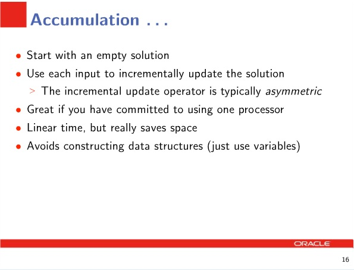

Okay, so let's contrast accumulation with divide and conquer. The idea behind accumulation is that you start with an empty solution and then, as you bring each input in, you use each input to incrementally update the solution. And what I want to draw your attention to is the fact that this incremental update operator is typically asymmetric. It takes an input and an accumulation and produces a new accumulation. The two arguments are of different types.

This strategy is terrific if you're committed to using one processor because, while it uses linear time, which is fine if you've only got one processor, it really saves space, and it avoids constructing data structures. That was the attraction of the accumulator.

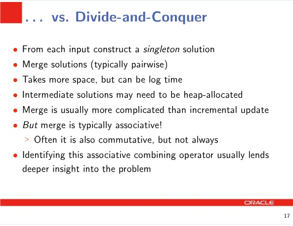

The strategy in divide and conquer is to be able to process each of the inputs separately without regard to this accumulating value. So the strategy is: you look at each input separately, construct a singleton solution, and then figure out how to merge these solutions to make bigger solutions until finally, when you've merged them all, you've got the complete solution.

Notice that the combining operator in this case is symmetric with respect to its data types. It takes two solutions and produces a new solution. Now this typically takes more space, but it can be log time. And intermediate solutions may need to be heap allocated, so there are some engineering tradeoffs here.

Merge is also usually a more complicated operation than the incremental update, and we'll see examples of that later on in the talk. But on the other hand, the merge operator typically is associative. Often it is also commutative, but it doesn't have to be. But the fact that you can identify a combining operation that has this algebraic property usually lends deeper insight into the problem.

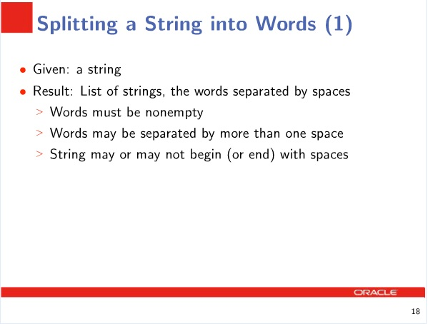

So I'm going to show you an example of a parallel code and also in its sequential form. And in order to fit on the slides, I had to choose a sort of toy example, and you may object that my example has hardly any content and it's mostly boilerplate, and that's true because I had to fit it on the slides. Just as I had to fit a program onto 80 words on the 1130 and having to fit an example onto eight slides, so bear with me.

The problem here is given a character string to produce a list of strings, which are the words in the original string that were separated by spaces. So we'll assume that the string just consists of letters and spaces and not have quibbles about commas and other funny symbols.

The words we return must be nonempty. So we if we happen to have two spaces together, we won't say there's an empty word in between them. We'll just say that there's no word there. So words may be separated by multiple spaces, and the strings may or may not begin or end with spaces.

So, okay, using good test driven development, here are some tests that I expect to be satisfied. Here are examples of five strings and the expected output for my program. And, by the way, I am presenting this code in a research language that is my current working project called Fortress. It is a programming language that was originally developed with an eye towards petaflop scale supercomputers, but more recently it's been retargeted more towards midrange, multicores, and clusters. And the main design features of this language are user extensibility, so we have the possibility, for example, of operator overloading and extensible data types and things like that.

The second design principle is to try to support traditional mathematical notation whenever it makes sense, or traditional domain specific notation. Therefore, we support all of Unicode and, in particular, user defined overloading of the Unicode mathematical operators. And we will make one use of that in this example.

And a third thing is to try to be parallel wherever that makes sense. It is possible to write sequential code. It is possible to write accumulator style code, as we will see, but the language is biased to have a parallel flavor. And, finally, the whole thing has object-oriented underpinnings.

So our goal here is to write a little routine called Words that takes a string. And when called on each of these five strings such as "This is a sample," it will return a list that when fed to print line will print a list <This, is, a, sample>. And angle brackets are just part of the syntax of how list is printed in this language.

From here is another sample. The second string just shows what happens when you have multiple blanks sitting around there. You don't get empty words back. You just get those four words.

If the string has no spaces in it at all, that's an interesting boundary case to check. We expect to get back a list of exactly one word. And if the string consists just of blanks or is empty, we expect to get back an empty list.

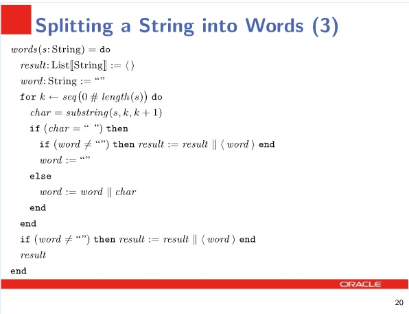

Okay, so here is sequential code, and this is, I think, the sort of sequential code that I or anyone in the room who is an experienced programmer could sit down and quickly write in about five minutes in his favorite programming language, and it probably looks something like this. So I'll walk you through it.

Words is a function that takes a string S, and there is this DO block that first executes statements in order. So the DO block does provide for sequential processing. And we're going to first initialize to accumulators. One is a result, which is a list of strings, and it is initialized to the empty list. And the other is Word, which is a string that just initialized the empty string. And once I've shown you this data structure, my temporary variables, the strategy should be obvious. We're going to walk through the character string from left to right, character by character. If we see a nonblank, we're going to append it onto the word. And if we see a blank, then we look to see whether the word should be appended into the result.

So we have this for loop, and as K goes sequentially from zero, starting from zero and for a number of iterations equal to the length of the string, we first grab the character that's at location K. And, for technical reasons having to do with simplicity of code, I'm using substrings. There is a separate character data type in Fortress, but it's easier to work with singleton strings, just so I'm not working with multiple data types.

So we grab the substring of length one at location K from the string and call that CHAR. We check to see whether CHAR is the blank character. And, if it is, then we need to see whether we've actually got a word in hand or not. If the word is empty, if the word is not empty, then we need to accumulate it onto result by using the concatenation operator, which is the double vertical bar. That serves as both list concatenation and as string concatenation. So we make a list of word and concatenate that onto the result list. And then we reset the word to be empty. If, on the other hand, the character is not empty, then we simply append it to word.

Down near the bottom, when we finish the loop, there's one final fix-up, which is that we might have accumulated a partial word in the accumulator named Word, and we have not yet appended it on the result. So after we finish the loop, word is not empty, then we need to tack that on to the end result and then, finally, return the result. Okay. Everybody clear on roughly how this code works? Okay. I think it would be considered a simple example for anyone to code.

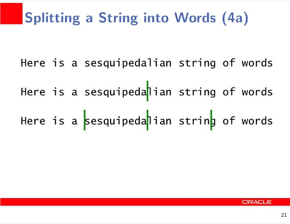

Now let's look at how we might take it, use a divide and conquer strategy on it so as to get parallel execution. And I admit the parallel execution on a short string that's only 40 characters long. It might not make a lot of sense. But if it were, you know, millions of characters long, then that application becomes interesting.

So to fit on the slide, I've chosen a 40-character sequence. "Here is a sesquipedalian string of words". Carefully chosen to have one nice, long word in it. And instead of dividing it up into 40 individual characters, I'm just going to break it up into four pieces so you can see the basic strategy. We're going to need data structures to represent the partial results of processing these sections of the string.

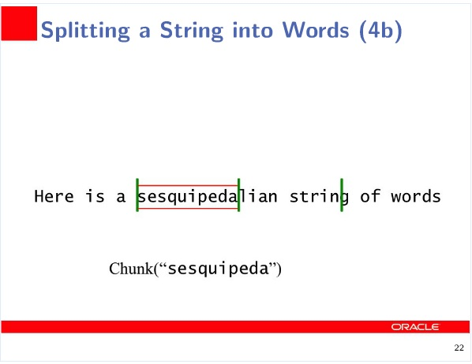

So if there's a second of the string that is all non-blank, such as I've shown here on this slide, "sesquipeda," then we're going to represent that with a data structure, which I've arbitrarily labeled chunk. So it is a chunk of a word and it contains within it that sub-string. That's all there is to it.

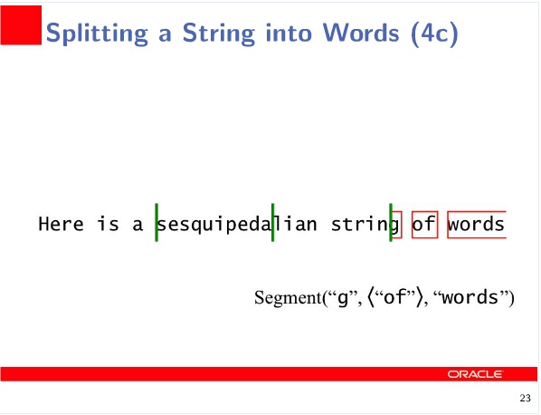

On the other hand, if we look at the fourth section of the string, we see that there is definitely a word in the middle, namely the word "of," and then "g" butts up against the left-hand end of that section and "words" butts up against the right-hand section. Because we are doing this out of context, we're just focusing on those ten characters and aren't looking at the rest of the string yet, we don't know whether these are complete words or something that needs to be joined onto something else to the left or the right to make complete words.

So I'm going to represent this with a data structure, which I will arbitrarily call segment, consisting of a left chunk, which might need to be completed into a word on the left, a list of words in the middle, and then a right chunk that may or may not be complete.

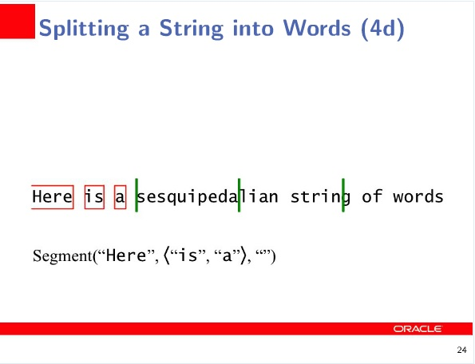

The part up front consists of "Here is a " and this ten-character section of the string begins with H-e-r-e and ends with a blank, so we're able to say definitively that there are two words in the middle, "is" and "a" and there is no partial chunk on the right, but there is a partial chunk on the left. I can still represent that in my segment data structure simply by using an empty string for the right chunk.

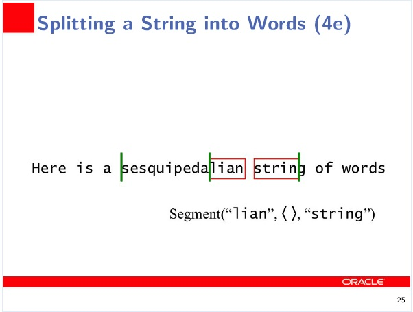

And then, finally, the segment data structure can handle this fourth piece of the string by having a left chunk and a right chunk and an empty list of words in the middle. Nothing is definitely a full word in this portion. We've got something potentially building up on the left and something potentially building up on the right.

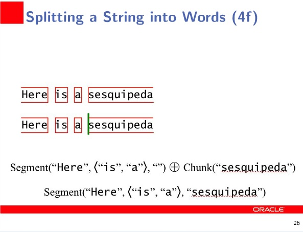

Okay, so if I can represent partial solutions using these chunk and segment data structures, the question is, can I now merge solutions to make bigger solutions? And the answer is yes. In fact, we will find that combining two segments or two chunks or a chunk and a segment will still be representable as either a chunk or a segment.

And I'm going to represent their combination with this Oplus operator. That represents the merging of two solutions. So in order to merge the segment from "Here is a " and the chunk "sesquipeda" in effect all I have to is take that chunk "sesquipeda" and have it become the right chunk of the segment. That will construct a new segment that matches the old segment, but has been updated with that chunk that is on the right.

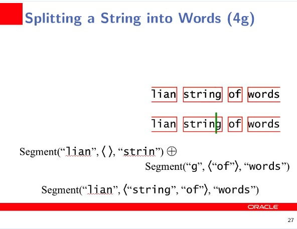

Similarly, to merge these two sub-solutions, I have two segments. And the trick is to take the right chunk of the first segment and the left chunk of the second segment, squish them together to make a word. Well, if it's not empty, it's a word, and then put that in the middle and append the lists together with that combined chunk in the middle.

So in this case, I combined two segments, "lian", <>, "strin", and the segment "g", the word "of", and the chunk "words", to make a new segment having a left chunk "lian", two words in the middle--"string", "of", and then this partial chunk words on the right.

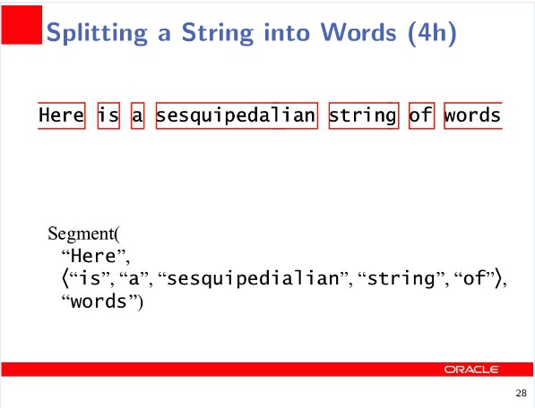

And then, finally, those partial - those two sub-solutions can then in turn be merged, and so we get a final solution that is a segment like this, and then we will need a fix-up on each side and declare the two chunks on either side in fact to be complete words, and we will get the final list of words, "Here", "is", "a", "sesquipedalian", "string", "of", "words".

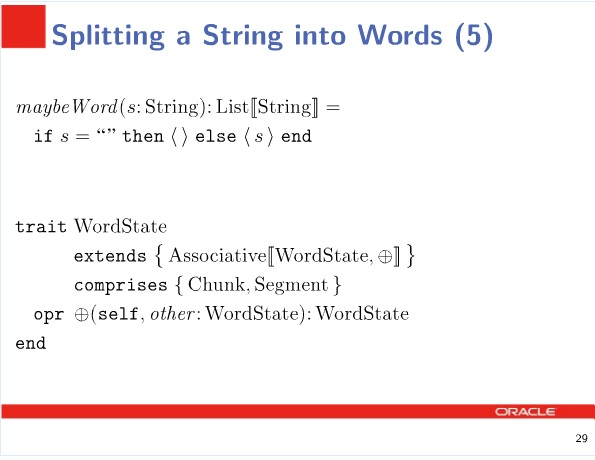

Okay, so that's the data structure. What does the code look like? I'm going to lead you through that in a few slides here. And the programming style may strike you as a little odd in some ways. It will also strike you as functional in style. I've chosen to use completely immutable data structures for this.

Although Fortress was originally designed as an object oriented framework in which to build an array style scientific programming language, we've in fact found it useful to build a variety of domain specific languages. And, as we've experimented with it and tried to get the parallelism going, we found ourselves pushed more and more in the direction of using immutable data structures in a functional style of programming.

And my Haskell fan friends, as I told you, why didn't you just start with Haskell. And I tell them, if I had known seven years ago what I know now, I would have started with Haskell and pushed it a tenth of the way toward Fortran instead of starting with Fortran and pushing it nine-tenths of the way towards Haskell. But this is where we've ended up, and that's why it's research.

[Audience laughter]

Okay, so I've taken the standard fix-up pattern and encoded it as a subroutine here called maybeWord. And its job is to take a string S and, if the string is empty, it returns an empty list. And otherwise it returns a list of S. In other words, it tells me whether or not S was a word by returning either an empty list or a list of that word a very common idiom in this style, so that sort of constructs a singleton kind of solution.

Now I'm going to define this trait, and for trait you can read the Java word interface. The only difference between a trait and an interface is that, in Fortress, a trait may contain method definitions, not just declarations. And you can inherent definitions through the interface hierarchy using multiple inheritances. Fortress is a multiple inheritance language. It's a multi-method dispatch language. And, in those ways, it differs and goes beyond Java.

So we have this trait called WordState. It declares an abstract, user defined, overloaded operator called Oplus whose job is to take myself and another WordState and make a new WordState. Okay, so this is a combining operator for merging solutions. WordState is the overall name of the data structure representing a partial solution to the problem. And it's got a couple of other declarations here. It says that WordState comprises chunk and segment. So chunk, as we will see, chunk implements WordState. Segment implements WordState. And, in fact, there aren't any other WordStates. These are the only immediate sub-types of WordState. And the main purpose of this declaration is that later when we have case statements, we will be able to tell that the case statement in fact provides an exhaustive enumeration of possibilities for WordState.

The other interesting declaration here is that WordState extends associative of WordState and Oplus. These traits may take parameters, static type parameters, and associative is one that takes another type as its parameter, as well as the name of an operator symbol. This is a declaration that says I guarantee that Oplus is in fact an associate operator. It algebraically behaves associatively. In other words, it doesn't matter how I group things when I combine them.

Well, it's okay for me to claim that. How does the compiler know that? Well, ideally I would like to be able to prove that as a theorem, but the technology isn't there yet, so in fact we rely on unit testing. And there's a whole other part of language I'm not going to go into now where you can provide test data and there's an automated test system that we'll use to provide test data and exhaustively check on the test data whether in fact the operator does in fact behave associatively. And that is done through property declarations that look very much like first order predicate calculus statements of the associated property, and that's enough mathematical buzzwords for today.

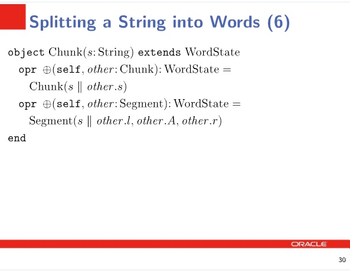

Okay. Here are the implementations of chunk and segment. Chunk is an object, and its constructor takes an argument, S, which is a string, which will become a field of the object in fact. And there are two implementations of Oplus. It is overloaded in much the same way that one might do in Java. I'm getting ahead of myself.

Okay. In order to combine yourself with another chunk, you just take your field S, the other guy's S, concatenate them together, and make a new chunk. In order to combine yourself a chunk with a segment, well, you construct a new segment in which you've taken your S and concatenated it onto the front of the other guy's left chunk, and then you use his list of words in his right chunk, and that's fine. Notice that S, L, A, and R are preserved in the same order. This is how you know you're preserving the sequence of the original input data.

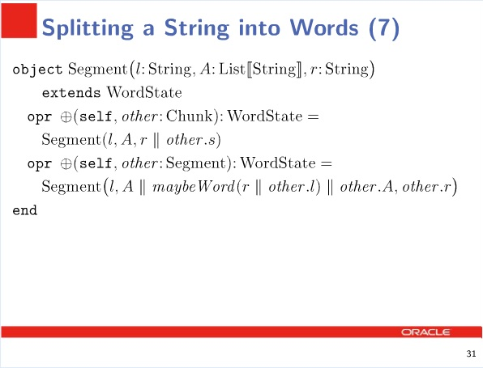

A segment has a left chunk L, a right chunk R, both of which are strings, and a middle list A, which is a list of strings. It also extends WordState. It has two implementations, two overloadings of Oplus.

In order to combine yourself a segment with a chunk, you need to take his string and concatenate it onto the right of your right chunk and then make a new segment. And in order to combine two segments down there at the bottom, you use the left chunk of the left hand segment that is yourself, the right-hand chunk of the other guy, and then you need to make a list of words in the middle consisting of your list, and then maybeWord in the middle, and then the other guy's list. And that maybeWord in the middle consists of your right chunk concatenated with his left chunk.

Once again, all the data is kept in the correct order, and you can see that by the textual order in the code. My L, my A, my R, the other guy's L, the other guy's A, the other guy's R all appear there in order in that line.

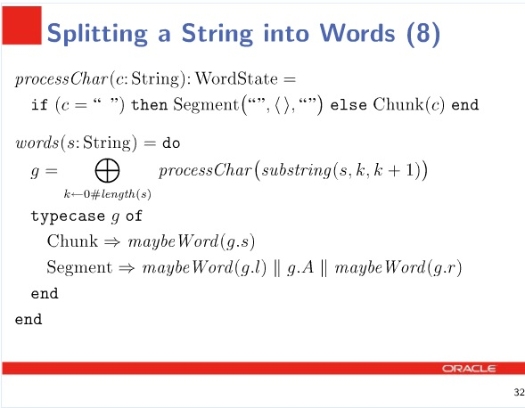

Okay. We're about to come to a finish here. One more little utility routine: I showed you that utility routine maybeWord that helps with the fix-ups at the end, and with the fix-up, when you combine new segments. There's also something we need to do at the beginning, which is to take the input characters and turn them into partial solutions. That is done by the subroutine process CHAR. It takes a character in the form of a singleton string and promises to return a WordState. If C is blank, then it returns an empty segment consisting of two empty chunks and an empty list. Otherwise it returns a chunk containing the non-blank character C, which represents this part, this word or partial world that is building up.

And here is the final solution. Words is the implementation of this solution. It takes the string S, and what does it do? Well, there's a funny line that comes next. Just as mathematicians use big sigma operators to add up a bunch of things, I am going to use BIG OPLUS to combine a bunch of solutions. So for every value of K, starting from zero and going to the length of the string, I am going to extract the sub-string at position K, just as I did in the sequential version, and then feed that character to process CHAR.

Now, one of the few things that the compiler knows about parallelism is that this body is going to be executed a number of times, and that all of its instances are permitted to be executed in parallel. So all the calls to process CHAR are considered independent, and it is a detail left to the implementation as to whether to execute it sequentially or in parallel depending upon the processor resources available.

Once we have processed all the characters into partial solutions, then we hit it with BIG OPLUS. And the other thing that the compiler knows - in fact this isn't in the compiler - this is actually built in library subroutines. I said the language is highly user extensible. In fact, this knowledge is built into libraries rather than into the compiler. But, BIG OPLUS, because it is associative, is entitled to use a binary tree strategy rather than a sequential strategy. And, therefore, all of the parallelism in this solution is in that one line of code. The parallel calls to process CHAR, and the building of the binary tree to merge the solutions pair wise all happens in that BIG OPLUS operator.

Then there's a fix-up at the end. We've got this final solution G, and we have to do this type case on G to find out whether it's a chunk or a segment. If it's a chunk, maybe it's a word, and we feed it to maybeWord. If it's a segment, then maybe it's left and right chunks of words. We feed those to maybeWord, concatenate them onto the list in the middle, and we're done. And because chunk and segment comprise WordState, as WordState comprises chunk and segment, we know that the type case doesn't need a default case. These are all the cases that can happen.

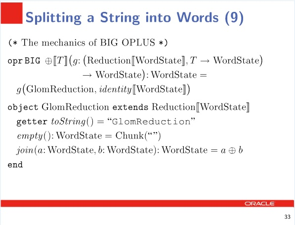

And then lastly, here are about eight lines of boilerplate needed for the definition of BIG OPLUS in terms of oplus. So that's it. That may seem like a lot of trouble to go to for such a simple problem, and it is for such a simple problem. But if you've got a problem where your data is much bigger, and the combining operations are much bigger, then it does make sense to think about building up partial solutions independently and then thinking about how you combine them. And this is the essence of MapReduce. I'm proposing you use MapReduce at all scales, not just at the big, honking, let's process terabytes of data scale.

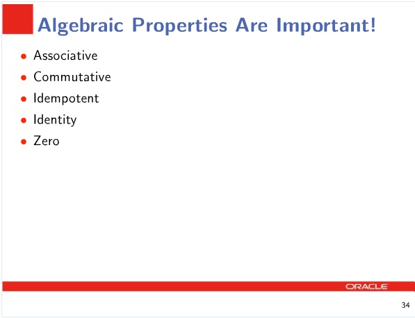

The other part of our message is that algebraic properties are important. I've talked a lot about associativity and things that we learn in an abstract algebra course, and some of these we actually encounter in high school, maybe even in grade school if you were sent though the new math curriculum, as my brother was. I narrowly escaped it. The idea is like associativity and commutativity and idempotent and identities and zeros of an operator are very important and people's eyes glaze over when I mention these five buzzwords.

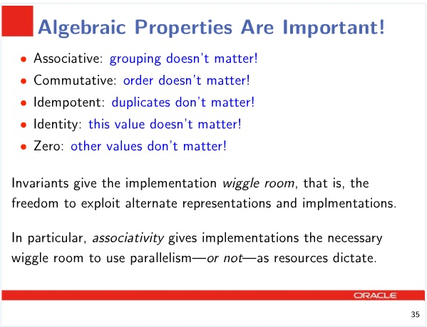

But they correspond to simple ideas that are actually extremely important to programmers. Associativity just means that grouping doesn't matter. You can parenthesize the expression any way you like and you'll still get the same answer. Knowing that is important.

Commutativity means the order doesn't matter. I can scramble then and I'll still get the same result. If I add up a bunch of numbers after scrambling them, still get the same answer.

Idempotent simply means duplicates don't matter. If you're taking the max of a bunch of numbers, it's okay if there are duplicates. You'll still get the same answer.

Identity means this value doesn't matter. You can afford to discard it and skip over it if you want to. Zero means other values don't matter. If you multiple a bunch of numbers and you've got a zero and "and," you can ignore all the others. That's the answer.

These invariants give an implementation wiggle room. That's the buzzword I would like you to takeaway today. Wiggle room for an implementation is an important idea. It's the freedom to exploit alternate representations and implementations. Not having an address-of operator in Java is what gives the garbage collector the wiggle room to reallocate memory as it sees fit. With C, you never can be sure if someone isn't going to take the address of some data structure or two data structures and play some awful game like XORing the addresses together and storing that somewhere and expecting to recover it later, which sounds stupid, but there are actually serious algorithms from the 1970s that made use of that trick storing two pointers in one word by XORing them and carefully having enough information on the side to reconstruct them. But a garbage collector is not going to understand that. That's the sort of pun that I exploited in the IBM 1130 code.

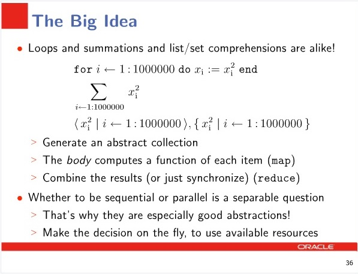

Associativity gives implementations the necessary wiggle room to use parallelism or not as resources dictate. So the big idea is that loops and summations and another thing like list or set comprehensions are really all alike. They generate an abstract collection. There is a body, which is a function, a callback function, if you will, that gets called for each element in the collection, and then you combine the results in some way, which might be just to synchronize before finishing loop, or it might be producing some result like a concatenated list or a sum of numbers.

Whether to be sequential or parallel is actually a separable and orthogonal question. And in fact, in Fortress, if you want to be sequential, you have to put that SEQ on the range. If you don't put SEQ, then the compiler feels entitled to use the parallel version. And that's why loops and summations and set comprehensions are such wonderful abstractions for parallel programming. They allow not just the compiler, but the runtime to make the decision on the fly based on available resources to decide whether to break up sub-problems in a linear fashion or in a divide-and-conquer fashion.

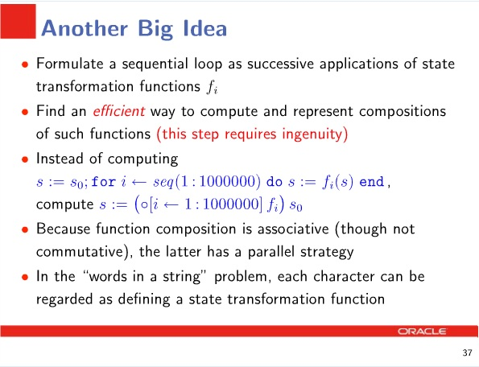

Now suppose you've got a sequential loop, and you just can't figure out how to make the iterations independent. Suppose that you really do have a bunch of state, and every iteration loop is doing a bunch of side effects on a bunch of variables. Well, here's a strategy. Gather together all the variables you're doing side effects on and consider them to be a state value. Now conceptualize the iterations of the loop as state alteration functions that transform one state into another.

And it might be a different function for different iterations of the loop. If the loop goes around a million times, you might have a million different functions. That's okay. But if you can find an efficient way to compute and represent compositions of these functions, and this step requires ingenuity, then as shown by the third bullet on this slide, instead of doing the computation, initialize the state as subzero, and then keep iteratively updating the state using iteration update function FsubI, as I goes from one to a million. Instead, you take the functions FsubI, and as I goes from one to a million, you compose them with BIG COMPOSE to get one monster function, which if you represented efficiently isn't so monster. And then you apply that composed function to Ssubzero and go directly to the final state in one step.

Because function composition is associative, this has a parallel strategy. And a lot of programs that I thought could not be parallelized in fact succumb to this technique. And in fact, in the words of a string problem, you can regard each input character as representing a state transformation function on my state variables: result and words. And depending what the character does, the state gets updated. And I found an efficient representation of those functions, namely the chunks and the segments, and found a way to compose them.

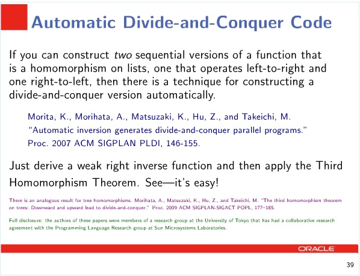

It gets even better than that. It turns out that if you have two sequential versions of a function, one goes left to right and the other goes right to left, and you organize it in a correct functional style, it can still be, use the accumulator strategy, but reorganized in a functional style so as to constitute what's technically called a list homomorphism. Then there's an automatic procedure where you can turn a crank and get the parallel divide and conquer version out. All you have to do is to derive a weak right inverse function and then apply the third homomorphism theorem. See, it's easy.

[Audience laughter]

And see the footnotes for the papers on that.

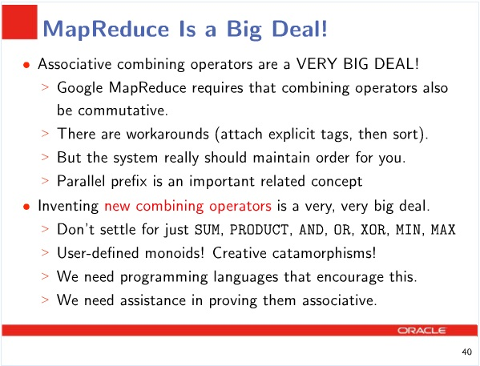

MapReduce is a really big deal. Associative combining operators are a very big deal. Now Google MapReduce requires that combining operators also be commutative, and that's okay because typically Google MapReduce is applied to data sets that are already unordered. But if a data set already has natural ordering, there is sometimes value in preserving that ordering. And it's important to realize that order will be preserved if you're combining operator is associative and if the implementation is careful with respecting the ordering.

Parallel prefix is an imported related concept. I'm not going to get into parallel prefix, but I just thought I'd mention that.

But the other thing I want to mention is the idea of inventing new combining operators, I think, is going to be an important paradigm in future programming for parallelism. A lot of parallel programming languages provide sort of the big six or seven: SUM, PRODUCT, logical AND, logical OR and XOR, and MIN and MAX. And they'll provide a way to find the max of an array or the sum over an array, but they don't provide a way to give parallel, user-defined operator over array because they can never quite be sure that user-defined operator is associative, which is what you need.

User defined monoids, that's a term from algebra that just means you have an associative operator with an identity.

Creative catamorphisms, so I'm not going to get into that either. These are mathematical buzzwords that refer to the fact that associative operators are a big deal, and I think we need programming languages that encourage this without using all the mathematical terminology and encourage programmers to realize just if you can give me the wiggle room and just make sure that the way I group things doesn't matter, then I can take care of the parallelism for you. Right? I think that's going to be an important mindset going forward.

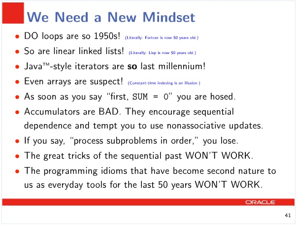

DO loops are so 1950s. Literally. Fortran is over 50 years old. Linear linked lists are so 1950s. Lisp is over 50 years old. Java style iterators are so last millennium. But all these are programming patterns that, if we use them, require us to state our programs in a style that are very hard to automatically parallelize.

As soon as you say, "Well, first I'll set sum to zero," you're already hosed. Accumulators are bad for parallelism. And I've really found, even when I'm using a program language that's designed to be sequential, it's really affecting my programming style. Just every time I say sum equals zero or word equals empty list, I stop and think, you know, is this really the way I want to express myself? Is this going to be hard to parallelize down the road? It really makes you stop and think.

If you say, "We'll process the problems in sub order," you lose. The great tricks of the sequential past are not going to work in the future. And the programming idioms that have become second nature to many of us, myself included, as everyday tools aren't going to work going forward if we want to take advantage of the multicore computers that are now ubiquitous.

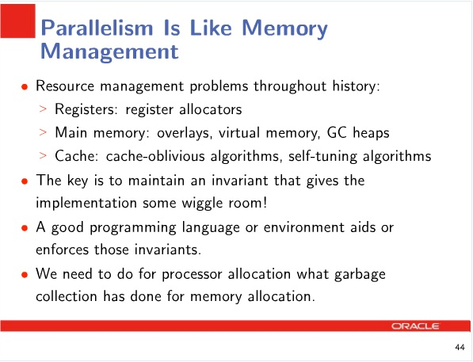

We need to get to the point where parallelism is like memory management. I referred to resource management problems throughout history, registers and register allocators. The register declaration in C is an excellent example. When C was first nascent in an earlier language called B that was being done on a PDP-7, that was another one of those one-accumulator machines.

C came along and was implemented on the PDP-11. It had eight registers. And you could get better performance by telling the compiler, gee, if you just put these two variables in registers, you'll save a lot of memory traffic. And so the better compilers observed the register declarations and allowed the programmer to thereby get more performance out of their code.

Then it reached a point in the 1980s, and I was working for a compiler construction company in those days. And we realized at that point that only the mediocre compilers were using the register declarations. The stupid ones were ignoring them, as before, and the really smart ones were also ignoring them because their register allocators did a much better job than a programmer could do just by decorating his declarations with the word register. And we reached that point where we really don't much bother with register declarations anymore, except in very special circumstances, because the register allocation algorithms have gotten so good, they're better than any human programmer nearly always.

Similarly for main memory, we rely on garbage collectors, virtual memory. In order for caches, people spend a lot of time worrying about the effects of caches on their code. And for very highly performance critical applications, you still worry about that. But for the bulk of things, we can either use cache oblivious algorithms, self-tuning algorithms such as FFTW, or just ignore the issue because the processors are fast enough.

But the key is to maintain an invariant that gives the implementation wiggle room. And a good programming language environment will aid or encourage or enforce those invariants. One of the advantages of Java over C is it doesn't even have a register declaration. You don't even have to worry about that issue. It doesn't have an address operator, so you can't even raise the issue of whether you're playing games with the addresses. It uses automatic memory management, so you're not worried about, "Did I leave a pointer dangling?" Just those things are taken care of for you now.

We need to do for parallelism what - what memory management has done for data allocation, we need to do for processor allocation, so we don't need to worry about the processors anymore.

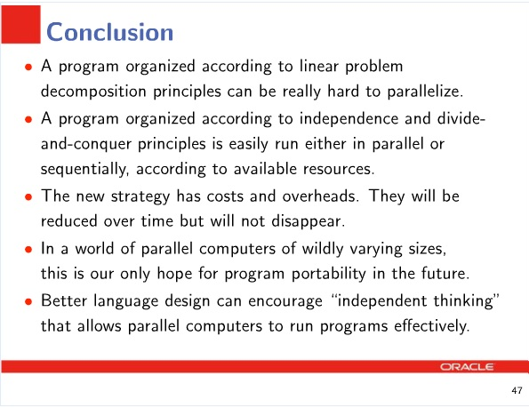

So, to conclude, I believe that a program organized according to linear problem decomposition principles of which the accumulator design pattern is a significant hallmark, those sorts of programs can be really hard to parallelize. A program organized according to independence, having a programming language that makes it easy to say which computations are independent, and being able to talk about combining operations in which grouping doesn't matter, these divide and conquer principles make for code that is easily run, either in parallel or sequentially, according to what resources are available at runtime.

This new strategy does have costs and overheads related to the current way of doing business, just as garbage collectors have costs and overheads related to the way of doing business before that. We have come to accept those costs and overheads because they free us to focus on what's really important, which is getting the problem done, you know, whatever they are--the business rules, the scientific algorithm--and not worry about the details of managing the computer.

I believe that in a world of parallel computers of wildly varying sizes, which is about to hit us in the face, this will be our only hope for program portability in the future. And as a programming language designer, I hope that better language design can encourage the necessary kind of independent thinking that will allow parallel computers to run programs effectively.

That's the end of my story. Thank you very much.

[Audience applause]